# Houston Severe Weather - August 13, 2013 ***

> Source: <http://www.weather.gov/media/zhu/ZHU_Training_Page/Event_Writeups/Aug_13_2013_Case_Study.ppsx>  
> Section: ZHU Weather Event Reviews  
> Captured: 2026-08-19 06:00 UTC  
> Format: PowerPoint show (12 slides). PDF: [houston-severe-weather-august-13-2013.pdf](houston-severe-weather-august-13-2013.pdf) · Original: [source/Aug_13_2013_Case_Study.ppsx](source/Aug_13_2013_Case_Study.ppsx)

---

## Slide 1

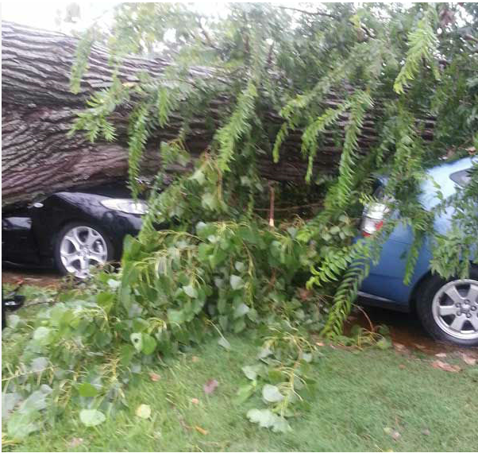
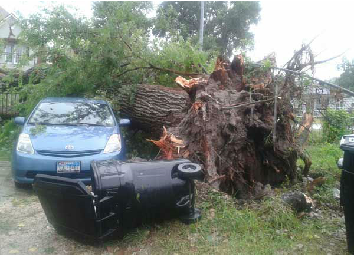
- Houston Severe Weather Event August 16, 2013
- Photos courtesy of KTRK Channel 13 Houston

## Slide 2

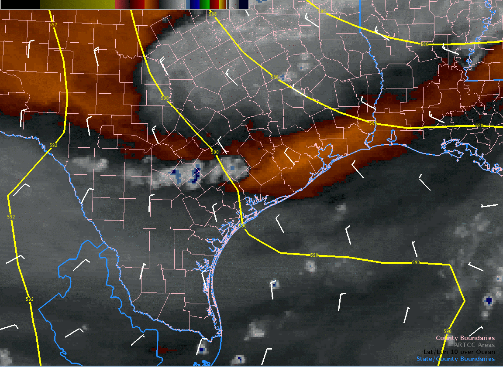
- Very dry conditions in the
- mid-upper levels as the shortwave trough approaches
- (increasing risk of downburst winds)
- Water Vapor Imagery (RAMSDIS Color)

## Slide 3

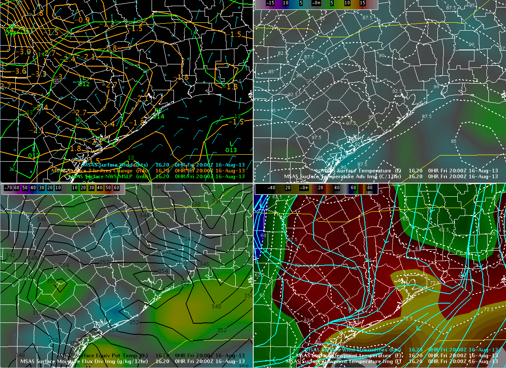
- Thermal trough
- Moisture axis
- Surface theta-e ridge
- MSAS Analysis (20Z-23Z)
- Temperature
- Dewpoint Temperature

## Slide 4
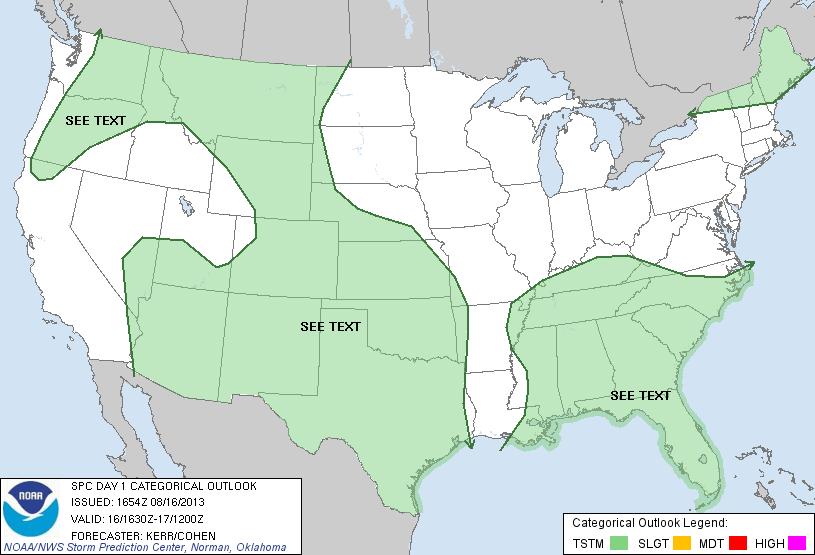

- SPC Day 1 Categorical Outlook

## Slide 5

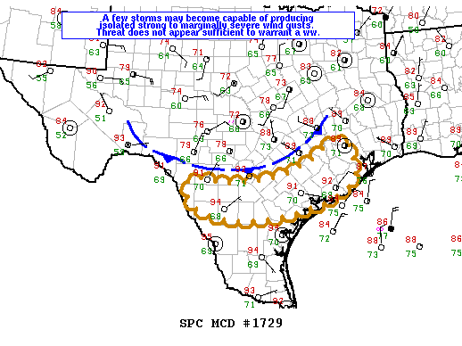
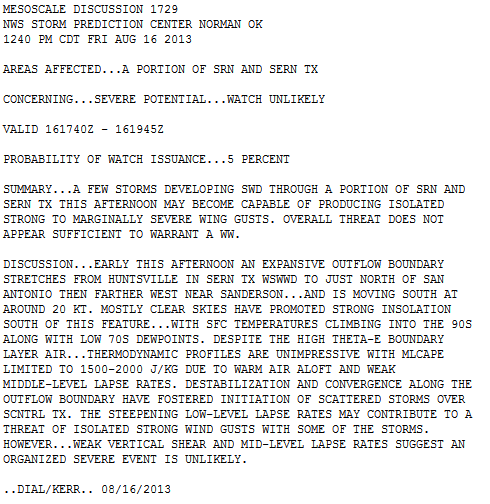
- SPC Mesoscale
- Discussion 1729

## Slide 6

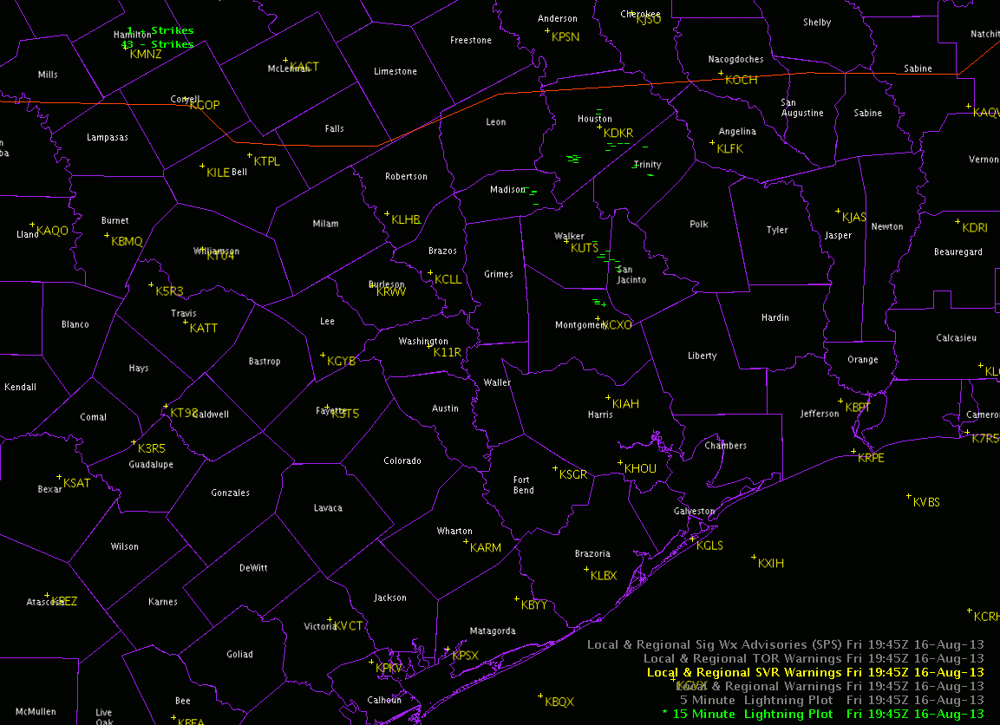
- 15 Minute Lightning Data(20Z-00Z)

## Slide 7

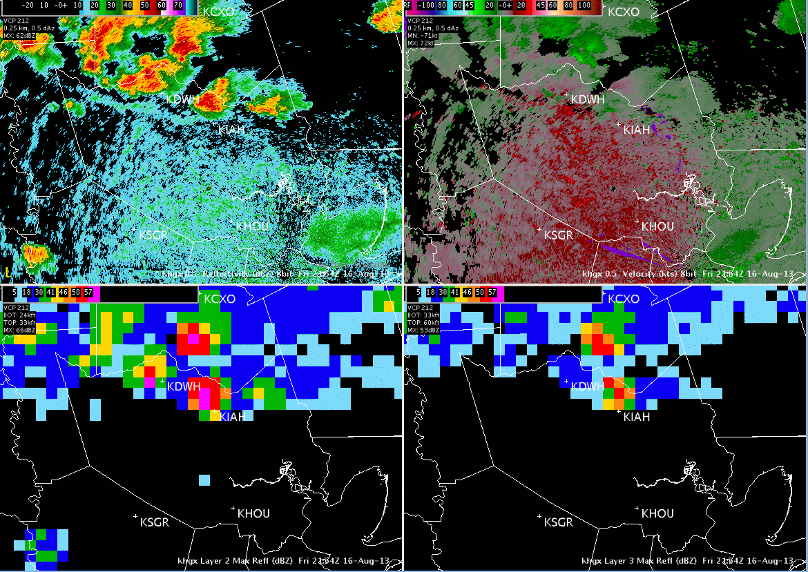
- KHGX 0.5 Velocity
- KHGX 0.5 Reflectivity
- KHGX Layer 3 Max Refl
- KHGX Layer 2 Max Refl
- Microburst at KIAH (around 20Z)

## Slide 8
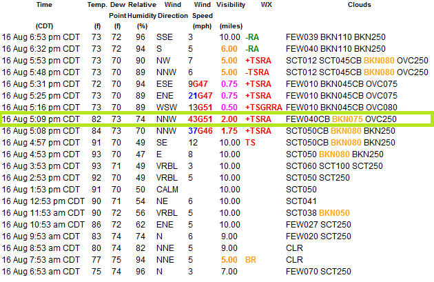

- Weather Observations for:Houston, Houston Intercontinental Airport

## Slide 9

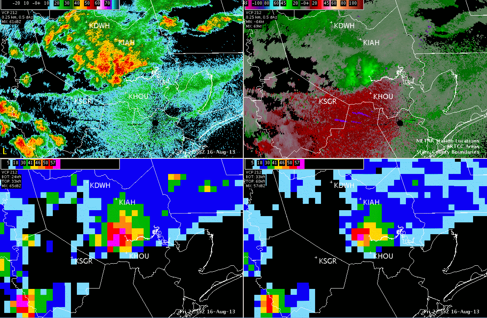
- KHGX 0.5 Velocity
- KHGX 0.5 Reflectivity
- KHGX Layer 3 Max Refl
- KHGX Layer 2 Max Refl
- Microburst at KHOU (around 2315Z)

## Slide 10

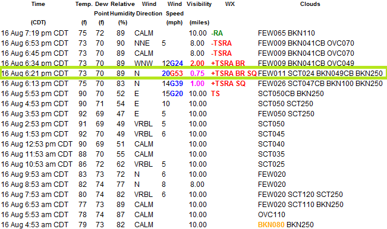
- Weather Observations for:Houston, Houston Hobby Airport

## Slide 11

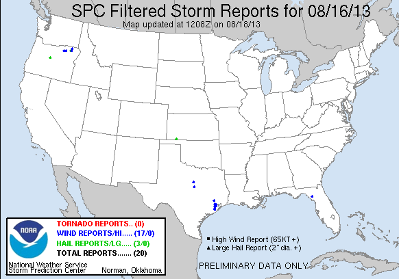
- Storm (Wind) Reports

## Slide 12

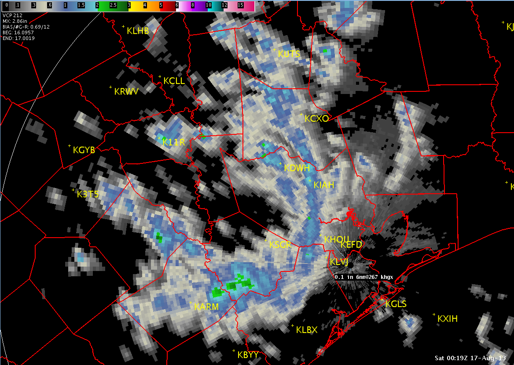
- Storm Total Precipitation
- BEG: 16 0957Z
- END: 17 0019Z
- Storm Track
