# Low-CAPE / High-Shear(LCHS) Event across ZHU Air Space

> Source: <http://www.weather.gov/media/zhu/ZHU_Training_Page/Event_Writeups/Low_CAPE_High_Shear_Event.pdf>  
> Section: ZHU Weather Event Reviews  
> Captured: 2026-08-19 06:00 UTC  
> PDF: [low-cape-high-shear-lchs-event-across-zhu-air-space.pdf](low-cape-high-shear-lchs-event-across-zhu-air-space.pdf) (18 pages)

---

## Page 1

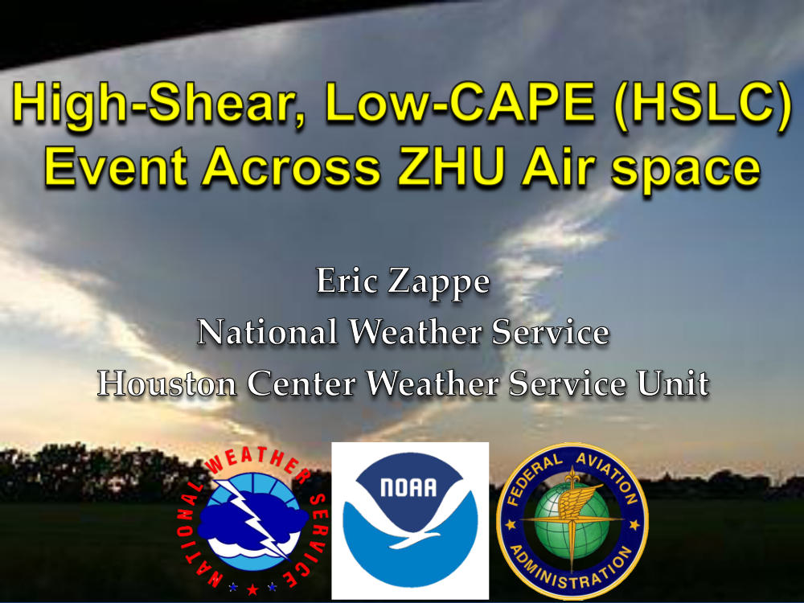

HighHigh
--Shear, LowShear, Low
--CAPE (HSLC) CAPE (HSLC) 
Event Across ZHU Air spaceEvent Across ZHU Air space
  
Eric Zappe
 
National Weather Service
 
Houston Center Weather Service Unit

## Page 2

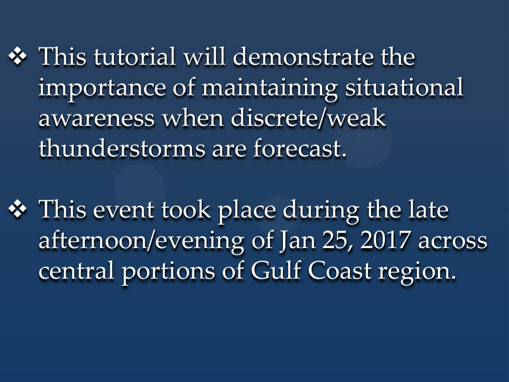

This tutorial will demonstrate the importance of maintaining situational awareness when discrete/weak thunderstorms are forecast.
 
 This event took place during the late afternoon/evening of Jan 25, 2017 
across 
central portions of Gulf Coast region. 
 
 
This tutorial will demonstrate the 
importance of maintaining situational 
awareness when discrete/weak 
thunderstorms are forecast. 
 
This event took place during the late 
afternoon/evening of Jan 25, 2017 across 
central portions of Gulf Coast region.

## Page 3

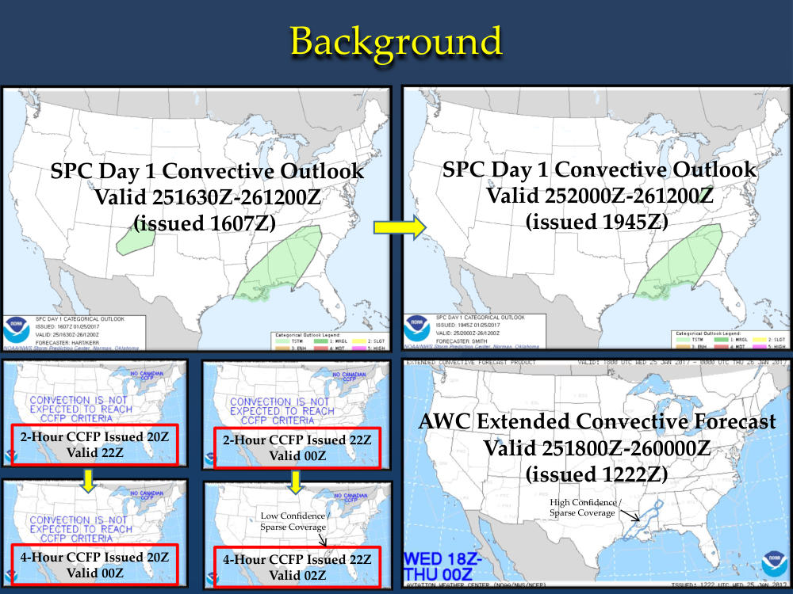

Background
 
Background 
SPC Day 1 Convective Outlook 
Valid 251630Z-261200Z 
(issued 1607Z)  
SPC Day 1 Convective Outlook 
Valid 252000Z-261200Z 
(issued 1945Z)  
2-Hour CCFP Issued 20Z 
Valid 22Z 
2-Hour CCFP Issued 22Z 
Valid 00Z 
4-Hour CCFP Issued 22Z 
Valid 02Z 
Low Confidence / 
Sparse Coverage 
AWC Extended Convective Forecast  
Valid 251800Z-260000Z 
(issued 1222Z)  
4-Hour CCFP Issued 20Z 
Valid 00Z 
High Confidence / 
Sparse Coverage

## Page 4

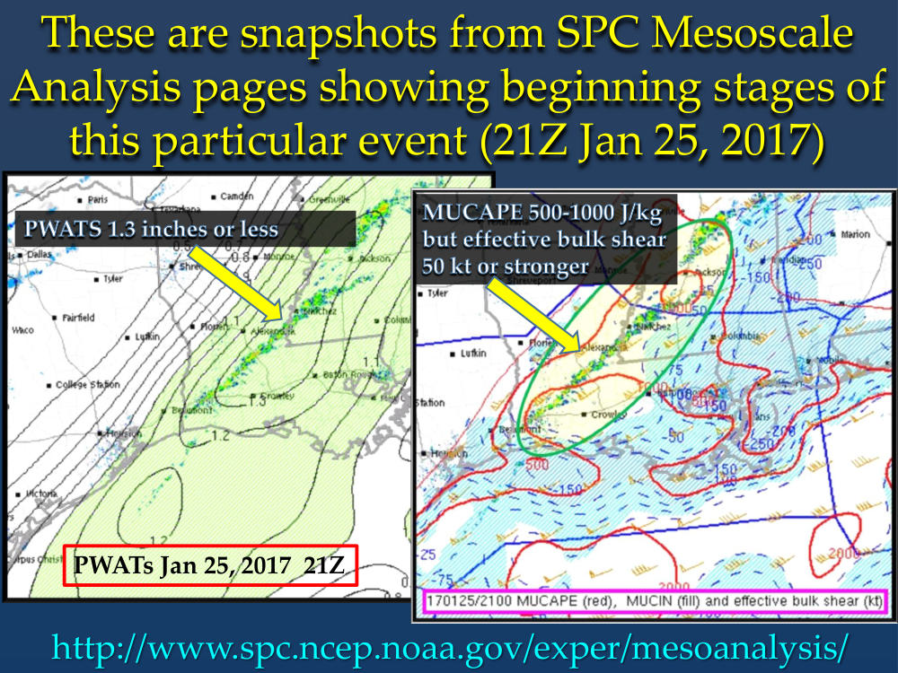

These are snapshots from SPC Mesoscale this particular event (21Z Jan 25, 2017)
 
These are snapshots from SPC Mesoscale 
Analysis pages showing beginning stages of 
this particular event (21Z Jan 25, 2017) 
http://www.spc.ncep.noaa.gov/exper/mesoanalysis/
 
http://www.spc.ncep.noaa.gov/exper/mesoanalysis/ 
PWATS 1.3 inches or less
 
MUCAPE 500
-1000 J/kg
 
but effective bulk shear 50 kt or stronger
 
PWATs Jan 25, 2017  21Z

## Page 5

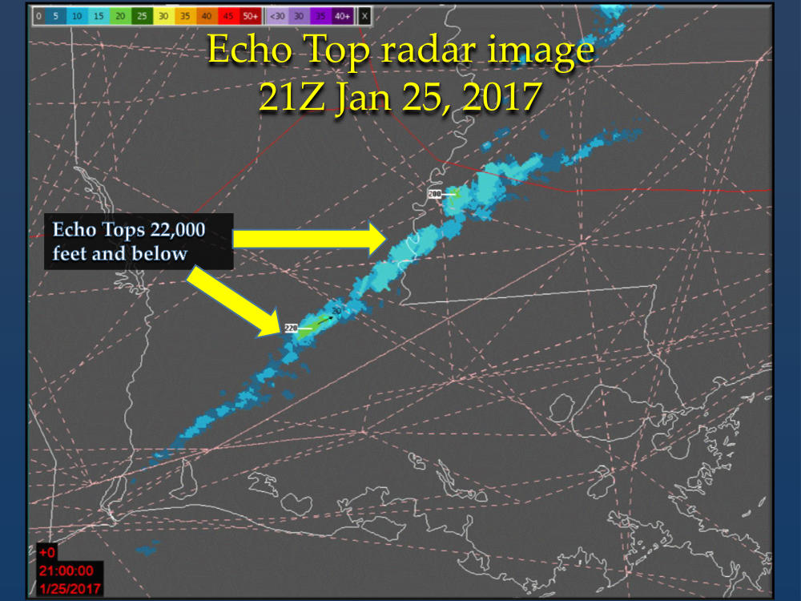

Echo Top radar image  
 
21Z Jan 25, 2017
 
Echo Top radar image   
21Z Jan 25, 2017 
Echo Tops 22,000 
 
feet and below

## Page 6

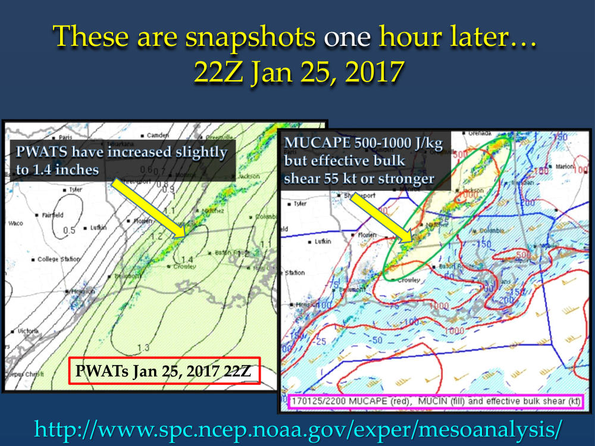

These are snapshots 
one
 hour later…
 
 22Z Jan 25, 2017
 
These are snapshots one hour later… 
 22Z Jan 25, 2017 
850
 
http://www.spc.ncep.noaa.gov/exper/mesoanalysis/
 
http://www.spc.ncep.noaa.gov/exper/mesoanalysis/ 
PWATs Jan 25, 2017 22Z 
PWATS have increased slightly to 1.4 inches
 
MUCAPE 500
-1000 J/kg
 
but effective bulk shear 55 kt or stronger

## Page 7

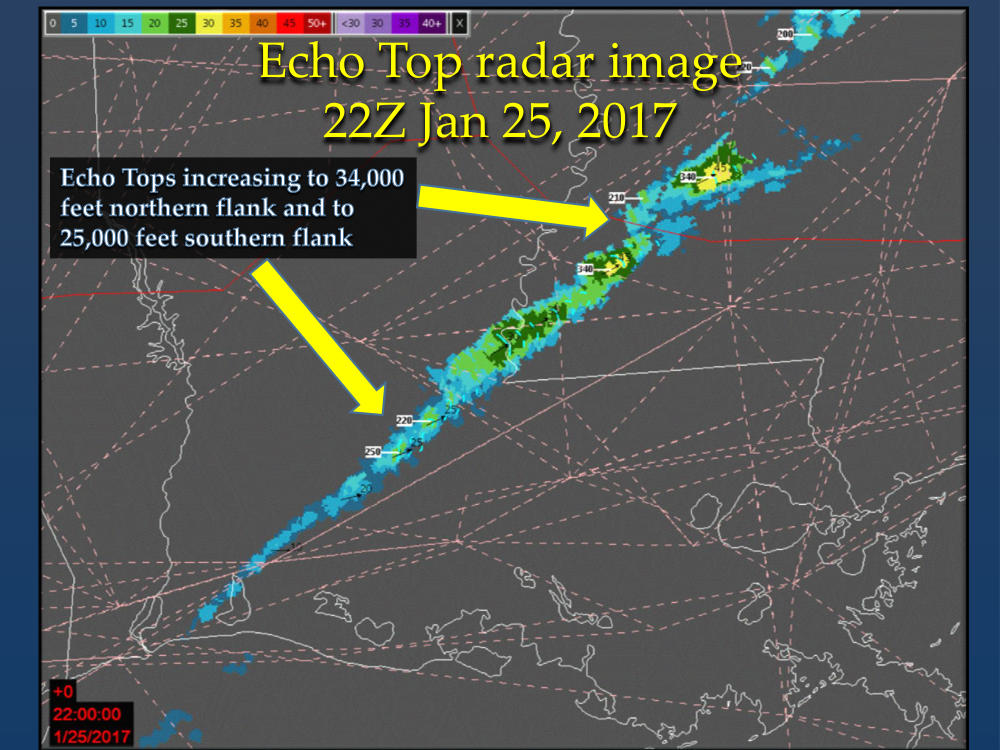

Echo Top radar image 
 
22Z Jan 25, 2017
 
Echo Top radar image  
22Z Jan 25, 2017 
Echo Tops increasing to 34,000 feet northern flank and to 25,000 feet southern flank

## Page 8

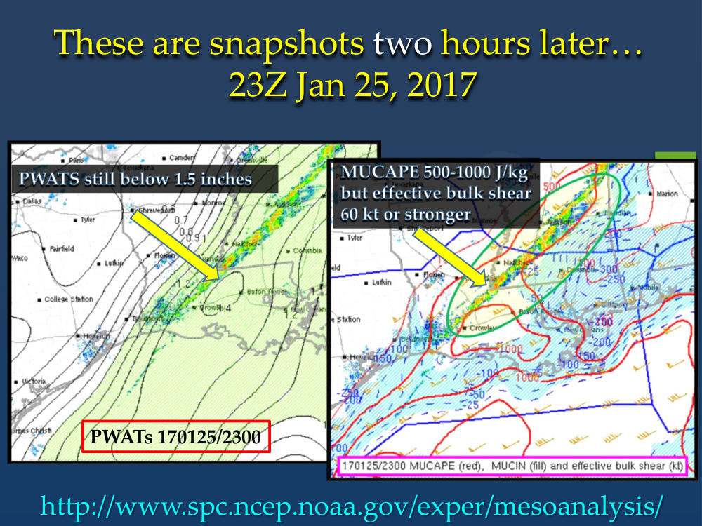

These are snapshots 
two
 hours later…
 
 23Z Jan 25, 2017
 
These are snapshots two hours later… 
 23Z Jan 25, 2017 
850
 
http://www.spc.ncep.noaa.gov/exper/mesoanalysis/
 
http://www.spc.ncep.noaa.gov/exper/mesoanalysis/ 
PWATs 170125/2300 
PWATS still below 1.5 inches
 
MUCAPE 500
-1000 J/kg
 
but effective bulk shear 60 kt or stronger

## Page 9

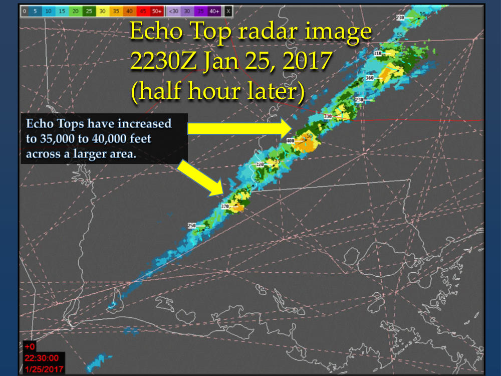

Echo Top radar image 
 
                    
2230Z Jan 25, 2017
 
                    
(half hour later)
 
Echo Top radar image  
                    2230Z Jan 25, 2017 
                    (half hour later) 
Echo Tops have increased to 35,000 to 40,000 feet across a larger area.

## Page 10

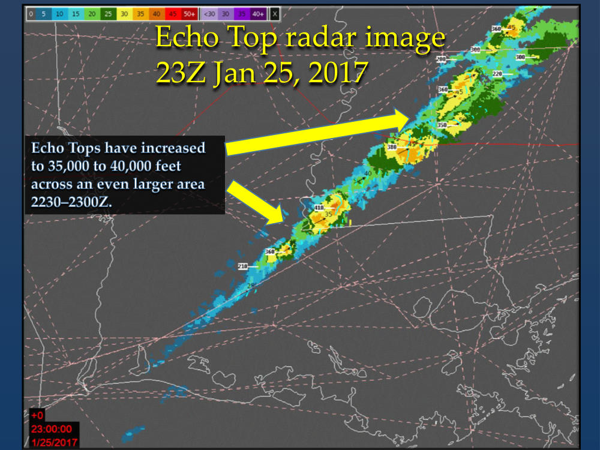

Echo Top radar image 
 
                    
23Z Jan 25, 2017
 
                    
 
Echo Top radar image  
                    23Z Jan 25, 2017 
                     
Echo Tops have increased to 35,000 to 40,000 feet across an even larger area 2230
– 2300Z.

## Page 11

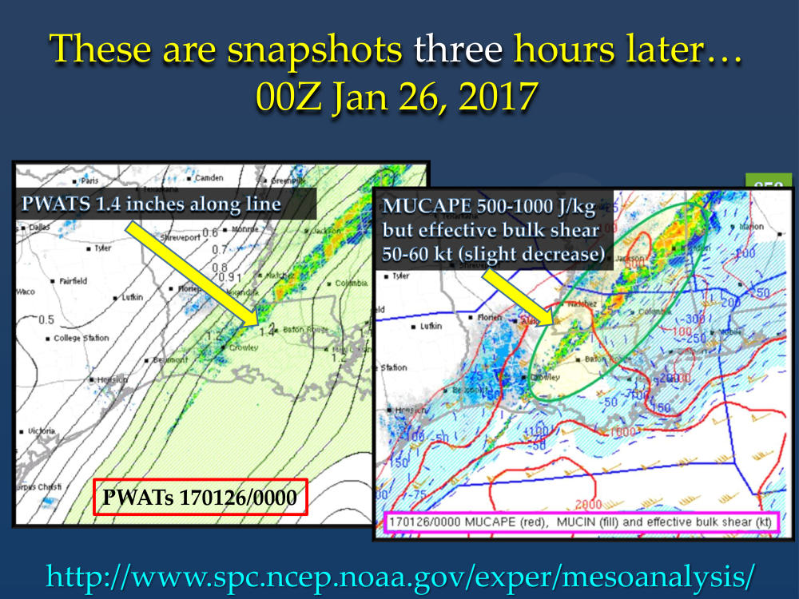

These are snapshots 
three
 hours later…
 
00Z Jan 26, 2017
 
These are snapshots three hours later… 
00Z Jan 26, 2017 
850
 
http://www.spc.ncep.noaa.gov/exper/mesoanalysis/
 
http://www.spc.ncep.noaa.gov/exper/mesoanalysis/ 
PWATs 170126/0000 
PWATS 1.4 inches along line
 
MUCAPE 500
-1000 J/kg
 
but effective bulk shear 50 -60 kt (slight decrease)

## Page 12

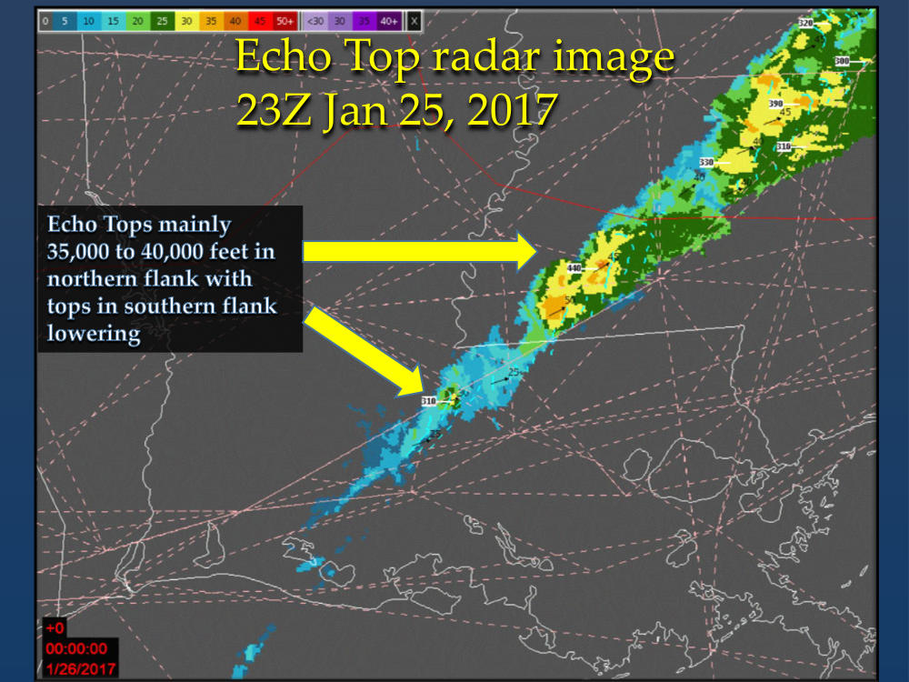

Echo Top radar image 
 
                    
23Z Jan 25, 2017
 
                    
 
Echo Top radar image  
                    23Z Jan 25, 2017 
                     
Echo Tops mainly 35,000 to 40,000 feet in northern flank with tops in southern flank lowering

## Page 13

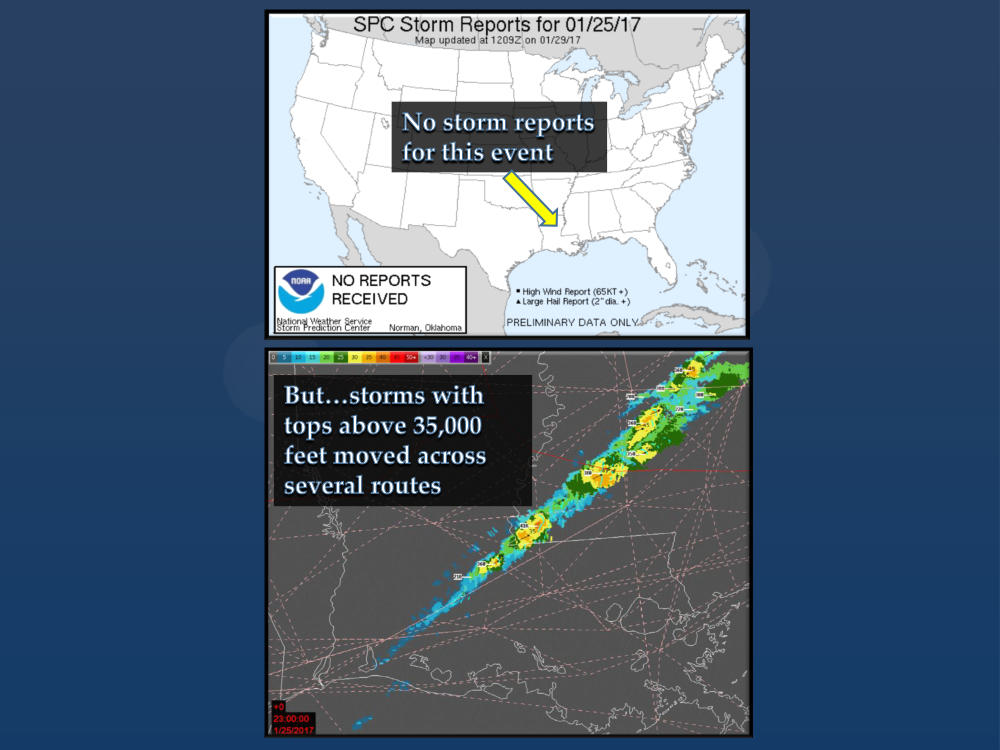

No storm reports for this event
 
But…storms with tops above 35,000 feet moved across several routes

## Page 14

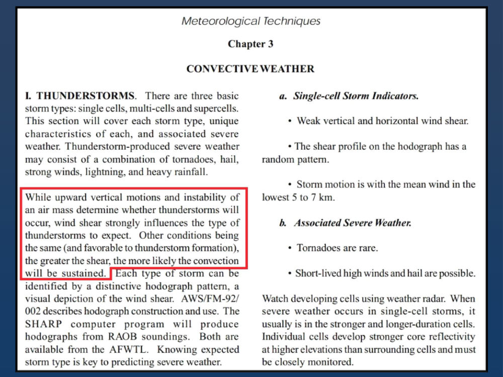

_(no extractable text on this page — see rendered image above)_

## Page 15

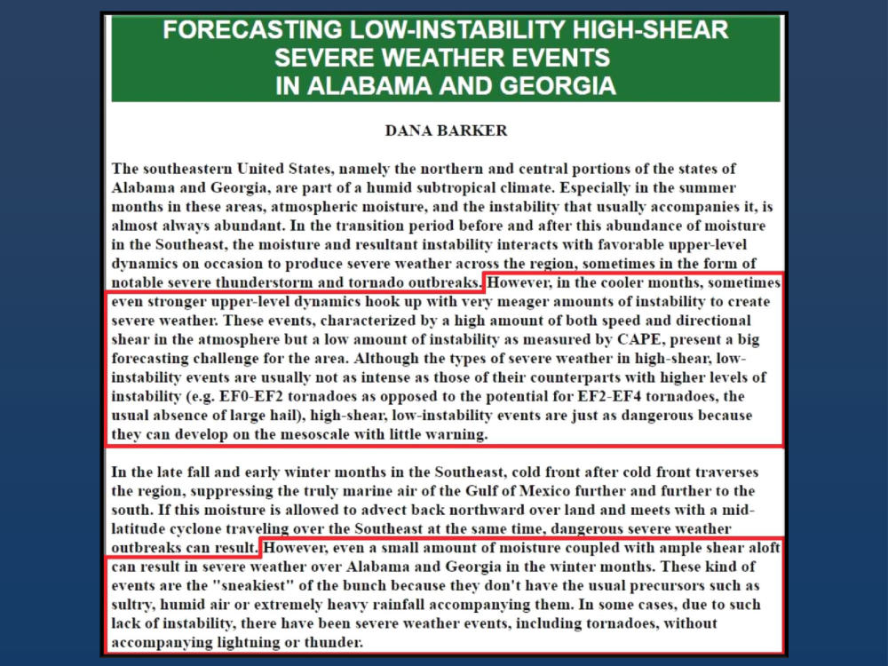

_(no extractable text on this page — see rendered image above)_

## Page 16

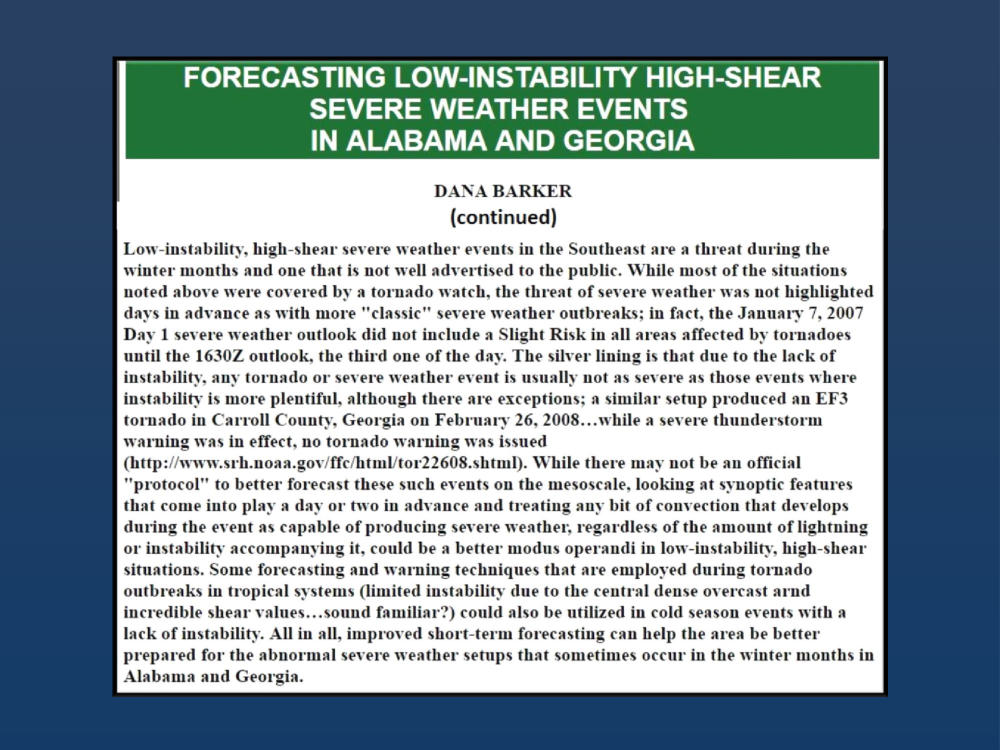

_(no extractable text on this page — see rendered image above)_

## Page 17

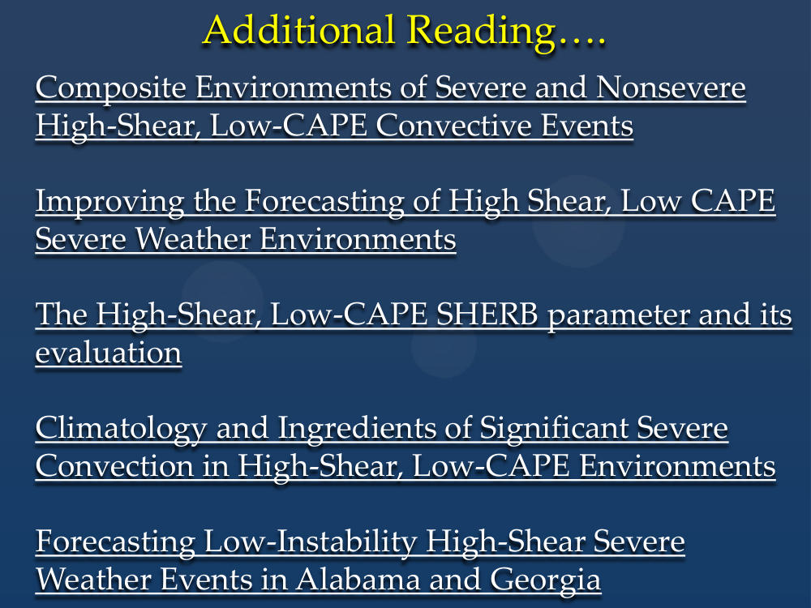

Additional Reading….
 
Additional Reading…. 
 
 
 
 
Composite Environments of Severe and Nonsevere 
High-Shear, Low-CAPE Convective Events 
 
Improving the Forecasting of High Shear, Low CAPE 
Severe Weather Environments 
 
The High-Shear, Low-CAPE SHERB parameter and its 
evaluation 
 
Climatology and Ingredients of Significant Severe 
Convection in High-Shear, Low-CAPE Environments 
 
Forecasting Low-Instability High-Shear Severe 
Weather Events in Alabama and Georgia

## Page 18

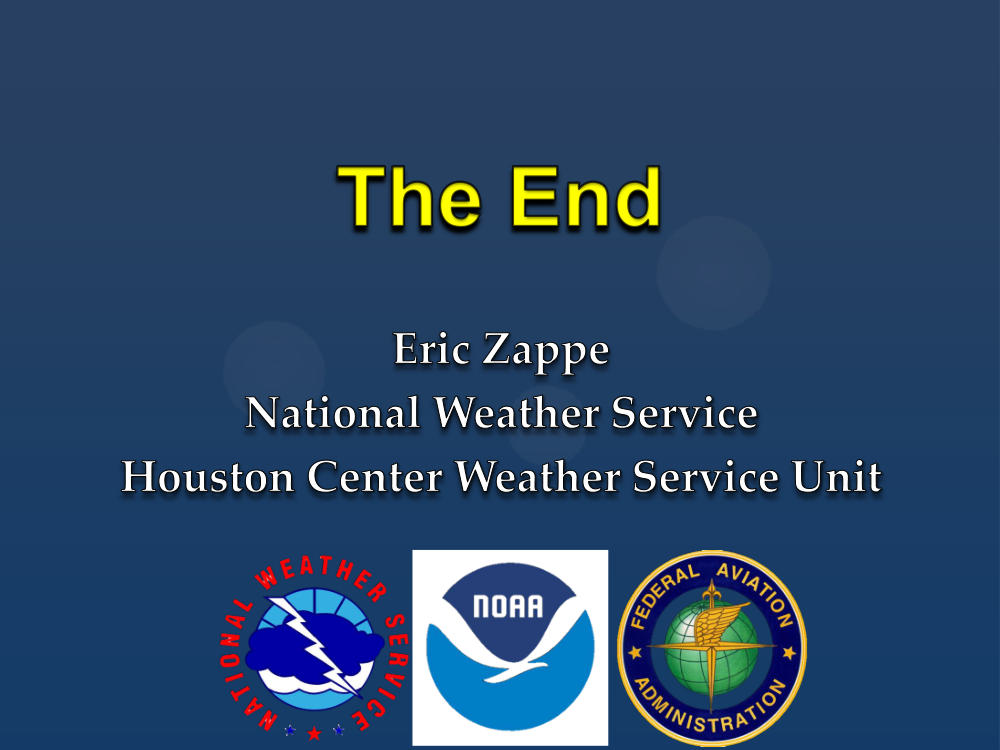

The EndThe End
  
Eric Zappe
 
National Weather Service
 
Houston Center Weather Service Unit
