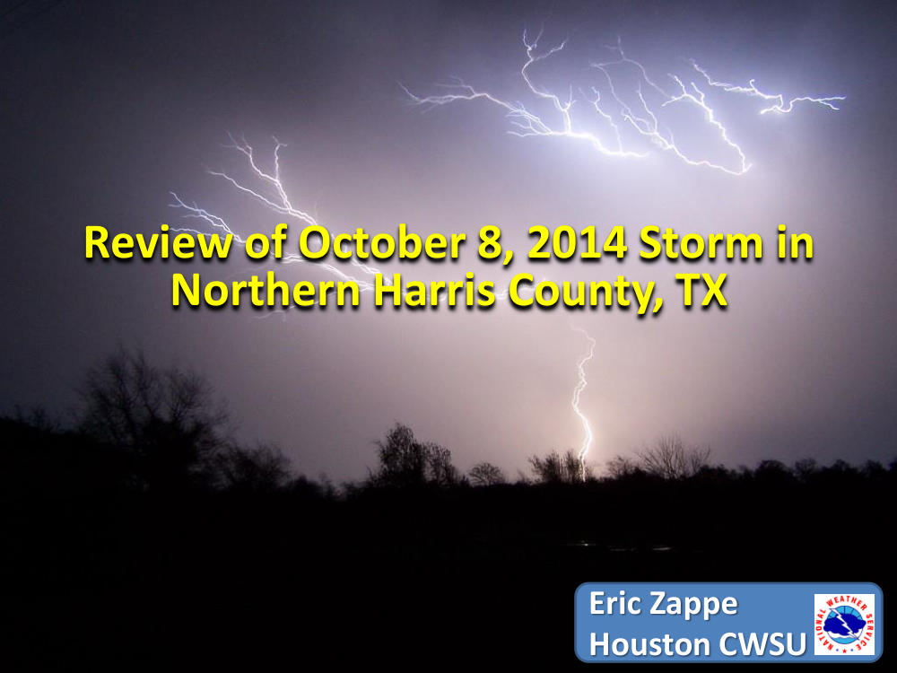
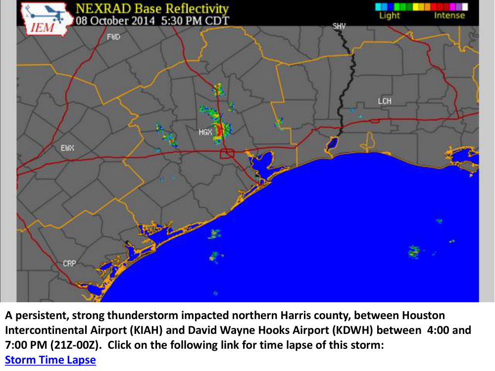
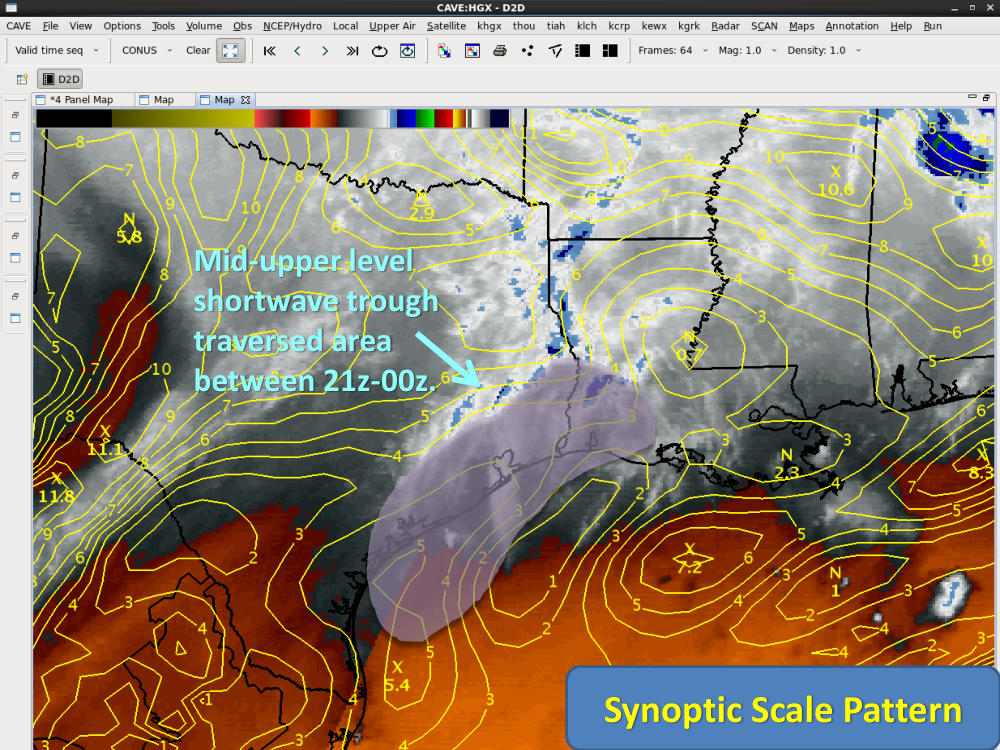
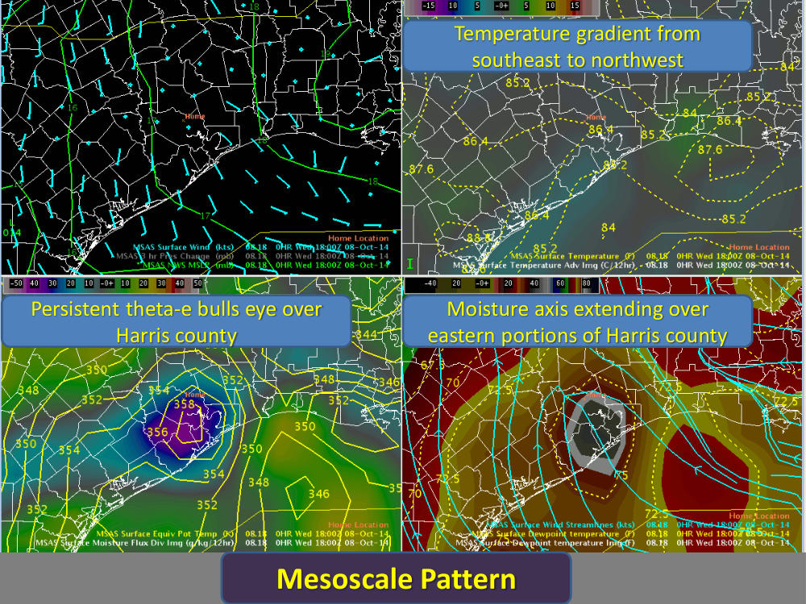
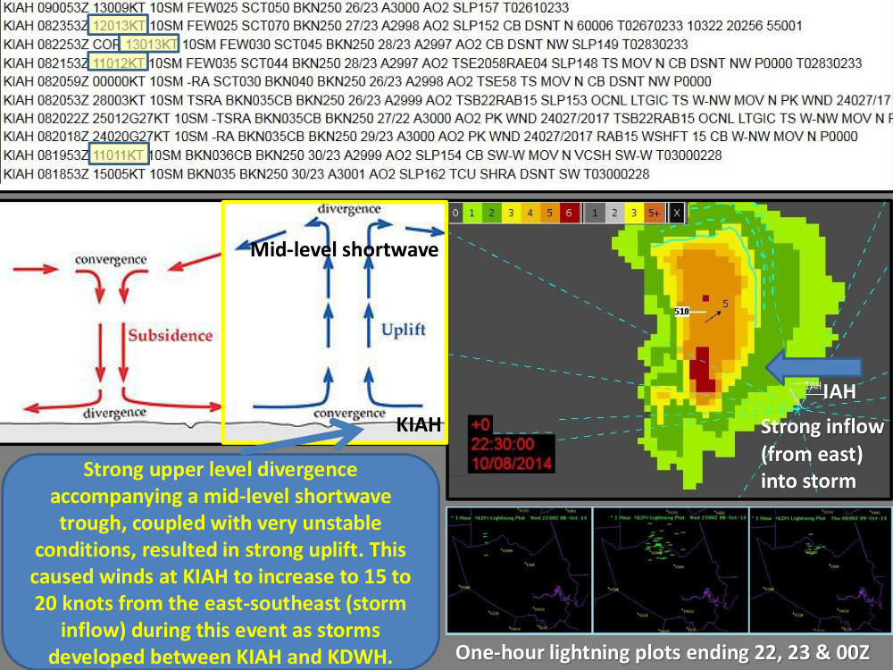
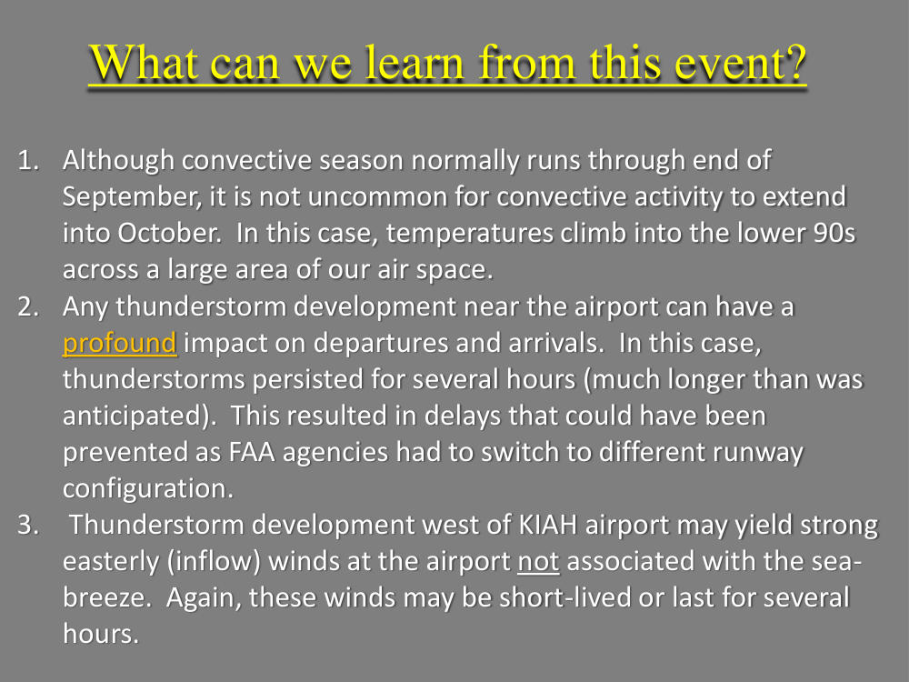

# Persistent Strong Thunderstorms West of KIAH - Oct 8, 2014

> Source: <http://www.weather.gov/media/zhu/ZHU_Training_Page/Event_Writeups/October_8_2014_Case_Study.pdf>  
> Section: ZHU Weather Event Reviews  
> Captured: 2026-08-19 06:00 UTC  
> PDF: [persistent-strong-thunderstorms-west-of-kiah-oct-8-2014.pdf](persistent-strong-thunderstorms-west-of-kiah-oct-8-2014.pdf) (6 pages)

---

## Page 1

Eric Zappe
 
Houston CWSU
 
Eric Zappe 
Houston CWSU 
Review of October 8, 2014 Storm in Northern Harris County, TX
 
Review of October 8, 2014 Storm in 
Northern Harris County, TX

## Page 2

A persistent, strong thunderstorm impacted northern Harris county, between Houston  
Intercontinental Airport (KIAH) and David Wayne Hooks Airport (KDWH) between  4:00 and 
7:00 PM (21Z-00Z).  Click on the following link for time lapse of this storm: 
Storm Time Lapse

## Page 3

Mid
-upper level shortwave trough traversed area  between 21z
-00z.
 
Mid-upper level 
shortwave trough 
traversed area  
between 21z-00z. 
Synoptic Scale Pattern 
 
Synoptic Scale Pattern

## Page 4

Mesoscale Pattern 
 
Mesoscale Pattern  
Persistent theta
-e bulls eye over Harris county
 
Persistent theta-e bulls eye over 
Harris county 
Moisture axis extending over eastern portions of Harris county
 
Moisture axis extending over 
eastern portions of Harris county 
Temperature gradient from southeast to northwest
 
Temperature gradient from 
southeast to northwest

## Page 5

IAH 
IAH 
Strong inflow (from east) into storm
 
Strong inflow 
(from east) 
into storm 
Mid-level shortwave  
Strong upper level divergence 
accompanying a mid-level shortwave 
trough, coupled with very unstable 
conditions, resulted in strong uplift. This 
caused winds at KIAH to increase to 15 to 
20 knots from the east-southeast (storm 
inflow) during this event as storms 
developed between KIAH and KDWH. 
One
-hour lightning plots ending 22, 23 & 00Z
 
One-hour lightning plots ending 22, 23 & 00Z 
KIAH

## Page 6

What can we learn from this event? 
1. Although convective season normally runs through end of September, it is not uncommon for convective activity to extend into October.  In this case, temperatures climb into the lower 90s across a large area of our air space.
 
2. Any thunderstorm development near the airport can have a profound
 impact on departures and arrivals.  In this case, thunderstorms persisted for several hours (much longer than was anticipated).  This resulted in delays that could have been prevented as FAA agencies had to switch to different runway configuration. 
 
3. Thunderstorm development west of KIAH airport may yield strong easterly (inflow) winds at the airport 
not associated with the sea
-
breeze.  Again, these winds may be short
-lived or last for several 
hours.  
 
1. Although convective season normally runs through end of 
September, it is not uncommon for convective activity to extend 
into October.  In this case, temperatures climb into the lower 90s 
across a large area of our air space. 
2. Any thunderstorm development near the airport can have a 
profound impact on departures and arrivals.  In this case, 
thunderstorms persisted for several hours (much longer than was 
anticipated).  This resulted in delays that could have been 
prevented as FAA agencies had to switch to different runway 
configuration.  
3. Thunderstorm development west of KIAH airport may yield strong 
easterly (inflow) winds at the airport not associated with the sea-
breeze.  Again, these winds may be short-lived or last for several 
hours.
