# Record Heat/Severe Weather - August 11, 2015 ***

> Source: <http://www.weather.gov/media/zhu/ZHU_Training_Page/Event_Writeups/August_11_2015_Case_Study.ppsx>  
> Section: ZHU Weather Event Reviews  
> Captured: 2026-08-19 06:00 UTC  
> Format: PowerPoint show (17 slides). PDF: [record-heat-severe-weather-august-11-2015.pdf](record-heat-severe-weather-august-11-2015.pdf) · Original: [source/August_11_2015_Case_Study.ppsx](source/August_11_2015_Case_Study.ppsx)

---

## Slide 1: Review of August 11, 2015 Severe Weather Event

- Eric Zappe
- National Weather Service
- Houston Center Weather Service Unit

## Slide 2
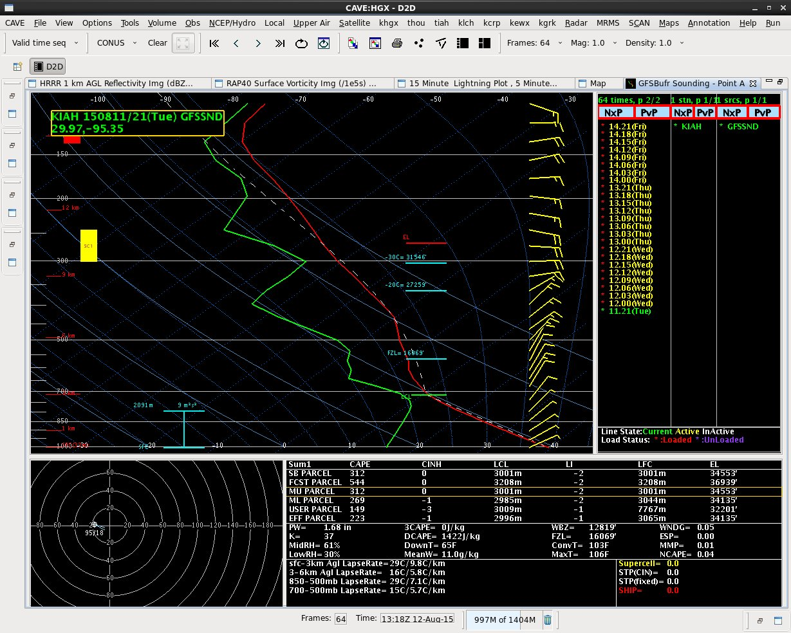
- GFS BUFR Sounding – KIAH (Aug 11 21Z)
- Large pockets of dry air will favor strong downburst type winds (including Inverted-V sounding in lowest 10,000 ft)
- NOTE: Surface temp of 105
- Elevated DCAPE reading
- Click Here for
- DCAPE Study

## Slide 3
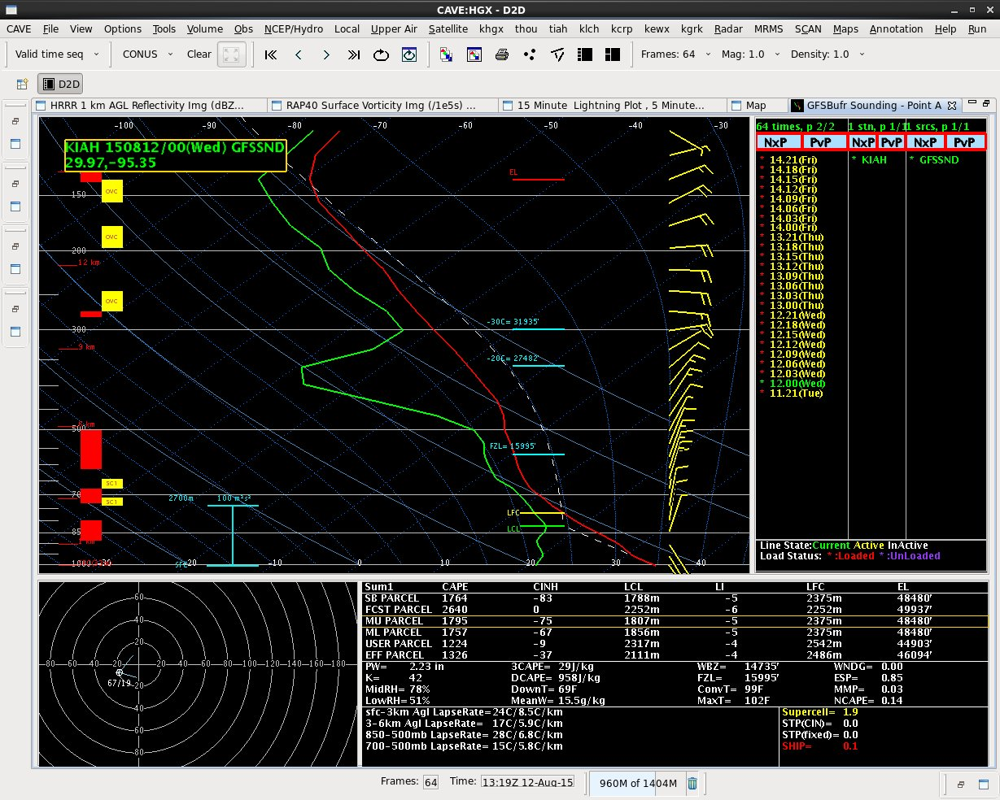
- GFS BUFR Sounding – KIAH (Aug 12 00Z)
- PWAT increases
- above 2 inches
- 850MB-500MB winds favor south/southwest  storm motion

## Slide 4
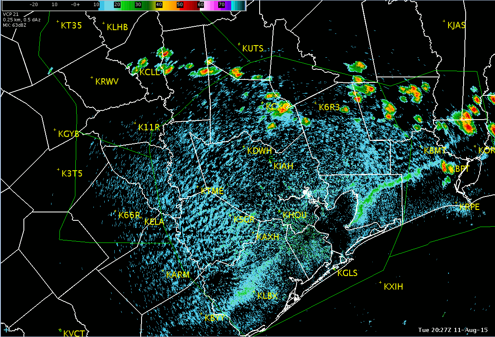
- kiah Reflectivity Loop  (Aug 11 20:27Z – Aug 12 02:28Z)

## Slide 5
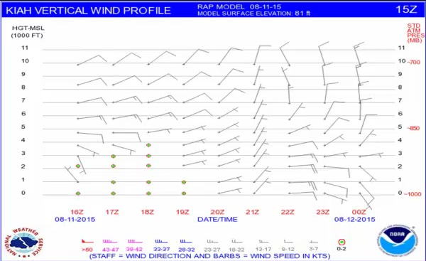
- KIAH Vertical Wind Profile (Aug 11 15Z Issuance)
- Notice abrupt wind change (veering wind direction and increasing speed) between 21Z and 22Z. These winds will spread moisture inland as well as increase strength of any downburst winds

## Slide 6
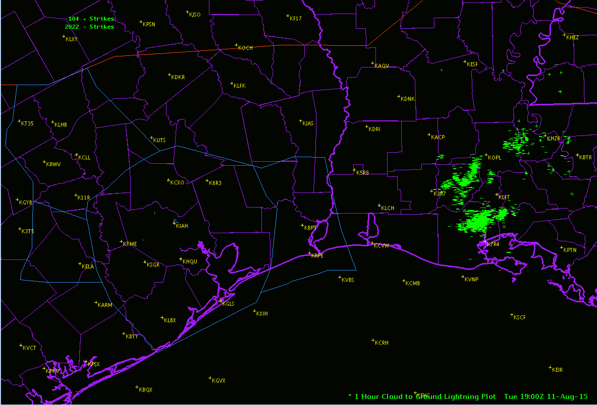
- One Hour Lightning Plot Loop (Aug 11 19Z - Aug 12 02Z)

## Slide 7
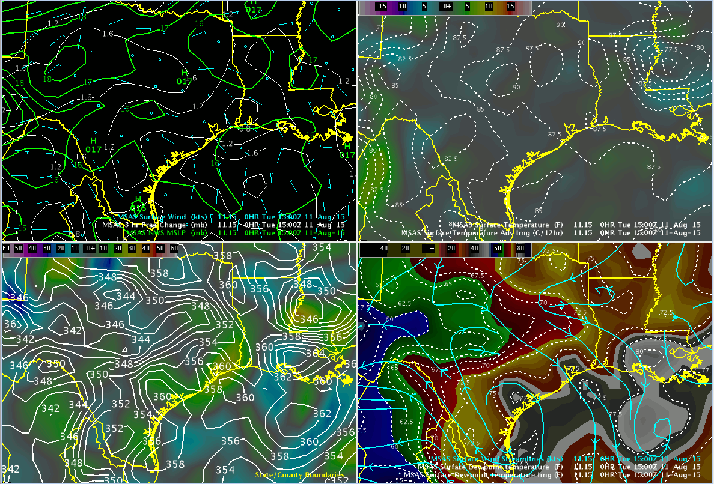
- MSAS Analysis Loop  (Aug 11 15Z – Aug 12 02Z)
- Temperature
- Dewpoint Temperature
- Thermal trough
- Moisture axis
- NOTE: Record high of
- 106 Recorded at KIAH
- Theta-e ridge and strong surface moisture flux convergence
- Equivalent Potential Temperature /
- Moisture Flux Convergence (in blue/violet)

## Slide 8
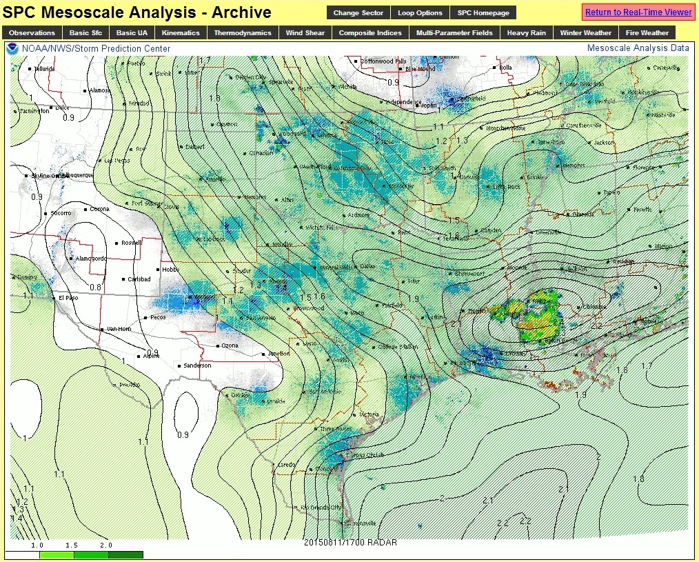
- SPC Meso-Analysis PWAT Loop (Aug 11 17Z – Aug 12 02Z)
- Maximum PWATs
- (2.3 inches) shifted southwest over LA into southeast TX

## Slide 9
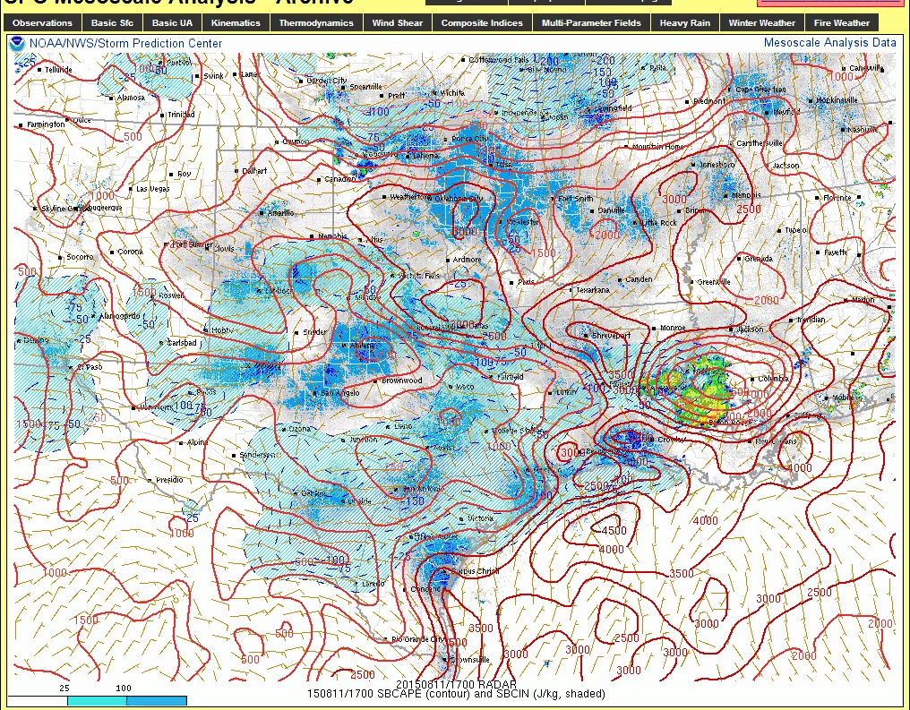
- SPC Meso-Analysis SBCAPE Loop (Aug 11 17Z – Aug 12 02Z)
- Surface based CAPE (SBCAPE) of 3000-3500 J/kg developed ahead of main complex

## Slide 10
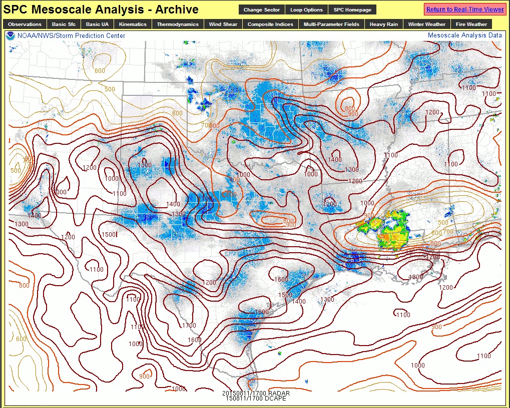
- SPC Meso-Analysis DCAPE Loop (Aug 11 17Z – Aug 12 02Z)
- Downward CAPE (DCAPE) between 1300/1600  J/kg  developed ahead of main complex

## Slide 11
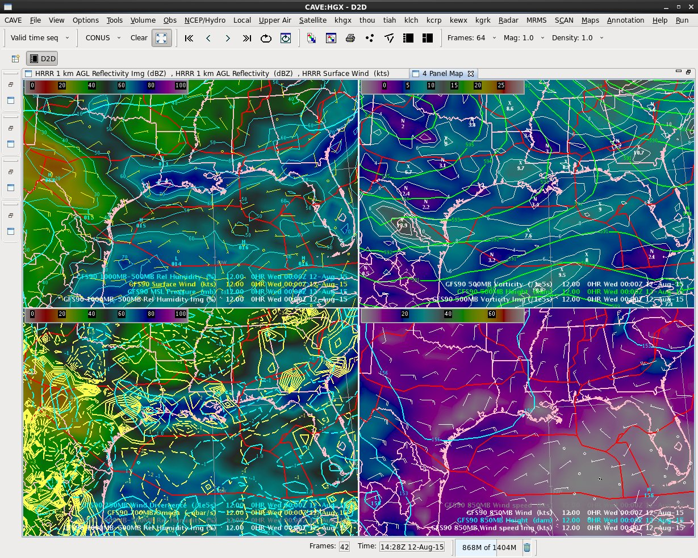

- GFS90 4-Panel (Aug 12 00Z)
- 500MB Vorticity (image)
- PVA
- 1000MB-500MB RH (image)
- 700MB Omega (yellow lines)
- 250MB Divergence (blue lines)
- Notice strong 700MB Omega /
- 250MB Divergence couplet
- 850MB Winds (image)

## Slide 12
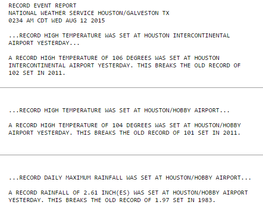
- Record High Temperatures Set on Aug 11

## Slide 13
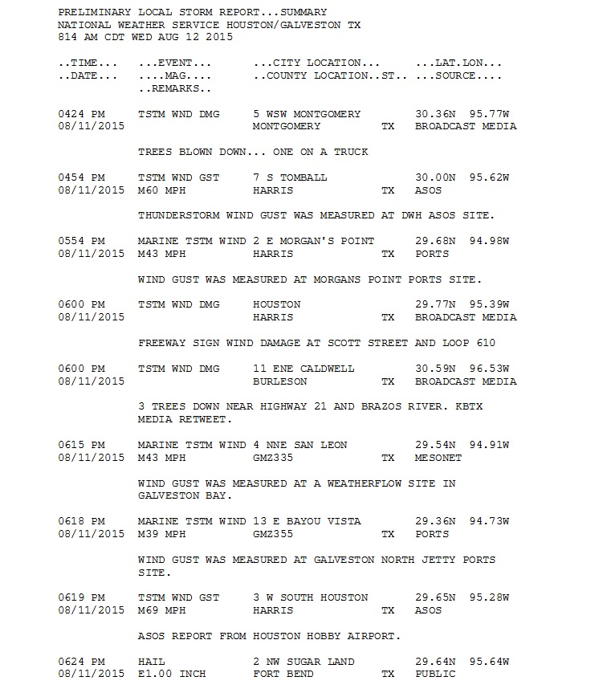

## Slide 14
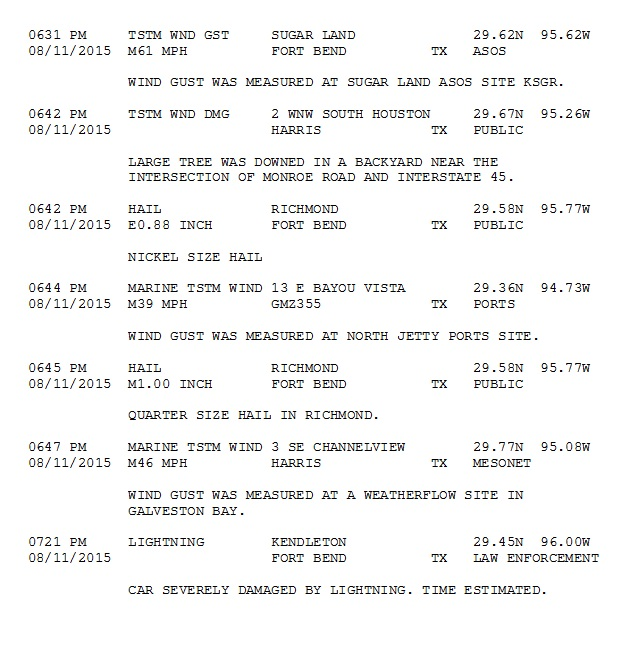

## Slide 15
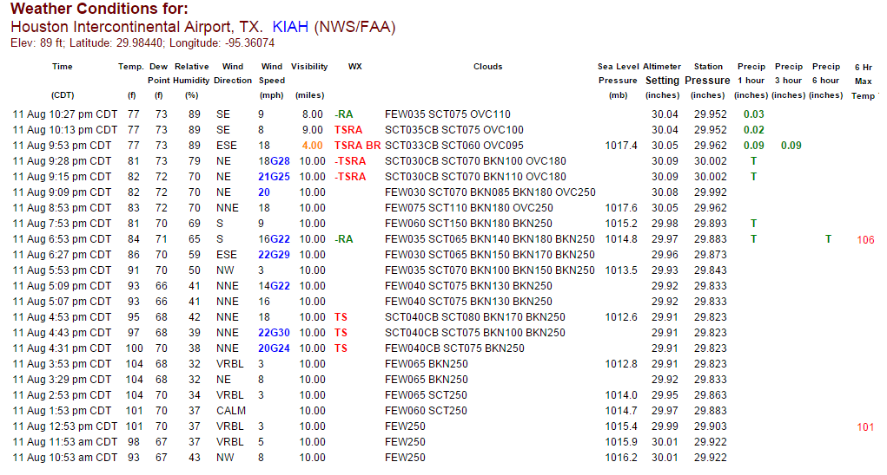
- KIAH Observations on Aug 11
- NOTE: Record high of 106

## Slide 16
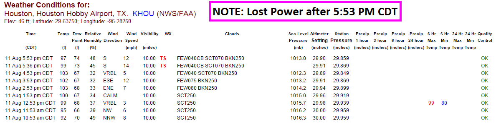
- KHOU Observations on Aug 11

## Slide 17
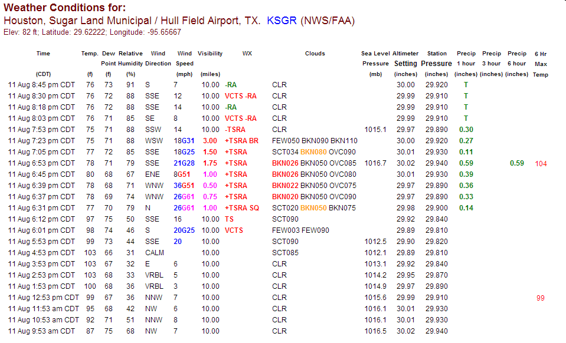
- KSGR Observations on Aug 11
