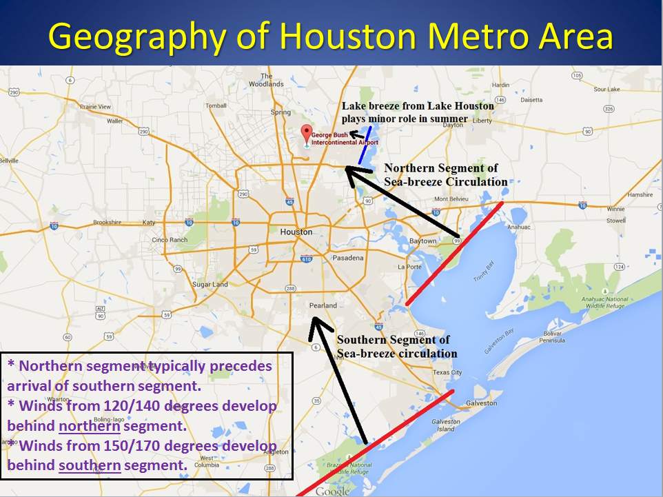
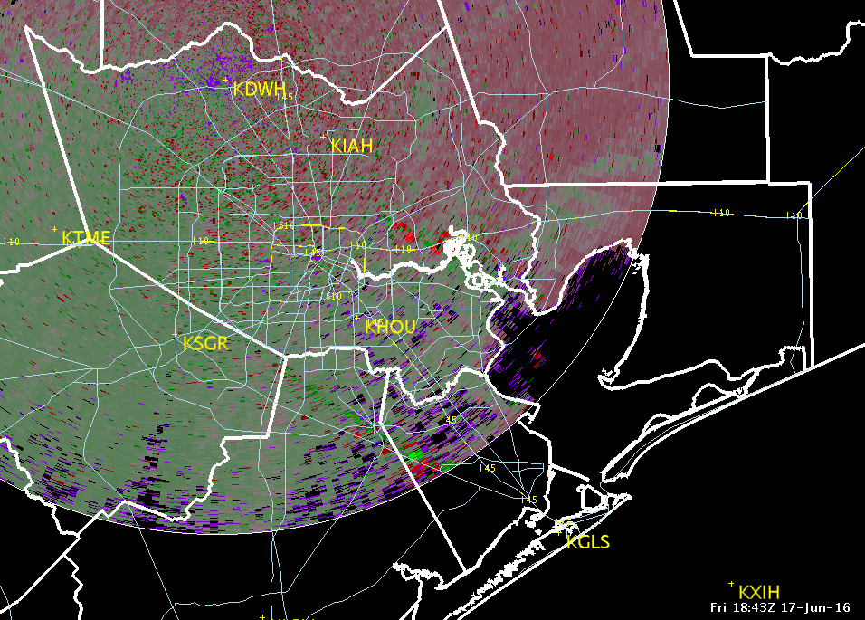
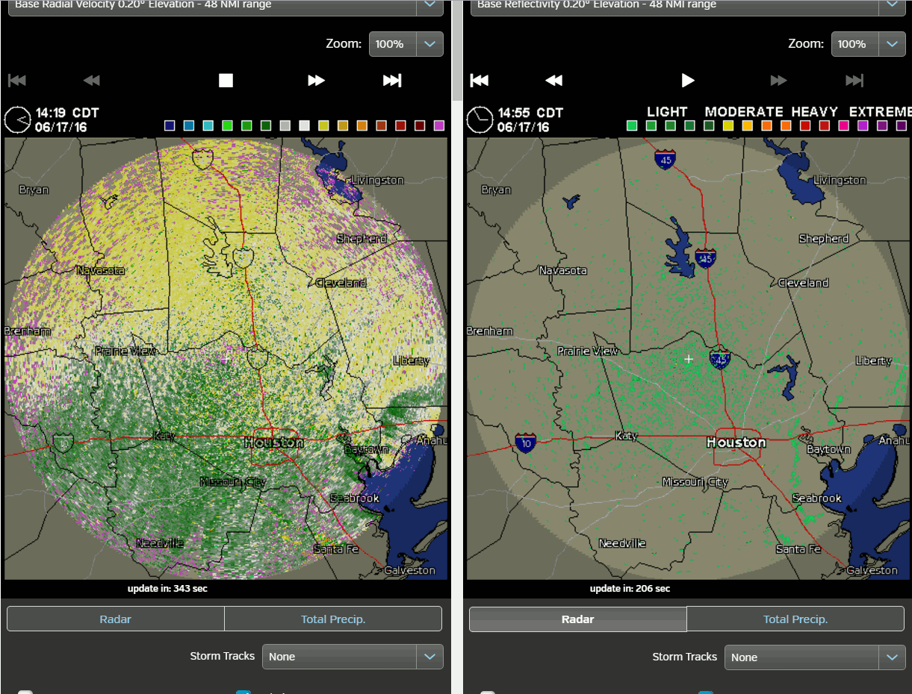
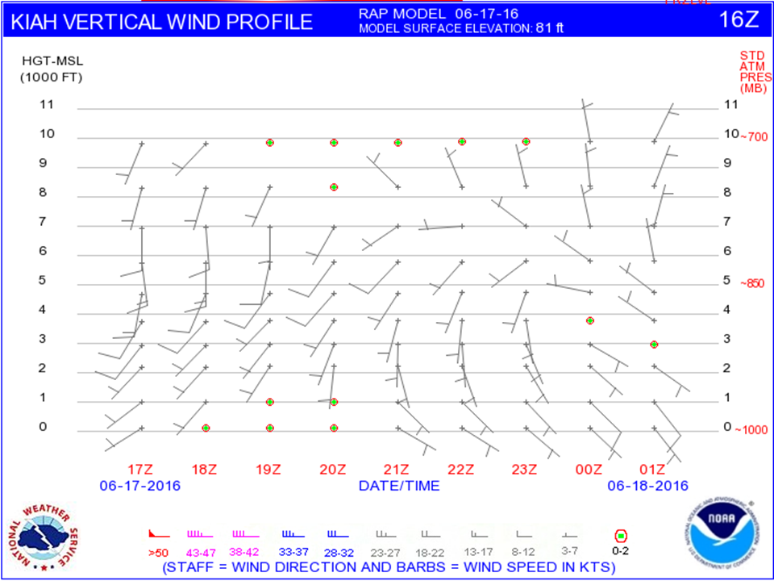
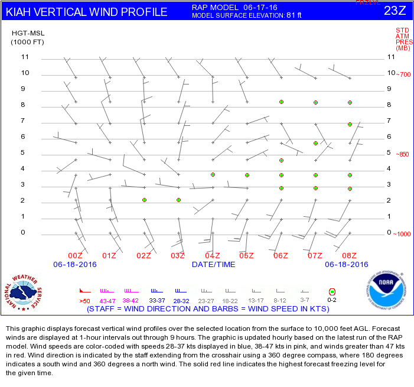
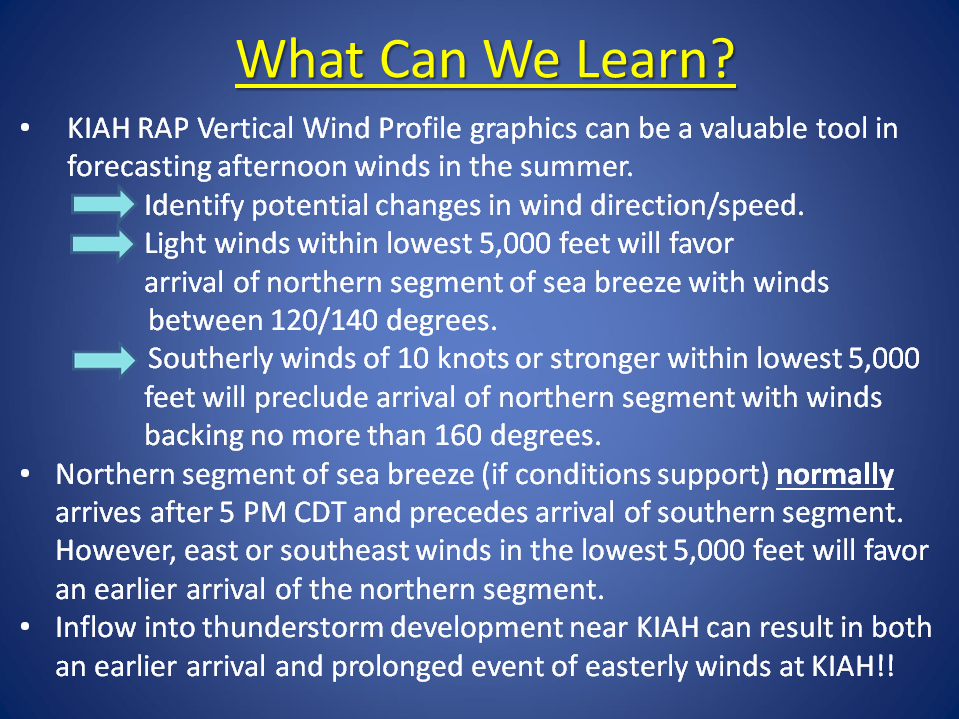

# Seabreeze Wind Event at KIAH ***

> Source: <http://www.weather.gov/media/zhu/ZHU_Training_Page/ZHU_Presentations/Seabreeze_Winds.ppsx>  
> Section: ZHU Weather Event Reviews  
> Captured: 2026-08-19 06:00 UTC  
> Format: PowerPoint show (9 slides). PDF: [seabreeze-wind-event-at-kiah.pdf](seabreeze-wind-event-at-kiah.pdf) · Original: [source/Seabreeze_Winds.ppsx](source/Seabreeze_Winds.ppsx)

---

## Slide 1

- Case Study of Sea Breeze Propagation across I-90 TRACON
- Eric Zappe
- National Weather Service
- Houston Center Weather Service Unit

## Slide 2
- This tutorial is follow-up to presentation titled Forecasting Summertime Winds at KIAH
- The event took place during afternoon of June 17, 2016.
- The following slides contain radar loops of tiah radar.

## Slide 3

## Slide 4

- tiah 0.1 Degree Velocity - Animation
- Southeasterly winds associated with Galveston Bay breeze
- (northern segment of sea breeze)
- Southerly  winds associated southern segment of sea breeze (late arrival)

## Slide 5

- tiah 0.1 Degree Velocity - Animation
- tiah 0.2 Degree Velocity
- tiah 0.2 Degree Reflectivity
- Weak easterly winds associated with Lake Houston breeze preceded Galveston Bay breeze

## Slide 6
- Lake Houston breeze
- Effects from Galveston Bay breeze

## Slide 7

- KIAH RAP Vertical Wind
- Profile - June 17, 2015
- 16Z issuance - top image
- 23Z issuance – bottom
- NOTE:  17Z issuance indicated light SE through southwest winds  (i.e., 5 knots) would extend from surface through the lowest 5,000 feet and last through at least 01Z.

## Slide 8

## Slide 9
- What Can We Learn?
- Lake Houston breeze plays a minor role on winds at KIAH
- in the summertime.
- Wind speeds are usually less than 10 knots.
- However, easterly winds at KIAH may begin as early
- as 4 PM.
