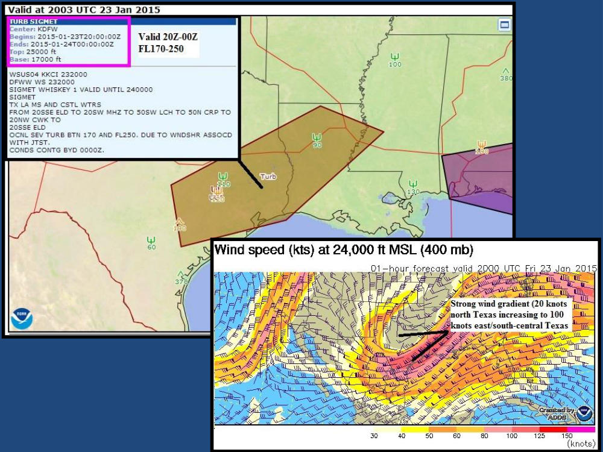
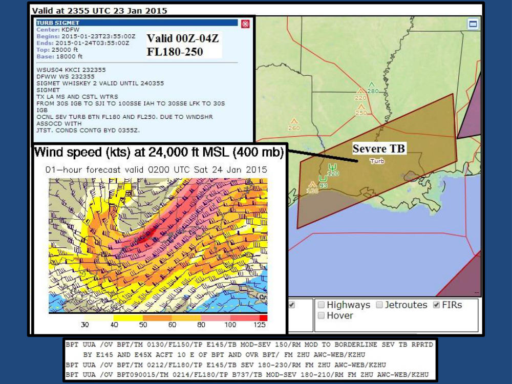
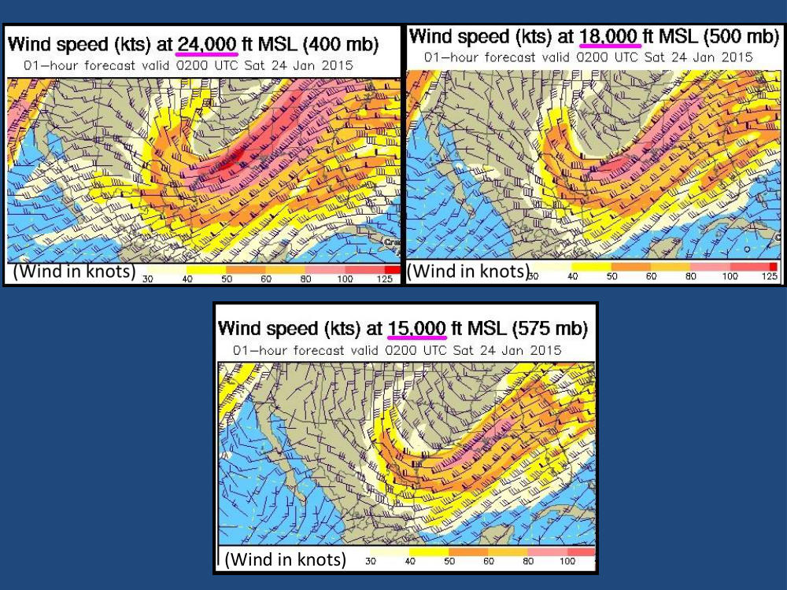
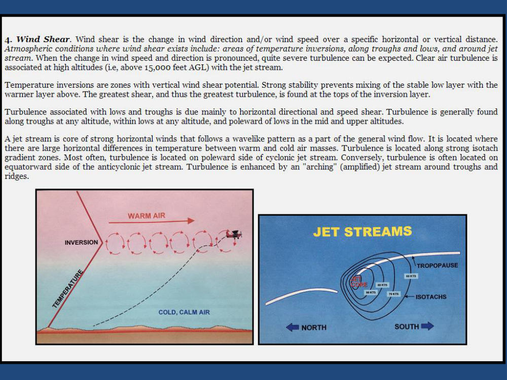
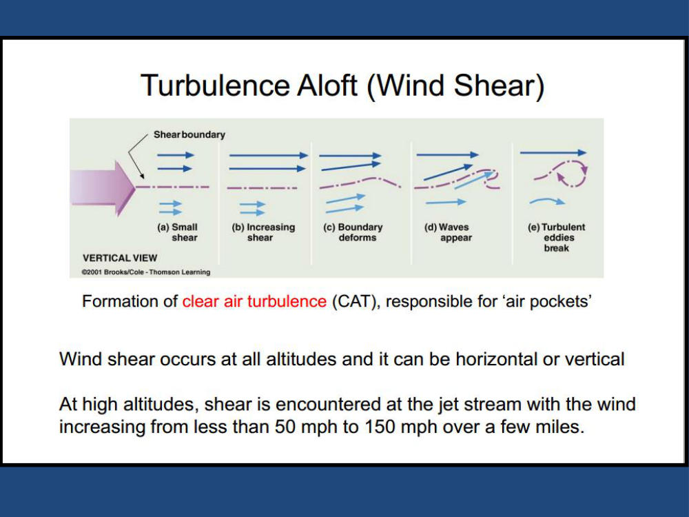
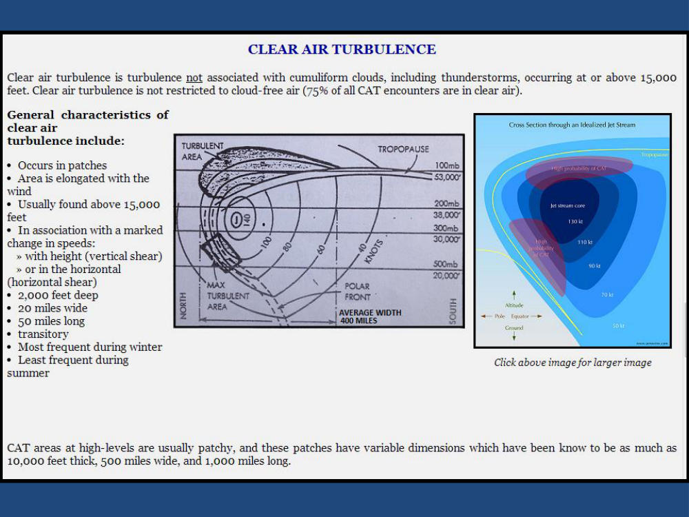
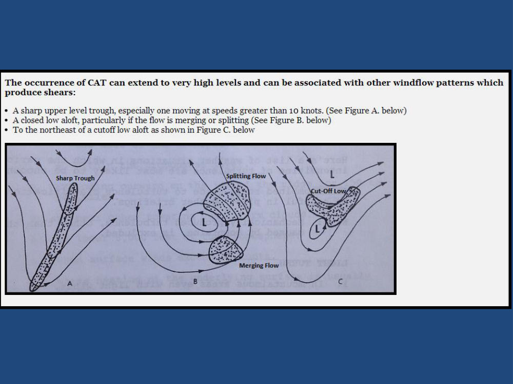
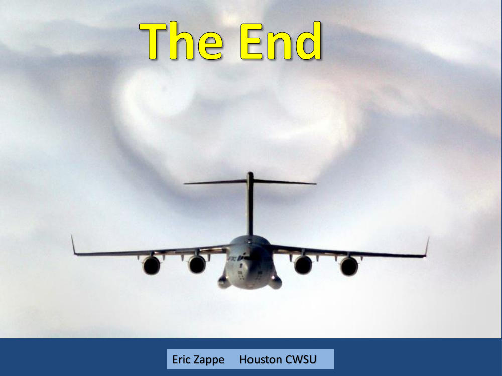

# Severe Turbulence Event - Janary 25, 2015

> Source: <http://www.weather.gov/media/zhu/ZHU_Training_Page/Event_Writeups/Severe_TB_Jan_23_2015.pdf>  
> Section: ZHU Weather Event Reviews  
> Captured: 2026-08-19 06:00 UTC  
> PDF: [severe-turbulence-event-janary-25-2015.pdf](severe-turbulence-event-janary-25-2015.pdf) (9 pages)

---

## Page 1

_(no extractable text on this page — see rendered image above)_

## Page 2

_(no extractable text on this page — see rendered image above)_

## Page 3

_(no extractable text on this page — see rendered image above)_

## Page 4

(Wind in knots)

## Page 5

_(no extractable text on this page — see rendered image above)_

## Page 6

_(no extractable text on this page — see rendered image above)_

## Page 7

_(no extractable text on this page — see rendered image above)_

## Page 8

_(no extractable text on this page — see rendered image above)_

## Page 9

The End
 
Eric Zappe     Houston CWSU 
 
Eric Zappe     Houston CWSU
