# Advanced Spotter's Field Guide

> Source: <http://www.weather.gov/media/zhu/ZHU_Training_Page/spotter_talk_brochures/advspg.pdf>  
> Section: Weather Handbooks and Important Links  
> Captured: 2026-08-19 06:00 UTC  
> PDF: [advanced-spotter-s-field-guide.pdf](advanced-spotter-s-field-guide.pdf) (30 pages)

---

## Page 1

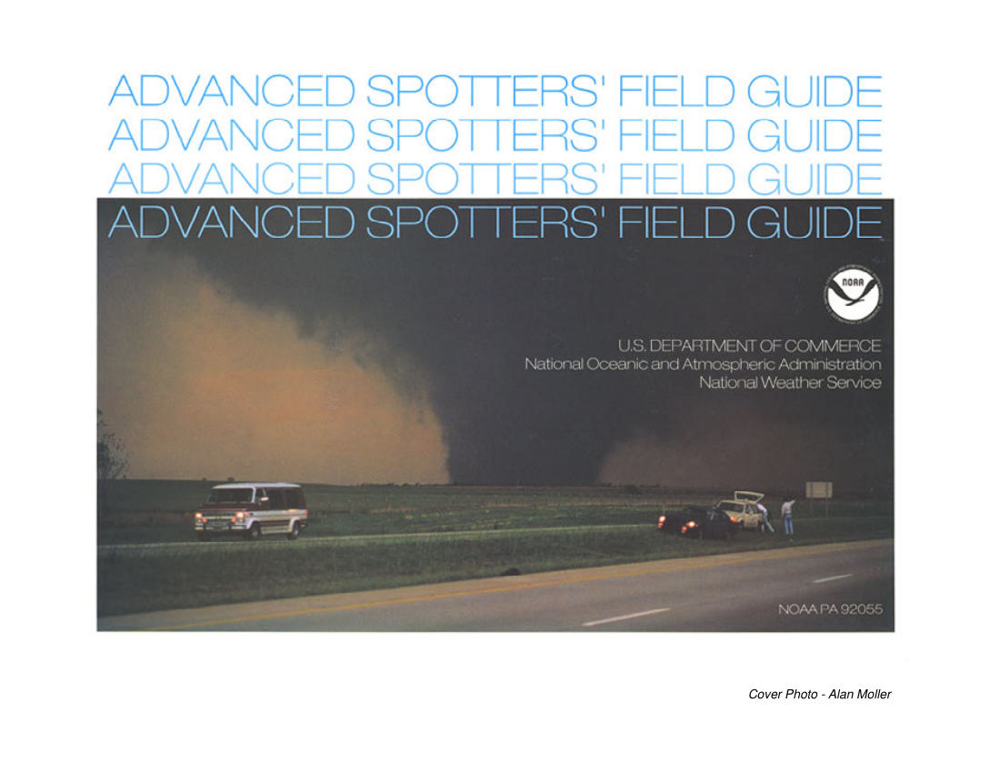

Cover Photo - Alan Moller

## Page 2

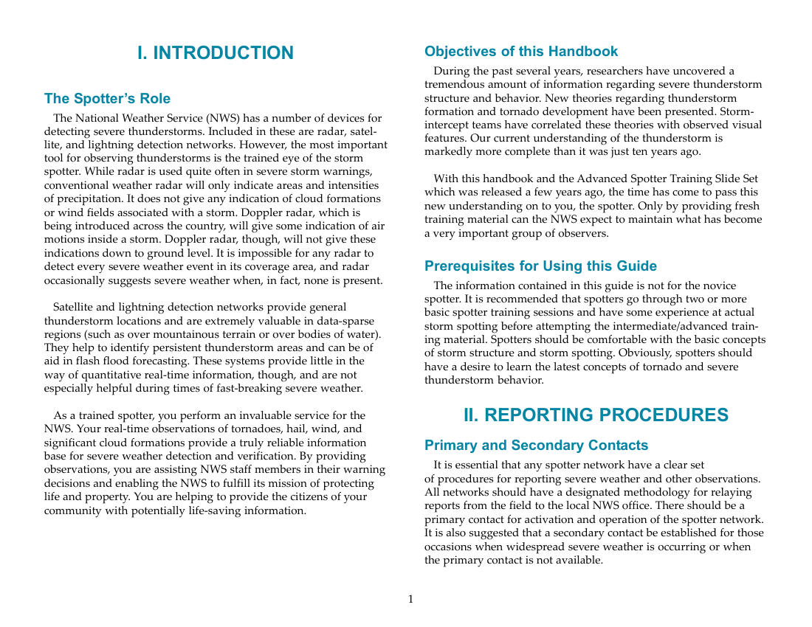

1
I. INTRODUCTION
The Spotter’s Role
The National Weather Service (NWS) has a number of devices for
detecting severe thunderstorms. Included in these are radar, satel-
lite, and lightning detection networks. However, the most important
tool for observing thunderstorms is the trained eye of the storm
spotter. While radar is used quite often in severe storm warnings,
conventional weather radar will only indicate areas and intensities
of precipitation. It does not give any indication of cloud formations
or wind fields associated with a storm. Doppler radar, which is
being introduced across the country, will give some indication of air
motions inside a storm. Doppler radar, though, will not give these
indications down to ground level. It is impossible for any radar to
detect every severe weather event in its coverage area, and radar
occasionally suggests severe weather when, in fact, none is present.
Satellite and lightning detection networks provide general
thunderstorm locations and are extremely valuable in data-sparse
regions (such as over mountainous terrain or over bodies of water).
They help to identify persistent thunderstorm areas and can be of
aid in flash flood forecasting. These systems provide little in the
way of quantitative real-time information, though, and are not
especially helpful during times of fast-breaking severe weather.
As a trained spotter, you perform an invaluable service for the
NWS. Your real-time observations of tornadoes, hail, wind, and
significant cloud formations provide a truly reliable information
base for severe weather detection and verification. By providing
observations, you are assisting NWS staff members in their warning
decisions and enabling the NWS to fulfill its mission of protecting
life and property. You are helping to provide the citizens of your
community with potentially life-saving information.
Objectives of this Handbook
During the past several years, researchers have uncovered a
tremendous amount of information regarding severe thunderstorm
structure and behavior. New theories regarding thunderstorm
formation and tornado development have been presented. Storm-
intercept teams have correlated these theories with observed visual
features. Our current understanding of the thunderstorm is
markedly more complete than it was just ten years ago.
With this handbook and the Advanced Spotter Training Slide Set
which was released a few years ago, the time has come to pass this
new understanding on to you, the spotter. Only by providing fresh
training material can the NWS expect to maintain what has become
a very important group of observers.
Prerequisites for Using this Guide
The information contained in this guide is not for the novice
spotter. It is recommended that spotters go through two or more
basic spotter training sessions and have some experience at actual
storm spotting before attempting the intermediate/advanced train-
ing material. Spotters should be comfortable with the basic concepts
of storm structure and storm spotting. Obviously, spotters should
have a desire to learn the latest concepts of tornado and severe
thunderstorm behavior.
II. REPORTING PROCEDURES
Primary and Secondary Contacts
It is essential that any spotter network have a clear set
of procedures for reporting severe weather and other observations.
All networks should have a designated methodology for relaying
reports from the field to the local NWS office. There should be a
primary contact for activation and operation of the spotter network.
It is also suggested that a secondary contact be established for those
occasions when widespread severe weather is occurring or when
the primary contact is not available.

## Page 3

2
Amateur radio operators comprise the backbone of many spotter
networks. Most amateur radio networks include an operator at the
NWS office for quick relay of reports and direction of spotters in the
field to “hot spots.” This has proven to be an effective, efficient
method of relaying severe weather observations. Other operators
may be deployed at television or radio stations in the NWS office’s
county warning area.
Law enforcement and fire department personnel also serve as
spotter networks in many areas. Many of these groups report to a
dispatcher who, in turn, relays reports to the NWS. These spotter
networks should establish a secondary contact (such as the dis-
patcher of another city/county agency) for those times when pri-
mary communications are impeded.
The dispatchers should also receive at least basic spotter training.
Although they are not actually observing the storms in the field,
dispatchers serve as a critical link in the severe weather information
chain. If they are familiar with thunderstorm and spotting terminol-
ogy, dispatchers are able to screen out less important observations
and quickly relay significant reports to the local NWS office.
In remote or sparsely populated areas, private citizens may have
to serve as spotters. While these individuals may not be as well
organized as the amateur radio or law enforcement-based groups,
there should still be established reporting procedures. Local law
enforcement or emergency management offices are candidates for
contacts in these situations.
Spotter Coordination
Spotting is not a one-person job. It is difficult, if not impossible,
for one spotter to accurately observe all aspects of a thunderstorm.
Rather, it is necessary for spotters and spotter groups to coordinate
and share information (with the NWS and with each other) to
obtain the best possible assessment of the storm.
Spotters with two-way radio communications should talk not only
with their dispatch/control personnel but with other spotters in the
area. Positioning spotter teams at several strategic locations around
a storm, with active communication between the spotters, should
enable a great deal of information concerning the thunderstorm to
be relayed to the local NWS office.
If two or more spotter groups are working in the same area
(i.e., an amateur radio group and a law enforcement group), then
these groups should share information regarding their observations.
The NWS should also attempt to coordinate between spotter
groups. As a storm moves from one spotter group’s area to another,
the downstream spotter group should be notified well in advance to
allow time for their activation and deployment.
Reporting Criteria
There are certain criteria for reporting severe weather. Recall that
a thunderstorm is defined as severe if it produces a tornado, hail 3/4
inch in diameter or larger, and/or wind gusts 58 miles an hour or
higher. It would be desirable to report events associated with a
thunderstorm before they reach these severe levels. Use the follow-
ing guidelines for reporting weather events.
Report hail occurrences when the hailstones have a diameter of 1/
2 inch, and report wind gusts when their speed reaches 50 miles an
hour. See tables 1 and 2 for estimations of hail size and wind speed.
Obviously, tornadoes and funnel clouds should be reported.
A funnel cloud is defined as a violently rotating column of air which
is not in contact with the ground. It is usually marked by a funnel-
shaped cloud extending downward from the cloud base (hence its
name). If the violently rotating air column reaches the ground, it is
called a tornado. An important point to note is that the visible
funnel DOES NOT have to extend to the ground for a tornado to be
present. Instead, look for a rotating cloud of dust and debris under-
neath a funnel cloud as evidence that the tornado’s circulation has
reached the ground.

## Page 4

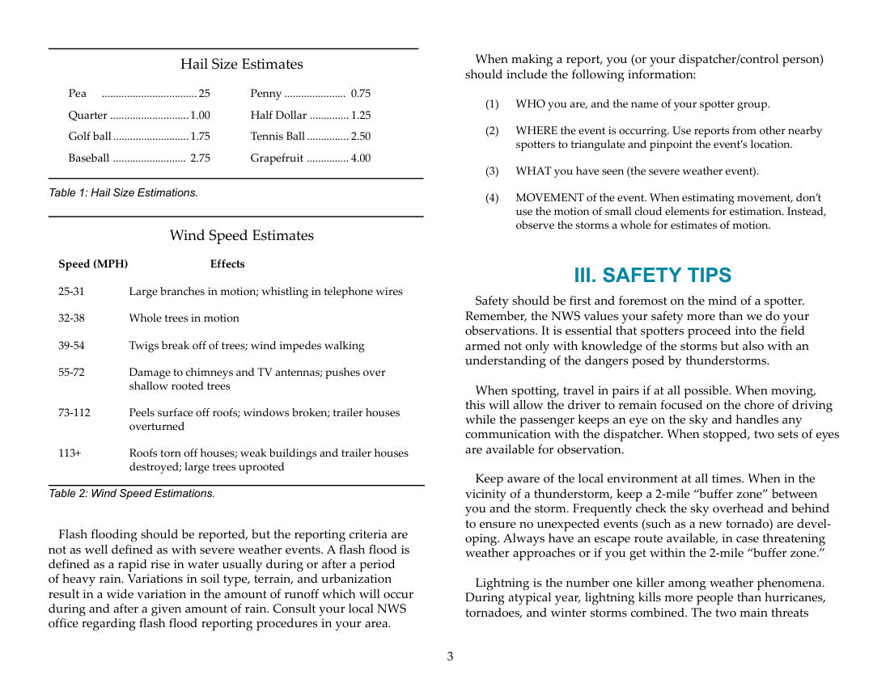

3
Hail Size Estimates
Pea
.................................. 25
Penny ...................... 0.75
Quarter ............................ 1.00
Half Dollar .............. 1.25
Golf ball........................... 1.75
Tennis Ball............... 2.50
Baseball .......................... 2.75
Grapefruit ............... 4.00
Table 1: Hail Size Estimations.
Wind Speed Estimates
Speed (MPH)
Effects
25-31
Large branches in motion; whistling in telephone wires
32-38
Whole trees in motion
39-54
Twigs break off of trees; wind impedes walking
55-72
Damage to chimneys and TV antennas; pushes over
shallow rooted trees
73-112
Peels surface off roofs; windows broken; trailer houses
overturned
113+
Roofs torn off houses; weak buildings and trailer houses
destroyed; large trees uprooted
Table 2: Wind Speed Estimations.
Flash flooding should be reported, but the reporting criteria are
not as well defined as with severe weather events. A flash flood is
defined as a rapid rise in water usually during or after a period
of heavy rain. Variations in soil type, terrain, and urbanization
result in a wide variation in the amount of runoff which will occur
during and after a given amount of rain. Consult your local NWS
office regarding flash flood reporting procedures in your area.
When making a report, you (or your dispatcher/control person)
should include the following information:
(1)
WHO you are, and the name of your spotter group.
(2)
WHERE the event is occurring. Use reports from other nearby
spotters to triangulate and pinpoint the event’s location.
(3)
WHAT you have seen (the severe weather event).
(4)
MOVEMENT of the event. When estimating movement, don’t
use the motion of small cloud elements for estimation. Instead,
observe the storms a whole for estimates of motion.
III. SAFETY TIPS
Safety should be first and foremost on the mind of a spotter.
Remember, the NWS values your safety more than we do your
observations. It is essential that spotters proceed into the field
armed not only with knowledge of the storms but also with an
understanding of the dangers posed by thunderstorms.
When spotting, travel in pairs if at all possible. When moving,
this will allow the driver to remain focused on the chore of driving
while the passenger keeps an eye on the sky and handles any
communication with the dispatcher. When stopped, two sets of eyes
are available for observation.
Keep aware of the local environment at all times. When in the
vicinity of a thunderstorm, keep a 2-mile “buffer zone” between
you and the storm. Frequently check the sky overhead and behind
to ensure no unexpected events (such as a new tornado) are devel-
oping. Always have an escape route available, in case threatening
weather approaches or if you get within the 2-mile “buffer zone.”
Lightning is the number one killer among weather phenomena.
During atypical year, lightning kills more people than hurricanes,
tornadoes, and winter storms combined. The two main threats

## Page 5

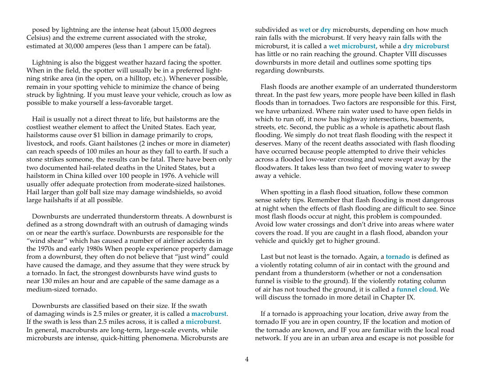

4
posed by lightning are the intense heat (about 15,000 degrees
Celsius) and the extreme current associated with the stroke,
estimated at 30,000 amperes (less than 1 ampere can be fatal).
Lightning is also the biggest weather hazard facing the spotter.
When in the field, the spotter will usually be in a preferred light-
ning strike area (in the open, on a hilltop, etc.). Whenever possible,
remain in your spotting vehicle to minimize the chance of being
struck by lightning. If you must leave your vehicle, crouch as low as
possible to make yourself a less-favorable target.
Hail is usually not a direct threat to life, but hailstorms are the
costliest weather element to affect the United States. Each year,
hailstorms cause over $1 billion in damage primarily to crops,
livestock, and roofs. Giant hailstones (2 inches or more in diameter)
can reach speeds of 100 miles an hour as they fall to earth. If such a
stone strikes someone, the results can be fatal. There have been only
two documented hail-related deaths in the United States, but a
hailstorm in China killed over 100 people in 1976. A vehicle will
usually offer adequate protection from moderate-sized hailstones.
Hail larger than golf ball size may damage windshields, so avoid
large hailshafts if at all possible.
Downbursts are underrated thunderstorm threats. A downburst is
defined as a strong downdraft with an outrush of damaging winds
on or near the earth’s surface. Downbursts are responsible for the
“wind shear” which has caused a number of airliner accidents in
the 1970s and early 1980s When people experience property damage
from a downburst, they often do not believe that “just wind” could
have caused the damage, and they assume that they were struck by
a tornado. In fact, the strongest downbursts have wind gusts to
near 130 miles an hour and are capable of the same damage as a
medium-sized tornado.
Downbursts are classified based on their size. If the swath
of damaging winds is 2.5 miles or greater, it is called a macroburst.
If the swath is less than 2.5 miles across, it is called a microburst.
In general, macrobursts are long-term, large-scale events, while
microbursts are intense, quick-hitting phenomena. Microbursts are
subdivided as wet or dry microbursts, depending on how much
rain falls with the microburst. If very heavy rain falls with the
microburst, it is called a wet microburst, while a dry microburst
has little or no rain reaching the ground. Chapter VIII discusses
downbursts in more detail and outlines some spotting tips
regarding downbursts.
Flash floods are another example of an underrated thunderstorm
threat. In the past few years, more people have been killed in flash
floods than in tornadoes. Two factors are responsible for this. First,
we have urbanized. Where rain water used to have open fields in
which to run off, it now has highway intersections, basements,
streets, etc. Second, the public as a whole is apathetic about flash
flooding. We simply do not treat flash flooding with the respect it
deserves. Many of the recent deaths associated with flash flooding
have occurred because people attempted to drive their vehicles
across a flooded low-water crossing and were swept away by the
floodwaters. It takes less than two feet of moving water to sweep
away a vehicle.
When spotting in a flash flood situation, follow these common
sense safety tips. Remember that flash flooding is most dangerous
at night when the effects of flash flooding are difficult to see. Since
most flash floods occur at night, this problem is compounded.
Avoid low water crossings and don’t drive into areas where water
covers the road. If you are caught in a flash flood, abandon your
vehicle and quickly get to higher ground.
Last but not least is the tornado. Again, a tornado is defined as
a violently rotating column of air in contact with the ground and
pendant from a thunderstorm (whether or not a condensation
funnel is visible to the ground). If the violently rotating column
of air has not touched the ground, it is called a funnel cloud. We
will discuss the tornado in more detail in Chapter IX.
If a tornado is approaching your location, drive away from the
tornado IF you are in open country, IF the location and motion of
the tornado are known, and IF you are familiar with the local road
network. If you are in an urban area and escape is not possible for

## Page 6

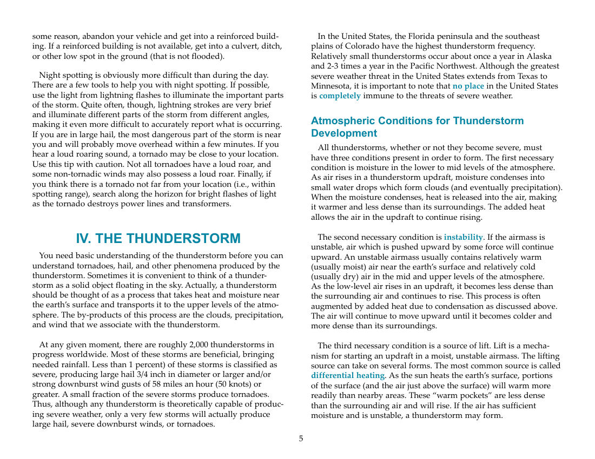

5
some reason, abandon your vehicle and get into a reinforced build-
ing. If a reinforced building is not available, get into a culvert, ditch,
or other low spot in the ground (that is not flooded).
Night spotting is obviously more difficult than during the day.
There are a few tools to help you with night spotting. If possible,
use the light from lightning flashes to illuminate the important parts
of the storm. Quite often, though, lightning strokes are very brief
and illuminate different parts of the storm from different angles,
making it even more difficult to accurately report what is occurring.
If you are in large hail, the most dangerous part of the storm is near
you and will probably move overhead within a few minutes. If you
hear a loud roaring sound, a tornado may be close to your location.
Use this tip with caution. Not all tornadoes have a loud roar, and
some non-tornadic winds may also possess a loud roar. Finally, if
you think there is a tornado not far from your location (i.e., within
spotting range), search along the horizon for bright flashes of light
as the tornado destroys power lines and transformers.
IV. THE THUNDERSTORM
You need basic understanding of the thunderstorm before you can
understand tornadoes, hail, and other phenomena produced by the
thunderstorm. Sometimes it is convenient to think of a thunder-
storm as a solid object floating in the sky. Actually, a thunderstorm
should be thought of as a process that takes heat and moisture near
the earth’s surface and transports it to the upper levels of the atmo-
sphere. The by-products of this process are the clouds, precipitation,
and wind that we associate with the thunderstorm.
At any given moment, there are roughly 2,000 thunderstorms in
progress worldwide. Most of these storms are beneficial, bringing
needed rainfall. Less than 1 percent) of these storms is classified as
severe, producing large hail 3/4 inch in diameter or larger and/or
strong downburst wind gusts of 58 miles an hour (50 knots) or
greater. A small fraction of the severe storms produce tornadoes.
Thus, although any thunderstorm is theoretically capable of produc-
ing severe weather, only a very few storms will actually produce
large hail, severe downburst winds, or tornadoes.
In the United States, the Florida peninsula and the southeast
plains of Colorado have the highest thunderstorm frequency.
Relatively small thunderstorms occur about once a year in Alaska
and 2-3 times a year in the Pacific Northwest. Although the greatest
severe weather threat in the United States extends from Texas to
Minnesota, it is important to note that no place in the United States
is completely immune to the threats of severe weather.
Atmospheric Conditions for Thunderstorm
Development
All thunderstorms, whether or not they become severe, must
have three conditions present in order to form. The first necessary
condition is moisture in the lower to mid levels of the atmosphere.
As air rises in a thunderstorm updraft, moisture condenses into
small water drops which form clouds (and eventually precipitation).
When the moisture condenses, heat is released into the air, making
it warmer and less dense than its surroundings. The added heat
allows the air in the updraft to continue rising.
The second necessary condition is instability. If the airmass is
unstable, air which is pushed upward by some force will continue
upward. An unstable airmass usually contains relatively warm
(usually moist) air near the earth’s surface and relatively cold
(usually dry) air in the mid and upper levels of the atmosphere.
As the low-level air rises in an updraft, it becomes less dense than
the surrounding air and continues to rise. This process is often
augmented by added heat due to condensation as discussed above.
The air will continue to move upward until it becomes colder and
more dense than its surroundings.
The third necessary condition is a source of lift. Lift is a mecha-
nism for starting an updraft in a moist, unstable airmass. The lifting
source can take on several forms. The most common source is called
differential heating. As the sun heats the earth’s surface, portions
of the surface (and the air just above the surface) will warm more
readily than nearby areas. These “warm pockets” are less dense
than the surrounding air and will rise. If the air has sufficient
moisture and is unstable, a thunderstorm may form.

## Page 7

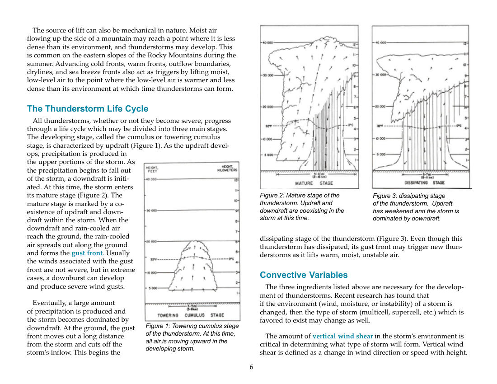

6
The source of lift can also be mechanical in nature. Moist air
flowing up the side of a mountain may reach a point where it is less
dense than its environment, and thunderstorms may develop. This
is common on the eastern slopes of the Rocky Mountains during the
summer. Advancing cold fronts, warm fronts, outflow boundaries,
drylines, and sea breeze fronts also act as triggers by lifting moist,
low-level air to the point where the low-level air is warmer and less
dense than its environment at which time thunderstorms can form.
The Thunderstorm Life Cycle
All thunderstorms, whether or not they become severe, progress
through a life cycle which may be divided into three main stages.
The developing stage, called the cumulus or towering cumulus
stage, is characterized by updraft (Figure 1). As the updraft devel-
ops, precipitation is produced in
the upper portions of the storm. As
the precipitation begins to fall out
of the storm, a downdraft is initi-
ated. At this time, the storm enters
its mature stage (Figure 2). The
mature stage is marked by a co-
existence of updraft and down-
draft within the storm. When the
downdraft and rain-cooled air
reach the ground, the rain-cooled
air spreads out along the ground
and forms the gust front. Usually
the winds associated with the gust
front are not severe, but in extreme
cases, a downburst can develop
and produce severe wind gusts.
Eventually, a large amount
of precipitation is produced and
the storm becomes dominated by
downdraft. At the ground, the gust
front moves out a long distance
from the storm and cuts off the
storm’s inflow. This begins the
dissipating stage of the thunderstorm (Figure 3). Even though this
thunderstorm has dissipated, its gust front may trigger new thun-
derstorms as it lifts warm, moist, unstable air.
Convective Variables
The three ingredients listed above are necessary for the develop-
ment of thunderstorms. Recent research has found that
if the environment (wind, moisture, or instability) of a storm is
changed, then the type of storm (multicell, supercell, etc.) which is
favored to exist may change as well.
The amount of vertical wind shear in the storm’s environment is
critical in determining what type of storm will form. Vertical wind
shear is defined as a change in wind direction or speed with height.
Figure 1: Towering cumulus stage
of the thunderstorm. At this time,
all air is moving upward in the
developing storm.
Figure 2: Mature stage of the
thunderstorm. Updraft and
downdraft are coexisting in the
storm at this time.
Figure 3: dissipating stage
of the thunderstorm.  Updraft
has weakened and the storm is
dominated by downdraft.

## Page 8

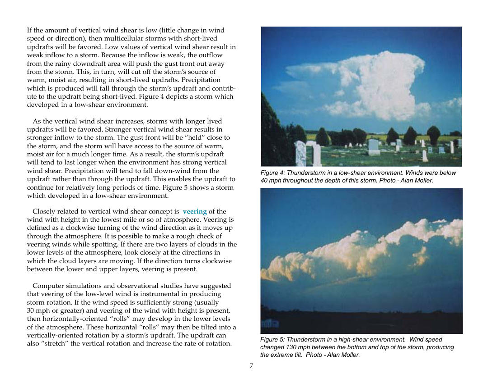

7
If the amount of vertical wind shear is low (little change in wind
speed or direction), then multicellular storms with short-lived
updrafts will be favored. Low values of vertical wind shear result in
weak inflow to a storm. Because the inflow is weak, the outflow
from the rainy downdraft area will push the gust front out away
from the storm. This, in turn, will cut off the storm’s source of
warm, moist air, resulting in short-lived updrafts. Precipitation
which is produced will fall through the storm’s updraft and contrib-
ute to the updraft being short-lived. Figure 4 depicts a storm which
developed in a low-shear environment.
As the vertical wind shear increases, storms with longer lived
updrafts will be favored. Stronger vertical wind shear results in
stronger inflow to the storm. The gust front will be “held” close to
the storm, and the storm will have access to the source of warm,
moist air for a much longer time. As a result, the storm’s updraft
will tend to last longer when the environment has strong vertical
wind shear. Precipitation will tend to fall down-wind from the
updraft rather than through the updraft. This enables the updraft to
continue for relatively long periods of time. Figure 5 shows a storm
which developed in a low-shear environment.
Closely related to vertical wind shear concept is  veering of the
wind with height in the lowest mile or so of atmosphere. Veering is
defined as a clockwise turning of the wind direction as it moves up
through the atmosphere. It is possible to make a rough check of
veering winds while spotting. If there are two layers of clouds in the
lower levels of the atmosphere, look closely at the directions in
which the cloud layers are moving. If the direction turns clockwise
between the lower and upper layers, veering is present.
Computer simulations and observational studies have suggested
that veering of the low-level wind is instrumental in producing
storm rotation. If the wind speed is sufficiently strong (usually
30 mph or greater) and veering of the wind with height is present,
then horizontally-oriented “rolls” may develop in the lower levels
of the atmosphere. These horizontal “rolls” may then be tilted into a
vertically-oriented rotation by a storm’s updraft. The updraft can
also “stretch” the vertical rotation and increase the rate of rotation.
Figure 4: Thunderstorm in a low-shear environment. Winds were below
40 mph throughout the depth of this storm. Photo - Alan Moller.
Figure 5: Thunderstorm in a high-shear environment.  Wind speed
changed 130 mph between the bottom and top of the storm, producing
the extreme tilt.  Photo - Alan Moller.

## Page 9

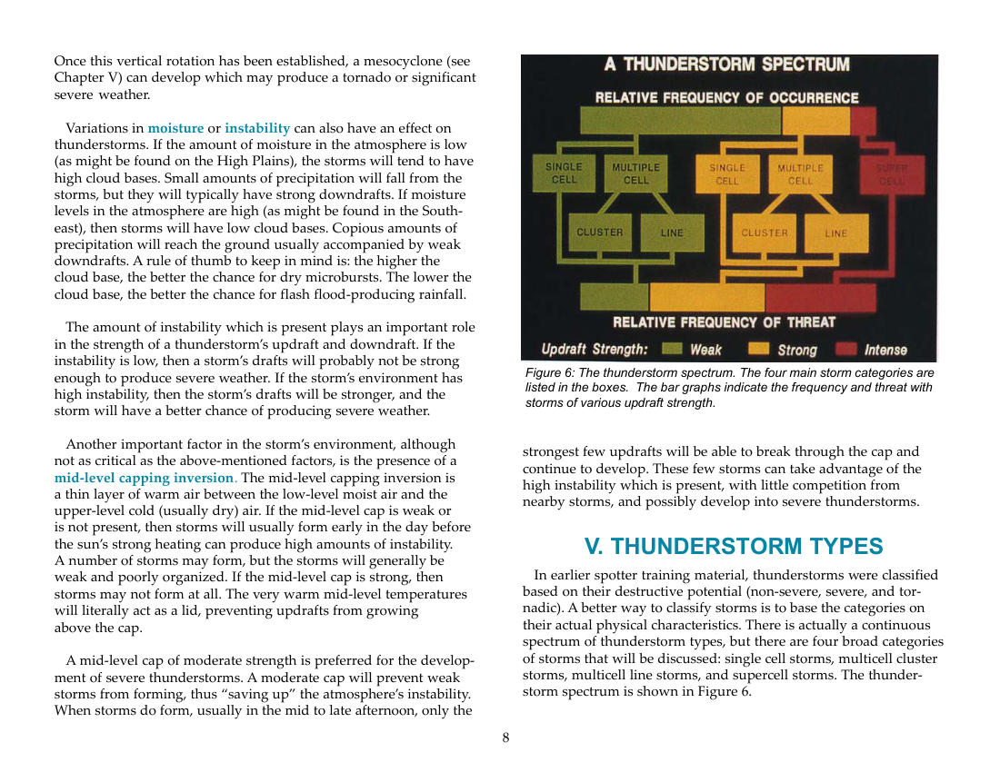

8
Once this vertical rotation has been established, a mesocyclone (see
Chapter V) can develop which may produce a tornado or significant
severe weather.
Variations in moisture or instability can also have an effect on
thunderstorms. If the amount of moisture in the atmosphere is low
(as might be found on the High Plains), the storms will tend to have
high cloud bases. Small amounts of precipitation will fall from the
storms, but they will typically have strong downdrafts. If moisture
levels in the atmosphere are high (as might be found in the South-
east), then storms will have low cloud bases. Copious amounts of
precipitation will reach the ground usually accompanied by weak
downdrafts. A rule of thumb to keep in mind is: the higher the
cloud base, the better the chance for dry microbursts. The lower the
cloud base, the better the chance for flash flood-producing rainfall.
The amount of instability which is present plays an important role
in the strength of a thunderstorm’s updraft and downdraft. If the
instability is low, then a storm’s drafts will probably not be strong
enough to produce severe weather. If the storm’s environment has
high instability, then the storm’s drafts will be stronger, and the
storm will have a better chance of producing severe weather.
Another important factor in the storm’s environment, although
not as critical as the above-mentioned factors, is the presence of a
mid-level capping inversion. The mid-level capping inversion is
a thin layer of warm air between the low-level moist air and the
upper-level cold (usually dry) air. If the mid-level cap is weak or
is not present, then storms will usually form early in the day before
the sun’s strong heating can produce high amounts of instability.
A number of storms may form, but the storms will generally be
weak and poorly organized. If the mid-level cap is strong, then
storms may not form at all. The very warm mid-level temperatures
will literally act as a lid, preventing updrafts from growing
above the cap.
A mid-level cap of moderate strength is preferred for the develop-
ment of severe thunderstorms. A moderate cap will prevent weak
storms from forming, thus “saving up” the atmosphere’s instability.
When storms do form, usually in the mid to late afternoon, only the
strongest few updrafts will be able to break through the cap and
continue to develop. These few storms can take advantage of the
high instability which is present, with little competition from
nearby storms, and possibly develop into severe thunderstorms.
V. THUNDERSTORM TYPES
In earlier spotter training material, thunderstorms were classified
based on their destructive potential (non-severe, severe, and tor-
nadic). A better way to classify storms is to base the categories on
their actual physical characteristics. There is actually a continuous
spectrum of thunderstorm types, but there are four broad categories
of storms that will be discussed: single cell storms, multicell cluster
storms, multicell line storms, and supercell storms. The thunder-
storm spectrum is shown in Figure 6.
Figure 6: The thunderstorm spectrum. The four main storm categories are
listed in the boxes.  The bar graphs indicate the frequency and threat with
storms of various updraft strength.

## Page 10

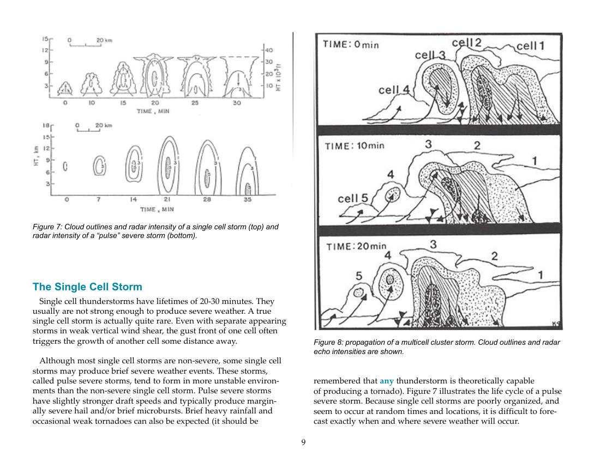

9
The Single Cell Storm
Single cell thunderstorms have lifetimes of 20-30 minutes. They
usually are not strong enough to produce severe weather. A true
single cell storm is actually quite rare. Even with separate appearing
storms in weak vertical wind shear, the gust front of one cell often
triggers the growth of another cell some distance away.
Although most single cell storms are non-severe, some single cell
storms may produce brief severe weather events. These storms,
called pulse severe storms, tend to form in more unstable environ-
ments than the non-severe single cell storm. Pulse severe storms
have slightly stronger draft speeds and typically produce margin-
ally severe hail and/or brief microbursts. Brief heavy rainfall and
occasional weak tornadoes can also be expected (it should be
remembered that any thunderstorm is theoretically capable
of producing a tornado). Figure 7 illustrates the life cycle of a pulse
severe storm. Because single cell storms are poorly organized, and
seem to occur at random times and locations, it is difficult to fore-
cast exactly when and where severe weather will occur.
Figure 7: Cloud outlines and radar intensity of a single cell storm (top) and
radar intensity of a “pulse” severe storm (bottom).
Figure 8: propagation of a multicell cluster storm. Cloud outlines and radar
echo intensities are shown.

## Page 11

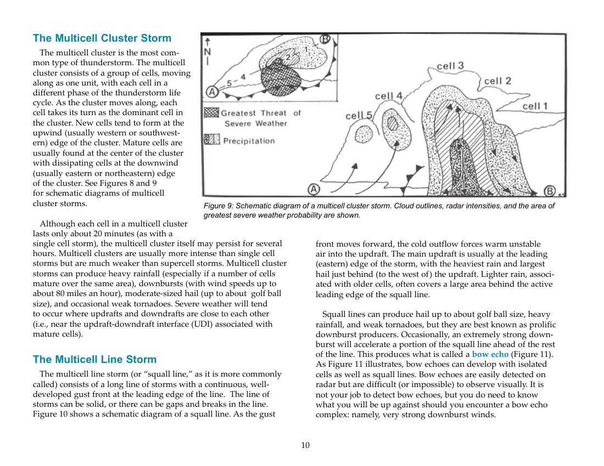

10
The Multicell Cluster Storm
The multicell cluster is the most com-
mon type of thunderstorm. The multicell
cluster consists of a group of cells, moving
along as one unit, with each cell in a
different phase of the thunderstorm life
cycle. As the cluster moves along, each
cell takes its turn as the dominant cell in
the cluster. New cells tend to form at the
upwind (usually western or southwest-
ern) edge of the cluster. Mature cells are
usually found at the center of the cluster
with dissipating cells at the downwind
(usually eastern or northeastern) edge
of the cluster. See Figures 8 and 9
for schematic diagrams of multicell
cluster storms.
Although each cell in a multicell cluster
lasts only about 20 minutes (as with a
single cell storm), the multicell cluster itself may persist for several
hours. Multicell clusters are usually more intense than single cell
storms but are much weaker than supercell storms. Multicell cluster
storms can produce heavy rainfall (especially if a number of cells
mature over the same area), downbursts (with wind speeds up to
about 80 miles an hour), moderate-sized hail (up to about  golf ball
size), and occasional weak tornadoes. Severe weather will tend
to occur where updrafts and downdrafts are close to each other
(i.e., near the updraft-downdraft interface (UDI) associated with
mature cells).
The Multicell Line Storm
The multicell line storm (or “squall line,” as it is more commonly
called) consists of a long line of storms with a continuous, well-
developed gust front at the leading edge of the line.  The line of
storms can be solid, or there can be gaps and breaks in the line.
Figure 10 shows a schematic diagram of a squall line. As the gust
front moves forward, the cold outflow forces warm unstable
air into the updraft. The main updraft is usually at the leading
(eastern) edge of the storm, with the heaviest rain and largest
hail just behind (to the west of) the updraft. Lighter rain, associ-
ated with older cells, often covers a large area behind the active
leading edge of the squall line.
Squall lines can produce hail up to about golf ball size, heavy
rainfall, and weak tornadoes, but they are best known as prolific
downburst producers. Occasionally, an extremely strong down-
burst will accelerate a portion of the squall line ahead of the rest
of the line. This produces what is called a bow echo (Figure 11).
As Figure 11 illustrates, bow echoes can develop with isolated
cells as well as squall lines. Bow echoes are easily detected on
radar but are difficult (or impossible) to observe visually. It is
not your job to detect bow echoes, but you do need to know
what you will be up against should you encounter a bow echo
complex: namely, very strong downburst winds.
Figure 9: Schematic diagram of a multicell cluster storm. Cloud outlines, radar intensities, and the area of
greatest severe weather probability are shown.

## Page 12

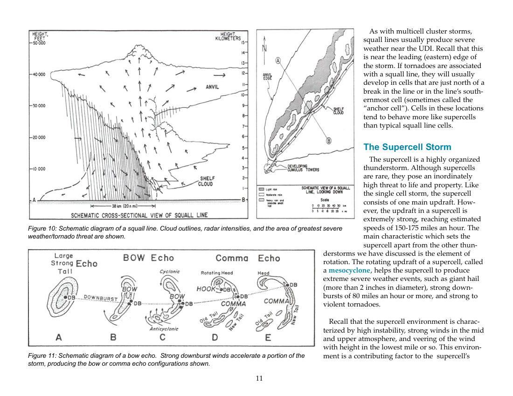

11
As with multicell cluster storms,
squall lines usually produce severe
weather near the UDI. Recall that this
is near the leading (eastern) edge of
the storm. If tornadoes are associated
with a squall line, they will usually
develop in cells that are just north of a
break in the line or in the line’s south-
ernmost cell (sometimes called the
“anchor cell”). Cells in these locations
tend to behave more like supercells
than typical squall line cells.
The Supercell Storm
The supercell is a highly organized
thunderstorm. Although supercells
are rare, they pose an inordinately
high threat to life and property. Like
the single cell storm, the supercell
consists of one main updraft. How-
ever, the updraft in a supercell is
extremely strong, reaching estimated
speeds of 150-175 miles an hour. The
main characteristic which sets the
supercell apart from the other thun-
derstorms we have discussed is the element of
rotation. The rotating updraft of a supercell, called
a mesocyclone, helps the supercell to produce
extreme severe weather events, such as giant hail
(more than 2 inches in diameter), strong down-
bursts of 80 miles an hour or more, and strong to
violent tornadoes.
Recall that the supercell environment is charac-
terized by high instability, strong winds in the mid
and upper atmosphere, and veering of the wind
with height in the lowest mile or so. This environ-
ment is a contributing factor to the  supercell’s
Figure 10: Schematic diagram of a squall line. Cloud outlines, radar intensities, and the area of greatest severe
weather/tornado threat are shown.
Figure 11: Schematic diagram of a bow echo.  Strong downburst winds accelerate a portion of the
storm, producing the bow or comma echo configurations shown.

## Page 13

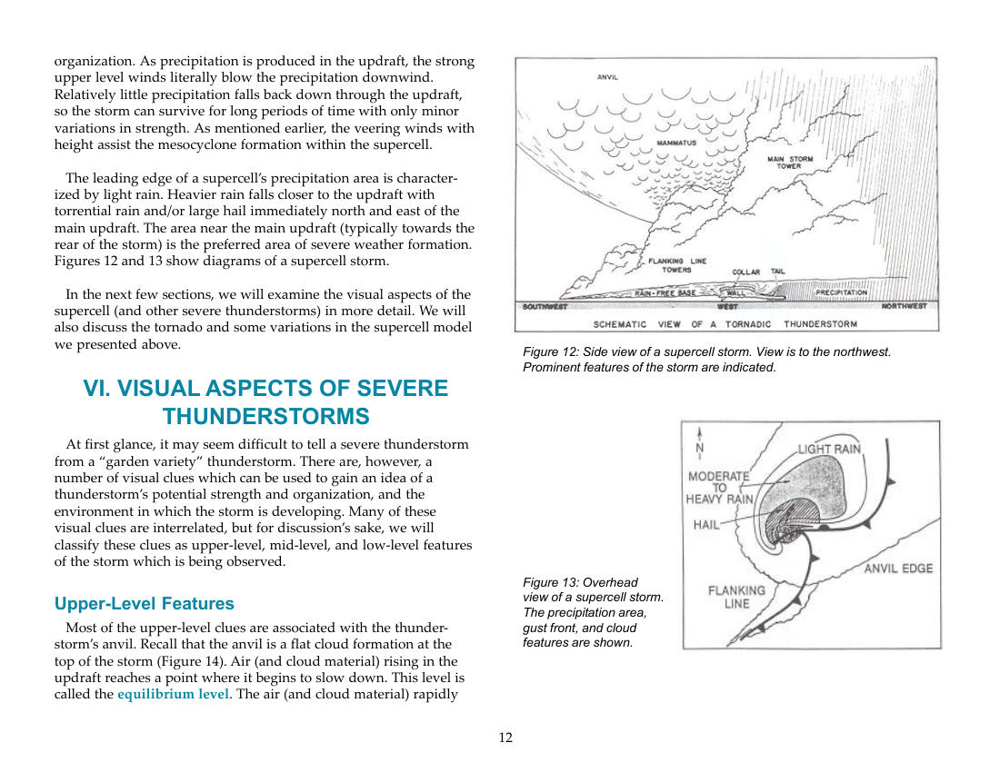

12
organization. As precipitation is produced in the updraft, the strong
upper level winds literally blow the precipitation downwind.
Relatively little precipitation falls back down through the updraft,
so the storm can survive for long periods of time with only minor
variations in strength. As mentioned earlier, the veering winds with
height assist the mesocyclone formation within the supercell.
The leading edge of a supercell’s precipitation area is character-
ized by light rain. Heavier rain falls closer to the updraft with
torrential rain and/or large hail immediately north and east of the
main updraft. The area near the main updraft (typically towards the
rear of the storm) is the preferred area of severe weather formation.
Figures 12 and 13 show diagrams of a supercell storm.
In the next few sections, we will examine the visual aspects of the
supercell (and other severe thunderstorms) in more detail. We will
also discuss the tornado and some variations in the supercell model
we presented above.
VI. VISUAL ASPECTS OF SEVERE
THUNDERSTORMS
At first glance, it may seem difficult to tell a severe thunderstorm
from a “garden variety” thunderstorm. There are, however, a
number of visual clues which can be used to gain an idea of a
thunderstorm’s potential strength and organization, and the
environment in which the storm is developing. Many of these
visual clues are interrelated, but for discussion’s sake, we will
classify these clues as upper-level, mid-level, and low-level features
of the storm which is being observed.
Upper-Level Features
Most of the upper-level clues are associated with the thunder-
storm’s anvil. Recall that the anvil is a flat cloud formation at the
top of the storm (Figure 14). Air (and cloud material) rising in the
updraft reaches a point where it begins to slow down. This level is
called the equilibrium level. The air (and cloud material) rapidly
Figure 13: Overhead
view of a supercell storm.
The precipitation area,
gust front, and cloud
features are shown.
Figure 12: Side view of a supercell storm. View is to the northwest.
Prominent features of the storm are indicated.

## Page 14

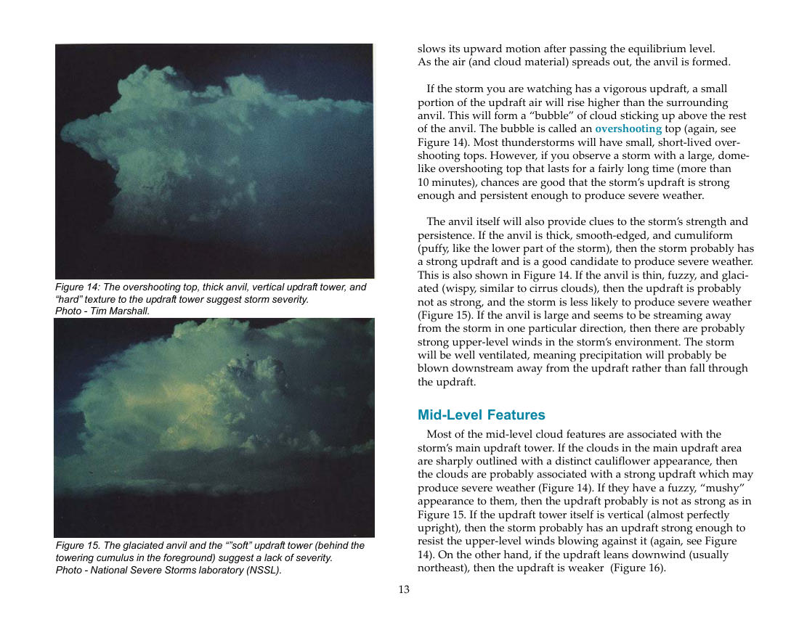

13
slows its upward motion after passing the equilibrium level.
As the air (and cloud material) spreads out, the anvil is formed.
If the storm you are watching has a vigorous updraft, a small
portion of the updraft air will rise higher than the surrounding
anvil. This will form a “bubble” of cloud sticking up above the rest
of the anvil. The bubble is called an overshooting top (again, see
Figure 14). Most thunderstorms will have small, short-lived over-
shooting tops. However, if you observe a storm with a large, dome-
like overshooting top that lasts for a fairly long time (more than
10 minutes), chances are good that the storm’s updraft is strong
enough and persistent enough to produce severe weather.
The anvil itself will also provide clues to the storm’s strength and
persistence. If the anvil is thick, smooth-edged, and cumuliform
(puffy, like the lower part of the storm), then the storm probably has
a strong updraft and is a good candidate to produce severe weather.
This is also shown in Figure 14. If the anvil is thin, fuzzy, and glaci-
ated (wispy, similar to cirrus clouds), then the updraft is probably
not as strong, and the storm is less likely to produce severe weather
(Figure 15). If the anvil is large and seems to be streaming away
from the storm in one particular direction, then there are probably
strong upper-level winds in the storm’s environment. The storm
will be well ventilated, meaning precipitation will probably be
blown downstream away from the updraft rather than fall through
the updraft.
Mid-Level Features
Most of the mid-level cloud features are associated with the
storm’s main updraft tower. If the clouds in the main updraft area
are sharply outlined with a distinct cauliflower appearance, then
the clouds are probably associated with a strong updraft which may
produce severe weather (Figure 14). If they have a fuzzy, “mushy”
appearance to them, then the updraft probably is not as strong as in
Figure 15. If the updraft tower itself is vertical (almost perfectly
upright), then the storm probably has an updraft strong enough to
resist the upper-level winds blowing against it (again, see Figure
14). On the other hand, if the updraft leans downwind (usually
northeast), then the updraft is weaker  (Figure 16).
Figure 14: The overshooting top, thick anvil, vertical updraft tower, and
“hard” texture to the updraft tower suggest storm severity.
Photo - Tim Marshall.
Figure 15. The glaciated anvil and the “”soft” updraft tower (behind the
towering cumulus in the foreground) suggest a lack of severity.
Photo - National Severe Storms laboratory (NSSL).

## Page 15

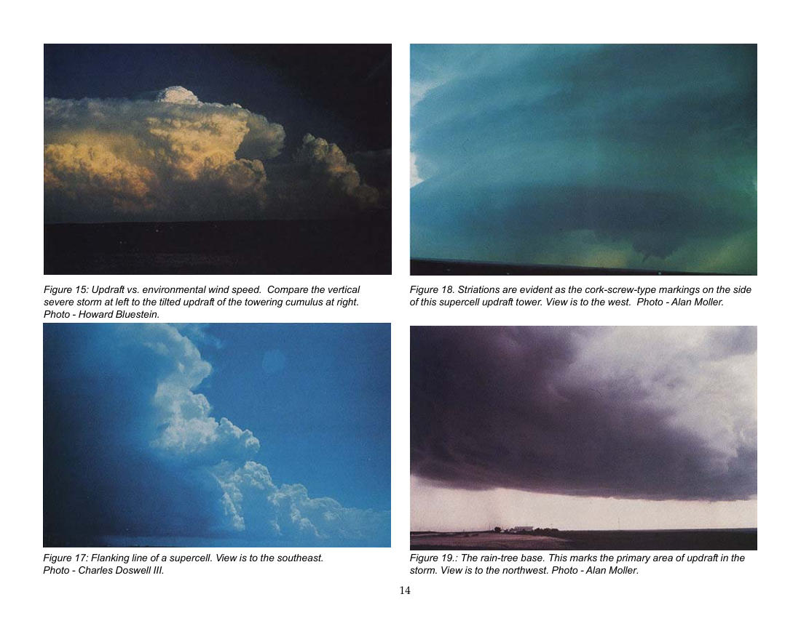

14
Figure 19.: The rain-tree base. This marks the primary area of updraft in the
storm. View is to the northwest. Photo - Alan Moller.
Figure 15: Updraft vs. environmental wind speed.  Compare the vertical
severe storm at left to the tilted updraft of the towering cumulus at right.
Photo - Howard Bluestein.
Figure 17: Flanking line of a supercell. View is to the southeast.
Photo - Charles Doswell III.
Figure 18. Striations are evident as the cork-screw-type markings on the side
of this supercell updraft tower. View is to the west.  Photo - Alan Moller.

## Page 16

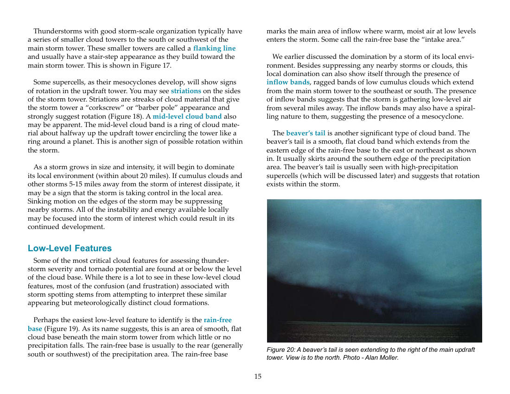

15
Thunderstorms with good storm-scale organization typically have
a series of smaller cloud towers to the south or southwest of the
main storm tower. These smaller towers are called a flanking line
and usually have a stair-step appearance as they build toward the
main storm tower. This is shown in Figure 17.
Some supercells, as their mesocyclones develop, will show signs
of rotation in the updraft tower. You may see striations on the sides
of the storm tower. Striations are streaks of cloud material that give
the storm tower a “corkscrew” or “barber pole” appearance and
strongly suggest rotation (Figure 18). A mid-level cloud band also
may be apparent. The mid-level cloud band is a ring of cloud mate-
rial about halfway up the updraft tower encircling the tower like a
ring around a planet. This is another sign of possible rotation within
the storm.
As a storm grows in size and intensity, it will begin to dominate
its local environment (within about 20 miles). If cumulus clouds and
other storms 5-15 miles away from the storm of interest dissipate, it
may be a sign that the storm is taking control in the local area.
Sinking motion on the edges of the storm may be suppressing
nearby storms. All of the instability and energy available locally
may be focused into the storm of interest which could result in its
continued development.
Low-Level Features
Some of the most critical cloud features for assessing thunder-
storm severity and tornado potential are found at or below the level
of the cloud base. While there is a lot to see in these low-level cloud
features, most of the confusion (and frustration) associated with
storm spotting stems from attempting to interpret these similar
appearing but meteorologically distinct cloud formations.
Perhaps the easiest low-level feature to identify is the rain-free
base (Figure 19). As its name suggests, this is an area of smooth, flat
cloud base beneath the main storm tower from which little or no
precipitation falls. The rain-free base is usually to the rear (generally
south or southwest) of the precipitation area. The rain-free base
marks the main area of inflow where warm, moist air at low levels
enters the storm. Some call the rain-free base the “intake area.”
We earlier discussed the domination by a storm of its local envi-
ronment. Besides suppressing any nearby storms or clouds, this
local domination can also show itself through the presence of
inflow bands, ragged bands of low cumulus clouds which extend
from the main storm tower to the southeast or south. The presence
of inflow bands suggests that the storm is gathering low-level air
from several miles away. The inflow bands may also have a spiral-
ling nature to them, suggesting the presence of a mesocyclone.
The beaver’s tail is another significant type of cloud band. The
beaver’s tail is a smooth, flat cloud band which extends from the
eastern edge of the rain-free base to the east or northeast as shown
in. It usually skirts around the southern edge of the precipitation
area. The beaver’s tail is usually seen with high-precipitation
supercells (which will be discussed later) and suggests that rotation
exists within the storm.
Figure 20: A beaver’s tail is seen extending to the right of the main updraft
tower. View is to the north. Photo - Alan Moller.

## Page 17

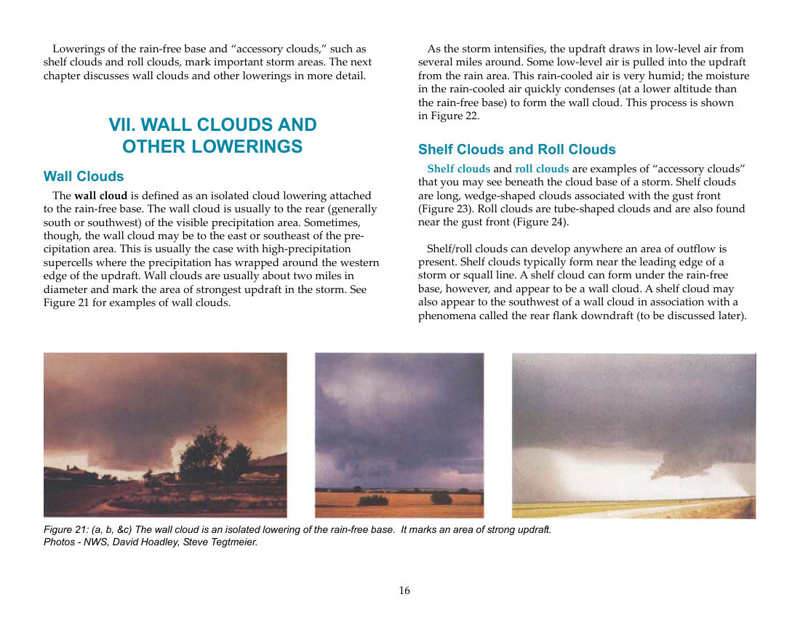

16
Lowerings of the rain-free base and “accessory clouds,” such as
shelf clouds and roll clouds, mark important storm areas. The next
chapter discusses wall clouds and other lowerings in more detail.
VII. WALL CLOUDS AND
OTHER LOWERINGS
Wall Clouds
The wall cloud is defined as an isolated cloud lowering attached
to the rain-free base. The wall cloud is usually to the rear (generally
south or southwest) of the visible precipitation area. Sometimes,
though, the wall cloud may be to the east or southeast of the pre-
cipitation area. This is usually the case with high-precipitation
supercells where the precipitation has wrapped around the western
edge of the updraft. Wall clouds are usually about two miles in
diameter and mark the area of strongest updraft in the storm. See
Figure 21 for examples of wall clouds.
As the storm intensifies, the updraft draws in low-level air from
several miles around. Some low-level air is pulled into the updraft
from the rain area. This rain-cooled air is very humid; the moisture
in the rain-cooled air quickly condenses (at a lower altitude than
the rain-free base) to form the wall cloud. This process is shown
in Figure 22.
Shelf Clouds and Roll Clouds
Shelf clouds and roll clouds are examples of “accessory clouds”
that you may see beneath the cloud base of a storm. Shelf clouds
are long, wedge-shaped clouds associated with the gust front
(Figure 23). Roll clouds are tube-shaped clouds and are also found
near the gust front (Figure 24).
Shelf/roll clouds can develop anywhere an area of outflow is
present. Shelf clouds typically form near the leading edge of a
storm or squall line. A shelf cloud can form under the rain-free
base, however, and appear to be a wall cloud. A shelf cloud may
also appear to the southwest of a wall cloud in association with a
phenomena called the rear flank downdraft (to be discussed later).
Figure 21: (a, b, &c) The wall cloud is an isolated lowering of the rain-free base.  It marks an area of strong updraft.
Photos - NWS, David Hoadley, Steve Tegtmeier.

## Page 18

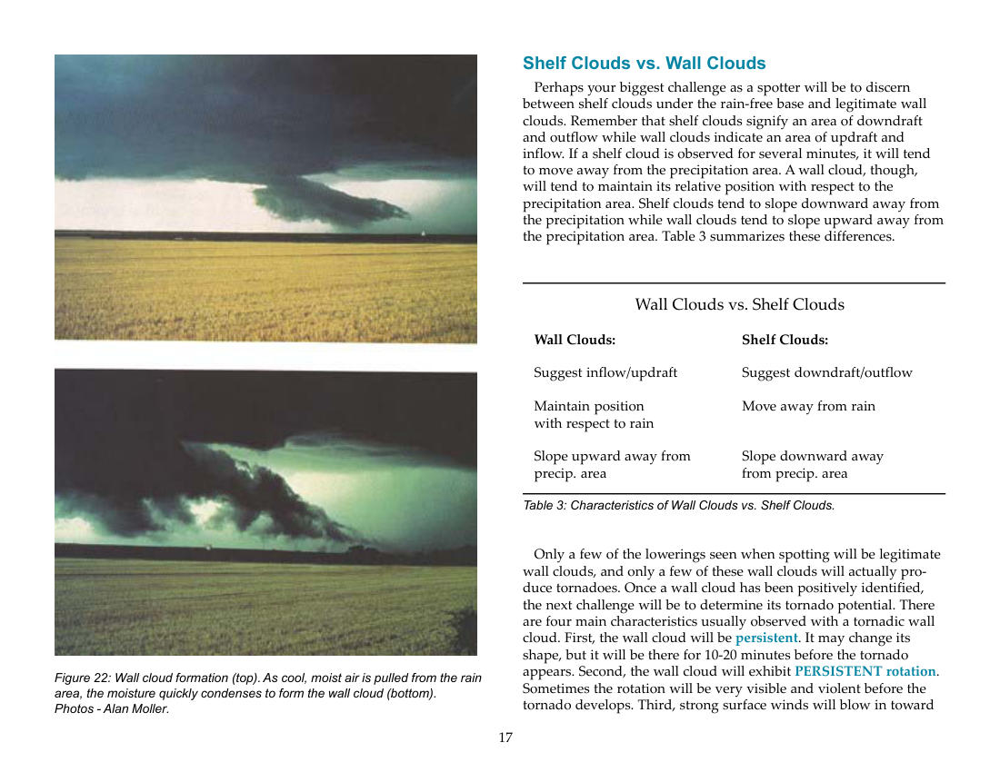

17
Shelf Clouds vs. Wall Clouds
Perhaps your biggest challenge as a spotter will be to discern
between shelf clouds under the rain-free base and legitimate wall
clouds. Remember that shelf clouds signify an area of downdraft
and outflow while wall clouds indicate an area of updraft and
inflow. If a shelf cloud is observed for several minutes, it will tend
to move away from the precipitation area. A wall cloud, though,
will tend to maintain its relative position with respect to the
precipitation area. Shelf clouds tend to slope downward away from
the precipitation while wall clouds tend to slope upward away from
the precipitation area. Table 3 summarizes these differences.
Wall Clouds vs. Shelf Clouds
Wall Clouds:
Shelf Clouds:
Suggest inflow/updraft
Suggest downdraft/outflow
Maintain position
Move away from rain
with respect to rain
Slope upward away from
Slope downward away
precip. area
from precip. area
Table 3: Characteristics of Wall Clouds vs. Shelf Clouds.
Only a few of the lowerings seen when spotting will be legitimate
wall clouds, and only a few of these wall clouds will actually pro-
duce tornadoes. Once a wall cloud has been positively identified,
the next challenge will be to determine its tornado potential. There
are four main characteristics usually observed with a tornadic wall
cloud. First, the wall cloud will be persistent. It may change its
shape, but it will be there for 10-20 minutes before the tornado
appears. Second, the wall cloud will exhibit PERSISTENT rotation.
Sometimes the rotation will be very visible and violent before the
tornado develops. Third, strong surface winds will blow in toward
Figure 22: Wall cloud formation (top). As cool, moist air is pulled from the rain
area, the moisture quickly condenses to form the wall cloud (bottom).
Photos - Alan Moller.

## Page 19

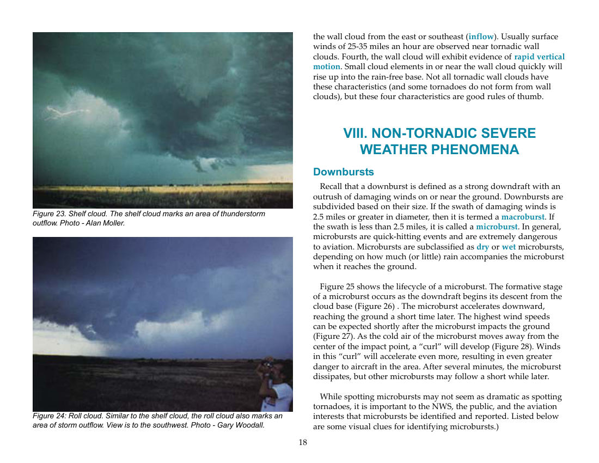

18
the wall cloud from the east or southeast (inflow). Usually surface
winds of 25-35 miles an hour are observed near tornadic wall
clouds. Fourth, the wall cloud will exhibit evidence of rapid vertical
motion. Small cloud elements in or near the wall cloud quickly will
rise up into the rain-free base. Not all tornadic wall clouds have
these characteristics (and some tornadoes do not form from wall
clouds), but these four characteristics are good rules of thumb.
VIII. NON-TORNADIC SEVERE
WEATHER PHENOMENA
Downbursts
Recall that a downburst is defined as a strong downdraft with an
outrush of damaging winds on or near the ground. Downbursts are
subdivided based on their size. If the swath of damaging winds is
2.5 miles or greater in diameter, then it is termed a macroburst. If
the swath is less than 2.5 miles, it is called a microburst. In general,
microbursts are quick-hitting events and are extremely dangerous
to aviation. Microbursts are subclassified as dry or wet microbursts,
depending on how much (or little) rain accompanies the microburst
when it reaches the ground.
Figure 25 shows the lifecycle of a microburst. The formative stage
of a microburst occurs as the downdraft begins its descent from the
cloud base (Figure 26) . The microburst accelerates downward,
reaching the ground a short time later. The highest wind speeds
can be expected shortly after the microburst impacts the ground
(Figure 27). As the cold air of the microburst moves away from the
center of the impact point, a “curl” will develop (Figure 28). Winds
in this “curl” will accelerate even more, resulting in even greater
danger to aircraft in the area. After several minutes, the microburst
dissipates, but other microbursts may follow a short while later.
While spotting microbursts may not seem as dramatic as spotting
tornadoes, it is important to the NWS, the public, and the aviation
interests that microbursts be identified and reported. Listed below
are some visual clues for identifying microbursts.)
Figure 23. Shelf cloud. The shelf cloud marks an area of thunderstorm
outflow. Photo - Alan Moller.
Figure 24: Roll cloud. Similar to the shelf cloud, the roll cloud also marks an
area of storm outflow. View is to the southwest. Photo - Gary Woodall.

## Page 20

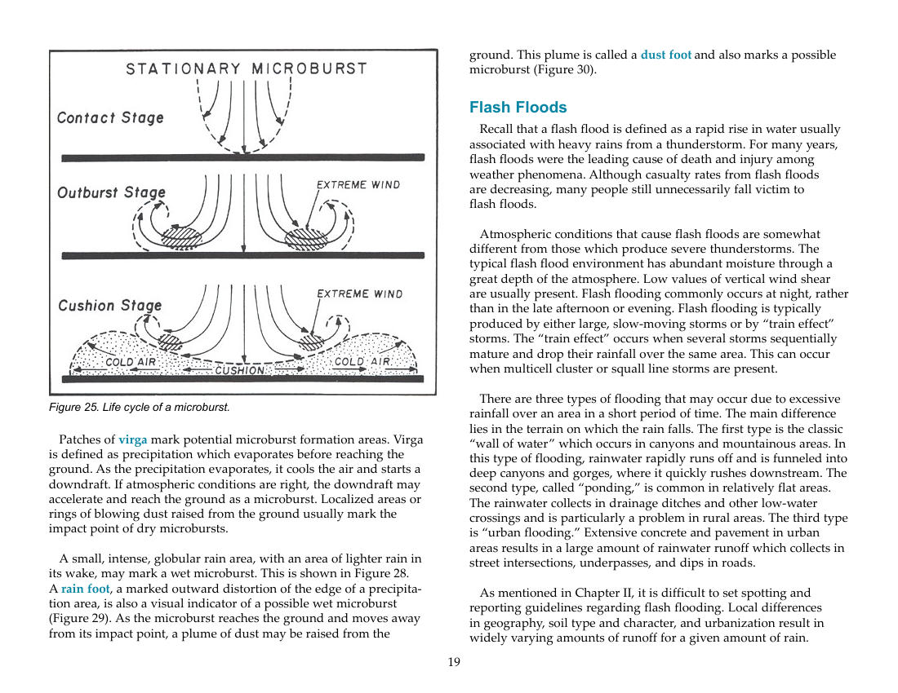

19
Patches of virga mark potential microburst formation areas. Virga
is defined as precipitation which evaporates before reaching the
ground. As the precipitation evaporates, it cools the air and starts a
downdraft. If atmospheric conditions are right, the downdraft may
accelerate and reach the ground as a microburst. Localized areas or
rings of blowing dust raised from the ground usually mark the
impact point of dry microbursts.
A small, intense, globular rain area, with an area of lighter rain in
its wake, may mark a wet microburst. This is shown in Figure 28.
A rain foot, a marked outward distortion of the edge of a precipita-
tion area, is also a visual indicator of a possible wet microburst
(Figure 29). As the microburst reaches the ground and moves away
from its impact point, a plume of dust may be raised from the
ground. This plume is called a dust foot and also marks a possible
microburst (Figure 30).
Flash Floods
Recall that a flash flood is defined as a rapid rise in water usually
associated with heavy rains from a thunderstorm. For many years,
flash floods were the leading cause of death and injury among
weather phenomena. Although casualty rates from flash floods
are decreasing, many people still unnecessarily fall victim to
flash floods.
Atmospheric conditions that cause flash floods are somewhat
different from those which produce severe thunderstorms. The
typical flash flood environment has abundant moisture through a
great depth of the atmosphere. Low values of vertical wind shear
are usually present. Flash flooding commonly occurs at night, rather
than in the late afternoon or evening. Flash flooding is typically
produced by either large, slow-moving storms or by “train effect”
storms. The “train effect” occurs when several storms sequentially
mature and drop their rainfall over the same area. This can occur
when multicell cluster or squall line storms are present.
There are three types of flooding that may occur due to excessive
rainfall over an area in a short period of time. The main difference
lies in the terrain on which the rain falls. The first type is the classic
“wall of water” which occurs in canyons and mountainous areas. In
this type of flooding, rainwater rapidly runs off and is funneled into
deep canyons and gorges, where it quickly rushes downstream. The
second type, called “ponding,” is common in relatively flat areas.
The rainwater collects in drainage ditches and other low-water
crossings and is particularly a problem in rural areas. The third type
is “urban flooding.” Extensive concrete and pavement in urban
areas results in a large amount of rainwater runoff which collects in
street intersections, underpasses, and dips in roads.
As mentioned in Chapter II, it is difficult to set spotting and
reporting guidelines regarding flash flooding. Local differences
in geography, soil type and character, and urbanization result in
widely varying amounts of runoff for a given amount of rain.
Figure 25. Life cycle of a microburst.

## Page 21

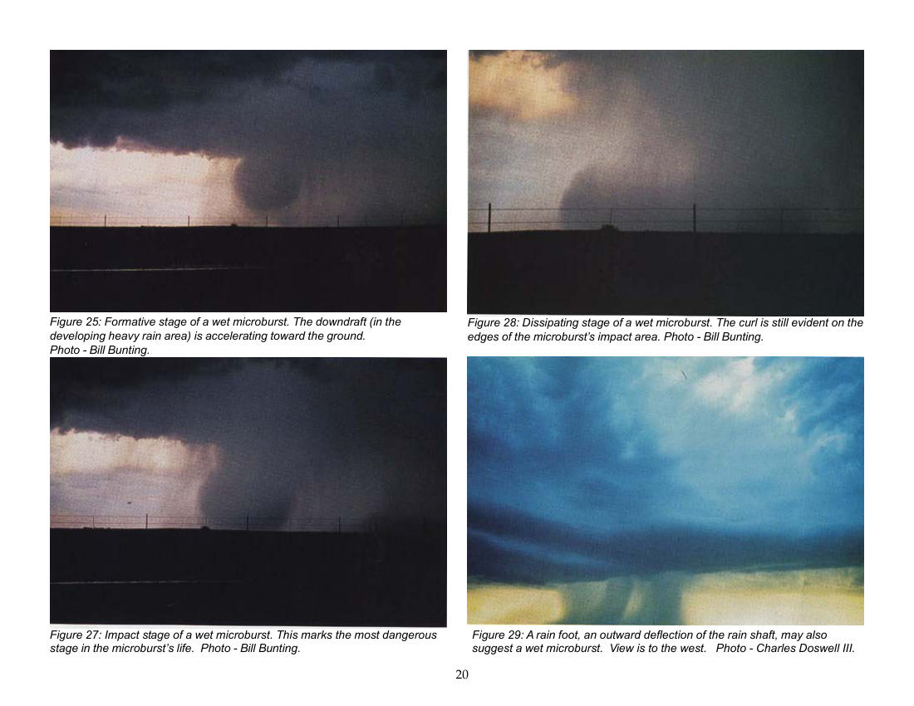

20
Figure 25: Formative stage of a wet microburst. The downdraft (in the
developing heavy rain area) is accelerating toward the ground.
Photo - Bill Bunting.
Figure 27: Impact stage of a wet microburst. This marks the most dangerous
stage in the microburst’s life.  Photo - Bill Bunting.
Figure 28: Dissipating stage of a wet microburst. The curl is still evident on the
edges of the microburst’s impact area. Photo - Bill Bunting.
Figure 29: A rain foot, an outward deflection of the rain shaft, may also
suggest a wet microburst.  View is to the west.   Photo - Charles Doswell III.

## Page 22

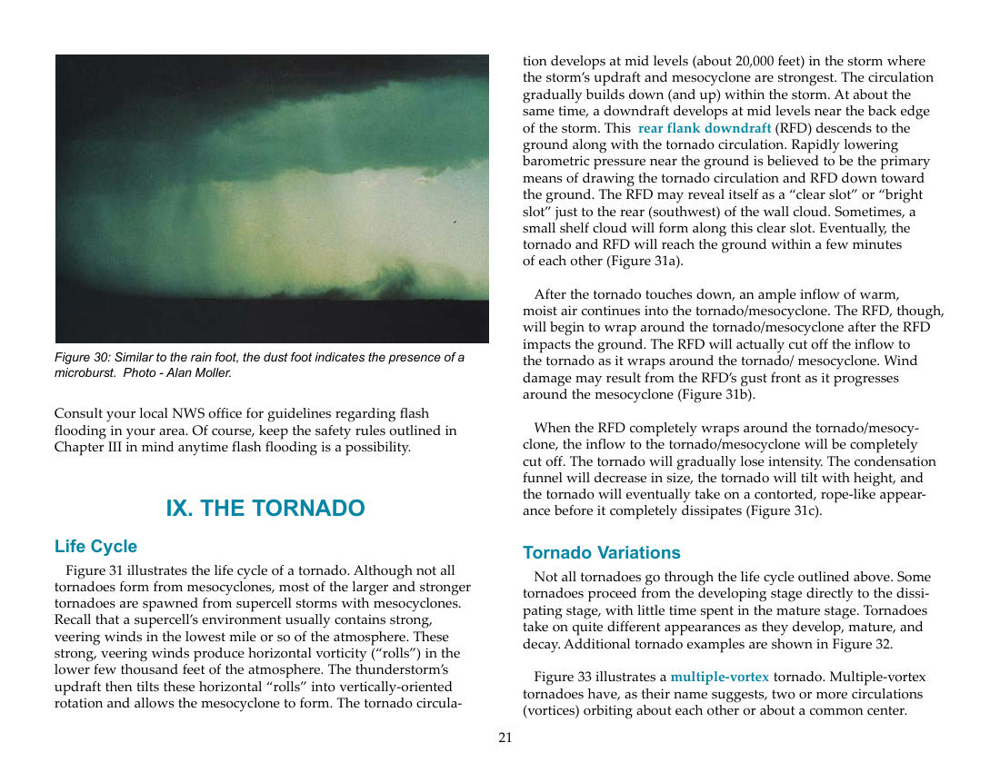

21
Consult your local NWS office for guidelines regarding flash
flooding in your area. Of course, keep the safety rules outlined in
Chapter III in mind anytime flash flooding is a possibility.
IX. THE TORNADO
Life Cycle
Figure 31 illustrates the life cycle of a tornado. Although not all
tornadoes form from mesocyclones, most of the larger and stronger
tornadoes are spawned from supercell storms with mesocyclones.
Recall that a supercell’s environment usually contains strong,
veering winds in the lowest mile or so of the atmosphere. These
strong, veering winds produce horizontal vorticity (“rolls”) in the
lower few thousand feet of the atmosphere. The thunderstorm’s
updraft then tilts these horizontal “rolls” into vertically-oriented
rotation and allows the mesocyclone to form. The tornado circula-
tion develops at mid levels (about 20,000 feet) in the storm where
the storm’s updraft and mesocyclone are strongest. The circulation
gradually builds down (and up) within the storm. At about the
same time, a downdraft develops at mid levels near the back edge
of the storm. This  rear flank downdraft (RFD) descends to the
ground along with the tornado circulation. Rapidly lowering
barometric pressure near the ground is believed to be the primary
means of drawing the tornado circulation and RFD down toward
the ground. The RFD may reveal itself as a “clear slot” or “bright
slot” just to the rear (southwest) of the wall cloud. Sometimes, a
small shelf cloud will form along this clear slot. Eventually, the
tornado and RFD will reach the ground within a few minutes
of each other (Figure 31a).
After the tornado touches down, an ample inflow of warm,
moist air continues into the tornado/mesocyclone. The RFD, though,
will begin to wrap around the tornado/mesocyclone after the RFD
impacts the ground. The RFD will actually cut off the inflow to
the tornado as it wraps around the tornado/ mesocyclone. Wind
damage may result from the RFD’s gust front as it progresses
around the mesocyclone (Figure 31b).
When the RFD completely wraps around the tornado/mesocy-
clone, the inflow to the tornado/mesocyclone will be completely
cut off. The tornado will gradually lose intensity. The condensation
funnel will decrease in size, the tornado will tilt with height, and
the tornado will eventually take on a contorted, rope-like appear-
ance before it completely dissipates (Figure 31c).
Tornado Variations
Not all tornadoes go through the life cycle outlined above. Some
tornadoes proceed from the developing stage directly to the dissi-
pating stage, with little time spent in the mature stage. Tornadoes
take on quite different appearances as they develop, mature, and
decay. Additional tornado examples are shown in Figure 32.
Figure 33 illustrates a multiple-vortex tornado. Multiple-vortex
tornadoes have, as their name suggests, two or more circulations
(vortices) orbiting about each other or about a common center.
Figure 30: Similar to the rain foot, the dust foot indicates the presence of a
microburst.  Photo - Alan Moller.

## Page 23

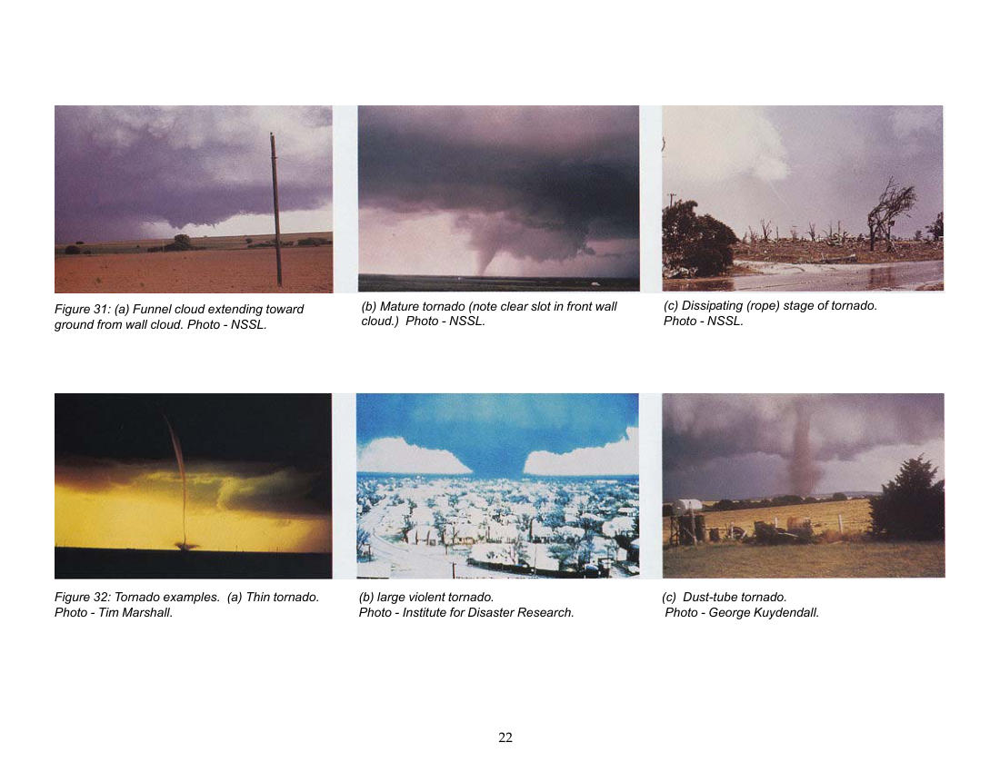

22
Figure 31: (a) Funnel cloud extending toward
ground from wall cloud. Photo - NSSL.
Figure 32: Tornado examples.  (a) Thin tornado.
Photo - Tim Marshall.
(b) Mature tornado (note clear slot in front wall
cloud.)  Photo - NSSL.
(c) Dissipating (rope) stage of tornado.
Photo - NSSL.
(b) large violent tornado.
Photo - Institute for Disaster Research.
(c)  Dust-tube tornado.
 Photo - George Kuydendall.

## Page 24

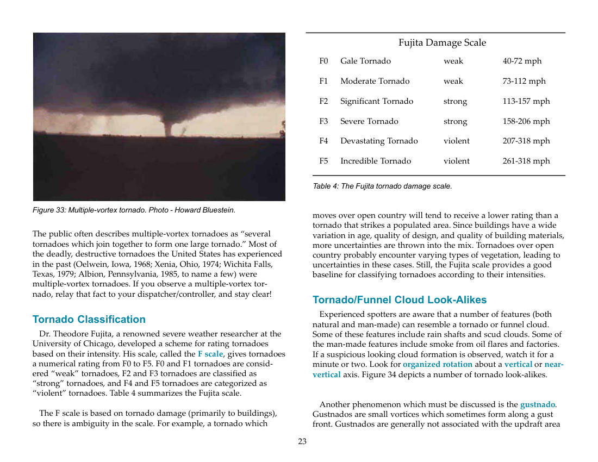

23
The public often describes multiple-vortex tornadoes as “several
tornadoes which join together to form one large tornado.” Most of
the deadly, destructive tornadoes the United States has experienced
in the past (Oelwein, Iowa, 1968; Xenia, Ohio, 1974; Wichita Falls,
Texas, 1979; Albion, Pennsylvania, 1985, to name a few) were
multiple-vortex tornadoes. If you observe a multiple-vortex tor-
nado, relay that fact to your dispatcher/controller, and stay clear!
Tornado Classification
Dr. Theodore Fujita, a renowned severe weather researcher at the
University of Chicago, developed a scheme for rating tornadoes
based on their intensity. His scale, called the F scale, gives tornadoes
a numerical rating from F0 to F5. F0 and F1 tornadoes are consid-
ered “weak” tornadoes, F2 and F3 tornadoes are classified as
“strong” tornadoes, and F4 and F5 tornadoes are categorized as
“violent” tornadoes. Table 4 summarizes the Fujita scale.
The F scale is based on tornado damage (primarily to buildings),
so there is ambiguity in the scale. For example, a tornado which
moves over open country will tend to receive a lower rating than a
tornado that strikes a populated area. Since buildings have a wide
variation in age, quality of design, and quality of building materials,
more uncertainties are thrown into the mix. Tornadoes over open
country probably encounter varying types of vegetation, leading to
uncertainties in these cases. Still, the Fujita scale provides a good
baseline for classifying tornadoes according to their intensities.
Tornado/Funnel Cloud Look-Alikes
Experienced spotters are aware that a number of features (both
natural and man-made) can resemble a tornado or funnel cloud.
Some of these features include rain shafts and scud clouds. Some of
the man-made features include smoke from oil flares and factories.
If a suspicious looking cloud formation is observed, watch it for a
minute or two. Look for organized rotation about a vertical or near-
vertical axis. Figure 34 depicts a number of tornado look-alikes.
Another phenomenon which must be discussed is the gustnado.
Gustnados are small vortices which sometimes form along a gust
front. Gustnados are generally not associated with the updraft area
Figure 33: Multiple-vortex tornado. Photo - Howard Bluestein.
F0
Gale Tornado
weak
40-72 mph
F1
Moderate Tornado
weak
73-112 mph
F2
Significant Tornado
strong
113-157 mph
F3
Severe Tornado
strong
158-206 mph
F4
Devastating Tornado
violent
207-318 mph
F5
Incredible Tornado
violent
261-318 mph
Fujita Damage Scale
Table 4: The Fujita tornado damage scale.

## Page 25

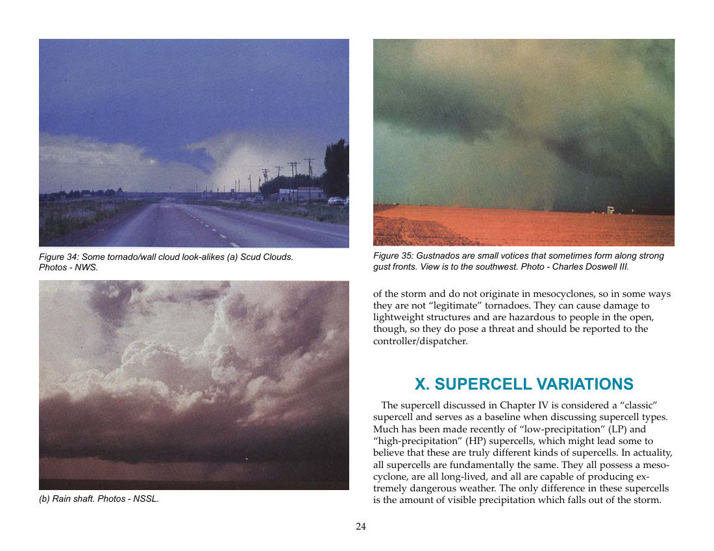

24
of the storm and do not originate in mesocyclones, so in some ways
they are not “legitimate” tornadoes. They can cause damage to
lightweight structures and are hazardous to people in the open,
though, so they do pose a threat and should be reported to the
controller/dispatcher.
X. SUPERCELL VARIATIONS
The supercell discussed in Chapter IV is considered a “classic”
supercell and serves as a baseline when discussing supercell types.
Much has been made recently of “low-precipitation” (LP) and
“high-precipitation” (HP) supercells, which might lead some to
believe that these are truly different kinds of supercells. In actuality,
all supercells are fundamentally the same. They all possess a meso-
cyclone, are all long-lived, and all are capable of producing ex-
tremely dangerous weather. The only difference in these supercells
is the amount of visible precipitation which falls out of the storm.
Figure 34: Some tornado/wall cloud look-alikes (a) Scud Clouds.
Photos - NWS.
(b) Rain shaft. Photos - NSSL.
Figure 35: Gustnados are small votices that sometimes form along strong
gust fronts. View is to the southwest. Photo - Charles Doswell III.

## Page 26

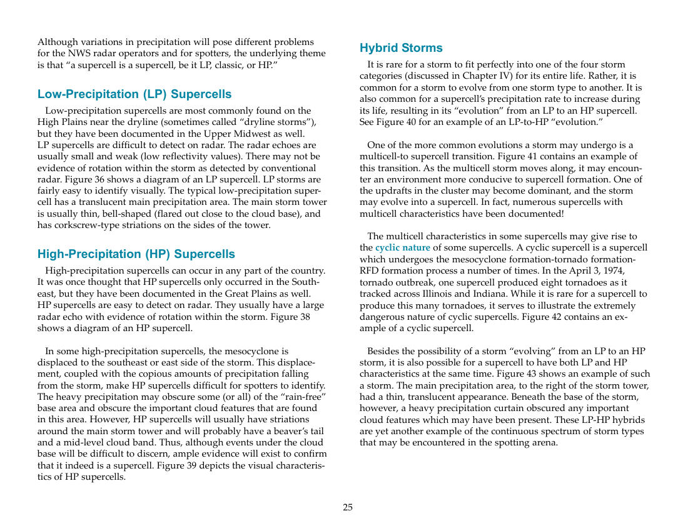

25
Although variations in precipitation will pose different problems
for the NWS radar operators and for spotters, the underlying theme
is that “a supercell is a supercell, be it LP, classic, or HP.”
Low-Precipitation (LP) Supercells
Low-precipitation supercells are most commonly found on the
High Plains near the dryline (sometimes called “dryline storms”),
but they have been documented in the Upper Midwest as well.
LP supercells are difficult to detect on radar. The radar echoes are
usually small and weak (low reflectivity values). There may not be
evidence of rotation within the storm as detected by conventional
radar. Figure 36 shows a diagram of an LP supercell. LP storms are
fairly easy to identify visually. The typical low-precipitation super-
cell has a translucent main precipitation area. The main storm tower
is usually thin, bell-shaped (flared out close to the cloud base), and
has corkscrew-type striations on the sides of the tower.
High-Precipitation (HP) Supercells
High-precipitation supercells can occur in any part of the country.
It was once thought that HP supercells only occurred in the South-
east, but they have been documented in the Great Plains as well.
HP supercells are easy to detect on radar. They usually have a large
radar echo with evidence of rotation within the storm. Figure 38
shows a diagram of an HP supercell.
In some high-precipitation supercells, the mesocyclone is
displaced to the southeast or east side of the storm. This displace-
ment, coupled with the copious amounts of precipitation falling
from the storm, make HP supercells difficult for spotters to identify.
The heavy precipitation may obscure some (or all) of the “rain-free”
base area and obscure the important cloud features that are found
in this area. However, HP supercells will usually have striations
around the main storm tower and will probably have a beaver’s tail
and a mid-level cloud band. Thus, although events under the cloud
base will be difficult to discern, ample evidence will exist to confirm
that it indeed is a supercell. Figure 39 depicts the visual characteris-
tics of HP supercells.
Hybrid Storms
It is rare for a storm to fit perfectly into one of the four storm
categories (discussed in Chapter IV) for its entire life. Rather, it is
common for a storm to evolve from one storm type to another. It is
also common for a supercell’s precipitation rate to increase during
its life, resulting in its “evolution” from an LP to an HP supercell.
See Figure 40 for an example of an LP-to-HP “evolution.”
One of the more common evolutions a storm may undergo is a
multicell-to supercell transition. Figure 41 contains an example of
this transition. As the multicell storm moves along, it may encoun-
ter an environment more conducive to supercell formation. One of
the updrafts in the cluster may become dominant, and the storm
may evolve into a supercell. In fact, numerous supercells with
multicell characteristics have been documented!
The multicell characteristics in some supercells may give rise to
the cyclic nature of some supercells. A cyclic supercell is a supercell
which undergoes the mesocyclone formation-tornado formation-
RFD formation process a number of times. In the April 3, 1974,
tornado outbreak, one supercell produced eight tornadoes as it
tracked across Illinois and Indiana. While it is rare for a supercell to
produce this many tornadoes, it serves to illustrate the extremely
dangerous nature of cyclic supercells. Figure 42 contains an ex-
ample of a cyclic supercell.
Besides the possibility of a storm “evolving” from an LP to an HP
storm, it is also possible for a supercell to have both LP and HP
characteristics at the same time. Figure 43 shows an example of such
a storm. The main precipitation area, to the right of the storm tower,
had a thin, translucent appearance. Beneath the base of the storm,
however, a heavy precipitation curtain obscured any important
cloud features which may have been present. These LP-HP hybrids
are yet another example of the continuous spectrum of storm types
that may be encountered in the spotting arena.

## Page 27

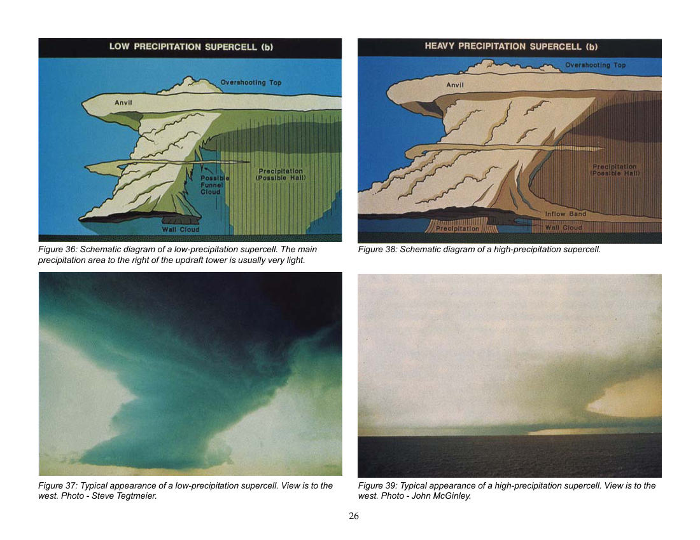

26
Figure 36: Schematic diagram of a low-precipitation supercell. The main
precipitation area to the right of the updraft tower is usually very light.
Figure 37: Typical appearance of a low-precipitation supercell. View is to the
west. Photo - Steve Tegtmeier.
Figure 38: Schematic diagram of a high-precipitation supercell.
Figure 39: Typical appearance of a high-precipitation supercell. View is to the
west. Photo - John McGinley.

## Page 28

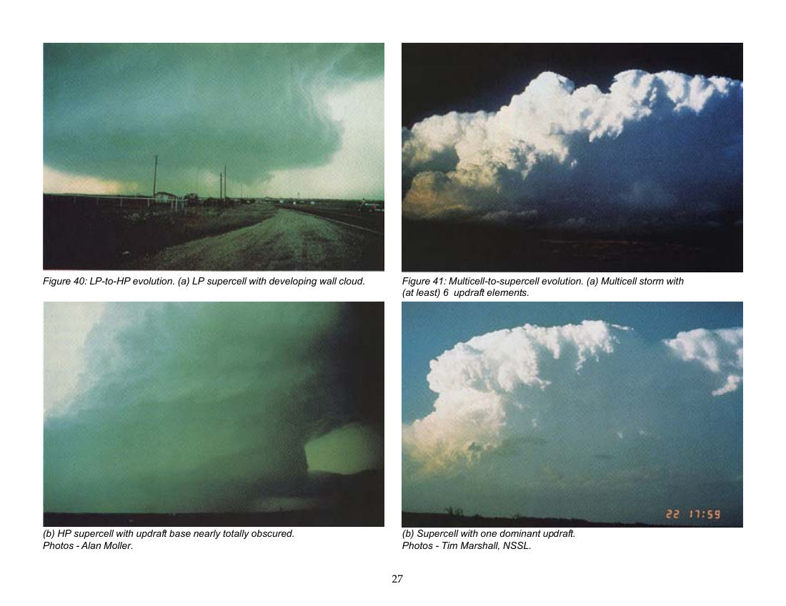

27
Figure 40: LP-to-HP evolution. (a) LP supercell with developing wall cloud.
(b) HP supercell with updraft base nearly totally obscured.
Photos - Alan Moller.
Figure 41: Multicell-to-supercell evolution. (a) Multicell storm with
(at least) 6  updraft elements.
(b) Supercell with one dominant updraft.
Photos - Tim Marshall, NSSL.

## Page 29

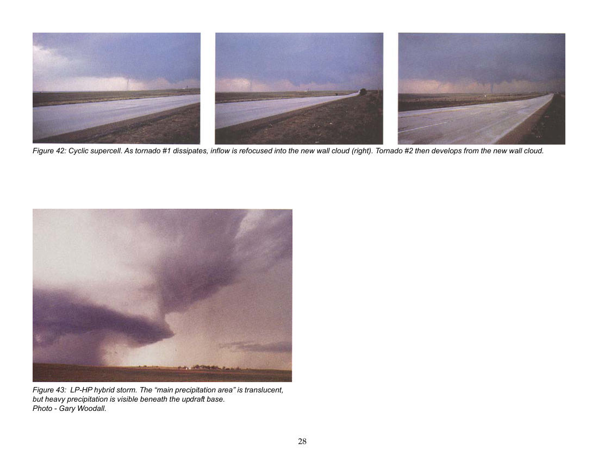

28
Figure 42: Cyclic supercell. As tornado #1 dissipates, inflow is refocused into the new wall cloud (right). Tornado #2 then develops from the new wall cloud.
Figure 43:  LP-HP hybrid storm. The “main precipitation area” is translucent,
but heavy precipitation is visible beneath the updraft base.
Photo - Gary Woodall.

## Page 30

29
Acknowledgments
This guide represents a continuing effort of the NWS and NSSL to provide improved training materials to storm spotters. Dr. Charles Doswell
III of NSSL and Alan Moller, WFO Fort Worth, TX, provided fundamental input and guidance regarding the guide. Andy Anderson, WFO
Lubbock, TX, provided helpful review and comments. Dr. Jerry Jurica of Texas Tech University, Charles Brown, and Melody Woodall assisted
with the production of the guide’s first edition. NSSL diagrams were provided by Joan O’Bannon. Special thanks go to Bill Alexander and Linda
Kremkau from Weather Service Headquarters and to Sue Dietterle from NOAA Visual Arts for their painstaking reviewing and editing of the
final layout. The online version was created by Melody Magnus.
Figure Credits
Cover & Title Page - Photo by Alan Moller.
Figures 1-3 - From C.A. Doswell III, 1985:
The Operational Meteorology of Convec-
tive Weather.* NOAA Tech Memo ERL
ESG-15. (C.A. Doswell III, 1985, Vol 2).
* Volume 2 - Storm-Scale Analysis.
Figures 4-5 - Photos by Alan Moller.
Figure 6 - A.R. Moller & C.A. Doswell III,
1987: A Proposed Advanced Storm
Spotter’s Training Program. Preprints, 15th
Conf. on Severe Local Storms, Baltimore,
MD, 173-177.
Figure 7 - C.A. Doswell III, 1985, Vol. 2.
Figure 8-9 -  Courtesy of NSSL.
Figure 10 - C.A. Doswell III, 1985, Vol. 2.
Figure 11 - T.T. Fujita, 1978: Manual
of Downburst Identification for Project
NIMROD. SMRP Res. Pap. No. 156,
Univ. of Chicago, 104 pp.
Figures 12-13 - C.A. Doswell III, 1985,
Vol. 2.
Figure 14 - Photo by Tim Marshall.
Figure 15 - Photo by NSSL.
Figure 16 - Photo by Howard Bluestein.
Figure 17 - Photo by Charles Doswell III.
Figures 18-20 - Photos by Alan Moller.
Figure 21 (a, b & c) - Photos by NWS,
David Hoadley, Steve Tegtmeier.
Figure 22 - 23 Photos by Alan Moller.
Figure 24 - Photo by Gary Woodall.
Figure 25 - T.T. Fujita, 1981: Tornadoes and
Downbursts in Context of Gen. Planetary
Scales. J. Atmos. Sci., 38, 1512-1534.
Figures 26-28 - Photos by Bill Bunting.
Figure 29 - Photo by Charles Doswell III.
Figure 30 - Photo by Alan Moller.
Figure 31 (a & b) - Photos by Steve
Tegtmeier.
Figure 31 (c) - Photo by NSSL.
Figure 32 (a, b, c) - Photos by Tim
Marshall, Institute for Disaster Research,
George Kuykendall.
Figure 33 - Photo by Howard Bluestein.
Figure 34 (a & b) - Photos by William
Alexander and NSSL.
Figure 35 - Photo by Charles Doswell III.
Figures 36 & 38 - From C.A. Doswell III,
A.R. Moller, and R. Przybylinski, 1990:
A Unified Set of Conceptual Models for
Variations on Supercell Theme. Preprints,
16th Conf. on Severe Local Storms,
Kananaskis, Alta, Canada, 40-45.
Figure 37 - Photo by Steve Tegtmeier.
Figure 39 - Photo by John McGinley.
Figure 40 (a & b) - Photos by Alan Moller.
Figure 41 (a & b) - Photos by Tim Marshall.
Figures 42-43 - Photos by Gary Woodall.
