# Basic Spotter's Field Guide

> Source: <http://www.weather.gov/media/zhu/ZHU_Training_Page/spotter_talk_brochures/basicspot.pdf>  
> Section: Weather Handbooks and Important Links  
> Captured: 2026-08-19 06:00 UTC  
> PDF: [basic-spotter-s-field-guide.pdf](basic-spotter-s-field-guide.pdf) (22 pages)

---

## Page 1

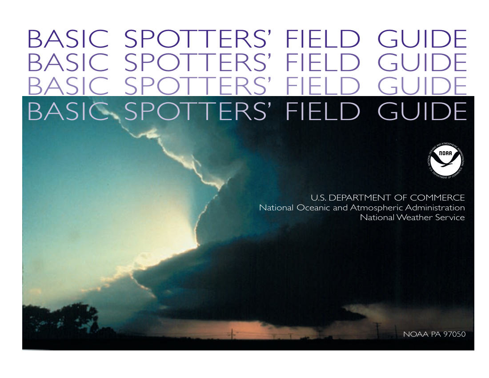

U.S. DEPARTMENT OF COMMERCE
National Oceanic and Atmospheric Administration
National Weather Service
BASIC SPOTTERS’ FIELD GUIDE
BASIC SPOTTERS’ FIELD GUIDE
BASIC SPOTTERS’ FIELD GUIDE
BASIC SPOTTERS’ FIELD GUIDE
NOAA PA 97050
N
A
T
I
O
N
A
L
 
O
C
E
A
N
I
C
 
A
N
D
 
A
T
M
O
S
P
H
E
R
I
C
 
A
D
M
I
N
I
S
T
R
A
T
I
O
N
U
.
S
. 
D
E
P
A
R
T
M
E
N
T
 
O
F
 
C
O
M
M
E
R
C
E

## Page 2

Cover Photo - National Severe Storms Laboratory

## Page 3

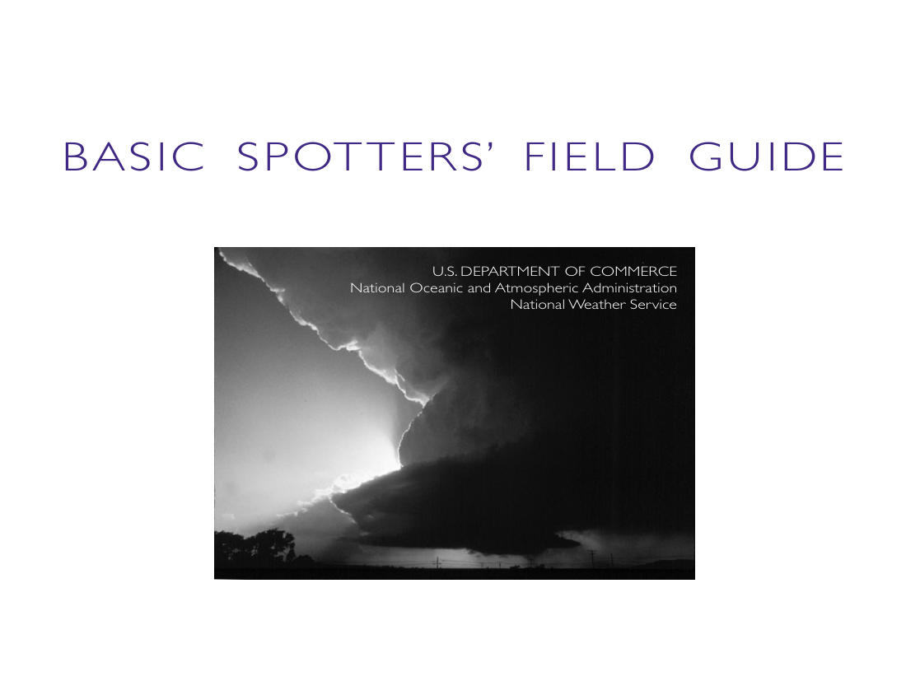

BASIC SPOTTERS’ FIELD GUIDE
U.S. DEPARTMENT OF COMMERCE
National Oceanic and Atmospheric Administration
National Weather Service

## Page 4

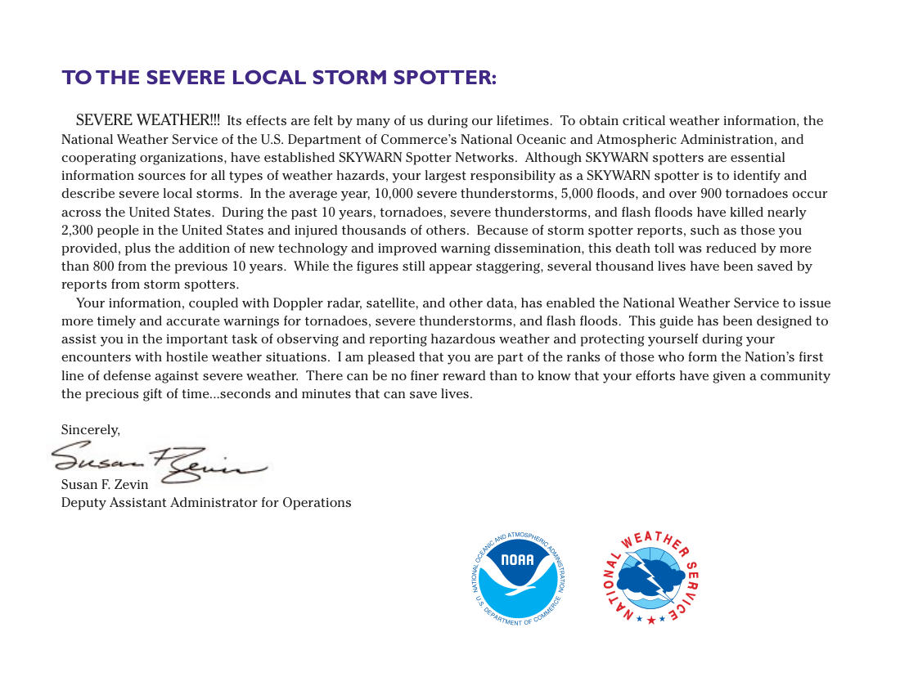

TO THE SEVERE LOCAL STORM SPOTTER:
SEVERE WEATHER!!!  Its effects are felt by many of us during our lifetimes.  To obtain critical weather information, the
National Weather Service of the U.S. Department of Commerce’s National Oceanic and Atmospheric Administration, and
cooperating organizations, have established SKYWARN Spotter Networks.  Although SKYWARN spotters are essential
information sources for all types of weather hazards, your largest responsibility as a SKYWARN spotter is to identify and
describe severe local storms.  In the average year, 10,000 severe thunderstorms, 5,000 floods, and over 900 tornadoes occur
across the United States.  During the past 10 years, tornadoes, severe thunderstorms, and flash floods have killed nearly
2,300 people in the United States and injured thousands of others.  Because of storm spotter reports, such as those you
provided, plus the addition of new technology and improved warning dissemination, this death toll was reduced by more
than 800 from the previous 10 years.  While the figures still appear staggering, several thousand lives have been saved by
reports from storm spotters.
Your information, coupled with Doppler radar, satellite, and other data, has enabled the National Weather Service to issue
more timely and accurate warnings for tornadoes, severe thunderstorms, and flash floods.  This guide has been designed to
assist you in the important task of observing and reporting hazardous weather and protecting yourself during your
encounters with hostile weather situations.  I am pleased that you are part of the ranks of those who form the Nation’s first
line of defense against severe weather.  There can be no finer reward than to know that your efforts have given a community
the precious gift of time...seconds and minutes that can save lives.
Sincerely,
Susan F. Zevin
Deputy Assistant Administrator for Operations
N
A
T
I
O
N
A
L
 
O
C
E
A
N
I
C
 
A
N
D
 
A
T
M
O
S
P
H
E
R
I
C
 
A
D
M
I
N
I
S
T
R
A
T
I
O
N
U
.
S
. 
D
E
P
A
R
T
M
E
N
T
 
O
F
 
C
O
M
M
E
R
C
E

## Page 5

Use of this Guide:
The information contained in this guide is provided as a reference to supplement the National Weather Service’s spotter training film and
slide series.  It is not sufficient to qualify you as a SKYWARN spotter.  This guide has been compiled for use by trained spotters in the field
(both fixed and mobile spotters) and communication specialists who receive and relay the reports.  The safety tips contained in this guide
are geared primarily for mobile spotters, but the technical concepts that are outlined are applicable to spotters of all types.  This guide is
not a general handout for the public.  As a result of its specialized subject matter, a number of technical terms are used.  Their meanings are
explained in the text.  Many of the photos used in this guide were taken in the Great Plains area of the United States where visibilities usually
are good.  Spotters in other areas of the country, especially the southern states, may have difficulty seeing some of the thunderstorm’s
features because of poor visibility caused by terrain, trees, heavy rainfall, or low clouds.
Definitions and Terminology
Severe local storms occur in all parts of the continental United
States in an average year.  As part of their training, storm spotters
should be aware of severe storm definitions and terminology used by
the National Weather Service.
Watch — Conditions are favorable for the severe weather event in
or near the watch area.  Watches are issued for tornadoes, severe
thunderstorms, and flash floods.
Warning — The severe weather event is imminent or occurring in
the warned area.  Warnings are issued for tornadoes, severe
thunderstorms, flash floods, and river flooding.
Severe Thunderstorm — A storm that produces hail 3/4 inch in
diameter or larger and/or wind gusts of 58 mph or more.
Tornado — A violently rotating column of air attached to a
thunderstorm and in contact with the ground.
Funnel Cloud — A rotating, funnel-shaped cloud extending
downward from a thunderstorm base.
Downburst — A strong downdraft with an outrush of damaging
wind on or near the ground.
Flash Flood — A rapid rise in water, usually within 12 hours of a
period of heavy rain or other causative agent (i.e., dam break).

## Page 6

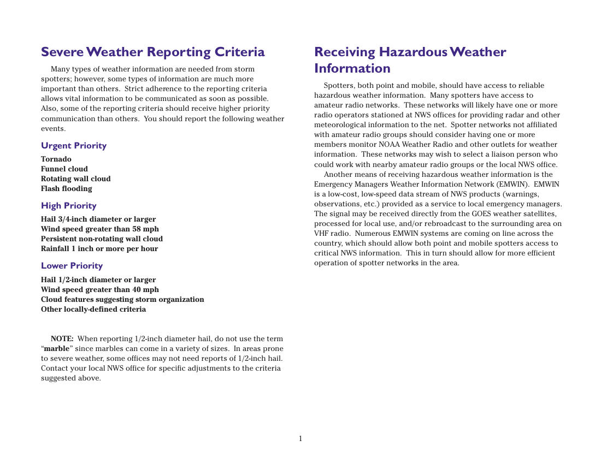

Severe Weather Reporting Criteria
Many types of weather information are needed from storm
spotters; however, some types of information are much more
important than others.  Strict adherence to the reporting criteria
allows vital information to be communicated as soon as possible.
Also, some of the reporting criteria should receive higher priority
communication than others.  You should report the following weather
events.
Urgent Priority
Tornado
Funnel cloud
Rotating wall cloud
Flash flooding
High Priority
Hail 3/4-inch diameter or larger
Wind speed greater than 58 mph
Persistent non-rotating wall cloud
Rainfall 1 inch or more per hour
Lower Priority
Hail 1/2-inch diameter or larger
Wind speed greater than 40 mph
Cloud features suggesting storm organization
Other locally-defined criteria
NOTE:  When reporting 1/2-inch diameter hail, do not use the term
“marble” since marbles can come in a variety of sizes.  In areas prone
to severe weather, some offices may not need reports of 1/2-inch hail.
Contact your local NWS office for specific adjustments to the criteria
suggested above.
Receiving Hazardous Weather
Information
Spotters, both point and mobile, should have access to reliable
hazardous weather information.  Many spotters have access to
amateur radio networks.  These networks will likely have one or more
radio operators stationed at NWS offices for providing radar and other
meteorological information to the net.  Spotter networks not affiliated
with amateur radio groups should consider having one or more
members monitor NOAA Weather Radio and other outlets for weather
information.  These networks may wish to select a liaison person who
could work with nearby amateur radio groups or the local NWS office.
Another means of receiving hazardous weather information is the
Emergency Managers Weather Information Network (EMWIN).  EMWIN
is a low-cost, low-speed data stream of NWS products (warnings,
observations, etc.) provided as a service to local emergency managers.
The signal may be received directly from the GOES weather satellites,
processed for local use, and/or rebroadcast to the surrounding area on
VHF radio.  Numerous EMWIN systems are coming on line across the
country, which should allow both point and mobile spotters access to
critical NWS information.  This in turn should allow for more efficient
operation of spotter networks in the area.
1

## Page 7

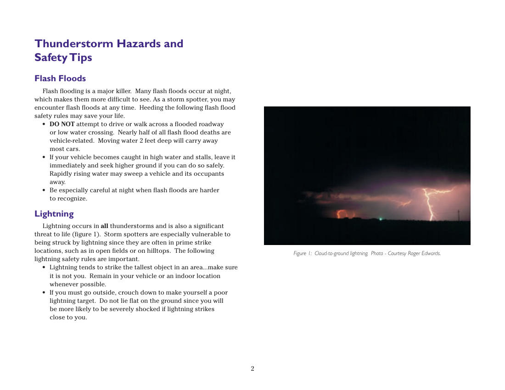

Thunderstorm Hazards and
Safety Tips
Flash Floods
Flash flooding is a major killer.  Many flash floods occur at night,
which makes them more difficult to see. As a storm spotter, you may
encounter flash floods at any time.  Heeding the following flash flood
safety rules may save your life.
• DO NOT attempt to drive or walk across a flooded roadway
or low water crossing.  Nearly half of all flash flood deaths are
vehicle-related.  Moving water 2 feet deep will carry away
most cars.
• If your vehicle becomes caught in high water and stalls, leave it
immediately and seek higher ground if you can do so safely.
Rapidly rising water may sweep a vehicle and its occupants
away.
• Be especially careful at night when flash floods are harder
to recognize.
Lightning
Lightning occurs in all thunderstorms and is also a significant
threat to life (figure 1).  Storm spotters are especially vulnerable to
being struck by lightning since they are often in prime strike
locations, such as in open fields or on hilltops.  The following
lightning safety rules are important.
• Lightning tends to strike the tallest object in an area...make sure
it is not you.  Remain in your vehicle or an indoor location
whenever possible.
• If you must go outside, crouch down to make yourself a poor
lightning target.  Do not lie flat on the ground since you will
be more likely to be severely shocked if lightning strikes
close to you.
2
Figure 1:  Cloud-to-ground lightning.  Photo - Courtesy Roger Edwards.

## Page 8

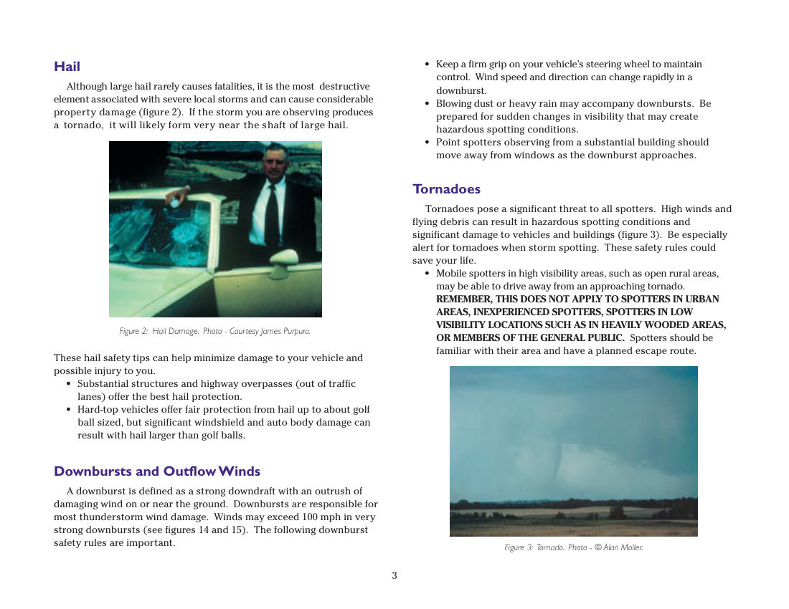

Hail
Although large hail rarely causes fatalities, it is the most  destructive
element associated with severe local storms and can cause considerable
property damage (figure 2).  If the storm you are observing produces
a  tornado,  it will likely form very near the shaft of large hail.
These hail safety tips can help minimize damage to your vehicle and
possible injury to you.
• Substantial structures and highway overpasses (out of traffic
lanes) offer the best hail protection.
• Hard-top vehicles offer fair protection from hail up to about golf
ball sized, but significant windshield and auto body damage can
result with hail larger than golf balls.
Downbursts and Outflow Winds
A downburst is defined as a strong downdraft with an outrush of
damaging wind on or near the ground.  Downbursts are responsible for
most thunderstorm wind damage.  Winds may exceed 100␣mph in very
strong downbursts (see figures 14 and 15).  The following downburst
safety rules are important.
• Keep a firm grip on your vehicle’s steering wheel to maintain
control.  Wind speed and direction can change rapidly in a
downburst.
• Blowing dust or heavy rain may accompany downbursts.  Be
prepared for sudden changes in visibility that may create
hazardous spotting conditions.
• Point spotters observing from a substantial building should
move away from windows as the downburst approaches.
Tornadoes
Tornadoes pose a significant threat to all spotters.  High winds and
flying debris can result in hazardous spotting conditions and
significant damage to vehicles and buildings (figure 3).  Be especially
alert for tornadoes when storm spotting.  These safety rules could
save your life.
• Mobile spotters in high visibility areas, such as open rural areas,
may be able to drive away from an approaching tornado.
REMEMBER, THIS DOES NOT APPLY TO SPOTTERS IN URBAN
AREAS, INEXPERIENCED SPOTTERS, SPOTTERS IN LOW
VISIBILITY LOCATIONS SUCH AS IN HEAVILY WOODED AREAS,
OR MEMBERS OF THE GENERAL PUBLIC.  Spotters should be
familiar with their area and have a planned escape route.
3
Figure 3:  Tornado.  Photo - © Alan Moller.
Figure 2:  Hail Damage.  Photo - Courtesy James Purpura.

## Page 9

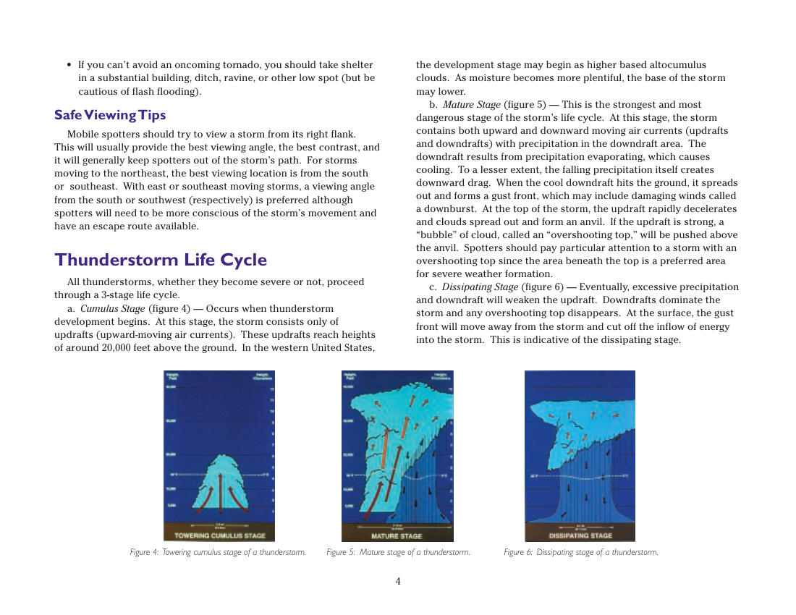

4
the development stage may begin as higher based altocumulus
clouds.  As moisture becomes more plentiful, the base of the storm
may lower.
b.  Mature Stage (figure 5) — This is the strongest and most
dangerous stage of the storm’s life cycle.  At this stage, the storm
contains both upward and downward moving air currents (updrafts
and downdrafts) with precipitation in the downdraft area.  The
downdraft results from precipitation evaporating, which causes
cooling.  To a lesser extent, the falling precipitation itself creates
downward drag.  When the cool downdraft hits the ground, it spreads
out and forms a gust front, which may include damaging winds called
a downburst.  At the top of the storm, the updraft rapidly decelerates
and clouds spread out and form an anvil.  If the updraft is strong, a
“bubble” of cloud, called an “overshooting top,” will be pushed above
the anvil.  Spotters should pay particular attention to a storm with an
overshooting top since the area beneath the top is a preferred area
for severe weather formation.
c.  Dissipating Stage (figure 6) — Eventually, excessive precipitation
and downdraft will weaken the updraft.  Downdrafts dominate the
storm and any overshooting top disappears.  At the surface, the gust
front will move away from the storm and cut off the inflow of energy
into the storm.  This is indicative of the dissipating stage.
• If you can’t avoid an oncoming tornado, you should take shelter
in a substantial building, ditch, ravine, or other low spot (but be
cautious of flash flooding).
Safe Viewing Tips
Mobile spotters should try to view a storm from its right flank.
This will usually provide the best viewing angle, the best contrast, and
it will generally keep spotters out of the storm’s path.  For storms
moving to the northeast, the best viewing location is from the south
or  southeast.  With east or southeast moving storms, a viewing angle
from the south or southwest (respectively) is preferred although
spotters will need to be more conscious of the storm’s movement and
have an escape route available.
Thunderstorm Life Cycle
All thunderstorms, whether they become severe or not, proceed
through a 3-stage life cycle.
a.  Cumulus Stage (figure 4) — Occurs when thunderstorm
development begins.  At this stage, the storm consists only of
updrafts (upward-moving air currents).  These updrafts reach heights
of around 20,000 feet above the ground.  In the western United States,
Figure 5:  Mature stage of a thunderstorm.
Figure 6:  Dissipating stage of a thunderstorm.
Figure 4:  Towering cumulus stage of a thunderstorm.

## Page 10

Visual Indications of Updraft Strength
and Organization
Several visual clues will help the spotter determine if a storm has
severe weather potential.  These clues are evident in the upper,
middle, and lower levels of the storm.  The spotter should pay
particular attention to these clues, especially when watching more
than one storm at a time.
a.  Upper-Level Storm Clues — These clues are best seen at a
distance of 30–40 miles from the storm, so they may be difficult to see
in poor visibility areas.  The primary clues are a large overshooting
top that persists for more than 10 minutes and an anvil with sharp
and well-defined edges (figure 8).  Storms with weaker updrafts will
usually have an anvil that is thin, wispy, and fuzzy.
Depending on the type and number of cells, thunderstorms may be
divided into four main categories:
• Single-cell storms are generally weak, short-lived, and poorly
organized.  “Pulse storms” are strong single-cell storms and thus
are quite rare.
• Multicell cluster storms are the most common type of storm and
consist of a series of cells moving along as one unit.
• Multicell line storms, commonly called “squall lines,” consist of
a long line of storms with a continuous gust front at the leading
edge.
• Supercell storms have a single updraft, are very strong, and
always produce significant severe weather. (See figure 7 for
additional information about each type of thunderstorm. These
thunderstorm types will be discussed in more detail in the
advanced storm spotter’s training program.)
5
Figure 7:  Overview of the thunderstorm spectrum, with characteristics of each
primary storm type.
Figure 8:  Distant supercell storm showing upper-level visual clues of storm strength.
Photo - Courtesy Bill Martin.

## Page 11

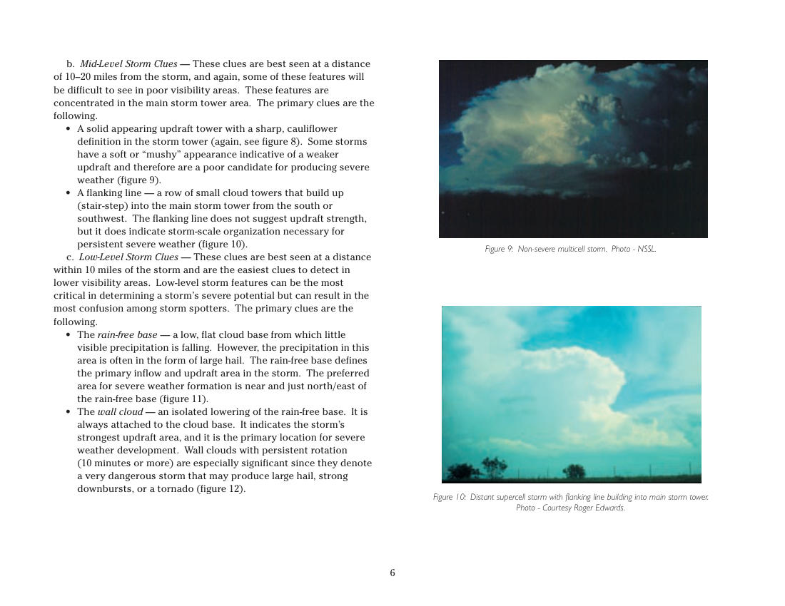

6
Figure 9:  Non-severe multicell storm.  Photo - NSSL.
Figure 10:  Distant supercell storm with flanking line building into main storm tower.
Photo - Courtesy Roger Edwards.
b.  Mid-Level Storm Clues — These clues are best seen at a distance
of 10–20 miles from the storm, and again, some of these features will
be difficult to see in poor visibility areas.  These features are
concentrated in the main storm tower area.  The primary clues are the
following.
• A solid appearing updraft tower with a sharp, cauliflower
definition in the storm tower (again, see figure 8).  Some storms
have a soft or “mushy” appearance indicative of a weaker
updraft and therefore are a poor candidate for producing severe
weather (figure 9).
• A flanking line — a row of small cloud towers that build up
(stair-step) into the main storm tower from the south or
southwest.  The flanking line does not suggest updraft strength,
but it does indicate storm-scale organization necessary for
persistent severe weather (figure␣10).
c.  Low-Level Storm Clues — These clues are best seen at a distance
within 10 miles of the storm and are the easiest clues to detect in
lower visibility areas.  Low-level storm features can be the most
critical in determining a storm’s severe potential but can result in the
most confusion among storm spotters.  The primary clues are the
following.
• The rain-free base — a low, flat cloud base from which little
visible precipitation is falling.  However, the precipitation in this
area is often in the form of large hail.  The rain-free base defines
the primary inflow and updraft area in the storm.  The preferred
area for severe weather formation is near and just north/east of
the rain-free base (figure␣11).
• The wall cloud — an isolated lowering of the rain-free base.  It is
always attached to the cloud base.  It indicates the storm’s
strongest updraft area, and it is the primary location for severe
weather development.  Wall clouds with persistent rotation
(10 minutes or more) are especially significant since they denote
a very dangerous storm that may produce large hail, strong
downbursts, or a tornado (figure 12).

## Page 12

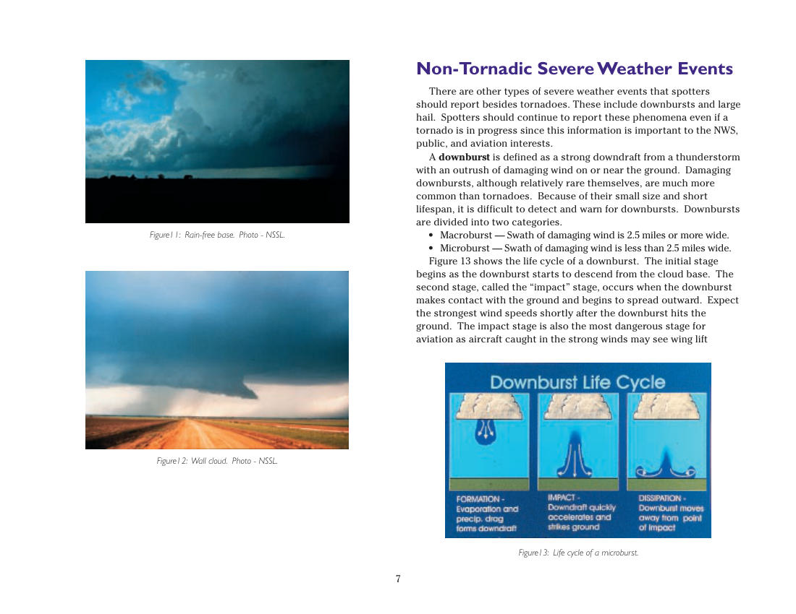

7
Figure12:  Wall cloud.  Photo - NSSL.
Non-Tornadic Severe Weather Events
There are other types of severe weather events that spotters
should report besides tornadoes. These include downbursts and large
hail.  Spotters should continue to report these phenomena even if a
tornado is in progress since this information is important to the NWS,
public, and aviation interests.
A downburst is defined as a strong downdraft from a thunderstorm
with an outrush of damaging wind on or near the ground.  Damaging
downbursts, although relatively rare themselves, are much more
common than tornadoes.  Because of their small size and short
lifespan, it is difficult to detect and warn for downbursts.  Downbursts
are divided into two categories.
• Macroburst — Swath of damaging wind is 2.5 miles or more wide.
• Microburst — Swath of damaging wind is less than 2.5 miles wide.
Figure 13 shows the life cycle of a downburst.  The initial stage
begins as the downburst starts to descend from the cloud base.  The
second stage, called the “impact” stage, occurs when the downburst
makes contact with the ground and begins to spread outward.  Expect
the strongest wind speeds shortly after the downburst hits the
ground.  The impact stage is also the most dangerous stage for
aviation as aircraft caught in the strong winds may see wing lift
Figure11:  Rain-free base.  Photo - NSSL.
Figure13:  Life cycle of a microburst.

## Page 13

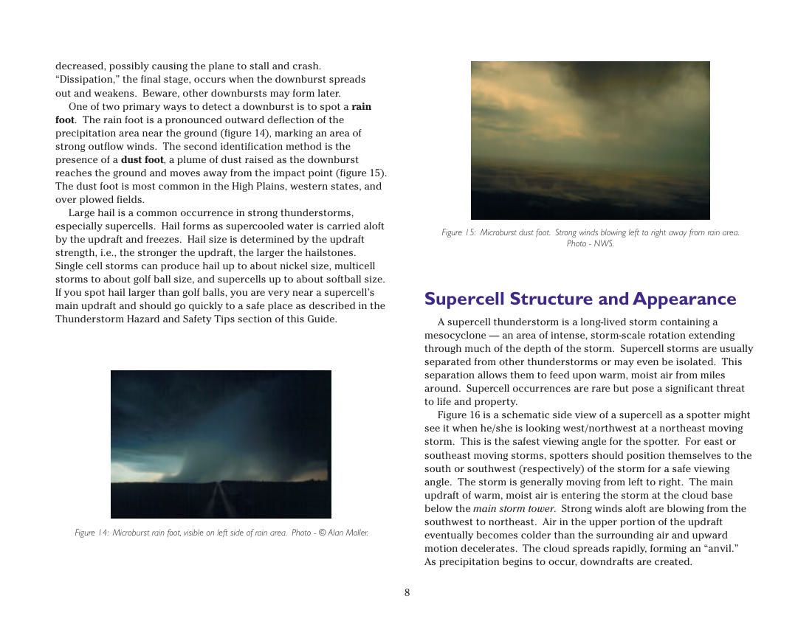

8
Figure 15:  Microburst dust foot.  Strong winds blowing left to right away from rain area.
Photo - NWS.
decreased, possibly causing the plane to stall and crash.
“Dissipation,” the final stage, occurs when the downburst spreads
out and weakens.  Beware, other downbursts may form later.
One of two primary ways to detect a downburst is to spot a rain
foot.  The rain foot is a pronounced outward deflection of the
precipitation area near the ground (figure 14), marking an area of
strong outflow winds.  The second identification method is the
presence of a dust foot, a plume of dust raised as the downburst
reaches the ground and moves away from the impact point (figure 15).
The dust foot is most common in the High Plains, western states, and
over plowed fields.
Large hail is a common occurrence in strong thunderstorms,
especially supercells.  Hail forms as supercooled water is carried aloft
by the updraft and freezes.  Hail size is determined by the updraft
strength, i.e., the stronger the updraft, the larger the hailstones.
Single cell storms can produce hail up to about nickel size, multicell
storms to about golf ball size, and supercells up to about softball size.
If you spot hail larger than golf balls, you are very near a supercell’s
main updraft and should go quickly to a safe place as described in the
Thunderstorm Hazard and Safety Tips section of this Guide.
Figure 14:  Microburst rain foot, visible on left side of rain area.  Photo - © Alan Moller.
Supercell Structure and Appearance
A supercell thunderstorm is a long-lived storm containing a
mesocyclone — an area of intense, storm-scale rotation extending
through much of the depth of the storm.  Supercell storms are usually
separated from other thunderstorms or may even be isolated.  This
separation allows them to feed upon warm, moist air from miles
around.  Supercell occurrences are rare but pose a significant threat
to life and property.
Figure 16 is a schematic side view of a supercell as a spotter might
see it when he/she is looking west/northwest at a northeast moving
storm.  This is the safest viewing angle for the spotter.  For east or
southeast moving storms, spotters should position themselves to the
south or southwest (respectively) of the storm for a safe viewing
angle.  The storm is generally moving from left to right.  The main
updraft of warm, moist air is entering the storm at the cloud base
below the main storm tower.  Strong winds aloft are blowing from the
southwest to northeast.  Air in the upper portion of the updraft
eventually becomes colder than the surrounding air and upward
motion decelerates.  The cloud spreads rapidly, forming an “anvil.”
As precipitation begins to occur, downdrafts are created.

## Page 14

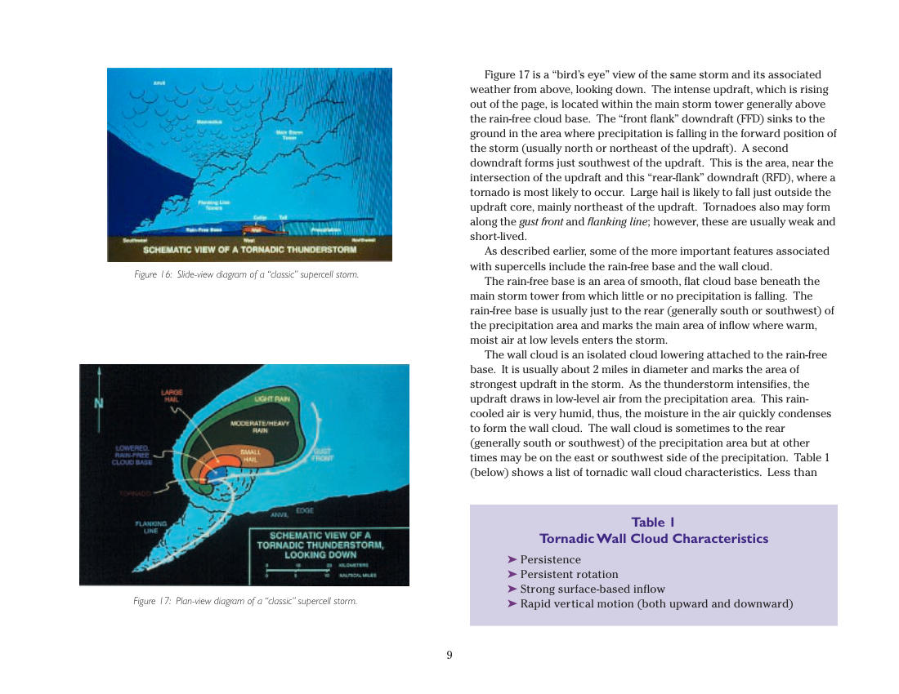

9
Figure 17:  Plan-view diagram of a “classic” supercell storm.
Figure 16:  Slide-view diagram of a “classic” supercell storm.
Table 1
Tornadic Wall Cloud Characteristics
®␣Persistence
®␣Persistent rotation
®␣Strong surface-based inflow
®␣Rapid vertical motion (both upward and downward)
Figure 17 is a “bird’s eye” view of the same storm and its associated
weather from above, looking down.  The intense updraft, which is rising
out of the page, is located within the main storm tower generally above
the rain-free cloud base.  The “front flank” downdraft (FFD) sinks to the
ground in the area where precipitation is falling in the forward position of
the storm (usually north or northeast of the updraft).  A second
downdraft forms just southwest of the updraft.  This is the area, near the
intersection of the updraft and this “rear-flank” downdraft (RFD), where a
tornado is most likely to occur.  Large hail is likely to fall just outside the
updraft core, mainly northeast of the updraft.  Tornadoes also may form
along the gust front and flanking line; however, these are usually weak and
short-lived.
As described earlier, some of the more important features associated
with supercells include the rain-free base and the wall cloud.
The rain-free base is an area of smooth, flat cloud base beneath the
main storm tower from which little or no precipitation is falling.  The
rain-free base is usually just to the rear (generally south or southwest) of
the precipitation area and marks the main area of inflow where warm,
moist air at low levels enters the storm.
The wall cloud is an isolated cloud lowering attached to the rain-free
base.  It is usually about 2 miles in diameter and marks the area of
strongest updraft in the storm.  As the thunderstorm intensifies, the
updraft draws in low-level air from the precipitation area.  This rain-
cooled air is very humid, thus, the moisture in the air quickly condenses
to form the wall cloud.  The wall cloud is sometimes to the rear
(generally south or southwest) of the precipitation area but at other
times may be on the east or southwest side of the precipitation.  Table 1
(below) shows a list of tornadic wall cloud characteristics.  Less than

## Page 15

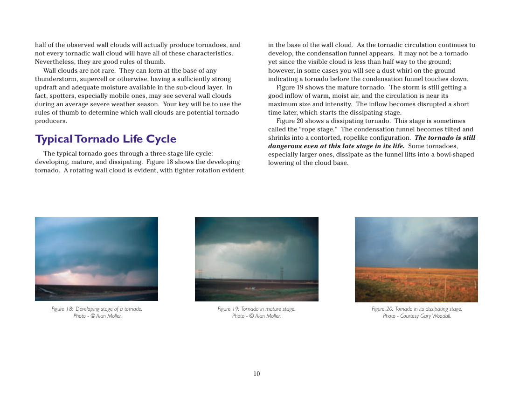

half of the observed wall clouds will actually produce tornadoes, and
not every tornadic wall cloud will have all of these characteristics.
Nevertheless, they are good rules of thumb.
Wall clouds are not rare.  They can form at the base of any
thunderstorm, supercell or otherwise, having a sufficiently strong
updraft and adequate moisture available in the sub-cloud layer.  In
fact, spotters, especially mobile ones, may see several wall clouds
during an average severe weather season.  Your key will be to use the
rules of thumb to determine which wall clouds are potential tornado
producers.
Typical Tornado Life Cycle
The typical tornado goes through a three-stage life cycle:
developing, mature, and dissipating.  Figure 18 shows the developing
tornado.  A rotating wall cloud is evident, with tighter rotation evident
10
Figure 19:  Tornado in mature stage.
Photo - © Alan Moller.
Figure 18:  Developing stage of a tornado.
 Photo - © Alan Moller.
in the base of the wall cloud.  As the tornadic circulation continues to
develop, the condensation funnel appears.  It may not be a tornado
yet since the visible cloud is less than half way to the ground;
however, in some cases you will see a dust whirl on the ground
indicating a tornado before the condensation funnel touches down.
Figure 19 shows the mature tornado.  The storm is still getting a
good inflow of warm, moist air, and the circulation is near its
maximum size and intensity.  The inflow becomes disrupted a short
time later, which starts the dissipating stage.
Figure 20 shows a dissipating tornado.  This stage is sometimes
called the “rope stage.”  The condensation funnel becomes tilted and
shrinks into a contorted, ropelike configuration.  The tornado is still
dangerous even at this late stage in its life.  Some tornadoes,
especially larger ones, dissipate as the funnel lifts into a bowl-shaped
lowering of the cloud base.
Figure 20:  Tornado in its dissipating stage.
Photo - Courtesy Gary Woodall.

## Page 16

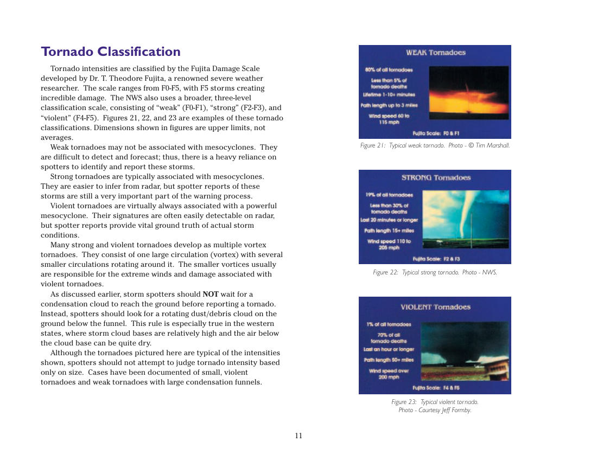

Tornado Classification
Tornado intensities are classified by the Fujita Damage Scale
developed by Dr. T. Theodore Fujita, a renowned severe weather
researcher.  The scale ranges from F0-F5, with F5 storms creating
incredible damage.  The NWS also uses a broader, three-level
classification scale, consisting of “weak” (F0-F1), “strong” (F2-F3), and
“violent” (F4-F5).  Figures 21, 22, and 23 are examples of these tornado
classifications. Dimensions shown in figures are upper limits, not
averages.
Weak tornadoes may not be associated with mesocyclones.  They
are difficult to detect and forecast; thus, there is a heavy reliance on
spotters to identify and report these storms.
Strong tornadoes are typically associated with mesocyclones.
They are easier to infer from radar, but spotter reports of these
storms are still a very important part of the warning process.
Violent tornadoes are virtually always associated with a powerful
mesocyclone.  Their signatures are often easily detectable on radar,
but spotter reports provide vital ground truth of actual storm
conditions.
Many strong and violent tornadoes develop as multiple vortex
tornadoes.  They consist of one large circulation (vortex) with several
smaller circulations rotating around it.  The smaller vortices usually
are responsible for the extreme winds and damage associated with
violent tornadoes.
As discussed earlier, storm spotters should NOT wait for a
condensation cloud to reach the ground before reporting a tornado.
Instead, spotters should look for a rotating dust/debris cloud on the
ground below the funnel.  This rule is especially true in the western
states, where storm cloud bases are relatively high and the air below
the cloud base can be quite dry.
Although the tornadoes pictured here are typical of the intensities
shown, spotters should not attempt to judge tornado intensity based
only on size.  Cases have been documented of small, violent
tornadoes and weak tornadoes with large condensation funnels.
11
Figure 21:  Typical weak tornado.  Photo - © Tim Marshall.
Figure 22:   Typical strong tornado.  Photo - NWS.
Figure 23:   Typical violent tornado.
Photo - Courtesy Jeff Formby.

## Page 17

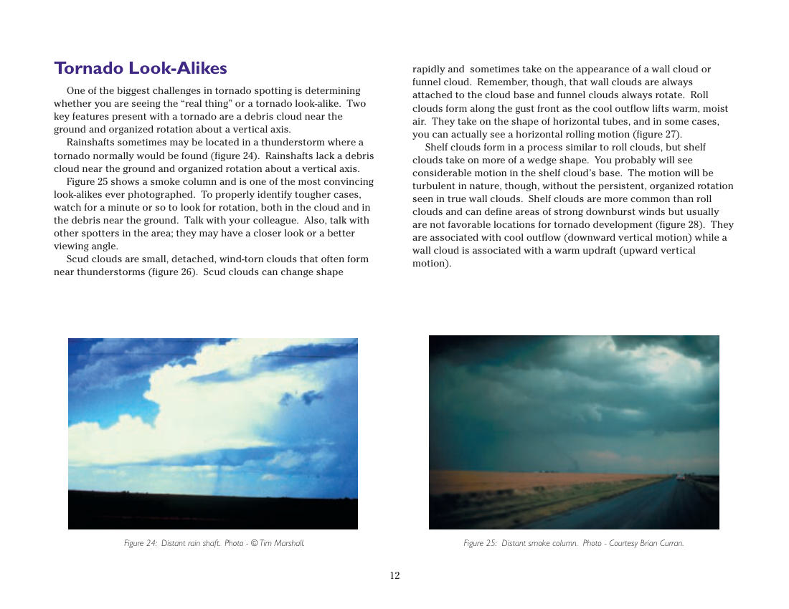

Tornado Look-Alikes
One of the biggest challenges in tornado spotting is determining
whether you are seeing the “real thing” or a tornado look-alike.  Two
key features present with a tornado are a debris cloud near the
ground and organized rotation about a vertical axis.
Rainshafts sometimes may be located in a thunderstorm where a
tornado normally would be found (figure 24).  Rainshafts lack a debris
cloud near the ground and organized rotation about a vertical axis.
Figure 25 shows a smoke column and is one of the most convincing
look-alikes ever photographed.  To properly identify tougher cases,
watch for a minute or so to look for rotation, both in the cloud and in
the debris near the ground.  Talk with your colleague.  Also, talk with
other spotters in the area; they may have a closer look or a better
viewing angle.
Scud clouds are small, detached, wind-torn clouds that often form
near thunderstorms (figure 26).  Scud clouds can change shape
rapidly and  sometimes take on the appearance of a wall cloud or
funnel cloud.  Remember, though, that wall clouds are always
attached to the cloud base and funnel clouds always rotate.  Roll
clouds form along the gust front as the cool outflow lifts warm, moist
air.  They take on the shape of horizontal tubes, and in some cases,
you can actually see a horizontal rolling motion (figure 27).
Shelf clouds form in a process similar to roll clouds, but shelf
clouds take on more of a wedge shape.  You probably will see
considerable motion in the shelf cloud’s base.  The motion will be
turbulent in nature, though, without the persistent, organized rotation
seen in true wall clouds.  Shelf clouds are more common than roll
clouds and can define areas of strong downburst winds but usually
are not favorable locations for tornado development (figure␣28).  They
are associated with cool outflow (downward vertical motion) while a
wall cloud is associated with a warm updraft (upward vertical
motion).
12
Figure 25:  Distant smoke column.  Photo␣- Courtesy Brian Curran.
Figure 24:  Distant rain shaft.  Photo␣- © Tim Marshall.

## Page 18

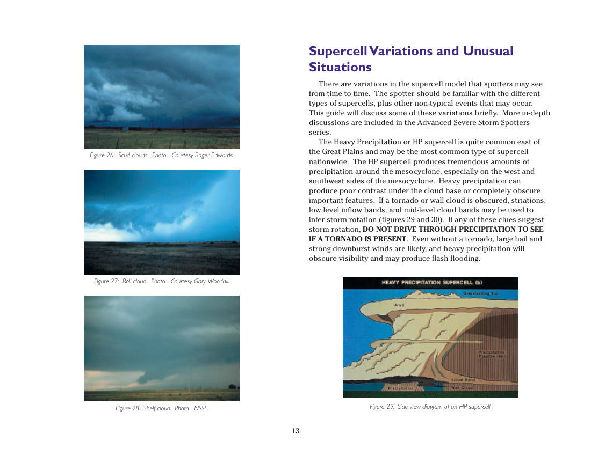

Supercell Variations and Unusual
Situations
There are variations in the supercell model that spotters may see
from time to time.  The spotter should be familiar with the different
types of supercells, plus other non-typical events that may occur.
This guide will discuss some of these variations briefly.  More in-depth
discussions are included in the Advanced Severe Storm Spotters
series.
The Heavy Precipitation or HP supercell is quite common east of
the Great Plains and may be the most common type of supercell
nationwide.  The HP supercell produces tremendous amounts of
precipitation around the mesocyclone, especially on the west and
southwest sides of the mesocyclone.  Heavy precipitation can
produce poor contrast under the cloud base or completely obscure
important features.  If a tornado or wall cloud is obscured, striations,
low level inflow bands, and mid-level cloud bands may be used to
infer storm rotation (figures 29 and 30).  If any of these clues suggest
storm rotation, DO NOT DRIVE THROUGH PRECIPITATION TO SEE
IF A TORNADO IS PRESENT.  Even without a tornado, large hail and
strong downburst winds are likely, and heavy precipitation will
obscure visibility and may produce flash flooding.
13
Figure 27:  Roll cloud.  Photo - Courtesy Gary Woodall.
Figure 28:  Shelf cloud.  Photo - NSSL.
Figure 26:  Scud clouds.  Photo - Courtesy Roger Edwards.
Figure 29:  Side view diagram of an HP supercell.

## Page 19

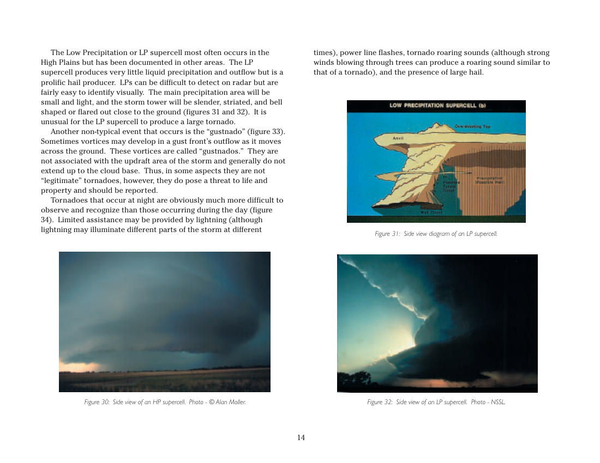

The Low Precipitation or LP supercell most often occurs in the
High Plains but has been documented in other areas.  The LP
supercell produces very little liquid precipitation and outflow but is a
prolific hail producer.  LPs can be difficult to detect on radar but are
fairly easy to identify visually.  The main precipitation area will be
small and light, and the storm tower will be slender, striated, and bell
shaped or flared out close to the ground (figures 31 and 32).  It is
unusual for the LP supercell to produce a large tornado.
Another non-typical event that occurs is the “gustnado” (figure 33).
Sometimes vortices may develop in a gust front’s outflow as it moves
across the ground.  These vortices are called “gustnados.”  They are
not associated with the updraft area of the storm and generally do not
extend up to the cloud base.  Thus, in some aspects they are not
“legitimate” tornadoes, however, they do pose a threat to life and
property and should be reported.
Tornadoes that occur at night are obviously much more difficult to
observe and recognize than those occurring during the day (figure
34).  Limited assistance may be provided by lightning (although
lightning may illuminate different parts of the storm at different
Figure 30:  Side view of an HP supercell.  Photo - © Alan Moller.
Figure 31:  Side view diagram of an LP supercell.
Figure 32:  Side view of an LP supercell.  Photo - NSSL.
times), power line flashes, tornado roaring sounds (although strong
winds blowing through trees can produce a roaring sound similar to
that of a tornado), and the presence of large hail.
14

## Page 20

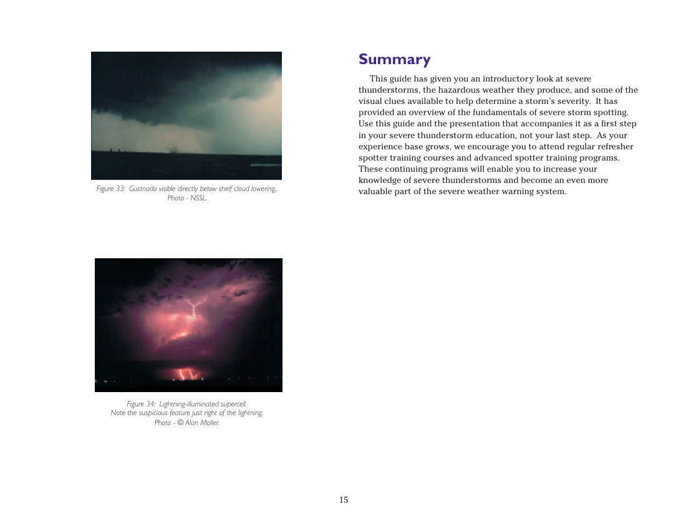

Summary
This guide has given you an introductory look at severe
thunderstorms, the hazardous weather they produce, and some of the
visual clues available to help determine a storm’s severity.  It has
provided an overview of the fundamentals of severe storm spotting.
Use this guide and the presentation that accompanies it as a first step
in your severe thunderstorm education, not your last step.  As your
experience base grows, we encourage you to attend regular refresher
spotter training courses and advanced spotter training programs.
These continuing programs will enable you to increase your
knowledge of severe thunderstorms and become an even more
valuable part of the severe weather warning system.
Figure 33:  Gustnado visible directly below shelf cloud lowering..
Photo - NSSL.
Figure 34:  Lightning-illuminated supercell.
Note the suspicious feature just right of the lightning.
Photo - © Alan Moller.
15

## Page 21

Notes
______________________________________________________________________
______________________________________________________________________
______________________________________________________________________
______________________________________________________________________
______________________________________________________________________
______________________________________________________________________
______________________________________________________________________
______________________________________________________________________
______________________________________________________________________
______________________________________________________________________
______________________________________________________________________
______________________________________________________________________
______________________________________________________________________
______________________________________________________________________
______________________________________________________________________
______________________________________________________________________
______________________________________________________________________
______________________________________________________________________
______________________________________________________________________
Figure Credits
Cover and Title Page - Photo by National Severe Storms Laboratory
(NSSL).
Figure 1 - Courtesy  Roger Edwards.
Figure 2 - Courtesy  James Purpura.
Figure 3 - © Alan Moller.
Figures 4 - 7 - NOAA.
Figure 8 - Courtesy Bill Martin.
Figure 9 -   NSSL.
Figure 10 - Courtesy Roger Edwards.
Figure 11 - NSSL.
Figure 12 - NSSL.
Figure 13 - NOAA.
Figure 14 - © Alan Moller.
Figure 15 - NWS.
Figure 16 - NOAA.
Figure 17 - NOAA.
Figure 18 - © Alan Moller.
Figure 19 - © Alan Moller.
Figure 20 - Courtesy Gary Woodall.
Figure 21 - © Tim Marshall.
Figure 22 - NWS.
Figure 23 - Courtesy Jeff Formby.
Figure 24 - © Tim Marshall.
Figure 25 - Courtesy  Brian Curran.
Figure 26 - Courtesy  Roger Edwards.
Figure 27 - Courtesy  Gary Woodall.
Figure 28 - NSSL.
Figure 29 - NOAA.
Figure 30 - © Alan Moller.
Figure 31 - NOAA.
Figure 32 - NSSL.
Figure 33 - NSSL.
Figure 34 - © Alan Moller.
16

## Page 22

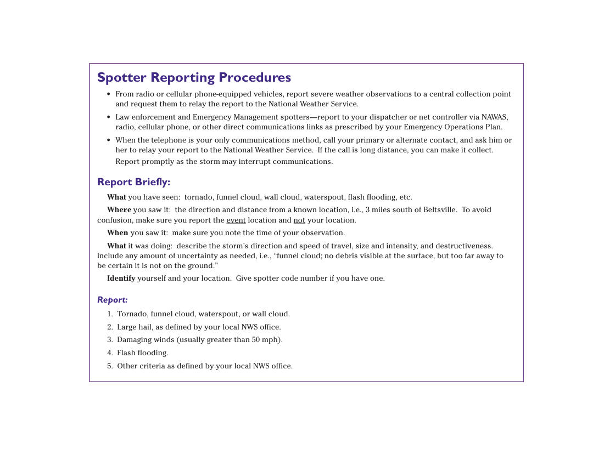

Spotter Reporting Procedures
• From radio or cellular phone-equipped vehicles, report severe weather observations to a central collection point
and request them to relay the report to the National Weather Service.
• Law enforcement and Emergency Management spotters—report to your dispatcher or net controller via NAWAS,
radio, cellular phone, or other direct communications links as prescribed by your Emergency Operations Plan.
• When the telephone is your only communications method, call your primary or alternate contact, and ask him or
her to relay your report to the National Weather Service.  If the call is long distance, you can make it collect.
Report promptly as the storm may interrupt communications.
Report Briefly:
What you have seen:  tornado, funnel cloud, wall cloud, waterspout, flash flooding, etc.
Where you saw it:  the direction and distance from a known location, i.e., 3 miles south of Beltsville.  To avoid
confusion, make sure you report the event location and not your location.
When you saw it:  make sure you note the time of your observation.
What it was doing:  describe the storm’s direction and speed of travel, size and intensity, and destructiveness.
Include any amount of uncertainty as needed, i.e., “funnel cloud; no debris visible at the surface, but too far away to
be certain it is not on the ground.”
Identify yourself and your location.  Give spotter code number if you have one.
Report:
1.  Tornado, funnel cloud, waterspout, or wall cloud.
2.  Large hail, as defined by your local NWS office.
3.  Damaging winds (usually greater than 50 mph).
4.  Flash flooding.
5.  Other criteria as defined by your local NWS office.
