# Commercial Pilot Meteorology (Part 1) — (Part 2)

> Source: <http://www.langleyflyingschool.com/Pages/CPGS%20Meteorology,%20Part%202.html>  
> Section: Weather Handbooks and Important Links  
> Captured: 2026-08-19 06:00 UTC  
> PDF: [commercial-pilot-meteorology-part-1-part-2.pdf](commercial-pilot-meteorology-part-1-part-2.pdf) · Original HTML: [source/original.html](source/original.html)

---

**Notice**: Undefined variable: count in **/home/p5xmazbfpecn/public\_html/common.php** on line **21**

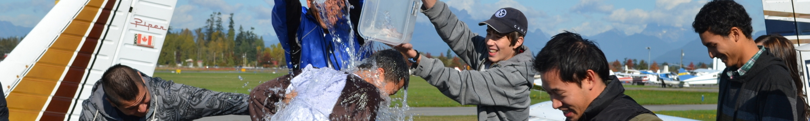

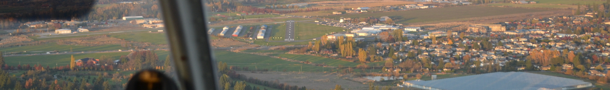

- [Home](http://www.langleyflyingschool.com/)
- [About Us](#)
  - [Our Mission](http://www.langleyflyingschool.com/Pages/Mission%20Statement.html)
  - [The School](http://www.langleyflyingschool.com/Pages/The%20School.html)
  - [The Staff](http://www.langleyflyingschool.com/Pages/Staff.html)
  - [Gift Ideas](http://www.langleyflyingschool.com/Pages/Gift%20Ideas.html)
- [Prospective Students](#)
  - [Flying as a Career](http://www.langleyflyingschool.com/Pages/Flying%20as%20a%20Career.html)
  - [Student Loans](http://www.langleyflyingschool.com/Pages/Student_Loans.html)
  - [International Students](http://www.langleyflyingschool.com/Pages/International%20Students.html)
  - [Student Support Services](http://www.langleyflyingschool.com/Pages/Student%20Support%20Services.html)
  - [Code of Practice](http://www.langleyflyingschool.com/Pages/Code%20of%20Practice.html)
- [Current Students](#)
  - [Visit PTIRU Website](https://www.privatetraininginstitutions.gov.bc.ca/)
  - [Langley Flying School Policy Booklet](http://www.langleyflyingschool.com/PDF%20Documents/Langley%20Flying%20School%20Policy%20Booklet%20June%202023.pdf)
  - [Langley Flying School Schedule](http://www.langleyflyingschool.com/PDF%20Documents/Schedule%20for%20Morning%20PPL%20Groundschool%20September%202025.pdf)
  - [Program](#awards)
    - [PTIRU certificate](http://www.langleyflyingschool.com/PDF%20Documents/PTIB.pdf)
    - [Aviation Diploma (PTIRU Approval)](http://www.langleyflyingschool.com/PDF%20Documents/Aviation%20Diploma%20Student%20Contract%202025.pdf)
    - [Commercial Pilot Flight Training (PTIRU Approval)](http://www.langleyflyingschool.com/PDF%20Documents/CPL%20Student%20Contract%202025.pdf)
    - [Commercial Pilot With Applied Human Factors Aviation Diploma (PTIRU Approval)](http://www.langleyflyingschool.com/PDF%20Documents/Applied%20Human%20Factors%20in%20Aviation%20Program%20Student%20Contract%20PTIB%202024.pdf)
    - [Group 1 or 3 Instrument Rating Training (PTIRU Approval)](http://www.langleyflyingschool.com/PDF%20Documents/Instrument%20Rating%20Student%20Contract%202025.pdf)
    - [Instructor Rating Flight Training (PTIRU Approval)](http://www.langleyflyingschool.com/PDF%20Documents/Instructor%20Rating%20Student%20Contract%202025.pdf)
    - [Multi Engine Class Rating Flight Training(PTIRU Approval)](http://www.langleyflyingschool.com/PDF%20Documents/Multi%20Engine%20Rating%20Student%20Contract%202025.pdf)
    - [Private Pilot Flight Training](http://www.langleyflyingschool.com/PDF%20Documents/PPL%20Student%20Contract%202025.pdf)
  - [Program Outline](#awards)
    - [Aviation Diploma](http://www.langleyflyingschool.com/PDF%20Documents/Langley%20Flying%20School%20%20Aviation%20Diploma%20Program%20Outline.pdf)
    - [Commercial Pilot Flight Training](http://www.langleyflyingschool.com/PDF%20Documents/Langley%20Flying%20School%20Commercial%20Program%20Outline.pdf)
    - [Commercial Pilot With Applied Human Factors Aviation Diploma](http://www.langleyflyingschool.com/PDF%20Documents/Langley%20Flying%20School%20Commercial%20Pilot%20with%20Applied%20Human%20Factors%20in%20Aviation%20Program%20Outline.pdf)
    - [Group 1 or 3 Instrument Rating Training](http://www.langleyflyingschool.com/PDF%20Documents/Langley%20Flying%20School%20Instrument%20Rating%20Program%20Outline.pdf)
    - [Instructor Rating Flight Training](http://www.langleyflyingschool.com/PDF%20Documents/Langley%20Flying%20School%20Instructor%20Rating%20Program%20Outline.pdf)
    - [Multi Engine Class Rating Flight Training](http://www.langleyflyingschool.com/PDF%20Documents/Langley%20Flying%20School%20Multi%20Engine%20Rating%20Program%20Outline.pdf)
  - [Ready Room](http://www.langleyflyingschool.com/Pages/Ready%20Room.html)
  - [Classroom](http://www.langleyflyingschool.com/Pages/Classroom.html)
  - [Booking Sheet](https://app.flightschedulepro.com/Account/Login/127737)
  - [Weight And Baiance Documents](#awards)
    - [Piper Cherokee](http://www.langleyflyingschool.com/Pages/Piper%20Cherokee.html)
    - [Cessna](http://www.langleyflyingschool.com/Pages/Cessna.html)
- [Staff and Administration](#)
  - [Web Email](https://sso.godaddy.com/login?app=email&realm=pass)
  - [Students Balance Reminding](http://www.langleyflyingschool.com/staff/StudentsBalanceReminding.html)
  - [Standard Operating Procedures](http://www.langleyflyingschool.com/staff/Standard%20Operating%20Procedures.html)
  - [Anonymous Safety/Incident Reporting](#awards)
    - [Anonymous Operations Safety Reporting](https://docs.google.com/forms/d/e/1FAIpQLSc-n_HllQQ2Vgo6CaTFSvNWDu_KHFbVIkjgv9kHVlglCXM5nQ/viewform?usp=sf_link)
  - [Flight Operations Safety Threats List](http://www.langleyflyingschool.com/staff/Safety%20Threat%20List.html)
  - [Workplace Safety Threats List](http://www.langleyflyingschool.com/staff/Workplace%20Safety%20Threat%20List.html)
  - [Workplace Safety Threats List](http://www.langleyflyingschool.com/pages/Standard%20Operating%20Procedures%20Workplace%20Safety%20Hazmats.html)
  - [Maintenance Control Manual](http://www.langleyflyingschool.com/staff/LFSMCMrev9%20SN10.pdf)
  - [Maintenance Control Schedule](http://www.langleyflyingschool.com/staff/Maintenance%20Control%20Schedule.html)
  - [Aircraft Maintenance Documents](#awards)
    - [Maintenance Control Manual](http://www.langleyflyingschool.com/PDF%20Documents/LFSMCMrev9%20SN10.pdf)
    - [Documents Incorporated by Reference](http://www.langleyflyingschool.com/PDF%20Documents/LFS%20DIRs%20rev3.pdf)
    - [Piper Cherokee Maintenance Schedules](http://www.langleyflyingschool.com/PDF%20Documents/Piper%20Cherokee%20Maintenance%20Schedule.pdf)
    - [Cessna 152 Maintenance Schedules](http://www.langleyflyingschool.com/PDF%20Documents/Cessna%20152%20Maintenance%20Scedule.pdf)
    - [Cessna 172 Maintenance Schedules](http://www.langleyflyingschool.com/PDF%20Documents/172%20check%20sheets.pdf)
    - [Seneca Maintenance Schedules](http://www.langleyflyingschool.com/PDF%20Documents/Piper%20Senneca%20Maintenance%20Scedule.pdf)
  - [Instructor Teaching Load and Availability](http://www.langleyflyingschool.com/staff/Instructor%20Teaching%20Load%20and%20Availability.html)
  - [Instructor/Student Availability](http://www.langleyflyingschool.com/staff/Instructor%20Student%20Availability.html)
  - [Student Waitlist & Assignment Sheet](http://www.langleyflyingschool.com/staff/Student%20Waitlist%20&%20Assignment%20Sheet.html)
  - [Flight Instructor Aircraft Responsibility](http://www.langleyflyingschool.com/staff/SOPs%20Aircraft%20Responsibility%20List.html)
  - [Flight Operation Notices](http://www.langleyflyingschool.com/staff/Flight%20Operation%20Notices.html)
  - [Authorized Persons' List](http://www.langleyflyingschool.com/staff/Authorized_Persons'_List.html)
  - [Class IV Instructor Supervision Status](http://www.langleyflyingschool.com/staff/SOPs_Class_IV_Instructor_Supervision_Status.html)
  - [Staff Meeting Minutes](http://www.langleyflyingschool.com/staff/SOPs%20Staff%20Meeting%20Minutes.html)
  - [Staff Safety Training Record](http://www.langleyflyingschool.com/staff/Staff%20Safety%20Training.html)
  - [Staff Training Policy](http://www.langleyflyingschool.com/staff/Staff_Training.html)
  - [Aircraft Maintenance Supervisor Training Record](http://www.langleyflyingschool.com/staff/Aircraft_Maintenance_Supervisor_Training_Record.html)
  - [Student Enrolment Contracts](http://www.langleyflyingschool.com/staff/Student_Enrolment_Contracts.html)
  - [Request to Start Advanced Flight Training](http://www.langleyflyingschool.com/staff/Request_to_start_training.html)
  - [Flight Training Authorization](http://www.langleyflyingschool.com/staff/Flight_Training_Authorization.html)
  - [Prior Learning Assessment Report](http://docs.google.com/forms/d/1R67E1YlbO8i9CqivHqY_hyMAOOJTEnI0pYTRq28xanI/viewform)
  - [Student Language Testing](http://www.langleyflyingschool.com/staff/Language_Testing.html)
  - [Lesson Plans](#awards)
    - [Private Pilot Program](http://www.langleyflyingschool.com/Pages/staff%20private%20pilot%20program.html)
    - [Commercial Pilot Program](http://www.langleyflyingschool.com/Pages/staff%20Commercial%20Pilot%20Program.html)
    - [Multi-engine Rating Program](http://www.langleyflyingschool.com/Pages/staff%20Multi-engine%20Rating%20Program.html)
    - [Instrument Rating Program](http://www.langleyflyingschool.com/Pages/staff%20Aviation%20Language%20Training%20Program.html)
    - [Instruction Rating Program](http://www.langleyflyingschool.com/Pages/staff%20Instruction%20Rating%20Program.html)
    - [Aviation Language Training Program](http://www.langleyflyingschool.com/Pages/staff%20Aviation%20Language%20Training%20Program.html)
  - [Quality Assurance](http://www.langleyflyingschool.com/staff/Education%20Quality%20Assurance%20Tasks.html)
- [Apply Now](#)
  - [Candidate Application Form](http://www.langleyflyingschool.com/Pages/Applynow.html)
  - [Contact Form](http://www.langleyflyingschool.com/Pages/contact_us/contact_form.html)
  - [Address & Map](http://www.langleyflyingschool.com/Pages/contact_us/address_&_map.html)
  - [Employment Opportunities](http://www.langleyflyingschool.com/Pages/Employment%20Opportunities.html)

- [Home](http://www.langleyflyingschool.com/) /
- Students / Resources / Classroom / Commercial Pilot  Groundschool  /
- Meteorology--Part II

# METEOROLOGY (Part II)

- [METEOROLOGY (Part II)](#METEOROLOGY%20(Part%20II))
- - [Freezing Rain Risk](#Freezing%20Rain%20Risk)
  - [Clouds and Precipitation of Active Weather](#Clouds%20and%20Precipitation%20of%20Active%20Weather)
  - [Fog](#Fog)
  - [Thunderstorms](#Thunderstorms)
  - - [Cumulus Stage](#Cumulus%20Stage)
    - [Mature Stage](#Mature%20Stage)
    - [Dissipation Stage](#Dissipation%20Stage)
  - [Thunderstorm Classifications](#Thunderstorm%20Classifications)
  - - [Frontal Thunderstorms](#Frontal%20Thunderstorms)
    - [Squall Line Thunderstorms](#Squall%20Line%20Thunderstorms)
  - [Thunderstorm Hazards](#Thunderstorm%20Hazards)
  - - [Turbulence](#Turbulence)
    - [Hail](#Hail)
    - [Icing](#Icing)
    - [Altimetry](#Altimetry)
    - [Lightning](#Lightning)
  - [Thunderstorm Flight Procedures](#Thunderstorm%20Flight%20Procedures)
  - [Thunderstorm Wind Shear](#Thunderstorm%20Wind%20Shear)
  - [Icing](#Icing)
  - - [Super-cooled Water Droplet](#Super-cooled%20Water%20Droplet)
    - [Icing rules of thumb](#Icing%20rules%20of%20thumb)

## Freezing Rain Risk

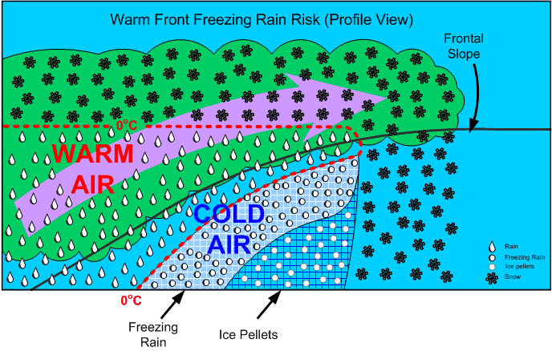

This occurs whenever warm air is suspended above cold air.  When the warm air is suspended above the freezing level, snow is produced; however, when the warm air remains above the cold air and above-freezing temperatures are aloft, there is a high risk of [freezing rain precipitation](http://en.wikipedia.org/wiki/Freezing_rain) (supercooled water droplets).

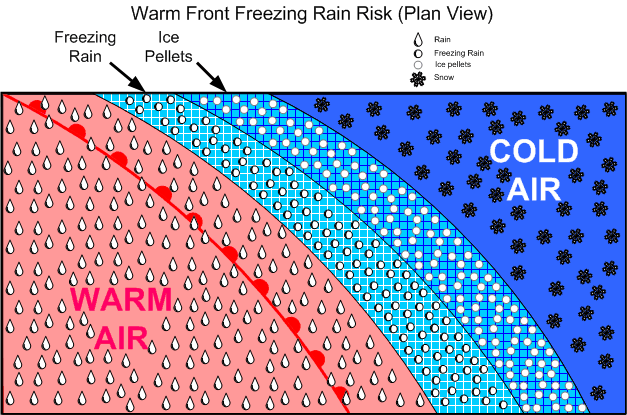

An advancing freezing rain “belt” indicates rain aloft, and is usually preceded by ice pellets at lower levels, but this may not give warning at higher altitudes.  This situation is typically associated with warm fronts in winter.

## Clouds and Precipitation of Active Weather

Clouds are formed in two fashions:

1. moist air is cooled to its saturation point, producing condensation, when warm air comes in contact with a cold surface or the surface is cooled by radiation cooling, or is cooled by adiabatic expansion (rising air);
2. and the air mass simply becomes saturated as it acquires more moisture from an external source (over bodies of water).  Of these two methods, however, adiabatic expansion is the more common.  Remember that air can be forced to rise by orographic lift, convection (caused by warm surfaces whereby the expansion of the air causes heating), frontal lift, turbulence, and convergence.

Visible vapour forms around [condensation nuclei](http://en.wikipedia.org/wiki/Condensation_nuclei)—dust, smoke, salt, pollution particles—and can combine to form raindrops (coalescence).  In stable cloud there is insufficient lift to cause a great deal of coalescence and the water particles fall to the ground as drizzle.  These can freeze to form [freezing drizzle](http://en.wikipedia.org/wiki/Freezing_drizzle).

[Hail](http://en.wikipedia.org/wiki/Hail) originates in the middle region where the SCWD and ice collide, to form a frozen mass with air in the centre; as this mass falls through the lower region, water freezes on the mass to form hard transparent ice.  This process can be repeated many times as lift can again carry the hail back up to the middle region, forming large hail stones.

If the lower water level is thin, snow pellets form.

## Fog

Fog is cloud, usually stratus, in contact with the ground; its appearance is associated with high relative humidity, a narrow dewpoint-temperature spread, and some form of cooling process that initiates the condensation.  Fog requires a mixing action by wind; without wind, dew will appear instead of fog.  Fog is more likely to occur in coastal areas (moisture), and is also more common in industrial (high concentration of airborne particulate).  Fog is dissipated by the sun’s heating of the surface below the fog layer.

Here are the six primary [forms of fog](http://en.wikipedia.org/wiki/Radiation_fog#Types):

Radiation Fog

- Occurs on clear nights with light winds; the ground is cooled by radiation and so is the air in contact with the ground; commonly referred to as ground fog, it first develops in low-lying areas where the cooler air first accumulates; radiation fog sometimes forms during the few hours following sunrise, when the mixing of air is caused by the solar radiation; dissipation occurs when solar radiation exceeds radiation cooling.
- Appears where high pressure forms in a maritime air mass, usually near a source of industrial pollution.

Advection Fog

- Caused by the drifting of warm humid air over cooler land or sea surface; it may persist for days and is associated with coastal areas as the cool surface may not be affected by daytime heating, and spreads over land in association with sea breezes.
- Appears in the [Hudson Bay](http://en.wikipedia.org/wiki/Hudson_Bay) during the summer when moist warm air drifts over the cold water and ice surface, over the [Great Lakes](http://en.wikipedia.org/wiki/Great_Lakes) during the spring, when mT air flows over the relatively cold water of the lakes, and along the East Coast, especially during the summer, when mT from the [Gulf Stream](http://en.wikipedia.org/wiki/Gulf_Stream) is cooled by the cold waters of the [Labrador Current](http://en.wikipedia.org/wiki/Labrador_current).

Upslope Fog

- Caused when air is cooled as it is forced to move up a slope.
- Appears in the [Great Plains](http://en.wikipedia.org/wiki/Great_plains), which slope upward to the [Rocky Mountains](http://en.wikipedia.org/wiki/Rocky_Mountains) (from east to west); easterly winds often give rise to upslope fog.

Steam Fog (Arctic Sea Smoke)

- Caused by cold air passing over the surface of water; the air is so cold that it can be easily saturated; the evaporation of a much warmer water surface immediately saturates the adjacent air; a pronounced low-level inversion must be present to prevent the now warmed saturated air from rising.
- Appears in the Arctic and Hudson Bay when extremely cold air moves over areas of open water.

Precipitation-induced Fog

- Caused by the additional moisture in the air due to the evaporation of rain or drizzle; it is associated with warm fronts and is referred to as frontal fog.

Ice Fog

- Forms in extremely cold and calm conditions and is caused by sublimation associated with fuel combustion.
- Appears in the Arctic during the winter near inhabited areas.

## Thunderstorms

**[Thunderstorms](http://en.wikipedia.org/wiki/Thunderstorms)** can form when the air is unstable, there is some form of lifting action, and a high moisture content exists:

A thunderstorm begins with the formation of a convective cloud type such as cumulus or altocumulus castellanus.  If the air mass is conditionally or potentially unstable through a very deep layer, preferably extending up to the tropopause, and if it is very moist in its lower levels, the convective clouds may grow and merge into a “Cumulonimbus,” the thunderstorm cloud.  These clouds move with the general airflow within the troposphere, but set up small and violent circulations around and within themselves.[1](#_ftn1)

The violent action associated with thunderstorms is caused by the formation of chimney-like structures in cumulus clouds based on convection currents.  As the superheated, moist air ascends rapidly, an equal amount of cooler air rushes down to replace it.  The active currents of updrafts and downdrafts are the predominant features which combine to form thunderstorm cells.

The updrafts and downdrafts are commonly large enough to engulf the aircraft completely, resulting in a gain or loss of 1000’ or more with little sign of turbulence.  Combined with this large-scale airflow, there are numerous irregular, random, sudden, and brief turbulent motions called gusts, which may vary in diameter from a few inches to several hundred feet.[2](#_ftn2)

**References:**

[1](#_ftnref1) Air Command Weather Manual, P. 15-1.

[2](#_ftnref2) Ibid.

**Thunderstorms have three stages: cumulus, mature, and dissipated:**

### Cumulus Stage

- This stage lasts on average about 20 minutes.
- Numerous small convective clouds merge and rapidly grow into a very large convective cell.
- The large convective cell may rise as high as 20000’, and its base may expand up to approximately 4 miles across.
- Only updrafts are present as air is drawn into the cell from the sides and the base.
- The updraft speed is greatest at the upper levels of the cloud mass, where speeds as high as 3000’ per minute are found.
- As the cloud mass extends above the freezing level, ice crystals form and give rise to rain.
- Because of the predominance of updrafts, rain droplets become very large and are projected upward to great heights.
- When the raindrops become sufficiently large so that they can no longer be suspended, they begin to fall, marking the end of the cumulus stage.

### Mature Stage

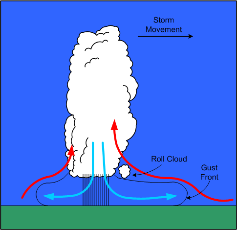

- The appearance of rain at the earth’s surface marks the beginning of the mature stage.
- The mature stage is the most violent stage, and usually lasts for between 20 and 30 minutes.
- As the cloud mass continues to grow, the updrafts reach their maximum velocity, as high as 6000’ per minute.
- The cloud height may build until it reaches the tropopause, and with high-energy cells, the updrafts may penetrate up to five or ten thousand feet into the stable air of the stratosphere.
- The strong winds associated with the tropopause carry the cloud ahead of the storm, forming what appears as an [anvil shape](http://en.wikipedia.org/wiki/Anvil).
- The temperature inversion that occurs above the tropopause acts like a lid, holding the anvil beneath.
- The falling volume of rains acts to simultaneously pull the air downward; the descent of air is accelerated by cooling derived from the evaporation of raindrops in the middle portion of the cloud.
- The cold downdrafts pour out of the bottom of the cloud, and in striking the ground are forced horizontally outward in a radial direction.
- If the downdraft from the cloud mass is strong enough, the damaging winds that are produced are referred to as a microburst; these are exceptionally violent winds that last for only a few minutes and in a concentrated area of only a mile or so across.
- The horizontal outflow is strongest ahead of the cloud mass in the direction of its movement; the outflow produces strong and gusty surface winds referred to as a [gust-front](http://en.wikipedia.org/wiki/Gust_front), which appears as a sharp drop in temperature, and an abrupt rise in pressure.
- Ahead of the gust-front, air flowing into the cloud mass rises up and over the cold outflow winds; as a result, the passage of a gust-front can swing the winds around 180°.
- The shear associated with the passage of inflow and outflow winds can produce [roll clouds](http://en.wikipedia.org/wiki/Roll_cloud) near the main cloud base.
- Hail is most likely to appear in the mature stage, as super-cooled raindrops appear above the freezing level begin to freeze.
- As hail falls, other raindrops coalesce and freeze on the hail stones, enabling them to grow in size; if the hail stones encounter a strong updraft, they are carried again aloft, repeating a cycle that will produce even larger hail stones.
- As hail stones descend below the freezing level, they will begin to melt, and depending on their exposure to heated air, will appear on the surface as either rain or hail; hail is most commonly encountered above the freezing level.
- On occasion, hail is tossed out the side of the cloud mass, and with large storms can appear in clear air several miles downwind of the storm.
- In the mature stage, lighting may appear as the result of the complex interaction between updrafts, downdrafts, rain, snow, and hail.
- Areas of negative and positive change develop in the cloud mass and may grow until the electrical potential reaches a critical level; this results in a lighting discharge, sometimes between areas within the cloud mass, sometimes between cloud masses, and sometimes between the cloud mass and the ground.
- Thunder is the noise made when the heated air along a lightning strike expands faster than the speed of sound; the distance from a lightning strike can be estimated by counting the seconds between lightning and thunder and dividing this by five.
- Severe thunderstorm structures have the potential to form when winds markedly increase with height.  Because the cloud is tilted by windshear (increased winds aloft), the downdrafts associated with precipitation no longer inhibit the flow of updrafts; the tilted updraft becomes a part of an overturning of the air that extends several thousand feet into the stratosphere before settling back into the anvil to become a descending air column; the cloud structure therefore assumes a continuous flow quality that is both persistent and self-propagating; this category of storms may give rise to tornadoes.

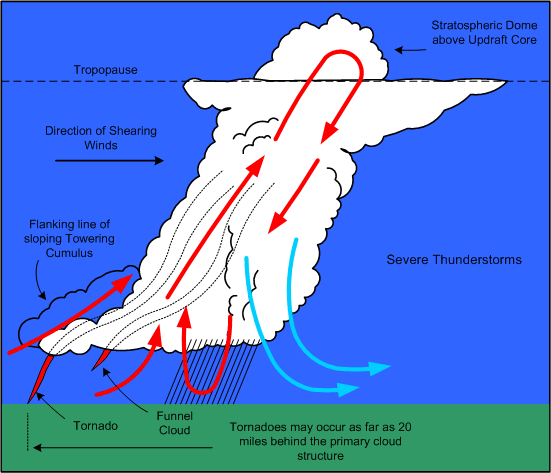

- [Tornadoes](http://en.wikipedia.org/wiki/Tornadoes) appear as violent rotating columns of ascending air; they extend out of the bottom of cloud structure in the shape of a funnel.  Here is the description that appears in Air Command Weather Manual (P.15-6):

A tornado vortex is several hundred yards in diameter with the wind rotating rapidly around it with extremely low pressure in the centre.  If the vortex touches the ground, it is called a **“Tornado”**, if it remains aloft handing from the cloud base it is called a **“Funnel Cloud”**.  Either can extend upward into the cloud for over 30000 feet.  They are most common in the south and southwest parts of the thunderstorm and may enter the cloud in a line of innocent looking cumulus in a rain-free area extending several miles from the parent storm.  They tend to occur as families so if one is seen others are probably occurring.  Over water a tornado forms a “Waterspout.”

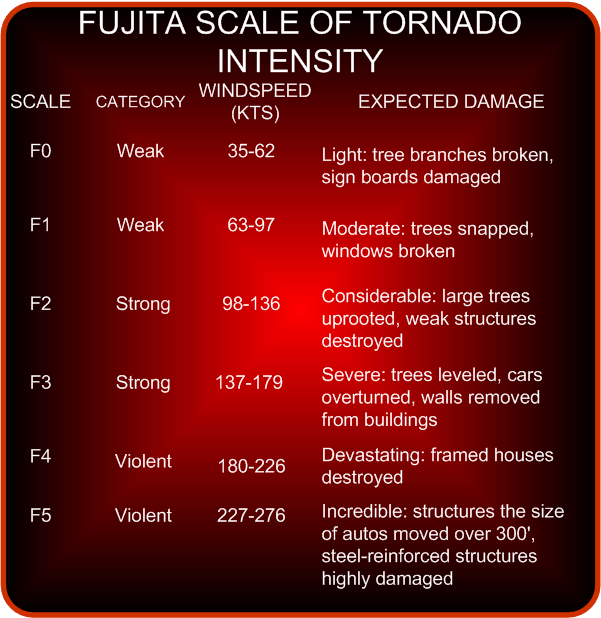

### Dissipation Stage

- The dissipation stage appears at the end of the mature stage; it is the most prolonged stage of a thunderstorm, and may last for one to two hours; it is the least hazardous stage.
- The downdrafts begin to grow in size, and the updrafts begin to weaken.  The lift mechanism that produced the lightening, rain, hail and turbulence becomes undermined.
- The lower levels of the cloud structure appear stratiform, and then dissipate; the anvil aloft may remain for considerable time.

## Thunderstorm Classifications

The classification of thunderstorms is based on the type of trigger that generates them and sets off the instability.  Some of the triggers—mountainous terrain, convective currents, or convergence—can occur anywhere in an air mass, and tend to produce widely scattered or isolated thunderstorms.  Triggers that produce more organized thunderstorms are frontal systems; here the thunderstorms tend to appear in a line, and they are more numerous.

### Frontal Thunderstorms

Thunderstorms associated with warm fronts tend to be the least severe of all frontal thunderstorms.  This is owing to the shallowness of the frontal slope, which results in a more abrupt lifting.

The hazard for warm-front thunderstorms—related especially to IFR flight—is that they tend to be invisible during IMC flight.  Only if flight is conducted above the tops of stratiform clouds will the cloud structures of thunderstorms be visible.

In contrast, thunderstorms associated with cold fronts tend to be the most severe; here the lifting action tends to be move aggressive and concentrated locally, forming a more discernable single line of cells.

The advantage of cold-front thunderstorms is that they are more easily recognizable by the pilot who approaches the front from any direction.

### Squall Line Thunderstorms

When a cold front is fast-moving, and moist, unstable, and warm air exists ahead of the front, a [squall line](http://en.wikipedia.org/wiki/Squall_line) of thunderstorms may develop.[1](#_ftn1)  Squall-line thunderstorms often develop 100 to 200 miles in advance of, and roughly parallel to, a fast moving cold front.  They are known to form rapidly, and their tops are typically higher, and their bases lower, than normal thunderstorms.  As a rule, squall-line thunderstorms have the highest likelihood of developing into severe thunderstorms.

[1](#_ftnref1) On occasion, squall lines can develop in association with low-pressure troughs, sea-breezes adjacent to a mountainous barrier, or the convergence of wind.

## Thunderstorm Hazards

### Turbulence

The two hazards associated with thunderstorm turbulence are loss of control and overstressing of the airframe.

The most extreme turbulence is found where updrafts and downdrafts are adjacent to one another—referred to as [shear zones](http://en.wikipedia.org/wiki/Wind_shear).  Here, the aircraft will encounter drafts moving in opposite directions.  Since downdrafts are associated with little or no rain, and updrafts associated with heavy rain, proximity to a shear zone will be indicated by rapid changes in the rainfall gradient over a very short distance flown.

As a rule, updrafts are normally stronger and are also larger both vertically and horizontally.  Also, they tend to be strongest in the middle and upper levels of the cloud structure; here the aircraft can be displaced upward at a rate of 6000’ per minute, although speeds of less than 3000’ per minute are more common.

In contrast, the strongest downdrafts are found in the middle levels of the cloud mass, and while they are generally weaker, they can be prolonged—incidents of 6000’ descents in downdrafts have been reported.

It is important to understand that the cloud structure is only the visible portion of turbulence of a thunderstorm.  As expected the severity of turbulence decreases with the distance from the storm centre.  Turbulence can be expected within a 20-mile radius of the thunderstorm, and up to 30 miles downwind within the anvil structure of severe storms.

When airborne weather radar is used, the rule is avoid thunderstorm returns (heavy precipitation echoes) by 5 miles, when flying below the freezing level, by 10 miles when flying above the freezing level, and by 20 miles when flying above 30000’.  As well, severe or extreme turbulence can be expected in areas where strong weather radar echoes are separated by less than 30 miles.[1](#_ftn2)

The risk of attempting to fly over a thunderstorm is that the aircraft is likely flying at or near the stall speed, and an encounter with turbulence might provoke a stall with the aircraft descending into the cloud structure.

### Hail

The risks associated with encountering hail are comparable to those of encountering turbulence—[severe airframe damage](http://www.snopes.com/photos/airplane/haildamage.asp) can occur from hail on all leading-edge surfaces, including the windshields.

All thunderstorms have hail in their interior at some point in their stages of development; commonly, however, the hail melts before reaching the ground.  The largest hail is found in severe thunderstorms, is usually produced during the mature stage of development, and is most likely encountered between 10000’ and 30000’.

### Icing

Clear icing can rapidly accumulate in cumulus clouds and thunderstorms, with the heaviest icing appearing just above the freezing level where the highest concentration of super-cooled water droplets exist.  Remember, however, that severe icing may be encountered at any point between temperatures of 0° and -25° C.

### Altimetry

The errors in indicated altitude associated with the passage of thunderstorm occur rapidly and can be as much as 150’; the risk here is particularly significant for aircraft conducting instrument approaches in IMC conditions.  The sequence typically followed is for there to be an abrupt fall in pressure as the storm approaches; as rain showers appear (typically with the first gust), and as the storm passes overhead, there is an abrupt rise in pressure; the pressure gradually returns to normal pressure as the thunderstorm moves on.

### Lightning

Two types of lightning may be encountered by aircraft during flight in or near thunderstorm conditions—triggered lightning and natural lightning.  Triggered lightning is induced by the aircraft’s accumulation of static electricity as it flies through strong electric fields.  As the static electricity builds, there is a buildup of static noise in the communications equipment; at night a corona may become visible across the windshield or at the extremities of the aircraft.  The buildup will continue for several seconds, until there is a discharge in the form of lightning.  In contrast, when natural lightning occurs, it is simply a matter of the aircraft being in proximity at the time of discharge.  The voltages and current flow associated with natural lightning is far greater than that associated with triggered lighting.  Typically, natural lightning enters the aircraft at one extremity, such as the wing tip or nose, and exits at the other extremity—the other wing tip or tail, and then continues to the ground or to another cloud.  The lightning flash is typically composed of several strokes, each following the same path through the aircraft.  The path followed by the lightning is marked by a trail of small burn or pit marks called swept strokes.  The entry and exit points are usually where physical damage occurs to the airframe.  Indirectly, damage to lighting, magnetic compasses, and all electrical equipment can occur.  There have been instances of catastrophic fuel explosions.

[1](#_ftnref2) Air Command Weather Manual, P. 15-13.

## Thunderstorm Flight Procedures

The rule is avoid flight in thunderstorms, and to avoid flying in layered cloud without radar when embedded thunderstorms are present or are forecasted.  Airborne radar is only an avoidance tool, and not a penetration tool.  Early detours around cloud structures are preferred to late detours.  The following rules are published in Air Command Weather Manual:[2](#_ftn1)

**If you cannot avoid penetrating a thunderstorm, here are some dos before entering the storm:**

- Tighten your safety belt, put on your shoulder harness if you have one, and secure all loose objects.
- Plan your course to take you through the storm in a minimum time and hold that course.
- Establish a penetration altitude below the freezing level or above the -25° C level to avoid the most critical icing.
- Turn on pitot heat and carburetor or jet inlet heat.  Icing can be rapid at any altitude and can cause almost instantaneous power failure or loss of airspeed indication.
- Establish power setting for reduced turbulence penetration airspeed recommended in your aircraft manual.  Reduced airspeed lessens the structural stresses on the aircraft.
- Turn up cockpit lights to highest intensity to lessen danger of temporary blindness from lightning.
- Disengage altitude hold mode and speed hold mode.  The automatic altitude and speed controls will increase manoeuvres of the aircraft, thus increasing structural stresses in using automatic pilot.
- Tilt the radar antenna up and down occasionally.  Tilting it up might detect a hail shaft that will reach a point on your course by the time you do.  Tilting it down might detect a growing thunderstorm cell that might reach your altitude.

**Dos and don’ts during thunderstorm penetration:**

- Do keep your eyes on your instruments.  Looking outside the cockpit can increase danger of temporary blindness from lightning.
- Don’t change power settings.  Maintain settings for reduced airspeed.
- Don’t overstress the aircraft trying to maintain a constant altitude; let the aircraft ride the waves.  If in radio contact, advise ATC of your inability to maintain a constant altitude.
- Don’t turn back once you have committed yourself and are in the thunderstorm.  A straight course through the storm most likely will get you out of the hazards quickest.  In addition, turning manoeuvres increase stress on the aircraft.
- Don’t takeoff or land in face of an oncoming thunderstorm.  You could encounter the downburst and shear area.
- Do stay clear of very heavy rain shafts.  They could cause loss of power and loss of lift.

**Points regarding visual flight through thunderstorm areas:**

- The storm cloud is the only visible portion of a turbulent system that often extends outside of the storm cloud into clear air.
- If you are forced to climb to an altitude approaching the aircraft’s ceiling to overfly the storm, there is great danger of engine flame-out or stalling if turbulence is encountered.  Overfly by 1000 feet for every 10 knots of wind speed at top level.
- The horizontal mass of cloud is greatest near mid- and low-levels and least at high levels so there is more clear air at high levels in which to circumnavigate.
- Hail can be thrown out of the anvil into the clear air downwind of the storm.
- Circumnavigate the storm by 10 miles on the downwind side and 3 miles on the upwind side.
- If you are caught under a storm, be prepared for strong updrafts in rain-free areas and strong downdrafts in rain areas.
- Watch for swirls of dust or debris on the ground or the appearance of hanging cloud elements in the base of the cloud: these could indicate tornado activity.  The rain-free southwest portion of a storm is particularly prone to tornado development.
- If one tornado is seen, expect others, since they tend to occur in groups.
- Hail cannot be differentiated from rain visually.
- The gust front may be identified by a line of dust and debris blowing along the earth’s surface.
- Don’t attempt to fly under a thunderstorm even if you can see through to the other side.  Turbulence under the storm could be disastrous.
- The appearance of virga falling and evaporating from high-based storms can indicate violent downdrafts.

[2](#_ftnref1) P. 15-19 and 15-20.

## Thunderstorm Wind Shear

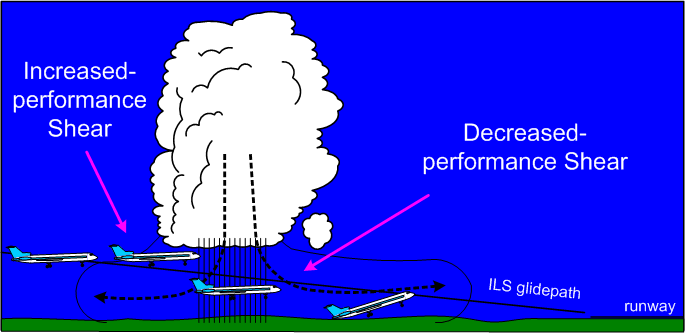

Most accidents related to wind shear are thunderstorm related.  There are two types of shears, referred to as increased-performance shears and decreased-performance shears.  An increased-performance shear occurs when the aircraft abruptly encounters an increased headwind component or a decreased tailwind component; it is indicated to the pilot in the form of an increase in indicated airspeed.  In contrast, a decreased-performance shear occurs when the aircraft abruptly encounters a decreased headwind component or an increased tailwind component.

In addition to shears, updrafts and downdrafts have less effect on airspeed, but more pronounced effect on aircraft lift.  When an aircraft encounters an updraft, the angle of attack will increase, producing an increase in the lift being generated; when downdrafts are encountered, the angle of attack decreases, producing a decrease in lift.

The risk of thunderstorm shear is greatest when a downdraft is centered on localizer during an approach.  When the outflow wind encounters the aircraft, the pilot experiences an increased-performance shear that results in high altitude and higher airspeed indications.  The erred response of the pilot may be to reduce power and increase the angle of attack so as to restore the aircraft back onto the glidepath.  Just as this is accomplished, the aircraft enters the rain shaft associated with the downdraft, but now with reduced airspeed, reduced power, and increased angle of attack.

Traversing the downdraft core, the aircraft next encounters the outflow winds and the associated decreased-performance shear.  In this worst-case scenario, the pilot is now caught below the glidepath with decreased airspeed, high angle of attack, and low power settings.

## Icing

For aircraft during IFR flight, one of the greatest risks is that of icing.  This is especially the case for IFR aircraft operating in low level airspace where icing conditions can be the worst and where, typically, aircraft operating at these altitudes (piston aircraft) have ineffective or non-existent anti-ice or de-ice systems.[1](#_ftn1)  The formation of ice will disrupt laminar flow over the aircraft surfaces.  For propeller aircraft, this disruption is a two-edged sword, as both the lift-producing surfaces become ineffective, but also the thrust-producing surfaces—the propeller blades.  In addition to the loss of lift, icing produces an increase in the weight of the aircraft, also producing greater demand for the now-diminished lift capabilities of the aircraft.  But that is not the end of it.  Just as the increased weight of the aircraft must be reckoned with using diminished lift, icing causes increased drag and a reduction in speed.  It is the propeller blades that must produce increased thrust to counter increased drag, but iced propellers become less and less effective in this function.  In short, the fundamental aerodynamics of an aircraft—lift/weight and thrust/drag—are undermined.  The path towards this undesired state is continuous and inevitable, unless the pilot can remove the aircraft from the icing conditions.  In the worst cases, the diminished performance of the aircraft inhibits the pilot’s ability to climb out of the icing conditions, while a restricted Minimum Enroute Altitude prohibits the aircraft from a descent.

While this is the big picture on icing conditions, there are many other less grand yet equally alarming effects of icing.  Ice can shed from propellers unevenly, causing destructive engine vibrations.  Antennas can be broken off with increased weight and drag, producing a loss of communication and navigation functions.  The movement of control surfaces can be inhibited by ice, restricting the pilot’s ability to control the aircraft.  Ice can cover the windscreen and block a pilot’s forward vision.

[1](#_ftnref1) Generally, an anti-ice system prevents ice from forming on critical aircraft surfaces; in contrast, de-ice systems remove ice that has already formed.

### Super-cooled Water Droplet

At the core of the icing problem is a basic fact of physics: when ice crystals are warmed to above freezing temperatures, the melting process begins immediately; however, when a water droplet is cooled to below freezing temperatures, it does not freeze until it reaches a very cold temperature—possibly as low as -40° C.  This water droplet—existing at temperatures below freezing—is referred to as a super-cooled water droplet (SCWD), and it will instantly freeze if it is disturbed.  Contact with any portion of an aircraft during flight will provide such a disturbance.  Our land-based experience with SCWD is limited to freezing rain or freezing drizzle.  In the air, however, SCWD exists in cloud.  For the most part, any time you fly in cloud at below-freezing temperatures, SCWD will freeze on your aircraft.

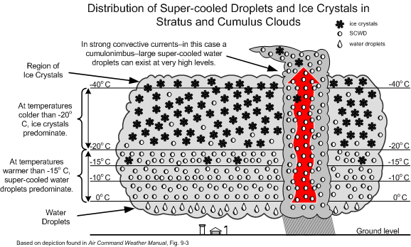

Here are some meteorological factors associated with icing:

- The seriousness of icing depends on the water content in a cloud mass—the greater the liquid content, the greater the risk of encountering  SCWD.

- Large cloud masses have three distinct regions: an ice-crystal region near the top where the vapour sublimates into ice crystals; a snow and supercooled water-droplet (SCWD) region where the two co-exist; and the lower water region, composed of water droplets.
- Severe icing is likely to occur in upper half of heavy cumulus clouds approaching the mature cumulonimbus stage, especially when the temperatures are between -25 and 0°C.
- If the aircraft in temperatures at or below freezing strikes a supercooled water droplet, it will adhere to the airframe.
- The seriousness of icing depends on the size of SCWD—the larger the SCWD, the faster the accumulation of ice.
- While all clouds below freezing will contain SCWD, statiform clouds are associated with smaller SCWD, while cumuliform clouds are associated with the more debilitating larger SCWD.

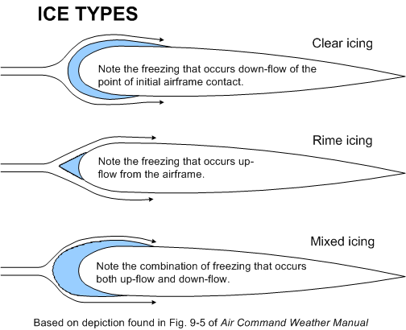

- As it strikes the airframe the droplet releases heat as it freezes and that can raise its temperature to 0°C and therefore spread before freezing (producing clear icing conditions), or it may freeze on contact (producing rime icing conditions).
- Clear ice is heavy and alters the lift characteristics of wings; rime ice appears frost-like, is light, but also alters lift.  Mixed ice denotes the combination of both.
- The higher the temperature of the aircraft skin, the more the droplet will spread from the point of impact.
- The amount of supercooled water in a cloud increases with height when the temperature is just below freezing, but decreases with height when the temperature is well below freezing.

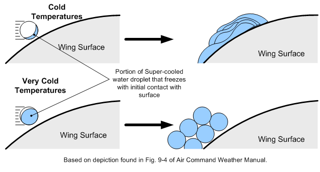

- The larger the droplet, the farther it will spread before freezing.
- The rate of catch increases with airspeed.
- Thin wings catch more droplets than thick wings.

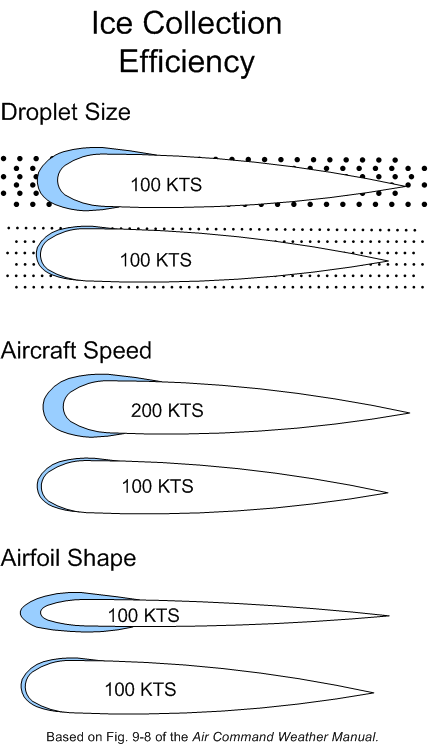

- The first sign of ice accumulation appears on surfaces with leading edges: antennas, prop blades, horizontal stabilizers, rudder, landing gear struts and, most useful for detection, the outside temperature probe.
- Gradual loss of power and the onset of engine roughness indicate ice formation on the propellers.  Ice first forms on the spinners and then spreads to the blades.  The ice accumulates unevenly on the blades, creating stressful vibration, and possible failure.
- On the lifting surfaces, ice changes the lift characteristics, increasing drag and increasing the stall speed.  Combined with decreased thrust from the iced propellers, the pilot is forced to apply full power and a high angle of attack; as a consequence, ice then accumulates on the under surface of the airframe.  When landing an iced aircraft, a high power and high-speed approach should be made.  A blocked pitot tube and static pressure vent can cause failure of the altimeter, airspeed indicator, and vertical speed indicator.  Ice on the antennas can destroy communication and navigation.  Impact ice can block the air intake.  In short, icing is very bad news.
- Here are the classifications[1](#_ftn1) of icing intensity:

|  |  |
| --- | --- |
| Trace | Ice becomes perceptible.  The rate of accretion is slightly greater than the rate of sublimation.  It is not hazardous even though de-icing/anti-icing equipment is not utilized, unless encountered for an extended period of time (over 1 hour). |
| Light | The rate of accretion may create a problem if flight is prolonged in this environment (over 1 hour).  Occasional use of de-icing/anti-icing equipment removes/prevents accretion.  Light ice does not present a problem if the de-icing/anti-icing equipment is used. |
| Moderate | The rate of accretion is such that even short encounters become potentially hazardous and the use of de-icing/anti-icing equipment, or diversion, is necessary. |
| Severe | The rate of accretion is such that de-icing/anti-icing equipment fails to reduce or control the hazard.  Immediate diversion is necessary. |

### Icing rules of thumb

- In the event of icing, a decision to leave the ice-forming layer must be made rapidly once icing appears.  The situation may become critical in a matter of six minutes.
- Turn around.  If not possible, because icing is associated with horizontal temperature layers, the second choice is to climb or descend from the icing layer.  Descending can be dangerous unless warmer temperatures are known to exist below, and there is sufficient ceiling and visibility.
- Use the radio quickly to obtain weather information.
- Avoid known icing conditions; get a weather briefing before your flight.
- Do not fly in rain or wet snow when the temperature is near 0°C.
- Slow the aircraft down; the faster you fly, the greater the distance flown in icing conditions and the more moisture encountered.
- Anticipate a higher stall speed if icing has accumulated; avoid steep turns.
- Anticipate higher fuel consumption with accumulated ice; land faster and keep power on during the landing.

[1](#_ftnref1) Air Command Weather Manual, P. 9-5.

Further Readings

[Takeoff in Conditions of Freezing Drizzle and/or Light Freezing Rain (Fixed-Wing Airplanes)—Part II](http://www.langleyflyingschool.com/Pages/CPGS%20Meteorology,%20Part%202,%20Taking%20Off%20in%20Freezing%20Rain.html) [by Paul Carson, Flight Technical Inspector, Certification and Operational Standards, Standards, Civil Aviation, Transport Canada.](http://www.langleyflyingschool.com/Pages/CPGS%20Meteorology,%20Part%202,%20Taking%20Off%20in%20Freezing%20Rain.html)

[Booking Sheet](https://app.flightschedulepro.com/Account/Login/127737) |
[Contact Form](http://www.langleyflyingschool.com/Pages/contact_us/contact_form.html) |
[Address & Map](http://www.langleyflyingschool.com/contact_us/address_&_map.html) |
[Apply Now](http://www.langleyflyingschool.com/Pages/Applynow.html) |

Langley Flying School, Inc.

Unit 110, 5385- 216 Street Langley, British Columbia, V2Y 2N3 Canada

E-mail : Administration@langleyflyingschool.com

Toll-free in Canada: 1-877-532-6461

International: 1-604-532-6461

Langley Flying School is regulated by the Private Training Institutions Regulatory Unit of the Ministry of Post-Secondary Education and Future Skills.

© 2023 Langley Flying School, Inc. The content of this website is protected by copyright and reproduction in whole or in part is only authorized with the written consent of Alex Zhang, President and CEO, Langley Flying School.

*"Choose a job you love, and you will never have to work a day in your life."* Confucius

#training\_logo {
float: right;
}
