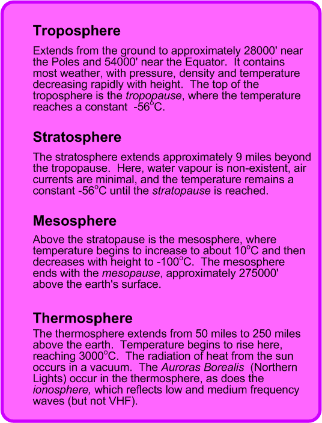
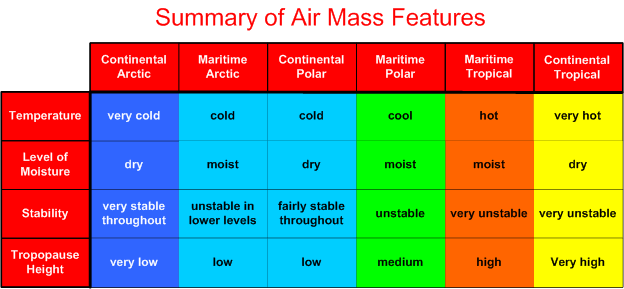
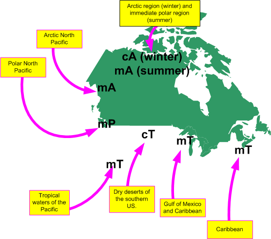
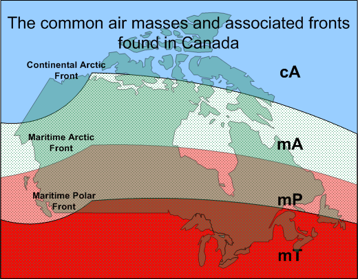
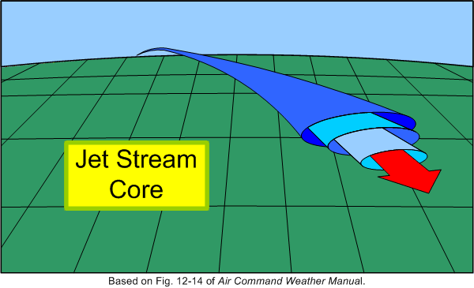
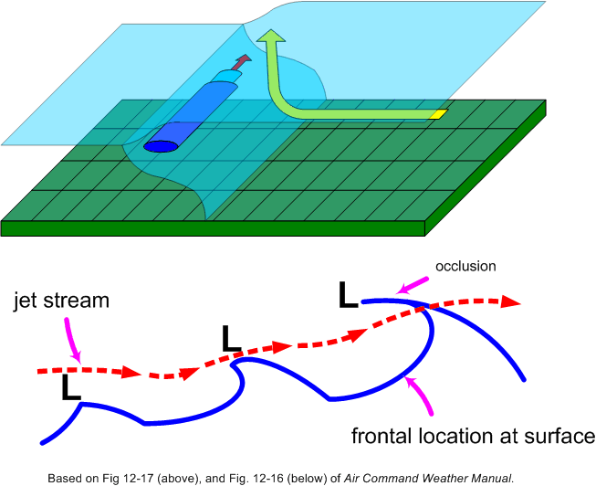
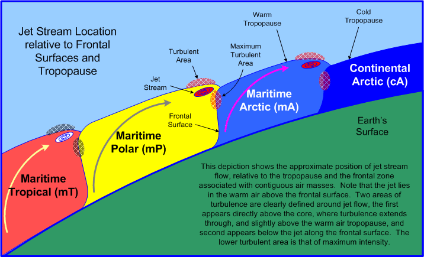
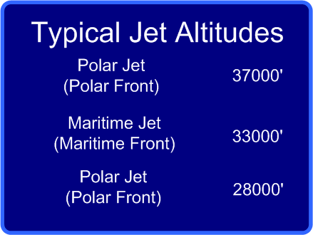
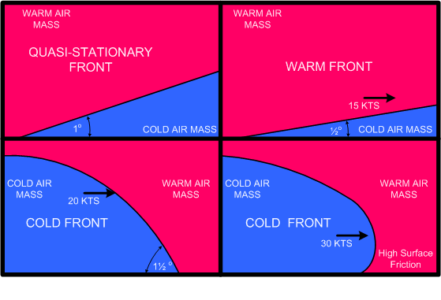
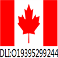

# Commercial Pilot Meteorology (Part 1)

> Source: <http://www.langleyflyingschool.com/Pages/CPGS%20Meteorology,%20Part%201.html>  
> Section: Weather Handbooks and Important Links  
> Captured: 2026-08-19 06:00 UTC  
> PDF: [commercial-pilot-meteorology-part-1.pdf](commercial-pilot-meteorology-part-1.pdf) · Original HTML: [source/original.html](source/original.html)

---

**Notice**: Undefined variable: count in **/home/p5xmazbfpecn/public\_html/common.php** on line **21**

- [Home](http://www.langleyflyingschool.com/)
- [About Us](#)
  - [Our Mission](http://www.langleyflyingschool.com/Pages/Mission%20Statement.html)
  - [The School](http://www.langleyflyingschool.com/Pages/The%20School.html)
  - [The Staff](http://www.langleyflyingschool.com/Pages/Staff.html)
  - [Gift Ideas](http://www.langleyflyingschool.com/Pages/Gift%20Ideas.html)
- [Prospective Students](#)
  - [Flying as a Career](http://www.langleyflyingschool.com/Pages/Flying%20as%20a%20Career.html)
  - [Student Loans](http://www.langleyflyingschool.com/Pages/Student_Loans.html)
  - [International Students](http://www.langleyflyingschool.com/Pages/International%20Students.html)
  - [Student Support Services](http://www.langleyflyingschool.com/Pages/Student%20Support%20Services.html)
  - [Code of Practice](http://www.langleyflyingschool.com/Pages/Code%20of%20Practice.html)
- [Current Students](#)
  - [Visit PTIRU Website](https://www.privatetraininginstitutions.gov.bc.ca/)
  - [Langley Flying School Policy Booklet](http://www.langleyflyingschool.com/PDF%20Documents/Langley%20Flying%20School%20Policy%20Booklet%20June%202023.pdf)
  - [Langley Flying School Schedule](http://www.langleyflyingschool.com/PDF%20Documents/Schedule%20for%20Morning%20PPL%20Groundschool%20September%202025.pdf)
  - [Program](#awards)
    - [PTIRU certificate](http://www.langleyflyingschool.com/PDF%20Documents/PTIB.pdf)
    - [Aviation Diploma (PTIRU Approval)](http://www.langleyflyingschool.com/PDF%20Documents/Aviation%20Diploma%20Student%20Contract%202025.pdf)
    - [Commercial Pilot Flight Training (PTIRU Approval)](http://www.langleyflyingschool.com/PDF%20Documents/CPL%20Student%20Contract%202025.pdf)
    - [Commercial Pilot With Applied Human Factors Aviation Diploma (PTIRU Approval)](http://www.langleyflyingschool.com/PDF%20Documents/Applied%20Human%20Factors%20in%20Aviation%20Program%20Student%20Contract%20PTIB%202024.pdf)
    - [Group 1 or 3 Instrument Rating Training (PTIRU Approval)](http://www.langleyflyingschool.com/PDF%20Documents/Instrument%20Rating%20Student%20Contract%202025.pdf)
    - [Instructor Rating Flight Training (PTIRU Approval)](http://www.langleyflyingschool.com/PDF%20Documents/Instructor%20Rating%20Student%20Contract%202025.pdf)
    - [Multi Engine Class Rating Flight Training(PTIRU Approval)](http://www.langleyflyingschool.com/PDF%20Documents/Multi%20Engine%20Rating%20Student%20Contract%202025.pdf)
    - [Private Pilot Flight Training](http://www.langleyflyingschool.com/PDF%20Documents/PPL%20Student%20Contract%202025.pdf)
  - [Program Outline](#awards)
    - [Aviation Diploma](http://www.langleyflyingschool.com/PDF%20Documents/Langley%20Flying%20School%20%20Aviation%20Diploma%20Program%20Outline.pdf)
    - [Commercial Pilot Flight Training](http://www.langleyflyingschool.com/PDF%20Documents/Langley%20Flying%20School%20Commercial%20Program%20Outline.pdf)
    - [Commercial Pilot With Applied Human Factors Aviation Diploma](http://www.langleyflyingschool.com/PDF%20Documents/Langley%20Flying%20School%20Commercial%20Pilot%20with%20Applied%20Human%20Factors%20in%20Aviation%20Program%20Outline.pdf)
    - [Group 1 or 3 Instrument Rating Training](http://www.langleyflyingschool.com/PDF%20Documents/Langley%20Flying%20School%20Instrument%20Rating%20Program%20Outline.pdf)
    - [Instructor Rating Flight Training](http://www.langleyflyingschool.com/PDF%20Documents/Langley%20Flying%20School%20Instructor%20Rating%20Program%20Outline.pdf)
    - [Multi Engine Class Rating Flight Training](http://www.langleyflyingschool.com/PDF%20Documents/Langley%20Flying%20School%20Multi%20Engine%20Rating%20Program%20Outline.pdf)
  - [Ready Room](http://www.langleyflyingschool.com/Pages/Ready%20Room.html)
  - [Classroom](http://www.langleyflyingschool.com/Pages/Classroom.html)
  - [Booking Sheet](https://app.flightschedulepro.com/Account/Login/127737)
  - [Weight And Baiance Documents](#awards)
    - [Piper Cherokee](http://www.langleyflyingschool.com/Pages/Piper%20Cherokee.html)
    - [Cessna](http://www.langleyflyingschool.com/Pages/Cessna.html)
- [Staff and Administration](#)
  - [Web Email](https://sso.godaddy.com/login?app=email&realm=pass)
  - [Students Balance Reminding](http://www.langleyflyingschool.com/staff/StudentsBalanceReminding.html)
  - [Standard Operating Procedures](http://www.langleyflyingschool.com/staff/Standard%20Operating%20Procedures.html)
  - [Anonymous Safety/Incident Reporting](#awards)
    - [Anonymous Operations Safety Reporting](https://docs.google.com/forms/d/e/1FAIpQLSc-n_HllQQ2Vgo6CaTFSvNWDu_KHFbVIkjgv9kHVlglCXM5nQ/viewform?usp=sf_link)
  - [Flight Operations Safety Threats List](http://www.langleyflyingschool.com/staff/Safety%20Threat%20List.html)
  - [Workplace Safety Threats List](http://www.langleyflyingschool.com/staff/Workplace%20Safety%20Threat%20List.html)
  - [Workplace Safety Threats List](http://www.langleyflyingschool.com/pages/Standard%20Operating%20Procedures%20Workplace%20Safety%20Hazmats.html)
  - [Maintenance Control Manual](http://www.langleyflyingschool.com/staff/LFSMCMrev9%20SN10.pdf)
  - [Maintenance Control Schedule](http://www.langleyflyingschool.com/staff/Maintenance%20Control%20Schedule.html)
  - [Aircraft Maintenance Documents](#awards)
    - [Maintenance Control Manual](http://www.langleyflyingschool.com/PDF%20Documents/LFSMCMrev9%20SN10.pdf)
    - [Documents Incorporated by Reference](http://www.langleyflyingschool.com/PDF%20Documents/LFS%20DIRs%20rev3.pdf)
    - [Piper Cherokee Maintenance Schedules](http://www.langleyflyingschool.com/PDF%20Documents/Piper%20Cherokee%20Maintenance%20Schedule.pdf)
    - [Cessna 152 Maintenance Schedules](http://www.langleyflyingschool.com/PDF%20Documents/Cessna%20152%20Maintenance%20Scedule.pdf)
    - [Cessna 172 Maintenance Schedules](http://www.langleyflyingschool.com/PDF%20Documents/172%20check%20sheets.pdf)
    - [Seneca Maintenance Schedules](http://www.langleyflyingschool.com/PDF%20Documents/Piper%20Senneca%20Maintenance%20Scedule.pdf)
  - [Instructor Teaching Load and Availability](http://www.langleyflyingschool.com/staff/Instructor%20Teaching%20Load%20and%20Availability.html)
  - [Instructor/Student Availability](http://www.langleyflyingschool.com/staff/Instructor%20Student%20Availability.html)
  - [Student Waitlist & Assignment Sheet](http://www.langleyflyingschool.com/staff/Student%20Waitlist%20&%20Assignment%20Sheet.html)
  - [Flight Instructor Aircraft Responsibility](http://www.langleyflyingschool.com/staff/SOPs%20Aircraft%20Responsibility%20List.html)
  - [Flight Operation Notices](http://www.langleyflyingschool.com/staff/Flight%20Operation%20Notices.html)
  - [Authorized Persons' List](http://www.langleyflyingschool.com/staff/Authorized_Persons'_List.html)
  - [Class IV Instructor Supervision Status](http://www.langleyflyingschool.com/staff/SOPs_Class_IV_Instructor_Supervision_Status.html)
  - [Staff Meeting Minutes](http://www.langleyflyingschool.com/staff/SOPs%20Staff%20Meeting%20Minutes.html)
  - [Staff Safety Training Record](http://www.langleyflyingschool.com/staff/Staff%20Safety%20Training.html)
  - [Staff Training Policy](http://www.langleyflyingschool.com/staff/Staff_Training.html)
  - [Aircraft Maintenance Supervisor Training Record](http://www.langleyflyingschool.com/staff/Aircraft_Maintenance_Supervisor_Training_Record.html)
  - [Student Enrolment Contracts](http://www.langleyflyingschool.com/staff/Student_Enrolment_Contracts.html)
  - [Request to Start Advanced Flight Training](http://www.langleyflyingschool.com/staff/Request_to_start_training.html)
  - [Flight Training Authorization](http://www.langleyflyingschool.com/staff/Flight_Training_Authorization.html)
  - [Prior Learning Assessment Report](http://docs.google.com/forms/d/1R67E1YlbO8i9CqivHqY_hyMAOOJTEnI0pYTRq28xanI/viewform)
  - [Student Language Testing](http://www.langleyflyingschool.com/staff/Language_Testing.html)
  - [Lesson Plans](#awards)
    - [Private Pilot Program](http://www.langleyflyingschool.com/Pages/staff%20private%20pilot%20program.html)
    - [Commercial Pilot Program](http://www.langleyflyingschool.com/Pages/staff%20Commercial%20Pilot%20Program.html)
    - [Multi-engine Rating Program](http://www.langleyflyingschool.com/Pages/staff%20Multi-engine%20Rating%20Program.html)
    - [Instrument Rating Program](http://www.langleyflyingschool.com/Pages/staff%20Aviation%20Language%20Training%20Program.html)
    - [Instruction Rating Program](http://www.langleyflyingschool.com/Pages/staff%20Instruction%20Rating%20Program.html)
    - [Aviation Language Training Program](http://www.langleyflyingschool.com/Pages/staff%20Aviation%20Language%20Training%20Program.html)
  - [Quality Assurance](http://www.langleyflyingschool.com/staff/Education%20Quality%20Assurance%20Tasks.html)
- [Apply Now](#)
  - [Candidate Application Form](http://www.langleyflyingschool.com/Pages/Applynow.html)
  - [Contact Form](http://www.langleyflyingschool.com/Pages/contact_us/contact_form.html)
  - [Address & Map](http://www.langleyflyingschool.com/Pages/contact_us/address_&_map.html)
  - [Employment Opportunities](http://www.langleyflyingschool.com/Pages/Employment%20Opportunities.html)

- [Home](http://www.langleyflyingschool.com/) /
- Students / Resources / Classroom / Commercial Pilot  Groundschool  /
- Meteorology--Part I

# METEOROLOGY (Part I)

- [METEOROLOGY (Part I)](#METEOROLOGY%20(Part%20I))
- - [The Troposphere](#The%20Troposphere)
  - [Air Masses](#Air%20Masses)
  - - [Canadian Air Masses](#Canadian%20Air%20Masses)
    - [Continental Arctic (cA)](#Continental%20Arctic%20(cA))
    - [Maritime Arctic (mA)](#Maritime%20Arctic%20(mA))
    - [Maritime Polar (mP)](#Maritime%20Polar%20(mP))
    - [Maritime Tropical (mT)](#Maritime%20Tropical%20(mT))
    - [Continental Tropical (cT)](#Continental%20Tropical%20(cT))
  - [Air Mass Fronts](#Air%20Mass%20Fronts)
  - [Air Mass Jet Streams 1](#Air%20Mass%20Jet%20Streams%201)
  - [Standard Atmosphere](#Standard%20Atmosphere)
  - [Clouds](#Clouds)
  - - [Cloud Classification](#Cloud%20Classification)
    - [Vertical development of cloud](#Vertical%20development%20of%20cloud)
  - [Sky Opacity](#Sky%20Opacity )
  - [Pressure](#Pressure)
  - [Coriolis Force](#Coriolis%20Force)
  - [Local Phenomenon Winds](#Local%20Phenomenon%20Winds)
  - [Humidity](#Humidity)
  - [Heating](#Heating)
  - [Cooling](#Cooling)
  - [Stability](#Stability)
  - [Fronts](#Fronts)

## The Troposphere

The troposphere is that portion of the atmosphere where weather occurs.  It is the region of the atmosphere that is subject to heating and cooling from the earth’s surface, and it is also marked by the presence of water vapour.  Heating and cooling, combined with the presence of large-scale wind currents, producing what we regard as weather.

The change in temperature in the troposphere is somewhat predictable—it air cools approximately 2°C per 1000’ increase in altitude, and the top of the troposphere—referred to as the tropopause—is indicated by a stabilization of temperature.  In the region of the atmosphere directly above the tropopause—known as the stratosphere—the temperature eventually begins to increase with increased height in the stratosphere.  The stratosphere is marked by excellent visibility, with no cloud, moisture, or turbulence—in short, a lack of weather.

The height of the troposphere averages approximately 11 kilometres, or 36000’, but varies between about 17 kilometres (55000’) over the equator, and about 8 kilometres (28000’) near the poles.  Also, the overall height of the troposphere increases in the summer, and decreases in the winter.

Winds in the troposphere are minimal near the surface, and reach their maximum velocity near the tropopause.

## Air Masses

The troposphere is composed of a patterned patchwork of distinguishable air masses.  Six classifications of air masses exist, and these are summarized in the table that appears below.

Generally, an air mass is a large, slow-moving high-pressure system, typically in excess of 1000 miles across.  By definition, an air mass has uniform horizontal characteristics of moisture and temperature, but the body of air that makes up an air mass is subject to internal variations, based on the geographical features of the land or water over which it lies, as well as the characteristics of the adjacent air masses that surround it.  Most importantly, air masses are dynamic, and are subject to modification as they migrate.  The modification of an air mass varies with the speed of movement, the moisture or dryness of regions over which they pass, and the temperature differential between the air mass and the land mass or water underlying it.

While the classification of air mass is based on moisture content, temperature and the height of its tropopause, the prime factor that determines composition and features of an air mass is its source region—the area where the high pressure originated.  If the source region is oceanic, for example, the air mass will be moist, just as it would be dry if it the air mass originated from a desert region, or cool if originated over a snow-covered region.

### Canadian Air Masses

Almost all of the six types of air masses make an appearance in Canada, the one exception being the Continental Polar—Canada lacks the widespread dry polar region required for the formation of this air mass.  Instead, the prevalence of lakes and wetlands in Canada’s northern and north-central regions inhibit the formation of this dry, cool air mass.  The common air masses in Canada are therefore the Continental Arctic (cA), the Maritime Arctic (mA), the Maritime Polar (mP), and the Maritime Tropical (mT).

Can you see the “Capt” for Captain in this— cA, mA, mP, and mT.  Thanks, Tom Larkin.

### Continental Arctic (cA)

This air mass is dry, very cold and very stable throughout.  Compared to other air masses, it is not vertically thick, and it therefore has a very low tropopause.  The source region for cA is the North Pole.  The cA becomes massive in the winter months, but contracts drastically during the winter, generally restricted to North Pole.

The degree of modification that occurs to cA varies with the season.  During the winter, there is very little modification, as the air travels over a consistently snow-covered region; south of the snow line, the air mass becomes heated from below, resulting in widespread low-level instability that produces frequent rain and snow showers.  As cA continues its migration into the U.S., the intensifying low-level heating eventually transforms this air mass into Continental Polar (cP).

### Maritime Arctic (mA)

During the summer, cA is dramatically modified as it travels over the thousands of lakes that appear in northern Canada during the warmer months.  In the summer, then, the dry air mass picks up more and more moisture as it travels south, and becomes modified into mA, characterized by rain showers that result from the combination of convective activity and low-level moisture.  This air mass—migrating down the center of the continent—rarely affects the West Coast of Canada; instead it travels south across the prairies and further into eastern Canada.

Alaska, and over the northern portion of the Pacific Ocean.  Again, it is a radically modified cA that acquires low-level warmth and moisture.  Owing to the contrast in temperatures—warm water and cold air—mA is marked by extensive convection instability in the lower levels, giving frequent rain and show showers.

### Maritime Polar (mP)

If the mA air mass described above travels further south into the Pacific Ocean before reaching North America, it loses its mA classification and it is transformed into mP.  The characteristics of mP are similar to mA, except the warmed low-level warmth and moisture extends further into the mP air mass.  The height of mP is therefore located in the medium tropopause; it is a moist, cool, and unstable air mass.

### Maritime Tropical (mT)

The mT air mass originates from two generalized locations, the Caribbean in the southwest, and the southern Pacific.  Both source regions are associated with tropical waters, and mT is typically very warm, moist, and unstable throughout its vertical dimensions.  In the winter, mT that migrates northward over Canada is cooled from below, thereby producing an inversion with warm air overlying a cooler level near the surface.  The appearance of mT at the surface in the northern portions of Canada is rare; instead, the air mass is typically forced aloft and is therefore found in the upper regions of the atmosphere.  During the summer, incoming mT is subject to cooling at night, and again this produces an inversion; during the day, however, there is normally sufficient daytime heating to reheat the lower levels and dissipate the inversion.  Daytime heating of mT is also associated with high levels of instability and violent convection (thunderstorms).  When mT travels northward from the Caribbean over the Atlantic lying offshore from the east coast of North America, the cooling effect will be more pervasive and the mT inversion will not be subject to diurnal variations.

### Continental Tropical (cT)

The cT air mass originates in the desert area of the southern U. S.  In the winter, cT does not appear in Canada.  In the summer, however, cT may migrate northward following the flatlands that extend north/south through the North American Continent.  With the exception of the appearance of night time inversions as it migrates northward, there is very little modification of cT in Canada.

## Air Mass Fronts

Air masses are the key players in the formation of frontal systems.  Where dissimilar air meets—along the border of air masses—fronts appear.  Importantly, the name of a frontal system is based on the name of the colder air mass involved.  From coldest to warmest, therefore, the fronts can be mapped out as follows: between cA and mA is the Arctic Front, between mA and mP is the Maritime Arctic Front, and between the mP and mT is the Maritime Polar Front.

The movement of fronts is dependent on the motion of the cold air mass, and is independent of the motion of the warm air.

## Air Mass Jet Streams [1](#_ftn2)

The maximum wind velocities in the tropopause are found in jet streams, where wind speeds can reach speeds in excess of 200 KTS.  These high-velocity winds appear as narrow, ribbon-like streams that are embedded in tropospheric flow.  They can be thousands of miles long, and are typically a few hundred miles wide (horizontally) and a few thousand feet thick (vertically).  As a rule, jet-stream flow typically appears in association with strong frontal surfaces of adjacent air masses.  As heat is transported to the outer reaches of an air mass (which in the northern hemisphere is the northern boundary of the air mass), jet streams find their energy from the Coriolis force which converts the upper northerly flown into easterly flow.  To be classified as a jet stream, the winds must be in excess of 60 KTS, but the maximum speeds

may exceed an amazing 200 KTS.  In all cases, the speed of the wind abruptly drops off above, below, and on either side of the jet core, giving rise to clear air turbulence.   As a rule, jet stream flow is found parallel and to the north of a surface location of the frontal line; specifically, the jet stream lies in the warm air above the frontal surface, adjacent to the top of the tropopause associated with the cold air mass.  If a frontal wave (and the associated low pressure system) is associated with the front, the jet stream will lie well north of the surface front.  In the case of an occluded front, the jet stream will cut over the front near the point of occlusion.  The jet stream is named in accordance with the frontal system causing it.  In the height of the jet therefore varies with the height of the tropopause of the cold air mass.  The colder the air mass, the lower its tropopause and the lower the jet associated with it.  Also, since tropopause height varies with the seasons—the tropopause is generally lower during the winter months—jet streams are also found at lower altitudes during the winter.

[1](#_ftnref2) Jet streams are discussed here owing to the fact that an instrument rating is required for flight in high-level airspace.  Note that jet streams questions do not appear on the INRAT examination, but be aware that they do appear on the Airline Transport Pilot examinations.

## Standard Atmosphere

Calculations and predictions about the troposphere are based on the assumptions of standard conditions (standard atmosphere).  These assumptions are collectively referred to as ICAO (International Civil Aviation Organization) Standard Atmosphere, and consist of the following:

- sea-level temperature of 15°C;
- sea-level pressure 29.92 inches of Mercury (“Hg.), or 1013.2 hectopascals (hPa) or millibars;
- temperature lapse rate of 1.98°C per 1000’ increase in altitude (used throughout the world);
- Dry air.

## Clouds

Clouds form when air reaches its saturation point, whereby invisible water vapour becomes visible moisture.  When the water vapour becomes visible water, the process is condensation; when it becomes visible ice particles, the process is sublimation.  The warmer the air, the more invisible water vapour it can hold.

### Cloud Classification

Clouds are classified on the basis of physical form or appearance and height.  There are three forms:

- cumulus clouds—fluffy-cotton shaped, and indicate rising, unstable air;
- stratus clouds—flat, layered clouds, indicating stable air;
- nimbus clouds—clouds that emit rain or snow.

The classification of cloud height is bases on three categories:

Classification

Height

Composition

Types

High Clouds

16500’ to 45000’

ice crystals

Cirrus (Ci), thin wavy wisps, “mares’ tails;” Cirrocumulus (Cc), “mackerel sky;” Cirrostratus (Cs), thin “sheet” of cloud, producing “halo” around the sun, often indicating an approaching warm front.

Middle Clouds

6500’ to 23000’

ice crystals, water droplets, or supercooled water droplets

Altocumulus (Ac), a layer or series of rounded cloud masses that sometimes indicate an approaching front (Altocumulus Castellanus—Acc—are large turreted Altocumulus clouds, associated with icing and turbulence); Altostratus (As), a thick, grey cloud veil, often indicating an approaching warm front (the cloud slopes downward toward the front).

Low Clouds

surface to 6500’

ice crystals, water droplets, or supercooled water droplets

Stratus (St), uniform thick cloud, like airborne fog, sometimes producing drizzle; stratus that is broken up by wind is Stratus fractus; Stratocumulus (Sc), layer or series of rounded or rolling cloud; Nimbostratus (Ns), dark thick stratocumulus producing uniform rain or snow.

### Vertical development of cloud

- **Cumulus** (Cu): dense cotton balls with flat bases and rounded tops; appear at the warm time of day and dissipate at night; when associated with ragged fragments, they are called cumulus fractus (Cf); smooth air above, bumpy air below.
- **Towering Cumulus** (Tcu): developed from cumulus clouds and usually develop into cumulonimbus; rough air below them, and smooth air on top; associated with heavy icing.
- **Cumulonimbus** (Cb): developed towering cumulus that extend above freezing level; cloud summits form anvil shape; heavy precipitation with hail and lighting; often in a line in association with a cold front; can be embedded; avoided by all pilots because of turbulence and icing.

## Sky Opacity

Sky opacity—that is, the amount of sky visible in relation to the presence of cloud layers—is described on the basis eighths or oktas.  Clear: no clouds; few: 1/8 to 2/8 sky cover; scattered: 3/8 to 4/8; broken: 5/8 to 7/8; overcast: 8/8.

Remember that the opacity of multiple cloud layers is cumulative—for example, the higher of two scatter layers, each of which is composed to 3 oktas, is actually classed as “broken” (3/8 + 3/8 = 6/8).

## Pressure

A square-inch column of atmosphere usually weighs 14.7 lbs. at sea level and 6.75 lbs. at 20000 feet.  When related to aviation, pressure is measured by a mercury barometer and is expressed in inches of mercury (“Hg).  Using this unit, pressure generally varies between 27.76 and 31.27 “Hg.  For meteorological purposes, the unit called hectopascal (hPa) is used.  A hectopascal is a pressure exerted on 1 square centimetre by a force of 1000 dynes.  Standard pressure of 29.92”Hg is equivalent to 1013.2 hPa.

There are three categories for pressure measurement.  Station pressure is the raw pressure at an observing station; station pressure does not take into consideration the elevation of observing station, which of course would have an effect on ambient pressure.  In contrast, Mean Sea Level (MSL) Pressure reduces all station pressures to a standard measurement that is corrected for elevation; the MSL Pressure of observing stations can be compared for the purpose of weather analysis.  Finally, Altimeter Setting Pressure (ASP) is similar to MSL pressure, except that it is based on the assumptions of an ICAO standard atmosphere—standard sea level temperature of 15°C and a standard lapse rate of 1.98°C per 1000 ft.  When ASP is dialled in on an altimeter at ground level, elevation is indicated, but only provided standard atmospheric conditions exist—obviously, this is rare.

Geographic areas of equal pressure are joined by isobars.  Isobars never cross, but show areas identified as lows, secondary lows, troughs, highs, ridges and cols.  These pressure systems constantly change.  Most systems move in a west to east direction.

Lows

Also called cyclones or depressions; they are low pressure areas that vary in size (from country to continent) and move an average of 500 miles per day in the summer, and 700 miles per day in winter; they drift usually in a north-eastward or south-eastward direction, circulating in an anticlockwise direction (clockwise in the southern hemisphere); low-pressure systems are associated with poor weather.

A semi-permanent Aleutian Low forms in the Gulf of Alaska and the Aleutian Islands, while the Atlantic counterpart is the Icelandic Low, which forms between Greenland and Iceland; these systems are more intense during the winter than during the summer.

Secondary Low

These are smaller low pressure disturbances in larger low systems, circulating around the larger system in an anticlockwise fashion.

Trough

An elongated u-shaped area of low pressure with higher pressure on either side.

Col

A neutral region between two highs and two lows; an area of unsettled weather.

Highs

Also called anti-cyclones, highs are areas of high pressure, with the highest pressure in the middle; they are associated with fair, clear weather; they move slower than lows.

A semi-permanent Pacific High extends from the West Coast of the U.S. west to Hawaii, while the East Coast counterpart is the Bermuda High, which lies roughly between Bermuda and the Azores.  Both are more extensive and have higher pressure in the summer than in the winter.

Ridge

Elongated high-pressure areas, with low pressure on either side.

## Coriolis Force

As a rule, winds blow from high pressure to low pressure; also, the higher the pressure gradient, the higher the winds at the surface and aloft.  If the earth did not rotate, the movement of air (wind) would by from a high-pressure centre directly to a low-pressure centre.  However, because the earth is rotating, the movement of air is deflected to the right (Fennell’s Law); high pressure therefore circulates in a clockwise fashion while low pressure circulates anti-clockwise ([Coriolis Force](http://en.wikipedia.org/wiki/Coriolis_effect)).  Movement is the reverse in the Southern Hemisphere.

Another force affecting wind is surface friction; at the surface, the movement of the air slows, and the Coriolis Force is reduced.

End result: air moves across isobars with a slight angle inward toward low pressure (convergence) and outward from high pressure (divergence).  Above 3000’ AGL, the winds blow parallel to the isobars (no surface friction).

As a rule, if you stand with your back to the wind, the low-pressure area will be on your left side; this is referred to as [Buys Ballot’s Law](http://en.wikipedia.org/wiki/Buys-Ballot's_law).

## Local Phenomenon Winds

Land and sea breezes

As a rule, since land heats up and cools off faster than water, a sea breeze (from sea to land) blows during the day, and a land breeze (land to sea) blows at night.

Mountain Winds

Valley walls cool at night, causing down-slope breezes (katabatic wind),[1](#_ftn1) while warm valley walls in the day cause up-slope breezes (anabatic wind).

Mountain Waves

Turbulence associated with mountain waves are typically found on the leeward side of mountains.  Downdrafts of 2000’ per minute are common and can be as great as 5000’ per minute.  The downdrafts occur along the leeside and are most severe at summit height.  The visual indicators of mountain wave activity are cap clouds on the mountain tops, rotor clouds on the leeside below the peak level, and lenticular clouds high above the rotor cloud.  The more perpendicular the winds are to the mountain range, the more violent the turbulence; the most severe turbulence is found between the rotor cloud tops and the ground.

Mechanical turbulence

Mechanical turbulence is turbulence in the wind created by surface features (hills, buildings, etc.).

Veering and Backing Winds

Winds veer when they rotate in a clockwise fashion, and back when they rotate anticlockwise; when descending to land the wind will back and decrease; at night the winds back and decrease, and in the day they veer and increase.

Wind shear

Wind shear denotes a sudden change in wind speed that can occur along the horizontal or vertical.  Frontal wind shear can occur if the temperature change is greater than 5°C, or if the front is moving in excess of 30 KTS.  A gust sheer can occur as much as 10 miles ahead of a thunderstorm, producing wind speeds in excess of 100 KTS.  Temperature inversions associated with night-time cooling cause wind shear near the top of the inversion, especially in association with a low-level jet stream.

[1](#_ftnref1) “Cool Kat”—katabatic winds are the result of cooling, producing downward movement of the air.

## Humidity

Cloud formation occurs when invisible water vapour becomes visible, either as water droplets or ice crystals.  As stated above, this is called condensation and sublimation, respectively.  As a rule, every air mass is limited in the amount of moisture it can hold; when this limit is reached—referred to as the saturation point—condensation will occur.  The amount of moisture an air mass can hold is dependent on temperature: the warmer the air, the more moisture it can hold.  Here are some concepts related to humidity:

Relative Humidity

This is the ratio of water vapour in the air relative to the saturation point (saturated air has 100% Relative Humidity).  As air is cooled its ability to hold invisible moisture decreases; the temperature to which unsaturated air must be cooled to become saturated (at constant pressure and humidity) is called the [dewpoint](http://en.wikipedia.org/wiki/Saturation_point).  The smaller the spread between temperature and dewpoint, the higher the relative humidity.  Fog or cloud usually forms when the spread is within 2°C.  The appearance of precipitation is referred to as super saturation.

Supercooled Water Droplets

Water droplets can remain in a water state as low as -40°C, and are commonly found in cloud with temperatures between 0° and -15°C.  When these droplets strike an airframe, severe icing can occur.

## Heating

The atmosphere is heated from below from the earth’s surface by radiation (terrestrial radiation).  Specifically, we identify four processes:

- convection, where air over warm surfaces becomes heated and rises; cold air descends to replace it;
- advection, where cold air becomes heated after moving over a warm surface;
- compression, where descending air is compressed and its temperature rises;
- turbulence, the mixing process whereby heat is distributed.

Isotherms are found on meteorological maps and are lines joining areas of equal temperature.

## Cooling

Since the atmosphere is heated from below, temperature decreases with increased altitude; the rate of decrease is called the lapse rate.  The lapse rate is 2°C per 1000’ (specifically, 1.98°C).

The earth’s surface cools at night as heat is lost by radiation—radiation cooling.  When warm air moves over a cool surface, the decreased temperature of the air is advection cooling.  As air rises, it expands and cools; this is called the adiabatic process.  Two adiabatic lapse rates are used: the dry adiabatic lapse rate, which is 3°C per 1000’, and the saturated adiabatic lapse rate, which is 1.5°C per 1000 ft.

Using the dry adiabatic lapse rate, cloud bases can be predicted; icing levels can be predicted by the saturated adiabatic lapse rate.  To make the calculation, you require surface temperature and dew point; take the temperature-dewpoint spread and divide by 3 for predicting cloud heights in thousands of feet or by 1.5 to predict freezing level.[1](#_ftn1)

[1](#_ftnref1) Pay close attention to the description of the Adiabatic Lapse Rates found in From the Ground Up, as it is suggested that the dry adiabatic rate is 2.5°C when allowance is made for changes in the dewpoint.

## Stability

It is useful to differentiate between two types of air masses: stable and unstable.

Stability of an air mass refers to its tendency to develop vertical movement (updrafts and downdrafts).

Stable air resists vertical movement, and when displaced returns to its original horizontal level; unstable air moves further up and down when disturbed.

The stability of an air mass is an important predictor of the likelihood of turbulence and thunderstorms—the more unstable the air, the more likely these phenomena will occur.

When expansion of air takes place, the air is cooled.  This is the adiabatic process.

If the rising air cools to a temperature equal to its surrounding air, stability will occur and it will stop rising; if, however, the rising air remains warmer than the surrounding air, it will continue to rise.

The main indicator of air stability is therefore the temperature lapse rate.  Rule: A steep lapse rate creates instability, and a shallow lapse rate creates stability.

Advection therefore causes a steepening of the lapse rate and creates instability, while an isothermal layer (layer with constant vertical temperature) or an inversion (reversed lapse rate) cause stability.

Lifting agents which create vertical movement of air:

- Convection:  air heated by a warm surface; an example of this is the evenly spaced puffy clouds that form on a previously clear summer’s day.
- Orographic lift: air forced to rise because of terrain; this is why the folks in North Vancouver have so much rain; it is also why folks on the West Coast have rain and the Prairie folks do not.
- Frontal lift: cold air undercutting warm air.
- Mechanical turbulence: friction between wind and surface.
- Convergence: air moving to the centre of a low pressure, which fills the area and is forced to rise.

## Fronts

A quasi-stationary front is the edge of a cold air mass that is neither advancing nor retreating—marked by alternating red and blue lines, or as a black line with triangles and semi-circles.

When a front dissipates, this is referred to a frontolysis; when a front forms, this is frontogenesis.

Cold and warm air do not mix, and the areas forming the transition zones between them where there is a large temperature change are called fronts.

A cold front is a leading edge of an advancing cold air mass; they are marked on weather maps in blue, or in black with solid triangles.  The slope of a cold front is small relative to the surface of earth—in the order of 1½°, but this is modified by both the speed of the front and the presence of surface friction.  Cold fronts are fast-moving compared to warm fronts, and in the event of an extremely fast cold front, a protruding nose can appear in the frontal slope.  The appearance of a protruding nose creates an extremely unstable weather in the transition zone, as the colder air aloft descends violently on the cold air caught under the protrusion.  A protruding nose is typically associated with a line squall of cumulus nimbus cloud structure.

A warm front is the trailing edge of a cold air mass, marked in red or in black with solid semi-circles.  The slope of a warm front is somewhat less than that of cold front—perhaps 1°.  Warm fronts are slow-moving, but the faster the warm front, the flatter the slope.

[Booking Sheet](https://app.flightschedulepro.com/Account/Login/127737) |
[Contact Form](http://www.langleyflyingschool.com/Pages/contact_us/contact_form.html) |
[Address & Map](http://www.langleyflyingschool.com/contact_us/address_&_map.html) |
[Apply Now](http://www.langleyflyingschool.com/Pages/Applynow.html) |

Langley Flying School, Inc.

Unit 110, 5385- 216 Street Langley, British Columbia, V2Y 2N3 Canada

E-mail : Administration@langleyflyingschool.com

Toll-free in Canada: 1-877-532-6461

International: 1-604-532-6461

Langley Flying School is regulated by the Private Training Institutions Regulatory Unit of the Ministry of Post-Secondary Education and Future Skills.

© 2023 Langley Flying School, Inc. The content of this website is protected by copyright and reproduction in whole or in part is only authorized with the written consent of Alex Zhang, President and CEO, Langley Flying School.

*"Choose a job you love, and you will never have to work a day in your life."* Confucius

#training\_logo {
float: right;
}
