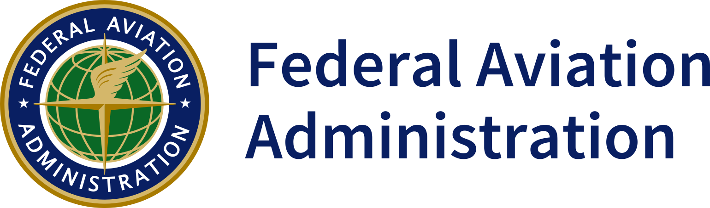

# FAA - Aviation Weather For Pilots and Flight Operations

> Source: <https://www.faa.gov/regulations_policies/advisory_circulars/index.cfm/go/document.information/documentID/22268>  
> Section: Weather Handbooks and Important Links  
> Captured: 2026-08-19 06:00 UTC  
> PDF: [faa-aviation-weather-for-pilots-and-flight-operations.pdf](faa-aviation-weather-for-pilots-and-flight-operations.pdf) · Original HTML: [source/original.html](source/original.html)

---

[Skip to page content](#content)

[Skip to main content](#main)

# USA Banner

An official website of the United States government Here's how you know

**Official websites use .gov**
A **.gov** website belongs to an official government organization in the United States.

**Secure .gov websites use HTTPS**
A **lock** ( LockA locked padlock ) or **https://** means you’ve safely connected to the .gov website. Share sensitive information only on official, secure websites.

.cls-1{fill:#FFFFFF;}United States Department of Transportation
[United States Department of Transportation](https://www.transportation.gov)

## Secondary navigation

- [About](https://www.faa.gov/about/)
- [Jobs](https://www.faa.gov/jobs/)
- [News](https://www.faa.gov/newsroom)

Enter Search Term(s):

## Main navigation (Desktop)

- [Aircraft](https://www.faa.gov/aircraft)

  ## Subnav: Aircraft 1

  - [Aircraft Certification](https://www.faa.gov/aircraft/air_cert/)
  - [Aviation Safety Draft Documents Open for Comment](https://www.faa.gov/aircraft/draft_docs/)
  - [Vintage & Experimental Aircraft Program](https://www.faa.gov/licenses_certificates/vintage_experimental/)

  ## Subnav: Aircraft 2

  - [Aircraft Safety](https://www.faa.gov/aircraft/safety/)
  - [General Aviation & Recreational Aircraft](https://www.faa.gov/aircraft/gen_av/)
  - [Repair Stations](https://www.faa.gov/aircraft/repair/)
  - [Air Carrier & Air Agency Certification](https://www.faa.gov/licenses_certificates/airline_certification/)
- [Air Traffic](https://www.faa.gov/air_traffic)

  ## Subnav: Air Traffic 1

  - [Air Traffic By The Numbers](https://www.faa.gov/air_traffic/by_the_numbers/)
  - [Air Traffic Environmental Review](https://www.faa.gov/air_traffic/environmental_issues/)
  - [Community Engagement](https://www.faa.gov/air_traffic/community_engagement/)
  - [Flight Information](https://www.faa.gov/air_traffic/flight_info/)
  - [International Aviation](https://www.faa.gov/air_traffic/international_aviation/)
  - [National Airspace System](https://www.faa.gov/air_traffic/nas/)

  ## Subnav: Air Traffic 2

  - [NextGen](https://www.faa.gov/nextgen/)
  - [Obstruction Evaluation](https://www.faa.gov/air_traffic/obstruction_evaluation/)
  - [Air Traffic Plans and Publications](https://www.faa.gov/air_traffic/publications/)
  - [Separation Standards](https://www.faa.gov/air_traffic/separation_standards/)
  - [Technology](https://www.faa.gov/air_traffic/technology/)
  - [Weather](https://www.faa.gov/air_traffic/weather/)
- [Airports](https://www.faa.gov/airports)

  ## Subnav: Airports 1

  - [Airport Cooperative Research Program](https://www.faa.gov/airports/acrp/)
  - [Airport Improvement Program](https://www.faa.gov/airports/aip/)
  - [Airport Compliance](https://www.faa.gov/airports/airport_compliance/)
  - [Airport Rescue Grants](https://www.faa.gov/airports/airport_rescue_grants/)
  - [Airport Safety](https://www.faa.gov/airports/airport_safety/)
  - [Airport Certification](https://www.faa.gov/airports/airport_safety/part139_cert)
  - [CARES Act Grants](https://www.faa.gov/airports/cares_act/)
  - [Airport Coronavirus Response Grant Program](https://www.faa.gov/airports/crrsaa/)

  ## Subnav: Airports 2

  - [Engineering, Design, & Construction](https://www.faa.gov/airports/engineering/)
  - [Environmental Programs](https://www.faa.gov/airports/environmental/)
  - [News & Information](https://www.faa.gov/airports/news_information/)
  - [Passenger Facility Charge (PFC) Program](https://www.faa.gov/airports/pfc/)
  - [Planning & Capacity](https://www.faa.gov/airports/planning_capacity/)
  - [Resources](https://www.faa.gov/airports/resources/)
  - [Regions](https://www.faa.gov/airports/regions/)
  - [Runway Safety](https://www.faa.gov/airports/runway_safety/)
  - [Airport Safety Information Video Series](https://www.faa.gov/airports/safety-video-series)
- [Pilots & Airmen](https://www.faa.gov/pilots)

  ## Subnav: Airmen 1

  - [Find an Aviation Medical Examiner](https://www.faa.gov/pilots/amelocator/)
  - [Become a Pilot](https://www.faa.gov/pilots/become/)
  - [International Flight](https://www.faa.gov/pilots/intl/)
  - [Pilot Certificates & Records](https://www.faa.gov/pilots/lic_cert/)
  - [Medical Certification](https://www.faa.gov/pilots/medical_certification)
  - [FAA Safety Team](https://www.faa.gov/faasteam)

  ## Subnav: Airmen 2

  - [Mechanics](https://www.faa.gov/mechanics)
  - [Repairmen](https://www.faa.gov/repairmen)
  - [Designees](https://www.faa.gov/other_visit/aviation_industry/designees_delegations)
  - [Airmen Certification](https://www.faa.gov/licenses_certificates/airmen_certification/)
  - [Training & Testing](https://www.faa.gov/training_testing)
  - [From the Flight Deck](https://www.faa.gov/flight_deck)
- [Data & Research](https://www.faa.gov/data_research)

  ## Subnav: Data & Research 1

  - [Accident & Incident Data](https://www.faa.gov/data_research/accident_incident/)
  - [Aviation Forecasts](https://www.faa.gov/data_research/aviation/)
  - [Aviation Data & Statistics](https://www.faa.gov/data_research/aviation_data_statistics/)
  - [Commercial Space Data](https://www.faa.gov/data_research/commercial_space_data/)
  - [Economic Impact](https://www.faa.gov/economic-impact)

  ## Subnav: Data & Research 2

  - [Funding & Grant Data](https://www.faa.gov/data_research/funding_grant/)
  - [Passengers & Cargo](https://www.faa.gov/data_research/passengers_cargo/)
  - [Research](https://www.faa.gov/data_research/research/)
  - [Safety](https://www.faa.gov/data_research/safety/)
  - [Technical Library](https://www.faa.gov/data_research/library)
- [Regulations](https://www.faa.gov/regulations_policies)

  ## Subnav: Regulations 1

  - [Advisory Circulars](https://www.faa.gov/regulations_policies/advisory_circulars/)
  - [Airworthiness Directives](https://www.faa.gov/regulations_policies/airworthiness_directives/)
  - [FAA Regulations](https://www.faa.gov/regulations_policies/faa_regulations/)
  - [Forms](https://www.faa.gov/forms)
  - [Handbooks & Manuals](https://www.faa.gov/regulations_policies/handbooks_manuals/)
  - [Orders & Notices](https://www.faa.gov/regulations_policies/orders_notices/)

  ## Subnav: Regulations 2

  - [Pilot Records Database](https://www.faa.gov/regulations_policies/pilot_records_database/)
  - [Policy & Guidance](https://www.faa.gov/regulations_policies/policy_guidance/)
  - [Rulemaking](https://www.faa.gov/regulations_policies/rulemaking/)
  - [Temporary Flight Restrictions](https://tfr.faa.gov/)
  - [Notices to Airmen (NOTAM)](https://pilotweb.nas.faa.gov/PilotWeb/)
- [Space](https://www.faa.gov/space)

  ## Subnav: Space 1

  - [About the Office of Commercial Space Transportation](https://www.faa.gov/about/office_org/headquarters_offices/ast)
  - [Careers](https://www.faa.gov/space/careers)
  - [Licenses, Permits & Approvals](https://www.faa.gov/space/licenses)
  - [Resources & Additional Information](https://www.faa.gov/space/resources_and_Information)
  - [Legislation & Policies, Regulations & Guidance](https://www.faa.gov/space/legislation_regulation_guidance/)
  - [Environmental](https://www.faa.gov/space/environmental)
  - [Spaceports](https://www.faa.gov/space/office_spaceports)

  ## Subnav: Space 2

  - [Airspace Integration](https://www.faa.gov/space/airspace_integration/)
  - [Stakeholder Engagement](https://www.faa.gov/space/stakeholder_engagement/)
  - [Compliance, Enforcement & Mishap](https://www.faa.gov/space/compliance_enforcement_mishap)
  - [Commercial Human Space Flight](https://www.faa.gov/space/human_spaceflight)
- [Drones](https://www.faa.gov/uas)

  ## Subnav: Drones 1

  - [Advanced Air Mobility](https://www.faa.gov/air-taxis)
  - [Advanced Operations](https://www.faa.gov/uas/advanced_operations/)
  - [Certificated Remote Pilots including Commercial Operators](https://www.faa.gov/uas/commercial_operators/)
  - [Contact Us](https://www.faa.gov/uas/contact_us/)
  - [Critical Infrastructure & Public Venues](https://www.faa.gov/uas/critical_infrastructure/)
  - [Drone Events](https://www.faa.gov/uas/events)
  - [Educational Users](https://www.faa.gov/uas/educational_users/)
  - [UAS en Espanol](https://www.faa.gov/uas/espanol/para_empezar/)

  ## Subnav: Drones 2

  - [Getting Started](https://www.faa.gov/uas/getting_started/)
  - [Public Safety and Government](https://www.faa.gov/uas/public_safety_gov/)
  - [Programs, Partnerships & Opportunities](https://www.faa.gov/uas/programs_partnerships/)
  - [Recreational Flyers & Modeler Community-Based Organizations](https://www.faa.gov/uas/recreational_flyers)
  - [Resources & Other Topics](https://www.faa.gov/uas/resources/)
  - [Research & Development](https://www.faa.gov/uas/research_development/)

Menu Main navigation (Desktop)

## Main navigation (Mobile)

- [Aircraft](https://www.faa.gov/aircraft)

  ## Subnav: Aircraft 1

  - [Aircraft Certification](https://www.faa.gov/aircraft/air_cert/)
  - [Aviation Safety Draft Documents Open for Comment](https://www.faa.gov/aircraft/draft_docs/)
  - [Vintage & Experimental Aircraft Program](https://www.faa.gov/licenses_certificates/vintage_experimental/)

  ## Subnav: Aircraft 2

  - [Aircraft Safety](https://www.faa.gov/aircraft/safety/)
  - [General Aviation & Recreational Aircraft](https://www.faa.gov/aircraft/gen_av/)
  - [Repair Stations](https://www.faa.gov/aircraft/repair/)
  - [Air Carrier & Air Agency Certification](https://www.faa.gov/licenses_certificates/airline_certification/)
- [Air Traffic](https://www.faa.gov/air_traffic)

  ## Subnav: Air Traffic 1

  - [Air Traffic By The Numbers](https://www.faa.gov/air_traffic/by_the_numbers/)
  - [Air Traffic Environmental Review](https://www.faa.gov/air_traffic/environmental_issues/)
  - [Community Engagement](https://www.faa.gov/air_traffic/community_engagement/)
  - [Flight Information](https://www.faa.gov/air_traffic/flight_info/)
  - [International Aviation](https://www.faa.gov/air_traffic/international_aviation/)
  - [National Airspace System](https://www.faa.gov/air_traffic/nas/)

  ## Subnav: Air Traffic 2

  - [NextGen](https://www.faa.gov/nextgen/)
  - [Obstruction Evaluation](https://www.faa.gov/air_traffic/obstruction_evaluation/)
  - [Air Traffic Plans and Publications](https://www.faa.gov/air_traffic/publications/)
  - [Separation Standards](https://www.faa.gov/air_traffic/separation_standards/)
  - [Technology](https://www.faa.gov/air_traffic/technology/)
  - [Weather](https://www.faa.gov/air_traffic/weather/)
- [Airports](https://www.faa.gov/airports)

  ## Subnav: Airports 1

  - [Airport Cooperative Research Program](https://www.faa.gov/airports/acrp/)
  - [Airport Improvement Program](https://www.faa.gov/airports/aip/)
  - [Airport Compliance](https://www.faa.gov/airports/airport_compliance/)
  - [Airport Rescue Grants](https://www.faa.gov/airports/airport_rescue_grants/)
  - [Airport Safety](https://www.faa.gov/airports/airport_safety/)
  - [Airport Certification](https://www.faa.gov/airports/airport_safety/part139_cert)
  - [CARES Act Grants](https://www.faa.gov/airports/cares_act/)
  - [Airport Coronavirus Response Grant Program](https://www.faa.gov/airports/crrsaa/)

  ## Subnav: Airports 2

  - [Engineering, Design, & Construction](https://www.faa.gov/airports/engineering/)
  - [Environmental Programs](https://www.faa.gov/airports/environmental/)
  - [News & Information](https://www.faa.gov/airports/news_information/)
  - [Passenger Facility Charge (PFC) Program](https://www.faa.gov/airports/pfc/)
  - [Planning & Capacity](https://www.faa.gov/airports/planning_capacity/)
  - [Resources](https://www.faa.gov/airports/resources/)
  - [Regions](https://www.faa.gov/airports/regions/)
  - [Runway Safety](https://www.faa.gov/airports/runway_safety/)
  - [Airport Safety Information Video Series](https://www.faa.gov/airports/safety-video-series)
- [Pilots & Airmen](https://www.faa.gov/pilots)

  ## Subnav: Airmen 1

  - [Find an Aviation Medical Examiner](https://www.faa.gov/pilots/amelocator/)
  - [Become a Pilot](https://www.faa.gov/pilots/become/)
  - [International Flight](https://www.faa.gov/pilots/intl/)
  - [Pilot Certificates & Records](https://www.faa.gov/pilots/lic_cert/)
  - [Medical Certification](https://www.faa.gov/pilots/medical_certification)
  - [FAA Safety Team](https://www.faa.gov/faasteam)

  ## Subnav: Airmen 2

  - [Mechanics](https://www.faa.gov/mechanics)
  - [Repairmen](https://www.faa.gov/repairmen)
  - [Designees](https://www.faa.gov/other_visit/aviation_industry/designees_delegations)
  - [Airmen Certification](https://www.faa.gov/licenses_certificates/airmen_certification/)
  - [Training & Testing](https://www.faa.gov/training_testing)
  - [From the Flight Deck](https://www.faa.gov/flight_deck)
- [Data & Research](https://www.faa.gov/data_research)

  ## Subnav: Data & Research 1

  - [Accident & Incident Data](https://www.faa.gov/data_research/accident_incident/)
  - [Aviation Forecasts](https://www.faa.gov/data_research/aviation/)
  - [Aviation Data & Statistics](https://www.faa.gov/data_research/aviation_data_statistics/)
  - [Commercial Space Data](https://www.faa.gov/data_research/commercial_space_data/)
  - [Economic Impact](https://www.faa.gov/economic-impact)

  ## Subnav: Data & Research 2

  - [Funding & Grant Data](https://www.faa.gov/data_research/funding_grant/)
  - [Passengers & Cargo](https://www.faa.gov/data_research/passengers_cargo/)
  - [Research](https://www.faa.gov/data_research/research/)
  - [Safety](https://www.faa.gov/data_research/safety/)
  - [Technical Library](https://www.faa.gov/data_research/library)
- [Regulations](https://www.faa.gov/regulations_policies)

  ## Subnav: Regulations 1

  - [Advisory Circulars](https://www.faa.gov/regulations_policies/advisory_circulars/)
  - [Airworthiness Directives](https://www.faa.gov/regulations_policies/airworthiness_directives/)
  - [FAA Regulations](https://www.faa.gov/regulations_policies/faa_regulations/)
  - [Forms](https://www.faa.gov/forms)
  - [Handbooks & Manuals](https://www.faa.gov/regulations_policies/handbooks_manuals/)
  - [Orders & Notices](https://www.faa.gov/regulations_policies/orders_notices/)

  ## Subnav: Regulations 2

  - [Pilot Records Database](https://www.faa.gov/regulations_policies/pilot_records_database/)
  - [Policy & Guidance](https://www.faa.gov/regulations_policies/policy_guidance/)
  - [Rulemaking](https://www.faa.gov/regulations_policies/rulemaking/)
  - [Temporary Flight Restrictions](https://tfr.faa.gov/)
  - [Notices to Airmen (NOTAM)](https://pilotweb.nas.faa.gov/PilotWeb/)
- [Space](https://www.faa.gov/space)

  ## Subnav: Space 1

  - [About the Office of Commercial Space Transportation](https://www.faa.gov/about/office_org/headquarters_offices/ast)
  - [Careers](https://www.faa.gov/space/careers)
  - [Licenses, Permits & Approvals](https://www.faa.gov/space/licenses)
  - [Resources & Additional Information](https://www.faa.gov/space/resources_and_Information)
  - [Legislation & Policies, Regulations & Guidance](https://www.faa.gov/space/legislation_regulation_guidance/)
  - [Environmental](https://www.faa.gov/space/environmental)
  - [Spaceports](https://www.faa.gov/space/office_spaceports)

  ## Subnav: Space 2

  - [Airspace Integration](https://www.faa.gov/space/airspace_integration/)
  - [Stakeholder Engagement](https://www.faa.gov/space/stakeholder_engagement/)
  - [Compliance, Enforcement & Mishap](https://www.faa.gov/space/compliance_enforcement_mishap)
  - [Commercial Human Space Flight](https://www.faa.gov/space/human_spaceflight)
- [Drones](https://www.faa.gov/uas)

  ## Subnav: Drones 1

  - [Advanced Air Mobility](https://www.faa.gov/air-taxis)
  - [Advanced Operations](https://www.faa.gov/uas/advanced_operations/)
  - [Certificated Remote Pilots including Commercial Operators](https://www.faa.gov/uas/commercial_operators/)
  - [Contact Us](https://www.faa.gov/uas/contact_us/)
  - [Critical Infrastructure & Public Venues](https://www.faa.gov/uas/critical_infrastructure/)
  - [Drone Events](https://www.faa.gov/uas/events)
  - [Educational Users](https://www.faa.gov/uas/educational_users/)
  - [UAS en Espanol](https://www.faa.gov/uas/espanol/para_empezar/)

  ## Subnav: Drones 2

  - [Getting Started](https://www.faa.gov/uas/getting_started/)
  - [Public Safety and Government](https://www.faa.gov/uas/public_safety_gov/)
  - [Programs, Partnerships & Opportunities](https://www.faa.gov/uas/programs_partnerships/)
  - [Recreational Flyers & Modeler Community-Based Organizations](https://www.faa.gov/uas/recreational_flyers)
  - [Resources & Other Topics](https://www.faa.gov/uas/resources/)
  - [Research & Development](https://www.faa.gov/uas/research_development/)

Menu Main navigation (Mobile)

[FAA Home](https://www.faa.gov/)
▸
[Regulations & Policies](https://www.faa.gov/regulations_policies/)
▸
[Advisory Circulars (ACs)](https://www.faa.gov/regulations_policies/advisory_circulars/)
▸
Document Information

# AC 00-6A - Aviation Weather For Pilots and Flight Operations Personnel (Cancelled)

- [Share
  Share](https://www.faa.gov/news/stay_connected/)
- 

- [Facebook
  Share on Facebook](https://www.faa.gov/exit/?id=gLIKZYBFoMeA4ZCoxTYxAbC4MFTrpEPsRWJA6yVWnJpYQ%2F65ZtSfDcR7780cJ3nd%2Fq1XNh7COT1XTZicP1kUjAOx13jZFkOrPOTJVczW%2BNwcVfHqKpLJiC6OpbW%2FjBvX0HJVdCBcdKPbAUE54N6KGICwqwgetMBLyDwK%2FxLfHC0iq36PiEup773ut3zuf0IygaC6dJjUZIUlk2sEbLYAsJgaAdEwM9j0J%2FNZhgd1iMz4gb0lhVJE6bG7u4zm6pgV1BEckLPYeEivKKaREhMJjJP%2FP3%2BB7kPaObDnMR%2BbVaH0oNrBYbtyd%2Bux5sdAchRQ%2Bgm27Ba5nARyGQaaCmnp1DmToiL629fGoRcLNu3qyBy3fXmEoDgmCYLjKyLYResWMCI%2FZUDUlP%2F%2FubY9egMxAEj7yOKG648m91gDtRDfz%2B%2B7HgaPWT0IvO%2FHTJnqF0PuUtztf%2B90H1mMcaVJA333PqDLLbFUOb3yKv12xDsJUY4Vmzk2eQ92GbKpO41OjP9I64%2FdauGAhS190xrYOihEIO49rW7wtH4MbNVWmCsOdU5oZhETg2k0eJrDp5NGYGjnArJIbbIvhUUU%2F40%2FCGvP7FkbNoaay1kTftVTpBo9PSv52w0YWgKVRUNJeS9A2MnZNcWnGoVSDK3KBBV01ssghn%2BKEwvTdCoLkmZJbeOqg7ON3B%2Fwz1glOiflv9OlomulhdlFA13sZoq%2BRO56%2F6XNx3yRq%2FweILWuCt2r3nqABMcGz58h3BqlsVDOWwcK%2FYjTIfVcE%2FkPt%2BWkJSv%2Bt%2F%2BD0eGEkXkyGROw3KIOUlD1BicS8wUaKnfLOYJ0Xx%2Fs8Rhe4z6UzE3qYUbVoJYNRRyjXUx%2FWKWnxqJ1xDIv3%2B1C3oPFPqws67ke1zopk%2BA6%2F3co3YWZTJ7N%2BTMU63rxt5KkklQZ%2FZ3F5iGyDNGns04Y%2FdUFzu%2FAn00mmTmakyycoJbH5XT7U0IVKyWg%2BzE0nMndX81%2FkOWlYkfR5pP%2FXTR93SXed6%2B6qfxXsMIy%2F%2FzuqMQ%2BB9wlCjpqVrnXKo4GFHBBds2tDx3%2BgQAReXb2ZDUzl0B%2BEPdofOcMKOq5mUJjD3UzUaA%2FaPtcnshNp%2FwH8AeYTTQh0KLYEZFfQFD6kK0tJ2OlVSpL9DAtq64nZiTZmvc6Vq9BEGuV6YVgNOQPjSHic2gIlTVQvPOEbMR7dowiwxb4T8Rusm6imIZl4gOnlsrp2isxC0cAN8GA5%2FT3NXRT7e4QtzlnMVvJGk2O%2FHZHI8uDyTcmo7I0RK9VqhTL3YLYZB2JIy%2BpRSfMVy1psBgFx5G7sDiuaiF%2FN6agNINVGeYTzjjSCe3Xv6ZayQwk2N%2Fksn6fSl2L5drCHFaTQcO74g%3D%3D)
- [Twitter
  Tweet on Twitter](https://www.faa.gov/exit/?id=gLIKZYBFoMeA4ZCoxTYxAbC4MFTrpEPsRWJA6yVWnJpYQ%2F65ZtSfDcR7780cJ3ndHWelM%2FMG%2F0VPjJljlRruX8EqSZbLwhMrHDOpJ8jMg0%2FdmNXQX6ezsl82qKAVbqUMiUfn6l0VYecG68DqWj%2BQtd2OAjpJDHS8RaI5rQJFp604pDJ5%2F5dvPbl1wXimMm9NyXBTudWK%2FXsrbUSVaCBAhP%2FmWoKvGcDuAUPQQMjvVn2IPtpWnk7HcdBKcuobngBRdSLV2EsyJqtiW%2FCrrAE71DaiscgAR2%2FnTVXor%2BqPwVTmcOR2WaiisXYWr2CPq9byVcs%2BFL4fYp8lvfjQ1%2FtGUzL8a3pcg%2FLFlxEe9LK67%2ByyYpZ0y7pbmC0B9QPHHbU8dBoPoIuqDqvfum2X6ud1R1R3uYUrgfN4kGPQmqBpaZxzXr1mmaHJr8BvhCELlvr%2FpCMFvLFlBaCYv9hv2mN4vZQ3cjXjHTo6ZYBDpzPTWasHIktoM6M2uZAZAKR7mR%2FT0R%2F18G9sOA9pcoaSwntZFvkXCi9VjJncVLc80FFLv%2Bwe%2FtBvj9hDRAMqBAKU1RTsMigsAyX11zwDFhn8LFXxANInHsoozLI2Lby0xb7IJRva1%2FzMgMpS6AQ9vYJVqo53iu3Nf541Kja6Vy3aKZC9d%2Fhk7suXgAn4Y7dCKCPUlLvw1RbOatU5C%2BKMIWNYcht9Ybc7lYnikYXo2qxXaCUtKHhlvYFu3%2FfofItPUx4mBLPfzU73rGLG2fcqfsKGNLdQjXM%2Fr60d4E5a7MWCnXDjM617C%2BCCa2ZGy9mjAbgW3gwTho4ZB6gV4gpV2GekBbQ7OB5FrvpMe%2BlGIJvnRqzb9eGwFXb50jlud7L3gJM6X9nhyiFd%2Fqz78R4u0QNgi9Bfb%2B6h8Sk3xNbZHLXNd0uqG2SC8Ui9cI%2B6DFsDG41XQ3%2BM5b%2FQqr2KfK7Y1oGdKhru65ycnTb8Rf%2FtEZPI1wjcAeqE3TG1eFS3mBSX6Y9ECdw11TaWYBFtlrmRSt0WLMBRrq28t38ar2s35bVGZJHNIIg8HiyPTrr0GUmWvbB7%2FZ0%3D)

## Document Information

Number
:   00-6A

Title
:   Aviation Weather For Pilots and Flight Operations Personnel

Date cancelled
:   2016-08-23

Cancellation notes
:   AC 00-6B

Date issued
:   1975-01-01

Office of Primary Responsibility
:   AFS-400

Description
:   Provides an up-to-date and expanded text for pilots and other flight operations personnel whose interest in meteorology is primarily in its application to flying.

Content
:   - [Chap 1-3](https://www.faa.gov/documentLibrary/media/Advisory_Circular/AC%2000-6A%20Chap%201-3.pdf) (PDF)
    - [Chap 4-6](https://www.faa.gov/documentLibrary/media/Advisory_Circular/AC%2000-6A%20Chap%204-6.pdf) (PDF)
    - [Chap 7-9](https://www.faa.gov/documentLibrary/media/Advisory_Circular/AC%2000-6A%20Chap%207-9.pdf) (PDF)
    - [Chap 10-12](https://www.faa.gov/documentLibrary/media/Advisory_Circular/AC%2000-6A%20Chap%2010-12.pdf) (PDF)
    - [Chap 13-15](https://www.faa.gov/documentLibrary/media/Advisory_Circular/AC%2000-6A%20Chap%2013-15.pdf) (PDF)
    - [Chap 16-index](https://www.faa.gov/documentLibrary/media/Advisory_Circular/AC%2000-6A%20Chap%2016-Index.pdf) (PDF)

## View All

- [Current ACs](https://www.faa.gov/regulations_policies/advisory_circulars/index.cfm/go/document.list/)
- [Cancelled ACs](https://www.faa.gov/regulations_policies/advisory_circulars/index.cfm/go/document.list/?statusID=3)
- [Series 150 ACs](https://www.faa.gov/regulations_policies/advisory_circulars/index.cfm/go/document.list/?appliedFacets=%7B%22subjectclass%22%3A%22150%2F*%22%7D)
- [Draft Series 150 ACs](https://www.faa.gov/regulations_policies/advisory_circulars/index.cfm/go/document.drafts/)

## Export All

- [Current ACs](https://www.faa.gov/regulations_policies/advisory_circulars/index.cfm/go/document.exportAll/statusID/2) (CSV)
- [Cancelled ACs](https://www.faa.gov/regulations_policies/advisory_circulars/index.cfm/go/document.exportAll/statusID/3) (CSV)

## Contact Information

- [Advisory Circulars Administrator](https://www.faa.gov/contact_faa/?returnPage=M%2FVU8M%2BN57XLEH8L%3DK%3BESBI%3E1CYA5T%2403%5BQ%5E%24E%28Z%24H8%5EV%3A7%40%29%5CW*YG..GE1%5D8%0A%25E%3F**%5E4%40+%0A&mailto=C*3%29%3CI*_47Y8XXX0*A*%21OB8R%2BRYY%2FC48%22%5D1%3E%25NYJ%3CG%5C*X%3D%26T+%0A&subject=M5FU2ONZ.28ABJ%280%2FW*YSD%2C32IYE0EE88ZP_7N%296%2FG9FS%3EFD%2FOU*O%40J6%40D%40A%29%0A%25G%5BV%3D%5C%25%3C+%0A)
- [Other Points of Contact](https://www.faa.gov/regulations/directives/Programs_Contact_List.xlsx) (MS Excel)

- - [Advisory Circulars (ACs)](https://www.faa.gov/regulations_policies/advisory_circulars/)
  - [Orders & Notices](https://www.faa.gov/regulations_policies/orders_notices/)
  - [Rulemaking](https://www.faa.gov/regulations_policies/rulemaking/)

## U.S. Department of Transportation

Federal Aviation Administration
800 Independence Avenue, SW
Washington, DC 20591
866.835.5322 (866-TELL-FAA)
[Contact Us](https://www.faa.gov/contact)

## Get Important Info/Data

- [Accident & Incident Data](https://www.faa.gov/data_research/accident_incident/)
- [Airport Data & Information Portal (ADIP)](https://adip.faa.gov/agis/public/#/public/)
- [Charting & Data](https://www.faa.gov/air_traffic/flight_info/aeronav/)
- [Flight Delay Information](https://nasstatus.faa.gov/)
- [Supplemental Type Certificates](https://drs.faa.gov/browse)
- [Type Certificate Data Sheets (TCDS)](https://drs.faa.gov/browse)

## Review Documents

- [Aircraft Handbooks & Manuals](https://www.faa.gov/regulations_policies/handbooks_manuals/aircraft/)
- [Airport Diagrams](https://www.faa.gov/airports/runway_safety/diagrams/)
- [Aviation Handbooks & Manuals](https://www.faa.gov/regulations_policies/handbooks_manuals/aviation/)
- [Examiner & Inspector](https://www.faa.gov/regulations_policies/handbooks_manuals/examiners_inspectors/)
- [FAA Guidance](https://www.faa.gov/guidance/)
- [Performance Reports & Plans](https://www.faa.gov/about/plans_reports/#performance)

## Moving FAA Forward

- [Brand New Air Traffic Control System](https://www.faa.gov/new-atcs)
- [Advanced Air Mobility](https://www.faa.gov/air-taxis)
- [Air Traffic Controller Hiring](https://www.faa.gov/atc-hiring)

## Visit Other FAA Sites

- [Airmen Inquiry](https://amsrvs.registry.faa.gov/airmeninquiry/)
- [Airmen Online Services](https://amsrvs.registry.faa.gov/amsrvs/Logon.asp)
- [N-Number Lookup](https://registry.faa.gov/aircraftinquiry/Search/NNumberInquiry)
- [FAA Safety Team](https://www.faa.gov/faasteam)
- [Frequently Asked Questions](https://www.faa.gov/faq)

## Policies, Rights & Legal

- [About DOT](https://www.transportation.gov/about)
- [Budget and Performance](https://www.transportation.gov/budget/dot-budget-and-performance)
- [Civil Rights](https://www.civilrights.dot.gov/)
- [FOIA](https://www.faa.gov/foia/)
- [Information Quality](https://www.transportation.gov/dot-information-dissemination-quality-guidelines)
- [No FEAR Act](https://www.civilrights.dot.gov/civil-rights-awareness-enforcement/employment-related/affirmative-employment/no-fear-act)
- [Office of Inspector General](https://www.oig.dot.gov/)
- [Privacy Policy](https://www.faa.gov/privacy/)
- [USA.gov](https://www.usa.gov)
- [Web Policies and Notices](https://www.faa.gov/web_policies/)
- [Web Standards](https://www.transportation.gov/web-standards)

- [DOT Facebook](https://www.facebook.com/FAA)
- [DOT Twitter](https://twitter.com/faanews)
- [DOT Instagram](https://www.instagram.com/faa/)
- [DOT LinkedIn](https://www.linkedin.com/company/faa)
- [FAA YouTube](https://www.youtube.com/user/FAAnews)
- [Cleared for Takeoff Blog](https://www.faa.gov/blog/cleared_for_takeoff)
