# FAA - Weather Theory (Pilot's Handbook of Aeronautical Knowledge)

> Source: <http://www.weather.gov/media/zhu/ZHU_Training_Page/Met_Tutorials/Weather_Theory.pdf>  
> Section: Weather Handbooks and Important Links  
> Captured: 2026-08-19 06:00 UTC  
> PDF: [faa-weather-theory-pilot-s-handbook-of-aeronautical-knowledge.pdf](faa-weather-theory-pilot-s-handbook-of-aeronautical-knowledge.pdf) (26 pages)

---

## Page 1

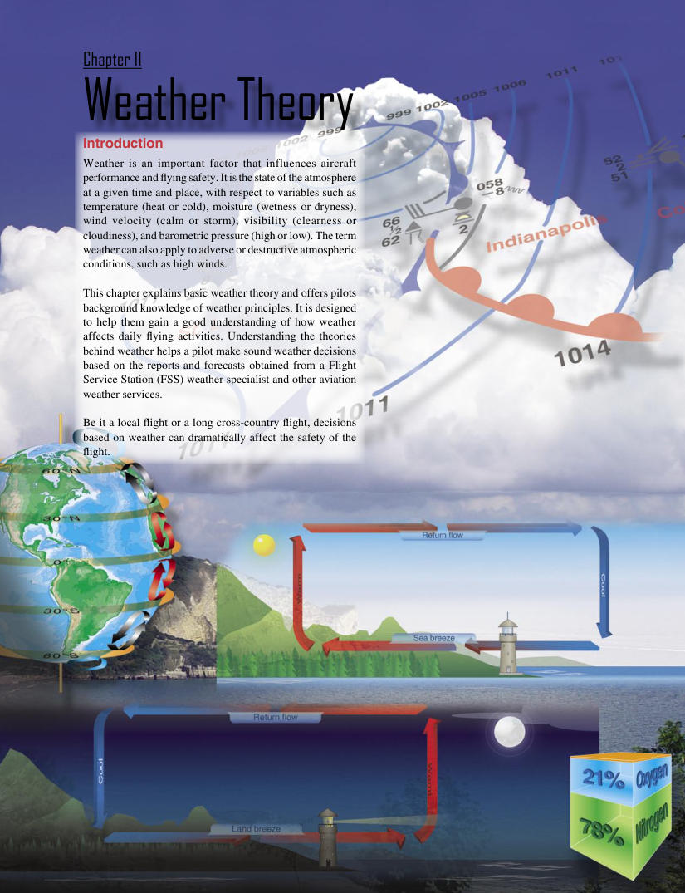

11-1
Weather Theory
Chapter 11
Introduction
Weather is an important factor that influences aircraft 
performance and flying safety. It is the state of the atmosphere 
at a given time and place, with respect to variables such as 
temperature (heat or cold), moisture (wetness or dryness), 
wind velocity (calm or storm), visibility (clearness or 
cloudiness), and barometric pressure (high or low). The term 
weather can also apply to adverse or destructive atmospheric 
conditions, such as high winds.
This chapter explains basic weather theory and offers pilots 
background knowledge of weather principles. It is designed 
to help them gain a good understanding of how weather 
affects daily flying activities. Understanding the theories 
behind weather helps a pilot make sound weather decisions 
based on the reports and forecasts obtained from a Flight 
Service Station (FSS) weather specialist and other aviation 
weather services.
Be it a local flight or a long cross-country flight, decisions 
based on weather can dramatically affect the safety of the 
flight.

## Page 2

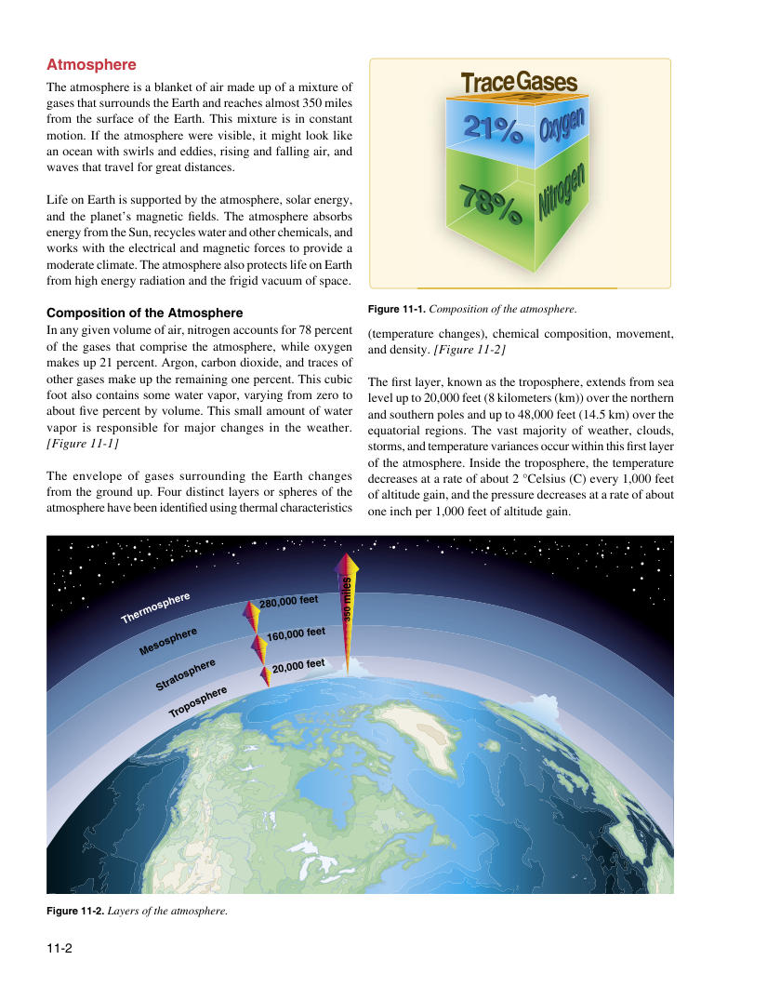

11-2
21%
21%
78%
78%
Nitrogen
Nitrogen
Oxygen
Oxygen
1%
Figure 11-1. Composition of the atmosphere.
Tro
pos
phe
re
 Str
ato
sph
ere
 Me
sos
phe
re
 Th
erm
osp
her
e
 280,00
0 feet
 160,00
0 feet
 20,000 
feet
Figure 11-2. Layers of the atmosphere.
Atmosphere
The atmosphere is a blanket of air made up of a mixture of 
gases that surrounds the Earth and reaches almost 350 miles 
from the surface of the Earth. This mixture is in constant 
motion. If the atmosphere were visible, it might look like 
an ocean with swirls and eddies, rising and falling air, and 
waves that travel for great distances.
Life on Earth is supported by the atmosphere, solar energy, 
and the planet’s magnetic fields. The atmosphere absorbs 
energy from the Sun, recycles water and other chemicals, and 
works with the electrical and magnetic forces to provide a 
moderate climate. The atmosphere also protects life on Earth 
from high energy radiation and the frigid vacuum of space.
Composition of the Atmosphere
In any given volume of air, nitrogen accounts for 78 percent 
of the gases that comprise the atmosphere, while oxygen 
makes up 21 percent. Argon, carbon dioxide, and traces of 
other gases make up the remaining one percent. This cubic 
foot also contains some water vapor, varying from zero to 
about five percent by volume. This small amount of water 
vapor is responsible for major changes in the weather. 
[Figure 11-1]
The envelope of gases surrounding the Earth changes 
from the ground up. Four distinct layers or spheres of the 
atmosphere have been identified using thermal characteristics 
(temperature changes), chemical composition, movement, 
and density. [Figure 11-2]
The first layer, known as the troposphere, extends from sea 
level up to 20,000 feet (8 kilometers (km)) over the northern 
and southern poles and up to 48,000 feet (14.5 km) over the 
equatorial regions. The vast majority of weather, clouds, 
storms, and temperature variances occur within this first layer 
of the atmosphere. Inside the troposphere, the temperature 
decreases at a rate of about 2 °Celsius (C) every 1,000 feet 
of altitude gain, and the pressure decreases at a rate of about 
one inch per 1,000 feet of altitude gain.

## Page 3

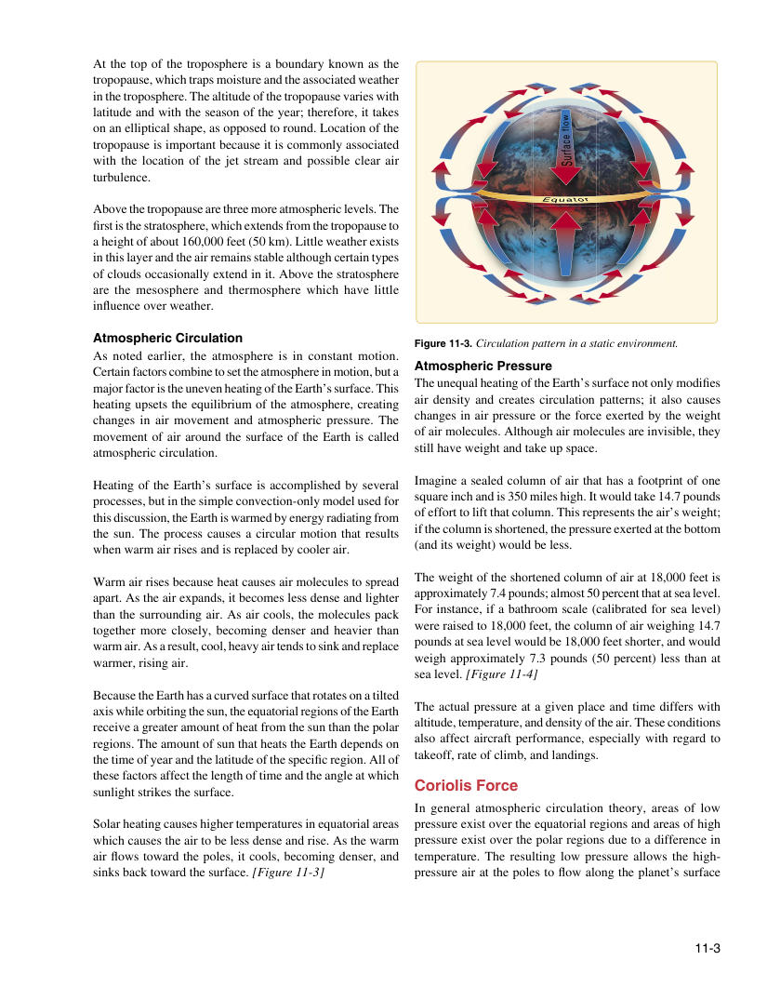

11-3
Figure 11-3. Circulation pattern in a static environment.
At the top of the troposphere is a boundary known as the 
tropopause, which traps moisture and the associated weather 
in the troposphere. The altitude of the tropopause varies with 
latitude and with the season of the year; therefore, it takes 
on an elliptical shape, as opposed to round. Location of the 
tropopause is important because it is commonly associated 
with the location of the jet stream and possible clear air 
turbulence. 
Above the tropopause are three more atmospheric levels. The 
first is the stratosphere, which extends from the tropopause to 
a height of about 160,000 feet (50 km). Little weather exists 
in this layer and the air remains stable although certain types 
of clouds occasionally extend in it. Above the stratosphere 
are the mesosphere and thermosphere which have little 
influence over weather.
Atmospheric Circulation
As noted earlier, the atmosphere is in constant motion. 
Certain factors combine to set the atmosphere in motion, but a 
major factor is the uneven heating of the Earth’s surface. This 
heating upsets the equilibrium of the atmosphere, creating 
changes in air movement and atmospheric pressure. The 
movement of air around the surface of the Earth is called 
atmospheric circulation. 
Heating of the Earth’s surface is accomplished by several 
processes, but in the simple convection-only model used for 
this discussion, the Earth is warmed by energy radiating from 
the sun. The process causes a circular motion that results 
when warm air rises and is replaced by cooler air.
Warm air rises because heat causes air molecules to spread 
apart. As the air expands, it becomes less dense and lighter 
than the surrounding air. As air cools, the molecules pack 
together more closely, becoming denser and heavier than 
warm air. As a result, cool, heavy air tends to sink and replace 
warmer, rising air. 
Because the Earth has a curved surface that rotates on a tilted 
axis while orbiting the sun, the equatorial regions of the Earth 
receive a greater amount of heat from the sun than the polar 
regions. The amount of sun that heats the Earth depends on 
the time of year and the latitude of the specific region. All of 
these factors affect the length of time and the angle at which 
sunlight strikes the surface.
Solar heating causes higher temperatures in equatorial areas 
which causes the air to be less dense and rise. As the warm 
air flows toward the poles, it cools, becoming denser, and 
sinks back toward the surface. [Figure 11-3] 
Atmospheric Pressure
The unequal heating of the Earth’s surface not only modifies 
air density and creates circulation patterns; it also causes 
changes in air pressure or the force exerted by the weight 
of air molecules. Although air molecules are invisible, they 
still have weight and take up space. 
Imagine a sealed column of air that has a footprint of one 
square inch and is 350 miles high. It would take 14.7 pounds 
of effort to lift that column. This represents the air’s weight; 
if the column is shortened, the pressure exerted at the bottom 
(and its weight) would be less. 
The weight of the shortened column of air at 18,000 feet is 
approximately 7.4 pounds; almost 50 percent that at sea level. 
For instance, if a bathroom scale (calibrated for sea level) 
were raised to 18,000 feet, the column of air weighing 14.7 
pounds at sea level would be 18,000 feet shorter, and would 
weigh approximately 7.3 pounds (50 percent) less than at 
sea level. [Figure 11-4]
The actual pressure at a given place and time differs with 
altitude, temperature, and density of the air. These conditions 
also affect aircraft performance, especially with regard to 
takeoff, rate of climb, and landings.
Coriolis Force
In general atmospheric circulation theory, areas of low 
pressure exist over the equatorial regions and areas of high 
pressure exist over the polar regions due to a difference in 
temperature. The resulting low pressure allows the high-
pressure air at the poles to flow along the planet’s surface

## Page 4

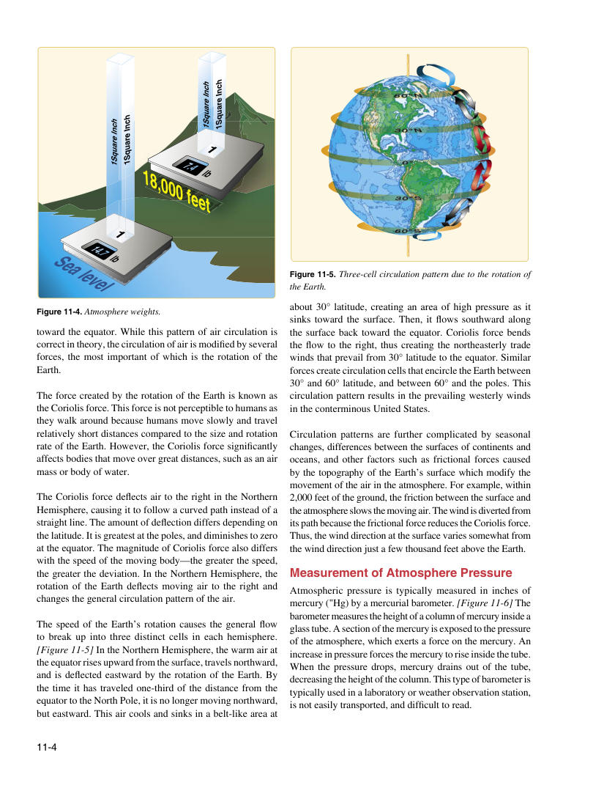

11-4
14.7
lb
1
 1Square Inch
 1Square Inch
7.4
lb
18,000 feet
1
 1Square Inch
 1Square Inch
Sea level
Figure 11-4. Atmosphere weights.
Figure 11-5. Three-cell circulation pattern due to the rotation of 
the Earth.
toward the equator. While this pattern of air circulation is 
correct in theory, the circulation of air is modified by several 
forces, the most important of which is the rotation of the 
Earth.
The force created by the rotation of the Earth is known as 
the Coriolis force. This force is not perceptible to humans as 
they walk around because humans move slowly and travel 
relatively short distances compared to the size and rotation 
rate of the Earth. However, the Coriolis force significantly 
affects bodies that move over great distances, such as an air 
mass or body of water. 
The Coriolis force deflects air to the right in the Northern 
Hemisphere, causing it to follow a curved path instead of a 
straight line. The amount of deflection differs depending on 
the latitude. It is greatest at the poles, and diminishes to zero 
at the equator. The magnitude of Coriolis force also differs 
with the speed of the moving body—the greater the speed, 
the greater the deviation. In the Northern Hemisphere, the 
rotation of the Earth deflects moving air to the right and 
changes the general circulation pattern of the air.
The speed of the Earth’s rotation causes the general flow 
to break up into three distinct cells in each hemisphere. 
[Figure 11-5] In the Northern Hemisphere, the warm air at 
the equator rises upward from the surface, travels northward, 
and is deflected eastward by the rotation of the Earth. By 
the time it has traveled one-third of the distance from the 
equator to the North Pole, it is no longer moving northward, 
but eastward. This air cools and sinks in a belt-like area at 
about 30° latitude, creating an area of high pressure as it 
sinks toward the surface. Then, it flows southward along 
the surface back toward the equator. Coriolis force bends 
the flow to the right, thus creating the northeasterly trade 
winds that prevail from 30° latitude to the equator. Similar 
forces create circulation cells that encircle the Earth between 
30° and 60° latitude, and between 60° and the poles. This 
circulation pattern results in the prevailing westerly winds 
in the conterminous United States. 
Circulation patterns are further complicated by seasonal 
changes, differences between the surfaces of continents and 
oceans, and other factors such as frictional forces caused 
by the topography of the Earth’s surface which modify the 
movement of the air in the atmosphere. For example, within 
2,000 feet of the ground, the friction between the surface and 
the atmosphere slows the moving air. The wind is diverted from 
its path because the frictional force reduces the Coriolis force. 
Thus, the wind direction at the surface varies somewhat from 
the wind direction just a few thousand feet above the Earth.
Measurement of Atmosphere Pressure
Atmospheric pressure is typically measured in inches of 
mercury ("Hg) by a mercurial barometer. [Figure 11-6] The 
barometer measures the height of a column of mercury inside a 
glass tube. A section of the mercury is exposed to the pressure 
of the atmosphere, which exerts a force on the mercury. An 
increase in pressure forces the mercury to rise inside the tube. 
When the pressure drops, mercury drains out of the tube, 
decreasing the height of the column. This type of barometer is 
typically used in a laboratory or weather observation station, 
is not easily transported, and difficult to read.

## Page 5

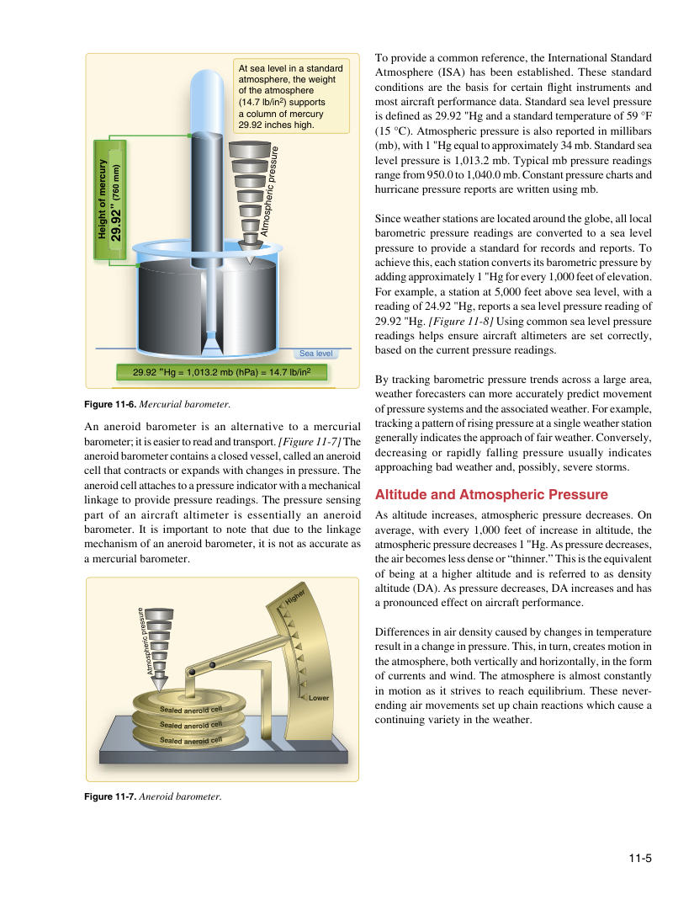

11-5
29.92 "Hg = 1,013.2 mb (hPa) = 14.7 lb/in2
Sea level
29.92"  (760 mm)
Height of mercury
Atmospheric pressure
At sea level in a standard 
atmosphere, the weight 
of the atmosphere 
(14.7 lb/in2) supports
a column of mercury
29.92 inches high.
Figure 11-6. Mercurial barometer.
Lower
Higher 
Atmospheric pressure
Se
ale
d a
ner
oid
 ce
ll
Se
ale
d a
ner
oid
 ce
ll
Se
ale
d a
ner
oid
 ce
ll
Figure 11-7. Aneroid barometer.
An aneroid barometer is an alternative to a mercurial 
barometer; it is easier to read and transport. [Figure 11-7] The 
aneroid barometer contains a closed vessel, called an aneroid 
cell that contracts or expands with changes in pressure. The 
aneroid cell attaches to a pressure indicator with a mechanical 
linkage to provide pressure readings. The pressure sensing 
part of an aircraft altimeter is essentially an aneroid 
barometer. It is important to note that due to the linkage 
mechanism of an aneroid barometer, it is not as accurate as 
a mercurial barometer.
To provide a common reference, the International Standard 
Atmosphere (ISA) has been established. These standard 
conditions are the basis for certain flight instruments and 
most aircraft performance data. Standard sea level pressure 
is defined as 29.92 "Hg and a standard temperature of 59 °F 
(15 °C). Atmospheric pressure is also reported in millibars 
(mb), with 1 "Hg equal to approximately 34 mb. Standard sea 
level pressure is 1,013.2 mb. Typical mb pressure readings 
range from 950.0 to 1,040.0 mb. Constant pressure charts and 
hurricane pressure reports are written using mb.
Since weather stations are located around the globe, all local 
barometric pressure readings are converted to a sea level 
pressure to provide a standard for records and reports. To 
achieve this, each station converts its barometric pressure by 
adding approximately 1 "Hg for every 1,000 feet of elevation. 
For example, a station at 5,000 feet above sea level, with a 
reading of 24.92 "Hg, reports a sea level pressure reading of 
29.92 "Hg. [Figure 11-8] Using common sea level pressure 
readings helps ensure aircraft altimeters are set correctly, 
based on the current pressure readings.
By tracking barometric pressure trends across a large area, 
weather forecasters can more accurately predict movement 
of pressure systems and the associated weather. For example, 
tracking a pattern of rising pressure at a single weather station 
generally indicates the approach of fair weather. Conversely, 
decreasing or rapidly falling pressure usually indicates 
approaching bad weather and, possibly, severe storms.
Altitude and Atmospheric Pressure
As altitude increases, atmospheric pressure decreases. On 
average, with every 1,000 feet of increase in altitude, the 
atmospheric pressure decreases 1 "Hg. As pressure decreases, 
the air becomes less dense or “thinner.” This is the equivalent 
of being at a higher altitude and is referred to as density 
altitude (DA). As pressure decreases, DA increases and has 
a pronounced effect on aircraft performance.
Differences in air density caused by changes in temperature 
result in a change in pressure. This, in turn, creates motion in 
the atmosphere, both vertically and horizontally, in the form 
of currents and wind. The atmosphere is almost constantly 
in motion as it strives to reach equilibrium. These never-
ending air movements set up chain reactions which cause a 
continuing variety in the weather.

## Page 6

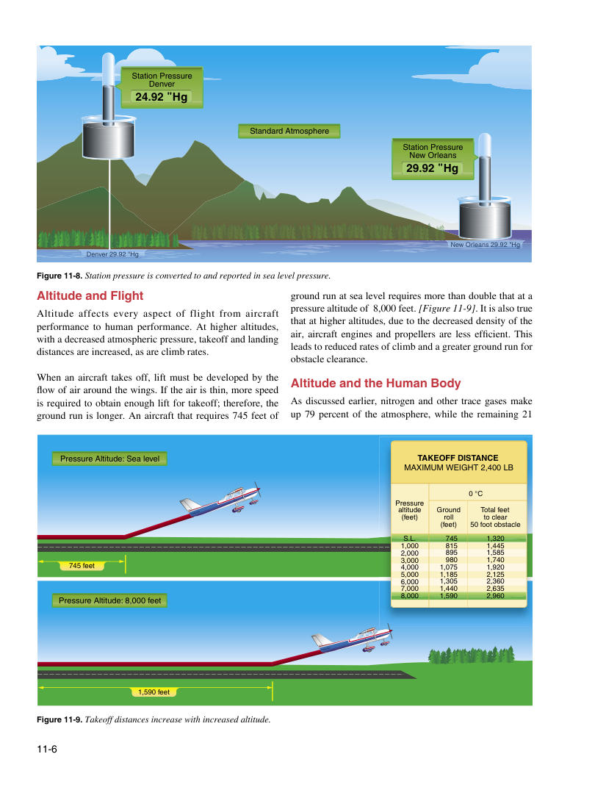

11-6
Standard Atmosphere
Denver 29.92 "Hg
24.92 "Hg
Station Pressure
Denver
29.92 "Hg
Station Pressure
New Orleans
New Orleans 29.92 "Hg
Figure 11-8. Station pressure is converted to and reported in sea level pressure.
1,590 feet
745 feet
Pressure Altitude: Sea level
Pressure Altitude: 8,000 feet
TAKEOFF DISTANCE
MAXIMUM WEIGHT 2,400 LB
Pressure
altitude
(feet)
S.L.
1,000
2,000
3,000
4,000
5,000
6,000
7,000
8,000
Ground
roll
(feet)
   745
   815
   895
   980
1,075
1,185
1,305
1,440
1,590
Total feet
to clear
50 foot obstacle
1,320
1,445
1,585
1,740
1,920
2,125
2,360
2,635
2,960
0 °C
Figure 11-9. Takeoff distances increase with increased altitude.
Altitude and Flight
Altitude affects every aspect of flight from aircraft 
performance to human performance. At higher altitudes, 
with a decreased atmospheric pressure, takeoff and landing 
distances are increased, as are climb rates. 
When an aircraft takes off, lift must be developed by the 
flow of air around the wings. If the air is thin, more speed 
is required to obtain enough lift for takeoff; therefore, the 
ground run is longer. An aircraft that requires 745 feet of 
ground run at sea level requires more than double that at a 
pressure altitude of  8,000 feet. [Figure 11-9]. It is also true 
that at higher altitudes, due to the decreased density of the 
air, aircraft engines and propellers are less efficient. This 
leads to reduced rates of climb and a greater ground run for 
obstacle clearance.
Altitude and the Human Body
As discussed earlier, nitrogen and other trace gases make 
up 79 percent of the atmosphere, while the remaining 21

## Page 7

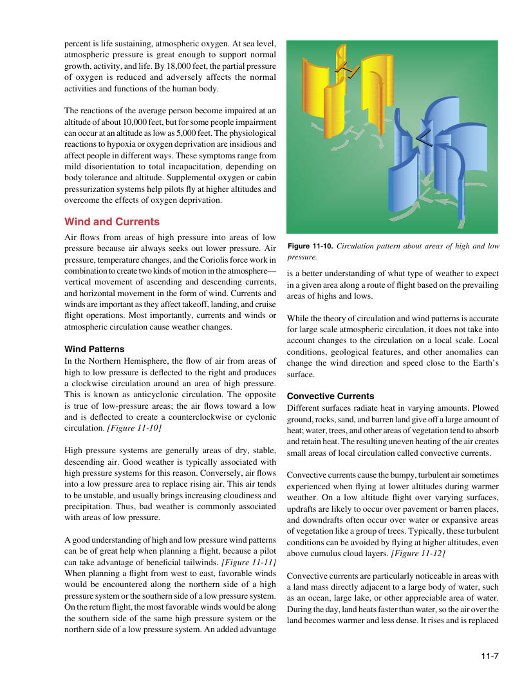

11-7
Figure 11-10. Circulation pattern about areas of high and low 
pressure.
percent is life sustaining, atmospheric oxygen. At sea level, 
atmospheric pressure is great enough to support normal 
growth, activity, and life. By 18,000 feet, the partial pressure 
of oxygen is reduced and adversely affects the normal 
activities and functions of the human body. 
The reactions of the average person become impaired at an 
altitude of about 10,000 feet, but for some people impairment 
can occur at an altitude as low as 5,000 feet. The physiological 
reactions to hypoxia or oxygen deprivation are insidious and 
affect people in different ways. These symptoms range from 
mild disorientation to total incapacitation, depending on 
body tolerance and altitude. Supplemental oxygen or cabin 
pressurization systems help pilots fly at higher altitudes and 
overcome the effects of oxygen deprivation.
Wind and Currents
Air flows from areas of high pressure into areas of low 
pressure because air always seeks out lower pressure. Air 
pressure, temperature changes, and the Coriolis force work in 
combination to create two kinds of motion in the atmosphere—
vertical movement of ascending and descending currents, 
and horizontal movement in the form of wind. Currents and 
winds are important as they affect takeoff, landing, and cruise 
flight operations. Most importantly, currents and winds or 
atmospheric circulation cause weather changes.
Wind Patterns
In the Northern Hemisphere, the flow of air from areas of 
high to low pressure is deflected to the right and produces 
a clockwise circulation around an area of high pressure. 
This is known as anticyclonic circulation. The opposite 
is true of low-pressure areas; the air flows toward a low 
and is deflected to create a counterclockwise or cyclonic 
circulation. [Figure 11-10]
High pressure systems are generally areas of dry, stable, 
descending air. Good weather is typically associated with 
high pressure systems for this reason. Conversely, air flows 
into a low pressure area to replace rising air. This air tends 
to be unstable, and usually brings increasing cloudiness and 
precipitation. Thus, bad weather is commonly associated 
with areas of low pressure.
A good understanding of high and low pressure wind patterns 
can be of great help when planning a flight, because a pilot 
can take advantage of beneficial tailwinds. [Figure 11-11] 
When planning a flight from west to east, favorable winds 
would be encountered along the northern side of a high 
pressure system or the southern side of a low pressure system. 
On the return flight, the most favorable winds would be along 
the southern side of the same high pressure system or the 
northern side of a low pressure system. An added advantage 
is a better understanding of what type of weather to expect 
in a given area along a route of flight based on the prevailing 
areas of highs and lows.
While the theory of circulation and wind patterns is accurate 
for large scale atmospheric circulation, it does not take into 
account changes to the circulation on a local scale. Local 
conditions, geological features, and other anomalies can 
change the wind direction and speed close to the Earth’s 
surface.
Convective Currents
Different surfaces radiate heat in varying amounts. Plowed 
ground, rocks, sand, and barren land give off a large amount of 
heat; water, trees, and other areas of vegetation tend to absorb 
and retain heat. The resulting uneven heating of the air creates 
small areas of local circulation called convective currents.
Convective currents cause the bumpy, turbulent air sometimes 
experienced when flying at lower altitudes during warmer 
weather. On a low altitude flight over varying surfaces, 
updrafts are likely to occur over pavement or barren places, 
and downdrafts often occur over water or expansive areas 
of vegetation like a group of trees. Typically, these turbulent 
conditions can be avoided by flying at higher altitudes, even 
above cumulus cloud layers. [Figure 11-12]
Convective currents are particularly noticeable in areas with 
a land mass directly adjacent to a large body of water, such 
as an ocean, large lake, or other appreciable area of water. 
During the day, land heats faster than water, so the air over the 
land becomes warmer and less dense. It rises and is replaced

## Page 8

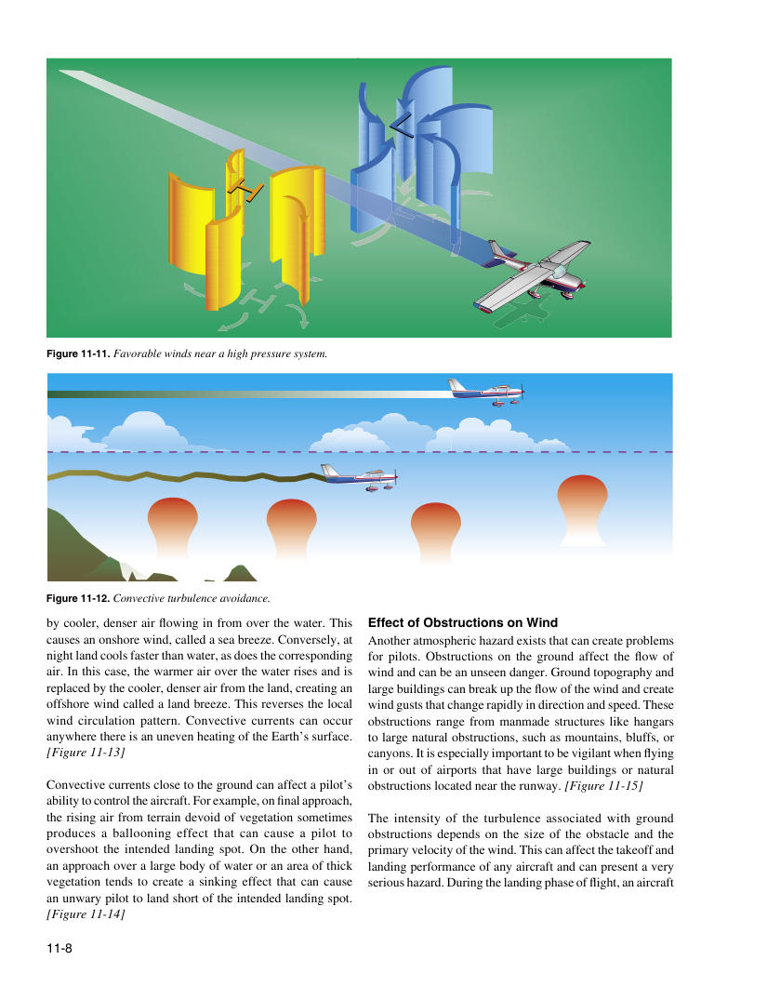

11-8
Figure 11-11. Favorable winds near a high pressure system.
Figure 11-12. Convective turbulence avoidance.
by cooler, denser air flowing in from over the water. This 
causes an onshore wind, called a sea breeze. Conversely, at 
night land cools faster than water, as does the corresponding 
air. In this case, the warmer air over the water rises and is 
replaced by the cooler, denser air from the land, creating an 
offshore wind called a land breeze. This reverses the local 
wind circulation pattern. Convective currents can occur 
anywhere there is an uneven heating of the Earth’s surface. 
[Figure 11-13]
Convective currents close to the ground can affect a pilot’s 
ability to control the aircraft. For example, on final approach, 
the rising air from terrain devoid of vegetation sometimes 
produces a ballooning effect that can cause a pilot to 
overshoot the intended landing spot. On the other hand, 
an approach over a large body of water or an area of thick 
vegetation tends to create a sinking effect that can cause 
an unwary pilot to land short of the intended landing spot. 
[Figure 11-14]
Effect of Obstructions on Wind
Another atmospheric hazard exists that can create problems 
for pilots. Obstructions on the ground affect the flow of 
wind and can be an unseen danger. Ground topography and 
large buildings can break up the flow of the wind and create 
wind gusts that change rapidly in direction and speed. These 
obstructions range from manmade structures like hangars 
to large natural obstructions, such as mountains, bluffs, or 
canyons. It is especially important to be vigilant when flying 
in or out of airports that have large buildings or natural 
obstructions located near the runway. [Figure 11-15] 
The intensity of the turbulence associated with ground 
obstructions depends on the size of the obstacle and the 
primary velocity of the wind. This can affect the takeoff and 
landing performance of any aircraft and can present a very 
serious hazard. During the landing phase of flight, an aircraft

## Page 9

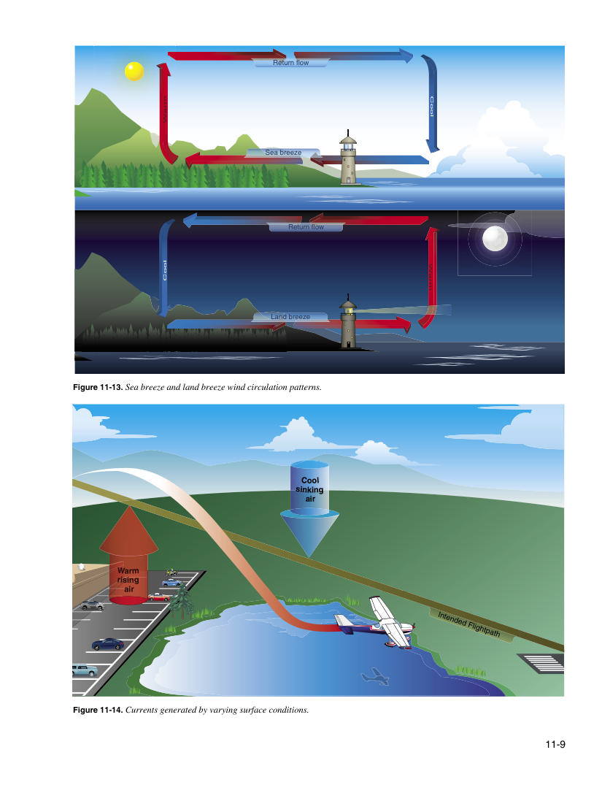

11-9
Warm
Cool
Return flow
Land breeze
Warm
Cool
Return flow
Sea breeze
Figure 11-13. Sea breeze and land breeze wind circulation patterns.
W
ar
m
  
 a
ir
ri
si
ng
C
o
ol
  
 a
ir
si
nk
in
g
Intended Flightpath
Figure 11-14. Currents generated by varying surface conditions.

## Page 10

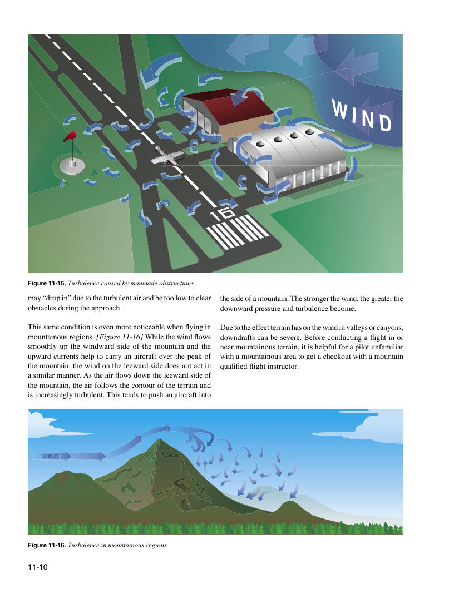

11-10
 
 
 
 
 
 
 
 
 
 
 
 
I N
 D
W
Figure 11-15. Turbulence caused by manmade obstructions.
Figure 11-16. Turbulence in mountainous regions.
the side of a mountain. The stronger the wind, the greater the 
downward pressure and turbulence become.
Due to the effect terrain has on the wind in valleys or canyons, 
downdrafts can be severe. Before conducting a flight in or 
near mountainous terrain, it is helpful for a pilot unfamiliar 
with a mountainous area to get a checkout with a mountain 
qualified flight instructor.
may “drop in” due to the turbulent air and be too low to clear 
obstacles during the approach.
This same condition is even more noticeable when flying in 
mountainous regions. [Figure 11-16] While the wind flows 
smoothly up the windward side of the mountain and the 
upward currents help to carry an aircraft over the peak of 
the mountain, the wind on the leeward side does not act in 
a similar manner. As the air flows down the leeward side of 
the mountain, the air follows the contour of the terrain and 
is increasingly turbulent. This tends to push an aircraft into

## Page 11

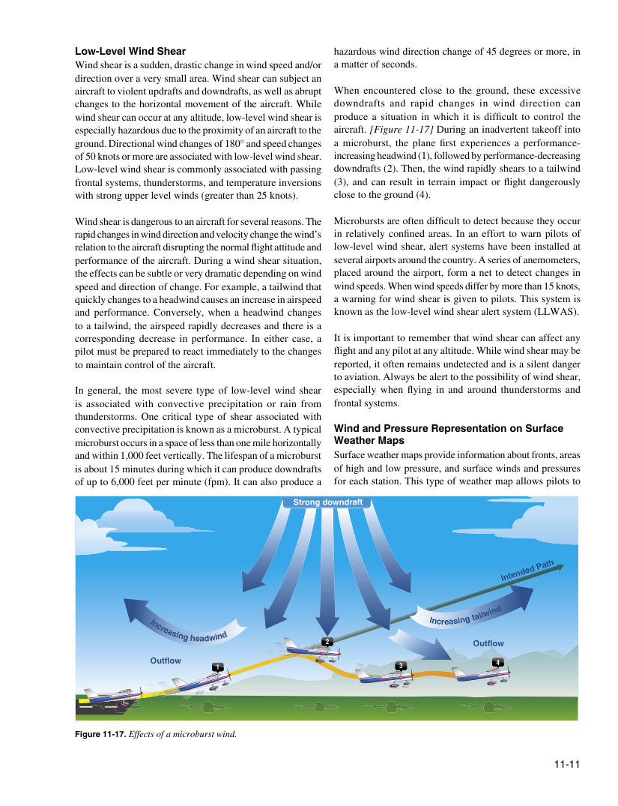

11-11
Intended Path
1
2
3
4
I
n
c
r
e
a
si
ng
 ta
ilw
ind
   
   
In
cr
e
a
si
n
g
 
h
e
a
d
w
i
n
d
Strong downdraft
Outflow
Outflow
Figure 11-17. Effects of a microburst wind.
Low-Level Wind Shear
Wind shear is a sudden, drastic change in wind speed and/or 
direction over a very small area. Wind shear can subject an 
aircraft to violent updrafts and downdrafts, as well as abrupt 
changes to the horizontal movement of the aircraft. While 
wind shear can occur at any altitude, low-level wind shear is 
especially hazardous due to the proximity of an aircraft to the 
ground. Directional wind changes of 180° and speed changes 
of 50 knots or more are associated with low-level wind shear. 
Low-level wind shear is commonly associated with passing 
frontal systems, thunderstorms, and temperature inversions 
with strong upper level winds (greater than 25 knots).
Wind shear is dangerous to an aircraft for several reasons. The 
rapid changes in wind direction and velocity change the wind’s 
relation to the aircraft disrupting the normal flight attitude and 
performance of the aircraft. During a wind shear situation, 
the effects can be subtle or very dramatic depending on wind 
speed and direction of change. For example, a tailwind that 
quickly changes to a headwind causes an increase in airspeed 
and performance. Conversely, when a headwind changes 
to a tailwind, the airspeed rapidly decreases and there is a 
corresponding decrease in performance. In either case, a 
pilot must be prepared to react immediately to the changes 
to maintain control of the aircraft. 
 
In general, the most severe type of low-level wind shear 
is associated with convective precipitation or rain from 
thunderstorms. One critical type of shear associated with 
convective precipitation is known as a microburst. A typical 
microburst occurs in a space of less than one mile horizontally 
and within 1,000 feet vertically. The lifespan of a microburst 
is about 15 minutes during which it can produce downdrafts 
of up to 6,000 feet per minute (fpm). It can also produce a 
hazardous wind direction change of 45 degrees or more, in 
a matter of seconds. 
When encountered close to the ground, these excessive 
downdrafts and rapid changes in wind direction can 
produce a situation in which it is difficult to control the 
aircraft. [Figure 11-17] During an inadvertent takeoff into 
a microburst, the plane first experiences a performance-
increasing headwind (1), followed by performance-decreasing 
downdrafts (2). Then, the wind rapidly shears to a tailwind 
(3), and can result in terrain impact or flight dangerously 
close to the ground (4).
Microbursts are often difficult to detect because they occur 
in relatively confined areas. In an effort to warn pilots of 
low-level wind shear, alert systems have been installed at 
several airports around the country. A series of anemometers, 
placed around the airport, form a net to detect changes in 
wind speeds. When wind speeds differ by more than 15 knots, 
a warning for wind shear is given to pilots. This system is 
known as the low-level wind shear alert system (LLWAS).
It is important to remember that wind shear can affect any 
flight and any pilot at any altitude. While wind shear may be 
reported, it often remains undetected and is a silent danger 
to aviation. Always be alert to the possibility of wind shear, 
especially when flying in and around thunderstorms and 
frontal systems.
Wind and Pressure Representation on Surface 
Weather Maps
Surface weather maps provide information about fronts, areas 
of high and low pressure, and surface winds and pressures 
for each station. This type of weather map allows pilots to

## Page 12

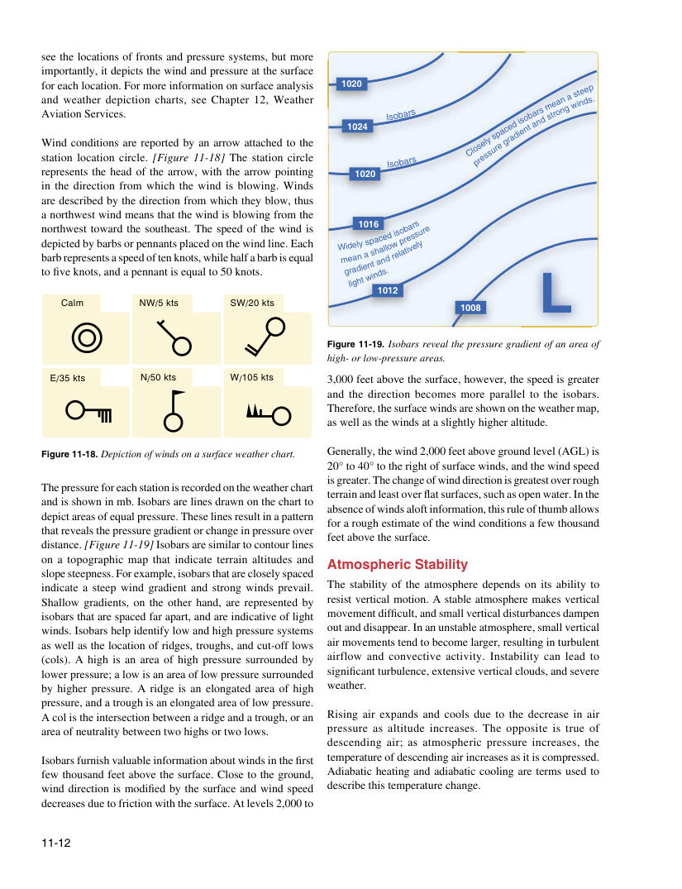

11-12
NW/5 kts
SW/20 kts
E/35 kts
N/50 kts
W/105 kts
Calm
Figure 11-18. Depiction of winds on a surface weather chart.
1020
1024
1020
1016
1012
1008
Iso
ba
rs
Iso
ba
rs
Close
ly spa
ced iso
bars me
an a stee
p
pressur
e grad
ient a
nd st
rong
 wi
nds
.
Wid
ely 
spa
ced
 is
ob
ar
s
 m
ea
n a
 sh
allo
w pre
ssur
e
 gra
dien
t an
d re
lativ
ely
 li
gh
t wi
nds.
L
Figure 11-19. Isobars reveal the pressure gradient of an area of 
high- or low-pressure areas.
see the locations of fronts and pressure systems, but more 
importantly, it depicts the wind and pressure at the surface 
for each location. For more information on surface analysis 
and weather depiction charts, see Chapter 12, Weather 
Aviation Services.
Wind conditions are reported by an arrow attached to the 
station location circle. [Figure 11-18] The station circle 
represents the head of the arrow, with the arrow pointing 
in the direction from which the wind is blowing. Winds 
are described by the direction from which they blow, thus 
a northwest wind means that the wind is blowing from the 
northwest toward the southeast. The speed of the wind is 
depicted by barbs or pennants placed on the wind line. Each 
barb represents a speed of ten knots, while half a barb is equal 
to five knots, and a pennant is equal to 50 knots.
The pressure for each station is recorded on the weather chart 
and is shown in mb. Isobars are lines drawn on the chart to 
depict areas of equal pressure. These lines result in a pattern 
that reveals the pressure gradient or change in pressure over 
distance. [Figure 11-19] Isobars are similar to contour lines 
on a topographic map that indicate terrain altitudes and 
slope steepness. For example, isobars that are closely spaced 
indicate a steep wind gradient and strong winds prevail. 
Shallow gradients, on the other hand, are represented by 
isobars that are spaced far apart, and are indicative of light 
winds. Isobars help identify low and high pressure systems 
as well as the location of ridges, troughs, and cut-off lows 
(cols). A high is an area of high pressure surrounded by 
lower pressure; a low is an area of low pressure surrounded 
by higher pressure. A ridge is an elongated area of high 
pressure, and a trough is an elongated area of low pressure. 
A col is the intersection between a ridge and a trough, or an 
area of neutrality between two highs or two lows.
Isobars furnish valuable information about winds in the first 
few thousand feet above the surface. Close to the ground, 
wind direction is modified by the surface and wind speed 
decreases due to friction with the surface. At levels 2,000 to 
3,000 feet above the surface, however, the speed is greater 
and the direction becomes more parallel to the isobars. 
Therefore, the surface winds are shown on the weather map, 
as well as the winds at a slightly higher altitude.
Generally, the wind 2,000 feet above ground level (AGL) is 
20° to 40° to the right of surface winds, and the wind speed 
is greater. The change of wind direction is greatest over rough 
terrain and least over flat surfaces, such as open water. In the 
absence of winds aloft information, this rule of thumb allows 
for a rough estimate of the wind conditions a few thousand 
feet above the surface.
Atmospheric Stability
The stability of the atmosphere depends on its ability to 
resist vertical motion. A stable atmosphere makes vertical 
movement difficult, and small vertical disturbances dampen 
out and disappear. In an unstable atmosphere, small vertical 
air movements tend to become larger, resulting in turbulent 
airflow and convective activity. Instability can lead to 
significant turbulence, extensive vertical clouds, and severe 
weather.
Rising air expands and cools due to the decrease in air 
pressure as altitude increases. The opposite is true of 
descending air; as atmospheric pressure increases, the 
temperature of descending air increases as it is compressed. 
Adiabatic heating and adiabatic cooling are terms used to 
describe this temperature change.

## Page 13

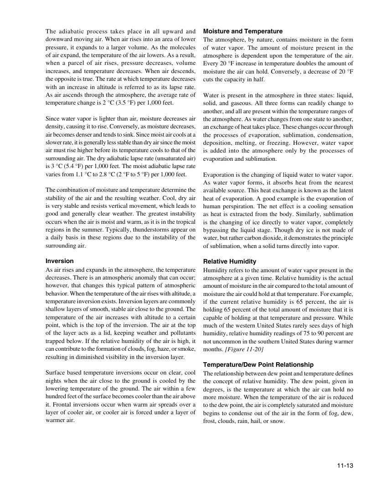

11-13
The adiabatic process takes place in all upward and 
downward moving air. When air rises into an area of lower 
pressure, it expands to a larger volume. As the molecules 
of air expand, the temperature of the air lowers. As a result, 
when a parcel of air rises, pressure decreases, volume 
increases, and temperature decreases. When air descends, 
the opposite is true. The rate at which temperature decreases 
with an increase in altitude is referred to as its lapse rate. 
As air ascends through the atmosphere, the average rate of 
temperature change is 2 °C (3.5 °F) per 1,000 feet.
Since water vapor is lighter than air, moisture decreases air 
density, causing it to rise. Conversely, as moisture decreases, 
air becomes denser and tends to sink. Since moist air cools at a 
slower rate, it is generally less stable than dry air since the moist 
air must rise higher before its temperature cools to that of the 
surrounding air. The dry adiabatic lapse rate (unsaturated air) 
is 3 °C (5.4 °F) per 1,000 feet. The moist adiabatic lapse rate 
varies from 1.1 °C to 2.8 °C (2 °F to 5 °F) per 1,000 feet.
The combination of moisture and temperature determine the 
stability of the air and the resulting weather. Cool, dry air 
is very stable and resists vertical movement, which leads to 
good and generally clear weather. The greatest instability 
occurs when the air is moist and warm, as it is in the tropical 
regions in the summer. Typically, thunderstorms appear on 
a daily basis in these regions due to the instability of the 
surrounding air.
Inversion
As air rises and expands in the atmosphere, the temperature 
decreases. There is an atmospheric anomaly that can occur; 
however, that changes this typical pattern of atmospheric 
behavior. When the temperature of the air rises with altitude, a 
temperature inversion exists. Inversion layers are commonly 
shallow layers of smooth, stable air close to the ground. The 
temperature of the air increases with altitude to a certain 
point, which is the top of the inversion. The air at the top 
of the layer acts as a lid, keeping weather and pollutants 
trapped below. If the relative humidity of the air is high, it 
can contribute to the formation of clouds, fog, haze, or smoke, 
resulting in diminished visibility in the inversion layer.
Surface based temperature inversions occur on clear, cool 
nights when the air close to the ground is cooled by the 
lowering temperature of the ground. The air within a few 
hundred feet of the surface becomes cooler than the air above 
it. Frontal inversions occur when warm air spreads over a 
layer of cooler air, or cooler air is forced under a layer of 
warmer air.
Moisture and Temperature
The atmosphere, by nature, contains moisture in the form 
of water vapor. The amount of moisture present in the 
atmosphere is dependent upon the temperature of the air. 
Every 20 °F increase in temperature doubles the amount of 
moisture the air can hold. Conversely, a decrease of 20 °F 
cuts the capacity in half.
Water is present in the atmosphere in three states: liquid, 
solid, and gaseous. All three forms can readily change to 
another, and all are present within the temperature ranges of 
the atmosphere. As water changes from one state to another, 
an exchange of heat takes place. These changes occur through 
the processes of evaporation, sublimation, condensation, 
deposition, melting, or freezing. However, water vapor 
is added into the atmosphere only by the processes of 
evaporation and sublimation.
Evaporation is the changing of liquid water to water vapor. 
As water vapor forms, it absorbs heat from the nearest 
available source. This heat exchange is known as the latent 
heat of evaporation. A good example is the evaporation of 
human perspiration. The net effect is a cooling sensation 
as heat is extracted from the body. Similarly, sublimation 
is the changing of ice directly to water vapor, completely 
bypassing the liquid stage. Though dry ice is not made of 
water, but rather carbon dioxide, it demonstrates the principle 
of sublimation, when a solid turns directly into vapor.
Relative Humidity
Humidity refers to the amount of water vapor present in the 
atmosphere at a given time. Relative humidity is the actual 
amount of moisture in the air compared to the total amount of 
moisture the air could hold at that temperature. For example, 
if the current relative humidity is 65 percent, the air is 
holding 65 percent of the total amount of moisture that it is 
capable of holding at that temperature and pressure. While 
much of the western United States rarely sees days of high 
humidity, relative humidity readings of 75 to 90 percent are 
not uncommon in the southern United States during warmer 
months. [Figure 11-20]
Temperature/Dew Point Relationship
The relationship between dew point and temperature defines 
the concept of relative humidity. The dew point, given in 
degrees, is the temperature at which the air can hold no 
more moisture. When the temperature of the air is reduced 
to the dew point, the air is completely saturated and moisture 
begins to condense out of the air in the form of fog, dew, 
frost, clouds, rain, hail, or snow.

## Page 14

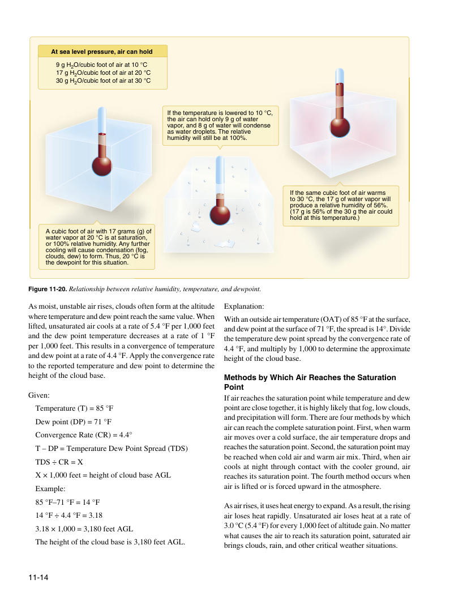

11-14
A cubic foot of air with 17 grams (g) of 
water vapor at 20 °C is at saturation, 
or 100% relative humidity. Any further 
cooling will cause condensation (fog, 
clouds, dew) to form. Thus, 20 °C is 
the dewpoint for this situation.
If the same cubic foot of air warms
to 30 °C, the 17 g of water vapor will 
produce a relative humidity of 56%.
(17 g is 56% of the 30 g the air could 
hold at this temperature.)
If the temperature is lowered to 10 °C, 
the air can hold only 9 g of water 
vapor, and 8 g of water will condense 
as water droplets. The relative 
humidity will still be at 100%.
At sea level pressure, air can hold
9 g H2O/cubic foot of air at 10 °C
17 g H2O/cubic foot of air at 20 °C
30 g H2O/cubic foot of air at 30 °C
Figure 11-20. Relationship between relative humidity, temperature, and dewpoint.
As moist, unstable air rises, clouds often form at the altitude 
where temperature and dew point reach the same value. When 
lifted, unsaturated air cools at a rate of 5.4 °F per 1,000 feet 
and the dew point temperature decreases at a rate of 1 °F 
per 1,000 feet. This results in a convergence of temperature 
and dew point at a rate of 4.4 °F. Apply the convergence rate 
to the reported temperature and dew point to determine the 
height of the cloud base.
Given:
Temperature (T) = 85 °F
Dew point (DP) = 71 °F
Convergence Rate (CR) = 4.4°
T – DP = Temperature Dew Point Spread (TDS) 
TDS ÷ CR = X
X × 1,000 feet = height of cloud base AGL
Example:
85 °F–71 °F = 14 °F
14 °F ÷ 4.4 °F = 3.18
3.18 × 1,000 = 3,180 feet AGL
The height of the cloud base is 3,180 feet AGL.
Explanation:
With an outside air temperature (OAT) of 85 °F at the surface, 
and dew point at the surface of 71 °F, the spread is 14°. Divide 
the temperature dew point spread by the convergence rate of 
4.4 °F, and multiply by 1,000 to determine the approximate 
height of the cloud base.
Methods by Which Air Reaches the Saturation 
Point
If air reaches the saturation point while temperature and dew 
point are close together, it is highly likely that fog, low clouds, 
and precipitation will form. There are four methods by which 
air can reach the complete saturation point. First, when warm 
air moves over a cold surface, the air temperature drops and 
reaches the saturation point. Second, the saturation point may 
be reached when cold air and warm air mix. Third, when air 
cools at night through contact with the cooler ground, air 
reaches its saturation point. The fourth method occurs when 
air is lifted or is forced upward in the atmosphere.
As air rises, it uses heat energy to expand. As a result, the rising 
air loses heat rapidly. Unsaturated air loses heat at a rate of 
3.0 °C (5.4 °F) for every 1,000 feet of altitude gain. No matter 
what causes the air to reach its saturation point, saturated air 
brings clouds, rain, and other critical weather situations.

## Page 15

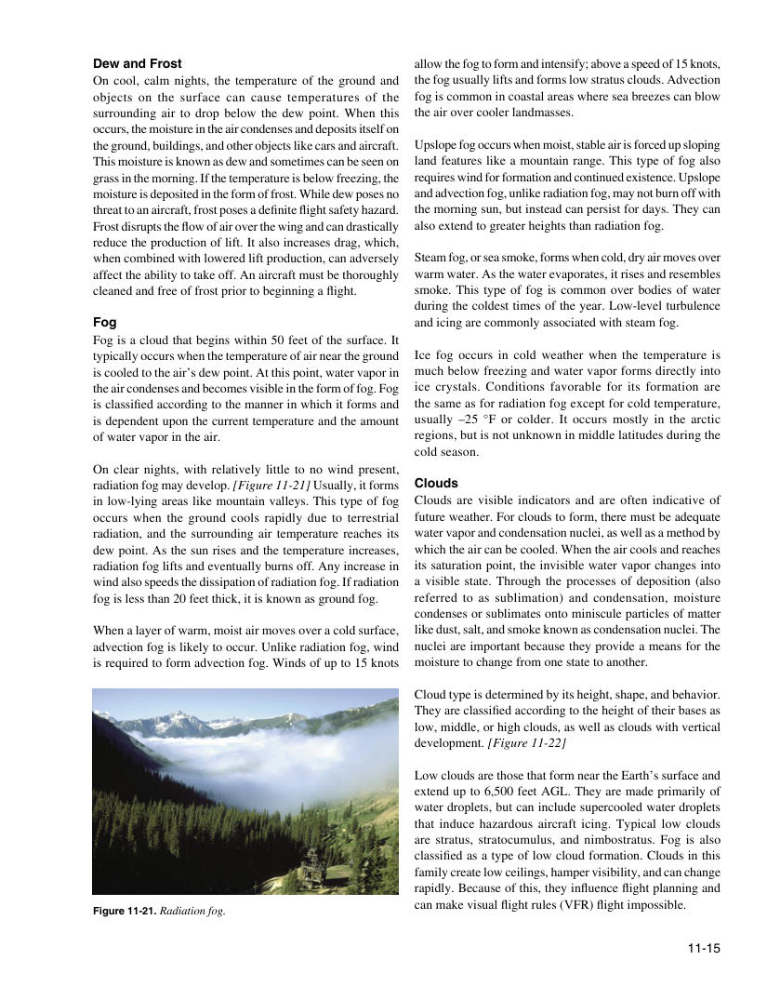

11-15
Figure 11-21. Radiation fog.
Dew and Frost
On cool, calm nights, the temperature of the ground and 
objects on the surface can cause temperatures of the 
surrounding air to drop below the dew point. When this 
occurs, the moisture in the air condenses and deposits itself on 
the ground, buildings, and other objects like cars and aircraft. 
This moisture is known as dew and sometimes can be seen on 
grass in the morning. If the temperature is below freezing, the 
moisture is deposited in the form of frost. While dew poses no 
threat to an aircraft, frost poses a definite flight safety hazard. 
Frost disrupts the flow of air over the wing and can drastically 
reduce the production of lift. It also increases drag, which, 
when combined with lowered lift production, can adversely 
affect the ability to take off. An aircraft must be thoroughly 
cleaned and free of frost prior to beginning a flight.
Fog
Fog is a cloud that begins within 50 feet of the surface. It 
typically occurs when the temperature of air near the ground 
is cooled to the air’s dew point. At this point, water vapor in 
the air condenses and becomes visible in the form of fog. Fog 
is classified according to the manner in which it forms and 
is dependent upon the current temperature and the amount 
of water vapor in the air. 
On clear nights, with relatively little to no wind present, 
radiation fog may develop. [Figure 11-21] Usually, it forms 
in low-lying areas like mountain valleys. This type of fog 
occurs when the ground cools rapidly due to terrestrial 
radiation, and the surrounding air temperature reaches its 
dew point. As the sun rises and the temperature increases, 
radiation fog lifts and eventually burns off. Any increase in 
wind also speeds the dissipation of radiation fog. If radiation 
fog is less than 20 feet thick, it is known as ground fog.
When a layer of warm, moist air moves over a cold surface, 
advection fog is likely to occur. Unlike radiation fog, wind 
is required to form advection fog. Winds of up to 15 knots 
allow the fog to form and intensify; above a speed of 15 knots, 
the fog usually lifts and forms low stratus clouds. Advection 
fog is common in coastal areas where sea breezes can blow 
the air over cooler landmasses.
Upslope fog occurs when moist, stable air is forced up sloping 
land features like a mountain range. This type of fog also 
requires wind for formation and continued existence. Upslope 
and advection fog, unlike radiation fog, may not burn off with 
the morning sun, but instead can persist for days. They can 
also extend to greater heights than radiation fog.
Steam fog, or sea smoke, forms when cold, dry air moves over 
warm water. As the water evaporates, it rises and resembles 
smoke. This type of fog is common over bodies of water 
during the coldest times of the year. Low-level turbulence 
and icing are commonly associated with steam fog.
Ice fog occurs in cold weather when the temperature is 
much below freezing and water vapor forms directly into 
ice crystals. Conditions favorable for its formation are 
the same as for radiation fog except for cold temperature, 
usually –25 °F or colder. It occurs mostly in the arctic 
regions, but is not unknown in middle latitudes during the 
cold season.
Clouds
Clouds are visible indicators and are often indicative of 
future weather. For clouds to form, there must be adequate 
water vapor and condensation nuclei, as well as a method by 
which the air can be cooled. When the air cools and reaches 
its saturation point, the invisible water vapor changes into 
a visible state. Through the processes of deposition (also 
referred to as sublimation) and condensation, moisture 
condenses or sublimates onto miniscule particles of matter 
like dust, salt, and smoke known as condensation nuclei. The 
nuclei are important because they provide a means for the 
moisture to change from one state to another.
Cloud type is determined by its height, shape, and behavior. 
They are classified according to the height of their bases as 
low, middle, or high clouds, as well as clouds with vertical 
development. [Figure 11-22] 
Low clouds are those that form near the Earth’s surface and 
extend up to 6,500 feet AGL. They are made primarily of 
water droplets, but can include supercooled water droplets 
that induce hazardous aircraft icing. Typical low clouds 
are stratus, stratocumulus, and nimbostratus. Fog is also 
classified as a type of low cloud formation. Clouds in this 
family create low ceilings, hamper visibility, and can change 
rapidly. Because of this, they influence flight planning and 
can make visual flight rules (VFR) flight impossible.

## Page 16

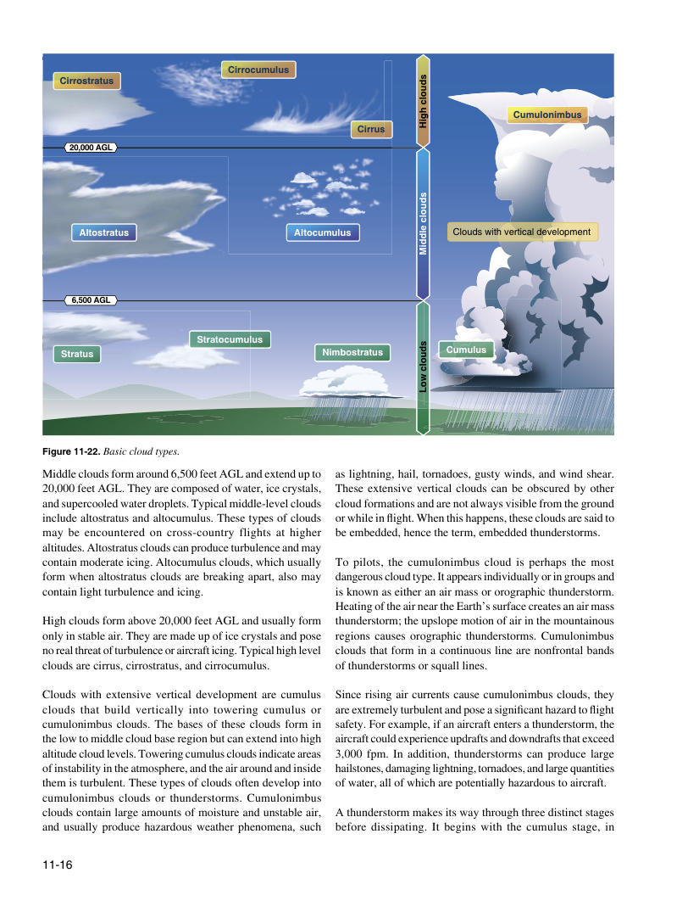

11-16
20,000 AGL
6,500 AGL
Low clouds
Middle clouds
High clouds
Nimbostratus
Altocumulus
Cirrostratus
Cirrocumulus
Cirrus
Altostratus
Stratus
Stratocumulus
Cumulus
Cumulonimbus
Clouds with vertical development
Figure 11-22. Basic cloud types.
Middle clouds form around 6,500 feet AGL and extend up to 
20,000 feet AGL. They are composed of water, ice crystals, 
and supercooled water droplets. Typical middle-level clouds 
include altostratus and altocumulus. These types of clouds 
may be encountered on cross-country flights at higher 
altitudes. Altostratus clouds can produce turbulence and may 
contain moderate icing. Altocumulus clouds, which usually 
form when altostratus clouds are breaking apart, also may 
contain light turbulence and icing.
High clouds form above 20,000 feet AGL and usually form 
only in stable air. They are made up of ice crystals and pose 
no real threat of turbulence or aircraft icing. Typical high level 
clouds are cirrus, cirrostratus, and cirrocumulus.
Clouds with extensive vertical development are cumulus 
clouds that build vertically into towering cumulus or 
cumulonimbus clouds. The bases of these clouds form in 
the low to middle cloud base region but can extend into high 
altitude cloud levels. Towering cumulus clouds indicate areas 
of instability in the atmosphere, and the air around and inside 
them is turbulent. These types of clouds often develop into 
cumulonimbus clouds or thunderstorms. Cumulonimbus 
clouds contain large amounts of moisture and unstable air, 
and usually produce hazardous weather phenomena, such 
as lightning, hail, tornadoes, gusty winds, and wind shear. 
These extensive vertical clouds can be obscured by other 
cloud formations and are not always visible from the ground 
or while in flight. When this happens, these clouds are said to 
be embedded, hence the term, embedded thunderstorms.
To pilots, the cumulonimbus cloud is perhaps the most 
dangerous cloud type. It appears individually or in groups and 
is known as either an air mass or orographic thunderstorm. 
Heating of the air near the Earth’s surface creates an air mass 
thunderstorm; the upslope motion of air in the mountainous 
regions causes orographic thunderstorms. Cumulonimbus 
clouds that form in a continuous line are nonfrontal bands 
of thunderstorms or squall lines.
Since rising air currents cause cumulonimbus clouds, they 
are extremely turbulent and pose a significant hazard to flight 
safety. For example, if an aircraft enters a thunderstorm, the 
aircraft could experience updrafts and downdrafts that exceed 
3,000 fpm. In addition, thunderstorms can produce large 
hailstones, damaging lightning, tornadoes, and large quantities 
of water, all of which are potentially hazardous to aircraft.
A thunderstorm makes its way through three distinct stages 
before dissipating. It begins with the cumulus stage, in

## Page 17

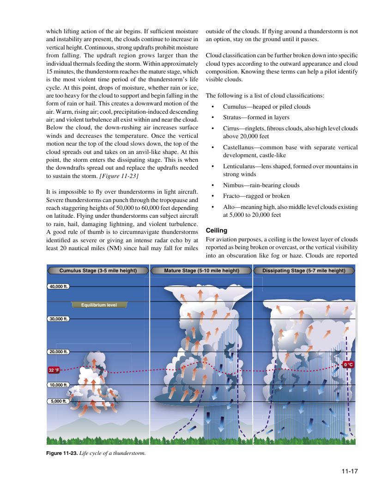

11-17
Cumulus Stage (3-5 mile height)
Mature Stage (5-10 mile height)
Dissipating Stage (5-7 mile height)
32 °F
0 °C
Equilibrium level
40,000 ft.
30,000 ft.
20,000 ft.
10,000 ft.
5,000 ft.
Figure 11-23. Life cycle of a thunderstorm.
which lifting action of the air begins. If sufficient moisture 
and instability are present, the clouds continue to increase in 
vertical height. Continuous, strong updrafts prohibit moisture 
from falling. The updraft region grows larger than the 
individual thermals feeding the storm. Within approximately 
15 minutes, the thunderstorm reaches the mature stage, which 
is the most violent time period of the thunderstorm’s life 
cycle. At this point, drops of moisture, whether rain or ice, 
are too heavy for the cloud to support and begin falling in the 
form of rain or hail. This creates a downward motion of the 
air. Warm, rising air; cool, precipitation-induced descending 
air; and violent turbulence all exist within and near the cloud. 
Below the cloud, the down-rushing air increases surface 
winds and decreases the temperature. Once the vertical 
motion near the top of the cloud slows down, the top of the 
cloud spreads out and takes on an anvil-like shape. At this 
point, the storm enters the dissipating stage. This is when 
the downdrafts spread out and replace the updrafts needed 
to sustain the storm. [Figure 11-23]
It is impossible to fly over thunderstorms in light aircraft. 
Severe thunderstorms can punch through the tropopause and 
reach staggering heights of 50,000 to 60,000 feet depending 
on latitude. Flying under thunderstorms can subject aircraft 
to rain, hail, damaging lightning, and violent turbulence. 
A good rule of thumb is to circumnavigate thunderstorms 
identified as severe or giving an intense radar echo by at 
least 20 nautical miles (NM) since hail may fall for miles 
outside of the clouds. If flying around a thunderstorm is not 
an option, stay on the ground until it passes.
Cloud classification can be further broken down into specific 
cloud types according to the outward appearance and cloud 
composition. Knowing these terms can help a pilot identify 
visible clouds.
The following is a list of cloud classifications:
• 
Cumulus—heaped or piled clouds
• 
Stratus—formed in layers
• 
Cirrus—ringlets, fibrous clouds, also high level clouds 
above 20,000 feet
• 
Castellanus—common base with separate vertical 
development, castle-like
• 
Lenticularus—lens shaped, formed over mountains in 
strong winds
• 
Nimbus—rain-bearing clouds
• 
Fracto—ragged or broken
• 
Alto—meaning high, also middle level clouds existing 
at 5,000 to 20,000 feet
Ceiling
For aviation purposes, a ceiling is the lowest layer of clouds 
reported as being broken or overcast, or the vertical visibility 
into an obscuration like fog or haze. Clouds are reported

## Page 18

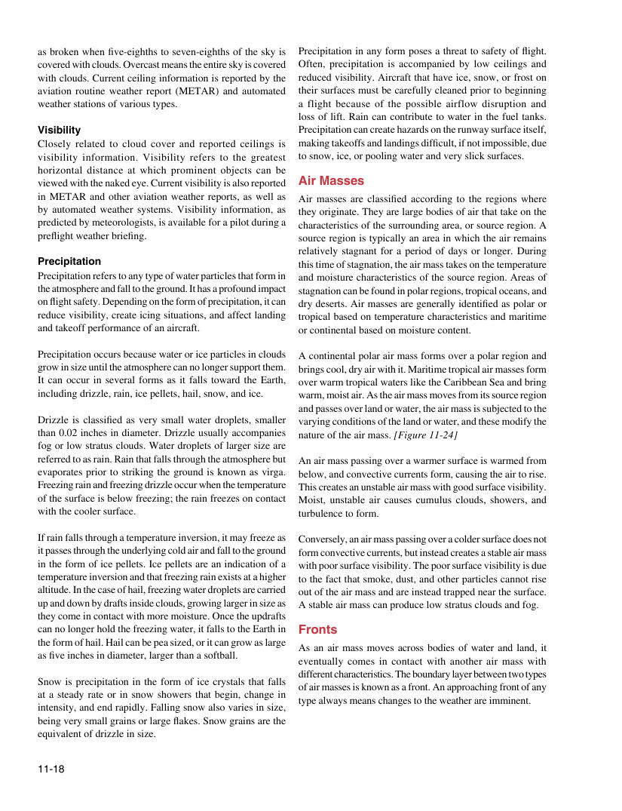

11-18
as broken when five-eighths to seven-eighths of the sky is 
covered with clouds. Overcast means the entire sky is covered 
with clouds. Current ceiling information is reported by the 
aviation routine weather report (METAR) and automated 
weather stations of various types. 
 
Visibility
Closely related to cloud cover and reported ceilings is 
visibility information. Visibility refers to the greatest 
horizontal distance at which prominent objects can be 
viewed with the naked eye. Current visibility is also reported 
in METAR and other aviation weather reports, as well as 
by automated weather systems. Visibility information, as 
predicted by meteorologists, is available for a pilot during a 
preflight weather briefing.
Precipitation
Precipitation refers to any type of water particles that form in 
the atmosphere and fall to the ground. It has a profound impact 
on flight safety. Depending on the form of precipitation, it can 
reduce visibility, create icing situations, and affect landing 
and takeoff performance of an aircraft.
Precipitation occurs because water or ice particles in clouds 
grow in size until the atmosphere can no longer support them. 
It can occur in several forms as it falls toward the Earth, 
including drizzle, rain, ice pellets, hail, snow, and ice.
Drizzle is classified as very small water droplets, smaller 
than 0.02 inches in diameter. Drizzle usually accompanies 
fog or low stratus clouds. Water droplets of larger size are 
referred to as rain. Rain that falls through the atmosphere but 
evaporates prior to striking the ground is known as virga. 
Freezing rain and freezing drizzle occur when the temperature 
of the surface is below freezing; the rain freezes on contact 
with the cooler surface.
If rain falls through a temperature inversion, it may freeze as 
it passes through the underlying cold air and fall to the ground 
in the form of ice pellets. Ice pellets are an indication of a 
temperature inversion and that freezing rain exists at a higher 
altitude. In the case of hail, freezing water droplets are carried 
up and down by drafts inside clouds, growing larger in size as 
they come in contact with more moisture. Once the updrafts 
can no longer hold the freezing water, it falls to the Earth in 
the form of hail. Hail can be pea sized, or it can grow as large 
as five inches in diameter, larger than a softball.
Snow is precipitation in the form of ice crystals that falls 
at a steady rate or in snow showers that begin, change in 
intensity, and end rapidly. Falling snow also varies in size, 
being very small grains or large flakes. Snow grains are the 
equivalent of drizzle in size.
Precipitation in any form poses a threat to safety of flight. 
Often, precipitation is accompanied by low ceilings and 
reduced visibility. Aircraft that have ice, snow, or frost on 
their surfaces must be carefully cleaned prior to beginning 
a flight because of the possible airflow disruption and 
loss of lift. Rain can contribute to water in the fuel tanks. 
Precipitation can create hazards on the runway surface itself, 
making takeoffs and landings difficult, if not impossible, due 
to snow, ice, or pooling water and very slick surfaces.
Air Masses
Air masses are classified according to the regions where 
they originate. They are large bodies of air that take on the 
characteristics of the surrounding area, or source region. A 
source region is typically an area in which the air remains 
relatively stagnant for a period of days or longer. During 
this time of stagnation, the air mass takes on the temperature 
and moisture characteristics of the source region. Areas of 
stagnation can be found in polar regions, tropical oceans, and 
dry deserts. Air masses are generally identified as polar or 
tropical based on temperature characteristics and maritime 
or continental based on moisture content.
A continental polar air mass forms over a polar region and 
brings cool, dry air with it. Maritime tropical air masses form 
over warm tropical waters like the Caribbean Sea and bring 
warm, moist air. As the air mass moves from its source region 
and passes over land or water, the air mass is subjected to the 
varying conditions of the land or water, and these modify the 
nature of the air mass. [Figure 11-24]
An air mass passing over a warmer surface is warmed from 
below, and convective currents form, causing the air to rise. 
This creates an unstable air mass with good surface visibility. 
Moist, unstable air causes cumulus clouds, showers, and 
turbulence to form.
Conversely, an air mass passing over a colder surface does not 
form convective currents, but instead creates a stable air mass 
with poor surface visibility. The poor surface visibility is due 
to the fact that smoke, dust, and other particles cannot rise 
out of the air mass and are instead trapped near the surface. 
A stable air mass can produce low stratus clouds and fog.
Fronts
As an air mass moves across bodies of water and land, it 
eventually comes in contact with another air mass with 
different characteristics. The boundary layer between two types 
of air masses is known as a front. An approaching front of any 
type always means changes to the weather are imminent.

## Page 19

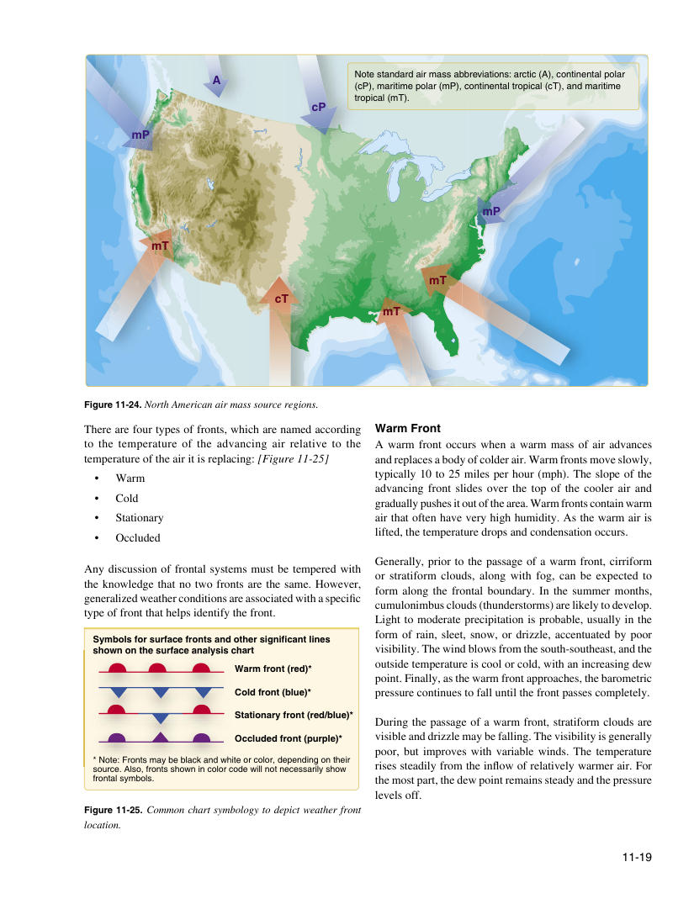

11-19
cP
A
mP
mP
mT
mT
mT
cT
Note standard air mass abbreviations: arctic (A), continental polar 
(cP), maritime polar (mP), continental tropical (cT), and maritime 
tropical (mT).
Figure 11-24. North American air mass source regions.
Symbols for surface fronts and other significant lines 
shown on the surface analysis chart
* Note: Fronts may be black and white or color, depending on their 
source. Also, fronts shown in color code will not necessarily show 
frontal symbols.
Warm front (red)*
Cold front (blue)*
Stationary front (red/blue)*
Occluded front (purple)*
Figure 11-25. Common chart symbology to depict weather front 
location.
There are four types of fronts, which are named according 
to the temperature of the advancing air relative to the 
temperature of the air it is replacing: [Figure 11-25]
• 
Warm 
• 
Cold 
• 
Stationary 
• 
Occluded 
Any discussion of frontal systems must be tempered with 
the knowledge that no two fronts are the same. However, 
generalized weather conditions are associated with a specific 
type of front that helps identify the front.
Warm Front
A warm front occurs when a warm mass of air advances 
and replaces a body of colder air. Warm fronts move slowly, 
typically 10 to 25 miles per hour (mph). The slope of the 
advancing front slides over the top of the cooler air and 
gradually pushes it out of the area. Warm fronts contain warm 
air that often have very high humidity. As the warm air is 
lifted, the temperature drops and condensation occurs.
Generally, prior to the passage of a warm front, cirriform 
or stratiform clouds, along with fog, can be expected to 
form along the frontal boundary. In the summer months, 
cumulonimbus clouds (thunderstorms) are likely to develop. 
Light to moderate precipitation is probable, usually in the 
form of rain, sleet, snow, or drizzle, accentuated by poor 
visibility. The wind blows from the south-southeast, and the 
outside temperature is cool or cold, with an increasing dew 
point. Finally, as the warm front approaches, the barometric 
pressure continues to fall until the front passes completely. 
During the passage of a warm front, stratiform clouds are 
visible and drizzle may be falling. The visibility is generally 
poor, but improves with variable winds. The temperature 
rises steadily from the inflow of relatively warmer air. For 
the most part, the dew point remains steady and the pressure 
levels off.

## Page 20

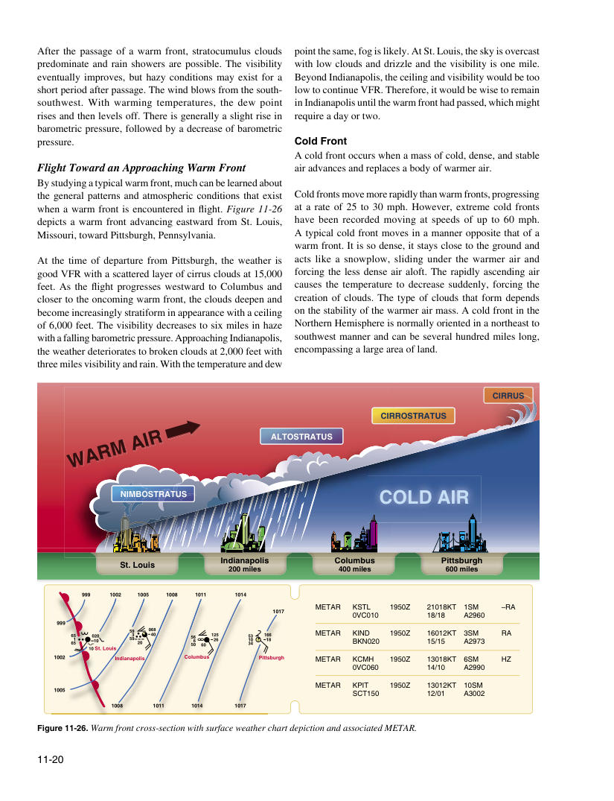

11-20
St. Louis
Indianapolis
200 miles
Columbus
400 miles
Pittsburgh
600 miles
St. Louis
Indianapolis
1005
1002
999
999
1002
1005
1008
1011
1014
1008
1011
1014
1017
1017
Columbus
Pittsburgh
65
1
10
65
59
3
59
56
60
6
50
53
10
34
20
068
020
10
40
125
26
166
18
METAR 
KSTL 
1950Z 
21018KT 1SM 
–RA
 
0VC010 
 
18/18 
A2960
METAR 
KIND 
1950Z 
16012KT 3SM 
RA
                 BKN020     
15/15      
A2973
METAR 
KCMH 
1950Z 
13018KT 6SM 
HZ
 
0VC060 
 
14/10  
A2990
METAR 
KPIT 
1950Z 
13012KT 10SM
 
SCT150 
 
12/01 
A3002                     
COLD AIR
WARM AIR
NIMBOSTRATUS
ALTOSTRATUS
CIRROSTRATUS
CIRRUS
Figure 11-26. Warm front cross-section with surface weather chart depiction and associated METAR.
After the passage of a warm front, stratocumulus clouds 
predominate and rain showers are possible. The visibility 
eventually improves, but hazy conditions may exist for a 
short period after passage. The wind blows from the south-
southwest. With warming temperatures, the dew point 
rises and then levels off. There is generally a slight rise in 
barometric pressure, followed by a decrease of barometric 
pressure.
Flight Toward an Approaching Warm Front
By studying a typical warm front, much can be learned about 
the general patterns and atmospheric conditions that exist 
when a warm front is encountered in flight. Figure 11-26 
depicts a warm front advancing eastward from St. Louis, 
Missouri, toward Pittsburgh, Pennsylvania.
At the time of departure from Pittsburgh, the weather is 
good VFR with a scattered layer of cirrus clouds at 15,000 
feet. As the flight progresses westward to Columbus and 
closer to the oncoming warm front, the clouds deepen and 
become increasingly stratiform in appearance with a ceiling 
of 6,000 feet. The visibility decreases to six miles in haze 
with a falling barometric pressure. Approaching Indianapolis, 
the weather deteriorates to broken clouds at 2,000 feet with 
three miles visibility and rain. With the temperature and dew 
point the same, fog is likely. At St. Louis, the sky is overcast 
with low clouds and drizzle and the visibility is one mile. 
Beyond Indianapolis, the ceiling and visibility would be too 
low to continue VFR. Therefore, it would be wise to remain 
in Indianapolis until the warm front had passed, which might 
require a day or two.
Cold Front
A cold front occurs when a mass of cold, dense, and stable 
air advances and replaces a body of warmer air.
Cold fronts move more rapidly than warm fronts, progressing 
at a rate of 25 to 30 mph. However, extreme cold fronts 
have been recorded moving at speeds of up to 60 mph. 
A typical cold front moves in a manner opposite that of a 
warm front. It is so dense, it stays close to the ground and 
acts like a snowplow, sliding under the warmer air and 
forcing the less dense air aloft. The rapidly ascending air 
causes the temperature to decrease suddenly, forcing the 
creation of clouds. The type of clouds that form depends 
on the stability of the warmer air mass. A cold front in the 
Northern Hemisphere is normally oriented in a northeast to 
southwest manner and can be several hundred miles long, 
encompassing a large area of land.

## Page 21

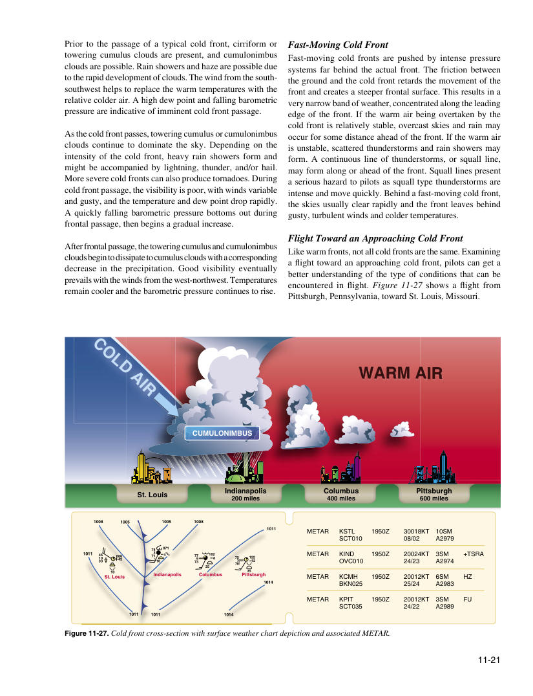

11-21
St. Louis
Indianapolis
200 miles
Columbus
400 miles
Pittsburgh
600 miles
METAR 
KSTL 
1950Z 
30018KT 10SM 
 
SCT010 
 
08/02 
A2979
METAR 
KIND 
1950Z 
20024KT 3SM 
+TSRA
                 OVC010     
24/23      
A2974
METAR 
KCMH 
1950Z 
20012KT 6SM 
HZ
 
BKN025 
 
25/24  
A2983
METAR 
KPIT 
1950Z 
20012KT 3SM 
FU
 
SCT035 
 
24/22 
A2989                     
1011
1008
1005
1005
1008
1011
1011
1011
1014
1014
St. Louis
Indianapolis
Columbus
Pittsburgh
46
42
10
066
10
33
74
071
3
71
77
6
73
75
3
70
35
4
8
12
102
122
10
25
WARM AIR
COLD 
AIR
CUMULONIMBUS
Figure 11-27. Cold front cross-section with surface weather chart depiction and associated METAR.
Prior to the passage of a typical cold front, cirriform or 
towering cumulus clouds are present, and cumulonimbus 
clouds are possible. Rain showers and haze are possible due 
to the rapid development of clouds. The wind from the south-
southwest helps to replace the warm temperatures with the 
relative colder air. A high dew point and falling barometric 
pressure are indicative of imminent cold front passage.
As the cold front passes, towering cumulus or cumulonimbus 
clouds continue to dominate the sky. Depending on the 
intensity of the cold front, heavy rain showers form and 
might be accompanied by lightning, thunder, and/or hail. 
More severe cold fronts can also produce tornadoes. During 
cold front passage, the visibility is poor, with winds variable 
and gusty, and the temperature and dew point drop rapidly. 
A quickly falling barometric pressure bottoms out during 
frontal passage, then begins a gradual increase.
After frontal passage, the towering cumulus and cumulonimbus 
clouds begin to dissipate to cumulus clouds with a corresponding 
decrease in the precipitation. Good visibility eventually 
prevails with the winds from the west-northwest. Temperatures 
remain cooler and the barometric pressure continues to rise.
Fast-Moving Cold Front
Fast-moving cold fronts are pushed by intense pressure 
systems far behind the actual front. The friction between 
the ground and the cold front retards the movement of the 
front and creates a steeper frontal surface. This results in a 
very narrow band of weather, concentrated along the leading 
edge of the front. If the warm air being overtaken by the 
cold front is relatively stable, overcast skies and rain may 
occur for some distance ahead of the front. If the warm air 
is unstable, scattered thunderstorms and rain showers may 
form. A continuous line of thunderstorms, or squall line, 
may form along or ahead of the front. Squall lines present 
a serious hazard to pilots as squall type thunderstorms are 
intense and move quickly. Behind a fast-moving cold front, 
the skies usually clear rapidly and the front leaves behind 
gusty, turbulent winds and colder temperatures.
Flight Toward an Approaching Cold Front
Like warm fronts, not all cold fronts are the same. Examining 
a flight toward an approaching cold front, pilots can get a 
better understanding of the type of conditions that can be 
encountered in flight. Figure 11-27 shows a flight from 
Pittsburgh, Pennsylvania, toward St. Louis, Missouri.

## Page 22

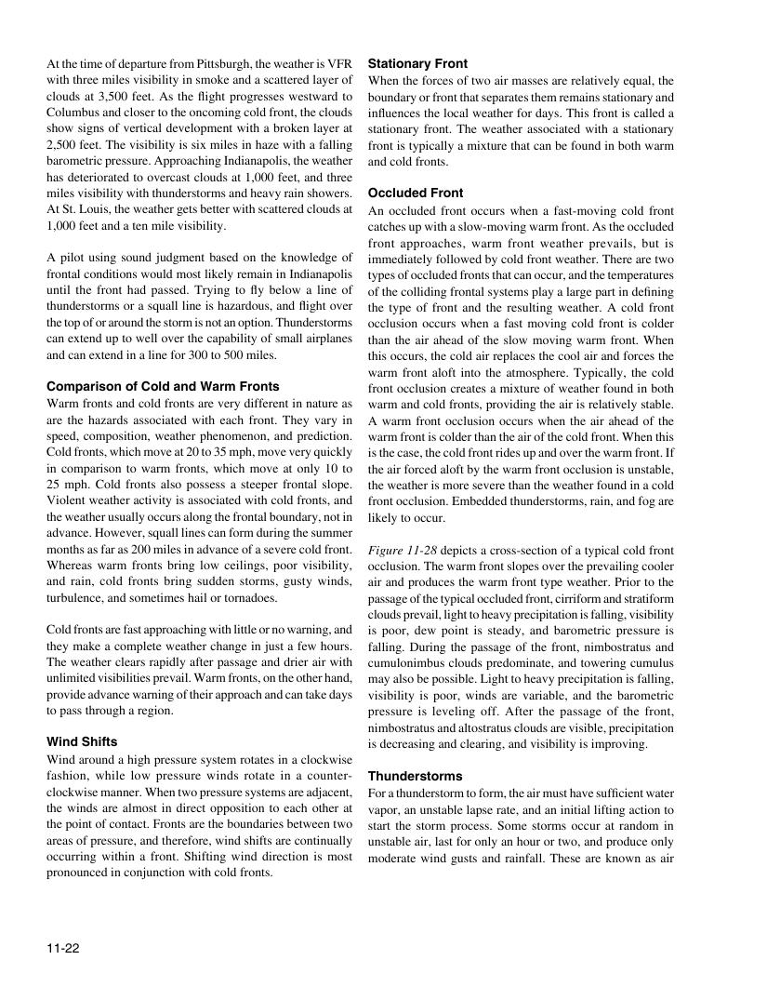

11-22
At the time of departure from Pittsburgh, the weather is VFR 
with three miles visibility in smoke and a scattered layer of 
clouds at 3,500 feet. As the flight progresses westward to 
Columbus and closer to the oncoming cold front, the clouds 
show signs of vertical development with a broken layer at 
2,500 feet. The visibility is six miles in haze with a falling 
barometric pressure. Approaching Indianapolis, the weather 
has deteriorated to overcast clouds at 1,000 feet, and three 
miles visibility with thunderstorms and heavy rain showers. 
At St. Louis, the weather gets better with scattered clouds at 
1,000 feet and a ten mile visibility.
A pilot using sound judgment based on the knowledge of 
frontal conditions would most likely remain in Indianapolis 
until the front had passed. Trying to fly below a line of 
thunderstorms or a squall line is hazardous, and flight over 
the top of or around the storm is not an option. Thunderstorms 
can extend up to well over the capability of small airplanes 
and can extend in a line for 300 to 500 miles.
Comparison of Cold and Warm Fronts
Warm fronts and cold fronts are very different in nature as 
are the hazards associated with each front. They vary in 
speed, composition, weather phenomenon, and prediction. 
Cold fronts, which move at 20 to 35 mph, move very quickly 
in comparison to warm fronts, which move at only 10 to 
25 mph. Cold fronts also possess a steeper frontal slope. 
Violent weather activity is associated with cold fronts, and 
the weather usually occurs along the frontal boundary, not in 
advance. However, squall lines can form during the summer 
months as far as 200 miles in advance of a severe cold front. 
Whereas warm fronts bring low ceilings, poor visibility, 
and rain, cold fronts bring sudden storms, gusty winds, 
turbulence, and sometimes hail or tornadoes.
Cold fronts are fast approaching with little or no warning, and 
they make a complete weather change in just a few hours. 
The weather clears rapidly after passage and drier air with 
unlimited visibilities prevail. Warm fronts, on the other hand, 
provide advance warning of their approach and can take days 
to pass through a region.
Wind Shifts
Wind around a high pressure system rotates in a clockwise 
fashion, while low pressure winds rotate in a counter-
clockwise manner. When two pressure systems are adjacent, 
the winds are almost in direct opposition to each other at 
the point of contact. Fronts are the boundaries between two 
areas of pressure, and therefore, wind shifts are continually 
occurring within a front. Shifting wind direction is most 
pronounced in conjunction with cold fronts.
Stationary Front
When the forces of two air masses are relatively equal, the 
boundary or front that separates them remains stationary and 
influences the local weather for days. This front is called a 
stationary front. The weather associated with a stationary 
front is typically a mixture that can be found in both warm 
and cold fronts.
Occluded Front
An occluded front occurs when a fast-moving cold front 
catches up with a slow-moving warm front. As the occluded 
front approaches, warm front weather prevails, but is 
immediately followed by cold front weather. There are two 
types of occluded fronts that can occur, and the temperatures 
of the colliding frontal systems play a large part in defining 
the type of front and the resulting weather. A cold front 
occlusion occurs when a fast moving cold front is colder 
than the air ahead of the slow moving warm front. When 
this occurs, the cold air replaces the cool air and forces the 
warm front aloft into the atmosphere. Typically, the cold 
front occlusion creates a mixture of weather found in both 
warm and cold fronts, providing the air is relatively stable. 
A warm front occlusion occurs when the air ahead of the 
warm front is colder than the air of the cold front. When this 
is the case, the cold front rides up and over the warm front. If 
the air forced aloft by the warm front occlusion is unstable, 
the weather is more severe than the weather found in a cold 
front occlusion. Embedded thunderstorms, rain, and fog are 
likely to occur.
Figure 11-28 depicts a cross-section of a typical cold front 
occlusion. The warm front slopes over the prevailing cooler 
air and produces the warm front type weather. Prior to the 
passage of the typical occluded front, cirriform and stratiform 
clouds prevail, light to heavy precipitation is falling, visibility 
is poor, dew point is steady, and barometric pressure is 
falling. During the passage of the front, nimbostratus and 
cumulonimbus clouds predominate, and towering cumulus 
may also be possible. Light to heavy precipitation is falling, 
visibility is poor, winds are variable, and the barometric 
pressure is leveling off. After the passage of the front, 
nimbostratus and altostratus clouds are visible, precipitation 
is decreasing and clearing, and visibility is improving.
Thunderstorms
For a thunderstorm to form, the air must have sufficient water 
vapor, an unstable lapse rate, and an initial lifting action to 
start the storm process. Some storms occur at random in 
unstable air, last for only an hour or two, and produce only 
moderate wind gusts and rainfall. These are known as air

## Page 23

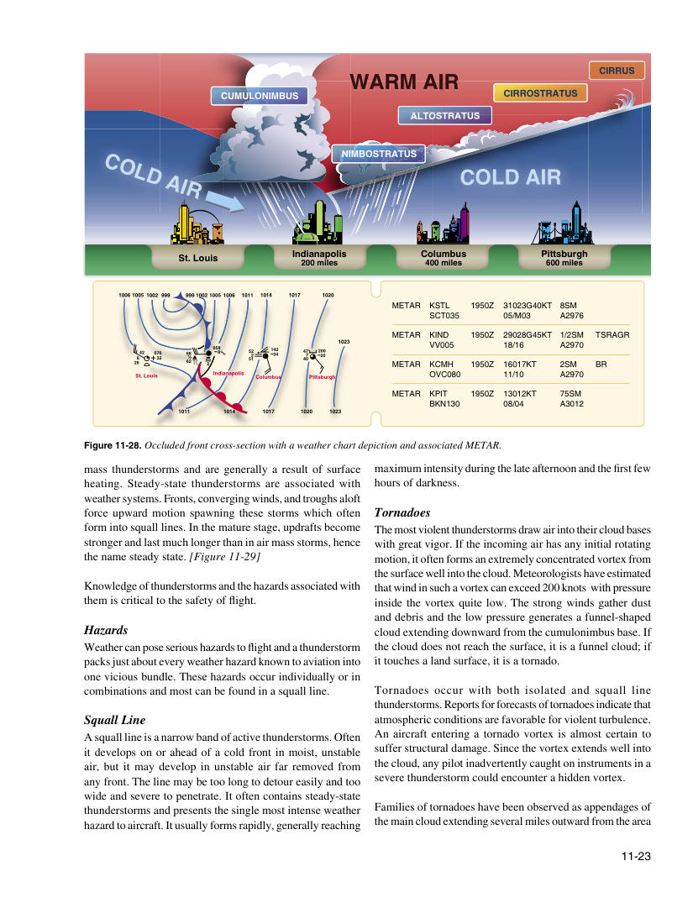

11-23
St. Louis
Indianapolis
200 miles
Columbus
400 miles
Pittsburgh
600 miles
METAR KSTL 
1950Z 
31023G40KT 8SM 
 
SCT035 
 
05/M03 
A2976
METAR KIND 
1950Z 
29028G45KT 1/2SM 
TSRAGR
                 VV005    
 
18/16      
A2970
METAR KCMH 
1950Z 
16017KT 
2SM 
BR
 
OVC080 
 
11/10  
A2970
METAR KPIT 
1950Z 
13012KT 
75SM
 
BKN130 
 
08/04 
A3012                     
St. Louis
Indianapolis
Columbus
Pittsburgh
1023
1020
1017
1014
1011
1006
1005
1002
999
999
1002
1005
1006
1011
1014
1017
1020
1023
42
8
32
076
26
52
2
51
47
7
40
2
058
142
8
34
200
20
66
62
12
WARM AIR
CUMULONIMBUS
COLD AIR
NIMBOSTRATUS
ALTOSTRATUS
CIRROSTRATUS
CIRRUS
COLD AIR
Figure 11-28. Occluded front cross-section with a weather chart depiction and associated METAR.
mass thunderstorms and are generally a result of surface 
heating. Steady-state thunderstorms are associated with 
weather systems. Fronts, converging winds, and troughs aloft 
force upward motion spawning these storms which often 
form into squall lines. In the mature stage, updrafts become 
stronger and last much longer than in air mass storms, hence 
the name steady state. [Figure 11-29] 
 
Knowledge of thunderstorms and the hazards associated with 
them is critical to the safety of flight.
Hazards 
Weather can pose serious hazards to flight and a thunderstorm 
packs just about every weather hazard known to aviation into 
one vicious bundle. These hazards occur individually or in 
combinations and most can be found in a squall line. 
 
Squall Line 
A squall line is a narrow band of active thunderstorms. Often 
it develops on or ahead of a cold front in moist, unstable 
air, but it may develop in unstable air far removed from 
any front. The line may be too long to detour easily and too 
wide and severe to penetrate. It often contains steady-state 
thunderstorms and presents the single most intense weather 
hazard to aircraft. It usually forms rapidly, generally reaching 
maximum intensity during the late afternoon and the first few 
hours of darkness. 
Tornadoes 
The most violent thunderstorms draw air into their cloud bases 
with great vigor. If the incoming air has any initial rotating 
motion, it often forms an extremely concentrated vortex from 
the surface well into the cloud. Meteorologists have estimated 
that wind in such a vortex can exceed 200 knots  with pressure 
inside the vortex quite low. The strong winds gather dust 
and debris and the low pressure generates a funnel-shaped 
cloud extending downward from the cumulonimbus base. If 
the cloud does not reach the surface, it is a funnel cloud; if 
it touches a land surface, it is a tornado. 
Tornadoes occur with both isolated and squall line 
thunderstorms. Reports for forecasts of tornadoes indicate that 
atmospheric conditions are favorable for violent turbulence. 
An aircraft entering a tornado vortex is almost certain to 
suffer structural damage. Since the vortex extends well into 
the cloud, any pilot inadvertently caught on instruments in a 
severe thunderstorm could encounter a hidden vortex. 
Families of tornadoes have been observed as appendages of 
the main cloud extending several miles outward from the area

## Page 24

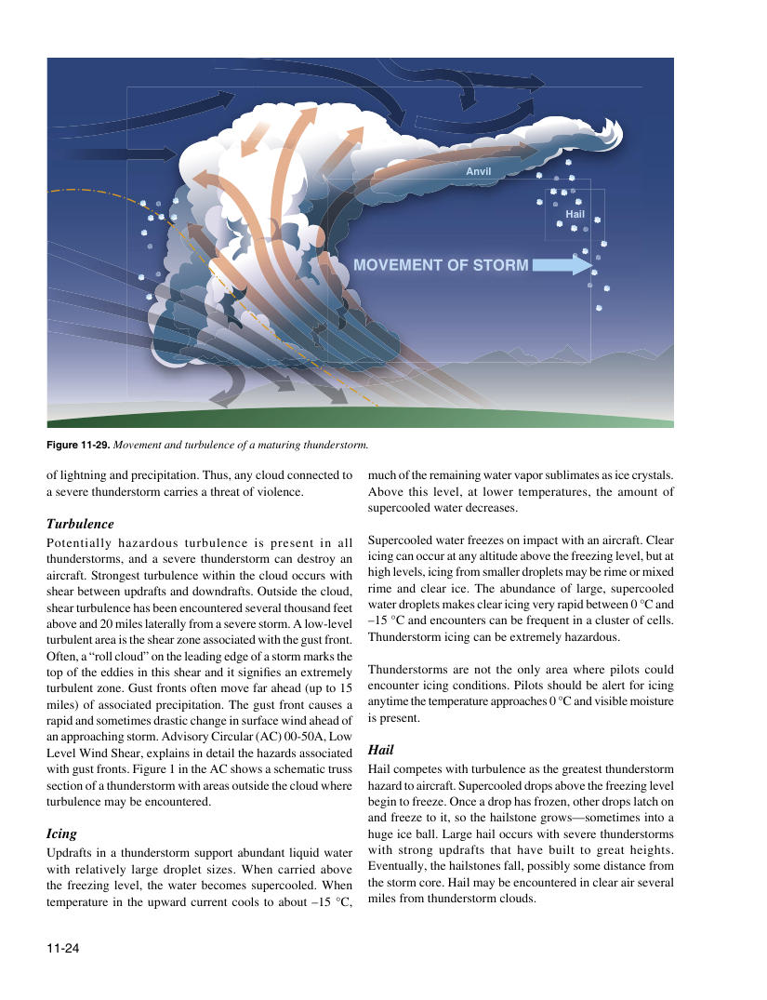

11-24
MOVEMENT OF STORM
Hail
Anvil
Figure 11-29. Movement and turbulence of a maturing thunderstorm.
of lightning and precipitation. Thus, any cloud connected to 
a severe thunderstorm carries a threat of violence. 
Turbulence 
Potentially hazardous turbulence is present in all 
thunderstorms, and a severe thunderstorm can destroy an 
aircraft. Strongest turbulence within the cloud occurs with 
shear between updrafts and downdrafts. Outside the cloud, 
shear turbulence has been encountered several thousand feet 
above and 20 miles laterally from a severe storm. A low-level 
turbulent area is the shear zone associated with the gust front. 
Often, a “roll cloud” on the leading edge of a storm marks the 
top of the eddies in this shear and it signifies an extremely 
turbulent zone. Gust fronts often move far ahead (up to 15 
miles) of associated precipitation. The gust front causes a 
rapid and sometimes drastic change in surface wind ahead of 
an approaching storm. Advisory Circular (AC) 00-50A, Low 
Level Wind Shear, explains in detail the hazards associated 
with gust fronts. Figure 1 in the AC shows a schematic truss 
section of a thunderstorm with areas outside the cloud where 
turbulence may be encountered. 
 
Icing 
Updrafts in a thunderstorm support abundant liquid water 
with relatively large droplet sizes. When carried above 
the freezing level, the water becomes supercooled. When 
temperature in the upward current cools to about –15 °C, 
much of the remaining water vapor sublimates as ice crystals. 
Above this level, at lower temperatures, the amount of 
supercooled water decreases. 
 
Supercooled water freezes on impact with an aircraft. Clear 
icing can occur at any altitude above the freezing level, but at 
high levels, icing from smaller droplets may be rime or mixed 
rime and clear ice. The abundance of large, supercooled 
water droplets makes clear icing very rapid between 0 °C and 
–15 °C and encounters can be frequent in a cluster of cells. 
Thunderstorm icing can be extremely hazardous. 
Thunderstorms are not the only area where pilots could 
encounter icing conditions. Pilots should be alert for icing 
anytime the temperature approaches 0 °C and visible moisture 
is present.
Hail 
Hail competes with turbulence as the greatest thunderstorm 
hazard to aircraft. Supercooled drops above the freezing level 
begin to freeze. Once a drop has frozen, other drops latch on 
and freeze to it, so the hailstone grows—sometimes into a 
huge ice ball. Large hail occurs with severe thunderstorms 
with strong updrafts that have built to great heights. 
Eventually, the hailstones fall, possibly some distance from 
the storm core. Hail may be encountered in clear air several 
miles from thunderstorm clouds.

## Page 25

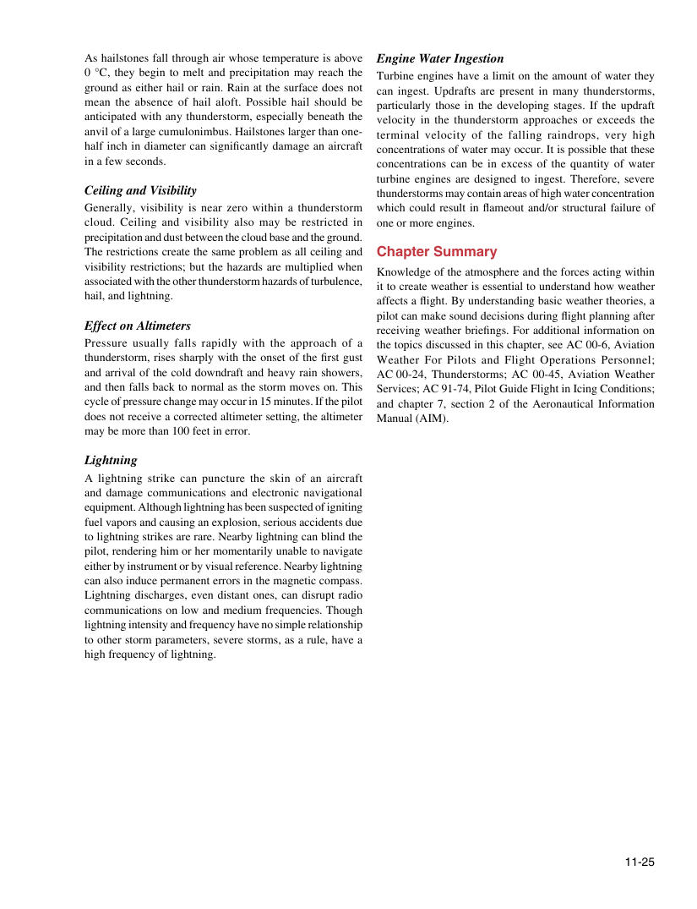

11-25
As hailstones fall through air whose temperature is above 
0 °C, they begin to melt and precipitation may reach the 
ground as either hail or rain. Rain at the surface does not 
mean the absence of hail aloft. Possible hail should be 
anticipated with any thunderstorm, especially beneath the 
anvil of a large cumulonimbus. Hailstones larger than one-
half inch in diameter can significantly damage an aircraft 
in a few seconds. 
Ceiling and Visibility 
Generally, visibility is near zero within a thunderstorm 
cloud. Ceiling and visibility also may be restricted in 
precipitation and dust between the cloud base and the ground. 
The restrictions create the same problem as all ceiling and 
visibility restrictions; but the hazards are multiplied when 
associated with the other thunderstorm hazards of turbulence, 
hail, and lightning. 
Effect on Altimeters 
Pressure usually falls rapidly with the approach of a 
thunderstorm, rises sharply with the onset of the first gust 
and arrival of the cold downdraft and heavy rain showers, 
and then falls back to normal as the storm moves on. This 
cycle of pressure change may occur in 15 minutes. If the pilot 
does not receive a corrected altimeter setting, the altimeter 
may be more than 100 feet in error. 
Lightning
A lightning strike can puncture the skin of an aircraft 
and damage communications and electronic navigational 
equipment. Although lightning has been suspected of igniting 
fuel vapors and causing an explosion, serious accidents due 
to lightning strikes are rare. Nearby lightning can blind the 
pilot, rendering him or her momentarily unable to navigate 
either by instrument or by visual reference. Nearby lightning 
can also induce permanent errors in the magnetic compass. 
Lightning discharges, even distant ones, can disrupt radio 
communications on low and medium frequencies. Though 
lightning intensity and frequency have no simple relationship 
to other storm parameters, severe storms, as a rule, have a 
high frequency of lightning. 
Engine Water Ingestion 
Turbine engines have a limit on the amount of water they 
can ingest. Updrafts are present in many thunderstorms, 
particularly those in the developing stages. If the updraft 
velocity in the thunderstorm approaches or exceeds the 
terminal velocity of the falling raindrops, very high 
concentrations of water may occur. It is possible that these 
concentrations can be in excess of the quantity of water 
turbine engines are designed to ingest. Therefore, severe 
thunderstorms may contain areas of high water concentration 
which could result in flameout and/or structural failure of 
one or more engines. 
Chapter Summary
Knowledge of the atmosphere and the forces acting within 
it to create weather is essential to understand how weather 
affects a flight. By understanding basic weather theories, a 
pilot can make sound decisions during flight planning after 
receiving weather briefings. For additional information on 
the topics discussed in this chapter, see AC 00-6, Aviation 
Weather For Pilots and Flight Operations Personnel; 
AC 00-24, Thunderstorms; AC 00-45, Aviation Weather 
Services; AC 91-74, Pilot Guide Flight in Icing Conditions; 
and chapter 7, section 2 of the Aeronautical Information 
Manual (AIM).

## Page 26

11-26
