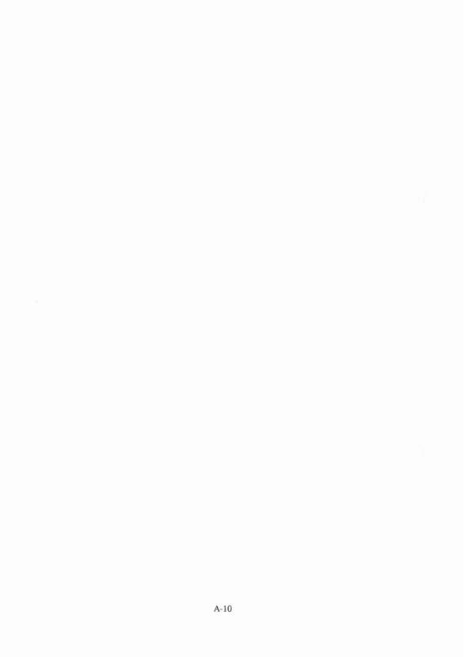

# Forecaster's Reference Book (United Kingsgdom)

> Source: <http://www.weather.gov/media/zhu/ZHU_Training_Page/Met_Tutorials/Forecasters_Reference_Book_1997.pdf>  
> Section: Weather Handbooks and Important Links  
> Captured: 2026-08-19 06:00 UTC  
> PDF: [forecaster-s-reference-book-united-kingsgdom.pdf](forecaster-s-reference-book-united-kingsgdom.pdf) (176 pages)

---

## Page 1

FORECASTERS'
REFERENCE
BOOK
Met.O.l023
©Crown copyright
1997
Meteorological
Office College
February
1997

## Page 2

©Crown copyright 1997
Applications for reproduction
should be made to
The Met. Office, Bracknell
ISBN 0 86180 325 6
Published by The Met. Office
LondonRd
Bracknell
Berkshire
RG122SZ
ii

## Page 3

PREFACE
This latest edition of the Forecasters' Reference Book (FRB) builds on the strengths
of the previous editions and handbooks, incorporating the latest science, where this
is available in 'forecaster-friendly'
form. From the outset, in designing the contents
and format, every regard has been paid to forecasters'
suggestions;
the draft
chapters have been thoroughly reviewed by a panel of forecasters and specialists. In
this review process it became apparent that, to do justice to the copious literature on
forecasting
techniques,
it was sensible to present not only a FRB of selected
forecasting techniques but also a more erudite account of techniques, alternatives
and limitations in a Source Book. The Chapters of the FRB and the Source Book
should be seen as complementing many of those in Images in Weather Forecasting,
1995 (Ed. M. Bader et al.).
Remote Sensing, and Numerical Weather Prediction, now integral parts of the the
forecasters'
armoury are constantly referred to in the text but, with many guides
available (e.g. Images in Weather Forecasting), they are only touched upon in the
Source Book and FRB. Other chapters reflect the increasing
concern over Air
Pollution (Source Book Chapter 12), as well as the customer demand for Probability
Forecasting (FRB and Source Book Chapter 11). I am grateful to Eddie Carroll for
contributing Chapter 8, reflecting his insight on the use of dynamical concepts in
assessing development.
Chapter 11, Probability Forecasts,
is based on a lecture
course prepared by Bob Riddaway.
Where appropriate, Sections have references to key published papers as well as
useful general reading articleslbooks. Reference is often made to the Handbook of
Weather Forecasting, 1975 (HWF), which contains detailed accounts of forecasting
techniques, accompanied by copious references.
There are some topics, such as fog, stratocumulus, and airflow over hills, where a
more-detailed physical and dynamical picture has been included in the Source Book
to enable the forecaster
to make more considered
judgements
in forecasting
elements whose behaviour is at best capricious.
As with previous editions it should be noted that this Forecasters' Reference Book
has been produced specifically for the UK Meteorological Office forecaster; thus,
forecasting techniques and rules apply mainly to the British Isles and north-west
Europe and will not necessarily be applicable in other areas.
John R. Starr
Meteorological Office College
Shinfield Park
February 1997
iii

## Page 4

_(no extractable text on this page — see rendered image above)_

## Page 5

Chapter
1
2
3
4
5
6
*7
*8
*9
*10
11
*12
13
FORECASTERS' REFERENCE
BOOK
Contents
Wind
Temperature
Visibility
Convection
and showers
Layer clouds and precipitation
Turbulence
and gusts
Fronts: conceptual models and analysis: non-frontal
systems
Use of dynamical concepts is assessing development
Numerical Weather Prediction
Remote sensing
Probability forecasts
Air quality and atmospheric dispersion
Sea waves and surges
Appendix I -
Units
Appendix II -
Conversion
tables
Appendix III -
Physical tables and constants
Appendix IV -
Forecasting
weather below 15,000 ft
Index
* To be found in the Source Book
v

## Page 6

_(no extractable text on this page — see rendered image above)_

## Page 7

FORECASTERS'
REFERENCE BOOK
CONTENTS
Chapter 1 -
Wind
1.1
Winds in the free atmosphere
1.2
Winds near the surface
1.3
Local winds
Chapter 2 -
Temperature
2.1
Thermodynamics and the tephigram
2.2
Diurnal temperature variations in different air masses
2.3
Daytime rise of surface temperature
2.4
Nocturnal fall of surface temperature
2.5
Grass and concrete-minimum temperatures
2.6
Forecasting road surface conditions
2.7
Modification of surface air temperature over the sea
2.8
Cooling of air by precipitation
2.9
Ice accretion
2.10
Wind chill and heat stress in man and animals
2.11
The urban 'heat island'
2.12
Model Output Statistics
Chapter 3 -
Visibility
3.1
Factors reducing visibility
3.2
Fog
3.3
Radiation fog
3.4
Advection fog
3.5
Upslope fog
3.6
Frontal fog
3.7
Convective activity above fog
3.8
Guidance on the formation and detection of fog through imagery
3.9
Haze
3.10
Visibility in precipitation and spray
Chapter 4 -
Convection and showers
4.1
Forecasting convective cloud
4.2
Constructions on a tephigram
4.3
Forecasting considerations
4.4
The spreading out of cumulus into a layer of stratocumulus
4.5
Forecasting showers
4.6
Topographically related convection
4.7
Forecasting cumulonimbus and thunderstorms
vii

## Page 8

Chapter 5 -
Layer clouds and precipitation
5.1
Layer cloud formation
5.2
Large-scale ascent
5.3
Condensation trails
5.4
Orographic uplift
5.5
Turbulent mixing
5.6
Stratus forecasting techniques
5.7
Stratocumulus: physical and dynamical processes of formation and dissipation
5.8
Non-frontal stratocumulus
5.9
Precipitation from layered clouds
5.10
Criteria for precipitation reaching the surface as snow or rain
5.11
Snow
Chapter 6 -
Turbulence and gusts
6.1
Turbulence in the free atmosphere
6.2
Turbulence near the surface
Chapter 7 -
Fronts: conceptual models and analysis: non-frontal systems
7.1
Conceptual models ~ fronts and conveyor belts
7.2
Frontal features and development
7.3
Explosive cyclogenesis
7.4
Non-frontal systems
Chapter 8 -
Use of dynamical concepts in assessing development
8.1
Basic ideas
8.2
Ageostrophic motion
8.3
Vorticity
8.4
The development and movement of upper features
8.5
Self development
8.6
The quasi-geostrophic omega equation
8.7
Sutcliffe theory
8.8
Potential vorticity (PV)
Chapter 9 -
Numerical Weather Prediction
9.1
Operational models
9.2
Summary of types of numerical models
9.3
Guide to NWP interpretation
9.4
Model characteristics
9.5
Guidance, confidence and verification
Chapter 10 -
Remote sensing
10.1
Meteorological satellites
10.2
Image interpretation
10.3
Mesoscale interpretation ~ identification of cloud type and characteristics
10.4
Image signatures of meso- and synoptic-scale processes
10.5
Diagnosis of cyclogenesis
10.6
Radar rainfall measurements
10.7
Sferics
viii

## Page 9

Chapter 11 -
Probability forecasts
11.1
Basic concepts
11.2
Types of probability measure
11.3
Practical considerations
11.4
Verification
11.5
Making comparisons
11.6
Factorization
11.7
Ensemble forecasting and predictability
Chapter 12 -
Air quality and atmospheric dispersion
12.1
Air quality
12.2
Dispersion on various scales
12.3
Deposition processes
Chapter 13 -
Sea waves and surges
13.1
Sea waves and swell
13.2
Storm surges
13.3
Terminology
Appendix I -
Units
Appendix II -
Conversion tables
Appendix III -
Physical tables and constants
Appendix IV -
Forecasting weather below 15,000 ft
Index
ix

## Page 10

_(no extractable text on this page — see rendered image above)_

## Page 11

CHAPTER
1 -
WIND
1.1
Winds in the free atmosphere
1. 1. 1
Geostrophic wind (Vg)
Vgis defined as the steady (unaccelerating), horizontal wind which results from the balance of
two forces only -
namely the pressure gradient force and the Coriolis ioicc.], It follows that
geostrophic wind is a good approximation to the actual wind only with isobars (or contours)
which are straight, parallel and not changing with time. There are significant differences from
Vg in strongly curved flow and flow near surfaces (8B).
1.1.1.1
Tables for geostrophic
winds
Table
1.1 may be used to derive
Vg for charts on which no geostrophic
wind scale is
provided. It gives 'multipliers'
corresponding to a pressure (contour height) change over a
distance of 300 n mile (or 5° latitude) of 1 hPa (1 dam).
Examples:
(i)
A gradient of 5 hPa per 300 n mile at 55° N corresponds
to Vg= 5 X 2.4 = 12 kn
(approx.).
(ii)
A gradient of 12 dam per 300 n mile at 50° N corresponds to Vg = 12 X 3.1 = 37 kn
(approx.).
Table 1.1.
To derive
Vg for charts with no geostrophic
scale
Pressure/height change over 300 n mile
Isobars (hPa)
Contours (dam)
Latitude CO)
multipliers
70
60
55
50
45
40
35
30
2.1
2.5
2.3
2.7
2.4
2.9
2.6
3.1
2.8
3.3
3.1
3.7
3.4
4.1
3.9
4.7
If gradients are measured over shorter distances, the factors should be altered in proportion,
i.e. for 150 n mile (2.5° latitude span) the factors are doubled. Correction factors for density
variations
may be applied to geostrophic
wind values measured
by scales based on the
Standard Atmosphere (1013.2 hPa, 15°C) and era tabulated in 8B Table 1.2.
1. 1.2
Gradient wind
When its trajectory is curved, air must be subjected to a local centripetal acceleration (SB).
1-1

## Page 12

1.1.2.1
Estimation of gradient wind (tabular method)
Corrections to be applied to the geostrophic wind to obtain the gradient wind are given in SB,
Table 1.3. The top section of the table (a) shows how changes in the Coriolis parameter
affect the results. Thus a radius of 600 n mile at latitude 50° is equivalent to a radius of
489 n mile at latitude 70° or 919 n mile at latitude 30°.
1.1.2.2
Estimation of gradient wind (graphical method)
Fig. 1.1 is a graph for obtaining the gradient wind speed from the speed of the geostrophic
wind and the radius of curvature. The graph is drawn for use at latitude 50°. For use at other
latitudes the radius of curvature
must be multiplied
by a correction
factor to obtain the
equivalent value at latitude 50°.
To use the graph:
(i)
Use the right-hand inset to find the equivalent radius of curvature for latitudes other than
50°. Multiply the actual radius by the factor shown against the value for latitude. If, for
example, the radius at latitude 39.5° N is 1200 n mile, the correction factor is 0.83 and
the equivalent radius at latitude 50° is about 1000 n mile.
(ii)
Find the point of intersection of the geostrophic wind speed (shown along the left-hand
axis) with the curve showing the radius of curvature. The cyclonic curves lie to the left
and the anticyclonic curves lie to the right of the straight line denoting infinite radius.
The gradient wind speed is shown along the bottom of the diagram. Thus with a radius
of curvature of 1000 n mile and Vg = 90 kn, the gradient wind is 76 kn for cyclonic
curvature and 136 kn for anticyclonic curvature.
The theoretical
maximum
gradient
wind speed for anticyclonic
curvature
is twice the
geostrophic wind. The graphs show that as the gradient wind approaches this value, small
increases in the geostrophic wind can produce very large increases in the gradient wind.
1.1.2.3
Curvature of trajectories for systems in motion
Significant
differences
occur between the curvature
of trajectories
and the curvature
of
isobars or contours when the systems are in motion (SB, Fig. 1.2).
Holton (1992)
1.1.3
Variations in the mean wind
1.1.3.1
Ageostrophic
winds (see Chapter 8)
An actual wind may be considered to have two components, one of which is geostrophic and
the other ageostrophic (non-geostrophic),
1.1.3.2
Thermal winds
(i)
The thermal
wind in the layer between two pressure levels is the vector difference
between the geostrophic winds at two levels B (upper level) and A (lower level).
Thus in Fig. 1.3: Vthennal= VA -
VB.
(ii)
A geostrophic wind is proportional to the contour height gradient at a pressure level; a
thermal wind,
Vthecmah measures
the difference
in the contour gradient
between
two
pressure levels. Vthermal is proportional to the horizontal temperature gradient in the layer.
It may be regarded as a steering wind for surface features.
1-2

## Page 13

20
40
"2
60
C.
"'0
Q)
80
Q)
0..
en
"'0c
100
,
.§
VJ
Q
:.c
8- 120
....
(j)
0
Q)
CJ
140
160
180
I
\.
Adjustment of radius 0
H~"',
0.67
350
curvature for latitudt
~~-.O..180
~
~:::--::.~
?40
0.71
'\~
~-.._
"
,~~O
0.77
40°
~
,~t:----
",
400
0 83
450
Latitude
~~
~~~-----
",
",
,500
factor'
0.91
50°
0,~~'~~~L----r---
"'"
to multiply
5r
o
\\ ',\\\~
~~:::::-..:t---
£,~O ~adiUSOf
1.0
I"
60
\ \ \ \ \ \\~
,~~~------
",
700
curvature
1 11
65° 7
\
'\ \~~
'~~~:::::::<:-r---r-.
"""
by
.
\
\\ ,\\'\~'0 ,""."-"-<, ......_
1l.00
1.25
,\
\\\\\\\\~r\.,~~~I'--r-----
""
900
\ \ \' l\\~~
'~~r--.."""~
---r-.___
", '"
,1000
\
\l\\ \\'~~
',~~~
I---'___
'l",
\ \ 1\ \ \ \\\\~~
,~~
~~
r----_
12bo
<;
\\ \1\\ \\\\;~~
',~~
............
~r---.
\
\
\\\'\\~~
,
~~~
~r---.
---115'O'O-.._
<g, ~
~ ~'6lQ't16Qd'd\;\!\\", ,~~ "-~~
-"'18'0'0
----
f------f------I---'f----I---j----=tt-o
v- v z> v v v i?-a
(\
~('I): -"d-~'<::"t_---+-'
~+--t----I
\
\ \ \ \1\\ ,\q,';.} -, ,\~C}.,~o -.
-...._..,<?'lfo.'Ol
----.___
___
\
\ \
\
\q~?'" ::-",,'0 '" ~~:-
crQ
1\
\
1\
1\
,~\dQ~aU'a ~(\',~
'lfo.,'OO{ ............
\
\
\
\ 1\\ \1\\J\O{O\I
r"
i°'{_"~~ <,
0°
20
40
60
80
100
120
140
160
180
200
220
240
Gradient
wind speed (kn)
Figure
1.1.
A graph to ohtain the gradient
wind speed from the speed of the geostrophic
wind and the radius of curvature.

## Page 14

(iii) A strong north-south temperature gradient implies a strong westerly thermal wind with a
westerly wind component increasing with height in the layer. A reversed temperature
pattern gives easterly thermal winds, and a westerly wind component decreasing with
height.
(iv) Although the thermal wind is geostrophic,
practical computations
use the difference
between the actual winds at two levels. This is normally acceptably accurate.
Holton (1992)
1.1.4
Use of the hodograph
Plotting
Wind vectors are plotted on a hodograph
so that they end at the centre of the diagram.
Fig. 1.3 shows a 900 hPa wind of 240
0 20 kn and an 800 hPa wind of 300
0 30 kn. The
thermal wind in this layer is the vector from B to A. A normal hodograph plot only shows the
points at each pressure level, joined to show the thermal winds in each layer.
360°
30 kn
B
20
10
30
270°
090°
A
180°
Figure 1.3.
Plotting wind vectors on a hodograph. AO is the lower-level wind vector (say,
900 hPa). BO is the upper-level wind vector (say, 800 hPa). BA is the thermal wind vector
(directed from the upper to the lower wind vectors).
Identifying the direction of warm and cold air
In Fig. 1.4 the colder air is shown by light stippling and the warmer air by heavy stippling.
Arrows show the direction of the thermal winds in the different layers. Thus between 850 and
500 hPa the thermal wind direction is 240° which shows that the colder air lies towards the
north-west. Between 500 and 400 hPa the thermal wind direction is 005° indicating that in
that layer the colder air is towards the east.
Warm and cold advection
Between 900 and 850 hPa in Fig. 1.4 the thermal wind direction is 315°, indicating colder air
to the north-east. Since the mean wind direction between these levels is from the north-east,
colder air is being advected towards the station. This cold advection is in fact taking place at
all levels up to 500 hPa. (i.e. wind is backing with height). Between 500 and 400 hPa the
thermal
wind is from 005° while the mean wind is about 345° indicating
weak warm
advection (wind is veering with height).
1-4

## Page 15

hPa
deg
kn
900
060
22
850
030
22
750
020
19
700
010
17
hPa
deg
kn
600
360
14
500
340
12
400
350
20
300
340
29
hPa
deg
kn
250
330
18
200
320
7
150
320
4
100
300
6
Figure 1.4.
Hodograph example: Stomoway, 0600 UTe on 9 June 1961.
1. 1.4. 1
Fronts and vertical motion
Fig. 1.5 shows a construction which can be useful when a frontal surface lies over the station
at some level.
(i)
Mark the surface front through the centre of the hodograph,
its orientation being as
shown on a surface chart.
(ii)
Determine the upper and lower levels of the frontal zone from a tephigram (i.e. noting
change of Ow), and mark them on the hodograph.
The thermal wind direction in the
frontal zone is often roughly parallel to the front.
(iii) Measure the wind component normal to the front at each level in the frontal zone and in
the warm air mass above.
(iv) The frontal speed at the surface approximates to the speed of the cold air normal to the
front at the base of the frontal zone (although adiabatic effects often lead to this being an
overestimate).
(v)
If the wind component normal to the front increases with height in the warm air, then: a
warm front is an anafront, and a cold front is a katafront.
(vi) If the wind component normal to the front decreases with height in the warm air, then: a
warm front is a katafront, and a cold front is an anafront.
HWF (1975), Chapter 3.4.3
1-5

## Page 16

Figure 1.5.
Assessment of ana- and kata-frontal characteristics from a hodograph.
1.1.5
Jet streams
1.1.5.1
The polar-front jet (SB, Figs 1.6 and 1.7)
Height
Direction
Speeds (SB, Fig. 1.8)
Vertical shear
This varies in relation to the strength of the jet (Table 1.4):
Table 1.4.
Vertical
shear associated
with
jet streams
Typical values:
Normal
Large
Extreme
3-6 kn per 1000 ft
10--15 kn per 1000 ft
more than 20 kn per 1000 ft
(i)
The maximum horizontal shear is generally on the cold side of the jet at about the core
level, or slightly below.
(ii)
On the warm side of the jet the maximum anticyclonic shear is slightly above the core
level.
(iii) Theoretically
the anticyclonic
shear cannot exceed the Coriolis parameter which has
values as follows (Table 1.5).
1-6

## Page 17

Table 1.5.
Coriolis parameters
Latitude n
Coriolis parameter
(kn/lOO n mile)
30
26
35
30
40
34
45
37
50
40
55
43
60
45
65
47
70
49
When the warm-side maximum shear values are attained, or exceeded, the flow becomes
turbulent.
1.1.5.2
The subtropical jet (SB)
1.1.53
Overlapping of jets (SB)
Satellite pictures show that a cyclonically curved polar-front jet may cross underneath the
anticyclonically curved subtropical jet.
HAM (1994)
1.2
Winds near the surface
Forecasts required will depend on what is at risk and the nature of the wind/gust hazard (see
Chapter 6: Turbulence and gusts).
Hunt (1995)
1.2.1
Surface wind and gradient wind
(i)
The surface wind is usually reduced in speed and backed in direction from the gradient
wind (Fig. 1.9).
(ii)
The magnitude of the change depends on the stability of the air and the roughness of the
surface. Rough surfaces increase
the frictional
effect; greater stability
reduces the
turbulent exchange of energy between the flow aloft and that at the surface. An increase
in stability near the surface implies a change in the vertical wind profile.
1.2.1.1
Surface wind and 900 m wind (statistical relations)
Table 1.6 shows some observed relationships between the speed of the surface wind (Vo) and
the 900 m wind (V9), together with the angle (a) between them.
Lapse-rates are classified as:
1.
Superadiabatic.
2.
Conditionally unstable.
3.
Conditionally stable.
4.
Stable.
5.
IsothermalJInversion*.
*Important from the aviation point of view is the breaking up of the surface inversion with
the consequent increase in mean surface wind
(The above lapse rate classes are based on the difference
between surface and 900 hPa
temperatures, differences which may not reflect the boundary-layer stability all that well.)
1-7

## Page 18

Table 1.6.
Observed
relationships
between the speed of the surface wind (Vo) and the
900 m wind (V9) together with the angle (ee)between them
(a)
Over the sea: at 59° N, 19° Wand
52" N, 20° W
900 m wind speed (kn)
Lapse class
10-19
20-29
30-39
40-49
>50
VofV9
a
VofV9
a
VofV9
a
VofV9
a
VofV9
a
0.95
0
0.90
0
0.85
0
0.80
0
0.80
0
2
0.90
5
0.85
5
0.80
5
0.75
5
0.75
5
3
0.85
10
0.75
10
0.70
10
0.65
10
0.65
10
4
0.80
15
0.70
20
0.65
20
0.60
20
0.60
20
5
0.75
15
0.70
20
0.65
20
0.60
20
0.55
25
(b)
Over land: at London (Heathrow)
Airport
900 m wind speed (kn)
Lapse class
10-19
20-29
30-39
40-49
>50
VofV9
a
VOIV9
a
VOIV9
a
VOIV9
a
VofV9
a
Daytime
1,2
0.65
5
0.55
5
0.50
10
0.50
10
0.35
15
3
0.50
20
0.45
20
0.45
20
0.45
20
0.45
15
4
0.45
35
0.45
30
0.40
25
0.30
20
0.40
25
5
0.35
45
0.40
35
0.35
35
0.40
30
0.40
30
Night-time
1,2
0.25
20
0.35
25
0.30
35
0.40
15
0.40
25
3
0.35
25
0.35
30
0.35
25
0.35
20
0.35
15
4
0.30
35
0.30
35
0.30
30
0.35
30
0.35
15
5
0.30
45
0.25
40
0.25
35
0.30
30
Noobs
(Some results based on less than 10 observations.)
Fig. 1.9 is a useful first-guide summary based on these figures.
Findlater
et aI. (1966)
1.2.2
Vertical wind shear
1.2.2.1
Vertical wind shear over surfaces with different roughness
(i)
Fig. 1.10 shows the calculated ratio V,IVIO
(the winds at z and 10 metres) for different
surfaces.
(ii)
The curves show that over wooded country: if the 200 m wind is 18 kn, then the 100 m
wind should be just under 16 kn and the 10m wind should be 10 kn.
Table 1.7 gives the variation with height of the mean hourly wind and corresponding gusts,
based on statistical data, and likely to be particularly applicable to open areas under neutral
conditions.
Local Weather
Manuals
(1994)
1-8

## Page 19

0.25
0.3
0.4
0.5
0.6
0.7
0.8
60f--------+-
0.9
Angle backed
1. 40-50°
2. 30°
3. 10-20°
4. 15-20°
5. 5-10°
o
10
Surface wind
---------.
20
30
40
50
Figure
1.9.
Relationship
between
geostrophic
and surface
winds
over land and sea (units -
knots).
1-9

## Page 20

1.2.2.2
Vertical wind shear in different stability conditions (SB)
Fig. 1.11 shows how the ratio V,/VIO alters with changes of stability based on observations of
wind changes between the surface and 400 ft with lapse rates ranging from +2 °C to -6°C
through that layer (lapse rate of -6 °C means a rise of 6°C within the layer).
HWF (1975), Chapter 16.5.2
WMO (1969)
~~
_g.s 200
CIS"t)
_c
.r:::>
·Qle 100
:1!.Cl
BOO
Ql>~
0.:1=
600 ~:;
_c
400 ~e
QlCl
200 I
1.0
1.2
1.4
1.6
1.B
2.2
2.4
2.6
2.B
Figure 1.10.
Calculated ratio of V,IVIO over different surfaces in neutral stability conditions.
I
"0c:e 100
Cl
~~
.E
Cl
'CDI
Figure 1.11.
Observed ratio of V,IVIO for different lapse-rates, measured at Cardington.
1.2.2.4
The nocturnal jet and diurnal
variations
of vertical wind shear (SB,
Fig. 1.12)
Nocturnal jets can be an embarrassment
to light aircraft when landing and will influence
pollution transport; they can occur over land when radiation cooling over a sufficient period
of time (particularly during spring and autumn) stabilizes the near-surface flow
Downward momentum transfer is an important consideration for night aviation forecasts; it
can maintain light surface winds over airfields on ridges and small hills, keeping them from
visibility deterioration
that might occur in the valley. Conversely,
diurnal reversal after
sunrise may result in deteriorating conditions of fog/low stratus.
Stull (1988)
Thorpe & Guymer (1977)
1-10

## Page 21

1.2.3
Low-level jets
(i)
These are bands of strong winds in the lower troposphere (8B, Fig. 1.13).
(ii)
Unlike high-level jets there is no specified minimum speed and many do not exceed 60 kn.
(iii) These jets are often associated with large vertical and horizontal wind shears.
(iv) Low-level jets occur in the warm conveyor belt just ahead of a surface cold front.
(v)
There may be more than one core, each about 100 km wide.
(vi) Maximum speeds are in the range 50-60 kn and at a height of about 1 km.
1.3
Local winds
1.3.1
Sea and land breezes
Sea (and land) breezes are driven by the unequal diurnal heating and cooling of adjacent land
and sea surfaces.
1.3.1.1
Sea breezes (8B)
Criteria for sea breezes:
(i)
inland temperatures greater than temperature of coastal waters;
(ii)
a moderate depth of dry convection to, say, between 750 and 900 m (2500 to 3000 ft) is
required before the sea breeze can become established;
(iii) if the air is so stable that the convection is confined to a very shallow layer there will be
little or no penetration
of the sea-breeze
regardless
of the temperature
difference
between land and sea;
(iv) only a weak offshore wind component of < 141m at 3000 ft initially;
(v)
convection
to 1500 m (4000 ft) favours deep inland penetration
(deep convection,
leading to shower or thundery activity, tends to halt the sea-breeze);
(vi) significant inland penetration is only likely if offshore 3000 ft wind is <101m.
This is
typified by the following observations
(Table
1.8) for the onset of sea breezes as a
function of land/sea temperature contrast for the Lincolnshire coast.
Table 1.8.
Off-shore component (kn)
Temperature contrast (cC)
2
3.5
4
5.0
6
6.0
8
7.3
10
9.0
12
11
14
14
16
(sea surface
temperature
measured
at light vessel in 19 m of water, 30 miles (48 km)
offshore).
Providing these criteria are met the approximate time for a sea breeze to start to move inland
is given by Table 1.9.
Table 1.9.
Off-shore wind component
(kn) at 3000 ft
Time sea-breeze front
crosses coast (UTC)
::0::15
14
10
5
sea-breeze front unlikely
1600
1100-1200
0900 (or when convection penetrates 3000 ft)
1-11

## Page 22

Sea-breeze front
Penetration inland (8B, Fig. 1.14)
Speed of movement
The average in the United Kingdom is 4-8 km h -1 (2.2-4.4 kn),
Seasonal variation
Depth of sea air
Coastal convergence/divergence
effects
8B, Figs 1.15 and 1.16 show typical cloud patterns generated by land and sea breezes along
peninsulas and inlets; coastal convergence/divergence
zones with associated cloudiness.
Bader et al. (1995), Chapter
6
Bradbury
(1989)
Brittain
(1970)
Findlater
(1964)
HWF (1975), Chap 16
MG (1991)
Pielke (1984)
Simpson (1994)
1.3.1.2
The (nocturnal) land breeze
Occurrence
(i)
usually sets in about midnight or later;
(ii)
it is usually shallower and less well-developed than the sea breeze;
(iii) it is much influenced by topography and tends to increase during the night near flat
coasts; a katabatic flow from hills parallel to the coast may reinforce it;
(iv) the strength and frequency depend, theoretically, on the land-sea temperature contrast,
and thus might be expected to be greater in anticyclonic conditions in early autumn;
(v)
snow-covered ground encourages persistent flow.
Moffitt (1956)
1.3.2
Airflow over hills (SB, Fig. 1.17)
Fig. 1.17 shows the variety of flows possible for different
stabilities
for the case of an
isolated hill.
1.3.2.1
Mountain waves (SB)
Summary of guidance on forecasting.
(i)
Two types of lee waves can form with different characteristics:
(a)
Trapped waves form when wind speeds increase with height and/or a less stable
layer overlies a stable layer (wave energy is trapped and propagates downwind,
confined to low levels).
(b)
Untrapped waves form if stability is high and/or wind speed low, or the hill width
large. The wave energy is propagated upwards so that these waves are routinely
observed in the stratosphere,
having a characteristic
orographic cirrus signature
with a well defined boundary (8B, Fig. 6.1).
(ii)
The length scale of the hills is important -
there will be a favoured width of hills
depending on the wind and stability conditions.
(iii) An idea of the flow strength may be gained from the distance apart of wave elements on
a satellite image. (Flight along the wave, i.e. against and across the flow, can result in
experiencing prolonged ascent or descent.)
1-12

## Page 23

(iv) Beware of strong-wind
situations
over the hill top and to its lee where there is an
inversion or stable layer not far above the hill or ridge top -
this is most likely around
the periphery of an anticyclone or ahead of an approaching warm front. Winds can be
stronger than expected and quite gusty over the hill top and to its lee. Marked turbulence
can be encountered,
with perhaps
a rotor where the wave flow leaves the ground
downwind of the hill.
(v)
Both wave types are accompanied by pronounced lee troughing in the surface isobaric
field.
(vi) Even in the absence of a stable layer, there will tend to be a flow speed-up effect which
may cause the winds over a hill or ridge crest to be as much as double or more the
upwind values on occasion, depending on hill height and width.
These two wave types can generate severe downslope winds.
Fr=O.1
(very statically
stable)
Fr=
1.0
Fr=
00
(neutral)
(a)
Some air blocked
upwind
Remaining
air flows around
sides of the hill
(b)
Figure
1.17.
Idealized flow over an isolated hill. The Froude number (Fr) compares the natural
wavelength of the air to the width of the hill (L). (a) Fr = 0.1 (very statically stable), (b) Fr = 1.0,
and (c) Fr = 00 (neutral).
1-13

## Page 24

Bader et al. (1995)
Barry (1981)
Bradbury
(1989)
Bradbury
et al. (1994)
Corby (1954)
Foldvick (1962)
Hunt (1980)
Scorer (1949)
Shutts & Broad. (1993)
Starr & Browning (1972)
WMO (1973)
1.3.2.2
Casswell's method for predicting
mountain
wave characteristics
(SB,
Fig. 1.18)
This graphical method for estimating the likely occurrence and properties of Mountain (lee)
waves has little credibility with specialists in the subject. Lee waves are generally found
when winds are fairly unidirectional, increase in strength with height and when the lowest
3 km has a higher static stability than normal. However, there are numerous cases reported
which do not conform to these or other (e.g. HWF) simplified conditions
but which are
handled well by Shutts' method.
Cassweli (1966)
1.3.2.3
Shutts' method for predicting
mountain wave characteristics
(i)
Shutts' model looks for trapped lee wave modes in a range of directions centred on the
near-surface wind direction; it is available as a PC model.
(ii)
In the simplified example in Fig. 1.19 a wind profile that is linear with height is assumed
(governed only by values specified at the surface and at a fixed tropopause height of
10 km). The temperature profile is fixed by three values at the surface (12 DC), at 3.5 km
(-3
DC) and at the tropopause
(-60 DC), the stratosphere
being isothermal
at that
temperature.
(iii) Fig. 1.19 shows (a) the resonant wavelength, and (b) the maximum vertical velocity and
height for a range of surface and tropopause
wind speeds. The figure confirms the
tendency of the resonant wavelength
to increase with wind speed; beyond a certain
surface wind they are non-existent.
At low wind speeds plots are complicated by the
presence of multiple solutions. Between mode regimes, there appear to be regions with
no trapped modes. Strong lower tropospheric stability leads to gigantic waves for strong
height-independent flows.
The Sheffield storm of 1962 is well handled by Shutts' method.
Aanensen (1965)
Shutts (1992)
Shutts & Broad (1993)
1.3.2.4
Convection and cloud street waves (SB)
Thermals can act as temporary hills and set off gravity waves in a stable layer, propagating to
an altitude of >9 km.
Booth (1980)
Bradbury
(1990)
1-14

## Page 25

80
70
'I
(/)
60
g
"0
<ll
~
50
(/)
"0
C
.~
<ll
40
(/)
::l
til
~
c.
0
V\
g-
30
t=
20
10
....
Wavelength
(km)
Mode boundary
(/)coS
(5
(/)
<ll
Q.
""
"3
E
8
.
<2
Z
.16
.
~~~~
.
6
,
8
10
12
5
10
20
15
Surface wind speed (m S-1)
Figure 1.19.
(a) Resonant
wavelength
for a range of surface and tropopause
wind speeds.
25

## Page 26

(b)
Trapped
lee waves
,....,,....
0\
'0
Q)
Q)
Q.
en
'0c.?:
55
::J
C\l
Q.ae
f-
2
,
I,,
\
\ \
\ !\
3'
,
,
,,
\
.\
,
3
\
,
\
I
\
I
\
I
\
·.11
\
\
\
enco:s
"0en
Q)0.
:;:::;:;
E
\
\
\
\
\
\
\
.
\
-.J 1.5
\
/
\
I
\
',/
,
I
I,,,
I,,,,
5, .,
I,
I,,
I
/
2.5/
Height (km) of vertical velocity max
Vertical velocity maximum (m S-1)
Mode boundary
6,
I
I
I
I
I
3\/; ... /8 ./9.
/
/
.' ...
.f.~ . ' ........•.••
5
,,
I
I
I,,
I
I
/
/
/
/
/
/
I
,,,
I
I
I
.. /.: .....
._..
_..
_..
_..
_..
_..
/5
_; .
....
....
....
....
....
....
....
....
....
....
....
....8
'9
I·
I
10
10
....
....
....
....
............
'6
15
Surface wind speed (m S-1)
....
....
'7
20
25
Figure
1.19.
(a) Resonant
wavelength,
and (b) maximum
vertical velocity for a range of surface and tropopause
wind speeds.

## Page 27

1.3.2.5
Speed-up at the crest of an isolated hill
(i)
The fractional speed-up ratio, valid for small slopes «20°),
neutral stability and low
hills, is defined as: .iVhill = [Vo (.iz)VA(.iz))IVA(.iz)
where .iz is the height above the local terrain, subscript
'A' denotes a point upwind
where flow is undisturbed and subscript '0' the hill top.
(ii)
For gentle ridges: .iVhil! equals about: 4 X hill heightlL
For isolated hills: .iVhiU equals about: 3.2 X hill heightlL,
where L is the hill width at half the maximum height of the hill.
(iii) For a typical, gentle hill (height = 100 m, L = 250 m), the speed-up just above the crest
can be 160% or more (especially if there is an inversion above summit height).
Stull (1988)
1.3.2.6
Vertical velocities and slope (SB)
Amplitude of the vertical velocities is determined by the slope of the topography and the
undisturbed wind flow.
Stull (1988)
1.3.2.7
Airflow over a series of hills (SB)
A series of hills can modify the flow to yield a new profile that behaves in accordance with
the characteristics of the rougher surface of the terrain.
Stull (1988)
1.3.2.8
Airflow with a capping inversion (SB, Fig. 1.20)
1.3.2.9
Airflow over other complex terrain (SB)
1.3.2.10
Airflow over different surfaces (SB)
Stull (1988)
1.3.3
Slope and valley winds
1.3.3.1
Anabatic winds (SB)
In the United Kingdom these winds are less frequently observed than katabatic winds.
1.3.3.2
Katabatic winds (SB)
These are generally shallow flows «30
m deep) down slopes and along valleys (donor sites)
cooled by nocturnal radiation.
Bader et al, (1995)
Dawe (1982)
Moffitt (1956)
1-17

## Page 28

1.3.3.3
Valley wind systems (SB, Fig. 1.21)
On any occasion there may be anabatic or katabatic components complicated by the presence
of a gradient wind flow above the level of the surrounding ridge tops and varying through the
day as the sun's orientation changes.
Bradbury
(1989)
1.3.3.4
Severe downslope winds (SB)
Two types of mountain waves can generate severe downslope winds (see Mountain waves):
Untrapped
lee waves may result in gusty, downslope
winds.
Conducive
atmospheric
conditions of high stability accompanying strong low-level flow with little increase in speed
with height are frequently found in the lee of the Pennines during:
(i)
strong anticyclonic south-westerlies;
(ii)
warm-sector conditions;
(iii) in the low-level zone of strong winds a few hundred kilometres ahead of a cold front.
Satellite imagery reveals dense orographic cirrus in the lee of the mountains, with a cloudless
'slot' where frontal cirrus is forced to descend in the lee wave system.
Trapped lee waves may give rise to severe downslope winds when the waves reach a critical
amplitude and wavelength.
(i)
UK mountain ridges are never much more than 1 km high so such winds can only occur
for V = 10 m S-1 (see SB).
(ii)
The streamlines of flow are concentrated above and to the lee of large mountain ridges.
(iii) These extreme winds may extend for some distance across the plain before the flow
separates from the surface in an intense vertical current beyond which rotors may be
found.
(iv) Surface charts may show a marked lee trough (note that mesoscale model resolution
limitations may result in the effect being underestimated).
Conditions conducive to severe downslope winds resulting from trapped lee waves:
(i)
strong stable layer near hill-top height;
(ii)
very light winds or flow reversal at some tropospheric level;
(iii) a mountain range with steep leeward escarpment.
The 'Helm Bar' in Cumbria is a well-known example where the rotor may be indicated by a
long roll of ragged cumulus or stratocumulus parallel to the ridge.
Bader et al. (1995), Chapter
8
Bradbury
(1989)
Corby (1954)
Forchtgott
(1949)
HAM (1994)
Klemp (1978)
Stull (1988)
1.3.3.5
Rotor streaming (see 6.2)
1-18

## Page 29

1.3.3.6
Fohn winds (SB, Fig. 1.22)
Bader et al. (1995), Chapter
8
Lawrence
(1953)
Bradbury
(1989)
1.3.4
Urban winds
The temperature
differential
due to the urban 'heat island'
(2.11) can set up a 'country
breeze', a low-level flow «8
kn) of cool air from the rural area towards the city. Pollution
can be transported large distances downwind in the 'urban plume' which is as wide as the
city, and whose boundary-layer
characteristics vary diurnally (S8, Fig. 1.23).
Oke (1982)
Stull (1988)
1.3.5
Wind-chill (see 2.10)
1-19

## Page 30

BIBLIOGRAPHY
CHAPTER 1 -
WIND
Aanenson, C.I.M. (Editor), 1965: Gales in Yorkshire in February 1962. Geophys Mem No.
108, Meteorological Office
Bader, MJ., Forbes, G.S., Grant, I.R., Lilley, R.B.E. and Waters, J., 1995: Images in weather
forecasting. Cambridge University Press.
Barry, R.G., 1981: Mountain weather and climate, Methuen.
Booth, B., 1980: Unusual wave flow over the Midlands. Meteorol Mag, 109, 313-324.
Bradbury, T.A.M., 1989: Meteorology and flight, A & C Black.
Bradbury,
T.A.M.,
1990: Links between
convection
and waves. Meteorol
Mag,
119,
112-120.
Bradbury, W.M.S., Oeaves, O.M., Hunt, I.C.R., Kershaw, R., Nakamura, K. and Hardman,
M.E., 1994: The importance of convective gusts. Meteorol Appl, 1,365-378.
Brittain, O.W., 1970: Forecasting the inland penetration of a sea-breeze over Lincolnshire.
Met. Office Forecasting Techniques Memorandum No. 20.
Carruthers,
OJ. and Choularton,
T.W., 1982: Airflow over hills of moderate slope. QJR
Meteorol Soc, 108, 603-624.
Casswell, S.A., 1966: A simplified calculation of maximum vertical velocities in mountain
lee waves. Meteorol Mag, 95, 68-80.
Corby, G.A., 1954: The airflow over mountains: A review of the state of current knowledge.
QJR Meteorol Soc, 80, 377-408.
Oawe. AJ.,
1982: A study of a katabatic wind at Brueggen on 27 February 1975. Meteorol
Mag, 111,491-521.
Findlater, J., 1964: The sea breeze and inland convection -
an example of the interrelation.
Meteorol Mag, 93, 82-89.
Findlater, J., Harrower, T.N.S., Howkins, G.A. and Wright, H.L., 1966: Surface and 900 mb
wind relationships. Scientific Paper No. 23. London, HMSO.
Foldvick, A., 1962: Two-dimensional mountain waves -
a method for rapid computation of
lee wavelength and vertical velocity. QJR Meteorol Soc, 88, 271-285.
Forchtgott, J., 1949: Wave currents on the leeward side of mountain crests. Bull met tchecoal,
Prague, 3, 49-51.
1-20

## Page 31

HAM. Handbook of Aviation Meteorology, 1994: London, HMSO.
HWF. Handbook of Weather Forecasting, 1975: Met.O.875, Meteorological Office.
Holton, J.R., 1992: Introduction to dynamic meteorology (3rd edition). Academic Press.
Hunt,
J.C.R.,
1980: Wind over hills.
Workshop
on the Planetary
Boundary
Layer,
pp. 107-144. Am Meteorol Soc.
Hunt, J.C.R., 1995: The contribution of meteorological science to wind hazard mitigation. In
T. Wyatt (Ed), Proceedings of the Wind Engineering Society meeting on wind hazard, May
1995.
Klemp, J.B., 1978: A severe downslope windstorm and aircraft event induced by a mountain
wave. J Atmas Sci, 35,59-77.
Lawrence, E.N., 1953: Fohn temperatures in Scotland. Meteorol Mag, 82, 74-79.
Ludlam, F.H., 1980, Clouds and storms. Pennsylvania State University Press.
McCarthy, J. and Serafin, R., 1984: The microburst: hazard to aircraft. Weatherwise, 37,
120-127.
Mason, PJ.,
1986: Flow over the summit of an isolated hill. Boundary Layer Meteorol, 37,
385-405.
Meteorological Glossary (MG) (6th Edition), 1991: London, HMSO.
Meteorological Office (Heathrow), 1987
Moffitt, B.J., 1956: The nocturnal wind at Thomey Island. Meteorol Mag, 85, 268-271.
Oke, T.R., 1982: The energetic basis of the urban heat island. QJR Meteorol Soc, 108, 1-24.
Pielke, R.A., 1984: Mesoscale meteorological modeling. Academic Press, Florida.
Scorer, R.S., 1949: Theory of waves in the lee of mountains. QJR Meteorol Soc, 75, 41-56.
Shutts, GJ.,
1992: Observations and numerical model simulation of a partially trapped lee
wave over the Welsh mountains. Mon Weather Rev, 120, 2056-2066.
Shutts, G.J. and Broad, A., 1993: A case study of lee waves over the Lake District in northern
England. QJR Meteorol Soc, 119, 377-408.
Simpson, J.E., 1994: Sea breeze and local wind. Cambridge University Press.
Starr, J.R. and Browning, K.A., 1972: Observations of lee waves by high power radar. QJR
Meteorol Soc, 98, 73-85.
1-21

## Page 32

Stull, R.B.,
1988: An introduction
to boundary
layer meteorology.
Kluwer
Academic
Publishers.
Thorpe, A.I. and Guymer, T.H., 1977: The nocturnal jet. QJR Meteorol Soc, 103,633-654.
WMO, 1969: Vertical wind shear in the lower layers of the atmosphere.
Geneva, World
Meteorological Organization, Technical Note 93.
WMO,
1973: Airflow
over mountains.
Geneva,
World Meteorological
Organization,
Technical Note 127.
1-22

## Page 33

CHAPTER 2 -
TEMPERATURE
2.1
Thermodynamics
and the tephigram
2. 1. 1
Constructions using a tephigram
Fig. 2.1 illustrates Normand's
theorem and construction
to obtain potential and equivalent
temperatures.
Fig. 2.2 illustrates
constructions
to obtain vapour pressure
and saturation
vapour pressure. Temperatures are specified for a parcel of air at 850 hPa.
HWF (1975)
2.1.2
Calculation of heights on a tephigram
This is illustrated in Fig. 2.3. After modifying the profile to show the virtual temperature (T,):
(i)
divide the temperature profile into a series of layers, 100 hPa deep up to the 300 hPa
isobar, and then 50 hPa deep between 300 and 100 hPa.
(ii)
Use a transparent
scale marked with a straight line. Lay this over the temperature
profile in each of the layers, parallel to the isotherms so as to create equal positive and
negative areas either side of the mean isotherm.
(iii)
Read off the layer thicknesses, in decametres, as marked along the intermediate isobars
at 950, 850, 750 hPa, etc. The height of a standard pressure level is the sum of all the
partial thicknesses below that level, plus the height of the 1000 hPa level. The height
of the 1000 hPa surface may be read off from the nomogram
printed on standard
tephigrams. When the MSL pressure is less than 1000 hPa, the 1000 hPa heights are
negative.
Figure 2.1.
Construction on a tephigram to illustrate Normand's theorem, and to obtain potential
temperature (e, ew) and pseudo-equivalent temperatures (Teo ee). The constructions are based on a
parcel of air at 850 hPa, with temperature (1), wet-bulb temperature (Tw) and dew point (Td).
2-1

## Page 34

1
g_'lrl
g_'lrl
1
<0<:'1
.$>~
1
1;1
I; 1
1
01
0,1
,/
1
1
7
622
~o/
1
1
,~
1lJ-~
1
1
.~~
"
"
~"'<';
s:
1
1
.~I
,C;;
1
1
.~
1
1
,::,~
1
1
-<)
1
1
1
1
1
i.
T
/
850
1
1
1
1
1
1
1
1
1
1
1
1
/
1
"
"
1000 hPa
2.5
5
10 g kg
1
Figure
2.2.
Constructions
on a tephigram
to obtain
vapour
pressure
(e) and saturation
vapour
pressure
(e,) based on the air temperature
(1) and dew point (Td) of a parcel of air at 850 hPa.
Figure 2.3.
Calculating
the thickness
of a 100 hPa layer (base pressure
= p). Shaded areas show
equal positive
and negative
areas either
side of a mean
isotherm
for three
different
shapes
of
environment
curve. Thickness
values are read off the scale on intermediate
isobars. The examples
show thickness
values of (a) 95.7 dam, (b) 98.2 dam, and (c) 100.7 dam. See text for method
of
calculation.
The formula
for height
calculations
involving
layers
which
are not at standard
levels
is:
where H is in metres
and T, is the mean virtual
temperature
(K) of the layer Po - P,.
2-2

## Page 35

2.2
Diurnal temperature variations in different air masses
(i)
Statistics of temperature ranges occurring in various conditions can help in deciding
whether forecast temperatures are reasonable.
(ii)
In Table
2.1 air-mass
types
are grouped
according
to whether
trajectories
on
approaching the British Isles are curved cyclonically or anticyclonic ally. Data are pre-
1950.
(iii) Forecasters may well have local data.
Table 2.1. Diurnal variations of temperature at Kew and Rye in different conditions
These data are summarized in the Local Weather Manual for S England, which also presents
the 850 hPa WBPT by air-mass track and by season.
Belasco (1952)
Local Weather Manual for S England
(1994)
2.3
Daytime rise of surface temperature
2.3.1
Forecasting the hourly rise of temperature on sunny days, using a
tephigram
This method relates the amount of solar energy available for heating the lower layers of the
atmosphere to an equivalent area on a tephigram.
(i)
Table
2.2 gives the thickness
of the layer (lip in hPa) which is changed
from an
isothermal to an adiabatic state by insolation for each hour from dawn, to the time of day
maximum temperature, for the middle of each month, assuming no cloud.
(ii)
Marking isobars P» and p., -
lip (Fig. 2.4), point I is placed on the isobar (Po -
lip) with
IF along a dry adiabat and IH along an isotherm in such a way that it intersects the
environment curve to form equal areas on either side, i.e. in this case area BAD equals
area GHA plus area BIE. The point F then gives the value of the forecast
surface
temperature.
2-3

## Page 36

Dry adiabat
J" <,
Environment
curve
<,
<,
<,
E
Po-~p----------------~~-----------
<, -,
<,
<,
<,
<,
<,
<,
<,
<,
PO----~~~~~-------------------------"-=-F
Figure 2.4.
Estimating the rise of temperature on a sunny day by a tephigram construction. ~p is
the thickness of the layer (hPa) and F is the forecast surface temperature. See text for details of
construction.
Table 2.2
The thickness of the layer (.1p in hPa) which is changed from an isothermal
to an adiabatic
state by insolation at 52° N, 00° W
Month
Time (UTC)
05
06
07
08
09
10
11
12
13
14
15
Max
Jan.
03
18
35
48
58
61
61
Feb.
01
15
33
50
65
75
80
81
Mar.
02
17
35
53
68
81
90
95
97
Apr.
04
19
37
54
71
86
98
107
112
115
115
May
04
19
36
54
70
86
100
110
119
124
127
127
June
08
23
40
58
74
89
102
113
122
127
130
131
July
04
19
36
53
69
84
98
109
118
123
126
126
Aug.
08
24
41
59
75
89
101
110
116
119
119
Sept.
10
27
44
60
76
88
96
102
104
104
Oct.
01
13
29
45
60
72
80
85
86
Nov
11
25
38
49
57
61
61
Dec.
02
15
30
42
50
53
53
Notes:
(i)
These values do not take into account any superadiabatic close to the surface. Add 2 °C
to the resulting forecast temperature with clear skies and light winds in summer, to allow
for superadiabats.
(ii)
Approximate corrections to be applied to allow for cloud cover:
Table 2.3.
8/8 Ci
ust<
90% of depth (Ilp in hPa)
8/8 As
use
60%
8/8 Sc
use
50%
8/8 Ns
use
35%
2-4

## Page 37

The value of I1p may be reduced
if the ground is wet and/or
the lowest layers of the
atmosphere are very humid. In summer, if the ground is very dry and humidity in the bottom
layers is low, the value of I1p may be increased. These changes are generally only significant
in the first 3 or 4 hours of heating.
Inglis (1970)
Jefferson
(1950)
Johnson
(1958)
2.3.2
Forecasting
the temperature
rise on days with fog or low cloud
(Jefferson's method)
(i)
Use the method in 2.3.1 to draw a curve showing the rise of temperature to be expected
if the sky were clear.
(ii)
Evaluate
a constant
'delay
factor' f. This may be done from the observation
of
temperature at least 3 hours after sunrise. If ho is the time of sunrise, h: is the time at
which the temperature is observed and h, is the time at which that temperature would
have been observed on a sunny day, then
f = (h, - ho)/(h2 - ho)
(iii) Plot points C, F, etc., as shown in Fig. 2.5, such that:
AB/AC = DE/OF = ...f.
(As a first estimate, take f = 0.25 for deep fog or thick stratus and f = 0.35 for shallow
fog or thin stratus). Points C, F, etc. provide a forecast temperature curve for a foggy
day.
(iv) If this curve reaches the temperature
(Tc) at which the fog can be expected to disperse,
the subsequent temperature rise will be steeper and more in line with conditions for a
clear day (dotted line in Fig. 2.5).
(v)
A note of caution: the local advection of fog will give large errors in To. the calculated
value not being achieved.
Grant
(undated)
Jefferson
(1950)
Sunrise
H
Time
Figure 2.5.
Constructing a forecast temperature curve on a foggy morning. The solid line is the
forecast temperature curve for a clear day. The dashed line is the forecast for a foggy day, based on
a delay factor of 0.35. The dotted line is the forecast for the later part of the day if the fog clears
when the temperature reaches the critical value (Tc), at time H. See text for details of construction.
2-5

## Page 38

2.3.3
Forecasting
Tmsx (Callen and Prescott's
method, using
100D-S50 hPa
thickness)
This is an empirical method based on the maximum temperatures observed at Gatwick and
the 1000-850 hPa thickness values at midday at Crawley.
There are three steps:
(i)
Classify the cloud cover or presence of fog between dawn and 1200 UTC on a scale
from 0 to 3 (Table 2.4), as follows:
Table 2.4.
Class 0
CL + CM ";;3/8, CH ";;5/8; or any fog confined to dawn period.
Class 1
CL + CM + CH = 4/8-6/8; or any fog clearing slowly during morning.
Class 2
CL + CM ~6/8; or any fog clearing before noon.
Class 3
Predominantly overcast with precipitation (not including very slight drizzle) or
persistent fog.
(ii)
Using Fig. 2.6, obtain the temperature
adjustment
for the month for the appropriate
cloud class.
(iii) Apply this adjustment to the values given in Table 2.5 to find the predicted maximum
temperature.
The relationship between 1000-850 thickness (h) and the unadjusted maximum temperature
(Tu) is given by
T; = -192.65
+ 0.156h.
4
3
2
V I"""--
I'-..
Cloud class
0 Vr---. "
~
J ,,1 »:I"'-- '\l\
/,
2
r--... <,l\\
'/
v
'\ '\\\
,
/3
ill'/
1\ I\~
J VI/
1\\\\
~
~ Ii
\ ~ t-.
-V/
"
~
.....
_v
r-;
C -1
Q)
S -2
C/l::l
~ -3
-4
-5
-6
J
FMAMJ
JASON
D
Month
Figure 2.6.
Adjustments to be applied to the values in Table 2.5 to allow for cloud classification
and time of year.
2-6

## Page 39

Table 2.5.
Unadjusted
maximum temperature
eC) in terms of 1000-850 hPa thickness
Thickness
(gpm)
0
2
3
4
5
6
7
8
9
Maximum temperature
1230
-0.8
-0.6
-0.5
-0.3
-0.1
0.0
0.2
0.3
0.5
0.6
1240
0.8
0.9
1.1
1.3
1.4
1.6
1.7
1.9
2.0
2.2
1250
2.3
2.5
2.7
2.8
3.0
3.1
3.3
3.4
3.6
3.8
1260
3.9
4.1
4.2
4.4
4.5
4.7
4.8
5.0
5.2
5.3
1270
5.5
5.6
5.8
5.9
6.1
6.2
6.4
6.6
6.7
6.9
1280
7.0
7.2
7.3
7.5
7.7
7.8
8.0
8.1
8.3
8.4
1290
8.6
8.7
8.9
9.1
9.2
9.4
9.5
9.7
9.8
10.0
1300
10.1
10.3
10.5
10.6
10.8
10.9
11.1
11.2
11.4
11.6
1310
11.7
11.9
12.0
12.2
12.3
12.5
12.6
12.8
13.0
13.1
1320
13.3
13.4
13.6
13.7
13.9
14.0
14.2
14.4
14.5
14.7
1330
14.8
15.0
15.1
15.3
15.5
15.6
15.8
15.9
16.1
16.2
1340
16.4
16.5
16.7
16.9
17.0
17.2
17.3
17.5
17.6
17.8
1350
17.9
18.1
18.3
18.4
18.6
18.7
18.9
19.0
19.2
19.4
1360
19.5
19.7
19.8
20.0
20.1
20.3
20.4
20.6
20.8
20.9
1370
21.1
21.2
21.4
21.5
21.7
21.8
22.0
22.2
22.3
22.5
1380
22.6
22.8
22.9
23.1
23.3
23.4
23.6
23.7
23.9
24.0
1390
24.2
24.3
24.5
24.7
24.8
25.0
25.1
25.3
25.4
25.6
1400
25.7
25.9
26.1
26.2
26.4
26.5
26.7
26.8
27.0
27.2
1410
27.3
27.5
27.6
27.8
27.9
28.1
28.2
28.4
28.6
28.7
1420
28.9
29.0
29.2
29.3
29.5
29.6
29.8
30.0
30.1
30.3
1430
30.4
30.6
30.7
30.9
31.1
31.2
31.4
31.5
31.7
31.8
1440
32.0
32.1
32.3
32.5
32.6
32.8
32.9
33.1
33.2
33.4
Callen et al. (1982)
2.3.4
Forecasting
Tmax from the 850 hPa wet-bulb potential
temperature
The maximum temperature
derived from the 850 WBPT is presented
in Table
2.6, with
corrections for wet and sunny conditions (based on London Weather Centre data for southern
England).
2-7

## Page 40

Table
2.6.
Maximum
temperatures
derived
from
850 hPa
wet-bulb
potential
temperatures
Equivalent
thickness
850hPa
(m)
Correction
6w
1000-850
hPa
Jan. Feb. Mar.Apr. May Jun. Jul. Aug. Sept.Oct. Nov.Dec. Wet Sunny
18
1390
19
20
21
23
25
26
26
25
24
22
20
19
-5
+3
16
1380
17
19
19
21
23
25
25
23
23
21
19
17
-5
+2
14
1370
16
17
18
20
22
23
23
22
21
19
17
16
-4
+2
12
1360
15
15
17
19
21
21
21
21
19
17
15
17
-4
+2
10
1350
13
14
15
17
19
20
20
19
18
16
14
13
-4
+2
8
1340
11
13
13
15
17
19
19
17
17
15
13
11
-3
+2
6
1325
9
10
11
13
15
16
16
15
14
12
10
9
-3
+1
4
1320
8
9
10
12
14
15
15
14
13
11
9
8
-3
+1
2
1305
6
7
8
10
12
13
13
12
11
9
7
6
-3
+1
0
1295
4
5
6
8
10
11
11
10
9
7
5
4
-2
+1
-2
1285
3
4
5
7
9
10
10
9
8
6
4
3
-2
+1
-4
1270
-1
1
4
6
7
7
6
5
3
-2
+1
2.4
Nocturnal
fall of surface temperature
(i)
Empirical methods depend on solving an equation of the form: Tmin = aT + bTd + C,
where T is an afternoon temperature, Td is the dew point at a particular time or a mean
dew point over a cooling period and C is a quantity depending only on wind speed and
cloud amount.
a and b are constants.
A useful approach
is to estimate
the dusk
temperature as one of the points on the Saunders' cooling curve.
(ii)
The methods are applicable only when the ground is not snow covered; the effect of
fresh snow cover is discussed later. Exceptionally low minima may also occur when
there is a large catchment
area for katabatic
drainage and when the lowest layers
(950-850hPa) are very dry (dew-point depressions >20 0C).
Boyden (1937)
McKenzie (1944)
2.4.1
Forecasting dusk temperature, TR, by Saunders' method
Saunders
based his graphical
method for determining
a cooling curve on the idea of a
discontinuity occurring in the rate of cooling at grass level within an hour after sunset, an
effect particularly
well defined
on clear, windless
nights (and possibly
related
to the
deposition of dew). (SB, Table 2.7.)
Barthram
(1964)
Saunders
(1952)
2-8

## Page 41

2.4.2
Forecasting minimum temperature
2.4.2.1
Forecasting Tm1n (McKenzie's method)
(i)
The night-time minimum air temperature (Tmm)can be forecast as follows:
where
Tmax = maximum temperature,
Td = air-mass dew point at time of Tmax> and
K = local constant depending
on forecast surface wind and low cloud amount).
(ii)
K values have been calculated for most airports in the United Kingdom; forecasters
should insert appropriate values (widely available from forecast offices).
Table 2.8(a).
Values of local constant (K) for Birmingham Airport
Mean overnight
Average cloud amount overnight (oktas)
surface wind (kn)
0
1-2
3-4
5-6
7-S
Calm
8.S
8.0
7.3
6.7
3.2
1-3
8.2
7.7
6.7
5.1
2.8
4-6
6.5
5.8
5.2
4.0
2.3
7-10
4.7
4.3
3.9
3.1
1.8
11-16
2.3
2.8
2.5
2.1
1.4
17-21
0.5
0.8
2.0
1.1
0.8
Monthly variations have been found which apply at all stations. The value of K may usefully
be corrected by the following amounts:
Table 2.8(b).
Jan.
Feb.
Mar.
Apr.
May
June
July
Aug.
Sept.
Oct.
Nov.
Dec.
A
-1.0
-0.5
+0.5
0.0
0.0
0.0
0.0
0.0
+0.5
+1.0
0.0
-1.0
B
-0.5
-0.5
0.0
0.0
+0.5
+0.5
+0.5
+0.5
0.0
0.0
-0.5
-0.5
A = 'Good radiation nights'
B = 'Poor radiation nights'
Kensett (1983)
McKenzie (1944)
2.4.2.2
Forecasting Tm1n (Craddock and Pritchard's method)
(i)
The following
regression
equation
was obtained
from a statistical
investigation
of
16 stations in eastern England not close to the sea; it is considered valid for a wide area
of eastern England:
Tmm= 0.316 TI2 + 0.548 Td12 -
1.24 + K
=X+K
where
Tl2
= screen temperature
at 1200 UTC and Td12 = dew-point
temperature
at
1200 UTe.
(ii)
For ease of use, the value for X may be obtained from Table 2.9 while the values for K,
which depend on forecast values of the mean geostrophic wind and mean cloud amount,
are given in Table 2.10. The means are forecast values for 1800, 0000 and 0600 UTC.
2-9

## Page 42

Table 2.9.
Computation of the value of X (0C)
Air temp.
at 1200
-3
-2
-1
o
2
Dew-point at 1200UTC
3
4
5
6
7
8
9
10
11
12
13
14
15
16
27
5.7
6.2
6.7
7.3
7.8
8.4
8.9
9.5
10.0 10.6 11.1 11.7 12.2 12.8 13.3 13.9 14.4 15.0 15.5 16.1
t;-'....o
26
25
24
23
22
21
20
19
18
17
16
15
14
13
12
11
10
9
8
7
5.4
5.9
6.4
5.1
5.6
6.1
4.8
5.2
5.8
4.5
4.9
5.5
4.1
4.6
5.2
3.8
4.3
4.8
3.5
4.0
4.5
3.2
3.7
4.2
2.9
3.4
3.9
2.6
3.0
3.6
2.3
2.7
3.3
1.9
2.4
3.0
1.6
2.1
2.6
1.3
1.8
2.3
1.0
1.5
2.0
+0.7
1.1
1.7
+0.4
+0.8
1.4
-0.0
+0.5
1.1
-0.4
+0.2
+0.7
-0.7
-0.1
+0.4
7.0
6.7
6.3
6.0
5.7
5.4
5.1
4.8
4.4
4.1
3.8
3.5
3.2
2.9
2.6
2.2
1.9
1.6
1.3
1.0
7.5
7.2
6.9
6.6
6.3
5.9
5.6
5.3
5.0
4.7
4.4
4.0
3.7
3.4
3.1
2.8
2.5
2.2
1.8
1.5
8.1
8.6
9.2
9.7 10.3 10.8 11.4 11.9 12.5 13.0 13.6 14.1 14.6 15.2 15.7
7.8
8.3
8.9
9.4
9.9
10.5 11.0 11.6 12.1 12.7 13.2 13.8 14.3 14.9 15.4
7.4
8.0
8.5
9.1
9.6
10.2 10.7 11.3 11.8 12.4 12.9 13.5 14.0 14.6 15.1
7.1
7.7
8.2
8.8
9.3
9.9
10.4 11.0 11.5 12.1 12.6 13.2 13.7 14.2 14.8
6.8
7.4
7.9
8.5
9.0
9.5
10.1 10.6 11.2 11.7 12.3 12.8 13.4 13.9 14.5
6.5
7.0
7.6
8.1
8.7
9.2
9.8 10.3 10.9 11.4 12.0 12.5 13.1 13.6 14.2
6.2
6.7
7.3
7.8
8.4
8.9
9.5 10.0 10.6 11.1 11.7 12.2 12.8 13.3 13.8
5.9
6.4
7.0
7.5
8.1
8.6
9.1
9.7 10.2 10.8 11.3 11.9 12.4 13.0 13.5
5.5
6.1
6.6
7.2
7.7
8.2
8.8
9.4
9.9 10.5 11.0 11.6 12.1 12.7 13.3
5.2
5.8
6.3
6.9
7.4
8.0
8.5
9.1
9.6 10.2 10.7 11.3 11.8 12.4 12.9
4.9
5.5
6.0
6.6
7.1
7.7
8.2
8.7
9.3
9.8 10.4 10.9 11.5 12.0 12.6
4.6
5.1
5.7
6.2
6.8
7.3
7.9
8.4
9.0
9.5 10.1 10.6 11.2 11.7
4.3
4.8
5.4
5.9
6.5
7.0
7.6
8.1
8.7
9.2
9.8 10.3 10.9
4.0
4.5
5.1
5.6
6.2
6.7
7.3
7.8
8.3
8.9
9.4 10.0
3.6
4.2
4.7
5.3
5.8
6.4
6.9
7.5
8.0
8.6
9.1
3.3
3.9
4.4
5.0
5.5
6.1
6.6
7.2
7.7
8.3
3.0
3.6
4.1
4.7
5.2
5.8
6.3
6.9
7.4
2.7
3.2
3.8
4.3
4.9
5.4
6.0
6.5
2.4
2.9
3.5
4.0
4.6
5.1
5.7
2.1
2.6
3.2
3.7
4.3
4.8
6
-1.0
-0.4
+0.1
+0.7
1.2
1.8
2.3
2.8
3.4
5
-1.3
-0.8
-0.2
+0.3
+0.9
1.4
2.0
2.5
3.1
4
-1.6
-1.1
-0.5
+0.0
+0.6
1.1
1.7
2.2
3
-1.9
-1.4
-0.8
-0.3
+0.3
+0.8
1.4

## Page 43

Table 2.10.
Values of K (ac) based on mean forecast values of wind
speed and cloud amount for 1800, 0000 and 0600 UTC
Mean geostrophic
Mean cloud amount
wind speed
(oktas)
(kn)
0-2
2-4
4-6
6-8
0-12
-2.2
-1.7
-0.6
0
13-25
-1.1
0
+0.6
+1.1
26-38
-0.6
0
+0.6
+1.1
39-51
+1.1
+ 1.7
+2.8
The development
of appropriate
regression
equations
is required
if the method is to be
applied to other areas of the country.
Craddock
et al. (1951)
2.4.2.3
Forecasting
the hourly
fall
of temperature
during
the night
(Barthram's method)
The following steps are used in conjunction with the Night Cooling Nomogram (Fig. 2.7), to
obtain a cooling curve, drawn realistically
through
Tmax,
TR (the Saunders'
discontinuity
temperature) and Tmin:
(i)
Use a representative upper-air sounding to determine whether there is an inversion with
its base below 900 hPa at the time of maximum temperature.
(ii)
Decide if nocturnal cloud cover will be best described as cloudless or 8/8.
(iii) From steps (i) and (ii), select one of the four rows marked
'Dew-point
at time of
maximum temp'. A series of vertical lines descends from these dew-point values.
(iv) Follow a horizontal line from the value for the maximum temperature (marked on the
left-hand
side) until it cuts the vertical
line descending
from the dew-point
value
selected in step (iii). From this point, follow one of the diagonal lines to the line marked
'Saunders' discontinuity temperature TR'. Ignore TR on cloudy, windy nights.
(v)
The time of this discontinuity depends on the date. Use the small graph at the bottom of
the nomogram where the months are marked. Find the time of TR for the required date
from the curve marked 'time of discontinuity' .
(vi) Follow the vertical line upwards from the time of TR and extend it to the main graph to
meet the value of TR established in step (iv).
(vii) The next stage brings in a correction for the forecast gradient wind overnight. Select one
of the diagonal lines on the right-hand
side of the nomogram marked 'gradient wind
speed' .
(viii) Follow the horizontal
line from
TR until it cuts the selected
diagonal
line marked
'gradient wind speed'. From this point of intersection, descend along a vertical line to
the diagonal marked 'Minimum temp. under clear skies'. The preliminary value for Tmin
can be read off here.
(ix) The preliminary value for Tmin needs corrections for cloud amount and wind speed. The
two small graphs (lower left) show amounts to be added to the preliminary
Tmin value to
allow for the effect of nocturnal cloud cover and wind.
(x)
In summer a further correction is needed because the short nights give a reduced period
for cooling. Use the small graph (lower right, Fig. 2.7(b» to find this value.
2-11

## Page 44

(a)
Dew-point at time of maximum temperature
-8 -e
-4
-2
0
+2
4
6
a
10
12
14
16
18
20
22
-10 -e
-6
-4
-2
0
+2
4
6
8
10
12 14
16 18
20 22
-12
-10
-8
-6
-4
-2
0
+2
4
6
8
10
12
14
16
18
20
30
14-12
-10
-8
-6
-4
-2
0
+2
4
6
8
10
12
14
16
18
20
,&0~Q:j
'\~
t3~~O~'+~'+~
~0
~b'~?~
<}'i
~~""
ri-
II
~0~
~Q.
,0
;S~
~
~<j
~<::'
e;.0'1i
0<:'
b0'
&~O
v<:'
~~
Q'
b0
,0<!i"
,,<:'
)
0'1i
,,<$-
lilll
~11
:!':'~,(~T~I
,,'b'71
t;"
......
tv
E
20
~
:J~
'"c,E 10
~
E
,~
~
-10
o
c = 2.5
Radiation
night)
Inversion
with
C = 2.0 B/8 cloud
base below900 hPa
C = 0.5
Radiation
night)
No inversion
C = 0.0 B/8 cloud
below 900 hPa
o
10"C
4
121314151617181920212223000102030405060708
f!I1JlM$B:':-
I~It1tWifJ:.:-
00
1
2
3
4
5
6
7
8
Oktas
Relation between average cloud
amount and decrease in cooling
Jan.
Feb.
Mar.
Apr.
Time of
May
Time of
discontin uity
June
sunrise
July
Aug.
Sept
Time
of min.
Oct.
temp.
with
Nov.
non-thawmq
Dec. Isr~~
~urf'\"l
Schematic method of use
Figure 2.7(a)_
Night cooling nomogram
for winter (October-March),
See text for method of use,
30
20
10
o
-10
20

## Page 45

(b)
Dew-point at time of maximum temperature
-7
-6 -3
-1
+1
3
5
7
9
11
13
15
17
19
21
23
25
-9
-7
-6 -3
-1
+1
3
5
7
9
11
13
15
17
19
21
23
-11
-9
-7
-6
-3
-1
+1
3
5
7
9
11
13
15
17
19
21
23
30
13-11
-9
-7
-6 -3
-1
+1
3
5
7
9
11
13
15
17
'9
21
23
I';-'~
w
~20
1!
::l~
Q)
@" 10
2
E
::l
E
.~
:::;:
0
-10
C = 3.0 Radiation night)
inversionwith
C = 1.08/8 cloud
base below 900 hPa
C = 1.0 Radiation night)
No inversion
C = 0.5 8/8 cloud
below 900 hPa
30
20
10
o
4
1213141516171819202122230001020304
05 06 0708
"'I""""'l$wrr-
Jan
,
~
2 tJ;F ~~~"'"
Feb.
~1
~
g
Apr.
IA I
o 0
Time of
.
May I,,,,,,,y, , Time of
i~IZY*tf]::;r-
discontinuity
:::'""""1"1
sunrise
Cl 0 tH
sept.]
Time of min.
o
1
2
3
4
5
6
7
8
Oct. , temp. with
Oktas
Nov.
non-thawing
Relation between average cloud
Dec., tilli"lrliiel I I I I I N I I
amount and decrease In cooling
o
10 °C
20-10
~
2,--,--,--.--,--,--,--,
I 11d I I I I I 0 LL:-'-------:cL__-'------,L__-'-----c:'L.:»---'
June
Correction for reduced length
of period of cooling in summer
Figure
2.7(b).
Night cooling nomogram
for summer (April-September).
See text for method of use.

## Page 46

(xi) After raising the preliminary Tmm by adding the corrections in steps (ix) and (x) the final
value of Tmin is plotted on the main graph above the time for sunrise shown on the lower
graph.
(xii)
This fixes three points on the cooling curve: Tm", at approximately mid afternoon, TR
and Tmin. The cooling curve can be drawn through these three points.
There are small differences between cooling for summer and winter and separate diagrams
are provided
for winter (October
to March) (Fig. 2.7(a)) and for summer (April to
September) (Fig. 2.7(b)).
Notes:
(a)
The method applies to nights without fog.
(b)
Effect of snow cover is discussed next.
Barthram
(1964)
2.4.3
Effect of snow cover
(i)
Under clear skies and light winds, screen temperature over a snow surface is likely to
fall 2 to 4 DC below the minimum calculated by the methods in 2.4 and to be reached
earlier than if snow free.
(ii) With cloud present the minimum is likely to be about 1 "C lower than over snow-free
surface; it may be less than that for wind speeds of 15 kn or so.
HWF (1975), Chapter 17.7.4
2.4.4
Description of the severity of air frost
When actual or forecast air temperatures fall below 0 "C, the severity of the frost is described
arbitrarily by the terms 'Slight',
'Moderate',
'Severe' or 'Very severe' according to the
temperature and the surface wind speed at the time, as illustrated in Fig. 2.8.
2.5
Grass- and concrete-minimum
temperatures
2.5.1
Forecasting
the grass-minimum
temperature,
using the geostrophic
wind speed and cloud amount
Tg, the grass-minimum temperature is calculated from:
where T; is the air-minimum temperature, and K is a constant which depends on forecast
values of geostrophic wind speed and cloud amount.
2-14

## Page 47

-15
-
0
~
Q),_
::J-
co -10
,_
Q)a.
E
Q)-
,_
'(ij
c -5
Q)
Q),_o
C/)
Very severe frost
r-,
<,
<,
I'-..
- Severe frost
<,
~
I
I
I
I
<,
~
<,
I- Moderate ""1---
<,
~J
4::tst
:--....:--...
<,
..............
........
- Sli91ht~ro~t
r-r-
........
I'-..
........ ........
.......I"--..
r-,
o
5
10
15
Surface wind speed (kn)
20
Figure 2.8.
Diagram for determining the severity of air frost for actual or forecast wind speeds
and air temperatures.
Table 2.11.
Values of K (OC)
Vg
N (oktas)
(kn)
0-2
2-4
4-6
6-8
0-12
5.0
5.0
4.0
4.0
13-25
4.0
4.0
3.0
2.0
26-38
3.5
3.0
2.5
2.5
39-52
2.5
2.5
2.5
3.0
Values of Vg and N are means of the 1800, 0000 and 0600
UTC values.
Craddock
& Pritchard
(1951)
HWF (1975) Chapter
14.7.3
2.5.2
Forecasting the grass-minimum
temperature from the geostrophic
wind
speed (graphical method)
Fig. 2.9 shows isopleths of the depression of the grass-minimum
temperature below the air-
minimum temperature at Cottesmore in eastern England. Only low-cloud cover is considered,
and 'sky obscured' is taken to be the same as 80ktas.
Sills (1969)
2-15

## Page 48

8
0.5
7
1:
:::J~
6
1.0
O(f)
-.
Ero
roS::
5
'OE.
:::JO
.21- 4
y::::>
:;:CJ)
3
.20
r:::l
2
roC()
0)"-
~
0
Mean geostrophic
wind (kn)
Figure
2.9.
Depression (OC) of the grass-minimum
temperature
below the air-minimum
temperature at Cottesmore.
2.5.3
Forecasting
the grass-minimum
temperature
from the surface
wind
speed
Use the same formula as in 2.5.1 above but with values of K as follows:
Table
2.12.
K values
(Oe) as a function
of
surface wind speed and cloudiness
Surface
Clear sky
Cloudy
wind (kn)
(up to 2/8)
(8/8 cloud)
Mean
(Max)
Mean
1-5
5.0
(8.0)
1.0
6-10
3.5
(8.6)
1.0
11-15
2.5
(3.5)
1.0
>15
1.5
(2.8)
1.0
Cloud cover is CL, CM or CL + CM
The mean values, averaged for six stations in England, have been rounded to 0.5 °C.
FRB (1993)
2.5.4
Minimum temperature on roads
At Watnall (near Nottingham), it was found that the difference between screen minimum,
Tmin,
and (concrete)
road minimum
temperatures
varied with the length of night. The
following regression equation was obtained (Table 2.13):
Tmin -
T, = 0.28t -
2.9
where T, = minimum temperature on the road, t is the length of night (in hours).
2-16

## Page 49

Table 2.13.
Minimum temperature
on roads (OC)
Jan.
Feb. Mar. Apr.
May
Jun.
Jul
Aug. Sep. Oct.
Nov. Dec.
Tmin -
T,
2.0
1.5
1.0
0.0
0.5
1.5
2.0
(observed)
From the formula
1.5
1.1
0.5
0.0 -0.6-1.1
-0.7-0.3
0.3
0.8
1.4
1.6
for length of night
for 52° N
Parrey (1969)
Ritchie (1969)
2.6
Forecasting road surface conditions
Forecasting
the temperature
of road surfaces is not straightforward,
because of the wide
variations in meteorological
conditions which are found over short distances on the same
night as well as variations in the thermal capacity and conductivity of different types of road
and the road state (SB).
2.6.1
Site differences
Site-specific ice prediction lies at the core of forecasting road surface conditions. There are
three types of night for which forecasts are required: Extreme, Damped and Intermediate.
(SB, Fig 2.10).
2.6.1.1
Urban, rural and coastal sites and bridges
Important meteorological, locational and traffic factors are listed in SB.
Astbury (1994)
Perry & Symons (1991)
2.6.2
Forecasting for icy roads
Forecasting for the sources of moisture leading to road icing (precipitation; dew; hoar frost;
freezing fog; moisture advection; melting snow) as discussed in the SB.
Astbury (1994)
Hewson & Gait (1992)
2.6.2.1
Forecasting hoar frost
The following are necessary for hoar frost:
RST to be below air-mass dew point and to be at or near freezing; breeze sufficient to cause
mixing.
These conditions are likely if five or more of the following conditions are satisfied:
(i)
long night;
(ii)
low road-depth temperature (RDT) (:54.5 0C);
(iii) clear sky :52/8 cloud cover;
(iv) wind 2e:4kn at 10 m;
(v)
high dew point 2e:1DC;
(vi) small dew-point depression :51.5°C;
(vii) cold and clear previous night.
2-17

## Page 50

Adjacent moisture sources, such as small lakes, rivers, edges of woods, etc. are important.
Local variations: more likely to be encountered
on higher ground, in coastal regions, on
bridge decks.
Note that:
(i)
Hoar frost is unlikely in very cold, dry air; early or late in the season.
(ii)
The five conditions are most likely during polar maritime and arctic maritime outbreaks
when the higher, colder more exposed sites become frosty first.
(iii) Most severe events occur when moister air with RDT higher than RST is being advected
over a cold surface after a cold spell.
(iv) During several days of clear skies north facing slopes, sheltered urban and rural roads
can accumulate hoar frost over several days and nights.
Thermal
maps can aid the forecaster
in constructing
the likely spatial variability
to be
anticipated in road-surface temperatures under clear, cloudy, windy, wet, etc. nights.
Astbury (1994)
Hewson & Gait (1992)
Perry & Symons (1991)
2.7
Modification
of surface air temperature over the sea
2.7.1
Advection of cold air over warm sea
2.7.1.1
Frost's method (SB)
Frost (1941)
2.7.1.2
Blackall's method (SB, Fig. 2.11, Table 2.14)
This empirically based method takes into account both the duration of the sea crossing and
the depth of convection.
Blackall (1973)
2.7.1.3
Grant's method (SB, Figs 2.12 and 2.13)
This method of forecasting coastal temperatures
in cold-air advection with onshore winds
appears to perform better than Blackall's
method, though giving no real improvement
in
showery northerlies.
Grant (1975)
2.7.2
Advection of warm air over a cold sea (Lamb and Frost's method) (SB,
Table 2.15)
Lamb (1943)
2-18

## Page 51

2.8
Cooling of air by precipitation
2.8.1
Cooling of air by rain
A dry-bulb temperature close to the wet-bulb value is reached after about half an hour of very
heavy rain or about 1 to 2 hours ofrain of lesser intensity.
HWF (1975) Chapter
14.9.3
2.8.2
Cooling of air by snow
Falling
snow gradually
lowers
the 0 °C level. However,
the reduction
of the surface
temperature to 0 °C is unlikely if:
(i)
the wet-bulb temperature
at the surface is higher than 2.5 °C in prolonged
frontal
precipitation;
(ii)
the wet-bulb temperature at the surface is higher than 3.5 °C within extensive areas of
moderate or heavy instability precipitation.
Note: The relation between wet-bulb temperature and the form of precipitation is given in
5.10.1.
Lumb (1963)
2.8.3
Downdraught temperatures in non-frontal thunderstorms
The temperatures of strong downdraughts reaching the ground are very close to the surface
temperature of the saturated adiabatic through the intersection of the wet bulb and the 0 °C
isotherm (6.2.2.4) (Fig. 6.4).
Fawbush & Miller (1954)
2.9
Ice accretion
2.9.1
Types of icing
See Table 2.16.
2.9.2
Airframe icing
Ice accretion on an airframe is possible whenever flight occurs through cloud or rain at sub-
zero temperatures (Fig. 2.14), and on a rapid move from regions of low temperature to warm,
moist regions (8B).
Pike (1995)
2.9.2.1
Icing risks for helicopters
Ice on rotating blades is especially dangerous, as they are more heavily loaded than a fixed
aircraft wing (8B). For commercial
operations, principally
in the North Sea, forecasts of
liquid-water content and temperature are made available from numerical models.
HAM (1994)
2-19

## Page 52

Table 2.16.
Types of icing
Type
Source
Formation and properties
Hoar frost
Vapour
Rime
Supercooled
droplets
Rain ice
Supercooled
Cloudy or
mixed ice
Supercooled
and ice
Pack snow
Supercooled
drops and
snowflakes
Direct deposition on surface with temperature
below frost
point of ambient air. White crystalline coating.
Impact on surface with temperature <0 QC.
Variable properties. Two extreme forms are:
(a)
Opaque
rime: Drops freeze
rapidly
without
much
spreading; light porous texture with a lot of entrapped
air;
the smaller
the droplets
and the lower
the
temperature
the rougher
and more cloudy
will be
deposit.
(b)
Clear, or glazed, ice: Drops spread and freeze more
slowly; smooth and glassy deposit sticks strongly to
surface (temperatures near 0 QC).
Formation
similar to clear ice. Substantial
deposits
may
form over an extensive region. The resulting low-level icing
may be severe; it is not common, but is a very important
forecasting
challengs
in the UK and near continent
(see
2.9.9).
Ice crystals may adhere to wet surface and freeze in with
droplets to give a rough, cloudy ice.
Drops freeze on impact, embedding the snowflakes, giving
deposit like tightly packed snow.
HAM (1994)
2.9.2.2
'Cold-soak' icing as a result of 'Hi-La' profile flying
Fast descent
of military
aircraft
after prolonged
flight
at high levels
with sub-zero
temperatures can result in 'cold-soak' icing in no-cloud conditions (8B).
HAM (1994)
2.9.3
Engine icing
Engine icing can occur at temperatures above zero and in clear air (8B).
2.9.3.1
Piston engines
In addition to impact icing, piston engines are subject to Fuel icing -
not common -
and
Carburettor icing.
CAA (1991)
2.9.3.2
Turbine and jet engines
Susceptible parts are intake rim and struts (8B).
2-20

## Page 53

10
Ec 8
(J)
III
til
.0
"'0
:::J
6
0
(3
(J)>0
.0
til 4
1:
Cl
'iiiI
2
o
-5
o
5
10
15
20
25
Temperature
at cloud base (DC)
Figure 2.14.
Airframe icing in convection cloud. Approximate thickness of layers within which
various degrees of icing may be expected to occur. Base of cloud = 950 hPa, ambient relative
humidity = 70%.
2.9.4
Intensity of ice accretion
Terms used to describe ice accretion are: Trace of icing, light, moderate and severe icing.
(i)
These terms can be used to report ice accretion but not for forecasting
purposes since
icing intensity is dependent on aircraft type and velocity vector.
(ii)
The depth of the icing layer ('icing band') is always required by aircrew in order to plan
for avoidance or rapid transit of the band.
HAM (1994)
WMO(1968)
2.9.5
Icing and liquid-water content
(i)
The relationship between the intensity of icing in clouds and supercooled liquid water
content (LWC) is not simple.
(ii)
It depends on the integral of the LWC (or rather that fraction that consists of droplets
large enough to accrete to the aircraft) along the aircraft trajectory. Thus Fig. 2.14 is
only a guide.
2-21

## Page 54

(iii) Critical value of the integral is 7.5 g cm",
(iv) Forecasters should, in principle, forecast LWC using model guidance and/or methods in
2.9.6 and 2.9.7.5, allowing the user to calculate integrals along aircraft trajectories
(consistent methodology required of the user).
(v)
Forecasters must be aware that the propensity for droplets to accumulate on an aircraft
depends critically on both drop size and the size of the aircraft component;
a large
proportion of cloud drops are of sizes that are efficiently collected by small components
(e.g. pitot-static tubes) on fast aircraft but are collected much less efficiently on large
components on slow-moving aircraft.
2.9.6
Estimating the maximum liquid-water content of a cloud (SB)
On a tephigram:
(a)
Plot the pressure and temperature at cloud base.
(b)
Ascend along a saturated adiabat to the cloud-top level.
(c)
The difference
in HMR between the base and top of the cloud gives the maximum
(adiabatic) liquid-water content of the cloud, in units of g kg",
(d)
Mixing with dry air at cloud top may reduce the actual cloud water content to around
half the theoretical maximum value.
Since at 800 hPa (a typical wet-cloud level) 1 kg of air occupies about I rrr', the number
obtained in (c) may simply be relabelled in units of g m-3, which is a more useful measure of
liquid water content for practical measurement.
Note that orographic
uplift can significantly
lower the freezing
level,
giving icing at
unexpectedly low levels. The importance of the increase in icing severity thus encountered
cannot be overemphasized.
2.9.7
Cloud temperature and icing risk
2.9.7.1
Convective clouds
(i)
Cloud-base temperature influences the risk and severity of ice accretion; the average
liquid-water content/unit volume shows little variation with that over most of the cloud
depth.
(ii)
However, there is a higher liquid-water content in newly developing parts of a Cu cloud
than in the more mature regions; liquid droplets predominate down to about -15°C.
(iii) Large cloud-water mixing ratios can exist at high altitude. Incidents of severe icing have
been reported in developing Cb anvils, the tropopause restricting vertical development,
thereby producing an extensive layer of liquid and frozen water.
2-22

## Page 55

The following rules are generally accepted:
Table 2.17.
Cloud
Nature of cloud particles
temperature
Supercooled
Ice
(DC)
water
crystals
o to -20
many
few
-20 to -40
few
many
<-40
nil
all
Icing risk
High
Low
(but High in Cb cells
and see (iii) above))
nil
Fig. 2.14 illustrates the potential for airframe icing in convective clouds under various cloud-
base temperature conditions, but see 2.9.4,2.9.5.
Lunnon et al. (1994)
2.9.7.2
Layer cloud
Generally the icing severity in layer clouds of about 3000 ft thickness and tops at 850 hPa is:
(a)
moderate
for tops between 0 and -10
DC;
(b)
light
for tops <-1 0 DC.
Satellite imagery is useful in pinpointing the rapid build-up of cloud frequently responsible
for icing.
It is important to note:
(i)
The risk of icing increases above the lowest 300 m of the cloud.
(ii)
Even in layer cloud, such as anticyclonic stratocumulus forming over the sea in winter,
the icing in the upper part of the cloud may be severe. This is due both to the high
liquid-water content and to duration of flight possible within extensive cloud layers. A
capping inversion will further encourage the maintenance of a high liquid-water content
by restricting the depth for drop growth by the Bergeron-Findeisen
method.
(iii) Altocumulus
and nimbostratus,
formed by mass ascent, may be extensive and deep;
icing will be further enhanced by orographic lifting. Severe icing has been reported at
temperatures as low as -20 to -25
DC.
2.9.7.3
Cirrus
Cirrus clouds seldom constitute an icing hazard.
2.9.7.4
Orographic cloud
Icing is likely to be more severe in clouds subject to orographic lift than in similar clouds
away from high ground.
2.9.7.5
Cloud type: summary table of icing probability and intensity
Liquid water content increases from zero at just below cloud base roughly linearly for the
first 200-300
m above cloud base. In this region there is little or no icing, unless there is
orographic uplift or embedded convective cloud.
2-23

## Page 56

Table 2.18.
Cloud
Probability
Intensity
Water content
type
of icing
(g m-3)
Cb,Ns
High
May be severe
0.2-4.0
Cu, Sc, Ac, AcAs
50%
Rarely more than moderate
0.1-0.5
As
Low
Moderate or light
0.1-0.3
St
Low
Light
0.1-0.5
Upper regions of layer cloud
High
May be severe
0.5-1
Orographic
High
probably moderate
0.1-0.5
Note that the severity is also a function of other non-meteorological
factors: aircraft type and
duration of flight within the cloud(2.9.4).
HAM (1994)
2.9.8
Freezing rain in elevated layers (Chapter
5.8 and SB)
Ahmed et al, (1993)
2.9.9
Severe low-level icing (rain ice) (Chapter
5.8)
HWF (1994), Chapter
7.8
2.9.10
Slantwise convection (conditional symmetric instability)
Severe icing events are often associated with this slantwise convection up to 6w surfaces (SB).
Bohorquez
& McCann
(1995)
2.9.11
Icing on ships
(i)
In rough seas when the wind is strong and the air temperature below -2
"C, spray may
freeze on the superstructure of a vessel. The weight of accumulated ice may eventually
become a considerable hazard.
(ii)
The degree of icing depends on both temperature and wind speed, as shown in Fig. 2.15.
The icing is classified in terms of thickness of accumulation per day:
Table 2.19.
Degree of icing
Accumulation
(em per 24 hours)
Light
Moderate
Severe
Very severe
1-3
4--6
7-14
15 or more
HWF (1975), Chapter
21.5.2
2-24

## Page 57

Beaufort force 6-7
Beaufort force 8
-12
None
None
-4
Light
-6
-8
-10
-14
-14
-Very
-severe
-12
-
I
I
I
I
I
I
I
I
I
I
I
-2
0
+2
+4
+6
+8
-2
0
+2
+4
+6
+8
Beaufort force 9-10
Beaufort force 11-12
-2
-2
-4
-4
-6
-6
-8
-8
-10
-10
-12
Very
-12
Very
severe
severe
-14
-
-14
-
I
I
I
I
I
I
I
I
I
I
I
I
I
I
-2
0
+2
+4
+6
+8
-2
0
+2
+4
+6
+8
Sea temperature (0C)
Figure 2.15.
Icing on slow-moving fishing vessels in various wind conditions.
2.10
Wind chill and heat stress in man and animals
2.10.1
Human perception of wind chill
The influence of wind on the human perception of temperature gives rise to an 'equivalent
temperature'
(not applicable to inanimate objects). Steadman's
data (Table 2.20, Fig. 2.16)
relate to the still air temperature for which the rate of heat loss from a human is the same as
that for the observed wind and temperature.
C & PSH, Chapter
3.10.3
Dixon & Prior (1987)
Steadman
(1984)
2-25

## Page 58

-5
-10
E
e>
-25
-15 "
Tii
/
Q)
/
C.
E
1!l
-20
-20
E
Q)
(ij
.2:"
0-
Q)
-15
-25
:E
E
0",c
e>
:;:
"
Tii -10
-30
Q)c.
(kn)
(m s")
Es
~
-35
-5
0
5
Cold
Very cold
Bitterly
cold
Freezing
cold
(exposed
flesh freezes)
Figure 2.16.
Nomogram for obtaining Steadman (1984) wind-chill equivalent temperatures and
associated sensations for various combinations of air temperature and 10 m wind speed. The
example shows an equivalent temperature of -16°C,
which would be termed 'bitterly cold',
resulting from an air temperature of - 5 °C and a wind speed of 20 kn.
2.10.2
Heat stress, mass participation events
Many heat stress indices have been devised. The Temperature-Humidity
Index (THI) is
applicable to sedentary workers indoors, or outside in the shade in light winds and can be
forecast from the dry- and wet-bulb temperatures (T and Tw) as follows:
THI = O.4(T + Tw) + 4.8 (in QC).
As THI increases above 20, increasing discomfort is felt; at THI = 24 some 50% of people
are expected to feel discomfort; for THI >27 all are likely to be distressed.
The potential for heat stress in mass participation
'fun-run'
events is considerable and this
must be pointed out in any forecasts specifically for such events; crowding restricts the ability
of the body to dissipate the heat load imposed by high levels of temperature, humidity and
solar radiation.
Driscoll (1985)
de Freitas et al. (1985)
Kerslake (1972)
Steadman (1984)
2-26

## Page 59

Table 2.20.
(a).
Wind-chill equivalent temperatures (Steadman)
Screen
temp.
10-metrewind (knots)
(0C)
5
10
15
20
25
30
35
40
20
19.1
17.4
15.9
14.9
14.0
13.3
12.8
12.3
18
17.0
15.2
13.7
12.5
11.5
10.8
10.2
9.7
16
14.9
13.0
11.4
10.1
9.0
8.2
7.6
7.0
14
12.9
10.8
9.1
7.6
6.5
5.6
4.9
4.2
12
10.8
8.6
6.7
5.2
4.0
3.0
2.1
1.4
10
8.7
6.4
4.4
2.7
1.4
0.2
-0.6
-1.4
8
6.7
4.2
2.0
0.2
-1.2
-2.5
-3.4
-4.2
6
4.6
2.0
-0.4
-2.3
-3.9
-5.2
-6.3
-7.0
4
2.5
-0.3
-2.8
-4.8
-6.5
-7.9
-9.1
-10.0
2
0.4
-2.5
-5.2
-7.3
-9.1
-10.7
-11.9
-12.9
0
-1.7
-4.8
-7.5
-9.9
-11.8
-13.3
-14.6
-15.8
-2
-3.7
-7.1
-9.9
-12.3
-14.4
-16.1
-17.4
-18.6
-4
-5.8
-9.3
-12.3
-14.8
-17.0
-18.8
-20.2
-21.4
-6
-7.9
-11.6
-14.6
-17.3
-19.6
-21.3
-22.9
-24.2
-8
-10.0
-13.9
-17.0
-19.9
-22.2
-24.0
-25.6
-27.0
-10
-12.1
-16.1
-19.4
-22.4
-24.7
-26.6
-28.3
-29.5
-12
-14.2
-18.3
-21.7
-24.9
-27.3
-29.3
-31.0
-32.6
-14
-16.3
-20.6
-24.1
-27.3
-29.9
-31.9
-33.8
-35.3
-16
-18.3
-22.8
-26.5
-29.7
-32.4
-34.6
-36.5
-38.0
-18
-20.4
-25.0
-28.9
-32.2
-34.9
-37.2
-39.1
-40.8
-20
-22.5
-27.2
-31.2
-34.7
-37.4
-39.7
-41.7
-43.5
2.10.3
Wind chill and heat stress in livestock (SB)
C & PSH, Chapter 6
Starr (1988)
2.11
The urban 'heat island'
The urban environmentwill influenceheat storageand the radiation balance; the result is a
modified local (micro-) climate compared with the surrounding rural environment
(SB,Fig. 2.17, Table 2.21)
Landsberg(1981)
Oke (1987)
2-27

## Page 60

2.12
Model Output Statistics (MOS)
(i)
MOS models match observations and forecast parameters; a statistical relationship is
established, the MOS technique thus allowing for bias in the model forecast by the post-
processing of model data. Station-specific
maximum and minimum temperatures
are
available.
(ii)
Current parameters used in MOS regressions are:
MSLP (of little value);
level I (997 hPa): temperature, dew point, wind speed and direction;
level 4 (870 hPa): temperature, dew point, wind speed and direction;
vertical shear parameter (of minor significance).
(iii) MOS are not well equipped to forecast extreme temperatures.
(iv) MOS temperatures
from
the LAM
are occasionally
misleading
due to poor
representation
of boundary
layer cloud, particularly
when Sc is trapped
below an
inversion lower than model level 4, with dry air above (giving too low minima).
(v)
Changes in model formulation can affect maximum temperatures, giving a temporary
deterioration in accuracy until the new model characteristics have been 'learnt' by the
MOSmodel.
(vi) Forecasters must examine structure of low-level flow before using MOS values.
(vi) MOS forecasts are based on midday and midnight ascents for maximum and minimum
temperature, respectively. Changes after these times, e.g. the passage of a cold front in
the early hours of the morning, cannot be taken into account; beware situations when the
base of an inversion is lower than 870 hPa (level 4).
(vii) MOS algorithms are updated monthly.
(viii)Around equinoxes rapid changes in insolation may lead to inaccurate forecasts, e.g. too
cold at beginning of September, too warm at end of that month.
Glahn & Lowry (1972)
Ross (1989)
2-28

## Page 61

BIBLIOGRAPHY
CHAPTER
2 -
TEMPERATURE
Ahmed,
M., Graham,
RJ.
and Lunnon,
RW.,
1993: Creating
a global
climatology
of freezing
rain using numerical
model output. Proc. of Fifth Conference
on Aviation
Weather
Systems,
Am
Meteorol
Soc, Vienna
(Virginia),
USA.
Astbury,
A., 1994: OpenRoad
Manual,
Meteorological
Office (continuously
updated).
Barthram,
J.A.,
1964: A method
of forecasting
a radiation
night cooling
curve. Meteorol Mag,
93, 246-251.
Belasco,
J.E.,
1952: Characteristics
of air masses
over the British
Isles. Geophys Mem, No. 87,
London,
Meteorological
Office.
Blackall,
R.M., 1973: Warming
of the lower troposphere
by the sea. Meteorol Mag, 102, 65-73.
Bohorquez,
M.A. and McCann,
D.W.,
1995: Model proximity
soundings
near significant
aircraft
icing
reports.
Proc.
of Sixth
Conf.
on Aviation
Weather
Systems,
Am Meteorol
Soc, Dallas,
Texas, USA.
Boyden,
c.J.,
1937, A method
for predicting
night
minimum
temperatures.
QJR Meteorol Soc,
63, 383-392.
CAA, 1991: Piston engine icing. Safety Sense Leaflet
No. 14, Civil Aviation
Authority.
Callen,
N.S.
and Prescott,
P., 1982:
Forecasting
daily
maximum
surface
temperatures
from
1000-850
mb thickness
lines and cloud cover. Meteorol Mag, 111, 51-58
C&PSH:
Commercial
and Public
Services
Handbook,
MeLO.868,
Meteorological
Office
(continuously
updated).
Craddock,
J.M.
and Pritchard,
D.L.,
1951:
Forecasting
the formation
of radiation
fog -
a
preliminary
approach.
Meteorological
Research
Paper No.
624.
Meteorological
Office
(unpublished).
de Freitas,
C.R,
Dawson,
N.J., Young,
A.A. and Mackey,
W.1.,
1985: Microclimate
and heat
stress in runners
in mass participation
events. J Clim Appl Meteorol, 24, 184-191.
Dixon, J.C. and Prior, M.J., 1987: Wind-chill
indices:
a review. Meteorol Mag, 116, 1-16.
Driscoll,
D.M.,
1985:
Human
health.
Handbook
of Applied
Meteorology,
pp. 778-814.
John
Wiley & Sons.
Fawbush
E.1. and Miller,
R.C.
1954:
A basis
for forecasting
peak
wind
gusts
in non-frontal
thunderstorms.
Bull Am Meteorol Soc, 35, 14-19.
2-29

## Page 62

Frost, R., 1941: The influence of the North Sea on winter temperatures
and dew points.
Meteorological Office (unpublished).
Glahn, H.R. and Lowry, D.A., 1972: The use of MOS in objective weather forecasting. J Appl
Meteorol, 11, 1203-1211.
Grant, K., Fog frequencies in the UK relative to time of sunrise. Special Investigations Paper,
Meteorological Office, (unpublished).
Grant, K., 1975: The warming and moistening of cold air masses by the sea. Meteorol Mag, 104,
1-9.
HAM. Handbook of Aviation Meteorology, 1994: London, HMSO.
Hewson, T.D. and Gait, N.J., 1992: Hoar-frost deposition on roads. Meteorol Mag, 121, 1-21.
HWF. Handbook of Weather Forecasting, 1975: Met.O.875, Meteorological Office.
Inglis, G.A., 1970: Maximum temperatures on clear days. Meteorol Mag, 99, 355-363.
Jefferson, G.J., 1950: Temperature rise on clear mornings. Meteorol Mag, 79, 33-41.
Johnson, D.W., 1958: The estimation
of maximum day temperatures
from the tephigram.
Meteorol Mag, 87, 265-266.
Kensett, C.H., 1983: Forecasting night minimum temperatures -
a revision of McKenzie's
method for 90 stations in the UK. Forecasting Techniques Memorandum No. 21. Meteorological
Office.
Kerslake, D. McK., 1972: The stress of hot environments. Cambridge University Press.
Lamb, H.H., 1943: Haars or North Sea fogs on the coast of Great Britain. Meteorological Office
(unpublished).
Landsberg, H.E., 1981: The Urban Environment. Academic Press.
Local Weather Manual (S England), 1994: Meteorological Office (PSP) publication.
Lumb, F.E. 1963: Downward penetration of snow in relation to the intensity of precipitation.
Meteorol Mag, 92, 1-14.
Lunnon, R.W., Holpin, G.E. and Anderson, S., 1994: Study of the meteorological conditions
pertaining to 25 January 1994 BAe ALF502 rollback incident. Meteorological Office Research
Tech. Report No. 102.
McKenzie, F., 1944: A method of estimating night minimum temperatures. SDTM No. 68.
Meteorological Office, London (unpublished).
2-30

## Page 63

Oke, T.R., 1987: Boundary
layer climates
(2nd edition).
Methuen.
Parrey,
G.E., 1969: Minimum
road temperatures.
Meteorol
Mag, 98, 286-290.
Perry, A.H. and Symons, LJ., 1991: Highway
meteorology.
E & F.N. Spon.
Pike, W.S.,
1995: Extreme
warm frontal
icing on 25 February
1994 causes
an aircraft
accident
near Uttoxeter.
Meteorol
Appl, 2, 273-279.
Ritchie,
W.G.,
1969: Night
minimum
temperatures
at or near various
surfaces.
Meteorol
Mag,
98,297-304.
Ross,
G.H.,
1989:
Model
Output
Statistics.
An updatable
scheme.
Am Meteorol
Soc.
11th
Conference
on Probability
and Statistics
in the Atmospheric
Sciences,
Monterey,
Ca, USA.
Saunders,
W.E.,
1952, Some further
aspects
of night
cooling
under
clear
skies.
QIR Meteorol
Soc, 78, 603-612.
Sills, A.G.,
1969: An investigation
into the depression
of the grass minimum
temperature
below
the air minimum
at Cottesmore.
Meteorol
Mag, 98, 348-351.
Starr,
J.R.,
1988: Weather,
climate
and animal
performance.
Geneva,
World
Meteorological
Organization,
Technical
Note 190.
Steadman,
R.G.,
1984: A universal
scale of apparent
temperatures.
I Clim Appl
Meteorol,
23,
1674--1687.
WMO,
1968:
Ice
formation
on aircraft.
Geneva.
(Reprint
of
1961
publication).
World
Meteorological
Organization,
Technical
Note 139.
2-31

## Page 64

_(no extractable text on this page — see rendered image above)_

## Page 65

CHAPTER
3 -
VISIBILITY
3.1
Factors reducing visibility
(SB)
Reduction in visibility depends on the concentration and size of hydrometeors, particulates or
moisture in the atmosphere as well as the viewing path and the time of day.
AWDC (1960)
Local Weather
Manual for Southern
England (1994)
3.2
Fog (SB)
Fog forms as a result of air near the surface becoming saturated and being cooled below its
dew point. The basic fog classifications are: air mass fog«i) to (iii)) and frontal fog (iv):
(i)
Radiationfog.
(ii)
Advectionfog
(warm and cold).
(iii) Upslope fog.
(iv) Frontalfog.
On many occasions the development of fog is due to more than one factor.
Bader et al. (1995), Chapter
7
Perry & Symons (1991)
Thomas (1995)
3.3
Radiation fog
The three stages of formation are summarized in Fig. 3.1.
3.3.1
Physics of formation of radiation fog (SB, Figs 3.1 and 3.2))
Bradbury
(1989)
Brown (1987)
Findlater
(1985)
Roach (1994, 1995)
3.3.2
Conditions observed during radiation fog formation
Factors favourable for formation:
(i)
Clear skies or just thin, high cloud.
(ii)
Moist air in the lowest 100 m or so.
(iii) Moist ground (e.g. after rain, or over marshes).
(iv) Favourable local topography.
(v)
Slack pressure gradient, allowing the surface wind (preferably
measured at 2 m) to
decrease to near calm.
The frequency of geostrophic wind speeds (Vg) at Cardington
during periods of fog were
found to be as shown in Tables 3.1 and 3.2).
3-1

## Page 66

STAGE 1
RAPID RADIATIVE COOLING
EXCEEDS UPWARD SOIL HEAT FLUX
I,
SURFACE TEMPERATURE
INVERSION
DEW DEPOSITION MAINTAINED
BY TURBULENCE
(2-7 KN)
+
SURFACE TEMPERATURE
&
DEW-POINT FALL
(i)
FURTHER RADIATIVE COOLING
+
FOG DEEPENS
+
SURFACE TEMPERATURE
FALL
REDUCED OR HALTED AS RADIATIVE
COOLING IS REDUCED AND
UPWARD SOIL HEAT FLUX CONTINUES
STAGE 2
TEMPORARY
LULL IN SURFACE WIND
DEW DEPOSITION
HALTED
+
CONDENSATION
IN AIR NEAR SURFACE
+
SHALLOW FOG
STAGE 3
(ii)
SKY BECOMES OBSCURED
+
RADIATIVE COOLING
AT FOG TOP
+
CONVECTIVE
OVERTURNING
+
SALR TEMPERATURE
PROFILE IN FOG
I,
INVERSION RISES DUE TO COOLING
AT FOG TOP
t
FOG DEEPENS TO 100-200
M THICK
Figure 3.1.
The three stages in the formation of radiation fog.
Table 3.1.
Percentage frequency of Vg in various speed ranges
knots
0--2
3-5
6-8
9-11
12-14
15-17
18-20
21-23
24-26
27-29
30+
A
7.1
16.7
23.8
23.0
18.3
10.3
0.8
B
6.7
16.0
18.0
20.0
16.3
11.3
6.7
2.5
1.5
0.5
0.7
A = when fog ftrst formed, B = while fog persisted
3-2

## Page 67

The wind speed at 10 m during the same fogs had the following frequency distribution:
Table 3.2.
Percentage
frequencies
of surface wind in various speed ranges
knots
%
0-2
58.5
3-5
28.6
6-8
10.5
9-11
2.1
12-14
0.3
15-17
The stronger winds occurred when North Sea stratus spread inland replacing local radiation
fog with widespread advection fog.
(i)
Recent studies have shown that the wind speed at 1-2 m is more important than the
10 m wind. Fog forms when the 2 m wind falls below 2 kn. The wind at 10 m may be
significantly stronger than the 2 m wind on radiation nights.
(ii)
Synoptic
studies demonstrate
the preferred
occurrence
of radiation
fog to be with
anticyclonic pressure patterns, particularly on the western side (to where, generally, air
of higher RH is moving).
(iii) Only about one fog in seven occurs in a cyclonic
situation.
Within these pressure
patterns there is a greater tendency for fog to form in those sectors where there is a
southerly component to the geostrophic wind (East Anglia/Lincolnshire)
by a factor of
about 3 to 1.
Findlater
(1985)
3.3.2.1
Height of fog top (Findlater's method)
(i)
During
the period
of fog deepening,
and with minimum
advective
effects,
the
temperature at the base of the inversion was observed by Findlater to remain constant to
within ±0.5
DC while the screen temperature rose slightly. In many cases, however,
screen temperatures
continue
to fall, in which case the following
technique
is not
appropriate.
(ii)
Findlater's
technique (based on only a small number of cases) is to draw the SALR
temperature profile from the known screen temperature T, at time t after sky obscuration
to intersect an assumed temperature at the inversion base (i.e. the screen temperature
when sky became obscured). The height of the inversion base, HI, may then be estimated
and fog top is taken as: HJ + 25 m.
Findlater
(1985)
3.3.2.2
Factors modifying fog formation (SB)
Four specific factors which complicate and modify the radiative progress of fog formation
are:
Advective effects: Sunrise: Fog aloft: Fogforming
in smoky boundary layers.
Findlater
(1985)
3-3

## Page 68

3.3.3.1
Forecasting the formation of radiation fog
3.3.3.1
Calculation of fog point (Saunders' method)
The method takes account of moisture throughout the cooling layer; it is based on Mk. lIb
radiosonde profiles; Mk. III Td data may differ.
(i)
Select a representative
upper-air sounding and find the condensation
level from the
maximum temperature and the dew point at that time, using Normand's theorem (2.1.1).
(ii)
Find the humidity mixing ratio at the condensation level and read off the temperature
where the humidity mixing ratio line cuts the surface isobar. This is the expected fog-
point temperature.
This procedure needs modification to allow for different types of sounding (see Fig. 3.3):
(a)
Type I has a constant dew-point lapse rate except near the ground where the surface
dew-point lies on, or to the right of, a downward extension of the upper dew-point curve.
T is the maximum
temperature
and T; is the surface
dew-point.
If there
is a
superadiabatic, use the value T; instead of T to eliminate the superadiabatic section. The
pecked lines through T; and the dew point Td meet at the condensation
level A. The
humidity mixing ratio at this level is at B and the fog point is at C.
(b)
In Type II the dew-point lapse rate increases aloft. Point B is found by extrapolating the
lower part of the dew-point curve above the point at which the lapse rate increases.
(c)
In Type III the surface dew point lies to the left of the downward extension of the upper
dew-point curve, two possibilities are illustrated:
(i)
If the temperature
lapse in the lowest layers is less than a dry adiabatic,
the
construction follows the basic principles as for Type I.
(ii)
If the temperature lapse rate in the lowest layer is equal to or greater than a dry
adiabat, then no Normand construction is drawn and the fog point is taken to equal
the dew-point.
Normally, if the boundary layer is mixed at the time of the midday sounding, extending the
mean mixing-ratio
through the boundary layer to the surface will give an acceptable fog
point. As a rough guide, the afternoon dew point at screen level minus 2 DC gives a good first
guess for Tr>-2
DC.
Notes:
(i)
If a subsidence inversion has brought dry air down to within 30 hPa of the ground, use
the dew point (Td) as the fog-point.
(ii)
If rain falls during the afternoon leaving the ground wet, the actual fog point may be
higher than the calculated value.
(iii) If a sea-breeze reaches the area later in the day, the fog point may be much higher than
calculated; use the coastal dew point.
(iv) The dew-point temperature 60 hPa above the surface nearly always gives a fog-point
value close to Saunders' value, exception being Type Ilib when the surface dew-point is
used.
(v)
If the calculated temperature is :50 DC, then the actual fog point may well be lower (due
to deposition by hoar frost).
Saunders
(1950)
3-4

## Page 69

,,
8
9
Type
I
10
12 9 kg-1
6
7
8
9
Type
II
12 9 kg-1
Type
111(a)
Type
111(b)
Figure
3.3.
Estimation
of fog-point
(Saunders'
method)
with adjustments
to midday
soundings
under various conditions.
See text for explanation
of types.
3-5

## Page 70

3.3.3.2
Calculation of fog-paint (Craddock and Pritchard's method)
If T, is the fog point, Tn is the screen temperature at 1200 UTC, and Tdl2 is the dew point at
1200 UTC, then
T, = 0.044 (Tn)
+ 0.844 (Tdl2) - 0.55 + A = Y + A.
Values of A and Y can be obtained from Table 3.3.
Table 3.3(a).
Values of y caC) corresponding
to the observed values of Tn and Td12
Tl2
30
25
20
15
10
5
0
-5
-10
Tdl2
20
17.7
17.4
17.2
18
16.0
15.7
15.5
16
14.3
14.1
13.8
14
12.6
12.4
12.1
11.9
12
10.9
10.7
10.5
10.2
10
9.2
9.0
8.8
8.6
8.3
8
7.5
7.3
7.1
6.9
6.6
6
5.8
5.6
5.4
5.2
5.0
4
4.1
3.9
3.7
3.5
3.3
3.0
2
2.5
2.2
2.0
1.8
1.6
1.4
0
0.8
0.6
0.3
0.1
-0.1
-0.3
-0.6
-2
-0.9
-1.1
-1.4
1.6
-1.8
-2.0
-2.2
-4
-2.6
-2.8
-3.0
-3.3
-3.5
-3.7
-3.9
-6
-4.3
-4.5
-4.7
-5.0
-5.2
-5.4
-5.6
-5.8
-8
-6.0
-6.2
-6.4
-6.6
-6.9
-7.1
-7.3
-7.5
-10
-7.7
-7.9
-8.1
-8.3
-8.6
-8.8
-9.0
-9.2
-9.4
The number A (DC) is an adjustment
which depends upon the forecast cloud amount and
geostrophic wind speed, as tabulated below.
Table 3.3(b).
*Mean cloud amount
(oktas)
*Mean geostrophic wind speed (kn)
0-12
13-25
0-2
2-4
4-6
6-8
0.0
0.0
+1.0
+ 1.5
-1.5
0.0
+0.5
+0.5
*Mean of forecast values for 1800,0000 and 0600 UTC.
Notes:
(a)
The equation for T,was derived from the combined data for 13 widely separated stations
in England. There was considerable variation from station to station in their proximity to
major smoke sources.
3-6

## Page 71

(b)
Account was not taken of variations
in atmospheric
pollution
so that, in effect, an
average degree of pollution is assumed in using this technique (in contrast to Saunders'
method which refers mainly to fog in clean air).
(c)
If the minimum temperature is predicted using Craddock and Pritchard's
method it is
suggested that:
(i)
if T, is 1 °C or more above Tmin, forecast fog;
(ii)
if T, is 0.5 °C above to 1.5 °C below Tmin, forecast a risk of fog;
(iii) if T, is 2 °C or more below Tmin, do not forecast fog.
(d)
When forecasting
for a region, rather than a specific airfield, allow a larger safety
margin, since there is always more low-level moisture present near streams and in lush
valleys than over flat airfields with trimmed grass.
Craddock
& Pritchard
(1951)
Other fog prediction
techniques
(Banks, Swinbank)
are given in HWF; a 'probability
predictor'
diagram for Waddington,
while not being statistically
rigorous has operational
credibility.
HWF (1975) Chapter
20.7
3.3.3.3
Inferred fog prediction from T, -
Tm1n
Table 3.4.
Fog prediction
summary
T, -
Tmin (OC)
Inferred fog prediction
2::+1
=0.5
=0
-0.5 to -1.5
~-2
widespread fog expected
fog probable late in the night
patchy fog likely by dawn
fog patches possible in fog-prone areas
fog not expected
If T, is significantly greater than Tmin the time of formation can be predicted from the night
cooling curve.
Craddock&
Pritchard
(1951)
3.3.3.4
The fog point in relation to the 850 hPa wet-bulb potential temperature
(i)
The 850 hPa wet-bulb potential temperature
is useful as a means of identifying
air
masses.
(ii)
The probability of fog occurring increases as the temperature difference of the surface
temperature below the 850 hPa WBPT increases, see Fig. 3.4.
3.3.3.5
Summary of forecasting procedures for fog formation
(i)
Forecast the synoptic situation overnight.
(ii)
Consider
history -
e.g. did fog form last night in the same air mass? How will
conditions differ tonight?
(iii) Consider local factors -
topography, smoke sources, etc.
(iv) Estimate
the fog point -
Craddock-Pritchard;
Saunders'
technique;
any others
available?
3-7

## Page 72

(v)
Will the fog point be reached? -
construct night cooling curve.
(vi) Once the fog forms, what will the visibility be? -
usually less than 200 m in clean air;
decrease in visibility may be slower in smoky air; if temperature <0 °C, 200 to 1000 m
more common
(vii) Keep the forecast under review
The potential of a given location for thick radiation fog (visibilities <200 m) can be assessed
by a Fog Potential Index.
Meteorological
Office (1985)
10
12
8
06
~
I--:'
I
4
o
~2
Figure 3.4.
The probability of fog corresponding to a given depression of the surface temperature
(To) below the 850 hPa wet-bulb potential temperature (e~o).
3.3.4
Forecasting the clearance of radiation fog
3.3.4.1
Fog clearance by insolation
Satellite imagery shows that extensive areas of radiation fog and stratus dissipate from their
outer edges inward due to mixing generated by insolation (SB).
Bader et al. (1995), Chapter
7
Gurka
(1986)
The fog depth must be known or estimated, together with a fog-clearance temperature.
(a)
Estimation offog top.
(i)
Visual estimation: if the sky is visible, the fog depth is probably about 5 hPa in
dense fog, and 10 hPa in thin fog.
(ii)
If the sky is obscured at dawn, and no local mini-sonde ascent is available, the most
representative midnight sounding should be modified as in (b) below to allow for
changes between midnight and the time of minimum temperature (note height of
fog top is 25 m above top of inversion).
3-8

## Page 73

(b)
Modifying the temperature profile on a tephigram.
Heffer's estimate is probably appropriate:
(i)
If the nose has already formed on the temperature ascent curve, the level is raised
by 5 hPa and the temperature decreased by 1.5 DC; this point is joined to the night-
minimum temperature by a straight line on the tephigram. The point where this line
and the downward extension of the dew-point curve intersect (0 in Fig. 3.5(a»
represents the fog top.
(ii)
If a nose has not yet formed on the midnight ascent, the point 35 hPa above the
ground is joined to the night minimum surface temperature and the fog top at dawn
estimated as before (0 in Fig. 3.5(b».
(c)
Estimation offog-clearance
temperature (Jefferson).
(i)
From the fog-top
estimate,
the clearance
temperature
is estimated
on the
assumption
of a dry adiabat
from the surface to fog top. Temperature
rise is
estimated from 2.3 (Fig. 2.5).
(ii)
The surface temperature thus obtained represents the probable value above which
the fog will lift to very low stratus.
(iii) The fog or low stratus should disperse entirely when the condensation level reaches
the level of the inversion base (fog top will rise as fog lifts into stratus).
Caution: During winter when the sun is at a very low angle, the fog top will continue to
radiate after sunrise. The fog will increase in depth for some time before the absorption
of insolation is effective in starting the clearance process.
Barthram (1964)
Brown (1987)
Findlater (1985)
Heffer (1965)
Jefferson (1950)
Kennington (1961)
(d)
A nomogram for forecasting clearance offog by insolation
Fig. 3.6 is a nomogram, due to Barthram, for predicting the time of fog clearance due to
insolation, where:
TJ = surface temperature at dawn
T2 = fog-clearance temperature
d = depth of fog at dawn in hectopascals.
To use the nomogram:
(i)
Enter the fog-depth on the left-hand diagram and move to the right to meet the vertical
from the value (T2 -
TI). From this point move downwards and to the right following
the curved lines representing Q to the right-hand edge of the diagram.
(ii)
Move horizontally across to the middle diagram and then as far as the vertical from the
value T2 + T1• Then follow the curves for fQ to the right-hand edge of the diagram.
(iii) From this point move horizontally across to the right-hand diagram to meet one of the
curves marked with dates. From this curve go down to the baseline where the time of
clearance is marked.
If the fog is thin (visibility more than 600 m or depth <20 hPa) the insolation needed is
reduced by one third. Take the value on the left-hand margin and follow one of the diagonal
pecked lines down to the inner (thin fog) scale and continue as before.
Barthram (1964)
3-9

## Page 74

(a)
3
900hPa-/~~~~-----f~---+--~~--~----t-~
//
I
I
I
4
15
I
I
900hPa-/~~~~----~~----+-~~T-~~--~~~
//
8
12
I
I
I
I
(b)
3
I
I
I
I
/il
//1000----~~~~~--_7~-L~L---~--c/~~--1
I
I
4
12
Figure
3.5.
Construction
for fog-top
estimate
from
a midnight
BALTHUM
when
(a) the
inversion
nose has already formed, and (b) the inversion
nose has not yet formed.
15
8
Dry-bulb curve
Dew-point curve
Construction for fog-top estimate
X
Night minimum temperature
0
Estimated fog top
3-10

## Page 75

fa
4.2
3.6
3.0
2.4
1.BI-
-.
\, (4.2)
_
+- _
-
I
(2.4)
--,-
1.2
~.~t---1(?~~C~mu.'
j
'f
.....
2
3
4
5
6
7
8
9
10
u-t, (0C)
Curves of a (MJ/m')
-10 -50
5 10152025303540
T,-Ji CCl
Curves of fa (MJ/m')
0500
0600
0700 0800
0900
1000 1100
1200
1300
1400
Time of clearance
(UTC)
Curves of available
insolation (MJ/m2)
S
'0
.c;!
Illustrating path to follow when using
fog-clearance
nomogram
Part 3
......
TrT1
T2-T1
Time
of clearance (UTe)
Figure 3.6.
Nomogram
for forecasting
the clearance
of radiation
fog by insolation.

## Page 76

3.3.4.2
Fog clearance without insolation
(a)
Fog clearance following the spread of cloud
(i)
The arrival of a cloud sheet over water fog often leads to the most rapid and
efficient clearance of the fog because it stops, or reverses, the continual radiative
cooling of the fog.
(ii)
The lower the cloud sheet the more effective it is in clearing the fog, provided the
ground is not frozen.
(iii) Heat flux from the soil, causing warming of the air by weak convective motions,
may lift the fog into low stratus before its complete dispersal.
(iv) The time taken for fog to clear decreases with higher temperatures, as is shown by
the following
observations
(Table
3.5) made at Exeter
Airport
(south-west
England).
Table 3.5.
Initial grass temp. (cC)
<0
0-2
3-5
6-8
9-10
11-13
Average time (hours)
for fog to clear after
3.1
2.2
1.1
1.5
0.9
0.5
arrival of cloud sheet
Number of cases
10
10
5
10
5
3
Saunders
(1957, 1960)
(b)
Fog clearance due to increase of gradient wind
Although fog does not normally form unless the wind falls very light, its dispersal may
be delayed until the winds aloft are quite strong. Mature fog has a well developed
inversion capping it; through this mixed layer, a strong wind shear can be maintained.
The more intense the inversion, the greater must be the wind above in order to produce
turbulent mixing and dispersal of fog.
As a guide, the geostrophic wind speed required for fog to be dispersed by the increasing
wind is:
(i)
15-20 kn over flat coastlands;
(ii)
20-25 kn inland;
(iii) 30-40 kn in deep valleys lying across the wind flow.
Even over the flat terrain at Cardington a peak geostrophic wind of 37 kn was estimated
on one occasion before the fog cleared.
While increasing winds may lift fog into a layer of low stratus, localities downstream,
especially where the ground has a gradual slope upwards, are liable to experience a
delay in clearance, or the arrival of stratus if there was no fog initially.
HWF (1975) Chapter 20.S.S
3-12

## Page 77

(c)
Fog clearance due to dry-air advection
(i)
Local variations in ait-mass surface chatacteristics and moisture content can create
mesoscale patches of drier air which cannot be detected on synoptic-scale charts.
(ii)
Unexpected nocturnal clearance of fog may occur when advection brings in drier
air.
(iii) The gradual advection of progressively drier air can be effective in fog clearance,
(iv) The passage of a cold front can produce rapid fog clearance, by combining effects
of dty air advection, increasing cloud cover and, often, increased wind speed.
3.3.4.3
Persistent fogs (SB)
Persistent fogs commonly occur in eastern districts of England in winter.
(i)
In December and January, one third of all fogs ate persistent.
(ii)
In November and February the proportion is about one sixth.
(iii)
Only 5-10% persist beyond 1700 UTC on the second day
(v)
Fog clearance in the summer half-year is well defined in time; fog is generally most
likely just after sunrise,
(vi)
In autumn/winter it may persist overnight, although it tends to disperse next day.
Brown (1979)
Kennington (1961)
HAM (1994) Fig. 59
3.3.4.4
Summary of forecasting procedures for fog clearance
(i)
Study the synoptic situation. Will fog cleat by any other mechanism?
(ii)
Obtain a dawn temperature
(iii)
Choose a representative upper-air sounding
(iv)
Modify the sounding -
based on: sky visible or obscured? Station dawn temperature
(v)
Find fog clearance temperature and time. Kennington-Batthram
or other technique
(vi)
Find stratus clearance temperature -
if fog is deep and widespread
(vii)
Will local factors delay or advance clearance?
(viii)
Keep the forecast under review
3.3.4.5
Large temperature falls associated with periods of weak advection on
radiation nights
Sudden, large temperature falls (~3.5 "C) have been recorded on radiation nights (SB).
Booth (1982)
3.4
Advection fog
3.4.1
Warm advection fog
Typical examples
ate sea fog and fog over very cold land. Thawing
snow is commonly
associated with advection fog over land.
(a)
Factors favourable for formation:
(i)
Air-mass dew point greater than temperature of surface.
(ii)
Stable lapse rate, slight hydtolapse in lowest layers.
3-13

## Page 78

(iii) Moderate winds (10-15 kn) -low
stratus likely in winds greater than 15 kn.
(iv) Suitable wind direction.
Note that: The advection of moist air also renders radiation fogs more frequent.
(b)
Factors favourable for clearance:
(i)
Change of air mass -
the most common and reliable means.
(ii)
Change of track of air mass to drier source.
(iii) Over land -
solar heating; radiation fog clearance techniques may be used. (Over
snow the surface temperature may not rise above 0 °C).
HWF (1975), Chapter 20.9
3.4.1. 1
Sea fog
There are four main sources of warm, moist air giving sea fog over coasts and waters around
the British Isles:
(i)
A south-westerly flow from the Atlantic west of the Iberian Peninsula; the air should
have originated from, or spent some time over, warm waters south of 40° N. It is often
associated with the warm sector of a frontal depression; it gives rise to widespread fog
around southern and western coasts.
(ii)
With high pressure
to the west of the British Isles, mild air may circulate
around
northem Britain and come southwards as a north to north-east wind, bringing low stratus
and fog ('haar') to exposed eastern coasts of Scotland and north-east England.
(iii) Warm continental air during spring and early summer in a south-easterly flow from the
Mediterranean across Europe may become sufficiently moist and stable at low levels to
affect east coast areas of the United Kingdom.
(iv) In summer very high dew-point air often accompanies thundery lows moving north from
France, giving rise to sea fog in the English Channel and southern North Sea which may
spread inland at night.
Bader et al. (1995), Chapter 7
Roach (1995)
HWF (1975), Chapter 20.9
3.4.1.2
Prediction of sea fog (8B)
Satellite imagery (VIS) is invaluable for locating the boundaries of existing areas of sea fog:
3.4.1.3
Advection of fog from land to sea (8B)
3.4.1.4
Advection of fog from sea to land (8B)
3.4.1.5
Advection fog over land (8B)
3.4.2
Cold advection fog
Cold advection fog forms when cold dry, stable air flows over a much warmer water surface
(warmer by 10-15 °C at least).
(i)
The evaporating
vapour
immediately
condenses
again
to form steam fog,
with
convective whirls and a top at a few metres.
(ii)
In polar regions the same process gives rise to 'Arctic Sea Smoke'.
HWF (1975) Chapter 20.9
3-14

## Page 79

3.5
Upslope fog
3.5.1
Requirements
(i)
flow of moist air over gently rising ground over a wide area (S8, Fig. 3.7);
(ii)
a stable lapse rate in the lowest layers.
(Very stable air may be deflected around the edge of steeply rising ground if there are gaps in
the escarpment.)
On radiation nights, weak moist advection may be combined with gentle upslope motion
producing multiple conditions favourable for fog; the likelihood of formation of upslope fog
may be determined from a representative tephigram -
the height of the base being given by
the lifting condensation level of the upwind air.
3.5.2
Hill fog (S8, Fig. 3.8)
In the presence of strong winds the empirical relationship is suggested for the height of the
cloud base in kilometres:
Cloud base (km) = dew-point depression (°C)/8;
thus in a southerly airstream ahead of a depression, with dew-point depression near a coast of
<2°C,
cloud base may develop only 250 m asl.
Pedgley (1967)
3.6
Frontal fog (S8, Fig. 3.9)
3.6.1
Summary of factors favourable for frontal fog development:
(i)
Ahead of active warm front or warm occlusion.
(ii)
Very cold (or snow-covered) ground.
(iii) Large temperature contrast between cold and warm air masses.
(iv) Light surface winds.
3.7
Convective activity above fog (S8)
Although fog is normally associated with a stable air mass, the top of the inversion may be
below the level of adjacent hills. During the day fog-free high ground may become warm
enough to set off cumulus clouds.
3.8
Guidance on the formation and detection of fog through imagery (S8)
Satellite imagery will help to determine several atmospheric conditions that can lead to fog
formation/dissipation:
Low-lying moisture; Cloud cover; Snow cover; Precipitation.
Extra information may be deduced from satellite multi-spectral channels.
8ader et al. (1995), Chapter 7
3-15

## Page 80

3.9
Haze
3.9.1
Hazeparticles (SB)
3.9.2
Haze occurrence (RH)
Haze is often concentrated where RH is high (e.g. under an inversion); hygroscopic particles
can result in haze at relatively low RH.
AWDC (1960)
Bradbury
(1989)
HAM (1994)
Hanel (1976)
3.9.3
Depth of haze (SB, Fig. 3.9)
Bradbury
(1989)
3.9.4
Diurnal variation of haze (SB, Fig. 3.10)
HWF (1975), Chapter
20
3.9.5
Dispersal of haze
Continuous rain is effective in washing out most of the haze particles from the air. Showers,
and even heavy thunderstorms, are much less effective.
3.9.6
Synoptic situations favourable for haze
(i)
Haze is usually thickest in anticyclonic conditions when low-level winds are light. An
increase in surface wind often leads to improved visibility, and a decrease in wind to
poorer visibility at the surface.
(ii)
Ahead of a warm front, when the clouds are increasing, the visibility from the air often
deteriorates in the layer extending about 300 ft below the cloud base.
(iii) In the United Kingdom a high proportion of haze days are associated with winds from
Europe (Fig. 3.11). Surface wind directions from 060-120° commonly bring the worst
haze.
3.9.7
Visibility forecasting methods
3.9.7.1
The File method
Based upon data for five stations in southern England, the method is intended to be used
6-8 hours before the forecast time. Part I requires prediction of afternoon and evening wind
speed and relative humidity. Forecast values are read from Fig. 3.12. In Part II a correction
factor for those results is obtained by considering the surface chart and inspecting upwind
humidity and wind speed and then applying these to the nomogram.
Example: actual visibility is 20 km, relative humidity about 60% and surface wind 10 kn.
Fig. 3.12(a) gives a visibility of 13 km. The correction factor is then 20/13 = 1.5; this is
applied to all subsequent forecasts. (A good forecast of advective changes to the airstream
is
necessary.) File recommends that in highly polluted airstreams visibility derived from the
graphs be halved.
File (1985)
3-16

## Page 81

Figure 3.11.
Surface
wind
direction
and summer
haze.
Shaded
sectors
show
the range
of
directions
most often associated
with visibilities
in the range 1.8 to 9.9 km. Where
variations
are
small the area shown is circular,
and the arrows
denote
the worst directions.
The radius
of the
sector arcs has no significance.
3-17

## Page 82

(a)
Afternoon visibility (krn)
8
12
16
20
28
o
100
4
24
90
...~
,',; ,
~
r-,
\ ",,"r-,
<,[".._" I'......
\
<,r-,
L
M
~
\
I
I
I
I
I
I
~
80
>.
'i§ 70
'E
..2 60
§!
'iii 50
a;
c:: 40
30
20
1-6 kn
7-11 kn
Over12kn
(b)
Late evening visibility (km)
4
8
12
o
100
.............. ~
~
~
"
'"-. ,,,
"""
-.
-.
\
-,
-,
~
~
~
70
1-6kn
7-11 kn
Over12kn
Figure
3.12.
(a) Afternoon
visibility
against relative
humidity
for three classes of wind speed in
'easterly'
synoptic situations.
Median values are represented
by L, M and S for light, moderate
and
strong
wind
speeds,
respectively.
The curves
should
be regarded
as provisional
for relative
humidities
above
87% and below
30%. (b) Late evening
visibility
against
relative
humidity
for
three classes of wind speed in 'easterly'
synoptic
situations.
Median values are represented
by L, M
and S for light, moderate
and strong wind speeds, respectively.
The curve for strong winds should
be regarded
as provisional
for relative humidities
above 87% where data were sparse.
3.9.7.2
A (non-frontal) visibility forecasting method devised at Middle Wallop
(i)
Construct
a forecast
night-cooling
curve;
find intercept
of expected
air-mass
dew point
with cooling
curve.
(ii)
Find
out visibility
at time
of the maximum
temperature
(Vismax);
allow
for areas
of
differing
visibilities
advecting
across
area.
(iii)
Forecast
overnight
surface
wind.
3-18

## Page 83

Then visibility, when temperature has fallen to air-mass dew point, depends on wind speed
(Table 3.6(a»:
Table 3.6(a).
Wind (kn)
0-5
6-9
~10
Visibility
1/3 of Vismax
112 of Vismax
3/4 of Vismax
Thereafter for each "C below the intercept temperature halve the visibility, noting time from
curve.
For example, dew point at Tm", is +4
"C, when visibility was 25 krn; forecast wind speed:
3 kn.
Table 3.6(b).
At forecast temperature of 4 "C, forecast visibility is 8 km
At forecast temperature of 3 "C, forecast visibility is 4 km
At forecast temperature of 2 cC, forecast visibility is 2 km
A further proposition is that visibility at dusk is 80% of Vismax'
Perry & Symons (1991)
3.9.7.3
Changes in horizontal
visibility
with height associated
with relative-
humidity changes
An untested, but theoretically
sound, method for inferring the variation of visibility with
height from a given surface observation is presented in SB (Fig. 3.13)
Hanel (1976)
Reichert
(1978)
3.10
Visibility
in precipitation
and spray
Rain -
visibility is inversely proportional to total water content and number of raindrops;
thus deterioration is greatest in heavy rain and in drizzle. Fig. 3.14 summarizes experience in
various countries; in moderate rain visibility is between 5 and 10 km, while heavy showers
can reduce visibility to 1000 m, assuming no pre-existing pollution.
Snow -
has a greater impact, visibility commonly falling below 1000 m even in moderate
snow; in heavy snow this may fall to 200 m or less. Dry snowflakes result in visibilities only
about one half of those illustrated in Fig. 3.14 (wet snowflakes collapse to a smaller volume
and become translucent). Blowing snow gives very low visibilities. It is most likely to occur
when snow is dry and powdery.
In drizzle visibility ranges from about 3000 m to 500 m although simultaneous presence of
fog droplets will still further reduce range.
3-19

## Page 84

In low cloud (hill fog) visibility is reduced to below 30 m.
In spray at sea and at coastal sites -
winds >50 kn reduce visibility to <5 km
winds >70 kn reduce visibility to <1 km.
Jefferson
(1961)
10,000
5000
1000
I
500
>-
:!:::
:0
'iiis
100
50
~
-:
I
I
I L
~
<,r-.
-,
~
<,
IS'",o~
<, -.
~
~
10
.1
.5
1
5
10
Rainfall rate (mm h')
50
100
Figure 3.14.
Visibility in rain and snow.
3-20

## Page 85

BmLIOGRAPHY
CHAPTER 3 -
VISmILITY
Aerodrome Weather Diagrams and Characteristics
(AWDC), 1960: Meteorological
Office,
London, HMSO (also Airfield Weather Diagrams, Met.O.564).
Bader, MJ., Forbes, G.S., Grant, 1.R., Lilley, R.B.E. and Waters, 1., 1995: Images in weather
forecasting. Cambridge University Press.
Barthram,
1.A.,1964: A diagram to assess the time of fog clearance.
Meteorol
Mag, 93,
51-56.
Booth, B.l.,
1982: An analysis of sudden, large falls in temperature
at Lyneham during
periods of weak advection. Meteorol Mag, 111, 281-290.
Bradbury, T., 1989: Meteorology and flight. A & C Black.
Brown, A.A., 1979: The clearance of persistent fog. Meteorol Mag, 108, 201-208.
Brown. R., 1987: Observation of the structure of a deep fog. Meteorol Mag, 116,329-338.
Craddock, 1.M. and Pritchard, D.L., 1951: Forecasting the formation of radiation fog -
a
preliminary
approach.
Meteorological
Research
Paper No. 624. Meteorological
Office
(unpublished).
File, R.F., 1985: Forecasting visibility over southern England in polluted easterly airstreams.
Meteorol Mag, 114, 13-23.
Findlater, 1., 1985: Field investigations
of radiation fog formation at outstations. Meteorol
Mag, 114, 187-201.
Gurka, 1.1., 1986: The role of inward mixing in the dissipation of fog and stratus. Meteorol
Monogr,
2-86, Satellite imagery interpretation
for forecasters,
Vol. 3, National Weather
Assoc. Temple Hills, MD.
HAM. Handbook of Aviation Meteorology, 1994: London, HMSO.
Hiinel, G., 1976: The properties of atmospheric aerosol particles as functions of the relative
humidity
at thermodynamic
equilibrium
with the surrounding
air. Adv in Geophys,
19,
73-188.
Heffer, DJ.,
1965: A test of Kennington's
method of forecasting the time of clearance of
radiation fog. Meteorol Mag, 94,259-264.
HWF. Handbook of Weather Forecasting, 1975: Met.O.875, Meteorological Office.
3-21

## Page 86

Jefferson, O.J., 1950: Method for forecasting the time of decrease of radiation fog or low
stratus. Meteorol Mag, 79, 102-109.
Jefferson, OJ., 1961: Visibility in precipitation. Meteorol Mag, 96, 19-22.
Kennington, CJ.,
1961: An approach to the problem of fog clearance. Meteorol Mag, 90,
70-73.
Local Weather Manual for Southern England, 1994: Meteorological Office.
Meteorological
Office,
1985: The susceptibility
of fog on the M25 motorway.
Met 0 3,
Building, Construction Climat Unit.
Pedgley, D.E., 1967: Weather in the mountains. Weather, 22, 266-275.
Perry, A.H. and Symons, L.J., 1991: Highway meteorology. E. and F.N. Spon.
Reichert, B, 1978: A method of forecasting flight visibility in bad weather. Porz-Wahn, Amt
Wehrgeoph, Fachl. mitt. Nr. 187, 157-162.
Roach, W.T., 1994/95: Back to basics: Fog.
1994: Part 1: Definitions and basic physics. Weather, 49, 411-415.
1995: Part 2: Formation and dissipation of land fog. Weather, 50, 7-1l.
1995: Part 3: Formation and dissipation of sea fog. Weather, 50,80-84.
Saunders, W.E., 1950: A method of forecasting the temperature of fog formation. Meteorol
Mag, 79,213-219.
Saunders, W.E., 1957: Variation of visibility in fog at Exeter airport and the time of fog
dispersal. Meteorol Mag, 86, 362-368.
Saunders, W.E., 1960: The clearance of water fog following the arrival of a cloud sheet
during the night Meteorol Mag, 89, 8-10.
Thomas, N., 1995: Fog and fog forecasting. MSc dissertation, University of Reading (also
available as Meteorological Office NWP publication).
3-22

## Page 87

CHAPTER 4 -
CONVECTION AND SHOWERS
4.1
Forecasting convective cloud
The initial upward motion of an air parcel is provided by buoyancy from surface heating,
convergence
on a range of scales, mass ascent or orographic
forcing. Condensation
and
entrainment mark the subsequent progress of the parcel upwards under various instability
criteria until it achieves its upper limit. A simple model of the thermodynamic
processes
which occur can be represented
on the tephigram which, however,
shows only the static
stability which does not always give a complete description of the true stability of moving air.
4.1.1
Instability definitions (S8)
Met. Glossary (1991)
4.2
Constructions on a tephigram
4.2.1
Parcel method
Fig. 4.1 illustrates the general 'parcel'
method, using a temperature sounding made before
dawn (usually midnight) to forecast cumulus cloud during the day. ABCD is the environment
curve. T and Td are the surface temperature and dew point expected as a result of daytime
heating. BU is the condensation level, CV is the level where the lapse-rate of the environment
decreases to less than the SALR. Areas DWX and WVUBCW are equal.
Summary:
U
V
W
X
is Normand's point
is taken as the tops of most of the clouds
is forecast for the tops of occasional large clouds
is forecast only when conditions seem favourable for exceptionally vigorous and
deep convection (e.g. 6w lapse rate :20).
4.2.2
Forecasting the cloud base of cumulus
4.2.2.1
Estimating the condensation level
The surface temperature (T) and dew-point (Td) may be used to estimate the condensation
level (H).
As a rough approximation:
H = 4 (T-
Td)
Hm = 1.22 (T -
Td)
where T, Td are in degrees Celsius and H in hundreds of feet (Hm in hundreds of metres).
On a tephigram, Normand's theorem gives the condensation level at the intersection of a dry
adiabat through T and a humidity mixing ratio (HMR) line through Td• This is the level BU in
Fig. 4.1. During the afternoon, when convective upcurrents are strongest, the base of cumulus
may be up to 700 ft (25 hPa) above the condensation
level as the moisture flux from the
surface causes the mixing ratio to decrease in the lowest tens of metres near the ground.
4-1

## Page 88

/
/
/
/
/
/
-100
/
/
/
I.
4
Figure 4.1.
Tephigram construction for estimating the base and tops of convection cloud. See text
for method of use.
4.2.2.2
Relationship between condensation level and cloud base (SB)
4.2.3
Forecasting the heights of convective cloud tops (SB)
Local Weather Manuals (1994)
4.2.3.3
Prediction of surface dew points
(i)
Fig. 4.2 shows a tephigram construction for finding a representative daytime dew point
from a night-time sounding.
(ii)
The full line is the dry-bulb curve and the pecked line is the dew-point curve at dawn.
The maximum surface dew point may be found by extrapolating down to the surface that
part of the dew-point curve (DX) which has been unaffected by nocturnal cooling in the
4-2

## Page 89

boundary layer. The dew point so obtained, A, is the maximum daytime value of the
dew point. This will occur in the late morning when cumulus cloud first forms. The
temperature Tc; and height, h, at which the first Cu form is estimated by drawing up a
constant HMR from A to the environment curve (for h) and then down to the surface
along a DALR (for Tcu).
(iii) With the onset of vigorous convection,
at midday or soon after, the boundary layer
develops an almost constant HMR. The afternoon value of the dew point (B) may be
found by drawing a line of constant HMR (CXB) such that the total moisture content
represented by the values along DX equals that represented by the values along XA.
Since the HMR scale is not linear, DX should be slightly longer than XA. In practice it
may be assumed that DX equals XA to a first approximation.
(iv) In this example it has been assumed that the mixed layer extends up to 900 hPa. In
midsummer it may be necessary to raise this level to a point 150 hPa above the surface.
(v)
On days with strong heating
the reported
dew points may show wide differences
between adjacent inland stations by mid afternoon, especially if winds are light. Stations
on or near the coast report much higher dew points when there is an influx of air from
the sea.
4.3
Forecasting considerations
4.3.1
Synoptic-scale indicators of enhanced or suppressed convection (SB)
Bader et al. (1995), Chapter 6
Figure 4.2.
Tephigram construction for estimating a representative daytime value of the surface
dew point, and temperature of first formation of cumulus. See text for method of use.
4-3

## Page 90

4.3.1.1
Summary of forecasting pointers -
convective cloud
Decide which air mass will affect the station. Look at its history: did showers develop in it
yesterday? If so:
Where? Over sealcoastslhillslinland?
When? Throughout 24 hours or only at the time of maximum temperature?
At what temperature?
What factors since yesterday have changed the stability?
Heating/cooling from below -
advection over warm sea, etc.
Warming/cooling aloft -
warm or cold advection.
Increase/decrease
in moisture content -
by evaporation from a surface/advection
of
moister air aloft.
Wind direction change may have brought air with markedly different low-level charac-
teristics into the local area, or may do so later in the day.
From representative ascents: what factors might release potential/latent instability?
Low-level convergence due to:
(i)
Cyclonic curvature of isobars.
(ii)
Along sea-breeze front or where two sea-breeze fronts meet.
(iii) Falling surface pressure.
(iv) Coastal convergence.
Forced mass ascent due to:
(i)
Orographic uplift.
(ii)
Divergence aloft -
upper troughs, etc.
(iii) Along a front.
(iv) Intense surface heating -
over a plateau.
HWF (1975), Chapter 19.7
4.3.2
Organization of shallow convection (SB and 1.3)
4.3.2.1
Convection and waves (SB and 1.3)
Thermal activity can be modified by the gravity waves that have, in turn, been generated by
the convective activity.
Booth (1980)
Bradbury (1990)
Ludlam (1980)
4.3.2.2
Sea breezes and other convergence zones (SB and 1.3)
4.3.2.3
Convection over the sea (see 10.3.1.2)
4.3.3
Forecasting thermals for glider flights
The best gliding conditions usually occur when the top of the convective layer is marked by
an inversion between 5000 and 8000 ft, and thermals are marked by shallow Cu.
4-4

## Page 91

Table 4.1.
Thermal strengths are classified as nil, weak, moderate or strong as follows:
Thermal category
Max. rate of climb
(kn)
(m S-l)
Cu bases at, or dry adiabatic
conditions to (feet agl)
o
0
Nil
Weak
Moderate
Strong
$3
>3$6
>6
$1.5
>1.5$3
>3
<2000
;::,2000<3000
;::,3000<5000
;::,5000
Mean rate of ascent will be less.
Fig. 4.3 illustrates maximum lift (a) in cloudless thermals, and (b) in cumulus clouds, the
latter deduced from the tracking
of free balloons
by radar. Thermal
activity
begins to
decrease
about an hour after maximum
surface
temperature
has been reached.
After
1700 UTC thermals usually subside quickly; lift may still be found over towns and south-
west facing slopes well into the evening.
An empirical method for estimating thermal strength, based on numerous French glider pilot
reports, is illustrated in Fig. 4.4. The prediction requires an estimate of cloud base:
(i)
Move horizontally across from an estimate of cloud base (e.g. 5500 ft) to one of the
diagonal line labelled with the cloud amount (e.g. 1/8).
(ii)
Follow line from intersection vertically to the Average Lift scale (e.g. 4.25 kn).
(iii) Continue down to intersect the diagonal lie and read off the Max Lift (e.g. 7 kn).
Summary: a prediction of 1/8 cloud at 5500 ft gives a forecast average lift of 4.25 kn, peaking
at about 7 kn.
(a)
10,00°1-==t==::r::=r-II~T-11
Cloudless thermals
4
10
12
14
16
Knots
(b)
14,000
12,000
10,000
';~
m
8000
-e
:E«
6000
4000
2000
Free
balloon
littin Cu
I~
'---....
~c~
- -, "'0"
")
;f.t
/
-, ,,
I
./'
IV
,,
1/c-:
4
12
Knots
16
20
24
Figure 4.3.
(a) Lift in cloudless thermals, and (b) lift in cumulus cloud.
4-5

## Page 92

10
9
.- 8
Q)
Cl>-
7-0
(J)
6
000..-
5--
..c
4
OJ
'Q)
I
3
2
1
12
~10
E
::J 8
E'x
ctI
6
~
4
2
Average
lift (knots)
2
4
6
f' I#~ 10
<0
&(0",-1--
/~I/'V&
C!J
///;
I/~'i
... ~.. .... /lV/
I/;'l
/ PI
/~ '7
/// .. ------------- FF···
-_--- ----------
---------
---------
2
4
6
8
10
-:
-:v
[7
/
.. -..~ . ...
..................v
1/
V
10
9
8
7
6
5
4
3
2
1
Figure 4.4.
Empirically derived average and maximum thermal lift as a function of cloud base
and cloud cover (see text for details).
Lee waves enable gliding to high altitudes
in the lee of quite moderate
hills; vertical
velocities are generally between 5 and 10 kn (2.5 to 5 m S-I), exceptionally speeds >25 kn
(12.5 m S-I) and heights in excess of 30,000 ft have been recorded. Often associated with
such systems,
however,
are flight hazards
such as rotors and severe downslope
winds
(1.3.3.4). Waves above isolated cumulus, cumulus streets and waves, enhanced by cumulus
over mountains, offer good opportunities, for example, for cross-country flights.
4.3.3.1
Cross-country flights
Prediction diagrams of air trajectory, isobaric curvature, 850 hPa wind speed/direction, and
potential temperature/dew-point
depression data (due to Bradbury) may be 'scored' to assess
long-distance
prospects. Table
4.2 summarizes
favourable conditions
over closed-circuit
routes.
4-6

## Page 93

Table 4.2.
Long cross-country flights over closed-circuit routes: favourable conditions
Previous air trajectory
Curvature of isobars
Mean sea-level pressure
850hPa wind
Stability
Surface dew-point depression
Surface moisture and rainfall
Sunshine
Visibility
From NW, N or NE (never from S).
Anticyclonic.
1023 hPa (±7 hPa).
Speed not more than 16 kn, direction between WNW
and ENE through N.
Potential temperature
decreasing
about 3 DCbetween
surface
and
850
hPa
at the
time
of maximum
temperature.
Depth of instability restricted to a stable
layer below 700 hPa to prevent any shower activity.
11 to 18 DCby mid-afternoon.
State of ground dry at 06 UTC, no overnight rainfall.
At least 8 hours bright sunshine.
More than 20 km.
Booth (1978)
Bradbury
(1978, 1991a, 1991b)
Met 0 6 Gliding Notes (1989)
4.4
The spreading out of cumulus into a layer of stratocumulus
4.4.1
Cloud cover beneath an inversion
When the depth of convection is limited by an inversion, cumulus tops may spread out to
form an almost unbroken sheet which covers large areas and persists for long periods. This is
common
in subsided
polar maritime
air masses,
particularly
on the eastern
flanks
of
anticyclones. Fig. 4.5 illustrates an empirical method for estimating the cloud cover beneath
an inversion. B is the condensation level, derived from the expected surface temperature,
T,
4
8 9 kg-1
12
Figure 4.5.
Estimating the spread out of cumulus cover beneath an inversion. See text for method
of construction.
4-7

## Page 94

and dew point, Td, BC is a saturated adiabat from cloud base to cloud top. DE is a dry adiabat
from the base of the capping inversion, cutting BC at E.
The expected cloud amount equals CE divided by CB, where the depths are conveniently
measured in hectopascals and the answer is a fraction which can be expressed in terms of
oktas.
4.4.2
Criteria for development of stratocumulus spread-out (see 5.8)
(i)
An inversion or well-marked stable layer strong enough to halt all convective upcurrents
even at the time of maximum insolation.
(ii)
A lapse-rate close to the DALR from the surface to near the base of the inversion when
convection starts.
(iii) Condensation level at least 2000 ft below the level of the inversion.
(iv) A dew-point depression of 5 DCor less in the layer between the condensation level and
the base of the inversion.
4.4.3
Criteria for break-up of cloud sheet
(i)
Decreasing surface dew points, lifting the condensation
level to within 30 hPa of the
inversion.
(ii)
Increasing surface temperatures, sufficient to lift the condensation level to within 30 hPa
of the inversion.
(iii) Continued subsidence, bringing the inversion down to within 30 hPa of the condensation
level.
(iv) A weakening of the inversion, allowing cumulus tops to break through to a higher level.
(v)
If the cloud layer is formed due to diurnal heating over land, nocturnal cooling usually
results in the dispersal of the layer.
(vi) Cloud formed by convection over the sea shows no such diurnal variation.
HWF (1975)
4.5
Forecasting showers
4.5.1
Precipitation processes within continental and maritime clouds (S8)
4.5.2
Depth of cloud needed for showers
(i)
The diagram
at Fig. 5.15 may be used as a rough guide to the intensity
of both
convective and non-convective precipitation, even though cloud-top temperature is not
considered.
(ii)
Showers are likely to be heavier in intensity than layer-cloud precipitation for the same
thickness of cloud.
(iii) The diagram only applies if the difference in water content at the base and top of a
shower cloud exceeds 1.5 g kg".
(iv) Moderate Cu of maritime origin may give more precipitation than indicated.
(v)
If the cloud depth is <5000
ft (1500 m) with cloud-top
temperature
warmer than
-12
DCthere is a 10% probability of showers; the figure rises to 90% for cloud depth
> 10,000 ft (3000 m). Exceptions
to this rule are the 'drizzly'
showers from warm
maritime clouds and the shallow winter maritime/coastal
showers common in northern
areas in northerly polar flows with limited instability.
4-8

## Page 95

(vi) It is important that the top should certainly be <-4
DC,and generally <-10
DC,for any
likelihood of showers by the Bergeron-Findeisen
mechanism.
See 4.7.1.2
for guidance
on the probability
of thunderstorms
related
to the height of
cumulonimbus tops.
Pettersen et al. (1945)
4.5.2.1
Cloud cover and lifetime
(i)
Cover -
if RH at cloud level is SO%suggest 2 oktas;
if 7S% suggest S oktas.
(ii)
Surface observations routinely give larger amounts of convecti ve cloud than are seen
from the air or satellite, since the gaps between distant Cu are obscured from the ground-
based observer by adjacent Cu.
Table 4.3.
Depths, updraughts and lifetimes of Cu and Cb
Cloud type
depth
updraught
lifetime
(ft)
(m S-I)
Small Cu
IS00
I-S
20 min
LargeCu
6000-1S,000
S-10
1 hour
Cb
IS,OOOupwards
10-20
>1 hour
Supercell Cb
IS,OOOupwards
>SO
»lhour
4.5.2.2
Intensities of showery precipitation (UK Met. Office definitions)
Table 4.4.
Rain showers
Intensity
(mm h-I)
Slight
Moderate
Heavy
Violent
<2.0
2.0 to 10.0
10.0 to SO.O
>SO.O
Meteorological Glossary (1991)
Observer's Handbook (1982)
4.5.3
Showers and wind shear (SB)
The wind shear in the cloudy convective layer is a useful key to the persistence of individual
showers:
HWF (1975), Chapter 19.7.3.3
Ludlam (1980)
4-9

## Page 96

4.6
Topographically related convection
Satellite and radar imagery confirm that the distribution
of convection
is rarely random.
Cloud bands and precipitation repeatedly occur in similar air masses relative to the same
topographic features and may be seasonal, diurnal or tied to wind direction (SB, Figs 4.6, 4.7,
4.8 and 4.9).
Bader et al, (1995), Chapter
6
Browning et al. (1985)
Hill (1983)
Monk (1987)
Orographic
Processes (1993)
4.7
Forecasting cumulonimbus and thunderstorms
4.7.1
Main factors
At around
-20°C
a significant
proportion
of cloud particles
in an air parcel will be
composed of ice crystals, giving the cloud boundary a fibrous appearance. This marks the
transition of the cloud from large cumulus to cumulonimbus. The vertical wind structure will
determine the lifetime and severity of the storm and whether it exists as a single cell or
develops as a multicell storm.
4.7.1.1
Movement of thunderstorms:
the steering level
With a cumulonimbus extending through a deep layer in which there is marked wind shear,
the storm cloud is steered by the wind at the level approximately
one third of its depth,
measured from the base of the cloud, i.e.
In the United Kingdom, the steering level is often around 700 hPa. However, for a storm with
a 5000 ft (1500 m) base and top at 40,000 ft (12,000 m) this gives a steering level of 16,600 ft
(5000 m; 550 hPa).
Ludlam (1980)
4.7.1.2
Depth of cumulonimbus
giving thunder
A useful guide is given by:
Table 4.5.
If cumulonimbus tops are at:
<13,000 ft
-
thunder unlikely
14,000-18,000 ft
-
thunder probable
>18,000 ft
-
thunder highly probable
A better guide may be: cloud-top temperature es-18°C.
HWF (1975), Chapter
19.7.5
4-10

## Page 97

4.7.2
Forecasting thunderstorms -
instability indices
(a)
Boyden Index
A measure of the instability below 700hPa is:
I = (Z - 200) - T
where Z = 1000-700 hPa thickness (dam); T = 700 hPa temperature (DC).
Thunder is probable if 1?94/95 (in the UK).
Forecasts should be made assuming that index isopleths move with the 700 hPa wind. A
main advantage claimed for this method is its usefulness in mobile situations, regardless
of whether fronts are involved. It should not be used in Mediterranean or tropical areas,
or where the ground level is high.
Boyden (1966)
(b)
Rackliff Index
The index is related to temperature as well as instability:
T = 8w900
-
Tsoo
where 8w900 is the 900 hPa wet-bulb potential temperature
(DC); Ts» is the 500 hPa
temperature (DC).
In non-frontal situations significant showers accompanied
by thunder are probable if
T?29/30 in the UK.
Rackliff (1962)
(c)
Modified Jefferson Index
An amended form of Rackliff's
index: values of that index for neutral stability air
decrease
almost
linearly
as WBPT
increases.
Jefferson's
index
gives an index
independent of temperature (with same thunderstorm threshold value over a wide range
of temperature). The formula was later amended to incorporate the 700 hPa dew-point
depression to allow for middle-level humidity:
Tmj = 1.68w900
-
Tsoo - 0.5D700- 8
where D700= dew-point depression (DC)at 700 hPa.
Thunder is probable if Tmj = 27 to 28, in the United Kingdom although 26 to 27 is better
in returning polar maritime air.
The formula can be reduced to Tmj = !!.T + X and computed
more easily by using
Fig. 4.10, where the value of (-0.5D700 - 8) is replaced by the constant -11.
(i)
From the values of 500 hPa temperature (x-axis) and 900 hPa a, (y-axis), obtain a
value of !!.T given by the sloping lines.
(ii)
Correct this value of !!.T, according to the actual 700 hPa dew-point depression,
using the small graph (top right) to obtain the correction X.
Jefferson (1963)
4-11

## Page 98

20r-----~----r_----+---~~~~~~~~~~~~~~~~~~~~~
1
1
1
1
25
-
-
-I - -
-
-
-
- l- - -
- -
- -
-I-
1
1
-~
-~
-~
Figure 4.10.
Computing the modified Jefferson Instability Index. See text for method of use.
(d)
Potential instability index
P = 9w500
-
9w850
Thunder is possible if:
Pis $-2 °C (summer)
Pis $+3
°C (winter)
Bradbury (1977)
(e)
K index
where: Td850 is 850 hPa dew-point temperature etc.
Thunder possible for K;::,20
George (1960)
4.7.2.1
Tests of different instability indices
Operationally
indices offer only a guide to the degree of static instability at the time of a
sounding. Other measures of convective development, such as radar and satellite imagery, as
well as numerical weather prediction models, must provide supporting information.
Bradbury (1977)
Collier & Lilley (1994)
4-12
-9
-12

## Page 99

4.7.3
Hail
Deep and vigorous convection is required. The following criteria are a guide:
(i)
Cumulonimbus tops are colder than -20°C.
(ii)
The 'parcel' path curve is warmer than the environment curve by 4 °C at some level (CV
in Fig. 4.1) and gives cloud tops of 15,000 ft (4500 m) or more.
A similar method, based on the parcel curve, is:
(i)
At the point where the curve reaches
-20°C
measure the difference
between this
temperature and the environment temperature.
(ii)
If this difference is:
~5 °C
forecast hail;
from 5 °C to 2.5 °C
forecast soft hail or rain;
if difference :S2.5 °C
forecast rain.
(large hail requires a 'steady state', but not necessarily slow-moving, storm).
In both methods vertical wind shear exists between the base and top of cumulonimbus.
Browning
(1963)
Ludlam
(1980)
4.7.4
Lightning
Lightning occurs in vigorous convective cloud; ice particles and hail are considered to playa
key role in charge generation
and, indeed, the vast majority
of lightning emanates from
thunderstorms extending well above the freezing level. However, there are well documented
UK observations of lightning discharges from all-water clouds.
4.7.4.1
Detection and forecasting
(i)
Often it is a reliable assurance that lightning is not going to occur that is required.
(ii)
The Arrival Time Difference (ATD) system can detect both ground and cloud-to-cloud
lightning strokes.
(iii) The current system detects about one third of all strokes, being limited by computer
processing speed and station locations; the low false-alarm rate allows the detection of
smaller thunderstorms earlier.
Atkinson
et al. (1989)
Lee (1986)
Ludlam
(1980)
Mason (1971)
4.7.4.2
Static risk for towed targets (SB)
Many incidents of aerial-towed targets glowing and then disintegrating are due, apparently, to
static discharge:
the influence
of the conducting
nature of the tow line has yet to be
determined.
Aberporth
Met. Office (1993)
Rogers (1967)
4.7.5
Gust fronts (SB and 6.2, Fig. 6.4)
4-13

## Page 100

4.7.6
Squall lines (8B)
Associated
with thunderstorms
and with cold active fronts
with rearward-sloping
warm
conveyor belt (7.1): see also 6.2 -
Gust forecasting
in strong wind conditions)
HWF (1975) Chapter
16
Ludlam (1980)
4.7.7
Single- and multi-cell development (8B)
4.7.7.1
Effect of vertical wind shear (8B)
4.7.7.2
Changing wind direction and speed with height (8B, Figs 4.1.and
4.12)
4.7.7.3
MCC systems: characteristics
(8B)
Bader et al. (1995), Chapter
6
4.7.7.4
Supercells (8B, Fig. 4.11(a»
The 'supercell'
is responsible for the most severe summertime thunderstorms with localized
flooding. Southern England is a favoured location with a low-level flow of warm, continental
south-easterly winds overridden by cooler, oceanic south-westerlies
aloft. In extreme cases
with light winds storms may persist at a particular place for several hours with heavy rain and
hail, although such storms are not common in the UK.
Typical synoptic-scale environment for supercell storms:
(i)
Strong instability with parcel theory indicating >4 °C excess buoyancy at 500 hPa.
(ii)
Strong mean sub-cloud winds (order of 10 m S-I).
(iii) Strong environmental shear through cloud layer of 2.5 to 4.5 m S-1 per km (hence
strong upper winds).
(iv) Strong veer of wind with height.
Bader et al. (1995), Chapter
6
Browning & Ludlam (1962)
Ludlam (1980)
4.7.7.5
CAPE and development of severe storms
Severe storms may spawn 'daughter cells' to their north-east flank, due to convergence; the
maximum area of convective activity (as tracked, for example, by radar) will move to the
right of the individual cell motion, typically by 20 to 30° (8B, Fig. 4.12).
4-14

## Page 101

Development of severe storms depend on:
(i)
Vertical wind shear through the depth of the convective layer I:!U (Figs 4.11 and 4.13).
(ii)
Large quantities of Convectively
Available Potential Energy (CAPE), which can be
released through convection.
On a tephigram
this energy is represented
by the area
between the environment curve and the path curve of a rising parcel (ATUVWCB in
Fig. 4.1). The severity of the storms depends on whether the CAPE is released by many
small cumulonimbus clouds or by a few giant ones.
(iii) A measure of whether or not a storm will be single- or multi-cell is estimated from:
R >3 -
storms likely to be multi-celled;
0.5<R< I -
single cell likely,
where: R (the bulk Richardson number)=
CAPE/[O.5(I:!U)2], i.e a measure of the wind shear
required to organize flow, against buoyancy forces tending to disrupt the flow.
Collier & Lilley (1994)
Galvin et al. (1995)
Ludlam
(1980)
4.7.B
Forecasting thunderstorms
-
synoptic
features (SB)
The objective forecasting techniques should not be used in isolation. Their value is greatly
enhanced when they are used in conjunction with features which can be analysed on synoptic
charts. Upper-air soundings alone do not always reveal the extent of the thunder risk, the
soundings available before a thundery outbreak failing to show exceptional instability.
Consideration should be given to factors likely to release the energy available for convection,
such as: the position
and movement
of upper-level
troughs
or lows: the existence
and
movement of low-level convergence lines, such as surface fronts,or sea-breeze fronts; areas
of high ground prone to warning.
Other useful synoptic tools are: dew-point analysis: charts of 8wat
850 hPa: these serve a
similar purpose as surface dew-point analyses; charts of the difference between 8wat 500 and
850 hPa;:cyclonic curvature of surface isobars.
4.7.B.1
Conditions
favouring severe thunderstorms
Over Britain, severe storms are often associated with a cold front over, or close to, north-
western parts with an attendant upper trough to the west.. A representation
of the synoptic-
scale airflow associated with such storms over southern Britain is shown in Fig.4.14.
Pointers to forecasting thunderstorms over southern England:
(i)
Upper-air soundings
Some of the most severe and widespread
outbreaks
of thunder have occurred some
12-18 hours after a sounding showed a layer of warm air capping a shallow convective
layer. This cap can prevent the early release of the convective
energy, allowing it to
build up with continued surface heating and be released explosively in one big storm
later.
(ii) Advection of low-level moisture
Surface dew points should exceed 13 DC, but often reach 18 DC or more in severe storms
over southern England. At 850 hPa, similar valnes of 6w are experienced. The winds at
this level are usually in the sector SE-SSW, with a speed of 20-30 kn, often in a narrow
tongue.
4-15

## Page 102

(iii) Medium-level advection of dry air
With potential instability present, 6w values at 500 hPa may be 2-5 °C lower than at
850 hPa. Winds at 500 hPa should be 20-40° veered from those at 850 hPa, with speeds
of 35-50 kn,
(iv) Upper-level strong winds
Further veering above 500 hPa, with 300 hPa winds in the sector SSW-Wand
speeds
50-85 kn, are good conditions for positioning the downdraughts in the favoured position
for generating severe storms.
(v)
Positive vorticity advection (PVA) at 500 and 300 hPa
This usually occurs in the region in advance of an upper trough or upper low. Isopleths
of vorticity cross the contour lines at an angle of 30° or more.
(vi) 'Dry lines'
Mesoscale
areas of dry air within an otherwise
moist air mass, and the resulting
production of strong horizontal moisture gradients (dry lines) by deformation in the air
ahead of a (summer) cold front, may provide a preferred position for triggering intense
thunderstorm activity in the already unstable air. Satellite, radar and model data should
distinguish the deep, dry areas well before the outbreak.
Bader et al. (1995), Chapter 6
Grant (1995)
Ludlam (1980)
Morris (1986)
Scorer & Verkaik (1989)
Young (1995)
\
<,
\
-,
\
\
\
\
/
8°
12°
I
I
<,
<,
.......
"-
"-
"-
'\
'\
\
'\
\
'\
\
\
\
\
\
\
\
\
-,
18°
-,
<,
20°C
/
/
Figure 4.14.
A schematic diagram of the three main synoptic-scale currents associated with the
development of severe thunderstorms over southern England, together with typical isopleths of 6w
at 850 hPa. The hatched area indicates the the location of the storms.
4-16

## Page 103

BmLIOGRAPHY
CHAPTER
4 -
CONVECTION
AND SHOWERS
Aberporth Met. Office, 1993: Local Staff Instructions.
Atkinson,N.C, Blackburn, M.R. and Kitchen, M., 1989: Wide area lightning location using
the UK Met. Office arrival time difference system. International
Conference on Lightning
and Static Electricity, University of Bath, 26/28 September 1989.
Bader, MJ., Forbes, G.S., Grant, J.R., Lilley, R.B.E. and Waters, J., 1995: Images in weather
forecasting. Cambridge University Press.
Booth, B.J., 1978: On forecasting dry thermals for gliding. Meteorol Mag, 107,48-61.
Booth, B., 1980: Unusual wave flow over the Midlands. Meteorol Mag, 109, 313-324.
Boyden, C.J., 1966: A simple Instability Index for use as a synoptic parameter. Meteorol
Mag, 92, 198-210.
Bradbury, T.A.M., 1977: The use of wet-bulb potential temperature charts. Meteorol Mag,
106,233-251.
Bradbury, T.A.M., 1978: Weather conditions for long glider flights over England. Meteorol
Mag, 107, 340-353.
Bradbury,
T.A.M.,
1990: Links between
convection
and waves.
Meteorol
Mag, 119,
112-120.
Bradbury,
T.A.M.,
1991a: Thermal prediction
from the tephigram.
Sailplane & Gliding,
June/July,
122-126.
Bradbury, T.A.M., 1991b: Meteorology and flight. A & C Black.
Browning, K.A., 1963: The growth of large hail within a steady updraughLQ1R Meteorol
Soc, 89, 490-506.
Browning, K.A. and Ludlam, F.H., 1962: Airflow in convective storms. Q1R Meteorol Soc,
88,117-135.
Browning,
K.A., Eccleston,
AJ.
and Monk, G.A., 1985: The use of satellite and radar
imagery to identify persistent shower bands downwind of the North Channel. Meteorol Mag,
114,325-331.
Collier, e.G. and Lilley R.B.E., 1994: Forecasting
thunderstorm
initiation in NW Europe
using thermodynamic indices, satellite and radar data. Meteorol Appl, 1,75-84.
Galvin, J.F.P., Bennett, P.H. and Couchman, P.B., 1995: Two thunderstorms in summer 1994
at Birmingham. Weather, 50, 239-250.
4-17

## Page 104

George, J.1, 1960: Weather forecasting for Aeronautics. Academic Press (K Index).
Grant, K., 1995: The British 'dry line' and its role in the genesis of severe local storms.
J Meteorol, 20, 241-259.
Hill, F.F.,
1983: The use of average
annual rainfall
to derive estimates
of orographic
enhancement
of frontal rainfall
over England
and Wales for different
wind directions.
J Climatol, 3, 113-129
Jefferson, G.J., 1963: A further development
of the Instability Index. Meteorol Mag, 92,
313-316.
Lee, A.C.L., 1986: An operational system for the remote location of lightning flashes using a
VLF arrival time difference technique. J Atmos and Oceanic Technol, 3, 630--642.
Local Weather Manual for Southern England, 1994: Meteorological Office.
Ludlam, F.H., 1980: Clouds and storms. Pennsylvania State University Press.
MacIntosh, D.H. and Thorn, A.S., 1972: Essentials of meteorology. London, Wykeham Pubs.
Mason, B.1, 1971: The physics of clouds (2nd edition). Clarendon Press, Oxford.
Met 06,
1989: Notes on the preparation
of gliding forecasts
for RAF gliding schools.
Meteorological Office (Met 0 6), Unpublished.
Meteorological Glossary, 1991: London, HMSO.
Monk, G.A., 1987: Topographically-related
convection over the British Isles. In Workshop
on 'Satellite
and Radar Imagery
Interpretation'
at the Meteorological
Office
College,
Shinfield, Ed: M. Bader and A. Waters; pub: EUMETSAT.
Morris, R.M., 1986: The Spanish plume -
testing the forecaster's nerve. Meteorol Mag, 115,
349-357
Observer's Handbook, 1982: London, HMSO.
Orographic Processes in Meteorology
(Pre-prints),
1993: Summer School, Meteorological
Office College.
Pettersen, S., Knighting, E., Jones, R.W. and Herlofson, N., 1945: Convection in theory and
practice. Geofys Publ, Oslo, 16, No. 10.
Rackliff, P.G., 1962: Applications of an Instability Index to regional forecasting. Meteorol
Mag, 91, 113-120.
Rogers, M.E., 1967: Interim report reviewing the present position on helicopter static elect-
rification. RAE Technical Report 67292.
4-18

## Page 105

Scorer, R.S. and Verkaik, A., 1989: Spacious skies. David and Charles.
Young, M.V., 1995: Severe thunderstorms
over south-east
England on 24 June 1994: A
forecasting perspective. Weather, 50, 250-256.
4-19

## Page 106

_(no extractable text on this page — see rendered image above)_

## Page 107

CHAPTER 5 -
LAYER CLOUDS AND PRECIPITATION
5.1
Layer cloud formation
Low stratus forms when air with a lapse rate less than the SALR is either cooled below its
dew point or has extra moisture added by the evaporation
of falling precipitation
or by
evaporation from wet surfaces, especially when snow or heavy frost begins to thaw.
Much information on the relation of stratus to local wind direction is available in Aerodrome
Weather Diagrams and Characteristics (extracts in Local Weather Manuals).
AWDC (1960)
Mansfield (1988)
5.2
Large-scale ascent
5.2.1
Frontal cloud
Gentle ascent will often produce layer clouds throughout an extensive tropospheric depth; the
following are forecasting techniques for short and longer term:
(a)
Short term:
(i)
Tephigram analysis -
Table 5.1 may give an indication of cloud structure; high
cloud may obscure lower cloud on satellite imagery; a general sense of cloud
structure may be inferred from radar rainfall.
(ii)
Advection
-
apply gradient
wind component
normal to front; actual/forecast
winds at cloud level; speed of warmlcold advection from hodograph.
(iii) Development
-
refer
to pressure
tendencies;
frontal
waves;
upper-air
development; local effects.
(b)
Longer term -
beyond 12 hours:
(i)
Model output to position systems and indicate their likely activity.
(ii)
Conceptual models (7.1) and local knowledge to estimate likely cloud structure.
Table 5.1.
Cloud structure from a tephigram
The following guidelines should give a reasonable
assessment of the likely cloud structure from dew-
point depressions on a representative tephigram.
Dry bulb >0 °C
(T -
Tct) ~1 °C
(T -
Tct) 1 to 5 °C
(T -
Tct) >5 °C
8/8 layer
Thin layers
No cloud
Dry bulb < 0 °C
(T -
Tct) <3°C
(T -
Tct) 3 to 5 °C
(T -
Tct) 6 to 10°C
(T -
Tct) > 10°C
8/8 layer
Thick layers
Thin layers
No cloud
5-1

## Page 108

5.2.2
Cloud formed in precipitation
(a)
In rain:
(i)
Evaporation
of precipitation
can cool the air to its wet-bulb
temperature.
A
temperature close to the wet-bulb value is reached after about half an hour of very
heavy rain or 1-2 hours of moderate rain and results in ragged stratus pannus. A
rough guide to the base of the stratus pannus is:
2 hours continuous rain -
base 800 feet (245 m)
3 hours continuous rain -
base 400 feet (120 m) (no account taken of upslope
or advective effects).
(ii)
Prolonged drizzle and light winds frequently
lead to the formation
of very low
stratus even when upslope motion is apparently negligible.
Advection of warm air across lying/thawing snow often results in stratus forming at or
very near the surface.
(b)
In snow:
(i)
Melting of falling snow into warm sub-cloud layer will produce an isothermal
(along 0 °C isotherm)
600 feet deep after 1 hour, increasing
to a maximum of
1200 feet after 4 hours.
(ii)
Extension of the 0 °C isotherm results in a DALR between cooled and unmodified
air; at saturation instability causes fractocumulus of a few hundred feet thickness to
fonn near the 0 °C isotherm below cloud base. The modified temperature profile is
illustrated
in (SB,
Fig.
5.1); the surface temperature
will fall as a result of the
cooling.
(iii) If snow reaches the ground, pannus forms at or very near the ground.
5.2.3
Non-frontal medium and high cloud (SB)
Non-frontal cloud is often associated with medium- or upper-level instability or wind shear.
HWF (1975), Chapter
19.5
5.2.4
Cirrus forecasting
James' technique requires scores to be allotted to a series of questions for (a) 6-12
hours
ahead, and (b) 24-36
hours ahead (SB, Table 5.2)
James (1957)
5.2.4.1
Tops and bases of cirrus
(i)
50% of all cirrus is likely to be within 5000 ft (1500 m) of the tropopause.
(ii)
Thickness is likely to fall within the three ranges: 0--2000 ft, 2000-4000
ft or 4000--6000
ft (0--600, 600--1200
or 1200--1800
m) on roughly an equal number of occasions.
(iii) Mean tops reach the tropopause for tropopause heights up to about 30,000
ft (9 km),
becoming relatively lower, until at 39,000
ft (12 km) they are some 4000 ft (1200
m)
below the tropopause.
(iv) Mean bases tend to be about 1200 m below the tropopause up to 9 km; at higher levels
mean base seems to be in the region of 9 km.
(v)
Occurrence of cirrus is favoured in a layer through which wind speed increases rapidly
with height (Fig. 5.2).
HWF (1975), Chapter
19.6.4.2
5-2

## Page 109

Possible
upper layer
Top
Generally
no cirrus
_+-_Topof
cirrus
Base of
cirrus
Base
(a)
(b)
(c)
Wind speed increasing
Figure 5.2.
Association between cirrus levels and profiles of wind speed.
5.3
Condensation trails (8B, Fig. 5.3)
The MINTRA line represents the limiting temperature above which contrails are unlikely. In
8B, Fig. 5.3(b) and (c), updated nomograms are illustrated for low- and high-bypass turbofan
engine categories (e.g. fighters and transport refuelling aircraft, respectively).
HAM (1994)
5.3.1
Forecasting contrails
5.3.2
Revised rules for modern engines
Appleman
(1953)
Ferris (1996)
HAM (1994)
5.4
Orographic uplift
5.4.1
Upslope stratus (8B, Figs 5.4 and 5.6)
Where turbulent mixing maintains extensive low stratus over low-lying terrain, base will be
at the mixing condensation level (MCL); the base on windward slopes is often lower (lifting
condensation level, LCL).
To determine stratus base:
(i)
From selected representative
sounding modify temperature and moisture profiles near
ground to fit local values.
(ii)
Find LCL for a series of levels near the surface (Fig. 5.6).
(iii) Upslope base is given by lowest LCL.
5-3

## Page 110

5.4.2
Orographic clouds
Cap, lenticular, rotor and banner clouds are discussed in 1.3.3 and 10.3.2.
Browning
(1975)
Smith (1989)
5.5
Turbulent mixing
(i)
Turbulence tends to establish DALR and constant HMR profiles; RH increases with
height, with any cloud base being at the mixing condensation level (MCL) of the layer.
(ii)
To assess the MCL requires knowledge of the mixing layer depth, d, comparatively easy
if top is marked by a sharp inversion. If this is not the case, there are several empirical
techniques available, for example:
for surface wind, Vs516 kn,
d = 200 Vs feet;
for surface wind, Vs ~ 16 kn,
d = 3300 to 3600 feet by night
d = 4000 feet by day.
(iii) In view of difficulty in deriving the MCL, locally derived empirical methods may prove
more satisfactory.
HWF (1975), Chapter
19
5.5.1
Air-mass stratus (8B, Figs 5.7 and 5.8)
Three principal regimes identified for the cooling of a turbulent boundary layer below its dew
point are illustrated in SB, Fig. 5.8.
5.6
Stratus forecasting techniques
5.6.1
Formation of low stratus (8B)
5.6.2
Forecasting the temperature of stratus formation over land
Formation temperature may be found from a number of sources, the choice of which depends
on location and synoptic situation. Stratus may form at:
(i)
temperature at which stratus is already present on the chart;
(ii)
the stratus clearance temperature earlier in the day (minus 1 or 2°C);
(iii) the sea temperature if advection is likely;
(iv) the temperature derived from a representative ascent; a technique is given below.
To forecast the temperature at which stratus will form as a result of nocturnal cooling over
land (Fig. 5.9):
(i)
Obtain the fog-point T, by Saunders' method (3.3.3.1) from a representative ascent.
(ii)
Assess the pressure level at which stratus is expected to form.
(iii) On a tephigram draw the constant mixing ratio line through the fog-point temperature
(plotted on the surface isobar).
(iv) From the intersection of this line with the isobar corresponding to the top of the surface
turbulent layer (point A), draw a dry adiabatic. The intersection of this adiabatic with the
surface isobar indicates the temperature at which stratus will form. This is Tst•
5-4

## Page 111

-200
Vl
U,
Figure 5.9.
Determination
of the stratus formation
temperature
(Tstl from a representative
ascent. See text for details.
1<

## Page 112

A technique based on constructing a 'Critical 6w' (CTW) is illustrated in SB (Fig. 5.10).
HWF (1975), Chapter 19.6
Warne (1993)
5.6.3
Forecasting the stratus base
The base height is principally a function of wind, which affects the efficiency of turbulent
mixing, and RH, which determines the height of the MCL. Generally, the stronger the wind,
the higher the base, as given by the guide:
h (ft) = 75 Vs, for forecast surface wind in knots.
The surface temperature/dew-point
difference may be used: h = a.(T -
Td),
a. = 420 feet
(130 m), although work at Shawbury has given values between 395 and 450 (the latter for
tropical maritime air). However, surface dew-point depression may not be representative of
the mixing layer, and base estimates will be under- or over-estimated depending on whether
the ground is cooling or warming. The observed base of stratus that has already formed
upwind may be a more useful guide, adjusted to local effects.
HWF (1975), Chapter 19.6
5.6.4
Forecasting stratus tops
The top of the mixing layer will mark the stratus tops; it should be noted that, in most
situations, stratus is likely to be no more than a few hundred feet thick. The 'critical 6w'
technique also gives stratus tops.
5.6.5
Forecasting the advection of stratus from the sea
(i)
If there has been little change in the synoptic situation during the day, the temperature at
which stratus cleared
in the morning
(minus
1 or 2°C)
is a good estimate
of the
threshold temperature at the coast when the stratus will start again to move inland from
the coast. (If coastal temperature is not known use the (representative) sea temperature.)
(ii)
The movement of stratus inland can be forecast from the direction and speed of the 10 m
wind at the time when convection and turbulence are still operative in the lowest layers,
and before the surface temperature begins to fall towards evening. Valleys aligned at
right angles to the coast facilitate deep inland advances.
(iii) If there is upslope motion, stratus may form over higher ground before the main cloud
sheet spreads in from the coast (giving the impression that the movement inland occurs
at greater than the geostrophic speed).
(iv) The level at which stratus will form can be determined from a representative
vertical
profile of temperature
and dew-point. Use a Normand construction
to determine the
condensation
levels of air lifted from several levels. The lowest condensation
level
represents the pressure at the base of any orographic stratus.
(v)
Studies around the Eden estuary (E Scotland) have shown that 'haar' may recede with
the ebbing tide as estuarine muds and sands are exposed and warm rapidly; the haar
advances with the next tide.
Alexander (1964)
Lamb (1945)
Sparks (1962)
5-6

## Page 113

5.6.6
Stratus clearance (8B, Fig. 5.11)
The three main clearance mechanisms are: Insolation; Increased wind; Advection of drier air.
Mansfield (1988)
5.7
Stratocumulus:
physical
and dynamical
processes
of formation
and
dissipation (8B, Figs 5.12,5.13and 5.14)
The latest thinking on the physical and dynamical processes of formation and dissipation of
stratocumulus
is presented
in the SB; the section
concentrates
on radiati vely driven
convection; other forms of mixing may also be important, but the cloud will then have a
different structure and behaviour.
Bennetts et a!. (1986)
James (1959)
Kraus (1943)
5.8
Non-frontal stratocumulus
In the formation of stratus, the turbulence
is generally purely mechanical;
in the case of
stratocumulus, convection and radiation often play major roles.
5.B.1
Formation and dispersal (8B)
Two main categories of Sc are:
Sc formed by spreading out of Cu (4.4); Anticyclonic Sc.
Formation: is by mechanical turbulence in the mixing zone, by convection due to surface
heating, or a combination of both.
Dispersal: prediction is difficult, especially in winter
Forecasting notes:
(i)
Look for rear edge and advect with wind at cloud level, or by continuity (from satellite
pictures or upwind observations)
(ii)
If surface temperatures rise to give DALR profile to cloud top, break-up may start but
re-form when temperature drops.
(iii) Continued subsidence may lower the inversion sufficiently to bring down drier air and
disperse the cloud (unusual).
(v)
James',
and Kraus'
rules are two forecasting
techniques
discussed
next; neither is
particularly reliable.
Bennetts et al. (1986)
5.B.2
Dispersal of stratocumulus
5.B.2.1
Nocturnal dispersal of stratocumulus
over land (James' rule)
Only use this technique if the stratocumulus sheet is bounded by a dry inversion, there is no
surface front within 400 miles and the cloud sheet is extensive, giving almost complete cloud
cover (>6/8 for 2 or more hours).
5-7

## Page 114

The cloud will break if:
where:
Dm
is the maximum dew-point depression (OC) in the 50 hPa layer above cloud
D,
is the value given in the Table 5.4 below, in which
b is the difference (g kg") between HMR at top and bottom of the 50 hPa layer below
cloud
z is the cloud thickness (hPa).
Table 5.4.
Values of D; eC) for use with James'
rule
z
b (g kg-I)
(hPa)
0.25
0.50
0.75
1.00
1.25
1.50
10
3
6
8.5
20
0
2.5
5
8
10
13
30
4
7
9
12
14.5
17
40
9
11
14
16
19
21
50
13
15
18
20.5
23
26
60
17
20
22
25
27
30
70
21
24
26.5
29
32
34
Note: a linear hydrolapse in the layer is assumed.
James (1959)
5.8.2.2
Dispersal of stratocumulus
by convection (Kraus' rule)
A cloud layer will not disperse by convective mixing with the air above if the pressure (hPa)
at the cloud top is less than P" as given below. (If the pressure at cloud top is greater than P,
the cloud mayor may not disperse.)
P, = P + a(Po -
1000)
where Pois the surface pressure (hPa) and P and 'a' are given in Table 5.5 below.
Kraus (1943)
5-8

## Page 115

Table 5.5.
Values of P and 'a' (for use with Kraus' rule) for given cloud-top
temperatures (water or ice cloud) and strength of inversion.
Magnitude of inversion containing the cloud layer (0C)
Temp.
10
8
6
4
2
at
p
a
P
a
P
a
P
a
P
a
cloud top
COC)
Water
20
833
0.80
861
0.83
891
0.87
924
0.90
960
0.95
cloud
10
803
0.75
834
0.79
869
0.82
906
087
951
0.93
0
755
0.67
789
0.71
830
0.76
877
0.82
932
0.90
-10
680
0.56
719
0.60
765
0.66
823
0.73
898
0.84
Ice
0
779
0.71
812
0.75
850
0.79
891
0.85
941
0.91
cloud
-10
702
0.59
739
0.63
786
0.69
839
0.76
908
0.85
-20
586
0.45
628
0.49
679
0.54
747
0.62
841
0.74
-30
451
0.30
489
0.34
540
0.38
613
0.45
728
0.58
5.9
Precipitation from layered clouds
5.9.1
Frontal and non-frontal precipitation
5.9.1.1
Definition
of intensities
of (non-showery)
precipitation
(UK Met.
Office)
Table
5.6.
Definition
of intensities
of
(non-showery)
precipitation
(UK Met.
Office)
(a)
Rain
Slight
Moderate
Heavy
<0.5 mrn h"
0.5 to 4.0 mm h-
J
>4.0mmh-J
(b)
Snow
Slight
Moderate
Heavy
<0.5 cm h"
about 0.5 to 4.0 em h-
J
>4.0 cm h"
Note: 1.25 em of fresh snow = 1 rnrn water.
1 foot of fresh snow = 1 inch of rain.
Observer's Handbook (1982)
5-9

## Page 116

5.9.1.2
Precipitation in frontal depressions (SB, Chapter
7)
Frontal precipitation often occurs in bands, usually but not always parallel to, or coincident
with, one of the surface fronts. (Bands of rain ahead of a cold front may penetrate well into
the warm sector or even ahead of the warm front.)
Browning
(1985)
Browning
et al, (1974)
Browning
et al. (1975)
5.9.1.3
Non-frontal precipitation (SB)
5.9.1.4
Quantity of precipitation (SB)
Synoptic data and radar rainfall displays are the best guide to timing the onset and cessation
of precipitation
and for assessing development,
movement and intensity
of precipitation
areas.
5.9.2
Forecasting drizzle
(i)
Precipitation from stratiform cloud is related more to the microphysics
than broader-
scale dynamics.
(ii)
Drizzle is often associated
with haar/sea fog (fret), affecting exposed coasts, being
cleared inland by insolation and, near coasts, by advection. It thus tends to be more
frequent during the latter part of the night and early morning.
(iii) For drizzle to reach the ground it must fall from stratus cloud with its base less than
about
ISOO ft (4S0 m) and a minimum
depth of 2000 ft (600 m). The dew-point
depression in the air below cloud should be less than 2°C,
otherwise the very small
drizzle droplets (0.2-0.S mm diameter) will evaporate.
(iv) Clouds of thickness <7S00 ft (22S0 m), cloud-top temperatures
< -12°C
and bases
colder than 0 °C rarely give rain (Fig. 5.15).
(v)
Satellite imagery can help to identify areas of colder cloud tops where precipitation is
more likely. Heavy drizzle mostly occurs within clouds that are covering high ground
but radar imagery often underestimates drizzle intensity due to the 'overshooting'
of the
beam (10.6).
HWF
(1975), Chapter
19.7
5.9.3
Depth of cloud for precipitation
Fig. 5.15 gives a guide to the intensity of precipitation
at ground level, over flat terrain,
associated
with different
thicknesses
of cloud; it thus defines
criteria
that distinguish
precipitating from non-precipitating cloud although cloud-top temperature is not considered.
It is constructed for layer clouds in which the difference in water content between the base
and the top is over I.S g kg-l.
Precipitation
intensity in polar air masses is likely to be
enhanced by ice processes even in quite shallow clouds (about 2000 feet).
In summary:
(i)
There is a high probability
of precipitation
from clouds with thickness
>7S00 feet
(22S0 m) with cold tops «
-10°C).
(ii)
Deep clouds with bases <3300 feet (1 km) above the 0 °C isotherm -
precipitation
likely,
while
such clouds
with bases
>3300
feet above
the 0 °C isotherm
-
precipitation unlikely.
HWF
(1975), Chapter
19.7
5-10

## Page 117

40
35
,._N
30
'(-.0'li-
E'
000
25
,....~
0..
.8
"0
20
:J0
(3
(5
1:
15
Cl
·wI
10
5
0
0
2
4
6
8
10
Height of cloud base (1000 ft)
Figure 5.15.
The depth of cloud related to intensity of precipitation.The stippled area indicates
the conditionsfor the precipitationto be mainlydrizzle.
Whether there is drizzle at the ground from Sc will depend on the humidity of air below
cloud base and local orographic effects (Table 5.7).
Table
5.7.
An estimate
of stratocumulus
depth
to
produce drizzle at cloud base (taking cloud top at -5°C)
Air mass
Minimum depth to produce
drizzle at cloud base
(m)
(ft)
Clean maritime
Maritime
Continental
Industrial continental
500
1000
2000
2500
1600
3300
6600
8200
Bennetts et al. (1986)
5-11

## Page 118

5.9.4
Lowering of cloud base
(a)
During continuous rain:
(i)
Base will be at height where temperature
lapse changes from positive
to less
positive or to negative.
(ii)
Base will be at a height where wet bulb or dew point is a minimum.
(iii) If rain is of sufficient duration a ceiling will occur below 2000 feet; most frequently
it is a ceiling below 800 feet.
(iv) During
continuous
rain a ceiling
does not generally
occur
at the height
of
temperature discontinuity and/or maximum humidity until after the occurrence of a
ceiling corresponding
to the next higher level of temperature
and/or maximum
humidity.
(v)
Ceiling remains practically constant until the next lower cloud layer appears and
increases in amount for its base to become the ceiling.
Note: Ceiling
is the height above ground of the base of lowest cloud layers
covering more than half the sky. (Method devised for USA).
(b)
In intense showers: the cloud base may lower rapidly by 300 m (1000 ft) or more, rising
rapidly again as the shower moves on.
(c)
Falling snow: tends to establish an isothermal lapse rate just beneath the initial 0 °C
level (see 5.2.2, Fig, 5.1).
Findeisen (1940)
Goldman (1951)
HWF (1975), Chapter
19.6.2
5.9.5
Seeder and feeder clouds (SB, Fig. 5.16)
Rain, falling from upper-level cloud layers (seeder clouds), will fall through the low-level
(feeder) cloud, capturing the droplets within, considerably enhancing the rainfall rate at the
surface.
The degree of enhancement depends on:
(i)
seeder rate >0.5 mm h-1;
(ii)
high 6w in low-level air;
(iii) near-saturated air upwind;
(iv) strong low level wind ahead of cold front >30 m S-1 at 900 m for heaviest rain;
(v)
favourable topography -
not too steep.
Curruthers
& Choularton
(1983)
Robichaud
& Austin (1988)
Smith (1989)
5.9.6
Mountain complications (SB, Fig. 5.17)
A 'bad scenario' may follow from low dew-point south-easterly air undercutting ahead of the
front, giving rise to the freezing level descending to the surface, with snow at all levels.
Local Weather
Manual for Scotland (1994)
5.9.7
Freezing rain from elevated layers (SB)
Ahmed et al, (1993)
5-12

## Page 119

5.9.8
Severe low-level icing (rain ice) (SB and Fig. 5.18)
5.10
Criteria for precipitation reaching the surface as snow or rain
5.10.1
Factors to consider (SB)
Various criteria have been derived for estimating the probability of precipitation in the United
Kingdom falling as snow rather than rain. The following summary lists them in a rough order
of merit; other techniques are presented.
TableS.S.
Percentage probability of snow
Technique
90%
70%
50%
30%
10%
Adjusted value of 1000-850 hPa
thickness (Boyden)
(gpm)
1281
1290
1293
1298
1303
Height of 0 °C isotherm
(hPa)
12
25
35
45
61
(see Note (ii)
Surface temperature
(0C)
-0.3
1.2
1.6
2.3
3.9
1000--500 hPa thickness
(gpm)
5180
5238
5258
5292
5334
Lowndes et al. (1974)
5.10.1.1
Boyden's technique
The 1000-850 hPa thickness needs adjustment for the 1000 hPa height (HIOOO) and the height
of the ground above sea level (HaR).
The adjustment (m) is given by (HIOOO -
HaR)/30
and
this quantity may be conveniently read off from Fig. 5.19(a).
Boyden (1964)
5.10.1.2
Height of 0 °C wet-bUlb temperature technique
The height of the 0 °C wet-bulb temperature additionally takes into account latent cooling
effects.
Table 5.9.
Height of 0 °C wet-bulb
temperature
Form of precipitation
3000 ft or over
2000-3000 ft
1000-2000 f
Below 1000 ft
Almost always rain; snow rare
Mostly rain; snow unlikely
Persistent rain readily turns to snow
Mostly snow; only light or occasional
precipitation falls as rain.
Beware of cold surface air undercutting warm; Hand uses mean temperature of the lowest
100 hPa (5.10.1.3).
HWF (1975), Chapter 19.7
5-13

## Page 120

(a)
E
a.
E?
'"'Cl
00
::t
E01
.Qi
s:
ro
a..
s:
000
"0
Q)
1U
~
-10
-15
o
"0Cro
C? -100r----7''-------+-----,I''-----t-----r--+----->
- 20
a..
:S
~
::::lrn
rn~-200~--~L---_+-~~_+---~---~
a.
Q)oro
't:
::::l
en -300~------'--.......L-....L...---..!L.._-----:-'--,---~'------j
o
100
200
300
400
500
-25
Altitude of ground (HGR) above MSL (m)
Figure
5.19(a).
Forecasting
the probability
of precipitation
as snow. This nomogram
indicates
the adjustment
to be made to the 1000-850
hPa thickness
to allow for the 1000 hPa height
(or
surface pressure) and altitude of ground above sea-level.
5-14

## Page 121

5.10.1.3
Hand's rule
Table 5.10.
Use of mean temperature
of lowest 100 hPa
above ground to predict type of precipitation at the surface.
Mean temperature (0C)
in lowest 100hPa above surface
Precipitation type
usually reaching surface
<-l.5
-l.5
to 0.5
>0.5
snow
sleet
rain
In heavy and persistent precipitation lowest layers will be further cooled by latent heat of
evaporation.
Hand (1986)
5.10.1.4
Initial wet-bulb potential temperature level technique
Initial wet-bulb temperatures at which snow is likely for prolonged frontal precipitation are
given in Table 5.11; the influence of frequent heavy showers/cold downdraughts can tum
precipitation to snow with higher initial temperatures than from frontal precipitation.
Table 5.11.
The relationship between downward penetration of snow beneath
the 0 °C level and the initial wet-bulb temperature.
Type of precipitation
Initial wet-bulb temperature level (0C)
to which
snow will descend
below which
snow is unlikely
Prolonged frontal
Extensive moderate or heavy instability
+2.0°C
+3.0°C
+2.5°C
+3.5°C
HWF (1975), Chapter 19.7.6.1
5.10.1.5
Screen wet-bulb temperature technique (Lumb)
For an exposed station at height H (in hundreds of metres) in central and western regions of
the UK under moderate easterly, or stronger, winds:
(i)
for elevations up to 170m:
Rain turns to melting snow if: Tw«2.1
- 0.6H) °C
Rain turns to lying snow if:
Tw«0.6H)
°C
where T; is surface wet-bulb temperature when precipitation begins.
(ii)
for elevations 170to 350 m:
Snow probable if: Tw«2.1
- 0.6H) "C.
(iii) If Tw>2.5 °Crain is more likely than sleet, irrespective of elevation.
Winds should be at least moderate with a good cover of low- or medium-level cloud.
The method is summarized in Fig. 5.20.
Lumb (1986)
5-15

## Page 122

100
Rain or
rain and snow
Rain
400
300
.s
CIl
""C.a:;::::200
Cii
co
~
Lying snow
Melting
snow
o
+0.5
+1.0
+1.5
+2.0
+2.5
Surface wet-bulb temperature when precipitation begins (0C)
Figure 5.20.
Diagrammatic form of Lumb's method for snow prediction.
5.10.1.6
Booth's snow predictor
A simple, well tried snow predictor index, I" is based on the relationship:
T; = (T + Td)/2
and Is is defined as: T + Td• The predictor can be plotted on a surface chart to show the most
likely areas of rain, snow or rain turning to snow according to the Table 5.12:
Table 5.12.
Precipitation expected
Is
(i)
probably rain if:
2:2
(ii)
probably snow if:
:50
If continuous moderate or heavy precipitation is expected:
:57
(if there is no warm advection at or near the surface).
Light intensity:
Rain may also turn to snow over areas into which colder air with 15:57 is advected.
Booth
(1973)
5.10.1.7
Varley snow predictor
This predictor has proven skill in forecasting the lowest level at which moderate or heavy
snow (frontal or convective) will fall in the SW Midlands-South
Wales area. It is used for the
lowest 2000 feet (610 m) and assumes:
5-16

## Page 123

Tn = (T + Td)/2 and lapse rate near the surface = 2 °C per 1000 ft.
The height of the melting layer above the station in terms of T and Tn is:
250 X (T + Tn - 4°C) feet
[or 76 X (T + To - 4 0C) metres]
or, in terms of T and Td:
[(T + Td)/2 - 2]/2 in thousands of feet
where T is the surface dry bulb, Td the surface dew-point temperature and Tn the surface wet-
bulb temperature. If, for example, T + Td in rain at a station at 20 feet is 8°C, then at a site at
1000 feet it is likely to be snowing.
Table 5.13.
An at-a-glance
estimate of the melting height in terms of T and Td
T + t; (0C)
Melting height (ft)
4
5
surface
250
6
500
7
750
8
9
1000
1250
10
11
12
1500
1750
2000
5.11
Snow
5. 11. 1
Synoptic situations for snow in the United Kingdom (SB, Fig. 5.20)
Fig. 5.21 illustrate the annual incidence of days with snow (a) falling, and (b) lying.
Chandler
& Gregory (1976)
Wild et al, (1996)
5.11.2
Lying snow
Large amounts of lying snow will greatly distort temperature-level
structure, lowering the
natural condensation level, the cloud base and increasing hill fog.
Local Weather Manual-
Scotland (1994)
5.11.3
Snow over high ground
The 80%, 50% and 20% snow probability lines on numerical model forecast charts are based
on forecast 1000-850 hPa thickness values and refer to mean sea level. The graph (Fig. 5.22)
has been prepared
to help forecasters
to adjust these values
in order to estimate
the
probability of snow at higher levels. Thus a snow probability forecast of 20% at mean sea
level from the grid-point output of a numerical model becomes 50% at 500 ft (150 m) (e.g.
most of the Marlborough Downs and the Cotswolds) and over 70% at 1000 ft (300 m).
5. 11.4
Drifting of snow
With the temperature
below 0 °C, drifting of dry/loose snow starts when the wind speed
exceeds 12 kn. Serious drifting occurs with winds above 17 kn.
A blizzard
is defined by the UKMO as 'the simultaneous occurrence of moderate or heavy
snowfall with winds of at least force 7, causing drifting snow and reduction of visibility to
200 m or less'
Met. Glossary (1991)
5-17

## Page 124

360
n;
>~ 300
<1l
Q)
Ul
c
<1l 240
Q)
E
Q)
e;
.0 180
<1l
Ul
!!!iii
E
120
c
:c
Cl
·w
60
I
Mean
sealevelL- __~L-
__~~
__~~
~
~
~
-L
-1
~
10
20
30
40
50
60
70
80
90
100
Percentage probability of snow at mean sea level
Figure 5.22.
Snowfall over high ground. The increased probability of precipitation falling as
snow over high ground, given its probability of occurrence at mean sea level.
5.11.5
Visibility in snow (see 3.10)
5.11.6
Thawing of snow
(i)
Generally warm rain is the most effective agent for removing snow in winter since
screen temperatures will not rise much above 0 °C over extensive areas of snow.
(ii)
Insolation is most effective in other seasons, although it will have a negligible effect in
hollows and north-facing slopes.
(iii) A depth of 150 mm (6 in) of snow requires either a continuous mild environment for
several days or about 25 mm of rain to dispel it.
(iv) Since the advancing air will be cooled, thawing is less away from the windward edge of
the snow cover.
(v)
A screen temperature of 3 °C thaws 25 mm of snow in 24 hours, but if this warm air
invasion is combined with appreciable rain, then 50 to 100 mm of snow thaws over the
same period.
HWF (1975), Chapter
19.7.7
5-18

## Page 125

BmLIOGRAPHY
CHAPTER
5 -
LAYER CLOUDS & PRECIPITATION
Aerodrome Weather Diagrams and Characteristics
(AWDC), 1960: Meteorological
Office,
London, HMSO (Also Airfield Weather Diagrams, Met.O.564).
Ahmed, M., Graham, R.J. and Lunnon, R.W., 1993: Creating a global climatology of freezing
rain using numerical
model output. In Proceedings
of the Fifth Conference
on Aviation
Weather Systems. American Meteorological Society, Vienna (Virginia), USA.
Alexander, L.L., 1964: Tidal effects on the dissipation of haar. Meteorol Mag, 93, 379-380.
Appleman, H.S., 1953: The formation of exhaust condensation trails by jet aircraft. Bull Am
Meteorol Soc, 34, 14-20.
Bennetts,
D.A., McCallum,
E., Nicholls,
S. and Grant, J.R.,
1986: Stratocumulus:
an
introductory account. Meteorol Mag, 115,65-76.
Booth, B.J., 1973: A simplified snow predictor. Meteorol Mag, 102,330-340.
Boyden, CiL, 1964: A comparison of snow predictors. Meteorol Mag, 93,353-365.
Browning, K.A., Hill, F.F and Pardoe, C.W., 1974: Structure and mechanism of precipitation
and the effect of orography in a wintertime warm sector. QJR Meteorol Soc, 109, 309-330.
Browning,
K.A., Pardoe,
C.W. and Hill, F.F.,
1975: The nature
of orographic
rain at
wintertime cold fronts: QJR Meteorol Soc, 101, 333-352.
Browning,
K.A., 1985: Conceptual models of precipitation
systems. Meteorol Mag, 114,
293-318.
Carruthers, D.J. and Choularton, T.W., 1983: A model of the seeder-feeder mechanism of
orographic
rain including
stratification
and wind-drift
effects.
QJR Meteorol
Soc, 109,
575-588.
Chandler, T.J. and Gregory, S., 1976: The Climate of the British Isles, Longman.
Ferris, P.O., 1996: The formation
and forecasting
of condensation
trails behind modern
aircraft. Meteorol Appl, 3, (to be published).
Findeisen, W., 1940: Die Entstehung der 0 °C-Isothermie und Fraktocumulus-Bildung
unter
Nimbostratus. Meteorol Z., 57, p. 49.
Goldman, L, 1951: On forecasting ceiling lowering during continuous rain. Man Weather
Rev,79,133-142.
5-19

## Page 126

Hand, W., communication in: Davies, T. and Hammon, O.M., 1986: Snow forecasting from
the Meteorological
Office fine-mesh model during the winter of 1985/86. Meteorol Mag,
115, 396-404.
Handbook of Aviation Meteorology (3rd edition), 1994: London, HMSO.
James, D.G., 1957: Forecasting cirrus cloud over the British Isles. Prof Notes, Meteorological
Office, 8, 123.
James,
D.G.,
1959: Observations
from aircraft
of temperatures
and humidities
near
stratocumulus clouds. QJR Meteorol Soc, 85, 120-130.
Kraus, E., 1943: Some contributions to the physics of non-frontal layer clouds. SDTM No. 67
(Meteorological Office, London, Unpublished).
Lamb, H.H., 1945: Haars or North Sea fogs on the coast of Great Britain. Meteorological
Office report (M.O.504).
Local Weather Manual-
Scotland, 1994: Meteorological Office.
Lowndes,
C.A.S.,
Beynon,
A. and Hawson,
C.L., 1974: An assessment
of some snow
predictors, Meteorol Mag, 103, 341-358.
Lumb, F.E., 1986: Local snow forecasting. Weather, 41, 29-30.
Mansfield, D.A., 1988: An investigation into stratus distribution over the UK. Meteorol Mag,
117,236-245.
Robichaud, A.!, and Austin, G.L., 1988: On the modelling of warm orographic rain by the
seeder-feeder mechanism. QJR Meteorol Soc, 114,967-988.
Smith, R.B., 1989: Mechanisms of orographic precipitation. Meteorol Mag, 118, 85-88.
Sparks, W.R., 1962: The spread of low stratus from the North Sea across East Anglia.
Meteorol Mag, 91,361-365.
Warne, D.V., 1993: Stratus forecasting. Meteorol Mag, 122, 113-116.
Wild, R., O'Hare, G. and Wilby, R., 1996: A historical record of blizzards/major snow events
in the British Isles, 1880-1989. Weather, 51, 82-91.
5-20

## Page 127

CHAPTER 6 -
TURBULENCE AND GUSTS
6.1
Turbulence in the free atmosphere
The sources are deep convection, wave motion and clear air turbulence (CAT).
6.1.1
Turbulence due to convection
This occurs at the boundaries of vertical convective currents:
(i)
in cloud; cumulonimbus
clouds can extend above 40,000 ft (12,200 m) in the United
Kingdom, and above 60,000 ft (18,300 m) in the USA and some tropical areas;
(ii)
outside cumulonimbus clouds, especially in clear air around the anvil and just above a
storm top;
(iii) in dry thermals below cloud base, or in a cloudless region over any heated land mass
(over deserts, dry convection may extend up to 15,000-20,000 ft (4600--6100 mj).
The magnitude of typical vertical currents in convective clouds, based on aircraft reports, are
(Table 6.1):
Table 6.1.
Regime
Vertical velocity
(m S-1)
Description of turbulence
Stratocumulus
Altocumulus
Cumulus (humilis/mediocris)
Cumulus (congestus)
Cumulonimbus
Severe storm (USA)
1-3
3-10
10-25
»25
Dry thermals
Downdraughts
Downdraughts (USA)
1-5
3-15
up t040
Light/moderate,
occasionally severe
over
rugged
terrain
or due
to
instability
Light/moderate,
occasionally severe
in unstable medium-level layers
Light
Moderate
Severe
Extreme
LightIModerate
Moderate/Severe
Extreme
6.1.2
Wave-induced turbulence
Both trapped and untrapped waves may induce turbulence (see 1.3.2.1). Although both types
are characterized
by smooth, laminar
flow, severe turbulence
is often associated
with
convective instability or shearing instability of these waves. Turbulence
due to mountain
waves will be found:
(i)
throughout middle and lower troposphere in the lee of a mountain range experiencing a
severe downslope windstorm;
(ii)
above the main tropospheric jet during conditions of strong mountain flow (with little
change of wind vector with height);
6-1

## Page 128

(iii) at an elevated layer of very light winds (or flow reversal) when surface flow is strong
and stably stratified;
(iv) in a layer of strong stability (or inversion)
when surface flow is strong and stably
stratified.
Bailey (1970)
Bradbury
(1989)
Shutts & Broad (1993)
Stull (1988)
6.1.2. 1
Inferring turbulent areas from imagery
High mountains with steep lee slopes may generate turbulence indicated on imagery by a
narrow stationary clearing of jet cirrus to the lee (SB, Fig. 6.1(a»; this will contrast with the
cloud pattern with turbulence absent (SB, Fig. 6.1(b».
Bader et a1. (1995), Chapter
8
6.1.3
Clear Air Turbulence (CAT)
Although this term can refer to any turbulence not associated with cloud, it is usually applied
only to medium- and high-level disturbances.
Table 6.2(a).
Typical dimensions of regions within which CAT may be encountered
Horizontally:
80-500 km (50-300 miles) along the wind direction, but only 20-100
km
(12-60 miles) across the wind flow.
Vertically:
500-1000 m (1600-3300 ft), but they may be as shallow as 25 m (80 ft), or
as deep as 4500 m (15,000 ft) near mountains.
Mean duration
of CAT encounters
experienced
by jet transport
aircraft
in flight (SB,
Table 6.2(b».
Conditions for unusually prolonged, intense CAT are noted in Empirical prediction of CAT
(6.1.3.2(iv».
6.1.3. 1
Synoptic indicators of CAT
Marked (horizontal and vertical) wind shear (SB)
Jet streams
About 60% of CAT reports are near jet streams. The most probable regions are those where
rapid changes
or development
are occurring.
They are illustrated
in Fig. 6.2(a).
Not
illustrated are where one jet undercuts another; where the tropopause height fluctuates.
Moderate/severe
CAT is often associated
with certain cirrus (Ci) boundaries
and cloud
patterns which identify jet streams accompanied
by strong temperature
gradients, shears,
deformation, atmospheric waves and instability. Turbulence is usually within 3° latitude of
the cloud or moisture edge. Transverse Ci bands, Ci 'scallops' and billows may indicate CAT
at jet aircraft cruising level (SB, Fig. 6.2(b».
6-2

## Page 129

.....
Jet axis at
300 hPa
Boundary
of turbulence-
prone
areas
I------i
Shear
line
Figure 6.2(a).
Main turbulence-prone areas between 500 and 200 hPa as related to features of the
300 hPa chart.
300 hPa contours. Fronts marked are at surface.
CF
Region of confluence between twojet streams.
CL
Upper-air col. Turbulence occurs in narrow bands along marked shear line.
D
Diffluent region of jet stream.
Jet-stream turbulence on low-pressure side.
R
Developing upper ridge.
T
Sharp upper trough.
W
Developing wave depression.
Curvedflow
(i)
In areas of anticyclonic curvature, where the actual wind speed approaches the critical
value of twice the geostrophic wind speed.
(ii)
Within 150 n mile or so of the axis of a sharp upper trough where the wind shift is over
90°.
(iii) Occasionally, across shear lines in cols where the wind direction reverses rapidly.
Turbulence in deformation zones is often associated with a transverse banding signature in Ci
(SB, Fig. 6.2(c»; delta- and comma-shaped
clouds are a reliable indicator of moderate or
severe turbulence (particularly as the comma system transforms into a vortex).
6-3

## Page 130

Thermal gradients
Cloud edges may provide clues as to thickness gradients; near a ridge axis transverse bands
(Ci streamers indicate a turbulence area (SB, Fig. 6.2(d».
Topography
CAT is reported twice as often over land as over the sea, and is possibly times more frequent
over mountains as over flat land.
Bader et al. (1995), Chapter
3
Ellrod, 1990
Hisscott, 1986
Sparks et al. (1976)
WMO(1977)
6.1.3.2
Empirical prediction of CAT
Useful empirical rules are:
(i)
Horizontal wind shear:
If shear 2:20 kn deg - J of latitude, forecast moderate CAT
If shear 2:30 kn deg- J of latitude, forecast severe CAT.
(ii)
Vertical wind shear:
If shear 2:6 knlI000
ft, forecast moderate CAT
If shear 2:9 knllOOOft, forecast severe CAT
(iii) Jet streams:
If the core speed exceeds
100 kn, and vertical
wind shear 4 knll 000 ft, forecast
moderate CAT within 150 n mile.
(iv) An unusually persistent and extensive incidence of moderate to severe CAT reported
over the UK in September 1985, was associated with diffluence and anticyclonic turning
below a warm-frontal zone.
(v)
CAT is rare above a well-defined tropopause.
CAT probability forecasts are available from numerical prediction model output.
Hisscott, 1986
WMO,1977
6.1.4
Intensity of turbulence and aircraft response (SB, Table 6.3)
Individual aircraft will experience different effects, depending on their track, speed, flown
profile and physical characteristics.
CAA (1991, 1992)
HAM (1994), Chapter
12.3
HWF (1975), Chapter
23.3
6.2
Turbulence near the surface
The sources
will be frictional
and orographic;
there will also be effects
due to deep
convection and severe storms. Forecasts required will depend on what is at risk and the nature
of the wind /gust hazard.
Hunt (1995)
6-4

## Page 131

6.2.1
Turbulence, gusts and squalls (SB)
(i)
As a rough guide: the intensity of turbulence expected in the lowest few hundred feet in
windy conditions increases as surface roughness increases.
(ii)
Strong sunshine
added to strong wind may increase
the difficulties
of controlling
aircraft, especially on landing and take-off.
Violent turbulence creates a most dangerous low-level hazard to aircraft. It may occur:
(i)
during or preceding the passage of an active cold front;
(ii)
during or preceding a thunderstorm;
(iii) in hilly or mountainous country (1.3.2, 1.3.3);
(iv) with a steep lapse rate.
Cashmore, 1966
Forchtgott, 1949
HAM, 1994
Klemp, 1978
6.2. 1. 1
Criteria for forecasts of hazardous low-level wind shear/turbulence
One or more of the following to be satisfied:
(i)
Mean surface wind 2:20 kn.
(ii)
Magnitude of vector difference between mean surface wind and the gradient (2000 ft)
wind 2:40 kn.
(iii) Thunderstorms or heavy showers within 10 km.
(iv) Significant wind shear has already been reported by aircraft in the vicinity.
MO, Heathrow(198?)
6.2.1.2
Effect of turbulence, lapse rate and wind shear
Criteria for forecasting low-level wind shears likely to hazard aircraft are in 6.2.1.1.
6.2.2
Gusts
Empirical and theoretical procedures
have produced estimates for 'gust ratios'
and gusts
which are defined both in terms of the mean hourly wind, and relative to the gradient wind.
Table 6.4(a).
Ratio of maximum (3-second) gust to mean hourly speed (for
strong, steady 10 m winds)
Surface type
Range of
Estimated
ratios
average
Open sea
1.3
1.3
Isolated hill tops
1.4-1.5
1.4
Flat open country
1.4-1.8
1.6
*Rolling country (few wind-breaks)
1.5-2.0
1.7
Rolling country (numerous wind-breaks),
forest areas, towns, outskirts of large cities
1.7-2.1
1.9
Centres of large cities
1.9-2.3
2.1
*Local variations, using this commonly used category, often give gusts varying
widely in space and time from the estimated values, making airfield forecasting
difficult, especially under isallobaric surging.
6-5

## Page 132

Table 6.4(b).
Maximum
wind speeds relative
to the gradient
wind, Vgrad, in neutral
conditions
Vgrad
units: m s
I (kn)
Surface type
10 (19)
20 (39)
30 (58)
Open sea
8.8 (17.0)
17.0 (33.1)
24.9 (48.1)
Flat open country
7.8 (14.8)
15.0 (27.3)
21.6 (41.8)
Rolling country (few wind-breaks)
7.1 (13.5)
13.4 (26.1)
19.5 (37.7)
Rolling country (numerous wind-breaks)
6.8 (12.9)
12.8 (25.0)
18.3 (35.4)
forest areas, towns, outskirts of large cities
Centres of large cities
6.4(12.1)
12.0 (23.4)
17.4 (33.6)
Maximum wind speed Vma< is here defined statistically as: the mean wind speed Vmean, plus the
fluctuating
component
in the direction
of the mean wind speed (3 times the standard
deviation).
These tables may be combined
to give an estimate
of the mean wind and the ratio of
max/mean wind over different surfaces in neutral conditions in terms of the gradient wind
(Table 6.4(c».
Table 6.4(c).
Estimate
of the mean wind and the ratio max/mean
wind over different
surfaces in neutral
conditions in terms of the gradient
wind
units: m s
I (kn)
Surface type
10(19)
20 (39)
30 (58)
VmaxlVmean
Open sea
6.8 (13.2)
13.1 (25.4) 19.2 (37.2)
1.3
Flat open country
4.9 (9.5)
9.4 (18.2)
13.5 (26.2)
1.6
Rolling country (few wind-breaks)
4.2 (8.1)
7.9 (15.3)
11.5 (22.3)
1.7
Rolling country (numerous wind-breaks)
3.6 (7.0)
6.7 (13.0)
9.6 (18.6)
1.9
forest areas, towns, outskirts of large cities
Centres of large cities
3.0 (5.8)
5.7 (11.1)
8.3 (16.1)
2.1
Bradbury
et al. (1994)
HWF (1975), Chapter
16.7.1
6.2.2.1
Gusts over hills
Limited UK observations
suggest that the structure of the flow over hills associated with
strong, steady winds is similar to that over flat terrain, the difference between hilly and flat
terrain
being the magnitude
of the roughness
length.
The gust factor
appears
almost
independent of hill height for hills greater than 100 m. Assuming a wavelength of hills to be
1.5 km (e.g. gust ratios representative
of the Welsh hills), the geostrophic gust ratio at hill
height is estimated as about 0.75.
6-6

## Page 133

6.2.2.2
Rotor streaming
Associated with large amplitude trapped
lee waves and severe
downslope
winds (1.3.3.4):
(i)
Surface winds often fluctuate between low and high values. The effect is considered not
to extend more than 15 n mile downwind (Fig. 6.3).
(ii)
The vertical wind/temperature profiles associated with rotor streaming are of the form:
strong winds (over 25 kn) near the ground;
a sharp decrease in wind speed, which may be accompanied by a large change in
direction, at a height of 1.5 to 2 times the height of the hills;
an inversion within 1000-3000 feet of the hill tops.
Some severe cases of turbulence affecting airfields (e.g. in NW Wales) may be due to 'rotor
streaming'.
Initially there is a marked upwind acceleration over the hill/ridge top to 1.5 to 2
times gradient speed; speeds of some 70 kn have been encountered by helicopters. Dark lee
areas in water vapour imagery can indicate the presence of hazardous, downslope surface
winds.
Bader et al. (1995) Chapter 8
Bradbury (1989)
Fiirchtgott (1949)
Stull (1988)
'--~-------------------~
Figure 6.3.
Rotor streaming (after Forchtgott),
The vertical profile of the wind is shown by the
bold arrows on the left.
6.2.2.3
Gust forecasting in strong wind situations
The gales that disrupted the 1979 Fastnet Yacht Race, and the Bums' Day storm of 1990 are
examples of convection
occurring in the presence of strong geostrophic
winds in a mid-
latitude depression. Damaging winds also occur in association with thunderstorms
in such
depressions. Convectively generated gusts in both cases are produced by two mechanisms:
(a)
the production
of horizontal
momentum
by pressure
gradient
forces as convective
downdraughts are blocked by the surface and spread out horizontally,
(b)
the downward transport of horizontal momentum by convective downdraughts
in the
presence of vertical shear.
The relative importance depends on the strengths of the vertical wind shear and the intensity
of the downdraughts.
6-7

## Page 134

An effective approach to forecasting strong gusts is:
Are showers likely?
(i)
No: use Table 6.4(b)
(ii)
Yes: use gradient wind speed at 900 hPa as first guess of likely maximum
gusts at
exposed locations.
If showers are expected to be moderate or heavy, squalls (expected in association with a
trough or front) or gusts might significantly exceed the gradient wind.
As a rule of thumb:
v
2
gust = VZconvection
+ V
2
gradient
where
Vconveclion is estimated
using Fawbush
and Miller
(Fig. 6.4), or
Vconveclion =
(gh A.T/nos and, A.T is the surface temperature deficit in the downdraught,
T the average
absolute temperature and h the depth of the downdraught in metres.
A more explicit expression for the gust is given in SB.
Bradbury
et al. (1994)
Nakamura
et al. (1996)
6.2.2.4
Forecasting peak gusts in thunderstorms
The peak gust can be estimated using Fawbush and Miller, which relates gust strength to the
negative buoyancy force in a downdraught. It is thus based mainly on the first mechanism
«a) in 6.2.2.3) (although,
by its empirical
nature, Fawbush and Miller may encompass
elements of the second process).
Figure
6.4.
Example of a tephigram,
illustrating
the computation
of the downdraught
temperature in non-frontal thunderstorms in the USA (after Fawbush and Miller).
6-8

## Page 135

Procedure, in particular for summer thunderstorms when the downdraught originates near the
wet-bulb freezing level (i.e. melting point for precipitation), is as follows:
(i)
Peak wind speeds depend largely on the temperature
difference
between this cooler
downdraught air and the surrounding warmer air at the surface.
(ii)
Downdraught temperature may be estimated from an upper-air sounding by drawing a
saturated adiabat from the level where the wet-bulb curve cuts the 0 °C isotherm to the
surface pressure. Fig. 6.4 illustrates the construction on a tephigram. Fig. 6.5 shows the
relationship between the temperature difference and the peak wind speed. A correlation
coefficient of 0.86 was found in the USA (for non-frontal thunderstorms).
In wintry conditions the downdraught
may originate well above the freezing level, being
driven by the evaporation of snow or graupel. Such thunderstorms are usually associated with
a front or trough in a depression, in which case the gust forecasting technique in the previous
section is recommended.
Nakamura et al. (1996)
Fawbush & Miller (1954)
6.2.2.5
Wind-direction changes associated with gusts
Although there is widespread belief among, for example, yachtsmen that during a surface
gust the wind may veer (in the northern
hemisphere)
by up to 20° to 30°, studies
at
Cardington and elsewhere have failed to show any significant tendency for this happening at
low wind speeds likely to be encountered by yachts. However, there may be a conceptual
difference here; for the yachtsman a gust has to last several minutes rather than a few seconds
to be of interest.
~
80
"0
(I)
~ 70
en
"0
.~ 60
-"
m 50
a.
100
40
20U-~--~--~--~~~
o
5
10
15
20
25
Temperature
difference
(0G)
Figure 6.5.
Peak wind speed at the surface related to the temperature difference between cold
downdraught air and the warm surface air, during non-frontal thunderstorms in the USA.
6-9

## Page 136

However, severe convective gusts (>65 kn) occasionally occur from a substantially different
direction; veers of 60° have been recorded. In high gusts of convective origin at Manston
between
1980 and 1990, the mean and standard
deviation
veers
were 40° and 65°,
respectively.
Bradbury et al. (1994)
Brettle (1994, 1996)
Houghton (1984)
Singleton (1981)
6.2.3
Squalls
See 6.2.2.3; also 4.7.6.
HWF (1975), Chapter 16.7.2
Ludlam (1980)
6.2.4
Tornadoes and microbursts
6.2.4.1
Tornadoes (SB)
Tornadoes normally require:
considerable depth of convective instability;
high values of Ow (18-23 "C) in lowest layers;
marked potential instability (Ow falling 5 °C or more up to 500 hPa);
marked vertical wind shear with winds increasing and veering with height.
HAM (1980)
Ludlam (1980)
6.2.4.2
Microbursts (downburstsj (SB)
Strong flows associated with thunderstorm downdraughts (4.7, 6.2.2.4) pose severe risks to
aircraft at take-off and landing (see 6.2.2.4, Forecasting peak gusts in thunderstorms).
Summary of indicators for thunderstorm microbursts:
Large positive CAPE.
Little or no capping inversion.
At least 1500 m of unsaturated air beneath the convective cloud base.
A moist mid-tropospheric layer between 1500 m and 4500 m above the ground.
An elevated dry layer above an altitude of 4500 m.
Bader et al, (1995), Chapter 6.5.6.5
CAA (1991)
Caracena et al, (1989)
HAM (1994)
McCarthy & Serafin, 1984
Naylor (1995)
Waters & Collier (1995)
6-10

## Page 137

BIBLIOGRAPHY
CHAPTER
6 -
TURBULENCE
AND GUSTS
Bader, MJ., Forbes, G.S., Grant, J.R., Lilley, R.B.E. and Waters, J., 1995: Images in weather
forecasting. Cambridge University Press.
Bailey, M., 1970: Mountain lee-wave incidents in Scotland. Meteorol Mag, 99, 110-118.
Barry, R.G., 1981: Mountain weather and climate. Methuen.
Bradbury,T., 1989: Meteorology and flight, A & C Black.
Bradbury, W.M.S., Deaves, D.M., Hunt, J.C.R., Kershaw, R., Nakamura, K. and Hardman,
M.E., 1994: The importance of convective gusts. Meteorol Appl, 1,365-378.
Brettle.
M.J.,
1994: An investigation
of possible
systematic
wind-direction
changes
associated with sudden increases in wind speed. Meteorol Appl, 1, 179-183.
Brettle, M.J., 1996: Veering winds and yachting (with reply by F. Singleton). Weather, 51,
320-322.
CAA, 1991: The effect of thunderstorms
and associated turbulence on aircraft operations.
London, Civil Aviation Authority. Aeronautical Information Circular No. 117/1991.
CAA, 1992: Low altitude wind shear, London,
Civil Aviation
Authority.
Aeronautical
Information Circular No. 48/1992.
Caracena,
F., Holle, R. and Dodswell,
C.A.,
1989: Microbursts,
a handbook
for visual
identification. US Dept of Commerce.
Cashmore, R.A., 1966: Severe turbulence at low levels over the United Kingdom. Meteorol
Mag, 95,17-18.
Ellrod, G.P., 1990: Use of water vapour imagery to identify CAT. NOAAlNESDIS, Satellite
applications information note 90/8. Washington, Dept of Commerce.
Fawbush, EJ. and Miller, R.C., 1954: A basis for forecasting peak wind gusts in non-frontal
thunderstorms. Bull Am Meteorol Soc, 35, 14-19.
Forchtgott, J., 1949: Wave currents on the leeward side of mountain crests. Bull met tchecoal,
Prague, 3, 49-51.
Handbook of Aviation Meteorology (HAM), 1994: London, HMSO.
Handbook of Weather Forecasting (HWF), 1975: Meteorological Office, Met.O.875.
6-11

## Page 138

Hisscott, L.A., 1986: Prolonged CAT over the British Isles on 4 September 1985. Meteorol
Mag, 115,329-331.
Houghton, D., 1992: Wind strategy. Fernhurst Books.
Hunt, J.C.R., 1995: The contribution of meteorological
science to wind hazard mitigation.
In T. Wyatt (Ed), Proceedings of the Wind Engineering Society meeting on wind hazard,
May 1995.
Klemp, J.B., 1978: A severe downslope windstorm and aircraft event induced by a mountain
wave. J Atmos Sci, 35, 59-77.
Ludlam, F.H., 1980: Clouds and storms, Pennsylvania State University Press.
McCarthy, J. and Serafin, R., 1984: The microburst: hazard to aircraft. Weatherwise,
37,
120-127.
Meteorological Glossary (MG) (6th Edition), 1991: London, HMSO.
Nakamura, K., Kershaw, R. and Gait, N., 1996: Generation of near-surface
gusts by deep
convection. Meteorol Appl, 3, (to be published).
Naylor,
D.J.,
1995: A probable
microburst
at Weston-on-the-Green
on 24 July 1994.
Weather, 50, 278-282.
Shutts, GJ. and Broad, A., 1993: A case study of lee waves over the Lake District in northern
England. QJR Meteorol Soc, 119, 377-408.
Singleton, F., 1981: Weather forecasting for sailors. Hodder and Stoughton.
Sparks, W.R., Cornford, S.G. and Gibson, J.K., 1976: Bumpiness in clear air and its relation
to some synoptic-scale indices. Geophys Mem No. 121, Meteorological Office.
Stull, R.B., 1988: An introduction
to boundary
layer meteorology.
Kluwer
Academic
Publishers.
Waters, AJ. and Collier, C.G., 1995: The Farnborough storm -
evidence of a microburst.
Meteorol Appl, 2, 221-230.
WMO, 1977: Forecasting techniques of CAT, including that associated with mountain waves.
Geneva, World Meteorological Organization, Technical Note 155.
6-12

## Page 139

CHAPTER 11 -
PROBABILITY FORECASTS
11.1
Basic concepts
Most forecasts give a categorical estimate of what various weather elements will be for a
particular place/region and time/period. In reality uncertainty is inherent because:
(i)
Observations do not provide a complete description of the state of the atmosphere.
(ii)
Numerical models do not completely represent atmospheric processes (9.1).
(iii) Various assumptions are made in deriving expected weather from model forecasts.
The uncertainty can be implied by using such words as 'perhaps' (with the wide variations in
meaning which can be attached to them) or expressed either qualitatively or quantitatively.
Probability forecasts are becoming more widely used because:
(i)
They provide quantitative information for customers in uncertain situations.
(ii)
They express inherent uncertainty in a precise and unambiguous manner.
11.1.1
Interpretation of probabilities
Probabilities can be interpreted in two ways:
(i)
Relative frequency interpretation.
(ii)
Subjective interpretation.
Thus consider a 'probability of precipitation (PoP) forecast of 30%':
(i)
Relative interpretation: the present meteorological situation, observed on a large number
of occasions, would give rise to precipitation on 30% of the time.
(ii)
Subjective
interpretation:
the forecaster's
judgement
is that the odds against
precipitation are 7 to 3 (odds against no precipitation being 3 to 7). Generally, if p is the
probability, the odds against the event are:
(lip -
1) to 1.
(iii) The subjective interpretation gives a practical way of thinking about probabilities.
11.2
Types of probability measure
Three types of probability are in use:
(i)
Point probability:
probability
that an event will occur at a particular
point within a
specified period of time.
(ii)
Average point probability: the average point probability over a defined area.
(iii) Area probability:
probability that the event will occur somewhere in the defined area
within a specified period.
Point probability
is easiest for interpretation
and verification;
average point probabilities,
sometimes used for large areas by the media, can be misleading if there is a wide variation of
point probability across the area.
The area probability, Pa,and average point probability, Pp, are related:
Pp=Paa,
where a, is the proportion of the areal coverage if precipitation does occur.
11-1

## Page 140

(i)
Note: P;2Pp;
and when precipitation is certain (Pa = 1), then Pp = a" i.e. the expected
areal coverage of precipitation.
(ii)
This area probability concept, Pi; can be very helpful when deriving Pi; Thus, if there is
a 20% chance of precipitation reaching an area, P, = 0.2, but if it does reach the area
there will be precipitation everywhere (so that a, = 1), then the average point probability,
r; is 20%.
(iii) Similarly, if showers are certain in an area, P, = 1, but if they do occur they will be
scattered (a, = 0.2 say), then again Pp = 20%.
Conditional probabilities must be correctly identified and used.
(i)
For example, if P(precip) is the probability of precipitation and P(preciplsnow)
is the
conditional probability of snow (the probability of snow if precipitation occurs), then the
probability of snow is given by:
P(snow) = P(precip) P(preciplsnow).
(ii)
The difference between P(snow) and P(preciplsnow) is important; it is essential that the
user knows which figure is being given.
11.3
Practical considerations
11.3.1
Determination of probabilities
Successful
determination
of probabilities
depends
upon the skill and experience
of the
forecaster. A few general points worth considering are given:
(i)
Discussion between forecasters about probabilities is likely to be beneficial.
(ii)
It may be useful to assess area probability
of precipitation
and conditional
areal
coverage separately before combining them to give the average point probability.
(iii) Although forecasters are likely to start with central guidance, in principle it is beneficial
to make an independent assessment and then try to reconcile this with the guidance. In
practice, there may not be sufficient time available to do this.
(iv) Most effort should be put into improving on the guidance for the early forecast period;
later the value of local knowledge decreases rapidly.
11.3.2
Time period
A probability forecast must refer to a particular period. However, there are some pitfalls that
must be avoided, as illustrated with the PoP forecasts:
(i)
PoP can change discontinuously between periods so a continuous change should not be
implied. Thus '80% chance of rain this evening but only a 30% chance tonight'
is
preferable to '80% chance of rain this evening decreasing to a 30% chance tonight'.
(ii)
Periods should not be combined.
Thus, '30% chance of rain today and tonight'
is
ambiguous. Does the 30% refer to each period separately or to them combined?
(iii) Do not use terms that leave the time period unclear, e.g. '20% chance of rain by this
evening'.
(iv) Avoid using a period unhelpful or ambiguous to the user, e,g. 'late this evening'.
11.3.3
Incorporating probabilities into forecasts
The following are general guidelines for probability forecasts, especially PoP forecasts, to the
general public (although not necessarily applicable to specialized services):
(i)
Use 'chance' rather than 'probability'
and avoid reference to 'threat of' or 'risk of'.
11-2

## Page 141

(ii)
Give only one probability for each location. Thus '10% chance of showers this morning
and a 60% chance of rain this evening' is to be avoided.
(iii) Do not combine probabilities
about extent and duration.
Thus,
'30% of scattered
showers' or '40% chance of occasional rain' should be avoided.
(iv) It is important that it is clear about the type of 'precipitation'
to be expected.
(v)
PoP should separate different
types of precipitation,
e.g. 'occasional
rain with the
possibility of an afternoon thunderstorm. 70% chance of rain'.
(vi) When a change of precipitation type is forecast, the PoP should refer to the chance of
precipitation not the chance of the type changing, e.g. 'rain, possibly turning to snow
this afternoon. 70% chance of precipitation'.
Statements such as: '70% chance of rain
turning to snow' should not be used.
11.3.4
Improving probability forecasts
Effective
and timely feedback from a verification
scheme can increase the reliability
of
probability forecasts. Common problems that arise when making probability forecasts are:
(i)
Over-confidence, excessive use being made of very high/low probabilities.
(ii)
Probabilities are not changed when a forecast is updated or even when developing as
expected.
(iii) Range of probabilities
available for a fixed period decreases
with the length of the
forecast. 100% PoP might be reasonable for day 1 of a forecast, but not for day 5.
(iv) Some probabilities are over- or under-used.
(v)
There is a tendency to over-forecast probabilities for relatively infrequent events.
Reliability
of forecasts
(11.4.2.1)
can be improved
by identifying
and remedying
these
problems. However, accuracy must not be compromised by artificially using 'under used'
probabilities.
11.3.4.1
Characteristics of a reliable probability forecast
A reliable probability forecast is characterized by the following:
(i)
When an event is infrequent at a particular location the probabilities tend to be lower
than at locations where the event is frequent.
(ii)
Probabilities tend to be lower the shorter the length of the period.
(iii) Probabilities tend to be less extreme as the lead time to the forecast period increases. For
large lead times the range of probabilities reduces to the climatological frequency.
11.4
Verification and display (8B)
11.4.1
Characteristics
The three characteristics of the verification process that are useful to assess are:
(i)
Reliability.
(ii)
Accuracy.
(iii) Skill.
(Another useful characteristic is 'factorization',
discussed in 11.6).
In considering any summary measures from the verification scheme, it is important that the
basic data are examined and displayed (8B).
11-3

## Page 142

11.5
Making comparisons (SB)
11.6
Factorization (SB)
11.7
Ensemble forecasting and predictability (SB)
Molteni, et al. (1996)
BIBLIOGRAPHY
CHAPTER 11-
PROBABILITY FORECASTS
Gordon, N., 1993: Verification
of terminal forecasts.
Am Meteorol
Soc, Conference
on
Aviation Meteorology, Vienna (Virginia), USA.
Halsey, N.GJ.,
1995: Setting verification targets for minimum road temperature forecasts.
Meteorol Appl, 2, 193-197.
Molteni, F., Buizza, R, Palmer, T.N. and Petroliagis,
T., 1996: QJR Meteorol
Soc, 122,
73-119.
Murphy, A.H. and Katz, R.H., 1985: Probability,
statistics
and decision
making in the
atmospheric sciences. Westview Press (Boulder, Colorado).
Stanski, H.R., Wilson, L.J. and Burrows,
W.R.,
1989: Survey of Common Verification
Methods in Meteorology. WMO. World Weather Watch Technical Report No.8.
Wilks, D.S., 1995: Statistical methods in the atmospheric sciences. San Diego, Academic
Press.
11-4

## Page 143

CHAPTER 13 -
SEA WAVES AND SURGES
13.1
Sea waves and swell
See SB Annex for Terminology.
13.1.1
Forecasting wind-wave heights and periods (SB)
13.1.1.1
Waves in deep water (WMO nomogram)
(i)
For given values of wind speed and fetch, Fig. 13.1(a) may be used to forecast the
Significant Wave Height and Fig. 13.1(b) the corresponding Wave Period.
(ii)
The dashed lines indicate the duration in hours after which the waves will attain the
computed state. If the duration is limited, the waves will not develop beyond the point
given by the intersection of the wind speed and the duration on the graph.
Golding (1983)
Holt (1994)
13.1.1.2
Waves in shallow waters (Darbyshire-Draper
graphs)
Fig. 13.2 is suitable for forecasting waves in shallow coastal waters and in the southern North
Sea. The layout and use of the graphs are the same as Fig. 13.1.
Darbyshire & Draper (1963)
13.1.2
Wave conditions at the shoreline; refraction (SB)
(a)
As a wave approaches a beach its height increases and the wave breaks, how and when
depending on the beach steepness, wind and other factors (SB, Fig. 13.3).
(b)
Wave period is similar to that in the open sea, but can be significantly altered on passing
through a zone of breaking
waves (e.g. over an offshore
sand-bar).
Longer-period
waves, which may seem insignificant off shore, may become the most prominent waves
on breaking.
(c)
Waves may be refracted by variations in water depth and by current gradients
There are PC-based techniques for transferring near-shore model forecasts to the beach zone.
Details of forecasting
the effects of tides and currents
and surf etc. are in the DNOM
Memorandum referenced.
DNOM(1984)
Sanderson (1982)
Shore Protection Manual (1984)
13.1.3
Forecasting swell heights and periods
(a)
The difficult
task of forecasting
in detail the range of wave heights
and periods
spreading out from a distant storm (which is both moving and developing in strength) is
reduced by the practical limitations of the known data. These normally comprise little
more than the distance of the storm, the maximum wave period generated in the storm
area and the duration of wave generation in the direction from the storm to the forecast
location.
13-1

## Page 144

50
~
to
40
6
-0""
c,
'"
-0
to
OJ;
Q)
30
o
tIS
't:
::I
({J
20
km
10
20
3D
40
60
100
150 200
300
400
600
Fetch
1000
1500 2000 3000 4000
km
10
20
150
200
300
400
600
Fetch
Figure
13.1.
(a) Significant
heights,
and (b) periods,
of deep-water
waves (adapted
from WMO
nomograms),
13-2

## Page 145

(a)
60
50
(i)
0
40
c~
"0
Q)
Q)
Q.
30
(/)
"0c.i:
Q)c
20
ttl
"t:
::I
(/)
10
0
nm
km
"~
1\\\\ I~~
~
r----9
-1
0--'-----
,
,
r--
'
<:
1---0__
,
"'",",,}\l\.~
,""'.
"-;$
'6'~ N r-- !---
~
g~,
~,'
~
~
r---- 6'
<.
I'~
7.$'~
~~
<:r---
<::.,
~
,
'0 "'\
,
~
-§;-
,
" ,
I--.!!'
~
~
~
r >«: I---'
is,
~,
,
b
,
£,
,
0.$"
:--:--..-
,
-------
,
,
/
r-
,
-------
--!--
~
~'--
,
O'i~
/
/
1
W
'
/
/
r---..
aVe heights
(m)
/
2
4'
-----
/ -
/
~
/
/
6
-
-
12 -
24 -
1
2
3
4
5
10
20
30
50
100
200
400
2
5
10
20
30
50
100
150200
300
500
Fetch
(b)
60
50
~
40
c~
"0
Q)
Q)
Q.
(/)
30
"0C
i:
Q)
1;l
20
"t:
::I
(/)
10
0
nm
km
\
\/ 1\ \ \\,' r-, "
"11-------,
,,
,r----
,
\
,
,
-
\ /\ \, '~~
,<;
,
'\
"
9~
,
[\
-;;;-L__
-----
,
5'
<, ..1\\ -.
, <«.
s r=::"
<.
K
-~,
,
;g,
(J
,
,
.!!'
-. ,
'"
'''. <:r-. ,- -is
>-
1';<: <,
b,
~
<
,
--:__ £,
.,
i---
/
ax.
;<_
~
-----f--
,
~
/
(_2----.
~/~
1
/
~
erio
/
/
d (seconds)
~
/
~/
/
~
/
3
-
-t
-
6
12
24-
1
2
3
4
5
10
20
30
50
100
200
400
2
5
10
20
30
50
100
150200
300
500
Fetch
Figure 13.2.
(a) Significant
heights, and (b) periods, of shallow-water
waves.
13-3

## Page 146

(b)
The information that is required includes:
(i)
the arrival time of the first swell from the direction of the storm;
(ii)
the height of the swell
(iii) the range of wave periods and wavelengths at any given time.
(c)
Fig. 13.4 may be used for estimating some of the properties of the swell from a distant
storm. The initial data are entered on the horizontal and vertical axes, and from their
point of intersection estimates of the swell travel time, the ratio of the swell height to the
initial wave-height, and the swell period can be read off.
The height of the total sea generated by a combination of wind waves and swell is:
= v[(significant
wave height)? + (swell heightr']
Bretschneider (1973)
13.1.4
Forecasting maximum waves
13.1.4.1
Wind waves
The most likely maximum wave height is 1.67 X the significant wave height. Fig. 13.5 gives
the maximum wave height corresponding to a given value of the significant wave height.
13.1.4.2
Swell waves
Swell height
only varies a little, and for practical
forecasting
it may be considered
as
constant.
13.1.4.3
Wind waves and swell waves combined
The maximum wave in a combined sea with wind waves and swell is:
v[(maximum
wind wave? + (swell)"]
13.1.4.4
Extreme waves
When gales persist for long periods and the fetch is long, the 'maximum'
wave height may be
exceeded. Fig. 13.5 gives an estimate of the 'extreme' waves which may be generated under
these conditions.
DNOM(1984)
Open University (1991)
13.1.5
Tidal currents and waves
It is basic knowledge to mariners that waves become steeper and more of a hazard to shipping
when the tide sets against the wind. Waves, generated in the sea before the tide has changed,
have to reduce
wavelength
in order to conserve
energy
and must therefore
increase
amplitude.
Suthows (1945)
13.2
Storm surges (8B)
Storm surges are caused by particular combinations of wind, atmospheric pressure, waves
and tides; the wind stress effects associated with a mobile low-pressure system dominate the
13-4

## Page 147

-
N
o
N
01-
-.
.\/
'·····1\/
1/
\
"'S
/
,
-. ,
1
-""
1·····. '
,......
/
".
(spuooas) pOpad-aAEM
IE!l!UI
13-5
000
C')
00
ex>
C\I
00to
C\I
00
'<t
C\I
00
C\I
C\I
000
C\I
en
0
~
0
"E
ex>
(ilo
0
~
0to
CCl.s
Q)
0
o
0
c
'<t
~rnU
0
§
0
C\I
.8
en
000
00
ex>
0
;Ej
0to
OIl
'0
-=
0
"
0
~
'<t
OIl
0:
'p
0
~
o
0
~
C\I
0
u,
..t~
.........
6lJ
fi:

## Page 148

-0cas
E
30 E
.~
::2
1
--
.......
-----------
t
Hmax
I
I
L_--~
__ 'L_~
J_
~20
30
12
15
20
25
Figure 13.5.
Forecasting
maximum
wave heights and extreme waves.
surge
effect
due to any change
in sea level due to the pressure
system
alone.
This effect
can
be important
along
the
south
coast
during
prolonged
periods
of low
pressure.
Large
anticyclones
may depress
tidal levels by up to 0.3 m.
13.2.1
Causes and effects of storm surges (88)
13.2.1.1
Atmospheric pressure
A change
in atmospheric
pressure
of 1 hPa has the potential
to cause
a change
in sea level of
I cm.
13.2.1.2
Wind stress
The drag
on the sea surface
is assumed
to be a function
of the (10 m) wind
speed
and air
density.
13.2.1.3
Wind set-up
The effect
of the wind on the slope of the sea surface
in a narrow
channel
of constant
depth
is
dependent
on the water depth and density.
13.2. 1.4
Coriolis effect
The currents
resulting
from wind stress
increase
with depth
as the current
speed
decreases
so
that the current
profile
describes
an Ekman
spiral.
Pugh (1987)
WMO (1988)
13-6

## Page 149

13.2.2
Types and effects
13.2.2.1
North Sea surges
In a typical surge a 'positive' phase is preceded by a lowering of tidal levels at the southern
end of the North Sea, due to the influence of southerly winds and to the Strait of Dover
restricting flow into and out of this area. The strongest surges often result from depression on
a south-easterly track crossing northern England or Scotland; the surge then can be wholly
generated in the North Sea. Such surges will affect the eastern end of the English Channel.
13.2.2.2
'Negative'surges
Strong southerly winds in the North Sea may result in tidal levels much lower than tidal table
predictions in the southern end of the North Sea, the Strait of Dover and the Thames Estuary
(levels of over 2 m below predictions have been recorded). Such reductions in tidal levels
pose a risk of grounding to deep-draught shipping with low under-keel clearance approaching
port.
13.2.2.3
Frequency and extremes
(i)
On east and west coasts there are about 20 events each winter
with surge levels
exceeding 0.6 m; negative surges in the Thames Estuary number about 15.
(ii)
The 50-year return period surge is 1 m in the Hebrides, 3 m in the Thames Estuary, 1 m
at Land's End.
(iii) Surge peaks only infrequently coincide with high water.
13.2.2.4
Areas at risk
(i)
Low-lying southern and eastern areas are at greatest risk from tidal flooding. The east
coast experiences an average of 19 surges with amplitudes exceeding 0.6 m each winter.
(ii)
Flooding of susceptible areas of western Britain are generally associated with strong
south-westerly winds ahead of depressions approaching from the west of Ireland. The
surges may also affect the western end of the Channel.
(iii) Storm surges around the Scottish coast are usually <1 metre and will generally only
cause concern when combined with periods of extreme river flow. Local conditions in
areas such as the Clyde may result in larger surges and associated flooding.
Pugh (1987)
13.2.3
Forecasting surge levels
(i)
The Meteorological
Office's Storm Tide Warning Service monitors the National Tide
Gauge Network, comprising over 40 gauges around the coasts of the British Isles. It
makes use of data from the European Wave Model and uses NWP data to force surge
models that are routinely run twice-daily.
(ii)
Empirical
techniques
are available
for key locations
on the east coast (no similar
methods
are available
for the west coast, although
the 'Lennon'
criteria
give an
indication of a major event in the Bristol Channel or Liverpool areas).
(iii) 2-D modelling of the shelf area surrounding the UK on a 12 kmmesh gives output in the
form of port tables of surge residuals
(effects due to meteorological
influences)
for
36 hours ahead.
13-7

## Page 150

(iv) Data can be provided for offshore locations, together with wind-induced
currents and
tidal stream velocities
(periodic,
generally
horizontal,
movements
due to periodic
forces).
(v)
Customer demand has resulted in fine-mesh local-area models: a model of the Bristol
Channel uses a 4 km grid and runs in concert with a Severn Estuary model with a 1.3 km
grid.
BIBLIOGRAPHY
CHAPTER 13 -
SEA WAVES AND SURGES
Bretschneider, C.L., 1973: Prediction of waves and currents. Look Laboratory, Hawaii, 3,
1-17.
Darbyshire, M. and Draper, L., 1963: Forecasting wind-generated
sea waves. Engineering,
195, 482---484.
DNOM:
Forecasting
sea swell
and surf:
Directorate
of Naval
Oceanography
and
Meteorology, Memorandum No 2/84.
Golding,
B., 1983: A wave prediction
system for real time sea state forecasting.
QJR
Meteorol Soc, 109, 393---416.
Holt, M.W.,
1994: Improvements
to the UKMO
wave model
swell dissipation
and
performance in light winds. Meteorological Office FR Tech. Report No. 119.
Open University,
1991: Waves, tides and shallow-water
processes. Pergamon Press/Open
University.
Pugh, D.T., 1987: Tides, surges and mean sea level. Wiley and Sons.
Sanderson, R., 1982: Meteorology at sea. London, Stanford Marine.
Shore Protection Manual (4th edition), 1984: Coastal Engineering Research Center, Dept. of
the Army, Mississippi, USA.
Suthows, Commander,
1945: The forecasting of sea and swell waves. Met. Branch Memo
135/45, p. 72.
WMO,
1988: Guide to wave analysis
and forecasting.
Geneva,
World Meteorological
Organization, Pub No. WMO-702.
13-8

## Page 151

APPENDIX I -
UNITS
1.
S I units
Quantity
Name (symbol)
Definition
Basic units:
Length
metre (m)
Mass
kilogram (kg)
Time
second (s)
Temperature
Kelvin (K)
Derived units:
Force
newton (N)
kg m S-2
Pressure
pascal (Pa)
Nm-2
Energy
joule (J)
Nm
Power
watt (W)
J S-1
Frequency
hertz (Hz)
S-1
2.
Multiples of units
Multiple
Prefix
(symbol)
Multiple
Prefix
(symbol)
10-1
deci
(d)
10
deca
(da)
10-2
centi
(c)
102
hecto
(h)
10-3
milli
(m)
103
kilo
(k)
10-6
micro
(u)
106
mega
(M)
10-9
nano
(n)
109
giga
(G)
10-12
pico
(p)
1012
tera
(T)
A-I

## Page 152

APPENDIX
II -
CONVERSION
TABLES
1.
Temperature
Table AI.
Celsius to Fahrenheit
°C -40
-35 -30 -25 -20 -15 -10
-5
0
5
10
15
20
25
30
35
40
45
50
of
-40 -31 -22 -13
-4
5
14
23
32
41
50
59
68
77
86
95
104 113 122
differences
°C
2
3
4
5
OF
2
4
5
7
9
TableA2.
Fahrenheit
to Celsius
OF
-40 -30 -20 -10
0
10
20
30
40
50
60
70
80
90
100 110 120 130 140
°C -40 -34 -29 -23 -18 -12
-7
-1
4
10
15
21
27
32
38
43
49
54
60
differences
OF
2
3
4
5
6
7
8
9
°C
2
2
3
3
4
4
5
2.
Distance
1 inch
25.4 mm
1 em =
0.39 inch
1 foot
30.48 ern
1 m =
3.28 feet
1 mile
1.6lkm
1 km =
0.62 mile
1 n.mile =
1.85 km
lkm
=
0.54 nmile
TableA3.
Nautical miles to kilometres
nmile
10
20
30
40
50
60
70
80
90
100
km
18
37
56
74
93
111
130
148
167
185
Table A4.
Kilometres
to nautical miles
km
10
20
30
40
50
60
70
80
90
100
nmile
5
11
16
22
27
32
38
43
49
54
3.
Area
1 hectare = (100 m)2 = 2.47 acres
(1 kmj' = 100 hectares = 247 acres
A-2

## Page 153

4.
Speed
Table AS.
Knots to metres/second and kilometreslbour
knots
1
2
3
4
5
10
20
30
40
50
60
70
80
90
100
m s"
0.5
1
1.5
2
2.5
5
10
15
21
26
31
36
41
46
51
km h'"
1.8
3.7
5.6
7.4
9.3
19
37
56
74
93
111
130
148
167
185
1 knot = 0.515
m S-l = 1.85 km h-1
TableA6.
Mileslbour to knots and kilometreslbour
m.p.h.
1
2
3
4
5
10
20
30
40
50
60
70
80
90
100
knots
0.9
1.7
2.6
3.5
4.4
9
17
26
35
44
52
61
70
78
87
km h"
1.6
3.2
4.8
6.4
8.1
16
32
48
64
81
97
113
129
145
161
1 m.p.h. = 0.87 knot = 1.61 km h-1
TableA7.
Metres/second to kilometreslbour and knots
m s"
1
2
3
4
5
10
20
30
40
50
60
70
80
90
100
kmh-1
3.6
7.2
10.8
14.4
18.0
36
72
108
144
180
216
252
288
324
360
knots
1.9
3.9
5.8
7.8
9.7
19
39
58
78
97
117
136
155
175
194
1 m S-l = 3.60 km h-1 = 1.94 knots
TableA8.
Kilometreslbour to knots and metres/second
km h"
1
2
3
4
5
10
20
30
40
50
60
70
80
90
100
knots
0.5
1.1
1.6
2.2
2.7
5
11
16
22
27
32
38
43
49
54
m s"
0.3
0.6
0.8
1.1
1.4
3
5
8
11
14
17
19
22
25
28
1 km h-1 = 0.54 knots = 0.28 m S-l
TableA9.
Feet/minute to knots and metres/second
ftmin
I
10
25
50
75
100
200
300
400
500
1000
knots
0.10
0.25
0.49
0.74
1.0
2.0
3.0
3.9
4.9
9.9
m S-l
0.05
0.13
0.25
0.38
0.5
1.0
1.5
2.0
2.5
5.1
1000 ft min " = 9.87 knots = 5.08 m S-l
A-3

## Page 154

Table AIO.
Runway cross- wind components
Angle between wind direction and runway heading (deg. true)
10
20
30
40
50
60
70
80
90
5
2
2
3
4
4
4
5
5
10
2
3
5
6
7
8
9
9
10
15
3
5
7
9
11
I3
14
14
15
20
3
7
10
13
15
17
18
19
20
25
4
8
12
16
19
22
23
24
25
Wind
30
5
10
15
19
23
26
28
29
30
35
6
12
17
22
26
30
32
34
35
speed
40
7
14
20
25
30
35
37
39
40
in
45
8
15
22
29
34
39
42
44
45
50
9
17
25
32
38
43
47
49
50
knots
55
10
19
27
35
42
48
52
54
55
60
10
20
30
38
46
52
56
65
11
22
32
42
50
56
70
12
24
35
45
54
75
13
26
37
48
80
14
27
40
A-4

## Page 155

APPENDIX III -
PHYSICAL TABLES AND CONSTANTS
1. The Earth
Dimensions
Equatorial radius
Polar radius
6378 km (3963 miles
6357 km (3950 miles)
Rate of rotation (fl)
7.29 X 10-5 S-1
Total surface area
Land surface area
Ocean surface area
510 X 106km2
150 X 106km2
360 X 106km2
(29.2% of total area)
(70.8% of total area)
Table All.
Gravity at mean sea level
Latitude (deg)
0
50
60
90
g (m S-2)
9.78
9.81
9.82
9.83
Table A12.
Distance of sea horizon from viewpoint at given heights
Height (ft)
6
10
20
30
50
100
200
400
600
800
Distance (n mile)
2.8
3.6
5.1
6.3
8.1
11
16
23
28
32
Table A13.
Distance corresponding to 1 degree of longitude at given latitudes
Latitude (deg)
0
15
30
45
50
55
60
75
85
90
Distance (n mile)
60.4
58.3
52.2
42.6
38.7
34.5
30.1
15.5
5.2
0
TableA14.
Value of Coriolis Parameter if = 2flsin'P)
Latitude ('P) degrees
0
15
30
45
50
55
60
75
90
f(10-4
S-I)
0.00
0.38
0.73
1.03
1.12
1.19
1.26
1.41
1.46
f(h-1)
0.00
0.14
0.26
0.37
0.40
0.43
0.45
0.51
0.52
aflay (10-11 m"
S-I)
2.29
2.12
1.98
1.62
1.47
1.31
1.14
0.59
0.00
A-5

## Page 156

2.
The atmosphere
(a)
Some physical properties
Mass of atmosphere = 5.27 X 1018 kg
Surface pressure:
1 'atmosphere'
= 1.03 kg cm ? = 14.71b in-2 = 29.9 in Hg
1 millibar = 100 dynes cm ? = 100 N m" = 1 hPa
Speed of light = 2.998 X 108m S-I
Speed of sound in dry air
Temperature
(OC)
-40
-20
Speed (m S-I)
306
318
o
331
20
343
40
354
(b)
Specific heats (J deg" kg ") of atmospheric
constituents:
Dry air (cp)
Dry air (c.)
Water vapour (cp)
Water vapour (c.)
Liquid water (O°C)
Ice (0
0
)
1004
717
1952
1463
4218
2106
(c)
Latent heats (J kg") of water substances
Vapour/Liquid
Liquid/Solid
SolidlVapour
2500000
334000
2834000
A-6

## Page 157

Table AlS.
ICAO Standard atmosphere (dry air)
Pressure
Temperature
Density
Height
Thickness
of 1 hPa layer
hPa
°C
gm
3
m
ft
m
ft
1013.2
15.0
1225
0
0
8.3
27
1000
14.3
1212
111
364
8.4
28
950
11.5
1163
540
1773
8.8
29
900
8.6
1113
988
3243
9.2
30
850
5.5
1063
1457
4781
9.6
31
800
2.3
1012
1949
6394
10.1
33
750
-1.0
960
2466
8091
10.6
35
700
-4.6
908
3012
9882
11.2
37
650
-8.3
855
3591
11780
11.9
39
600
-12.3
802
4206
13801
12.7
42
550
-16.6
747
4865
15962
13.7
45
500
-21.2
692
5574
18289
14.7
48
450
-26.2
635
6344
20812
16.1
53
400
-31.7
577
7185
23574
17.7
58
350
-37.7
518
8117
26631
19.7
65
300
-44.5
457
9164
30065
22.3
75
250
-52.3
395
10363
33999
25.8
85
200
-56.5
322
11784
38662
31.7
104
150
-56.5
241
13608
44647
42.3
139
100
-56.5
161
16180
53083
63.4
208
90
-56.5
145
16848
55275
70.5
231
80
-56.5
128
17595
57726
79.3
260
70
-56.5
112
18442
60504
90.6
297
60
-56.5
96
19419
63711
105.7
347
50
-55.9
80
20576
67507
127.0
417
40
-54.5
64
22000
72177
160
525
30
-52.7
47
23849
78244
215
706
20
-50.0
31
26481
86881
326
1072
10
-45.4
15
31055
101885
669
2195
A-7

## Page 158

Table A16.
The Sun
Noon sun
Noon solar
overhead
altitude
Sunrise/sunset times (UTC)
Date
50° N
60° N
London
Manchester
Glasgow
Lerwick
(lat.)
(deg.)
Jan. 1
23° S
17
7
0805/1600
0825/1600
0850/1555
0925/1440
Jan. 16
21° S
19
9
0800/1620
081511620
083511615
0905/1500
Feb. 1
17° S
23
13
0740/1650
075511650
0810/1650
0830/1540
Feb. 16
13° S
27
17
0715/1715
072511720
0740/1720
0745/1625
Mar. 1
8° S
32
22
064511740
070011745
0710/1750
070011705
Mar. 16
2° S
38
28
061511805
0625/1815
0630/1820
0620/1745
Apr. 1
4° N
44
34
0535/1835
0545/1845
0550/1855
053511825
Apr. 16
10° N
50
40
0505/1855
0510/1910
0510/1925
0450/1910
May 1
15° N
55
45
0435/1925
0435/1935
0435/1955
0410/1945
May 16
19° N
59
49
0405/1945
040512005
0405/2025
0340/2010
June 1
22° N
62
52
0350/2005
0345/2025
0340/2050
0310/2030
June 16
23° N
63
53
0340/2020
0340/2040
0330/2105
0255/2105
July 1
23° N
63
53
0345/2020
0345/2040
0335/2105
031012100
July 16
21° N
61
51
0400/2010
0400/2030
035512050
0325/2045
Aug. 1
18° N
58
48
0420/1950
042512005
0420/2025
0345/2010
Aug. 16
14° N
54
44
044511920
0450/1935
0450/1950
0420/1930
Sept. 1
8° N
48
38
051011850
051511900
052011915
0500/1850
Sept. 16
3° N
43
33
053511815
0545/1825
055011835
0545/1810
Oct. 1
3° S
37
27
0600/1740
0610/1745
0620/1755
0630/1730
Oct. 16
8° S
32
22
0625/1705
063511710
065011715
0710/1645
Nov. 1
14° S
26
16
0655/1635
070511640
0720/1640
0755/1600
Nov. 16
18° S
22
12
072011610
0735/1610
0755/1610
083511525
Dec. 1
22° S
18
8
0745/1555
080011555
0820/1550
091011500
Dec. 16
23° S
17
7
080011550
0820/1550
0840/1545
0930/1440
Table A17.
Rossby Long Waves -
wavelength of stationary
waves
Latitude
(deg.)
Mean zonal wind speed (knots)
10
20
30
40
50
10
20
30
40
50
wavelength
kilometres
degrees of longitude
70
5100
7200
8800
10200
11400
134
190
232
268
300
60
4200
6000
7300
8400
9400
76
108
132
152
170
50
3700
5300
6400
7400
8300
52
74
90
104
116
40
3400
4800
5900
6800
7600
40
57
69
80
90
30
3200
4500
5600
6400
7200
33
47
57
66
74
A-8

## Page 159

APPENDIX IV -
FORECASTING WEATHER BELOW 15,000 FT
In order to prepare a low-level forecast of weather for a short period ahead (e.g.6-12 hours)
for a specific region, the following elements must be considered:
•
visibility (Chapter 3)
•
cloud (4.3; 4.6; 5.1; 5.2; 5.4-5.6; 5.8)
•
weather, including fog/hill fog (3.3; 3.4; 3.5.2; 3.6)
•
low-level turbulence (6.2)
•
lee-wave activity (1.3.2)
•
icing and turbulence in cloud (2.9; 6.1.1)
•
variations in freezing level, with possible sub-zero layers, across the area (2.9.7; 2.9.8;
2.9.9; 2.9.10)
A brief ten-point summary of the main aspects of preparing a low-level aviation chart is as
follows:
•
Must know weather and cloud distribution now
•
How does model represent weather at data time?
•
Make necessary adjustments throughout forecast period.
•
Check upper-air pattern -
as above, is model correct?
•
Allow for possible changes in development/decay,
e.g. of large rain or shower areas; use
trajectories.
•
Consider effects of clearing skies -
fog formation.
•
Check gradient wind forecasts -
consider turbulence.
•
Run/modify lee-wave program results according to wind direction and vertical shear in
relation to topography.
•
Always examine actual and forecast ascents or profiles.
•
Consider sub-zero layer(s) when calculating freezing levels.
Reference
Hall, B.A. 1996: Forecasting weather below 15,000 feet. 4th Joint UK Met. Office/WMO
Aeronautical Forecasting Seminar, Meteorological Office College, July 1996.
A-9

## Page 160

A-IO

## Page 161

FORECASTERS' REFERENCE BOOK -
INDEX
A
Absolute vorticity
Accretion, ice
Accuracy, (forecasting)
-
Brier Score
Advection
-fog
-
warrn/cold (use of hodograph)
-
stratus from sea
Ageostrophic motion
-
acceleration/deceleration
-curvature
-
friction
-
isallobaric effects
-
latitude effect
-
thermal advection
Airborne visibility
Aircraft
-
contrails
-icing
-
turbulence, response
-
visibility
Airflow
-
over hills,
-
complex terrain
-
different surfaces
-
with capping inversion
Air mass
-
diurnal temperature variations
-
stratus
Air quality
Albedo
Anabatic winds
Anafront
Anomalous propagation (anaprop)
Anticyclones
-
blocking high
-cold
-
development
-warm
Arc cloud
Assimilation
Atmospheric dispersion
Aviation -
forecasting weather below 15,000 feet
8.3.3
2.9
11.4.2.2
11.4.2.2
3.4
1.1.4
5.6.5
1.1.3.1; 8.2
8.2
8.2.3.2
8.2.2
8.2.3.3
8.2.3.4
8.1.1
3.9.3.1
5.3
2.9
1.2.2.3; 6.1.3
3.9; 3.9.2
1.3.2; 1.3.2.5
1.3.2.9
1.3.2.10
1.3.2.8
2.2
5.4
Ch.12
10.2.1
1.3.3
7.1.1.1; 10.4.1.1
10.6.2
7.4.6.3; 8.4.5
7.4.6.l
8.2.3.1
7.4.6.2
4.7.5; 10.3.1
9.3
Ch.12
Appendix IV
I-I

## Page 162

B
Baroclinicity
Barotropic region
Barthram's method
fog clearance
hourly temperature fall
Bias, (mean error) in forecasts
Block
-diffluent
-Omega
-
situation
Bow waves (cloud)
Boyden
-
instability index
-
snow/rain predictor
Booth's method (snow/rain predictor)
Bretschneider (swell height graphs)
Brier Score (forecast accuracy)
Bright band (radar)
C
Callen and Prescott's method for Tmax
CAPE
Casswell, mountain waves method
Chance, risk, threat (probability)
Cirrus
Clear Air Turbulence
-
dimensions
-duration
-
indicators
-
predictors
Climatology of snow
Cloud
-
bands
-
base, Cu
-head
-depth
(Cu)
-
layer formation
-frontal
-lifetime
(Cu, Cb)
-
sheet break-up
-
streets
-tops
Cloud-type identification (imagery);
Cu, Sc, Stlfog, contrails medium and
high level, wave clouds, lee eddies
1-2
7.1.3;.7.1.7.1; 7.2.2; 8.1; 8.5
8.5
3.3.4.1
2.4.2.3
11.4.2.1
8.4.5
8.4.5
8.4.5
10.3.2
4.7.2
5.10.1.1
5.10.1.6
13.1.2
11.4.2.2
10.6.1
2.3.3
4.7.7.5
1.3.2.2
11.3.3
1.3.2.1; 5.2.4
6.1.3
6.1.3
6.1.3.1
6.1.3.2
5.11.1
7.1; 10.3
4.2.2
4.2.3; 7.3.4; 10.5.1.3
4.2; 4.5.2
5.1
5.2.2
4.5.2.1
4.4.3
4.3.2.1; 10.3.1.1
4.2.3
10.2; 10.3

## Page 163

Cold advection
Cold frontal structure
Cold soak (aircraft icing)
Cold air vortices
Comma clouds
Conceptual models
Condensation level, Cu
Condensation trails
-formation
-imagery
-MINTRA
-
modern engines
Conditional symmetric instability (slantwise convection, SCAPE)
Confluence
Continental clouds
Contingency table (probability forecasts)
Contour gradient
Convection
-slantwise
-waves
Convective activity
-above
fog
-shallow
-
topographically related
Convective gusts
Convective systems, mesoscale, multicell, supercell
Convergence
Convergence zone,
-frontal
---coastal
Conveyor belt (warm, cold)
Cooling, of air by precipitation
Coriolis force
-
effect (sea waves)
Craddock and Pritchard's method -
minimum temperature
Cumulonimbus forecasting
Cumulus
-
cellular pattern over land and sea
-
cloud base
-
condensation level
-
depth of convection
-
satellite imagery interpretation
-
spread to Sc
-tops
Curvature
1-3
1.1.4; 8.2
7.1.1; 10.4.1.1
2.9.2.2
7.1.7.1
7.1.7.1
7.1
4.2.2.1
5.3
10.3.5.1
5.3.1
5.3.2
2.9.10; 7.1.5
8.2.3.2
4.5.1
11.4.2; 11.6.1
1.1.1
2.9.10; 7.1.5
4.3.2.1
3.7
4.3.2
4.6
6.2.2.3
4.7.7
8.2.3.2
7.2
1.3.1
7.1.3; 7.1.4
2.8
1.1.1; 8.2.3.4; 13.2.1.3
13.2.1.3
2.4.2.2
4.7
10.3.1.1; 10.3.1.2
4.2.2
4.2.2.1
4.5.2
10.3.1
4.4.2
4.2.3
1.1.2.3; 8.2.3.2

## Page 164

Cyclogenesis
-
development
-explosive
-
precipitation
-
satellite imagery
-type
D
Darbyshire-Draper
graphs (shallow water waves)
Daughter cells (Cb)
Daytime rise of surface temperature
-
forecast Tmax (Callen & Prescott)
-
Jefferson's method
Deformation
Deposition processes
Development
-areas
-
blocking
-
downstream
-
level of non-divergence
-PV
view
-self
-
trough disruption
-
upper features
Dew (icy road forecasting)
Dew points
Dispersion (and air quality)
Dispersion within the boundary layer
-
flows near fronts
-
mesoscale
-
Pasquill stability criteria
-
plume characteristics
-
topography
Disruption of trough
Diurnal temperature variations in different in masses
Diurnal variance, haze
Divergence
Downdraughts
Downslope winds
Drizzle forecasting
Dry intrusion/slot/wedge
Dry line (severe local storm identification)
Dusk temperature -
Saunders' method
Dust & smoke plumes (imagery)
8.8.2; 10.5.1.2
7.3
7.3.6
7.3.4; 10.5
10.5.1.2
13.1.1.2
4.7.7.5
2.3
2.3.3
2.3.2
8.1.1
12.3
Ch.8
8.2.3
8.4.5
8.4.3
8.1.2
8.8.2
8.5
8.4.4
8.4
2.6.2
2.1.1; 4.2.2; 4.2.3; 4.3.3.1; 5.1; 5.2.1
Ch.12
12.2
12.2.2.3
12.2.2.2
12.2.1.1
12.2.1.2
12.2.2.2
8.4.4
2.2
3.9.4
8.2
1.2.2.3; 2.8.3; 4.7.7; 6.2.2.4; 6.2.4.2
1.3.3.3
5.8.2
7.3.4; 7.3.6; 10.5.1; 10.5.1.4
4.7.8.1
2.4.1
10.3.6.3
I-4

## Page 165

E
Emission,
pollutants
-acid
rain
-
chemical
& nuclear
releases
-smog
-types
Ensemble
forecasting
(NWP)
Equivalent
temperature
Explosive
cyclogenesis
F
Factorization
(probability
forecasting)
-
likelihood
-
reliability
Fawbush
and Miller
-
thunderstorm
gust estimate
Fetch,
sea
File method
(visibility
forecasting)
Fog
-
advection
-
clearance
forecasting
-
favourable
conditions
-
formation
forecasting
-freezing
-frontal
-imagery
-
modifying
factors
-
persistence
-
physics
of formation
-
point (Craddock
& Pritchard)
-
point (Saunders)
-
Potential
Index
-
radiation,
forecasting
summary
-
satellite
identification
-types
-upslope
Fohn
Forcing
Forecasting
stratus
Forecasts
-
probability
Freezing
rain/drizzle
Frequency
(probability
contingency
tables)
Friction
Front
-ana
-kata
-split
12.l.l
12.1.4
12.1.5
12.1.3
12.1.2
9.5.5
2.l.l
7.3; 10.5
11.6
11.6.3
11.6.2
6.2.2.4
13.l.l;
13.3
3.9.7.1
3.4
3.3.4;
3.3.4.4
3.3.2
3.3.3
2.6.2
3.6
3.8; 10.3.3
3.3.2.2
3.3.4.3
3.3.1
3.3.3.2
3.3.3.1
3.3.3.5
3.3.3.5
10.3.3
3.2.1
3.5
1.3.3.6
8.6.1
5.6
11.1; 11.2
2.6.2;
5.9.7
11.6.1
1.2.1;
1.2.2.1;
1.3.2.10;
8.2.2;
8.2.3.1
7.1.1
7.1.1
7.1.3.2
I-5

## Page 166

Frontal (and non-frontal) systems
Frontal analysis
-fog
-
line convection
-
precipitation
-rain
bands
-
vertical motion
-
vertical wind shear
-zone
Frontogenesis -
frontolysis
-shearing
Frontogenetic flow patterns
Frost, air
-
severity
-hoar
G
Geostrophic wind
Gliders, thermal forecasting
Global Model (NWP)
-
characteristics
-
comparison with LAM
-output
-guidance
-
resolution
Gradient wind
Gravity waves
Guidance, improving on
Gusts (and turbulence)
Gusts
-
forecasting (strong wind situations; thunderstorms)
-
front (outflow)
-over
hills
-ratios
-
squalls
wind direction changes
H
Haar
Hail
Hand's method (rain/snow)
Haze
-depth
-
dispersion
-
diurnal variation
1-6
Ch.7
7.2
3.6
7.1.6.1
5.9.1
7.1.6
1.1.4.1
1.2
1.1.4; 7.2.1
7.1.1; 8.6.2
8.5
8.1; 8.5.1
2.4.4
2.6.2; 2.6.2.1; 2.9.1
1.1.1
4.3.3
9.2; 9.5.1
9.4
9.5.2
9.5
9.5
9.3.1
1.1.2
1.3.2
9.5; 11.3
Ch.6
6.2.2.3; 6.2.2.5
4.7.5
6.2.2.1
6.2.2
4.7.6; 6.2.3
6.2.2.5
5.5.1; 5.6.5; 5.6.6; 5.9.2
4.7.3
5.10.1.3
3.9
3.9.3
3.9.5
3.9.4

## Page 167

-
occurrence
-particles
-
pollution
-
synoptic conditions favouring
-
visibility forecasting methods
Heat
-
island (urban)
-
stress
Helicopter icing
Helm Bar
Hills -
airflow
Hoar frost
Hodograph
-
Frontal identification
-
warm & cold advection
3.9.2
3.9.1
3.1; 3.9
3.9.6
3.9.7
2.11
2.10
2.9.2.1
1.3.3.4
1.3.2
2.6.2; 2.6.2.1; 2.9.1
1.1.4
1.1.4
1.1.4
I
Icing
-accretion
-
airframe
-
cloud-type
-engine
-
helicopter
-
liquid water content
-
probability
-ship
-
types (hoar, rime, rain-ice, pack-snow)
Imagery
-
interpretation, signatures
-IR
-VIS
-
water vapour (WV)
Improving forecasts
Infrared (IR) imagery
Instability
-
conditional
-indices
-latent
-potential
Instant occlusion
Inversion -
capping
Isallobaric
-pattern
-wind
Isentropes
2.9.1
2.9.2
2.9.7; 2.9.7.5
2.9.3
2.9.2.1
2.9.5
2.9.7.5
2.9.11
2.9.1
10.2; 10.3
10.2.2; 10.2.3
10.2.1; 10.2.3
10.2.4
11.3.4
10.2.2; 10.2.3
41.1
4.7.2
4.1.1
4.1.1
7.1.7.2
1.3.2.8
8.2.3.3
8.2.3.3
7.2.1; 8.8.2
1-7

## Page 168

J
James' rule (Sc)
Jefferson
-
instability index
-
method for forecasting daytime temperature rise
5.8.2.1
-
configurations
-core
-
cross-section
-
development areas
-low-level
-nocturnal
-
overlapping
-
polar front
-
subtropical
4.7.2
2.3.2
1.1.5; 7.1
10.4.1.4
1.1.5.1
7.2.1
8.2.3.1
1.2.3
1.2.2.4
1.1.5.3
1.1.5.1
1.1.5.2
Jet
K
Katabatic winds
Katafront
Kinetic heating (aircraft icing)
Kraus' rule (Sc)
1.3.3.2
10.4
2.9.2.2
5.8.2.2
L
Lapse rates
Layer clouds (and precipitation)
Lee eddies
Lee waves
Lightning
Limited Area Model (LAM), (NWP)
-
comparison with MM & OM
-
resolution
Line convection
Liquid water content (aircraft icing)
Lows
-heat
-old
-
orographic
-polar
-thermal
Lumb, snow predictor
1.2.1.1; 1.2.2.2; 2.1; 4.2; 6.2.1.2
Ch.5
1.3; 10.3
1.3.2
4.7.4; 10.7
9.2; 9.3
9.5.3
9.3.1
7.1.6.1
2.9.5
7.4.2.1
7.4.1
7.4.3
7.4.2.2
7.4.2
5.10.1.5
M
Maximum temperature
McKenzie's method for Tmin
2.3
2.4.2.1
1-8

## Page 169

Mesoscale model
-
compared with LAM
-
resolution
Mesoscale rain bands
Meridional-
extension of trough
Mesoscale convectively complex systems (MCC)
Mesoscale Model (NWP)
-
resolution
Meteorological satellites
-
visible, infrared and water vapour imagery
Microbursts
Middle Wallop (visibility forecasting method)
Minimum temperature
-air
-
Craddock & Pritchard's method
-
McKenzie's method
-concrete
-
grass
-roads
-
snow cover influence
MINTRA line (contrails)
Model characteristics -
see NWP
Model Output Statistics (NWP)
Mountain
-
complications (layer-cloud precipitation)
-waves
Multicell convective systems
9.2
9.5.3
9.3.1; 9.5
7.1.6
8.4
4.7.7.3
9.2
9.3.1
10.1
10.2
6.2.4
3.9.7.2
2.4.2
2.4.2.2
2.4.2.1
2.5
2.5
2.5.4; 2.6
2.4.3
5.3.1
9.4
2.12; 9.4.4; 9.5.4
5.9.6
1.3.2.1
4.7.7; 10.5
N
Nocturnal
-jet
-
land breeze
-
temperature fall
Non-divergence, level of
Non-frontal systems
Normand's theorem
NWP
-
cloud water
-
dynamic precipitation
-
guidance to interpretation
-
phase change
-
precipitation
-
pressure over mountains
-
resolution limits
-
shower forecasts
-T-<J>s
-
verification
1.2.2.4
1.3.1.2
2.4
8.1.2
5.9.1.3; 7.4
2.1.1; 4.2.1
9.3.2.3
9.3.2.3
9.5
9.3.2.2
9.3.2; 9.4.2; 9.4.3
9.4.6
9.3.1
9.3.2.1
9.4.7
9.5
1-9

## Page 170

o
Occlusion
-
imagery interpretation
-
instant
Omega
-
block
-equation
-
discussion/interpretation
-
Q-vector form
Operational models (NWP)
Orographic
-
airflow
-clouds
-
enhancement
----'-uplift
Outflow
p
Parcel method, convective cloud
Persistent fogs
Phase
-locked
~
precipitation (NWP)
Plume dispersion models
Polar trough
Potential temperature
-wet
bulb
Potential vorticity
Precipitation (and layer cloud)
-
cooling of ail:
-
forecast (NWP)
-forecasts
(probability)
-
frontal depressions
-
intensities
-
layer clouds
-
non-frontal
-phase
Pressure gradient
Probability (forecasts)
-area
-
average point
~. characteristics
-
conditional
~forecasts
-
interpretation
_;_practical considerations
10.4.l.3
7.1.7.2
8.4.5
8.6.1
8.6.2
9.1
1.3.2
5.4.2
5.9.5; 10.6.2
l.3.2.6; 5.3
4.7.5
4.2.1
3.3.4.3
8.5.1
9.3.2.2
12.2
7.4.2.2
2.1.1
2.1.1
8.8
Ch.5
2.8
9.3.2.1; 9.4.2; 9.4.3
1l.3
5.9.1; 7.1
5.9.1.1
5.9
5.9.1
9.3.2.2
1.1
Ch.ll
11.2
11.2
1l.3.5.1; 11.4.1
11.2
1l.3.3
11.1
1l.3
1-10

## Page 171

-
precipitation (PoP)
-
Skill Score (PSS)
Progression/retrogression
Q
Quantity of precipitation from layer clouds
Quasi-geostrophic omega equation
-Q
vector
R
Rackliff instability index
Radar rainfall measurements
-
limitations
-
meteorological features
Rain bands
-narrow
-wide
Rain ice
Reliability (forecasts/observations)
-
Bias (mean error)
Remote sensing
Retrogression
Rime
Risk of (probability forecasting)
Road surface conditions (forecasting)
-hoarfrost
-ice
-
site differences
Rope cloud
Rotor streaming
Roughness, surface
S
Salt spray (visibility)
Saunders'method
-
dusk temperature
-
radiation fog formation
SCAPE (slantwise convective potential energy)
Sea
-
breezes
-
swell and waves
Sea waves and surges
Secondary lows
Seeder/feeder mechanism
11.1.1; 11.3.2; 11.5; 11.6.1
11.4.2.3'
8.2;3.4
. 5.9.1.4
8.6
8.6.2
4.7.2
, 10.6
10.6.1
10.6.2
10.6.2
7.1.6.1
7.1.6.2
., 2.8.1; 2.9.1; 5.8.8'
11.4.2.1
11.4.2.1
Ch.lO
8.2.3.4
2.8.1; 2.9.1
11.3.3
2'.6
·2.6.2.1
2.6.2
2.6.1
7:-1.6.1; 10.4.1.1
1.3.3:5; 6.2.2.2
';!,
1.2.2. P,' 6.2',1.2
3;10
2.4.1
3.3.3.1
; 7.1.5
1.3; 10.3.1.1; 10.6.2; 12.2.2.1
13.1
Gh; 13
7.4.2.2
5.9.5

## Page 172

Sferics (and lightning)
Ship-icing
Ships' trails (imagery)
Shoreline -
wave conditions
Short-wave trough
Shower
--"-depth for precipitation
-
forecasting
-
forecasting (NWP)
-
intensities
-
updraught
-
wind sheer
Shutts, mountain waves method
Skill (forecasting)
.~ Probability Skill Score (PSS)
Slantwise convection
Slice tops-
convection
Slope/valley winds
Smog
Snow
-drifting
-
forecasting criteria (snow/rain)
-
high ground
-lying
-
synoptic conditions
-----'thawing
-
visibility
Snow and ice cover (imagery)
Speed-up at hill crest
Split front
SquaUs
Static discharge (towed targets)
Steering level, thunderstorms
Storms.isevere
Storm surges
Storm Tide Warning Service
Stratocumulus, from
-;- formation, dispersal
-
physics of processes of formation, dispersion
Stratus
-
.advection from sea
-base
-clearance
-
formation
-'satellite
identification
-;-.tops
-:- upslope
4.7.4; 10.7
2.9.11
10.3.6.2
13.1
7.3.3
4.5.2
4.5
9.3.2.1
4.5.2.2
4.5.1
4.5.3
1.3.2.3
11.4.2.3
11.4.2.3
2.9.10; 7.1.5
4.2.1
1.3.3
12.1
5.11
5.11.4
5.10
5.11.3
2.4.3; 5.10.3
5.11.1
5.11.6
3.10;5.11.5
10.3.6.1
1.3.2.5
7.1.3.2
4.7.6; 6.2.3
4.7.4.1
4.7.1.1
4.7.8
13.2
13.2.2.1
4.4; 10.3.1.3
5.6; 5.8.1
5.7
5.6.5
5.6.3
5.6.6
5.1
10.3.3
5.6.4
5.4.1

## Page 173

T
Temperature
Temperature -
hourly fall by night (Barthram's method)
Thermal
-advection
-lows
-wind
-maps
-
stress, man & animals
Thermals, for gliding
Thermodynamics -
definitions
T-<I> constructions
-
hourly temperature rise
-
convective cloud
-NWP
Temperature Humidity Index (THI)
Thickness
Threat (probability forecasting)
Thunderstorm
-CAPE
-
favourable conditions
-
forecasting
-
MCC systems
-
supercells
-
vertical wind shear
Tidal currents
Topography, and dispersion
Tornadoes
Trajectories, air
Streets, downwind cloud patterns
Sun glint (imagery)
Surface boundary conditions (NWP)
Supercell
Surface wind
Surge
-causes
-
forecasting
-
frequency & extremes
-negative
-North
Sea
-risk
areas
Sutcliffe development theory
Swell, sea
-
definition
-height
4.3.2.1
"10.2.1
"9.3.3
4.7.7.4
,. 1:2'
n.2.!
13.2.3
13::2.2.3
'13.2.2.2
13.2.2.1
13.2.2.4
8.7
13.3
13.1.2
Ch.2
"'2.4.2.3
8.6.1
7.4:2
1.1.3.2; 8.1
2:6.2.1
2.10
4.3.3
, 2.1.1
2.1.1
2.3.1
4.1
9.4.7
,.
2:iO.2
8.4.1; 8.4.3; 8.5
1'I'j.3
'"
4:7:7:5
"'4.7.8
4.7.2; 4.7.8
;. "4.7:7.3
4.'1:7.4
,,,,",~,, 13';1.5
,"',.' ",:i2~2:2.2
6.2'A.l
~"."LL2.3
F13

## Page 174

Trough
-
disruption
-ext,?nsion
-
meridional extension
-"sh~rt- ~ave. syst~ms'
Trough/ridge amplitude
Turbulence
-
aircraft response
-.con,{ettive
-
definition
-
free atmosphere
-
indicators
-
mountain wave
-
surface, near
U
Unified Model (NWP)
Updraughts
Uplift, orographic
Upper tr~ugh .
Upslope'
'
_:_stratus
-fog
Urban
-
circulation
-
dispersion of pollutants
-
heat'island
-
(and rural) roads
V
Valley winds
Varley ~
snow predictor
Verification
.•~,
-accuracy
_:_characteristics
_:_reliability"
.
-
scatter diagram
-
skill
Vertical velocities
and slope
Vertical wiJid shear
Visi~jFt,y
-
airborne
~,c):1~nges 'associated with relative humidity changes
-
forecasting
-haze
1-14
.~,
10.1.4.5
SAA
SAA
SA.3
7.3.3
S.2
1.2.2.3; 6.1.4
6.L1
6.1.1
6.1
6.1.2
1.2.2.3; 1.3.3.1; 6.2.2.1
L3.3.5; 6.2
9.2
L3.2.6; 4.3.3
5A
SA.3
5A.l
3.5
2.11
12.2
2.11
2.6.1.1
L3.3.3
5.10.1.7
11.4.2.2
11.4.1
11.4.2.1
11.4.2.1
lIA.2.3
L3.2.6
1.2.2
Ch.3
3.9.3.1
3.9.7.3
3.9.7
3.9.7

## Page 175

-
Middle Wallop forecasting method
-
precipitation and spray
Visible imagery (VIS)
Vorticity
-advection
-absolute
-equation
-
isentropic potential
-
local rate of change
-
potential
-
Sutcliffe theory
W
Warm fronts
-
clouds
-imagery
Water vapour imagery
Waves
-
cross-wind cloud patterns
-
definitions
-maximum
-
sea, deep water
-
sea, shallow water
-
set-up
-
shoreline refraction
-swell
-wind
Wet bulb
-
temperature
-
potential temperature
-
technique for snow/rain forecasting (Lumb)
Wind
-
ageostrophic
-downslope
-Fohn
-
free atmosphere
-
geostrophic
-local
-
near surface
-
rotor streaming
-shear
-
slope and valley
-urban
Wind chill
ns
3.9.7.2
3.10; 5.10.5
.·.i,,: '\0;2.1
',:.,'"
'. i.
83
"
'."
!."i·
8.3X;, 8-4.2; 8:6.1.2
.. __,ii' :~~3.i_;·.~~7.i
8.3,1
8:8.2
8.3]; 8.7.2
i
:8.8
";.'
8.7
10.3.2
I,Q.4,1.2
.. ~, "10:2.4
'r~-'
.:
;,
"
4~Y.:U·
13.3
13.1.4'
fiLl
13.1.2
,13.2.1,4'
'" ;';'H:~:1.1.3
i3).'4.2
-r,
)3:':1.4.1
2.1.1
i·J.
2.1.1; 5,9.1.4; 7.2.1
5.19..1.4'0 '
, '·Ch.1.
11
• ':~ ,.
d~~':~
',.'
ij~'3.6
. ";
'",'1)
';i"
Aj'.l
.,J.3
'. ""1.2"
:i:,.~:I'.p.4.
LLS.'f; '1.2.2.
1.3.,3
I':r
. ~.3.4;'i.11
.:
1:.{3:5;{to
"_ ,,;.,-

## Page 176

x
X section
-front
-
jet development areas; vorticity zones
7.2.1
Ch.8
Y
Yachting
-
gusts (wind direction changes)
-
gusts during Fastnet Race, 1979
6.2.2.5
6.2.2.3
Z
Z-R relationship (radar reflectivity/drop size)
10.6.1
1-16
