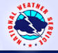

# NWS Brochures

> Source: <http://www.nws.noaa.gov/om/brochures.shtml>  
> Section: Weather Handbooks and Important Links  
> Captured: 2026-08-19 06:00 UTC (via Wayback Machine: https://web.archive.org/web/20151229151723/http://www.nws.noaa.gov/om/brochures.shtml)  
> PDF: [nws-brochures.pdf](nws-brochures.pdf) · Original HTML: [source/original.html](source/original.html)

---

[www.nws.noaa.gov](http://www.nws.noaa.gov/)

|  |  |  |  |
| --- | --- | --- | --- |
|  |  |  |  |
|  |

[Home](http://www.nws.noaa.gov/os/index.shtml)

[News](http://www.nws.noaa.gov/pa/)

[Organization](http://www.nws.noaa.gov/organization.php)

Search  

NWS

All NOAA

[Weather
Services](http://www.nws.noaa.gov/os/services.shtml)
    [Aviation](http://www.nws.noaa.gov/os/aviation.shtml),
[Climate](http://www.nws.noaa.gov/os/csd/index.shtml),
    [Hydro,](http://www.nws.noaa.gov/os/water/index.shtml)
[Public](http://www.nws.noaa.gov/os/msd/index.shtml#Fire)...

[Weather
Awareness](http://www.nws.noaa.gov/safety.php)
   [Floods](http://www.floodsafety.noaa.gov/index.shtml),
[Wind Chill](http://www.nws.noaa.gov/os/windchill/index.shtml),
   [Tornadoes](http://www.nws.noaa.gov/os/severeweather/index.shtml),
[Heat](http://www.weather.gov/os/heat/index.shtml)...

[Education](http://www.nws.noaa.gov/os/edures.shtml)
   [Weather
Terms](http://www.nws.noaa.gov/glossary/),
   [Teachers](http://www.nssl.noaa.gov/education/educators/), [Statistics](http://www.nws.noaa.gov/os/hazstats.shtml)

[Publications](http://www.nws.noaa.gov/os/publications.shtml)
    [Assessments](http://www.nws.noaa.gov/os/assessments/index.shtml),
    [Aware](http://www.nws.noaa.gov/os/Aware/index.shtml),
[Brochures](http://www.nws.noaa.gov/os/brochures.shtml)...

[Get Weather Info](http://www.nws.noaa.gov/om/disemsys.shtml)
    [Forecasts,](http://www.nws.noaa.gov/)
    [Past
Weather,](http://www.ncdc.noaa.gov/)
    [Weather
Radio](http://www.nws.noaa.gov/nwr/)...

[Other
Contacts](http://www.nws.noaa.gov/om/other_contacts.shtml)
    [NWS
Partners](http://www.nws.noaa.gov/im/)
    [Locate
NOAA Staff](https://nsd.rdc.noaa.gov/nsd/)
    [Map of NWS Offices](http://www.stormready.noaa.gov/contact.htm)
    [Key NWS Contacts](http://www.nws.noaa.gov/os/wcm-soo.pdf)
    [Coop Reps List](http://www.nws.noaa.gov/om/dapm_opl.pdf)     [Hydro Reps Map](http://www.weather.gov/om/water/hydromap.htm)

[Questions/Comments?](http://www.nws.noaa.gov/om/contact.shtml)
   

**Publications/Brochures/Booklets**

The NWS Office of Services produces outreach materials to help you prepare for weather emergencies. Many publications
are **ONLY** available online, no printed
copies are available. These publications say **DOWNLOAD**.
You can order printed copies of SOME of the publications from [your
local NWS Office](http://www.weather.gov/organization.php), the [NOAA Education Outreach Center](mailto:education@noaa.gov), or the [American
Red Cross](http://www.redcross.org/where/where.html). There is no charge for any of the publications. You
need a free copy of [Abobe
reader](http://www.weather.gov/nwsexit.php?site=nws&url=http://www.adobe.com/Acrobat/readstep.html&blurb=Adobe) to view pdf files.

[Aviation](#aviation)
[Boating/Marine](#boat)
[Children](#children)[Climate](#climate)[Cooperative Observer Program](#coop)[Digital Service](#digital)s
[Emergency Preparedness](#em)
[Floods](#floods)
[Heat](#heat)

[Hurricanes](#hurricanes)
[NOAA Weather Radio](#nwr)
[Rip Currents](#rip)[StormReady](#storm)
[Storm Spotters](#spotter) [Thunderstorms, Lightning, Tornadoes](#thunder)
[Tsunamis](#ts)
[Winter Storms](#winter)
 [Safety and Awareness Links](#other)

NOAA PA#

Publication

**Aviation**

Download
Download
96076

[Key to Aerodrome Forecast (TAF) and Aviation Routine Weather Report (METAR)](http://www.nws.noaa.gov/om/aviation/res/METAR-TAF Card.doc)
[National Aviation Brochure](http://www.weather.gov/aviation/images/Aviation Brochure_8.pdf)
[ASOS
Guide For Pilots](http://www.nws.noaa.gov/om/brochures/ASOS-book.pdf), pdf

  **Boating/Marine**

94058
NA

[Safe Boating Weather
Tips](http://www.nws.noaa.gov/om/brochures/safeboat.htm), pdf
[Marine Service
Charts](http://www.weather.gov/om/marine/pub.htm), Frequencies, schedules and locations of stations disseminating NWS products,
pdf

  **Children**

Download
Download
Download
Download
Download
Download
Download
Download
Download

[Billy
and Maria Coloring Book](http://www.nssl.noaa.gov/edu/bm/bm_main.html),
pdf
[Owlie Skywarn™:
Watch Out...Storms Ahead](http://www.nws.noaa.gov/om/brochures/owlie/Owlie11.pdf), pdf
[Owlie Skywarn](http://www.nws.noaa.gov/om/brochures/owlie/Owlie-tornadoes.pdf)[™](http://www.nws.noaa.gov/om/brochures/OwlieSkywarnBrochure.pdf)[:
Tornadoes](http://www.nws.noaa.gov/om/brochures/owlie-tornado.pdf),
pdf
[Owlie Skywarn](http://www.nws.noaa.gov/om/brochures/owlie/Owlie-Hurricanes.pdf)[™](http://www.nws.noaa.gov/om/brochures/OwlieSkywarnBrochure.pdf)[:
Hurricane](http://www.nws.noaa.gov/om/brochures/owlie-hurricane.pdf),
pdf
[Owlie Skywarn](http://www.nws.noaa.gov/om/brochures/owlie/Owlie-floods.pdf)[™](http://www.nws.noaa.gov/om/brochures/OwlieSkywarnBrochure.pdf)[:
Floods](http://www.nws.noaa.gov/om/brochures/owlie-floods.pdf), pdf
[Owlie Skywarn](http://www.nws.noaa.gov/om/brochures/owlie/Owlie-lightning.pdf)[™](http://www.nws.noaa.gov/om/brochures/OwlieSkywarnBrochure.pdf)[:
Lightning](http://www.nws.noaa.gov/om/brochures/owlie-lightning.pdf),
pdf
[Owlie Skywarn](http://www.nws.noaa.gov/om/brochures/owlie/Owlie-winter.pdf)[™](http://www.nws.noaa.gov/om/brochures/OwlieSkywarnBrochure.pdf)[:
Winter Storms](http://www.nws.noaa.gov/om/brochures/owlie-winter.pdf),
pdf
[How Do You Make a Weather Satellite](http://www.nws.noaa.gov/om/brochures/satelliteK_revA2.pdf),
pdf
[Weather Ranger Bookmark](http://www.srh.noaa.gov/media/serfc/WeatherRanger/wrfinal/default.shtml)

  **Climate**

Download
Download
Download
Download
Download
Download
Download
Download

[What
is Climate Change?](http://www.nws.noaa.gov/om/brochures/climate/Climatechange.pdf) [What is Drought?
2 Page Fact Sheet](http://www.nws.noaa.gov/om/brochures/climate/Drought2.pdf)[What is Drought?:
3 Page Fact Sheet](http://www.nws.noaa.gov/om/brochures/climate/DroughtPublic2.pdf)
[What is El Nino, La Nina
and ENSO?: 2 Page fact
sheet](http://www.nws.noaa.gov/om/brochures/climate/El_Nino.pdf) [What
is El Nino, La Nina and ENSO?: 4 Page fact sheet](http://www.nws.noaa.gov/om/brochures/climate/El_NinoPublic.pdf)
[What is the Local
3-Month Temperature Outlook (L3MTO):](http://www.nws.noaa.gov/om/brochures/climate/L3MTO_PFS2.pdf)  short
[What is the](http://www.nws.noaa.gov/om/brochures/climate/L3MTO_PFS2.pdf) [Local
3-month Temperature Outlook (L3MTO):](http://www.nws.noaa.gov/om/brochures/climate/L3MTO_PFS1.pdf) long
[NOAA’s Online
Weather Data ( NOWData) Factsheet](http://www.nws.noaa.gov/om/brochures/climate/NOWDATAactsheetD.pdf)

**Cooperative Observer Program**

Download

[Cooperative Observer Program](http://www.nws.noaa.gov/om/coop/Publications/CoopBrochure_IndesignVersion9.pdf) flyer/brochure

 **Digital Services**

Download
Download

[Digital Services Quadfold
Brochure:](http://www.nws.noaa.gov/om/brochures/ndfd-4panel.pdf) pdf -- *To print:
set page scaling to "none," paper to legal*)
[NWS Digital Services Operations Concept:
June 2004](http://www.weather.gov/ndfd/resources/dsconops0604-3.pdf), pdf

  **Emergency Preparedness**

20053
N/A
N/A

[StormReady](http://www.nws.noaa.gov/om/brochures/StormReady-brochure.PDF),
[StormReady Info](http://www.stormready.noaa.gov/)
[FEMA's
Emergency Preparedness Materials](http://www.ready.gov/publications), pdf
Red Cross: [Talking
About Disaster: Guide for Standard Messages](http://www.crh.noaa.gov/images/bis/AmericanRedCross_TalkingAboutDisaster.pdf), pdf

  **Floods**

Download
200850 
200753
200552
200465
200467
Download
Download
Download
Download

[Flood Safety for You and Your Family](http://www.nws.noaa.gov/om/resources/flood_brochure12A.pdf), pdf
[Guide to Hydrologic Information
on the Web](http://www.nws.noaa.gov/om/water/resources/Guide_to_Hydrologic_Information_Brochure.pdf), pdf
[Flood Preparation
and Flood Safety](http://www.nws.noaa.gov/om/water/resources/FloodSmartBrochure3.pdf) (Flood Insurance)
[Turn
Around Don't Drown™](http://www.weather.gov/os/water/tadd/images/NSC_FinalVersion1-4.pdf),
NWS/NSC version, pdf
[Tropical
Cyclone Flooding: A Deadly Inland Danger](http://www.weather.gov/om/water/ahps/pdfs/InlandFloodBrochure7F.pdf)
[Floods...The
Awesome Power](http://www.nws.noaa.gov/om/water/ahps/resources/FloodsTheAwesomePowerMay2010.pdf), pdf
Red Cross: [Preparing
for Floods](http://www.weather.gov/nwsexit.php?site=nws&url=http://www.redcross.org/portal/site/en/menuitem.86f46a12f382290517a8f210b80f78a0/?vgnextoid=fdb4510f935ea110VgnVCM10000030f3870aRCRD&vgnextfmt=default), pdf
Red Cross: [¿Está preparado
para una inundación o para una inundación súbita?](http://www.weather.gov/nwsexit.php?site=nws&url=http://www.cruzrojaamericana.org/general.asp?SN=200&OP=216&SUOP=245) **Espanol**
[Food and Water Safety
During
Hurricanes, Power Outages,
and Floods](http://www.nws.noaa.gov/om/hurricane/resources/FDAHurricaneNL.pdf)[Protección y seguridad del agua y los
alimentos en caso de huracán, corte
de energía eléctrica e inundaciones](http://www.nws.noaa.gov/om/hurricane/resources/FDAHurricaneNL-SPA.pdf)

  **Heat**

Download
Download

[Heat
Wave](http://www.weather.gov/om/brochures/heatwave.pdf): pdf, [Heat Wave: text
only](http://www.nws.noaa.gov/om/heat/heat_wave.shtml)
Red Cross: [Red Cross:](http://www.weather.gov/nwsexit.php?site=nws&url=http://www.redcross.org/images/pdfs/code/Heat%20_Heat%20Wave.pdf</a>               <font color=) [¿Está
usted preparado para una ola de calor?](http://www.weather.gov/nwsexit.php?site=nws&url=http://www.cruzrojaamericana.org/general.asp?SN=200&OP=216&SUOP=246) **Espanol**

  **Hurricanes**

201152
Download
200652
Download
200465
Download
Download
Download
Download
Download
Download
Download

[Tropical Cyclones: A Preparedness Guide, 4/13,](http://www.nws.noaa.gov/om/hurricane/resources/TropicalCyclones11.pdf) [Espanol](http://www.nws.noaa.gov/om/hurricane/resources/ciclones_tropicales11.pdf), [6/12](http://www.prh.noaa.gov/cphc/pages/pr5.php)Atlantic Hurricane Tracking
Chart: [pdf](http://www.nws.noaa.gov/om/hurricane/resources/HurricaneTrackingMap11-14.pdf), [eps](http://www.nws.noaa.gov/om/hurricane/resources/HurricaneTrackingMap11-14.EPS)
[Hurricane Safety Flyer:
Before, During and After a Hurricane](http://www.weather.gov/os/hurricane/resources/hurricane_safety.pdf), trifold pdf
[Hurricane Safety
Flyer: Before, During and After a Hurricane](http://www.weather.gov/os/hurricane/resources/hurricane-safety_flyer.pdf), flyer pdf
[Tropical Cyclone Flooding:
A Deadly Inland Danger](http://www.nws.noaa.gov/om/hurricane/resources/InlandFlooding.pdf)
[Introduction to Storm Surge](http://www.nws.noaa.gov/om/hurricane/resources/surge_intro.pdf), [Espanol](http://www.nws.noaa.gov/om/hurricane/resources/marejadaCiclonica_intro.pdf), 6/12
La Seguridad
de Tiempo: Los Huracanes, [pdf](http://www.weather.gov/os/hurricane/pdfs/hurricane-flyer-esp.pdf) or [htm](http://www.nws.noaa.gov/om/hurricane/resources/hurricane_flyer_espanol.htm) **Espanol**
[Hawaiian
Hurricane Safety Measures](http://www.prh.noaa.gov/cphc/pages/pr5.php) [Central Pacific Tracking Chart](http://www.prh.noaa.gov/cphc/pages/hurrsafety.php)
[Atlantic/Pacific Hurricane
Names](http://www.nhc.noaa.gov/aboutnames.shtml)
Red Cross Hurricane Safety Checklist, [English](http://www.nws.noaa.gov/om/hurricane/resources/Hurricane ENG.PDF), [Spanish](http://www.nws.noaa.gov/om/hurricane/resources/Hurricane SPA.PDF)
[East Pacific
Hurricane Tracking Map:](http://www.nhc.noaa.gov/EPAC_Track_chart.pdf) 12" x 24"

 **NOAA
Weather Radio (NWR)**

96053
96070

94062
[200352](http://www.weather.gov/nwr/resources/poster.pdf)
Download

NWR Decal
[NWR All Hazards Brochure (NOAA/PA 96070)](http://www.weather.gov/nwr/resources/NWR_Brochure_NOAA_PA_96070.pdf)
[NWR Stations Quadfold
Brochure](http://www.weather.gov/nwr/resources/NWR_Brochure_NOAA_PA_94062.pdf)
[NWR Poster Map](http://www.weather.gov/nwr/resources/poster.pdf)
[NOAA Weather Radio: Voice
of the National Weather Service](http://www.weather.gov/nwr/nwrback.htm), or [pdf](http://www.weather.gov/nwr/resources/nwr.pdf)

  **Rip Currents**

200455
200466

Break the Grip of the Rip brochure™: [INDD](http://www.ripcurrents.noaa.gov/brochures/rip_brochure_final.indd)  or [PDF,](http://www.ripcurrents.noaa.gov/brochures/rip_brochure_final.pdf)
Resaca! Escapese De La Resaca™: [INDD](http://www.ripcurrents.noaa.gov/brochures/Spanish_brochure_final.indd)  or [PDF](http://www.ripcurrents.noaa.gov/brochures/Spanish_brochure.pdf) **Espanol**

  **StormReady Program**

Download

StormReady/TsunamiReady Program Flyer, [PDF](http://www.nws.noaa.gov/om/brochures/Storm&TsunamiReadyHandout.pdf)

  **Thunderstorms, Lightning,
and Tornadoes**

Download
Download
Download
Download
Download
Download

The Dr Lightning Show: [Intro, Victims, Safety, Science](http://www.nws.noaa.gov/om/lightning/science/Dr_Lightning_Guide-science.ppsx) (ppt, animated) [Thunderstorms,
Tornadoes, Lightning...Nature's Most Violent Storms: pdf](http://www.nws.noaa.gov/om/severeweather/resources/ttl6-10.pdf)
[Lightning Safety for You and Your Family](http://www.nws.noaa.gov/om/lightning/resources/lightning-safety.pdf)
Fact About Lightning, [pdf
color](http://www.nws.noaa.gov/om/lightning/resources/LightningFactsSheet.pdf)
Red Cross: [Preparing for a Tornado](http://www.weather.gov/nwsexit.php?site=nws&url=http://www.redcross.org/portal/site/en/menuitem.86f46a12f382290517a8f210b80f78a0/?vgnextoid=62a7da30df3ea110VgnVCM10000030f3870aRCRD&vgnextfmt=default)
Red Cross: [Preparación
para tornado](http://www.weather.gov/nwsexit.php?site=nws&url=http://www.cruzrojaamericana.org/general.asp?SN=200&OP=216&SUOP=250)

 **Tsunami**

201455
Download
Download
Download
Download
Download
Download
Download
Download
Website

[Tsunami Bookmark](http://www.nws.noaa.gov/om/Tsunami/resources/TsunamiBookmark.pdf), pdf
Tsunami Awareness and Safety Fact Sheet, pdf[—Two-Pager](http://nws.weather.gov/nthmp/documents/nthmpsafety.pdf), [Trifold](http://nws.weather.gov/nthmp/documents/nthmpsafetytrifold.pdf)
[Tsunami Zone Brochure](http://www.stormready.noaa.gov/tsunamiready/resources/Tsmi_Brochure10.pdf)NOAA Tsunami Program Fact Sheet (4 pages, 11x17 folded), pdf— [English](http://www.nws.noaa.gov/om/Tsunami/resources/NOAATsunamiProgramSpread.pdf) | [Spanish](http://www.nws.noaa.gov/om/Tsunami/resources/NOAATsunamiProgramSpreadSP.pdf) | [French](http://www.nws.noaa.gov/om/Tsunami/resources/NOAATsunamiProgramSpreadFR.pdf)
NOAA Tsunami Program Fact Sheet (4 pages, 8 1/2x11), pdf—[English](http://www.nws.noaa.gov/om/Tsunami/resources/NOAATsunamiProgramSingle.pdf) | [Spanish](http://www.nws.noaa.gov/om/Tsunami/resources/NOAATsunamiProgramSingleSP.pdf) | [French](http://www.nws.noaa.gov/om/Tsunami/resources/NOAATsunamiProgramSingleFR.pdf)
[Tsunami Awareness and Safety Fact Sheet](http://nws.weather.gov/nthmp/tsunamisafety.html)
[Tsunami, The Great Waves](http://itic.ioc-unesco.org/index.php?option=com_content&view=article&id=1169&Itemid=2017) (2012), pdf (multiple languages)[Pacific Tsunami Warning and Mitigation System](http://itic.ioc-unesco.org/images/docs/ptws_brochure_en_20130308.pdf), pdf[International Tsunami Information Center (ITIC) Brochure](http://itic.ioc-unesco.org/images/docs/ITIC_Brochure.pdf), pdf[Tsunami Awareness and Education Resources](http://itic.ioc-unesco.org/index.php?option=com_content&view=category&layout=blog&id=1075&Itemid=1075) (ITIC)

 **Winter
Storms**

200160
91003

[Winter Storms...The
Deceptive Killers](http://www.nws.noaa.gov/om/winter/resources/Winter_Storms2008.pdf),
pdf
Red Cross: [Preparing
for a Winter Storm](http://www.weather.gov/nwsexit.php?site=nws&url=http://www.redcross.org/portal/site/en/menuitem.86f46a12f382290517a8f210b80f78a0/?vgnextoid=91435d795323b110VgnVCM10000089f0870aRCRD&vgnextfmt=default),
pdf
Red Cross: [Preparación
para tormenta de inviernoeparacion para](http://www.weather.gov/nwsexit.php?site=nws&url=http://www.cruzrojaamericana.org/general.asp?SN=200&OP=216&SUOP=248)

 **Storm Spotter Materials**

Download
Download
Download
Download

Sky Watcher Spotter Cloud Poster/Chart, [jpg](http://www.nws.noaa.gov/om/brochures/cloudchart.jpg), [pdf](http://www.nws.noaa.gov/om/brochures/cloudchart.pdf), [high
resolution](http://www.nws.noaa.gov/om/brochures/cloudchart-hres.pdf)
Guía De Observaciόn de la Nubes, [jpg](http://www.nws.noaa.gov/om/brochures/cloud_chart_highres_esp.jpg), [pdf](http://www.nws.noaa.gov/om/brochures/Cloudchart_ESP.pdf), [high resolution](http://www.nws.noaa.gov/om/brochures/cloud_chart_highres_esp.pdf)
[Citizen Scientist:
Cooperative Observer and Spotter Programs](http://www.nws.noaa.gov/om/brochures/Citizen_Scientist.pdf), pdf  [Weather Spotters
Guide](http://www.nws.noaa.gov/om/brochures/SGJune6-11.pdf), pdf, [Espanol](http://www.nws.noaa.gov/om/brochures/Weather_Spotter's_Field_Guide_in_Spanish.pdf)
***Printed copies of Spotter's Guides
available only to NWS staff to distribute at training classes.*** *For information on free SKYWARN spotter training, [contact your local office](http://www.stormready.noaa.gov/contact.shtml).* Look for the SKYWARN link on the left navigation bar.

Other information regarding disaster preparedness and education can be found on the Web pages of other federal agencies and NWS partners:

- [American Red Cross](http://www.weather.gov/nwsexit.php?site=nws&url=http://www.redcross.org/pubs/dspubs/cde.html)
- [Federal Emergency Management Agency](http://www.weather.gov/nwsexit.php?site=nws&url=http://www.fema.gov/library/):
  - [Ready.gov](http://www.ready.gov/are-you-ready-guide)
- [Coalition of Organizations for Disaster Education](http://www.redcross.org/disaster/disasterguide/)
- [United States Geological Survey](http://www.weather.gov/nwsexit.php?site=nws&url=http://www.usgs.gov/pubprod/) (earthquakes)
- [DisasterAssistance.gov](http://www.disasterassistance.gov/)

and at other NOAA offices:

- [NOAA Education Resources](http://www.education.noaa.gov/)
- [NOAA Satellites and Information](http://www.nesdis.noaa.gov/EducationOutreach.html)
- [NOAA Fisheries](http://www.nmfs.noaa.gov/pr/publications/)
- [NOAA Ocean Service](http://oceanservice.noaa.gov/outreach/welcome.html)
- [NOAA Research](http://www.oar.noaa.gov/education/)
- [NOAA Marine & Aviation Operations](http://www.omao.noaa.gov/publications.html)

---

[NOAA](http://www.noaa.gov/), [National
Weather Service](http://www.weather.gov)
[Office of Climate, Water, and
Weather Services](http://www.weather.gov/os/)
1325 East West Highway
Silver Spring, MD 20910
[Questions? Comments?](http://www.weather.gov/os/contact.shtml)

[Disclaimer](http://www.nws.noaa.gov/disclaimer.php)
[Help/Viewers](http://www.weather.gov/help)
[Glossary](http://w1.weather.gov/glossary/)

[Privacy Policy](http://www.weather.gov/privacy)
[About Us](http://www.weather.gov/about)
[Career Opportunities](http://www.weather.gov/careers)

Last Updated: December 22, 2015
