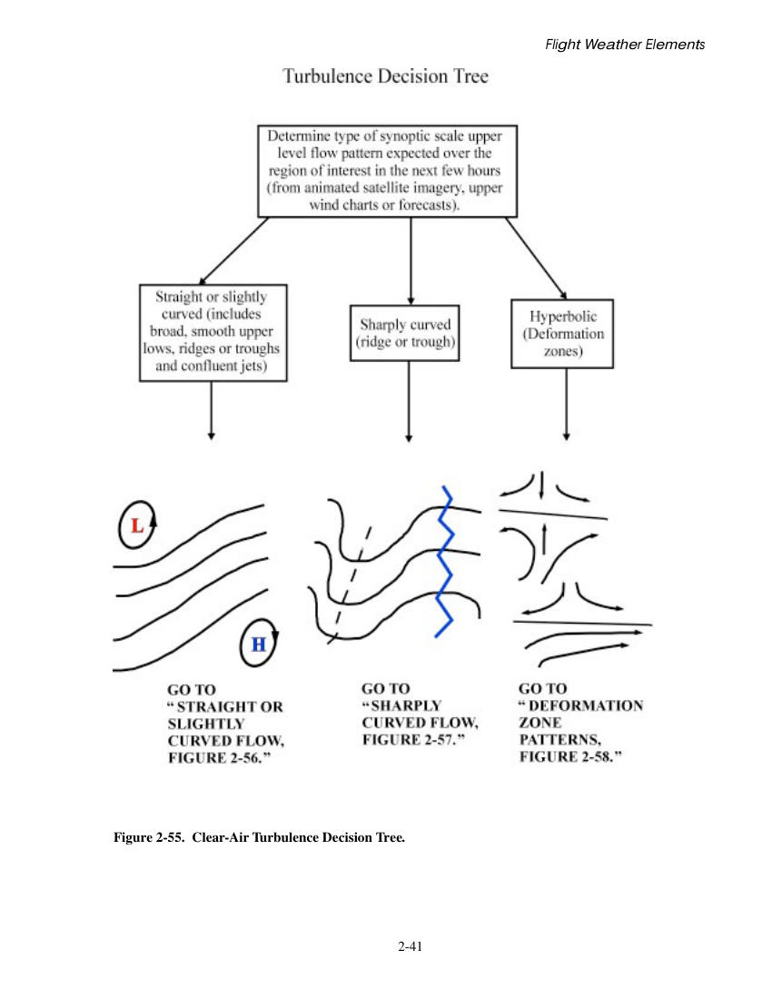
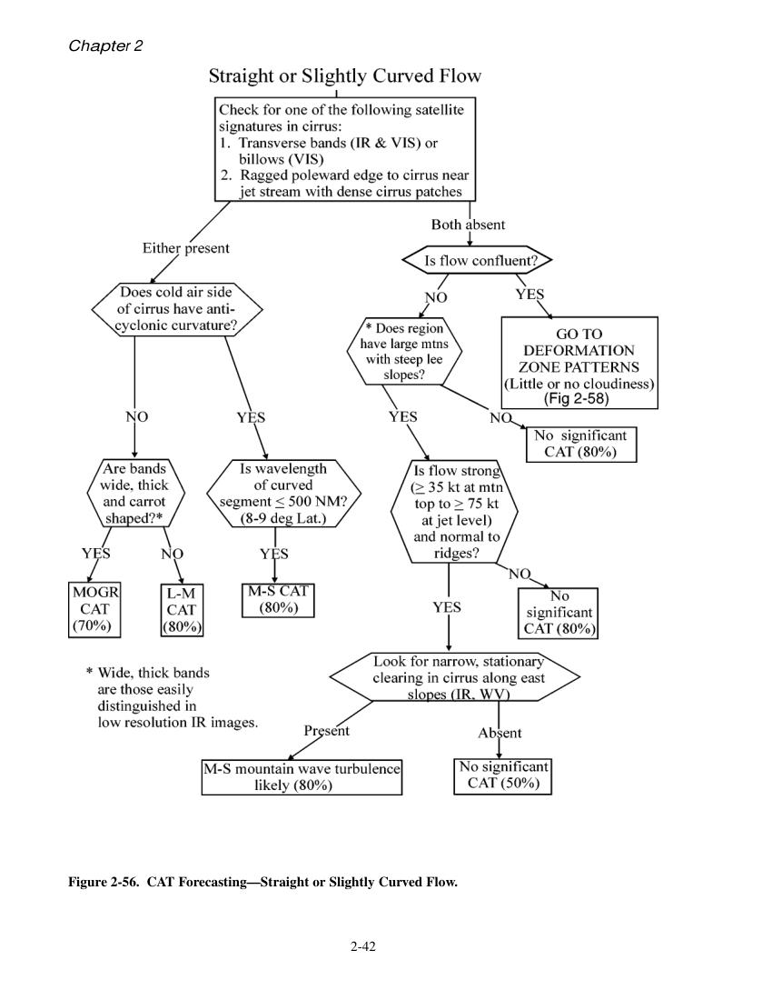
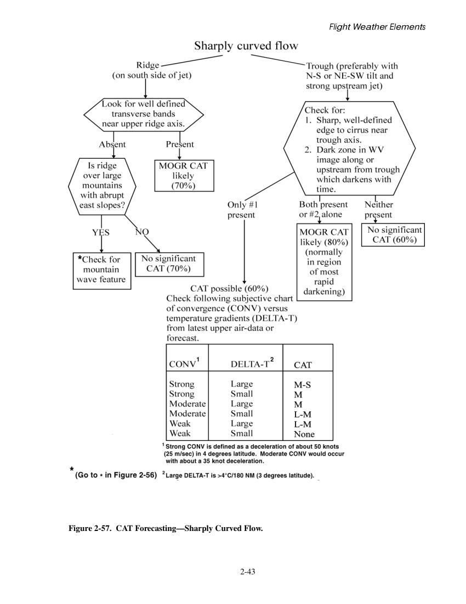
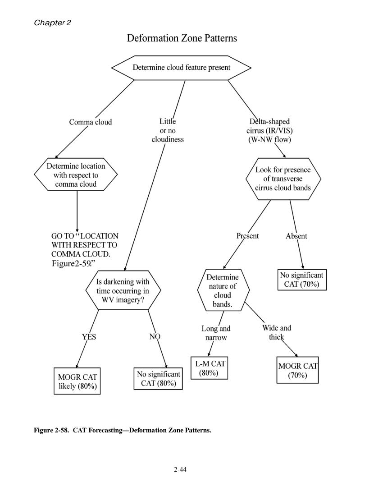
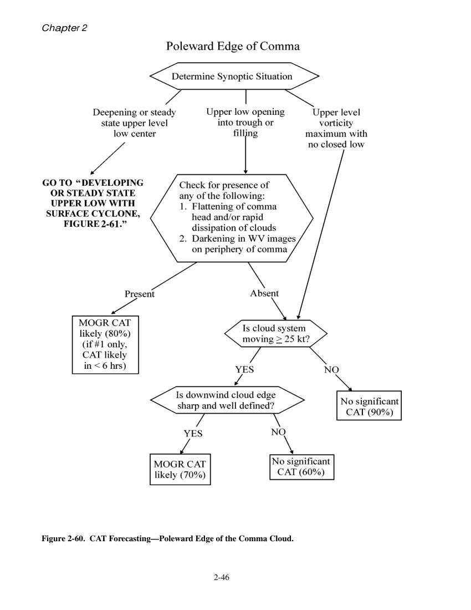
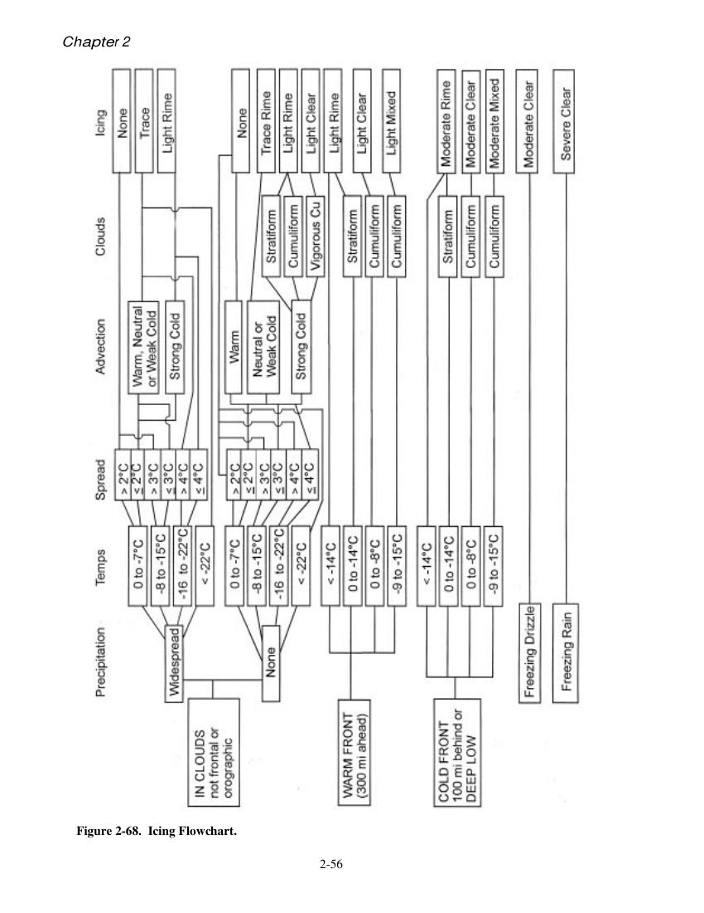

# U.S. Air Force -  Meteorological Techniques

> Source: <http://www.weather.gov/media/zhu/ZHU_Training_Page/Met_Tutorials/Meteorological_Techniques.pdf>  
> Section: Weather Handbooks and Important Links  
> Captured: 2026-08-19 06:00 UTC  
> PDF: [u-s-air-force-meteorological-techniques.pdf](u-s-air-force-meteorological-techniques.pdf) (242 pages)

---

## Page 1

i
AFWA TN-98/002  15 JULY 1998
Air Force Weather Agency/DNT
Offutt Air Force Base, Nebraska 68113
Meteorological
Techniques
This technical note is a compilation of
various techniques in forecasting
 - Surface Weather Elements,
 - Flight Weather Elements, and
 - Convective Weather
AFWA TN-98/002  15 JULY 1998
Air Force Weather Agency/DNT
Offutt Air Force Base, Nebraska 68113
Meteorological
Techniques
This technical note is a compilation of
various techniques in forecasting
 - Surface Weather Elements,
 - Flight Weather Elements, and
 - Convective Weather
APPROVED FOR PUBLIC RELEASE; DISTRIBUTION IS UNLIMITED.
APPROVED FOR PUBLIC RELEASE; DISTRIBUTION IS UNLIMITED.

## Page 2

ii
REVIEW AND APPROVAL STATEMENT
AFWA/TN—98/002,  Meteorological Techniques, 15 July 1998, has been reviewed and is approved for public
release.  There is no objection to unlimited distribution of this document to the public at large, or by the Defense
Technical Information Center (DTIC) to the National Technical Information Service (NTIS).
______________________________
LARRY E. FREEMAN, Colonel, USAF
Director of Air and Space Sciences
FOR THE COMMANDER
_____________________________
JAMES S. PERKINS
Scientific and Technical Information
Program Manager
15 July 1998

## Page 3

iii
REPORT DOCUMENTATION PAGE
2.  Report Date:  15 July 1998
3.  Report Type:  Technical Note
4.  Title:  Meteorological Techniques
6.  Authors:  Capt Maria Reymann, Capt Joe Piasecki, MSgt Fizal Hosein, MSgt Salinda
Larabee, TSgt Greg Williams, Mike Jimenez, Debbie Chapdelaine
7.  Performing Organization Names and Address:  Air Force Weather Agency (AFWA),
Offutt  AFB IL
8.  Performing Organization Report Number:  AFWA/TN—98/002
12.  Distribution/Availability Statement:  Approved for public release; distribution is
unlimited.
13.  Abstract:  Contains weather forecasting techniques of interest to military
meteorologists, in three sections:  surface weather elements, flight weather elements,
and severe weather.  Includes both general and geographically specific rules of thumb,
results of research, lessons learned from experience, etc, gathered from military and
other sources.  Update to earlier Air Weather Service Manual 105-56 “Forecasting
Techniques.”
14.  Subject Terms:  ATMOSPHERIC PRESSURE, ATMOSPHERIC STABILITY,
CLIMATOLOGY, CLOUDS, CONTRAILS, D-VALUES, ICING, PRECIPITATION,
SEVERE WEATHER, TEMPERATURE, THUNDERSTORM, TORNADO,
TURBULENCE, VISIBILITY, WIND
15:  Number of Pages:  242
17.  Security Classification of Report:  UNCLASSIFIED
18.  Security Classification of this Page:  UNCLASSIFIED
19.  Security Classification of Abstract:  UNCLASSIFIED
20.  Limitation of Abstract:  UL
Standard Form 298

## Page 4

iv
TABLE OF CONTENTS
Abstract ........................................................................................................................................................... iii
List of Figures ................................................................................................................................................. vi
List of Tables .................................................................................................................................................... x
Preface ............................................................................................................................................................ xii
Acknowledgement.......................................................................................................................... xiii
Chapter 1.  Surface Weather Elements ...................................................................................................... 1-1
I.  Visibility............................................................................................................................................... 1-1
A. Dry Obstructions ........................................................................................................................... 1-1
B. Moist Obstructions ........................................................................................................................ 1-1
C. Visibility Forecasting Rules of Thumb ......................................................................................... 1-3
D. Forecasting Aids/Techniques....................................................................................................... 1-17
II.  Precipitation ..................................................................................................................................... 1-23
A. General Guidance ........................................................................................................................ 1-23
B. Model Guidance .......................................................................................................................... 1-27
C. Determining Precipitation Type .................................................................................................. 1-27
D. Forecasting Rainfall Amounts ..................................................................................................... 1-34
E. Snowfall....................................................................................................................................... 1-38
III.  Surface Winds ................................................................................................................................. 1-51
A. Wind Basics ................................................................................................................................. 1-51
B. General Tools for Forecasting Surface Winds ............................................................................. 1-52
C. Specialized Airfield Operations Topics ....................................................................................... 1-62
D. Forecasting Gusty Surface Winds in the United States............................................................... 1-66
E. Additional Regional Wind Forecasting Guidance ....................................................................... 1-73
IV.  Temperature ..................................................................................................................................... 1-84
A. General Temperature Forecasting Tools...................................................................................... 1-84
B. Maximum Temperature Forecasts ............................................................................................... 1-86
C. Minimum Temperature Forecasts................................................................................................ 1-88
D. Some Additional Rules of Thumb ............................................................................................... 1-88
E. Temperature Indices .................................................................................................................... 1-89
V.  Pressure............................................................................................................................................. 1-93
A. General Guidance ........................................................................................................................ 1-93
B. Pressure-Related Parameters ....................................................................................................... 1-94
Chapter 2.  Flight Weather Elements ......................................................................................................... 2-1
I.  Clouds .................................................................................................................................................. 2-1
A. Cloud Types/States of the Sky....................................................................................................... 2-1
B. General Forecasting Tools ............................................................................................................. 2-3

## Page 5

v
C. Cloud Forecasting Techniques ...................................................................................................... 2-6
D. Regional Guidance ...................................................................................................................... 2-13
II.  Turbulence ........................................................................................................................................ 2-20
A. Levels of Intensity ....................................................................................................................... 2-20
B. Aircraft Turbulence Sensitivities................................................................................................. 2-21
C. Causes of Turbulence .................................................................................................................. 2-22
D. Clear Air Turbulence ................................................................................................................... 2-23
E. Mountain Wave Turbulence......................................................................................................... 2-31
F Wake Turbulence ......................................................................................................................... 2-34
G. Forecasting Aids .......................................................................................................................... 2-35
III.  Aircraft Icing ................................................................................................................................... 2-48
A. Icing Processes and Classification .............................................................................................. 2-48
B. Variables for Determining Icing Accumulation .......................................................................... 2-50
C. Meteorological Considerations ................................................................................................... 2-50
D. Products and Procedures ............................................................................................................. 2-54
E. Standard System Applications..................................................................................................... 2-57
F. Methods and Rules of Thumb for the –8D Procedure ................................................................ 2-58
G. Summary ..................................................................................................................................... 2-59
IV.  Miscellaneous Weather Elements.................................................................................................... 2-60
A. Flight Level and Climb Winds .................................................................................................... 2-60
B. Temperature................................................................................................................................. 2-61
C. Thunderstorms............................................................................................................................. 2-61
D. Contrails ...................................................................................................................................... 2-62
E. D-values....................................................................................................................................... 2-64
Chapter 3.  Convective Weather .................................................................................................................. 3-1
I. Thunderstorms ...................................................................................................................................... 3-1
A. Thunderstorm Types ...................................................................................................................... 3-1
II.  Synoptic Patterns. ............................................................................................................................... 3-4
A.  Five Classic Synoptic Convective Weather Patterns. ................................................................... 3-5
III. Convective Weather Tools ................................................................................................................ 3-12
A. Stability Indices........................................................................................................................... 3-12
B. Evaluation and Techniques .......................................................................................................... 3-17
References................................................................................................................................................. BIB-1
Abbreviations and Acronyms ..................................................................................................................... A-1
Glossary ...................................................................................................................................................... B-1
Subject Index ............................................................................................................................ IND-1

## Page 6

vi
FIGURES
Figure 1-1.
Whiteout Conditions ............................................................................................................... 1-2
Figure 1-2.
Pre-frontal Fog  Associated with Warm Fronts....................................................................... 1-9
Figure 1-3.
Post-frontal Fog Associated with Slow-Moving Cold Fronts............................................... 1-10
Figure 1-4.
Radiation Fog........................................................................................................................ 1-11
Figure 1-5.
Continental Shelf in the Northern Gulf of Mexico ............................................................... 1-15
Figure 1-6.
Wintertime Synoptic Pattern for Sea Fog over the Northern Gulf of Mexico...................... 1-15
Figure 1-7a.
Occurrence of Sea Fog.......................................................................................................... 1-16
Figure 1-7b.
Occurrence of Sea Fog.......................................................................................................... 1-16
Figure 1-7c.
Occurrence of Sea Fog.......................................................................................................... 1-16
Figure 1-8.
Occurrence of Steam Fog ..................................................................................................... 1-17
Figure 1-9.
Graphical Method of Determining Fog Occurrence ............................................................. 1-18
Figure 1-10.
Skew-T Method for Estimating the Top of Radiation Fog ................................................... 1-20
Figure 1-11.
Thermal Ribbon Spacing ...................................................................................................... 1-24
Figure 1-12.
Widespread Precipitation Scenario....................................................................................... 1-24
Figure 1-13.
The 500-mb Product ............................................................................................................. 1-25
Figure 1-14.
Overrunning Associated with a Typical Cyclone.................................................................. 1-26
Figure 1-15.
Overrunning Precipitation Associated with a Stationary Front. ........................................... 1-26
Figure 1-16.
Equal Probability of Liquid or Frozen Precipitation. ........................................................... 1-28
Figure 1-17.
Probability of Precipitation being Frozen Versus Liquid...................................................... 1-28
Figure 1-18.
 Method 2. ............................................................................................................................. 1-29
Figure 1-19.
Determining Precipitation Type by Comparing Thickness................................................... 1-30
Figure 1-20.
Precipitation-Type Nomogram. ............................................................................................ 1-30
Figure 1-21.
Precipitation-Type Nomogram. ............................................................................................ 1-30
Figure 1-22.
Computation of Wet-bulb Temperature at 850 mb ............................................................... 1-31
Figure 1-23.
Computation of Wet-bulb Temperature at 1000 mb. ............................................................ 1-31
Figure 1-24.
Expected Precipitation Type Based on Wet-bulb Temperatures. .......................................... 1-32
Figure 1-25a. Maximum Precipitation when the 850-mb Trough is West of the 100o Meridian................ 1-35
Figure 1-25b. Maximum Precipitation when the 850- mb Trough is West of the 100o Meridian ............... 1-35
Figure 1-26a. Maximum Precipitation, 850 mb Trough East of 100o Meridian ......................................... 1-36
Figure 1-26b. Maximum Precipitation, 850 mb Trough East of 100o Meridian ......................................... 1-36
Figure 1-27.
Snow Index (200 mb) Example ............................................................................................ 1-39
Figure 1-28a. A 1200Z Surface Pattern...................................................................................................... 1-45
Figure 1-28b. Surface Pattern 24 Hours Later............................................................................................. 1-46
Figure 1-29a. The 1200Z 500-mb Pattern. .................................................................................................. 1-46
Figure 1-29b. The 500-mb Pattern 24 Hours Later. .................................................................................... 1-46
Figure 1-30.
Heavy Snow Track Pattern 1................................................................................................. 1-47
Figure 1-31.
Heavy Snow Track Pattern 2................................................................................................. 1-47
Figure 1-32.
Heavy Snow Track Pattern 3................................................................................................. 1-48
Figure 1-33.
The 500-mb Trough and Associated Snow Areas ................................................................. 1-50
Figure 1-34.
Occluded Front and Location of Snow ................................................................................. 1-50
Figure 1-35.
Example of a Trend Chart Used to Forecast “Persistent” Winds.......................................... 1-53
Figure 1-36.
Pressure Gradient Method for Determining Surface Winds. ................................................ 1-53
Figure 1-37.
 Isallobaric Flow.................................................................................................................... 1-54
Figure 1-38a. Variation of Isallobaric Winds by Latitude (25°N) .............................................................. 1-55
Figure 1-38b. Variation of Isallobaric Winds by Latitude (35°N)............................................................... 1-55
Figure 1-38c. Variation of Isallobaric Winds by Latitude (45°N)............................................................... 1-55
Figure 1-38d. Variation of Isallobaric Winds by Latitude (55°N)............................................................... 1-55
Figure 1-38e. Variation of Isallobaric Winds by Latitude (65°N)............................................................... 1-55
Figure 1-38f. Variation of Isallobaric Winds by Latitude (75°N)............................................................... 1-55

## Page 7

vii
Figure 1-39.
Open-Cell Cumulus Shapes .................................................................................................. 1-58
Figure 1-40.
Strongest Winds in an Extratropical Cyclone. ...................................................................... 1-59
Figure 1-41.
Low-level Wind Shear Decision Tree ................................................................................... 1-63
Figure 1-42.
High Wind Warning Decision Tree for the Northeast United States. ................................... 1-67
Figure 1-43.
High Wind Warning Decision Tree for North Texas. ............................................................ 1-68
Figure 1-44.
Location of “Notorious Wind Boxes.” .................................................................................. 1-69
Figure 1-45.
Bradshaw AAF, Hawaii Trade Wind Peak Gust Flowchart. ................................................. 1-76
Figure 1-46.
Major Wind Systems and Local Names for European Winds .............................................. 1-77
Figure 1-47.
Southerly Foehn in the European Alpine Region. ................................................................ 1-79
Figure 1-48.
Typical Synoptic Situation Causing an Etesian Wind. ......................................................... 1-80
Figure 1-49.
Typical Synoptic Situation Associated with a Sirocco ......................................................... 1-81
Figure 1-50a. Typical Synoptic Situation Associated with a Cyclonic Bora in the Adriatic Sea................ 1-82
Figure 1-50b. Typical Synoptic Situation Associated with an Anticyclonic Bora in the Adriatic Sea........ 1-83
Figure 1-51.
Sample Temperature Forecasting Checklist.  . ..................................................................... 1-87
Figure 1-52.
Heat Index ............................................................................................................................. 1-90
Figure 1-53.
Fighter Index of Thermal Stress (FITS) Chart ..................................................................... 1-91
Figure 1-54.
Index of Thermal Stress (ITS) Chart. ................................................................................... 1-92
Figure 1-55a. Wind Chill Index Charts. ..................................................................................................... 1-92
Figure 1-55b. Wind Chill Index Charts. ...................................................................................................... 1-93
Figure 1-56.
Pressure Conversion Chart .................................................................................................... 1-96
Figure 1-57.
Density Altitude Computation Chart .................................................................................... 1-98
Figure 1-58.
D-Value Computation Chart ................................................................................................. 1-99
Figure 2-1.
Cloud Types with Frontal Waves. ........................................................................................... 2-3
Figure 2-2.
 Nephanalysis Example........................................................................................................... 2-5
Figure 2-3.
 MCL Calculations.................................................................................................................. 2-7
Figure 2-4.
Parcel Method. ........................................................................................................................ 2-7
Figure 2-5.
RH and OVV graph................................................................................................................. 2-8
Figure 2-6.
Dissipation of Stratus Using Mixing Ratio and Temperature............................................... 2-10
Figure 2-7.
Rule A1 ................................................................................................................................. 2-11
Figure 2-8.
Rule A2 ................................................................................................................................. 2-11
Figure 2-9.
Rule A3. ................................................................................................................................ 2-11
Figure 2-10.
Rule A4. ................................................................................................................................ 2-11
Figure 2-11.
Rule A5 ................................................................................................................................. 2-11
Figure 2-12.
Rule A6. ................................................................................................................................ 2-11
Figure 2-13.
Rule A7. ................................................................................................................................ 2-11
Figure 2-14.
Rule A8. ................................................................................................................................ 2-11
Figure 2-15.
Rule A9. ................................................................................................................................ 2-11
Figure 2-16.
Rule A10. .............................................................................................................................. 2-11
Figure 2-17.
Rule A11. .............................................................................................................................. 2-11
Figure 2-18.
Rules A12 and A13. .............................................................................................................. 2-11
Figure 2-19.
Rule A14. .............................................................................................................................. 2-11
Figure 2-20.
Tropopause Method of Forecasting Cirrus. .......................................................................... 2-13
Figure 2-21.
FOEU Bulletin Example. ...................................................................................................... 2-14
Figure 2-22.
Typical Cold-Air Stratocumulus/Stratus Scenario. .............................................................. 2-15
Figure 2-23.
Southwest to Northeast Stationary Front.............................................................................. 2-15
Figure 2-24.
Stationary Front 24 Hours Later. .......................................................................................... 2-16
Figure 2-25.
Advection of Gulf Stratus with a LLJ................................................................................... 2-17
Figure 2-26.
Typical Gulf Stratus Coverage. ............................................................................................. 2-17
Figure 2-27.
Type 1 Gulf Stratus Advection.............................................................................................. 2-18

## Page 8

viii
Figure 2-28.
Type 2 Gulf Stratus Advection.............................................................................................. 2-18
Figure 2-29.
Type 3 Gulf Stratus Advection.............................................................................................. 2-19
Figure 2-30.
Gulf Stratus Advection Track. .............................................................................................. 2-19
Figure 2-31a. CAT and Surface Cyclogenesis............................................................................................. 2-23
Figure 2-31b. CAT and Surface Cyclogenesis North of the Main Jet. ........................................................ 2-23
Figure 2-32a. CAT and upper-level lows..................................................................................................... 2-24
Figure 2-32b. CAT and upper-level lows..................................................................................................... 2-24
Figure 2-32c. CAT and upper-level lows..................................................................................................... 2-24
Figure 2-32d. CAT and upper-level lows..................................................................................................... 2-24
Figure 2-33.
CAT and the Shear Line in the Throat of an Upper-Level Low............................................ 2-25
Figure 2-34.
United Airlines Jet Stream Turbulence Model...................................................................... 2-25
Figure 2-35.
CAT and Diffluent Wind Patterns. ........................................................................................ 2-26
Figure 2-36.
CAT and Strong Winds ......................................................................................................... 2-26
Figure 2-37.
Turbulence with Confluent Jets. ........................................................................................... 2-26
Figure 2-38.
Two Basic Cold-Air Advection Patterns Conducive to CAT. ............................................... 2-27
Figure 2-39.
Common Open-Isotherm CAT. ............................................................................................. 2-27
Figure 2-40a. CAT in Thermal Troughs ......................................................................................................2-28
Figure 2-40b. CAT in Thermal Troughs. ..................................................................................................... 2-28
Figure 2-41.
Closed Isotherm CAT. ........................................................................................................... 2-28
Figure 2-42.
CAT and Shearing Troughs................................................................................................... 2-29
Figure 2-43.
CAT Associated with Strong Wind Maximum to Rear of the Upper Trough....................... 2-29
Figure 2-44.
CAT in a Deep 500-mb Pressure Trough. ............................................................................. 2-29
Figure 2-45.
Double Trough Configuration............................................................................................... 2-30
Figure 2-46.
CAT and Upper-Air Ridges. ................................................................................................. 2-31
Figure 2-47a. Mountain-Wave Clouds. ...................................................................................................... 2-31
Figure 2-47b. Mountain-Wave Clouds. ....................................................................................................... 2-32
Figure 2-48.
 Mountain-Wave Nomogram. ............................................................................................... 2-32
Figure 2-49.
Mountain-Wave Cloud Structure .......................................................................................... 2-33
Figure 2-50.
Graph of Mountain-Wave Potential. ..................................................................................... 2-34
Figure 2-51.
Forecasting Checklist for Low-Level Turbulence................................................................. 2-35
Figure 2-52.
Turbulence Forecasting from Skew-T. .................................................................................. 2-36
Figure 2-53.
Turbulence Nomogram—Temperature Gradient and Surface Winds................................... 2-37
Figure 2-54.
CAT in a Deformation Zone. ................................................................................................ 2-39
Figure 2-55.
Clear-Air Turbulence Decision Tree. .................................................................................... 2-41
Figure 2-56.
CAT Forecasting—Straight or Slightly Curved Flow. .......................................................... 2-42
Figure 2-57.
CAT Forecasting—Sharply Curved Flow. ............................................................................ 2-43
Figure 2-58.
CAT Forecasting—Deformation Zone Patterns.................................................................... 2-44
Figure 2-59.
CAT Forecasting—with Respect to Comma Cloud. ............................................................. 2-45
Figure 2-60.
CAT Forecasting—Poleward Edge of the Comma Cloud. ................................................... 2-46
Figure 2-61.
CAT Forecasting—Developing or Steady State Upper-Low with Surface Cyclones.......... 2-47
Figure 2-62.
Icing Type Based on Temperature. ....................................................................................... 2-49
Figure 2-63.
Cumuliform Cloud Icing Locations...................................................................................... 2-51
Figure 2-64.
Icing with a Warm Front. ...................................................................................................... 2-52
Figure 2-65.
Icing with a Cold Front......................................................................................................... 2-52
Figure 2-66.
Intake Icing. .......................................................................................................................... 2-53
Figure 2-67.
Carburetor Icing. ................................................................................................................... 2-53
Figure 2-68.
Icing Flowchart. .................................................................................................................... 2-56
Figure 2-69.
Typical Icing Areas in a Mature Cyclone. ............................................................................ 2-57
Figure 2-70.
Bright Band Identification Using the WSR-88D. ................................................................. 2-57
Figure 2-71.
Example of -8D Method. ...................................................................................................... 2-59

## Page 9

ix
Figure 2-72.
Increasing Wind Speed Pattern ............................................................................................. 2-60
Figure 2-73.
Decreasing Wind Speed Pattern............................................................................................ 2-60
Figure 2-74.
Jet Contrail Curves on Skew-T. ............................................................................................ 2-63
Figure 3-1.
Single-Cell Storm Hodograph. ............................................................................................... 3-1
Figure 3-2.
Typical Multicell Storm Hodograph. ...................................................................................... 3-1
Figure 3-3.
Supercell Hodograph. ............................................................................................................. 3-2
Figure 3-4.
Classic Supercell..................................................................................................................... 3-2
Figure 3-5.
Typical High Precipitation (HP) Supercell. ............................................................................ 3-3
Figure 3-6.
Low Precipitation (LP) Supercell. .......................................................................................... 3-3
Figure 3-7a.
Dry Microburst Atmospheric Profile. ..................................................................................... 3-4
Figure 3-7b.
Wet Microburst Atmospheric Profile. ..................................................................................... 3-4
Figure 3-7c.
Hybrid Microburst Atmospheric Profile. ................................................................................ 3-4
Figure 3-8.
Type “A” Thunderstorm Pattern. ............................................................................................ 3-6
Figure 3-9.
Type “B” Thunderstorm Pattern. ............................................................................................ 3-7
Figure 3-10.
Type “C” Tthunderstorm Pattern ............................................................................................ 3-9
Figure 3-11.
Type “D” Thunderstorm Pattern ........................................................................................... 3-10
Figure 3-12.
Type “E” Thunderstorm Pattern............................................................................................ 3-11
Figure 3-13.
Line Echo Wave Pattern, Bow Echo Evolution. ................................................................... 3-21
Figure 3-14.
Bow Echo.............................................................................................................................. 3-21
Figure 3-15.
T2 Gust Computation Chart.................................................................................................. 3-25
Figure 3-16.
Gust Potential Graph............................................................................................................. 3-25
Figure 3-17.
Hail Prediction Chart. ........................................................................................................... 3-27
Figure 3-18.
Skew-T Chart. ....................................................................................................................... 3-27
Figure 3-19.
Preliminary hail size nomogram........................................................................................... 3-27
Figure 3-20.
Final Hail Size Nomogram. .................................................................................................. 3-28

## Page 10

x
TABLES
Table 1-1.
Conditions favorable for the generation and advection of dust .............................................. 1-3
Table 1-2.
Visibility limits based on precipitation intensity .................................................................... 1-6
Table 1-3.
Central Europe radiation fog timing guidance ..................................................................... 1-11
Table 1-4.
Guidelines for forecasting sea fog and low stratus in the northern Gulf of Mexico
from December to March ..................................................................................................... 1-14
Table 1-5.
Fog threat thresholds indicating the likelihood of radiation fog formation ......................... 1-19
Table 1-6.
Fog stability index thresholds indicating the likelihood of radiation fog formation ............ 1-19
Table 1-7.
MOS visibility (VIS) categories for the Continental United States and Alaska................... 1-22
Table 1-8.
MOS Obstruction to Visibility (OBVIS) categories for the Continental United
States and Alaska. ................................................................................................................. 1-22
Table 1-9.
Relationship between cloud-top temperatures and showery precipitation. .......................... 1-23
Table 1-10a.
CONUS thickness/precipitation thresholds. ......................................................................... 1-29
Table 1-10b.
1000-500 mb CONUS thresholds. ........................................................................................ 1-29
Table 1-11.
Thickness values for determining precipitation type for Korea and Japan. ......................... 1-29
Table 1-12a.
Determining precipitation type in the UK and northwestern Europe using
1000- to 500-mb thickness values. ....................................................................................... 1-30
Table 1-12b.
Determining precipitation type in the UK and northwestern Europe using
1000- to 700-mb thickness values. ....................................................................................... 1-30
Table 1-13.
Rain/Snow Thresholds .......................................................................................................... 1-31
Table 1-14.
Height of the wet-bulb freezing level (UK and northwestern Europe)................................. 1-32
Table 1-15.
T1, T3, and T5 values ........................................................................................................... 1-33
Table 1-16.
Probability of snowfall as a function of  the height of the freezing level............................. 1-33
Table 1-17.
Freezing precipitation checklist for Europe ......................................................................... 1-34
Table 1-18.
Excessive rainfall checklist for the east central United States ............................................. 1-37
Table 1-19.
Accumulation rates of snowfall as a function of visibility ................................................... 1-38
Table 1-20.
Lake effect snowstorm checklist........................................................................................... 1-40
Table 1-21.
Rules of Thumb for forecasting heavy non-convective snowfall ......................................... 1-41
Table 1-22.
Location of heaviest snow relative to various synoptic features .......................................... 1-42
Table 1-23.
Synoptic snowstorm types .................................................................................................... 1-43
Table 1-24.
Cold advection snow checklist for Alaska ............................................................................ 1-49
Table 1-25.
Mixing ratio/snowfall duration for Alaskan sites ................................................................. 1-49
Table 1-26a.
Estimating actual windspeed - 30° difference ...................................................................... 1-56
Table 1-26b.
Estimating actual windspeed - 60° difference ...................................................................... 1-56
Table 1-26c.
Estimating actual windspeed - 90° difference ...................................................................... 1-56
Table 1-26d.
Estimating actual windspeed - 120° difference .................................................................... 1-57
Table 1-26e.
Estimating actual windspeed - 150° difference .................................................................... 1-56
Table 1-26f.
Estimating actual windspeed - 180° difference .................................................................... 1-56
Table 1-27.
Increase of wind speed with height ...................................................................................... 1-60
Table 1-28.
Crosswind component .......................................................................................................... 1-62
Table 1-29a.
Difference of direction, 0° to 12.5° ...................................................................................... 1-64
Table 1-29b.
Difference of direction, 12.6° to 45° .................................................................................... 1-64
Table 1-29c.
Difference of direction, 45.1° to 77.5° ................................................................................. 1-64
Table 1-29d.
Difference of direction, 77.6° to 102.5° ............................................................................... 1-64
Table 1-29e.
Difference of direction, 102.6° to 135° ................................................................................ 1-64
Table 1-29f.
Difference of direction, 135.1° to 167.5° ............................................................................. 1-64
Table 1-29g.
Difference of direction, 167.6° to 180° ................................................................................ 1-64
Table 1-30.
Table of gradients (700 mb) used in conjunction with Figure 1-44. .................................... 1-69
Table 1-31.
Minimum land temperatures (°C) required for a land/sea breeze formation ....................... 1-73

## Page 11

xi
Table 1-32.
Craddock’s minimum temperature parameter (in degrees F) ............................................... 1-88
Table 1-33.
Temperature-Humidity Index (THI) conditions ................................................................... 1-89
Table 1-34.
WBGT impact table .............................................................................................................. 1-91
Table 1-35.
Standard atmospheric pressure and temperature by altitude ................................................ 1-94
Table 1-36.
Standard atmospheric pressure and temperature by level .................................................... 1-95
Table 1-37.
Types of altimeter settings .................................................................................................... 1-95
Table 2-1.
Ceiling height forecast ............................................................................................................ 2-4
Table 2-2.
Precipitation amount forecast ................................................................................................. 2-4
Table 2-3.
R1, R2, and R3 relative humidity values and cloud amounts ................................................. 2-5
Table 2-4.
Base of convective clouds using surface dew-point depressions............................................ 2-8
Table 2-5.
Determining cloud amounts from dew-point depressions ...................................................... 2-9
Table 2-6.
Gradient and speed relationships .......................................................................................... 2-17
Table 2-7.
Aircraft category type ........................................................................................................... 2-21
Table 2-8.
Turbulence intensities for different categories of aircraft (based on Table 2-7)................... 2-21
Table 2-9.
Low-level mountain-wave turbulence................................................................................... 2-32
Table 2-10.
Layers below 9,000 feet using temperature differences ....................................................... 2-37
Table 2-11.
Layers above 9,000 feet using temperature differences ....................................................... 2-37
Table 2-12.
Wind shear critical values ..................................................................................................... 2-38
Table 2-13.
Significant parameter checklist ............................................................................................ 2-38
Table 2-14.
Unfavorable atmospheric conditions for icing ..................................................................... 2-54
Table 2-15.
Favorable atmospheric conditions for icing.......................................................................... 2-54
Table 2-16.
Probability of contrail formation .......................................................................................... 2-64
Table 2-17.
Standard atmosphere............................................................................................................. 2-64
Table 3-1.
Severe thunderstorm development potential........................................................................... 3-5
Table 3-2.
General thunderstorm (instability) indicators....................................................................... 3-15
Table 3-3.
Severe thunderstorm indicators ............................................................................................ 3-16
Table 3-4.
Tornado indicators ................................................................................................................ 3-16
Table 3-5.
Product analysis matrix and reasoning ................................................................................. 3-18
Table 3-6.
Identifying features of airmass thunderstorm development on upper-air charts .................. 3-20
Table 3-7.
Tornado forecasting tools...................................................................................................... 3-20
Table 3-8.
Wet microburst potential....................................................................................................... 3-22
Table 3-9.
T1 convective gust potential ................................................................................................. 3-24
Table 3-10.
VIL density versus hail size.................................................................................................. 3-28
Table 3-11.
Stability indices for Alaska ................................................................................................... 3-28
Table 3-12.
Summary of stability indices for Europe .............................................................................. 3-29
Table 3-13.
GMGO thunderstorm severity chart ..................................................................................... 3-30
Table 3-14.
Critical index values for Korea ............................................................................................. 3-31

## Page 12

xii
This Meteorological Techniques technical note is a rewrite and update of the old AWSM 105-56 “Forecasting
Techniques.”  It incorporates both old and new rules of thumb, results of studies, lessons learned by experience,
etc., from National Weather Service, foreign meteorological services, the former AWS weather wings and
MAJCOM directorates of weather, the former AWS and AFWA, and other sources.
We intend it to be updated yearly.  We solicit your inputs of techniques you have found successful in observing
and forecasting the weather.  Especially useful are examples of research results that can be distilled into advice
and procedures for the duty forecaster.  Please send us your inputs in a Word6.0/Win3.1 format similar to this
version;  be sure to include a copy of supporting material or list of references.  We have produced this tech note
as a paper copy in a binder for easy page changes and additions, as well as a CD which incorporates color
graphics.  We will issue a new CD annually, with paper changes coming at various times of the year, or announced
and available for downloading at the AFWA/DNT homepage (URL:  http://www.scott.af.mil:81/afwa/dn/dnt/
dnt_home.htm).
We have some exciting ideas for the future of this “living document,” and hope you will find it useful and
contribute to its continued improvement as we move into the reengineered Air Force Weather of the 21st Century.
Air and Space Sciences Directorate
Air Force Weather Agency
PREFACE

## Page 13

xiii
ACKNOWLEDGMENT
This technical note represents many hours of hard work by a lot of people across Air Force Weather (AFW).
Your dedication and effort yielded a first-class document that will become an indispensable tool for AFW
forecasters around the world.
I want to extend my sincere thanks to numerous base weather stations and the major command weather offices
for their input, support, and patience.
A special thanks to the following professionals:
Primary Authors:
Primary Reviewers:
Graphics:
Capt Maria Reymann
Capt David Kohn
TSgt Ed Branch
Capt Joe Piaseco
Carol Weaver, Ph.D.
MSgt Fizal Hosein
Walter Meyer, Ph.D.
MSgt Salinda Larabee
James Perkins,  STINFO
Editors:
TSgt Greg Williams
H. Gene Newman
Mike Jimenez
Arthur Nelson
Debbie Chapdelaine
Mary Fulton
Lt Col Michael L. Davenport
HQ AFWA/DNT

## Page 14

1-1
Meteorological Techniques
I. VISIBILITY.  The Glossary of Meteorology
defines visibility as “the greatest distance in a given
direction at which it is just possible to see and
identify with the unaided eye, in the daytime, a
prominent dark object against the sky at the horizon
or at night, a known, preferably unfocused,
moderately intense light source.”  Forecasting
visibility is a challenge due to the difficulty in
predicting the complicated behavior of dry and
“moist” (both liquid and solid) airborne particles
which obstruct or reduce visibility.  A description
of these obstructions, some rules of thumb, and
several techniques for forecasting visibility are
given below.
A.  DRY OBSTRUCTIONS (LITHOMETEORS).
A lithometeor is the general term for particles
suspended in a dry atmosphere; these include dry
haze, smoke, dust, and sand.
1.  Dry Haze.  Dry haze is an accumulation of
very fine dust or salt particles in the atmosphere; it
does not block light, instead it causes light rays to
scatter.  Dry haze particles produce a bluish color
when viewed against a dark background, but look
yellowish when viewed against a lighter
background.  This light-scattering phenomenon
(called Mie scattering) also causes the visual ranges
within a uniformly dense layer of haze to vary
depending on whether the observer is looking into
the sun or away from it.  Typically, dry haze occurs
under a stable atmospheric layer and significantly
affects visibility.  As a rule, industrial areas and
coastal areas are most conducive to dry haze
formation.
2.  Smoke.  Smoke is usually more localized than
other visibility restrictions.  Accurate visibility
forecasts depend on detailed knowledge of the local
terrain, surface wind patterns, and smoke sources
(including schedules of operation of smoke-
generating activities).
3.  Blowing Dust and Sand.  Wind-blown particles
such as blowing dust and sand can cause serious
local restrictions to visibility, often reducing
visibility to near zero.  The critical wind speed for
lifting dust and sand varies according to vegetation,
soil type, and soil moisture.  Specific forecasting
rules vary by station and time of year.  The Local
Area Forecast Program (LAFP) should document
the wind speeds and directions and the surface
moisture conditions in which visibility restrictions
are most likely to occur.
B. WET OBSTRUCTIONS (HYDROMETEORS).
Condensation or sublimation of atmospheric water
vapor produces a hydrometeor.  It forms in the free
atmosphere or at the earth’s surface, and it includes
frozen water lifted by the wind.  Hydrometeors,
which can cause a surface visibility reduction,
generally fall into one of the following two
categories:
1. Precipitation.  Precipitation includes all forms
of water particles, both liquid and solid, which fall
from the atmosphere and reach the ground; these
include: liquid precipitation (drizzle and rain),
freezing precipitation (freezing drizzle and freezing
rain), and solid (frozen) precipitation (ice pellets,
hail, snow, snow pellets, snow grains, and ice
crystals).
2.  Suspended (Liquid or Solid) Water Particles.
Liquid or solid water particles that form and remain
suspended in the air (damp haze, cloud, fog, ice fog,
and mist) and those liquid or solid water particles
that are lifted by the wind from the earth’s surface
(drifting snow, blowing snow, blowing spray) cause
restrictions to visibility.  One of the more unusual
causes of reduced visibility due to suspended water/
ice particles is whiteout, while the most common
cause is fog.
a.  Whiteout Conditions.  Whiteout is a
visibility-restricting phenomenon that occurs when
a uniformly overcast layer of clouds overlies a snow-
or ice-covered surface.  Most whiteouts occur when
the cloud deck is relatively low and the sun angle is
at about 20° above the horizon.  Cloud layers break
up and diffuse parallel rays from the sun so that
Chapter 1
Surface Weather Elements

## Page 15

1-2
Chapter 1
they strike the snow surface from many angles
(Figure 1-1).  This diffused light reflects back and
forth between the snow and clouds until the amount
of light coming through the clouds equals the
amount reflected off the snow, completely
eliminating shadows.  The result is a loss of depth
perception and an inability to distinguish the
boundary between the ground and the sky (i.e., there
is no horizon).  Low-level flights and landings in
these conditions become very dangerous.  Several
disastrous aircraft crashes have occurred in which
whiteout conditions may have been a factor.
b.  Fog.  Fog is often described as a stratus cloud
resting near the ground.  Fog forms when the
temperature and dew point of the air approach the
same value (i.e., dew-point spread is less than 5°F)
either through cooling of the air (producing
advection, radiation, or upslope fog) or by adding
enough moisture to raise the dew point (producing
steam or frontal fog).  When composed of ice
crystals, it is called ice fog.
(1)  Advection fog.  Advection fog forms due to
moist air moving over a colder surface, and the
resulting cooling of the near-surface air to below
its dew-point temperature.  Advection fog occurs
over both water (e.g., steam fog) and land.
(2)  Radiation fog (ground or valley fog).
Radiational cooling produces this type of fog.  Under
stable nighttime conditions, long-wave radiation is
emitted by the ground;  this cools the ground, which
causes a temperature inversion.  In turn, moist air
near the ground cools to its dew point.  Depending
upon ground moisture content, moisture may
evaporate into the air, raising the dew point of this
stable layer, accelerating radiation fog formation.
(3)  Upslope fog (Cheyenne fog).  This type
occurs when sloping terrain lifts air, cooling it
adiabatically to its dew point and saturation.
Upslope fog may be viewed as either a stratus cloud
or fog, depending on the point of reference of the
observer.  Upslope fog generally forms at the higher
elevations and builds downward into valleys.  This
fog can maintain itself at higher wind speeds
because of increased lift and adiabatic cooling.
Upslope winds more than 10 to 12 knots usually
result in stratus rather than fog.  The east slope of
the Rocky Mountains is a prime location for this
type of fog.
(4)  Steam fog (arctic sea smoke).  In northern
latitudes, steam fog forms when water vapor is
added to air that is much colder, then condenses
into fog.   It is commonly seen as wisps of vapor
emanating from the surface of water.  This fog is
most common in middle latitudes near lakes and
rivers during autumn and early winter, when waters
are still warm and colder air masses prevail.  A
strong inversion confines the upward mixing to a
relatively shallow layer within which the fog
collects and assumes a uniform density.  Under these
conditions, the visibility is often 3/16 mile (300
meters) or less.
(5)  Frontal fog.  Associated with frontal zones
and frontal passages, this type of fog can be divided
into three types:  warm-front pre-frontal fog; cold-
front post-frontal fog; and frontal-passage fog.  Pre-
and post-frontal fog are caused by rain falling into
cold stable air thus raising the dew point.  Frontal-
passage fog can occur in a number of situations:
when warm and cold air masses, each near
saturation, are mixed by very light winds in the
frontal zone; when relatively warm air is suddenly
cooled over moist ground with the passage of a well-
marked precipitation cold front; and in low-latitude
summer, where evaporation of frontal-passage rain
water cools the surface and overlying air and adds
sufficient moisture to form fog.
(6)  Ice fog.  Ice fog is composed of ice crystals
instead of water droplets and forms in extremely
cold, arctic air (–29°C (–20°F) and colder).  Ice fog
Figure 1-1.  Whiteout Conditions.  Occur when
light reflected back and forth between snow- or  ice-
covered ground and low stratus clouds

## Page 16

1-3
Surface Weather Elements
Parameter or Condition
Favorable When
Location With Respect to Source Region
Located Downstream and in Close Proximity
Agricultural Practices
Soil Left Unprotected
Previous Dry Years
Plant Cover Reduced
Wind Speed
≥ 30 kt
Wind Direction
Southwest Through Northwest (Dust Source Upstream)
Cold Front
Passes Through the Area
Squall Line
Passes Through the Area
Leeside Trough
Deepening and Increasing Winds
Thunderstorm
Mature Storm in Local Area or Generates Blowing Dust
Upstream
Whirlwind
In Local Area
Time of Day
1200 to 1900L
Surface Dew Point Depression
≥ 10°C
Potential Advection
Blowing Dust Generated Upstream
Wind Speed
≥ 10 kt
Wind Direction
Along Trajectory of the Generated Dust
Synoptic Situation
Ensures the Wind Trajectory Continues to Advect Dust
of significant density is found near human
habitation, in extremely cold air, and where burning
of hydrocarbon fuels adds large quantities of water
vapor to the air.  Steam vents, motor vehicle
exhausts, and jet exhausts are major sources of
water vapor that produce ice fog.  A strong low-
level inversion contributes to ice fog formation by
trapping and concentrating the moisture in a shallow
layer.
In summary, the following characteristics are
important to consider when forecasting fog:
•  Synoptic situation, time of year, and station
climatology.
•  Thermal (static) stability of the air, amount
of air cooling and moistening expected, wind
strength, and dew-point depression.
•  Trajectory of the air over types of
underlying surfaces (i.e., cooler surfaces or bodies
of water).
•  Terrain, topography, and land surface
characteristics.
C.  VISIBILITY FORECASTING RULES OF
THUMB.
1.  Dry Obstructions - General.
 a.  Dry Haze.  Dry haze layers normally restrict
visibility to between 3 to 6 miles and occasionally
to less than 1 mile.  It usually dissipates when the
atmosphere becomes thermally unstable or wind
speeds increase.  This can occur with heating,
advection, or turbulent mixing.
b.  Duststorm Generation.  Duststorm
generation is a function of wind speed and direction
and soil moisture content.  Table 1-1 lists the
conditions favorable for generation and advection
of dust.
After generating blowing dust upstream (in a
duststorm), wind speed becomes important in
advection of the dust.  Dust may be advected by
winds aloft when surface winds are weak or calm.
Duration of the advected dust is a function of the
depth of the dust and the advecting wind speeds.
Synoptic situations, such as cold frontal passages,
may change the wind direction and increase or
decrease the probability of dust advecting into your
area.
Forecasting dust generation is more difficult than
forecasting the advection of observed dust into the
area.  Important factors to consider include location
of favorable source regions, soil dryness, and
agricultural practices.  Areas where sound soil
conservation methods are practiced are less prone
to blowing dust.  Plant cover protects soil from wind
erosion by slowing and breaking wind flow, similar
Table 1-1.  Conditions favorable for the generation and advection of dust.

## Page 17

1-4
Chapter 1
to the effects of a snow fence.  Conversely, military
or civilian operations may disturb the soil, destroy
vegetation in an area, and increase the chance for
dust generation.  Tailor parameters and conditions
in Table 1-1 to better help forecast dust affecting
customer’s operations.  Also, do not forget pilot
reports (PIREPs); they are helpful in forecasting
dust.
2.  Dry Obstructions - Regional.
a.  Central Japan.
•   Weak southeasterly flow causes visibility
restrictions in the northern and western Kanto Plain
area.
•  Visibility restrictions, when they do occur,
generally occur up to 2 hours after sunrise and 2
hours before sunset.
•  An east to east-northeast wind in summer
causes persistent low visibility in smoke and haze.
•  Visibility in smoke increases rapidly when
winds increase to 10 knots or more.
•  No haze or smoke occurs with strong
southerly or northerly winds.
•  If the dew-point depression is greater than
3.3°C (6°F) between midnight and dawn, haze and
smoke do not reduce visibility before sunrise.
•  When the dew-point depression is 3.3°C
(6°F) or less at 0100L in winter, or 2.8°C (5°F) or
less 0100L in spring, haze and smoke reduce
visibility in the morning, including the period 0700
to 0900L.
•  Haze and smoke usually start dissipating in
winter at a temperature of 9°C (48°F).
•  Evening visibility becomes unrestricted
within 1 hour after the land breeze begins and winds
have switched from southeast to northwest.
•  Visibility is lower on the following day if
there is no air mass change.
•  When a strong subsidence inversion is
present, restriction to evening visibility may occur
as early as 1500L.
b.  Southern Japan.
•  Generally, visibility is restricted (if smoke
and haze is expected) about 2 hours prior to sunrise
and sunset.
•  If smoke is observed before the daily
warming trend begins, it persists until the maximum
temperature is reached.
c.  Okinawa.  Haze and smoke drift in with light
breezes from the Naha industrial areas.
d.  Far East (Yellow Wind).  In spring (April
and May), strong winds up to 20,000 feet and higher
advect dust, fine sand, and loess (very fine, loose
yellowish dust) from northern China and Inner
Mongolia into Korea, greatly reducing visibility.
The dust has a lesser effect further downstream in
Japan and Okinawa.  Trailing cold fronts from
Mongolian lows often cause the advecting dust.
When the low moves past Lake Baikal in Russia, a
strong cold air mass pushes the trailing cold front:
24 to 30 hours later into and through Korea, 48 to
56 hours later into and through Japanese stations,
and 56 to 60 hours later through Okinawa.
(1)  Korean Effects.  Yellow Wind events occur
1 to 2 times per year and are reported an average of
3 days per year.  They occur within 1 day after an
intense cold front passage.  The dust lowers visibility
to between 2 to 4 miles , and occasionally to 1 mile
or less at the surface.  Normally, visibility is 3 to
5 miles from 500 feet to 20,000 feet above ground
level (AGL), but can be as low as 2 1/2 miles.
(2)  Okinawan Effects.  Yellow Wind dust
occurs 2 to 3 days after intense cold frontal passages
during the winter and spring, reducing visibility as
low as 2 to 3 miles.  Visibility is lowest during the
day and improves at night, when the dust settles.
This dust often affects visibility to a height of 20,000
feet over Okinawa, and may persist from 1 to 3 days.
(3)  Japanese Effects.  Visibility is reduced
aloft up to 20,000 feet.  However, the Japanese Alps
block effects on their leeside, the location of most

## Page 18

1-5
Surface Weather Elements
United States bases.  On the windward side of Japan,
dust effects are similar to that over Korea.
e.  Saudi Peninsula.  Suspended dust, and to a
lesser extent, blowing sand and fog, can significantly
obstruct visibility in Saudi Arabia.  The dust is
caused by a combination of a northwesterly
channeling effect due to mountain systems and long
desert stretches (Tigris-Euphrates River valley) over
which the prevailing winds blow.  Dust and blowing
sand occur  year-round, with a maximum occurrence
in June and July.  In June, reduced visibility occurs
an average of 261 hours over the peninsula—the
equivalent of 11 days.  Although duststorm effects
on flying are similar year-round, the cause of these
storms varies considerably between winter and
summer.
(1)  Winter.  Strong winds due to tightly
packed isobars behind winter cold fronts and troughs
against the Zagros Mountains in western Iran cause
winter sandstorms.  Six hours of blowing sand
usually accompany the passage of minor low-
pressure systems.  Sandstorms associated with more
intense systems carry dust aloft over all of Iraq and
northwest Saudi Arabia.  When low-pressure
systems closely follow each other, the southerly
winds preceding a second system return the
suspended dust carried into southern Saudi Arabia
by the first system.  If the gradient is tight, even
more blowing sand and dust occur.  Although winter
duststorms are usually more intense than summer
duststorms, winter duststorms do not last long due
to the rapid movement of winter pressure systems.
(2)  Summer.  Periodic increases in the
prevailing northwesterly winds during early summer
generate clouds of sand and dust along a narrow
corridor south of the Zagros Mountains and along
the Arabian shore of the Persian Gulf.  The lateral
extent of these storms is usually small compared to
winter storms.  This summer Shamal wind may
reduce visibility for 5- to 12-day periods during the
summer months.  Dust is almost continuously raised
in the Mesopotamian lowlands (between the Tigris
and Euphrates Rivers in Iraq) and transported
southeastward in layers up to 12,000 feet thick.
Duststorm activity rapidly decreases in Saudi Arabia
in August as pressure gradients relax; it reaches an
annual minimum in late November.
 f.  Mediterranean.  Salt haze occurs mostly in
the summer and early fall and appears bluish white.
It scatters and reflects light more than regular dust
haze.  Salt haze can extend to over 12,000 feet and
has been reported as high as 20,000 feet.  Although
surface visibility may be 4 to 6 miles, the slant range
visibility for a pilot making an approach can be near
zero if the approach is into the sun.  The haze may
be thicker aloft than at the surface.  Visibility may
be less of a problem after sunset.  Salt haze is most
likely to develop in a stagnant air mass without
mixing.  This is especially prevalent when there is
a strong ridge at the surface and aloft.  The haze
does not completely disperse until there is an
airmass change, but visibility does improve with
increased wind speeds at 850 or 700 mb.
3.  Moist Obstructions - General.
a.  Precipitation.  Although there is no one strict
rule of thumb relating the intensity of rain to
expected visibility,  Table 1-2 may be used as a guide
to forecast visibility based on the intensity of
forecast precipitation; this table may also be used
to estimate visibility in snow and drizzle, but only
when expecting that particular type of precipitation
to occur alone.  When forecasting more than one
form of precipitation to occur at a particular time,
or forecasting fog to occur with the precipitation,
consider forecasting a lower visibility than shown
in Table 1-2.
b.  Blowing snow.  Blowing snow due to strong
surface winds can greatly reduce horizontal
visibility.  Visibility of less than 1/4 mile is not
unusual in light or moderate snow when the winds
exceed 25 knots.  The composition of the snow and
the effects of local terrain are as important as
meteorological factors in forecasting visibility
reductions caused by blowing snow. The following
forecasting hints may be helpful in forecasting
reduced visibility in blowing snow:
•  The stronger the wind, the lower the
visibility in blowing snow.  The converse is also
true; visibility usually improves with decreasing
wind speed.
•  Moderate, dry, and fluffy snowfall with
wind speeds exceeding 15 knots usually reduces
visibility in blowing snow.

## Page 19

1-6
Chapter 1
Intensity
Visibility Limits
(Statute Miles)
Light rain showers
As low as 5 miles
Moderate rain showers
As low as 2 1/2 miles
Heavy rain showers
As low as 1/2 mile
Light snow showers
> 1/2 mile
Moderate snow showers
> 1/4 mile but < 1/2 mile
Heavy snow showers
≤ 1/4 mile
•  Loose snow becomes blowing snow at wind
speeds of 10 to 15 knots or greater.  Although any
blowing snow restricts visibility, the amount of the
visibility restriction depends on such factors as
terrain, wind speed, snow depth, and composition.
•  Snow cover that has previously been subject
to wind movement (either blowing or drifting)
usually does not produce as severe a visibility
restriction as new snow.
•  Snow cover that fell when temperatures
were near freezing does not blow except in very
strong winds.
•  Fresh snow drifts or blows at temperatures
of –20°C (–4°F) or less.  After 3 or more days of
exposure to direct sunlight, snow forms a crust and
does not readily drift or blow.  The crust, however,
is seldom uniform across a snowfield.  Terrain
undulations, shadows, and vegetation often retard
the formation of the crust.
•  Long-term internal pressure changes in the
snow stabilize a snowpack that has been undisturbed
for a long period.
•  If additional snow falls onto snowpack that
has already crusted, only the new snow blows or
drifts.
•  Blowing snow is a greater hazard to flying
operations in polar regions than in mid-latitudes
because the colder snow is dry, fine, and easily lifted.
Winds may raise the snow 1,000 feet above the
ground and lower visibility.  A frequent and sudden
increase in surface winds in polar regions may cause
the visibility to drop from unlimited to near zero
within a few minutes.
c.  Fog.  A general summary of characteristics
important to fog formation and dissipation are given
here.  This is followed by general fog forecasting
guidance and guidance specific to advection,
radiation, and frontal fogs.
(1)   Formation.   Fog forms by increasing
moisture and/or cooling the air.  Moisture is
increased by the following:
•  Precipitation.
•  Evaporation from wet surfaces.
•  Moisture advection.
Cooling of the air results from the following:
•  Radiational cooling.
•  Advection over a cold surface.
•  Upslope flow.
•  Evaporation.
(2)  Dissipation.  Removing moisture and/or
heating the air dissipates fog and stratus.  Moisture
is decreased by the following:
• Turbulent transfer of moisture downward
to the surface (e.g., to form dew or frost).
• Turbulent mixing of the fog layer with
adjacent drier air.
• Advection of drier air.
• Condensation of the water vapor to
clouds.
Heating of the air results from the following:
•  Turbulent transport of heat upward from
air in contact with warm ground.
• Advection of warmer air.
•  Transport of the air over a warmer land
surface.
Table 1-2.  Visibility limits based on precipitation
intensity.

## Page 20

1-7
Surface Weather Elements
•  Adiabatic warming of the air through
subsidence or downslope motion.
•  Turbulent mixing of the fog layer with
adjacent warmer air aloft.
•  Release of latent heat associated with the
formation of clouds.
(3)  General Forecasting Guidance.   In
general:
•  Fog may thin after sunrise when the lapse
rate becomes moist adiabatic in the first few hundred
feet above ground.
•  Fog lifts to stratus when the lapse rate
approaches dry adiabatic.
•  Marked downslope flow prevents fog
formation.
•  The moister the ground, the higher the
probability of fog formation.
•  Atmospheric moisture tends to sublimate
on snow, making fog formation less likely.
•  Rapid formation or clearing of clouds can
be decisive in fog formation.  Rapid clearing at night
after precipitation is especially favorable for the
formation of radiation fog.
•  The wind speed forecast is important
because speed decreases may lead to the formation
of radiation fog.  Conversely, increases can prevent
fog, dissipate radiation fog, or increase the severity
of advection fog.
•   A combination advection-radiation fog
is common at stations near warm water surfaces.
•  In areas with high concentrations of
atmospheric pollutants, condensation into fog can
begin before the relative humidity reaches 100
percent.
• The visibility in fog depends on the
amount of water vapor available to form droplets
and on the size of the droplets formed.  At locations
with large amounts of combustion products in the
air, dense fog can occur with a relatively small water
vapor content.
•  After sunrise, the faster the ground
temperature rises, the faster fog and stratus clouds
dissipate.
•  Solar insolation often lifts radiation fog
into thin multiple layers of stratus clouds.
•  If solar heating persists and higher clouds
do not block surface heating, radiation fog usually
dissipates.
•  Solar heating may lift advection fog into
a single layer of stratus clouds and eventually
dissipate the fog if the insolation is sufficiently
strong.
(4)  Specific Forecasting Guidance.  Consider
the following when faced with advection, radiation,
or frontal fog situations.
(a)  Advection Fog.  Advection fog is
relatively shallow and accompanied by a surface-
based inversion.  The depth of this fog increases
with increasing wind speed.  Other favorable
conditions include:
• Light winds, 3 to 9 knots.  Greater
turbulent mixing associated with wind speeds more
than 9 knots usually cause advection fog to lift into
a low stratus cloud deck.
• Coastal areas where moist air is
advected over water cooled by upwelling.  During
late afternoon, such fog banks may be advected
inland by sea breezes or changing synoptic flow.
These fogs usually dissipate over warmer land; if
they persist through late afternoon, they can advect
well inland after evening cooling and last until
convection develops the following morning.
•  In winter when warm, moist air flows
over colder land.  This is commonly seen over the
southern or central United States and the coastal
areas of Korea and Europe.  Because the ground
often cools by radiation cooling, fog in these areas
is called advection-radiation fog, a combination of
radiation and advection fogs.

## Page 21

1-8
Chapter 1
•  Warm, moist air that is cooled to
saturation as it moves over cold water forms sea
fog:
• •  If the initial dew point is less than the
coldest water temperature, sea fog formation is
unlikely.  In poleward-moving air, or in air that has
previously traversed a warm ocean current, the dew
point is usually higher than the cold water
temperature.
• •  Sea fog dissipates if a change in wind
direction carries the fog over a warmer surface.
• •  An increase in the wind speed can
temporarily raise a surface fog into a stratus deck.
Over very cold water, dense sea fog may persist
even with high winds.
• •  The movement of sea fog onshore to
warmer land leads to rapid dissipation.  With heating
from below, the fog lifts, forming a stratus deck.  With
further heating, this stratus layer changes into a
stratocumulus cloud layer and eventually into
convective clouds or dissipates entirely.
(b)  Radiation Fog.  Radiation fog occurs in
air with a high dew point.  This condition ensures
radiation cooling lowers the air temperature to the
dew point.  The first step in making a good radiation
fog forecast is to accurately predict the nighttime
minimum temperature.  Additional factors include
the following:
•  Air near the ground becomes saturated.
When the ground surface is dry in the early evening,
the dew-point temperature of the air may drop
slightly during the night due to condensation of
some water vapor as dew or frost.
•  In calm conditions, this type of fog is
limited to a shallow layer near the ground; wind
speeds of 2-7 knots bring more moist air in contact
with the cool surface and cause the fog layer to
thicken.  A stronger breeze prevents formation of
radiation fog due to mixing with drier air aloft.
•  Constant or increasing dew points with
height in the lowest 200 to 300 feet, so that slight
mixing increases the humidity.
• Stable air mass with cloud cover
during the day, clear skies at night, light winds,
and moist air near the surface.  These
conditions often occur with a stationary, high-
pressure area.
• Relatively long time for radiational
cooling, e.g., long nights and short days associated
with late fall and winter in humid climates of the
middle latitudes.
• In nearly saturated air, light rainfall will
trigger the formation of ground fog.
• In valleys, radiation fog formation is
enhanced due to cooling from cold air drainage.
This cooled air can result in very dense fog.
• In hilly or mountainous areas, an upper-
level type of radiation fog—continental high
inversion fog—forms in the winter with moist air
underlying a subsiding anticyclone:
••
Often a stratus deck forms at the base
of the subsidence inversion and lowers.  Since the
subsiding air above the inversion is relatively clear
and dry, air at the top of the cloud deck cools by
long-wave radiational cooling which intensifies the
inversion and thickens the stratus layer.
••
A persistent form of continental
high-inversion fog occurs in valleys affected by
maritime polar air.  The moist maritime air may
become trapped in these valleys beneath a
subsiding stagnant high-pressure cell for periods
of two weeks or longer.  Nocturnal long-wave
radiational cooling of the maritime air in the
valley causes stratus clouds to form for a few
hours the first night after the air becomes trapped.
These stratus clouds usually dissipate with
surface heating the following day.  On each
successive night, the stratus cloud deck thickens
and lasts longer into the next day.  The presence
of fallen snow adds moisture and reduces daytime
warming, further intensifying the stratus and fog.
In the absence of airmass changes, eventually the
stratus clouds lower to the ground.
••
The first indicator of formation of
persistent high-inversion fog is the presence of a

## Page 22

1-9
Surface Weather Elements
well-established, stagnant high-pressure system at
the surface and 700-mb level.  In addition, a strong
subsidence inversion separates very humid air from
a dry air mass aloft over the area of interest.  The
weakening or movement of the high-pressure
system and the approach of a surface front dissipates
this type of fog.
•  Radiation fog sometimes forms about
100 feet (30 meters) above ground and builds
downward.  When this happens, surface temperature
rises sharply.  Similarly, an unexpected rise in
surface temperature can indicate impending
deterioration of visibility and ceiling due to fog.
•  Finally, radiation fog dissipates from
the edges toward the center.  This area is not a
favorable area for cumulus or thunderstorm
development.
(c)  Frontal fog.  Frontal fog forms from the
evaporation of warm precipitation as it falls into
drier, colder air in a frontal system.
• Pre-frontal, or warm-frontal, fog
(Figure 1-2) is the most common and often occurs
over widespread areas ahead of warm fronts.
••Whenever the rain temperature exceeds
the wet-bulb temperature of the cold air, fog or
stratus form.
••  Fog usually dissipates after frontal
passage due to increasing temperatures and surface
winds.
•  Post-frontal, or cold-frontal, fog occurs
less frequently than warm-frontal fog.
••  Slow-moving, shallow-sloped cold
fronts (Figure 1-3), characterized by vertically
decreasing winds through the frontal surface,
produce persistent, widespread areas of fog and
stratus clouds 150 to 250 miles behind the surface
frontal position to at least the intersection of the
frontal boundary with the 850 mb.
••   Strong turbulent mixing behind fast-
moving cold fronts, characterized by vertically
increasing winds through the frontal surface, often
produce stratus clouds but no fog.
4.  Moist Obstructions - Regional.
a.  Europe.  The following rules have proven
useful in forecasting fog formation in Europe:
•  Consider forecasting fog if you expect
precipitation, then clearing, and a ridge axis
upstream.  This is dependent on time of day, season,
strength of the ridge, and other factors.  Local rules
of thumb are beneficial in this case; consult your
local TFRN.
Figure 1-2.  Pre-frontal Fog  Associated with Warm Fronts.  This is  most common type of fog,
and it often occurs over widespread areas ahead of warm fronts

## Page 23

1-10
Chapter 1
•  Heating of 3° to 5°C at 850 mb, combined
with a slight cooling at the surface, are indicators of
an inversion layer formation.
•  Do not forecast fog if 850-mb winds (or
925-mb winds) are greater than 15 knots.  (Winds
below 2,000 feet above ground level should ideally
be less than 10 knots).
•  Under persistent high pressure, if the
850-mb temperature over the UK is higher than the
sea surface temperature, poor visibility covers most
of the islands until cooling occurs in the 850- to
500-mb layer.
•  Fog is likely today if it occurred yesterday
and the synoptic picture has not changed (diurnal
persistence).
•  The first indicator of the end of a fog
episode is a change of flow aloft from anticyclonic
to cyclonic.
•  Different “Baur weather types ” are noted
for the foggy conditions they bring to different
regions of Europe.  Use 2WW’s Europe Map Type
Catalogs to associate various synoptic situations with
fog (and other weather parameters).  Volumes X
describes how to use the map type series.
•  Frontal Fog.  Fog and low ceilings are
less common during the summer, but the intrusion
of maritime air often brings low ceilings due to
extensive rainfall.  When this situation does occur,
it is frequently associated with either a cold front
from the northwest bringing moist North Sea air
into central Europe  (upslope flow is generally
necessary) or a low moving northeastward from the
Bay of Biscay or Spain over France and bringing
warm, moist air from the Mediterranean into central
Europe.
The following rules are useful in forecasting fog
dissipation in Europe:
•  In central Europe, forecast radiation fog
to last all day if it has not broken by the times listed
in Table 1-3.
•  Radiation fog becomes persistent from
September through early October when flow is
anticyclonic southerly or southeasterly, 850-mb
temperature is 15°C or greater, and 850-mb wind is
less than 15 knots.
•  If fog forms, it usually persists until the
flow pattern changes, if the latest observed 850-mb
temperature is higher than the previous day’s
observed surface temperature.
•  Forecast fog to be persistent if the
following conditions are simultaneously met:
••  Anticyclonic southerly to southeasterly
flow over central Europe and/or the UK.
Figure 1-3.  Post-frontal Fog Associated with Slow-Moving Cold Fronts.  Persistant fog may occur
with this type of cold front.

## Page 24

1-11
Surface Weather Elements
Month
Time
September
09Z
October
10Z
November
11Z
December
12Z
January
12Z
February
01Z
•• The previous day’s maximum surface
temperature is lower than the current 850-mb
temperature on the representative sounding.
••  The 850-mb wind speed is less than
15 knots.
•  Radiation fog is normally expected to
clear (visibility 1,000 meters or greater) when
insolation raises the surface temperature to at least
a saturated lapse rate from the surface to the fog
top (Figure 1-4).  Conditions should become 3,000
meters when the surface temperature rises enough
to give a dry lapse rate from the surface to the top
of  the fog .  Upslope and downslope effects are not
considered with this method.  To our knowledge,
this technique hasn’t been extensively tested in areas
outside the UK.
•• If 850-mb winds are between
southwest and north, and less than 15 knots, dense
fog forms in lower terrain, but dissipates near noon.
••  If 850-mb winds are between north
and east, check inversion height and strength.  Often
two or even three inversions form.  Fog is then
restricted to the lowest levels and usually dissipates
quickly, unless the flow is upslope.
••  If 850-mb winds are between east-
southeast and south-southwest, regardless of speed,
and surface winds are east to northeast, fog forms
but dissipates very slowly.  If the 850-mb
temperature at 0000 UTC  becomes higher than the
maximum temperature of the preceding day, fog is
likely to be persistent, unless the surface flow is
downslope.
b.  United Kingdom. Under persistent high
pressure, if the 850-mb temperature is higher than
the sea surface temperature, poor visibility covers
most of the islands until cooling occurs in the 850-
to 500-mb layer.
c. Mediterranean. Fog over the interior regions
is usually either radiation or radiation-advection
type fog, which form under the control of an initially
warm anticyclone.  Upslope, advection, sea, and pre-
frontal (warm-frontal) fogs account for most of the
remainder of fog events.  Often, low sun angles and
short daylight periods do not create sufficient
heating to dissipate the fog.
(1) Southeastern Mediterranean Fog and
Stratus.  In summer, continental tropical (cT) air
develops over Middle East countries, the interior of
Turkey, and the lowlands around the Caspian Sea.
The cT air is drawn into the etesian winds over the
Aegean and eastern Mediterranean.  Moving over
the water, the air cools from below, and its moisture
content increases.  This results in an inversion up to
around 900 to 800 mb (dependent on the distance
of the over-water trajectory).  If this air returns
inland, very low stratus with patches of fog occur
in the early morning hours because of radiational
cooling overnight.  This low stratus is common in
the Nile delta, coastal strips of Egypt, Libya, Tunisia
and over islands between Tunisia and Sicily from
May through September.  Southern Turkey
experiences short durations of higher stratus/
stratocumulus during the summer months, usually
occurring in the early morning hours.  Afternoon
sea breeze moisture invades the area, but it is usually
displaced back out to sea as a nighttime drainage
Table 1-3.  Central Europe
radiation fog timing guidance.
Figure 1-4.  Radiation Fog.  Dissipation occurs
when the surface temperature is raised to the
saturated lapse rate of the fog layer

## Page 25

1-12
Chapter 1
wind develops or the seasonal etesian wind takes
over.
(2) Winter 
Fog 
in 
the 
Northern
Mediterranean.  (Ebro Valley, Spain; the Po Valley,
Pisa and Naples areas, Italy; the Plains of Thessaly
near Larissa, Greece and Macedonia; near
Thessaloniki, Greece and parts of European Turkey).
Winter fog develops under high pressure as soon as
cold-air advection stops and an inversion develops.
Look for the 0000 UTC 850-mb temperature to be
equal to or higher than the surface temperature at
0000 UTC  The 850-mb winds should be
southeasterly and less than 20 knots.
d.  Northern Japan.  Sea Fog is caused by
warmer air moving over the cold Oyashio Current,
which runs down the eastern shore of Hokkaido and
northern Honshu before subducting between 40° and
42°N.  It occurs from late spring (May) into late
summer (August) when the water and free air
temperatures are at their greatest contrast.  In
addition, the seasonal easterly gradient windflow
brings warmer air across this cooler water.  Knowing
sea surface temperatures (SST) and currents reveals
cooler pockets of water where sea fog forms.  In
addition, identifying low-level windflow determines
where this sea fog and stratus advects.  The
following rules of thumb help forecast sea fog:
•  Sea fog forms from late March through
August, with maximum occurrences in June and
July.  Advection sea fog forms when relatively warm
air flows over cooler seawaters, and the lower layers
cool to condensation.  This sea fog pushes onshore
with the sea breeze and can extend inland a
considerable distance.
•  High pressure to the northeast or east that
causes easterly flow (northeast through southeast)
may lead to sea fog formation.  If a strong stationary
ridge to the north-northeast of Japan stacks from
surface to 300 mb, then sea fog forms.
• When a migrating high reaches 140°E
and return flow is easterly, expect advecting sea fog
within 48 hours in May and within 12 to 24 hours
in June and July.
• Sea stratus below 1,000 feet (with drizzle)
occurs within 8 hours after winds become
northeasterly and after a high over the Sea of
Okhotsk migrates south.
• Sea fog may form if the dew-point
depression is less than 9°C at 1200L and flow is
easterly.
• Fog and stratus move over the area and
remains persistent if the SST and ambient air
temperature difference is small.
• Sea fog is likely if the surface dew point
over land is higher than the sea-surface temperature.
• Sea fog does not occur if cold advection
occurs in the layer from surface to 850 mb or if the
layer is dry.
• Do not expect sea fog or stratus once the
SST reaches 20°C (usually late August and
September).
• The longer the fetch (path of air over
water), the more persistent the sea fog.
• Sea fog occurs in spells.  Each spell
usually lasts 2 or 3 days, but may last up to 10 days.
A sea fog spell may begin as radiational fog and
then transition into sea fog.  Inside each spell, the
sea fog lifts and scatters over the land during the
day and lowers or returns in the evening.
• Sea fog persists throughout the day with
occasional drizzle if the top reaches 3,000 feet.
• The fog has a tendency to dissipate earlier
each day with the progression of spring.
• Sea fog and stratus burn off during the
day if the 0500L observed ceiling and/or visibility
is greater than 200 feet/1/2 mile, with no broken or
overcast deck above.
• Winds more than 20 knots cause sea fog
to lift into stratus.
• When the synoptic-scale flow is from the
east over the southern half of the peninsula, fog
seldom forms to the west of the east coastal
mountains.  Due to the adiabatic drying effect of
this flow, it is responsible for the best visibility.

## Page 26

1-13
Surface Weather Elements
• Radiation fog usually forms between
0000L to 0400L and usually dissipates between
0700L and 0900L.
e.  Central Japan.  The following rules apply
mainly to the Kanto Plain:
• Fog is persistent when a northeast flow
continues in the gradient layer.
• Morning fog occurs when precipitation
stops during the night with light winds.
• In spring, radiation fog dissipates by
0900L.
• With the formation of a strong Kanto Low
in the afternoon, stratus and fog do not form until
the low fills.  On these nights the formation does
not occur until 0200L or later.
• Suspect fog and stratus on any night the
1600L dew point is 18°C (65°F) or higher.
• Post-frontal fog and stratus seldom forms
or persists after the 700-mb trough passes.
•  Sea fog persists in early summer in coastal
districts with northeast winds.
•  Sea fog begins to increase in May and
reaches a maximum in July and August and
decreases in September.
•  Sea fog forms within the southerly air
flow on the east side of a low or with the easterly
flow on the southern fringes of a high.
•  Sea fog persists if associated with a warm
front and the air temperature is higher than the SST.
•  Sea fog may move inland 12-18miles.
f.  Southern Japan.
• Fog, once formed, persists when a
northeasterly flow exists through the gradient level.
• Expect fog with a weak pressure gradient
on the southwestern side of a high.
• Morning fog occurs when precipitation
stops during the night with light winds.
• Expect dense, persistent fog with light
southerly winds from a subtropical high that persists
for several days.
g.  Okinawa.  Fog is rare on Okinawa; when it
does form, consider the following:
• Patchy ground fog occurs in moist low
areas on nights with strong radiational cooling.
• Expect fog during darkness in spring with
east through southeast winds 5 knots or less.
• Sea stratus, not sea fog, forms in spring
as a ridge moves to the east of Okinawa.  It is formed
by southerly flow advecting moist air over cooler
water surrounding the island.
h.  Korea.
•  Most dense fog occurs around sunrise
with surface winds from 90° to 120° and speeds 5
knots or less.
• Fog forms over most of central Korea
during spring and fall when a migrating high stalls
over the peninsula for more than 24 hours.
• Sea fog forms from late March through
August with maximum occurrences in June and July.
• Sea fog begins as advection sea fog that
forms when relatively warm air flows over cooler
seawaters and the lower layers cool to condensation.
Once formed, it pushes onshore with the sea breeze
and can extend inland a considerable distance.
• The key to forecasting sea fog is to locate
colder pockets of water and determine the low-level
windflow.
• The following four conditions are
necessary for sea fog:  relative humidity greater than
70 percent, surface dew point minus sea-surface
temperature greater than 0, wind direction of 240°
to 320° (on the west coast), and wind speed less
than 12 knots.

## Page 27

1-14
Chapter 1
Type of Sea Fog
Ceilings
(hundreds of ft)
Visibility
(miles)
Occurrence
Frequency
%
Warm Advection
(cooling)
< 5
5-10
> 10
< 2
2 < 6
≥ 6
Occasional
Frequent
Frequent
50
Cold Advection
(evaporation, steam)
< 5
5-10
> 10
< 2
2-3
> 3
Occasional
Frequent
Occasional
25
Frontal
(along and 50-70 NM north of
warm or stationary front)
< 5
5-10
> 10
< 2
2-4
> 4 ≤ 6
Frequent
Occasional
Occasional
20
Radiational
(light wind--clear skies)
≤ 2
> 2-5
≤ 1/2
> 1/2 ≤ 2
Frequent
Occasional
5
• Fog depth depends on the height of the
inversion and the amount of turbulent mixing.  If
the four conditions below are met, consider
forecasting radiation fog:
••  Winds less than 7 knots, clear skies.
••  Thin cirriform cloud cover.
••  Radiational cooling dropping the air
temperature to equal or nearly equal the dew point.
••  Constant or increasing dew points with
height in the lower 200 to 500 feet.
i. Alaska.  Ice fog is caused by extreme cold
temperatures, –32°C (–25°F) and colder, and the
availability of water vapor and pollutants in the
atmosphere from human activity.   Temperature,
time, availability of water vapor, and the availability
of pollutants control the development of ice fog.
• Ninety-five percent of visibility
restrictions below 3 miles and 98 percent of the
restrictions below 1/2 mile occur after  temperatures
drop below –39°C (–39°F).
• Over 99 percent of the time, visibility
rapidly improves to above 1 1/2 miles as
temperatures warm to –37°C (–34°F) and improves
to above 3 miles when the temperature warms to
–36°C (–33°F).
• The most likely time for temperatures to
grow colder than –39°C (–39°F) is between 0600L
and 1000L.  During December and January, if
temperatures are colder than –39°C (–39°F),
temperatures do not warm to –37°C (–34°F) until a
major change in the weather pattern occurs.
• In November, February, and March there
is enough solar heating to warm the temperature to
above –37°C (–34°F) by 1400L.
• When temperatures are colder than
–39°C (–39°F), 2200L to 0300L, there is a
50 percent chance of visibility being above 1/2 mile.
At –39°C (–39°F) and colder temperatures, visibility
is above 1 1/2 miles only 30 percent of the time at
any time of the day.
• When temperatures range from –37° to
–39°C (–34° to –39°F), visibility is above 1 1/2
miles 80 percent of the time between 2000L and
0700L, and below 1 1/2 miles 80 percent of the time
between 1000L and 1600L.
j. Northern Gulf of Mexico.  Sea fog and stratus
can affect extensive areas of the northern Gulf of
Mexico, especially during winter and early spring
months (December to March).  Polar and/or arctic
outbreaks bring colder air south across the Gulf and
cool the shallow waters near the shore.  Cooler water
from major rivers emptying into the Gulf also adds
to the cooling of the immediate coastal waters.
Sea fog during winter and early spring occurs with
several synoptic patterns (see Table 1-4).  The
coldest air masses of the season usually invade the
Gulf during January and February, creating ideal
conditions for widespread sea fog.  The four
different types of sea fog identified in the northern
Table 1-4.  Guidelines for forecasting sea fog and low stratus in the northern Gulf of Mexico from
December to March.

## Page 28

1-15
Surface Weather Elements
Gulf are warm advection (cooling), cold advection
(evaporation/steam), frontal (mixing), and
radiational.  Of the four types, warm advection and
cold advection fog are most prevalent.
The following synoptic patterns are responsible for
sea fog development in the Gulf of Mexico:
(1)  Warm Advection Fog.  High pressure over
the southeast United States produces warm
advection fog with the return flow from this pattern.
Cool air flows out of the high, becomes modified
over warmer water, then spreads to the north or
northwest over the northern Gulf.  The warm, moist
air flowing over the colder, shallower waters of the
continental shelf produces the fog.  Figure 1-5 shows
the location of the continental shelf.  The warmer
air eventually becomes maritime tropical (mT) if
return flow continues long enough before another
cold front moves into the Gulf.   Figure 1-6 illustrates
a typical wintertime synoptic flow pattern that is
conducive for the development of advection fog.
This is a stable pattern with the prevailing surface
wind direction from southeast to southwest (120°
to 220°), which brings warm moist air over colder
water.  The scalloped area denotes areas of potential
Figure 1-5.  Continental Shelf in the Northern Gulf of Mexico.  Contour
shown at 200-meter depth.
Figure 1-6.  Wintertime Synoptic Pattern for Sea Fog over the Northern
Gulf of Mexico.  This pattern brings warm, moist air over colder water.

## Page 29

1-16
Chapter 1
sea fog; dashed lines are sea surface temperatures
in °C.
Use Figure 1-7a to help forecast the occurrence of
sea fog under these situations.  Figures 1-7b and
1-7c give estimates of visibility with sea fog using
water temperature (Tw) and dew-point depressions
(Ta minus Td, where Ta is atmospheric temperature).
Sea fog is usually less than 330 feet deep, depending
on the wind speed.  This type of fog is usually
extensive with a long duration.  Depending on the
synoptic pattern and wind profile, this type of fog
could last for several days.
Sea fog duration and dissipation in the northern Gulf
of Mexico depends strongly on wind speed, dew
point (Td), and water temperature (Tw).
Figures 1-7a, 1-7b, and 1-7c.  Occurrence of Sea Fog.  Given the synoptic pattern depicted in Figure 1-6,
the occurrence of sea fog can be forecast by comparing (a) wind speed and dew-point depression (Ta - Td,
where Ta is atmospheric temperature and Td is dew-point temperature); (b) and (c) show how estimates of
visibility can be obtained by using water temperature (Tw) and dew-point depressions.
a.
b.
c.

## Page 30

1-17
Surface Weather Elements
• Tw of 20°C (68°F) is critical for
development of significant sea fog (visibility less
than 2 miles).
•  Tw of 20° to 24°C (68° to 75°F) causes
light to moderate fog (visibility 2 to 6 miles).
•  Tw above 24°C (75°F) means fog is
unlikely.
•  If the dew-point depression (Ta minus Td)
is greater than 3°C (6°F), then fog is unlikely
regardless of Tw subtracted from Ta.
•  Cold advection causes visibility greater
than or equal to 3 miles.
•  Fog is unlikely with relative humidities
less than 83 percent.
• Dense fog is normally found with relative
humidities greater than 90 percent with Tw minus
Ta less than or equal to 15°C (59°F).
(2)  Cold Advection Fog.  Strong (winter), cold
high pressure over the western United States causes
cold advection fog, commonly known as steam fog.
Colder air accompanied by moderate-to-strong wind
flows south over relatively warmer waters such as
the Gulf of Mexico.  The wind direction is normally
from northwest to northeast (310° to 040°).  The
lowest visibility is found with relative humidities
of 90 percent or greater, and Ta subtracted from Tw
less than or equal to 15°C (see Figure 1-8).
• Visibility can be zero even with a north
wind of 30 knots.
• This sea fog type forms in an unstable air
mass and the fog depth is usually about 110 to 120
feet.
• Steam fog duration is normally less than
18 hours, with dense steam fog typically lasting 6
hours or less.
• Areas of dense steam fog are usually not
as widespread as fog.
• Refer back to Table 1-4 for the various
ceilings, visibility, and frequency of occurrences
with this type of fog.
(3) Radiation Fog.  High pressure with a weak
gradient over the northern Gulf of Mexico causes
calm seas with light winds and clear skies.  These
conditions form a rare type of radiational sea fog.
(4) Frontal Fog.  A warm or stationary front
in the northern Gulf of Mexico causes a frontal type
fog commonly known as mixing fog.  The fog is
formed when warm, moist air overruns a shallow
layer (330 to 990 feet) of cold air near the surface,
as well as evaporation of warm precipitation into
the cold air.
D.  
VISIBILITY FORECASTING AIDS/
TECHNIQUES.
1.  Using Streamlines to Forecast Visibility Near
the Coast.  Fog and stratus form near coastlines
where moist air flows over cooling land.  Surface
streamlines can be used to forecast fog and stratus
in those areas.  To use streamlines effectively, follow
three rules:
• Look at all available observations in the
area.
Figure 1-8.  Occurrence of Steam Fog.  Determine
steam fog visibility over the northern Gulf of
Mexico by comparing relative humidity with the
difference between the air (Ta) and water
temperatures (Tw).

## Page 31

1-18
Chapter 1
• Consider sea surface temperatures.  Some
of the continental United States (CONUS) area
bulletin headings are MTUE KNWC, MTUM
KNWC, and MTUW KNWC.  Check the U.S. Navy,
Internet, or local sources for non-CONUS sea
temperatures.
• Refer to a topographical map.  The scale
must be large enough to show detailed terrain
features.  Follow the flow over terrain or across land-
sea boundaries to identify the heating, cooling, and
lifting processes.
2.  Graphical Method for Forecasting Fog.  This
method is valid for short (0 to 4 hours) periods and
all times of day.  The previous 3- and 6-hour
temperature and dew point and graph paper are the
only tools required.  Use the temperature scale in
effect for the period being plotted on the graph.  For
example, Figure 1-9 shows a Y-axis scale gradation
from +4 to –2 because the 6-hour temperature was
4°C and dew point was –2°C.  If the 6-hour
temperature and dew point was 20°C and 15°C
respectively, then use a Y-axis gradation from 20 to
15.  Apply the following when using the graph:
• Plot the current temperature (T) and dew
point (Td) on the vertical line labeled “N”.
• Plot the 3-hour old temperature and dew
point on the vertical line labeled “N–3”, the 6-hour
old data on the “N–6” line.
• Connect the plotted temperature values
with a line, extending the line to the right edge of the
graph.  Similarly, connect the plotted dew-point values
and extend this line to the edge of the graph.
• If the lines do not intersect—stop; do not
forecast fog for the following 4 hours.  If the lines
do intersect, from the point of intersection you can
find the forecast time by proceeding vertically
downward to the time scale.  Add “N” to the forecast
time to arrive at an onset time for the fog.  For
example, in Figure 1-9 if the current time was 0900
UTC, then forecast fog at 1200 UTC (0900 + 3
hours).
3.  Determining Fog Height.  An upper-air
sounding taken when fog is present usually shows
a surface inversion.  If the temperature and dew point
remain equal to the top of the inversion, assume
fog extends to the top of the inversion.  If they are
not equal, average the mixing ratio at the top of the
inversion and the mixing ratio at the surface.  The
intersection of this average mixing ratio with the
temperature curve is a good estimate of the top of
the fog layer.
4. Determining Surface Temperature Needed to:
a.  Form Radiation Fog (Fog Point).  This value
indicates the temperature (°C) at which radiation
fog forms.  To determine the fog point, find the
pressure level of the lifted condensation level (LCL).
From the dew point at this pressure level, follow
Figure 1-9.  Graphical Method of Determining Fog Occurrence.  Method uses previous 3- and 6-hour
temperatures and dew points.

## Page 32

1-19
Surface Weather Elements
Fog Threat
Likelihood of Radiation Fog
> 3
Low
≥ 0 and ≤ 3
Moderate
< 0
High
Table 1-5.  Fog threat thresholds indicating the
likelihood of radiation fog formation.
FSI
Likelihood of Radiation Fog
> 55
Low
≥ 31 and ≤ 55
Moderate
< 31
High
the saturation mixing ratio line to the surface.  The
isotherm value at this point is the fog point, or the
temperature at which radiation fog forms.
Note:  The British Quick Fog Point (BQFP), picked
up by UK forecasters while deployed in the former
Yugoslavia areas, may also prove useful.  This
parameter is valid as long as there is moisture on
the ground:
BQFP  =  Dew-point temperature (°C)  (at max
heating) – 2
b.  Dissipate Radiation Fog.
Step 1.  Determine the average mixing ratio
on your local upper air sounding at the lowest 50 to
100 mb of the sounding.
Step 2.  Find where the mixing ratio line
intersects the temperature curve.
Step 3.  Descend from this intersection, dry
adiabatically, to the surface pressure.  The
temperature of the dry adiabat at the surface is the
temperature necessary.
Note:  The temperature is approximate, since the
method assumes no changes take place in the
sounding from the time of observation to the time
of dissipation.
Step 4.  Modify the fog dissipation
temperature to reflect changes in local and synoptic
scale patterns and local effects.
5.  Fog Threat.  This value indicates the potential
of radiation fog formation.  It is calculated by
subtracting the fog point from the 850-mb wet-bulb
potential temperature (WBPT850).  Refer to Table
1-5  to determine the likelihood of radiation fog
formation.
Fog Threat = WBPT850  –  Fog Point
6. Fog Stability Index (FSI).  The Fog Stability
Index (FSI) was developed and tested by Herr
Harald Strauss and 2WW for use in Germany in the
late 1970s.  Using the representative 1200 UTC
sounding, the FSI is designed to give you the
likelihood of radiation fog formation (see Table 1-
6), and is defined as:
FSI = 4TSfc - 2(T850 + TdSfc) + W850
where,
TSfc  =  Surface temperature in °C.
T850  =  850-mb temperature in °C.
TdSfc =  Surface dew point in °C.
W850 =  850 mb wind speed in knots.
• Stability from the surface to 850 mb is
the main feature and is denoted by the temperature
difference between layers.
• Moisture availability is given by the
surface temperature and dew-point spread.
• The 850-mb wind speed is included for
the amount of atmospheric turbulence in the lower
layer.
Note:  Thresholds may require some adjustment.
Test results showed that this should not be used as
the sole predictor.  An AWDS command sequence
can be made for this parameter.  T-TWOS #29 has
additional information.  The formula may also be
entered as an AWDS Skew-T Severe Weather
Algorithm.
Table 1-6.  Fog stability index thresholds
indicating the likelihood of radiation fog
formation.

## Page 33

1-20
Chapter 1
7.  Skew-T Technique.  Note:  To our knowledge,
this technique hasn’t been extensively tested outside
the UK.  The following technique modifies the 0000
UTC sounding so it is representative of conditions
near sunrise.  It estimates the top of radiation fog
(visibility less than 1,000 meters) at dawn so that a
fog dissipation temperature can be forecast.  It
requires that little or no advection is taking place.
The average depth of the radiation inversion is about
35 mb.  Once the radiation inversion initially forms,
the height of the top of the inversion rarely rises
more than 5 mb from its initial height from 0000 to
0600 UTC.  The temperature at the top of the
inversion decreased on average by 1.5°C.  This
information is used to construct the following
technique for modifying your 0000 UTC sounding
for conditions near sunrise; letters in parentheses
below refer to Figure 1-10.
• If the nose of the radiation inversion has
already formed at 0000 UTC, the top of the
inversion is raised by five millibars (A) and the
temperature is decreased by 1.5°C (B).  This point
is joined to the forecast night minimum surface
temperature (C) by a straight line on the Skew-T
(D).  It is assumed that the dew-point curve changes
little in the period from midnight to dawn (little or
no advection).  Therefore, the point where the new
temperature curve intersects the 0000 UTC dew-
point curve (E) represents the fog top at dawn.
• If a radiation inversion has not formed
on the 0000 UTC sounding, the point 35 millbars
above the surface is joined to the night minimum
surface temperature (without subtracting 1.5°C) and
the fog top is estimated as in the above paragraph.
• Use of the Technique in Forecasting
Dense Fog.   If the forecast temperature curve near
the surface shows a significant area of saturation, it
stands to reason that dense fog is likely.  The theory
is similar to that of the fog point in that the amount
of low-level moisture is critical to fog formation.
8.  Forecasting Visibility Using Climatology.
Climatology provides trends and averages of a
variety of weather occurrences over a period of
years.  Consult it first to identify prevailing ceiling
and visibility for the location and time of interest.
Climatology can also be used to estimate diurnal
variations of temperature and dew point at your
station as a function of the time of year and general
synoptic conditions.  There are several AFCCC
sources of climatological data available from their
homepage or from  the Air Force Weather Technical
Library (AFWTL).
a. Modeled Ceiling and Visibility (MODCV).
MODCV is a software program that provides
climatologically based forecasts for ceiling and
Figure 1-10.  Skew-T Method for Estimating the Top of
Radiation Fog.  Uses data at sunrise to calculate the dissipation
temperature.

## Page 34

1-21
Surface Weather Elements
visibility  (MODCV is gradually replacing the older
Wind-stratified Conditional Climatology (CC)
tables).  Use this program as a guide to what is likely
to happen based on current conditions.  It is best to
use MODCV after fog has formed and when
conditions will improve.  Adjust the display to meet
current or expected weather conditions that affect
visibility forecasts.  This data can prevent over-
forecasting an unfamiliar situation or help refine a
best-guess forecast.
• MODCV output can be a very valuable
tool, but do not use it blindly or indiscriminately.  It
is based on the month, time of day, wind direction,
and the initial ceiling and the visibility category at
your station—it only indirectly considers the
synoptic situation.  It is generally not useful in
forecasting low ceilings and visibility due to smoke
or duststorms.
• While the numbers in the data are
important, the trends they represent are more
important.  Consider these trends in the light of the
normal diurnal changes that take place at your
station.  Look at the values above and below your
category—do they follow the same trends?  If the
wind sector is near the border of another, look at
both sectors and the “all” wind category.  If  winds
are light, look at the “calm” category.  Remember
look for trends as well as numbers.
• When there are very few observations in
the category (less than 10), there may be insufficient
examples to make a good forecast.  When six or
seven cases all follow the same pattern, use these
data with a fair degree of confidence.  When four or
five cases, or the few cases you have, show no set
pattern, confidence is low.
b.  Modeled Diurnal Curves (MODCURVES).
This product provides summarized parameters
including temperature, dew point, and relative
humidity by hour for stations from which surface
observations are available.  The product provides
data in monthly increments and includes four wind
sectors and two sky cover categories. Values are
displayed in graphic and tabular form.  These
summaries resemble older temperature/dew-point
summaries, but are menu driven in a Windows
environment.
c.  Station Climatic Summaries.  These are
regional collections of individual station climatic
summaries for seven major geographical areas.
These summaries normally include monthly and
annual climatic data for the following elements:
temperature (means and extremes, daily and
monthly), relative humidity, vapor pressure, dew
point, pressure altitude, surface winds, precipitation,
mean cloud cover, thunderstorm and fog occurrence
(mean number of days), and flying weather by
ceiling and visibility categories.  Station climatic
summaries include both a station’s SOCS and
climatic brief, as described below.
d.  Surface Observation Climatic Summaries
(SOCS).  SOCS contain the percentage frequency
of occurrence of ceiling and visibility based on
month, time, wind direction, and wind speed.  The
SOCS replaced the Revised Uniform Summary of
Surface Weather Observations (RUSSWO) in July
1988. Each SOCS summarizes hourly observations
(and summary of day data) for a given weather
station in eight categories:  atmospheric phenomena;
precipitation, snowfall and snow depth; surface
wind; ceiling, visibility, and sky cover; temperature
and relative humidity; pressure; crosswind
summaries; and degree days. Each SOCS includes
a Climatic Brief, described below.
e.Climatic Briefs. These are two-page
summaries of monthly and annual climatic data for
any station with a SOCS, as part of a larger
publication entitled Station Climatic Summaries.
This product consists of a seven-part series that
comprises North America; Latin America; Europe;
Africa; Asia; Antarctica, Australia, and Oceania; and
USSR, Mongolia, and China. The publications also
include collections of the Operational Climatic Data
Summaries (OCDS).
f. Operational Climatic Data Summary
(OCDS).  This product is a summary of monthly
and annual climatic data prepared manually when
the creation of a standard computerized climatic
brief is impractical due to lack of data.  The most
recent 10-year period of record is used unless more
data is available. Data is supplemented from other
sources such as earlier periods of record, data from
contemporary and/or earlier stations, and published
data from other sources.

## Page 35

1-22
Chapter 1
MOS VIS Category
Visibility (Miles)
1
< 1/2
2
1/2 < 1
3
1 < 3
4
3 < 5
5
> 5
MOS OBVIS Category
Obstruction to Vision
F
Fog
H
Haze
B
Blowing Phenomena
N
Neither Fog, Haze, nor
Blowing Phenomena
X
Missing Data
g. International Station Meteorological
Climate Summary (ISMCS).  ISMCS is a joint
USN/NOAA/USAF-produced CD-ROM that
contains station climatic summaries.
h.  Regional Climatological Studies.   These
AFCCC technical notes describe the major
meteorological features and seasonal  climatic
controls on fog and other weather parameters in
specific regions of the earth.
i. Theater Climatic Files.  These products
consolidate climatological information for  various
regions around the world.  The tailored information
for each region is provided on one compact disk.
Note:  These forecasting aids are available at most
weather stations or can be ordered through the
AFWTL.
9.  Forecasting Visibility Using Model Output
Statistics (MOS) Guidance.  MOS is an excellent
tool to help forecast visibility and vision
obstructions.  As always, it’s important to initialize
and verify the model before using MOS.
a. Visibility (VIS).  Visibility forecasts are valid
every 3 hours from 6 to 36 hours, then every 6 hours
from 42 to 60 hours after 0000 and 1200 UTC.  In
the CONUS and Alaska, MOS visibility forecasts
are grouped by categories as shown in Table 1-7.
b.  Obstruction to Vision (OBVIS).  Visibility
forecasts are valid every 3 hours from 6 to 36 hours,
then every 6 hours from 42 to 60 hours after 0000
and 1200 UTC.  In the CONUS, MOS obstruction-
to-vision forecasts are for one of the categories
shown in Table 1-8 for the CONUS and Alaska.
10. Some Final 
Thoughts on Visibility
Forecasting. Experience plays an important role in
determining visibility.  Note the following:
a. Actual Prevailing Visibility.  A drop in
visibility (i.e., from 25 miles to 15 miles) could
indicate a significant increase in low-level moisture
that could go unnoticed if reported as 7+ miles.
b.  Sector Visibility.  If sector visibility is
significantly different from prevailing, it could mean
something significant is occurring.  For example,
the lowering of sector visibility could mean a fog
bank is forming or that dust is rising due to an
increase in winds from a thunderstorm.
c.  Obstructions to Visibility.  Reports should
include what is obstructing vision (i.e., fog, smoke,
haze, etc.) as well as an estimated layer height top
and/or base.  For example, visibility 10 miles in haze,
top of haze layer approximately 1,500 feet, includes
haze as being the obstruction to vision and identifies
the layer of haze.
d.  Tops and Bases of Haze Layers.  These are
important because they may mark the bases of
inversions.  Tops and bases of haze layers are usually
difficult to estimate, but a definite top and/or base
is sometimes detectable when looking towards the
horizon.  Determine the height by noting the
orientation to higher terrain, trees, or buildings, if
available.  Pilot reports of haze tops and/or bases
are also useful.
Table 1-8.  MOS Obstruction to Visibility
(OBVIS) categories for the Continental United
States and Alaska.
Table 1-7.  MOS visibility (VIS) categories for
the Continental United States and Alaska.

## Page 36

1-23
Surface Weather Elements
Cloud-top
Temperature
Shower
Probability
0° to -12°C
Slight possibility
-13° to -40°C
Likely
Below -40°C
Almost certain
II.  PRECIPITATION.  For precipitation to occur,
two basic ingredients are necessary:  moisture and
a mechanism for lifting (i.e., expanding and cooling)
the air sufficiently to promote condensation.  Lifting
mechanisms include convection, orographic lifting,
and frontal lifting.  There are many techniques and
methods available for forecasting precipitation.
A.  PRECIPITATION GENERAL GUIDANCE.
1.  Extrapolation.  Extrapolation works best in
short-period forecasting, especially when
precipitation is occurring upstream of the station.
First, outline areas of continuous, intermittent, and
showery precipitation on an hourly or 3-hourly
surface product.  Use radar and satellite data to
refine the surface chart depiction.  Use different
types of lines, shading, or symbols to distinguish
the various types of precipitation.  Next, compare
the present area to several hourly (or 3-hourly) past
positions.  If the past motion is reasonably
continuous, make extrapolations for several hours.
(Note:  Consider local effects that may block or slow
the movement of the extrapolated area.)
2.  Cloud-top Temperatures.  The thickness of
the cloud layer aloft and the temperatures in the
upper-levels of clouds are usually closely related
to the type and intensity of precipitation observed
at the surface, particularly in the mid-latitudes.
Climatology reveals the following:
• In 87 percent of the cases where drizzle was
reported at the surface, the cloud-top temperatures
were colder than –5°C.
• In 95 percent of the cases during continuous
rain or snow, the cloud-top temperatures were colder
than –12°C.
• In 81 percent of the cases, intermittent rain
or snow fell from the clouds with cloud-top
temperatures colder than –12°C; in 63 percent of
the cases, with cloud-top temperatures colder than
–20°C.
Table 1-9 illustrates the relationship between cloud-
top temperatures and the probability of showery
precipitation in the United Kingdom.
Table 1-9. Relationship between cloud-top
temperatures and showery precipitation.
3.   Dew-point Depression.  An upper-level dew-
point depression less than or equal to 2°C is a good
predictor of both overcast skies and precipitation.
Dew-point spreads less than or equal to 2°C on the
850- and 700-mb forecast products are a good
indication of potential precipitation, assuming there
is potential for upward vertical motion.
4.  Associating Precipitation with Fronts.
a.  Cold fronts.  A cold front moving
southeastward into the central and eastern United
States may produce widespread, prolonged poor
weather.  After passage of the cold front, a band of
stratiform ceilings with fog, drizzle, rain or frequent
snow 200 to 500 miles wide often forms behind the
front, bringing several days of bad weather.
(1)  Synoptic Pattern.  With the following
sequence of events, expect widespread post-frontal
weather.
•  A cold front moves into the area east of the
Rockies, followed by a rather shallow dome of cold
cotinental air.

## Page 37

1-24
Chapter 1
•  Figure 1-11 shows a thermal ribbon  at
500 mb.  Do not consider an area part of the ribbon
when the isotherm spacing becomes greater than 150
miles.
•
front; weather associated with more northerly
oriented fronts (050° to 230°) usually extends only
200 miles behind the front.  In general, the more
east-west the frontal system, the slower the weather
pattern movement.  Note the extent of precipitation
with the east-west orientation of the surface front
in Figure 1-12.
Figure 1-11.  Thermal Ribbon Spacing.  A
thermal ribbon is three or more nearly parallel
isotherms in 5°C increments with spacing
between isotherms about 50 to l50 miles.
The 24-hour forecast position of the 500-mb trough
remains west of the affected area.  Any northerly
flow below 500 mb tends to disrupt the thermal field.
•  The pre-trough air at 850 mb has a dew-
point depression of 5°C or less.
•  The 500-mb system must lag behind the
short-wave 850-mb trough.  Weather in this post-
cold frontal pattern normally includes the usual low
ceilings and gusty surface winds associated with the
cold front.  Expect the worst conditions 25 to 75
miles behind the front where ceilings are 200 to 600
feet and visibility of 1/2 to 2 miles can occur in rain,
snow, and fog.  From 75 to l50 miles behind the
front, ceilings average 500 to 1,000 feet with rain or
snow and possibly freezing rain.  Beyond the 150-
mile range, ceilings are above 1,000 feet with rain
or snow showers.  In most cases, a band of freezing
rain is present in areas between the 850-mb 0°C and
surface 0°C isotherms.
The orientation of the front is also an important
indicator of the nature of the post-frontal weather.
Weather associated with east-west oriented cold
fronts usually extends 500 miles to the rear of the
(2)  Forecasting Procedures for Post-Frontal
Precipitation and Weather.
Step 1.  Determine whether a packed thermal
gradient on the 850-mb chart is present.
Step 2.  Forecast the 24-hour movement of
the 500-mb trough. If the forecast calls for eastward
movement or the retrogression of the 500-mb
trough, the flow at 850 mb behind the trough decays
and leaves the isotherm ribbon in an area of weak
flow.  This decay generally proceeds from south to
north.  If the 500-mb trough progresses normally
with the 850-mb trough, the thermal ribbon moves
with the surface front and widespread post-frontal
weather does not form.
Step 3.  Determine if the 850-mb pre-trough
air has dew-point depressions of 5°C or less. See
Figure 1-13.
Note:  If all three of the above are present, then
conditions are potentially good for widespread post-
frontal weather and proceed with Steps 4 and 5.
Figure 1-12.  Widespread Precipitation Scenario.
The resulting spread of precipitation 24 hours after
the system shown in Figure 1-13.

## Page 38

1-25
Surface Weather Elements
Figure 1-13.  The 500-mb Product.  The 500-mb
trough retrogrades slightly on the northern end and
moves slowly east to the southern end.  Within 24
hours, the 850-mb winds over the ribbon south of
the Great Lakes had fallen to almost calm.
Step 4.  Forecast the 24- and 30-hour position
of the surface cold front.
Weather persists until one of the following occurs:
• The 700-mb trough axis passes east of the
area.
• Cyclogenesis takes place and associated
temperature advection disturbs the pattern.
• A new cold front moves in, breaking the
pattern.
Step 5.  Forecast the area of bad weather by
using the cold front as its leading edge.  If the front
is oriented more north-south than a 50° to 230° axis,
expect bad weather to stretch 200 miles behind the
front.  If the front is more east-west than a 50° to
230° axis, expand the area to 500 miles (see Figure
1-12).
In any case, bad weather persists until active cold-
air advection is established.  In persistent cases of
poor post-frontal weather, the southerly flow
gradually modifies the thermal field while
intermittent precipitation lowers ceilings and
visibility.  When cyclogenesis occurs in an area of
persistent post-frontal weather in the Midwest, the
added vertical motion produces bad weather over
the entire eastern United States.
b.  Warm Front—Overrunning.  Overrunning
precipitation occurs in association with active warm
fronts, surface cyclones passing south of your
station, stationary fronts, and to a lesser degree, with
slow-moving cold fronts.  Stratus is a by-product
and generally results from the evaporation of
relatively warm precipitation into cooler air.  The
cold-air sections of a cyclone or frontal zone must
have precipitation to have overrunning conditions.
Use 925-mb or 850-mb (whichever is more
applicable for your location) and 700-mb products
to determine whether sufficient moisture and
sufficient vertical motion are present to produce
overrunning precipitation:
• The 925-mb or 850-mb product reveals if
the available moisture to the south and the wind
flow are favorable for the advection of this moisture
into the area.
• The 700-mb product reveals if the thermal
structure is adequate to produce overrunning
precipitation.  In general, overrunning requires
warm-air advection and cyclonic curvature at 700
mb to produce significant precipitation.  Therefore,
the outer limits of overrunning precipitation are
usually the 700-mb ridge line in advance of the
system (beginning of precipitation) and behind the
system where the wind changes from veering with
height (warm-air advection) to backing with height
(cold-air advection and the ending of precipitation).
Figure 1-14 is an idealized model of an overrunning
precipitation pattern that occurs with an active warm
front to the north of a surface cyclone.  Figure 1-15
depicts stationary front type overrunning.  The
location of the precipitation area is dependent upon
the moisture source.  In this case, the moisture is of
maritime Polar (mP) origin.  Had it originated in
the Gulf of Mexico, the precipitation area would
displace further south.
Forecasting the onset of overrunning precipitation
associated with a stationary front is a difficult task

## Page 39

1-26
Chapter 1
near the surface front.  The primary concern is
moisture advection over the top of the cold air
(consider the 925-mb or 850-mb product first).
During the long time span between 850-mb
products, monitor other data, especially those close
to a moisture source.  A good indicator is the increase
of low-level cloudiness at the warm stations
upstream.  Advect this moisture at the speed of the
low-level winds.  Dissipation takes place with one
of the following two occurrences:
• When an upper-level short wave (watch
upper-level analysis and vorticity forecasts) forms
a low on the stationary front and the low moves
through.
• When the 700-mb flow changes from
cyclonic curvature to anticyclonic curvature.
5. Drizzle Formation.  The basic requirements for
significant drizzle are:
• A cloud layer or fog at least 2,000-feet deep.
• Cloud layer or fog must persist several
hours to allow droplets time to form.
• Sufficient upward vertical motion to
maintain the cloud layer or fog.
• A source of moisture to maintain the cloud
or fog.  (Light drizzle can fall from radiation and
sea fog without the help of upward vertical motions).
Except for the upward motion, the requirements for
drizzle can be determined by inspecting products.
Vertical motion at 700 mb generally is not relevant
to fog and stratus.  The 850-mb Q-vectors may be
useful at stations at elevations closer to 850 mb.
Note:  T-TWOS #1 has detailed information on Q-
vectors and their applications.
The vertical motion of concern is near the ground;
identify it by drawing streamlines on surface work
charts to locate and track local axes of confluence.
Make a reasonable estimate of whether surface
confluence is stronger or weaker than usual.  Drizzle
onset is faster and more likely with stronger
confluence.
Sometimes upslope flow and sea breeze confluence
produces the gentle vertical motion needed without
observations that indicate local confluence.
Similarly, persistent large-scale southerly flow
naturally converges as it moves northward and can
provide the needed low-level gentle upward motion.
Finally, the lift associated with the front supplies
the needed upward motion to generate large areas
of fog and stratus.  In many of these instances, it is
possible to observe the onset of drizzle at stations
upstream and to extrapolate.  Extrapolation may
serve only to improve timing on arrival of
conditions.
Figure 1-14.  Overrunning Associated with a
Typical Cyclone.  This pattern occurs with an active
warm front to the north of a surface cyclone
Figure 1-15.  Overrunning Precipitation
Associated with a Stationary Front.  This type of
overrunning occurs well to the north of the surface
frontal zone.

## Page 40

1-27
Surface Weather Elements
When extrapolating, remember the nature of the
drizzle process.  The drizzle area is likely to move
or expand discontinuously since it is strongly
dependent upon the lifetime of the cloud.
This has been limited to warm (above 0°C) and
supercooled water clouds between –10°C and 0°C.
At colder temperatures, the clouds are likely to have
increasingly larger numbers of ice crystals and
different physical cloud processes are occurring.  Of
course, when surface temperatures are equal or less
than 0°C (32°F), forecast freezing drizzle.
B.  MODEL GUIDANCE.
1.  Model Output Statistics (MOS).  MOS
guidance is usually a reliable tool for forecasting
precipitation since it considers climatology for your
station.  MOS bulletins provide probability of
precipitation (POP), quantitative precipitation
(QPF), probability of precipitation type (POPT), and
probability of snow accumulation (POSA) forecasts.
Use MOS guidance carefully during extreme
weather events since climatology steers MOS
guidance from forecasting rare or extreme events.
2.  Trajectory Bulletins.  Trajectory bulletins
provide 24-hour forecasts for parcels of air in the
lower atmosphere that are helpful in preparing
detailed forecasts of the factors needed to forecast
precipitation:  temperature, dew point, and vertical
motions.  The trajectories trace the paths of parcels
of air below 700 mb that are forecast to arrive in 24
hours.  Use the trajectory data to prepare a forecast
Skew-T.  Note, however, that trajectory forecasts
do not take into account local (e.g., diurnal, and
airmass) changes in the air parcel’s temperature and
dew point.
C.  DETERMINING PRECIPITATION TYPE.
1.  Thickness.  Thickness is the most common
predictor for precipitation type.  Thickness is the
vertical distance between two constant-pressure
surfaces.  It is a function of temperature:  the warmer
the air, the thicker the layer.  If the thickness of the
layer is known, then something is known about its
mean temperature. The most used 1000- to 500-mb
thickness value for forecasting precipitation type is
the 540 (5,400 meter) threshold.  Another predictor
is the 0°C 850-mb isotherm.  A third predictor is
the 850- to 700-mb, 1,530 meter thickness line.
Studies show snow is rare when the 850- to 700-mb
thickness is greater than 1,550 meter, or the 1000-
to 500-mb thickness is greater than 5,440 meters.
a.  Analyzing/Extrapolating Patterns.
(1) Method 1.  Figure 1-16  shows the 1000-
to 500-mb thickness associated with an equal
probability of precipitation being liquid or frozen
(where the number in parentheses is the number of
cases used to determine the equal probability value
at that station).  Figure 1-17 shows the probability
of precipitation being liquid or frozen as the
thickness increases or decreases from the thickness
values given in Figure 1-16.  For example, if the
expected thickness for Fort Campbell, Ky.,  is 5340
meters, or 60 meters less than the thickness value
of  5,400 meters shown on Figure 1-16, then Figure
1-17 indicates the probability of precipitation being
frozen is greater than 80 percent.  These figures are
a good starting place for determining whether
precipitation is liquid or frozen.  Modify these
whenever thickness values are not representative;
for example, for lake effect and relatively thin layers
of warm or cold air.
(2) Method 2.  This method requires that both
the low- and mid-level thickness be calculated and
plotted, but the precipitation analysis is rapid and
straightforward.  Use forecast charts by looking at
the isotherms, isodrosotherms, and thickness lines.
Plot the following parameters, manually or by
computer, on one map.
• The midlevel thickness (700-mb height
minus the 850-mb height).
• The low-level thickness (850-mb height
minus the 1000-mb height), specifically the
thickness ridge line.
•  The 700-mb contours.
• The 700-mb dew points.
• The 850-mb dew points.
• The surface 0°C (32°F) isotherm.
•  The 850-mb 0°C (32°F) isotherm.

## Page 41

1-28
Chapter 1
Figure 1-16.  Equal Probability of Liquid or Frozen Precipitation.  Based
upon 1000- to 500-mb thickness (climatology).
Analyze the midlevel thickness for 1,520 and 1,540
meters and analyze for these dew points:  –5°C (850
mb) and –10°C (700 mb).  Forecast two or more
inches of snow to occur in the area within these
lines where precipitation is expected (see Figure 1-
18).  Analyze the midlevel thickness for the 1,555-
meter line.  Forecast freezing precipitation to occur
in the area between this line and the 1,540-meter
line and within the above dew-point lines, provided
the surface temperature is below freezing.  Find any
areas of appropriate thickness but lacking sufficient
moisture at either 850 mb or 700 mb.  Be alert for
any changes in the moisture pattern by advection
or vertical motion.  Expect only liquid precipitation
on the warm side of the 850-mb 0°C (32°F)
isotherm.
(3) Method 3.  You will need to move
analyzed thickness contours to their position at he
valid time of your precipitation forecast.  The
following are general rules for extrapolating
thickness patterns:
(a)  Low-level Thickness.  Choose several
1000- to 850-mb thickness lines that give a good
estimate of the thickness pattern; e.g.,  the 1,300-,
1,340-, 1,380-meter lines.  Move each line in the
direction of the wind at 3,000 feet with 100 percent
of that wind speed.  The thickness ridge moves at
the speed of the associated short wave.  In a strongly
baroclinic situation, it moves slightly to the left of
the 500-mb flow at 50 percent of the wind speed.
Since thickness patterns merely depict the large-
Figure 1-17.  Probability of Precipitation being Frozen Versus Liquid.

## Page 42

1-29
Surface Weather Elements
Layer
(mb)
Flurries
Snow
Mixed
Rain
850-500
4,050
850-700
1,520
1,540
1,555
1000-500
5,240
5,360
5,400
5,490
1000-700
2,800
2,840
2,870
1000-850
1,300
1,325
Thickness
(mb)
90%
Chance
Snow (m)
50% Chance
Freezing
Precipitation (m)
90 %
Chance Rain
(m)
850-700
< 1,420
1,540
> 1,555
850-500
< 4,050
4,050
> 4,050
1000-850
< 1,300
1,300
> 1,325
1000-700
< 2,800
2,840
> 2,870
1000-500
< 5,340
5,400
> 5,490
1000-500-mb Thickness
Value (m)
Type of Precipitation
> 5,400
Rain
< 5,435
Snow
5,385 - 5,435
Mixed Rain and Snow
5,330 - 5,410
Ice Pellets
5,330 - 5,520
Freezing Drizzle
5,330 - 5,440
Freezing Rain
scale mass distribution, take care to adjust for rapid
changes at 500 mb.  Compare the thickness analysis
with the surface analysis to ensure a reasonable
forecast product.
(b)   Midlevel Thickness.   Move the 1,520-
to 1,540-meter band at 100 percent of the 8,000-
foot wind field.  Consider continuity, the latest
surface analysis, and other charts when developing
a new thickness forecast chart.
Snowfall begins with the approach of a low-level
thickness ridge after the passage of the 700-mb
ridgeline or the line of no 12-hour temperature
change (the zero isallotherm) and with the approach
of the low-level thickness ridge.  Snowfall usually
ends after the passage of the low-level thickness
ridge and the 700-mb trough.  Snowfall is heaviest
1 to 2 hours before, and usually ends after the
passage of the low-level thickness ridge and the 700-
mb trough.
b.  Regional Interpretations.
(1) CONUS.  Table 1-10a lists typical
thickness values used in the continental United
States.  Consider the values listed under “mixed”
as 50 percent probability of either rain or snow.  A
value listed under 
“snow/rain” indicates
precipitation is nearly all snow/rain for lower/higher
values.  Table 1-10b looks specifically at the 1000-
500-mb thickness to determine precipitation type.
Some of the parameters overlap because forecasting
freezing precipitation type is not always clear cut.
Refer to station rules of thumb for local adaptations
to this table.
Table 1-10a.  CONUS thickness/precipitation
thresholds.
(2)  Korea and Japan.  Table 1-11 lists
common thresholds used in Korea and Japan to
determine precipitation type.
(3)  UK and Northwestern Europe.  Table 1-
12a considers terrain along with thickness values
Table 1-10b.  1000-500 mb CONUS thresholds.
Table 1-11.  Thickness values for determining
precipitation type for Korea and Japan.
Figure 1-18.  Method 2.  Plotting indicated
parameters on one map shows where to expect
different precipitation types.

## Page 43

1-30
Chapter 1
1000-700-mb
Thickness (m)
Precipitation
> 2,850
Snow rare
2,820 - 2,850
Snow uncommon
2,780
Rain and snow equally probable;
ice pellets likely
< 2,760
Rain rare
Area
Critical Value for
Equal Probability of
Rain and Snow (m)
Normal Terrain
5,270
Over established snowfields
5,360
At windward edges of snowfields
5,280
Over windward coasts
5,230
used in the UK and northwestern Europe, while
Table 1-12b looks specifically at the 1000- to 700-
mb thickness to determine precipitation types.
c.  Nomograms.  Nomograms are easy-to-use
tools for forecasting precipitation type.  Figure 1-
19 uses thickness to predict solid or liquid
precipitation.  The Y-axis is the 850-700-mb
thickness and X-axis is the 1000-850-mb thickness.
Figures 1-20 and 1-21 were developed by the
National Weather Service Central Region.
2.  Temperature.
a.  Air Temperature. One study compared
approximately 1000 surface observations of solid
Table 1-12a.  Determining precipitation type in
the UK and northwestern Europe using 1000- to
500-mb thickness values.
Table 1-12b.  Determining precipitation type in
the UK and northwestern Europe using 1000-
to 700-mb thickness values.
Figure 1-20.  Precipitation-Type Nomogram.
Precipitation type is based on lifted index and
1000- to 500-mb thickness (meters).
Figure 1-19. Determining Precipitation Type by
Comparing Thickness.  The figure compares 850-
to 700-mb thickness to 1000- to 850-mb thickness.
Figure 1-21.  Precipitation-Type Nomogram.  The
figure uses 700-mb height and sea-level pressure to
determine if rain or snow will occur.

## Page 44

1-31
Surface Weather Elements
Level
Snow
Rain
Surface
≤ +0.7°C
> 2.2°C
Dew Point
≤ -3°C
≥ +3°C
850 mb
≤ 0°C
(-2°C East-Coast US)
> 0°C
700 mb
≤ -6°C
> -6°C
500 mb:  N of 40°N & mountains
≤ -30°C
               S of 40°N
≤ -20°C
or liquid precipitation with the corresponding
surface temperature.  The study concluded there is
an equal chance (50 percent) of rain or snow
occurring at surface temperatures of approximately
3°C (36.5°F).  The average temperature for the
occurrence of rain mixed with snow was also
approximately 3°C (36.5°F).  As temperatures
decrease below 3°C (36.5°F) the probability of
precipitation occurring as snow increased
significantly.  At 1°C (34°F) the probability of  snow
rose to 95 percent.  On the other hand, as
temperatures rise there was a decreasing probability
of snow.  At 6°C (42°F) there is only a 5 percent
chance of snow.  No snow was observed when
temperatures equaled or exceeded 6°C (43°F).
Note:  This study did not incorporate reports of
freezing rain or freezing drizzle.
Results compiled from various studies in different
geographical areas are shown in Table 1-13.  While
surface temperature should not be used solely as a
predictor 
of 
precipitation 
type 
(other
thermodynamic parameters need to be considered
as well), one study for the northeastern United States
found 2°C (35°F) to be a critical value (predict snow
at 2°C (35°F) and below, rain above 2°C (35°F).
Step 1.  The technique uses three graphs
(Figures 1-22 through 1-24).  Use the first two
graphs to quickly compute the wet-bulb
temperatures on the 850- and 1000-mb surfaces.
Enter the forecast air temperature and dew point
and read the wet-bulb temperature in °C from the
dashed lines.
Step 2.  Determine precipitation type directly
from Figure 1-24 by plotting the 850-mb wet-bulb
temperature against the 1000-mb wet-bulb
Figure 1-22. Computation of Wet-bulb
Temperature at 850 mb.  Use this figure to
compute 850-mb wet-bulb temperature.
b. Wet-bulb Temperature.  Techniques that use
the 1000- and 850-mb wet-bulb temperature to
determine precipitation types are often more
effective than techniques that use temperature values
alone.  Wet-bulb temperatures are more conservative
with respect to evaporation and condensation.
Compute the wet-bulb temperatures directly from
the temperature and dew point.  The following
technique is valid only east of the Rocky Mountains,
at stations greater than 1000 mb.
Figure 1-23. Computation of Wet-bulb
Temperature at 1000 mb.  Use this figure to
compute 1000-mb wet-bulb temperature.
Table 1-13.  Rain/Snow Thresholds

## Page 45

1-32
Chapter 1
temperature and reading the type of precipitation
from the graph.  Use this technique in combination
with other objective techniques to predict
precipitation type.
Figure 1-24.  Expected Precipitation Type Based
on Wet-bulb Temperatures.  Derived from Figures
1-23 and 1-24.  The striped area indicates no data.
c.  Height of the Wet-bulb Freezing Level (UK
and Northwestern Europe).  Use the relationships
shown in Table 1-14 to help forecast precipitation
type based on the wet-bulb freezing level.
3.  Models (NGM & Eta).  Use the Nested Grid
Model (NGM) or early Eta numerical bulletin to
forecast the probability of the type of precipitation.
The NGM T1, T3, and T5 temperatures roughly
correspond to the 500-, 3,000-, and 7,000-foot levels
above ground level and are ideal for determining
the low-level temperatures necessary to forecast
precipitation type.
Step 1.  Determine the NGM or Eta T1, T3,
and T5 temperatures for the period of interest from
the bulletin.
Step 2.  Locate the correct column across the
top of Table 1-15 (left to right).
Step 3. Then find the corresponding T5
temperature on the left-hand margin.
Step 4.  Read across to the correct column to
find the corresponding probability of each type of
precipitation.
Example:  If T1 = 99, T3 = 00, and T5 = 03, then
probability of Rain = 0.463 (46.3 percent), Snow =
0.370 (37.0 percent), and Mixed = 0.167 (16.7
percent).
4.  Freezing Precipitation Indicators.
a.  European Snow Index (ESI).  This index
accounts for evaporative cooling potential to
determine precipitation type in continental Europe
north of the Alps.  It is the algebraic combination
of surface temperature and the surface dew point in
°C.
• The threshold for steady precipitation is 1
(less than or equal to 1 means snow; greater than 1
means rain).
• A value of 1 to 5 indicates mixed
precipitation with rain possibly changing to snow.
• The threshold for showery precipitation is
3 (less than or equal to 3 means snow showers;
greater than 3 means rain showers).
• Values of 3 to 7 indicate widespread mixed
precipitation with the possibility of rain changing
to snow.
Example.  A temperature of 3°C with a dew
point of –3°C would equal an ESI of 0.  In this
case, forecast steady snow.
Height of the Wet-bulb Freezing Level
Form of Precipitation
> 3,000 ft
Usually rain; snow rare.
2,000 - 3,000 ft
Mostly rain; snow unlikely.
1,000 - 2,000 ft
Rain can readily turn into snow.
< 1,000 ft
Mostly snow; only light or occasional precipitation
falls as rain.  Moderate or heavy precipitation may
persist as rain near the windward coasts.
Table 1-14.  Height of the wet-bulb freezing level (UK and northwestern Europe).

## Page 46

1-33
Surface Weather Elements
T1 > 01
T1 = 01
or
[T1 > 95 (-5)
and
T3 > 01]
[97 (-3) < T1 <
01
and
T3 < 02]
or
[95 (-5) < T1 < 98 (-
2)
and
97 (-3) < T3 <
02]
or
[89(-11) < T1 <
96(-4)
and
T3 > 97(-3)]
T1 < 90(-10)
or
[89(-11) < T1 < 98(-2)
and
T3 < 98(-2)]
T5
> 06
06
05
04
03
02
01
00
99
98
97
96
95
94
93
92
<92
Rain  Snow  Mix
1.000   .000  .000
.981    .019  .000
.977    .023  .000
.975    .025  .000
.973    .027  .000
.968    .032  .000
.871    .080  .049
.861    .082  .057
.650    .200  .150
.607    .268  .125
.556    .344  .100
.521    .399  .080
.500    .467  .033
.450    .550  .000
.333    .667  .000
.200    .800  .000
.000   1.000 .000
Rain  Snow  Mix
1.000  .000  .000
.967    .032  .000
.952    .048  .000
.929    .071  .000
.925    .075  .000
.810    .095  .095
.720    .160  .120
.662    .200  .138
.625    .214  .161
.574    .295  .131
.529    .353  .118
.364    .545  .091
.214    .714  .072
.156    .783  .061
.080    .866  .054
.042    .925  .033
.000   1.000 .000
Rain  Snow  Mix
1.000  .000  .000
.750    .250  .000
.727    .273  .000
.500    .340  .160
.463    .370  .167
.409    .409  .182
.361    .532  .107
.317    .578  .105
.258    .638  .104
.183    .714  .103
.168    .736  .096
.136    .775  .089
.113    .825  .062
.000    .844  .056
.071    .881  .048
.033    .926  .041
.000   1.000 .000
Rain  Snow   Mix
1.000  .000    .000
.700    .300    .000
.600    .400    .000
.450    .500    .050
.300    .600    .100
.100    .700    .200
.096    .793    .111
.060    .877    .063
.043    .922    .035
.032    .936    .032
.022    .948    .030
.019    .954    .027
.017    .961    .022
.014    .967    .019
.012    .971    .017
.011    .989    .000
.000    1.000  .000
b.  Height of Freezing Level.  Forecasters often
use the freezing level to determine the type of
precipitation (see Table 1-16).  The forecast is based
on the assumption that the freezing level must be
lower than 1,200 feet above the surface for most of
the precipitation reaching the ground to be snow.
However, forecasters must understand the complex
thermodynamic changes occurring in the low-levels
to correctly forecast tricky winter precipitation
situations.  For example, the freezing level often lowers
500 to 1,000 feet during first 1.5 hours after
precipitation begins, due to evaporation.  When
saturation occurs, evaporation ceases and freezing
levels rise to their original heights within 3 hours.  With
strong warm-air advection, the freezing level rises as
much as a few thousand feet in a 6- to 8-hour period.
The following methods use the number of freezing
levels to forecast the type of precipitation expected
at the surface.  Each one considers the change of
state of precipitation from liquid-to-solid or solid-
to-liquid as it falls through the atmosphere.
(1) Single Freezing Level.  If the freezing
level equals or exceeds 1,200 feet above ground level
(AGL), forecast liquid precipitation.  If the freezing
level is less than or equal to 600 feet AGL, forecast
solid precipitation.  If the freezing level is between
600 and 1,200 feet AGL, forecast mixed
precipitation.
(2) Multiple Freezing Levels.  When there are
multiple freezing levels, warm layers exist where
the temperature is above freezing.  The thickness
of the warm and cold layers affects the precipitation
type at the surface.  If the warm layer is greater
than 1,200 feet thick and the cold layer closest to
the surface is less than or equal to 1,500 feet thick,
Table 1-15.  T1, T3, and T5 values.
Height of Freezing
Level above Ground
Probability Precipitation
will Fall as Snow
12 mb
90%
25 mb
70%
35 mb
50%
45 mb
30%
61 mb
10%
Table 1-16.  Probability of snowfall as a function
of the height of the freezing level.

## Page 47

1-34
Chapter 1
Surface temperature less than or equal to 0°C for at least 12 hours?
Yes
No
850-mb temperature greater than or equal to 4°C?
Yes
No
Warmest temperature aloft is greater than or equal to 0°C?
Yes
No
1000-850-mb thickness in between 1,280 and 1,320 meters?
Yes
No
1000-500-mb thickness in between 5,350 and 5,450 meters?
Yes
No
forecast freezing rain.  Conversely, if the warm layer
is greater than 1,200 feet thick and the cold layer
closest to the surface is greater than 1,500 feet thick,
forecast ice pellets.  Finally, if the warm layer is
between 600 and 1,200 feet thick, forecast ice pellets
regardless of the height of the lower freezing level.
(3)  Freezing Precipitation Checklist.  The
freezing precipitation checklist (Table 1-17) has
proven useful in Europe, especially for northern
Europe.  Do not forecast freezing precipitation
unless all answers are Yes.
c.  Checklist for Snow vs. Freezing Drizzle.
There are two types of atmospheric situations where
freezing precipitation occurs.  The most common
case occurs when ice crystals melt as they fall
through a sufficiently deep warm layer (temperature
greater than 0°C).  The water droplets hit a cold
surface that has a temperature at or below freezing,
and freeze on contact.  The following technique is
effective when the forecast decision involves the
choice between snow vs. freezing drizzle.  This
technique is based on the precipitation nucleation
process.  It applies to the continental United States,
Europe, and the Pacific regions.  However, freezing
precipitation is relatively rare in Korea.  The
checklist below assumes the atmosphere is below
freezing through its entire depth, and the water
droplets remain supercooled until surface contact.
• Does a lower-level moist layer (below
700 mb) extend upward to where temperatures are
–15°C? If  not, then freezing drizzle is possible.
• Is a midlevel dry layer (800 to 500 mb)
present or forecast?  If yes, freezing drizzle or a
mixture of snow and freezing drizzle is possible.
• Is the midlevel dry layer (dew-point
depression greater than or equal to 10°C) deeper
than 5,000 feet?  If yes, the precipitation may
change to freezing drizzle, or a prolonged period
of mixed snow and freezing drizzle is possible.
• Is midlevel moisture increasing?  If
freezing drizzle is occurring and midlevel moisture
is increasing, precipitation may change to all snow.
• Is elevated convection occurring or forecast
to occur?  If yes, the midlevel dry layer may be
eroded, causing snow instead of freezing drizzle.
D.  FORECASTING RAINFALL AMOUNTS.
1.  Quantitative Method.  The following method
can help forecast the amount of rainfall to the
nearest 1/4 inch.  It is valid for the central United
States.  Simply follow the directions based on the
period of the forecast and the geographical location
of the 850-mb trough relative to the 100°W
longitude.   Note:  The following methods must be
adjusted for terrain.
a.  850-mb Trough is West of 100°W
Longitude.
(1) 0- to 12-hour Forecast.
Step 1.  On a local area work chart,
determine the area where you expect precipitation
to occur in the next 12 hours.  Plot the location of
the forecast 850- and 700-mb trough axes.
Step 2.  Draw a line showing the maximum
850-mb warm-air advection through the forecast
precipitation area.
Step   3.  Find the 850-mb dew point at the
point where the line drawn in Step 2 first intersects
the area outlined in Step 1.
Table 1-17.  Freezing precipitation checklist for Europe.  If any answer is “No,” do not forecast freezing
precipitation.

## Page 48

1-35
Surface Weather Elements
Step  4.  Measure the surface dew point
(°C) directly below the 850-mb dew point.
Step 5.  Add the 850-mb dew point
temperature to the surface dew-point temperature (°C).
Step  6.  Measure the distance in nautical
miles from the 700-mb trough line to the center of
the forecast precipitation area.
Step  7.  Enter the values obtained from
Steps 5 and 6 into Figure 1-25a.  The graph gives
the expected maximum precipitation accumulation
during the next 12-hour period.
(2) 12- to 24-hour forecast:
Step 1.  Determine the area where
precipitation is expected to occur in the 12- to  24-
hour forecast period.
Step 2.  Draw a line showing the maximum
850-mb warm-air advection through the forecast
precipitation area.
Step 3.  Find the 850-mb dew point at the
point where the line drawn in Step 2 intersects the
area outlined in Step 1.
Step 4.  Measure the surface dew point (°C)
directly below where you obtained the 850-mb dew
point.
Step 5.  Add the 850-mb dew point to the
surface dew point (°C).
Step 6.  Measure the distance in nautical miles
from the 700-mb trough line to the center of the
forecast precipitation area.
Step 7.  Enter the values obtained from Steps
5 and 6 into Figure 1-25b.  The graph gives the
expected precipitation accumulation during the 12-
to 24-hour period.
b.  850-mb Trough is East of 100°W Longitude.
(1)  0- to 12-hour forecast.
Figure 1-25b.  Maximum Precipitation when the
850- mb Trough is West of the 100o Meridian.
Figure shows 12- to 24-hour maximum
precipitation.
Figure 1-25a.  Maximum Precipitation when the
850-mb Trough is West of the 100o Meridian.
Figure shows 0- to 12-hour maximum precipitation.

## Page 49

1-36
Chapter 1
Figure 1-26a.  Maximum Precipitation, 850 mb
Trough East of 100o Meridian.  Figure shows 0-
to 12-hour maximum precipitation.
Step 1. Determine the area where
precipitation is expected to occur (next 12 hours).
Step 2.  Draw a line indicating the maximum
850-mb warm-air advection through the forecast
precipitation area.
Step 3.  Find the 850-mb dew point at the
point where the line drawn in Step 2 intersects the
area outlined in Step 1.
Step 4.  Measure the surface dew point (°C)
directly below the 850-mb dew point.
Step 5.  Measure the difference in surface
pressure (mb) between the point where the line
indicating the maximum 850-mb warm-air
advection first intersects the forecast precipitation
area to the point where it exits the forecast
precipitation area.
Step 6.  Add the 850-mb dew point to the
surface dew point (°C).
Step 7.  Enter the values obtained from the
steps 5 and 6 into Figure 1-26a.  The graph gives
the expected precipitation accumulation during the
next 12-hour period.
(2) 12- to 24-hour forecast.
Step 1.  Outline the forecast precipitation area
expected for the 12- to 24- hour forecast period.
Step 2.  Measure the maximum 850-mb
warm-air advection (°C) through the forecast
precipitation area.
Step 3.  Measure the maximum 850-mb cold-
air advection (°C) into the precipitation area.
Figure 1-26b.  Maximum Precipitation, 850 mb
Trough East of 100o Meridian.  Figure shows 12-
to 24-hour maximum precipitation.

## Page 50

1-37
Surface Weather Elements
Step 4.  Enter the values obtained into
Figure 1-26b.  This gives the expected precipitation
amount for the next 12- to 24-hour period when the
850-mb trough is east of the 100°W longitude.
2.  Heavy Rainfall
a.  Radar Signatures Associated with Flash
Floods.  Monitoring weather radar is the best way
to detect the potential for heavy rains and flooding.
Pay particular attention to the signatures below:
• Rapidly growing echoes.
• Slow-moving echoes.
• Persistency (long lasting).
• Train echoes (echoes that move repeatedly
over the same area).
• Hurricanes and tropical storms.
• Lines.
• Line Echo Wave Patterns (LEWPs).
• Converging echoes and lines.
b.  Satellite Signatures.  Satellite imagery is a
valuable tool to use in evaluating heavy rainfall
potential.  Consider forecasting heavy rains with if
any of the following parameters or signatures occur:
• Quasi-stationary thunderstorm systems,
those that regenerate, and those that move over the
same area.
• Rapid horizontal expansion of the anvils.
Infrared (IR) imagery picks this up best.
• Rapid vertical growth.
• IR tops colder than –62°C.
• Overshooting tops.
• Merging of convective cloud lines and
thunderstorms.
• Mesoscale Convective Complexes (MCCs).
• Rapid clearing to the rear of thunderstorms
associated with sinking air.  This is an indicator of
strong vertical circulation and suggests heavy
convective precipitation.
• Thunderstorm anvils that stretch out in a
thin narrow band parallel to the upper-level wind
flow, new thunderstorms often develop upwind.
c.   Excessive Rainfall Checklist for the East
Central United States.  Table 1-18 identifies most
of the meteorological conditions associated with
flooding over the east-central portion of the United
States.  The Weather Service Forecast Office in
Philadelphia developed this checklist.
1.  Is there existing (or forecast to be) an active boundary or convergence zone in the forecast
area?
2.  Does the hodograph have high directional shear and low speed shear with veering in the
lowest 8,000 ft, and winds equal to or less than 25 knots above (ignore winds below) a
radiational inversion?
3.  Is the 1000- to 500-mb thickness within or exceeding the local parameter for heavy rain?
4.  Is the precipitable water 50 percent above normal (150 percent of normal) or greater for the
time of year?
5.  Have rain amounts of more than 1 inch in 12 hours or more than 2 inches in 24 hours occurred
the day(s) before, in an area equal to or less than 350 miles from the forecast area in the flow
pattern?
6.  Is the air mass considered tropical (i.e., dew points higher than 68°F) with warm top
precipitation occurring or expected to occur or is deep convection anticipated through the
tropopause with cold top precipitation?
Table 1-18.  Excessive rainfall checklist for the east central United States.

## Page 51

1-38
Chapter 1
b.  Snow Index Using 200-mb Warm Advection.
This method is effective when used between 10
October and 10 March.  It uses warm-air advection
at 200 mb moving into an area of cold air to forecast
the snowfall amounts for the next 24 hours.  Warm-
air advection at 200 mb is the key indicator because
the 200-mb warm pocket usually coincides with the
500-mb vorticity maximum, particularly in well-
developed systems.  Thus, warm-air advection at
200 mb is a way to measure weather system strength.
Warm air normally occurs in 200-mb troughs and
cold air in the ridges.  Temperatures are usually
-40° to -45°C in strong troughs and are -65°C or
colder in strong ridges.  Temperatures typically
remain in the -50°C range with weaker systems.
Generally at 200 mb, the direction of movement of
the 500-mb vorticity maximum is parallel to a line
connecting the 200-mb warm and cold pockets—
except in the case of large-scale cyclonic flow over
North America associated with rapidly moving short
waves, or cutoff lows in the southwest United States
that have remained nearly stationary for the previous
24 hours.  If the storm is not well developed
vertically (i.e., weak 200-mb temperature contrasts),
heavy snow usually does not occur.  If dynamics
are strong, moisture usually advects into the storm.
•  When there is warm-air advection at 700
mb into a snow threat area, the total average snow
accumulation for the next 24 hours (providing the
column of air is cold enough for snow) is given, in
inches, by the following:  determine the amount of
warm air advection at 200 mb by taking the
difference (°C)  between the warm core in the trough
and the cold core in the ridge area; then divide by 2,
ignoring the units.  If the indicated warm air
advection extends less than 6° latitude (360 nm)
upstream from the forecast area, the precipitation
is usually of short duration.  See Figure 1-27 for an
example.
•  If there is cold-air advection at 700 mb into
the snow threat area (or if it’s observed within 8° of
latitude (480 nm) of the forecast area at 700 mb),
the total snow accumulation is estimated by dividing
the amount of warm-air advection at 200 mb by 4.
•  The maximum snowfall occurs near the
coldest 200-mb temperature found downstream
from the warmest 200-mb temperature.
Average
Accumulation
Weather
(snowfall rate)
Visibility
0.2 inches/hour
Light
> 5/8 mile
1 to 1.2 inches/hour
Moderate
5/16 to 5/8 mile
1.6 inches/hour
Heavy
< 5/16 mile
E.  SNOWFALL.
1.  General Guidance.  The following rules are
empirical in nature:
• The average relative humidity for the layer
from the surface to 500 mb must be at least 70 to 80
percent in order to have significant synoptic-scale
precipitation.
• Snowfalls greater than 2 inches are
associated with warm advection and positive
vorticity advection, assuming adequate moisture is
available (except for lake and orographic effects).
• Most precipitation occurs within the 65
percent (or higher) relative humidity areas on model
forecast charts.  Similarly, most heavy precipitation
occurs within the 80 percent relative humidity area.
• The 850-mb -5°C isotherm usually bisects
the area that receives heavy snow accumulation
during the subsequent 12 hours.
• Heavy snow occurs in the area north of the
850-mb 0°C isotherm and south of the 850-mb
-5°C dew-point line or the 700-mb -10°C dew- point
line.
• Beginning and Ending Times.  Snow begins
as the 700-mb ridgeline passes overhead.  Snow ends
at the 700-mb trough line (and in some cases, at the
500-mb trough line).  Heavy precipitation tends to
begin as the 500-mb ridgeline passes overhead and
ends as the contour inflection point passes overhead.
2.  Estimating Rates/Accumulation
a.  Using Weather and Visibility.  Visibility
measurements can be used to estimate snowfall rates
and average snow accumulations (see Table 1-19).
Note:  Strong surface winds may contribute to
restricted visibility due to blowing snow.
Table 1-19.  Accumulation rates of snowfall as  a
function of visibility.

## Page 52

1-39
Surface Weather Elements
c.  Using Precipitable Water Index (PWI, PPW
on AWDS Skew-T).  The PWI is the total
atmospheric water vapor contained in a vertical
column.  The PWI  is expressed in terms of height
(inches of water) to which water would stand if
completely condensed out  and collected in a vessel
(rain gauge).
• Estimate 12-hour snow amounts from the
PWI by using the formula: Snowfall in 12 hours
equals PWI multiplied by 10.
• However, If the ground is wet and
temperatures around are near freezing, use the
formula:  Snowfall in 12 hours equals PWI
multiplied by 5.
• If there is a strong influx of moisture, these
techniques underestimate the snowfall.
•  The highest accumulation amounts usually
follow the 1,520- to 1,540-meter 850- to 700-mb
diffluent thickness band when it is packed between
2 degrees of latitude (approximately 120 NM).
Example:  If the PWI is 0.75, the ground is wet, and
the surface temperature is 0°C (32°F), the snowfall
in 12 hours is 3.75 inches (0.75 multiplied by 5).
3.  Forecasting Snow Showers.  The technique
and information discussed applies to any station that
experiences snow showers and has a large moisture
source within 250 NM.  Stations located 100 NM
or more from water sources must include additional
parameters (such as upslope and terrain-induced
cyclonic curvature) in order for the technique to
work as well as it does for stations closer to the
water source.  This method may also be applicable
to rain shower and thunderstorm forecasting
The proper use of the following radar procedures
requires two aids.  First, streamline the LAWC to
depict the areas of confluence and diffluence.  Next,
streamline the 925- or 850-mb winds and highlight
the areas of cold and warm advection.  The 12-hour
gap between the 0000Z and 1200Z products need
not be a problem if continuity of significant troughs
and cold pockets is maintained.  Continuity of
diffluent and confluent areas helps in the forecasting
of clouds and icing, but alone does not indicate the
onset, intensity, accumulation, or duration of the
snow.  For snowfall forecast, focus on the period
during which the 925- or 850-mb cold pocket begins
to overrun the surface area of confluence; this
identifies the probable period in which snow
showers or squalls become identifiable on the radar.
Identify a band of snow upstream of the station on
the radar; extrapolate its movement to determine
whether it affects the forecast area.  Synoptic-scale
rain, snow, or thunderstorm bands normally move
perpendicular to the band’s orientation (i.e., north-
south lines move east); however, snow showers or
snow squall bands usually move parallel along the
bands.  The LAWC streamline explains the reason
for the unique movement of the snow shower bands.
Snow showers are a direct result of confluence at
the surface, cold air advection above, and sufficient
moisture.  Snow showers form along and move with
the axis of the surface confluence.  If either the band
of snow showers or the confluent axis moves
towards the station, forecast snow showers to begin.
Use 90 to 100 percent of the 2,000 or 3,000-feet
winds to forecast snow shower movement.  The
reason for using such a high percentage of the low-
level wind speed is that snow can precede the low-
level clouds by as much as 5 minutes, depending
upon the actual strength of the winds just below the
cloud bases.  The next step is to determine the snow
shower intensity and duration, and snow amount.
It is often difficult to forecast the movement of snow
shower lines and bands because they shift directions
frequently.  Although the directional shift usually
is not greater than 15 degrees, it can make the
Figure 1-27.  Snow Index (200 mb) Example.
Determine amount of warm air advection (differ-
ence between K and W) -64 -42 = 22°C.  Divide by
2 for estimated snow amount (22 divided by 2 = 11
inches).

## Page 53

1-40
Chapter 1
Lake Effect Snow Checklist/Score Sheet
Score
Step 1.
Vorticity greater than 18 crossing lake
(+20)
Step 2.
If no, vorticity 12 to18 crossing lake
(+10)
Step 3.
Vorticity maximum crosses lake directly
(+10)
Step 4.
Cyclonic curvature (surface to 500 mb)
(+5)
Step 5.
If anticyclonic curvature at surface and cyclonic curvature aloft,
go to Step 8.
Step 6.
Anticyclonic curvature aloft
(–10)
Step 7.
Anticyclonic curvature at surface
(–10)
Step 8.
Inversions:  NGM temperatures:
T5 – T3 greater than 3°
(–10)
T5 – T3 greater than 1°
(–5)
Step 9.
Temperature (lake) minus temperature (850 mb) less than 10°C
(–35)
Temperature (lake) minus temperature (850 mb) greater than
10°C and less than 13°C
(0)
Step 10.
Instability:
Conditional
(+10)
Moderate
(+20)
Extreme
(+30)
Step 11.
850-mb/boundary layer wind:  0° to 210°
(–35)
850-mb/boundary layer wind:  340° to 020° or 220° to 230°
(0)
850-mb/boundary layer wind:  240° to 0°
(+20)
Total
difference between snow and no snow at a specific
location.  This shifting is most common when the
wind core at 3,000 feet is less than 25 knots.  When
the wind speed core at 3,000 feet is greater than 25
knots, directional shifts are less frequent, and if they
occur, they are usually less than 15 degrees.
By using the techniques and information provided
above, forecast lead times can improve for snow
showers.  Once snow begins, use the radar to look for
openings or shifts in the orientation of the bands to
forecast when the snow tapers off or ends.  These
openings and shifts may indicate temporary breaks.
If they are upstream, determine whether there is a solid
band or a series of snow shower cells.  A solid band
does not change the observed condition, but a cellular
pattern indicates an intermittent condition with periods
of heavier snow and reduced visibility.
Use the LAWC to forecast when the snow ends.
When a diffluent wind pattern arrives at the station,
clearing is likely.  Examine the surface wind pattern
upstream for a diffluent wind pattern, and advect
the pattern at the same rate the snow moved.
4.  Lake Effect Snow.  Lake effect snowstorms
occur during the late fall and winter when
cyclonically curving cold air crosses warmer lake
waters and creates localized areas of instability.
Lake effect snowstorms are experienced a few
hundred miles downstream in persistent weather
systems.  The checklist in Table 1-20 provides a
list of weighted parameters that determine one of
three possible forecast choices: snow, snow alert,
or no snow.
Total the score.  Greater than 40 points, forecast
snow.  If the score is greater than zero but less
than 40, snow is possible.  This indicates there
is a potential for lake effect snow but conditions
are marginal.  Do not forecast any snow with a
total of less than zero.
Table 1-20.  Lake effect snowstorm checklist.  If total score is less than 0, don’t forecast snow; 0
to 40 snow is possible; greater than 40 forecast snow.

## Page 54

1-41
Surface Weather Elements
5.  Heavy Snow.  Generally, forecast heavy snow
if all of the following conditions are met:
• 850-mb dew point between –5° to 0°C.
• 700-mb dew point warmer than –10°C.
• 500-mb temperature North of 40°N less
than or equal to –35°C; South of 40°N less than or
equal to –25°C.
Additionally, the following  guidance may help in
forecasting heavy snow occurrences.
a.  Non-convective snowfall.  Table 1-21 lists
rules of thumb by criteria for forecasting snowfall
during non-convectivesituations.
b.  Locating Areas of Maximum 12-hour
Snowfall.  Perform the following analysis to
pinpoint the areas of heavy snowfall.  Maximum
snowfall occurs where these areas intersect the most.
• Outline the surface 0°C (32°F) istherm and
0°C (32°F) dew points.
• At 850 mb, outline areas having dew points
< 4°C and moisture.
• At 700 mb, outline areas having dew points
< 10°C and moisture.  Also, locate areas showing
the greatest 12-hour cold advection.
• At 500 mb, locate the jet ( –20°C isotherm)
and cold thermal troughs.
• Outline areas of 80 percent relative
humidity (RH) from surface to 500 mb.
• Outline areas of positive vorticity advection
(PVA) and 12-hour forecast position.
• Perform a low-level thickness analysis
(850-700-mb thickness).  A 1,520 to 1,540 meter
band about 120 miles wide, is a good first
approximation of the heavy snowfall zone.  Width
is seldom greater than 200 miles and the axis of
heaviest fall is 2 to 4 degrees of latitude on the cold
side of the surface low.
Table 1-21.  Rules of thumb for forecasting heavy non-convective snowfall.
850 mb and Surface Analysis
The 0°C isotherm at the surface moves little when
steady precipitation is occurring and the 850-mb
level is saturated.  Heaviest snowfall occurs in moist
air, with dew points between -4° and 0°C, northwest
of the surface low.
700 mb
The heaviest snow occurs along the track of a closed
low at 700 mb.  Snow ends with trough passage.
Heaviest snow also occurs in moist air with the 700-
mb dew point in the range of -10° to -5°C.  Heavy
snow is also possible where warm anticyclonic wind
flow converges with colder northwest flow.  On the
surface product, this surface convergent region is
also favored for freezing drizzle on the northwest
side of a polar high.  It is important to locate the
center of the strongest 12-hour cooling and its
movement.  The area into which this cold advection
moves is also a likely area for heavy precipitation.
500 mb
When trough temperatures are -20°C or colder,
heavy snow occurs approximately 400 to 800 NM
downstream from the trough axis.
Precipitable Water Index (PWI)
A simple conversion for potential 12-hour snowfall
is to multiply the PWI by 10.
Average Relative Humidity
Average relative humidity from surface to 500 mb
should be 80 percent or greater.
Low-level Thickness
1000- to 850-mb thickness, 1,300 meters or less.
850- to 700-mb thickness, 1,555 meters or less.

## Page 55

1-42
Chapter 1
c.  Satellite Techniques.  Two satellite imagery
interpretation techniques are useful in pinpointing
heavy snow areas.  The first technique uses the
southern edge of the coldest cloud tops in satellite
imagery to approximate the southern boundary of
the heavy snow band.  A line drawn through the
center of the coldest tops approximates the northern
boundary of the most significant snowfall.  The
second technique focuses on the midpoint of the
enhanced cloud band.  Extrapolate the cloud
midpoints downstream.
Note:  The heaviest snow usually does not occur
where the infrared temperatures are the coldest.
(1) The Shear Zone Interpretation Technique.
The southern edge of the coldest cloud tops, often
the location of the heaviest snowfall, typically
develops just to the left of, and parallel to, cyclonic
shear zones.  A shear zone is a narrow region where
there is an abrupt change in the horizontal wind
component.
• To forecast the shear zone location,
visualize a line from the vorticity maximum to just
left of the downstream bulge in the dry slot.  A line
extended eastward or downstream through the cold
cloud tops approximates the cyclonic shear zone.
• The leading edge of maximum wind
speeds associated with the jet is near the furthest
downstream extension of the dry slot.
• A vorticity maximum is located in the
area of the greatest speed shear.  Locate the vorticity
maximum near the upstream edge of the enhanced
clouds.
• The southern edge of the clouds and the
southern edge of the attendant heavy snow band should
develop about 1 degree of latitude (60 NM) left looking
downstream of the shear zone.
(2) Shear Zone Heavy Snow Events.  A
common feature of snow events occurring with
weaker storms is a pronounced cyclonic speed shear
zone aloft.  This type of situation also exhibits three
other important characteristics.
• Cloud and precipitation development are
usually very rapid and forecast lead time is minimal.
• The weather associated with the shear
zone often turns out to be the main event,
although most tend to focus most on the
developing storm lifting out with the upper
trough.
• The heaviest snow of the event generally
occurs where the PVA and warm-air advection act
together or in succession.
This first method is most reliable when there is a
long and narrow dry slot, which may be the result
of a sharper shear zone in this area.  Significant
snowfall is still possible until the vorticity maximum
passes.  Use extrapolation of arrival of the back edge
of clouds to approximate the time when the snow
tapers off.
d.  Favorable Synoptic Patterns.  Analyzing
the synoptic situation can help identify areas most
likely to receive heavy snow.  See Tables 1-22
and 1-23.
Table 1-22.  Location of heaviest snow relative to various synoptic features.
Feature
Downstream Distance
Area Lateral Distance
500-mb vorticity maximum
6.5 to 7 degrees
2.5 degrees to the left of path
Surface low-pressure center
5 degrees
2.5 degrees to the left of path
500-mb low center
1 degree downstream from inflection
point
Along track
1000-500-mb thickness
Along thickness ridge
Between 5,310 and 5,370 m
700-mb low center
Along track
500-mb 12 hr height fall
Left of track
Intersection of 850-mb and 500-mb
maximum wind axes
Along track
850-mb low center
3 to 12 degrees
1 to 4 degrees to the left

## Page 56

1-43
Surface Weather Elements
e.  Jet Stream Snow Bursts.  Consider three
necessary and interrelated parameters when using
this technique:
• The area should be to the south of the 300-mb
jet on the anticyclonic shear side.  Strong diffluence
in the wind field on the trailing side of the jet induces
low-level convergence.
• Strong warm advection at 850 mb must be
present.  The area of concern is between the 0° and
–10°C isotherms.  If the air is above freezing at 850
mb, the air must be dry.
• Weak positive vorticity advection should be
occurring.  Vorticity values generally range from 8
to 12 with a center no higher than 14.
Note:  Vorticity units are measured in radians
per second.  Typical orders of magnitude are 10-5.
The maximum for heavy snow occurs at the
intersection of the strongest 850-mb advection
between 0° and –5°C, the strongest PVA (but
vorticity values of less than 14), and a diffluent zone
associated with the anticyclonic shear side of the
300-mb jet.  This event occurs in a small vertical
Table 1-23.  Synoptic snowstorm types.
Deep Occluding Low
The track of the low is to the north-northeast and its speed
slows from an initial 25 knots to only 5 to 10 knots during the
occluding process.  In practically all cases a closed low exists
at 500 mb and captures the surface low.  The area of
maximum snowfall lies from the north to west of the center
with rates of 1/2 to 1 inch per hour.  The west edge of the
maximum area is at the 700-mb trough of low center and all
snow ends with the passage of the 500-mb trough or low
center.
Non-Occluding Low
The track of the low is to the northeast or east-northeast at
25 knots or more.  It is associated with a fast moving open
trough (occasionally with a minor closed center) at 500 mb.
The maximum area is located parallel to the warm front from
north to northeast of the storm center.  Duration is short (4 to
8 hours).
Post-Cold Frontal Type
A sharp cold front oriented nearly north-south in a deep
trough.  A minor wave may form on the front and travel
rapidly north along it.  The troughs at 700 mb and 500 mb are
sharp and displaced to the west of the front by 200 to 300
NM.  Ample moisture is available at 850 mb and 700 mb.  The
area of maximum snowfall is located between the 850- and
700-mb troughs.  The snowfall duration is 2 to 4 hours.
Warm Advection Type
Occurs infrequently.  The lack of an active low near the
maximum snowfall area makes it different from the others.  A
high-pressure ridge or wedge is situated north of a nearly
stationary warm front.  The area of maximum snowfall is in a
band parallel to the front.
Inverted Trough Snowstorm
This consists of an inverted trough extending northward from
a closed low-pressure system to the south.  It may be just an
inverted trough at the surface.  The available moisture
determines the extent of the snowfall area.  Snowfall ends
with the passage of the 700-mb trough.  Heavy snow may
occur when the flow at 500 mb is nearly parallel to the surface
trough.  The surface and 700-mb troughs move very slowly
when this occurs.

## Page 57

1-44
Chapter 1
layer between 800 mb and 500 mb.  The average
relative humidity of this layer is 60 or 70 percent.
6.  Regional Guidance.
a.  Central Japan.  Forecast snow for the Kanto
Plain when:
• The 1000- to 500-mb thickness is 5,400
meters or less.
• The surface temperature is predicted to be
3°C (37°F) or less when precipitation begins.
• Clear evidence exists of cold advection at
the 925-, 850-, 700-, or 500-mb levels.
• The 850-mb temperature is –3°C or colder.
• The freezing level is 2,100 feet or less.
• Low-level winds (1,000 and 2,000 feet) are
northeasterly.
b.  UK and Germany.  If located in hilly or
mountainous terrain, determine both the elevation
and detailed location.  Obviously the higher the
elevation, the more snow expected.  Temperatures
are generally lower on northern slopes due to
reduced solar insolation.
• If unstable cold air is entering Germany and
the UK after a warm spell, snow falls if the 850-mb
temperature is less than or equal to -6°C or the 1000-
500-mb thickness is less than or equal to 5,260
meters.
• If warmer air is entering Germany and the
UK after a cold spell, snow can fall if the 850-mb
temperature is less than or equal to -2°C or the 1000-
500-mb thickness is less than or equal to 5,380
meters.
Note:  These rules of thumb do not work with
Gulf of Genoa Lows.
c.  Korea.  Heavy snow events in the northwest
and interior sections of Korea are uncommon.
Therefore, forecasters in Korea, especially new
ones, tend to over-forecast snow amounts.  However,
heavy snow events are quite possible in the southwest
(especially near Kunsan AB) and northeast due to on-
shore flow situations.  In fact, very heavy snow events
(4 to 6 inches) occur on the northeast coast of Korea
near Kang Nung and Sokcho when low-pressure
systems stall or rapidly develop off the east coast of
Korea and strong southeasterly onshore flow is firmly
established.
(1)  Forecast aids for instability snow showers
at Kunsan AB:
• 850-mb flow cyclonic or neutral?
• Sea surface temperature minus 850-mb
temperature value greater than 17°C?
• 850-mb wind direction 250° to 340°?  (280°
to 320° is ideal).
• 850-mb wind speed greater than 19 knots?
• 850-mb temperature less than 8°C
(November, December, March).
• 1000-500-mb thickness.  Less than
5,280 meters for all snow, between 5,280 and 5,320
meters for mixed, greater than 5,320 meters for all
rain.
• Freezing Level.  Less than 1,200 feet for
all snow, between 1,200 and 1,600 feet for mixed,
greater than 1,600 feet for all rain.
Note:  If the above apply, forecast instability snow
showers.
• Sea Surface Temperature minus 850-mb
temperature greater than 20°C?
• Southern low over Republic of Korea in
advance of cold front?
Note:  If the two above apply, forecast heavy snow
showers.
(2)  Lake Effect Snow at Kunsan AB, Korea.
Lake effect is generally considered a snow-
producing regime.  However, early and late in the
season, rain showers occur.  Ideally, a low-pressure
system is east of the base.  Cyclonic flow produces
a fetch that causes showers to advect inland.

## Page 58

1-45
Surface Weather Elements
• Forms when the sea surface water
temperature is at least 17°C warmer than the air mass
above it. (Salinity may account for the lower
temperature spread of 13°C needed in the US and
Canada).  Calculate this by subtracting the 850-mb
temperature from the SST.  When the temperature
difference is 20°C or more, heavy snow is likely.
• Convergence or lift must be present.  Lake
effect forms when there is cyclonic circulation on the
surface and at 850 mb, or when there is anticyclonic
circulation on the surface and cyclonic circulation at
850 mb.  It does not generally form when there is
anticyclonic circulation at 850 mb regardless of what
is happening on the surface.  However, neutral flow at
either level is still capable of supporting the process.
• The fetch, or winds exposed to the lake
surface, is important in determining where the
downwind end of the instability showers reach.  The
fetch follows the gradient winds and must be at least
20 knots to keep the convective process alive.
• In November and December, there are
surface to 500 mb thickness thresholds to predict
snow versus rain for lake effect events:  less than
5,280 meters for all snow, 5,280 to 5,320 meters for
mixed, above 5,320 meters for all rain.  In January,
use: less than 5,320 meters for all snow,
5,320 meters to 5,360 meters for mixed, and above
5,360 for all rain.
Note:  The more northerly the 850-mb flow, the
greater the rain/snow thickness threshold may be.
•  If the freezing level is less than 1,200
feet expect all snow, 1,200 to 1,600 feet expect
mixed precipitation, above 1,600 feet expect all rain.
•  During periods of enhanced convection,
the freezing level may drop, temporarily changing
rains showers to snow showers until the stronger
convection ends.
d.  Northeastern US.  Intense storm systems
may affect the northeastern United States any time
of the year; however, they are more frequent and
violent during the winter season.  These intense
storm systems (called Nor’easters) are often
accompanied by heavy snowfalls.  These systems
develop along frontal boundaries south of 40°N and
east of the Appalachian Mountains, usually near the
coast. They move northward to northeastward and
reach maximum strength near New England.
Usually, storm development begins as frontal
systems approach the southeast United States from
the west and/or southwest.  Frequently, fronts
moving across the Southwest become so weak that
they are not detectable from surface data alone, and
they often are dropped from the surface analysis.
Surface frontal features would likely include a
stationary polar front lying east-west across the
South and/or Gulf of Mexico as shown in Figure
1-28a.  A deep upper trough can trigger
cyclogenesis near the stationary polar front, and
explosive cyclogenesis occurs when warm, moist
air from the Gulf Stream is entrained in the developing
cyclone. The following synopsis shows such a
development of a Nor’Easter along a polar front:
In Figure 1-28a, high pressure dominates nearly all of
the United States.  Inverted troughs appear over the
Appalachians and the Rockies.  A weak mP frontal
system, which entered the Pacific Northwest 3 days
earlier, weakened over the strong high-pressure ridge.
Snow development over the western Plains and
southern Rockies likely reflects both an upslope flow
and the approaching short wave.
Figure 1-28a.  A 1200Z Surface Pattern.  A sta-
tionary polar front lying east-west across the South
and/or Gulf of Mexico

## Page 59

1-46
Chapter 1
In Figure 1-28b, the surface low has organized and
deepened with the approach of the upper trough.
The precipitation area has increased over the Ohio
Valley and East Coast areas.  Explosive cyclonic
development is expected when the low-pressure
system moves further to the east and taps into the
warm waters of the Gulf Stream.
In Figure 1-29a, the upper-level pattern was a long-
wave trough oriented northeast-southwest across the
eastern and central continental United States.  A
weak short wave, which had developed over the Gulf
of Alaska area 4 days earlier, moved southeastward,
now located over the southern Rockies within the
long wave.  Note the cold air advection over Arizona.
At the 500-mb level, 24 hours later, a closed low was
not drawn within the trough as shown in Figure
1-29b, however, low development was in progress over
eastern Oklahoma and/or Arkansas north of the tighter
height contour/thermal gradients.
During the subsequent 24 hours, the storm system
moves across the Carolinas and moves offshore near
Virginia.  In the next 12 hours, the surface low is
located off the New Jersey coast and has deepened
again.  A closed low develops over southeastern
Pennsylvania.  More than 6 inches of snowfall
occurs from West Virginia to Maine.  If this pattern
develops, expect heavy snow in New England.
e.  Midwestern United States.  The following
information illustrates where the significant snow
area is in relation to the storm system.  Studies of
past Midwest snowstorms indicate that the 500-mb
height fall tracks are associated with areas of
significant snowfall, and the track of the 500-mb
Figure 1-28b.  Surface Pattern 24 Hours Later.
The surface low has organized and deepened.
Figure 1-29a.  The 1200Z 500-mb Pattern.  The
upper-level pattern consists of a long-wave trough
oriented northeast-southwest across the eastern and
central continental United States.  This chart is valid
at the same time as Figure 1-29a.
Figure 1-29b.  The 500-mb Pattern 24 Hours
Later.  Low development is in progress over eastern
Oklahoma and/or Arkansas north of the tighter height
contour/thermal gradients.  This chart is valid at the
same time as Figure 1-29b.

## Page 60

1-47
Surface Weather Elements
height fall center (HFC) is the dividing line between
frozen and liquid precipitation, with snow occurring
to the left (northwest) of the track.  The three heavy
snow track patterns shown in Figures 1-30 through
1-32 depict various relationships between the
surface low, the 500-mb height-fall track, and
significant snowfall.  Two subjective rules need to
be kept in mind when looking at these figures:
• When the surface low is to the left of the
500-mb height fall center track (as in Figure 1-30),
the significant snowfall area lies approximately
parallel to, and to the left of, either the surface low
track or the 500-mb low track, depending on how
cold the storm system is.  In nearly all cases,
snowfall occurs along the 500-mb low track.
However, when there is no strong surface high-
pressure system over the central and upper Midwest,
snowfall occurs along the track of the surface low.
• When the surface low is to the right of the
500-mb height fall center track (as in Figure 1-31),
the significant snowfall area lies approximately
parallel to and to the left of the 500-mb height fall
center track.  Usually this surface low/500-mb
height fall center track alignment occurs when a
strong surface high-pressure system is present over
the central and upper Midwest.
(1)  Heavy Snow Track Pattern 1.  In Figure
1-30, the alignment and movement of the surface
low, the 500-mb low, and the 500-mb height fall
center tracks are shown.  The 500-mb level and the
short wave/low is moving towards the Midwest and
bottoms out over the southern Rockies/western and
northern Texas area before turning northeastward.
The main frontal low would likely be along an mP
frontal system approaching from the west.
(2)  Heavy Snow Track Pattern 2.  In Figure
1-31, the main surface low is likely to be a frontal
low with maritime polar (mP) or continental polar
(cP) air.  The low is located some distance to the
southwest of the upper low-pressure system due to
the presence of a strong high-pressure area or ridge
over the Midwest.  There are many variations to
the pattern shown in Figure 1-31 depending upon
the paths of the upper and surface low-pressure
systems.  This is an excellent overrunning situation,
and considerable precipitation occurs southward to
Figure 1-30.  Heavy Snow Track Pattern 1.  The
alignment and movement of the surface low, the
500-mb low, and the 500-mb height fall center tracks
are shown
Figure 1-31.  Heavy Snow Track Pattern 2.  the
alignment and movement of the surface low, the
500-mb low, and the 500-mb height fall center tracks
are shown, as well as the heavy snow area.

## Page 61

1-48
Chapter 1
the surface low-pressure center.  The division line
between rain and snow lies along and to the
northwest of the height fall center track.
(3)  Heavy Snow Track Pattern 3.  The alignment
of tracks shown in Figure 1-32 is similar to
Figure 1-31.  The pattern is presented because it
occurs quite frequently over the central and western
United States and accounts for the majority of
missed snow forecasts.  In this pattern, a deepening
trough over the western United States exists as a
long-wave feature.  Short waves move through the
long wave, bottom out over the Colorado Plateau,
and swing northeastward across the Western Plains.
At the surface, there is usually a stationary mP or
modified cP front lying northeast-southwest across
the Midwest.  The main low development usually
occurs along the front.  The snowfall path is usually
found along and to the northwest of the 500-mb
height fall track, within the colder air of the surface
ridge rather than along the main surface low track.
Each storm system track is different; therefore,
carefully evaluate the situation and focus on where
the 500-mb height fall center bottoms out, where
the main surface low develops, and the subsequent
path of both features.  The location of prevailing
surface high-pressure areas during storm
development often provides a reliable indication of
this relationship.
f.  Western U.S.  Forecasting heavy snow in the
West is more difficult than other areas of the
continental United States for two reasons:
influences of the terrain, and lack of knowledge
concerning circulation patterns associated with
heavy snow development in the West.  Several
subjective rules can help in forecasting heavy
snows:
• Most heavy snow occurs under an area
bounded by the -20°C and -30°C isotherms at 500
mb.
• Heavy snow occurs between 5,340 to
5,460 meter 1000-500-mb thickness values.
• Storms Moving to the Southeast.  The
greatest probability of heavy snow is
4 to 5 degrees latitude downstream and 3 degrees
left (cold side) of the 500-mb vorticity maximum
track.
• Storms Moving to the Northeast.  The
greatest probability of heavy snow is 3 to 5 degrees
latitude downstream and 3 degrees left of the 500-
mb vorticity maximum track.  A secondary area of
maximum snows exists about 7 degrees latitude
downstream and 1 to 2 degrees left of the track.
g.   Alaska.
(1)  Cold Advection Snow (Southern Alaska).
Follow the guidelines in Table 1-24.  This technique
works well 12 hours prior to the beginning of cold
advection-type snow in southern Alaska, especially
near Anchorage.  It helps determine if 4 to 8 inches
or more of snow, are likely.  All parameters should
be met, and the stronger the 500-mb trough, the
greater the snowfall amount expected.
(2)  Determining Snowfall Accumulation.
Determine the mean mixing ratio from the
Fairbanks and McGrath soundings as follows:
Figure 1-32.  Heavy Snow Track Pattern 3.  This
 pattern occurs quite frequently over the central and
 western United States and accounts for the majority
 of missed snow forecasts.

## Page 62

1-49
Surface Weather Elements
Mixing
Ratio
Duration of Snowfall In Hours
3
6
9
12
18
24
1.0
.2
.3
.5
.6
.9
1.2
1.5
.2
.5
.7
1.0
1.4
2.0
2.0
.3
.6
1.0
1.3
1.9
2.5
2.5
.4
.8
1.2
1.6
2.4
3.2
3.0
.5
1.0
1.5
2.0
3.0
4.0
3.5
.6
1.1
1.7
2.3
3.5
4.6
4.0
.6
1.3
1.9
2.6
3.9
5.2
5.0
.8
1.6
2.4
3.2
4.8
6.4
6.0
1.0
1.9
2.9
3.9
5.9
7.8
7.0
1.1
2.3
3.4
4.5
6.7
9.0
8.0
1.3
2.6
3.9
5.2
7.8
10.4
9.0
1.5
3.0
4.5
6.0
9.0
12.0
10.0
1.6
3.2
4.9
6.5
9.8
13.0
Precautions:  Use this table as a guide only.
Step 1.   Choose which of the two soundings
is most representative of the synoptic situation.
Step 2.  Divide the soundings into three
150-mb layers from 950 mb to 500 mb (950-800,
800-650, 650-500).
Step 3.  Obtain the mean mixing ratio of each
layer by dividing the dew point trace of the layer
into two equal layers.  Determine the mixing ratio
value that divides the dew point trace into equal
areas, interpolating as necessary.
Step 4.  Add the three mixing ratios together.
The total of all three layers is the value to be used
in Table 1-25 .
Step 5.  Determine the length of the time
significant snowfall is expected.  The amount of
snowfall accumulation to forecast is found by
entering Table 1-25 below with the total mixing ratio
and duration of significant snowfall.
(3)  Snow Associated with the Arctic Front in
Alaska.  The arctic front is a primary weather
producer in Alaska during the winter months.  Over
the years, Alaskan forecasters accumulated many
rules of thumb to help forecast the location of the
heaviest snows in relation to the arctic front:
• The majority of the snow falls during the
first 12 to 24 hours after the arctic front passes.
However, if the front remains just to the south and
overrunning conditions develop, light snow may last
for many days or several weeks.
• During periods of snow caused by the
overrunning of polar air or underrunning by arctic
air, there can be periods of increased snowfall caused
by a short-wave upper-level trough moving through
the area.
• The lowest ceilings and the heaviest snow
fall is found in the area between the 500-mb trough
and the arctic front.  Once the 500-mb trough has
passed, expect slowly improving conditions but not
a rapid clearing.  Slow cooling of the air can cause
both stratus and light snow to be very persistent even
behind the 500-mb trough.  See Figure 1-33.
500 mb
850 mb
Trough or closed low over western Alaska with the lowest
heights between McGrath and Kotzebue.
A cold thermal trough from the vicinity of the
Chukchi Sea south along the west coast of Alaska or
into the southwest interior.
A weak diffluent zone in the northwest Gulf of Alaska
and/or over south central Alaska.
McGrath is cooling faster than Fairbanks.
Warm or neutral advection into the southeast Bering Sea
while the western Alaska low or trough deepens.
Anchorage is either warming or showing little
temperature change.
Ridge over southeast Alaska, or western British Columbia,
northward into the Yukon territory of Canada.
The McGrath-Anchorage temperature gradient is
increasing, with McGrath expected to be at least 7°C
colder than Anchorage within the next 12 hours.
500-mb contours normal to the 850-mb isotherms from
the Chukchi Sea southward to Bristol Bay.
Moisture either present at Anchorage at this level or
being advected into the area.
Weakening trough or low in the northwest Gulf of
Alaska and/or near Kodiak Island.
Table 1-24.  Cold advection snow checklist for southern Alaska.
Table 1-25.  Mixing ratio/snowfall duration for
Alaskan sites.

## Page 63

1-50
Chapter 1
• A 500-mb trough parallel to the arctic front
and moving towards the front cause it to move
southward.  The lowest ceilings and heaviest
snowfall occur in this area.  An occluded front or a
500-mb trough interacting with an arctic front
(Figure 1-34) causes most of the heavy snowstorms
that occur within interior Alaska.  The heaviest snow
usually occurs just on the cold-air side of the arctic
front near the occluded front or the trough.  In this
instance, significant snow can occur after the
passage of the occluded front or the 500-mb trough.
It may also cause the arctic front to move very
rapidly into an area previously occupied by
relatively warm, moist polar air.
• Another potentially heavy snow producer
is a flat 500-mb ridge building rapidly northward
into the state from the Pacific Ocean.  The associated
strong west-southwest flow aloft advects large
amounts of moisture into the interior of Alaska
before the colder air mass wears away at low levels.
• If the cold air becomes very deep in the
Tanana Valley (6,000 to 8,000 feet), significant
amounts of snow can occur from overrunning
coming from the south.  Normally, southerly flow
coming over the Alaskan Range causes downslope
and relatively dry conditions.  However, when very
cold air fills the valley, warm-air advection from
the south rides over the cold air trapped in the valley,
causing clouds and snow.  In this case, the
1000-500-mb thickness value rises rapidly.   Note:
Shallow arctic air remains until it modifies.
• Snowfall can occur along an arctic front
even with negative vorticity advection.  However,
without positive vorticity advection, the
accumulated snowfall is always less than 2 inches.
Figure 1-33.  The 500-mb Trough and Associated
Snow Areas.  The lowest ceilings and the heaviest
snow fall is found in the area between the 500-mb
trough and the arctic front.
Figure 1-34.  Occluded Front and Location of
Snow.  The heaviest snow usually occurs just on
the cold-air side of the arctic front near the occluded
front or the trough.

## Page 64

1-51
Surface Weather Elements
III.  SURFACE WINDS.  Accurate surface wind
forecasting is an important task for a forecaster.
Winds are important for safe launch and recovery
of aircraft and are vital for successful low-level
flight, ground combat operations, and base resource
protection.
A. WIND BASICS.  This section reviews the basic
atmospheric forces responsible for atmospheric
winds and describes how these forces combine.  It
then describes how these wind types are related to
flow patterns around pressure systems.
1.  Atmospheric Forces.
a.  Pressure Gradient Force.  This force is
responsible for winds in the atmosphere.  It arises
from spatial differences in pressure in the
atmosphere and acts to move air parcels in the
direction from higher to lower pressure.  The
difference in the pressure between two points (over
a given distance) in the atmosphere is referred to as
the pressure gradient (PG).  The magnitude of the
PG force is directly proportional to the strength of
the PG.  Tightly packed isobars indicate a strong
PG and are associated with strong winds.  In
contrast, loosely packed isobars indicate a weak PG
and are associated with weak winds.
b.  Coriolis Force.  The Coriolis force is the
“apparent” force that makes any mass, moving free
of the Earth’s surface, appear to be deflected from
its intended path.  This force deflects  winds to the
right in the Northern Hemisphere and to the left in
the Southern Hemisphere, due to the Earth rotating
beneath them.  The force is inversely proportional
to the latitude:  it is zero at the equator and increases
to a maximum at the poles.
c.  Centrifugal and Centripetal Forces.
Centrifugal force throws an air parcel outward from
the center of rotation.  Its strength is directionally
proportional to the speed and radius of rotation.
Centripetal force, equal in magnitude and opposite
in direction to the centrifugal force, attempts to keep
the air parcel moving around a curved path (such as
around curved height contours on a constant-
pressure surface).
d.  Frictional Force.  Friction directly opposes
and retards the motion of one mass in contact with
another.  The strength of the force depends on the
nature of the contact surace.  The more irregular the
contact surface, the greater the frictional force.
Friction always acts opposite to the direction of
motion.  With an increase in friction, the wind
velocity decreases.  This force slows the wind within
the boundary layer; the resulting surface wind is
about 2/3 of the geostrophic or gradient wind.
Friction also causes winds to flow across isobars
from high to low pressure (i.e., out of highs and into
lows).  It may cause the wind to blow up to 50°
across isobars over rugged terrain and 10° across
isobars over water.  The effect of frictional force
reaches to about 1,500 feet above ground level
(AGL) over smooth terrain and as much as 6,000
feet AGL over mountainous terrain (i.e., up to the
“Friction Level” also called the geostrophic wind
level and gradient wind level).
2.  Wind Types.
a.  Geostrophic Wind.  This wind results from
the balance between the pressure gradient and
Coriolis forces, and blows at right angles to the
pressure gradent (and parallel t isobars).  The
geostrophic wind gives a good approximation to the
actual wind when friction and isobaric curvature are
small.
b.  Gradient Wind. This wind results from a
balance between the pressure gradient force and the
sum of the Coriolis and centripetal forces.  It blows
parallel to curved isobar.  In the middle latitudes,
this wind is a better approximation of the actual wind
speed than the geostrophic wind speed.
c.  Actual Wind. The true observed wind,
resulting from all the previously mentioned forces.
3.  Flow Around Pressure Systems.  Winds
generally blow from higher toward lowerpressure.
The flow is clockwise out of highs and
counterclockwise into lows in the Northern
Heisphere.  The direction of the flow is opposite in
the Southern Hemisphere.
Buys-Ballot’s Law is useful for identifying the
general location of highs and lows by observation
alone:  In the Northern Hemisphere, if you stand
with the surface wind to your back and turn 30°
clockwise, a low is to your left, and a high is to your

## Page 65

1-52
Chapter 1
right.  In the Southern Hemisphere, with your back
to the wind, turn 30° counterclockwise and the low
is to your right, while the high is to your left.
B.  GENERAL TOOLS FOR FORECASTING
SURFACE WINDS.
1.  Climatology.  Climatology is a useful tool in
forecasting winds.  It provides historic averages of
wind speed and direction over a period of years.
Consult it first to identify prevailing winds for the
location and time of interest.  These prevailing or
climatological winds are meso- and micro-scale
local phenomena such as land and sea breezes and
thermal lows.  Variations from the climatological
winds are often the result of migratory systems such
as lows, highs, and fronts.  Climatological winds
can be retrieved from several sources, including the
following:
a.  Station Climatic Summaries. These are
regional collections of individual station climatic
summaries for seven major geographical areas.
These summaries normally include monthly and
annual climatic data for the following elements:
temperature (means and extremes, daily and
monthly), relative humidity, vapor pressure, dew
point, pressure altitude, surface winds, precipitation,
mean cloud cover, thunderstorm and fog occurrence
(mean number of days), and flying weather by
ceiling and visibility categories.
b.  International Station Meteorological
Climate Summary (ISMCS). This is a joint USN/
NOAA/USAF summary that contains climatic
summaries on CD-ROM.
c.  Surface Observation Climatic Summaries
(SOCS). Part C of the SOCS includes the percentage
frequency of occurrence of peak winds based on
month, time, direction, and speed.
Note:  The tools noted above can be obtained from
the Air Force Weather Technical Library, collocated
with the Air Force Combat Climatology Center.
2. Topography.  Topography can have an
important effect on both the direction and speed of
winds.  Frictional effects due to rough terrain can
slow wind speeds and change their direction.
Mountains upstream may delay or block winds or
trigger strong downslope winds.
• Get a detailed topographic map from a
tactical product, atlas, or National Imagery and
Mapping Agency.
• Locate the station of interest.
• Note the topography around the station,
such as hills, valleys, lakes, etc.
3.  Trends.  If the air mass and pressure systems
affecting the area of interest are not expected to
change, use persistence for short-term forecasting.
This is especially true in tropical locations, where
conditions remain much the same from day to day.
In these locations, diurnal variations in winds
usually dominate.  Trend charts, such as the example
shown in Figure 1-35, are excellent tools to track
and forecast these “persistent“ winds.
4.  Geostrophic Winds.  Forecasters can get a good
estimate of short-term surface winds by knowing
the geostrophic wind (just above the friction layer)
and correcting it for friction.   Their sensitivity to
changes in the pressure field, however, makes
geostrophic winds unsuitable for long-term
forecasting.  Geostrophic winds also do not work
well in areas of strongly curved isobars.  Use
geostrophic winds in a 90-minute to 2-hour window
from valid time for best results.
• Obtain a value of the geostrophic wind at the
location of interest.  To obtain these values, use the
VAD profile from Doppler radar, a representative
sounding, an AWDS or NCEP product, etc.
• Mean surface wind speed is about 2/3 of the
geostrophic wind during the daytime period of
maximum heating (due to frictional effects).  The
surface wind may not be representative if the
geostrophic wind is less than 15 knots.
• The mean wind direction in the Northern
Hemisphere deviates from the geostrophic direction
by minus 10° over ocean areas and up to minus 50°
over rugged terrain.  Average deviation at a station
should be determined locally.

## Page 66

1-53
Surface Weather Elements
• Cautions:
••  Do not use geostrophic winds to forecast
surface winds with nearby convection.
••  Use geostrophic winds to forecast surface
wind speeds after a frontal passage, but not to
forecast wind shifts with frontal passage.
•• Surface winds may differ considerably from
the geostrophic wind under a shallow inversion.
••   Geostrophic winds may overestimate the
actual wind when a low-pressure center is within
200 miles of the area being evaluated.
5.  Gradient Winds.  Gradient wind provide a
better estimate of the actual wind in middle latitudes
when the flow is significantly curved.  However,
some adjustment must be made to account for
frictional effects on the wind.  The following are
valid for flow around a low in the Northern
Hemisphere:
•   From the forecast location, choose a reference
point 6° of latitude (~360 NM) away and as
perpendicular as possible to the surface isobars.  A
6° circle is best to find the reference point, as shown
in Figure 1-36.
•  Find the difference in pressure (mb) between
the reference point pressure value and the forecast
point pressure value.  From Figure 1-36:  1000.0 -
976.0 = 24 mb.
• Use the numerical difference (mb) found to
represent the gradient wind speed in knots (e.g., 24
mb = 24 knots).
• Use 50 percent of the gradient wind as a
forecast of the mean surface wind speed.
•  Use 80-90 percent of the gradient wind speed
as the value for daytime peak gusts.
• Cautions:
•• This method is more accurate than using
the geostrophic wind when isobaric flow is
markedly curved or when the wind speeds are
greater than 50 knots.
••  Gradient wind speed decreases in strength
with either increasing latitude or air density (i.e.,
gradient wind speed is inversely proportional to both
changes in latitude and air density).
Figure 1-35.  Example of a Trend Chart Used to Forecast “Persistent” Winds.
Figure 1-36.  Pressure Gradient Method for
Determining Surface Winds.

## Page 67

1-54
Chapter 1
6.  Isallobaric Winds.  Isallobaric winds result
from changes in pressure over time.  Isallobaric
winds flow perpendicular to isallobaric contours
from an isallobaric high to a low (Figure 1-37).
Gradient and geostrophic wind speeds should be
adjusted for the isallobaric flow to better estimate
actual winds.  Although the gradient wind (adjusted
for the effects of friction) is a good estimate of the
actual wind when the pressure is unchanging, it is
not always accurate when pressure rapidly changes.
• Display  a geostrophic/gradient wind chart.
• Overlay contours of pressure tendency (e.g.,
PP in AWDS) using a base of zero and an increment
of 1.0 mb.
• Locate  closed contours of pressure tendency
to identify isallobaric centers for flow direction.
• Compute the distance between pressure
tendency contours for your location.
•   Apply the contour spacing value obtained
to the appropriate Variations of Isallobaric Wind
Product (Figures 1-38 a-f) to get  correction speed.
•  If the isallobaric flow is opposite to the
geostrophic wind direction, subtract the value from
the geostrophic speed.  If the isallobaric flow is the
same as the geostrophic wind direction, add the
correction value to the geostrophic speed (see
example 1).
•  For situations where there is a noticeable
angle between the isallobaric flow and the
geostrophic wind, enter Table 26a-f with the angle
and speeds to estimate an actual wind speed (see
example 2).
Example 1:  In Figure 1-37, point W in northern
Oklahoma is located near 36.5°N.  The contour
spacing is 2° latitude or ~120 NM.  At 36.5°, use
Figure 1-38b (35°N) to get the variation in
isallobaric wind.  At 120 NM, the interpolated
isallobaric wind speed is 7 knots.  Since the wind
at W (15010) is in the same direction as the
isallobaric flow, simply add the winds (i.e., adjusted
wind speed = 10 knots + 7 knots = 17 knots).
Example 2:  In Figure 1-37, point Z in central
Minnesota is near 45° N and has a contour spacing
of  1 mb per 160 NM.  Figure 1-38c gives an
isallobaric windspeed of 3 knots.  However, since
the geostrophic wind direction is about 120°
different than the isallobaric, enter Table 1-26d with
the geostrophic speed (13 knots) and isallobaric
speed (3 kts) to estimate a windspeed of 10 knots.
Some final guidance on using isallobaric winds to
forecast surface winds:
• Lows tend to move toward the center of
isallobaric lows, where the air is converging
horizontally and moving upward.
• Highs tend to move toward the center of
isallobaric highs, where the air is subsiding and
diverging horizontally.
• Isallobaric winds are normally less than 10
knots.
Figure 1-37.  Isallobaric Flow.  Isallobaric winds flow perpendicular
to isallobaric contours from an isallobaric high to an isallobaric low.

## Page 68

1-55
Surface Weather Elements
Figure 38a-f.  Variation of Isallobaric Winds by Latitude.
(a)  25°N
(d)  55°N
(b)  35°N
(f)  75°N
(c)  45°N
(e)  65°N

## Page 69

1-56
Chapter 1
7.  Diurnal Temperature Data.  Surface winds
may change as a result of diurnal temperature
changes and temperature changes associated with
the formation or destruction of low-level
temperature inversions.  Generally, maximum and
minimum wind speeds occur, respectively, at the
times of maximum and minimum temperatures.
Most diurnal effects occur in a weak pressure
gradient as the result of formation of a low-level
temperature inversion.  The inversion, once set in
the evening, does not allow higher wind speeds aloft
to mix down to the surface.  Winds usually stay light
throughout the night and early morning until the
surface inversion breaks.
• Use a Skew-T to determine if a low-level
surface inversion is present.
• If surface heating is not sufficient to break
the inversion, forecast unchanged wind speeds.
Table 1-26 a-f.  Estimating actual windspeed.  Knowing the difference in direction of isallobaric flow
vector and geostrophic wind vector, enter appropriate table with wind speeds to estimate actual surface
winds.
(a)  Difference in Direction of 30°
(d)  Difference in Direction of 120°
(b)  Difference in Direction of 60°
(e)  Difference in Direction of 150°
(c)  Difference in Direction of 90°
(f)  Difference in Direction of 180°

## Page 70

1-57
Surface Weather Elements
• If winds increase above the inversion (and
the inversion is below 5,000 feet), expect maximum
gusts during maximum heating to be 80 percent of
the 5,000 foot wind speed.
• If winds do not increase above the inversion,
forecast 40 to 70 percent of the 5,000-foot wind
speed to mix down to the surface.
• Caveats:
•• Percentages shown above are only
general estimates; actual values may differ widely
due to local terrain.  Determine appropriate values
locally from forecast studies.
••  Normally, maximum gustiness occurs
at the time of maximum heating.  Short periods of
maximum gusts may also occur just as the inversion
breaks, which may occur before maximum heating.
•• Other phenomena, such as propagating
outflow boundaries from previous days’
thunderstorms, may be sufficiently strong to
temporarily break the inversion.
•• With southwest winds, average gusts
approximate 70 percent of the maximum wind
observed in low-level wind data.  Peak gusts may
equal the highest wind speed reported in the low-
level wind field during maximum heating.
••  With west-northwest winds and
moderate to strong cold-air advection, peak speeds
can exceed the highest value observed in the low-
level wind field.
••  Under a strong pressure gradient, winds
continue throughout the day or night with little
diurnal change.
8.  Numerical Output Products.  Numerical
output, such as Model Output Statistics (MOS)
guidance products, are objective tools used to
forecast wind speeds, directions, and other weather
elements.  MOS values are produced for specific
locations; other locations should conduct local
studies to determine if the MOS values for a nearby
location are useful for their station location.  Since
MOS bulletins are based on Numerical Weather
Prediction (NWP) model forecasts, initialize the
models before using the MOS guidance.
a. CONUS.  NGM FOUMXX and Eta
FOUSXX KWBC bulletins show wind speed and
direction in the layer from surface to 96 mb out to
60 hours.  Use these outputs to note trends, rather
than as an exact guide to winds.  The MOS does not
handle rare events such as tropical cyclones well;
later MOS guidance converges towards climatology.
b.  Pacific Theater.  NOGAPs FXPAXX KGWC
bulletins show wind speed and direction at an
approximate gradient level (2,000 feet to 36 hours).
Generally, surface winds are 60 to 100 percent of
these winds depending on terrain and synoptic
situation.  The proportion of gradient wind to surface
wind should be determined by local studies.
c.  European Theater.  German BLM FOEUXX
ETGX, German EM FMDLXX EDZW, and the
AFGWC BLM FOEUXX KGWC bulletins show
wind speed and direction at the surface.  FOEUXX
ETGX is valid to 36 hours, FMDLXX EDZW for
72 hours at 6-hour increments, and FOEUXX
KGWC for 3 hours.
Note:  Deep systems that do not initialize well may
lead to large errors in MOS guidance.
9.  Wind Profiles.  Wind profiles include data from
Skew-T, Wind Profilers, and the WSR-88D Vertical
Azimuth Display Wind Profile (VWP).  These
vertical profiles show the winds in a small cross-
section of the atmosphere but do represent the winds
over a much larger horizontal area.  The low-level
jet can often be seen on the profiles.
• Read the winds off the display.
• Determine the temperature profile either
from a current or forecast Skew-T or upper-air
product.
• Follow rules given above in the sections on
Geostrophic Winds and Diurnal Temperature Data.

## Page 71

1-58
Chapter 1
10.  Uniform Gridded Data Fields (UGDFs).
UGDFs are forecast fields displayed on AWDS or
similar weather communications and processing
equipment.  These fields can be displayed vertically
in a cross-section or horizontally in a LAWC.
• Using UGDFs, plot a forecast Skew-T for
the time and place of interest.
• Follow rules given in the section on Diurnal
Temperature Data.
• Using 1000-mb UGDFs, plot a forecast
LAWC for the time and place of interest.
•  Refer to the section on Gradient Winds for
use with the LAWC.
11.  Satellite-Derived Winds.  Satellite-derived
low-level winds (5,000 feet and below) can be used
to forecast surface winds.  Although not as accurate
as radiosonde winds, satellite-derived winds are
useful in data-sparse areas.  Bulletins are TWXNXX
KWBC in the Northern Hemisphere and TWXSXX
KWBC in the Southern Hemisphere.
• Extract low-level wind information from
bulletins.
• See the Gradient Winds section for
application rules.
12.  Satellite Imagery.  Low-level cloud patterns
from satellite imagery are valuable in forecasting
surface winds, especially in data-sparse oceanic
areas.  Best images to use are high resolution (1 to
4 km) visible and infrared images.  Keep in mind
that the winds at cloud level may not be the same as
the surface wind.  Study the terrain of the satellite
photo (using an atlas or tactical maps).  Determine
the type and shape of clouds, then use the following
guidance:
a.  Open-cell Cumulus.  (Refer to Figure
1-39.)
• Associated with straight-line or cyclonic
flow.
• Doughnut shape with a hole:  less than 10
knots.
• Elongated doughnut shape:  11 to 20 knots.
• Arc shape:  21 to 30 knots.
• Solid elongated cloud:  greater than 30
knots.
b.  Closed-cell Stratocumulus.
• Associated with anticyclonic flow.
• Wind direction hard to determine by cloud
alone.  Use other clues.
• Wind speeds are generally less than 20
knots.
c.  Stratocumulus Lines.
• Seen off south or east coastlines or large
lakes.
Figure 1-39.  Open-Cell Cumulus Shapes.  These formations are associated
with straight-line or cyclonic flow.

## Page 72

1-59
Surface Weather Elements
i.  Ice Packs on Large Lakes and Seas.
Persistent winds push the ice away from the
upstream shore and pack it against the downstream
shore.
j.   Bow Waves, Plume Clouds, Karman
Vortices.  These features can be found downstream
in windflow.
k. Strongest Wind Regions in Extratropical
Cyclones.  The areas of strongest winds during
various phases in an extratropical cyclone are shown
in Figure 1-40.  See if outlined areas are moving
over your area of interest and use other tools to
forecast wind strength.
Figure 1-40.  Strongest Winds in an Extratropical
Cyclone.  Strongest winds are shown with a dashed
outline.
• Associated with cyclonic, anticyclonic, or
straight-line flow.
• Wind almost parallel to cloud lines.
• The smaller the cloud elements, the
stronger the winds.  Visible separation between
cloud elements indicates greater than 20 knots.
d.  Cumulus Lines or Streets.
• Mainly in tropical and subtropical regions.
• Wind almost parallel to cloud lines.
e.  Smoke/Ash/Dust.
•  Seen at different levels.
• Sharp boundaries are upstream, diffuse
boundaries are downstream.
f.  Leeside Clearing.  Indicates winds crossing
ridgeline more perpendicular than 45°.
g.  Lakes in Summer.
• Cumulus clouds dissipate as they move
over cooler lakes.
• Cloud-free area occurs downstream over
land, before clouds start developing.
h.  Lakes in Winter.
• Colder, drier air moving over an unfrozen
lake forms stratocumulus lines downstream over the
lake and land.
• A cloud-free region often exists on the
upstream side.

## Page 73

1-60
Chapter 1
13.  Elevation Effects.  A decrease of pressure
and density of the air and decrease of friction with
elevation, cause wind speeds on average to increase
about 1 to 2 knots for every 2000 feet above sea
level.  Table 1-27 shows the increase in wind speed
with elevation at specific temperatures.  After
making wind forecasts using other tools, adjust wind
speeds for elevation using Table 1-27.
14.  Local Wind Effects.  After using the above
general wind forecasting techniques, forecasters
should fine tune their wind forecasts based on local
effects, many of which are described below.
a.  Drainage Wind.  This wind occurs at night
with strong cooling and a very weak pressure
gradient.  Due to variations in surface conditions,
radiational cooling cools the air in contact with the
surface more rapidly at some locations than others.
Since cooler air is heavier than warmer air, it sinks
to lower elevations in sloping terrain.
• Requires only a very shallow terrain slope
and has occurred with slopes less than 200 feet.
• Speeds rarely exceed 2 to 3 knots.
• Occurs when surface ridging affects the
area, so it can be forecast using surface analysis or
prognosis products.
b.  Mountain Breeze.  This breeze is simply a
stronger case of drainage wind in a mountainous
area.  At night, radiation cools the mountainside air
faster than the air in a valley.  As the cooler air
becomes denser, it sinks toward the lower elevations
and collects in the valleys.
• Speeds may reach 11 to 13 knots.
• The cooler air may become several hundred
feet thick in the valley.
• Can be forecast using a sequence of surface
analyses and prognosis products.
c.  Fall Wind.  Typically, this cold wind
originates in snow-covered mountains under high
pressure.  The air on the snow-covered mountains
is cooled enough so that it remains colder than the
valley air despite adiabatic warming upon descent.
Near the edges of the mountains, the horizontal
pressure gradient force, along with gravity, causes
the cold air to flow across the isobars through gaps
and saddles down to lower elevations.  This colder,
denser air descends rapidly to the valley below.  The
glacier wind, one type of fall wind, is most
noticeable during summer due to the large
temperature differences.  The bora, another type of
fall wind, occurs mainly in Europe.  It also occurs
in North America when cold air flows down the east
slopes of the Rockies in Alberta and Montana.
Table 1-27.  Increase of wind speed with height.
Elevation
(ft)
Temperature
°C (°F)
Surface Wind
35 (kt)
Surface Wind
50 (kt)
Speed at Altitude
Speed at Altitude
2000
7 (44)
36
52
4000
4 (38)
37
54
6000
0 (32)
39
56
8000
-3 (26)
40
58
10000
-7 (20)
41
59
12000
-10 (14)
42
61
14000
-13 (8)
43
64

## Page 74

1-61
Surface Weather Elements
• The fall winds begin once the high pressure
is in place.
• Channeled fall winds have been known to
reach 100 knots for days at a time.
• Temperatures in lower elevations may drop
more than 11°C (20°F) when the breeze begins.
• Can be forecast using a sequence of surface
analyses and prognosis products.
d.  Valley Breeze.  These winds flow in the
opposite direction to the mountain breeze described
above.  The valley breeze develops during the day
as the mountain slopes become heated by the sun
(more quickly than the protected valleys).  Air from
the valley then “slides” upward to replace the
buoyant, heated air rising from the mountain slopes.
• The valley breeze averages about 13 knots.
• The stronger the heating, the stronger the
wind.  Therefore, early afternoon is the most
favorable time for the strongest winds.
• The best conditions for valley breeze
development are clear skies and a weak synoptic
pressure gradient.
• Can be forecast using a sequence of surface
analyses and prognosis products.
e.  Foehn (Chinook) Wind.  This warm wind
flows down the leeside of mountains.  The wind
forms when moist air is forced to ascend on the
windward side of a mountain and then descends on
the leeward side.  As the air rises on the windward
side, it expands and cools at the relatively slow moist
adiabatic cooling rate.  The moisture in the air
condenses into clouds and precipitates out.  As the
now dry air descends on the leeward side, it is
compressed and heated relatively quickly at the dry
adiabatic heating rate.  The result is a very strong,
warm, and dry downslope wind.
•   The winds start when strong winds aloft
flow perpendicular to a mountain range.  A leeside
trough may form consequently, further forcing the
air downslope.
•  Look for clouds and precipitation on the
windward side of the mountain range ending
suddenly at or near the ridgeline in a “foehn wall”
(see Figure 1-108).
• Conditions associated with mountain-wave
turbulence may also cause Chinooks.  Lenticular
clouds usually associated with mountain-wave
turbulence may signal a Chinook.
• Temperatures may rise as much as 28°C
(50°F) in a few minutes at the base of the mountains.
Melting snow cover can cause flash flooding
f.  Land and Sea Breezes.  Sea breezes blow
onshore from sea to land during the day; land
breezes blow offshore from land to sea during the
night.  These breezes result from differential heating
between land and water.  During the day, land heats
faster than water; cool air over the water flows in
from the sea—as the sea breeze—to replace the
warmer air rising over the land.  At night, the
opposite occurs:  the warmer rising air over the
ocean is replaced by cooler air from the land—the
land breeze.  In the sea and land breezes, the return
flow aloft often forms nearly closed circulation cells.
• Sea Breeze.
••  Occurs throughout the year in the tropics,
but mainly in the summer in higher latitudes.
•• Begins to develop 3 to 4 hours after
sunrise and peaks in the afternoon;  the wind is gusty
and may be variable.
••  Circulation often extends 12 miles over
land and water  (35 to 45 miles is not unusual).
••  The depth of the circulation varies from
13,000 feet in the tropics to 3,000 feet in higher
latitudes.
•• Best conditions are a weak pressure
gradient and clear skies, allowing strong heating.
••  If the ocean temperature just offshore is
unusually cold, fog or low stratus clouds may
accompany the sea breeze.  The fog and stratus
generally dissipate rapidly over the warm land.

## Page 75

1-62
Chapter 1
Speed
Angle Between Wind Direction and Heading (o)
(kts)
10
20
30
40
50
60
70
80
90
5
1
2
3
3
4
4
5
5
5
10
2
3
5
6
8
9
9
10
10
15
3
5
8
10
11
13
14
15
15
20
3
7
10
13
15
17
19
20
20
25
4
9
13
16
19
22
23
25
25
30
5
10
15
19
23
26
28
30
30
35
6
12
18
22
27
30
33
34
35
40
7
14
20
26
31
35
38
39
40
45
8
15
23
29
34
39
42
44
45
50
9
17
25
32
38
43
47
49
50
55
10
19
28
35
42
48
52
54
55
60
10
21
30
39
46
52
56
59
60
65
11
22
33
42
50
56
61
64
65
70
12
24
35
45
54
61
66
69
70
75
13
26
38
48
57
65
70
74
75
80
14
27
40
51
61
69
75
79
80
85
15
29
43
55
65
74
80
84
85
90
16
31
45
58
69
78
85
89
90
95
16
32
48
61
73
82
89
94
95
••  Horizontal convergence and convection
(forming a sea-breeze front) may mark the sea
breeze’s farthest penetration inland.
•• Can be forecast using a sequence of
surface analyses and prognosis products.
• Land Breeze.
••  Much weaker than the sea breeze, with
smaller horizontal and vertical dimensions.
••  Normally begins shortly before
midnight and peaks near sunrise.
C.  SPECIALIZED AIRFIELD OPERATIONS
TOPICS.
1.  Runway Crosswinds.  A crosswind is the wind
component directed perpendicular to a runway.
Winds parallel to a runway have zero crosswind
component, regardless of speed, while winds
perpendicular to the runway have a crosswind
component equal to their actual wind speeds.
Crosswind component values can be calculated
using the following technique:
Step 1.  Determine the absolute (positive)
difference in degrees between the direction of the
runway heading and the direction of the actual wind
(e.g., runway orientation is 030°/210°; wind
direction is 090°).  Difference off runway is 60°
(90°- 30° = 60°).
Step 2.  Using Table 1-28, relate this direction
difference to the actual wind speed to find the
crosswind component.
2.  Low-Level Wind Shear.  Wind shear is a change
in wind direction, wind speed, or both, along a given
direction in space (e.g., along a horizontal or vertical
distance).  The strongest wind shears are associated
with abrupt changes in wind direction and/or speed
over a short distance.  Low-level wind shear is
particularly hazardous to aviation operations:  it
occurs so close to the surface that pilots often do
not have enough time to compensate for its effects.
Table 1-28.  Crosswind component table.

## Page 76

1-63
Surface Weather Elements
Wind shear is often associated with fronts,
inversions, and thunderstorms.  The checklist in
Figure 1-41 is adapted from The United Kingdom
Meteorological Office and Continental Airlines low-
level wind shear rules.  The conditions are not all
inclusive and local effects (e.g., mountain waves,
local terrain, etc.) are not addressed.  (Note:  The
gradient level is assumed 2,000 feet above the
Figure 1-41.  Low-level Wind Shear Decision Tree.  Local effects are not addressed.

## Page 77

1-64
Chapter 1
Table 1-29a-g.  Difference of direction.
Speed B
5
10
15
20
25
30
35
40
45
50
5
9
14
19
24
29
34
39
44
49
54
10
14
19
24
29
34
39
44
49
54
59
15
19
24
29
34
39
44
49
54
59
64
20
24
29
34
39
44
49
54
59
64
69
25
29
34
39
44
49
54
59
64
69
74
30
34
39
44
49
54
59
64
69
74
79
35
39
44
49
54
59
64
69
74
79
84
40
44
49
54
59
64
69
74
79
84
89
45
49
54
59
64
69
74
79
84
89
94
Speed A
50
54
59
64
69
74
79
84
89
94
99
(g)  167.6° to 180°
Speed B
5
10
15
20
25
30
35
40
45
50
5
9
14
19
24
29
34
39
44
49
54
10
14
19
24
29
34
39
44
49
53
58
15
19
24
29
33
38
43
48
53
58
63
20
24
29
33
38
43
48
53
58
63
68
25
29
34
38
43
48
53
58
63
67
72
30
34
39
43
48
53
58
62
67
72
77
35
39
44
48
53
58
62
67
72
77
82
40
44
49
53
58
63
67
72
77
82
87
45
49
53
58
63
67
72
77
82
87
92
Speed A
50
54
58
63
68
72
77
82
87
92
96
(f)  135.1°to167.5°
Speed B
5
10
15
20
25
30
35
40
45
50
5
5
8
13
18
23
27
32
37
42
47
10
8
10
13
17
22
26
31
36
41
46
15
13
13
15
18
22
26
30
35
40
44
20
18
17
18
20
23
26
30
35
39
44
25
23
22
22
23
25
28
31
35
39
43
30
27
26
26
26
28
30
33
36
40
44
35
32
31
30
30
31
33
35
38
41
45
40
37
36
35
35
35
36
38
40
43
46
45
42
41
40
39
39
40
41
43
45
48
Speed A
50
47
46
44
44
43
44
45
46
48
50
(c)  45.1° to 77.5°
Speed B
5
10
15
20
25
30
35
40
45
50
5
8
13
17
22
27
32
37
42
47
52
10
13
17
21
26
31
35
40
45
50
55
15
17
21
25
30
34
39
44
49
53
58
20
22
26
30
34
38
43
47
52
57
62
25
27
31
34
38
43
47
51
56
61
65
30
32
35
39
43
47
51
56
60
65
69
35
37
40
44
47
51
56
60
64
69
73
40
42
45
49
52
56
60
64
68
73
77
45
47
50
53
57
61
65
69
73
77
81
Speed A
50
52
55
58
62
65
69
73
77
81
86
(e)  102.6° to 135°
Speed B
5
10
15
20
25
30
35
40
45
50
5
2
6
10
15
20
25
30
35
40
45
10
6
4
7
12
16
21
26
31
36
41
15
10
7
7
9
13
18
23
27
32
37
20
15
12
9
9
12
15
19
24
29
33
25
20
16
13
12
12
14
17
21
26
30
30
25
21
18
15
14
14
16
19
23
27
35
30
26
23
19
17
16
17
19
22
25
40
35
31
27
24
21
19
19
19
21
24
45
40
36
32
29
26
23
22
21
22
24
Speed A
50
45
41
37
33
30
27
25
24
24
24
(b)  12.6° to 45°
Speed B
5
10
15
20
25
30
35
40
45
50
5
0
5
10
15
20
25
30
35
40
45
10
5
1
5
10
15
20
25
30
35
40
15
10
5
1
5
10
15
20
25
30
35
20
15
10
5
2
5
10
15
20
25
30
25
20
15
10
5
2
5
10
15
20
25
30
25
20
15
10
5
3
6
10
15
20
35
30
25
20
15
10
6
3
6
10
15
40
35
30
25
20
15
10
6
4
6
11
45
40
35
30
25
20
15
10
6
4
7
Speed A
50
45
40
35
30
25
20
15
11
7
5
(a)   0° to 12.5°
Speed B
5
10
15
20
25
30
35
40
45
50
5
7
11
15
20
25
30
35
40
45
50
10
11
14
18
22
26
31
36
41
46
50
15
15
18
21
25
29
33
38
42
47
52
20
20
22
25
28
32
36
40
44
49
53
25
25
26
29
32
35
39
43
47
51
55
30
30
31
33
36
39
42
46
50
54
58
35
35
36
38
40
43
46
49
53
57
61
40
40
41
42
44
47
50
53
56
60
64
45
45
46
47
49
51
54
57
60
63
67
Speed A
50
50
50
52
53
55
58
61
64
67
70
(d)  77.6° to102.5°
station.)  The vector wind difference mentioned in
Figure 1-42, line 10, is obtained from Tables 29a
through g.
Step 1.  Determine the absolute angular difference
between two winds on opposite sides of a front
approximately 50 nm apart (e.g., Wind A = 03011,
wind B = 11019, Difference = 110 - 30 = 80°).
Step 2.   Select the table that corresponds to the
angular difference (Table 1-29d:  77.6° to 102.5°).
Step 3.  Enter the table and apply wind speed A
and B (round to the nearest 5 knots).  Vector
difference is the intersection of Speed A and B (e.g.,
Speed A = 11 rounded to 10 knots.  Speed B = 19
rounded to 20 knots.  Vector difference is 22 knots).

## Page 78

1-65
Surface Weather Elements
Rules of thumb for low-level wind shear associated
with a variety of meteorological causes are given
below:
a.  Cold Frontal Boundary.  Low-level wind
shear exists below 5,000 feet for up to 2 hours behind
a fast-moving front.  The potential persists until the
depth of the cold air reaches the gradient level.
b.  Warm Frontal Boundary.  Low-level wind
shear exists below 5,000 feet for up to 6 hours ahead
of a surface front; it terminates with warm front
passage.  Pilot Reports (PIREPs) are invaluable for
forecasting low-level wind shear in warm front
situations.  Strong vertical wind shears are usually
accompanied by turbulence when the shear occurs
in a (thermally) stable air mass.
c.  Low-level Inversions.  Shear occurs in these
inversions with a light surface wind and a strong
gradient level (2,000 feet) wind.  Always look for
strong winds aloft (from skew-T) when an inversion
forms or is forecast to form.  This frequently occurs
under stable air mass conditions; usually at night,
early morning, or evening, when the isobaric
gradient supports strong winds (see surface analysis
or prognosis).
d.  Thunderstorm Gust Front.  Cold outflows
from thunderstorms form a mesoscale frontal
boundary around the base of the storm, especially
in its direction of movement.  Wind speeds and
directions are variable and hard to predict.
e.  Low-level Jet.  Low-level jets are bands of
air in the boundary layer which are flowing faster
than the overall environmental wind.  They occur
in all areas of the world at all times of the year.
• They are especially common in the United
States Central Plains states in summer, mostly
during night or early morning hours.
• A low-level jet wind speed profile is typically
calm to 8 knots at the surface with a speed increase to
25 to 40 knots or more at about 650 to 1,500 feet above
ground level.  Speed then decreases with height above
1,500 feet to approach the gradient level wind speed
of 15 to 30 knots.
• They occur above very stable air; the core
of the jet is just above the top of the inversion layer.
• Other favored areas include:
•• Desert coastal regions, especially in
coastal areas with cold upwelling currents.
••  Over equatorial upwelling currents.
••  Border of heat troughs.
••  Sharply defined zones of heavy rain (e.g.,
the backside of strong United States Midwest
thunderstorms).
• The most extensive and intense low-level
jets occur over the western Indian Ocean, southern
Iraq and the Persian Gulf, during the Northern
Hemisphere summer Indian monsoon.
•• Extend from east of Madagascar across
eastern Somalia to India.
•• Speeds may exceed 60 knots at a core
height of 5,000 feet.
• Low-level jets also occur along the west
coast of South America, south of the equator, and
in Namibia.
• Found between 800 feet and 5,000 feet in the
tropics.
• May be 5,000 to 15,000 feet aloft in
mountainous areas.
f.  Mountain-wave conditions.  Low-level wind
shear often occurs above mountain tops when the
wind component normal (perpendicular) to the top
of the mountain range is 25 knots or greater and
winds increase with height.  They are accompanied
by hazardous turbulence when the air above the
mountaintop is stable.
g.  Land and sea breezes.  These produce gusty
surface winds because of the differences in wind
direction between the lower flow and the upper flow
of the circulation.

## Page 79

1-66
Chapter 1
D.  FORECASTING GUSTY SURFACE WINDS
IN THE UNITED STATES.  High wind warning
decision trees or flowcharts and features called
“Notorious Wind Boxes” are discussed in this
section. Local wind studies should be used to further
supplement and refine these methods.
1.  High Wind Warning Decision Flowcharts.
Decision flowcharts provide quick analyses of high
wind potential using a few key, readily accessible
upper-air parameters.  The NWS developed Figures
1-42 and 1-43.  Although these flowcharts were
developed primarily for use in particular locations
in the United States, they may be modified for use
in other areas.
Figure 1-42 is used in the northeastern United
States to forecast 35 knots or greater lasting for
an extended period.  High winds in the flowchart
are defined as sustained winds of 35 knots or
greater or wind gusting to 50 knots or greater
persisting for more than 1 hour.  Results may be
adjusted to agree with local weather warning
criteria. 
The 
method 
primarily 
uses
thermodynamic and dynamic parameters from
the surface to 850 mb.  Winds and negative
vorticity advection (NVA) are considered near
the level of non-divergence (500-mb product
used to approximate this level).  Figure 1-43 is
similar to Figure 1-43, except it is used in
northern Texas in winter and spring for the first
12- and 24-hour forecast period.  Note:  The 12-
hour FOUS NGM forecast geostrophic wind
numerical output can be used to predict low-level
boundary layer winds.  If 45 knots are predicted,
or are observed upstream and likely to move into
the forecast area, then the first step of the chart
is satisfied and continue with the remainder of
the flowchart.
2.  Notorious Wind Boxes.  “Notorious Wind
Boxes,” shown in Figure 1-44, are well known areas
of strong wind-gust patterns (over 35 knots) in the
continental United States.  Of course, winds over
35 knots may occur in areas not included in these
boxes.  Wind boxes for ten different geographic
areas are discussed in general terms below.  More
detailed information on wind boxes can be found
in AWS/TR 219, Forecasting Gusty Surface Winds
in the Continental United States.
a.  Pacific Northwest.  The Pacific Northwest
box (western Washington, western Oregon, and
extreme northwestern corner of California) is
located within some major storm tracks.  When
large-scale storm systems move through the Eastern
Pacific on a course toward the Pacific Coast between
40°N and 50°N latitude, strong winds begin within
the box shortly before the arrival of the system and
continue for periods of up to 24 hours, depending
on the strength and movement of the storm.
• Rules for predicting maximum gust speed
in an approaching low-pressure system.
••  Compute the pressure difference (mb)
across a 180 NM line from coastal to inland stations.
••   Multiply the pressure difference by five
to determine potential maximum gust (in knots).
••  Time the onset of winds to coincide with
the arrival of the outermost closed isobar of the low
over the coastline.
•  Rules for predicting maximum gust speed
in approaching cold front.
••  Requires a deep low to the northwest,
high zonal west to east flow aloft and at the surface.
••  The long-wave pattern normally shows
either zonal flow or a long-wave trough near 130°W.
••  Compute the pressure difference across
a 180 NM line (e.g., between the stations KUIL
and KRBL).
••  Multiply the pressure difference by five
to compute peak gusts (in knots).
••  Time of onset of winds is when the front
is within 200 NM of the coast.
••  Normal wind duation is approximately
12 to 18 hours.
••  Winds do not usually exceed 50 knots.
•• The direction of the maximum gusts is
usually in the range from southeast through west.

## Page 80

1-67
Surface Weather Elements
Figure 1-42.  High Wind Warning Decision Tree for the Northeast United States.  Use to
forecast sustained wind 35 knots or greater or gusts to 50 knots or greater for more than 1
hour.

## Page 81

1-68
Chapter 1
Figure 1-43.  High Wind Warning Decision Tree for North Texas.  This
figure is similar to Figure 1-42 except it is used in northern Texas in winter
and spring for the first 12- and 24-hour forecast period.

## Page 82

1-69
Surface Weather Elements
200 NM
Gradient
Best Wind
Forecast
      < 20 m
  4 - 13 kt
  20 - 29 m
  9 - 18 kt
  30 - 34 m
11 - 19 kt
  35 - 39 m
12 - 21 kt
  40 - 49 m
13 - 22 kt
  50 - 59 m
18 - 26 kt
*60 - 69 m
22 - 31 kt (gusts to 35 kt)
*70 - 79 m
26 - 35 kt (gusts to 44 kt)
*80 - 89 m
31 - 35 kt (gusts to 48kt)
*90 - 99 m
35 - 44 kt (gusts to  53 kt)
Figure 1-44.  Location of “Notorious Wind Boxes.”  The Figure shows well-known areas of strong wind-
gust patterns (over 35 knots) in the continental United States.
*Involves strong, deepening cyclones
moving through the area with no thick
clouds and Lifted Index (LI) less than or
equal to +4.
Table 1-30.  Table of gradients (700 mb) used
in conjunction with Figure 1-44.

## Page 83

1-70
Chapter 1
•• On rare occasions, north winds occur with
the passage of strong, cold-advection systems.
b.  Frisco. These winds  (northern half of
California, excluding extreme northwest) are
triggered by storms which move onto the West Coast
between 35°N and 45°N, and often overlap the
southern portion of the Northwest Pacific box.
• Low pressure with a tight gradient must be
accompanied by southwest winds.
• Track 12-hour surface pressure falls to
forecast the approach of a low-pressure system.
•   Average gusts usually equal the maximum
speed found in the low-level wind field.
•  Peak surface gusts can exceed 50 knots if
the low is strong and moving rapidly.
•  Speeds usually remain below 50 knots; they
may reach 65 knots if the system is strong and
moving rapidly.
•  Direction of gusts range from the southeast
through the southwest.
•  Northwest winds occur occasionally when
500-mb cold pools move northwest from the
Cascade Range to the Sierra Nevada Mountains in
the southeast.  This pattern is similar to the Los
Angeles Box described below; the main difference
is the 500-mb cold pool tracks slightly west.
c.  Los Angeles. The Los Angeles Box (southern
half of California) is small and complex.  It is
associated with three different named winds:  the
Newhall, the Santa Ana, and the Mojave winds.
Each of these winds blows from a different direction
and is triggered by lows which move onto the West
Coast between 30°N and 40°N.   All three winds
are adiabatic, downslope winds blowing in
mountainous terrain in Southern California.   These
winds cause severe to extreme mountain-wave
turbulence and a windy, drying effect.
• Newhall Winds.
•• Blow through the Newhall Pass into the
San Fernando Valley and rarely exceed 50 knots.
•• The 500-mb cold pool’s direction and
movement are the best predictands used to forecast
northwesterly surface wind gusts over California.
Timing of the beginning of these winds should be
based on the passage of the midlevel trough with
certain allowances made for the time of day and
regional influences, such as topography.
• Santa Ana Winds.
••  Blow from the northeast and often
exceed 50 knots.
•• Can be produced by the rapid
repositioning of long-wave features.
•• Can also be produced by strong south-
ward-digging, short-wave troughs that rapidly (in
24 to 36 hours) change the upper airflow from a
westerly to northeasterly direction in Southern
California.
• Mojave Winds.
•• Blow from the southwest over the
mountains and into the Mojave Desert.
•• Similar to characteristics of the winds in
the Utah Box described below.
d.  Utah.   Winds in this box (eastern Nevada,
western Utah, and extreme northwestern Arizona)
are associated with synoptic storms that move
through Nevada near 40°N and track easterly.
Winds blow from the south to southwest, and gusts
usually do not exceed 45 knots.  The Utah Box and
the Mojave winds (Los Angeles Box) often overlap.
•  The low-pressure system must be moving
from the northwest through west with a low-level
jet greater than or equal to 35 knots blowing from
the southwest.
•  Average gusts usually equal the maximum
speed found in the low-level wind field.
• Strongest winds will occur inside the 35-
knot isotach area on the low-level wind field.

## Page 84

1-71
Surface Weather Elements
e.  Livingston.   These winds (central Montana
and central Wyoming) are caused by strong flow
over the rugged mountains of Montana and
Wyoming that produce adiabatic, downslope winds
along the leeside (chinook winds).  The gusts are
triggered by low-pressure systems moving along
three different storm tracks.
• Under southwest flow aloft, the box is
activated by the same storms that trigger the
Northwest Pacific and Frisco boxes.
•  In near-zonal westerly flow aloft, winds
are triggered by lows that move eastward between
45°N and 55°N.
• For northwest flow aloft, the box is
activated by storms moving into the Northern Plains.
•  Perform an isotach analysis of low- and
midlevel wind fields.
•   Identify maximum wind bands.
•  Maximum gusts equal 50 percent of the
strongest midlevel or 100 percent of the low-level
winds.
• Expect possible severe to extreme mountain
wave turbulence with gusts to 35 knots or more.
• Another method for determining peak gust
involves computing the average of the mid- and low-
level wind speed maxima.
• A stationary long-wave ridge above the box
prevents triggering.
• Gust directions range between south-
southwest and west-northwest.
• Wind speeds do not normally exceed 50
knots.  Terrain channeling may increase speeds over
70 knots.
f.  Dusty.  Strong winds are generated
throughout the Dusty Box (eastern Arizona, New
Mexico, southeastern Colorado, northwestern
Texas, extreme southwestern Kansas) by winter and
spring storms moving eastward between 30°N and
40°N.
• Heavy blowing dust (visibility less than
5/16 NM) is normally confined to eastern New
Mexico and Colorado.
•  Wind direction ranges from south-southwest
to west-northwest.
•  Wind speeds exceed 60 knots when:
••The pressure in the approaching storm is
less than 1000 mb.
••The storm is west of 115°W longitude.
••The storm is deepening as it moves
eastward.
• During unusually dry years, speeds approach
100 knots and heavy blowing or suspended dust may
reach 95° W from Kansas to central Texas.  In
addition, dust may be picked up from plowed fields
off the plains.
g.   Northern Plains.  The Northern Plains Box
(eastern Montana, northeastern Wyoming, North
Dakota, South Dakota, western Nebraska) is caused
by southeast-moving storm centers which cross the
Canadian border between Montana and Minnesota.
• Rules for maximum gusts with low passage
in the northern United States and southern Canada:
••Track surface pressure falls ahead of
system.
••Strongest winds usually stay to the west
of the low-pressure system.
••Surface wind gusts approach the
maximum speed found in the low-level wind field.
• Rules for maximum gust with secondary
cold front or trough passage.
••Track 12-hour surface pressure rises
behind the front.
••Maximum gusts occur to the east of the
pressure rise center movement.

## Page 85

1-72
Chapter 1
•• Onset of winds in the box can be expected
to coincide with rise centers crossing the Canadian
border.
••  Maximum surface gusts can exceed the
maximum low-level wind values when combined
with strong to moderate cold-air advection.
••  The triggering mechanism is the passage
of a cold front.  The gusts begin in a secondary
surge of cold air, when the rise center of the 12-
hour surface-pressure change crosses the border.
••  Wind speeds rarely exceed 50 knots.
••  The Northern Plains Box often overlaps
portions of the Central Plains Box.
h.  Central Plains.  The Central Plains Box
(eastern Nebraska, Kansas, central Oklahoma) is a
southerly-wind box caused by tightening of the
surface-pressure gradient by storms moving through
the Rockies.
• Flow is southwesterly from high pressure
over the eastern United States, coupled with low
pressure to the west or in the Northern Plains.
• Peak surface wind gusts equal the strength
of the maximum wind in the low-level wind field.
• Surface gusts to 35 knots or more are usually
contained within the area outlined by the 35-knot
isotach in the low-level wind field.
• Strong winds depend on surface heating, so
clouds and precipitation normally inhibit large 35-
knot outbreaks, although the low-level jet stream
may be quite strong.
• If low clouds are present, low-level winds
must exceed 50 knots to produce surface gusts to
35 knots.
• The box may be activated a day early if,
under clear skies, the pressure falls associated with
an approaching storm are enhanced by a leeside
effect.  This produces a stronger gradient between
the rapidly falling pressures to the west of the area
and the smaller pressure falls to the east.
• Wind speeds do not normally exceed 45
knots, but may exceed 60 knots for a dry storm that
has a central pressure below 1,000 mb when it
reaches eastern Colorado.
• Sometimes this box overlaps the eastern
portion of the Northern Plains Box.
i.  Great Lakes.  The Great Lakes Box is
activated by cold fronts or storm centers passing
near the Great Lakes on a northeasterly, easterly,
or southeasterly course.
• Rules for maximum gust with strong cold
fronts (north-northwesterly winds, northwest-
southeast isobaric pattern).
••  Compute pressure difference along a 400
NM axis.
••  Each mb of pressure difference equals 3
knots of wind speed.  A difference of 11 mb equates
to 35 knots.
••  For north-south isobaric patterns, see
the Appalachian Box.  For other isobaric patterns,
do not expect gusty winds.
•  Rules for maximum gust with strong cold
front (northwest winds, north-south isobaric
pattern).
••Compute pressure difference along a
240 NM axis.
••Each millibar equals 3 knots wind speed.
••Wind speeds normally are less than
45 knots, except for when exceptionally strong
storms pass the Great Lakes.
••Wind directions may vary when
associated with northeasterly moving storms.
••Wind directions for southeasterly moving
storms and cold frontal passage range from west-
southwest in the lower-portion to north in the upper-
portion.
••Wind gusts usually are less than 45 knots,

## Page 86

1-73
Surface Weather Elements
except when very strong storms pass the Great
Lakes.
j.  Appalachian Mountain.  This box occurs
with lows moving southeast and cold fronts.
•  Rules for maximum gust with strong cold
front (northwest winds,  N-S isobaric pattern).
••  The Great Lakes Box and the
Appalachian Mountains Box frequently overlap.
Note:  Forecasting higher speed winds depends on
accurately forecasting the position and deepening
of the Hatteras Low.
••  Wind in the box may be from the
northeast quadrant and exceed 60 knots for a
Hatteras Low.
E.  
ADDITIONAL REGIONAL 
WIND
FORECASTING GUIDANCE.
1. Korea.
• Southwest winds greater than 35 knots seldom
occur during the winter; southwest winds of 15 to
25 knots ahead of a cold front are common.
• Lows that deepen in the Sea of Japan (East
Sea) tighten the pressure gradient over the Korean
peninsula and cause 25 to 30 knots with occasional
gusts to 35 knots for 8 to 10 hours.
• Strong northwesterly to northerly surface
winds at 25 to 30 knots, with occasional gusts to
35 knots, usually occur after a cold frontal passage
when the 850-mb isotherm gradient is greater than
10°C/150 NM; 20- to 30-knot winds can be
expected with a gradient of 5°C/100 NM.
• Land and sea breeze.  Make prediction at
0000Z (09L).  Note the wind direction, estimate the
wind speed, and determine the maximum
temperature at your location. If the last three of the
following conditions apply, consider forecasting a
land or sea breeze:
•• Determine today’s minimum land
temperature required for a land/sea breeze using
either Table 1-31 or the sea surface temperature plus
3.5°F.  Call this T
L  (Table 1-31 gives a climatological
estimate for T
L).
•• Determine the maximum temperature (°C)
expected today.  Call this TMax.
•• TMax greater than or equal to TL.
••  Wind direction at 0000Z is from land to
sea, or is calm.
••  Wind speed at 0000Z less than or equal to
9 knots.
2.  Japan.
a.  Northern.
• If the 850-mb winds are greater than 50
knots and the surface to 850-mb lapse rate is greater
than 10°C, anticipate winds with gusts greater than
35 knots.
• Winter northwest winds reach a maximum
about 6 hours after a trough or low passage.  This
delay is due to damming of cold behind the
mountains before spilling over.
• During late winter through early summer,
expect winds more than 50 knots if an occlusion,
followed by a strong high, moves through the Sea
Coastal Areas
Jan
Feb
Mar
Apr
May
Jun
Jul
Aug
Sep
Oct
Nov
Dec
Southern ROK.  Kunsan AB
9
9
10
13
16
20
24
28
25
21
16
11
Central ROK.
Osan AB, Camp Humphreys,
Yongsan AIN, Seoul AB,
Koon-Ni Range
7
7
9
11
15
20
23
28
25
21
15
11
Table 1-31.  Minimum land temperatures (oC) required for a land/sea breeze formation.  This table
uses the monthly mean sea surface temperature (SST) plus 3.5οC.

## Page 87

1-74
Chapter 1
of Japan between 45° and 35°N and 135° and 145°E.
• A sea breeze occurs progressively earlier
as the summer advances, usually starting 1000 to
1100L in April and May and 0700 to 0800L in
August and September.
• A high to the east intensifies the sea breeze.
b.  Central.
• Kanto lows are a common cause of strong
southerly winds in the Kanto Plain.  These lows
result from a combination of terrain (leeside), solar
insolation, and sea-breeze effects.  The lows form
under clear or mostly clear skies and are usually
located in a mountain valley northwest of the Kanto
Plain during afternoon hours.
• Forecast Kanto Low winds to begin by
0900L if the gradient wind has a southerly
component; by 1200L if a weak gradient wind
exists; by 1400L if a weak northerly gradient exists.
• Do not forecast gusty surface winds with a
Kanto Low:
•• After a 24-hour isallobaric high center
has passed east of the area.
•• When a surface inversion is present or
forecast to occur.
•• In winter.
• Land breeze rules (near coast):
•• During the winter, the land breeze is
enhanced over the local area and produces 20 to 33
knots from sunset until late evening.
•• With 20 to 33 knots northerly winds
during the day, land breeze reinforcement produces
over 35 knot winds from sunset to near midnight.
• Sea breeze rules:
•• During the period mid-May through mid-
October, the sea breeze generally becomes
established by late morning and dissipates by early/
mid-evening.
•• With development of a strong Kanto Low,
the sea breeze generally sets in by 0900 to 1000L
with 20 to 33 knots by mid-afternoon along the
coast.
• Once the low-level inversion dissipates,
moderate to strong southwesterly to westerly
flow at 3,000 feet over the Kanto Plain produces
surface wind speeds equal to 80 to 90 percent of
the 3,000-foot winds.
•  Topography influences surface winds to be
either north-northeast or southeast-southwest over
90 percent of the time.  Winds from other directions
are weak except when a 700-mb trough axis with
strong cold-air advection passes.  Such a scenario
produces west-northwest winds more than 20 knots
for several hours.
•  Moderate northerly winds with gusts to 30
knots occur when the Siberian High is well
developed and located over eastern Asia, and a well-
developed low is located to the southeast or east.
This condition persists until the low moves to the
east.
• Tropical cyclones:
••   A tropical cyclone or deep low passing
to the west and north in the Sea of Japan tends to
cause gusty southerly winds.
•• Southerly winds and fair weather occur
in the Kanto Plain as a tropical cyclone moves
through the Sea of Japan.
c.  Southern.
• Gusty surface winds from the northwest
persist in the northern areas of Kyushu for 24 to36
hours after a cold front passes in the fall, winter, or
spring.
• Rapidly deepening cyclones forming off the
east coast of the Japanese islands can cause 20- to
30-knot northeast winds across northern Kyushu.
• Sea breezes begin when the land-sea
temperature difference is greater than 1.5°C to 3°C.
• Tropical Cyclones:

## Page 88

1-75
Surface Weather Elements
••  If a typhoon passes to the west of Kyushu
around a Bonin High, strong winds occur with light
rain.
•• Typhoons more than 120 NM away
causes fair weather and no gusty winds.
3.  Okinawa and the Ryukyu Islands.
• Post-frontal gusty surface winds can be
significant.
• Surface wind intensity varies with the width
of cloud bands.  Narrow bands may contain
convective showers, move rapidly, and are
frequently associated with cold surges.  The bands
are usually accompanied by gusts to 45 knots.  Wide,
slower-moving weather bands may be accompanied
by gusts that seldom exceed 35 knots.
• Between November and March, surface
wind gusts of 30 to 35 knots are often observed 2-
to 6-hours in advance of a cold front and frequently
persist 30 to 36 hours after the front passes.  With a
strong front, expect gusts of 35 to 45 knots.
• In April, May, June, and October, gusts with
a cold frontal passage are 25 to 30 knots.  With
weak fronts, expect maximum gusts of 20 to 25
knots.
• During Siberian high outbreaks, forecast
surface winds of at least 20 knots gusting to 35 knots
at frontal passage; gusts in a second surge may
occasionally reach more than 40 knots 1 to 2 hours
after frontal passage.
• Summer winds are usually southerly
(south-southeast through south-southwest) and are
light and variable from sunset to sunrise.  They
increase during the early morning to 12 to 18 knots
and continue at these speeds until about 1700L.
4.  Hawaii.
• Winds are either predominant trade winds
or sea breezes.  If the trade winds are less than 10
knots at 6,000 feet, then the sea breeze dominates.
• The trades are normally lightest in the
morning and reach their peak by mid-afternoon.
• The diurnal variation of surface wind
speeds is far less pronounced during strong trade
wind flow; nighttime gusts often equal those of the
afternoon.
• During periods of high winds, the time of
the maximum wind is more dependent upon changes
in the pressure gradient than diurnal considerations.
• When a local 24-hour pressure rise begins,
a new surge of the trades begins within 24 hours.
The greater the rise, the stronger the wind speeds.
This is especially true if pressures continue to rise
during the afternoon diurnal pressure fall.
• During a Kona Low, the normal trade wind
flow is reversed.  Winds over the island chain comes
from a southerly direction, windward areas become
the leeward areas and vice versa.  This southerly wind
is stronger and gustier than normal.
• Strong northwest to north winds occur 6 to
12 hours after frontal passages from October to May.
This occurs when the primary low center associated
with the front is located south of 40°N moving in
an easterly direction or there is an active wave on
the front.
• Easterly waves cause 15- to 20-knot winds
with occasional 30-knot gusts.
• Use the flowchart in Figure 1-45to forecast
peak tradewind gusts.  Modify parameter values for
other locations.
5.  Guam.
• Rainy Season:  Winds greater than 25 knots
occur less frequently in the rainy season but are
difficult to forecast.  The following parameters
contribute to surface winds greater than 25 knots:
••  Maximum wind gust potential is from
rain showers or thunder showers.  One hundred
percent of maximum wind speed to the gradient
level (3,000 feet) plus speed of cell movement (e.g.,
15 knots at 30° + 10 knots movement = 25 knots).
•• Radar:  Is the speed of cells increasing?
Is the diameter of individual cells greater than 5NM?

## Page 89

1-76
Chapter 1
Figure 1-45.  Bradshaw AAF, Hawaii Trade Wind Peak Gust Flowchart.  Use
the flowchart to forecast peak tradewind gusts.  Modify parameter values for
other locations.

## Page 90

1-77
Surface Weather Elements
••Is a dry slot present in the lower 10,000
feet?  This feature accelerates downrush due to dry
air entrainment.  Is the slot greater than a 5°C
depression?  Are winds backing in the vertical?  A
true dry slot has backing winds.
••Is the sounding not saturated?  Saturation
yields lower winds.
••Is the monsoon trough/southwest surge
over Andersen?  Stronger winds are present in and
just south of the trough axis.
• Dry Season:  Most incidents of 25-knot winds
occur when the gradient level winds increase, due
to either a shear line or an approaching tropical
wave.  Usually a shower occurs, but not always.
The following parameters contribute to surface
winds greater than or equal to 25 knots:
••Radar Analysis:  Is the speed of
movement increasing?  Are down rush patterns
present?  These are indicated by cells developing
and dying rapidly, with development in front of
dying cells in relation to movement.  Is a wave
formation approaching?  This is indicated by a clear
area followed by north-south lines of showers
(perpendicular to the flow) approaching from the
east.  Is a shear line formation approaching? This
is indicated by east-west lines (parallel to the flow)
of showers/ clouds approaching from the northwest.
••Maximum Outflow Wind Gust Potential:
80 percent of maximum wind speed up to the
gradient level (3,000 feet) (e.g., 30 knots x 80
percent = 24 knots).
••Guam National Weather Service office
has two rules of thumb:  If the maximum low-level
wind speed is below 3,000 feet, maximum gust is
equal to 100 percent of that wind speed.  Sustained
winds equal 70 percent of the maximum wind speed
up to 3,000 feet.
6. Europe.  The occurrence of extreme wind
conditions over Europe affects flying, paradrop,
amphibious, and river-crossing operations, and even
communications equipment.  This section on
European wind conditions focuses only on winds
that are unusual or severe.  Figure 1-46 is a
geographic summary of major winds discussed in
this section.
a.  North Atlantic.  North Atlantic gales form
when well-developed cyclones approach the British
Isles or occasionally from open wave frontal
systems.  A gale has mean wind speeds of at least
34 knots and gusts of at least 43 knots.
• Cyclones forced to move south by well-
developed highs over Scandinavia produce strong
gales through the English Channel, the North Sea,
and surrounding coastal areas.
Figure 1-46.  Major Wind Systems and Local Names for European
Winds.  The figure provides a geographic summary of major winds.

## Page 91

1-78
Chapter 1
• Gale winds can blow from any direction,
but are usually strongest from the northwest.
• Hurricane force (64 knots) gales are usually
confined to open water.
• Gales occur from fall through spring, but
are less common in the spring.  They are rare during
the summer.
b.  Northern Europe.  Bora winds are cold, dry
northeasterly gale-force, gravity-assisted, drainage
winds which blow down from the mountains  (The
term “bora,” originally applied to Yugoslavian
winds, is now used in other parts of the world).  They
form when cold air over a snow-covered, elevated
plateau is forced down by strong horizontal pressure
gradient forces associated with the approach and
passage of intense cyclones from the North Atlantic.
Though adiabatic warming does occur during the
descent, the air is still quite cold when it arrives at
lower elevations.  In Northern Europe, these winds
most frequently affect the Northern and Western
coasts of Scandinavia, such as the Norwegian fjords.
Considerable damage can occur when these winds
blow over relatively narrow and unprotected
peninsulas and lowlands.  Mistrals are similar to
boras, but are less violent and descend the western
mountains into the Rhone Valley of France and into
the Mediterranean.
• Boras occur mainly during the winter with
a clear, cold high over the interior of Europe.
• Narrow valleys or canyons channel the
winds to cause speeds over 100 knots.
• Weak bora winds may also occur along an
open coast.
 
c.  Central Plains.  This area is located in
northeast France and northern Germany.  Cyclones
passing through the English Channel or over the
North Sea cause strong southerly or southwesterly
winds over much of the lowland areas of this part
of Europe.  Wind speeds often exceed 40 knots.
Considerable channeling of bora winds in deep river
valleys may cause considerable damage.
•  Upslope & Lee Effect Charts.  The former
5th Weather Wing published a forecaster memo
called, “A Guide for Using Upslope and Lee Effect
Charts.”  This publication describes acetate overlays
used with Global  Navigation Charts (GNC 4) for
central Europe.  These acetates show main areas of
extended cloudiness with low ceilings due to
orographic lifting of air masses flowing toward
mountain barriers, and the areas of cloud dissipation
on the lee side of those barriers.  A limited number
of sets of overlays are available from theAFWTL.
d.  Alpine Region.  The foehn is particularly
strong and extremely gusty in certain valleys in
Europe known as “foehn channels.”  In the Alpine
region, there are two types of Foehn winds:  the
southerly foehn on the north slopes, and the
northerly foehn on the south slopes.
• The frequency of foehns depends upon the
number and the relative strengths of the migratory
lows associated with these winds.
• Foehns are common during the spring,
summer seasons in Europe, and occur frequently
(30 to 50 times a year) between Geneva,
Switzerland and Salzburg, Austria.
• Southerly Foehn:  Figure 1-47 shows a
typical synoptic situation for a southerly foehn.
These prefrontal warm sectors foehns are a signal
of an approaching cold spell from north of the Alps.
• Northerly Foehn:  The northern foehn is felt
in the valleys on the Italian side of the Alps.  It occurs
when air from the north descends into mountain
valleys, flowing into the Po River valley.
••Occur more frequently than the southerly
Foehn.
•• Adiabatic warming is much less dramatic
than the southerly foehn because it starts from a
relatively cold area.
• Foehns can also be triggered by the
subsidence beneath anticyclones.
•• Anticyclonic foehns are usually dry.
•• Anticyclone foehns occur frequently over
the Alps in winter due to persistent ridging in the
area.

## Page 92

1-79
Surface Weather Elements
••  Extended periods of anticyclonic foehns
gradually melt snow cover even in higher terrain.
They are often associated with snow-drought
winters in the Alps.
e.  Balkans and Eastern Europe.  See
USAFETAC/TN-93/004, Eastern Europe, A
Climatological Study, for comprehensive coverage
of these winds.
7.  Mediterranean and North Africa.  Many of
the same wind systems affect large areas of this
region and are discussed by type and area.  These
wind types on the Mediterranean coasts are the
etesian, sirocco,  bora, and mistral.
a.  Etesian Winds.  These winds occur in the
eastern Mediterranean and blow uniformly from the
north.  They flow toward the center of the Indian
monsoonal trough over Iran, Afghanistan, and
northwestern India.  Figure 1-48 shows a typical
synoptic situation for etesian winds.
• These winds dominate the wind flow over
the Adriatic, Ionian, Aegean Seas, the Levant,
Greece, and to a certain extent, parts of the Middle
East.  They may be felt as far east as the Caspian
Sea and Turkestan.
• They constitute the most constant and
steady flow known on the European continent.
• They start around mid-May and last until
mid-September.
• Breaks, particularly in July, are usual in
northern areas.
• Winds reach their greatest strength in the
early afternoon and often weaken or disappear
during the night.
• Forecast  34 to 47 knots etesian winds when
a strong upper ridge is forecast over France and a
strong upper trough is forecast over the Ionian Sea,
northern Greece and the eastern Balkans.
• Forecast a gale force etesian when
cyclogenesis occurs over Southwest Asia and
anticyclogenesis occurs over the Balkans.  The
Figure 1-47.  Southerly Foehn in the European Alpine
Region.  Typical synoptic situation.

## Page 93

1-80
Chapter 1
movement southward or southeastward of a cold
front is needed to establish a gale force etesian.
Forecast the end of gale force winds when a 500-
mb ridge is expected over the southern Ionian Sea.
• The mistral and etesian occur out of phase:
if one prevails, the other does not.  Therefore, if the
onset of mistral conditions looks to occur, the gale
force etesian should end.
• An extended etesian is likely if there is a
deep surface low in the Black Sea region and a
closed low at 500 mb.  Strong northerly winds
prevail at upper levels over the Aegean Sea.
• A blocking long-wave ridge over France
and western Germany is associated with extended
etesian periods of 5 days or more.
b.  Sirocco.  The word sirocco, also spelled
scirocco, means “east” and “to dry up.”  The
derivations show the desert origin and the dryness
of these southerly and southeasterly winds.  These
winds carry a great deal of dust into Europe.  After
crossing the Mediterranean Sea, these winds reach
the coast as a moist wind and are responsible for
the formation of low stratus clouds.  Weather
associated with the sirocco shows marked variations
from southwest to the northeast across the
Mediterranean and is very dependent upon the
trajectory of the air mass.  See Figure 1-49 for a
typical synoptic situation associated with a sirocco.
• Genuine siroccos are extremely hot in
summer and relatively warm in winter, a direct result
of the seasonal variation of desert temperatures.
• Relative humidity at the point-of-origin can
be as low as 8 percent.
• They usually last a day or two; their depth
averages 6,000 to 7,000 feet (1,829 to 2,134 meters).
• Dust carries above 13,000 feet in unstable
air over the desert.
• Their frequency and seasonal distribution
seem to be directly related to the number of
eastbound Mediterranean disturbances.
• The western Mediterranean experiences
about 50 per year, with the number increasing
eastward.
Figure 1-48.  Typical Synoptic Situation Causing an Etesian Wind.
These winds occur in the eastern Mediterranean and blow uniformly
from the north.

## Page 94

1-81
Surface Weather Elements
• Occurs primarily in spring in Europe.
Southerly tracking lows are more frequent then and
the temperature contrasts between the warm sector
and the maritime polar air behind the cold fronts
are more pronounced than in autumn.
• Siroccos are uncommon in summer.  This is
due to a smaller number of lows and storm tracks
that are restricted to the northernmost parts of the
Mediterranean.
• A good indication of the start of a sirocco in
the eastern Mediterranean is the development of
strong southerly winds at stations along the northeast
coast of Libya.
• A low-level jet is likely just below the top
of the very marked temperature inversion common
during the sirocco.  Winds reaching 80 knots with
strong turbulence and wind shear can occur.
• Diurnal variations of the sirocco at coastal
locations can be expected if its direction coincides
with that of the sea breeze.  The sea breeze
enhancement of  the sirocco during the afternoon is
likely to subside quickly in the evening.
• For the central Mediterranean, forecast a
strong sirocco when: an upper trough is present over
the Balkans with a strong jet stream along its
southern boundary; and large pressure falls
(removing diurnal effects) occur at stations along
the east coast of Tunisia.
• During a sirocco, dense belts of altocumulus
castellanus approaching from the southwest,
probably associated with weak upper troughs, are
at times associated with radical and sudden changes
in wind speed and direction.
c.  Bora.  The eastern Mediterranean bora forms
in the same way as the Northern European bora.
The cold winds flow down to the eastern coast of
the Adriatic Sea.  Sometimes they are very localized,
extending only a few miles seaward from the coast
of Yugoslavia, other times they cover the entire
Adriatic.  Bora-type winds are found in the Aegean
Sea extending southward across the Mediterranean
Figure 1-49.  Typical Synoptic Situation Associated with a Sirocco.
These dry, southerly winds carry large amounts of dust to Europe.

## Page 95

1-82
Chapter 1
to Crete.  This far southern extent is usually a
cyclonic bora, associated with an intense low that
has moved eastward across the Ionian Sea.  Figure
1-50a shows the typical synoptic situation associated
with a cyclonic bora in the Adriatic Sea.
• Clouds, rain, and wind usually accompany
boras associated with a low over the Adriatic.
• Bora winds are much weaker where
mountains are lower than 2,300 feet (700 meters)
or where lowlands are located more than 2 to 3 miles
(3 to 5 km) inland.
• Average velocity of a well-developed bora
is about 70 knots, with potential gusts to 115 knots.
Strongest winds are along the eastern shore of the
Adriatic from Trieste to the Albanian border.
Cyclonic boras are more common over the open sea
and the strongest winds are 37 to 47 knots over the
southern Adriatic.
• Bora winds are most frequent between 0700
and 0800L and the less frequent at 1400L.
• Winds commonly last for 3 to 4 days;
however, several weeks’ duration is possible.
• With the cyclonic bora with a depression
just south of the Adriatic, low clouds with drizzle
and/or rain reduces visibility over the Adriatic.
• Weather depends primarily on the depth of
the northerly or northeasterly flow.  When the flow
is shallow ( 5,000 feet or less) low clouds and rain
with low visibility are common.  This is also the
case when a cyclone is located just to the south.  If
accompanied by deep northerly or northeasterly
flow, the skies are generally clear.
• These boras occur most frequently in winter,
when temperature and pressure gradients between
the Serbian highlands and the Adriatic are greatest.
The Adriatic region also experiences anticyclonic
boras.  Characteristics of the anticyclonic bora (see
Figure 1-50b) include the following:
•  Winds blow from the northeast quadrant.
•  Extreme gustiness, especially in passes and
gaps.
•   Very dry, relative humidity sometimes as
low as 15 percent.
Figure 1-50a.  Typical Synoptic Situation Associated
with a Cyclonic Bora in the Adriatic Sea.  Bora-type
winds are found in the Aegean Sea extending southward
across the Mediterranean to Crete.

## Page 96

1-83
Surface Weather Elements
• Fair skies with a wall of cumulus clouds
over mountain ridges.
Consider the following information when
forecasting bora conditions.
•   Forecast a bora along the coast when high
pressure is predicted to build over the Balkans.
Forecast it over the Adriatic Sea when high pressure
is expected to build over the Balkans and a surface
low is forecast to move southeast from the Gulf of
Genoa to the northern Ionian Sea.
• During an extended period of bora
conditions, the passage of secondary cold fronts are
often associated with sudden wind increases to 33
to 47 knots.
• For a cold outbreak to occur over the
Aegean Sea within 48 hours, a ridge at 500 mb over
the eastern North Atlantic occurs as well as a trough
at 500 mb over central Europe.
• Forecast a cold outbreak over the Aegean
Sea with the arrival or development of a high cell
over the Balkans.  During winter, the high is likely
to be located over Scotland 48 hours before the
frontal passage.  During fall, the high develops over
the Balkans 24 hours before frontal passage.
• Eastward movement of a surface cyclone
across the Aegean Sea initiates a cold outbreak.  This
low is of primary importance during  spring.
• Gale force northwesterlies occur if the cold
air is deep (greater than 5,000 feet).  Shallow cold
air does not extend south of Crete and, therefore,
does not affect the eastern Mediterranean.
• Forecast the end of bora conditions over
the Adriatic when high pressure over the Balkans is
predicted to weaken or move or with the
disappearance of the well-defined foehn wall cloud
over the Dinaric Alps seen in satellite imagery, and
the increase of low clouds over the Adriatic Sea.
d.  Mistral.  Western Mediterranean mistrals are
associated with upper-level (500 mb) flow from the
northwest through northeast.  This flow allows cold
air to exit southern France and enter the western
Mediterranean.  Diurnal variation in intensity at coastal
stations show the maximum winds occur in the
afternoon; over the sea they tend to occur at night.
• Forecast the start within 48 hours when:  the
upper-level pattern shows a long-wave ridge axis
west of Iceland and strong upper-level troughing is
expected over eastern Europe into the central
Mediterranean, and a surface frontal trough located
Figure 1-50b.  Typical Synoptic Situation Associated with
an Anticyclonic Bora in the Adriatic Sea.  These boras
occur most frequently in winter, when temperature and
pressure gradients between the Serbian highlands and the
Adriatic are greatest.

## Page 97

1-84
Chapter 1
just south of Iceland is backed by an extremely
strong surge of cold air to  the east of Greenland.
• The mistral begins with one of three pressure
differences:
•• 3 mb between Perpignan to Marseille/
Marignane.
•• 3 mb between Marseille/Marignane to
Nice.
•• 6 mb between Perpignan to Nice.
Note:  A pressure difference usually occurs from 0
to 24 hours after a closed Genoa low appears, but it
occasionally occurs earlier.
• Strongest winds do not occur until after the
passage of the 500-mb trough.
• Strong mistral winds that occur on the
cyclonic side of and under the jet axis extend as far
south or southeast as do the trough and jet stream.
• The mistral ceases when the cyclonic flow
at the surface gives way to anticyclonic flow.
Indications are: surface wind direction becomes
north to northeast, 500-mb ridge begins to move
over the area from the west or north, high pressure
at the surface begins to move into the western basin
of the Mediterranean.
IV.  TEMPERATURE.  Temperature forecasts are
some of the most common weather forecast
requests.  The temperature can have a greater
influence on ground operations and daily life than
any other single element on a routine basis.  The
most commonly required temperature forecasts are
for maximums and minimums, post-frontal
conditions, and critical temperatures for wind chills
and heat stress.  Many variables influence
temperature changes, e.g., insolation, radiation,
mixing, advection, convection, and adiabatic
processes.  This chapter covers specific techniques
to help forecast this important surface weather
element.
A. GENERAL TEMPERATURE FORECAST
TOOLS.
1.  Climatology.  Climatology is a common
method used for forecasting temperatures.  In most
locations, decades worth of weather data are used
to derive the climatology.  This climatology, or
weather trends over a period, is an important
ingredient to temperature forecasting.  Several
sources for climatological data are available from
the Air Force Combat Climatology Center
(AFCCC), including the following:
a.  Conditional Climatology (CC) Tables.  The
CC Tables display monthly and annual climatology
data to include the maximum, mean, and minimum
diurnal temperature curves.  Factors such as wind
direction, cloud cover, and month are integrated into
the climatological studies.
b.  International Station Meteorological
Climate Summary (ISMCS).  ISMCS is a jointly
developed USN/NOAA/USAF CD-format
climatological tool that contains station climatic
summaries.
c.  Station Climatic Summaries.  These are
regional collections of individual station climatic
summaries for seven major geographical areas.
These summaries normally include monthly and
annual climatic data for temperature means and
extremes, daily, and monthly highs/lows, and dew
point temperatures.
d.  Modeled Curves (MODCURVES).
MODCURVES is a computer program that uses
climatology as a guide to provide the temperature
baseline for the time of year and time of day.  The
display can be adjusted to meet current or expected
weather conditions that affect temperature forecasts
(i.e., cloud cover, winds).
e.  Surface Observation Climatic Summaries
(SOCS).  Part E of the SOCS includes temperature,
dry-bulb, wet-bulb, dew point, and relative humidity
information for specific bases and posts for over
an extended period.  A station must have 5 years of
recorded observations to have a SOCS.

## Page 98

1-85
Surface Weather Elements
Note:  These aids are available at most weather
stations, but can be ordered through the Air Force
Combat Climatology Center (AFCCC), if needed.
2. Model Output Statistics (MOS).  MOS
guidance is an excellent tool to help forecast
temperatures.  MOS guidance derives its forecasting
relationships by correlating past model output with
station climatology.  It is imperative to initialize and
verify the model before using its MOS.
a.  Maximum/Minimum Temperatures (MX/
MN).  View displayed guidance for projections of
24, 36, and 48 hours after the initial data time (0000
UTC or 1200 UTC).
b.  Hourly Temperatures (TEMP).  Time-
specific, two-meter temperature forecasts are valid
every 3 hours from 6 to 60 hours after 0000 and
1200 UTC.  Two meters is the height of most
temperature measuring instruments, so it is used in
the computations.
c.  Limitations of the NGM MOS.  Use MOS
as a guide for forecasting temperature, but be aware
of these limitations:  Climatology is an essential
ingredient, so if synoptic conditions are abnormal
for that time of year, MOS guidance may be biased
towards climatology.  In other words, MOS does
not forecast extreme or record temperatures well.
Maximum temperature forecasts show a marked
warm bias in midwinter synoptic situations with a
shallow cold air mass near the surface.  This is
frequently found in the Rockies in association with
intrusions of intense, but shallow, arctic air masses
on the high plains east of the continental divide.  It
also occurs in regions of trapped cold air in high
valleys in the western United States.
d.  Modifying NGM MOS Temperature
Forecasts.  Meteorologists at Kavouras have
developed an extensive list of rules of thumb for
modifying MOS temperature forecasts when the
MOS guidance may be in error under certain
conditions.
• Minimum temperatures too cold under
warm advection.  In a warm advection situation at
night, the MOS minimum temperature is usually
significantly under forecast in cases of strong warm
advection ahead of a front.  This error may be 3° to
5°C (5° to 10°F).
• Warm sector temperatures too cool ahead
of cold fronts.  Often the rate of warming just ahead
of a cold front is under forecast.  A narrow tongue
of warm air is often pulled northward in advance
of the cold front, and actual temperatures may be
1° to 4°C (3° to 6°F) warmer than the MOS forecast.
• Minimum temperature forecasts too warm
with clear/calm conditions.  Under ideal radiational
cooling conditions, MOS may not fully account for
the conditions and forecast the minimum
temperature to be too warm.
• Maximum temperatures are forecast to be
too warm under low-level cold air.  Under cold
outbreaks, maximum temperatures are often over
forecast.  This often occurs in the plains with arctic
outbreaks and along the East Coast under easterly
flow.  The NGM direct model output forecast
temperatures is better than MOS in these situations.
• Abnormal surface conditions affect
temperatures.  During the summer months when
the soil is very dry, observed temperatures are
warmer than the MOS forecast.  When the soil is
very wet, readings are lower than MOS.  Fresh snow
cover during the winter months can lead to colder
day and night readings than given by the MOS
forecast, though recent improvements have
decreased this error.
• Abnormal temperature ranges impact MOS
forecasts.  MOS has difficulty in predicting
extremely anomalous conditions.  Rarely does MOS
forecast a record-breaking event.
• MOS longer-range forecasts trend towards
normal.  MOS forecasts trend toward normal
(climatological averages) with increasing projection
of the forecast.  During prolonged periods of heat
or cold, MOS forecasts often indicate cooling or
warming towards the normal at the latter forecast
periods.

## Page 99

1-86
Chapter 1
3.  AFWA Trajectory Forecast Bulletins.
Trajectory forecasts produced by AFWA (Air Force
Weather Agency) can help pinpoint the origin and
properties of air parcels.  This product helps account
for the effects of advection on the temperature
forecast.
• Advect the air parcel to your station by
using the initial position, movement, and properties
of the air parcel, and interpolate the effects of the
conditions on your local weather.  Note the observed
flow at the initial and the end point.  Interpolate
between them and estimate the curvature and path
of the parcel.
• Use the lowest pressure level on the
trajectory model output (2,000 feet above ground
level) to forecast temperature.  Adjust this
temperature based on the adiabatic lapse rate of
1.0°C per 100 meters (5.5°F per 1,000 feet) to
the station elevation.  If the air mass is saturated,
use the moist adiabatic lapse rate of 0.5°C per
100 meters (3.0°F per 1,000 feet.)
Note:  The trajectory display program
determines if the lowest pressure level is below
station elevation; if so, a slash (/) is entered for
forecast temperatures and dew points.  If the 850-
mb or 700-mb level is above station elevation,
adjust those temperatures and dew points
adiabatically for use as a surface forecast.
Disadvantages:  Trajectory forecasts do not
consider changes in temperature or moisture except
for adiabatic contributions.  For example, it does
not consider cooling and moistening (by
evaporation) of cool air parcels passing over warm
bodies of water.  Also, it does not take into
consideration the influences of topography.
4.  Persistence.  Persistence often works well for
forecasting temperatures.  Simply take high and low
temperatures from the previous day and compare
the current synoptic situation with that of the
previous day.  If there have been no changes in either
the air mass or the general weather (clouds, winds,
etc.), forecast the previous day temperatures to
recur.  This technique works accurately from day
to day until changes do occur.
5.  Extrapolation.  This technique refers to the
forecasting of a weather pattern feature based solely
on recent past motions of that feature.  To use
extrapolation techniques in short-range forecasting,
it is necessary to be familiar with the positions of
fronts and pressure systems, their direction and
speed of movement, precipitation and cloud patterns
that might affect the local terminal, and the upper-
level flow that affects the movement of these
weather patterns.
Step 1.  Determine the air mass that is over the
region during the forecast time of interest.
Step 2a.  Maximum temperature forecasting.
Check the high temperatures in that air mass for
the preceding days.
Step 2b.  Minimum temperature forecasting.
Check the low temperatures in that air mass for the
preceding nights.
Step 3.  Account for adiabatic changes.  If the
air is rising (upslope trajectory), subtract 1° to 3°C
(3.0° to 5.5°F) (based on moist or dry adiabatic lapse
rate) for every 1,000 feet of ascent to allow for
adiabatic cooling of the parcel as it rises.  If the
flow is downslope, add 1° to 3°C (3.0° to 5.5°F)
(moist or dry) for the corresponding descent.
Step 4.  Remember to allow for modifications
of the air mass, such as expected cloud cover, winds,
and precipitation.
6.   Temperature Forecasting Checklist.  As with
all meteorological parameters, temperature
forecasting is easier when a routine approach is
employed.  Figure 1-51 is an example of a typical
temperature-forecasting checklist.  Add other key
items that work well.
B.  FORECASTING  MAX TEMPERATURES.
1.  Within an Air Mass.  Use the following steps
to forecast maximum temperatures:
Step l.  Examine the current analysis and
prognosis products to determine the source of the air
mass expected over the station at verification time.
Select a station 24 hours upstream and use its previous
day’s maximum temperature as a first guess for the
forecast.

## Page 100

1-87
Surface Weather Elements
Figure 1-51.  Sample Temperature Forecasting Checklist.  Add other key items that work well.
Step 2.  Modify the first estimate for adiabatic
effects by determining the elevation difference
between the two stations.
Step 3.  Make a cloud cover forecast for the
station, compare it to the cloud cover at the upstream
station, and determine the difference in effects of
insolation.  Use diurnal temperature curves that
consider cloud cover (such as MODCURVES) to make
a final temperature forecast.
2.  Using the Skew-T, Log P Diagram.  Use the
Skew-T, Log P diagram to forecast the day’s high
temperature.  Use the early morning sounding, if
the sounding is representative of the air mass
expected during hours of maximum heating.  If the
sounding is not representative, adjust it and create
a forecast sounding.  Make adjustments based on
expected cloud cover, approaching frontal systems,
and inversions present as described below:
a.  Clear to Scattered Sky Conditions.
Step 1.  Follow the dry adiabat from the 850
mb or 5,000-foot temperature down to the surface.
Use 700 mb if the station elevation is above the 850-
mb level.
Step 2.  Read the temperature at the surface
as a good estimate of the afternoon maximum
temperature if little or no cloud cover develops.
Note:  In Europe, north of the Alps, this method
only works from mid-March through mid-
September.
b.  Broken to Overcast Sky conditions.
Step 1.  Follow the moist adiabat from the
850 mb or 5,000-foot temperature to the surface.
Use 700 mb if the station elevation is above the
850-mb level.
Step 2.  Read the temperature at the surface
to approximate the afternoon maximum
temperature.
c.  When a Warm Front Approaches.
Step 1.  Forecast an 850-mb temperature (700
mb if located above the 850-mb level), considering
temperature advection at that level.
Step 2.  Follow the dry adiabat from the 850
mb or 5,000-foot temperature down to the surface.
Use 700 mb if the station elevation is above the
850-mb level.

## Page 101

1-88
Chapter 1
second day, but it is not as strong.  By the second
morning, the high is centered near or over the station.
With little wind and little or no temperature
advection, the minimum temperature is colder than
the morning before.  During the second day, the high
moves east and warm advection begins.  The third
morning’s minimum temperature is generally
warmer than the second.
4.  Craddock’s Minimum Temperature Formula.
J. M. Craddock and D. Pritchard conducted a study
to improve minimum temperature and fog
forecasting in England in the 1950s.  An Air Force
forecaster, MSgt Roger L. Lowe, adjusted and
updated the formula for current use.  This technique
works well, but is restricted to a stagnant air mass
and used in addition to other tools.  The modified
formula in °F is as follows:
Tmin  =   0.32 T + 0.55 Td  + 2.12 + C
where:  T = 1200 UTC temperature
   Td = 1200 UTC dew point temperature
   C = Determined from Table 1-32
D.  SOME ADDITIONAL RULES OF THUMB.
1.  Forecasting with Limited Data.  It is  possible
to make an accurate temperature forecast without
the information available in most weather stations.
• Combine station and area climatology with
a thorough knowledge of the local terrain and it’s
effects on weather to understand physical processes
controlling local weather.
• Obtain upper-air sounding data if possible.
• Some tips to consider if surface
observations are the primary or only tool:
Mean Forecast
Surface Wind
Mean Forecast Cloud Amount
0 - 2
3
4 - 5
6 - 8
< 10 kt
-3
-2
-1
0
> 10 kt
-1
0
0
+1
Step 3.  Read the temperature at the surface
as a good first-guess at the afternoon maximum
temperature.
d.  When a Low-level Inversion is Present.  This
method is most effective under cloud-free or
scattered sky conditions in late spring or early
autumn.
Step 1.  Use the top of a nocturnal surface
inversion (warmest part of the inversion).
Step 2.  Follow the dry adiabat to the surface.
Step 3.  Read the temperature at the surface
as an estimate of the afternoon maximum
temperature.
C.  MINIMUM TEMPERATURE FORECASTS.
1.  Using the Skew-T, Log P Diagram.  One
method to forecast the minimum temperature is by
following the moist adiabat passing through the 850-
mb dew point temperature to the surface.  This
method requires an unchanging air mass from the
time of the sounding to the forecast valid time.  Use
a forecast sounding if atmospheric changes are
expected.  Use 700 mb if station elevation is above
the 850-mb level.
2.  Using Dew Point.  Use the dew point at
the time of the maximum temperature as a
forecast minimum temperature for the
following night.  If skies are clear and winds
are calm, minimum temperatures may be 2°
to 4°C (4° to7°F) lower than the afternoon dew
point from September through March at all
stations located on flat terrain or valley floors.
This technique does not take into account air
mass changes.
3.  After Cold Frontal Passage.  Forecast the
coldest minimum temperature the second morning
after a cold front passes.  This rule works well when
the typical cold front is considered.  A cold front
passes during the afternoon, and cold advection
starts with the shift of the wind to northwest.  Cold-
air advection continues through the night and into
the next day.  At minimum temperature time, the
north wind is still blowing, but at a lower speed
than earlier.  Cold advection continues during the
Table 1-32.  Craddock’s minimum temperature
parameter (in degrees F).

## Page 102

1-89
Surface Weather Elements
THI °C (°F)
Conditions
22 (72)
Slightly uncomfortable conditions.
24 (75)
Discomfort becomes acute and most people would use air conditioners, if available.
> 26 (79)
Discomfort is general and air conditioning is highly desirable.
Note:  This table was formulated in °F and includes °C as a reference only.
•• Get out a piece of paper and plot hourly
temperatures and dew points (time on the X-axis
and temperature on the Y-axis) to establish station
diurnal trend curves.  It may take several days to
establish a firm pattern, but this is an excellent
limited-data, temperature-forecasting tool.
•• Use the dew point at the time of the
maximum temperature as the forecast minimum
temperature for the next  night if skies are primarily
clear and no change in air mass is expected.
••  Subtract the average diurnal variation
for the month from the maximum temperature to
estimate a minimum temperature when little change
is expected in the cloud cover or air mass.  Add it to
the minimum temperature for estimating the
maximum temperature.
•• The moistness or the dryness of the
ground affects heating of the ground.  Solar radiation
evaporates moisture in or on the ground first, before
heating the surface.  This inhibits the daytime
maximum heating.  A wet soil heats up and cools
down much slower than a dry soil.
••  Snow cover significantly affects daytime
heating of the ground and, therefore, the air.  Expect
lower temperatures if there is snow cover.  Air
masses advected over an area with snow cover cool
if the air mass is warmer than the ground.  Snow
reflects solar radiation and limits surface heating.
••  Light winds allow for increased heating
during the day.  Wind speeds above 10 knots
decrease the daily maximum temperature by 1°C
(2°F) or more due to the turbulent mixing down of
cooler air from aloft.  For surface winds above 35
knots, the high temperature can be  3°C (5°F) lower.
•• Moisture decreases the daily temperature
range.  For example, the spread between daily
maximum and minimum temperatures ranges from
only 3° to 5°C (5° to 10°F) in a wet-season tropical
forest to over 28°C (50°F) in interior deserts.
••  Note pressure trends to help anticipate
approaching fronts.  Plotting hourly pressures allows
diurnal pressure curves to be established.  Large
variations from the norm could indicate approaching
frontal systems or pressure centers.
Note:  AWS/FM-300/1, Single Station Analysis and
Forecasting, contains trends ad typical cloud types
associated with approaching fronts.
2.  High Winds and Cooling.  High winds retard
cooling due to turbulent mixing.  At night, due to
more rapid cooling of the air in the lowest levels,
the air mixed down is warmer than air near the
ground surface.  One rule of thumb is to add 1°C
(2°F) to the low temperature forecast if the winds
are to be around 15 knots.  Add up to 3°C (5°F) for
winds of 35 knots or greater.  This technique does
not consider warm- or cold-air advection.
3.  Humidity and Cooling.  High relative humidity
(80 percent or greater) in the low-levels may inhibit
cooling, because moisture is an efficient long-wave
heat trapper.  A humid night may be 3°C (5°F)
warmer than a drier night.  This rule is especially
important near a large body of water.
E.  TEMPERATURE INDICES.
1.  Temperature-Humidity Index (THI).  To
accurately express the comfort or discomfort caused
by the air at various temperatures, it is necessary to
take into account the amount of moisture present.
The NWS uses the THI to gauge the impact of the
environment on humans.  The formula for
completing the index follows:
THI =  0.4 (T + Tw) + 15.0
Table 1-33.  Temperature-Humidity Index (THI) conditions.

## Page 103

1-90
Chapter 1
where:  T is the dry-bulb temperature and Tw is the
wet-bulb temperature (both in °F).  Use Table 1-33
to determine THI.
2.  Heat Index.  The heat index, also known as
apparent temperature, is the result of extensive
bioenvironmental studies.  Determine the heat index
by inputting air temperature and relative humidity
into Figure 1-52.  Like the THI, it considers the
combined effects of high air temperatures and
atmospheric moisture on human physiology.
3.  Wet-Bulb Globe Temperature (WBGT) Heat
Stress Index.  The computation and dissemination
of WBGT heat stress index information is not an
Air Force Weather responsibility; medical personnel
normally determine and provide such information.
However, questions often arise during the summer
months and it may benefit you to know the basic
computation and information concerning the index.
According to the American Conference of
Governmental Industrial Hygienists, the WBGT is
“the most practical heat stress index characterizing
the effect of heat stress environment on the
individual.”  Like the previous two indices, WBGT
incorporates air temperature and atmospheric
moisture.  It also models the heat gain on the body
by absorption of solar radiation by a thermometer
enclosed in a black metal globe.   To measure
WBGT, special equipment is needed.  For more
information, refer to USAFETAC/TN-90/005, Wet-
bulb Globe Temperature, A Global Climatology.
a  Computing the WBGT Index.  Compute the
index by adding 70 percent of the wet-bulb
temperature, 20 percent of the black-globe
temperature, and 10 percent of the dry-bulb
temperature.  The formula is:
WBGT =  0.7 WB  +  0.2 BG  +  0.1 DB
Figure 1-52.  Heat Index.  Enter this temperature/humidity nomogram with observed or forecast
data to predict apparent temperature and effect on people.

## Page 104

1-91
Surface Weather Elements
where:  WB = wet-bulb temperature in °F, BG =
black-globe temperature in °F,  DB = dry-bulb
temperature in °F.
b.  Effects of WBGT.  AFP 160-1 provides
detailed descriptions of how WBGT affects human
performance and tells how to deal with those effects.
Table 1-34  (extracted from  Army FM 21-10)
provides a guide to WBGT effects.  However, heat
casualties have occurred with WBGT values of 24°C
(75°F), and even lower.  AFM 105-4/FM 34-81,
Weather Support for Army Tactical Operations, lists
WBGT values of more than 30°C (85°F) as a critical
meteorological value for Army operations.
4.  Fighter Index of Thermal Stress (FITS).
This index is one of many used to support Air
Force flying activities but may possibly be one
of the most requested.  It was developed by
the former Tactical Air Command specifically
for F-4 Phantom aircraft and uses the Heat
Index Equation.  This technique is best suited
*When the FIT is greater than 115, consider canceling all nonessential flights.
1. Caution Zone.  Be aware of heat stress, limit ground time (preflight, cockpit
standby) to 90 minutes, and have a minimum recovery time of at least 2 hours
between flights.
2.  Danger Zone.  Limit ground time to 45 minutes or less if possible, avoid more
than one flight a day, low-level missions with temperatures in this zone are not
advised and have a minimum recovery time of at least 2 hours between flights.
Figure 1-53.  Fighter Index of Thermal Stress (FITS) Chart.  Enter the
figure with the local air temperature in °F and relative humidity.
At the intersection, read the FITS value and determine the zone.
WBGT
°C (°F)
Water intake
(quarts per hour)
Work/rest
cycle (minutes)
28 -29 (82 - 84.9)
at least 1/2
50/10
29 - 31 (85 - 87.9)
at least 1
45/15
31 - 32 (88 - 89.9)
at least 1 1/2
30/30
> 32 (> 90)
more than 2
20/40
Table 1-34.  WBGT impact table.  This table was
formulated in oF and includes oC as a reference only.

## Page 105

1-92
Chapter 1
Figure 1-54.  Index of Thermal Stress (ITS) Chart. Insert dry-bulb and dew point
temperatures into the figure and determine the zone.  This index applies to only
lightweight flight clothing.  The X in the chart denotes combinations above saturation
temperature.
Figure 1-55a.  Wind Chill Index Charts.  Wind chill is shown in degrees Fahrenheit.

## Page 106

1-93
Surface Weather Elements
Figure 1-55b.  Wind Chill Index Charts.  Wind chill is shown in degrees Celsius.
for predicting the effects of heat on personnel
in lightweight flight suits (see Figure 1-53).
5.  Index of Thermal Stress (ITS).  The ITS is
based on the Fighter Index of Thermal Stress
(FITS), but is tailored for student pilots of the Air
Education and Training Command (Figure 1-54).
a.  Caution Zone.  Be alert for symptoms of
heat stress, drink plenty of noncaffeinated liquids,
avoid exercise 4 hours prior to take off, and plan
for a minimum of 2 hours between sorties (fighters
and trainers only).
b.  Danger Zone.  In addition to the above
procedures, limit ground operations to 45 minutes
for fighter/trainer type aircraft (time outside of air-
conditioned environment).  As well, when possible,
wait in a cool, shaded area if the aircraft is not ready
to fly and complete a maximum of two aircraft
inspections (two exterior inspections on initial
sorties and one exterior inspection on subsequent
sorties for fighters and trainers).
6.  Wind Chill.  Wind chill is a frequently
requested parameters during the winter months.
Windchill temperature  combines the effects of low
air temperatures with additional heat losses caused
by the wind’s removal of the warm layer of air
trapped in contact with skin.  The faster the wind
blows, the faster the layer of warm air is carried
away.  To calculate the forecast windchill
temperature,  enter the forecast temperature and
the forecast wind speed into one of the charts shown
in Figures 1-55a or 1-55b, or use the Observer
Assistant Computer Aid (available from th
AFWTL).
V.  PRESSURE.
A.  GENERAL GUIDANCE.  Pilots must consider
atmospheric pressure and its effect on takeoffs,
landings, rate of climb, and true flight altitude.
Incorrect pressure forecasts can handicap missions.
This chapter begins with a general discussion of
pressure, then discusses techniques to help calculate
and forecast sea-level pressure,  altimeter settings,
pressure altitude, density altitude, and D-values.
Atmospheric pressure is the force exerted on a
surface by the weight of the air above it.  Station
pressure is simply the atmospheric pressure
measured at the station and is the base value from
which sea-level pressure and altimeter settings are
determined.  Pressure changes most quickly in the
vertical, with the most rapid changes occurring near
the surface and more gradual changes with
increasing height at higher altitudes.  Horizontal

## Page 107

1-94
Chapter 1
variations in pressure are much smaller and are
caused by synoptic-scale pressure centers and
diurnal pressure variations.
1.  Air Mass Effects.  Air masses have different
thermal properties; for example, a continental polar
(cP) air mass is colder and, hence, denser ( higher
pressure) than a maritime tropical (mT) air mass.
Pressure changes due to air-mass movements are
best detected by extrapolating from upstream
stations, analyzing model forecast products (NGM,
Eta, NOGAPS, etc.), and by looking at direct model
output alphanumeric messages.
2.  Diurnal Considerations.  Daily heating and
cooling, as well as atmospheric “tides,” cause
diurnal pressure changes.  On the average, two
maxima occur each day, at approximately 1000L
and 2200L.  Likewise, there are two pressure
minima, at approximately 0400L and 1600L.  The
difference between the maxima and minima is
greatest near the equator (about 2.5 mb), decreasing
to near zero above 60° latitude.
3. Standard Atmosphere.  The standard
atmosphere is a hypothetical vertical distribution
of atmospheric temperature, pressure, and density
that is taken to be representative of the atmosphere.
The international community agreed on the standard
atmospheric values in order to ensure standardized
pressure altimeter calibrations and aircraft
performance calculations.  This information
(reflected in the Skew-T, Log P diagram) can be
useful in comparing current or expected conditions
with the standard.  Table 1-35 lists pressures and
temperatures associated with the standard
atmosphere in 1,000-foot increments.  Table 1-36
lists pressures and temperatures associated with the
standard atmosphere at pressure levels.
B. PRESSURE-RELATED PARAMETERS.
1.  Sea-Level Pressure (SLP).  SLP is the
atmospheric pressure at mean sea-level.  It can be
measured directly at sea level or determined from
the observed station pressure at other locations.  SLP
is normally reported in mb and the standard is
1013.25 mb (29.92 inches of Mercury (Hg)).
a.  Computing SLP.  Use the following steps
to obtain sea-level pressure:
Step 1.  Obtain height of 1000-mb surface
using the following formula (the number is negative
if the 1000 mb surface is below ground level):
Table 1-35.  Standard atmospheric pressure and temperatures by altitude.

## Page 108

1-95
Surface Weather Elements
Pressure Level
Height Above Mean
Sea-Level
Temperature
(mb)
(m)
(ft)
(°C)
1000
111
364
+14.3
950
540
1773
+11.5
925
764
2520
+10
900
988
3243
+8.6
850
1457
4781
+5.5
800
1949
6394
+2.3
750
2466
8091
-1.0
700
3012
9882
-4.6
650
3591
11780
-8.3
600
4206
13801
-12.3
550
4865
15962
-16.6
500
5574
18289
-21.2
450
6344
20812
-26.2
400
7185
23574
-31.7
350
8117
26631
-37.7
300
9164
30065
-44.5
250
10363
33999
-52.3
200
11784
38662
-56.5
150
13608
44647
-56.5
100
16180
53083
-56.5
1000-mb height  =  (500-mb height)  –
(1000-500-mb thickness)
Step 2.  Divide 1000 mb height by 7.5 meters/
mb.
Step 3.  Add value of Step 2 to 1000 mb.
•  Example.  Using the upper air charts, the 500-
mb height is 5500 meters, and the 1000-500-mb
thickness is 5300 meters.
Step 1.  5500 meters - 5300 meters = 200
meters.  The 1000-mb height is 200 meters.
Step 2.  200 meters divided by 7.5 meters/
mb = 26.67 mb.
Step 3.  Add 26.67 mb to 1000 mb = 1026.67
mb.
b.  Modeled Output. Another way to forecast
SLP is to use the NGM or Eta model alphanumeric
bulletins.  The third group in the bulletin is the
“PSDDFF,” where PS is the sea-level pressure and
the DDFF is wind direction and wind speed.  The
bulletin forecasts in 6-hour increments out to 48
hours.  SLP is forecast in millibars, and the leading
9 or 10 are not encoded.  The NGM and Eta model
take diurnal effects into consideration, which makes
this technique accurate and easy to use.    Since this
is model output, initialize and verify the model.
2.  Altimeter Setting.  The altimeter setting is the
value of atmospheric pressure to which the scale of
a pressure altimeter is set.  There are three different
types of altimeter settings from the Q-code system:
QNE, QNH, and QFE.  This code system was
developed when air-to-ground communications
were by wireless telegraph and many routine phrases
and questions were reduced to three-letter codes.
Table 1-37 explains each altimeter setting and how
it affects the altimeter reading.
a. QNH.  QNH is the altimeter setting Air Force
Weather forecasters work with the most.  Obtain
the QNH altimeter setting by measuring the surface
pressure and reducing it to sea-level.  When QNH
is set, the altimeter indicates height above mean sea-
level.  Follow the steps below to forecast the QNH:
Step 1.  Obtain the current QNH setting in
inches of Mercury (Hg) for the desired location.
Step 2.  Obtain the corresponding sea-level
pressure in mb.
Step 3.  Forecast the sea-level pressure for
the desired station.
Table 1-36.  Standard atmospheric pressure and
temperature by level.
Altimeter Setting
Corresponding Pressure
Altimeter Reading On
the Ground
Corresponding Pressure Altimeter
Reading In the Air
QNE (29.92 inches of Hg or
1013.25 mb)
Airfield pressure altitude
Altitude of aircraft in a standard
atmosphere.
QNH (Station pressure
reduced to sea-level)
Airfield elevation above
sea-level
Altitude of aircraft above sea-level without
consideration of temperature.
QFE (Actual station pressure)
Zero elevation
Altitude of aircraft above ground without
consideration of temperature.
Table 1-37.  Types of altimeter settings.

## Page 109

1-96
Chapter 1
Figure 1-56.  Pressure Conversion Chart.  The figure gives a graphical method for obtaining the altimeter
setting (see instructions in text).
Step 4.  Determine the difference between
current and forecast sea-level pressure.
Step 5.  Multiply the sea-level difference by
0.03 (1 mb is approximately 0.03 inches Hg).
Step 6.  Add or subtract (add when forecast
sea-level pressure is higher than current reading)
the value obtained in Step 5 to the current altimeter
setting in Step 1.
•  Example:
Step 1. Current altimeter setting is 29.98
inches.
Step 2.  Current sea-level pressure is 1015.5
mb.
Step   3.  Forecast sea-level pressure is 1020.5 mb.
Step 4.  1020.5 - 1015.5 = 5.0
Step 5.  5.0 x 0.03 = 0.15
Step 6.  29.98 + 0.15 = 30.14
30.14 inches of Hg is the new altimeter setting.
Consider diurnal effects, upstream observations, and
the synoptic situation with every pressure forecast.
Subtract 0.01 from this setting for the final value to
compensate for the height of the aircraft altimeter
above the ground surface.
b.  Pressure Conversion Product.  Figure 1-56
simplifies the above method for obtaining the
altimeter setting.  To forecast the sea-level pressure
at the desired station and desired time, enter the
value and read the altimeter setting.  Subtract 0.01
from this setting for the final value to compensate
for the height of the altimeter above the ground.
3.  Pressure Altitude (PA).  PA is the altitude in
the standard atmosphere at which a given pressure
occurs.  Or, it is the indicated altitude of a pressure
altimeter with an altimeter setting of 29.92 inches
of  Hg.  For example, if the airfield has a PA of
1,000 feet, aircraft arriving or departing perform as
if the elevation is at 1,000 feet, no matter what the
true field elevation is.  Most aircrews require PA to
calculate takeoff and landing performance data, and
request this information via the Pilot-to-Metro
Service (PMSV).  A simple formula for calculating
PA, using a given altimeter and the field elevation
(FE), in feet, is:
PA  =  FE  +  [1000 (29.92  -  QNH)]
In the formula, QNH is the forecast or observed
altimeter setting.  The QNH in the Terminal
Aerodrome Forecast (TAF) is the lowest value
expected during the entire forecast period.  Adjust
it as necessary to forecast the actual values for the
time in question.  Use Figure 1-56  to convert
between mb and inches of Hg.

## Page 110

1-97
Surface Weather Elements
• Example 1.  Field Elevation of 590 feet and
QNH of 29.72 inches of Hg.
PA = FE + [1000 (29.92 - QNH)]
= 590 + [1000 (29.92 - 29.72)]
= 590 + [1000 (0.20)]
= 590 + 200
= 790 feet
• Example 2.  Field Elevation of 1,000 feet
and QNH of 30.05 inches of Hg.
PA = FE + [1000 (29.92 - QNH)]
= 1000 +
[ 1 0 0 0
(29.92 - 30.05)]
= 1000 +
[1000 
(-
0.13)]
= 1000 –
130
= 870 feet
4.  Density Altitude (DA).  DA is the pressure
altitude corrected for temperature and humidity
variations from the standard atmosphere.  For
greatest accuracy, virtual temperature—the
temperature at which dry air would have the same
density as a moist air sample—and not ambient air
temperature should be used to calculate DA. Higher
DA means less lift and thrust available to an aircraft,
which affects takeoff rolls (longer), ability to climb
(decreased), and payload capacity (reduced).  This
is especially critical for heavy airlift missions at high
altitude and/or high air temperature locations.
The virtual temperature (Tv) of moist air is defined
as the temperature of dry air having the same
pressure and density as the moist air.  Tv is always
greater than actual temperature (T), unless the
relative humidity is zero (which it never is, even in
a desert).  For zero humidity, T = Tv.  The drier the
air, the closer Tv  is to T.  Knowing T and obtaining
the mixing ratio (w) from the Skew-T, Log P
diagram, Tv can be approximated mathematically:
Tv = T(1 + .61w)
DA can be obtained by either of the computational
or graphical methods described below.
a.  Computed.  To figure a DA (value may be
five percent or more too high in high temperatures
and humidities), use the following formula:
DA  =  PA  +  (120  x  DT)
The 120 in the formula represents the temperature
constant and DT is the actual air temperature minus
the standard atmosphere temperature at the pressure
altitude.  Example:  Given a station PA of 2,010
feet, actual surface temperature of 30°C, and
standard atmospheric temperature (for the given PA)
of 11°C (see Table 1-36 for standard atmospheric
temperatures), calculate the DA.
Step 1.  30°C - 11°C =  19°C.  The
temperature difference (DT) is +19°C.
Step 2.  Apply the density altitude formula
to calculate the DA.
DA =  PA +
(120  x
DT)
=  2010
+ 120 (30
- 11)
=  2010
+ (120 x
19)
=  2010
+ 2280
=  4290
The DA is +4,290 feet.  This value may be five
percent or more too high in high temperatures and
humidities.
b.  Graphical:
Step 1.  Enter the base of Figure 1-57 with
the virtual temperature and proceed vertically to the
inclined pressure altitude line.
Step 2.  From the intersection of the
temperature and pressure altitude lines, proceed
horizontally to the left side of the figure.  Read the
DA (in thousands of feet) from the scale on the left.
Example:  With a virtual temperature of 22°C
and a pressure altitude of 0 feet:
Step 1.  From 22°C proceed vertically to the
inclined PA labeled sea level (0 feet).
Step 2.  From this intersection, proceed
horizontally to the left edge of the product.  Read
the DA from the scale outside the product.  The
answer is 1,000 feet.

## Page 111

1-98
Chapter 1
Figure 1-57.  Density Altitude Computation Chart.   See instructions above to graphically compute
density altitude.
5.  D-Value.  The D-value is the difference
between the true altitude of a pressure surface and
the standard atmosphere altitude of this pressure
surface.  Methods to obtain D-value are given
below:
a.  Computed.  To figure the D-value, use the
following formula:
D-Value  =  True Altitude  –  Standard Altitude
Example:  Determine the D-value for an aircraft
flying at 11,000 feet MSL.  Use the appropriate
constant-pressure product for the flight level, in this
case, the 700-mb chart. The standard height for the
700-mb level is 9,882 feet MSL (from Table 1-36).
Consulting the 700-mb analysis product (or
sounding), the 700-mb level is at 9,200 feet.   Thus,
D-value =  (9200 - 9882)   =  -682 feet
b.  Graphical.  This method uses the graph in
Figure 1-58 to compute estimates of the D-value at
any altitude by interpolating between heights of
standard pressure surfaces, or between surface
altimeter setting and the height of a standard surface.
Step 1.  Determine the altitude of interest
(aircraft flight level, for example).
Step 2.   Determine the observed or forecast
heights (in meters) of standard pressure levels
bounding the altitude of interest (a helicopter at
7,000 feet would be bound by the 700-mb and
850-mb surfaces, for example).
Step 3.  If the altitude of interest is below the
850-mb level, determine the observed or forecast
height of the 850-mb level (meters) and the observed
or forecast surface (not reduced to sea level)
altimeter setting in inches of Hg.

## Page 112

1-99
Surface Weather Elements
Figure 1-58.  D-Value Computation Chart.  The figure  shows standard pressure level heights in meters
and altimeter settings in inches, simplifying the computation of D-values and altimeter settings at
nonstandard pressure levels.
Step 4.  Plot the heights of the pressure
surfaces and/or the altimeter setting on the graph
in Figure 1-58.  Connect them with a straight line.
Step 5.  Locate the point at which the line
drawn crosses the altitude of interest, then read
straight up the graph to get the D-value in feet.
Caution:  The D-value change is assumed
to be linear with height;  the error with this
assumption should not cause the estimated D-value
to be off by more than 50 feet.  There are other
inherent errors in forecasting pressure heights and
altimeter settings that could affect the estimate.
• Example1:  Compute a D-value for 15,000
feet, knowing the 500-mb height at the time of
interest is forecast to be 5,420 meters and the 700-
mb height is to be 2,940 meters.  Solution:  Plotting
the 500-mb and 700-mb heights on the graph in
Figure 1-58 and connecting them with a line, shows
the line crossing the 15,000 feet altitude at a D-value
of -410 meters.
•  Example 2:  Compute a D-value for 3,000
feet, given an 850-mb height of 1,640 meters and a
surface altimeter of 30.15 inches of Hg.  Be sure to
plot the altimeter setting point on the zero altitude
line, and connecting that point with the 850-mb point
gives a D-value of +430 meters.

## Page 113

2-1
Chapter  2
FLIGHT WEATHER ELEMENTS
• L2 - Moderate or strong (towering) vertical
development.
b.  Stratocumulus (SC).  Stratocumulus is
formed by the spreading out of cumuliform clouds
or the lifting and mixing of stratiform clouds.
Precipitation from stratocumulus clouds is normally
light and intermittent.
•  L4 - Formed by the spreading out of
cumulus.
• L5 - Not formed by the spreading out of
cumulus.
• L8 - Together with cumulus; bases at
different levels.
c.  Stratus (ST).  Stratus is sheetlike in
appearance with diffuse or fibrous edges.
Precipitation from stratus clouds is typically light,
continuous or intermittent—but not showery.
• L6 - More or less a continuous layer or sheet,
or in ragged sheets, or a combination or both, but
no stratus fractus of bad weather.
• L7 - Stratus fractus or cumulus fractus of
bad weather are present.
d. Cumulonimbus (CB).  Massive in
appearance with great 
vertical extent,
cumulonimbus clouds are responsible for the most
intense weather on earth—heavy rain, hail,
lightning, tornadoes and damaging winds.
• L3 - Top lacks cirriform development; no
anvil top.
• L9 - Presence of a cirriform anvil.
2.  Middle Clouds (6,500 to 20,000 Feet AGL).
a.  Altostratus (AS).  Similar in appearance to
stratus but at a higher altitude, altostratus clouds
I.  CLOUDS.  Clouds form when water vapor
changes to either liquid droplets (condensation) or
ice crystals (deposition).  This happens when air is
cooled below its saturation point either directly
(radiational cooling or advection) or by being raised
higher in the atmosphere (adiabatic cooling).  Before
beginning to forecast clouds, identification of the
basic cloud types and associated characteristics are
important.
A.  CLOUD TYPES/STATES OF THE SKY.
Clouds are classified by how they form:
“cumuliform” clouds are produced by rising air in
an unstable atmosphere, while “stratiform” clouds
occur when a layer of air is cooled below its
saturation point without extensive vertical motion.
Although stratiform clouds produce less
spectacular weather, persistent low ceilings and poor
visibilities, especially during the colder (and more
stable) times of day or year, are critical to Air Force
and Army operations.
Clouds are further classified by the altitude at which
their bases form:  low, middle, or high cloud layers.
For example, “L1” refers to “low clouds, type 1,”
as reported in the International Cloud Atlas.
Keeping these basics in mind will help in
understanding the various techniques and rules
available for forecasting clouds.  The International
Cloud Atlas and the UK Meteorological Office
“Cloud Types for Observers” contain some
information relating cloud type with other
atmospheric conditions to help forecasters.
1.   Low Clouds (Near surface to 6,500 Feet
Above Ground Level (AGL)).
a.  Cumulus (CU). Cumulus clouds are cottony
in appearance with an internal structure of updrafts
and downdrafts.  Cumulus clouds develop from
moderate to strong lifting, especially by convection.
• L1 - Little vertical extent, may also appear
flattened or ragged; good weather.
Meteorological Techniques

## Page 114

Chapter 2
2-2
are dense enough to prevent objects from casting
shadows and do not create the “halo phenomena.”
• M1 - Middle range cloud with features
similar to low stratus.
b.  Nimbostratus (NS).  Thicker and darker than
altostratus clouds, nimbostratus clouds usually
produce light-to-moderate precipitation.  Although
classified as a middle cloud, its base usually builds
downward into the low cloud height range.
• M2 - Darker gray or bluish gray; greater
part dense enough to cover the sun/moon.
c.  Altocumulus (AC).  The appearance is
similar to SC clouds, but consist of smaller elements.
Two important variations of AC are altocumulus
castellanus (ACC) and altocumulus standing
lenticular (ACSL).  ACC has greater vertical extent
than regular AC, implying midlevel instability.
ACSL clouds are caused by the lifting action
inherent in mountain waves and indicate turbulence.
•  M3 - Greater part is semitransparent.
•  M4 - In patches; almond or fish shaped.
•  M5 - Semitransparent bands in one or more
continuous layers.
• M6 - Spreading out of cumulus or
cumulonimbus.
•  M7 - Two or more layers; usually opaque.
•  M8 - Small sproutings in the form of towers
or battlements (ACC).
•  M9 - Chaotic sky and occurs at several
layers.
3.  High Clouds (Bases above 20,000 feet AGL).
a.  Cirrus (CI).  Cirrus clouds consist entirely
of ice crystals and have a very white appearance.  A
partial halo occasionally accompanies cirrus clouds;
however, the presence of a complete halo usually
indicates cirrostratus instead of cirrus.
• H1 - Filaments, strands, or hooks; not
progressively invading the sky.
•  H2 - Dense, in patches or entangled sheaves,
not remains of anvil.
• H3 - Remains or the upper part of a CB
(anvil).
•  H4 - Hooks and/or filaments; progressively
invading.
b.  Cirrostratus (CS).  Cirrostratus clouds
appear more sheetlike than CI clouds and will
produce halos if they are thin enough.  CS is
distinguishable from yellow-brown haze by its
whiter and brighter appearance.
• H5 - Bands converging to one or two horizon
points; progressively invading not further than 45°
above the horizon.
• H6 - Same as H5 but extends to more than
45° above the horizon.
• H7 - Veil covering the entire celestial dome.
• H8 - No longer progressively invading and
does not cover the entire celestial dome.
c.  Cirrocumulus (CC).  Cirrocumulus clouds
appear similar to AC or ACC, but with smaller
individual elements.  Individual cloud elements of
CC can be covered by your little finger when
extended at arm’s length; AC and ACC cannot.  The
elements can be so small that they are often difficult
to see with the unaided eye.  Some cirrocumulus
clouds may resemble fish scales and are sometimes
referred to as a “mackerel sky.”
• H9 - Individual elements, or small tufts/
turrets; apparent width of less than 1°.
4. Cloud Types with a Mature Wave Cyclone.
Figure 2-1 depicts the position of cloud types that
usually occur with a classic frontal wave.  Overcast
lower clouds may prevent higher clouds from being
visible.  This “limited data” type technique may help
forecast layered clouds, especially when other
techniques are not available.

## Page 115

Flight Weather Elements
2-3
B.  GENERAL FORECASTING TOOLS.
1.  Climatology.  Climatology is a time-proven
method that works well for forecasting clouds.
Derived from decades of data, some sources for
climatological data are:
a.  Conditional Climatology (CC).  Its
information is contingent upon the initial conditions.
These CC tables yield valuable prognostic
information on both the persistence and change
characteristics of ceiling and visibility.  They will
display monthly and annual climatology data.
Factors such as cloud cover and type of precipitation
associated with the clouds are included in the
calculations.  There are two groupings of CC:
(1) Category-Based CC.  Portrays
relationships between ceiling and/or visibility and
various elements (e.g., time of day, specific weather
elements, wind direction, and map type.)  These
relationships give the most probable ceiling and
visibility category when forecasting a particular
element.
(2)  Time-Based CC.  Describes how a specific
initial weather condition changes over time.  The
initial condition is usually a ceiling or visibility
category, and in certain instances is stratified by
wind direction, moisture, map type, or other
parameters.  Subsequent conditions are usually
portrayed as frequency distributions of ceiling and
visibility categories for each hour after the initial
time.
b.  Modeled Ceiling/Visibility (MODCV).  An
electronic version of the CC tables that provides
climatological forecasts for ceilings and visibility.
The display can be adjusted to meet current or
expected weather conditions that affect cloud
forecasts.
c.  International Station Meteorological
Climate Summary (ISMCS).  A joint US Navy
(USN)/National Oceanic and Atmospheric
Administration (NOAA)/USAF summary that
contains almost all non-USAF station climatic
summaries.
d.  Station Climatic Summaries.  Regional
collections of individual station summaries broken
down into seven major geographical areas.  These
summaries normally include monthly and annual
climatic data for the following elements:  mean and
extreme temperatures (daily and monthly), relative
humidity, vapor pressure, dew point, pressure
altitude, surface winds, precipitation, mean cloud
cover, thunderstorm and fog occurrence (mean
number of days), and flying weather by ceiling and
visibility categories.
Figure 2-1.  Cloud Types with Frontal Waves.  The
figure depicts the position of cloud types that usually
occur with a classic frontal wave.

## Page 116

Chapter 2
2-4
A.  Value for 6-hour Period
B.  Value for 12-hour Period
0.  No Precipitation
0.  No Precipitation
1.  0.01 to 0.09 inches
1.  0.01 to 0.09 inches
2.  0.10 to 0.24 inches
2.  0.10 to 0.24 inches
3.  0.25 to 0.49 inches
3.  0.24 to 0.49 inches
4.  0.50 to 0.99 inches
4.  0.50 to 0.99 inches
5.  Greater than 0.99 inches
5.  1.00 to 1.99 inches
6.  Greater than 1.99 inches
Ceiling Height
Code
Cloud Height
1.
< 200 ft
2.
200 to 400 ft
3.
500 to 900 ft
4.
1,000 to 3,000 ft
5.
3,100 to 6,500 ft
6.
6,600 to 12,000 ft
7.
> 12,000 ft
e.  Modeled Curves (MODCURVES).  A
program that uses climatology as a guide to provide
the temperature baseline for the time of year and
time of day.  Adjust the display to reflect current or
expected weather conditions that may impact cloud
forecasts (i.e., temperatures, winds, etc.).
f.  Surface Observation Climatic Summaries
(SOCS).  Part D of the SOCS includes the
percentage frequency of occurrence of ceiling versus
visibility from hourly observations.  It includes the
probability of ceiling heights ranging between the
surface and 20,000 feet, as well as the probability
of no ceiling.  A station must have 5 years of
recorded observations to be included in a SOCS.
Note:  These forecasting aids are available at most
weather stations and can be ordered through the Air
Force Combat Climatology Center (AFCCC).
2.  Model and Centralized Guidance.
a.  Model Output Statistics (MOS).  MOS
guidance is an excellent tool for cloud forecasting.
MOS derives forecasting relationships by
correlating past model output with station
climatology.  Climatology is the key ingredient.  If
the weather is abnormal for a particular time of year,
the MOS data will be biased towards climatology
(average conditions), and may not be as accurate
during these times.  As always, it’s imperative to
verify the model before using MOS.  Here is a brief
explanation of the MOS header formats:
• CLDS - Opaque cloud cover forecast for
specified time (overcast, broken, scattered, clear).
• CIG - Ceiling height forecast for specified
time (Table 2-1).
• TSVxx.- Thunderstorm/conditional severe
thunderstorm probability for 6- and 12-hour periods.
• QPF - Precipitation amount forecast for 6-
and 12-hour periods (Table 2-2).
• OBVIS - Obstruction to vision forecast for
a specified time (H - Haze, F - Fog, and N - No
haze or fog).
b.  R1, R2, and R3 Values.  The “R” numbers
in the NGM and ETA numerical bulletins specify
forecast relative humidity percents for layers of the
atmosphere above a data point (station).
• R1 is the relative humidity of the surface to
1,000-foot layer centered near 500 feet AGL.
• R2 is the relative humidity of the 1,000- to
17,000-foot layer centered near 9,000 feet AGL.
• R3 is the relative humidity of the 17,000- to
39,000-foot layer centered near 28,000 feet AGL.
Use this information (after initializing and verifying
the model) and Table 2-3 to help determine cloud
amounts and levels through the 48-hour forecast
point.  Note that this technique will not necessarily
help determine the cloud base, only that a cloud
layer may exist in that layer.  Remember also that
these percentages are layer averages.  Shallow cloud
decks may be present that aren’t identified because
shallow layers of RH values become “averaged out”
over the entire layer.  This is especially true with
the R2 and R3 layers.
c.  AFWA Trajectory Forecast Bulletins.
Trajectory forecasts from AFWA can help pinpoint
the origin of air parcels moving towards the station.
Table 2-1.  Ceiling height forecast.
Table 2-2.  Precipitation amount forecast.

## Page 117

Flight Weather Elements
2-5
Knowledge of the initial position, movement, and
properties of an air parcel allows for you to do an
accurate advection over time.  Note the observed
flow at the initial point and at the end point.
Interpolate between them and estimate the curvature
and path of the parcel.  Determine moisture
advection for levels at 2,000 feet AGL, 850 mb, 700
mb, and 500 mb.  Following the “n” header, the
bulletin depicts the amount of cloud cover in eighths
for each standard level.
There are some disadvantages to using the trajectory
bulletins.  The trajectories do not include changes
in temperature or moisture except for adiabatic
contributions; nor do they consider cooling and
moistening (by evaporation) of cool air parcels
passing over warm bodies of water.  Similarly, they
do not consider the influences of topography.
3.  Extrapolation.  This technique refers to the
forecasting of a weather feature based solely on its
recent past movement.  To use extrapolation
techniques in short-range forecasting (0 to 6 hours),
determine the positions of fronts and pressure
systems, their direction and speed of movement,
precipitation and cloud patterns that might affect
the local terminal, and the upper-level flow that
affects the movement of these weather patterns.
To forecast clouds by extrapolation, simply advect
them downstream.  For an analysis of clouds by
heights or type, using a satellite or a nephanalysis
will aid tremendously, especially if the previous
continuity was annotated.  Figure 2-2 shows an
example of a nephanalysis product.
4.  Weather Radar.  Doppler weather radar can
detect cloud layers by sensing large ice crystals
present in middle- and high-level clouds and
refractive index gradients associated with all clouds.
Typical reflectivities are between –12 to +15 dBZ,
but may range as high as +20 dbz.  The following
products and their uses may help in identifying and
advecting clouds.
RH %
Cloud Amount
(eighths)
< 65
0
70
1 to 2
75
3 to 4
80
4 to 5
85
6 to 7
> 90
8
Table 2-3.  R1, R2, and R3 relative humidity
values and cloud amounts.
Figure 2-2.  Nephanalysis Example.  To forecast clouds by
extrapolation, simply advect them downstream

## Page 118

Chapter 2
2-6
Note:  Remember, most radar products are not
designed to be used as stand-alone products.
a.  Vertical Azimuth Display (VAD) Wind
Profile (VWP).  Look for “invading” upper-level
wind barbs that signify clouds are progressively
advancing towards the Radar Data Acquisition
(RDA) unit.
b.  Reflectivity (R).  Determine the height,
thickness, and location of clouds using this product.
Step 1.  Determine and use the best elevation
that depicts the cloud layer.
Step 2.  Place the cursor on the edge of the echo
closest to the RDA unit and note the readout of
azimuth, range and elevation in mean sea level
(MSL) of the base of the layer.
Step 3.  Determine and use the highest elevation
that shows the cloud layer.
Step 4.  Place the cursor on the edge of the echo
farthest from the RDA and note the readout of
azimuth, range and elevation (MSL) of the top of
the layer.
Note:  If the cloud base or top is not uniform, repeat
this technique several times to get average heights
and thickness.  Use a four-panel display of the
reflectivity product for successively higher elevation
scans.  From the four-panel, determine information
on the depth (top and bottom), as well as the
structure of a layer, by using the steps above.
c.  Reflectivity Cross Section (RCS).  This
product helps to infer the top of a cloud layer and
its depth, depending on the distance from the radar
and the viewing angle.  Keep in mind, the resolution
of the Base Reflectivity product is better.  The RCS
product integrates returns from the surface to 70,000
feet and tends to exaggerate the cloud layers.
d.  Echo Tops (ET).  The ET product can
provide an indication of the top of a cloud layer
using the threshold value of 18 dbz.  Always use
the reflectivity product in conjunction with ET to
determine the existence and extent of the cloud
layers.
C.  CLOUD FORECASTING TECHNIQUES.
1. Determining Cloud Heights.
a.  Using Skew-T, Log P Diagram.  The mixing
condensation level (MCL) is the lowest height, in a
layer to be mixed by wind stirring, at which
saturation occurs after the complete mixing of the
layer.  Use the MCL as a tool for determining  the
base of stratus and cold-air stratocumulus decks.
Step 1.  Determine the top of the layer height
to be mixed (a subjective estimate based on winds,
terrain roughness, original sounding, etc.).  Stations
in the cold air should have a pronounced low-level
(but elevated) inversion, which can be used as the
top of the mixing layer.
Step 2.  Determine an average temperature and
dew point within that layer using an equal area
method.
Step 3.  Run the average temperature up the
dry adiabat and the average dew point (Td) up the
mixing ratio line until they intersect.  This level is
the MCL, and provides a good approximation of
stratus or stratocumulus base heights, if they form.
Figure 2-3 illustrates this process.
The base of non-precipitating convective
(cumuliform clouds) will be 25 mb above the
Convective Condensation Level (CCL).  The CCL
is the height to which a parcel of air, if heated
sufficiently from below, will rise adiabatically until
it is saturated and condensation begins.  In the most
common case, the CCL is the height of the base of
cumuliform clouds produced solely from
convection.
Frequently, the surface dew point is used to compute
the CCL.  But when there is a great deal of variation
in moisture content in the layers near the surface,
an average moisture value of the lower layer may
be used in place of the surface-parcel moisture value
—this is known as the moist layer method.  It was
developed to give more accuracy in severe weather
forecasting and considers the low-level moist layer
of the sounding starting at the surface.  Procedures
for computing the CCL—parcel and moist layer—
follows:

## Page 119

Flight Weather Elements
2-7
(1)  Parcel Method.  This is the easiest of the
methods to compute.  On a Skew-T, from the surface
dew point, proceed up the chart parallel to the
saturation mixing-ratio lines until it intersects the
temperature curve on the sounding.  This
intersection point is the CCL, see Figure 2-4.
(2)   Moist Layer Method.  A layer is defined
as “moist,” if it has an RH of 65 percent or more at
all levels.  In practice, the moist layer does not
extend past the lowest 150 mb of the sounding.  After
finding the depth of the moist layer (or lowest 150
mb of the sounding – whichever is smaller), find
the mean mixing ratio of this layer.  Follow the mean
mixing ratio line of the moist layer to the point
where it crosses the temperature curve of the
sounding.  The level of intersection is the CCL.
b.   Base of Convective Clouds Using Dew Point
Depressions.  Forecast the height of cumulus cloud
bases by inserting current or forecast surface Dew
Point Depression (DPD) into Table 2-4.  This table
is not suitable for use at locations situated in
mountainous or hilly terrain and should be used only
Figure 2-4.  Parcel Method.  To find the CCL, from the surface dew
point, proceed up the chart parallel to the saturation mixing-ratio lines
until it intersects the temperature curve on the sounding.
Figure 2-3.  MCL Calculations.  The MCL provides a good
approximation of stratus or stratocumulus base heights

## Page 120

Chapter 2
2-8
when clouds are formed by active surface convection
in the vicinity.  Use with caution when the surface
temperature is below freezing due to possible
inaccurate dew points at low temperatures.
c.  Relative Humidity and Vertical Velocity.
Upward motion is associated with instability and
cloudiness.  Downward vertical motion usually
results in clearing skies.  Figure 2-5 gives the
probability of a ceiling (n>4, where n is oktas of
clouds) for a given Omega Vertical Velocity (OVV)
and relative humidity (RH).  Obtain OVV and RH
values from the ETA or NGM numerical bulletins,
or from a computer analysis and display program.
After initialization and verification of the model
output:
Step 1.  Determine the mean RH for the forecast
area.
Step 2.  Determine the OVV for the forecast
area.
Table 2-4.  Base of Convective clouds using surface dew-point depressions.
Figure 2-5. RH and OVV graph.  Probability of a
ceiling based on RH and OVV values.
DPD (°C)
Estimated Cumulus Height (ft)
DPD (°C)
Estimated Cumulus Height (ft)
0.5
200
1.0
400
1.5
600
2.0
800
2.5
1,000
3.0
1,200
3.5
1,400
4.0
1,600
4.5
1,800
5.0
2,000
5.5
2,200
6.0
2,400
6.5
2,600
7.0
2,800
7.5
3,000
8.0
3,200
8.5
3,400
9.0
3,600
9.5
3,800
10.0
4,000
10.5
4,200
11.0
4,400
11.5
4,600
12.0
4,800
12.5
5,000

## Page 121

Flight Weather Elements
2-9
Step 3.  Using Figure 2-5, find the mean RH on
the bottom axis and follow it up until it crosses the
curved line whose value corresponds to the
measured value for OVV.
Step 4.  From that intersection, read  probability
of cloud ceilings using the horizontal lines.
2.  Cloud Amounts.
a. Using Dew-Point Depressions.  Insert the
current or forecast dew-point depression into Table
2-5 to help determine the amount of clouds to
forecast at any layer.  This technique works well at
all levels but may need adjustment for specific
locations and/or time of year.
Table 2-5.  Determining cloud amounts from
dew-point depressions.
b.  Forecasting Clouds in Relation to 700 mb
Features.  The location and coverage of mid-level
clouds can be determined by the following rules of
thumb:
• Height contours and isotherms:
••  Parallel to front:  extensive cloud band.
•• Perpendicular to front:  narrow cloud
 band.
• Streamlines:
••  Cyclonic:  extensive clouds.
••  Anticyclonic:  few clouds.
•  700-mb ridge passage ahead of a cold front
generally coincides with low and middle cloud
formation.
•  700-mb trough passage after a cold front
generally coincides with low and middle cloud
clearing.
3.  Formation,  Advection, and Dissipation of
Low Stratus.  Air cooled by contact with a colder
surface will be transferred upwards by turbulent
mixing caused by the wind.  The height to which
the cooling is diffused upwards depends on the
stability of the atmosphere, the wind speed, and the
roughness of the surface.
One study found the mean depth of the turbulent
layer to be 60 meters (200 feet) for each knot of
wind at ground level up to a surface wind speed of
16 knots.  With stronger winds, the depth was
independent of wind speed, averaging 1,066 meters
(3,500 feet) in the early morning and increasing in
height during the day to 1,200 meters (4,000 feet).
When the atmosphere is cloud-free but initially
stable in the lower layers, the layer where turbulent
mixing takes place is a very shallow layer.  Cooling
is confined to very low levels, resulting in the
formation of very low stratus or fog.
a.  Wind Speed.  Wind speed is usually the
controlling factor in determining whether fog or
stratus will form—although there is no single critical
value determining which will occur.  Local
topography is also an important consideration.
Typically, stratus will form due to nocturnal cooling
with geostrophic wind speeds exceeding 15-20 knots
at an inland site; 10-15 knots on an exposed coastal
location, and over 30 knots in a deep valley.
b.  Empirical Rules.  The level at which stratus
forms over land bears some relation to wind speed
and the influence of local orographic features, but
the dependence of cloud height on temperature and
humidity prevents any simple relationship between
cloud height and wind speed.
• The height of stratus in meters above level
ground is 20 to 25 times the surface wind speed in
knots (70 to 80 times surface wind speed in knots
for height in feet).
• If advected stratus clears during the
morning, the dissipation temperature will give the
best estimate of the temperature at which the cloud
will move inland again during the evening.
Dew Point Depression
Cloud Amount
0 to 2
OVC
2 to 3
BKN VRBL SCT
3 to 4
SCT
4 to 5
SCT VRBL FEW
> 5
CLR

## Page 122

Chapter 2
2-10
c.  Dissipation of Stratus Using Mixing Ratio
and Temperature.  Manual analysis of the morning
Skew-T is often an excellent tool to use in
determining the dissipation time of stratus.  Use the
checklist below to determine surface temperatures
needed to begin dissipating and to completely
dissipate stratus (see Figure 2-6).
Step 1.  Find the average mixing ratio (mr)
between the surface and the base of the inversion.
Step 2.  Find the intersections of the average
mixing ratio line and the temperature curve.  The
approximate height of the base is at point (A), top
of the stratus deck is at point (B).
Step 3.  Follow the dry adiabat from (A) to the
surface.  Label the surface intersection point as (C).
This point is the surface temperature required to
start dissipation.
Step 4.  Follow the dry adiabat from (B) to the
surface.  Where it intersects the surface, label the
point (D).  Point (D) is the surface temperature
required for complete dissipation.
4.  Forecasting Cirrus Clouds.
a.  Advective Cirrus.  Cirrus clouds are of two
primary types, advective and convective.  Advective
cirrus appears to have a relationship to the
orientation, wavelength, and amplitude of the jet
stream.  The Gayikian method describes rules-of-
thumb developed and based on the amplitude and
wavelength of the jet.
Note:  Figures 2-7 through 2-19 interpretation:
Where two sets of contours and cirrus are displayed,
solid lines indicate initial conditions and dashed
lines indicate the condition towards which the
situation is evolving.  Light areas are cirrus
associated with solid-line contours, and dark areas
are associated with dashed contours.  The darkest
areas are where they overlap.
• Rule A1 -  No change in the jet wavelength
or amplitude.  Forecast cirrus to exist in the same
area relative to the jet that it is now near.
Figure 2-7.  Rule A1.  Cirrus generally spreads
eastward.
• Rule A2 -  No change in the jet wavelength,
but jet amplitude increases.
• Rule A3 -  No change in the jet wavelength,
but jet amplitude decreases.
Figure 2-9.  Rule A3.  The entire cirrus area
decreases and becomes less dense.
Figure 2-6.  Dissipation of Stratus Using
Mixing Ratio and Temperature.  Use to
determine temperature required to dissipate
stratus.
Figure 2-8.  Rule A2.  Cirrus spreads northward
and diminishes in the south slightly.  Cirrus becomes
denser .

## Page 123

Flight Weather Elements
2-11
• Rule A4 -  The jet wavelength is increasing,
but the amplitude remains the same.
Figure 2-10.  Rule A4.  Cirrus is extending further
east-west and less north-south and also becomes less
dense.
• Rule A5 -  Both wavelength and amplitude
increase.
Figure 2-11.  Rule A5.  Cirrus spreads
northeastward with little change in density.
• Rule A6 - The jet wavelength is increasing,
but the amplitude is decreasing.
Figure 2-12.  Rule A6.  Cirrus will tend to dissipate
or coverage will decrease.  Cirrus is less dense.
• Rule A7 - Wavelength of the jet is
decreasing, but amplitude of the jet remains the
same.
Figure 2-13.  Rule A7.  Cirrus will decrease in the
eastern portion with no change in density.
• Rule A8 - Wavelength of the jet is
decreasing, but amplitude is increasing.
Figure 2-14.  Rule A8.  Cirrus area will decrease,
but spread to the north, with a slight density
decrease.
• Rule A9 -  Both wavelength and amplitude
are decreasing.
Figure 2-15.  Rule A9.  Cirrus area will decrease.
• Rule A10 - Confluent area is developing,
cirrus will form downstream near the point of
inflection and build or form both up and
downstream.  Upstream from the maximum wind,
the atmosphere is stable and cirrostratus clouds
generally form.  Downstream from the maximum
wind, the atmosphere is unstable and cirrocumulus
clouds tend to form.  The greatest density will be at
the point of maximum wind (Figure 2-16).
Figure 2-16.  Rule A10.  Cirrus will form
downstream near the point of inflection and build
or form both up and downstream.

## Page 124

Chapter 2
2-12
• Rule A11 - When a diffluent area is
developing, cirrus will dissipate in the diffluent area.
The area of dissipation will spread upstream (Figure
2-17).
• Rule A12 - Cirrus rarely exists in the area
south of a jet trough, but a secondary area of cirrus
may be present in the low center to the north.  There
will be a clear area or band between this area and
the area east of the trough (Figure 2-18).
• Rule A13-  Cirrus usually exists in the center
and back part of a ridge area to the south of the jet
(Figure 2-18).
•  Rule A14-  If the jet crosses contours
towards higher heights downstream, cirrus is more
likely to exist than if the jet crosses contours toward
lower heights (Figure 2-19).
• Rule A15 -  Thunderstorm activity or a front
within the maximum cirrus area will thicken the
cirrus, lower the base, increase the height of the top,
and extend cirrus to the east.
b.  Convective Cirrus.  For purely convective
cirrus, both thunderstorm and frontal, the following
rules of thumb apply:
• Rule C1 -  When straight-line or anticyclonic
flow exists at 300-200 mb, over the area downstream
from a thunderstorm area, cirrus may appear the
next day and advance ahead of the ridgeline.
• Rule C2 - Cirrus may not appear if the
contours over the area downstream are cyclonically
curved.  It is more likely to appear, however, if the
flow is weak.
c.  Tropopause Method of Forecasting Cirrus.
Many studies have shown the relationship between
the tropopause and cirrus deck tops.  In rare
circumstances the cirrus deck will extend up into
the lower stratosphere.  A 4-year study concluded
the base and tops of cirrus could be determined in
relation to the tropopause.  Figure 2-20 shows
average cirrus bases and tops.  To use this figure,
find the current tropopause height and read across
to see the average cirrus base and top (heights in
1000s of feet on the X and Y axes.)
5.  Precipitation Induced Clouds.  During
continuous precipitation, cloud bases lower in a
discontinuous rather than continuous manner, and
the lower cloud sheet appears to form rather
suddenly over extensive areas.
a.  Snow.  When snow falls through a layer with
a temperature greater than 0°C, the snowflakes start
to melt.  If the dry- and wet-bulb temperatures at
ground level are initially greater than 0°C, the snow
ultimately reaches the ground without melting.  This
is due to an isothermal layer, with a temperature
near 0°C, establishing itself near the ground.  The
air is also cooled below its wet-bulb temperature,
supersaturation occurs, and stratus clouds form with
bases at or very near ground level.
b.  Rain.  When the rain is warmer than the
wet-bulb temperature, evaporation from falling rain
may cause supersaturation and the formation of
Figure 2-17.  Rule A11.  Cirrus dissipates in
developing diffluent area, and the dissipating cirrus
spreads upstream.
Figure 2-18.  Rules A12 and A13.  A secondary
area of cirrus may be present in the low center to
the north.  Cirrus usually exists in the center of the
ridge south of the jet.
Figure 2-19.  Rule A14.   Cirrus is more likely to
exist if the jet crosses contours toward higher
heights.

## Page 125

Flight Weather Elements
2-13
clouds.  The base of the cloud layer will be at a
height where the temperature lapse rate decreases
or becomes negative (a positive lapse rate exists
when temperature decreases with height).
6.  Rules of Thumb.  The following rules are
empirical in nature.  They may need adjustment for
location and the current weather regime:
• Cloud base of a layer warmer than 0°C is
usually located where the dew-point depression
decreases to less than 2°C.
• Cloud base of a layer between 0° and –10°C
is usually located at a level where the dew-point
depression decreases to less than 3°C.
• The cloud base of a layer between –10°C and
–20°C is usually located where the dew-point
depression decreases to less than 4°C.
• The cloud base of a layer less than –25°C is
usually located where the dew-point depression
decreases to less than 6°C, but can occur with
depressions as high as 15°C.
• For two adjacent layers in which the dew-point
depression decreases more sharply in the lower layer
than in the upper layer, the cloud base should be
identified with the base of the layer showing the
sharpest decrease.
• Top of the cloud layer is usually indicated by
an increase in dew-point depression.  Once a cloud
base has been determined, the cloud is assumed to
extend up to the level where a significant increase
in dew-point depression starts.  The gradual increase
in dew-point depression that usually occurs with
height is not considered significant.
• 500-mb dew-point depressions of 4°C or less
coincide with overcast mid-level cloudiness.
D.  REGIONAL GUIDANCE.
1.  European Regional Guidance.
a. European Grid Forecasts for Clouds.  The
German Military Geophysical Office (GMGO)
produces the FOEU bulletin for general forecasting
in Europe – but it also contains excellent information
for specifically forecasting clouds.  Figure 2-21
(next page) is an example of the FOEU bulletin with
Figure 2-20.  Tropopause Method of Forecasting Cirrus.  Fnd
the current tropopause height and read across to see the average
cirrus base and top.

## Page 126

Chapter 2
2-14
columns important to cloud forecasting highlighted
in bold. Beneath the figure is breakdown that can
be used as a guide to interpreting the bulletin (the
bold highlighting indicates values important to cloud
forecasting).
b.  Figure 2-22 illustrates a typical cold air
stratus/stratocumulus case after cold frontal passage.
Once formed, the ceilings will remain until the high-
pressure center has moved sufficiently close to the
location to provide the necessary drying through
subsidence to clear the skies.  Indicators of this come
from an increased frontal inversion height and
stations clearing upstream.  A slight modification
to this rule is created by the diurnal trend of the
wind.  Normally, turbulent mixing increases during
the day because of differential heating.
Consequently, cold-air stratocumulus will have a
tendency to form during the day and dissipate at
night.
2.  CONUS Regional Guidance.
a.  Stratus in the Midwest and the Low-Level
Jet (LLJ).  Throughout the central United States,
perhaps no other four words are as important as “the
gulf is open” — moisture and warm air is being
advected from the Gulf of Mexico.  In the fall and
GG =  Numbers of hours from model run
PPP = Surface pressure in tenths of millibars (166 = 1016.6, 65 = 1006.5,  957 = 995.7)
TTT = Temperature forecast in °C for that level (negative temperatures annotated with a minus sign)
WW = Present weather (predominate weather in synoptic code)
DD = Wind direction in two digits
FFF = Wind speed in knots
CM = Amount of 8ths of cloud cover in the mid-levels
RHS = Relative humidity at the surface
CLG = Amount of 8ths of cloud cover in the low-levels
RR = Amount of precipitation in mm expected during the 6-hour block
FRZ = Freezing level in hundreds of feet
THU = Thunderstorm probability (the higher the number the greater the probability; As a rule of
thumb, a value of 200 would suggest showers with isolated thunderstorms, while a value over
300 would suggest a good probability of thunderstorms)
TTT = Temperature at the specified level
RH = Relative humidity at specified level
VW = Vertical velocity at specified level (upward vertical motion is a positive number)
Figure 2-21.  FOEU Bulletin Example.   A guide to interpreting this product is provided beneath the
bulletin example.

## Page 127

Flight Weather Elements
2-15
winter these words can mean dense fog, heavy rains,
freezing precipitation, and low stratus ceilings.
In the spring and summer, the moisture and LLJ
preceding or overrunning a frontal system are
primary ingredients in severe thunderstorm activity.
It is absolutely essential that you are able to identify
the source of moisture and its rate of movement.
The basic moisture source region is the western Gulf
of Mexico and the basic form of transport is the
LLJ.  However, the LLJ does not have to be present
for moisture to be advected into the region.  Either
way the forecaster must look to Southern Texas to
properly forecast the direction and timing of the
advection.
No LLJ present.  A common pattern in the fall and
winter is a stationary front oriented SW-NE between
the central plains and the gulf.  A low center over
Mexico or northern Baja California will anchor a
longwave trough, with a high pressure center over
the upper Midwest.  Cloudiness will start out over
Texas and the Gulf States, and the moisture will
spread westward and northward at low levels, then
infiltrate the mid-levels of the atmosphere.
Eventually, as the moisture continues to flow
northward, expect persistent overrunning
precipitation and low stratus ceilings.
Create nephanalysis/weather depiction products to
keep continuity on the leading edge of the clouds.
Figure 2-2 is an example of this type of product.
Satellite imagery is also useful, especially the GOES
Low Cloud (LC) curve for identifying black stratus.
Figure 2-22.  Typical Cold-Air Stratocumulus/Stratus Scenerio.  Station A is still in
warm air, and clouds are dependent upon the moisture and stability of the warm air
mass.  Station B is in the cold air, but the inversion is below the MCL, hence no stratocu-
mulus is present.  At Station C, the frontal inversion is above the calculated MCL and
broken to overcast stratocumulus results.  Note:  ceilings formed purely from turbulent
mixing generally have bases above 1,500 feet.
Figure 2-23.  Southwest to Northeast Stationary
Front.  Cloud patterns stretch along the front.

## Page 128

Chapter 2
2-16
Figure 2-23 shows a similar situation with a slightly
different orientation.  The stationary front runs SW-
NE from North Carolina across the gulf states and
into Mexico with a high over northern Missouri.  In
24 hours, overrunning stratus and precipitation
spread northward from Texas into the upper
Midwest producing a variety of precipitation types
shown in Figure 2-24.  Remember that continuity
is a key tool in tracking these advected patterns.
The following notes apply to forecasting stratus
advection:
• During the winter months, cold fronts will
often move far enough south to keep the central and
upper southern plains free of stratus.  However, the
southward extent of the frontal position is dependent
upon the strength, size, and direction of movement
of the surface high-pressure system and the upper
wind flow.
• Watch for frontal waves and/or surface
cyclogenesis.  This often occurs along stationary
fronts in Texas and over the Gulf of Mexico,
especially when a 500-mb short wave is moving
across southern New Mexico and West Texas.  Track
the progression of the upper trough to determine
which track the frontal wave will take.  Continued
eastward movement of the frontal wave toward
Texas and Louisiana will prevent stratus from
spreading northward and would confine
precipitation to the Lower Mississippi valley and
gulf coast states.
• The moisture flow from the gulf is fairly
uniform.  To forecast the cloud ceiling, look
upstream and adjust for local conditions (upslope,
elevation, and/or valley orientation).  For example,
a station south of your location (but also north of
the front) has a 1,500-foot ceiling, its elevation is
800 feet.  If your elevation is 1,000 feet, expect a
ceiling at approximately 1,300 feet.
b.  LLJ or Near LLJ Present.  This pattern is
possible all year round.  Look for a deepening low-
pressure system in the lee-side of the Rocky
Mountains and high pressure to the east.  The
coupling of the surface and low-level flow ahead of
the low-pressure system and on the backside of the
high will create a LLJ, which advects the gulf
moisture rapidly northward.
A stationary lee-side trough will maintain the low-
level jet until a cold front and/or low approaching
from the Rockies moves into the trough.  By this
time, stratus has usually advected as far north as
Kansas and Missouri.  The speed and magnitude of
Figure 2-24.  Stationary Front 24 Hours Later.  Overrunning
stratus and precipitation spread northward from Texas into the upper
Midwest producing a variety of precipitation types

## Page 129

Flight Weather Elements
2-17
Height Difference (m)
Approximate Jet
Speed
45 to 60
30 to 40 kt
60 to 75
40 to 50 kt
75 to 90
50 to 60 kt
the advection is dependent on the strength of the jet
(see Figure 2-25).
Because a LLJ often forms in the same general area
of Central Texas, a reasonable predictor of its
strength is the height difference of the maximum
wind layer between Stephenville, Texas (KSEP) and
Amarillo, Texas (KAMA) from the 00Z sounding.
The maximum wind layer is normally found
between 3,000 to 4,000 feet; use the 925-mb level
and Table 2-6 as a first estimate.
Table 2-6.  Gradient and speed relationships.
Note:  Dial-up the WSR-88D, VWP from KSEP or
KDFW — it may also be a useful tool in detecting
the LLJ.
The following notes apply to forecasting moisture
advection associated with the LLJ:
• Moisture advects at approximately the
average speed of the LLJ.
• LLJ maximum wind speeds over central
Texas occasionally reach the 80- to 90-knot range
in the early morning hours (0600Z), especially in
the spring.  This diurnal effect rarely lasts over 4
hours.  Do not use diurnal speed as average
advection rate.
• Even though the actual moisture advection
is fairly constant, the presence of clouds may not
be.  Clouds often dissipate during the day and reform
at night.  Clouds may dissipate due to localized
downslope flow and reform over areas where the
flow again turns upward (see Figure 2-26).
c.  CONUS Main Moisture Stratus Tracks.
The track of the advection is controlled by the
orientation of the jet, which is controlled by the
orientation of the retreating high-pressure system.
There are three main moisture/stratus tracks.  In each
case the main moisture axis ( stratus ceilings) are
located to the right and parallel to the LLJ axis.
 (1) Type 1.  The Bermuda High axis has
shifted westward.  Moist air moves into the coastal
areas of Eastern Mexico and advects to the
Northwest, east of the Sierra Madre Oriental
mountains.  Del Rio (KDRT) and Laredo (KLRD)
Figure 2-25.  Advection of Gulf Stratus with a
LLJ.   A strong jet can advect significant amounts
of gulf moisture from Texas to the Great Lakes
within 24 hours.
Figure 2-26.  Typical Gulf Stratus Coverage.
Surface and low-level flow ahead of the low-
pressure system and on the back-side of the high
will create a LLJ, which advects the gulf moisture
northward.

## Page 130

Chapter 2
2-18
are often the first stations in Texas to be affected.
The moisture advects rapidly northward into western
Texas, Oklahoma, and Kansas.  The moisture
continues to track into central Kansas and curves
northeasterly into Nebraska.  Upslope stratus along
the secondary track tends to dissipate with surface
heating; however, dissipation along the main track
will be much slower.  See Figure 2-27.
(2) Type 2.  Look for an extensive surface
high over the Northeastern US.  Strong southeasterly
flow sets up at low levels through the Gulf.  The
first evidence of the increased moisture advection
can occur anywhere along the Texas coast.  Stratus
forms at about 2,500 feet with tops at about 5,000
feet.  This type of stratus will advect reliably into
the central plains and normally resists dissipation
until the air mass changes.  See Figure 2-28.
(3)  Type 3.  This track occurs when strong,
moist, low-level flow occurs with dry southwest
flow above.  The LLJ forms lower and further south
than normal.  Look for a pocket of stratus to form
near San Antonio, Texas (KSAT) and spread rapidly
northward.  Formation usually begins at night.  Look
for stratus ceilings to form below 1,500 feet.
Stratus usually advects rapidly ahead of cold fronts
located in central Oklahoma, Kansas, and Nebraska.
A secondary track sets up when strong lows develop
along maritime polar (mP) frontal systems moving
from the Rockies.  Intense jets result in rapid
moisture advection into the low systems.  In early
fall and late spring, north-south cold fronts from
the Rockies can become quasi-stationary through
western or central Kansas and Nebraska.  These
fronts will persist for days before passage of an
upper trough moves them out.  Look for late
evening/early morning stratus formation ahead of
these fronts.  By midafternoon the stratus becomes
broken or scattered CU/SC, and by late afternoon,
differential heating contributes to thunderstorm
formation along the front.  See Figure 2-29.
The following notes apply to forecasting moisture
advection associated with the main moisture tracks:
• In the past, the 850-mb analysis was the
primary guide to low-level moisture advection.
However, the 925-mb level is a much more accurate
tool for investigating the lowest 3,000 feet of the
atmosphere.  The 850-mb level is not recommended,
particularly when advected ceilings are below 2,000
feet.  The LLJ’s maximum winds and moisture
Figure 2-27.  Type 1 Gulf Stratus Advection.
Moist air enters coastal Mexico and tracks north-
west, then north into Nebraska.
Figure 2-28. Type 2 Gulf Stratus Advection.  This
type of stratus advects into the central plains and
remains until the air mass changes.

## Page 131

Flight Weather Elements
2-19
advection are often below the 850-mb level.  For a
Type 3 LLJ, advection often occurs below 5,000
feet and the 850-mb product will usually reflect dry
air throughout most of the southern plains.
• Only after advection has persisted and
stratus tops have increased will they reach into the
850-mb level and above.  In many cases during
northward advection, and especially at night, the
850-mb pressure and wind patterns will show a
southwest-northeast flow over the advection track.
The 925-mb or gradient-level wind flow charts are
much better tools to use in forecasting the direction
of the advection when downstream stations already
affected are reporting ceilings below 2,500 feet.
Locations along the western edge of advection
should pay particular attention to the surface to
2,000-foot wind directions under southerly flow.
The layer of air near the surface cools at night and
the southerly wind tends to back toward the
southeast.
• Stratus advects northwestward toward
higher elevations, causing upslope flow.  Thus,
lower ceilings may appear to suddenly occur west
of the main area of stratus.  In Figure 2-30, the main
advection track appears at the 850 mb level from
Eastern Texas to Illinois and follows the wind flow.
Lowering stratus ceilings below 1,500 feet over
Southeast Kansas continued northward and
westward during the 00Z and 12Z period and by
12Z, encompassed large portions of Nebraska and
Iowa.
Figure 2-29.  Type 3 Gulf Stratus Advection.  This
type of stratus forms over San Antonio, Texas and
moves rapidly northward.
Figure 2-30.  Gulf Stratus Advection Track.   The figure depicts the
extent of Gulf stratus advection at the 850-mb and 925-mb levels.

## Page 132

Chapter 2
2-20
II.  TURBULENCE.  The importance of turbulence
forecasting to the flying customer can’t be
overstated.  Forecasting and classifying turbulence,
however, is a challenge.  The difficulty arises
because factors creating turbulence in one instance
may not cause turbulence in a similar situation.
Complicating matters further is that while one
aircraft may report smooth sailing, minutes later,
another aircraft flying through the same airspace
may report significant turbulence.
Turbulence can rip an aircraft apart in flight, damage
the airframe, and cause injury.  Therefore, accurate
turbulence forecasts are an important part of an
aviation brief.  If forecasters understand the basics
of atmospheric turbulence, they will better analyze
and forecast this dangerous phenomenon.
Note:  Diagrams presented may show patterns over
the United States only.  These patterns are
applicable, however, to most areas worldwide, given
the same synoptic situation.
A.  LEVELS OF INTENSITY.  The levels of
turbulence intensity are based on the impact to
aircraft flying through the area of concern.
1. Light Turbulence.  The aircraft experiences
slight, erratic changes in attitude and/or altitude,
caused by a slight variation in airspeed of 5 to 14
knots with a vertical gust velocity of 5 to 19 feet
per second.  Light turbulence may be found in many
areas, such as:
• At low altitudes in rough terrain when winds
exceed 15 knots.
• In mountainous areas, even with light winds.
• In and near cumulus clouds.
• Near the tropopause.
2. Moderate Turbulence.  The aircraft
experiences moderate changes in attitude and/or
altitude, but the pilot remains in positive control at
all times.  The aircraft encounters small variations
in airspeed of 15 to 24 knots; vertical gust velocity
is 20 to 35 feet per second.  Moderate turbulence
may be found:
• In towering cumuliform clouds and
thunderstorms.
• Within 100 nm of the jet stream on the cold-
air side.
• At low altitudes in rough terrain when the
surface winds exceed 25 knots.
• In mountain waves (up to 300 miles leeward
of ridge), winds perpendicular to the ridge exceed
50 knots.
• In mountain waves as far as 150 miles leeward
of the ridge and 5,000 feet above the tropopause
when wind perpendicular to the ridge is 25 to 50
knots.
3.  Severe Turbulence.  The aircraft experiences
abrupt changes in attitude and/or altitude and may
be out of the pilot’s control for short periods.  The
aircraft encounters large variations in airspeed
greater than or equal to 25 knots and the vertical
gust velocity is 36 to 49 feet per second.  Severe
turbulence occurs:
• In and near mature thunderstorms.
• Near jet stream altitude and about 50 to 100
miles on the cold-air side of the jet core.
• In mountain waves (up to 50 miles leeward of
ridge), winds perpendicular to ridge are 25 to 50
knots.
• Up to 150 nm leeward of the ridge and within
5,000 feet of the tropopause when a mountain wave
exists and winds perpendicular to the ridge exceed
50 knots.
4.  Extreme Turbulence.  The aircraft is violently
tossed about and is practically impossible to control.
Structural damage may occur.  Rapid fluctuations
in airspeed are the same as severe turbulence (greater
than or equal to 25 knots) and the vertical gust
velocity is greater than or equal to 50 feet per
second.  Though extreme turbulence is rarely
encountered, it is usually found in the strongest
forms of convection and wind shear.  The two most
frequent locations of extreme turbulence are:

## Page 133

Flight Weather Elements
2-21
I
II
III
IV
N
N
N
N
(L)
N
N
N
L
(L)
N
N
L-(M)
L
(L)
N
Turbulence
M
L-(M)
L
(L)
Reported As
M-(S)
M
L-(M)
L
S
M-(S)
M
L-(M)
S-(X)
S
M-(S)
M
X
S-(X)
S
M-(S)
X
X
S-(X)
S
X
X
X
S-(X)
X
X
X
X
N = None      ( ) = Occasional (less than 1/3 of the time)
L = Light     M = Moderate     S = Severe     X = Extreme
• In mountain waves in or near the rotor cloud.
• In severe thunderstorms, especially in organized
squall lines.
B. AIRCRAFT TURBULENCE SENSITIVITIES.
Different aircraft types have different sensitivities
to turbulence.  Table 2-7 lists the categories for most
military fixed-wing and rotary-wing aircraft at their
typical flight configurations.  Turbulence forecasts
in Aerodrome Forecasts (TAFs) are specified for
Category II aircraft.  Modify the local turbulence
forecast for the type of aircraft supported.  Use
caution, however; an aircraft’s sensitivity varies
considerably with its weight (amount of fuel, cargo,
munitions, etc.), air density, wing surface area, wing
sweep angle, airspeed, and aircraft flight “attitude.”
Since aircraft sensitivity to turbulence varies
considerably, use caution when applying forecast
turbulence (Category II) to a specific aircraft type,
configuration, and mission profile.  Table 2-8 is a
guide to convert turbulence intensities for the
different categories of aircraft.
Table 2-7.  Aircraft category type.
* At 50 degree wing configuration.
Note:  turbulence thresholds were developed
for aircraft in Category II.  Consider the
synoptic situation, local terrain effects, pilot
reports (PIREPS), and aircraft type and
configuration before making turbulence
forecasts.
Table 2-8.  Turbulence intensities for different categories of
aircraft (based on Table 2-7).
Note:  Use caution when converting extreme turbulence reports between various aircraft types.  Extreme
turbulence causes a range of effects from a minimum threshold (rapid airspeed fluctuations greater than
25 knots) to a maximum threshold (structural damage).  Even though the table considers this, the design
is more for the sake of  “completeness” rather than observational or scientific evidence.
Category
Aircraft Type
I
OH-58
UH-1
AH-1
II
C-141
C-9
RAH-66
C-12
C-21
F-106
C-20
C-5A
E-4A
F-15
AH-64
B-52
C-130
C-17
F-117
F-16
KC-135
C-23
CH-47
U-21
OV-1
CH-3
UH-60
CH-53
CH-54
VC-137
T-38
III
OV-10
KC-10
T-37
A-10
IV
A-7
F-4
B-1B
F-111*

## Page 134

Chapter 2
2-22
1.  Fixed Wing Aircraft.  Generally, the effects of
turbulence for fixed-wing aircraft are increased with:
• Non-level flight.
• Increased airspeed.
• Increased wing surface area.
• Decreased weight of the aircraft.
• Decreased air density (increased altitude).
• Decreased wing sweep angle (wings more
perpendicular to fuselage).
2.  Rotary Wing Aircraft.  Generally, the effects
of turbulence for rotary-wing aircraft are increased
with:
• Increased airspeed.
• Decreased weight of the aircraft.
• Decreased lift velocity (the faster the lift-off,
the less the turbulence).
•  Increased arc of the rotor blade (the longer
the blade, the greater the turbulence).
C. CAUSES OF TURBULENCE.  Turbulence is
caused by abrupt, irregular movements of air that
create sharp, quick updrafts/downdrafts.  These
updrafts and downdrafts occur in combinations and
move aircraft unexpectedly.  There are two basic
atmospheric conditions that cause turbulence to
occur:  thermal conditions and mechanical mixing.
1.  Thermal Conditions.  Surface heating can
generate turbulent conditions.  As solar radiation
heats the surface, the air above it is warmed by
contact.  Warmer air is less dense, and “bubbles” of
warm air rise upward as updrafts.  Uneven surface
heating, and the cooling of risen air, allows for areas
of downdrafts as well.  These vertical motions may
be restricted to low levels, or may generate cumulus
clouds that can grow to great heights as
thunderstorms.  The following are characteristics
of thermal-induced turbulence.
• The maximum occurrence is between late
morning and late afternoon.
• Is normally confined to the lower troposphere
(surface to 10,000 feet).
• The impact on flight operations is greatest
during terminal approach and departure and during
low-level flights.
• Moderate turbulence may occur in hot, arid
regions, as the result of irregular convective currents
from intense surface heating.
The strongest thermal turbulence is found in and
around thunderstorms.  Moderate or severe
turbulence can be found anywhere within the storm,
including the clear air along its outer edges.  The
highest probability of turbulence is found in the
storm core, between 10,000 and 15,000 feet.
2.  Mechanical Turbulence.  Mechanical
turbulence is caused by horizontal and vertical wind
shear and is the result of pressure gradient
differences, terrain obstructions, or frontal zone
shear.  Three types of mechanical turbulence
discussed later in this chapter include the following:
Clear Air Turbulence (CAT), Mountain Wave (MV)
Turbulence, and Wake Turbulence.  The following
are some general characteristics of mechanical
turbulence:
• Most turbulence results from a combination
of horizontal and vertical wind shears.
• Turbulence layers are usually 2,000 feet thick,
10 to 40 miles wide, and several times longer than
wide.
• Wind shear turbulence results from strong
horizontal pressure gradients alone.  It occurs when
the pressure gradient causes a horizontal shear in
either wind direction or speed.
• Local terrain can magnify gradient winds to
cause strong winds and turbulence near the surface.
This creates eddy currents that can make low-level
flight operations hazardous.

## Page 135

Flight Weather Elements
2-23
• Most turbulence resulting from upper frontal
zone shear occurs between 10,000 and 30,000 feet.
• The jet stream causes most turbulence in the
upper troposphere and lower stratosphere, usually
occurring in patches and layers, with the stronger
turbulence on the low-pressure (cold-air side) of the
jet stream.
• Strong turbulence is often associated with
irregular and mountainous terrain.  The greater the
irregularity of the terrain and the sharper the slope
of mountains, the greater the intensity and vertical
extent of the turbulence.
• Fronts may produce moderate or greater
turbulence.
•• Turbulence intensity depends on the
strength and speed of the front.
•• Over rough terrain, fronts produce
moderate or greater low-level turbulence.
••  Updrafts may reach 1,000 feet per minute
in a narrow zone at low levels just ahead of the front.
••  Over flat terrain, fronts moving over 30
knots produce moderate or greater low-level
turbulence.
D.  CLEAR AIR TURBULENCE (CAT).  CAT
includes turbulence not associated with visible
convective activity.  It includes high-level frontal
and jet stream turbulence.  It may also occur in high-
level, non-convective clouds.  The following
paragraphs describe the classic locations of CAT
under specific meteorological conditions.  CAT is
not limited to these locations; adjustments to the
forecast position may be necessary.
1.  Surface and Upper-Level Low Patterns.
a.  Surface Cyclogenesis.  When cyclogenesis
occurs, forecast CAT near the jet stream core N-NE
of the surface low development (Figure 2-31a).
Sometimes the surface low redevelops north of the
main jet, with a formation of a secondary jet (Figure
2-31b).   Numerical models may not forecast this
jet genesis.  CAT intensity is directly related to the
strength of cyclogenesis, to the proximity of
mountains, to the intensity of the jet core, and to
the amplification and curvature of the downstream
ridge.  For cyclogenesis less than 1 mb/hour, expect
moderate CAT and for cyclogenesis greater than or
equal to 1 mb/hour, expect  moderate-to-severe CAT.
Figure 2-31a.  CAT and Surface Cyclogenesis.
The figure shows CAT near the jet stream core north
to northeast of the surface low development.
Figure 2-31b.  CAT and Surface Cyclogenesis
North of the Main Jet.  The figure shows CAT near
a secondary jet stream core north to northeast of the
surface low that developed north of the main jet.

## Page 136

Chapter 2
2-24
b.  Upper-Level Lows.  There is a potential for
moderate CAT in the development of cutoff, upper-
level lows.  The sequence in Figure 2-32a-d shows
CAT development in various stages during
development of a cutoff low.  CAT usually forms in
the areas of confluent and diffluent flow.  Once the
low is cutoff, CAT will diminish to light in the
vicinity of the low.
c.  500-mb CAT Criteria.  The 500-mb product
is useful for forecasting CAT.  However, do not use
it exclusively.  Consider data at all available levels.
The following patterns may signal CAT:
•   Shortwave troughs near one another
(double troughs).
•   Well-defined thermal trough.
•   A narrow band of strong winds with strong
horizontal wind shears.
• Closed isotherm cold pocket moving
through an open flow pattern (i.e., height field with
no closed contours).
• 500-mb winds greater than 75 knots in areas
with wind shifts greater than or equal to 20°, and
tight thermal gradients.
• Troughs associated with a surface frontal
wave (often indicated by sharply curved isotherms
around the northern edge of a warm tongue).
Figure 2-32a-d.  CAT and Upper-Level Lows.  Figure shows CAT development in various stages during
development of a cut-off low.

## Page 137

Flight Weather Elements
2-25
Note:  Unless otherwise indicated, Figures 2-32
through 2-46 show 500-mb level data, though text
will also associate turbulence observed at other
levels.
d.  Shear Lines in Upper-Level Lows.  Forecast
moderate CAT when the jet stream is greater than
or equal to 50 knots around a closed upper-level
low, and a very narrow neck occurs with a shear
line separating the prevailing flow around the low.
Forecast moderate to severe CAT if the jet reaches
115 knots.  The potential for CAT is greatest between
the two anticyclonically curved portions of the jet
(see Figure 2-33).
2.  Wind.
a.  Jet Stream Turbulence Model.  In the early
1960s, the meteorology department at United
Airlines developed a basic jet stream turbulence
model (Figure 2-34).  The following applies to CAT
occurrence in the model:
• Associated with converging polar and
subtropical jets, mountain waves, and strong upper-
level frontal zones.
Figure 2-33.  CAT and the Shear Line in the
Throat of an Upper-Level Low.  Forecast moderate
or greater turbulence when a shear line separates
the prevailing winds around a low.
• Horizontal wind shear should be greater than
40 knots/150 nm and/or vertical wind shear should
be greater than 6 knots/1,000 feet.
Figure 2-34.  United Airlines Jet Stream Turbulence Model.  A flight through the box would have a 50
percent chance of encountering CAT.  Probabilities are not cumulative and are estimated.

## Page 138

Chapter 2
2-26
b. Diffluent Wind Patterns.  Most CAT is
observed during formation of diffluent upper-level
wind patterns.  After the diffluent pattern establishes,
CAT may weaken in the diffluent zone.  However,
when a surface front is present (or forming), the
potential for CAT increases in the areas of diffluent
flow near the surface system (see Figure 2-35)
c.  Strong Winds.  CAT can exist in areas of
strong winds when isotherms and contours are
nearly parallel and only minor variations exist in
wind direction (about 20° per 4 degrees of latitude)
with exceptionally tight thermal gradients.  Figure
2-36 illustrates a situation in which 500-mb winds
exceeded 100 knots in the vicinity of a very high
thermal gradient.  CAT was observed between flight
level of 18,000 feet (FL180) and FL330.
Additionally, CAT often occurs along and above a
narrow band of strong 500-mb winds when
horizontal wind shears are strong on either side of
the band, especially if the winds have an
ageostrophic tendency.
d.  Confluent Jets.  When two jet stream cores
converge to within 250 nm, the potential for CAT
increases.  Figure 2-37 shows the potential CAT area
where two jets come within a distance of 5° latitude.
Since the poleward jet is usually associated with
colder temperatures and is lower than the second
Figure 2-35.  CAT and Diffluent Wind Patterns. The potential for CAT increases in the areas of diffluent
flow near the surface system.
Figure 2-36.  CAT and Strong Winds.  Isotherms,
500-mb contours, and winds shown.  Turbulence
between FL180 and FL330.
Figure 2-37.  Turbulence with Confluent Jets.  The
CAT area occurs where two jets come within a dis-
tance of 5° latitude.

## Page 139

Flight Weather Elements
2-27
jet, the poleward jet will often undercut the other.
This increases the static stability and produces
strong vertical wind shears.  The potential for CAT
ends where the jets diverge to a distance of greater
than 5° latitude.
3.  Thermal Patterns.  Analyze both the thermal
and wind patterns to assess the potential for CAT.
Appreciable cold-air advection is one significant
clue to CAT potential.
a.  Temperature Gradients at/above 300-mb.
Expect CAT when a temperature gradient of greater
than or equal to 5°C/120 nm exists or is forecast to
occur and at least one of the following is observed:
• Trough movement greater than or equal to
20 knots.
• Wind shift greater than or equal to 75° in
the region of cold advection.
• Horizontal wind shear greater than or equal
to 35 knots/110 nm (~200 km).
• Wind component normal to the cold
advection is greater than or equal to 55 knots.
b.  Open-Isotherm Troughs.  This situation
encompasses the majority of the CAT patterns.  The
noticeable bulging of a cold-air tongue in a relatively
tight thermal gradient may occur at or near the
bottom of the trough.  In either case, the isotherms
curve more sharply than the contours (see Figures
2-38a-b and 2-39).  In both cases, moderate
turbulence was reported between FL250 and FL350.
Figure 2-38.  Two Basic Cold-Air Advection Patterns Conducive to CAT.  Shaded areas highlight thermal
patterns conducive to generation of CAT.
Figure 2-39.  Common Open-Isotherm CAT.  This situation
encompasses the majority of the CAT patterns.

## Page 140

Chapter 2
2-28
Cold tongues commonly develop and move in from
the northwest behind a pressure trough.  Wind
direction changes only gradually in this area.  These
troughs often move into the western states from the
Pacific (see Figures 2-40a-b).  Once the thermal
configuration shown becomes apparent, check for
development at higher levels.  In Figure 2-40a, a
trough and tongue of cold air at 300 mb extended
across the indicated turbulence zone on a northwest-
southeast line and was instrumental in creating the
turbulence.  The lack of turbulence indication in the
strong CAA area in south central Canada probably
is due to no PIREPS.
Figure 2-40b shows a thermal gradient in
combination with a smooth, strong wind flow
pattern and a high isotherm amplitude.  This pattern
indicates a strong probability of CAT.  The tight
thermal gradient produced an average of 8 knots/
1,000 feet of wind shear between 24,000 and 26,000
feet in Northern Utah.  CAT began with a tightening
thermal gradient.  Strong winds, an abnormally tight
thermal gradient, and higher amplitude  isotherms
than contours at 500 mb were strong indicators.
c.  Closed Isothermal Patterns.  CAT is often
found in a moving, closed cold-air isotherm pattern
at 500 mb when the height contours are not closed
(see Figure 2-38b).  CAT incidents between FL240
and FL370 were numerous (see Figure 2-41) in this
rapidly moving pattern.  The shear zone in the east
region of the jet streak over the northern U.S.
Rockies contributes to the CAT.
4.  Troughs and Ridges.
a.  Shearing Troughs.  Rapidly moving troughs
north of a jet may produce CAT in the confluent
flow at the base of the trough (see Figure 2-42).
The main area of CAT is north of the jet core.
b.  Strong Wind Maximum to the Rear of the
Upper Trough.  CAT potential is high when a strong
North-South jet is located along the backside of an
upper trough.  CAT usually occurs in the area of
decreasing winds between the base of the trough
and the maximum wind upstream.  The change of
= Extreme
= Severe
= Moderate
= Light
Figure 2-40a.  CAT in Thermal Troughs.  CAT
was reported from FL 280 to FL 370.
Figure 2-41.  Closed Isotherm CAT.  CAT was
reported between FL240 and FL370.
Figure 2-40b.  CAT in Thermal Troughs.  CAT
was reported from FL 250 to FL 320 except over
Utah where the report was at FL390.
= Extreme
= Severe
= Moderate
= Light

## Page 141

Flight Weather Elements
2-29
wind speed should be greater than or equal to 40
knots within 10° of latitude for CAT to occur.  If the
difference between the jet core and the minimum
wind speed is greater than or equal to 60 knots, CAT
is most likely to occur between the jet core and the
base of the trough, centered on the warm-air side of
the jet (Figure 2-43).
c.  500-mb Deep Pressure Trough.  A common
configuration is a relatively deep pressure trough at
500 mb.  CAT is often found in a sharply
anticyclonic, persistent isotherm pattern downwind
of the trough.  In the example shown in Figure
2-44, the isotherms are sharply curved
anticyclonically through eastern Mississippi and
= Extreme
= Severe
= Moderate
= Light
Figure 2-44.  CAT in a Deep 500-mb Pressure Trough.
CAT was reported between FL180 and FL 260.
Figure 2-43.  CAT Associated with Strong Wind
Maximum to Rear of the Upper Trough.   The
potential is high when a strong North-South jet is
located along the back-side of an upper trough.
Figure 2-42.  CAT and Shear-
ing Troughs.  The area of CAT is
concentrated north of the jet
stream core.

## Page 142

Chapter 2
2-30
Alabama, and the amplitude of the isotherms
exceeds that of the contours.  CAT was found
downwind from the sharp curvature in the isotherms
lee of the trough between FL180 and FL260.
d.  Double Trough Configuration.  Strong CAT
is often associated with two troughs when they are
close enough together that the trailing trough
influences the airflow into the leading trough.  This
common pattern is often associated with a flat or
flattening intervening ridge, which advects warm
air into the bottom of the lead trough.  Although the
double trough can be detected at a number of levels,
the 500-mb product is the best to use.  Figure 2-45
depicts two troughs that are quite far apart.
Nevertheless, the trailing trough exerts a definite
influence on the airflow into the leading trough.
Moderate to extreme CAT was reported between
FL180 and FL300.
e.  Upper-Level Ridges.  Expect at least
moderate CAT on both sides of the jet near the area
where the jet undergoes maximum latitudinal
displacement in an amplifying ridge (see Figure 2-
46).  Maximum CAT is located in the area of greatest
anticyclonic curvature (usually within 250 nm of
the ridge axis and elongated in the direction of the
flow).  Expect moderate or greater CAT with the
following conditions (cyclogenesis may also occur
downstream of these upper-level features):
• Strong vertical wind shear greater than or
equal to 10 knots/1,000 feet.
• Winds greater than 135 knots in an area of
large anticyclonic curvature.
• Large latitudinal displacement of the jet with
winds greater than 115 knots.
5. Uses of Upper-Air Data to Forecast CAT.
Here are some hints for using upper-air products to
pick out synoptic conditions favorable for CAT, as
described elsewhere.
a.  700- and 850-mb Height and Temperature
Fields.  These tools are  useful in identifying regions
of thermal advection, wind components normal to
= Extreme
= Severe
= Moderate
= Light
Figure 2-45.  Double Trough Configuration.  Moderate to extreme CAT was reported between 18,000
and 30,000 Feet (MSL)

## Page 143

Flight Weather Elements
2-31
mountain ridges, mid- or low-level turbulence, and
upper-level frontal boundaries.
b.  500-mb Analysis of Heights, Temperature,
and Vorticity.  Key on areas of thermal advection,
shortwave troughs, and wind components
perpendicular to mountain ridges.  A 500-mb  chart
can also be used to approximate jet stream positions
and the general upper-air synoptic pattern.  For
example,  place jets near the following isotherms:
• Subtropical jet  –11°C
• Polar front jet  –17°C
• Arctic jet  –30°C
c.  250-mb Jet Steam.  Analyze closely to
determine the current and future jet stream core
position.
Figure 2-46.  CAT and Upper-Air Ridges.
Maximum CAT is located in the area of greatest
anticyclonic curvature.
d.  200-mb Analyzed Height and Temperature
Fields.  Look for regions of strong isotherm packing
in association with strong wind flow.  The 200-mb
isotherms correspond closely with the 500-mb
vorticity pattern and clearly depict short waves and
developing systems.
E.  MOUNTAIN WAVE (MW) TURBULENCE.
The most severe type of terrain-induced turbulence
is mountain wave turbulence.  It often occurs in clear
air and in a stationary wave downwind of a
prominent mountain range.  It is caused by the
mechanical disturbance of the wind by the mountain
range.
The sketch in Figure 2-47a shows a foehn gap,
indicating turbulent lee waves are present.  The gap
is located between the cirrus clouds and mountain
range on the leeward side of the range.  Wave
intensity depends on several factors:
• Wind speed.
• Height and slope of the mountain (high
mountains with steep slopes produce the most
intense turbulence).
• Stability of the lower troposphere above and
to the lee of the mountain (the most intense
turbulence is associated with stable air above and
to the lee of the mountain barrier).
Figure 2-47a.  Mountain-Wave Clouds.  A foehn
gap, indicates turbulent lee waves are present.

## Page 144

Chapter 2
2-32
The most dangerous turbulence is found in the rotor
and cap clouds.  Downdrafts in these clouds can
force a plane into a mountain.  The sketch in Figure
2-47b has no foehn gap; the clouds nestle against
the mountain range on the leeward side.  This
indicates an absence of turbulent waves.
A necessary ingredient for severe mountain wave
development is a minimum wind component of 25
knots perpendicular to the mountain ridge at the
height of the ridge.  Also, the wind profile should
include little change of wind direction with height
and increasing wind speeds with altitude high into
the troposphere.  Table 2-9 and Figure 2-48 (used
together), provide guidance in forecasting mountain-
wave turbulence.
Figure 2-48.  Mountain-Wave Nomogram. Use
this nomogram to predict mountain wave intensity.
Table 2-9.  Low-level mountain wave turbulence.
Figure 2-47b.  Mountain-Wave Clouds.  The lack
of a foehn gap indicates the absence of turbulent
lee waves.
Notes:   (1)
dP is the change in surface pressure across the range.
(2)
|dT| is the absolute value of the 850-mb temperature difference across the range.
(3)
|dT/dX| is the absolute value of the 850-mb temperature gradient along mountain range.
(4)
Turbulence category forecast is the worst category obtained from each of the four parameters.
Low-Level Mountain-Wave Turbulence
(Surface To 5,000 Ft Above Ridge Line)
Low-Level Feature
Wind Component Normal to Mountain
Range at Mountain Top and > 24 kt and
Turbulence Intensity
Light
Moderate
Severe
dP Across Mountain at Surface is
See Figure
2-48
See Figure
2-48
See Figure
2-48
|dT| Across Mountain at 850 mb is
< 6°C
6°C - 9°C
> 9°C
|dT/dX| Along Mountain Range at 850 mb is
<4°C/60 NM
4-6°C/60 NM
>6°C/60 NM
Lee-Side Surface Gusts
< 25 kt
25 - 50 kt
> 50 kt
Winds Below 500 mb > 50 kt
Increase the Turbulence found by one degree of
intensity (i.e., Moderate to Severe)

## Page 145

Flight Weather Elements
2-33
1.  Associated Clouds.  There are specific clouds
associated with mountain wave turbulence.  These
are cap (foehn wall), roll (rotor), lenticular, and
“mother-of-pearl” clouds.  Figure 2-49 illustrates
the structure of a strong mountain wave and
associated cloud patterns.  The lines and arrows
depict windflow.
a.  Cap Cloud.  The cap cloud hugs the tops of
mountains and flows down the leeward side with
the appearance of a waterfall.  This cloud is
dangerous because it hides the mountain and has
strong downdrafts associated with it.  The
downdrafts can be as strong as 5,000 to 8,000 feet
per minute.
b.  Roll Cloud.  The roll cloud, also called a
rotor cloud, looks like a line of cumulus clouds
parallel to the ridge line.  It forms on the lee side
and has its base near the height of the mountain
peak and top near twice the height of the peak.  The
roll cloud often merges with the lenticular clouds
above, forming a solid cloud mass to the tropopause.
The roll cloud is dangerously turbulent with strong
updrafts (5,000 feet per minute) on the windward
side and dangerous downdrafts (5,000 feet per
minute) on its leeward edge.  This cloud may form
immediately on the lee of the mountain or it may
be a distance of 10 miles downwind – depending
on wind speed.
c.  Lenticular Clouds.  Lenticular clouds are
relatively thin, lens-shaped clouds with bases above
the roll cloud.  Their tops extend to the tropopause.
These clouds have a tiered or stacked look due to
atmosphere stability above the mountain ridge.  All
lenticular clouds are associated with turbulence.  In
polar regions, lenticular clouds can appear in the
stratosphere as high as 80,000 feet.  These clouds
are called “mother-of-pearl” (nacreous) clouds.
2.  Occurrence Indicators.
• Rapidly falling pressure to the lee side of
mountains.
• Broken or ragged-edged ACSL reported to
the lee of the mountains.
Figure 2-49.  Mountain-Wave Cloud Structure.  The figure illustrates the structure of a strong mountain
wave and associated cloud patterns.  The lines and arrows depict windflow.

## Page 146

Chapter 2
2-34
• Lee side gusty surface winds at nearly right
angles to the mountains.
• Blowing dust picked up and carried aloft to
20,000 feet MSL or higher.
• Temperature of -60°C or less in the upper
atmosphere near the mountain-wave zone (see
Figure 2-50).
F.  WAKE TURBULENCE.  Although neither
forecasted nor recorded in a TAF, wake turbulence
is a problem with the increased use of heavy aircraft.
You should be aware of how wake turbulence forms
and be aware of its effects.
1.  Characteristics.  Every aircraft generates two
counter-rotating wingtip vortices.  Wake turbulence
results when an aircraft encounters vortices from
another aircraft.  Vortex generation begins when the
nose wheel lifts off the ground and ends when the
nose touches back down again during landings.  A
vortex forms at each wingtip as air circulates
outward, upward, and around the wingtip.  The
diameter of the vortex core varies with the size and
weight of the aircraft.
These vortices can be 25 to 50 feet in diameter with
a much larger area of turbulence.  They usually stay
fairly close together (about 3/4 of the wing span)
until dissipation.  They sink at a rate of 400 to 500
feet per minute and stabilize about 900 feet below
the flight path, where they begin to dissipate.  Vortex
size is reduced by the use of winglets, smaller
“wings” that curve upward from aircraft wing tips.
2.  Dissipation.  Atmospheric turbulence increases
the dissipation of wake turbulence while ground
effect and surface winds alter the low-level vortex
characteristics only slightly.  As the vortex sinks
into the boundary layer, it begins to move laterally
at about 5 knots.  A crosswind will decrease the
lateral movement of a vortex moving toward the
wind and increase the movement of a vortex moving
with the wind.  This could hold one of the vortices
over the runway for an extended period or allow
one to drift onto a parallel runway.  Vortices persist
longer during inversions.
Listed below are some rules for avoiding wake
turbulence (Federal Aviation Administration (FAA)
Aeronautical Information Manual):
• Stable conditions combined with a crosswind
of about 5 knots may keep the upwind vortex over
the runway for periods of up to 15 minutes.
• Vortex generation begins with lift-off and lasts
until touchdown.  Therefore, aircraft should avoid
flying below the flight path of a recent arrival or
departure.
• If two aircraft fly in the same direction within
15 minutes of each other, the second should maintain
an altitude equal to or higher than the first.  If
required to fly slightly below the first, the second
aircraft should fly upwind of the first.
Figure 2-50.  Graph of Mountain-Wave Potential.  When
tropopause temperature and height readings fall within the
shaded area, the potential for mountain-wave turbulence
exists when the wind speed and direction criteria are met.

## Page 147

Flight Weather Elements
2-35
G.  FORECASTING AIDS.  Use the following list
of checklists, figures, standard system tools, and
tables provided to aid you in providing accurate
turbulence forecasts.
1.  Location of Turbulence Conditions.  The
general location of turbulence should be anticipated
in the following areas:
• Thunderstorms
• Areas of strong thermal advection, such as:
••  Cold-air advection.
••  Warm-air advection.
••  Strong upper-level fronts.
••  Rapid surface cyclogenesis.
••  Outflow area of cold digging jet.
•   Areas of considerable horizontal directional
and/or speed shear, such as in:
••  Mountain areas.
••  Diffluent upper flow.
••  Developing cutoff lows.
••  Sharp anticyclonic curvature.
• Areas of considerable vertical shear,
particularly below strong stable layers in:
••  Tilted ridges.
••  Sharp ridges.
••  Tilted troughs.
••  Confluent jet streams.
2.  Basic Forecasting Checklist for Low-Level
(Surface to 10,000Feet) Turbulence.  Low-level
turbulence can dramatically impact flight
operations.  Aircrews operating in high speed, low
altitude training routes must be prepared to make
quick corrections to avoid catastrophic accidents
(see Figure 2-51).
Note:  Checklist is based on Category II aircraft.
Adjust turbulence values for supported aircraft using
Tables 2-7 and 2-8.
Figure 2-51.  Forecasting Checklist for Low-Level Turbulence.  This checklist is designed
for Category II aircraft.

## Page 148

Chapter 2
2-36
3.  Forecasting Turbulence in Convective
Clouds.  This section describes a method for
forecasting turbulence in convective clouds using a
Skew-T.  The method considers two layers of the
atmosphere:  surface to 9,000 feet MSL and above
9,000 feet MSL (see Figure 2-52).  The forecast is
designed for Category II aircraft and must be
modified for other types of aircraft.
a.  Layers from Surface to 9,000 feet.  Use the
steps below to estimate the buoyant potential in the
lower atmosphere.  Use the results obtained from
this method to estimate turbulence in thunderstorms.
• Use the convective temperature to forecast the
maximum surface temperature.  Project a dry
adiabat from the CCL to the surface.  This gives the
convective temperature.  Adjust this temperature
using temperature curves for local effects.
• Subtract 11°C from the final forecast
maximum temperature.  Follow this isotherm to its
intersection with the dry adiabat projected upward
from the forecast maximum temperature.
If the intersection is above 9,000 feet MSL, forecast
no turbulence below 9,000 feet MSL.  If the
intersection is below 9,000 feet, draw a moist adiabat
from the intersection of the isotherm and the dry
adiabat upward to the 9,000-foot level.  The
temperature difference between this moist adiabat
and the free-air temperature curve determines the
severity of the turbulence as well as the limits of
the layers of each degree of turbulence.  Apply the
temperature differences to Table 2-10.
b.   Layers Above 9,000 Feet.  Follow the moist
adiabat that passes through the CCL upward to the
400-mb level.  The maximum temperature
difference between this moist adiabat and the
forecast free-air temperature curve is the central
Figure 2-52.  Turbulence Forecasting from Skew-T.   The figure depicts a method
for forecasting turbulence in convective clouds using a Skew-T.

## Page 149

Flight Weather Elements
2-37
Layers Where
Temperature
Difference is
Turbulence
is Forecast as
0° to 2.5°C
Moderate
2.5° to 7°C
Severe
7°C or More
Extreme
portion of the most turbulent area.  The intensity of
the turbulence is found in Table 2-11.
4.  Low-Level Turbulence Nomogram.  The
graph in Figure 2-53 can be used to predict
turbulence using forecast or observed winds and the
temperature differences across a surface front.
Table 2-10.  Layers below 9,000 feet
using temperature differences.
Table 2-11.  Layers above 9,000
feet 
using 
temperature
differences.
Figure 2-53.  Turbulence Nomogram—Temperature Gradient and Surface
Winds.  Use this figure to predict turbulence using forecast or observed winds
and temperature differences across a surface front.
Layers Where
Temperature
Difference is
Turbulence is
Forecast as
0° to 6°C
Light
6° to 11°C
Moderate
11°C or More
Severe

## Page 150

Chapter 2
2-38
5.  Wind Shear Critical Values.  Use Table 2-12
if receiving PIREPs with turbulence for a particular
area and you want to quickly confirm if the
turbulence will likely continue in the area.  When
two of the criteria are present in the same region,
forecast the higher turbulence intensity (e.g., if
moderate horizontal criteria and severe vertical
criteria are present in the same region, forecast
severe turbulence in this region).
6.  Significant Parameter Checklist.  This
checklist (see completed checklist in Table 2-13)
lists significant turbulence-producing parameters
arranged in three situations.  Use situations Ia or b,
II, and III over land.  For over water use, only Ib
applies.
• Situation I:  high-level wind and temperature
field.
• Situation II:  terrain parameters.
• Situation III:  gravity wave atmospheric
parameters.
Note:  If a parameter is only marginally suitable
for turbulence, enter an “X” in the suitability
column; enter two “X’s” if a parameter is strongly
Turbulence Intensity
Light
Moderate
Severe
Extreme
Horizontal Shear
25-49 kt/90 NM
50-89 kt/90 NM
> 90 kt/90 NM
Vertical Shear
3-5 kt/1,000 ft
6-9 kt/1,000 ft
10-15 kt/1,000 ft
> 15 kt/1,000 ft
Table 2-12.  Wind shear critical values.
Situation
Parameter
   Suitability
Remarks
Vertical shear (jet stream vicinity)
XX
Strong double jet stream
High-level
wind
Cyclonic shear (cyclonic side of jet)
X
Approximately under jet
stream; difficult specify shear
and
Ia
Vicinity of tropopause
Well below tropopause
Temperature
Fields
Low static stability (destabilizing
differential advection)
XX
Moderate cold-air advection at
300 mb but not at 500 mb
Cyclonic curvature and diffluence
(troughs and exit regions)
X
Trough to west; difficult to
determine diffluence pattern
Vertical shear (jet stream vicinity)
Anticyclonic shear
Ib
Anticyclonic curvature
Low static stability (destabilizing
differential advection)
Exit region of isotach maximum
Terrain
Height of ridge (presence of ridge)
X
Not high
Parameters
II
Ridge well-defined sharp
XX
Series of well-spaced ridges
XX
Strong low-level winds
XX
About 25 kt
Low-level winds normal to ridge
XX
Winds 290° - ridge 200-020
Gravity wave
parameters
III
Increasing wind with height (strong
winds aloft)
XX
Little change of direction with
height
XX
Only about 20-30 degrees
Low-level unstable layer (cold-air
advection)
XX
Surface to 850 mb
Intermediate stable layer and less
stable above
XX
Table 2-13.  Significant Parameter Checklist.

## Page 151

Flight Weather Elements
2-39
suitable for turbulence.  The more “X’s” in the
suitability column, the greater the turbulence
occurrence and severity.  Stations should determine
their own thresholds for what number of “X’s” are
significant to their operations.  In the example above,
several aircraft experienced severe turbulence; one
aircraft crashed.
7.  NESDIS CAT Tool.  The National
Environmental Satellite, Data, and Information
(NESDIS) decision tree in Figures 2-55 through 2-
61 helps produce a turbulence forecast from hourly
satellite infrared images, daytime visible and water
vapor channel images, and rawinsonde wind and
temperature observations (or 6- to 12-hour
forecasts), at standard levels.  In order to correctly
use the decision tree, first understand both the
dynamics that cause turbulence and satellite imagery
analysis techniques.  Be familiar with and recognize
the following features:
a.  Deformation Zone.  A region where the
atmosphere is undergoing contraction in one
direction and elongation or stretching in the
perpendicular direction, relative to the motion of
the air stream (see Figure 2-54).  A cloud border is
often located near and parallel to the stretching axis.
Situations where moderate to severe turbulence is
most likely are as follows:
• Low and associated comma-cloud system
is dissipating.
• A flattening of the cloud border on the
upstream side of the comma.
• Cyclogenesis is in progress, accompanied
by a building or rapidly moving upper ridge to the
east of the storm.
• The cloud system is encountering confluent
(opposing) flow caused by a blocking upper-level
system (a closed low or anticyclone) downstream.
Figure 2-54.  CAT in a Deformation Zone.  Moderate to severe turbulence can occur in the
dotted area.

## Page 152

Chapter 2
2-40
b.  Wave Cloud Signatures.
(1)  Transverse Bands.  Defined as irregular,
wavelike cirrus cloud patterns that form nearly
perpendicular to the upper flow.  They are usually
associated with the low latitude subtropical jet
stream and indicate large vertical and possibly
horizontal wind shears.  Generally, the wider, thicker
transverse bands are more likely to contain severe
turbulence, possibly due to the added presence of
thermal instability.  In these situations, the bands
often have a carrot-shaped appearance, similar to
cumulonimbus anvils.  Cloud bands, in general, tend
to be aligned with the cloud layer shear vector.  For
this reason, the presence of cirrus bands which differ
in orientation from the prevailing wind direction
(transverse to the flow) indicate directional shear
with height.
(2) Billows.  Defined as wave cloud patterns in
cirrus, or middle-level clouds which are regularly
spaced, narrow, and oriented to the upper flow.  They
are most often seen when a strong jet intersects
either a frontal cloud system or a line of
cumulonimbus clouds at a large crossing angle.  The
anvil debris of convective clouds in these situations
extends well downstream from its source.  Although
individual waves dissipate quickly (less than 30
minutes), new waves can reform nearby under
favorable conditions.  The longer the wavelength
of the billows, the better the chance for significant
turbulence.  Kelvin-Helmholtz instability is often
made visible in billow clouds.
(3)  Water Vapor Image Darkening.  This refers
to elongated bands, or in some cases, large oval-
shaped gray regions that become darker in
successive images.  The darkening is usually
accompanied by cold advection and convergence
in the mid- and upper-levels of the troposphere
resulting in compensating sinking through a deep
layer.  Cross sections of  such features reveal sloping
baroclinic zones (tropopause leaves or folds).  This
indicates stratospheric air is descending into the
upper troposphere.  Moderate or stronger turbulence
occur 80 percent of the time when image darkening
occurs, especially if it persists for at least 3 hours.
(4)  Mountain Waves.  Defined as stationary
waves situated downwind of a prominent mountain
range and caused by the disturbance of the wind by
the mountain range.  Usually the wave appears as a
stationary, narrow clearing zone parallel to steep
mountain ranges.  It may also occur in foehn wind
synoptic situations, near or just east of the upper
ridge and south of the jet stream.
(5)  CAT Decision Tree.  The decision tree
summarizes subjective and objective techniques
developed by NESDIS (see Figures 2-55 through
2-59).  The decision tree starts with an assessment
of the upper-level synoptic flow pattern over the area
of interest and then asks questions about features
observed in satellite imagery.  Sketches are included
to help visualize the image features or flow patterns
being described.  The decision tree has built-in
redundancy.  If a mistake is made in the analysis of
the synoptic flow pattern, it is still possible to arrive
at the correct solution.  Sketches are included to
help visualize the image features or flow patterns
being described.
Confidence levels are stated when a solution level
is reached.  The estimates are based on a study
completed by NESDIS.  In most cases confidence
levels range from 50 to 80 percent.  Confidence level
is usually lowest in mountainous regions where
turbulence may occur without any conspicuous
satellite image features.
Turbulence intensities are Light (L), Moderate (M),
and Severe (S).  The intensities have been
determined from numerous large commercial and
military aircraft pilot reports.  A solution of
Moderate Or Greater (MOGR) means that moderate
turbulence is likely and severe turbulence is possible.
A solution of “M-S” means that moderate to
occasional severe turbulence is likely.

## Page 153

Flight Weather Elements
2-41
Figure 2-55.  Clear-Air Turbulence Decision Tree.

## Page 154

Chapter 2
2-42
Figure 2-56.  CAT Forecasting—Straight or Slightly Curved Flow.

## Page 155

Flight Weather Elements
2-43
Figure 2-57.  CAT Forecasting—Sharply Curved Flow.

## Page 156

Chapter 2
2-44
Figure 2-58.  CAT Forecasting—Deformation Zone Patterns.

## Page 157

Flight Weather Elements
2-45
Figure 2-59.  CAT Forecasting—with Respect to Comma Cloud.

## Page 158

Chapter 2
2-46
Figure 2-60.  CAT Forecasting—Poleward Edge of the Comma Cloud.

## Page 159

Flight Weather Elements
2-47
Figure 2-61.  CAT Forecasting—Developing or Steady State Upper-Low with Surface Cyclones.

## Page 160

Chapter 2
2-48
8.  Vertical Cross Sections.  Vertical cross-sections
of the atmosphere (e.g., Distance-log p diagrams)
can greatly increase the understanding of
atmospheric structures that contribute to turbulence
development.  Standard computer software packages
can quickly generate and analyze Skew-T data or
use gridded fields to generate vertical cross-sections
needed for this technique.  Isoplething wind speeds
(10 knot intervals) and temperature (at 5°C
intervals) will reveal jet cores and strong vertical
temperature gradients associated with atmospheric
turbulence.  Frontal boundaries and areas of wind
shear that contribute to turbulence can also be found.
9.  Doppler Weather Radar.  This radar provides
unique, near real-time capabilities to detect and
display turbulence indicators such as frontal
boundaries, low-level jets, gust fronts, and upper-
level wind shear.
a. Spectrum Width.  Though not conclusive,
spectrum width values of 8-11 knots are often
associated with moderate turbulence (CAT II
aircraft).  Values 12 knots or higher may indicate
severe turbulence.  Use the spectrum width product
to confirm suspected turbulence areas found using
other products such as base velocity
b.  Velocity Azimuth Display (VAD) Wind
Profile (VWP).  The VWP is a graphic display of
winds.  This product allows you to examine the
current and past vertical wind structure to help
identify meteorological conditions associated with
atmospheric turbulence evolving over time (e.g.,
inversions, wind shears, and development of jet
streams).  Look for areas of sharp turning in the
winds with high wind speeds to identify strong local
vertical wind shear.
c.  Base Velocity.  This product displays
horizontal wind velocities.  Areas of sudden speed
or directional shifts are associated with wind shear
and atmospheric turbulence.  Intense shear regions,
such as the top of the thunderstorm associated with
storm top divergence, can also be located using base
velocity.
d.  Vertically Integrated Liquid (VIL).  VIL
values indicate thunderstorms that may have
stronger potential for severe convective weather and
associated wind shear and atmospheric turbulence.
III.  AIRCRAFT ICING.  Structural icing
interferes with aircraft control by increasing drag
and weight while decreasing lift.  Engine-system
icing reduces the effective power of aircraft engines.
The accuracy of the icing forecast begins with an
accurate prediction of precipitation, clouds, and
temperature.
Aircraft icing generally occurs between the freezing
level and –40°C.  However, icing can occur at
–42°C in the upper parts of cumulonimbus clouds.
The frequency of icing decreases rapidly with
decreasing temperatures, becoming rare at
temperatures below –30°C.  The normal
atmospheric vertical temperature profile usually
restricts icing to the lower 30,000 feet of the
atmosphere.
Icing may occur during any season of the year.  In
the middle latitudes (such as in most of the United
States, Northern Europe, and the Far East), icing is
most frequent in winter.  Frontal activity is also more
frequent in winter, and the resulting cloud systems
are more extensive, creating favorable icing
conditions.  In winter, however, polar regions are
normally too cold to contain the concentration of
moisture necessary for icing.  Generally locations
found at higher latitudes (such as Canada and
Alaska) have the most severe icing conditions in
spring and fall.
A.  ICING FORMATION PROCESSES AND
CLASSIFICATION.
1.  Processes.  The initial formation of ice on an
aircraft requires the existence of supercooled water
droplets in the atmosphere.  Aircraft icing then forms
by sublimation or by conduction and evaporation
after the droplets strike the aircraft.  Each of these
processes depend on other variables being in place.
a.  Supercooled Water Droplets.  The
supercooled temperature at which droplets start to
freeze is known as the spontaneous freezing
temperature.  The spontaneous freezing temperature
of a water droplet can vary from –10° to –42°C.
This temperature also varies with droplet size and
with the amount and type of foreign particles
(freezing nuclei) in suspension.  The spontaneous
freezing temperature usually decreases with droplet

## Page 161

Flight Weather Elements
2-49
size, that is, the smaller the droplet size, the lower
the temperature that’s required before freezing takes
place.
b.  Sublimation.  Sublimation is the transition
of a substance from the vapor phase directly to the
solid phase, or vice versa, without passing through
an intermediate liquid phase.  It may occur when
an aircraft descends from a cold layer of air into a
layer of warm, moist air.  Sublimation may also
occur at flight level when an aircraft passes from a
subfreezing air mass into a moist and slightly
warmer air mass.  Frost is an example of icing that
forms by sublimation.
c.  Conduction and Evaporation.  These two
processes control the formation of ice after the
droplet contacts the aircraft.  The impact of the
droplet on the aircraft causes the temperature of the
droplet to rise, which creates a temperature gradient
from the droplet to the aircraft.  The temperature
gradient causes the droplet to cool by evaporation
of water vapor between the droplet and the aircraft.
2.  Classification.
a.  Icing Types.  Aircraft structural icing
consists of three basic types:  clear, rime, and frost.
Also, mixtures of clear and rime are common
(mixed icing).  The type of icing that will form
depends primarily upon the temperature and water
droplet size ( see Figure 2-62).
(1)  Clear Icing.  Glossy, clear or translucent
ice formed by the relatively slow freezing of large
supercooled droplets.  It is potentially the most
dangerous type of icing because it adheres so firmly
to the aircraft.  The droplets spread out over the
airframe surface before completely freezing.  Since
it is transparent, clear icing may initially go
undetected.
•   Adheres firmly to the exposed surfaces,
and is much more difficult to remove with deicing
equipment than rime ice.
•  Occurs most frequently within stratus
clouds at temperatures between –8° and –10°C.
•  Forms in cumulus clouds, most
commonly at temperatures between 0° and –16°C,
but can be encountered in cumulonimbus clouds
with temperatures as low as -25°C.
(2)  Rime Icing.  A milky, opaque, and
granular deposit with a rough surface.  It forms by
the rapid freezing of small, supercooled water
droplets.  This instantaneous freezing traps a large
amount of air giving the ice its opaqueness and
making it very brittle.
•  Forms in cumuliform clouds between –
10° and –20°C.
•  Can form in stratiform clouds from 0°
to –30°C, but occurs most frequently within stratus
clouds at temperatures between –8° and –10°C.
(3)  Frost Icing.  Frost is a light, feathery
deposit of ice crystals that forms when water vapor
contacts a subfreezing surface. Frost can occur on
an aircraft in flight, on the ground, and on the upper
surfaces of parked aircraft during a clear night with
subfreezing temperatures.  It also affects the
aircraft’s lift-to-drag ratio and can be hazardous
during takeoff.
(4)  Mixed Icing.  Combination of rime and
clear icing.  It is formed when water droplets vary
in size or when liquid droplets are combined with
snow or ice particles.  The ice particles become
imbedded in the clear icing, building a very rough
appearance that can form rapidly on the airframe.
•  Most common at temperatures between
–10° to –15°C.
• Generally has similar formation
requirements as those for  rime and clear icing.
Figure 2-62.  Icing Type Based on Temperature.
Figure shows temperature ranges for various types
of icing.

## Page 162

Chapter 2
2-50
b.  Icing Intensities.
(1)  Trace.  Icing first becomes perceptible as
trace icing.  The ice formation rate is slightly greater
than the sublimation rate.  Trace icing is not usually
hazardous to operations unless it persists for longer
than 1 hour.
(2) Light.  Icing condition persist for over 1
hour.  Accumulation continues and begins to create
a problem for the aircraft.  Occasional use of
deicing/anti-icing equipment removes/prevents
accumulation.
(3) Moderate.  The rate of accumulation
causes even short encounters in the area of icing to
be potentially hazardous.  Use of deicing/anti-icing
equipment is necessary.
(4)  Severe.  The rate of accumulation is so
strong that deicing/anti-icing equipment fails to
reduce or control the hazard.  Immediate diversion
is necessary.
B.  VARIABLES FOR DETERMINING ICING
ACCUMULATION.
1.  Airspeed.  The rate of ice formation increases
with the airspeed of the aircraft.  However, at very
high speeds, friction creates enough heat on the skin
of the aircraft to melt structural ice.  Icing is seldom
a problem at airspeeds in excess of 575 knots.
Helicopter rotor speeds of 570 to 575 knots preclude
ice buildup on the outboard portion of the main rotor
blades.  The chance of ice buildup on the rotor,
however, increases inboard toward the rotor disk.
2.  Droplet Size.  The rate of ice formation will
increase with an increase in droplet size.  When
aircraft pass through clouds or precipitation, small
water droplets tend to move with the deflected air
stream, and not collect on the aircraft wing or
structural parts.  Larger supercooled droplets can
resist the deflecting influence and strike aircraft
surfaces causing ice to form.  Ice formation is more
rapid in cloud formations that are thick and
continuous, due to the large quantities of
supercooled liquid water.
3.  Aircraft Size and Shape.  The rate of ice
formation varies with the size, shape, and
smoothness of aircraft surfaces and airfoils.  Ice
accumulates faster on large non-streamlined aircraft
with rough surface features than it does on thin,
smooth, highly streamlined aircraft.  However, once
ice forms, the rate of ice formation accelerates since
the accumulated ice presents a larger surface area
upon which droplets can freeze and collect.
C.  METEOROLOGICAL CONSIDERATIONS.
1.  Cloud Type.  The type and amount of icing
varies with each type of cloud.
a.  Stratiform.  Stable air masses often produce
stratiform clouds with extensive areas of relatively
continuous potential icing conditions.  Icing
intensities in-cloud generally range from light to
moderate, with the maximum intensity occurring
in the cloud’s upper portions.  Both rime and mixed
icing may be observed in stratiform clouds.  High-
level stratiform clouds (e.g., cirrostratus) contain
mostly ice crystals and produce little icing.
• Typically occurs in mid- and low-level
clouds in a layer between 3,000 and 4,000 feet thick.
• Rarely occurs more than 5,000 feet above
the freezing level (normal atmospheric conditions).
• Multiple layers of clouds may be so close
together that flying between layers is impossible.
In these cases, maximum depth of continuous icing
conditions rarely exceeds 6,000 feet.
b.  Cumuliform.  Unstable air masses generally
produce cumuliform clouds with a limited
horizontal extent of potential icing conditions.  Icing
generally occurs in the updraft regions in a mature
cumulonimbus and is confined to a shallow layer
near the freezing level in a dissipating thunderstorm
(see Figure 2-63).

## Page 163

Flight Weather Elements
2-51
Icing intensities generally range from light in small
cumulus below freezing to moderate or severe in
towering cumulus and cumulonimbus.  The most
severe icing occurs in convective clouds just prior
to beginning the cumulonimbus stage.  Although
icing occurs at all levels above the freezing level in
building cumulus, it is most intense in the upper-
half of the cloud.
• The zone of icing in cumuliform clouds is
smaller horizontally but greater vertically than in
stratiform clouds.
• Icing (usually clear or mixed) is more
variable in cumuliform clouds because many of the
factors conducive to icing depend largely on the
particular stage of the cloud’s development.
c.  Cirriform Clouds.  Icing rarely occurs in
cirrus clouds, even though some non-convective
cirriform clouds do contain a small proportion of
water droplets.  However, moderate icing can occur
in the dense cirrus and anvil tops of cumulonimbus,
where updrafts may contain considerable amounts
of supercooled water.
2.  Frontal Systems.  Icing can occur either above
or below frontal surfaces aloft.  The following
general rules will help in forecasting frontal icing.
a.  Above the Frontal Surface Aloft.  For
significant icing to occur above a frontal surface,
lifted air must cool to temperatures below freezing,
and be at or near saturation.  Icing may occur over
either a warm frontal or a shallow cold frontal
surface.  While precipitation forms in the relatively
warm air above the frontal surface at temperatures
above freezing, icing usually occurs in regions
where cloud temperatures are colder than 0°C.
Generally, this layer is less than 3,000 feet thick.  If
the warm air is unstable, icing occurrence may be
sporadic; if the air is stable, icing may be continuous
over an extended area.
b.  Below the Upper Frontal Surface Aloft.
Occurs most often as freezing rain or drizzle.  As it
falls into the cold air below the front, the
precipitation becomes supercooled and freezes on
impact with aircraft.  Freezing drizzle and rain occur
with both warm fronts and shallow cold fronts.
Figure 2-63.  Cumuliform Cloud Icing Locations.  The figure shows the location of icing in the build-
ing and mature stages of cumuliform cloud formation and dissipation.

## Page 164

Chapter 2
2-52
c.  Frontal Icing Characteristics.
(1) Warm Fronts (Figure 2-64).
•  Clear or Mixed Icing.  Occurs 100 to 200
miles ahead of the warm frontal surface position.
• Light Rime Icing.  Normally occurs in
altostratus up to 300 miles ahead of the warm frontal
surface position.
(2) Cold Fronts.  Icing associated with cold
fronts is usually not as widespread as that with warm
fronts because cold fronts typically move faster and
have fewer clouds (Figure 2-65).
•  Clear Icing.  More prevalent than rime
icing in the cumuliform clouds associated with cold
fronts.
•  Moderate Icing.  Light-moderate clear
icing occurs in supercooled cumuliform clouds up
to 100 miles behind the cold front surface position.
It occurs most readily above the frontal zone.
•  Light Icing.  Occurs in the extensive layers
of supercooled stratocumulus clouds that frequently
exist behind cold fronts.  Icing in the stratiform
clouds of a widespread slow moving cold frontal
cloud shield is similar to icing associated with warm
fronts.
(3)  Stationary and Occluded Fronts.  Icing
associated with occluded and stationary fronts are
similar to that of warm or cold frontal icing,
depending on which type the front most resembles.
Moderate icing frequently occurs also with deep,
cold, low-pressure areas where frontal systems are
indistinct.
Note:  Icing can be severe in freezing precipitation.
3.  Other Icing Conditions.
a.  Terrain.  Icing is more likely and more severe
in clouds located over mountainous regions than
over other terrain.  Strong upslope flow can lift large
water droplets as much as 5,000 feet into subfreezing
layers above a peak, resulting in supercooled water
droplets.  In addition, when a frontal system moves
across a mountain range, the normal frontal lift is
enhanced by the mountain’s upslope effect to create
extremely hazardous icing zones.
b.  Induction Icing.  In addition to the hazards
created by structural icing, an aircraft frequently is
subjected to icing of the power plant itself.  Ice
develops on air intakes under the same conditions
favorable for structural icing.  Ice formation is most
common in the air induction system but may also
be found in the fuel system.  The main effect of
induction icing is power loss due to its blocking of
the air before it enters the engine.  On some
Figure 2-64.  Icing with a Warm Front.  Icing
occurs up to 300 miles ahead of the warm frontal
surface position.
Figure 2-65.  Icing with a Cold Front.  Icing
associated with cold fronts is usually not as
widespread as icing with warm fronts.

## Page 165

Flight Weather Elements
2-53
helicopters, a loss of manifold pressure concurrently
with air intake screen icing may force the immediate
landing of the aircraft.
(1)  Air Intake Ducts.  In flights through
clouds containing supercooled water droplets, air
intake duct icing is similar to wing icing.  However,
the ducts may ice when the skies are clear and the
temperatures are above freezing.  During taxi,
takeoff, and climb, reduced pressure exists in the
intake system (see Figure 2-66).  This lowers
temperatures to the point that condensation and/or
sublimation takes place, resulting in ice formation
which decreases the radius of the duct opening and
limits the air intake.  Ice formed on these surfaces
can later break free, causing potential foreign object
damage to internal engine components.
(2) Carburetor Icing.  Carburetor icing is
treacherous, and frequently causes complete engine
failure.  It may form under conditions in which
structural ice could not possibly form.  Carburetor
icing occurs when moist air, drawn into the
carburetor, is cooled to a dew point temperature less
than 0°C (frost point).  Ice in the carburetor may
partially or totally block the flow of the air/fuel
mixture as seen in Figure 2-67.
•  When the relative humidity of the outside
air being drawn into the carburetor is high, ice can
form inside the carburetor (even in cloudless skies)
when the temperature is as high as 22°C (72°F) or
as low as -10°C (14°F).
•  The fact that carburetor icing can occur in
temperatures well above 0°C, may lead the pilot to
potentially misdiagnose engine problems.
Figure 2-66.  Intake Icing.  Ice formed on these surfaces can later break free, causing potential
foreign object damage to internal engine components.
Figure 2-67.  Carburetor Icing.

## Page 166

Chapter 2
2-54
D.  PRODUCTS AND PROCEDURES.  Below is
a listing of products and what to look for during the
evaluation process of determining icing conditions.
Later paragraphs will provide some rules of thumb
and methods/procedures that expand on some of the
products listed here.
1. Centralized Products.
a.  AFWA High-Level and Low-Level Hazard
Charts.  Extrapolate and adjust AFWA-produced
icing products.  Use them to decide if favorable icing
conditions exist.
b.  Military Weather Advisories (MWA).  Use
the military weather advisory, MWA, to check for
freezing precipitation along the route that could
suggest moderate (freezing drizzle) or severe
(freezing rain) icing.
c.  AIRMETs and SIGMETs.  These provide
information on moderate and greater areas of icing.
2.  Upper-Air Reports, Data, and Products.
a.  PIREPs and AIREPs.  Use these reports to
verify icing forecasts, to locate icing areas which
impact your area of responsibility, and to identify
synoptic conditions causing icing.
Note:  PIREPs/AIREPs are important data
sources since they originate from aircrews—those
most threatened by icing conditions.  Therefore,
solicit aircrews aggressively for reports so other
aircrews may benefit from their reporting.
b.  Upper-Air Data.  Check upper-air soundings
along a flight route for dew-point spreads at flight
level, then use Tables 2-14 and 2-15 to determine
icing.  Also, analyze the upper-level flow to identify
upstream icing which may advect into the route of
flight by the time the aircraft reaches the area.
c.  Upper-Air Composites on AWDS.  Upward
vertical motion in the vicinity of a jet stream
maximum, combined with adequate moisture and
cold-air advection, give a good indication of icing.
When these upper-air composite features are located
together in a common area, generally forecast icing.
Use other information in this section to determine
icing type and intensity.
(1)  Vorticity.  Use the 500-mb product to
show areas of positive and negative vorticity
advection (PVA/NVA).  Overlay the Omega Vertical
Velocity product (OVV) to show vertical motion.
(2)  Wind Speed (Jet Stream).  Use 300- and
200-mb data to identify the location of jet streams,
with emphasis on wind speed maxima and minima.
Temperature
Dew Point Depression
Forecast
0°C to –7°C
> 2°C
None
–8°C to –15°C
> 3°C
None
–16°C to –22°C
> 4°C
None
Lower than –22°C
Any Spread
None
Table 2-14.  Unfavorable Atmospheric Conditions
for Icing.
Table 2-15.  Favorable atmospheric conditions for icing.
Temperature
Dew Point Depression
Advection
Forecast
Probability
0°C to –7°C
< 2°C
Neutral/Weak Cold-air
Strong Cold-air
Trace
Light
75%
80%
–8 to –15°C
< 3°C
Neutral/Weak Cold-air
Strong Cold-air
Trace
Light
75%
80%
0°C to –7°C
–8 to –15°C
<2°C
<3°C
None
Associated areas with vigorous
cumulus buildups due to surface
heating
Light
90%

## Page 167

Flight Weather Elements
2-55
(3)  Moisture.  Analyze the 850-, 700-, and
500-mb analysis products for moisture.  Sufficient
moisture, combined with cold-air advection, should
alert the forecaster to the possibility of icing in that
area.
(4)  Thermal Advection Patterns.  Evaluate
the 1000-500 mb, 1000-700 mb, or 1000-850 mb
thickness products for thermal advection patterns.
Cold-air advection into an area often increases the
possibility of icing.
d.  Other Composites.
(1)  Icing from Freezing Precipitation.  The
following are instructions for creating a composite
product using surface and 850-mb data.
Step 1.  Isopleth surface isotherms in one
color and then overlay the 850-mb isotherms in
another color.
Step 2.  Display the 850-mb moisture (dew-
point depression of 2°, 3°, 4°C) using a third color.
Step 3.  Look for areas on the composite
chart with surface temperatures of 0°C or colder
and 850-mb temperatures above freezing.
Precipitation in these areas (dew-point depressions
of 4°C or less) is likely to be occurring as freezing
rain or freezing drizzle.
(2)  Horizontal Weather Depiction (HWD).
Freezing level forecast products overlaid on an
HWD product can be a useful tool for identifying
areas and levels of icing.
e.  Vertical Cross Section.  Generate a vertical
cross section to show the amount of moisture in the
atmosphere and the associated temperatures and
dew-point depressions at the levels of interest.
Evaluate the cross section to see where the following
rules of thumb might apply.
(1)  Relative Humidity (RH).  Identifying
relative humidity values in an area can also be a
key to making an accurate icing forecast.  Generally,
values greater than 65 percent indicate broad areas
of icing.
(2)  Temperature and Dew-Point Depression
–Icing Occurrence.  Knowing the relationship
between temperature and dew point in the
atmosphere can provide a good indication of the
occurrence of icing.  Some rules of thumb below
include the percent probability (i.e., 80 percent) of
icing for the described conditions.  Use Figures 2-
62, 2-63,  and 2-68.  Also refer to Tables 2-14 and
2-15.
(3) Temperatures– Icing Types. Temperatures
can also indicate the type of icing to forecast.  Clear
ice usually occurs at temperatures just below
freezing, whereas rime ice predominates at lower
temperatures.  Use the rules of thumb below as a
general guide for forecasting icing types.
•  Forecast rime icing when temperatures at
flight altitude are colder than -15°C or when
between -1° and -15°C in stable stratiform clouds.
•  Forecast clear icing when temperatures are
between 0° and -8°C in cumuliform clouds or in
freezing precipitation.
•  Forecast mixed rime-and-clear icing when
temperatures are between -8° and -15°C in unstable
clouds.

## Page 168

Chapter 2
2-56
Figure 2-68.  Icing Flowchart.

## Page 169

Flight Weather Elements
2-57
Figure 2-69.  Typical Icing Areas in a Mature
Cyclone.  The figure shows general locations for
icing, in relation to the position of surface features.
f.  Surface Products.  Surface products can be
used as a guide for potential icing conditions.  This
is not as reliable as using an upper-air analysis, but
it can be very useful.  Possible icing occurs along
frontal cloud shields, low-pressure centers, and
precipitation areas along the route (see Figure 2-
69).  General locations for icing, in relation to the
position of surface features are:
• Up to 300 miles in advance of a warm front.
• Up to 100 miles behind the cold front .
• Over a deep, almost vertical low center.
E.  STANDARD SYSTEM APPLICATIONS.
1.  Radar.  Use the WSR-88D, Doppler Weather
Radar, to determine potential icing areas using
reflectivity and velocity products.  The following
rules of thumb will help to identify icing conditions
with the WSR-88D.
a.  Cold Air Advection (CAA).  Base Velocity
(V) and the VAD Wind Profile (VWP) are helpful
products for determining CAA.  The Base Velocity
Product indicates cold-air advection by a backward
S-shaped pattern in the zero isotach.  The VWP will
show winds backing with height, associated with
cold-air advection (the same pattern you see on the
Skew-T).  Updated every volume scan, the VWP is
also a valuable tool to monitor changes in the
vertical profile between upper-air runs and should
always be used to augment your Skew-T.
b.  Freezing Level.  The Reflectivity Cross
Section (RCS) can also be used to identify and
measure the height of the freezing level.  To obtain
an accurate measurement of the height of the
freezing level, choose RCS end points on different
sides of the bright band on the Base Reflectivity
product.
c.  Bright Band Identification.  The Base
Reflectivity product will display the freezing level
as a ring of enhanced reflectivity (30 to 45 dBZ)
around the Radar Data Acquisition Unit (RDA).
This enhanced area is called the bright band, formed
when frozen precipitation melt as it falls through
the freezing level (Figure 2-70.).  The height of the
outer edge of the bright band is the height of the
freezing level (0°C).  You can measure height MSL
by placing the cursor on the area of interest and
reading the elevation to the right of the reflectivity
panel.
Figure 2-70.  Bright Band Identification Using
the WSR-88D.  The enhanced area is called the
bright band, formed when frozen precipitation
melt as it falls through the freezing level.

## Page 170

Chapter 2
2-58
d.  Moisture.  The Base Reflectivity displays
cloud droplets (primarily in clear air mode) and
precipitation.  At temperatures between 0° and
-22°C, if the base reflectivity product indicates
clouds, supercooled water may be present and this
moisture may cause icing.
2.  Satellite Imagery.
a.  GOES-8 and GOES-9 Imagery.  There are
five spectral channels on GOES-8 and GOES-9;
three of them (Channels 1, 2, and 4) can be useful
in spotting potential aircraft icing areas.
(1)  Channel 1 (Visible).  Brighter clouds on
visible imagery imply greater thickness and high
water content. Visible data can also assist in the
identification of embedded convection.
(2) Channel 2 (Near Infrared).  Three
principles of radiation apply to using this channel.
First, small water droplets are more reflective than
larger ones.  Second, water clouds are more
reflective than ice clouds.  Finally, warm scenes
radiate more than cold scenes.
• Thus, during the daytime, ice clouds
(relatively large particles, poorly reflective, and
cold) will be darker than small droplet water clouds
(smaller droplets, higher reflectivity, and warmer).
•  Supercooled clouds, composed of small
water droplets, may be very cold (down to -20°C),
but they appear brighter during the daytime due to
reflected radiation.
(3)  Channel 4 (Infrared or IR).  Cloud-top
temperatures can be obtained from IR imagery.  If
the cloud-top temperature is in the range 0° to
-20°C, icing may be present.  However, if cloud tops
are close to 0°C, the in-cloud temperature may be
above freezing and no icing will occur.
(4) Channel Comparisons.  Compare
Channels 1, 2, and 4 to find supercooled clouds
during daytime hours.  Embedded lighter gray
shades sometimes occur with heavier icing due to
the large cloud droplet sizes (higher liquid water
content) or slightly thicker clouds.
 b.  GMS and Meteosat.  These provide basic
Visible and IR images only.  Image enhancement
(such as those available from GOES satellites) is
not available.  Use rules applying to GOES channels
1-4 above to detect possible areas of icing.
F.  METHODS AND RULES OF THUMB FOR
THE 
“NEGATIVE 8 
TIMES D” (-8D)
PROCEDURE.  One effective way to forecast icing
is by using the Skew-T to complete the –8D Method.
An example of the completed method can be found
in Figure 2-71.
1.   -8D Method; Procedures.
Step 1.  Plot the upper-air data from a sounding
on a Skew-T.
Step 2.  Plot the temperature and dew point in
degrees and tenths to the left of each plotted point.
Step 3.  Determine the dew-point depression
for the significant levels.  This is D and is always
positive or zero.
Step 4.  Multiply the dew-point depression (D)
by -8 and plot the product (in °C) opposite the
temperature at the pressure level.
Step 5.  Repeat Step 4 for each temperature
between 0°C and –22°C.
Step 6.  Connect the points plotted by step 5
with a dashed line.
Step 7.  Icing layers usually occur between the
intersection of the temperature curve and the –8D
curve when it is to the right of the temperature curve.
These are levels which are supersaturated with
respect to ice.
Step 8.  Use the cloud type, the precipitation
observed at the sounding time or forecast time, as
well as the temperature and dew point to forecast
the type and intensity of icing.
Note:  In this example, the air in the middle layers
is supersaturated with respect to ice.  Forecast icing

## Page 171

Flight Weather Elements
2-59
in this layer using Figure 2-71 and the information
that follows to determine type and intensity.
2.  -8D Method; Rules of Thumb.
•  When the temperature curve lies to the right
of the –8D curve in a subfreezing layer, the layer is
subsaturated with respect to both ice and water
surface.  Icing does not usually occur in this region.
•  When the dew-point depression is 0°C, the
–8D curve must fall along the 0°C isotherm.  In the
subfreezing layers, light rime icing will likely occur
in altostratus or nimbostratus, with moderate rime
icing occurring in cumulonimbus, cumulus, and
stratus cloud types.
•  When the dew-point depression is greater than
0°C and the temperature curve lies to the left of the
–8D curve in the subfreezing layer, the layer is
supersaturated with respect to ice and probably
subsaturated with respect to cloud droplets.
•• If altostratus, altocumulus, or
stratocumulus is expected in this layer, usually only
light rime icing occurs.
••  If the clouds are cirrus, cirrocumulus, or
cirrostratus, usually only light frost sublimates on
aircraft.
•• In cloudless regions, there will be no
supercooled droplets, but frost will often form on
the aircraft through direct sublimation of water
vapor.  This is a factor to aircraft and helicopters
that cannot tolerate any form of icing.
G.  SUMMARY.  Some aircraft have limited or no
deicing capability and therefore must avoid icing
conditions at all times.  Icing forecasting begins with
a solid understanding of the physical processes
responsible for icing and a thorough knowledge of
the atmospheric conditions over your area of
responsibility.
If icing is suspected, start with the general rules
provided (tailored with local rules of thumb and
techniques) and interrogate the atmosphere for
location, type, and severity of icing.  When icing is
probable, use the techniques and tools presented to
further refine your forecast.
Figure 2-71.  Example of -8D Method.  The figure is a
graphical presentation of the -8D method for forecasting
icing.

## Page 172

Chapter 2
2-60
IV. 
 
MISCELLANEOUS 
WEATHER
ELEMENTS.  This section focuses on flight
weather 
elements 
(wind, 
temperature,
thunderstorms, contrails, and D-values) that do not
fit neatly into other sections.  Some of these areas
receive more in-depth explanations in other parts
of this publication (i.e., thunderstorms in the Severe
Weather Section), but they’re addressed here to show
how they are tied into forecasting flight weather
elements.
A.  FLIGHT LEVEL AND CLIMB WINDS.
1.  Flight Level Winds.  Forecasting accurate
flight level winds (winds aloft) helps aircrews plan
efficient fuel requirements and result in safer and
more timely missions.  Flight weather briefers use
a variety of tools and products in preparing to
forecast flight level winds.  In most cases, use the
following tools and products without modification;
however, spot check them against other information
and adjust, if necessary, when other information is
available.
a.  Constant Pressure Products.  These rules
of thumb should be used when determining flight
level winds from constant pressure products:
• Use the product nearest to the desired level
and extrapolate upward or downward as necessary.
• Relationships between isotherm and height
contours are invaluable in forecasting upper winds.
If the wind direction is known, estimate the speed
through the following relationship between
isotherms and contours.
•• Little change in wind speed and direction
results when isotherms and contours are in phase
and parallel.
•• Increasing flight level winds occur with
tight thermal gradients (denser packing of
isotherms) associated with cold-air advection aloft
(See Figure 2-72).
•• Decreasing flight level wind speeds occur
with loose thermal gradients (looser packing of
isotherms) associated with warm-air advection aloft
(See Figure 2-73).
b.  Satellite Imagery.  Interpret wind directions
and speeds using cloud shape, size, and orientation.
c.  Vertical Cross Section—Distance Log-P
Plots.  Distance Log-P plots and contours can
provide a general picture of wind speeds along a
cross section.  Keep in mind that wind speeds are
approximate values since they’re interpolated
between the actual station data points.
Note:  This product is best used to locate synoptic
features such as jet streams, jet cores, and wind
patterns.
2. Climb Winds.  Forecast climb winds using
upper-level wind and temperature products
displayed from standard meteorological systems, or
by using rawinsonde data plotted by local computer
programs.  Below are specific examples of resources
available to forecast climb winds:
a.  Upper-Air Products.  Locate the area of
interest and read the winds directly from several
Figure 2-72.  Increasing Wind Speed Pattern.
Tight thermal packing associated with cold-air
advection indicates increasing wind speeds.
Figure 2-73.  Decreasing Wind Speed Pattern.
Loose thermal packing associated with warm-air
advection indicates decreasing wind speeds.

## Page 173

Flight Weather Elements
2-61
upper-air charts.  Interpolate intermediate winds and
temperature (2°C or 5.5°F/1,000 feet).  Winds and
temperatures interpolated from these charts will not
be as accurate as those interpreted from the winds
from a Skew-T.
b.  Time Cross Section—Time Log-P Winds.
Cross section plots and associated contours can
provide a good look at a vertical cross section of
the current, plus 3 previous, model runs for a specific
station.  Use this product to review wind trends at
or near your station or to investigate wind behavior
at another station during a specific weather event.
Extrapolate the information on these plots to
produce a fairly accurate short-range wind forecast.
c.  Vertical Azimuth Display (VAD) Wind
Profile (VWP).  The VWP display on the Doppler
radar provides representative wind direction and
speed measurements compiled at several heights and
distances from the radar antenna. The VAD default
range is 16 nm from the antenna.  Up to 11 previous
profiles (one profile per volume scan) can be
displayed on screen, with the most recent profile to
the far right.  The VWP displays wind direction and
speed values in 1,000 foot increments, adjustable
up to 70,000 feet MSL.  Because of its usefulness,
each station should include the VWP as part of the
Routine Product Set (RPS) lists.
Not all volume scans will produce a usable VWP
product.  If “ND” appears instead of a wind direction
and speed, the winds could not be determined at
that level due to a lack of scatterers or the thresholds
for RMS and symmetry were exceeded.  However,
you may still be able to find valuable wind
information by examining the VAD wind product
for the levels of interest.  Keep the following in mind
when using VWPs:
• Precipitation creates a high concentration
of scatterers; therefore, VWPs usually give good
wind estimates in these conditions.
• The amount of scatterers available in the
radar beam affects the radar’s ability to make good
wind estimations.
• Scatterers are often scarce in clear, cold air;
therefore, VWP may not be reliable in such
conditions.  In some cases, the radar may produce
no wind information at all.
• High Root Mean Square (RMS) values do
not always mean the wind data is incorrect.
Compare a high RMS wind with values at heights
immediately above and below (vertical and time
consistency) to assess its accuracy.  The wind display
shows RMS values in knots using color-coded wind
barbs in five different ranges.
d.  Upper-Air Soundings.  Locate sounding data
nearest to the area of interest and read the winds
and temperature directly from the standard and
supplemental levels.  These soundings are used to
plot the Skew-T, so they give representative winds
and temperatures within about an hour of the time
of the sounding run.
e.  Skew-T, Log P Diagram.  Read winds and
temperatures directly from the plot.  Heights are
given in kilometers (km) or thousands of feet using
a scale on the far right.  Keep in mind that Skew-Ts
do not present an instantaneous profile of the winds
directly above the radiosonde site.
Note:  Radiosonde balloons ascend at a rate of about
1,000 feet a minute.  In 1-hr of ascent time, the
balloon is carried downwind approximately 20 to
100 NM and to an altitude of as high as 60,000 feet
by the prevailing upper-level winds.
B.  TEMPERATURE.  Use centrally produced
forecast products to forecast temperatures aloft.  If
the temperature is in a layer between standard levels,
interpolate between the base and the top of the layer.
If you know only one boundary temperature, then
extrapolate using an assumed lapse rate of 2°C
(5.5°F) per 1,000 feet in the troposphere, and
isothermal conditions in the stratosphere up to
100,000 feet.
C.  THUNDERSTORMS.  Forecast thunderstorms
for high-level flights the same as you do for low-
level operations, with one main difference—do not
underestimate thunderstorm tops.  Pilots are usually
able to better detect individual thunderstorms at high
altitudes than at low altitudes when they are not
imbedded in cirrus clouds.  However, they may not

## Page 174

Chapter 2
2-62
be able to fly over them due to limitations in their
aircraft’s maximum ceiling.  Use the following tools
to find thunderstorm tops:
• Look at the latest MWA, FANH, FATR, or
local hazardous weather products.
• Checkout the latest composite radar
products, convective SIGMETs and/or PIREPs.
• Use radar for local thunderstorm tops, or
dial-up other RDAs for thunderstorm tops in other
areas.
• Use a sequence of infrared (IR) satellite
images, with Skew-T data, to get the temperature
and height of the coldest convective cloud tops.
D.  CONTRAILS.  Condensation trails are elongated
tubular-shaped clouds composed of water droplets
or ice crystals that form behind an aircraft when
the wake becomes supersaturated with respect to
water or ice.  They can signal the presence and the
location of the aircraft, which in time of war can be
a real danger.
1.  Contrail Types:
a.  Engine Exhaust Induced.  This is the most
common form of contrails and also the most visible.
They form when water vapor within exhaust gasses
mix with and saturate the air in the wake of a jet
aircraft.  Whether or not the wake reaches saturation
depends on the ratio of water vapor to heat in the
exhaust gas as well as on the pressure, temperature,
and relative humidity of the surrounding
environment.
b.  Aerodynamically Induced.  Aerodynamic
contrails form by the momentary reduction of air
pressure as air flows at high speeds past an airfoil.
These trails usually form at the tips of the wings
and propellers.  They are relatively rare and occur
for only short periods in an atmosphere that is nearly
saturated.  Aerodynamic contrails occur during
extreme flight maneuvers in saturated air and are
virtually impossible to forecast.  A small change in
altitude or reduction in airspeed, however, is usually
enough to stop formation.
c.  Instability Induced.  Even though it is a rare
occurrence, aircraft flying through an undisturbed
layer of moist, unstable air can create instability
contrails.
2.  Forecasting Probability of Contrail
Formation.  Critical relationships between pressure,
temperature and relative humidity used to forecast
contrails are shown on a plotted Skew-T in Figure
2-74.  Construct a scaled overlay of Figure 2-74 for
your Skew-T and use it to find the temperature and
relative humidity necessary for the formation of
contrails in the wake of a jet aircraft flying at a
particular pressure level.
At a particular flight altitude, the flight altitude
temperature and relative humidity values are
required to make a “yes” or “no” contrail forecast.
•  If flight altitude temperature is to the right of
the 100 percent curve, forecast no contrails
regardless of the relative humidity;
•  If flight altitude temperature is left of the
zero percent curve, always forecast contrails no
matter what the relative humidity;
•  And if flight altitude temperature is between
the 0 and 100 percent curves, both the relative
humidity and the flight altitude temperature are
needed to forecast contrails.
•• Contrails form only if the actual relative
humidity is equal to or greater than the value
indicated at that point on the graph (called the
uncertain or possible area).
••  If the humidity along the route is unknown,
assume a 40 percent relative humidity if there are
no clouds and a 70 percent relative humidity if there
are clouds.
The accuracy of contrail forecasts is degraded by
uncertainties in measuring relative humidity at high
altitudes.  Use the empirical data in Table 2-16 to

## Page 175

Flight Weather Elements
2-63
Figure 2-74.  Jet Contrail Curves on Skew-T.   Critical relationships between pressure, temperature,
and relative humidity used to forecast contrails are shown in the figure.  Dashed lines and brackets
indicate curves in the 100- to 40-mb region.
[mb]
[mb]

## Page 176

Chapter 2
2-64
estimate contrail probabilities when accurate upper-
air temperature and relative humidity data are not
available.
Apply the flight altitude and temperature at flight
time in Table 2-16 to get the contrail probability.
For example, at an altitude of 250 mb and a
temperature of -52°C, there is a 50 percent
probability of contrail formation.
E.  D-VALUES.  Pilots use D-values for navigation
when more reliable navigation aids are not available.
 D-values describe the departure of the height of a
pressure surface from its standard height.  They can
be calculated from the equation:  D = Za - Z, where
D is the D-value, Z is the standard height (pressure
altitude), and Za is the actual height.  The following
tools are useful in determining D-values:
1.  Skew-T.  The easiest tool to use since it
presents both actual and standard heights.
2.  Upper-Air Data.  Read heights directly from
the bulletin and subtract from standard heights
shown in Table 2-17.
3.  Upper-Air Products.  Interpolate heights and
subtract from heights shown in Table 2-17.
Table 2-16.  Probability of Contrail Formation.  Enter table with temperature at altitude of
interest and read up to get probability.
Table 2-17.  Standard atmosphere.
Contrail Probability
Pressure
(mb)
95%
90%
75%
50%
25%
10%
5%
150
-60.5°C
-59.3°C
-57.1°C
-55.5°C
-53.6°C
-51.5°C
-50.7°C
175
-58.8°C
-57.4°C
-55.3°C
-53.6°C
-51.4°C
-49.6°C
-48.5°C
200
-58.5°C
-56.6°C
-54.8°C
-53.1°C
-51.0°C
-48.5°C
-47.0°C
250
-58.1°C
-56.3°C
-53.8°C
-52.2°C
-50.1°C
-47.1°C
-45.3°C
300
-55.5°C
-54.0°C
-52.0°C
-50.7°C
-49.1°C
-46.3°C
-44.3°C
350
N/A
-49.9°C
-49.4°C
-49.0°C
-48.0°C
-45.9°C
-43.6°C

## Page 177

3-1
Meteorological Techniques
Chapter 3
CONVECTIVE WEATHER
I. THUNDERSTORMS.  There are three basic
storm types: single cells, multi-cells and supercells.
This section will cover each storm type, unique
characteristics of each, and associated severe
weather. Thunderstorm-produced severe weather
may consist of a combination of tornadoes, hail,
strong winds, lightning, and heavy rainfall.
While upward vertical motions and instability of
an air mass determine whether thunderstorms will
occur, wind shear strongly influences the type of
thunderstorms to expect.  Other conditions being
the same (and favorable to thunderstorm formation),
the greater the shear, the more likely the convection
will be sustained.  Each type of storm can be
identified by a distinctive hodograph pattern, a
visual depiction of the wind shear.  AWS/FM-92/
002 describes hodograph construction and use.  The
SHARP computer program will produce
hodographs from RAOB soundings.  Both are
available from the AFWTL.  Knowing expected
storm type is key to predicting severe weather.
A.  THUNDERSTORM TYPES
1.  Single Cell.  Single-cell storms are short-lived
(30 to 60 minutes) with one updraft that rises rapidly
through the troposphere.  Precipitation begins at the
mature stage as a single downdraft.  When the
downdraft reaches the surface, it cuts off the updraft
and the storm dissipates.  Figure 3-1 is a typical
diagram of a hodograph for a single-cell storm.
a.  Single-cell Storm Indicators.
•  Weak vertical and horizontal wind shear.
• The shear profile on the hodograph has a
random pattern.
•  Storm motion is with the mean wind in the
lowest 5 to 7 km.
b.   Associated Severe Weather.
•  Tornadoes are rare.
•  Short-lived high winds and hail are possible.
Watch developing cells using weather radar.  When
severe weather occurs in single-cell storms, it
usually is in the stronger and longer-duration cells.
Individual cells develop stronger core reflectivity
at higher elevations than surrounding cells and must
be closely monitored.
2.  Multicellular.  Multicellular storms are clusters
of short-lived single-cell storms.  Each cell generates
a cold outflow that can combine to form a gust front.
Convergence along this boundary causes new cells
to develop every 5 to 15 minutes in the convergent
zone.  These storms are longer in duration than
single-cell storms because they typically regenerate
along the gust front.  Figure 3-2 is a typical
hodograph for a multicellular storm.
Figure 3-1.  Single-Cell Storm
Hodograph.
Figure 3-2.  Typical Multicell Storm
Hodograph.

## Page 178

Chapter 3
3-2
a.  Multicellular Storm Indicators.
•  A straight-line or unidirectional shear
profile.
• Strong directional shear in the lower levels,
and strong speed shear aloft.
• Cell motion coincides with mean wind.
• Storm clusters propagate in the direction
of the gust front and to the right of the mean wind.
b.  Associated Severe Weather.
• Flash flooding from slow-moving cells.
• Large hail near downdraft centers.
• Short-duration tornadoes possible along
gust fronts near updraft centers.
3.  Supercell.  Supercell thunderstorms consist of
one quasi-steady rotating updraft, a forward-
flanking downdraft that forms the gust front, and a
rear-flanking downdraft.  These storms exist for
several hours and are a frequent producer of severe
weather.  There are three types of supercells: classic,
high precipitation (HP), and low precipitation (LP).
The hodograph for a supercell is pictured in Figure
3-3.  The following indicate supercell storms:
• Wind speed increases with height.
• Shear vector veers with height in the lower
levels, which can produce storm updraft rotation.
• Curved shear profile in lower levels
becomingstraight-line above 3 km.
• At least 70 degrees of directional shear in
the first 3 km.  Average amount of shear for a
supercells is 90 degrees.
• A “cyclonically curved” hodograph, as
shown in Figure 3-3, is associated with cyclonically
rotating cells that move to the right of the mean
(surface - 6 km) wind.  “Anticyclonically curved”
hodographs indicated storms moving to the left of
the mean wind;  These storms are notorious hail
producers.
a.  Classic Supercells (Figure 3-4).  Classic
supercells are usually isolated per thunderstorm
outbreak and are identified by the classic “hook
echo” in the low-level reflectivity pattern and
Figure 3-3.  Supercell Hodograph.  The figure
shows a cyclonically curved hodograph.
Figure 3-4.  Classic Supercell.  These supercells
are indentified by a “hook echo” in the low-level
reflectivity pattern.

## Page 179

Convective Weather
3-3
bounded weak-echo region (BWER) aloft.  These
cells have the following associated severe weather:
• Golf ball-size hail.
• Possible tornadoes.
• Wind gusts in excess of 50 knots (along the
gust front and from microbursts in the rear-flanking
downdraft).
b.  High Precipitation (HP) Supercells
(Figure 3-5).  These develop in deep moist layers
with high moisture values.  They are more common
the further east you go from the Plains.  They
produce heavier rain than classic supercells and are
not as isolated as these storms.  Radar patterns
associated with HP storms are more varied than the
classical “hook”.  HP storms have the potential to
evolve into bow echo configurations. Associated
severe weather includes the following:
•  Very heavy rain.
•  Tornadoes and hail possible.
c.  Low Precipitation (LP) Supercells (Figure
3-6).  These storms are most commonly found along
the dryline of west Texas.  They produce some
precipitation but have a rather “benign” appearance
on radar.  Although smaller in diameter then classic
supercell storms, they are still capable of producing
severe weather.  These cells have the following
associated severe weather:
• Large hail.
• Tornadoes.
4. Dry, Wet, and Hybrid Microbursts.
Downbursts are dynamically enhanced concentrated
downdrafts from thunderstorms that result in
damaging winds with gusts of 50 knots or greater
Figure 3-5.  Typical High Precipitation (HP)
Supercell.  These supercells develop in deep, moist
layers with high moisture values.
Figure 3-6.  Low Precipitation (LP) Supercell.
These storms occur most often along the dryline
of west Texas.

## Page 180

Chapter 3
3-4
at the surface.  These usually occur in the rear-
flanking downdraft region of supercell storms and
may also be found behind the gust front.
Downbursts/microbursts, however, are not restricted
to large supercell storms; they can come from
innocuous-looking, high-based rain clouds (dry
microbursts) and from single- and multicellular
pulse storms (wet microbursts), or from hybrid
microbursts that combine dry and wet extremes.  The
microburst type depends on the type of environment
where the formation of the storm takes place.
Figure 3-7a-c portrays typical atmospheric profiles
for dry, wet, and hybrid microbursts.  Currently,
there is no method for predicting precisely when
and where a microburst will occur, but if the
environment is conducive to microburst occurrence,
then the possibility for a microburst event can be
incorporated into the forecast.
5.  Derechos.  Derechos are straight line winds
from severe convective storms.  There are two types
of derechos.  The first are rapidly propagating
segments of an extensive squall line associated with
a strong, migratory low-pressure system that occurs
late winter and spring.  The second type develops
in association with a relatively weak frontal system
in a moisture-rich environment, showing
characteristics of both squall lines and nonlinear
types of MCSs, and is a late spring and summer
event.  They predominately occur along an axis from
southern Minnesota through the Ohio River Valley
but are not limited to that region.
II.  SYNOPTIC PATTERNS.  This section
describes five basic severe thunderstorm-producing
synoptic weather patterns for mid-latitudes and
describes three well-acknowledged parameters used
to identify areas for thunderstorm development:
mid-level jets or shears; dry-air intrusions between
850 mb and 700 mb; and low-level moisture
gradients.  These parameters have proven to be
useful to identify severe thunderstorm triggering
mechanisms, and forecasting when and where
severe thunderstorm outbreaks will occur in each
of the synoptic patterns.  Stability index usage for
thunderstorm forecasting is covered later.
Mid-level jets can be used to determine areas of
thunderstorm and tornado development.  Mid-level
Figure 3-7a.  Dry Microburst Atmospheric
Profile.  Typical atmospheric profile for dry
microbursts.
Figure 3-7b.  Wet Microburst Atmospheric
Profile.  Typical atmospheric profile for wet
microbursts.
Figure 3-7c.  Hybrid Microburst Atmospheric
Profile.  Typical atmospheric profiles for hybrid
microbursts.

## Page 181

Convective Weather
3-5
Parameters
Weak
Moderate
Strong
Jet Speed
35 kt
35-50 kt
>50 kt
Horizontal Shear
15 kt/90 NM
15-30 kt/90 NM
>30 kt/90 NM
Winds crossing the axis
of 700-mb dry intrusions
and moisture boundaries
Less than 20° or not at
all
20-40°
Greater than 40°
Surface Dew Point
< 13°C
13-18°C
> 18°C
850-mb Dew Point
< 8°C
8-12°C
> 12°C
jets are wind speed and shear maxima that occur
between 10,000 and 20,000 feet, or roughly 700 mb
to 500 mb.  These jets should not be confused with
upper-level polar front and subtropical jet streams.
Table 3-1 shows an empirical relationship between
threshold values for mid-level jet speeds and shear
parameters and potential for severe thunderstorm
development.
Dry-air intrusions between 850 mb and 700 mb are
a major triggering mechanism for tornadoes and can
be used to pinpoint areas of potential severe
thunderstorm development.  Dry-air intrusions are
difficult to identify by a particular temperature/dew
point spread or relative humidity since the values
vary from case to case.  They can often be identified
by looking at the intensity with which the drier air
is being forced into the moist air.  Table 3-1 also
shows an empirical relationship between the angle
of the 700-mb winds and the dry-air intrusion axis,
and severe thunderstorm potential.
Almost all severe thunderstorm outbreaks are
associated with strong low-level (below 700 mb)
moisture gradients except in the case of winds
greater than or equal to 50 knots associated with
dry microbursts.  The moisture axes are generally
located on the windward side of the outbreak area.
The intensity of the storm is usually proportional to
the tightness of the moisture gradient along the wind
component from dry to moist air.
Note:  When the 850-mb or 925-mb product is not
representative of moisture below 700 mb, the
moisture gradient can often be determined from
satellite imagery and computer-generated vertical
cross sections.
A.  FIVE CLASSIC SYNOPTIC CONVECTIVE
WEATHER PATTERNS.  Five classic synoptic
severe weather patterns are generally associated
with the development of severe mid-latitude
thunderstorms.  The characteristics of the
thunderstorm outbreak area(s), triggering
mechanism(s), and timing rule(s) are identified for
each of the patterns.  Pattern recognition provides
clues to which type of weather severity is possible
in each situation.
Keep in mind these weather patterns are idealized,
and various elements used to define the synoptic
patterns may be located or oriented differently in
other areas of interest.  In some instances, more than
one pattern may apply to one area.  Look for a “best
fit” of the weather patterns to the area of interest.
Note:  
Air-mass (pulse) thunderstorms,
(thunderstorms not associated with any recognizable
frontal systems) are covered later in this chapter.
Table 3-1. Severe thunderstorm development potential.

## Page 182

Chapter 3
3-6
1.  Type A Thunderstorm Pattern, “Dryline.”
(Figure 3-8).
a.  Pattern Characteristics.
• Well-defined southwesterly 500-mb jet.
• Distinct, warm dry-air intrusion from the
southwest, surface to 700 mb.
• Considerable streamline confluence (850
mb to 700 mb) along the dry line.
• Low-level moisture (surface to 850 mb)
advection from the south, ahead of dry air.
• Convective development characterized by
unusually rapid growth (15 to 30 minutes) from
inception to maturity with almost immediate
production of very large hail, damaging winds, and
tornadoes (usually in groups or families).
b.  Initial Outbreak Area.
• Storms are usually confined to the edges of
the dry air at 850 mb and 700 mb.
• The convergence zone between the moist
and dry air (area of maximum gradient from dry to
moist air).
• These storms form rapidly, in isolated
clusters, along the leading edge of the dry intrusion.
(Sharp, well-defined squall lines are not common
with this pattern.)
c.  Severe Weather Area.
• Severe thunderstorms often extend along
and to about 200 miles to the right of the 500-mb
jet (in the diffluent zone), and from the maximum
low-level convergence, downstream to the point
where the low-level moisture decreases to a value
Figure 3-8.  Type “A” Thunderstorm Pattern.  The most violent storms
usually form where the jet meets the moist and dry-air convergence zone.

## Page 183

Convective Weather
3-7
insufficient to support severe weather.  The most
violent storms usually form where the jet meets the
moist and dry-air convergence zone.
• A secondary severe weather outbreak area
may be located along and 150 miles to the right of
the 500-mb horizontal speed shear zone, and from
the maximum low-level convergence, downstream
until a decrease in sufficient moisture to produce
severe weather.
d.  Triggering Mechanisms.
• Maximum diurnal heating.
• Passage of the upper-level jet maximum.
• A low-level intrusion of warm, moist air.
• Dry air moving into a low-level moist
region.
e.  Timing.
• Thunderstorms begin about the time of
maximum heating.
• Convection is usually suppressed by an
inversion until the convective temperature is
reached.
•  The activity usually lasts 6 to 8 hours, or
until the mixing of moist and dry air masses is
complete and low-level winds diminish.
2.  Type B Thunderstorm Pattern, “Frontal”
(Figure 3-9).  The convective development pattern
is characterized by prefrontal squall lines with one
or more mesoscale lows (25 to 100 miles in
diameter) that form at the intersection of the low-
level jet (850 mb) and the 500-mb jet.  Mesoscale
lows may form in the area of the intersection of the
Figure 3-9.  Type “B” Thunderstorm Pattern.  Tornado families are
usually associated with any mesoscale lows that form.

## Page 184

Chapter 3
3-8
low-level jet and the warm front.  Tornado families
are usually associated with any mesoscale lows that
form.
a.  Pattern Characteristics.
• Well-defined southwesterly jet at 500 mb.
• Well-defined dry intrusion (surface to 700
mb).
• Strong low-pressure center, cold and warm
fronts.
• Frontal and prefrontal squall lines almost
always form.
• Strong cold-air advection behind the cold
front (surface to 500 mb).
• Warm low-level (surface to 850 mb) jet
transporting moisture from the south.
• Cool, moist air at the 700-mb and 500-mb
cold trough  axes, which lie to the immediate west
of the threat area.
•  Considerable low- and mid-level streamline
confluence at altitudes between the low-level
warm, moist air and the cooler air aloft.
b.   Initial Outbreak Area.
• Mesolows may form at the intersection of
the low-level jet and the warm front.
• Location depends on the speed of the cold
front and the dry surge into the moist air.
• The severe weather area extends along and
200 miles to the right of the 500-mb jet (in the
diffluent zone) and from the dry intrusion to where
the low-level moisture becomes insufficient to
support severe weather activity.
•  Initial outbreak usually occurs along or just
ahead of the surface cold front in the region where
strong upper-level cold-air advection, strong low-
level warm moist advection, and southwesterly dry
intrusion all occur.  The outbreak area occurs in the
area of maximum cold-air advection (500 mb) and
dry-air advection at 850 mb and 700 mb.
c. Secondary Outbreak Area.
• Squall lines often form about 150 to 200
miles north of the jet, extending south to the leading
edge of the dry-air intrusion.
• Located along and 150 miles to the right of
the horizontal speed shear zone and from the dry
intrusion to where the low-level moisture becomes
insufficient to support further activity.
d.   Triggering Mechanisms.
•  Movement of the dry line.
• Intersection of low-level jet (850 mb) with
the warm front.
• Intersection of the low-level jet (850 mb)
with the 500-mb jet.
• Intersecting lines of discontinuity (i.e.,
squall lines, jet streams, and/or fronts).
e.Timing.
• Anytime; may last all day and night (doesn’t
depend on diurnal heating).
• Will last as long as the air mass ahead of the
squall remains absolutely unstable.
Note:  On rare occasions, the severe activity may
last longer if the dry line is driven by a 30-knot or
greater wind from the surface through 700 mb.
3.  
Type C 
Thunderstorm  Pattern,
“Overrunning” (Figure 3-10).  The area of
overrunning-produced thunderstorms is enhanced
by dry intrusions.  The outbreak area is favorable
for the development of mesoscale lows and
mesoscale highs.  These mesoscale features move
in a direction 30 degrees to the right of the 500-mb
flow toward higher temperatures and lower
pressures.  There are intense pressure gradients
around these mesoscale features.  Tornadoes occur
either singly or by two’s and three’s separated by

## Page 185

Convective Weather
3-9
25 to 50 miles.  This pattern changes to a Squall
Pattern if a well-defined cold front accompanied by
strong cold-air advection overtakes the active
thunderstorm area.
a.  Pattern Characteristics.
• East-west stationary frontal zone with warm,
moist tropical overrunning air.
• West-southwest to west-northwest
positioned 500-mb jet, or a strong 500-mb westerly
horizontal wind speed shear zone.
• Dry intrusion from the southwest present
at 700 mb. (if a dry intrusion doesn’t exist, severe
thunderstorms are not likely.)
• Tornadoes may occur with surface dew
points of 50°F (14°C) or higher.  Release of latent
heat is usually considered fuel for combustion.
Widespread large hail and damaging winds may also
be present.
b.  Initial Outbreak Area.
• Scattered thunderstorms develop on and to
the north of the front as a result of overrunning.
• Thunderstorm activity reaches severe limits
as the squall line forms along the leading edge of
the dry intrusion.
• Hail producer if the Wet-bulb zero height
is favorable for severe weather.
• Severe weather threat area occurs between
the 500-mb jet and the stationary front.  The western
edge of activity extends for 50 miles west of the
axis of maximum overrunning, and the eastern edge
depends on a decrease in temperature lapse rate and/
or a decrease in overrunning.
Figure 3-10.  Type “C” Thunderstorm Pattern.  Tornadoes occur either
singly or by two’s and three’s separated by 25 to 50 miles.

## Page 186

Chapter 3
3-10
• Usually no area of secondary outbreaks.
c.Triggering Mechanisms.
• Overrunning.
•  Maximum diurnal heating.
• Severe storms triggered by a dry intrusion
moving into an area of active storms.
d. Timing.
• When the dry intrusion is lost, storm
intensity falls below severe criteria.
• Maximum activity occurs for 6 hours after
maximum heating or when a dry intrusion enters
the area.
4.  Type D Thunderstorm Pattern , “Cold Core”
(Figure 3-11).  Widespread storms produce hail and
numerous funnel clouds; tornadoes occur singly, not
in families, and they seldom occur.
a.  Pattern Characteristics.
• Deep southerly 500 mb jet.
• Surface low deepening.
•  500-mb cold-core low.
• Cool, dry-air advection at all levels around
the bottom of the low.
• Low-level jet advecting warm, moist air
from south-southeast toward the north and under
the cold air aloft.
b.  Initial Outbreak Area.
• Hail of increasing frequency and size
westward from the jet to the 500-mb cold-core low.
• In the warm, moist under-running air
between the 500-mb jet and the cold closed isotherm
center at 500 mb.
Figure 3-11.  Type D Thunderstorm Pattern , “Cold Core.”
Widespread storms produce hail and numerous funnel clouds, but
tornadoes seldom occur.

## Page 187

Convective Weather
3-11
• Severe weather extends from approximately
150 miles to the right of the 500-mb jet to the cold
core low center and from the intense low-level
confluence ahead of the dry intrusion (southwest
boundary) to the east and northeast limit of the
under-running unstable warm, moist air.
c.  Triggering Mechanisms.
•  Intense low-level wind confluence.
• Increasing instability caused by the 500-mb
cold-air advection over the low-level warm moist
advection.
d.  Timing.
• Weaker storms can occur at any hour.
• Intensity of storms decreases rapidly after
sunset.
• The most violent storms occur between
noon and sunset, during maximum diurnal heating.
5.   Type E Thunderstorm Pattern, “Squall Line”
(Figure 3-12).  Frontal or prefrontal squall lines
are almost always well defined.
a. Pattern Characteristics.
• Well-defined westerly jet at 500 mb.
• Well-defined dry source bounded by a
700-mb warm sector.
• Considerable low-level convergence and a
squall line forms in virtually all cases.
• Moderate to strong south to southwest low-
level flow advecting warm moist air over cooler air
(usually ahead of a warm front).
Figure 3-12.  Type E Thunderstorm Pattern, “Squall Line.”  Maximum
severe activity, both quantity and intensity, occur from maximum heating to
a few hours after sunset.

## Page 188

Chapter 3
3-12
b.  Initial Outbreak Areas.
• Severe weather usually extends along and
south of the 500-mb jet but north of the 850-mb
warm front and from the 700-mb cold front to the
place where instability decreases to a value
insufficient to support severe activity.
• Thunderstorms form in the overrunning
moist air between the 850-mb warm front and the
upper-level jet axis where the 700-mb dry-air
intrusion meets the frontal lifting of the warm, moist
low-level air and the strong 500-mb cold-air
advection.
c.  Secondary Outbreak Areas.
•  If the 700-mb dry intrusion extends to the
south of the 850-mb warm front, outbreaks can
occur along the 500-mb horizontal speed shear zone
and along transitory, but active, squall lines.
d.  Triggering Mechanisms.
• Diurnal heating.
•  700-mb dry intrusion moves into threat area.
•  Frontal lifting of warm moist air triggers
the initial outbreak.
• Cold-air advection at 500 mb into threat
area increases severity of storms.
e.  Timing.
•  Onset of 500-mb cold-air advection into
threat area.
• Maximum severe activity, both quantity and
intensity, occur from maximum heating to a few
hours after sunset.
• Many severe thunderstorms continue until
midnight, or until the air mass becomes too stable
to produce severe activity.
III.  CONVECTIVE WEATHER TOOLS.  The
thermal stability or instability of a column of air
can be conveniently expressed as a single numerical
value called a stability index.  These indices are aids
for forecasting thunderstorms and should not be
used as the sole basis for making a thunderstorm
forecast.  Detailed procedures for calculating many
of these indices can be found in AWS/TR—79/006.
See also various PC programs such as SHARP or
Skew-T Pro, available from the AFWTL.
A.   STABILITY INDICES
1.  Convective Available Potential Energy
(CAPE).  This is a measure of the convective
instability of the atmosphere and, thus, thunderstorm
potential.  It is calculated using the most unstable
parcel in the lowest third of the atmospheric model.
CAPE values are not a direct indicator of severe
weather.  They should be used in conjunction with
helicity (a measure of the rotation potential of a
column of air) for forecasting severe weather.  Use
values above 200 J/kg in conjunction with helicity
to determine conditions for tornadic thunderstorms
and severe weather.  Be aware that violent
thunderstorms and tornadoes are associated with a
wide range of  values.
2.  Bulk Richardson Number (BRN).  The BRN
is a better indicator of storm type than of storm
severity or storm rotation.  It is useful in
differentiating between weak, multicellular storms
(non-severe) and super-cell-storm (severe) types.
The BRN is a measure of turbulent energy (a ratio
of buoyancy to vertical wind shear) in a column of
air to enhance or hinder convective activity
• Works best when CAPE index is 1,500 to
3,500 J/kg.
• When CAPE is less than 1,000 J/kg and
accompanied by moderate wind shear, the BRN
value may indicate supercells, but the lack of
buoyancy is likely to inhibit severe weather
occurrence.
• When CAPE is greater than 3,500 m2/s2 with
a moderate wind shear environment, BRN values
may suggest multicellular storms (non-severe
storms), but the buoyant energy will be sufficient
to produce tornadoes and large hail.
Note:  Using BRN might not be as useful for
predicting tornado development as it is for
predicting multi- vs super-cell type thunderstorm.

## Page 189

Convective Weather
3-13
Strong tornadoes have developed in environments
with BRN values ranging from 0 to 40.
3.  Cross Totals (CT).  Cross Totals is most
effective for thunderstorm coverage and severity east
of the Rockies and along the Gulf Coast.  It measures
a combination of low-level moisture and upper-level
temperature.  The CT value is contingent on the low
level moisture band being at 850 mb and a cold air
pocket at the 500 mb level.  If the moisture and
cold air are centered slightly above or below these
levels, CT values will not be a reliable indicator of
thunderstorm coverage or severity.
4.  Dynamic Index.  This index is designed for
air-mass thunderstorms.  Positive values indicate
stability, and negative numbers indicate a
conditionally unstable air mass.  A triggering
mechanism is needed for thunderstorms to occur
when conditionally unstable, diurnal heating is
usually enough to trigger the convection.
5.  Energy/Helicity Index (EHI).  Use this index
only if strong thunderstorms are forecast.  As
mentioned previously, CAPE cannot be used alone
to forecast severe weather.  EHI is a combination of
CAPE and Storm-Relative Helicity (S-RH), which
measures the contribution of convective instability
of the atmosphere and the shear vorticity to the
potential for tornado formation.  Strong to violent
tornadoes are associated with a wide range of CAPE
values: large CAPE values combined with low wind
shear, and conversely, low CAPE values combined
with high wind shear are both capable of producing
conditions favorable for the development of
tornadoes (mesocyclogenesis).
6.  Fawbush-Miller Stability Index (FMI).  This
index is similar to the Showalter Stability Index,
except it emphasizes the low-level (surface)
moisture rather than the 850-mb moisture.  The FMI
can be more representative than the Showalter Index,
however, computation of the FMI is definitely more
difficult (Ref: AWS/TR-79/006).  Use only when
the Showalter appears to be misrepresenting the low
level moisture.
7.  GSI Index.  This index was developed for use
in the central Mediterranean using the following
procedure:
Step  1.  Obtain the minimum temperature/dew
point spread (°C) between 650 mb and 750 mb
Step 2.  Obtain the average wet-bulb
temperature in the lowest 100 mb by the equal area
method.  From this point, follow the saturation
adiabat to the 500-mb level.  Subtract the
temperature were the saturation adiabat crosses 500
mb from the observed 500-mb temperature (°C).
Step 3.  Add the values from Step 1 and Step 2
above to calculate GSI.
Example: If the saturation adiabat crosses the
500-mb level at -20°C, and the observed 500-mb
temperature is -15°C, then the value would be -5.
8.  K Index (KI).  The K Index is primarily used
to forecast heavy rain and thunderstorm potential.
It is not a good indicator of severe vs non-severe
weather.  The K index was developed for pulse (air-
mass) thunderstorm forecasting.  It works best in
the summer east of the Rockies in maritime-tropical
(mT) air masses and in any tropical region.  It has
limited use in overrunning situations and in
mountainous regions.
Note:  KI Values over 35 represent heavy rain
potential and a flood threat, especially when a series
of storms travel over the same area.
9.  KO Index (KO).  The KO index, created by the
German Weather Bureau, is sensitive to moisture
and works best for cool moist climates (mP), (i.e.,
Europe, Pacific Northwest).  The KO Index’s
drawback is its complexity.  Unlike most other
indices, the standard Skew-T programs do not
calculate it.  The KO equation is:
(Where θe is  the equivalent potential temperature
at a given level.)
To find θe, first find the lifting condensation level
(LCL) for the given pressure level.  Continue up
the moist adiabat until all moisture is removed from
the parcel.  This occurs at the level where the moist
and dry adiabats become parallel.  From there,
continue up the dry adiabat to the top edge of the
(
) (
)
KO =
+
-
+
θ
θ
θ
θ
500
700
e
e
e
e
2
2
850
1000

## Page 190

Chapter 3
3-14
chart.  There, read θe  directly.  Do this for each of
the four pressure levels in the equation and plug
into the equation.  The result is the KO index.  (Ref:
AWS/FM-90/001)
10.  Lifted Index (LI).  The LI can be used
successfully at most locations since it contains a
good representation of the low-level moisture.  This
index counters deficiencies in the Showalter Index
when low-level moisture and/or inversions are
present.  The LI fails to consider destabilizing effects
of cold air above 500 mb.  Threshold values
generally are lower than Showalter Index.
11.  Mean Storm Inflow (MSI).  Use  the SHARP
computer program to derive the MSI index.  It
measures the potential strength of inflow to a storm,
which contributes  to the development of storm
rotation.  Mesocyclones, known tornado producers,
require storm rotation in order to develop.
12.  Modified Lifted Index (MLI).  The MLI
considers the destabilizing effects of cold air aloft,
which the LI fails to take into account.  It works
well as a severe thunderstorm indicator in Europe,
though it has been used with success in the CONUS.
It gives poor results when the -20°C level is above
500 mb (too warm) or below the LCL (too cold).
13.  S Index (S).  The German Military
Geophysical Office (GMGO) developed this index
from the Total Totals (TT) index.  The S Index adds
the 700-mb moisture and a variable parameter based
on the Vertical Totals (VT).  The addition of 700-mb
moisture tailors this index for sections of Europe
since low-level heating is usually less intense in
parts of Europe than in the States, and 700-mb
moisture is a good predictor of thunderstorm
development there.  The S-Index is useful from April
to September.  It can be computed from the equation:
S = TT – (700T – 700Td) – A
Where A is defined as follows:
• If  VT > 25 then A = 0
• If  VT > 22 and < 25 then A = 2
• If  VT < 22 then A = 6
14.  Severe WEAther Threat Index (SWEAT).
The SWEAT index is designed to predict severe
storms and tornadoes, rather than ordinary
thunderstorms.  High SWEAT values do not
necessarily mean that severe weather will occur
since it doesn’t consider triggering mechanisms.
High SWEAT values based on the morning sounding
do not necessarily imply severe weather will occur.
If SWEAT values remain high for the forecast
sounding, then severe weather potential is high.
15.  Showalter Stability Index (SSI).  This index
works best in the Central US with well-developed
systems.  This index is a first indication of instability.
It doesn’t work well if a frontal surface or inversion
is present between 850 mb and 500 mb.  It also is
not a good predictor of severe weather when low-
level moisture is present below 850 mb.  See
Fawbush-Miller or Lifted Index.
16.  Storm Relative Directional Shear (SRDS).
SRDS is also a SHARP-derived index, used to
measure the amount of directional shear in the lower
3 km of the atmosphere, and strong directional shear
significantly contributes to storm rotation.
17.  Storm-Relative Helicity (S-RH).  Helicity
has been found to correlate strongly with the
development of rotating updrafts.  The correlation
with tornadoes is less clear.  Helicity is very sensitive
to the storm motion.  Storms that encounter
boundaries or slow down can have radically different
helicities than the general environment.  A high-
helicity, low-shear environment is possible.
18.  Surface Cross Totals (SCT).  Use SCT to
predict severe potential for areas at high elevations.
19.  Thompson Index (TI).  Use TI to determine
thunderstorm severity over or near the Rockies.
20.  Total Totals (TT).  Use TT to forecast
thunderstorm coverage and severity.  This index is
particularly good with cold air aloft.  It may over-
forecast severe weather when sufficient low-level
moisture is not available.  The TT index is the sum
of the Vertical Totals and Cross Totals.
21.  Vertical Totals (VT).  Use VT in the western
U.S., UK, and western Europe to predict
thunderstorm potential.

## Page 191

Convective Weather
3-15
22.  Wet-Bulb Zero Height (WBZ).  The WBZ is
often a good indicator of hail and surface gusts
50 knots or greater when it lies between 5,000 to
12,000 feet, and of tornadoes, when it lies between
7,000 to 9,000 feet.  It is not a good indicator for
mT air masses, which naturally have high WBZs;
hail or strong surface gusts rarely occur in these air
masses outside the immediate vicinity of tornadoes.
Many studies indicate a strong correlation between
the height of wet-bulb zero and the types of
tornadoes that will occur.  While it doesn’t directly
forecast the occurrence of tornadoes, WBZ can help
predict whether tornadoes will form in families or
singularly once tornadoes are forecast.
Table 3-2 lists various general thunderstorm forecast
indices and threshold values; Table 3-3 lists indices
and threshold values for forecasting severe weather
potential.  Tables 3-4 and 3-7 list various tornado
indicators.  Thresholds vary somewhat from site to
site, so closely monitor these values to discover the
best value for local use and adjust accordingly.  The
best way to evaluate a threshold is to keep a
continuous record of their effectiveness.  Regional
values are given where data are available.  See also
Tables 3-11 to 3-14 for regional summaries.
Index
Region
Weak (Low)
Moderate
Strong (High)
CAPE
300 to 1000
1000 to 2500
2500 to 5300
Cross Totals (CT)
East of Rockies
< 18
No thunderstorms
18 to 19
≥ 20
Gulf Coast
< 16
No thunderstorms
20 to 21
Dynamic Index
For airmass
thunderstorms
Positive numbers
Negative numbers
Fawbush-Miller Index
(FMI)
 0 to -2
−2 to -6
 −6 and lower
Severe possible
GSI Index
Mediterranean
> 8
Thunderstorms
≤ 8
Thunderstorms
K-Index (KI)
East of Rockies
(mT air masses),
and the Tropics
20 to 26
26 to 35
> 35
West of Rockies
(mT)
15 to 21
21 to 30
> 30
KO-Index (KO)
Cool, moist
climates:  Europe,
Pacific NW
>6
2 to 6
<2
Lifted Index (LI)
0 to -2
-3 to −5
−5 and lower
S-Index
Europe, April-
September only
< 39
No thunderstorms
> 40 and < 46
Thunderstorms
possible
> 46
Thunderstorms
likely
Showalter Stability Index
(SSI)
US
> +3
+2 to −2
< −3
Severe possible
Europe
> 2
No thunderstorms
< 2
Thunderstorms
possible
Total-Totals (TT)
West of Rockies
48 to 51
52 to 54
> 54
East of Rockies
44 to 45
46 to 48
> 48
Europe
> 42
> 48
> 50
Vertical Totals (VT)
US: general
≥ 26
Gulf Coast
≥ 23
West of Rockies
< 28
No thunderstorms
28 to 32
> 32
UK
> 22
W. Europe
> 28
Table 3-2.  General thunderstorm (instability) indicators.

## Page 192

Chapter 3
3-16
Index
Region
Weak (Low)
Moderate
Strong (High)
Bulk Richardson Number
(BRN)
> 50
Multi-cellular
storms
10 to 50
Supercells
Cross Totals (CT)
East of Rockies
22 to 23
24 to 25
> 25
Gulf Coast
16 to 21
22 to 25
> 25
West of Rockies
< 22
22 to 25
> 25
Modified Lifted Index
Europe
0 to -2
-3 to -5
-5 and lower
Surface Cross Totals
(SCT)
East of 100°W
≥ 27
High Plains
≥ 25
Foothills of Rockies
≥ 22
SWEAT Index
Midwest and Plains
(unreliable at higher
elevations)
<275
275 - 300
≥ 300
Thompson Index (TI)
Over the Rockies
20 to 29
30 to 34
≥ 35
East of Rockies
25 to 34
35 to 39
≥ 40
Total-Totals (TT)
West of Rockies
55 to 57
58 to 60
≥ 61
East of Rockies
48 to 49
50 to 55
≥ 56
Wet-Bulb Zero Height
Not for use with mT
air masses
< 5,000 ft
7,000 to 9,000 ft
Tornadoes
5,000 to 12,000 ft
Large hail
Index
Value
Interpretation
Energy/Helicity Index (EHI)
0.8 to 1
1 to 4
> 4
Weak tornadoes.
Strong tornadoes.
Violent tornadoes.
Lifted Index (LI)
< −6
Tornadoes possible.
Mean Storm Inflow (MSI)
> 20
Mesocyclone development
possible.
Showalter Index (SSI)
≤ −6
Tornadoes possible.
Storm Relative Directional
Shear (SRDS)
> 70
Mesocyclone development
possible
Storm Relative Helicity (s-rH)
> 400
Tornadoes possible.
SWEAT Index
≥ 400
Tornadoes possible.
Wet-Bulb Zero Height
7,000 to 9,000 ft
(mP)
Families of tornadoes.
≥ 11,000 ft
(mT)
Single tornadoes.
    Table 3-4.  Tornado Indicators.
  Table 3-3.  Severe thunderstorm indicators.

## Page 193

Convective Weather
3-17
B.  EVALUATION AND TECHNIQUES.  There
are many data sources and tools available to the
forecaster: atmospheric models and numerical
analysis techniques;  satellite, radar, and
conventional upper-air data; and a variety of
software applications designed to help forecasters
interpret these data.  Some of these programs are
available on the Internet.  Deciding which tools and
data to use in forecasting severe convective weather
can be an overwhelming task.  Using the following
techniques and rules of thumb may help in
organizing your thoughts as you move through the
forecast process.  Start by knowing the typical
“seasons” for thunderstorm activity in the
geographical area of interest as described in
Regional Climatologies produced by AFCCC.
1.  Synoptic Evaluation for Potential Severe
Weather.  Begin by determining if the current and/
or forecast weather is favorable for severe convective
weather pattern development.  After initializing
available numerical weather prediction  model
outputs (i.e., MM5, NGM, ETA, NOGAPS, BKFG,
etc.), examine the graphical representations of the
NWP model outputs to determine which model has
the best handle on the current synoptic weather
pattern.
Use examples of the classic convective patterns
described later in this section to determine which,
if any, apply to the current weather pattern (regime).
If there is a match, apply information regarding
storm characteristics, triggers, timing, and outbreak
areas to the forecast.  Table 3-5 suggest products
and features to look for in developing a forecast for
severe convective weather.  Notice that jets, shears,
moisture gradients, and dry-air intrusions are key
features on these products.
Pay close attention to areas where favorable severe
convective storm predictors stack with height.  The
more favorable conditions in a specific area, the
greater the chance of development of severe
thunderstorms.
Use composite products to help stack significant
features.  If most of the predictors indicate a “strong”
potential for severe weather, then seriously consider
forecasting severe thunderstorms, tornadoes, strong
winds, and/or hail.  If predictors mostly indicate
“weak,” consider forecasting non-severe
thunderstorms.  If indicators are mixed, consider
forecasting non-severe thunderstorms with isolated
or scattered severe thunderstorms.  Finally, if low-
level predictors are strong, weak upper-level
diffluence is often sufficient to trigger severe
weather, and if low-level predictors are marginal,
strong upper-level diffluence is necessary to trigger
severe convective storms.
Incorporate local rules of thumb, the Military
Weather Advisory, forecast discussion bulletins, and
the various stability indices appropriate for the
location into the decision-making process.  It is
seldom wise to base a forecast on a single tool when
several are available.
2.  Forecast Products and Techniques.  Begin
with a Skew-T diagram of the nearest representative
upper-air sounding to the location of interest.  Use
the techniques described to analyze the sounding
for indications of convective instability in the air
mass.  There are many good Skew-T software
programs available (SHARP, RAOB, Skew-T Pro,
etc.), to help with this analysis.  Determine if the
air mass is absolutely unstable or, more commonly,
conditionally unstable.
Next analyze the upper-air and surface products for
the area of interest (Table 3-5).  Upper-air analyses
are not as useful for forecasting air-mass
thunderstorms as they are for forecasting the classic
trackable severe thunderstorms previously
discussed, but they can often help.  The LAWC will
play a key role in an analysis since it can be updated
hourly and the significant triggering mechanisms
are often apparent on these products.  Table 3-6
identifies key predictors to analyze and why they
are significant.
3.  Identifying Severe Weather Features.
a.  Tornado Features.  The first requirement to
predict tornadoes is a forecast for severe
thunderstorms, and then to determine whether
tornadogenesis will occur.  Research has shown the
strength or magnitude of various parameters derived
from the low-level wind and thermodynamic fields
of the atmosphere are keys to tornadogenesis.  The
elements that contribute to tornadogenesis are strong
storm-relative flow, strong vertical wind shear,
strong low-level vorticity (i.e., strong low-level

## Page 194

Chapter 3
3-18
Charts
Feature to Analyze
Why (favorable/unfavorable; weak,
moderate, strong chance for severe
weather conditions.)
200 mb/300 mb
Identify jet maximums.
• ≤55 knots 
Weak
• 56 to 85 knots
Moderate
• ≥ 86 knots
Strong
Streamline and identify diffluent areas.
Favorable for development.
Shade areas of horizontal wind speed shear.
Favorable for development.
500 mb
Identify jet maximums.
• ≤ 35 kt
Weak
• 36 to 49
Moderate
• ≥ 50
Strong
Streamline and identify diffluent areas.
Favorable for development.
Shade areas of horizontal wind speed shear.
• ≤ 15 kt
Weak
• 16 to 29 kt
Moderate
• ≥ 30 kt
Strong
Isopleth 12-hour height falls (Oct to Apr) or
• ≤ 30 m
Weak
24-hour height falls (May to Sep).
• 31 to 60 m
Moderate
• ≥ 61 m
Strong
Perform 2°C isotherm analysis, color cold pools,
identify thermal ridges and troughs.
Severe activity suppressed near and east of
thermal ridge particularly when in phase
with streamline ridge.
Identify areas of cold air advection.
The following temperatures are favorable:
• Dec to Feb:
-16°C or lower.
• Mar, Apr, Oct, Nov: -14°C or lower.
• May, Jun:
-12°C or lower.
• Jul to Sep:
-10°C or lower.
Identify dew-point depressions of 6°C or less,
moisture analysis.
Cut-off moisture sources indicate a short
wave is present.
Identify areas of vorticity advection.
NVA:  Weak Or Not Favorable.
Positive Vorticity isopleths crossing 500-
mb height contours:
• ≤ 30°
Moderate
• > 30°
Strong
Storms develop on the periphery of the
vorticity maximum and not directly below.
700 mb
Perform 2° isotherm analysis, identify thermal
troughs and ridges.
Good stacking of cold air here and at
500 mb is favorable for severe.
Indicate (12-hour) temperature no-change line.
Advancement of the temp. no-change line
ahead of the 700-mb trough indicates the
surface low will intensify.
Draw dew-point depression lines.
Moisture fields detached from the main
moisture field indicate rising motions and
a possible short wave in the area.
Mark dry line. The dry line can be placed where
dew point is ≤ 0°C, the dew point depression is
≥ 7°C, or the RH is ≤ 50 percent.
Weak winds across the dry line:  
Weak
Winds 15 to 25 knots crossing between
10° and 40°:  Moderate
Winds ≥ 26 knots crossing between 41°
and 90°: Strong
Streamline and identify confluent areas.
Confluent areas are favorable for severe.
Table 3-5.  Product analysis matrix and reasoning.

## Page 195

Convective Weather
3-19
Charts
Feature to Analyze
Why (favorable/unfavorable; weak, moderate, strong chance for severe
weather conditions).
850 mb
Streamline and identify
confluent zones.
The greater the angle of winds from dry to moist air, the more unstable.
Identify wind speed maximums.
• < 20 knots                Weak
• 21 to 34 knots          Moderate
• >  35 knots               Strong
Draw every 2ºC isotherm
starting with an isotherm that
bisects the entire U.S.  Mark
thermal ridges.
Thermal ridge is often ahead of convergence zone.  Cold air advection
often found behind the main convergence zone, unless a dry line forms
and moves out ahead of the cold advection.  (Warm air is usually ahead
of the main convergence zone).
Draw isodrosotherms every 2ºC
starting at 6ºC (43ºF).
Dew point:
• < 8ºC  (46ºF)                          Weak
• 9ºC to 12ºC  (48 to 54ºC)       Moderate
• >  13ºC  (55ºF)                       Strong
Color in areas of significant
moisture.
A diffuse moisture field is unfavorable for development of severe
weather.
Thermal ridge east of moisture axis:  Weak
Thermal ridge coincident with the moisture axis:  Moderate
Thermal ridge west of the moisture axis:  Strong
Identify dry line.
Note the angle of winds crossing from dry to moist air, the greater the
angle, the greater the instability.  Where the dry line is intruding into
moist areas is unstable.
Surface
2-mb isobar analysis
Surface pressure patterns indicate likely areas for severe weather:
• > 1009 mb                     Weak
• 1009 to 1005 mb           Moderate
• < 1005                           Strong
Isallobaric analysis (12-hour)
identify areas of falling
pressure.
Squall lines often develop in narrow troughs of falling pressure.  A
strong pressure rise/fall couplet is favorable for severe weather.  The
following values indicate probability of severe weather:
• < 1 mb                          Weak
• 2 to 5 mb                      Moderate
• > 6 mb                          Strong
Identify areas of rapid
temperature and dew point
change
Favorable for development of severe weather
2º isodrosotherm analysis
starting at 50ºF (10ºC).
Areas of horizontal moisture convergence are favorable.  The
following dew point temperatures indicate probability of severe
weather:
• < 50ºF  (10ºC)                      Severe Unlikely
• > 51 to 55ºF  (11 to 12ºC)    Weak
• > 56 to 64ºF  (13 to 17ºC)    Moderate
• > 65ºF  (18ºC)                      Strong
Identify confluent streamline
areas.
Areas of strong winds converging with weak winds is favorable.
Identify highs, lows, fronts,
squall lines, and dry lines and
mark their previous locations.
Any discontinuity line is a likely place for thunderstorm development.
Intersecting discontinuity lines are highly probable locations for
development.  Use distance between past and current locations to
extrapolate onset of thunderstorms.
1000/500  mb
Thickness
Mark thickness ridge.
Probable area for squall line.
Mark thickness no-chance line
(12-hour).
Indicates area of cold advection.
Table 3-5. (cont)  Product analysis matrix and reasoning

## Page 196

Chapter 3
3-20
Product
Feature to Analyze
Why (favorable/unfavorable for convective weather
conditions.)
200 mb/300 mb
Streamline
Areas under diffluent flow aloft are favorable for
thunderstorms; convergence strongly suppresses
development.
500 mb
Ridge placement
Convection forms on the confluent side of the ridge
axis.
Vorticity advection
PVA is present, severe weather is possible.
NVA or neutral, severe weather unlikely
Short-wave troughs
Severe weather possible.
850 mb/925 mb
Streamline
Confluence.
Gradient Winds
Use to forecast steering flow if stronger than forecast
sea breeze.
Surface/LAWC
Streamline:  Draw convergent
asymptotes
Expect convection to begin along these lines when
convective temperature is reached.
Composite
Workchart
Satellite depiction
Radar observations
LAWC: streamlines
Identify cells/lines of convection.  Identify
intersecting boundaries as possible areas for severe
winds, heavy rain, and possible hail.
Mark past positions of significant
features.
Use the time difference and distance between related
weather features to forecast their future movement,
and to forecast areas of intersecting boundaries and
development.
cyclonic circulation), potential for strong rotating
updrafts, and great instability or buoyancy.  All of
these elements are associated with supercells, which
are known tornado producers.  However, not all
tornado-producing thunderstorms are supercells.
Several tools are available for determining whether
conditions exist for tornadogenesis.  These are
shown in Table 3-7 with the parameters they
measure, and what each tool is used to predict.  The
actual threshold values are listed in Tables 3-2
through 3-4.
Note that several of these tools indicate storm type
rather than just tornado type or strength.  Knowing
the expected storm type can indicate where
tornadoes are likely to form within the storm, aiding
severe storm metwatch:  Combine storm-type
knowledge with the WSR-88D’s meso indicator
(and other features), track and forecast movement
of potentially tornadic storms and radar signatures.
Listed below are descriptions of likely locations
where supercell and non-supercell tornadoes are
found in a storm.
Table 3-6.  Identifying features of airmass thunderstorm development on upper-air charts.
Tool
Parameter(s) Measured
Indicator for:
Bulk Richardson Number (BRN).
Buoyancy and wind shear.
Storm type: multicell, supercell.
Convective Available Potential
Energy (CAPE).
Buoyancy.
Potential updraft strength, which
relates to storm intensity.
Energy/Helicity Index (EHI).
Combines CAPE and SRH.
Tornadoes.
Mean Storm Inflow (MSI).
Storm relative winds.
Mesocyclone development.
Storm Relative Directional Shear
(SRDS).
Low-level vorticity (i.e., strong low-
level cyclonic circulation).
Mesocyclone development.
Storm Relative Helicity (SRH).
Potential for a rotating updraft,
horizontal vorticity due to wind
shear.
Supercells and tornadoes.
Hodographs.
Vertical and horizontal directional
and speed shear, mean wind, storm
motion, storm inflow, helicity.
Storm type: single cell, multicell,
and supercell.
Table 3-7.  Tornado forecasting tools.

## Page 197

Convective Weather
3-21
(1)  Supercell Tornadoes.  These tornadoes
develop in the mesocyclone of classic and heavy
precipitation supercells, and on the leading edge of
the storm updraft in the vicinity of the wall cloud
of low-precipitation supercells.
(2)   Non-super-cell Tornadoes.  They can
occur in the flanking line of a supercell, during the
growth stage in the updraft of “pulse” thunderstorms
(strong, single-cell storms), along the gust front of
multicellular storms, and in strong updraft centers
of multicellular storms.  Tornadoes in single-cell
and multicellular storms are rare, and require
exceptionally strong development of those storms
to produce a tornado.
b.  Bow Echo Features.  The bow echo is a line
of storms that accelerates ahead of the main line of
storms.  The bow echo forms from strong
thunderstorms with a gust front.  A strong downburst
develops and the line echo wave pattern (LEWP)
begins to “bow.”  A well-developed bow echo or
“spear head” is associated with the mature stage of
the downburst.  Strong winds and tornadoes are
possible near the bow.
As the downburst weakens, the line forms a comma
shape often with a mesocyclone developing on the
north end of the comma which will be evident by a
“hook” in the radar echo.  At this point, tornadoes
may still occur in the area of the mesocyclone, but
the winds are now decreasing.  Figure 3-13 shows
the evolution of the bow echo in a LEWP.  Strong
to severe straight-line winds are likely to exist if
four specific characteristics of the bow echo are
present (see Figure 3-14).
• Weak echo channels exist.
• The low-level echo configuration is concave
downstream (bowed).
• A strong reflectivity gradient along the
leading edge of the concave-shaped echo.
• The maximum echo top is over or ahead of
the strong low-level reflectivity gradient.
c.  Wet Microburst Features.  Microbursts or
downbursts are difficult to predict and detect due to
their small spatial scale (less than 4-km diameter),
shallow vertical extent and short life span.  However,
Figure 3-14.  Bow Echo.  Strong winds and
tornadoes are possible near the bow.
Figure 3-13.  Line Echo Wave Pattern, Bow Echo Evolution.  Strong to severe straight-line winds
are likely to exist.

## Page 198

Chapter 3
3-22
the following technique can provide up to 40
minutes lead time predicting maximum downburst
winds from pulse-type thunderstorms.  The
following conditions must exist:
• A 
source 
of 
dry 
(dew-point
depression > 18°C), potentially cold air between
400 and 500 mb.
• Maximum Reflectivity at least 55 dBZ
(sufficient moisture for entrainment of the parcel to
produce negative buoyancy through evaporative
cooling).
To predict the wind gust potential:
•  Interrogate the suspect storm cells on the
WSR-88D.
• Obtain the maximum top of the cell using
Echo Tops and get the VIL.
• Cross-reference the two values using Table
3-8, and read the maximum downburst winds, in
knots, in the body of the table.
For the Southern Plains, Southeast, and Gulf Coast,
add 1/3 of the mean low-level wind speed to the
value in the table to predict the wind gust from the
potential microburst.  For the Northeast, add mean
low-level wind speed to the value given in the table.
Note  This technique will not work when VIL values
are large due to hail contamination.  When
thunderstorms are too close to the radar, echo top
estimates are erroneously low.  This technique also
works poorly for thunderstorms over 125 NM away
from the radar.  This only works for pulse-type air-
mass thunderstorms, it does not work for multicell
and supercell storms.
d.  Boundaries and Boundary Interaction
Features.
(1)  Satellite.  As diurnal heating occurs,
cumulus clouds will often form into cloud streets
(over land) oriented with the gradient wind flow.
Look for clear areas forming in the flow; these
identify sea-breeze fronts, lake breezes, and outflow
boundaries.  The leading edge of these boundaries
between clear areas and the cloud streets is highly
favorable for development.  Similarly, the boundary
between cloud-free areas and fog-stratus broken/
overcast areas are prime for development as clouds
burn off.  When outflow boundaries intersect,
convection is almost guaranteed if the air mass is
unstable or conditionally unstable.
T
O
P
S
250
300
350
400
450
500
550
600
650
700
35
45
42
37
31
23
40
49
46
42
38
30
19
45
53
50
47
42
36
28
14
V
50
57
55
51
46
41
34
24
I
55
60
57
54
50
45
39
31
18
L
60
63
61
57
54
50
44
37
27
65
66
64
61
58
53
48
42
33
21
70
69
67
64
61
57
53
46
39
29
75
72
70
67
64
60
56
50
44
35
22
80
75
72
70
67
63
59
54
48
40
29
Table 3-8.  Wet microburst potential table.  Determine VIL and maximum cell
tops (100s feet) from WSR-88D, to read maximum downburst winds (knots) in
body of table.

## Page 199

Convective Weather
3-23
(2)  Radar - WSR-88D.  Sea-breeze
boundaries and other discontinuities in low-level
flow can usually be identified in the WSR-88D base
reflectivity displays.  The sea breeze will appear as
a thin line of low intensity returns parallel to the
coastline.  These patterns can be entirely obliterated
if lower intensity values are masked for clutter
suppression. Convection is most likely to form on
these lines when convective temperature is reached.
(3)  Streamline Analysis/Sea Breeze Onset.
Use the latest LAWC streamline analysis combined
with current satellite and radar analysis.  Create a
composite product (or use the LAWC) to identify
locations of streamline-confluent asymptotes, sea/
lake breezes, and outflow boundaries.  Mark past
placements of these boundaries.  Determine speed
and direction of movement of boundaries to project
when and where these boundaries will intersect.  The
intersections are almost certain to result in air-mass
thunderstorms.  If thunderstorms are present along
the boundaries already, severe weather (usually
severe wind gusts) is possible.  Tornadoes and hail
are unlikely unless strong upper-level support is
evident.
(4)   MWA Products.  These centrally
produced products cover large forecast areas and
periods of time.  Although they are not site-specific
forecasts, they are products of an extensive
evaluation of observed and forecast weather
conditions.  They should be carefully considered in
the preparation of site-specific thunderstorm
forecasts.  They should not be used as the sole
decision aid in preparing the forecast.
4.  Techniques
a.  Severe Thunderstorm Checklist. The
parameters involved in producing ordinary versus
severe thunderstorms are well documented.
However, no two thunderstorm situations are alike.
There are varying degrees of intensity for each
parameter, and the combinations of parameters
produce individual storm events.  This makes a
foolproof, all-inclusive checklist nearly impossible.
The following checklist is an outline of the forecast-
reasoning process.  Incorporate local rules of thumb
and stability thresholds to fine-tune this for each
station.
Step 1.  Identify the current weather regime.
• Dryline.
•  Frontal.
•  Overrunning.
•  Cold Core.
•  Squall Line.
•  Air-mass Thunderstorm.
Step 2.  Analyze available NWP models.
Tailor the analysis.
Step 3.  Are elements for severe weather
present?  Refer to Table 3-5 for features conducive
severe weather.
Step 4.  Analyze current and forecast Skew-
Ts and calculate stability indices appropriate for the
weather pattern and station.  Do they indicate severe
weather potential? See Tables 3-6 and 3-7.
Step 5.  Produce and examine the current and
forecast hodograph from current and forecast
sounding data.  What type of storms can be
expected?
Step 6.  What type of severe weather:
tornadoes, convective winds, or  hail?  Severe
weather forecasting aids follow.
b. Forecasting Convective Wind Gusts.   This
section presents four methods to forecast convective
wind gusts.  Each is designed to forecast winds
under different conditions:  Use the T1 method for
scattered thunderstorms in the vicinity of the
forecast location; T2 winds are designed for intense
squall lines or numerous thunderstorms; the next
method is for high-based thunderstorms; and the
Snyder Method is for air-mass or pulse
thunderstorms.  Each of these methods requires a
current sounding or forecast Skew-T.
(1)  T1 Gust Computation.  There are two
methods of computing the T1 gust, one for when an
inversion is present, the other for no inversion.

## Page 200

Chapter 3
3-24
T1 values
(°C)
Average
Gust Speed
(knots)
T1 values
(°C)
Average
Gust Speed
(knots)
3
17
15
49
4
20
16
51
5
23
17
53
6
26
18
55
7
29
19
57
8
32
20
58
9
35
21
60
10
37
22
61
11
39
23
63
12
41
24
64
13
45
25
65
14
47
(a)  T1 Method 1.  The top of the inversion
present is within 150 mb to 200 mb of the surface
and is not  susceptible to being broken by surface
heating.
• Project moist adiabat from warmest point
of inversion to 600 mb.
• Calculate temperature difference (°C)
between the moist adiabat and the dry-bulb
temperature trace at 600 mb (label as T1).
• Refer to Table 3-9.  The value found for
T1 is considered to be the average gust speed.
• Add 1/3 of lower 5,000 feet mean wind
speed to chart value for maximum gust speed.
• Wind gust direction is determined from
mean wind direction in layers between 10,000 feet
and 14,000 feet above local terrain.
(b)  T1 Method 2.  No inversion present or
inversion is relatively high (more than 200 mb above
surface).
• Forecast 
maximum 
surface
temperature.
• Project moist adiabat from maximum
temperature to 600 mb.
• Calculate the difference between the
moist adiabat and dry-bulb temperature trace at 600
mb and label as T1.
• Refer to Table 64. The value found for
T1 is considered to be the average gust speed.
• Add 1/3 of lower 5,000 feet mean wind
speed to chart value for maximum gust speed.
• Wind gust direction is determined from
mean wind direction in layers between 10,000 and
14,000 feet above local terrain.
(2)  T2 Gust Computation.
Step  1.  Find the wet-bulb zero (where wet-
bulb curve crosses the 0°C isotherm).
Step  2.  Project the moist adiabat through
wet-bulb zero to the surface.
Step  3.  Read value of temperature (°C).
Step 4.  Subtract the moist adiabat
temperature (°C) from surface dry-bulb (°C) (or
projected maximum) temperature.
Step  5.  Label as T2.
Step  6.  Refer to Figure 3-15.  Follow the
T2 to where it intersects the three curves.  The first
Table 3-9.  T1 convective gust potential.

## Page 201

Convective Weather
3-25
intersection point represents the minimum gust in
knots; the middle intersection point represents the
average gust; and the upper intersection point
represents the maximum gust.
Step 7.  The mean wind direction in the
layer between 10,000 and 14,000 feet has been
found to closely approximate direction of maximum
gusts at surface and should be used in forecasting
gust direction.
(3)  High-based Thunderstorm Method.  This
method was developed for use near the Rocky
Mountains to determine the potential for wind gusts
reaching the surface, produced by high-based
thunderstorms 
(typically 
17,000 
to
18,000 feet MSL).  This method can be adapted for
other mountainous regions as long as the atmosphere
above 12,000 feet is convectively unstable and low
levels are dry.
Step 1.  Multiply 500-mb dew-point
depression by three and subtract 700-mb dew-point
depression from the result. If number is negative,
proceed; if number is positive, gust potential is zero.
Step 2.  Compute upper-level instability index
(UI) by lifting a parcel from 500 mb to its LCL,
then up moist adiabat through 400 mb to 300 mb.
At the point where the moist adiabat crosses
300 mb and 400 mb, read the temperature and use
the following formula:
where:  T300 is the temperature at which the  moist
adiabat crosses the 300 mb level.  T400 is similar, at
the 400 mb level.  T500 is temperature of sounding
at 500 mb level.
Step 3.  Using Figure 3-16, plot the result of
Step 1 and 2.  If the point falls within:
Area 1.  Conditions are too moist for strong
convective gusts, even though thunderstorms may
occur.
Area 2.  Conditions are too stable for upper-
level thunderstorms.
Area 3.  The potential exists for gusts
greater than 30 knots for period during which
thunderstorms are expected.
UI = (T400 - T500) + (T300 - T500)
Figure 3-15.  T2 Gust Computation Chart.  See
Step 6.
Figure 3-16.  Gust Potential Graph.  Plot the result
of Step 1 and 2.

## Page 202

Chapter 3
3-26
Area 4.  The potential exists for gusts
greater than 40 knots for period during which
thunderstorms are expected.
(4)  Snyder Method.  A method of forecasting
the average gust with air-mass thunderstorm.
Step 1. Plot the latest rawinsonde, plot the
wet-bulb curve, and locate the height of wet-bulb
zero (SHARP is good for this).              _______
Step 2. Forecast max temperature (°F) at
time of thunderstorm occurrence                      _______
Step 3. Lower the WBZ value to the surface,
moist adiabatically, to calculate the “Down Rush
Temperature (°F).”                            -     _______
Step 4. Step 2 - Step 3.                  _______
Step 5. Find the average wind speed in the
layer 5,000 feet above and below the WBZ.
                                                                + _______
Step 6. Average gust associated with air-
mass thunderstorms.  Ignoring units, add Step 4 +
Step 5.                                              _______ knots
(5)  Derecho Checklist.  The derecho
resembles the Line Echo Wave Pattern (LEWP) and/
or a large bow echo.  Storm movement can exceed
50 knots and move slightly to the right of the mean
wind.  They last for several hours, continually
maintaining high wind speeds and gusts, and
traverse hundreds of miles.  The following
parameters are necessary for derecho development.
Without all of these elements present, derechos are
unlikely.
• Surface-based Lifted Index (SBLI) < -6.
• Warm air advection at 850 mb and 700 mb.
• Quasi-stationary boundary parallel to 500-mb
flow.
• Maximum 500-mb 12-hour height-falls
> 60 meters.
• Estimated mean wind speed from 8,000 to
18,000 feet > 25 knots.
• Mean relative humidity from 700 mb to
500 mb less than 70 percent.
• 500-mb flow direction from west to northwest
(most frequent with wind direction 240° to 280°).
Finally, if these parameters exist over a 250 NM
(or greater) swath downstream of the MCS, then
any rapid-moving squall lines or squall line
segments moving with the mean flow of 35 knots
or greater are likely to develop into a derecho.  If
these conditions do not persist downstream for 250
NM, locally strong or severe winds are still possible
in lines of downburst clusters, or bow echoes.
c.  Forecasting Hail and Hail Size.   Hail is a
micro-scale phenomenon associated with all
thunderstorms.  The key is to determine if the hail
within a thunderstorm will occur at the surface, and
then determine the hailstone size.
(1)  Forecasting Hail (Using Skew-T). The
following is an objective method derived from a
study of severe Midwest thunderstorms.  This
method determines the cloud depth ratio, then
correlates cloud depth ratio and freezing level to
occurrence or non-occurrence of hail.
Step 1.  From a Skew-T, calculate the
Convective Condensation Level (CCL), Equilibrium
Level (EL), and Freezing Level (FL).
Step 2.  Determine cloud-depth ratio:
(CCL - FL)
(CCL - EL)
Step 3.  Cross-reference the cloud-depth ratio
(y-axis) to the freezing level (x-axis) on Figure
3-17.  If the plot is below the line, forecast hail; if
above the line, do not forecast hail.
(2)  Forecasting Hail Size (Using Skew-T).  The
following technique requires a sounding plotted on
a Skew-T chart.  The calculations are accomplished
graphically, either on the Skew-T or on the
accompanying charts (Figures 3-18 to 3-20).
Step 1.  Determine the convective
condensation level (CCL), which is found using the
mean mixing ratio in the lowest 150 mb, then follow

## Page 203

Convective Weather
3-27
the saturation mixing-ratio line to its intersection
with the temperature trace, Point A (see Figure 3-
18).
Step 2.  Point BH is at the intersection of the
–5°C isotherm and the sounding.
Step 3.  From Point A go moist adiabatically
to the pressure at BH, this is Point B’.
Step 4.  Note the temperature difference (°C)
between BH and B’.  It is used with the horizontal
axis in Figure 3-19.
Step 5.  Go from BH dry adiabatically to the
CCL; this is Point  H’.  The temperature difference
between BH and H’ is used with the vertical axis in
Figure 3-19.
Step 6.  Forecast preliminary hail size from
Figure 3-19. The dashed lines on Figure 3-19
represent hailstone diameter in inches.
Step 7.  Use the following procedures to find
the wet-bulb-zero height.
•  Choose a reported level close to  the
freezing level.  From the dew point at that level,
draw a line upward parallel to a saturation mixing-
ratio line.
•  From the temperature at the same level,
Figure 3-17.  Hail Prediction Chart.  See text.
Also shown are the results of the original study.
Figure 3-18.  Skew-T Chart.  Curves labeled “S”
are saturation adiabats; lines labeled “D” are dry
adiabats.  Other points are described in the text.
Figure 3-19.  Preliminary hail size nomogram.
draw a line upward parallel to a dry adiabatic until
it intersects the line drawn in previous step.
•  From this intersection, follow a
saturation adiabat back to the original pressure.  This
is the wet-bulb temperature (°C).
•  Repeat the above  steps as necessary;
connect the various wet-bulb temperatures to form
a trace.

## Page 204

Chapter 3
3-28
•  Wet-bulb-zero height is the height at
which the wet-bulb trace crosses the 0°C isotherm.
Step 8.  If the wet-bulb-zero height is less
than 10,500 feet, the preliminary hail size computed
in Step 6 will be the final size.  If the wet-bulb-zero
height is greater than 10,500 feet, enter Figure 3-20
with the preliminary hail size and the height of the
wet-bulb-zero to compute final hail size.
(3)  Forecasting Hail Size Using VIL Density.
Use the WSR-88D to approximate hail size from
active storms using Table 3-10.
5.  General Rules of Thumb.
a.  Onset of Typical Thunderstorms.  Predict
thunderstorm onset at the time when convective
temperature is needed or maximum solar insolation
is expected.  Predict formation along confluent
streamline asymptotes and discontinuities in the
flow such as sea breezes, outflow boundaries, and
lake breezes.
b.  Severe Thunderstorms.  Hail, tornadoes, and
severe winds are less common with air-mass
thunderstorms.  For severe storms to occur, at least
one of the following must be present:
• Cold and/or dry air aloft.
• Positive Vorticity Advection.
• Shortwave troughs at 500 mb.
Note:  Low-level convergence is necessary for
severe weather.
6.  Regional Rules of Thumb.
a.  Convective Weather:  Alaska.  Use the
following rules of thumb to aid in forecasting
convective weather in Alaska.
•  Use critical values for stability indices in
Table 3-11 to help base thunderstorm forecasts.
•  The temperature at the top of air-mass
thunderstorms should be below –28°C to produce
lightning.
•  Do not forecast air-mass thunderstorms
(thunderstorms not directly associated with a front)
if the wind at 500 mb exceeds 20 knots.  Strong
winds at 500 mb, in air masses not associated with
fronts, tend to shear cloud tops of developing air-
mass thunderstorms before they produce lightning.
•  Thunderstorms over Alaska develop along
trough lines (90 percent of the time), which coincide
with lines of “thermal convergence” on the surface
analysis.  Though thunderstorms are often shallow
on the early 1500Z surface analysis, these trough
VIL Density
Hail Size
≥ 3.5 g/m3
≥ ¾ inch
≥ 4.0
≥ 1 inch
≥ 4.3
≥ Golf ball size
Table 3-10.  VIL density versus hail size.
Figure 3-20.  Final Hail Size Nomogram.  If the
wet-bulb-zero height is greater than 10,500 feet,
enter this figure with the preliminary hail size and
the height of the wet-bulb-zero to compute final hail
size.
INDEX
CRITICAL VALUE
KI
≥ 20
VT
30.0 after 15 May
29.0 after 1 Jun
27.0 after 15 Jun
26.5 after 1 Jul
26.0 after 15 Jul
27.0 after 15 Aug
28.0 after 1 Sep
Table 3-11.  Stability indices for Alaska.

## Page 205

Convective Weather
3-29
lines can often be detected by analyzing the product
with 2-mb spacing.
b.  Convective Weather:  Europe and Eastern
Mediterranean.    Because of the diversity of
climates found in this region (only a few of which
compare to those in the U.S.), the standard methods
used to forecast thunderstorms in the U.S. need to
be modified to be effective in convective weather
forecasting in this region.
For example, although a typical Midwestern
thunderstorm is over 30,000 feet tall, in the United
Kingdom (UK), thunder can come from a
12,000-foot high convective cell, and hail frequently
falls from rain showers (TCU/CU) in the UK.
Nevertheless, several useful forecasting methods,
stability indices, and rules of thumb have been
developed to assist in forecasting convective weather
for Europe and the Mediterranean.
For European locations north of 40°N, spring and
summer is the favored thunderstorm season.  The
lack of thunderstorm activity here during the colder
months of the year is primarily due to lack of solar
insolation.  The central part of the Commonwealth
of Independent States (CIS) and eastern Europe
experience most convective activity in the spring.
Increased solar heating of the landmass and fronts
that still frequent the region causes this.  Locations
in North Africa appear to have a relatively “flat”
annual distribution of thunderstorm activity.  The
Mediterranean and eastern Turkey have two
maxima, one in spring and another in fall.  In the
southeast Mediterranean, the thunderstorm season
occurs from fall through spring when polar and
arctic air passes over the warm Mediterranean
waters.
(1)  Modified Stability Indices.  The most
successful stability indices for Europe are
summarized in Table 3-12.  The KO Index is
generally considered the most effective—it was
designed specifically for Europe.  It has advantage
over the other two because it considers data below
5,000 feet, and it includes moisture at all levels.
Other stability indices as they pertain to Europe and
the eastern Mediterranean are described below.
(a)   Showalter Stability Index (SSI).
Though it does not reflect all anomalies below
850 mb, it has a high success rate.
(b) Total Totals (TT) Index.  Used widely
in both the US and Europe, it is available to
forecasters via trajectory forecast bulletins.  Since
it fails to consider low-level moisture, it tends to
under-forecast convection in Europe.
(c) Gollehon Stability Index (GSI).  This
index was developed specifically for use in the
Mediterranean, and has proven reliable.
INDEX
REGION
CRITICAL VALUE
KO
Europe
> 6  
No Thunderstorms
2 to 6
Thunderstorms Possible
< 2  
Severe Thunderstorms
Possible
SSI
Europe
< 2  
Thunderstorms
TT
Europe
> 42  
Thunderstorms Possible
> 48  
Thunderstorms Vicinity
> 50  
Thunderstorms in TAF
GSI
Mediterranean
≤ 8 
Thunderstorms
> 8 
No Thunderstorms
S
Europe, April-September only
< 39 
No Thunderstorms
(89 percent)
41 to 45
Thunderstorms Possible
(42 percent)
> 46 
Thunderstorms Likely
(75 percent)
Wet-bulb Potential
Temperature at 850 mb
Europe, spring and summer
≥ 16°C 
Strong chance
Thunderstorms
Table 3-12.  Summary of stability indices for Europe.

## Page 206

Chapter 3
3-30
A.
Cloud-Top
Temp (°C)
B.
Extent
Above
Freezing
Level
(1000 ft)
Event
(Old
AIRWAYS
Code)
Precip
(mm)
Visibility
Rain (km)
Visibility
Snow
(km)
Hail (cm)
Peak
Gust (kt)
–10 to –15
5 to 7
RW–
< 1
> 8
3 to 6
< 20
–15 to –20
7 to 9
RW
1 to 2
6 to 8
1 to 3
20 to 25
–20 to –25
9 to 12
RW+
2 to 3
4 to 6
0.5 to 1
25 to 30
–25 to –35
12 to 17
TRW–
3 to 5
3 to 4
< 0.5
30 to 35
–35 to –45
17 to 22
TRW
5 to 10
2 to 3
< 1
35 to 45
–45 to –55
22 to 27
TRW+
10 to 30
1 to 2
1 to 4
45 to 60
–55 to –70
27 to 35
TRW++
30 to 100
< 1
4 to 10
60 to 100
(d) S Index (S).  Created by the German
Military Geophysical Office (GMGO), it’s a
variation of the Total Totals (TT) index.
(e) Wet-bulb Potential Temperature at
850-mb.  Threshold values that have worked for
Europe are listed.  A study by Bradbury of the UK
Met Office indicates that the wet-bulb potential
temperature value at 850 mb of 16°C or higher is a
strong indicator of thunderstorms in Europe (spring
and summer).
(2)  Severe Thunderstorms.  In the
Mediterranean region, techniques in AWS-TR 200,
Notes on Analysis and Severe-storm Forecasting
Procedures of the AFGWC, work well.  Anywhere
else in Europe, they over-forecast thunderstorms.
The GMGO developed a technique based on the
vertical extent of convective clouds and the height
of the freezing level (Table 3-13).  This technique
works very well in the predominantly maritime air
masses north of the Alps.  The following  provides
a relatively simple, reasonably accurate, consistent
method for forecasting thunderstorm severity in this
European region.
•  Begin with a sounding.  RAREPs, PIREPs,
and the MWA are additional sources.
•  Find the cloud-top temperature and the extent
of cloud above the freezing level.
• Move across Table 3-13 to derive the most
probable condition that will occur.
Note:  The result is the worst case.  Use the less
severe of “A” or “B” if there is a discrepancy.
(a)  Rules of Thumb.
1. Central Europe.  Easterly flow isn’t
always dry in central Europe.  Persistent low-level
flow from the east/southeast often brings low-level
moisture from the Mediterranean.  Surface dew
points and 850-mb and/or 925-mb products should
be watched carefully for increasing moisture
moving in from the east/southeast.
 2.  North and Central Europe.  Spring and
summertime severe thunderstorms in central and
northern Europe are frequently associated with
above-normal surface temperatures.
c.  Convective Weather: Korea.  Triggers for
thunderstorms include orographic lift, frontal lift,
and/or surface heating.  Refer to Table 3-14 for
stability indices considered critical for thunderstorm
formation in Korea.  Below are some of the
necessary parameters needed for convective weather
in Korea.
•  Significant diffluence aloft.
•  Abundant low-level moisture.
•  Cold air advection at 500 mb.
•  500-mb temperature of –20°C or less.
Table 3-13.  GMGO thunderstorm severity chart.  Enter table with cloud-top temperature (A)
and/or extent of cloud above freezing level (B);  read across to predict severity.   Use less severe
condition if the table parameters disagree.

## Page 207

Convective Weather
3-31
INDEX
CRITICAL VALUE
TT
≥ 50
SSI
≤ –1
LI
≤ –1
d.  Convective Weather:  WSR-88D Guide for
Tropical Weather.  In Guam, the NWS discovered
for tropical regions, cells should extend at least to
the –30°C level, and VIL values should be greater
than or equal to 20 kg/m2 to be considered a
thunderstorm.  Close to and far away from the radar,
echo tops and VIL values always decrease, but
reflectivities (dBZ) with thunderstorms tend to hold
the strongest values in the middle levels.  Values
greater than or equal to 40 dBZ above the –10°C
height, and composite reflectivity values of 45 dBZ
to over 50 dBZ, are other very good indicators.
Table 3-14.  Critical Stability index values for
Korea.

## Page 208

BIB-1
BIBLIOGRAPHY
Air Force Global Weather Central,  Air Force Global Weather Central Products,  AFGWCP 105-1, Vol.  3,
Offutt AFB, Neb., 1986.
Air Weather Service, Conditional Climatology (CC) Tables,  For Your Information # 23, Headquarters Air
Weather Service, Scott AFB, Ill., September 1993.
———., Forecasting of Aircraft Condensation Trails, AWS Manual 105-100,  Headquarters Air Weather
Service, Scott AFB, Ill., 11 March 1960.
———., Forecasters’ Guide on Aircraft Icing, AWS Technical Report—80/001, Headquarters Air Weather
Service, Scott AFB, Ill., March 1980.
———., Isallobaric Wind,   T-TWOS  #14,  Headquarters Air Weather Service, Scott AFB, Ill., March 1993.
———., Meteorological Techniques, Headquarters Air Weather Service Pamphlet 105-56, Headquarters
Air Weather Service, Scott AFB, Ill., 1 August 1979.
———., Q-vectors Users Manual, T-TWOS #1,    Headquarters Air Weather Service, Scott  AFB, Ill.,
March 1992.
———., Thunderstorm Indices,  Air Weather Service Meteorological Enhancement Team Pamphlet, 1994.
———., Use of the Skew T, Log P Diagram in Analysis and Forecasting, Air Weather Service Technical
Report—79/006 Revised, Headquarters Air Weather Service, Scott  AFB, Ill., December 1979.
Ahrens, C. Donald,  Meteorology Today: An Introduction to Weather, Climate, and the Environment, 5th
Edition, West Publishing Company, Minneapolis/St. Paul, Minn., 1994.
Air Education and Training Command, Air Education and Training Command Instruction 11-405, Attachment
3,  Randolph AFB, Texas, August 1995.
Alsruhe, Capt Timothy F., Forecasting Hints for Japan, First Weather Wing Forecaster Memo—88/001,
Hickam AFB, Hawaii, February 1988.
Atkins, N. T. and R. M. Wakimoto, “Wet Microburst Activity Over the Southeastern United States: Implication
for Forecasting.”  Weather and Forecasting, Vol 6, 1991.
American Conference of Governmental Industrial Hygienists, “1995-96 Threshold Limit Values and Biological
Exposure Indices,” 1996.
Bernstein, Ben C.,  “The Stovepipe Algorithm:  Identifying Locations Where Super-Cooled Large Droplets
are Likely to Exist.” Proceedings of the FAA International Conference on Aircraft In-flight Icing, Volume
II,  August 1996.
Best, Donald L., Maximum and Minimum Temperature Forecasting in Europe, Second Weather Wing Technical
Note—88/002, January 1988.

## Page 209

BIB-2
Binding, A.A., “Association of Clear Air Turbulence with 300 mb Contour Patterns,” Meteorological
Magazine, 1965,   pp. 11 -19.
Branick, Michael, A Comprehensive Glossary of Weather Terms for Storm Spotters, NOAA Technical
Memorandum NWS SR-145, September 1996.
Brooks, H. E., C. A. Doswell III, and J. Cooper, “On the Environments of Tornadic and Nontornadic
Mesocyclones.”  Weather and Forecasting, Volume 9, 1994.
Campbell, TSgt Rodger,  “Forecasting Techniques.” SC2570 Meteorological Technician, Vol 3 & 4, Extended
Course Institute, Maxwell AFB, Ala., 17 February 1994.
Carle, Ed, Flash Flood Forecasting Tools, WRTA 82-26, Salt Lake City, Utah, June 1982.
Cook, Billie J., “A Snow Index Using 200 mb Warm Air Advection,” National Weather Digest, Vol 5, May
1980.
Crisp, MSgt Charlie A., Training Guide for Severe Weather Forecasters, Air Force Global  Weather Central
Technical Note—79/002, Offutt AFB, Neb., November 1979.
Department of Commerce, Doppler Radar Meteorological Observations, Federal Meteorological Handbook,
Vol 11D,  June 1991.
Department of the Air Force, Surface Weather Observations, AFM 15-111, Headquarters Air Weather Service,
Scott AFB, Ill., September 1996.
———, Weather for Aircrews, AFM 51-12, Volume 1, Headquarters United States Air Force, 2 April 1990.
Elliot, George, Compilation of Weather Forecasting Rules, Techniques, and Procedures.  (McMaster, Greg,
Air Force notes-Compilation of Weather Forecasting Rules, Techniques and Procedures-unpublished).
Ellrod, Gary P., A Decision Tree Approach to Clear Air Turbulence Analysis Using Satellite and Upper Air
Data, NOAA Technical Memorandum, NESDIS, January 1989.
———., “The Use of GOES-8 “Multispectral Imagery for the Detection of Aircraft Icing Regions,”
NOAA Eighth Conference on Satellite Meteorology and Oceanography, 28 January-2 February, 1996.
Evans, Michael S., A Method for Predicting Severe Weather Thresholds of Vertically Integrated Liquid in
West Virginia, Eastern Region Technical Attachment No. 94-5a, NWSFO, Charleston, West Virginia,
May 1994.
Federal Aviation Administration, Aeronautical Information Manual, Superintendent of Documents, GPO,
Pittsburgh, Penn., 26 February 1998.
Finch, Donald L., and Jeffrey P. Walker, Snowfall at Anchorage Alaska, Associated with Cold Advection
NOAA Technical Memorandum NWS AR-25.
Frazier, Mark, The Prediction of Thunderstorm Wind Gusts Based on Vertically Integrated Water Content
and Storm Echo Tops, Eastern Region Technical Attachment No. 94-7b, NWSFO, Pittsburgh, Penn.,
July 1994.

## Page 210

BIB-3
Gilligan, George T., ed.  Dhahran, Saudi Arabia Local Forecast Study, Fifth Weather Wing Forecaster Memo—
86/007, Langley AFB, Va., September 1986.
Godske, C.L., et. al.,  Dynamic Meteorology and Weather Forecasting, American Meteorological Society,
1957.
Gollehon, Capt George B., Mediterranean Area Thunderstorm Forecasting, Second Weather Wing Technical
Bulletin, July 1962.
Haggard, W.G., “CAT Forecasting at the National Meteorological Center of the National Weather Service,”
August 1975.
Haragan, D., et. al., Elements of Meteorology, Merrill Publishing Company, Columbus, Ohio, 1983.
Hart, John A. and Josh Korotky, The SHARP Workstation Users Manual, National Weather Service Forecast
Office, Charleston, West Virginia.
Holcomb, Michael C., Jet Stream Analysis and Turbulence Forecasting, Air Force Global Weather Cental
Technical Manual 76-1, Offutt AFB, Neb., 1 March 1976.
Huschke, R.E., Glossary of Meteorology, American Meteorological Society, Boston, Mass., 1959.
Johnson, G. Alan, and Jeffrey Graschel,  Sea Fog and Stratus:  A Major Aviation and Marine Hazard in the
Northern Gulf of Mexico, NWS Forecast Office, New Orleans, La., 1992.
Johns, R. H., and W. D. Hirt, “Derechos: Widespread Convectively Induced Windstorms,” Weather and
Forecasting, Vol 2, March 1987.
Kitchen, SSgt Billy R., and TSgt Duane C. Parker, Forecasting Techniques for Bradshaw Army Air Field,
Hawaii, First Weather Wing Forecaster Memo—85/001, 31 March 1985.
Lee, David R., and Roland B. Stull, Clear Air Turbulence Forecasting Techniques, Air Force Global Weather
Central Technical  Note—79/001 (REV), Offutt AFB, Neb., February 1984.
Lester, Peter F., Aviation Weather, Jeppesen Sanderson Training Products, Englewood, Calif., 1995.
Jimenez, Michael A., Low-Level Wind Shear:  Still Dangerous After All These Years, 7WW/FM-91/001,
May 1991.
Meteorological Glossary, 6th Edition, HMSO Publications, London, 1991.
Miller, Albert, et al, Elements of Meteorology, Fourth Edition, Merrill Publishing Company, Columbus,
Ohio, 1983.
Miller, Robert C., Notes on Analysis and Severe-Storm Forecasting Procedures of the Air Force Global
Weather Central, Air Weather Service Technical Report 200 (Rev), May 1972.
Morgan, Joseph M., and Michael D. Morgan, Meteorology, the Atmosphere and the Science of Weather,
MacMillan Publishing Company, New York, 1991.

## Page 211

BIB-4
Myers, Jane E. and Michael Fitzsimmons, Case Study Applying the High-Wind Warning Decision Tree,
Eastern Region Technical Attachment No. 89-6, 16 May 1989.
Nastrom, Gregory D., Using Hodographs in Thunderstorm Forecasting, Air Weather Service Forecaster
Memo—92/002, Scott AFB, Ill., September 1992
Naval Education and Training Program Development Center,  Aerographer’s Mate 1&C,  NAVEDTRA
10362-B1,  GPO,  Washington DC, 1985.
Nestor, LCDR M.J.R., The Environment of South Korea and Adjacent Sea Areas, NAVENVPREDRSCHFAC
TR 77-03, September 1977.
Niziol, Thomas A., and Judith M. Levan, “Forecast Procedures for the Mesoscale Lake Induced Snow
Events in the Eastern United States.”  Symposium on Weather Forecasting, 1992.
NOAA Technical Memorandum, NWS WRTA 92-32, October 1992.
Opitz, Harold H., “The Challenge of Forecasting Heavy Rain and Flooding throughout the Eastern Region
of the National Weather Service.  Part II:  Forecast Techniques and Applications,” Weather and Forecasting,
Volume 10, Number 1, March 1995.
Pettett, Capt James, Climate and Weather Regimes of Korea, First Weather Wing Forecaster Memo—200/
001, December 1980.
———., Climate and Weather Regimes of Japan, 1st Weather Wing Forecaster Memo—200/002, December
1980.
Pollard, Capt, “An Investigation of Dust Generation in the Southern Great Plains,” Thesis, Texas A&M,
December 1977.
Prechtel,  Anton S.,  et. al.,  Alaskan Forecasting Techniques,  Firstt Weather Wing Forecaster Memo—90/
002, July 1990.
Quale, Robert, and Fred Doehring, “Heat Stress, A Comparison of Indices,” Weatherwise, June 1981.
Rothfusz, Lans P., The Heat Index Equation, National Weather Service Western Region TA 90-24, July
1990.
Schmocker, G. K., R. W. Przbylinski, and Y. Lin, “Forecasting the Initial Onset of Damaging Downburst
Winds Associated with a Mesoscale Convective System (MCS) Using the Mid-Altitude Radial Convergence
(MARC) Signature,” AMS 15th Conference on Weather Analysis and Forecasting, Norfolk, Va.,
August 1996.
Schwerdt, Richard W., Effect of Wind and Temperature on Humans-Revisited, National Weather Service
Central Region TA 93-04, February 1993.
Scott, Christopher W., Variation in the Force of the Wind with Elevation, National Weather Service Central
Region TA 93-12, NWSFO, Cheyenne, Wyoming, 1993.

## Page 212

BIB-5
Skew-T, Log P Diagram, National Weather Service Training Center, January 1988.
Stanton, Thomas E., Low Level Turbulence Nomogram, 3rd Weather Wing Technical Note 10,  April 1965.
Stewart, Stacy R., Wet Microbursts—Penetrative Downdrafts as a Source, NOAA-NWS, WSR-88D
Operational Support Facility, Norman, Okla., September 1995.
Stone, Robert G., A Compendium on Cirrus and Cirrus Forecasting, AWS/TR—105-130, Scott  AFB, Ill.,
March 1957.
Third Weather Wing, Summary of Rules for Winter Precipitation Forecasting, Third Weather Wing Forecaster
Memo—80/001, Offutt AFB, Neb., January 1980.
Synoptic Patterns for Clear Air Turbulence, UAL Meteorology Circular No 56, December 1963.
Taylor, MSgt Tony D., Weather Element Forecasting, Flight Hazards, and Limited Data, SC01W01A
Supplemental Forecaster Training, Volume 3, Extended Course Institute, Maxwell AFB, Ala., July 1996.
Terminal Forecast Reference Notebook, Wheeler Army Air Field, Hawaii, January 1996.
Third Weather Wing, Drizzle, Third Weather Wing Forecaster Memo—80/002, January 1980, Offutt AFB,
Neb., 1980.
Thunderstorms, NWS Training Center, Hydrometeorology & Management Division, September 1993.
Tongue, Jeffrey S., Single Station Analysis of Surface Observations, Air Weather Service Forecaster Memo
300/001, Scott AFB, Ill., January 1987.
United Air Lines, Mountains and Clear Air Turbulence, UAL Meteorology Circular No 63, January 1976.
———, Progress in Forecasting High Level Clear Air Turbulence, UAL Meteorology Circular No 52, March
1961.
United States Air Force Environmental Technical Applications Center, Wet-bulb Globe Temperature, A Global
Climatology, United States Air Force Environmental Technical Applications Center Technical Note—
90/005, Scott AFB, Ill., October 1990.
United States Air Forces Europe,  European Theater Weather Orientation (ETWO), USAFE Pamphlet 15-
101,  15 November 1995.
Wagne, James A., Mean Temperature from 1000 mb to 500 mb as a Predictor of Precipitation Type,  MIT
Scientific Report No. 2, May 1957.
Walters, Kenneth R., and Maj Kathleen M. Traxler, North Korea: A Climatological Study, United States Air
Force Environmental Technical Applications Center Technical Note—94/003, Scott AFB, Ill.,  August
1994.
Wang, Pin-hua, Sea Fog, Springer-Verlag, 1985.

## Page 213

BIB-6
Waters, CWO Andrew, Forecasting Gusty Surface Winds in the Continental United States, Air Weather
Service Technical Report—219, Scott AFB, Ill., January 1970.
———., Recurring Eastern Asiatic Synoptic Features, First Weather Wing Technical Study 14, October
1967.
Weather & Korean Climatology, 607th Weather Squadron Pamphlet 15-5, 1 January 1995.
Weber, Eugene M., Major Snowstorm Development over the Midwest United States, Third Weather Wing
Technical Note 79-2, August 1979.
Wickham, P.G., The Practice of Weather Forecasting, Her Majesty’s Stationery Office, London, 1983.
World Meteorological Organization, Techniques for High-Level Analysis and Forecasting of Wind and
Temperature Fields, World Meteorological Organization-106.TP.45.
Yee,  Forecasting Hints for Korea, First Weather Wing Forecaster Memo—88/003, December 1988.

## Page 214

A-1
ABBREVIATIONS AND ACRONYMS
AC
Altocumulus
ACC
Altocumulus Castellanus
AFCCC
Air Force Combat Climatology Center
ACSL
Altocumulus Standing Lenticular
AETC
Air Education Training Command
AFDIS
Air Force Dial-In Subsystems
AFGWC
Air Force Global Weather Center
AFH
Air Force Handbook
AFM
Air Force Manual
AFW
Air Force Weather
AFWA
Air Force Weather Agency
AFWTL
Air Force Weather Technical Library
AIRMET
Airman’s Meteorological Information
AGL
Above Ground Level
AS
Altostratus
AWC
National Weather Service Aviation Weather Center
AWDS
Automated Weather Distribution System
BG
Black-Globe Temperature
BQFP
British Quick Fog Point
BKFG
BaroKline Feucht - GMGO (an NWP model)
BRN
Bulk Richardson Number
BWER
Bounded Weak Echo Region
C
Celsius
CAA
Cold Air Advection
CAPE
Convective Available Potential Energy
CAT
Clear Air Turbulence (or Category)
CB
Cumulonimbus
CC
Cirrocumulus or Conditional Climatology
CCL
Convective Condensation Level
CI
Cirrus
CIG
Ceiling
CONTRAIL
Condensation Trail
CONUS
Continental United States
CONV
Convergence
cP
Continental Polar Air mass
CS
Cirrostratus
CT
Cross Totals
CU
Cumulus
DA
Density Altitude
DB
Dry-bulb Temperature
DELTA-T
Temperature Gradient
DPD
Dew Point Depression
DoD
Department of Defense
EHI
Energy/Helicity Index
ESI
European Snow Index
EL
Equilibrium Level
ET
Echo Tops

## Page 215

A-2
F
Fahrenheit
FAA
Federal Aviation Administration
FBD
Formatted Binary Data
FE
Field Elevation
FMI
Fawbush-Miller Stability Index
FITS
Fighter Index of Thermal Stress
FL
Flight Level also can be Freezing Level
FSI
Fog Stability Index
GMGO
German Military Geophysical Office
GMS
Geostationary Meteorological Satellite (Far East)
GOES
Geostationary Operational Environmental Satellite (United States)
GSI
Gollehon Stability Index
Hg
Mercury
HWD
Horizontal Weather Depiction
HP
High Precipitation Supercell
IMC
Instrument Meteorological Conditions
IR
Infrared
ISMCS
International Station Meteorological Climate Summary
ITS
Index of Thermal Stress
K
Cold Air Advection
KI
K-Index
km
Kilometer
KO
KO Index
kt
Knots
L
Light Turbulence
LAFP
Local Analysis and Forecast Program
LAWC
Local Area Work Chart
LC
Low Cloud
LCL
Lifted Condensation Level
LEWP
Line Echo Wave Pattern
LI
Lifted Index
LLJ
Low-level Jet
LLT
Low-level Thickness
LLWS
Low-level Wind Shear
LP
Low Precipitation Supercell
MWA
Military Weather Advisory-Meters
M
Moderate Turbulence
MARWIN
Brand name for rawinsonde equipment.
mb
Millibars
MCC
Mesoscale Convective Complex
MCL
Mixing Condensation Level
MCS
Mesoscale Convective System
METEOSAT
Meteorological Satellite (Europe)
MetTIPs
Meteorological Technical Information Program
METWATCH
Meteorological Watch
MLI
Modified Lifted Index
MODCURVES
Modeled Curves
MODCV
Modeled Ceiling and Visibility
MOGR
Moderate or Greater
MOS
Model Output Statistics
mP
Maritime Polar air mass

## Page 216

A-3
M/S
Meters Per Second
mT
Maritime Tropical air mass
MSI
Mean Storm Inflow
MSL
Mean Sea Level
MV
Mountain Wave Turbulence
MVMC
Marginal Visual Meteorological Conditions
MWA
Military Weather Advisory
MX/MN
Maximum/Minimum
N
North, No Tubulence or Current Time
NGM
Nested Grid Model
NM
Nautical Miles
NCAR
National Center for Atmospheric Research
NCEP
National Centers for Environmental Prediction
NE
Northeast
NESDIS
National Environmental Satellite Data and Information Service
NEXRAD
Next Generation Weather Radar
NGM
Nested Grid Model
NOAA
National Oceanic and Atmospheric Administration
NOGAPS
Naval Operational Global Atmospheric Prediction System
NS
Nimbostratus
NVA
Negative Vorticity Advection
NWP
Numerical Weather Prediction
NWS
National Weather Service
OBVIS
Obsrtuction to Vision
OCDS
Operational Climatic Data Summary
OVV
Omega Vertical Velocity
PA
Pressure Altitude
PGF
Pressure Gradient Force
PIREP
Pilot Report
PFJ
Polar Front Jet
PMSV
Pilot-to-Metro Service
POP
Probability of Precipitation
POPT
Probability of Precipitation Type
POR
Period of Record
POSA
Probability of Snow Accumulation
PT
Point
PVA
Positive Vorticity Advection
PWI
Precipitable Water Index
QFE
Station pressure
QNE
Pressure altitude
QNH
Altimeter setting
QPF
Quantitative Precipitation Forecast
R
Base Reflectivity
RAOB
Radiosonde Observation
RAREP
RAdar REPort
RCS
Reflectivity Cross Section
RDA
Radar Data Acquisition
RH
Relative Humidity
RMS
Root Mean Square
RW
Rain Shower
RUSSWO
Revised Uniform Summary of Surface Weather Observations

## Page 217

A-4
S
Severe Turbulence
SBLI
Surface-based Lifted Index
SC
Stratocumulus
SCT
Surface Cross Totals
SFC
surface
SHARP
Skew-T/Hodograph Analysis and Research Program
SIGMET
Significant Meteorological Information
SLD
Super-cooled Large Water Droplets
SLP
Sealevel Pressure
SOCS
Surface Observation Climatic Summaries
SRDS
Storm Relative Directional Shear
SRH or s-rH
Storm Relative Helicity
SSI
Showalter Stability Index
ST
Stratus
STJ
Subtropical Jet
SST
Sea Surface Temperature
SWEAT
Severe Weather Threat Index
T
Temperature, Thompson Index
T1
Maximum Land Temperature for Land/Sea Breeze
TAF
Terminal Aerodrome Forecast
TCU
Towering Cumulus
Td
Dew Point Depression
TFRN
Terminal Forecast Reference Notebook
Theta-E
Equivalent Potential Temperature
THI
Temperature Humidity Index
TMAX
Maximum Temperature
TRW
Thunderstorm/Rain Shower
TT
Total Totals
TTWOS
Technical Transition Manuals
TV
Virtual Temperature
TW
Water Temperature
UGDF
Uniform Gridded Data Field
UI
Upper Level Stability Index
UK
United Kingdom
U.S.
United States
USAF
United States Air Force
USN
United States Navy
UTC
Universal Time Coordinate (formerly GMT)
VAD
Velocity Azimuth Display
VCNTY or VC
Vicinity
VIL
Vertically Integrated Liquid
VIS
Visibility,  Visible satellite imagery
VMC
Visual Meteorological Conditions
VT
Vertical Totals
VWP
VAD Wind Profile
WAA
Warm Air Advection
WB
Wet-Bulb Temperature
WBGT
Wet-Bulb Globe Temperature
WBPT
Wet-Bulb Potential Temperature
WBZ
Wet-Bulb Zero
WMO
World Meteorological Organization

## Page 218

A-5
WSR-88D
Weather Surveillance Radar-1988 Doppler
WV
Water Vapor Imagery
X
Extreme
Z
Standard Height (Pressure Altitude)
Za
Actual Height

## Page 219

B-1
GLOSSARY
Adiabatic Process.  A thermodynamic change of state in a system in which there is no transfer of heat or
mass across the boundaries of the system.  An example of such a system is the concept of the air parcel.  In
an adiabatic process, compression always results in warming and expansion in cooling.
Advection.  The horizontal transfer of an atmospheric property by the wind.
Ageostrophic Wind.  The vector difference between the observed wind and the geostrophic wind.
Air Mass.  A large body of air that is largely homogenous both horizontally and vertically in temperature
and moisture.
Altimeter Setting.  The station pressure reduced to sea level without compensating for temperature.  Also,
the barometric pressure reading used to adjust a pressure altimeter for variations in existing atmospheric
pressure.
Apparent Temperature.  What the air temperature “feels like” for various combinations of temperature
and relative humidity.
Baroclinic.  A state in which a constant-pressure surface intersects a constant density surface.  In upper-air
products, can be seen where height lines intersect isotherms.
Barotropic.  A state in which a constant-pressure surface is coincident with a constant density surface.  In
upper-air products, can be seen where height lines parallel isotherms.
Bora.  Cold, dry, gale-force, gravity-assisted winds that blow down from mountains.
Bounded Weak Echo Region (BWER).  (Also known as a “vault.”)  A radar signature within a thunderstorm
characterized by a local minimum in radar reflectivity at low levels which extends upward into, and is
surrounded by, higher reflectivity aloft.  This feature is associated with a strong updraft and is almost always
found in the inflow region of a thunderstorm.  It cannot be seen visually.  See WER.
Boundary Layer.  Also called Surface Boundary Layer and Friction Layer.  The layer of air immediately
adjacent to the earth’s surface.
Bow Echo.  A radar echo that is linear but bent outward in a bow shape.  Damaging straight-line winds often
occur near the “crest” or center of a bow echo.  Areas of circulation also can develop at either end of a bow
echo, which sometimes can lead to tornado formation, especially in the left (usually northern) end, where
the circulation exhibits cyclonic rotation.
Convective Available Potential Energy (CAPE).  The amount of energy available to create convection;
higher values increase the possibility for severe weather.
Centripetal Force.  The force that tends to keep an air parcel moving in a curved path, such as isobars.
Chinook.  A warm and dry (sometimes very strong) wind that flows down the leeside of mountains.
Clear Icing.  A layer or mass of ice which is relatively transparent because of its homogeneous structure and
small number and size of air pockets.

## Page 220

B-2
Cloud Streets.  Rows of cumulus or cumulus-type clouds aligned parallel to the low-level flow.  Cloud
streets can sometimes be seen from the ground, but are best seen on satellite imagery.
Coalescence.  Usually used to denote the growth of water drops by collision.  The term is also used for the
growth of an ice particle by collision with water drops.
Cold-Air Advection.  The horizontal transport of colder air into a region by wind.  See warm-air advection.
Cold-Core Thunderstorms.  Thunderstorms formed primarily due to steep lapse rates, especially when
very cold air aloft overlies warmer surface air.
Cold Front.  The leading edge of an advancing cold air mass that is underrunning and displacing the warmer
air in its path.  Generally, with the passage of a cold front, temperature and humidity decrease, pressure
rises, and the wind shifts (usually from the southwest to the northwest in the Northern Hemisphere).
Precipitation is generally at and/or behind the front, and with a fast-moving system, a squall line may
develop ahead of the front.
Cold Low.  At a given level in the atmosphere, any low that is generally characterized by colder air near its
center than around its periphery.  A significant case of the cold low  is that of a cutoff low, characterized  by
a completely isolated pool of cold air within its vortex.
Cold Pool.  A region of relatively cold air, represented on a weather map analysis as a relative minimum in
temperature surrounded by closed isotherms.  Cold pools aloft represent regions of relatively low stability,
while surface-based cold pools are regions of relatively stable air.
Comma Echo.  A thunderstorm radar echo which has a comma-like shape.  It often appears during latter
stages in the life cycle of a bow echo.
Conditional Instability.  Stable unsaturated air that results in instability in the event or on the condition
that the air becomes saturated.  If the air is saturated, it is considered unstable; if air is unsaturated, it is
considered stable.
Condensation.  The process in which a vapor is turned into a liquid or solid, such as water vapor into water
droplets.  Condensation is the opposite of evaporation.
Confluence.  A pattern of airflow in which wind direction converges along an axis oriented parallel to the
flow.  The opposite of diffluence.  Confluence can be, but is not necessarily, convergence.
Convection.  The mass motion within a fluid, resulting in the transport and mixing of the properties of that
fluid.  This could be the transport of heat and/or moisture.  It is often used to imply only upward vertical
motion; in this sense, it is the opposite of subsidence.
Convective Temperature.  The temperature the air near the ground must warm to in order for surface-
based convection to develop.  However, thunderstorms may develop well before or well after the convective
temperature is reached (or may not develop at all) due to conditions other than heating.  Convective temperature
can be a useful parameter for forecasting the onset of convection.
Convergence.  A contraction of a vector field; the opposite of divergence.  Convergence in a horizontal
wind field indicates that more air is entering a given area than is leaving at that level.  To compensate for the
resulting excess air, vertical motion may result—upward forcing if convergence is at low levels or downward
forcing (subsidence) if convergence is at high levels.

## Page 221

B-3
Convergent Asymptote.  Any horizontal line along which horizontal convergence of the airflow is occurring.
See Divergent Asymptote.
Coriolis Force.  An apparent force due to the spinning earth that deflects an air parcel to the right of its
motion as it moves in the Northern Hemisphere.  The force deflects parcels to the left in the Southern
Hemisphere.
Density Altitude.  Density altitude is the pressure altitude corrected for temperature and humidity.
Derecho.  A line of intense, fast-moving thunderstorms that moves across a great distance.  They are
characterized by damaging straight-line winds over hundreds of miles.  Spanish for “straight” or “direct.”
Dew Point.  The temperature to which air must be cooled to reach saturation (at constant pressure and water
vapor content).  Also called dew point temperature.
Diffluence.  A pattern of air flow where wind direction spreads apart (or “fans-out”) along an axis oriented
parallel to the flow.  The opposite of confluence.  Diffluence is not the same as divergence.  In diffluent flow,
winds normally decelerate as they move through the region of diffluence, resulting in speed convergence
which offsets the apparent divergence of the diffluent flow.
Divergence.  The expansion or spreading out of a vector field resulting in a net outflow of air from a particular
region; usually said of horizontal winds.  It is the opposite of convergence.  Divergence at upper levels of the
atmosphere enhances upward motion, and hence the potential for thunderstorm development.
Divergent Asymptote.  Any horizontal line along which horizontal divergence of the airflow is occurring.
Downburst.  A strong localized downdraft resulting in an outward burst of cool air creating damaging
winds at or near the surface.  Sometimes the damage resembles tornadic damage.  Usually associated with
thunderstorms, downbursts can occur with showers too weak to produce thunder.  See Microburst.
Downdraft.  A sudden descent of a cool or cold column of air towards the ground, usually with precipitation,
and associated with a thunderstorm or shower.  Contrast with an updraft.
Drainage Wind.  A wind directed down the slope of an incline caused by density differences.
Dry Line.  The boundary between a dry air mass (e.g., from the desert southwest) and a moist air mass (e.g.,
from the Gulf of Mexico).  The passage of a dry line results in a sharp decrease in humidity, clearing skies,
and a wind shift from southeasterly or south to southwesterly or west.  It usually lies north-south across the
central and southern United States High Plains states during spring and summer, and its presence influences
severe weather development in the Great Plains.
Dry Microburst.  A microburst with little or no precipitation reaching the ground; most common in semiarid
regions.  Dry microbursts may develop in an otherwise fair-weather pattern; visible signs may include a
cumulus cloud or small cumulonimbus with a high base and high-level virga, or an orphan anvil from a
dying rain shower.  At the ground, the only visible sign might be a dust plume or a ring of blowing dust
beneath a local area of virga.  Compare with Wet Microburst.
Dry Slot.  An intrusion of dryer air into a region of moist air in the middle levels.  Usually seen in the
formation of comma clouds.
D-Value.  The difference between the true altitude and the standard altitude of a pressure surface.

## Page 222

B-4
Empirical.  Relying upon or gained from experiment or observation.
Eta Model.  NWS forecast model.  Eta is not an acronym, but a letter in the Greek alphabet.
Etesian.  A prevailing summertime, northerly wind that blows in the eastern Mediterranean.
Evaporation.  The process in which a solid or liquid is turned into a gas, such as liquid water turning into
water vapor.  Evaporation is the opposite of condensation.
Extrapolation.  The technique of forecasting the position of a weather feature based solely upon recent past
motion of that feature.
Fall Wind.  Similar to a drainage wind, but with cold air on a much larger (and stronger) scale.
Fetch.  Distance the wind blows over open water.
Flanking Line.  A line of cumulus or towering cumulus clouds connected to and extending outward from
the most active part of a supercell, normally on the southwest side.  The line normally has a stair-step
appearance, with the tallest clouds closest to the main storm, and generally coincides with the pseudo-cold
front.
Flash Flood.  A flood that rises and falls rapidly with little or no advance warning, usually because of
intense rainfall over a relatively small area.
Foehn.  See Chinook.
Fog.  A hydrometeor consisting of visible water droplets suspended in the atmosphere near the earth’s
surface that restricts visibility below 1000 meters (0.62 miles).  Fog can also be considered a cloud on the
earth’s surface.
Fog Index.  An index derived from a formula that uses surface and 850-mb parameters to determine stability.
The lower the index, the greater the likelihood of fog.  Also called the fog stability index.
Forward-Flank Downdraft.  The main region of downdraft in the forward, or leading, part of a supercell,
where most of the heavy precipitation is.  Compare with Rear-Flank Downdraft.
Gale.  A storm with mean wind speeds of 34 knots and gusts of 43 knots.
Geostrophic Wind.  A wind that results from the balance of the pressure gradient force and Coriolis Force.
It causes winds to blow parallel to isobars.
Gradient Wind.  The wind that results from the balance of the sum of the Coriolis Force and the centripetal
force and the pressure gradient force.
Gust Front.  The leading edge of gusty surface winds from thunderstorm downdrafts; sometimes associated
with a shelf cloud or roll cloud.  See also Downburst, Outflow Boundary.
Haze.  A lithometeor consisting of fine dust, salt, or pollutant particles dispersed through a portion of the
atmosphere.  The particles are so small they are not felt or individually seen with the naked eye.

## Page 223

B-5
Heat Index.  An index that combines temperature and relative humidity to determine an apparent temperature.
Heat index thresholds are used to indicate the effects of heat and humidity on the human body.
Helicity.  A property of a moving fluid which represents the potential for helical flow (flow which follows
a corkscrew pattern) to evolve.  Helicity is proportional to the strength of the flow, the amount of vertical
wind shear, and the amount of turning in the flow (vorticity).  Atmospheric helicity is computed from the
vertical wind profile in the lower part of the atmosphere (usually from the surface up to 3 km), and is
measured relative to storm motion.
High-precipitation Supercell (HP Supercell).  A supercell thunderstorm in which heavy precipitation (often
including hail) falls on the trailing side of the mesocyclone.  Precipitation often totally envelops the region
of rotation, making visual identification of any embedded tornadoes difficult and very dangerous.  Unlike
classic supercells, the region of rotation in many HP storms develops in the front-flank region of the storm.
HP supercell storms often produce extreme and prolonged downburst events, serious flash flooding, and
very large damaging hail events.
Hodograph.  A polar coordinate plot of wind vectors representing the vertical distribution of horizontal
winds.  Hodograph interpretation can help in forecasting the potential evolution of thunderstorms (squall
line vs. supercells, splitting vs. non-splitting storms, tornadic vs. non-tornadic storms, etc.). Also, a method
of analyzing a wind sounding.  The individual wind vectors at selected levels are plotted head-to-tail on a
polar coordinate diagram.
Hook (or Hook Echo).  A radar reflectivity pattern characterized by a hook-shaped extension of a
thunderstorm echo, usually in the right-rear part of the storm (relative to its direction of motion).  A hook
often is associated with a mesocyclone, and indicates favorable conditions for tornado development.
Hydrometeors.  Any substance produced by the condensation or sublimation of water vapor in the air.
Inflow Notch.  A radar signature characterized by an indentation in the reflectivity pattern on the inflow
side of the storm.  The indentation often is V-shaped, but this term should not be confused with V-notch.
Supercell thunderstorms often exhibit inflow notches, usually in the right quadrant of a classic supercell, but
sometimes in the eastern part of an HP supercell storm or in the rear part of a storm (rear inflow notch).
Insolation.  The intensity at a specified time, or the amount in a specified period, of direct solar radiation
incident on a unit of horizontal surface on or above the earth’s surface.
Instability.  The state of atmospheric equilibrium in which a parcel of air when displaced has a tendency to
move further away from its original position (i.e., the tendency to accelerate upward after being lifted).  It is
a prerequisite condition for spontaneous convection and severe weather to occur.  For example, air parcels,
when displaced vertically, accelerate upward, often forming cumulus clouds and possibly thunderstorms.
Inversion. A departure from the usual increase or decrease of an atmospheric property with altitude.  It
usually refers to an increase in temperature with increasing altitude, which is a departure from the usual
decrease of temperature with height.
Isallobar.  The line of equal change in atmospheric pressure during a certain time period.  It marks the
change in pressure tendency.
Isallotherm.  A line of equal temperature change.
Isobar.  A line connecting points of equal pressure.

## Page 224

B-6
Isochrone.  A line drawn on a map in such a way as to join places at which a phenomenon is observed at the
same time, i.e. lines indicating the places at which rain commences at a specified time.
Isodrosotherm.  The line connecting points of equal dew point.
Isogon.  Line connecting points of equal wind direction.
Isopleth.  General term for a line connecting points of equal value of some quantity.  Isobars and isotherms
are examples of isopleths.
Isotach.  A line connecting points of equal wind speed.
Isotherm.  A line of equal or constant temperature.
Jet Stream.  An area of strong winds concentrated in a relatively narrow band in the upper troposphere of
the middle latitudes and subtropical regions of the Northern and Southern Hemispheres.  Flowing in a semi-
continuous band around the globe from west to east, it is caused by the changes in air temperature where the
cold polar air moving towards the equator meets the warmer equatorial air moving poleward.  It is marked
by a concentration of isotherms and strong vertical shear.  Various types include arctic, low level, polar, and
subtropical jets.
Kelvin-Helmholtz Instability.  Instability arising from a strong vertical shear of wind through a narrow
atmospheric layer across which there is a sharp gradient of temperature and density, e.g., at an inversion.  A
wavelike perturbation may be set up which gains energy at the expense of the large-scale flow.
Land Breeze.  A breeze that blows from land to sea at night.  Part of the land/sea breeze couplet.
Lapse Rate.  The rate of change of temperature with height.
Lithometeor.  The general term for dry atmospheric suspensoids, including dust, haze, smoke, and sand.
Line Echo Wave Pattern (LEWP).  A bulge in a thunderstorm line producing a wave-shaped “kink” in the
line.  The potential for strong outflow and damaging straight-line winds increases near the bulge, which
often resembles a bow echo.  Severe weather potential also is increased with storms near the crest of a
LEWP.
Loess.  Buff to yellowish brown loamy soil deposited by wind.
Low-level Jet.  Strong winds that are concentrated in relatively narrow bands in the lower part of the
atmosphere.  It is often amplified at night.  The southerly wind over the United States plains states during
spring and summer is a notable example.  See Jet Stream.
Low-precipitation Supercell (LP Supercell).  A supercell thunderstorm characterized by a relative lack of
visible precipitation.  Visually similar to a classic supercell, except without the heavy precipitation core.  LP
supercell storms often exhibit a striking visual appearance; the main tower often is bell-shaped, with a
corkscrew appearance suggesting rotation.  They are capable of producing tornadoes and very large hail.
Radar identification often is difficult relative to other types of supercells, so visual reports are very important.
LP supercell storms usually occur on or near the dry line, and thus are sometimes referred to as dry line
storms.

## Page 225

B-7
Macroscale. The meteorological scale for obtaining weather information covering an area ranging from the
size of a continent to the entire globe.  Systems have a horizontal size greater than 1500 NM and duration
from several days to over a week, e.g., long waves and semipermanent pressure systems.
Maritime Air Mass.  An air mass influenced by the sea.  It is a secondary characteristic of an air mass
classification, signified by the small “m” before the primary characteristic, which is based on source region.
For example, mP is an air mass that is maritime polar in nature.  Also known as a marine air mass.
Mesoscale.  Systems vary in size horizontally from 1 to 500 NM and duration from tens of minutes to
several hours.  This includes mesoscale convective complexes, mesoscale convective storms, and squall
lines.  Smaller phenomena are classified as microscale, while larger are classified as synoptic-scale.
Mesocyclone.  A storm-scale region of rotation, typically 2 to 6 miles in diameter and often found in the
right rear flank of a supercell (or often on the eastern, or front, flank of an HP supercell).  The region of a
mesocyclone is a known area for tornadogenesis.  Mesocyclone used as a radar term is defined as a rotation
signature appearing on Doppler radar that meets specific criteria for magnitude, vertical depth, and duration.
Mesoscale Convective Complex (MCC).  A large round or oval shaped mesoscale convective system (MCS),
approximately 100,000 km2, lasting at least 6 hours.  Generally forming during the afternoon and evening
during which the threat of severe weather is the greatest.  It normally reaches its peak intensity at night when
heavy rainfall and flooding become the primary threat.  However, severe weather may occur at any time.
Mesoscale Convective System (MCS).  A large organized convective weather system comprised of a number
of individual thunderstorms.  It normally persists for several hours and may be rounded or linear in shape.
This term is often used to describe a cluster of thunderstorms that does not meet the criteria of a mesoscale
convective complex (MCC).
Metamorphism.  A pronounced change in internal structure due to pressure, heat, and water that results in
a more compact and more highly crystalline condition, e.g., snow pack changing to ice.
Microburst.  A severe localized wind blasting down from a thunderstorm.  It covers an area less than 2.5
miles (4 km) in diameter and is of short duration, usually less than 5 minutes.  See downburst.
Microscale.  Systems have a horizontal size less than 1 NM and duration from a few seconds to a few
minutes.  These comprise the smallest weather systems.
Middle Latitudes.  The latitude belt roughly between 35° and 65° North and South.  Also referred to as the
temperate region.
Mie Scattering.  Scattering of energy in a forward direction from particles in the air.
Mixed Icing.  A combination of clear and rime icing.
Mountain Breeze.  A breeze that descends a mountain slope during the night.  It is stronger than a drainage
wind and caused by surface cooling of an incline.
Mountain Waves.  Waves formed on the leeside (lee waves) of a mountain barrier, characterized by strong
turbulence.

## Page 226

B-8
Nephanalysis.  The analysis of a synoptic product in terms of the types and amount of clouds and/or
precipitation.
Notorious Wind Boxes.  Ten areas of strong wind-gust patterns in the United States.
Orographic.  Related to, or caused by, physical geography such as mountains or sloping terrain.
Outflow Boundary.  A storm-scale or mesoscale boundary separating thunderstorm-cooled air (outflow)
from the surrounding air; similar in effect to a cold front, with passage marked by a wind shift and usually
a drop in temperature.  Outflow boundaries may persist for 24 hours or more after the thunderstorms that
generated them dissipate, and may travel hundreds of miles from their area of origin.  New thunderstorms
often develop along outflow boundaries, especially near the point of intersection with another boundary
(cold front, dry line, another outflow boundary, etc.).
Overrunning.  Refers to an air mass moving over a denser surface air mass, such as warm air moving over
a cold air mass in a warm front.  This occurs when a relatively warm air mass is forced above a cooler air
mass of greater density that is at the surface.  Weather generally associated with this event includes cloudiness,
cool temperatures, and steady rain.
Persistence.  The tendency for a phenomenon to occur in the future, given it occurred in the immediately
preceding time period.  For example, if it rained the last two hours, it rains during the next hour.
Pressure Altitude.  The altitude in the standard atmosphere for a given station pressure.
Pressure Gradient Force (PGF).  The primary force responsible for winds.  It arises from spatial atmospheric
pressure differences and acts in the direction from high to low pressure.
Pseudo-cold Front.  A boundary between a supercell’s inflow region and the rear-flank downdraft.  It extends
outward from the mesocyclone center, usually toward the south or southwest (but occasionally bows outward
to the east or southeast in the case of an occluded mesocyclone), and is characterized by advancing of the
downdraft air toward the inflow region.  It is a particular form of gust front.
Pulse Storm.  A thunderstorm within which a brief period (pulse) of strong updraft occurs, during and
immediately after which the storm produces a short episode of severe weather.  These storms generally are
not tornado producers, but often produce large hail and/or damaging winds.
Q-Vector.  A measure of atmospheric motion that combines temperature advection and divergence due to
changes in vorticity advection with height.
Rain-free Base.  A dark, horizontal cloud base with no visible precipitation beneath it.  It typically marks
the location of the thunderstorm updraft.  Tornadoes may develop from wall clouds attached to the rain-free
base, or from the rain-free base itself—especially when the rain-free base is on the south or southwest side
of the main precipitation area.
Rear Flank Downdraft.  Regions of dry air subsiding on the backside of, and wrapping around, a
mesocyclone.  It often is visible as a clear slot wrapping around the wall cloud.  Scattered large precipitation
particles (rain and hail) at the interface between the clear slot and wall cloud may show up on radar as a hook
or pendant; thus the presence of a hook or pendant may indicate the presence of an RFD.
Relative Humidity.  An indicator of moisture in the air, expressed as a percentage.  It is the ratio of the
mixing ratio to the saturation-mixing ratio of the air.

## Page 227

B-9
Rime Icing.  Deposit of white, rough ice crystals which form when supercooled water droplets of fog come
into contact with a solid object (aircraft) at a temperature below 0°C.
Santa Ana Wind.  A hot, dry, Chinook-like wind that is channeled in the pass and river valley of Santa Ana,
California.
Sea Breeze.  A breeze that blows from sea to land during the day.
Shamal.  The northwest wind in the lower valley of the Tigris and Euphrates and the Persian Gulf.  Although
the wind rarely exceeds 30 knots, it is very hot, dry, and dusty.
Shear.  The change in wind speed (speed shear) and/or direction (directional shear) over a short distance.  It
can occur vertically, such as a change with height (vertical wind shear), or horizontally.  The term also is
used in Doppler radar to describe changes in radial velocity over short horizontal distances.
Sirocco.  Also spelled scirocco.  A warm south or southeast wind that blows from the Sahara desert across
North Africa and the southern Mediterranean Sea.
Squall.  A sudden onset of strong winds with speeds increasing to at least 16 knots and sustained at 22 or
more knots for at least one minute.  The intensity and duration is longer than that of a gust.
Squall Line.  A narrow band or line of active thunderstorms that is not associated with a cold front.  It may
form from an outflow boundary or the leading edge of a mesohigh.
Stable/Stability.  Occurs when a rising air parcel becomes denser than the surrounding air.  It then returns
to its original position.  When the density of the air parcel remains the same as the surrounding air after
being lifted, it is also considered stable, since it does not have the tendency to rise or sink further.  Contrast
with unstable air and instability.
Standard Atmosphere.  The internationally agreed upon vertical distribution of temperature, pressure, and
density taken as representative of the atmosphere.
Storm Scale.  Refers to weather systems with sizes on the order of individual thunderstorms.  See Synoptic
Scale, Mesoscale.
Straight-line Winds.  Generally, any wind that is not associated with rotation, used mainly to differentiate
from tornadic winds.
Streamline.  Arbitrarily spaced lines whose tangent at any point in the flow is parallel to the horizontal
velocity vector at a particular level at a particular instant in time.
Subsidence.  A sinking or downward motion of air, often seen in anticyclones.  It is most prevalent when
there is colder, denser air aloft.  It is often used to imply the opposite of atmospheric convection.
Supercell.  A severe thunderstorm characterized by a rotating, long-lived, intense updraft.  Although not
very common, they produce a relatively large amount of severe weather, in particular, extremely large hail,
damaging straight-line winds, and practically all violent tornadoes.
Suspensoid.  A system composed of one substance dispersed throughout another substance.  E.g., dust
dispersed through the atmosphere.

## Page 228

B-10
Synoptic Scale (or Large Scale).  Size scale referring generally to weather systems with horizontal
dimensions of several hundred miles or more.  Most high and low pressure areas seen on weather maps are
synoptic-scale systems. Systems vary in size horizontally from 500 NM to 1,000 NM and duration from
tens of hours to several days, e.g., migratory cyclones and frontal systems.
Tail Cloud.  A horizontal, tail-shaped cloud (not a funnel cloud) at low levels extending from the precipitation
cascade region of a supercell toward the wall cloud (usually observed extending from the wall cloud toward
the north or northeast).  The base of the tail cloud is about the same as that of the wall cloud.  Cloud motion
in the tail cloud is away from the precipitation and toward the wall cloud, with rapid upward motion often
observed near the junction of the tail and wall clouds.
Thermal Ribbon.  A band of closely spaced isotherms.
Trajectory.  The path in the atmosphere tracing the points successively occupied by an air parcel in motion.
Triggering Mechanism.  An event or causative factor that acts to set in motion extreme thermodynamic
reaction in the troposphere.
Tropopause.  The upper boundary of the troposphere, between the troposphere and the stratosphere, usually
characterized by an abrupt change in lapse rate from positive (decreasing temperature with height) to neutral
or negative (temperature constant or increasing with height).
Unstable/Instability.  Occurs when a rising air parcel becomes less dense than the surrounding air.  Since
its temperature does not cool as rapidly as the surrounding environment, it continues to rise on its own.
Updraft.  A small-scale current of rising air.  If the air is sufficiently moist, then the moisture condenses to
become a cumulus cloud or an individual tower of a towering cumulus or cumulonimbus.
Valley Breeze.  A wind that ascends a mountain slope during the day.
Virtual Temperature.  In a given air mass, the temperature of dry air having the same density and pressure
as the given air mass.  This temperature is always greater than the actual temperature.
Visibility.  The greatest distance in a given direction at which it is just possible to see and identify with the
unaided eye: in the daytime, a prominent dark object against the sky at the horizon; at night, a preferably
unfocused, moderately intense light source.
V-notch.  A radar reflectivity signature seen as a V-shaped notch in the downwind part of a thunderstorm
echo.  The V-notch often is seen on supercells, and is thought to be a sign of diverging flow around the main
storm updraft (and hence a very strong updraft).  This term should not be confused with inflow notch or with
enhanced V, although the latter is believed to form by a similar process.
Vorticity.  A measure of the local rotation in a fluid flow.  It usually refers to the vertical component of
rotation (rotation about a vertical axis) and is used most often in reference to synoptic scale or mesoscale
weather systems.  By convention, positive values indicate cyclonic rotation.
Wall Cloud.  A localized, persistent, often abrupt lowering from a rain-free base.  Wall clouds can range
from a fraction of a mile up to nearly 5 miles in diameter, and normally are found on the south or southwest
(inflow) side of the thunderstorm.  When seen from within several miles, many wall clouds exhibit rapid
upward motion and cyclonic rotation.  However, not all wall clouds rotate.  Rotating wall clouds usually

## Page 229

B-11
develop before strong or violent tornadoes, by anywhere from a few minutes up to nearly an hour.  Wall
clouds should be monitored visually for signs of persistent, sustained rotation, and/or rapid vertical motion.
Warm-air Advection.  The horizontal transport of warmer air into a region by wind.
Warm Cloud Top Rain.  Rain that falls from clouds whose tops do not reach the freezing level.  The
coalescence process initiates such rain.
Weak Echo Region (WER).  Radar term for a region of relatively weak reflectivity at low levels on the
inflow side of a thunderstorm echo, topped by stronger reflectivity in the form of an echo overhang directly
above it.  The WER is a sign of a strong updraft on the inflow side of a storm, within which precipitation is
held aloft.  When the area of low reflectivity extends upward into, and is surrounded by, the higher reflectivity
aloft, it becomes a bounded WER (BWER).
Wet Microburst.  A microburst accompanied by heavy precipitation at the surface.  A rain foot may be a
visible sign of a wet microburst.  See Dry Microburst.
Whiteout.  An atmospheric optical phenomenon of the polar regions in which the observer appears to be
engulfed in a uniformly white glow.  Shadows, horizon, or clouds are not discernible; sense of depth and
orientation is lost; only very dark, nearby objects can be seen.
Yellow Wind.  Dust in the Far East lifted and advected from the Gobi Desert by strong winds.
Zagros Mountains.  Mountains in western and southern Iran bordering on Turkey, Iraq, and the Persian
Gulf.  The highest peaks are over 14,000 feet (4267 meters).

## Page 230

IND-1
SUBJECT INDEX
References are to page numbers.  Definitions of technical terms are found in the glossary, which is not
indexed here.
A
Aircraft icing
icing formation processes and classification  2-48
classification 2-49
icing intensities  2-50
light  2-50
moderate  2-50
severe  2-50
trace  2-50
icing types  2-49
clear icing  2-49
frost icing  2-49
mixed icing  2-49
rime icing  2-49
processes 2-48
conduction and evaporation  2-49
sublimation  2-49
supercooled water droplets  2-48
meteorological considerations  2-50
cloud type 2-50
stratiform  2-50
cirriform clouds  2-51
cumuliform  2-50
frontal systems 2-51
above the frontal surface aloft  2-51
below the upper frontal surface aloft  2-51
frontal icing characteristics  2-52
cold fronts  2-52
stationary and occluded fronts  2-52
warm fronts  2-52
other icing conditions  2-52
induction icing  2-52
air intake ducts  2-53
carburetor icing  2-53
terrain  2-52
methods and rules of thumb for the “negative 8 times d”  2-58
-8d method; procedures  2-58
-8d method; rules of thumb  2-59
products and procedures  2-54
centralized products  2-54
afwa high-level and low-level hazard charts  2-54
airmets and sigmets  2-54
military weather advisories (mwa)  2-54

## Page 231

IND-2
surface products  2-57
upper-air reports, data, and products  2-54
other composites  2-55
horizontal weather depiction (hwd)  2-55
icing from freezing precipitation  2-55
pireps and aireps  2-54
upper-air composites on awds 2-54
moisture  2-55
thermal advection patterns  2-55
vorticity  2-54
wind speed (jet stream)  2-54
upper-air data  2-54
vertical cross section  2-55
relative humidity (RH)  2-55
temperature and dew-point depression–icing occurrence  2-55
temperatures– icing types  2-55
standard system applications  2-57
radar 2-57
bright band identification  2-57
cold air advection (caa)  2-57
freezing level  2-57
moisture  2-58
satellite imagery  2-58
goes-8 and goes-9 imagery  2-58
channel 1 (visible)  2-58
channel 2 (near infrared)  2-58
channel 4 (infrared or ir)  2-58
channel comparisons  2-58
gms and meteosat  2-58
variables for determining icing accumulation  2-50
aircraft size and shape  2-50
airspeed  2-50
droplet size  2-50
C
Classic synoptic convective weather patterns
cold core  3-10
initial outbreak area  3-10
pattern characteristics  3-10
timing  3-11
triggering mechanisms  3-11
dryline pattern  3-6
initial outbreak area  3-6
pattern characteristics 3-6
severe weather area  3-6
timing  3-7

## Page 232

IND-3
triggering mechanisms  3-7
frontal pattern 3-7
initial outbreak area  3-8
pattern characteristics 3-8
secondary outbreak area  3-8
timing  3-8
triggering mechanisms  3-8
overruning pattern  3-8
initial outbreak area  3-9
pattern characteristics  3-9
timing  3-10
triggering mechanisms  3-10
squall line  3-11
initial outbreak areas  3-12
pattern characteristics  3-11
secondary outbreak areas  3-12
timing  3-12
triggering mechanisms  3-12
Clouds
cloud forecasting techniques  2-6
determing cloud heights  2-6
base of convective clouds using dew point depressions  2-7
relative humidity and vertical velocity  2-8
using skew-t, log p diagram  2-6
parcel method  2-7
moist layer method  2-7
cloud amounts  2-9
forecasting clouds in relation to 700 mb features  2-9
using dew-point depressions  2-9
forecasting cirrus clouds  2-10
advective cirrus  2-10
convective cirrus  2-12
tropopause method of forecasting cirrus  2-12
formation,  advection, and dissipation of low stratus  2-9
dissipation of stratus using mixing ratio and temperature  2-10
empirical rules  2-9
wind speed  2-9
precipitation induced clouds  2-12
rain  2-12
snow  2-12
rules of thumb  2-13
cloud types/states of the sky2-1
high  clouds 2-2
cirrocumulus (cc)  2-2
cirrostratus (cs)  2-2
cirrus (ci)  2-2
low clouds  2-1
cumulonimbus (cb)  2-1
cumulus (cu)  2-1

## Page 233

IND-4
stratocumulus (sc)  2-1
stratus (st)  2-1
middle clouds  2-1
altocumulus (ac)  2-2
altostratus (as)  2-1
nimbostratus (ns)  2-2
cloud types with a mature wave cyclone  2-2
general forecasting tools  2-3
climatology  2-3
conditional climatology  2-3
category-based cc  2-3
time-based cc  2-3
international station meteorological climate summaries  2-3
modeled ceiling/visibility (MODCV)  2-3
modeled curves (MODCURVES)  2-4
station climatic summaries  2-3
surface observation climatic summaries (SOCS)  2-4
extrapolation  2-5
model and centralized guidance  2-4
afwa trajectory forecast bulletins  2-4
model output statistics (mos)  2-4
r1, r2, and r3 values  2-4
weather radar 2-5
echo tops (ET)  2-6
reflectivity (R)  2-6
reflectivity cross section (RCS)  2-6
vertical azimuth display (VAD) wind profile (VWP)  2-6
regional guidance  2-13
conus regional guidance  2-14
conus main moisture stratus tracks  2-17
type 1  2-17
type 2  2-18
type 3  2-18
LLJ or near LLJ present  2-16
stratus in the midwest and the low-level jet (LLJ)  2-14
European regional guidance  2-13
European grid forecasts for clouds  2-13
Convective weather tools
general rules of thumb  3-28
severe thunderstorms  3-28
onset of typical thunderstorms  3-28
identifying severe weather features  3-17
boundaries and boundary interaction features  3-22
mwa products  3-23
radar - WSR-88d  3-23
satellite  3-22
streamline snalysis/sea breeze onset  3-23
bow echo features  3-21
tornado  features  3-17

## Page 234

IND-5
non-super-cell tornadoes  3-21
supercell tornadoes  3-21
wet microburst features  3-21
regional rules of thumb  3-28
Alaska  3-28
Europe and eastern Mediterranean  3-29
Korea 3-29
severe thunderstorms
central Europe  3-30
north and central Europe  3-30
synoptic evaluation for potential severe weather  3-17
stability indices  3-12
Bulk Richardson number (BRN)  3-12
convective available potential energy 3-12
cross totals (CT)  3-13
dynamic index  3-13
energy/helicity index (EHI)  3-13
Fawbush-Miller stability index (FMI)  3-13
GSI index  3-13, 3-29
k index (KI)  3-13
ko index (KO)  3-13
lifted index (LI)  3-14
mean storm inflow (MSI)  3-14
modified lifted index (MLI)  3-14
modified stability indices  3-29
s index (S)   3-14, 3-30
showalter stability index (SSI)  3-14, 3-29
storm relative directional shear (SRDS)  3-14
storm-relative helicity (S-RH)  3-14
surface cross totals (SCT)  3-14
thompson index (TI)  3-14
total totals (TT)  3-14, 3-29
vertical totals (VT)  3-14
wet-bulb zero height (WBZ)  3-15
wet-bulb potential temperature at 850-mb  3-30
techniques  3-23
forecasting convective wind gusts  3-23
t1 gust computation  3-23
t1 method 1  3-24
t1 method 2  3-24
t2 gust computation  3-24
high-based thunderstorm method  3-25
derecho checklist  3-26
snyder method  3-26
forecasting hail and hail size  3-26
forecasting hail (using skew-t)  3-26
forecasting hail size (using skew-t)  3-26

## Page 235

IND-6
forecasting hail size using vil density  3-28
severe thunderstorm checklist  3-23
D
Dry obstructions
dry haze  1-3
duststorm generation  1-3
H
Hydrometeors
precipitation  1-1
suspended (liquid or solid) water particles  1-1
advection fog  1-2
frontal fog  1-2
ice fog  1-2
radiation fog  1-2
upslope fog  1-2
whiteout conditions  1-1,  1-2
l
Lithometeors
dry haze  1-1
       dust  1-1
       sand  1-1
smoke  1-1
M
Miscellaneous weather elements
climb winds 2-60
skew-t, log p diagram  2-61
time cross section—time log-p winds  2-61
upper-air products  2-60
upper-air soundings  2-61
vertical azimuth display (vad) wind profile (vwp)  2-61
contrails  2-62
contrail types  2-62
aerodynamically induced  2-62
engine exhaust induced  2-62
forecasting probability of contrail formation  2-62

## Page 236

IND-7
instability induced  2-62
d-values  2-64
skew-t  2-64
upper-air data  2-64
upper-air products  2-64
flight level winds  2-60
constant pressure products  2-60
temperature  2-61
thunderstorms  2-61
P
Precipitation
determining precipitation type  1-27
thickness  1-27
analyzing/extrapolating patterns  1-27
CONUS  1-29
Korea and Japan  1-29
UK and northwestern Europe  1-30
nomograms  1-30
temperature  1-30
air temperature  1-  31
height of the wet-bulb freezing level (UK and northwestern Europe)  1-32
wet-bulb temperature  1-31
models (NGM & Eta)  1-32
freezing precipitation indicators  1-32
European snow index (esi)  1-32
height of freezing level  1-33
multiple freezing levels  1-33
single freezing level  1-33
snow vs freezing drizzle  1-34
forecasting rainfall amounts 1-34
heavy rainfall  1-37
excessive rainfall checklist for the east central  1-37
radar signatures associated with flash floods  1-37
satellite signatures  1-37
quantitative method  1-34
850-mb trough is east of 100°w longitude  1-36
850-mb trough is west of 100°w longitude  1-34
general guidance  1-23
cloud-top temperatures  1-23
dew-point depression  1-23
extrapolation  1-23
associating precipitation with fronts  1-23
cold fronts  1-23
forecasting procedures for post-frontal precipitation  1-24
synoptic pattern  1-23
warm front—overrunning  1-25

## Page 237

IND-8
drizzle formation   1-26
model guidance  1-22
obstruction to vision (obvis)  1-22
visibility (vis)  1- 22
snowfall  1-38
Alaska  1-48
cold advection snow (southern Alaska)  1-48
determining snowfall accumulation  1-48
snow associated with the arctic front in Alaska  1-49
central Japan  1-44
estimating rates/accumulation  1-38
snow index using 200-mb warm advection  1-38
using precipitable water index (pwi, ppw on awds skew-t)  1-39
using weather and visibility  1-38
forecasting snow showers  1-39
heavy snow  1-41
favorable synoptic patterns  1-42
jet stream snow bursts  1-43
locating areas of maximum 12-hour snowfall  1-41
non-convective snowfall  1-41
satellite techniques 1- 42
shear zone heavy snow events  1-42
shear zone interpretation technique  1-42
Korea  1-44
forecast aids for instability snow showers at  1-44
lake effect snow at Kunsan AB, Korea  1-44
lake effect snow  1-40
Midwestern United Sates  1-46
heavy snow track pattern 1  1-47
heavy snow track pattern 2  1-47
heavy snow track pattern 3  1-48
northeastern U.S.  1-45
UK and Germany  1-44
western U.S.  1-48
Pressure
general guidance  1-93
diurnal considerations  1-94
air mass effects  1-94
standard atmosphere  1-94
pressure-related parameters  1-94
computing SLP  1-94
altimeter setting  1-95
pressure conversion products  1-96
QNH  1-95
d-value  1-98
computed  1-98
graphical  1-98
density altitude (DA)  1-97
computed  1-97
graphical  1-97

## Page 238

IND-9
pressure altitude (pa)  1-96
sea-level pressure  1-96
modeled output  1-95
S
Surface winds
atmospheric forces  1-51
centrifugal and centripetal forces  1-51
coriolis force  1-51
frictional force  1-51
pressure gradient force  1-51
Balkans and eastern Europe  1-79
Europe  1-76
Alpine region  1-78
Central Plains  1-78
North Atlantic  1-77
northern Europe  1-78
flow around pressure systems  1-51
forecasting gusty surface winds in the united states  1-66
high wind warning decision flowcharts  1-66
notorious wind boxes  1-66
Appalachian mountain  1-73
Central Plains  1-72
Dusty  1-71
Frisco  1-70
Great Lakes  1-72
Livingston  1-71
Los Angeles  1-70
Northern Plains  1-71
Pacific Northwest  1-66
Utah  1-70
general tools for forecasting surface winds  1-52
climatology  1-52
international station meteorological climate summary  1-52
station climatic summaries  1-52
surface observation climatic summaries (SOCS)  1-52
diurnal temperature data  1-56
elevation effects  1-60
geostrophic winds 1-52
gradient winds 1-53
isallobaric winds  1-54
local wind effects  1-60
drainage wind  1-60
 fall wind  1-60
foehn (chinook) wind  1-61
land and sea breezes  1-61
mountain breeze  1-60
valley breeze  1-61
numerical output products  1-57
conus  1-57

## Page 239

IND-10
European theater  1-57
Pacific theater  1-57
satellite-derived winds  1-58
satellite imagery  1-58
bow waves, plume clouds, karman vortices  1-59
closed-cell stratocumulus  1-58
cumulus lines or streets  1-59
ice packs on large lakes and seas   1-59
lakes in summer  1-59
lakes in winter  1-59
leeside clearing  1-59
open-cell cumulus  1-58
smoke/ash/dust  1-59
stratocumulus lines  1-58
strongest wind regions in extratropical cyclones  1-59
topography  1-52
trends  1-52
uniform gridded data fields (UGDFS)  1-58
wind profiles  1-57
Guam  1-75
Hawaii  1-75
Japan  1-73
central  1-74
northern  1-73
southern  1-74
Korea  1-73
Mediterranean and North Africa 1-79
bora  1-81
etesian winds  1-79
mistral  1-83
sirocco  1-80
Okinawa and the Ryukyu Islands  1-75
specialized airfield operations topics  1-62
low-level wind shear1-65
cold frontal boundary  1-65
land and sea breezes  1-65
low-level inversions  1-65
low-level jet  1-65
mountain-wave conditions  1-65
thunderstorm gust front  1-65
warm frontal boundary  1-65
runway crosswinds  1-62
wind types  1-51
actual wind  1-51
geostrophic wind  1-51
gradient wind  1-51

## Page 240

IND-11
T
Temperatures
forecasting  max temperatures 1-87
using the skew-t, log p diagram 1-87
broken to overcast sky conditions  1-87
clear to scattered sky conditions  1-87
when a low-level inversion is present  1-88
when a warm front approaches  1-87
within an air mass 1- 86
general temperature forecasting tools  1-84
additional rules of thumb  1-88
forecasting with limited data  1-88
high winds and cooling  1-89
humidity and cooling  1-89
afwa trajectory forecast bulletins  1-86
climatology 1-84
conditional climatology (CC) tables  1-84
international station meteorological climate summaries  1-84
modeled curves (modcurves)  1-84
station climatic summaries  1-84
surface observation climatic summaries (SOCS)  1-84
extrapolation  1-86
model output statistics1-85
hourly temperatures (temp)  1-85
limitations of the ngm mos  1-85
maximum/minimum temperatures (mx/mn)  1-85
modifying ngm mos temperature forecasts  1-85
persistence  1-86
temperature forecasting checklist  1-86
minimum temperature forecasts 1-88
after cold frontal passage  1-88
craddock’s minimum temperature formula  1-88
using dew point  1-88
using the skew-t, log p diagram  1-88
temperature indices  1-89
fighter index of thermal stress (FITS)  1-91
heat index  1-90
index of thermal stress 1-93
caution zone  1-93
danger zone  1-93
index of thermal stress (ITS)  1-93
temperature-humidity index (THI)  1-89
wet-bulb globe temperature (WBGT) heat stress index  1-90
computing the WBGT index  1-90
effects of WBGT  1-91
wind chill  1-93

## Page 241

IND-12
Thunderstorms
thunderstorm types 3-1
derechos  3-4
dry, wet, and hybrid microbursts  3-3
multicellular 3-1
associated severe weather   3-2
multicellular storm indicators  3-2
single cell   3-1
associated severe weather  3-1
single cell storm indicators  3-1
supercell   3-2
classic supercells  3-2
high precipitation (HP) supercells  3-3
low precipitation (LP) supercells  3-3
V
Visibility
forecasting aids/techniques  1-17
forecasting visibility using climatology  1-8
climatic briefs  1-21
international  station meteorological climate summary  1-22
modeled ceiling and visibility (MODCV)  1-20
modeled diurnal curves (MODCURVES)  1-21
operational climatic data summary (OCDS)  1-21
regional climatological studies  1-22
station climatic summaries  1-21
surface observation climatic summaries (SOCS)  1-21
theater climatic files  1-22
fog  1-6
determining fog height  1-18
dissipating radiation fog  1-19
dissipation  1-6
fog point  1-18
fog stability index  1-19
fog threat  1-19
formation  1-6
general forecasting guidance  1-7
graphical method for forecasting fog  1-18
skew-T technique  1-20
specific forecast guidance  1-7
radiation fog  1-8
advection fog 1-7
frontal fog  1-9
model output statistics (MOS) guidance  1-22
using streamlines to forecast visibility  1-17
rules of thumb  1-3

## Page 242

IND-13
dry obstructions to visibility  1-4
central Japan  1-4
Far East (Yellow Wind)  1-4
Mediterranean  1-5
Okinawa  1-4
Saudi Peninsula  1-5
southern Japan  1-4
moist obstructions to visibility  1-5
Alaska  1-14
central Japan  1-13
Europe  1-9
Korea  1-13
Mediterranean  1-11
winter fog in the northern Mediterranean  1-12
northern Gulf of Mexico  1-14
cold advection fog  1-17
frontal fog  1-17
radiation fog  1-17
warm advection fog  1-15
northern Japan  1-12
Okinawa  1-13
southern Japan  1-13
United Kingdom  1-11
