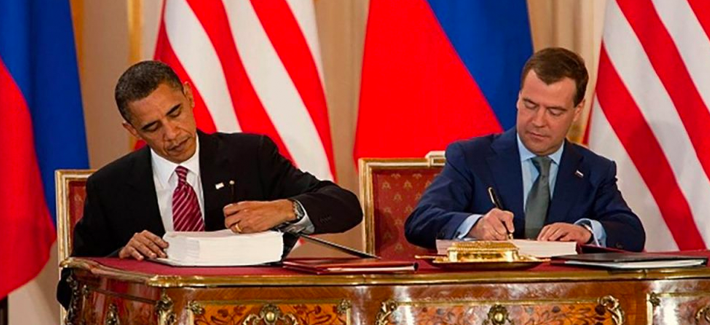
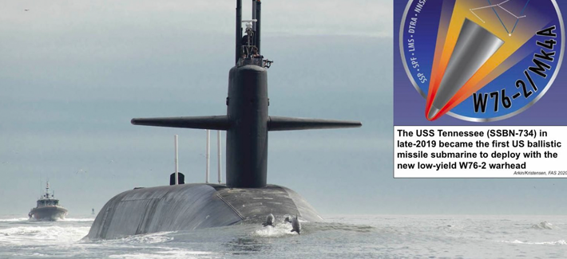
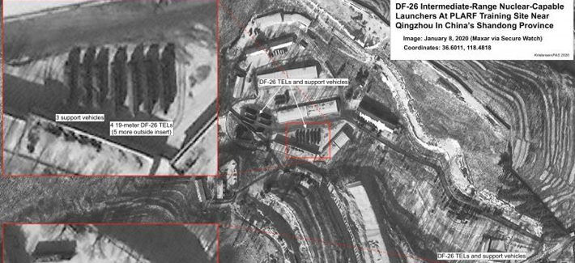
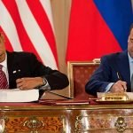
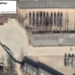

# U.S. Air Force - Weather Agency Doctrine (see SC 1W01A (A Course)

> Source: <http://fas.org/spp/military/docops/afwa/>  
> Section: Weather Handbooks and Important Links  
> Captured: 2026-08-19 06:00 UTC (via Wayback Machine: https://web.archive.org/web/20200225005455/http://fas.org/spp/military/docops/afwa/)  
> PDF: [u-s-air-force-weather-agency-doctrine-see-sc-1w01a-a-course.pdf](u-s-air-force-weather-agency-doctrine-see-sc-1w01a-a-course.pdf) · Original HTML: [source/original.html](source/original.html)

---

Toggle navigation

Navigation

- [About FAS](https://fas.org/about-fas/ "About FAS")
  - [Staff](https://fas.org/about-fas/staff/ "Staff")
  - [Boards](https://fas.org/about-fas/board/ "Boards")
  - [Awards](https://fas.org/about-fas/awards/ "Awards")
  - [Events](https://fas.org/events/ "Events")
  - [Financials, Funding, & Annual Report](https://fas.org/about-fas/financials-funding/ "Financials, Funding, & Annual Report")
  - [Career Opportunities](https://fas.org/about-fas/career-opportunities/ "Career Opportunities")
- [Issues](http://fas.org/issues "Issues")
  - [Government Secrecy](https://fas.org/issues/government-secrecy/ "Government Secrecy")
  - [Nuclear Weapons](https://fas.org/issues/nuclear-weapons/ "Nuclear Weapons")
  - [Defense Posture](https://fas.org/defense-posture-project/ "Defense Posture")
  - [Science Policy](https://fas.org/congressional-science-policy-initiative/ "Science Policy")
- [Experts](http://fas.org/fas-experts "Experts")
  - [Steven Aftergood](https://fas.org/expert/steven-aftergood/ "Steven Aftergood")
  - [Christopher Bidwell](https://fas.org/expert/christopher-bidwell/ "Christopher Bidwell")
  - [Michael A. Fisher](https://fas.org/expert/michael-a-fisher/ "Michael A. Fisher")
  - [Matt Korda](https://fas.org/expert/matt-korda/ "Matt Korda")
  - [Hans Kristensen](https://fas.org/expert/hans-kristensen/ "Hans Kristensen")
  - [Adam Mount](https://fas.org/expert/adam-mount/ "Adam Mount")
  - [Ali Nouri](https://fas.org/expert/ali-nouri/ "Ali Nouri")
  - [Mercedes Trent](https://fas.org/expert/mercedes-trent/ "Mercedes Trent")
- [Publications](http://fas.org/publications "Publications")
  - [Issue Briefs](https://fas.org/publications/issue-briefs/ "Issue Briefs")
  - [Public Interest Reports](https://fas.org/publications/public-interest-reports/ "Public Interest Reports")
  - [Reports](https://fas.org/publications/reports/ "Reports")
  - [Articles / Op-Eds](https://fas.org/publications/articles-and-opeds/ "Articles / Op-Eds")
- [Blogs](# "Blogs")
  - [Secrecy News](http://fas.org/blogs/secrecy/ "Secrecy News")
  - [Strategic Security](http://fas.org/blogs/security/ "Strategic Security")
- [Press Center](https://fas.org/press-center/ "Press Center")
- [Contact Us](https://fas.org/donate/contact-us/ "Contact Us")

[Your Support](https://www.fas.org/donate)

# Striving For A Safer World Since 1945

### Coronavirus Project

Our new [Coronavirus Project](https://fas.org/ncov/) has launched to debunk misinformation circulating the web about COVID-19 and provide clear and sourced information for policymakers. Here, [we cut through the noise](https://fas.org/ncov/) to present clear information and advice for the public, policymakers, and reporters looking for scientist-led and evidence-based analysis. [→](https://fas.org/ncov/)

### Count-Down Begins For No-Brainer: Extend New START Treaty

One year from February 5, the New START treaty will expire, unless the United States and Russia act to extend the last nuclear arms control agreement for an additional five years. Read the latest from [Matt Korda](https://fas.org/expert/matt-korda/) and [Hans Kristensen](https://fas.org/expert/hans-kristensen/) on [why the US should act now](https://fas.org/blogs/security/2020/02/count-down-begins-for-no-brainer-extend-new-start-treaty/). [→](https://fas.org/blogs/security/2020/02/count-down-begins-for-no-brainer-extend-new-start-treaty/)

### US Deploys New Low-Yield Nuclear Submarine Warhead

In his latest [Strategic Security blog](https://fas.org/blogs/security/2020/01/w76-2deployed/), [Hans Kristensen](https://fas.org/expert/hans-kristensen/), with William Arkin, writes about a recently deployed submarine with the new W76-2 low-yield Trident warhead. It is "likely that the new low-yield weapon is intended to facilitate first-use of nuclear weapons against North Korea or Iran." [→](https://fas.org/blogs/security/2020/01/w76-2deployed/)

### China’s New DF-26 Missile Shows Up At Base In Eastern China

In his latest [Strategic Security blog](https://fas.org/blogs/security/), expert [Hans Kristensen](https://fas.org/expert/hans-kristensen/) gives a background [DF-26 missile launchers](https://fas.org/blogs/security/2020/01/df-26deployment/) that have begun to appear at a number of bases across China, and production at a factory outside of Beijing.  [→](https://fas.org/blogs/security/2020/01/df-26deployment/)

In the latest episode of *Above The Fray*, FAS President [Ali Nouri](https://fas.org/expert/ali-nouri)‘s video podcast, he and former FAS Chair Prof. Frank von Hippel discussed Cold War-era science diplomacy efforts, and more.

Past episodes are available on [YouTube](https://www.youtube.com/channel/UCNNc5LYwPTP-HcxujseuOJQ/videos).

### Issues

[

### Government Secrecy](http://fas.org/issues/government-secrecy/)

[

### Nuclear Weapons](http://fas.org/issues/nuclear-weapons/)

[

### Nonproliferation & Counterproliferation](http://fas.org/issues/nonproliferation-counterproliferation/)

[

### Nuclear & Radiological Terrorism](http://fas.org/issues/nuclear-and-radiological-terrorism/)

[

### Biological, Chemical, & Other Non-Nuclear Threats](http://fas.org/issues/biological-chemical-and-other-non-nuclear-threats/)

[

### Energy, Environment, & Resources](http://fas.org/issues/energy-environment-and-resources/)

### Sign Up For Our Newsletter

 #mc\_embed\_signup{background:#fff; clear:left; font:14px Helvetica,Arial,sans-serif; } /\* Add your own MailChimp form style overrides in your site stylesheet or in this style block. We recommend moving this block and the preceding CSS link to the HEAD of your HTML file. \*/

## Stay up-to-date with FAS reports and news.

Email Address

First Name

Last Name

## Recent Activity

# [“Strengthening Deterrence” with More Nuclear Bombs?](https://fas.org/blogs/secrecy/2020/02/deterrence-bombs/)

*By Steven Aftergood*

Earlier this month the Department of Defense acknowledged that it has recently begun to deploy low-yield nuclear warheads on certain submarine ballistic missiles. “This supplemental capability strengthens deterrence. . . and demonstrates to potential a …

[Read More](https://fas.org/blogs/secrecy/2020/02/deterrence-bombs/)

# [Count-Down Begins For No-Brainer: Extend New START Treaty](https://fas.org/blogs/security/2020/02/count-down-begins-for-no-brainer-extend-new-start-treaty/)

*By Matt Korda*

By Matt Korda and Hans M. Kristensen One year from today, on February 5, 2021, the New START treaty will expire, unless the United States and Russia act to extend the last nuclear arms control agreement for an additional five years. No matter your poli …

[Read More](https://fas.org/blogs/security/2020/02/count-down-begins-for-no-brainer-extend-new-start-treaty/)

# [US Stands By the Chemical Weapons Convention](https://fas.org/blogs/secrecy/2020/02/cwc-ag-cert/)

*By Steven Aftergood*

While the Trump Administration has retreated from negotiated arms control agreements in many areas ranging from nuclear weapons to anti-personnel landmines, the US is still committed to the Chemical Weapons Convention (CWC), which generally prohibits t …

[Read More](https://fas.org/blogs/secrecy/2020/02/cwc-ag-cert/)

# [State of the Union: Frequently Asked Questions, and More from CRS](https://fas.org/blogs/secrecy/2020/02/sotu-faq/)

*By Steven Aftergood*

Noteworthy new and updated reports from the Congressional Research Service include the following. History, Evolution, and Practices of the President’s State of the Union Address: Frequently Asked Questions, updated January 29, 2020 The United Nations F …

[Read More](https://fas.org/blogs/secrecy/2020/02/sotu-faq/)

# [US Deploys New Low-Yield Nuclear Submarine Warhead](https://fas.org/blogs/security/2020/01/w76-2deployed/)

*By Hans M. Kristensen*

By William M. Arkin\* and Hans M. Kristensen The USS Tennessee (SSBN-734) at sea. The Tennessee is believed to have deployed on an operational patrol in late 2019, the first SSBN to deploy with new low-yield W76-2 warhead. (Picture: U.S. Navy) The US Na …

[Read More](https://fas.org/blogs/security/2020/01/w76-2deployed/)

# [What do Putin’s constitutional changes mean for Russian nuclear launch authority?](https://fas.org/blogs/security/2020/01/what-do-putins-constitutional-changes-mean-for-russian-nuclear-launch-authority/)

*By Matt Korda*

Putin will have no choice but to redesign Russia’s nuclear launch authority if he intends to keep his finger on the nuclear button.

[Read More](https://fas.org/blogs/security/2020/01/what-do-putins-constitutional-changes-mean-for-russian-nuclear-launch-authority/)

# [China’s New DF-26 Missile Shows Up At Base In Eastern China](https://fas.org/blogs/security/2020/01/df-26deployment/)

*By Hans M. Kristensen*

By Hans M. Kristensen Pictures taken recently by Maxar Technologies’ satellites show a large number of launchers for the DF-26 intermediate-range missile operating at a training site approximately 9 kilometers (5.7 miles) south of Qingzhou City in Chin …

[Read More](https://fas.org/blogs/security/2020/01/df-26deployment/)

# [NNSA Moves to Expand Plutonium Pit Production](https://fas.org/blogs/secrecy/2020/01/nnsa-pits/)

*By Steven Aftergood*

The National Nuclear Security Administration said last week that it will proceed with a plan to sharply expand production of plutonium “pits” — the explosive triggers for thermonuclear weapons — without performing a full “programmatic” environmental …

[Read More](https://fas.org/blogs/secrecy/2020/01/nnsa-pits/)

# [White House Rebuffs Declassification, Disclosure Requirements](https://fas.org/blogs/secrecy/2019/12/white-house-rebuffs/)

*By Steven Aftergood*

Congress adopted numerous new disclosure and reporting requirements in the government spending bill that was signed into law last week. But the Trump White House said that many of them encroach on executive authority and that they may not be implemente …

[Read More](https://fas.org/blogs/secrecy/2019/12/white-house-rebuffs/)

# [Many Reports to Congress May Go Online](https://fas.org/blogs/secrecy/2019/12/reports-to-congress/)

*By Steven Aftergood*

Many of the hundreds or thousands of reports that are submitted to Congress by executive branch agencies each year may be published online pursuant to a provision in the new Consolidated Appropriations Act (HR 1158, section 8092). That provision states …

[Read More](https://fas.org/blogs/secrecy/2019/12/reports-to-congress/)

1
2
3
4
5
6
7
8
9
10
11
12
13
14
15
16
17
18
19
20
21
22
23
24
25
26
27
28
29
30
31
32
33
34
35
36
37
38
39
40
41
42
43
44
45
46
47
48
49
50
51
52
53
54
55
56
57
58
59
60
61
62
63
64
65
66
67
68
69
70
71
72
73
74
75
76
77
78
79
80
81
82
83
84
85
86
87
88
89
90
91
92
93
94
95
96
97
98
99
100
101
102
103
104
105
106
107
108
109
110
111
112
113
114
115
116
117
118
119
120
121
122
123
124
125
126
127
128
129
130
131
132
133
134
135
136
137
138
139
140
141
142
143
144
145
146
147
148
149
150
151
152
153
154
155
156
157
158
159
160
161
162
163
164
165
166
167
168
169
170
171
172
173
174
175
176
177
178
179
180
181
182
183
184
185
186
187
188
189
190
191
192
193
194
195
196
197
198
199
200
201
202
203
204
205
206
207
208
209
210
211
212
213
214
215
216
217
218
219
220
221
222
223
224
225
226
227
228
229
230
231
232
233
234
235
236
237
238
239
240
241
242
243
244
245
246
247
248
249
250
251
252
253
254
255
256
257
258
259
260
261
262
263
264
265
266
267
268
269
270
271
272
273
274
275
276
277
278
279
280
281
282
283
284
285
286
287
288
289
290
291
292
293
294
295
296
297
298
299
300
301
302
303
304
305
306
307
308
309
310
311
312
313
314
315
316
317
318
319
320
321
322
323
324
325
326
327
328
329
330
331
332
333
334
335
336
337
338
339
340
341
342
343
344
345
346
347
348
349
350
351
352
353
354
355
356
357
358
359
360
361
362
363
364
365
366
367
368
369
370
371
372
373
374
375
376
377
378
379
380
381
382
383
384
385
386
387
388
389
390
391
392
393
394
395
396
397
398
399
400
401
402
403
404
405
406
407
408
409
410
411
412
413
414
415
416
417
418
419
420
421
422
423
424
425
426
427
[Next](http://fas.org/?wpv_view_count=35440-TCPID60&wpv_paged=2)

### ISSUES

- [Government Secrecy](https://fas.org/issues/government-secrecy/)
- [Nuclear Weapons](https://fas.org/issues/nuclear-weapons/)
- [Defense Posture](https://fas.org/defense-posture-project/)
- [Science Policy](https://fas.org/congressional-science-policy-initiative/)

### EXPERTS

- [Full Directory](#)
- [Browse by Program](#)

### PUBLICATIONS

- [Issue Briefs](https://fas.org/publications/issue-briefs/)
- [Public Interest Reports](https://fas.org/publications/public-interest-reports/)
- [Reports](https://fas.org/publications/reports/)
- [Articles / Op-Eds](https://fas.org/publications/articles-and-opeds/)

### ADDITIONAL RESOURCES

- [Virtual Biosecurity Center](http://www.virtualbiosecuritycenter.org/)
- [Multimedia](http://fas.org/multimedia)
- [OTA Archive](http://ota.fas.org/)

### BLOGS

- [FAS Blog](http://fas.org/blogs/fas/)
- [Secrecy News](http://fas.org/blogs/secrecy/)
- [Strategic Security](http://fas.org/blogs/security/)

### CONTACT

Federation of American Scientists (FAS)

1112 16th Street NW
Suite 400
Washington, DC 20036

Email: [[email protected]](http://fas.org/cdn-cgi/l/email-protection#fe989f8dbe989f8dd0918c99)
Phone: 202.546.3300

© 2020 - [FAS.org](http://fas.org/spp/military/docops/afwa/fas.dev) - All rights reserved by the Federation of American Scientists. [Privacy Policy](http://fas.org/privacy-policy/)
