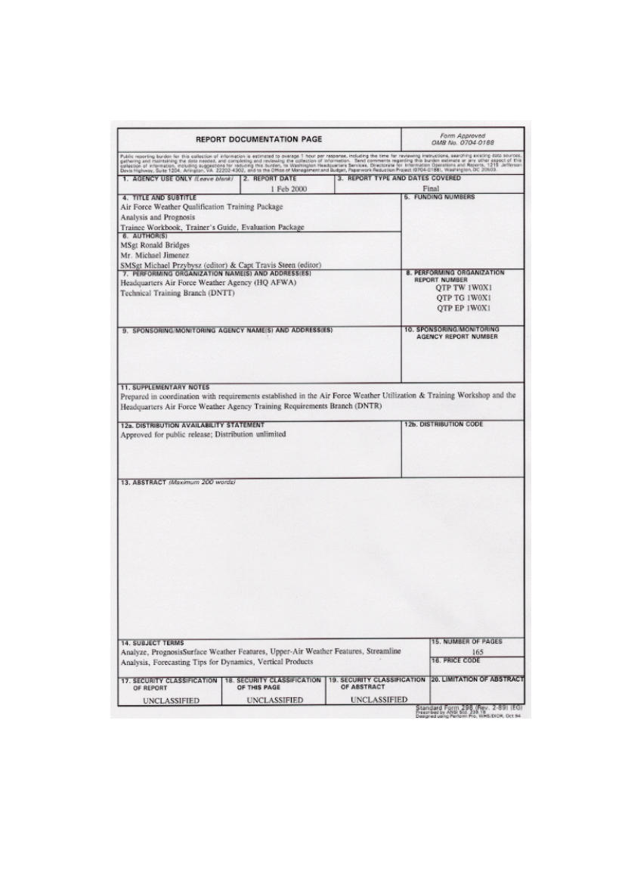
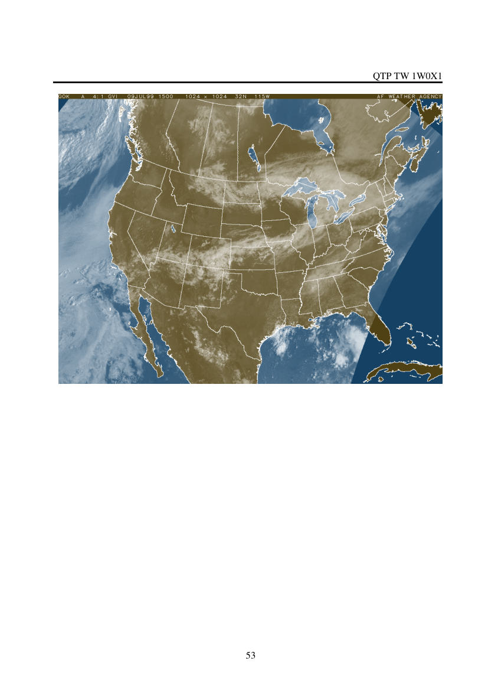
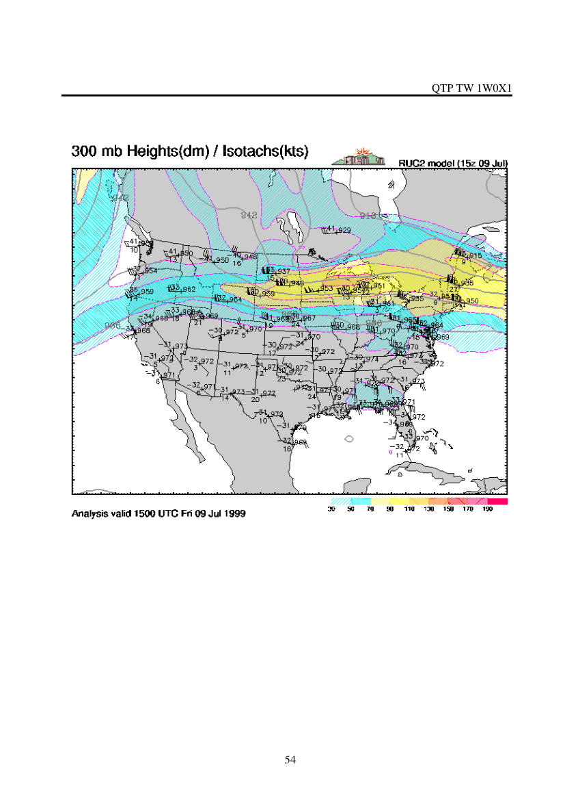
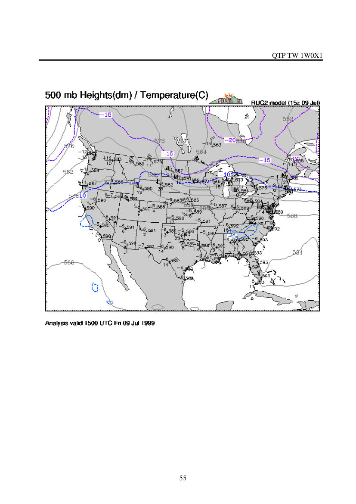
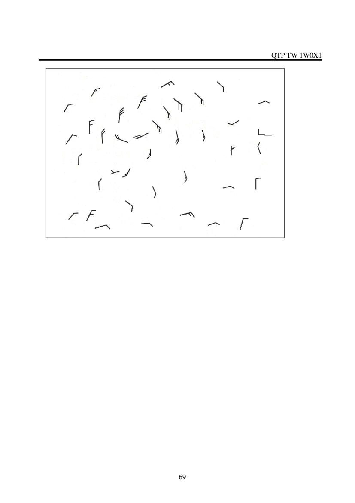
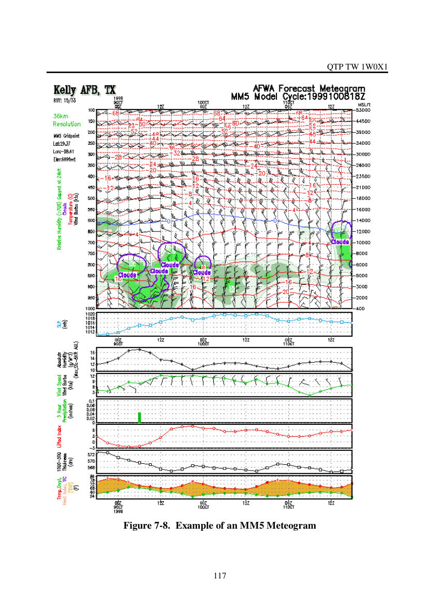

# U.S. Air force Weather Qualification Training Package

> Source: <http://www.weather.gov/media/zhu/ZHU_Training_Page/Met_Tutorials/AF-Trainee.pdf>  
> Section: Weather Handbooks and Important Links  
> Captured: 2026-08-19 06:00 UTC  
> PDF: [u-s-air-force-weather-qualification-training-package.pdf](u-s-air-force-weather-qualification-training-package.pdf) (133 pages)

---

## Page 1

QTP TW1W0X1 
1 Feb 00 
 
Air Force Weather 
Qualification Training Package 
Analysis and Prognosis 
Trainee Workbook 
 
 
 
Providing Standardized Training 
to 
“Exploit the Weather for Battle” 
 
 
 
 
 
AIR FORCE WEATHER AGENCY 
TRAINING DIVISION 
106 Peacekeeper Dr., Ste 2N3 
Offutt Air Force Base NE 68113-4039 
Approved for Public Release; 
Distribution Unlimited

## Page 2

_(no extractable text on this page — see rendered image above)_

## Page 3

QTP TW 1W0X1 
 
 
ii
Acknowledgments 
Headquarters 
Air Force Weather Agency 
 
Commander 
Col. Charles W. French 
Director, Air & Space Science 
Lt. Col. Nathan R. Feldman 
Authors 
MSgt Ron Bridges 
& 
Mr. Mike Jimenez 
Headquarters Air Force Weather Agency 
Technical Training Branch (DNTT) 
Editorial Staff 
Capt Travis Steen 
& 
SMSgt Michael J. Przybysz 
Headquarters Air Force Weather Agency 
Technical Training Branch (DNTT) 
Address communications to: 
Analysis and Prognosis QTP 
Headquarters Air Force Weather Agency 
Training Division (DNT) 
106 Peacekeeper Dr, Ste 2N3 
Offutt AFB, NE 68113-4039 
Phone 
Comm (402) 294-2117 
DSN 271-2117 
Fax 
Comm (402) 292-8207 
DNS 272-8207 
Afwa.dnt@afwa.af.mil

## Page 4

QTP TW 1W0X1 
 
 
iii
 
 
 
Table of Contents 
 
Page 
Module 1 – Analyze Surface Weather Features ...........................................................................2 
1.1.  Analysis Requirements and Procedures...........................................................................3 
1.2.  Southern Hemisphere Analysis Considerations................................................................3 
1.3.  Analysis Tasks................................................................................................................5 
1.3.1.  Preanalysis Orientation.............................................................................................5 
1.3.2.  Isopleth Analysis......................................................................................................6 
1.3.3.  Data Representativeness ...........................................................................................8 
1.3.4.  Analysis Tools..........................................................................................................9 
1.4.  Analysis........................................................................................................................12 
1.5.  Surface Analysis ...........................................................................................................13 
1.6.  Analysis Procedures - Isobaric Analysis Rules ..............................................................16 
1.6.1.  Frictional Effects....................................................................................................17 
1.7.  Analysis Procedures - Frontal Placement Rules.............................................................17 
1.7.1.  Common Errors......................................................................................................18 
1.7.2. Continuity ...............................................................................................................18 
1.7.3.  Winds.....................................................................................................................18 
1.7.4.  Analysis Procedures ...............................................................................................19 
1.7.5.  Preparing for the Analysis ......................................................................................19 
1.7.6.  Study Regional Surface Analysis............................................................................20 
1.7.7.  Establish Continuity ...............................................................................................20 
1.7.8.  Analyze the LAWC ................................................................................................20 
1.7.9.  Frontal Analysis .....................................................................................................20 
1.8.  Nephanalysis.................................................................................................................25 
1.9.  Surface Analysis Rules..................................................................................................26 
1.9.1.  The Purpose of Isobaric Analysis............................................................................26 
1.9.2.  Determining Whether a Trough or a Front Exists....................................................26 
1.9.3.  Surface Analysis.....................................................................................................26 
Module 2 –Analyze Upper-Air Weather Features......................................................................29

## Page 5

QTP TW 1W0X1 
 
 
iv
2.1.  Purpose and Usefulness of Upper-Air Analysis .............................................................30 
2.2.  Constant Pressure Charts...............................................................................................30 
2.3.  Uses of Upper-Air Analyses..........................................................................................32 
2.4.  Upper-Air Analysis Depiction...........................................................................................32 
2.4.1.  Isallohypses............................................................................................................32 
2.4.2.  Troughs..................................................................................................................33 
2.4.3.  Ridges ....................................................................................................................33 
2.4.4.  Labeling .................................................................................................................34 
2.5.  Contour Analysis ..........................................................................................................34 
2.5.1.  Isoheights...............................................................................................................34 
2.5.2.  Contour Lines.........................................................................................................34 
2.5.3.  Height Centers........................................................................................................35 
2.5.4.  Circulations............................................................................................................36 
2.5.5.  Reanalysis ..............................................................................................................36 
2.6.  Rules for Thermal Analysis...........................................................................................37 
2.6.1.  Isotherms................................................................................................................38 
2.6.2.  Other Points ...........................................................................................................39 
2.7.  Moisture Analysis .........................................................................................................40 
2.8.  Recognizing and Analyzing Upper-Air Fronts...............................................................41 
2.8.1.  Rules ......................................................................................................................41 
2.9.  Jet Streams and Analysis...............................................................................................42 
2.9.1.  Isotachs ..................................................................................................................42 
2.9.2.  Jet Maximum..........................................................................................................43 
2.9.3.  Low-Level Jet (LLJ)...............................................................................................44 
2.9.4.  Jet Streams .............................................................................................................44 
2.9.5.  Polar Front Jet ........................................................................................................44 
2.9.6.  Subtropical Jet (STJ) ..............................................................................................45 
2.10. Basic Steps for Analysis...............................................................................................46 
2.10.1.  Upper-Level Analysis (300 mb, 250 mb, or 200 mb) ............................................46 
2.10.2.  500 mb Analysis...................................................................................................47 
2.10.3.  700 mb Analysis...................................................................................................47 
2.10.4.  850 mb Analysis...................................................................................................49 
Manual Upper-Air Analysis Checklist ..................................................................................50

## Page 6

QTP TW 1W0X1 
 
 
v
Module 3 – Streamline Analysis ...............................................................................................56 
3.1.  Streamline Analysis Terminology and Depiction...........................................................57 
3.2.  Uses of streamline analysis ...........................................................................................58 
3.3.  Steps in Manual Streamline Analysis ............................................................................59 
3.4.  Rules of Streamline Analysis ........................................................................................61 
3.4.1. Non-Asymptotes .....................................................................................................61 
3.4.2. Asymptotes .............................................................................................................61 
3.4.3. Vortices...................................................................................................................61 
3.4.4. Neutral Points..........................................................................................................62 
3.4.5. Isotachs ...................................................................................................................62 
3.5.  Operational Uses of Streamline Analysis.......................................................................64 
3.5.1.  Case Study .............................................................................................................65 
Module 4 – Forecasting Tips for Dynamics...............................................................................70 
4.1.  Pertinent Definitions .....................................................................................................71 
4.2.  Jet Streams....................................................................................................................72 
4.2.1.  Polar Front Jet  (PFJ)..............................................................................................72 
4.2.2.  Subtropical Jet  (STJ) .............................................................................................73 
4.3.  Short Waves..................................................................................................................73 
4.3.1.  Identifying the Short Wave Trough.........................................................................73 
4.3.2.  Identifying the Short Wave Ridge...........................................................................74 
4.4.  Warm and Cold Pockets................................................................................................74 
4.4.1.  Reasons for Warm Pockets.....................................................................................74 
4.4.2.  Reasons for Cold Pockets .......................................................................................74 
4.5.  Barotropic Systems .......................................................................................................74 
4.5.1.  Cold Core Barotropic High.....................................................................................75 
4.5.2.  Warm Core Barotropic High...................................................................................76 
4.5.3.  Warm Core Barotropic Low ...................................................................................76 
4.5.4.  Cold Core Barotropic Low .....................................................................................77 
4.6.  Baroclinic Systems........................................................................................................78 
4.6.1.  Baroclinic High ......................................................................................................79 
4.6.2.  Baroclinic Low.......................................................................................................79 
4.7.  Fronts............................................................................................................................80 
4.7.1.  Cold Fronts (General Forecasting Rules) ................................................................80

## Page 7

QTP TW 1W0X1 
 
 
vi
4.7.2.  Warm Fronts ..........................................................................................................82 
4.7.3.  Stationary Fronts ....................................................................................................83 
4.8.  Surface Troughs............................................................................................................84 
4.8.1.  Leeside Trough/Low ..............................................................................................84 
4.8.2.  Cold Over Warm (C-O-W) Trough.........................................................................85 
4.8.3 Forced Trough..........................................................................................................85 
4.8.4.  Inverted Trough......................................................................................................85 
4.9.  Frontal Systems and Vertical Stacking ..........................................................................86 
4.9.1.  Frontal Stacking.........................................................................................................86 
4.9.2.   Frontal Inversion ...................................................................................................87 
4.9.3.  Frontal Slopes ........................................................................................................87 
Module 5 – Prognosis of Surface Weather Features ..................................................................90 
5.1.  Intensity Changes..........................................................................................................91 
5.1.1.  Isallobaric Patterns .................................................................................................91 
5.1.2. Advective Pressure Changes....................................................................................91 
5.2.  Prognosis of Baroclinic Surface Lows...........................................................................91 
5.2.1.  Cyclogenesis Areas ................................................................................................91 
5.2.2.  Stable Wave ...........................................................................................................92 
5.2.3.  Unstable Waves......................................................................................................92 
5.2.4.  Movement of Surface Lows....................................................................................92 
5.2.5.  Occluded Surface Lows..........................................................................................93 
5.3.  Fronts............................................................................................................................94 
5.3.1.  Frontogenesis .........................................................................................................94 
5.3.2.  Frontolysis..............................................................................................................95 
5.3.3.  Movement ..............................................................................................................95 
5.3.4.  Speed of Fronts ......................................................................................................96 
5.4.  Baroclinic Highs ...........................................................................................................96 
5.4.1.  Intensity .................................................................................................................96 
5.4.2.  Movement ..............................................................................................................96 
5.4.3.  Speed .....................................................................................................................97 
Module 6 – Prognosis of Upper-Air Features............................................................................99 
6.1.  Major Short Wave Steering Features........................................................................... 100 
6.1.1.  Continuity and Extrapolation................................................................................ 100

## Page 8

QTP TW 1W0X1 
 
 
vii
6.1.2.  Constant Movement.............................................................................................. 100 
6.1.3.  Constant Rate of Change ...................................................................................... 100 
6.1.4.  Constant Percentage Change................................................................................. 100 
6.1.5.  Control Line Extrapolation ................................................................................... 100 
6.2. Upper-Level Low Movement and Intensity Changes.................................................... 101 
6.3. Upper-Level High Movement and Intensity Changes ................................................... 102 
6.4.  Long Wave Troughs and Ridges ................................................................................. 102 
6.4.1.  Intensity ............................................................................................................... 102 
6.4.2. Movement ............................................................................................................. 102 
6.5.  Upper-Level Short Wave Troughs and Ridges............................................................. 104 
6.5.1.  Intensity ............................................................................................................... 104 
6.5.2.  Movement ............................................................................................................ 104 
6.6.  Upper-Level Closed Lows and Highs.......................................................................... 104 
6.6.1.  Intensity ............................................................................................................... 104 
6.6.2.  Movement (Direction only) .................................................................................. 105 
6.7.  Moisture...................................................................................................................... 105 
6.7.1.  Moisture Increase ................................................................................................. 105 
6.7.2.  Moisture Decrease................................................................................................ 106 
6.7.3.  Cloud – Moisture Relationship ............................................................................. 106 
6.8. Long Wave Movement and Pattern Changes ................................................................ 106 
6.8.1.  Wavelengths......................................................................................................... 106 
Module 7 – Vertical Products.................................................................................................. 108 
7.1.  Determining Parameters from an Air Mass Sounding (Skew-T) ...................................... 109 
7.2.  Depictions on Automated Air Mass Soundings (Skew-Ts) .......................................... 109 
7.3.  Determining Thickness ............................................................................................... 110 
7.4.  Determining Convective Condensation Level (CCL)................................................... 110 
7.5.  Determining Lifting Condensation Level (LCL).......................................................... 111 
7.6.  Determining Wet-Bulb Zero (WBZ)............................................................................ 111 
7.6.1.  WBZ Manual Computation Directions.................................................................. 112 
7.6.2.  Uses of the WBZ.................................................................................................. 112 
7.7.  Inversions ................................................................................................................... 113 
7.7.1.  Subsidence Inversion............................................................................................ 113 
7.7.2.  Frontal Inversion .................................................................................................. 114

## Page 9

QTP TW 1W0X1 
 
 
viii
7.7.3.  Radiation Inversion .............................................................................................. 115 
7.8.  Forecast Air Mass Soundings...................................................................................... 116 
7.9.  Meteograms ................................................................................................................ 116 
MODULE REVIEW QUESTIONS CONFIRMATION KEY................................................. 121

## Page 10

QTP TW 1W0X1 
 
 
1
TRAINEE WORKBOOK INSTRUCTIONS 
• This QTP (Qualification Training Package) Trainee Workbook standardizes on-the-job 
training (OJT) for Air Force Weather (AFW) personnel.  It breaks down subject matter by 
modules into teachable elements called task objectives.  A Table of Contents is provided for 
quick reference to find needed modules. 
• Workbook material includes a module overview and a list of task objectives required for 
minimum certification in this subject area.  Each workbook module lists equipment and 
training references, prerequisites and safety considerations, estimated module training time, 
core training material and review questions, and a module review confirmation key. 
• As a trainee, before you start completing this workbook, you need to understand the QTP 
process.  You need to know that each QTP has three components.  Part one is this Trainee 
Workbook (TW) that contains all subject matter material.  Part two is the Trainer’s Guide 
(TG) explaining how each module and task objective is taught.  Part three is the Evaluation 
Package (EP) containing all task certifier written exams, performance applications, and 
confirmation keys to grade your comprehension. 
• Be sure the trainer thoroughly explains all three QTP documents and how to complete this 
training package. 
• As you progress through each module, answer the review questions pertaining to that section.  
You will find the answers to these section review questions at the end of the workbook.  
Compare your response to the correct answer. 
• After completing a module, your trainer will have a task certifier administer the Evaluation 
Package.  The task certifier will grade all responses.  If a written score or performance 
application is less than required, you will need to restudy module material and your trainer 
will provide additional OJT in those weak areas.  Once the material has been restudied, you 
will be required to retake the evaluation. 
• After you successfully complete the Evaluation Package for each module, inform your 
trainer.  Your trainer will get a task certifier who will perform a final certification checkride 
on the module.  Upon completion of a module, your supervisor will ensure all documentation 
is correctly completed in your training records. 
• You are ultimately responsible for completing this QTP in the allotted time.  If you cannot do 
so, let your trainer know ahead of time.  If you feel you are not getting adequate training on a 
topic, discuss this situation with your supervisor and/or unit training manager.  Additional 
material or a different trainer may be assigned. 
• Routine corrections and minor updates to this document will be done via page changes.  
Urgent changes will be disseminated via message.  Submit recommended TW improvements 
and/or corrections to HQ AFWA/DNT, 106 Peacekeeper Dr., Ste 2N3, Offutt AFB, NE 
68113-4039.

## Page 11

QTP TW 1W0X1 
 
 
2
Module 1 – Analyze Surface Weather Features 
 
TRAINEE'S NAME  ________________________________ 
CFETP REFERENCE:  13.7., 13.12., 13.18.  
MODULE OVERVIEW:   
Initially, this module reviews common analysis terms and definitions.  Then, it discusses the 
general rules and principles of analysis, which in turn, guide the forecast/prognosis process.  
Finally, this module will cover automated and manual analysis of surface charts and the smaller 
scale Local Area Work Charts (LAWC). 
TRAINING OBJECTIVES:  
• OBJECTIVE 1:  Identify basic rules and principles of analysis by answering questions 
with at least 80% accuracy. 
• OBJECTIVE 2:  Using rules, techniques, and regimes knowledge,  analyze a surface 
chart satisfactorily to the trainer and/or certifier as compared to the master analyzed chart.  
• Perform an isobaric analysis and locate pressure centers, troughs/squall lines, and 
fronts. 
• Additionally, the trainer and/or certifier may require additional analysis, i.e., 
isothermal analysis, isodrosothermal analysis, isallobaric analysis, etc. 
EQUIPMENT AND TRAINING REFERENCES:  
• AFMAN 15-125, Weather Station Operations 
• AFWA/TN-98/002, Meteorological Techniques 
• AWS/FM-600/009, The Local Area Work Chart 
• 5 WW/FM-89/001, Mesoscale Analysis and Forecasting 
• CDC 1W051B, Volume 2, General Meteorology and Volume 3, Analysis Procedures 
• SC 1W01A, Volume 2, Upper-Air and Surface Forecasting Techniques  
• AWS/TR-95/001 (AWS TR240 Updated), Forecasters Guide to Tropical 
Meteorology 
PREREQUISITES AND SAFETY CONSIDERATIONS: 
• Be familiar with interpreting weather features from MetSat imagery 
• Have access to plotted surface charts and be familiar with surface plot code 
breakdowns 
ESTIMATED MODULE TRAINING TIME:  6.0 Hours

## Page 12

QTP TW 1W0X1 
 
 
3
CORE TRAINING MATERIAL AND REVIEW QUESTIONS 
 
1.1.  ANALYSIS REQUIREMENTS AND PROCEDURES 
Before you begin analysis and progress to prognosis, you need to understand the basic requirements 
for every correct analysis: continuity, analyzing for the data, and smoothing.   
• Continuity - A logical progression from one product to the next is needed.  Although 
continuity is usually considered on upper-air charts, it is often omitted on surface products.  
However, continuity in movement of small features, even on the surface product, should be a 
prime guide used in locating all surface features.  When examining past products for accurate 
continuity, you may have to reanalyze critical areas, such as pressure centers or frontal zones. 
• Analyzing for the Data - Consider all the data on an analysis as though the data is correct.  
Do not discard data because it does not seem to fit--make every effort to use a station report.  
Often, a single station may be the signal for a changing system.  If you still have strong 
evidence that questionable data cannot be correct, check it by using the following procedure:  
• Examine the original data received.  Check for obvious errors.   
• Compare the plotted data and the original data for errors. 
• Compare the data with the last reports from the same station.  Each element of the 
data should show a logical progression between successive reports. 
• Compare several past composite products for a logical continuity.  Each analysis in 
the past should show some indication of the beginning and the development of the 
feature in question. 
• Compare the questioned data with surrounding reports.  Try to reconstruct any 
conceivable meteorological development that could account for differences noted.   
• Finally, reanalyze the situation that the data demands.  You could make a reanalysis 
look like any situation you want, but follow the data.  Make the simplest reanalysis 
possible that is consistent with the checked data. 
• Smoothing – Smoothing is making the analysis a flowing product as the atmosphere 
really is.  However, oversmoothing the analysis will often result in overlooking important 
developments in a weather system.  Every station that does not fit into a smooth pattern 
should be closely analyzed for accuracy and meteorological cause.  Smoothing should be 
guided by this rule: 
• Subtract nothing that is meteorologically important from the analysis.  Smooth only 
when consistent with existing data. 
1.2.  SOUTHERN HEMISPHERE ANALYSIS CONSIDERATIONS 
The principles of analysis in the Northern Hemisphere still apply in the Southern Hemisphere, 
but there are differences you need to know. 
• Geographical Contrasts - Only within 10-20° latitude of the equator are the land mass 
areas of the two hemispheres comparable.  Landmasses in the Northern Hemisphere 
extend from subtropical to sub-arctic latitudes.  In the Southern Hemisphere, areas from

## Page 13

QTP TW 1W0X1 
 
 
4
4-5° S to 65° S are mostly water.  The longitudinal distribution of land and water is also 
different, with two major continents and oceans in the Northern Hemisphere and three of 
each in the Southern Hemisphere.  The principal topographical features of the two 
hemispheres show considerable differences.  South of the equator, the only feature 
comparable to the Alps, Urals, or the Himalayas of the north is the Andes chain of South 
America.  The Arctic icecap seldom rises more than a few feet above sea level, but the 
mean elevation of the Antarctic is about 10,000 feet with some icecaps rising above 
13,000 feet. 
• Result - The absence of large land bodies in the Southern Hemisphere results in a 
more regular pressure pattern.  Because of the lack of reporting stations in the ocean 
areas, extensive use of wind scales and streamlines should be used over the water 
areas. 
• Dynamic Contrasts - All dynamical differences stem from one fact.  The coriolis 
parameter is negative in the Southern Hemisphere.  In the Southern Hemisphere, Buys 
Ballot's law (basic relationship between wind and pressure) becomes: Standing with the 
wind to your back, lower pressure is found on your right.  
• Result - The flow around lows is clockwise and is counterclockwise around highs in 
the Southern Hemisphere.  Cyclonic vorticity is negative and anticyclonic vorticity is 
positive.  All statements relating to temperature and changes in wind with height must 
be altered. 
• General Circulation - Hemispheric differences generally tend to disappear with 
increasing altitude.  Southern jets are more intense on the average and have smaller 
amplitudes, reflecting zonal indices almost double in magnitude.  Blocks are 
comparatively rare and occur southeast of continents in late winter and early spring, again 
emphasizing the importance of middle latitude continents on features of the general 
circulation.  The subtropical highs of the South Atlantic, South Pacific, and South Indian 
Oceans differ from their northern counterparts in number, permanence, seasonal 
migration, and seasonal intensity changes. 
 
? 
1.  __________  (TRUE/FALSE) Because a single station may be the signal for a changing 
system, you should not discard data because it does not seem to fit. 
2.  __________ Describes the act of making an analysis flow as the atmosphere does. 
3.  The pressure pattern in the Southern Hemisphere shows less change because: 
a.  The flow around lows is clockwise and is counterclockwise around highs. 
b.  The absence of large land bodies in the Southern Hemisphere. 
c.  Cyclonic vorticity is negative and anticyclonic vorticity is positive. 
d.  Most of the Southern Hemisphere is in the tropics, where pressure changes are normally 
minute.

## Page 14

QTP TW 1W0X1 
 
 
5
4.  __________  (TRUE/FALSE) Southern Hemisphere jet streams are more intense and have 
greater amplitude than their Northern Hemisphere counterparts. 
 
1.3.  ANALYSIS TASKS 
Analysis involves several tasks to ensure the most efficient and correct product.  First of all, you 
examine the current state of the atmosphere, the type of weather occurring, and where it is taking 
place.  This task requires knowing how the atmosphere arrived at its current state.  A primary 
concern is to ensure that each analysis follows in a logical progression from the previous 
analysis--ensure that continuity is maintained.  Accuracy is the most important step in this task.  
You need to find the particular atmospheric processes involved in producing the kinds of weather 
reported.  Your forecast/prognosis of weather will be more successful if you understand why the 
current weather is occurring.  Lastly, you need to complete the analysis in the shortest time 
possible.  There are certain task steps to achieve this: 
• Preanalysis Orientation 
• Isopleth Analysis 
• Data Representativeness 
• Analysis 
1.3.1.  Preanalysis Orientation 
Good preanalysis orientation requires you to review the history of the weather situation and 
check the movements, configurations, the orientation of fronts, lows, highs, troughs, and ridges, 
and the general accuracy of the past products.  The total time for the preanalysis orientation is 
about 25-35 minutes.  Here’s a breakdown of the various steps of preanalysis orientation: 
• Inspect a sample of surface products generated or received since the last duty shift.  
Examine at least 24 hours of products if returning from a break. 
• Obtain details of the weather situation now in progress in your local area to understand 
forecasts (and analyses) now in effect and the reasoning behind them. 
• Study the latest satellite pictures and upper-air analyses.  Inspect the: 
• Imagery for wind flow, jet placement, synoptic features, orographic influences. 
• 850 mb and/or 700 mb products for convergence, orographic effects, warm/cold 
advection, and moisture patterns. 
• 500 mb and 300 mb/200 mb products for large-scale features of flow pattern and jet-
level wind situations. 
• Winds aloft product.  Review/generate streamlines on two or three of the lowest 
levels.  Compare the past positions of troughs and ridges in these products and note 
the movement. 
• Radiosonde observation (RAOB) plots in the local area to learn the position of cloud 
decks, moisture content, and stability of the air.

## Page 15

QTP TW 1W0X1 
 
 
6
• Check the analysis on the latest local area work product and inspect the latest hourly 
observations, noting the latest frontal passages and movement of precipitation, cloud 
areas, and other pertinent weather elements. 
• Read all centrally prepared forecast bulletins for your area of interest. 
1.3.2.  Isopleth Analysis 
In this step, you need to know some of the “dos and don’ts” of analysis.  Here are some basic 
isoplething principles and rules to follow: 
• Contours and isobars must be shown so that the distance between a station and the 
contour or isobar is proportional to the difference between the reported station value and 
the value assigned to the isopleth.   
• The center of the high or low is the point where all surrounding pressures are lower or 
higher, respectively.  This position usually is not pinpointed with an exact pressure value, 
so the center usually has to be extrapolated. 
• When crossing a front (or trough), isobars must show an abrupt change in direction and 
cyclonic curvature of the isobars on at least one side of the front (or trough).   
• Using Buys Ballot’s Law, an isobar or contour indicating flow in a particular direction 
must always have lower pressures or heights to its left and higher pressures or heights to 
its right in the Northern Hemisphere.  Figure 1-1 depicts this.  Figure 1-2 shows some of 
the more common errors seen in analysis.  Figures 1-3 and 1-4 are examples of surface 
analyses.  Note:  On Figure 1-1, the pressure center and isobaric labeling scheme is not 
the standard (described later in this module) and is meant only to illustrate pressure using 
Buys Ballot’s Law.   
 
 
Figure 1-1.  Buys Ballot’s Law Examples

## Page 16

QTP TW 1W0X1 
 
 
7
 
 
 
Figure 1-2.  Common Isopleth Errors 
 
Figure 1-3.  Surface Analysis Example

## Page 17

QTP TW 1W0X1 
 
 
8
 
Figure 1-4.  Example of a Commercial Surface Chart 
1.3.3.  Data Representativeness 
Remember earlier that you need to consider all the data on an analysis as though the data is 
correct and not to discard data because it does not seem to fit.  You should make every effort to 
use a station report.  Even when all the probable errors on a plotted chart are accounted for, parts 
of the data may still be inconsistent for meteorological reasons.  It is important to know these 
reasons so that errors may be corrected or considered. 
• Sensor Representativeness - Some sensor error is inherent.  Errors depend largely on the 
type of data measured, sophistication of instrumentation used, and method used for 
parameter determination.  The order of accuracy from least accurate method to most 
accurate method: aircraft reports, weather reconnaissance reports, pibal data, rawinsondes 
(radiosondes). 
• Sea-Level Pressure - The pressure at station level is, by definition, representative of the 
mass of the air column or unit cross section above the station.  Overestimates of the mean 
temperature of the air column will result in reported sea-level pressures that are on the 
low side, and underestimates of temperature will produce high pressures.  That is why a 
mountain station with a temperature lower than its neighboring stations will report a 
higher sea-level pressure.  This also causes fictitious intensities of thermal highs and lows 
in mountains and plateau areas.  Sea-level pressure reports from mountain stations 
located well above the average surrounding terrain should be disregarded in drawing the 
sea-level pressure pattern.  Station-level pressure, or sea-level pressure, at a station near 
sea level would be the most representative element of the meteorological report. 
• Pressure Tendencies - Pressure tendency reports from ships are less accurate than land 
stations.  Keep in mind the ship is moving and is not located in the same place as it was a 
few hours ago.  The analysts must keep this limitation, with corrections for the course and 
speed of the ship, in mind as they use the report.  Tendencies for periods of heavy showers, 
squalls, or thunderstorms are usually unrepresentative, both in characteristic and amount.

## Page 18

QTP TW 1W0X1 
 
 
9
• Temperature - Any process or condition that tends to reduce the cooling in the lowest 
layers of the atmosphere will cause a low-level or ground inversion and affect the 
representativeness of the surface temperature.  The most common processes are nocturnal 
radiation, advection over a colder surface, drainage of cold air into valleys, snow on the 
ground, and the evaporation from a local water source.  The operation of these processes 
on land makes the temperature the least representative of all the elements of the surface 
report from land stations.  Reports from sea stations are slightly more reliable.  Frontal 
temperature contrasts can be masked by situations permitting a marked radiation 
inversion to form.  This may occur in warm, stable air masses during clear or nearly 
cloudless conditions with light winds. 
• Dew Point - The dew point temperature is often more reliable than the temperature, 
because, the dew point is usually not affected by adiabatic processes as much as 
temperature.  At stations near water or whenever precipitation is occurring, dew-point 
temperature will be unrepresentative, although probably more reliable than the temperature.  
The dew point temperature is usually the most useful element in the surface report.  It is 
often the only means of locating the boundaries of an advancing wedge or tongue of 
maritime tropical (mT) air.  Elevation differences between neighboring stations in the same 
air mass generally show a much smaller difference in the dew point than in air temperature. 
• Wind Direction and Speed - Wind in the friction layer is subject to local influences, 
especially over land.  The principal influences on the winds are terrain, vegetative cover, 
and the local heating and cooling.  In many places, the terrain influences the air motion 
by acting as a windbreak.  The frictional drag also varies with the vegetative cover.  
Grasslands offer less friction than forest.  Land and sea breezes are excellent examples of 
heating and cooling.  Local convective activity can also affect the surface to a marked 
degree in the immediate vicinity of the convective storms and showers.  For these 
reasons, using charts showing winds above or near the top of the friction layer is 
indispensable to an accurate surface analysis over the land areas. 
• Present Weather - Continuous precipitation occurring at the station is most likely to be 
representative, but intermittent precipitation can be scattered throughout an air mass.  
Smoke, dust, sand, haze, and fog are often local phenomena and can be unrepresentative. 
• Clouds - High and middle clouds are more likely to be representative than low clouds or 
clouds with great vertical development.  However, reliability of cloud data at night is 
questionable because the observer can easily overlook sparse cloud cover.  In addition, 
unmanned ASOS reporting stations are becoming more numerous.  The ASOS does not 
report clouds above 12,000 feet and cloud reports may not reflect the entire horizon.  
• Visibility - Low visibilities may be unrepresentative due to variability within the 
visibility-reducing medium.  Errors in judgment due to lack of markers at accurately 
known distances may also affect the reliability of the local visibility. 
1.3.4.  Analysis Tools 
Before you begin to analyze you should look at a couple of other tools to help with placement 
and understanding what is actually happening in the atmosphere.  You should use thickness 
charts, vorticity charts, and satellite imagery to help with the analysis.  The first product to 
discuss is the thickness product.

## Page 19

QTP TW 1W0X1 
 
 
10
1.3.4.1.  SFC/1,000-500 mb Thickness 
We will use thickness because it is useful for placing surface fronts and the PFJ. 
 
Figure 1-5.  SFC/1000-500 mb Thickness Chart 
• As you have learned before, the PFJ is found above the tightest temperature contrast, 
which is indicated on the thickness chart by the tightest thickness packing.  The PFJ will 
be placed in the tightest thickness packing on the chart.  It will be analyzed in black. 
• Surf ace front locations are placed on the warm side of the tightest thickness packing, 
parallel to the thickness isopleths. 
• If the wind is blowing across the thickness isopleths then temperature advection is 
occurring.  If the wind is blowing from high thickness values to lower ones, WAA is 
occurring and a warm front should be placed on the warm side of the thickness 
packing (see Figure 1-5). 
• If the wind is blowing low thickness values to higher ones, CAA is occurring and a cold 
front should be placed on the warm side of the thickness packing (see Figure 1-5). 
• Occlusions are placed in the thermal ridge that wraps up around the surface low.  It 
lies in the center of the ridge. 
• Surface frontal analysis rules using thickness 
• Thickness lines will parallel the cold front in the cold air. 
• When you compare the cold and warm fronts, the thickness gradient ahead of a warm 
front is not as tightly packed. 
• Thickness contours are anti-cyclonically curved ahead of warm fronts and 
cyclonically behind cold front. 
1.3.4.2.  Thickness Considerations 
• Adiabatic warming due to subsidence can counteract CAA.  In other words, weak CAA 
can be warmed due to strong subsidence.

## Page 20

QTP TW 1W0X1 
 
 
11
• Warming from below can counteract CAA.  As an air mass moves out of it’s source 
region, it will begin to modify due to contact with the warm ground.  The longer the air 
mass is outside of the source region the more modified it will become. 
• Dynamic cooling due to adiabatic cooling or cooling from below may offset WAA.  
Warm air that is forced to rise will cool adiabatically and a warm air mass moving over a 
cold surface will cool from below. 
1.3.4.3.  Vorticity 
Recall vorticity is the measure of the spin of a parcel in the wind field.  Positive vorticity 
indicates divergence or upward vertical motion (UVM) and negative vorticity indicates 
convergence or downward vertical motion (DVM).  When the positive or negative spinning 
parcel moves into an area we say there is Positive Vorticity Advection (PVA) or Negative 
Vorticity Advection (NVA).  The 500 mb Vorticity Chart will give you an idea of the location 
of troughs, ridges and neutral areas moving across the globe.  The vorticity chart is also a good 
tool to locate the jet. 
1.3.4.4.  Analysis Considerations 
Refer to Figure 1-6.  Notice the solid black line in the maximum vorticity lobe (X).  This line 
indicates the vorticity lobe, which also can be used to locate a short wave trough on the 500 mb 
chart.  The same applies to the minimum axis (N).  This axis is where you would look on the 500 
mb chart to locate a short wave ridge. 
 
Analyze for a positive vorticity lobe or short wave trough.  Draw a solid, curved line to indicate 
this lobe.  Analyze for PVA out ahead of the lobe in red, as seen on Figure 1-5. 
Analyze for a negative vorticity lobe or short wave ridge.  Draw a zigzag line to indicate this 
lobe.  Analyze for NVA out ahead of the lobe in blue, as seen on Figure 1-5. 
Analyze for neutral areas.  These areas are left void of features and advection.  Usually you will 
find the neutral areas along an axis or in areas where there is no PVA or NVA.   
 
Figure 1-6.  Vorticity Advection

## Page 21

QTP TW 1W0X1 
 
 
12
1.3.4.5.  Satellite Analysis 
Prior to analyzing charts, analyze the satellite imagery to locate features and to analyze for wind 
flow.  Figure 1-7 is analyzed light blue for low-level winds and purple for high-level winds.  For 
detailed information on the use of satellite imagery, refer to the MetSat QTP. 
• Analyze for synoptic systems such as, highs, lows, and fronts. 
• Analyze for upper-level winds based on the analysis of the clouds on satellite imagery. 
• Analyze for local effects, mountain wave turbulence, fog, stratus, etc. 
 
 
Figure 1-7.  Visible Satellite Picture Analyzed for Winds   
1.4.  ANALYSIS 
Now, you are ready to begin your analysis.  Analysis involves three stages: preliminary, basic 
and final.  Preliminary, basic, and final analysis are accomplished using the Three Stage Analysis 
Process, more commonly called the “3 S” Process--scan, sketch, smooth. 
• Preliminary Analysis - Visually scan the entire chart for circulations, pressure patterns 
and general flow.  Get an idea of what features you will be analyzing for. 
Basic Analysis – Using the computer – put in features using the draw functions.  When 
working on paper - Sketch all features in pencil. 
• Final Analysis - Smooth all features, make final adjustments, and harden-in using 
appropriate colors.

## Page 22

QTP TW 1W0X1 
 
 
13
? 
5.  List the task steps of analysis and briefly describe each. 
6.  Which data is more reliable when evaluating weather reports from a station with an elevation 
of 76 feet and you are looking for a front? 
a.  Dew point 
b.  Temperature 
c.  Sea-level pressure 
d.  Visibility 
7. _________  (TRUE/FALSE) Ceiling and cloud reports at night or coming from unmanned 
ASOS are not reliable.  Explain your answer. 
8.  Why may local visibility reports not be reliable? 
9.  What is the “3 S” Process? 
 
1.5.  SURFACE ANALYSIS 
The main goal of the surface analysis is to locate and find phenomenon that has the potential of 
effecting the mission and your forecast.  To identify air masses, you must first locate major high 
pressure centers (generally the centers of air masses).  Frontal transition zones or boundaries 
show the separation of air masses and are usually an extension of some major low pressure 
centers.  Other surface chart analysis features include troughs and ridges, isotherms, thermal 
pockets, and moisture analysis. 
• Isobaric Intervals:  The normal interval is every 4 millibars using a base value of 1,000 
mb.  There are times when closer intervals, 1 mb or 2 mb increments, are used.  For severe 
weather mesoscale analysis, tenths of millibar intervals may be appropriate. 
• Isobaric Labeling: Label isobars in two digits (tens and units).  For example, a 996 mb 
is labeled as "96", 1,000 mb is labeled as "00" and so on.  Label open isobars (isobars 
begin and end at the chart's edge) at each end.  Label closed isobars (isobars showing 
pressure centers) in the opening atop the isobar. 
• Isobaric Surfaces:  Use the symbols (found in AFMAN 15-125) when depicting fronts 
and other weather features. 
• Depict cold fronts as solid blue lines with solid blue triangles pointing toward the 
direction of movement. 
• Depict warm fronts as solid red lines with solid red half moons pointing toward the 
direction of movement.

## Page 23

QTP TW 1W0X1 
 
 
14
• Depict occlusions as solid purple lines with alternating solid purple triangles and half 
circles pointing toward the direction of movement. 
• Depict stationary fronts as alternating solid blue and red lines with solid blue triangles 
and solid red half circles on opposite sides of the line. 
• Pressure Centers: Locate the position of pressure centers by using the symbol ⊗and 
capital letters L (red) or H (blue) to indicate the nature of the center.   High pressure 
centers (H) should be rounded up to the nearest whole millibar (1012.7 mb will be 
labeled 1013 mb), while low centers (L) should be rounded down (995.4 mb will be 
labeled 995 mb).  If the circulation center is off the product, it is depicted with a large LU 
or HU for unknown low or high. 
• Troughs and Ridges: There will be times you will find troughs and ridges on the surface 
chart.  Use them as visual cues to where to anticipate weather and where not to. 
• Depict troughs as a solid black line.  Special troughs like instability lines are depicted 
by alternating solid black line and two black dots. 
• Depict ridges (ridge axes) as a solid zigzag black line. 
• Tropical Cyclones: Tropical cyclones (tropical depressions, tropical storms, 
hurricanes/typhoons) may have a name or number assigned to them.  Label in red block 
letters/numbers near the center of the cyclone. 
• Depict tropical depressions (winds < 35 kts) with a red symbol. 
 
• Depict tropical storms (winds 35 kts <65 kts) with a red symbol.
 
• Depict hurricanes/typhoons (winds 65 kts or more) with a red symbol. 
 
• Isotherms:  Usually analyzed at every 2° C or 5° C (5° F) starting with a base of 0° C, 
depending on the season.  When necessary, usually in mesoscale analysis, 1° C (2° F) 
intervals are best.  Depict isotherms as dashed red lines.  For ease in analyzing, depict the 
0° C (32° F) isotherm in blue.

## Page 24

QTP TW 1W0X1 
 
 
15
 
Figure 1-8.  Surface Chart Analyzed for Isotherm and Isodrosotherms 
• Isodrosotherms:  Usually analyzed at every 2° C or 5° C (5° F) starting with a base of 0° 
C, (0° F) depending on the season.  When necessary, usually in mesoscale analysis, 1° C 
(2° F) intervals are best.  Depict isodrosotherms as green lines.  Figure 1-8 shows an 
automated isotherm and isodrosotherm analysis. 
• Isallobars:  Draw isallobars (pressure change lines) of 3-hour pressure change for 1 mb 
intervals.  When the scale of the product is small or if the period is longer than three 
hours, use larger intervals.  Number the no change line with a zero and precede the 
numbers on the other labeled lines with a plus (+) sign if the pressure has risen and a 
minus (-) sign if it has fallen. 
• Air Masses:  This is typically an optional parameter.  However, by identifying the air 
mass, the analyst can get a mental picture of anticipated weather (pattern recognition – 
regime) for that location.  Label air masses in large black letters with the proper 
identifier.  For example (see Figure 1-9), a cold, dry air mass moving over a warm water 
surface is labeled continental polar cold (cPk).

## Page 25

QTP TW 1W0X1 
 
 
16
 
Figure 1-9.  Analyzed Surface Chart Showing Air masses 
• Continuity: The position of main features from, 3, 6, 12 and 24 hours ago should be 
placed on the current products to maintain continuity.  This will give you a good 
history of system movement and intensity changes. 
? 
10.  When doing an isobaric analysis, the normal interval is _____ mb?  
11.  The symbol 
stands for a __________ and has winds of ____________. 
a.  Hurricane; >65 knots 
b.  Tropical Storm; 35 < 65 knots. 
c.  Tropical Depression,;<35 knots. 
d.  None of the above. 
 
1.6.  ANALYSIS PROCEDURES - ISOBARIC ANALYSIS RULES 
Surface charts require contouring, i.e., analyzing isobars.  Isobars are smooth, curved lines that 
never touch or cross.  They could begin and end at the charts edges (open isobars) or may form 
known pressure centers (closed isobars).  Isobaric spacing is directly related to wind speed.  
Strong, gradients (contrast) between pressure systems cause stronger winds.  Increased gradient 
results in tightly packed isobars and strong winds.  Figure 1-10 shows correct and incorrect 
isobaric depictions.

## Page 26

QTP TW 1W0X1 
 
 
17
 
Figure 1-10.  Correct and Incorrect Ways to Draw Isobars 
1.6.1.  Frictional Effects 
Surface friction has a profound affect on low-level winds.  While isobars should flow smoothly, 
friction tends to alter the winds.  Because of this drag, direction changes slightly and speeds 
decrease.  Different terrain surfaces cause varying degrees of change. 
• Ocean areas pose minimal friction or drag, yet may cause winds to back (shift counter-
clockwise) by 10-20° and slow by approximately 5 knots.   
• Smooth terrain, like plains and deserts, has slightly more friction than oceans causing 
winds to back by 15-30° and speeds to decrease by up to 10 knots (approximately). 
• Mountainous areas pose significant frictional changes.  They may cause backing of 20°-
40° and decrease speeds by approximately 10-15 knots. 
1.7.  ANALYSIS PROCEDURES - FRONTAL PLACEMENT RULES 
After the reliability of the data has been evaluated, a major task of the analyst is to locate the 
fronts.  The fronts may be well defined in the isobaric pattern and easy to locate through the 
weather patterns, or they may be difficult to locate from surface parameters because they are 
weak or indistinct.  In either case, the variations in the type of weather experienced with frontal 
passage must be considered.  Some rules used to determine frontal location are: 
• Fronts should usually show a logical continuity from previous positions.  When two 
successive previous positions are known, extrapolate or estimate the current position by 
approximating the rate of frontal movement. 
• Active and inactive cold fronts typically move at 85% of the second standard winds in the 
cold air.  Active warm fronts should move at 70% of the second standard winds in the

## Page 27

QTP TW 1W0X1 
 
 
18
cold air.  Therefore, the perpendicular component of the wind to the front in the cold air 
will approximate the speed of the movement of the front. 
• Fronts lie in troughs of low pressure.  However, a trough of low pressure may exist 
without the existence of a front. 
• A fast-moving front will have a pressure tendency difference across it.  Stationary or slow 
moving fronts exhibit little or no pressure tendency difference across them. 
• Winds will shift cyclonically across the front.  A classic example would be southwest 
winds ahead of a cold front and northwest winds behind.  This is probably the most 
important and the most frequently used clue in frontal analysis. 
• Dew point differences should exist across the front. 
• The line representing a front should be placed on the warm air side of the transition zone 
and along a line of cyclonic wind shear. 
1.7.1.  Common Errors 
Some of the most common errors in frontal analysis are: 
• Use of unrepresentative data (particularly temperature) in locating fronts. 
• Cold fronts improperly designated as warm fronts and vice versa. 
• Post-frontal troughs analyzed as fronts.  Remember that fronts divide air masses, so a 
trough inside an air mass should not be analyzed as a front. 
• Isobars too sharply kinked at fronts or kinked improperly toward low pressure. 
• Frontal patterns in the horizontal having an impossible stack. 
• The dropping of fronts in areas of sparse or no reports without designating frontolysis on 
preceding products. 
• Inconsistent continuity from the previous positions. 
1.7.2. Continuity 
Even with these rules, frontal analysis is frequently very difficult.  You should first consider 
continuity.  Though occasionally possible, very rarely does a front have extremely rapid 
movement.  Continuity, the most important consideration in making frontal analyses, will show 
the frontal speed in each particular case.  Your speed analysis should be consistent with the 
average movements and the past movements of a particular front.  When a front shows unusual 
movement, analyze the continuity again.  Often the reanalysis uncovers an error in a prior 
product that was the cause of the unusual movement. 
1.7.3.  Winds 
The reliability of wind data is important to continuity.  Use both low-level and high-level wind 
flow as checks for good continuity.

## Page 28

QTP TW 1W0X1 
 
 
19
1.7.3.1.  Upper-Level Winds 
Winds aloft charts and constant pressure charts offer a supplement to continuity.  Streamline 
analysis of the gradient winds and of the 850 mb chart will often show the trough and thus aid in 
the placement of the front.  Other aids for placing the front are the 850 mb thermal analysis and 
the 1,000-500 mb thickness product.  The isotherms and mean isotherms, respectively, of these 
analyses are packed (strong thermal gradient) more closely in the cold air immediately behind 
the front. 
1.7.3.2.  Perpendicular Winds  
A good test is to estimate the normal (perpendicular) component of the gradient winds behind the 
suspected front or trough.  Usually you must use many of these indicators together to locate the 
front accurately.  One parameter by itself is rarely reliable enough to place the frontal position. 
As stated earlier, most products produced at the centralized facilities are used to depict the large 
weather features that fall into the macroscale and synoptic scale realm.  The local forecaster must 
be concerned with the microscale features that are often not identifiable on centralized products.  
To alleviate this problem, the local unit must generate local composite products that supplement 
the centrally prepared ones. 
These local composites include upper-air and surface analysis products from formatted binary 
data (FBD) and uniform gridded data fields (UGDF), vertical cross section products, radar 
overlays, continuity products, and forecast worksheets.  These products are used at one time or 
another in the analysis process.  However, the one that is probably used the most and with the 
greatest success in the local unit is the LAWC. 
1.7.4.  Analysis Procedures 
The Local Area Work Chart  (LAWC) is an analysis of sufficient data to fully describe the cause, 
extent, and approximate duration of operationally significant weather within the local analysis 
area.  It is possible to include finer details on an LAWC because the area covered is on a smaller 
synoptic scale than a centralized product. 
The information included on the LAWC depends on the mission of a station.  This information 
can include the standard plot models, or any other plot model that fits the support provided.  For 
those areas affected by severe weather conditions, you should consider including an overlay with 
the existing data and forecast severe weather areas on the LAWC.  The LAWC is the 
"workchart" of the weather station, and any data that will aid you can be put on it however, most 
units forecast reference notebook will specify the minimum LAWC based on the current and 
forecast weather regime. 
1.7.5.  Preparing for the Analysis 
Before beginning your analysis, several preparatory steps are recommended.  You must first 
decide what features you want to analyze.  Are you interested in routine analysis of fronts, 
weather, etc., or are you interested in a special analysis?  Local policy will help dictate what you 
will place on the LAWC.  Use the latest satellite picture to help locate the features you are to put 
on the chart.

## Page 29

QTP TW 1W0X1 
 
 
20
1.7.6.  Study Regional Surface Analysis 
Regional analysis locates the broader scale features or macroscale.  This overview of the 
macroscale and synoptic scale features will give you a good idea of what will be affecting the 
area of the LAWC. 
1.7.7.  Establish Continuity 
Based on local policy, show the past positions of features that is important to the local unit.  With 
rapidly moving systems, hourly positions of the 3 hours preceding chart time may be better.  
Your station's analysis of local systems will usually be best.  However, the centralized products 
can verify the system positions, show changes in the systems, and locate significant features that 
are outside but moving toward the area of the local product.  With this overview of the current 
weather pattern and continuity, you are ready to begin the analysis. 
1.7.8.  Analyze the LAWC 
Briefly, your approach to the analysis of the LAWC can be systematically performed in the 
following steps: 
• Analyze weather of operational interest in the local area 
• Analyze the pressure and wind flow. 
• Locate surface pressure systems and fronts 
• Establish vertical consistency 
• Reconcile the local analysis with the macroscale centralized analysis. 
1.7.9.  Frontal Analysis   
Initially, frontal analysis is similar to trough placement on an upper-air chart.  All fronts lie in 
isobaric troughs and extend from low pressure.  All fronts lie in areas of maximum cyclonic 
turning (Figure 1-11, and Figure 1-12).  The biggest difference between fronts and surface 
troughs are temperature and moisture contrasts across the boundary.  Don't let yourself be fooled 
by relying solely on the wind field.  You must analyze all parameters and use them collectively.  
When unsure, examine plots on either side of the boundary for temperature and dew point 
contrast.  Fronts separate only significant differences in these properties.  Troughs, on the other 
hand, might only exhibit cyclonic wind curvature with little or no temperature or moisture 
contrast.

## Page 30

QTP TW 1W0X1 
 
 
21
 
 
Figure 1-11.  Cold Front in  
 
Figure 1-12.  Isobaric Analysis  an 
Isobaric Trough  
 
 
with Fronts 
1.7.9.1.  Cold Front 
A cold front is defined as the transition zone where a cold air mass is replacing a warmer air 
mass.  This cold air displaces the warmer air ahead of the advancing front.  Density differences 
between air masses cause a pressure trough and cyclonic turning in surface winds and within this 
trough is where the front exists.  Troughing explains the fall of station pressures ahead of 
approaching fronts, and rapid pressure increase (in cooler, denser air mass) behind the front.  
Temperatures normally fall in the cooler air behind the front.  Sometimes this change is very 
evident, while other times it's subtle.  Often associated with cold fronts is convective weather, 
which can be found at, or near the front.  Generally, ahead of and behind the front, conditions 
such as ceilings and visibility are good.  We observe cyclonic wind shifts as the isobaric trough 
moves through a station.  This is helpful in determining the time of frontal passage over a given 
location.  We depict cold fronts with only solid blue lines or solid blue lines with triangular pips 
indicating direction of movement.  Only one cold front extends from a single low pressure 
system. 
 
 
Figure 1-13.  Cold Front

## Page 31

QTP TW 1W0X1 
 
 
22
1.7.9.2.  Warm Fronts 
A warm front is defined as the transition zone where a warm air mass is replacing a cold air 
mass.  Warm fronts normally move poleward, replacing the cooler air ahead of them.  Warm 
fronts move relatively slow and lie in pressure troughs extending from low centers or waves.  As 
with cold fronts, winds veer (shift clockwise) and pressure falls as warm fronts approach.  Post-
frontal rises are usually not as pronounced behind warm fronts; in part, because warm air masses 
tend to be less stable and more buoyant than cold air masses. Precipitation associated with warm 
fronts is normally widespread and steady.  A much broader transition zone develops along the 
front due to overrunning.   
Overrunning simply describes how the warmer air mass tends to ride up over the wedge of 
cooler, denser air, which lies in its path.  As overrunning takes place the warm moist air cools to 
saturation due to adiabatic and diabatic processes. Producing an extensive band of weather along 
the boundary.  Continuous precipitation and fog are normally found ahead of the front and 
weather tapers off, or ends completely with passage.  Associated conditions (ceiling, visibility) 
are also poor ahead of the front and improve noticeably with passage.  Embedded convection is 
possible under isolated circumstances, but is not the predominant feature.  Warm fronts may be 
depicted as solid red lines or solid red lines with half-moon pips pointing into the direction of 
movement.  Only one warm front should be depicted from a single low pressure system. 
 
 
Figure 1-14.  Warm Front 
1.7.9.3.  Occluded Fronts 
Occlusions are the result of two surface fronts occupying the same location above the earth's 
surface.  Occlusions form when one surface front rotates around a low pressure system faster 
than another surface.  When the faster moving front catches up with the slower moving front, the 
front with the least dense air is pushed aloft.  This results in one surface front, and a secondary 
front at some altitude above the surface.  
In order to visualize an occlusion, you must understand that there are two boundaries (cold and 
warm front) separating three types of air: 
• Cool air 
• Warm air

## Page 32

QTP TW 1W0X1 
 
 
23
• Cold air 
The coldest air (because of its density) always acts as a wedge, forcing cool and warm air masses 
aloft.  Occlusions are further differentiated as either cold or warm depending on which front is in 
contact with the earth's surface. 
• Cold Type Occlusion -  A cold occlusion is one where the coldest air is behind the cold 
front (see Figure 1-15).  This type occlusion is usually found when the coldest air behind the 
cold front is continental polar. 
 
 
Figure 1-15.  Cold Type Occluded Front 
• Warm Type Occlusion - This type of occlusion normally found when Maritime Polar 
(mP) air moves onshore and begins replacing Continental Polar (cP) air.  Warm occlusions 
encounter the coldest air ahead of the cold front.   Warm occlusions usually occur on the 
western coast of continents in winter.  The air mass over land is usually cP and is much 
colder than mP air.  The density and weight of this colder air (often assisted by terrain) forces 
maritime fronts aloft, creating an instant occlusion.   We can determine occlusion types using 
surface temperatures ahead of, and behind each front.  For the purpose of this chapter, we'll 
depict all occlusions (warm and cold) as a solid purple line with alternating pips (triangular 
and half-moon) indicating direction of movement.  Draw only the occluded portion of the 
front in purple to the triple point.    Clouds, visibility, and weather exhibit a mixture of warm 
and cold frontal characteristics so you may expect low ceilings, steady rain, then convective 
weather.  Conditions vary from one system to the next.

## Page 33

QTP TW 1W0X1 
 
 
24
 
 
Figure 1-16.  Warm Type Occluded Front 
1.7.9.4.  Quasi-Stationary Fronts 
A quasi-stationary front is defined as a front that has a forward movement of 5 knots or less.  
Usually this front exist to the western side of the deformation zone of the cold front and the air 
mass "push" has become weak.  Quasi-stationary fronts tend to waver back and forth (north and 
south) over a given area and may persist for many days.  Changes in weather are slow to occur 
throughout this period.   
The quasi-stationary (also called q-stationary) portion of a front provides a gradual transition 
zone between warm and cold sectors that may stretch hundreds of miles.  Winds on either side 
become more parallel (to front) and flow in opposite directions and when the winds cross the 
front it is usually at 180°.  Actual conditions encountered (ceilings, visibility, weather, etc.) vary 
greatly from one system to the next and depend primarily on the dominant air mass and the 
stability of that air mass. Quasi-stationary fronts are depicted as opposing warm and cold pips 
pointing in opposite directions.  This alternating ribbon of red and blue pips continues until one, 
or the other air mass becomes dominant. 
 
 
Figure 1-17.  Q-Stationary Front

## Page 34

QTP TW 1W0X1 
 
 
25
1.8.  NEPHANALYSIS  
In this step, you analyze areas of precipitation, thunderstorms, fog, and clouds.  The analysis of 
the LAWC becomes more than just an analysis of plotted and isoplethed data.  You must rely on 
your knowledge of meteorology and local topography to refine the analysis.  For instance, in 
analyzing a precipitation area, you may assume that the reported data does not always show the 
full extent of the precipitation areas.  You are then required to call on your knowledge of the 
local area, terrain, and meteorological causes of the precipitation. 
When an area of precipitation is indicated by several station reports, check pilot reports (PIREPs) 
and radar reports (RAREPs) in the area for clues to the full extent of the precipitation.  Consider 
fronts, pressure patterns, and the stability of the atmosphere.  Ask yourself, "How do these 
contribute to the precipitation area?" Now look at the terrain in the area of the precipitation.  
These considerations enable you to come up with a more- refined analysis of the precipitation 
though the reports may not give the complete coverage.   
Thunderstorm areas are outlined if the number and position of the stations reporting 
thunderstorms show that organized lines or areas are in existence.  RAREPS, PIREPS, and the 
remarks in observations may help select thunderstorm coverage. 
Figure 1-18 is an example of a nephanalysis available on the AFWIN system.  This analysis is 
for clouds and is color-coded for the height of the clouds in each level.   
 
Figure 1-18.  Automated Nephanalysis 
The nephanalysis may show cloud cover in different colors according to the type of cloud-that is, 
whether they are low, middle, or high clouds, and whether the layers are scattered, broken, or 
overcast.  The forecaster may decide to only analyze for moving clouds or only cumuliform 
clouds.  The type of analysis depends on the current needs to fulfill the mission. You can include 
continuity lines of these patterns as they advance across your area of interest, noting changes in 
their speed and direction as they progress.

## Page 35

QTP TW 1W0X1 
 
 
26
1.9.  SURFACE ANALYSIS RULES 
While going through this module, you have been exposed to different aspects of analysis.  At this 
point you will get a list of rules to use in an analysis of the surface.  The key to the surface is to 
use the above levels to get to your surface analysis.  As you work down to the surface you will 
begin to see what is happening on the surface and the features you find aloft will many times be 
found on the surface.  Finding a cold front on the 850 mb level will lead you to where to look on 
the surface.  After you have found all the features that are reflected to the surface then you will 
need to do a closer analysis to find those features that may only be found on the surface.  For 
example, you may not see any indication of a lee-side trough aloft but you may see strong winds 
blowing across the mountains.  You may have a lee-side trough form either west or east of a 
mountain range, depending on the wind flow.  A favored place for a lee-side trough to form is on 
the east side of the Rocky Mountains. 
1.9.1.  The Purpose of Isobaric Analysis 
The isobaric analysis is great for showing small-scale troughs, ridges, and pressure centers.  The 
movements of these systems are important in forecasting for the local area.  These small-scale 
systems often cause local weather that cannot be observed on the centralized product alone. 
Isobars are generated at intervals necessary to define all the details of the pressure pattern.  
Intervals of 1 or 2 millibars are necessary in some places, especially during severe weather 
events, whereas 3 or 4 millibar intervals may be sufficient in areas of tight packing.  Systematic 
pressure errors at stations become obvious after you have worked in an area for a time. 
1.9.2.  Determining Whether a Trough or a Front Exists 
With the isobaric pattern completed, you can graphically add the fronts and centers on the 
product.  When locating fronts, use the usual parameters of pressure change, temperature, dew 
point, and wind discontinuity.  If you have already analyzed the clouds and weather patterns, 
these will give you further data to use in placing the fronts.  The more parameters you use, the 
better your chances are of locating the front in its proper position. Watch for local effects.  Often 
terrain, diurnal effects, or precipitation cooling will mask the actual discontinuity in air-mass 
characteristics. 
1.9.3.  Surface Analysis 
Use the colors specified in local policies and IAW AFMAN 15-125. 
• Consult local policy to determine continuity requirements. 
• Highlight the weather symbols on the surface chart. 
• Analyze isobars, isotherms, and any other items required at your station. 
• Using your upper-air charts, look at the surface chart and locate features that are reflected 
down to the surface.  Make sure you use the proper stacking down to the surface.  Use the 
following rules to make sure your stacking is right. 
• Cold fronts normally stack back over the cold air, 1° to 3°. 
• Warm fronts normally stack over the cold air, 3° to 6° . 
• Baroclinic lows normally stack over the cold air, 1° to 3 °.

## Page 36

QTP TW 1W0X1 
 
 
27
 
Figure 1-19.  Lows Stacking over Cold Air 
• Baroclinic highs normally stack over warm air, 1 to 3° 
 
Figure 1-20.  Highs Stacking Back to Ridges over Warm Air 
• Barotropic lows and highs are nearly vertical.  No more than 1° between levels. 
• Place your highs, lows, fronts, and troughs that you found on the upper-level charts. 
• Now, do a closer analysis and put in features that are only seen on the surface.  Use 
satellite, Skew-Ts, regional observations, and radar to find these features.

## Page 37

QTP TW 1W0X1 
 
 
28
? 
12.  What errors do you see on the following chart?  Identify each error made. 
 
Describe the normal weather associated with the fronts identified below.  Use as much detail as 
needed to complete the exercise. 
13.  Warm Front: (weather, pressure tendencies, winds, temperature) 
14.  Inactive Cold Front: (weather, pressure tendencies, winds, temperature) 
15.  Active Cold Front: (weather, pressure tendencies, winds, temperature)

## Page 38

QTP TW 1W0X1 
 
 
29
Module 2 –Analyze Upper-Air Weather Features 
TRAINEE’S NAME_______________________________ 
CFETP REFERENCE:  13.8., 13.12. 
MODULE OVERVIEW: 
This module will describe purpose and usefulness of upper-air charts and the standard features 
analyzed on upper-air charts.  For applications, unanalyzed charts will be analyzed using the 
standard depictions listed above.  To aid in analysis, MetSat imagery will be included.   
TRAINING OBJECTIVES:  
• OBJECTIVE 1:  Be able to answer questions and weather features on upper-level 
charts with at least 80% accuracy. 
• OBJECTIVE 2:  Perform an analysis on upper-air charts, locating weather features 
to the satisfaction of the trainer/certifier. 
• Perform an isoheight contour analysis and locate pressure-level height centers, 
troughs and/or fronts, and ridges on an unanalyzed upper-air chart satisfactorily to the 
trainer and/or certifier as compared to the master analyzed chart. 
• Additionally, the trainer/certifier may require additional analysis, i.e., isothermal 
analysis, isallohypsic analysis, isotach analysis, etc. 
EQUIPMENT AND TRAINING REFERENCES:  
• AFMAN 15-125, Weather Station Operations 
• AFWA/TN-98/002, Meteorological Techniques 
• AWS/FM-82/007, Trough Analysis and Depiction on Upper Air Charts 
• CDC 1W051B, Volume 2, General Meteorology and Volume 3, Analysis Procedures 
• SC 1W01A, Volume 2, Upper-Air and Surface Forecasting Techniques 
PREREQUISITES AND SAFETY CONSIDERATIONS:   
• Be familiar with interpreting weather features from MetSat imagery 
• Have access to plotted upper-air charts, centrally analyzed upper-air charts, and be 
familiar with upper-air plot code breakdowns. 
• Have access to plotted upper-air charts and be familiar with upper-air plot code 
breakdowns 
ESTIMATED MODULE TRAINING TIME:  6.0 HOURS

## Page 39

QTP TW 1W0X1 
 
 
30
CORE TRAINING MATERIAL AND REVIEW QUESTIONS 
2.1.  PURPOSE AND USEFULNESS OF UPPER-AIR ANALYSIS  
Performing analysis on different upper-air levels provides a very useful 3-dimensional view of the 
atmosphere.  Upper-air charts are typically received around 4 hours after data times of 0000 and 
1200 UTC, although it is now possible to get charts earlier from sites on the Internet.  You should 
analyze as soon as possible after data receipt.  The question arises, “ Why are charts plotted on 
constant pressure surfaces?”  The three reasons why: 
• Aircraft commonly fly on constant pressure surfaces. 
• Radiosonde equipment report at pressure levels 
• Thermodynamic computations and equations are simplified. 
2.2.  CONSTANT PRESSURE CHARTS 
The three-dimensional view provided allows us to find changes (or suspected changes) in the 
atmosphere.  We then use this information to forecast weather patterns.  Constant pressure charts 
(commonly called upper-air charts) depict conditions at a given pressure surface.  These charts 
depict high and low height patterns by plotting the various heights on a pressure level.  Table 2-1 
lists constant pressure levels normally analyzed and their average heights. 
 
Pressure Level 
Average Height 
200 mb 
11790 m or 38,660 ft 
300 mb 
9160 m or 30,070 ft 
500 mb 
5570 m or 18,290 ft 
700 mb 
3010 m or 9,880 ft 
850 mb 
1460 m or 4,780 ft 
925 mb 
755 m or 2,480 ft 
Table 2-1. Constant Pressure Levels with Average Heights

## Page 40

QTP TW 1W0X1 
 
 
31
Table 2-2 shows the heights of fixed wind levels used in the Upper Wind Code (raw Skew-T data). 
Feet 
Meters 
1,000 
305 
2,000 
610 
3,000 
914 
4,000 
1219 
6,000 
1829 
7,000 
2134 
8,000 
2438 
9,000 
2743 
12,000 
3658 
14,000 
4267 
16,000 
4877 
20,000 
6096 
25,000 
7620 
30,000 
9144 
35,000 
10668 
37,000 
11278 
39,000 
11887 
50,000 
15240 
70,000 
21336 
90,000 
27432 
Table 2-2.  Standard Skew-T Wind Aloft Levels

## Page 41

QTP TW 1W0X1 
 
 
32
2.3.  USES OF UPPER-AIR ANALYSES 
Upper-air analyses are quite useful for meteorologists.  Below are just a few of many ways to 
utilize various upper-air charts.   
• Locating pressure systems 
• Determining the steering flow  
• Locating moist and dry areas 
• Locating cyclonic and anticyclonic flow 
• Determining whether surface features extend to the level in question 
• Locating areas of horizontal convergence and divergence 
• Analyzing surface and upper-level weather 
• Constructing thickness and advection products 
• Constructing time differential products 
• Jet stream and isotach analysis 
• Identifying major/minor troughs and ridges that may affect your area of interest 
• Relating mesoscale to synoptic scale features 
• Evaluating wind, temperature, pressure, moisture, and jet stream patterns 
2.4.  Upper-Air Analysis Depiction 
The main goal of upper-air analysis is to locate features that will effect weather conditions in the 
area of operations.  A good forecast must take into account not only the effects upper-air systems 
have on operations aloft but also the effects upper-air systems have on producing weather that 
impact surface operations.  Features routinely analyzed for on upper-air charts include closed 
circulations, height changes, troughs and ridges, isotherms, thermal pockets, jet streams (max 
wind bands), and moisture. 
2.4.1.  Isallohypses 
Isallohypsic upper-air charts depict lines of equal height change from 12 hours previous.  Use 
intervals that best locate the position of height rise/fall center at each level.  In both systems 
(polychromatic and monochromatic), depict the value of the change lines clearly, preceded by 
the appropriate positive or negative sign.  Connect earlier positions of centers of maximum 
change by using an arrow. Place the arrowhead pointing to the current position of the center of 
maximum change. Movement of maximum change centers can provide clues to the future 
movement of systems.

## Page 42

QTP TW 1W0X1 
 
 
33
2.4.2.  Troughs 
Troughs lie in the area of maximum cyclonic turning.  Notice the low extending south-southwest 
of the “low” center is an elongated area of lower heights, which coincidentally corresponds to the 
area of greatest cyclonic turning (generally >30° of turning).  Draw a solid “bowed” line (the 
trough axis) within the elongated area, denoting maximum turning within the winds. The bowing 
of the trough axis is due to shearing of winds around the “low” and generally show the greatest 
“bow” in the area of maximum winds.  Troughs may be alone in the wind flow or associated 
with a low height center. 
 
Figure 2-1.  Example of Short wave Trough Located 
in Maximum Cyclonic Turning 
2.4.3.  Ridges 
Ridges are the opposite of troughs.  These elongated areas of higher heights often, but not 
always, extend from height centers.  Ridges lie in the area of maximum anticyclonic curvature, 
but are generally not as pronounced as troughs.  Figure 2-2 indicates a ridge of higher heights 
extending northward.  Draw a zigzag line to denote the ridge axis (area of maximum anticyclonic 
turning called the ridge axis). 
 
Figure 2-2.  Example of Ridge in Maximum Anticyclonic Turning

## Page 43

QTP TW 1W0X1 
 
 
34
2.4.4.  Labeling 
Contours are labeled with the value they represent.  For example, an isoheight connecting all 
plots of 540 decameters has a “540” label.  Label open contours at both ends along the chart’s 
margin (see Table 2-3).  Closed contours, however, have labels at the top of the known height 
center, where ends of the contour meet.  
500 mb Height   
 
 
 Plotted  
 
 
  Labeled 
5280     
 
 
 
   528      
 
 
    528 
5340     
 
 
 
   534      
 
 
    534 
5400     
 
 
 
   540      
 
 
    540 
5460     
 
 
 
   546      
 
 
    546 
5520     
 
 
 
   552      
 
 
    552 
5580     
 
 
 
   580      
 
 
    580 
5640     
 
 
 
   564     
 
 
    564 
       5700    
 
 
 
          570   
 
                    570 
5760     
 
 
 
   576    
 
 
     576 
5820     
 
 
 
   582     
 
 
    582 
5880     
 
 
 
   588     
 
 
    588 
Table 2-3.  500 mb Heights 
2.5.  CONTOUR ANALYSIS 
In this section we will discuss the many aspects of contour analysis, including contours, known 
heights, and labeling the contours. 
2.5.1.  Isoheights 
Isoheights (contours) are lines of equal height drawn to connect plots reporting pressures at the 
same altitude.  As this process continues throughout the chart, it creates a picture of contrasting 
heights from one location to the next.  Heights themselves are nothing more than a method of 
measuring, our atmosphere.  They are thermally dependent and change with atmospheric 
modifications.  This responsiveness to change makes them good indicators of things to come.   
2.5.2.  Contour Lines 
Contours are drawn as thin, smooth-flowing, black lines that curve gently using, winds as their 
guide (see Figure 2-5).  “Using the winds,” means the contours should more or less extend out of 
the wind shaft or follow the shaft closely.  Contours should never possess sharp points or right 
angle turns (see Figure 2-5); nor can they ever split, touch, or cross one another (see Figure 2-5). 
• Depict contour lines at intervals of 60 meters (roughly 200 feet).  Other intervals (120, 
80, 30, and 20 meters) are acceptable when used to analyze for larger or smaller features.  
Lines are numbered in decameters when metric units are used, e.g., 5,280 meters would 
be labeled as “528.”  When English units are used, the lines are numbered in units of 100 
feet; e.g., 17,600 feet would be labeled “176.”

## Page 44

QTP TW 1W0X1 
 
 
35
• Contour spacing is dependent on the amount of contour gradient (contrast) between two 
locations.  The stronger the contrast in gradient, the stronger the winds will become 
(between these high and low height features), and the closer the contours will become to 
one another.  Therefore, if you notice a significant increase in plotted wind speeds, you 
will likely analyze a tighter packing of contours for that location. Contour interval 
however, is merely the frequency at which we analyze. For instance, we routinely analyze 
a 500mb chart in 60 meter increments from a base value of 5,640 meters.  Table 2-3 
provides an example of 500 mb contour intervals.  
• Open and Closed Contours - We call contours that begin and end at a chart’s edge “open” 
contours.  On the other hand, when a contour flows around some portion of the chart and 
returns to its point of origin, it forms a “closed” contour (confining the area within the 
contour from its surroundings). 
2.5.3.  Height Centers 
Identify all known height centers within closed contours.  By analyzing a closed contour, you 
have essentially located an isolated area that is different from its surroundings.  The present, past, 
and forecast positions of high and low centers in the contour patterns are indicated in the same 
way as pressure centers on a surface chart.  Using plotted heights and Buys Ballot’s Law, you 
must pinpoint the center of circulation.  If winds are calm at a given plot, the height center is 
most likely at that station.  “High” height centers must possess “highest” height values within the 
closed contours.  A “low” height center on the other hand, identifies the lowest height value 
within its closed height contour(s).   
When you feel comfortable about the centers’ position, you should identify where it is by placing 
a black ⊗ over that precise location.  If the known center contains higher heights than its 
surroundings, place a blue H, near the center.  If the known center contains lower heights than its 
surroundings, place a red L, near the center.  Label the height of all centers using a three-digit 
height value with black numbers.  Show the value of the height at the center to the nearest 10 
meters or to the nearest 100 feet depending on the units used immediately below the symbol 
marking the center, e.g., 528 (5,280) if in meters and 176 (17,600) if in feet.  The number will be 
parallel to the adjacent line of latitude.  Past positions will be identified by time/date or by color 
code.    
Figure 2-5 depicts both open and closed contours as well as known height centers.   When the 
ridge lies in an open contour, this implies the associated high center is off the chart.  Height 
values therefore are unknown.  In this case, place a blue “HU” at the chart’s edge near the 
beginning of the ridge.  Again, since the center is off the chart use an underlined “U” that labels 
the height value as unknown.  Use the same procedure for unknown lows.

## Page 45

QTP TW 1W0X1 
 
 
36
 
 
Figure 2-3.  Example of Upper-Level High 
 
Figure 2-4.  Example of Upper-Level Low 
2.5.4.  Circulations 
Since contours conform to atmospheric wind fields, it’s only logical that a closed contour must 
possess cyclonic or anticyclonic circulation.  This rotation exists even if no plots are present to 
display it.  Recall cyclonic circulation is an indication of lower pressures (or heights), just as 
anticyclonic circulation is an indication of higher pressures (or heights).  Buys-Ballot’s Law 
states: “In the Northern Hemisphere, with the wind at your back, lower pressures (heights) will 
always be to your left.”  With the exception of a few tall mountain ranges, there are no 
obstructions (buildings, trees, etc.) or friction at 500 mb to alter the winds, this analysis rule 
should prove very useful.  Hint: remember this when locating and labeling known height centers. 
 
2.5.5.  Reanalysis 
Always conduct a reanalysis of automated contours to validate the placement.  Some rules to 
follow in reanalysis are as follows: 
• Normally, contours parallel the wind direction because of the lack of friction. 
• The spacing of the contours is proportional to the wind speed.  The closer the contours or 
the tighter the gradient, the stronger the wind speed.  The weaker the gradient or more 
space between contours, the weaker the wind speed.

## Page 46

QTP TW 1W0X1 
 
 
37
• Between an adjacent high and low, there will never exist two contours with the same 
value.  The wind flow between the high and low must always have the same direction. 
• Between two adjacent highs or two adjacent lows, there must be two contours with the 
same value. 
• In the atmosphere there must be a horizontal alternating of pressure.  Therefore, between 
the two highs, there must be lower pressure or heights in the form of a low or a trough.   
• Upper-air contours should establish vertical consistency at all levels.  Lows and troughs 
aloft will normally be associated with surface cyclones, and highs and ridges will 
normally be associated with surface anticyclones.  The axes of a baroclinic low slopes 
upward over the colder air and the axis of baroclinic high slopes upward over warmer air.  
See Figures 1-19 and 1-20. 
Figure 2-5 illustrates some common errors that violate the rules listed above. 
 
Figure 2-5.  Incorrect and Correct Contours 
2.6.  RULES FOR THERMAL ANALYSIS 
An accurate thermal analysis will help with an understanding of the atmosphere and the effect 
that temperature is having on all aspects of the weather.  Take for instance, thermal advection.   
Heights are directly related to temperature.  When cold air advects into an area, the atmosphere 
contracts and heights fall.  When warm air advects into an area, the converse is true, the 
atmosphere expands and heights rise.  To get a complete understanding of the entire atmosphere, 
it is important to conduct a thorough analysis of the temperature field from the surface to the 
troposphere.

## Page 47

QTP TW 1W0X1 
 
 
38
2.6.1.  Isotherms 
Isotherms are normally analyzed in 5° C increments with a base line of 0° C.  Whether you are 
working on a computer chart or a paper product make sure the initial analysis can be worked on 
and do not “harden” in the analysis at first.  Isotherms are indicated with a dashed red line, but 
some stations will make the zero degree line blue and some will do it in red.  Unlike contours, 
isotherms do not follow winds; however, they should still flow smoothly.  Isotherms have labels 
at the chart’s edge using two digits (appropriate color) and prefixed with a positive "+" or 
negative "-" sign (as appropriate).  At times you will analyze for pockets of warm and cold air.  
These are the next items to look at. 
• Thermal Troughs and Ridges - Isotherms tend to move a little slower than the wind 
flow and will usually maintain the same appearance over time.  A short wave trough 
(ridge) has a thermal trough (ridge) associated with it.  If the trough (ridge) remains the 
same so will the thermal pattern.  If the trough (ridge) deepens (builds) or fills (weakens) 
then the thermal pattern will change. 
• Warm Pocket - A warm pocket is a region of relatively warm air surrounded by colder 
air.  They may occur at any level and are usually associated with high-pressure systems, 
mainly due to the adiabatic warm of the sinking air.  Warm pockets are shaded red and 
labeled with a red W (see Figure 2-6). 
 
 
Figure 2-6.  Example of a Warm Pocket 
• Cold Pocket: A cold pocket is a region of relatively cold air surrounded by warmer air.  
They also can occur at any level and are usually associated with lows due to the upward 
vertical motion and the adiabatic cooling that occurs.   Cold pockets are shaded blue and 
labeled with a blue K (see Figure 2-7).  In the figure, notice the coldest temperatures are 
in south central Oklahoma with warmer temperatures surrounding the pocket.  This is an 
example of a cold pocket.

## Page 48

QTP TW 1W0X1 
 
 
39
 
Figure 2-7.  Example of a Cold Pocket 
2.6.2.  Other Points 
Listed below are some other “good to know” points.  
• Dynamically, if a ridge builds, the warm pocket will warm further due to adiabatic 
processes and vice versa with lower pressure or heights.  
• Isotherms on a constant pressure composite in the middle of an isobaric layer represent 
the mean temperature of the layer.  For example, the 850 mb isotherms would closely 
parallel the 1,000-700 mb thickness lines. 
• Computer generated isotherms should be questioned because of the computers technique 
of smoothing out the information. 
• Cold domes and warm sinks: 
• The tropopause is not a stiff boundary, but a flexible layer in the atmosphere.  When a 
strong high pressure center builds, the pile up of mass causes the tropopause to bulge 
higher than the tropopause in the surrounding area. Looking at a 250 or 200 mb chart, 
you will see a pocket of air that is significantly colder than the air surrounding the 
high pressure.   The combination of higher pressure and cold temperatures are 
referred to as a cold dome.  On the other hand, if mass is removed, a low pressure will 
form and the tropopause will dip down below the 250 mb level.  In this case 
temperatures in the low are significantly warmer than the surrounding air.  The 
combination of lower pressure and warmer temperatures is referred to as a warm sink.  
• Both cold domes and warm sinks are good indicators for determining intensity 
changes within a system.  A rapidly building upper level high pressure will cause a 
cold dome form and a rapidly deepening upper level low will cause a warm sink to 
form.  The reverse is also true.  If temperatures in a cold dome begin to warm, the 
upper high is weakening.  If temperatures in a warm sink begin to cool, the low is 
filling.  Figure 2-8 shows the cold dome and warm sink.

## Page 49

QTP TW 1W0X1 
 
 
40
 
Figure 2-8.  Cold Dome and Warm Sink 
2.7.  MOISTURE ANALYSIS 
While areas of moisture are important in determining how extensive weather features are, they 
are also very simple to analyze.  First, you must locate areas where dew point depressions are 
<5° C.  In green, outline these areas with scalloped lines (Figure 2-9). Complete moisture 
analysis by shading inner edges with a computer analysis or lightly using green pencil. Moisture 
patterns must show reasonable continuity and consistency.  The isodrosotherms (lines of equal 
dew point) should be discontinuous at fronts.  Moist and dry areas should correlate with the air 
mass it is associated with.  Two examples would be moist maritime tropical air and dry 
continental polar air. 
 
Figure 2-9.  Moisture Analysis on 500 mb Chart

## Page 50

QTP TW 1W0X1 
 
 
41
• Isodrosotherms are usually analyzed at intervals of 10° C.  The mathematical difference 
between the isodrosotherms and the isotherms represents the degree of saturation. 
• Isodrosotherms should never cross an isotherm of the same or lower value.  A crossing 
would show supersaturation. 
• Isodrosotherms should be drawn in green. 
• Dew point depressions of greater than 15° C on the 850 mb product suggest dry air.  In 
this region, the weather will normally be good. 
2.8.  RECOGNIZING AND ANALYZING UPPER-AIR FRONTS 
An upper front is the intersection of the frontal surface and a constant pressure surface.  The 
upper front is the boundary between two air masses on the upper-level product.  It is identified as 
the warm side of the transition zone. 
• Upper cold fronts are depicted as solid blue lines with open blue triangles pointing 
toward the direction of movement. 
• Upper warm fronts are depicted as solid red lines with open red half circles pointing 
toward the direction of movement. 
• Upper occlusions are depicted as solid purple lines with alternating open purple triangles 
and half circles pointing toward the direction of movement. 
• Upper stationary fronts are depicted as solid blue and red lines with alternating open blue 
triangles and open red half circles on opposite sides of the line.  This front is rarely seen. 
2.8.1.  Rules 
A principal producer of weather is the frontal system.  Thus, it is important for you to be able to 
recognize and analyze frontal features.  The indications and analysis on the upper-air product can 
provide the basis for predicting accompanied weather and positions.  The rules for upper-frontal 
analysis are: 
• Even though fronts can be found above 700 mb, a frontal analysis is usually not 
accomplished. 
• Isotherms are usually parallel to the front with the strongest packing in the cold air.  The 
tighter the isotherm packing, the stronger the front.  The weaker the packing and the more 
perpendicular the isotherms are to the front, the weaker the front.   
• The thermal packing behind an inactive cold front is usually well behind the front.  
Usually the cooling associated with the inactive cold front is a gradual process.  On the 
other hand, the thermal packing behind an active cold front is usually with the front and 
the cooling occurs faster. 
• Frontal slope must be consistent with the type of front.  The slope and orientation of the 
upper-air frontal zone can indicate the type of weather expected and the anticipated 
movement of the surface front. 
• The perpendicular component of the wind to the cold front indicates the type and extent 
of the weather pattern associated with the front.  Winds perpendicular to a cold front aloft 
typically describe a katafront (inactive) cold front. The anafront (active) cold front

## Page 51

QTP TW 1W0X1 
 
 
42
accompanies a wind flow aloft that is more parallel to the front and has more weather 
along the frontal zone.   
• The vertical wind shift through a frontal zone indicates the type of front.  If the wind 
increases in speed with increasing height but do not change in direction, the contours and 
isotherms will be parallel and the cold air will be to the left when facing downstream.  If 
neither the wind speed nor the direction changes with height, the air is thermally 
homogeneous.   
• If winds veer with increasing height, isotherms cross the contours so that warm-air 
advection takes place.  If winds back with height, cold-air advection is taking place. 
2.9.  JET STREAMS AND ANALYSIS 
2.9.1.  Isotachs 
First we will look at isotachs and how they are analyzed.  Isotachs are lines of equal wind speed.  
Isotachs are usually analyzed on the 300 mb or 200 mb product and will outline the jet stream 
axis.  This parameter is analyzed using knot increments from a base and is labeled in knots.  For 
example, you might analyze for 20 knot increments from a base of 50 knots.  In general, the 
higher the wind speed, the more parallel the isotachs are to the wind barb.  Draw isotachs at 
intervals of 10, 20, or 40 knots.  Signify a jet stream by a solid heavy red line with arrowheads 
placed at intervals pointing in the direction of the flow.  See Figure 2-10 for an example of an 
isotach and jet stream analysis.

## Page 52

QTP TW 1W0X1 
 
 
43
Figure 2-10.  Isotach and Jet Stream Example 
2.9.2.  Jet Maximum 
A jet max is a concentrated area of strong winds at upper levels.  Jet maxima are more or less 
football/banana (elliptically) shaped.  Jet maxima are labeled with the highest wind speed 
believed to be present in the max (J115 for example).  This labeled speed must at least equal the 
highest wind reported.  Generally, the maximum wind speed will not exceed the maximum 
reported wind by more than 10 knots depending on the isotach gradient.  For example, very often 
over data sparse regions, it is likely that you'll add another increment of wind speed (without 
actual plotted data) within a jet max if the isotach gradient indicates it.

## Page 53

QTP TW 1W0X1 
 
 
44
2.9.3.  Low-Level Jet (LLJ) 
LLJ is a critical parameter used in forecasting aviation hazards.  Although there is no hard rule for 
the criteria of the LLJ, it is generally considered to be a band of winds => 30 knots. Typically winds 
are from a southerly direction in the CONUS.  In addition to the hazards associated with the wind 
itself (turbulence, wind shear, cross winds), the LLJ is important because it rapidly transports warm 
moist air northward. The location of the LLJ is considered key to the location of some severe 
thunderstorm outbreaks. (Refer to the Convective Weather QTP for additional  Analyze for the LLJ 
on the 850 mb or 925 mb product.   
2.9.4.  Jet Streams 
In review, the PFJ is a strong current of air moving through the atmosphere.  The primary causes 
are a large horizontal temperature contrast (HTC) and the flow around the Hadley and Ferrell 
cells.  The jet stream is usually thousands of kilometers long, hundreds of kilometers wide, and 
several kilometers thick.  The jet axis is the band of maximum winds at the center of the jet 
stream.  Typically the isotach gradients are the strongest on the cold air side and weaker on the 
warm air side.  In the vertical, the strongest gradient is on the top.  This is most prominent with 
the PFJ and less so with the STJ. 
2.9.5.  Polar Front Jet 
The PFJ will be found between the Mid-Latitude Leaf and the Polar Leaf (see Figure 2-11).  This 
is the area where the temperature contrast between the mid-latitudes and the polar regions is the 
greatest.  The PFJ migrates with the season.  Keep this in mind when you are analyzing for the 
jet.  Typically, the PFJ will move into the northern US/southern Canada in the summer and down 
into the south and central US during winter.  In the winter, the PFJ can be found around 300 mb 
because of the colder, denser air.  On the other hand, the 200 mb level may be the best level to 
find it in the summer because of the warmer, less dense air. 
 
Figure 2-11.  PFJ In Relation to the Mid-Latitude and Polar Leaves

## Page 54

QTP TW 1W0X1 
 
 
45
2.9.5.1.  Identifying the PFJ 
• Location approximates the tightness thickness packing on the 1000-500 mb thickness 
charts. 
• Found near the strongest 500 mb contour gradient and often found between the 5,500 and 
5, 670 meter isopleths. 
• Generally found 300 nm (5° latitude) on the cold side of the surface cold front and 600 
nm (10° latitude) on the cold side of the warm front. 
• On the 500 mb product it will be above the maximum thermal gradient (between the -15° C 
and -25° C isotherms).  Usually found around the -17°C isotherm. 
• Will be located in the warm air above the upper cold front, behind the surface cold front. 
• Cirrus clouds tend to form on the warm side of the axis, with a well-defined border at the 
jet axis.  Refer to the MetSat QTP for techniques to find the jet stream using imagery. 
• Finalize the analysis based on the 200/300 mb isotach, 500 mb contour gradient, 
thickness product, and satellite analysis.  Frequently PIREPs will give you clues to the jet 
streams maximum strength and location in between pressure levels. 
2.9.6.  Subtropical Jet (STJ) 
The STJ is caused by the interaction of the Hadley and Ferrell Cells.  The convergence of the 
winds in the upper altitude between the Tropical Leaf and the Mid-Latitude Leaf is the location 
for the STJ (see Figure 2-12).  
 
Figure 2-12.  STJ in Relation to Mid-Latitude and Tropical Leaves

## Page 55

QTP TW 1W0X1 
 
 
46
2.9.6.1.  Identifying the Subtropical Jet  
• The STJ is found, on average, where the -11°C 500 mb isotherm is found. 
• The STJ is normally located using the strongest wind band on the 200 mb chart. 
• The STJ is generally found between the 25° and 35° latitudes and the average is the 28° 
latitude line. 
• Cirrus is normally found on the warm side of the STJ and is often in the form of 
transverse bands. 
2.10. BASIC STEPS FOR ANALYSIS 
The key to successful forecasting is the use of continuity, vertical stacking, and understanding 
the need to look at the horizontal and time.  Your base is the initial chart analysis to correct (or 
make adjustments to) the previous model--the initialization and verification process.  Note: 
Remember to use colors and symbols IAW AF Instruction 15-125 and local guidance previously 
discussed. 
2.10.1.  Upper-Level Analysis (300 mb, 250 mb, or 200 mb) 
• Analyze for isotachs on the chart. 
• Highlight the location of the polar and subtropical jets. 
• Maintain continuity on the location of the jet streams. 
• Use the location of the jet stream to determine: 
• Primary storm tracks. 
• Proper location of the triple point along occluded frontal systems. 
• Areas of upper-level difluence. 
Use location and continuity of the leading edge of individual cells (zones) of maximum wind that 
are imbedded in the jet stream: 
• Position and track of minor troughs. 
• Potential for surface storm development or intensification. (As max wind (minor 
trough) approaches surface disturbance or moves into a major trough, expect 
intensification.)

## Page 56

QTP TW 1W0X1 
 
 
47
2.10.2.  500 mb Analysis 
The 500mb chart is the most widely used upper-air product for analysis and prognosis purposes 
because it comes closest to representing the mean state of the atmosphere at the time of 
observation.  It also represents the wind structure at a common flight altitude and aids in 
forecasting the movement and development of fronts and pressure systems at lower levels.  At this 
level you may get a good approximation of the location of the jet stream.  The long wave can also 
be identified from this product because minor troughs and ridges become readily detectable at this 
level.  Troughs and ridges may be found using wind flow, moisture, isotherms, height falls and 
height rises. 
• Maintain continuity of troughs, lows, ridges, highs, and significant height fall centers 
IAW local policies. 
• Sketch major trough and ridge features. 
• Trace a representative seasonal contour and maintain 24-hour continuity on this contour. 
• This shows the amplitude changes of the height field. 
• Examine the 12-hour height change field.  Mark significant (e.g. > 50 meters) height fall 
and rise centers and follow continuity on the height fall centers.  
• Check the isotherm analysis and highlight as required.   
• Use the isotherm pattern to help you refine your trough/ridge placement. 
• Clearly mark regions of strong CAA and WAA. 
• Analyze areas of mid-level moisture using the 5C° (or 3C°) dew point depressions. 
• Finalize analysis of trough and ridge features. 
2.10.3.  700 mb Analysis 
Most of the features that are analyzed and discussed for the 500 mb chart are also studied on the 
700 mb chart.  For many years, meteorologists felt that the 700 mb level was the key to forecasting 
synoptic systems.  The emphasis now has been switched to the 500 mb level, although 
comparatively little importance has been taken from the 700 mb level.  The current feeling is there 
is no singular level that can be used as the forecast key.  Most of the interest is now placed on a 
solid understanding of the interrelations between levels.

## Page 57

QTP TW 1W0X1 
 
 
48
The initial procedures in analyzing the 700 mb features are the same as those followed in 
analyzing the 500 mb product.  All the synoptic features should be inspected and compared to 
their positions in the lower levels.  This would consist of examining the slopes and direction of 
the systems to ensure continued vertical consistency. 
• Maintain 24-hour continuity of troughs, ridges, highs, and lows. 
• Analyze trough and ridge features.   
• Check isotherm analysis and highlight as required. 
• Mark regions of CAA and WAA. 
• Analyze areas of mid-level moisture using the 5ºC dew point depressions. 
2.10.3.1.  Rules to Use With the 700 mb Chart  
• A surface low will deepen or a front will undergo frotogenesis if a 700 mb short wave 
moves within 6° of the feature. 
• A surface low will weaken and a front will undergo frontolysis after the 700 mb short 
wave passes. 
• If there are several stable waves along a front, the one with the most intense cyclonic 
vorticity aloft will develop at the expense of the others. 
• Surface waves will deepen if there is difluence at 700 mb and will weaken if there is 
confluence at 700 mb. 
• Cloudiness and precipitation are present under cyclonically curved contours at 700 mb, 
despite the presence or absence of surface features. 
• In a cold air mass, instability showers and cumuliform clouds occur only where the air is 
moving in a cyclonically curved path. 
• Inactive cold front (katafront) - 700 mb winds are perpendicular to the surface cold front.  
These winds are instrumental in the development of squall lines up to 150 nm ahead of 
the front. 
• Active cold front (anafront) - 700 mb winds are parallel to the surface cold front and the 
weather is at and behind the front.  The front may become quasi-stationary with waves 
developing on the front and moving along the front. 
• The stronger the 700 mb wind flow, the greater the possibility of a cyclone deepening. 
Weak upper flow allows the surface cyclone to fill. 
• Warm front cloudiness and precipitation will occur where the 700 mb wind flow is across 
the warm front.  
• Remember proper stacking of features.  For example, 700 mb troughs will stack 1 – 3º 
down from the 500 mb trough.

## Page 58

QTP TW 1W0X1 
 
 
49
2.10.3.2. Thickness Patterns 
Another very important use of the 700 mb product is to approximate the 1,000-500 mb layer 
thickness patterns.  The 700 mb level is approximately in the middle of the 1000 – 500 mb area.  
The 700 mb contours can be used to show the mean flow in the area, and the thermal field at 
700mb can represent the mean thermal field of the layer from 1,000-500 mb.  Thus, the contours 
and isotherms will outline areas of temperature advection in the layer. 
2.10.3.3.  700 mb Minor Short wave Troughs 
Minor troughs may often start to show at this level, and their detection is extremely important to 
the solution of the forecast problem since they routinely cause surface weather phenomena.  A 
detailed analysis of the winds and isotherms may be the only way of finding these troughs.    
Remember that centralized products smooth out contours and isotherms and may mask troughs. 
2.10.4.  850 mb Analysis 
The 850 mb level is important to analysis because much weather shows up at this level in the 
troposphere and below.  There are a few analysis items that you perform at 850 mb and below 
that you do not need to analyze for at 700 mb and above. 
• Mark 24-hour temperature changes in the vicinity of suspected frontal zones. 
• Maintain 24-hour continuity of highs, lows, fronts, and when appropriate, troughs and 
ridges. 
• Highlight key isotherms, being careful to check the accuracy of the machine analyses.  
During the severe weather season, draw isotherms every 2°C to accurately locate the 
thermal ridge. 
• Sketch your "first guess" of the polar frontal locations. 
• Mark areas of strong CAA and WAA. 
• Highlight low-level wind maxima. 
• Analyze the 3C° dew point depression lines  (or other values, if appropriate for your 
location.  The 3C° line gives a good indication of low clouds in the eastern U.S.). During 
the severe weather season, draw isodrosotherms for dew points of 6C° or more in 2° C 
intervals to locate moisture advection and dry intrusions. 
• Find areas of moisture advection and determine if the advection will change. 
• Finalize analyses of fronts.  Ensure consistency with upper level features (upper fronts, 
troughs, ridges, jet streams).  
• Remember proper stacking of features.  For example, 850 mb troughs will stack 1 – 3º 
down from the 700 mb trough.

## Page 59

QTP TW 1W0X1 
 
 
50
2.10.4.1.  Isotherm Analysis 
The typical distribution of isotherms around warm and cold fronts illustrates the relation between 
intensity and stacking.  Since the cold air behind the cold front is denser and has greater packing, 
the cold front usually has a smaller but steeper slope than a warm front.  The overrunning warm air 
is less dense and usually not as tightly packed; thus the slope of a warm front is shallower and 
larger. 
• Cold Front - Locate the tightest isotherm packing and place the cold front on the warm 
side of the packing.  
• Warm Front - Place the warm front on the warm side of the tightest isotherm packing. 
2.10.4.2.  Isodrosotherm Analysis 
Another major feature of the 850 mb product is the moisture distribution and advection.  There are 
two methods of analyzing for moisture: isodrosotherms (lines of equal dew point) and 
temperature/dew point spreads (dew point depressions).  Sufficient moisture must be available if 
clouds and precipitation are to occur.  Thus, the primary purpose of the moisture analysis at 850 
mb is to determine when moisture is available in sufficient quantities for condensation.  On the 850 
mb chart, darkened station circles in the region possessing a temperature/dew point spread of 5C° 
or less indicate moisture. 
MANUAL UPPER-AIR ANALYSIS CHECKLIST 
Step 1 - Preliminary Analysis 
• 
Scan chart for height values and general flow patterns 
• 
Use available MetSat imagery to identify major macroscale or synoptic scale systems 
Step 2 - Basic Analysis 
• 
Lightly sketch features in pencil 
• Contours 
• Fronts (If they extend to the level being analyzed) 
• Trough axis (axes) 
• Ridge axis (axes) with zigzagged line 
Step 3 - Final Analysis 
• 
Smooth/harden and label in all features 
• Contours (Label at both ends or at top of closed contours) 
• Isotherms (Label in two digits prefixed by appropriate sign) 
• Scallop the moisture area. 
• 
Height centers (Label H or L)

## Page 60

QTP TW 1W0X1 
 
 
51
 
? 
1.  List at least 5 uses of an upper-air sounding. 
2.  An isallohypse is a line of equal _______________. 
a.  Height 
b.  Height rise 
c.  Height fall 
d.  Height change 
3.  An isoheight is another name for an ________________. 
a.  Isobar 
b.  Contour 
c.  Height center 
d.  Height change center 
4.  __________ (TRUE/FALSE)  Isotherms are depicted as blue behind a cold front and red 
ahead of a warm front. 
5.  Dew point depressions of <5º C is an indicator of _____________ and >15º C is and 
indicator of ____________. 
a.  Moisture/dry air 
b.  Dry air/moisture 
c.  Clouds/thunderstorms 
d.  Snow/rain 
6.  __________ (TRUE/FALSE)  The Polar Leaf is above the Polar Front Jet and the Mid-
Latitude Leaf is below it. 
7.  The Polar Front Jet is usually located around the ______________ isotherm at 500 mb. 
a.  –10º C 
b.  –17º C 
c.  –23º C 
d. –25º C

## Page 61

QTP TW 1W0X1 
 
 
52
 
 
Two upper-air charts will require analysis.  The trainee will compare the unanalyzed charts to the 
master analyzed charts.  MetSat shots (IR and VIS) is included to assist in features placement.  
The trainer should cover the master charts.  The trainer will decide if the charts will be analyzed 
by hand or on the computer.

## Page 62

QTP TW 1W0X1 
 
 
53

## Page 63

QTP TW 1W0X1 
 
 
54

## Page 64

QTP TW 1W0X1 
 
 
55

## Page 65

QTP TW 1W0X1 
 
 
56
Module 3 – Streamline Analysis 
TRAINEE’S NAME_______________________________ 
CFETP REFERENCE: 13.10., 13.12. 
MODULE OVERVIEW:   
This module will provide the trainee basic information on terminology and rules of streamline 
analysis, as well as the purpose and usefulness of streamline analysis. 
TRAINING OBJECTIVES:  
• OBJECTIVE 1:  Provide the correct answers to questions concerning the basic rules and 
principles of streamline analysis and identify features on streamline analyses with at least 
80% accuracy 
• OBJECTIVE 2:  Be able to perform a streamline analysis to the satisfaction of the 
trainer and/or certifier as compared to a master solution (analyzed chart). 
EQUIPMENT AND TRAINING REFERENCE:   
• AFMAN 15-125, Weather Station Operations 
• AWS/TR-95/001 (AWS TR 240, (Updated), Forecasters Guide to Tropical Meteorology 
• 1 WW/FM-89/003, Streamline-Isotach Analysis 
• 7 WW/FM-90/007, Operational Uses of Streamline Analysis 
• CDC 1W051B, Volume 2, General Meteorology and Volume 3, Analysis Procedures 
• SC 1W01A, Volume 2, Tropical Weather 
PREREQUISITES AND SAFETY CONSIDERATIONS:   
• Be familiar with interpreting weather features from MetSat imagery 
• Have access to both plotted and centrally analyzed streamline charts 
ESTIMATED MODULE TRAINING TIME:  5.0 Hours

## Page 66

QTP TW 1W0X1 
 
 
57
CORE TRAINING MATERIAL AND REVIEW QUESTIONS 
3.1.  STREAMLINE ANALYSIS TERMINOLOGY AND DEPICTION 
There are certain terms and definitions used in streamline analysis that you need to be familiar 
with before you should actually begin streamlining.  Let’s take a look at some terms and 
definitions as well as some depictions that will appear prominently throughout this QTP. 
• Asymptote - A special streamline in which other streamlines gradually merge with or 
diverge from.  
• Confluence - The flowing together of streamlines. Confluence does not necessarily imply 
convergence.  
• Confluent Asymptote – A streamline on which other streamlines converge.  Confluent 
asymptotes may or may not represent lines of true horizontal convergence of mass.  
Distribution of wind speed could result in net divergence in the area of a confluent 
asymptote. 
 
Figure 3-1.  Confluent Asymptote 
 
• Convergence - Air flowing toward a point in the atmosphere, causing an increase in 
mass.   
• Cusp - An intermediate pattern in the transition between a wave and a vortex.  See Figure 
3-3. 
• Difluence - The spreading apart of streamlines, but not necessarily implying divergence. 
• Difluent Asymptote – A streamline  from 
which other streamlines diverge.  Difluent 
asymptotes may or may not represent lines of 
true horizontal divergence of mass.  
Distribution of wind speed could still result in 
net convergence in the area of a difluent 
asymptote. 
• Divergence - Air flowing outward from a point in the atmosphere, causing a decrease in 
mass.   
• Isotachs - Lines on a given surface connecting points of equal wind speeds. 
• Neutral Point - A point where a confluent and a difluent asymptote appear to intersect.  
Corresponds to a col in a pressure field.  See Figure 3-3. 
Figure 3-2.  Difluent 
Asymptote

## Page 67

QTP TW 1W0X1 
 
 
58
• Shear Line - A surface wind discontinuity that represents a frontolysized cold front, 
generally into the tropics or subtropics. 
• Singular Point - Also called a singularity - A point where the direction of flow is not 
uniquely determined or where more than one streamline can be drawn.  It can also refer 
to streamlines that form a closed curve.  There are three types: vortex, neutral point and 
cusp. 
           Vortices 
 
        Neutral Point 
 
                  Cusp 
 
 
Figure 3-3.  Singular Points 
• Streamlines – Flow lines tangential to the 
instantaneous wind direction.  Streamlines 
depict the pattern of air moving horizontally. 
 
Figure 3-4.  Streamlines 
• Vortices - Cyclonic or anticylonic circulation centers and cyclonic or anticylonic 
outdrafts and indrafts. 
• Indraft (streamlines converging into a cyclonic low pressure center) 
• Outdraft (streamlines diverging out of a anticyclonic high pressure center) 
• Wave - A perturbation in a field of streamlines, similar to troughs and ridges in isobaric 
patterns.  Waves usually appear in broad zonal currents and do not extend across the 
entire width of the streamline current in which they are embedded.  Waves that distort 
only a few streamlines and are bounded on sides by normal flow are called damped 
waves. 
3.2.  USES OF STREAMLINE ANALYSIS  
Although there is a perception that streamline analysis pertains only to the low latitudes (tropical 
areas), streamlining has importance in both the middle and high latitudes.  Besides locating 
tropical systems and trying to locate areas of low-level confluence/convergence in the tropics, 
look at some uses for which you can perform streamline analysis for: 
• Determining boundaries on LAWCs 
• Determining the steering or advection flow 
• Locating cyclonic and anticyclonic flow 
• Determining whether surface features stacks to the level in question

## Page 68

QTP TW 1W0X1 
 
 
59
• Locating areas of horizontal confluence and difluence 
• Relating mesoscale to synoptic scale features 
• Evaluating wind and jet stream patterns in conjunction with isotach analysis 
• Indicating the strength of a system by providing specific values for convergence or 
divergence   
• Stronger storms tend to have greater divergence aloft than convergence in lower levels 
• Showing areas of expected intensification or weakening 
• Extrapolation of an isotach maximum into an area of low-level cyclonic activity would 
intensify a surface low because of the increased divergence aloft 
• Expect filling with the approach of an isotach minimum 
• Use as briefing aid from which to illustrate the airflow along a given flight path and areas 
of possible turbulence caused by wind shear 
3.3.  STEPS IN MANUAL STREAMLINE ANALYSIS 
There are three steps to use when performing streamline analyses. 
• Step 1:  Before beginning the actual analysis, do the following.   
• Try to locate the dominant features on the chart.  Look for cyclones, anticyclones, 
waves, troughs, ridges, neutral points, confluence, and difluence.  Make sure you 
mark center positions of tropical cyclones according to bulletins received on tropical 
cyclone advisories and warnings. 
• Check the continuity.  Major features do not usually disappear in less than 12 hours.  
• Visualize how the completed chart looks before drawing the first streamline.  This 
would be the time you would step back and get a feeling of what the atmosphere 
looks like. 
• Step 2:  Sketch streamlines around the dominant features such as Northern Hemisphere or 
Southern Hemisphere subtropical ridges and associated anticyclones and neutral points.  
Follow with streamlines in undisturbed flow areas such as the tradewinds or southwest 
monsoon.  Continue with tropical cyclones.  Oceanic charts are data sparse and you will need 
to use satellite photos to fill in the data gaps. 
• Work outward from anticyclonic features and inward toward cyclonic centers. 
• Ensure there is divergent flow around anticyclones and convergent flow around 
cyclones. 
• Do not draw streamlines over every data point.  In areas where a cluster of data points 
exist, the analysis will be cluttered and hard to work with. 
• Step 3: After sketching streamlines, check for errors. Once complete harden in the chart.

## Page 69

QTP TW 1W0X1 
 
 
60
 
Figure 3-5.  300 mb Level Sample Manual Streamline Analysis 
 
 
? 
1.  What would be the first step you should do when streamlining? 
a.  Visualize the chart 
b.  Lightly sketch in the main features 
c.  Draw from anti-cyclonic to cyclonic flow 
d.  Harden in to make sure no one erases your work 
2.  __________  (TRUE/FALSE) You should draw confluent flow into an anticyclone. 
3.  __________  (TRUE/FALSE) Draw over every data point, you do not want to leave out any 
potential situation.

## Page 70

QTP TW 1W0X1 
 
 
61
 
3.4.  RULES OF STREAMLINE ANALYSIS 
There are certain rules to follow in streamline analysis (automated streamline analyses do not 
necessarily follow these rules due to programming).  
3.4.1. Non-Asymptotes 
• Must parallel wind flow, except in areas of light winds 
• Flow direction shown by heads and tails 
• Merge smoothly with confluent asymptotes.  No “T” intersections  
• Never cross each other 
• Are evenly spaced 3/4-1 inch apart and do not converge or diverge.  The streamline 
represents a wind direction, not a wind speed. 
• Should not be distorted to make them pass through a data point 
 3.4.2. Asymptotes 
• Placed along the axis of confluence or difluence 
• Are streamlines, so regular streamline rules (above) apply 
• Confluent asymptotes:  Only the section that shows confluence is colored red; extend the 
color about 1 inch before and after the confluent portion 
• Difluent asymptotes:  Only the section that shows difluence is colored blue; extend the 
color about 1 inch before and after the difluent portion  
• You can have confluent asymptote merge into a confluent asymptote, a difluent 
asymptote merge into a confluent asymptote, or a difluent asymptote from another  
difluent asymptote 
• Cannot have a confluent asymptote converge into a difluent asymptote or a difluent 
asymptote diverge from a confluent asymptote  
3.4.3. Vortices 
3.4.3.1.  Cyclonic Vortices 
• Two types of cyclonic vortices  
• Cyclonic indraft, common in low levels   
• Cyclonic outdraft, common above intense tropical cyclones 
• Labeled with a red "C" 
• Linked by confluent asymptotes 
• Should have at least two confluent asymptotes spiraling inward toward a theoretical point

## Page 71

QTP TW 1W0X1 
 
 
62
• Asymptotes don't actually meet in the center; they oppose each other on either side of a vortex 
3.4.3.2.  Anticyclonic Vortices 
• Two types of anticyclonic vortices  
• Anticyclonic indraft. Seen in anticyclonic rotating tornadoes 
• Anticyclonic outdraft 
• Labeled with a blue “A” 
• Linked by difluent asymptotes 
• Should have two difluent asymptotes spiraling outward from a theoretical point 
• Asymptotes don't actually start at the center; they oppose each other on either side of a vortex 
3.4.4. Neutral Points 
• Must be between two like systems (i.e., between two anticyclones or two cyclones) 
• Must not be directly connected (i.e., neutral point flowing into another neutral point, no 
matter how far the separation) 
• Are small and encompassed by 5 kt isotachs on surface and gradient level charts and 10 
kt isotachs on upper-level charts 
• Separates a shear line from a front 
3.4.5. Isotachs 
The isotach analysis is done to identify wind speeds on the chart.  Recall in the isobaric analysis 
a tight pressure gradient indicated high winds.  Since this is not the case on a streamlined chart, 
an isotach analysis is essential on a streamline chart. Note:  The following interval, values, 
colors, and identifications are the suggested standards.  Refer to local guidance for the actual 
values, etc. to be used at each location. 
• Depicted with green dashed lines in 5-kt intervals to 20 kts, then 10-kt intervals thereafter 
• Isotachs of different values do not intersect. They may or may not be tangent to the wind 
flow 
• Axes of elongated speed maxima parallel streamlines 
• In broad currents, two or more elongated maxima may lie side by side 
• Isotachs on either side of a speed maximum also roughly parallel the streamlines 
• Label speed minima with "MIN" in purple and shade the region with speeds 10 kts or less 
in yellow 
• All singular points have zero speed 
• Other speed minima have speeds greater than zero 
• Winds are light where streamlines curve sharply and where singular points occur just 
above or below the analyzed level

## Page 72

QTP TW 1W0X1 
 
 
63
• Close to neutral points, isotachs approximate ellipses 
• A short distance from neutral points, isotach ellipses resemble a four-pointed star 
 
Figure 3-6.  200 mb Streamline with Isotach Prognosis

## Page 73

QTP TW 1W0X1 
 
 
64
 
 
Figure 3-7.  Surface Streamlines with Isotachs   
Notice in Figures 3-6 and 3-7 how automated streamlined charts with isotachs are colored 
diffrently than the “rules.”  Automated streamlined analyses and progs vary by their originating 
source.  On Figure 3-6, green lines are the 200 mb streamlines with isotachs shaded in colors 
used by FNMOC.  Figure 3-7 has color-coded streamlines replaces the isotach shading. 
3.5.  OPERATIONAL USES OF STREAMLINE ANALYSIS 
Although you’ll do most of your streamline analyses for tropical areas, you’re not limited to 
where and when you can use streamlines.  Let’s take a look at a low-level wind prog, that when 
combined with known rules, can help you in determining operationally-impacting weather.  Gulf 
stratus is common in the Southern and Central Plains.  When or if the stratus will dissipate or 
move out of your location is an age-old forecast problem.  One rule is that generally the western 
edge of low-level Gulf moisture advection can be located by streamlining surface, 925 mb, and 
850 mb charts.  You need to find the confluent asymptote separating drier southwest flow from 
moist southerly flow.  This feature is often referred as the “dry line” and it coincides with the 
back edge of the Gulf stratus.  Typically, the low-level confluent asymptote position and low-
level jet position virtually mirror each other.

## Page 74

QTP TW 1W0X1 
 
 
65
3.5.1.  Case Study 
The following case study shows how to use streamline analysis.  You’re at Vance AFB, 
Oklahoma, and you’re tasked with determining if there will be Gulf stratus impacting local 
flying tomorrow as it has the past two days.   So, you look at the MM5 2,000-feet winds and 
relative humidity product and perform a streamline analysis.  Figure 3-8 shows an RH dry line 
on the unanalyzed chart through western Oklahoma.  Figure 3-9 shows the confluent asymptote 
just east of Vance.  Your forecast calls for the Gulf stratus to be east.  How did you do the next 
morning?  Skies are partly cloudy.  The actual 925 mb charts, unanalyzed in Figure 3-10 and 
analyzed in Figure 3-11 show the confluent asymptote to indeed be east of Vance.  The satellite 
pictures in Figure 3-12 and IR in Figure 3-13, indicate the Gulf stratus is still occurring across 
the eastern half of Oklahoma, but not at Vance AFB. 
 
Figure 3-8.  MM5 12Z RH/2K 
Winds Prog (Unanalyzed) 
 
Figure 3-9.  MM5 12Z RH/2K 
Winds Prog (Analyzed)

## Page 75

QTP TW 1W0X1 
 
 
66
 
 
Figure 3-10.  Unanalyzed Actual 
12Z 925 mb Chart 
 
Figure 3-11.  Analyzed Actual 12Z 
925 mb Chart

## Page 76

QTP TW 1W0X1 
 
 
67
  
Figure 3-12.  12Z Visible MetSat          Figure 3-13. 12Z IR MetSat

## Page 77

QTP TW 1W0X1 
 
 
68
? 
Use the following manual streamline analysis to complete Question 4. 
 
4.  Identify the following features on the streamlined chart by placing the correct number in the 
blank: 
a.  ___ Anticyclone 
b. ___ Neutral Point 
c.   ___ Difluent Asymptote 
d.   ___ Confluent Asymptote 
e.   ___ Cyclone 
 
Below is an unanalyzed wind chart (the same one as above).  You, the trainee, should practice 
streamline analysis on the wind field, trying to draw in the different features.  Do not perform an 
isotach analysis.  For this exercise, try not to refer to the already analyzed chart above.  Draw 
streamlines approximately 1/2-3/4 inch apart.

## Page 78

QTP TW 1W0X1 
 
 
69

## Page 79

QTP TW 1W0X1 
 
 
70
Module 4 – Forecasting Tips for Dynamics 
TRAINEE’S NAME_______________________________ 
CFETP REFERENCE:  13.5., 13.6., 13.7., 13.8. 
MODULE OVERVIEW: 
This module deals with the facts and rules to use when analyzing for surface and upper-level 
features. In this module you will be given rules about systems and atmospheric phenomenon to 
apply to the analysis process.  These rules will help you determine what type of system you are 
looking at and this will lead you to the type weather to forecast for your location.  You will 
notice these are in bullet format.  This set up will enable you to use these bullets even after you 
have completed this module.  We will cover the jet stream, barotropic systems, baroclinic 
systems, as well as a few special features. 
TRAINING OBJECTIVES: 
• OBJECTIVE 1:  Be able to answer questions about relationships between upper- and 
lower-level features with at least 80% accuracy. 
• OBJECTIVE 2:  Be able to identify weather features on either surface or upper-level 
charts using the forecasting rules and techniques mentioned in this module with at least 
80% accuracy. 
EQUIPMENT AND TRAINING REFERENCES: 
• AFMAN 15-125, Weather Station Operations 
• AWS/TR-79/006 (Revised), Use of the Skew-T, Log P Diagram in Analysis and 
Forecasting 
• AFWA TN-98/002, Meteorological Techniques 
• CDC 1W051B, Volume 1, Using Climatology and Limited Data, Volume 2, General 
Meteorology, and Volume 3, Analysis Procedures 
• SC 1W01A, Volume 2, Upper Air and Surface Forecasting Techniques 
PREREQUISITES AND SAFETY CONSIDERATIONS:  
• Ensure you have AFWA/TN-98/002, Meteorological Techniques, readily available 
ESTIMATED MODULE TRAINING TIME:  4.0 Hours

## Page 80

QTP TW 1W0X1 
 
 
71
CORE TRAINING MATERIAL AND REVIEW QUESTIONS 
4.1.  PERTINENT DEFINITIONS  
Let’s take a look at some terms you will see in analysis and prognosis. 
• Vorticity:  The measurement of rotation of an air parcel.  For the Northern Hemisphere, 
the vorticity is positive if the rotation is counterclockwise. (Counterclockwise spin is 
most often due to cyclonic shear and/or cyclonic curvature.)  The vorticity is negative if 
the rotation is clockwise.  (Clockwise spin is most often due to anticyclonic shear and/or 
anticyclonic curvature.) 
• Relative vorticity:  The sum of the spin of air parcel around its own axis and the spin of 
an air parcel about the axis of the pressure system due to wind shear and contour 
curvature. 
• Positive vorticity advection (PVA):  The advection of higher values of vorticity into an 
area.  Some aspects of PVA include; chimney effect, upward vertical motion, instability, 
precipitation opportunity, and height and surface pressure falls. 
• Negative vorticity advection (NVA):  The advection of lower values of vorticity into an 
area.  Some aspects of NVA include; damper effect, downward vertical motion, stability, 
precipitation ending or decreasing, height and surface pressure rises. 
• Vorticity to jet maxima relationship: 
• Left front and right rear jet maxima quadrants = PVA or divergence aloft. 
• Right front and left rear jet maxima quadrants = NVA or convergence aloft.  
• Vorticity maxima lie just north of a jet maxima (area of PVA = jet maxima's left front 
divergent quadrant)  
• Vorticity minima lie just south of a jet maxima (area of NVA = jet maxima’s right 
front convergent quadrant) 
 
Figure 4-1.  Jet Maxima and Vorticity Relationship

## Page 81

QTP TW 1W0X1 
 
 
72
• Temperature advection 
• Measured by direction and speed of wind flow across the isotherm field. 
• Easily identified on the 1000-500 mb thickness chart (mean virtual temperature of a 
layer).  
• CAA = decreased thickness layer, surface pressure rises, height falls.  
• WAA = increased thickness layer, surface pressure falls, height rises. 
• Horizontal Temperature Contrast/Gradient (HTC) 
• On a global scale, HTC is the temperature difference between the cold air of the north 
and the warm air of the south (in the Northern Hemisphere). 
• Responsible for the Polar Front Jet (PFJ) 
• Conservation of Angular Momentum 
• As the radius of rotation decreases toward the pole, the linear and angular velocity 
will increase.  Coriolis force turns the jet to the south and it begins to slow down.  
The speed decreases as the earth’s radius increases near the equator and the jet will 
once again head northward to conserve angular momentum. In other words, the earth 
tries to keep a balance.  To do this, the jet moves northward and speeds up, as the 
earth’s radius becomes smaller.   
• Responsible for the Subtropical Jet (STJ) 
• Short Wave and Long Wave 
• Long Wave - A wave in the major belt of the westerlies, which is characterized by 
large wavelength and amplitude.  Long waves vary in length between 60º and 120º of 
longitude.  Long waves are persistent, move relatively slowly and do not appear or 
disappear rapidly. 
• Short Wave – Numerous troughs and ridges of small dimensions are called short 
wave troughs and short wave ridges.  Short waves are progressive waves of smaller 
duration, amplitude (less than 60º of longitude), and wave length than long waves.  
They move in the same direction as the basic current in which they are embedded and 
may cause upward vertical motion ahead of it. 
4.2.  JET STREAMS 
4.2.1.  Polar Front Jet  (PFJ) 
• Height varies from 300 mb to 200 mb 
• Jet max is stronger in winter, due to the stronger HTC 
• Located on the warm side and above the Polar Leaf and below and on the cold side of the 
Mid-Latitude Leaf 
• Migrates with the season.  Further south in winter and further north in summer

## Page 82

QTP TW 1W0X1 
 
 
73
4.2.1.1.  Movement of the jet max 
• Propagates through the flow at 20% of the max speed of the jet max as it climbs a 
ridge 
• Propagates through the flow at 30% of the max speed of the jet max as it moves 
across the top of the ridge 
• Propagates through the flow at 40% of the max speed of the jet max as it moves down 
into a trough 
4.2.1.2. Identifying the PFJ 
• Coincides with the tightest 1000 – 500 mb thickness gradient 
• Coincides with the strongest 500 mb contour gradient 
• Coincides near the -17°C isotherm at 500 mb 
• Normally located on the poleward edge of cirrus clouds 
• Found approximately 6° on the poleward side of the surface cold front 
4.2.2.  Subtropical Jet  (STJ) 
• Caused by the conservation of angular momentum.  
• Secondary reason is due to the HTC between the warm tropical air and the cold polar air 
• Height varies between 300 mb and 150 mb 
• Very important in transporting warm moist air poleward.  This warm air interacts with 
cold polar air and forms a strong temperature gradient in the mid-latitudes 
4.2.2.1.  Identifying the STJ 
• Normally found between 25° and 35° N and S latitude 
• Coincides near the -11°C isotherm at 500 mb 
• Jet cirrus, often forming transverse bands, is found on the warm side  
4.3.  SHORT WAVES 
In the following section you will be given rules for forecasting short waves. 
4.3.1.  Identifying the Short Wave Trough 
• Look for cyclonic turning of winds and contours 
• Look for areas of PVA on vorticity charts 
• Thermal trough will normally be located behind the short wave 
• Height falls ahead of the trough and height rise behind

## Page 83

QTP TW 1W0X1 
 
 
74
• On satellite, look for clouds that correlate with your other analysis.  This is important 
when looking for a short wave moving over the top of a ridge.  Clouds often will reveal 
the existence of a short wave, even though the analysis may not show cyclonic turning. 
• Short waves are baroclinic.  Make sure there is a thermal trough associated with the short 
wave trough. 
• Short waves stack back over the cold air by 1-3 degrees per mandatory pressure level. 
• Short waves may be found at the nose of a jet max. 
4.3.2.  Identifying the Short Wave Ridge 
• Anticyclonic turning of the contours or winds 
• Look for areas of NVA on vorticity charts 
• Thermal ridge will normally be located behind the short wave ridge 
• Height rises ahead of ridge, height falls behind 
• Look for clear areas on satellite that correlate with the suspected ridge 
4.4.  WARM AND COLD POCKETS 
4.4.1.  Reasons for Warm Pockets 
• Diabatic warming (air in contact with a warm surface) 
• Adiabatic warming (from sinking air) 
4.4.2.  Reasons for Cold Pockets 
• Diabatic cooling (air in contact with a cold surface). 
• Adiabatic cooling (from rising air). 
4.5.  BAROTROPIC SYSTEMS 
The barotropic system is a closed system that does not have temperature advection into it.  You 
could say the system is stagnant.  There are four types of barotropic systems: cold core 
barotropic highs, warm core barotropic highs, warm core barotropic lows, and cold core 
barotropic lows.  In Figures 4-3 through 4-6, the dashed black line represents the path of an 
aircraft flying at a constant pressure altitude of 8,000 feet.

## Page 84

QTP TW 1W0X1 
 
 
75
 
Figure 4-2.  Example of a Barotropic System 
4.5.1.  Cold Core Barotropic High 
Cold core barotropic highs are most often your migratory cP pressure systems.  The breakoff 
highs from the Siberian High, i.e., the Baikal Highs, are cold core barotropic highs.  For 
recognition a cold core high (see Figure 4-3): 
• Has a cold pocket associated with it 
• Has anticyclonic circulation that decreases with height and may have a low aloft 
• Is located on +N (Poleward) side of the PFJ 
• Is caused by intense surface cooling 
• Is located in cP air mass source region 
• Is usually associated with clear skies and cold temperatures 
 
Figure 4-3.  Cold Core Barotropic High

## Page 85

QTP TW 1W0X1 
 
 
76
4.5.2.  Warm Core Barotropic High 
Warm core barotropic highs maybe semi-permanent, subtropical high-pressure systems or cut off 
highs.  The Bermuda (or Azores) High is a good example of a warm core barotropic high.  For 
recognition a warm core barotropic high (see Figure 4-4): 
• Has an associated low level warm pocket  
• Has anticyclonic circulation that increases with height 
• Stacks vertically 
• Is normally associated with warm temperatures and fair weather 
• Has two main types 
• Cut off high on +N side of PFJ. Common in North Atlantic during winter 
• Subtropical high on –N (equatorward) side of PFJ.  Formed from convergence aloft 
between the Hadley and Ferrell cells 
. 
 
Figure 4-4.  Warm Core Barotropic High 
4.5.3.  Warm Core Barotropic Low 
Warm core barotropic lows are frequently refereed to as “heat” lows.  The California thermal 
low and the Asiatic Low are examples of warm core barotropic lows.  For recognition warm core 
barotropic lows (see Figure 4-5): 
• Are associated with a warm pocket in the low levels 
• Has cyclonic circulation that decreases with height and may have a high aloft 
• Is located on –N side of jet 
• Is caused by intense heating 
• Is vertically stacked but rarely > 10,000 feet vertically.  (Exception: Tropical cyclones)

## Page 86

QTP TW 1W0X1 
 
 
77
• Has two main types 
• Tropical cyclones caused by latent heat of condensation 
• Thermal lows caused by intense surface heating. 
 
 
 
Figure 4-5.  Warm Core Barotropic Low 
4.5.4.  Cold Core Barotropic Low 
Cold core barotropic lows are your mature, fully occluded lows most often found in the mid-
latitudes during winter and the semi-permanent lows such as the Aleutian and Icelandic Lows. 
For recognizing cold core barotropic lows (see Figure 4-6): 
• Are associated with a cold pocket in the low levels 
• Are vertically stacked 
• Have great vertical extent and the cyclonic circulation increases with height.  The upper-
level low is usually stronger than low in low levels 
• Do not have fronts associated with them 
• Has two main types 
• Cut off low located on the –N side of PFJ.  Commonly found in SW US. 
• Decaying wave located on +N side of PFJ.  Commonly found in the Aleutian Islands, 
Iceland, and occasionally over the Hudson Bay area.

## Page 87

QTP TW 1W0X1 
 
 
78
 
Figure 4-6.  Cold Core Barotropic Low 
4.6.  BAROCLINIC SYSTEMS 
In the last section we discussed barotropic systems.  Now we need to take a look at its 
counterpart, the baroclinic system.  Recall from school that the key difference between a 
baroclinic and a barotropic system is that the baroclinic system has temperature advection into it 
while the barotropic system does not have advection moving into it, but is stagnant.  Let’s look at 
the baroclinic high first.  In Figures 4-8 and 4-9, the dashed black line represents the path of an 
aircraft flying at a constant pressure altitude of 8,000 feet. 
 
Figure 4-7.  Example of Baroclinic Systems

## Page 88

QTP TW 1W0X1 
 
 
79
4.6.1.  Baroclinic High 
Baroclinic highs are migratory high pressure systems.  Examples include the Plateau and 
Northern Rocky Mountain Highs.  For recognition, baroclinic highs (see Figure 4-8): 
• Show strong thermal advection around the high. 
• Stacked back with height toward the warm air. The tilt back causes the winds to change 
direction with height and thus assures thermal advection. 
• The high will transition from the northern side to the southern side of PFJ then is 
absorbed into the sub-tropical high. 
• Result from a disturbance in the mid-latitude westerly flow. 
• Form downstream from the long wave ridge and generally move SE. 
 
 
Figure 4-8.  Baroclinic High 
4.6.2.  Baroclinic Low 
Baroclinic lows are unstable waves (frontal cyclones) with upper-air short-wave troughs.  
Colorado Lows, Yellow Sea Lows, and Atlas Lows are examples of baroclinic lows.  For 
recognition of baroclinic lows (see Figure 4-9): 
• Show strong thermal advection around the low 
• Tilt back with height towards cold air 
• Tilted stack causes winds to change direction with height.  This signifies thermal 
advection is occurring 
• Have a PFJ located above the surface low

## Page 89

QTP TW 1W0X1 
 
 
80
• Form downstream of the long wave trough and usually move NE.  Attains peak intensity 
prior to reaching the long wave ridge 
• Form along a frontal system 
• Have WAA occurring ahead of the low and CAA occurring behind 
 
 
 
Figure 4-9.  Baroclinic Low 
4.7.  FRONTS 
Forecasting frontal locations is important in forecasting changing weather at a location.  In the 
following section we will look at rules to aid you in the forecasting of fronts. 
4.7.1.  Cold Fronts (General Forecasting Rules) 
• Normally temperatures drop after passage 
• Dew point drop after passage 
• Pressure falls ahead of the front due to divergence aloft 
• Pressure rises behind the front due to the CAA 
• Winds veer in the horizontal and back in the vertical 
4.7.1.1.  Inactive Cold Fronts 
• Have winds aloft up to at least 700 mb that are perpendicular to the surface front 
• Have jet stream support that is angled toward the front 
• Display a shallow slope above 900 mb and a steep slope close to surface

## Page 90

QTP TW 1W0X1 
 
 
81
• Have the coldest air well back from front (gradual cooling) 
• Are associated with rapidly clearing skies after frontal passage 
• Have a gradual SW to NW wind shift 
• Depending on the availability of moisture, precipitation (if any) is usually ahead of the 
front.  Precipitation is usually in the form of a squall line up to 150 nm ahead of the front 
• Are best indicated by a drop in dew points 
 
Figure 4-10.  Inactive Cold Front Composite 
4.7.1.2.  Active Cold Fronts 
• The 700 mb winds are less perpendicular than with inactive fronts 
• Have showers and precipitation at and behind the cold front 
• May have showers with imbedded thunderstorms 
• Display a steep slope 
• Have jet stream support that is parallel to the front and above the cold air behind the front 
• The greatest temperature gradient occurs directly behind the front 
• Display a sharp temperature drop with frontal passage 
• Have rapid SW to NW wind shifts with frontal passage

## Page 91

QTP TW 1W0X1 
 
 
82
 
Figure 4-11.  Active Cold Front Composite 
4.7.2.  Warm Fronts 
• Warm fronts, on the surface, are the trailing edge of an area of WAA that began aloft.  
When FROPA occurs the temperature and dew point will increase.   
• Notice in Figure 4-12 the strong WAA ahead of the front causes the air to rise, and thus, 
pressure falls will occur.  After passage, the pressure may rise slightly, remain steady, or 
even fall more. 
• Winds veer in the horizontal.  In the vertical, the winds will veer due to the WAA 
occurring. 
• Ahead of the warm front the winds will usually be from the SE but will swing to the SW 
after FROPA.   
• Fog is often observed ahead and at the front.   
• If strong warm air overrunning is occurring, then expect wide-scale stratiform 
precipitation.  Temperature plays a large part in the type of precipitation to expect.   
• If the cold air ahead of the warm front is below freezing, snow will fall in advance of 
the warm front.  Ice pellets or freezing rain will occur where the air aloft is above 
freezing and the low-level air is below freezing.   
• If the air in the low levels is above freezing, expect rain or drizzle.  Remember, not 
every warm front has weather associated with it.

## Page 92

QTP TW 1W0X1 
 
 
83
 
Figure 4-12.  Warm Front Composite 
• Classic Scenario (see Figure 4-13)  
• Snow falls well away from the warm front. 
• As the front approaches and the warm air is lower to the surface, expect ice pellets 
and/or freezing rain. 
• Just prior to FROPA, expect the precipitation to change to rain or drizzle with dense 
fog.  
 
Figure 4-13.  Warm Front Precipitation Sequence 
4.7.3.  Stationary Fronts 
• Frontal surface slopes over cold air 
• Normally light winds aloft and little temperature advection 
• Frequently accompanied by stratiform clouds and precipitation on cold side

## Page 93

QTP TW 1W0X1 
 
 
84
• Frequently accompanied by cumuliform clouds and precipitation on warm side 
4.8.  SURFACE TROUGHS 
At times you will find troughs on the surface.  In this section, we are going to look at four of 
these troughs: leeside trough, C-O-W trough, forced trough, and the inverted trough. 
4.8.1.  Leeside Trough/Low 
Leeside troughs result from the downslope motion of air as it passes over mountain ranges.  As 
the air descends it is adiabatically warmed.  In response to this warming, the air parcel 
downstream of the mountain rises slightly and there occurs a subsequent drop in heights and 
pressure.  Leeside troughs/lows: 
• Develop on the leeside of mountain ranges. 
• Have upper-level winds with a strong perpendicular component to the mountains. 
• Have warm air at the center and a thermal ridge over the trough axis. 
• Are strongest in the low levels and decreases in intensity with height. 
• Do not have to form under the jet. 
• Are associated with mountain ranges and do not dynamically move.  They may be quasi-
stationary; moving back and forth based on the strength of the wind. 
• Generally intensify as the winds increase and weaken as the winds decrease. 
• May develop into a leeside low if winds become strong enough. 
 
Figure 4-14.  Leeside Low

## Page 94

QTP TW 1W0X1 
 
 
85
4.8.2.  Cold Over Warm (C-O-W) Trough 
• Forms in advance of a cold air mass, usually associated with a secondary cold air push 
behind a cold front.  Sometimes mistaken for a secondary cold front. 
• Must have temperature differences of at least 10°C. 
• If sufficient moisture is available, convective clouds and precipitation will develop near 
the trough axis. 
• Are most common behind deep baroclinic lows where strong CAA is occurring. 
• Are frequently found near the Great Lakes in winter. 
 
Figure 4-15.  C-O-W Trough 
4.8.3 Forced Trough 
• Similar to the C-O-W trough 
• Must stack back to an upper-level feature that is supporting it. 
4.8.4.  Inverted Trough 
• Is found north of a baroclinic low in a polar air mass. 
• Is strongest at the surface and weakens with height. 
• Does not have to lie under the jet. 
• Is formed by a change in the slope of a warm frontal surface, where the slope becomes 
steeper. 
• Depending on moisture availability is frequently associated with widespread moderate to 
heavy precipitation. 
• Is common in the central US in the winter.

## Page 95

QTP TW 1W0X1 
 
 
86
 
Figure 4-16.  Inverted Trough 
4.9.  FRONTAL SYSTEMS AND VERTICAL STACKING 
In this final section, we’ll take a brief look at frontal stacking, frontal inversions and frontal 
slopes. 
4.9.1.  FRONTAL STACKING 
Cold frontal systems aloft generally stack back up to 6° behind the surface front.  The surface 
front may have an 850 mb front stacked into the cold air.  Sometimes, there may even be a 700 
mb front, though this is not a sure thing.  Look at Figure 4-17 and notice the 850 mb cold front 
being stacked back over the cold air.  Remember, warm frontal stack is 3º - 6º and warm fronts 
are vary rarely seen above 850 mb. 
 
 
Figure 4-17.  1º–3º Stack Between Levels of a Cold Front

## Page 96

QTP TW 1W0X1 
 
 
87
4.9.2.   Frontal Inversion 
As the rawinsonde/radiosonde device passes through the upper front it will pass from the cold air 
into the warm air riding up over the front.  The point where the RAOB data begins to pick up a 
warming trend is the beginning of the transition zone and the upper front is where the inversion 
is.  In other words, the upper front is on the warm side of the transition zone.  See Figure 4-18.   
 
 
Figure 4-18.  Frontal Inversion 
4.9.3.  Frontal Slopes 
Knowing the slope of a frontal system can provide a good clue as to the weather to expect with 
that front.   A slope of a front is said to be 1 mile up for every XX miles along the earth’s 
surface.  The average slope for a cold front is from 1/50, up to 1/150 (see Figure 4-19).  The 
average slope for a warm front is 1/100 to 1/300 (see Figure 4-20).  Generally speaking, the 
steeper the frontal slope, the stronger and faster moving the front will be and the more likely the 
associated weather will be along or ahead of the front.  It is extremely rare, especially in the 
United States, to encounter a significant weather system that is not reflected at the 850 mb level.  
Therefore, careful attention should be placed on vertical consistency between the 850 mb product 
and the surface. 
 
Figure 4-19.  Slope of a Cold Front

## Page 97

QTP TW 1W0X1 
 
 
88
 
Figure 4-20.  Slope of a Warm Front 
 
? 
1.  __________  (TRUE/FALSE) The Azores High is a baroclinic high. 
2.  __________  (TRUE/FALSE) Cold core barotropic highs extend to great heights vertically 
and are characterized by ridging aloft. 
3.  Warm barotropic lows are characterized by: 
a.  Great vertical extent; stacks toward warm air aloft; tilted cyclonic circulation or low-
pressure troughing aloft 
b.  Vertical extent usually below 10,000 ft; warm air surface and aloft; anticyclonic 
circulation or high-pressure ridging aloft 
c.  Vertical extent usually below 10,000 ft; warm air surface and cold air aloft; cyclonic 
circulation or low-pressure troughing aloft 
d.  None of the above 
4.  A cold front will have an inversion at which point? 
a.  Ahead of the surface front 
b.  Only at 850 mb, in the cold air 
c.  On the cold side of the transition zone 
d.  On the warm side of the transition zone 
5.  The slope of a cold front is __________. 
a.  1/50 
b.  1/50 to 1/150 
c.  1/50 to 1/100 
d.  1/50 to 1/300

## Page 98

QTP TW 1W0X1 
 
 
89
6.  The typical stack of a warm front is __________. 
a.  1º to 3º 
b.  1º to 6º 
c.  3º to 6º 
d.  3º to 9º

## Page 99

QTP TW 1W0X1 
 
 
90
Module 5 – Prognosis of Surface Weather Features 
TRAINEE’S NAME_______________________________ 
CFETP REFERENCE:  13.5.1., 13.5.2. 
MODULE OVERVIEW:  
This module deals with prognosis rules and techniques used in preparing a surface weather 
features prognosis.  You, the trainee, are then expected to apply these rules and techniques to 
actual prognoses. 
TRAINING OBJECTIVE:  
• OBJECTIVE 1:  Answer questions on the prognosis of surface weather features with 
at least 80% accuracy. 
• OBJECTIVE 2:  Prog surface features on a chart to the satisfaction of the trainer and/or 
certifier as compared to the master solution.  The master solution can consist of “canned” 
prog charts or prog charts from real-time AOR(s) data. 
EQUIPMENT AND TRAINING REFERENCES: 
• AFMAN 15-125, Weather Station Operations 
• AWS/FM-82/007, Trough Analysis and Depiction on Upper Air Charts 
• AWS/FM-600/009, The Local Area Work Chart 
• CDC 1W051B, Volume 2, General Meteorology and Volume 3. Analysis Procedures 
• SC 1W01A, Volume 2, Upper-Air and Surface Forecasting Techniques 
PREREQUISITES AND SAFETY CONSIDERATIONS: 
• Be able to interpret features from MetSat imagery 
• Accessibility to complete sets of surface and upper-air charts complete with satellite 
shots 
ESTIMATED MODULE TRAINING TIME:  6.0 Hours

## Page 100

QTP TW 1W0X1 
 
 
91
CORE TRAINING MATERIAL AND REVIEW QUESTIONS 
 
5.1.  INTENSITY CHANGES 
In this section we will look at what to evaluate and how different indicators will effect system 
intensity changes. 
5.1.1.  Isallobaric Patterns 
A method of detecting changes in intensity of a system is the isallobaric analysis.  Based on 
years of observation the following rules were developed and should help you in anticipating 
changes in system intensity.  
• If the 24-hr isallobaric change is weak but the most recent 3-hr change is large, the 
system is intensifying. 
• When the 3-hr pressure falls extend to the rear of the low, the low is deepening. 
• When the 3-hr pressure rises extend downstream of the low, the low will tend to fill. 
• When the pressure rises extend to the rear of a high or ridgeline, the high is intensifying. 
• The pressure tendency in the warm air ahead of the low (warm sector of a frontal system) 
is a good indicator of the intensity tendency of the entire system. 
• When the center of the maximum 12-hr pressure fall is southeast of the storm center, the 
storm will intensify. 
5.1.2. Advective Pressure Changes 
• Warm advection in the lower troposphere expands the atmosphere and causes upper-level 
heights to rise and lower level heights/pressures to fall. 
• Cold advection in the lower troposphere contracts the atmosphere and causes upper-level 
heights to fall and lower level heights/pressures to rise. 
5.2.  PROGNOSIS OF BAROCLINIC SURFACE LOWS 
5.2.1.  Cyclogenesis Areas 
Common areas where cyclogenesis occurs:  
• At or just downstream of the long-wave trough axis. 
• Associated with negative tilted troughs when passing under strong difluence aloft. 
• Under an area of difluence ahead of the jet maximum. 
• When an approaching vorticity maximum with strong divergence aloft moves over a 
stationary front.

## Page 101

QTP TW 1W0X1 
 
 
92
5.2.2.  Stable Wave  
Some common characteristics of stable waves are: 
• A stable wave does not develop over time. 
• They tend to fill and deepen based on diurnal trends. 
• They are short lived and move parallel to the thickness ribbon behind the cold front. 
• Stable waves move along the edge of the cold air mass parallel to the thickness lines 
behind the cold front. 
• Will move rapidly if the low-level WAA is strong and it is moving in a high zonal flow. 
5.2.3.  Unstable Waves 
Some common characteristics of unstable waves: 
• Intensity 
• Surface low will deepen because of upper-level divergence (self-development 
process). 
• Diurnal effects will deepen the low about 2 mb with daytime heating and fill it about 
2 mb with nighttime cooling. 
• If an upper-level trough outruns the surface system, the low will fill because of the 
convergence behind the trough. 
• Braking Mechanisms 
• Boundary Layer Convergence is always present with a developing baroclinic low and 
offsets the mass being removed by the divergence aloft. 
• Adiabatic temperature changes will affect the baroclinic low.  The air is rising in the 
low and adiabatically cooling.  The energy needed to lift the air is taken from the 
developing low, slowing down the development process. 
• Diabatic effects will slow down and deepen a low if it moves over relatively warmer 
water. 
5.2.4.  Movement of Surface Lows 
• Direction 
• When moving the system use a track similar to previous systems until you notice 
a change in the long-wave pattern. 
• Move through the long-wave pattern. 
• As a deepening low moves through the long wave pattern it will move left of the 
flow toward lower pressures. 
• A filling low will move off the long wave pattern toward higher pressures. 
• An unoccluded low tends to move in the direction of the strongest WAA.

## Page 102

QTP TW 1W0X1 
 
 
93
• An unoccluded low tends to move parallel to the warm sector isobars. 
• Surface lows may be steered using the first level aloft which has an open contour. 
• Surface lows with a warm front extending SE and cold front W or NW will move 
SE parallel to the thickness lines ahead of the warm front. 
• An occluding low will curve more northerly. 
• Speed  
• Developing baroclinic lows tend to move at 70% of the 700 mb flow and 50% of 
the 500 mb flow. 
• When a low is begins to occlude, a great deal of energy is used in the occluding 
process and the low will slow. 
• Surface lows tend to slow down and deepen over large warm water areas in 
winter.  Example:  A low moving over the unfrozen Great Lakes in winter.  The 
upward vertical motion of the warm air over the lakes adds to the upward vertical 
motion of the low, causing it to deepen. 
• Due to the effects of friction, lows tend to move fast over water and slow over 
land. 
• A low may slow down over mountains and speed up as it moves out of the 
mountains. 
5.2.5.  Occluded Surface Lows 
• Deepening 
• Mature waves deepen due to divergence aloft 
• Occluded lows deepen due to diabatic effects as they move over large warm lakes in 
winter. 
•  Diurnal effects will deepen the low about 2 mb with daytime heating. 
• Filling 
• Excessive boundary layer convergence (BLC) begins to fill the mature wave because 
the chimney effect is no longer acting as an exhaust and the mass pulled into the 
bottom of the low begins to build up. 
• As the occluded low moves over a surface colder than the airmass it will fill. 
• Diurnal effects will fill the low about 2 mb during nighttime cooling. 
• Movement 
• Moves through the long wave pattern. 
• Moves parallel to the isobars ahead of the warm front.

## Page 103

QTP TW 1W0X1 
 
 
94
• Surface barotropic lows with a nearly vertical axis, move with the upper low  (see 
rules for moving upper lows). 
• Occluded lows which still have baroclinicity will move approximately half way 
between the direction of the strongest winds around the upper low and the strongest 
WAA. 
• Speed 
• Surface lows will slow down because of the energy used in the occlusion process. 
• Surface lows generally move faster over water than over land. 
• Surface lows may slow down over mountains and speed up coming out of the 
mountains. 
5.3.  FRONTS 
5.3.1.  Frontogenesis 
• Occurs when the relationship between the isotherms and the axis of dilatation is less than 
45°.  Figure 5-1 shows how isotherms are being “packed” causing a greater contrast of 
temperatures. This packing of the isotherms induces frontogenesis. 
• Divergence aloft over the frontal boundary is associated with low level convergence and 
supports frontogenesis. 
• Increased cyclonic curvature due to deepening of the surface low increases low level 
convergence and support frontogenesis. 
 
 
Figure 5-1.  Isotherm “Packing” Leading to Frontogenesis 
• Diabatic effects can increase the air mass contrast.   
• Cold air moving over a colder surface or warm air moving over a warmer surface 
will increase the contrast and encourage frotogenesis. For example: A cold front

## Page 104

QTP TW 1W0X1 
 
 
95
passes over the Great Lakes in the spring.  When the cold air behind the cold front 
moves over the Great Lakes, the air is cooled from below and the cold front can 
undergo a small amount of frontogenesis. 
•  If a surface front moves into a deep pressure trough frontogenesis can occur. For 
example: a cold front moving into a lee side trough. 
5.3.2.  Frontolysis 
• Occurs when the relationship between the isotherms and the axis of dilatation is more 
than 45°.  Figure 5.2 shows how isotherms are being spread apart. The spreading 
apart of isotherms causes frontolysis. 
 
Figure 5-2.  Isotherm Spreading Leading to Frontolysis 
• Convergence aloft over the frontal boundary with low-level divergence. 
• Decreased cyclonic flow around the low when it is filling will decreases low-level 
convergence. 
• Diabatic Effects: 
• A cold front moving over a warm surface or a warm front moving over a cold surface 
will decrease the temperature contrast, and frontolysis occurs. 
5.3.3.  Movement 
• Fronts move in the direction of the second standard level winds (925 mb). You may use 
the 850 mb or 700 mb level winds when the front is moving over mountainous terrain.

## Page 105

QTP TW 1W0X1 
 
 
96
5.3.4.  Speed of Fronts 
• Cold Fronts 
• Active fronts generally move at 10-15 knots. 
• Inactive fronts generally move at 25 – 30 knots. 
• If the winds at 700 mb are perpendicular to the surface cold front, the front will move at 
approximately 85% of the 700 mb winds (use the winds in the cold air behind the front). 
• Move at approximately 85% of the second standard level winds in the cold air behind 
the front. 
• Warm Fronts 
• Warm fronts tend to move at 70% of the 700 mb winds (use the winds in the cold air 
ahead of the front).  For this rule to work best, the winds must be almost 
perpendicular to the front. 
• Usually move at 10 – 20 knots. 
• The best method of movement to use for a front is the Control Line Extrapolation. 
5.4.  BAROCLINIC HIGHS 
5.4.1.  Intensity 
• Favored areas for anticyclogenesis 
• At and downstream of a long wave ridge. 
• Behind cold fronts when the vorticity minimum is within 5-7°. 
• Baroclinic highs build due to: 
• Increased convergence aloft. 
• Diurnal effects can build a high up to 2 mb when strong radiational cooling occurs. 
• Diabatic effects may build a high when it moves over cold water.   
• Baroclinic highs weaken due to: 
• Divergence aloft if the supporting short wave ridge outruns the high. 
• Excessive boundary layer divergence (BLD) will weaken a high when mass is being 
removed faster than it is being added from above.  
• Identified by a weakening gradient on the surface. 
• Adiabatic warming due to the downward vertical motion in the high 
• Diurnal effects when strong surface heating causes the pressure to fall about 2 mb. 
• Diabatic effects when the high moves over a warm surface.   
5.4.2.  Movement 
• Moves equatorward towards the strongest CAA.

## Page 106

QTP TW 1W0X1 
 
 
97
• Move highs using the first open contour aloft. 
• Moves toward maximum pressure rises. 
5.4.3.  Speed 
• Tends to move at 50% of the 500 mb flow or 70% of the 700 mb flow. 
• When a high moves over a large body of cold water in spring and summer it will build 
and slow down. 
• Will slow down when it crosses under the PFJ and begins to be absorbed into the 
subtropical ridge.  
• Tends to move faster over water due to reduced friction. 
• Slows down when moving over mountains and onshore. 
 
? 
1.  An occluded surface low will move in the direction of the isobars _________. 
a.  Ahead of the warm front 
b.  Behind the warm front 
c.  Ahead of the cold front 
d.  Behind the warm front 
2.  Inactive cold fronts move at approximately ________. 
a.  10-15 knots 
b.  15-20 knots 
c.  20-25 knots 
d.  25-30 knots 
3.  A baroclinic high will usually move at ______________ of the 500 mb flow. 
a.  40% 
b.  50% 
c.  60% 
d.  70%

## Page 107

QTP TW 1W0X1 
 
 
98
4.  The following diagram is an illustration of where you would expect to see: 
 
a.  Cycloysis 
b.  Cylogenesis 
c.  Frontolysis 
d.  Frontogenesis  
5.  ________  (TRUE/FALSE) Cyclogenesis occurs under an area of difluence ahead of the jet 
maximum. 
6.  ________  (TRUE/FALSE) Due to friction, lows tend to move slow over land and faster over 
water. 
7.  ________  (TRUE/FALSE) Warm fronts tend to move at 50% of the 700 mb winds (in the cold 
air ahead of the front).

## Page 108

QTP TW 1W0X1 
 
 
99
Module 6 – Prognosis of Upper-Air Features 
 
TRAINEE’S NAME_______________________________ 
CFETP REFERENCE:  13.6.1., 13.6.2.   
MODULE OVERVIEW: 
This module deals with prognosis rules and techniques used in preparing an upper-air weather 
features prognosis.  You, the trainee, are then expected to apply these rules and techniques to 
actual prognoses. 
TRAINING OBJECTIVES:  
• OBJECTIVE 1:  Answer questions on the prognosis of upper-air weather features with 
at least 80% accuracy. 
• OBJECTIVE 2:  Prog upper-air features on a chart to the satisfaction of the trainer 
and/or certifier as compared to the master solution.  The master solution can consist of 
“canned” prog charts or prog charts from real-time AOR(s) data. 
EQUIPMENT AND TRAINING REFERENCES: 
• AFMAN 15-125, Weather Station Operations  
• AWS/FM-600/009, The Local Area Work Chart 
• CDC 1W051B, Volume 2, General Meteorology and Volume 3, Analysis Procedures 
• SC 1W01A, Volume 2, Upper-Air and Surface Forecasting Techniques 
PREREQUISITES AND SAFETY CONSIDERATIONS:   
• Be able to interpret features from MetSat imagery 
• Accessibility to complete sets of surface and upper-air charts complete with satellite 
shots 
ESTIMATED MODULE TRAINING TIME:  6.0 Hours

## Page 109

QTP TW 1W0X1 
 
 
100
CORE TRAINING MATERIAL AND REVIEW QUESTIONS 
6.1.  MAJOR SHORT WAVE STEERING FEATURES 
6.1.1.  Continuity and Extrapolation 
Continuity is used to establish a history of the system and extrapolation projects the system into 
the future.  Only use this technique for 12 to 24 hours into the future.  After 12 hours, accuracy is 
lost and after 24 hours this technique is little better than guessing.  To use this method, you must 
assume the weather will change slowly and the speed will stay the same for the forecast period.  
The main problem is the fact that systems do change and this change will effect the amount and 
type of weather, and the speed of the system.  The next four techniques are used at your 
discretion.  After evaluating the continuity, decide which one of these techniques will work for 
your forecast. 
6.1.2.  Constant Movement 
Constant movement assumes the system will continue to move at the same rate and in the same 
direction as it has in the past.  You may use as little as one time period for this method.  As an 
example, if a trough moved to the east at 20 knots in the past 6 hours, you may assume the 
system will continue to move to the east at 20 knots.  See Figure 6-1. 
 
Figure 6-1.  Constant Movement 
6.1.3.  Constant Rate of Change 
This technique is used for determining the speed of a system only. Two consecutive time periods 
must be used. Constant rate of change simply implies a system will increase or decrease at the 
same rate over same amount of time.  For example: Twenty four hours earlier, the system was 
moving at 10 knots, then 12 hours ago the system was moving at 15 knots for an increase of 5 
knots.  Using this technique you would say the system would move at 20 knots over the next 12 
hours. 
6.1.4.  Constant Percentage Change 
This technique is much like the Constant Rate of Change.  The difference is you expect the speed 
to change at a certain percentage.  Let’s say a low moved at 20 knots over the previous 12 hours 
and 30 knots the next 12 hours, you would assume the system would move at a percentage of 
50% faster over the next 12 hours or 45 knots.  Notice the low moved at 30 knots or (20 knots + 
50% = 30 knots).  The next 12 hours the low would move (30 knots + 50% = 45 knots). 
6.1.5.  Control Line Extrapolation 
This is a great technique for extrapolating troughs and fronts since it accounts for different 
sections of the trough or front moving at different speeds. To use this method, find the speed of 
one end of the trough and the speed of the other end.  Extrapolate one end at the speed you found 
and move the other end at the speed found at that end.

## Page 110

QTP TW 1W0X1 
 
 
101
 
 
Figure 6-2. Control Line Extrapolation 
 
6.2. UPPER-LEVEL LOW MOVEMENT AND INTENSITY CHANGES 
• If a jet maxima is on the west side of a low, the low will deepen and not move out 
• As jet maxima round the southern periphery of a low, the low fills and moves out 
• CAA on the west side of a low deepens the low, and WAA on the west side fills the low 
• Short-wave troughs at all levels track toward the greatest height falls 
• Stratospheric WAA helps upper-level cyclogenesis  
• Low centers tend to move parallel to the maximum winds around a low, but will remain 
left of the jet (in the Northern Hemisphere).   
• Closed low centers move slightly to the left of the track of the height fall center.  Special 
attention should be paid to the area of height changes.  If the changes occur over a large 
synoptic area then you need to anticipate a change in the long wave pattern. 
• Caution should be used when forecasting the movement of a cut-off low.  Frequently 
inexperienced forecasters try to move a cut-off low out too quickly.  In order to begin 
moving, a strong short wave trough needs to approach the west of the cut off low.  The 
trough acts as a “kicker” and forces the cut-off low to move.  Centrifugal force adds mass 
to the base of the long wave trough pushing the low out like a ball floating in a hole full 
of water.  As the mass accumulates in the bottom of the hole, the ball is lifted out of the 
hole.  When the low does move out it will move in the direction of the strongest wind 
around the low.

## Page 111

QTP TW 1W0X1 
 
 
102
6.3. UPPER-LEVEL HIGH MOVEMENT AND INTENSITY CHANGES 
• WAA on the west side of a high builds it and CAA on the west side weakens the high 
• Westward moving blocking highs build while eastward moving blocking highs weaken 
• Stratospheric CAA helps upper-level anticyclogenesis. 
6.4.  LONG WAVE TROUGHS AND RIDGES 
6.4.1.  Intensity 
• Thermal Advection 
• CAA deepens a trough and weakens a ridge. 
• WAA builds a ridge and fills a trough. 
• Supergradient/Subgradient 
• Supergradient winds deepen a trough and build a ridge. 
• Subgradient winds weaken a ridge and fill a trough. 
• Confluent/Difluent Flow 
• Upper-level difluence deepens a trough and weakens a ridge. 
• Upper-level confluence builds a ridge and fills a trough. 
• Effects of Major Short Waves on Long Waves (moves past the inflection point in each of 
these cases) 
• A major short wave trough moving into a long wave trough will deepen it. 
• A major short wave trough moving out of a long wave trough will fill it. 
• A major short wave ridge moving into a long wave ridge will build it. 
• A major short wave ridge moving out of long wave ridge will weaken it. 
6.4.2. Movement 
• A jet max moving into a trough or ridge will cause the long wave to remain stationary. 
• A jet max near or at the axis of a trough or ridge will move through the flow at about 
30% of the max wind speed of the jet max. 
• A jet max moving out of a trough or ridge axis will cause the long wave to move quickly 
(about 20% of max wind speed of the jet max) 
• The faster the westerly wind speeds are, the faster the long wave will move.  The slower 
the wind speeds, the slower the movement. 
• The larger the wave length the slower the wave will move. 
• Special Cases of Jet Max and Long Wave Interaction

## Page 112

QTP TW 1W0X1 
 
 
103
• If a northwesterly oriented jet max approaches a sharply curved ridge, the adjacent 
trough will fill and reorient N-S (see Figure 6-3). 
• If an upper-level closed low is present in the base of the trough, the low can move out 
rapidly to the NE as the trough is reoriented and the jet max moves past. 
 
Figure 6-3.  Northwest Jet Max 
• If a westerly jet max approaches a flat ridge with a blocking ridge east of a downstream 
trough, the trough will fill (see Figure 6-4). 
• If an upper-level closed low is present in the base of the trough, it opens up and 
moves northward. 
• The blocking ridge will not allow the low to move to the east. 
 
Figure 6-4.  Westerly Jet Max

## Page 113

QTP TW 1W0X1 
 
 
104
• If a southwesterly jet max approaches a sharply curved ridge that has a deep trough just 
downstream, the trough will fill.  An upper-level cut off low may form in the base of the 
trough. 
6.5.  UPPER-LEVEL SHORT WAVE TROUGHS AND RIDGES 
• Thermal advection is the best tool for progging short wave intensity changes. 
• CAA decreases heights and deepens major short-wave troughs (also weaken short-
wave ridges).  
• WAA increases heights and weakens major short-wave troughs (also build short-
wave ridges).  
• Minor short-wave troughs can intensify into a major short-wave trough when entering 
base of long-wave trough due to relative vorticity increases. 
• Minor short-wave troughs do not reflect to the surface as a baroclinic system, but can 
produce precipitation, if sufficient moisture is available. 
6.5.1.  Intensity 
• A major short wave ridge will build as it moves into a long wave ridge and weaken as it 
moves into a long wave trough. 
• A major short wave trough will deepen as it moves into a long wave trough and fill as it 
moves into a long wave ridge. 
6.5.2.  Movement 
• If the isotherms are 90° out of phase: 
• A short wave trough moves at approximately 50% of the 500 mb wind speed or 
approximately 70% of the 700 mb wind speed. 
• If the isotherms are 180° out of phase: 
• A short wave trough moves approximately at the speed of the 700 mb winds. 
• Short waves follow the track of the long wave pattern and upper-level flow. 
6.6.  UPPER-LEVEL CLOSED LOWS AND HIGHS 
6.6.1.  Intensity 
• Upper-Level Low Height Centers 
• Deepen with CAA and fill with WAA into the west side of a baroclinic system. 
• Deepens when located under the divergent quadrants and fills when under the 
convergent quadrant of the jet max. 
• A decaying wave will fill if jet stream subgradient winds move over the west side of 
the low. 
• If a low moves southward into the base of a long wave trough, it will deepen.

## Page 114

QTP TW 1W0X1 
 
 
105
• Latent heat release will fill an upper-level low. 
• Adiabatic cooling deepens an upper-level low. 
• Upper-Level High Height Centers 
• Build with WAA and weaken with CAA into the west side of the system. 
• Highs build when located under the convergent quadrants and weaken when under the 
divergent quadrant of the jet max. 
• A warm barotropic high will build if the 300 mb winds are supergradient into the 
west side of the high. 
• Blocking highs will build when moving westward and weaken when moving 
eastward. 
6.6.2.  Movement (Direction only)  
• Upper-Level Closed Lows  
• Upper-level lows move parallel to the max winds around the low but remain left of 
the jet.  Use the area of the tightest gradient.    
• Cut off lows usually do not move out of the SW US until a strong short wave trough 
moves into the west of the low and acts a “kicker”. 
• Upper-level closed lows move slightly left of the track of an associated height fall 
center. 
• Upper-Level Closed Highs   
• Upper-level highs move with the strongest winds around the high, but remain to the 
right of the jet. 
• Upper-level highs move slightly to the right of the track of the associated height rise 
center. 
6.7.  MOISTURE 
6.7.1.  Moisture Increase 
The development of “weather” as we know it, is a complex process in which multiple forces are 
interacting at any given time. Although we say particular phenomena, such as the front moving 
in, is causing the thunderstorms, it should be obvious by now that in reality, the front is only one 
factor in the thunderstorms development. After all, we all know we can have a front without 
thunderstorms.  The same principle applies to clouds, precipitation, moisture, and any other 
phenomena.  
 
Use the following rules to identify potential increase in moisture. Remember, more than one of 
these will be happening at the same time and that these things by themselves do not justify 
clouds or precipitation. Expect moisture increases: 
• Ahead of a deepening short wave trough or upper-level low at the level of the feature. 
• In areas of WAA

## Page 115

QTP TW 1W0X1 
 
 
106
• Increased frontal lift 
• Orographic lift 
• Increased boundary layer convergence (BLC) 
• Cold air moving over a warmer surface 
• Unsaturated air moving over a new moisture source 
• Increased onshore flow 
• Core convection 
6.7.2.  Moisture Decrease 
As in moisture increases, a decrease in moisture is normally caused by multiple forces 
interacting at one time. Use the following rules to identify the potential decreases in moisture.  
Remember, just because moisture may be decreasing does not mean clouds and precipitation will 
just magically go away.  Expect moisture decreases: 
• Ahead of filling short wave trough or upper-level low. 
• In areas of CAA at the surface 
• With Decreased frontal lift 
• Due to Leeside effects (adiabatic drying) 
• When warm air moves over a colder surface 
• With increased off shore flow 
6.7.3.  Cloud – Moisture Relationship 
• Even though we normally analyze for a 5-degree or less dew point depression, a two-
degree or less dew point depression should be considered significant for development of 
clouds and precipitation. 
• When advecting moisture, keep in mind not all moisture found on a chart is the result of 
advection.  Some of the moisture may be the result of convection in an air mass that is 
not moving or does not have any features moving through. 
• Areas of moisture move with the short wave that it is associated with.  Therefore, move 
clouds with their associated short wave but remember to account for changes in the 
system. For example: a low moving out of the Rockies will normally pick up additional 
moisture from the Gulf.  
• Always use MetSat imagery to assist in moisture analysis on upper air charts. 
6.8. LONG WAVE MOVEMENT AND PATTERN CHANGES  
6.8.1.  Wavelengths 
• General long wave characteristics: 
• Outlined by PFJ with 60° to 120° longitude per wave

## Page 116

QTP TW 1W0X1 
 
 
107
• Defines mid-latitude storm tracks 
• High-zonal index (west to east flow with little amplitude/little temperature advection) 
• Cyclones are fairly weak  
• Low-zonal index (large-scale north to south amplitude/large-scale temperature 
advection) 
• Cyclones are intense  
• Reasons long waves change: 
• CAA deepen trough/weaken ridge 
• WAA build ridge/fill trough 
• Difluence and Confluence 
• Difluent supergradient winds crossing contours toward higher heights increase 
mass to right of the flow, deepening troughs and building ridges 
• Confluent subgradient winds crossing contours toward lower heights increase 
mass to left of the flow, filling troughs and weakening ridges 
• Short-wave troughs deepen the trough and weaken/flatten the ridge. 
• Short-wave ridges build the ridge and fill/flatten the trough. 
• Long wave troughs remain QS and deepen as jet maxima moves into the base 
• Long wave troughs move east and fill as jet maxima exits the base 
 
? 
1.  CAA into the back (west side) of an upper-level low will _____________. 
a.  Fill it 
b.  Deepen it 
c.  Remain the same 
d.  Cause the low to move faster 
2.  __________  (TRUE/FALSE) A supergradient wind will fill a trough. 
3.  When isotherms are 90º out of phase, we say the short wave will ______. 
a.  Move at 70% of the 700 mb wind speed 
b.  Move at 50% of the 850 mb wind speed 
c.  Move at 25% of the 500 mb wind speed 
d.  Move at the speed of an associated jet max

## Page 117

QTP TW 1W0X1 
 
 
108
Module 7 – Vertical Products 
 
TRAINEE’S NAME_______________________________ 
CFETP REFERENCE:  13.1., 13.2. 
MODULE OVERVIEW: 
In this module, you, the trainee, will review various vertical analyses and prognosis, in 
particular, Skew-Ts.  More detailed information on when and how to use available information is 
found in other QTPs. 
TRAINING OBJECTIVES: 
• OBJECTIVE 1:  Answer questions concerning current and forecast air mass 
soundings with at least 80% accuracy. 
• OBJECTIVE 2:  Identify certain parameters and compute certain parameters on a 
current or forecast air mass sounding with at least 80% accuracy. 
EQUIPMENT AND TRAINING REFERENCES:   
• AFMAN 15-125, Weather Station Operations 
• AWS/TN-98/002, Meteorological Techniques 
• AWS/TR-79/006 (Revised), Use of the Skew-T, Log P Diagram in Analysis and 
Forecasting 
• CDC 1W051B, Volume 1, Using Climatology and Limited Data, Volume 2, General 
Meteorology, and Volume 3, Analysis Procedures 
• AFMAN 15-125, Weather Station Operations 
• AWS/TN-98/002, Meteorological Techniques 
• CDC 1W051B, Volume 1, Using Climatology and Limited Data, Volume 2, General 
Meteorology, and Volume 3, Analysis Procedures 
PREREQUISITES AND SAFETY CONSIDERATIONS: 
• Accessibility to both manually-plotted and automated Skew-Ts 
ESTIMATED MODULE TRAINING TIME:  3.0 HOURS

## Page 118

QTP TW 1W0X1 
 
 
109
CORE TRAINING MATERIAL AND REVIEW QUESTIONS 
7.1.  Determining Parameters from an Air Mass Sounding (Skew-T) 
The purpose of analyzing a Skew-T is to provide you with a point-specific vertical analysis to 
determine stability, pressure, temperature, moisture, and wind.  A Skew-T is most helpful when 
it originates from an upstream station.  Sounding diagrams provide an important means for 
determining the stability of the atmosphere above a specific location and will give the forecaster 
an idea of what the motion of the air and moisture content of the air is.  This information will be 
used to determine the state of the atmosphere and to formulate a forecast for a specific location. 
7.2.  DEPICTIONS ON AUTOMATED AIR MASS SOUNDINGS (SKEW-Ts) 
TP: Tropopause level (mb)  
MW: Max wind level (mb)  
FRZ: Lowest freezing level (mb) or BG for below ground  
WB0: Wet bulb zero (mb) or BG  
PW: Precipitable water (in)  
RH: Mean RH surface to 500 mb (%)  
MAXT: Estimated max temperature (C) using a 150mb layer  
TH: 1000-500mb thickness (m)  
L57: 700-500mb lapse rate (C/km)  
LCL: Lift condensation level (mb) from surface data  
LI: Lifted index (C) using 100 mean layer above surface  
SI: Showalter index (C)  
TT: Total totals index  
KI: K index  
SW: Sweat index  
EI: Energy index  
-PARCEL- This is a parcel trajectory (the yellow line on the sounding) based on 100 mb 
mean layer.  
CAPE: Convective available potential energy  
CINH: Convective inhibition (open ended)  
LCL: Lift condensation level (mb)  
CAP: Cap strength (C)  
LFC: Level free convection (mb)  
EL: Equilibrium level (mb)  
MPL: Maximum parcel level (mb)  
-WIND- Wind parameters  
STM: Estimated storm motion (knots) from 0-6000m AG mean layer, spd 75% of mean, 
dir 30 deg veer from mean.  
HEL: Storm relative helicity 0-3000m AG (total value)  
SHR+: Positive shear magnitude 0-3000m AG (sum of veering shear values)  
SRDS: Storm relative directional shear 0-3000m AG (directional difference of storm 
relative winds)  
EHI: Energy helicity index (prop to positive helicity * CAPE)  
BRN: Bulk Richardson number 500-6000m AG (prop to CAPE/bulk shear)  
BSHR: Bulk shear value (magnitude of shear over layer) 
Figure 7-1.  Information Available on an Automated Skew-T

## Page 119

QTP TW 1W0X1 
 
 
110
7.3.  DETERMINING THICKNESS 
Thickness is the difference in height between two constant pressure surfaces.  Thickness is 
related to the temperature of a layer. The colder the average temperature of a layer the lower the 
thickness.  Thickness values are most often used to differentiate between liquid and frozen 
precipitation.  With the advent of forecast Skew-T products and their availability at most 
locations, you can actually initialize the 00-hr Skew-T and follow through a forecast package, 
noting the changes in time at your location. 
• Thickness Computation:  Using a Skew-T or raw Skew-T data, subtract the lower 
height (m) from a higher lower one 
THK1000-500 = H500 - H1000 
THK700 – 500 = H500 – H700 
 
Example: 
THK1000-500 = 5,500 m - 100 m 
THK1000-500 = 5,400 m 
 
7.4.  DETERMINING CONVECTIVE CONDENSATION LEVEL (CCL)  
The CCL is the height which a parcel of air, if heated from below, will rise adiabatically until it 
reaches saturation.  The routine use of the CCL is to determine the height of the base of a 
cumuliform cloud due to only surface heating.  To determine the CCL: 
• Locate the surface dew point (Td). 
• Draw a line upward from the dew point parallel to the saturation mixing ratio line until it 
intersects the environmental temperature curve. 
• Level of this intersection is the CCL (see Figure 7-2). 
 
Figure 7-2.  Example of CCL

## Page 120

QTP TW 1W0X1 
 
 
111
Example:  In Figure 7-32 the surface temperature is 41° F, the dew point is 36° F, and the 
surface pressure is 1050 millibars.  The CCL is at 865 mb. 
 
7.5.  DETERMINING LIFTING CONDENSATION LEVEL (LCL)  
The LCL is the height at which a parcel of air becomes saturated when it is lifted dry 
adiabatically.  To construct the LCL: 
• At the surface pressure, find the dew point (Td). 
• Draw a line up, parallel to the mixing ratio line. 
• At surface pressure, find the temperature (T). 
• Draw a line up, parallel to the dry adiabat. 
• The intersection of the lines drawn is the LCL (see Figure 7-3). 
 
Figure 7-3.  Example of LCL 
Example:  In Figure 7-3, the temperature is 55° F, the dew point is 47° F, and the surface 
pressure is 1000 millibars.  The LCL is at 940 mb. 
7.6.  DETERMINING WET-BULB ZERO (WBZ) 
The wet-bulb temperature is the lowest temperature to which a volume of air at constant pressure 
can be cooled by evaporating water into it. Determine the wet-bulb temperature for each level on 
the sounding and connect the points.  The point at which the line crosses the 0° isotherm is the 
wet-bulb zero.  The wet-bulb zero is used mostly for convective weather, in particular, severe 
convective weather. You can also use the wet-bulb zero to help find snow levels in mountain 
regions or determine whether freezing precipitation will change to rain.

## Page 121

QTP TW 1W0X1 
 
 
112
7.6.1.  WBZ Manual Computation Directions 
First, you determine your wet-bulb temperatures. 
• At each pressure level (surface, 925 mb, 850 mb, 700 mb, etc.), construct an LCL. 
• Return LCL point to the original pressure level along the saturation (moist) adiabat. 
• Mark point. 
To find the wet-bulb zero, follow these simple steps: 
• Connect wet bulb points. 
• The height where the line intersects with the 0° C isotherm is the WBZ. 
7.6.2.  Uses of the WBZ 
A time-tested, yet unsanctioned technique used by commercial weather services and some NWS 
forecast offices in mountainous regions use the WBZ to determine the lowest snow level.  You 
should know how to assist operations if they need to know if a pass is good for trafficability or 
ground/air operations.   
Use the sounding from an upstream location, preferably one at a lower altitude.  Determine the 
wet-bulb zero as your starting point and subtract 700 feet.  This should be the lowest level where 
you can expect accumulating snows (the WBZ will lower after snowfall begins).   
Figure 7-4 shows an automated Skew-T from Oakland, California.  California was in a showery 
weather pattern, and the WBZ on the Skew-T was around 7,300 feet.  Up in the Donner Pass area 
from around 6,500 to 6,600 feet, there were heavy snow showers that force temporary closure of 
I-80.  It rained (showers) in towns west and east of the high pass with elevations of 5,900 feet or 
lower. 
 
Figure 7-4.  Oakland 12Z Skew-T 
To determine whether freezing rain/drizzle will remain that way or turn over to all rain/drizzle or 
snow, determine a wet-bulb zero.  If the WBZ in the warm layer above the surface is too high 
and the warm layer too shallow, the precipitation will remain freezing.

## Page 122

QTP TW 1W0X1 
 
 
113
7.7.  INVERSIONS 
Temperature normally decreases with altitude in the troposphere.  Inversions are defined as 
layers where temperatures remain isothermal or increase with height.  There are three basic types 
of inversions: subsidence, frontal and radiation. 
7.7.1.  Subsidence Inversion 
A subsidence inversion is a mechanically produced inversion formed by adiabatic heating of a 
layer of sinking air.  You can identify a subsidence inversion by: 
• Temperature increases with height through the inversion 
• Dew point begins to decrease (often very rapidly) at base of inversion 
• Both temperature and dew point decrease rapidly above the inversion 
Notice the spreading of the temperatures and dew points beginning at 875 mb in Figure 7-5. 
 
Figure 7-5.  Subsidence Inversion

## Page 123

QTP TW 1W0X1 
 
 
114
7.7.2.  Frontal Inversion 
A frontal inversion is the transition layer between a cold air mass and the warmer air mass above 
it.  You can identify a frontal inversion by: 
• Temperature shows a shallow isothermal (or weak warming) layer 
• Dew point usually increases through an inversion 
• Winds usually back through a cold frontal inversion, veer through a warm frontal 
inversion 
Notice the isothermal warming of the temperatures and dew points in the frontal inversion 
beginning at 850 mb in Figure 7-6. 
 
Figure 7-6.  Frontal Inversion

## Page 124

QTP TW 1W0X1 
 
 
115
7.7.3.  Radiation Inversion 
A radiation inversion is a thermally-produced surface based inversion formed due to the earth’s 
surface radiating heat back into the atmosphere. You can identify a radiation inversion by: 
• Surface-based 
•  Sometimes associated with fog 
• Top of fog bank shows top of inversion 
• Mixing ratio is almost constant within the inversion layer 
Temperature and dew point decrease with height above the inversion.  Notice how the 
temperatures and dew points rise together from the surface in Figure 7-7. 
 
Figure 7-7.  Radiation Inversion

## Page 125

QTP TW 1W0X1 
 
 
116
7.8.  FORECAST AIR MASS SOUNDINGS 
There are a number of upper air products you can use to develop a forecasted vertical profile.  
The most commonly thought of method is a forecasted Skew-t. To create a forecast Skew-t, 
simply plug in the forecast temperatures and dew points for the various levels (you probably 
want to do at least surface through 500 mb) and reanalyze the Skew-t as before. Another good 
tool to look at for forecasting vertical profiles is the meteogram. The following is a review of 
what the meteogram is used for. Addition information on meteorgams can be found in the 
Models QTP. 
7.9.  METEOGRAMS 
The meteogram is a vertical cross-section of the atmosphere that gives you an idea of conditions 
that are forecast to change and evolve at a stationary point (termed the "Eulerian" perspective).  
This product can aid you in forecasting everything from sea level pressure to winds aloft. 
However, there is a note of caution.  Keep in mind that meteogram data are "as is," i.e., straight 
from the computer models at AFWA or NCEP.  No interpretation, corrections, or other objective 
or subjective changes have been made.  Even though these are forecasted situations, they 
normally should not be taken verbatim. You should always use the fundamental rules you 
learned in this QTP to help you determine if the computer model is correct or needs adjusting. 
Remember that you the forecaster make the final decision on what to forecast not the model. For 
an example of a meteogram refer to Figure 7-8.

## Page 126

QTP TW 1W0X1 
 
 
117
 
Figure 7-8.  Example of an MM5 Meteogram

## Page 127

QTP TW 1W0X1 
 
 
118
? 
For questions 1-3, use the automated Skew-T below to find the values for: 
1.  Thickness 
2.  Lowest freezing level 
3.  Lifting condensation level 
`

## Page 128

QTP TW 1W0X1 
 
 
119
4.  The following Skew-T depiction shows the method to determine which of these parameters? 
 
a.  LCL – Lifting condensation level 
b.  CCL - Convective condensation level 
c.  MCL – Mixing condensation level. 
d.  None of the above 
5.  What kind of inversion is being depicted in the following Skew-T portion? 
 
a.  Radiation inversion 
b.  Subsidence inversion 
c.  Frontal inversion 
d.  None of the above

## Page 129

QTP TW 1W0X1 
 
 
120
6.  What kind of inversion is being depicted in the following Skew-T portion? 
 
a.  Radiation inversion 
b.  Subsidence inversion 
c.  Frontal inversion 
d.  None of the above 
7.  __________  (TRUE/FALSE) A meteogram is vertical visualization of how surface and 
upper-air weather features change and evolve over a stationary point.

## Page 130

QTP TW 1W0X1 
 
 
121
? 
MODULE REVIEW QUESTIONS CONFIRMATION KEY 
Module 1 – Analyze Surface Weather Features 
1.  TRUE 
2.  Smoothing 
3. b.  The absence of large land bodies in the Southern Hemisphere. 
4.  FALSE (Yes, Southern Hemisphere jets are more intense on the average, but mainly due to 
fewer middle latitude continents, jet patterns have smaller amplitudes, reflecting zonal indices 
almost double in magnitude than their Northern Hemisphere counterparts.)  
5.  Preanalysis Orientation, Isopleth Analysis, Data Representatives, Analysis 
6.  a.  Dew point 
7.  TRUE (Since there is no observer present to scan the entire horizon and only clouds passing 
over whatever cloud detection system on site, unmanned ASOS reporting stations’ cloud reports 
may be questionable.) 
8.  Variability in the restricting medium, errors in judgement when determining visibility. 
9.  The “3 S” Process--scan, sketch, smooth--guides the three stages of analysis.  In preliminary 
analysis, you visually scan the entire chart for circulations, pressure patterns and general flow.  
In the basic analysis stage, this is where you sketch all features in pencil.  It’s in the final 
analysis that you smooth all features, make final adjustments, and harden-in using appropriate 
colors. 
10.  4 mb  
11.  b.  Tropical Storm; 35 < 65 knots  
12.  Isobars crossing, touching, running together, looping around a center   
13.  Warm Front: (weather, pressure tendencies, winds, temperature) 
14.  Inactive Cold Front: (weather, pressure tendencies, winds, temperature) 
15.  Active Cold Front: (weather, pressure tendencies, winds, temperature) 
Module 2 – Analyze Upper-Air Features 
1.  Any 5 of these are correct:

## Page 131

QTP TW 1W0X1 
 
 
122
Locating pressure and height systems. 
Determining the steering flow. 
Locating moist and dry areas. 
Locating cyclonic and anticyclonic flow. 
Determining whether surface features extend to the level in question. 
Locating areas of horizontal convergence and divergence. 
Forecasting surface and upper-level weather. 
Constructing thickness and advection products. 
Constructing time differential products. 
Jet stream and isotach analysis. 
Identifying major/minor troughs and ridges, which may affect your area of interest. 
Relating mesoscale to synoptic scale features. 
Evaluating wind, temperature, pressure, moisture, and jet stream patterns. 
2.  d.  Height change 
3.  b.  Contour 
4.  FALSE (Isotherms are indicated with a dashed red line.  However, some stations will make 
the 0° line blue.) 
5.  a.  Moisture; dry air 
6.  FALSE (The Polar Leaf is below the Polar Front Jet, and the Mid-Latitude Leaf is above it.) 
7.  b.  –17° C 
Module 3 – Streamline Analysis  
1.  a.  Visualize the chart 
2.  FALSE (You should draw confluent flow into a cyclone.) 
3.  FALSE (Do not draw over every data point; in areas where a cluster of data points exist, you 
do not want to have a analysis cluttered that will be hard to work with.) 
4. 
a.  __4_ Anticyclone 
b.  __1_ Neutral Point 
c.  __3_ Difluent Asymptote 
d.  __5_ Confluent Asymptote 
e.  __2_ Cyclone

## Page 132

QTP TW 1W0X1 
 
 
123
Module 4 – Forecasting Tips for Dynamics 
1.  FALSE (The Azores High is a barotropic high.) 
2.  FALSE (Cold core barotropic highs do not extend to great heights and are characterized by 
troughing aloft.) 
3.  b.  Vertical extent usually below 10,000 ft; warm air surface and aloft; anticyclonic 
circulation or high-pressure ridging aloft  
4.  d.  On the warm side of the transition zone 
5.  b.  1/50 to 1/150  
6.  c.  3º to 6º 
Module 5 – Prognosis of Surface Weather Features 
1.  a.  Parallel; ahead of the warm front  
2.  d.  25-30 knots  
3.  b.  50% 
4.  c.  Frontolysis  
5.  TRUE 
6.  TRUE 
7.  FALSE (Warm fronts tend to move at 70% of the 700 mb winds (in the cold air ahead of the front). 
Module 6 – Prognosis of Upper-Air Features 
1.  b.  Deepen it  
2.  FALSE (A supergradient wind will deepen a trough.) 
3. a.  Move at 70% of the 700 mb wind speed

## Page 133

QTP TW 1W0X1 
 
 
124
Module 7 - Vertical Products 
1.  Thickness – 5333 m (TH) 
2.  Lowest freezing level – Surface (BG) 
3.  Lifting condensation level – 947 mb (LCL) 
4.  a.  LCL – Lifting condensation level 
5.  b.  Subsidence inversion  
6.  c.  Frontal inversion  
7.  TRUE
