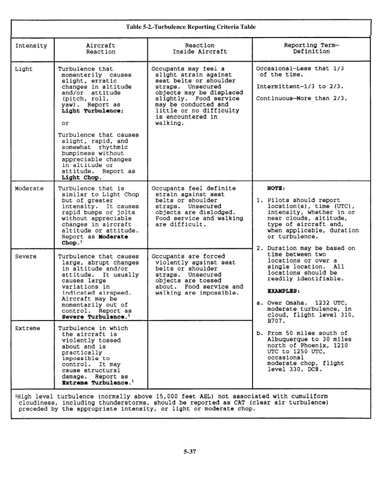
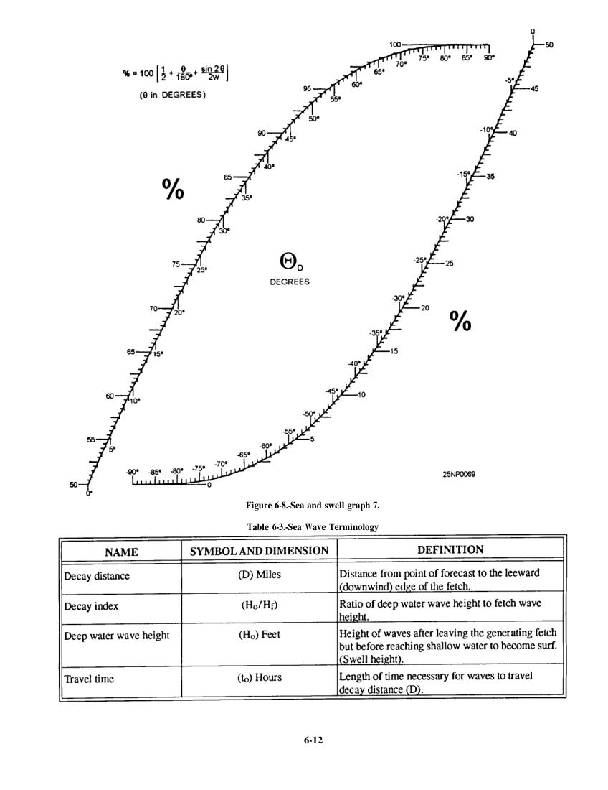
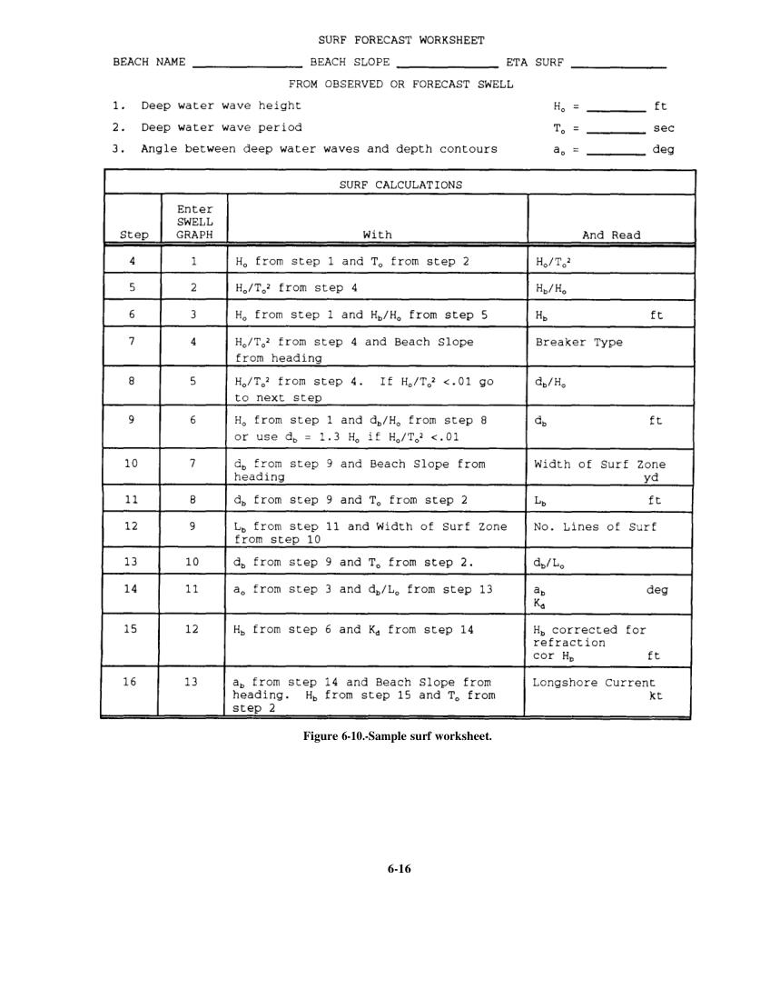
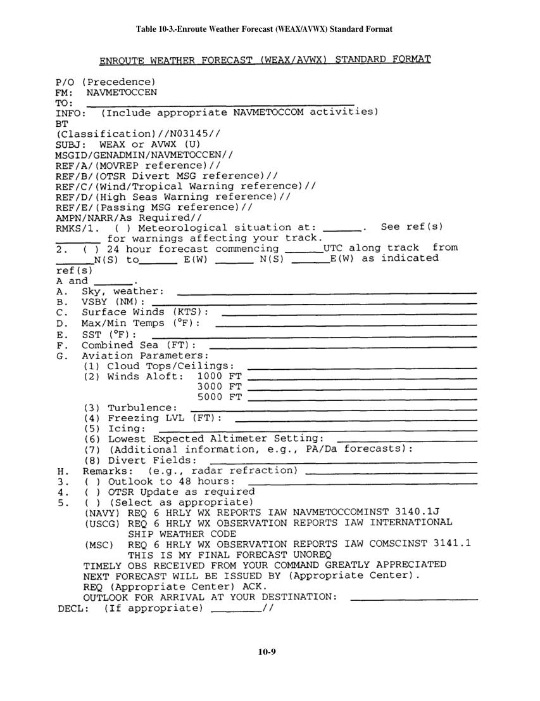
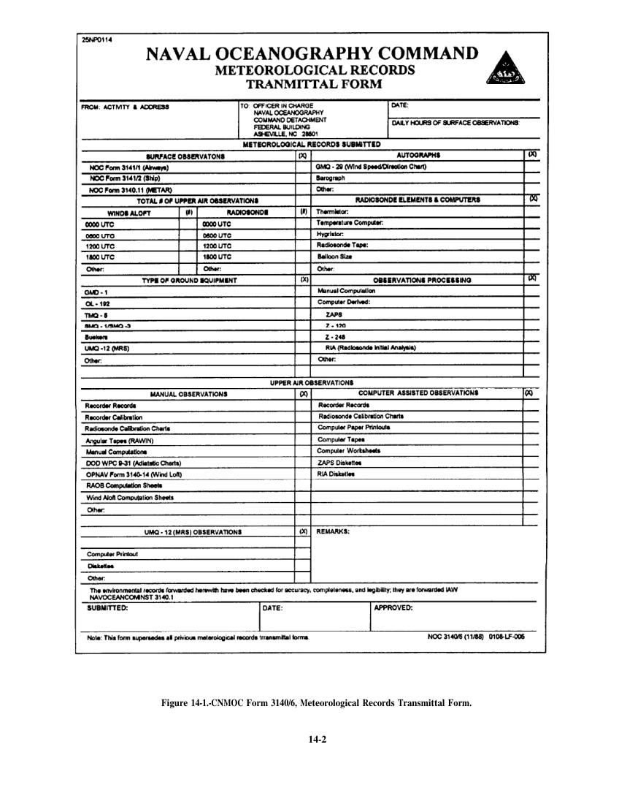
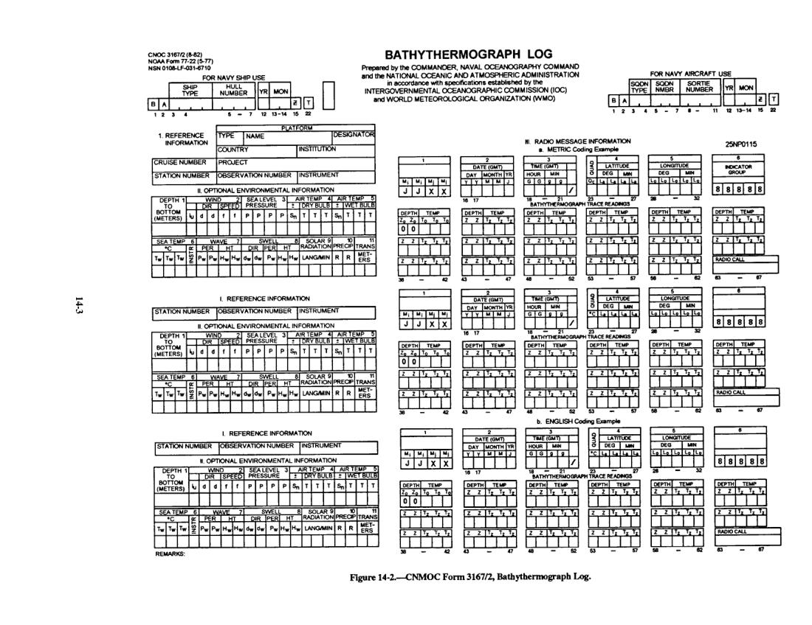

# U.S. Navy - Aerographer's Mate

> Source: <http://www.weather.gov/media/zhu/ZHU_Training_Page/Met_Tutorials/Met_Tutorial.pdf>  
> Section: Weather Handbooks and Important Links  
> Captured: 2026-08-19 06:00 UTC  
> PDF: [u-s-navy-aerographer-s-mate.pdf](u-s-navy-aerographer-s-mate.pdf) (272 pages)

---

## Page 1

DISTRIBUTION STATEMENT A:  Approved for public release; distribution is unlimited.
NONRESIDENT
TRAINING
COURSE
September 1995
Aerographer's Mate
1 & C
NAVEDTRA 14010

## Page 2

DISTRIBUTION STATEMENT A:  Approved for public release; distribution is unlimited.
Although the words “he,” “him,” and
“his” are used sparingly in this course to
enhance 
communication, 
they 
are 
not
intended to be gender driven or to affront or
discriminate against anyone.

## Page 3

i
PREFACE
By enrolling in this self-study course, you have demonstrated a desire to improve yourself and the Navy.
Remember, however, this self-study course is only one part of the total Navy training program. Practical
experience, schools, selected reading, and your desire to succeed are also necessary to successfully round
out a fully meaningful training program.
THE COURSE:  This self-study course is organized into subject matter areas, each containing learning
objectives to help you determine what you should learn along with text and illustrations to help you
understand the information.  The subject matter reflects day-to-day requirements and experiences of
personnel in the rating or skill area.  It also reflects guidance provided by Enlisted Community Managers
(ECMs) and other senior personnel, technical references, instructions, etc., and either the occupational or
naval standards, which are listed in the Manual of Navy Enlisted Manpower Personnel Classifications
and Occupational Standards, NAVPERS 18068.
THE QUESTIONS:  The questions that appear in this course are designed to help you understand the
material in the text.
VALUE:  In completing this course, you will improve your military and professional knowledge.
Importantly, it can also help you study for the Navy-wide advancement in rate examination. If you are
studying and discover a reference in the text to another publication for further information, look it up.
1995 Edition Prepared by
AGCM B. J. Bauer and
AGC(AW) T. Howlett
Published by
NAVAL EDUCATION AND TRAINING
PROFESSIONAL DEVELOPMENT
AND TECHNOLOGY CENTER
NAVSUP Logistics Tracking Number
0504-LP-026-6930

## Page 4

ii
Sailor’s Creed
“I am a United States Sailor.
I will support and defend the
Constitution of the United States of
America and I will obey the orders
of those appointed over me.
I represent the fighting spirit of the
Navy and those who have gone
before me to defend freedom and
democracy around the world.
I proudly serve my country’s Navy
combat team with honor, courage
and commitment.
I am committed to excellence and
the fair treatment of all.”

## Page 5

CONTENTS
CHAPTER
Page
1. Convergence, Divergence, and Vorticity . . . . . . . . . . . . . . . . 1-1
2. Forecasting Upper Air Systems . . . . . . . . . . . . . . . . . . . . . . 2-1
3. Forecasting Surface Systems . . . . . . . . . . . . . . . . . . . . . . . . . 3-1
4. Forecasting Weather Elements . . . . . . . . . . . . . . . . . . . . . . . 4-1
5. Forecasting Severe Weather Features . . . . . . . . . . . . . . . . . . 5-1
6. Sea Surface Forecasting . . . . . . . . . . . . . . . . . . . . . . . . . . . . 6-1
7. Meteorological Products and Tactical Decision Aids . . . . . . . 7-1
8. Oceanographic Products and Tactical Decision Aids . . . . . . . 8-1
9. Operational Oceanography . . . . . . . . . . . . . . . . . . . . . . . . . . 9-1
10. Special Observations and Forecasts . . . . . . . . . . . . . . . . . . . 10-1
11. Tropical Forecasting . . . . . . . . . . . . . . . . . . . . . . . . . . . ...11-1
12. Weather Radar . . . . . . . . . . . . . . . . . . . . . . . . . . . . . . . ...12-1
13. Meteorological and Oceanographic Briefs . . . . . . . . . . . . . . . 13-1
14. Administration and Training . . . . . . . . . . . . . . . . . . . . . . . . 14-1
APPENDIX
I. References Used to Develop the TRAMAN . . . . . . . . . . . . . AI-1
INDEX . . . . . . . . . . . . . . . . . . . . . . . . . . . . . . . . . . . . . . . . INDEX-1
iii

## Page 6

iv
INSTRUCTIONS FOR TAKING THE COURSE
ASSIGNMENTS
The text pages that you are to study are listed at
the beginning of each assignment. Study these
pages carefully before attempting to answer the
questions. Pay close attention to tables and
illustrations and read the learning objectives.
The learning objectives state what you should be
able to do after studying the material. Answering
the questions correctly helps you accomplish the
objectives.
SELECTING YOUR ANSWERS
Read each question carefully, then select the
BEST answer. You may refer freely to the text.
The answers must be the result of your own
work and decisions. You are prohibited from
referring to or copying the answers of others and
from giving answers to anyone else taking the
course.
SUBMITTING YOUR ASSIGNMENTS
To have your assignments graded, you must be
enrolled in the course with the Nonresident
Training Course Administration Branch at the
Naval Education and Training Professional
Development 
and 
Technology 
Center
(NETPDTC). Following enrollment, there are
two ways of having your assignments graded:
(1) use the Internet to submit your assignments
as you complete them, or (2) send all the
assignments at one time by mail to NETPDTC.
Grading on the Internet:  Advantages to
Internet grading are:
• 
you may submit your answers as soon as
you complete an assignment, and
• 
you get your results faster; usually by the
next working day (approximately 24 hours).
In addition to receiving grade results for each
assignment, you will receive course completion
confirmation once you have completed all the
assignments. 
To 
submit 
your 
assignment
answers via the Internet, go to:
http://courses.cnet.navy.mil
Grading by Mail: When you submit answer
sheets by mail, send all of your assignments at
one time. Do NOT submit individual answer
sheets for grading. Mail all of your assignments
in an envelope, which you either provide
yourself or obtain from your nearest Educational
Services Officer (ESO). Submit answer sheets
to:
COMMANDING OFFICER
NETPDTC N331
6490 SAUFLEY FIELD ROAD
PENSACOLA FL 32559-5000
Answer Sheets: All courses include one
“scannable” answer sheet for each assignment.
These answer sheets are preprinted with your
SSN, name, assignment number, and course
number. Explanations for completing the answer
sheets are on the answer sheet.
Do not use answer sheet reproductions:  Use
only the original answer sheets that we
provide— reproductions will not work with our
scanning equipment and cannot be processed.
Follow the instructions for marking your
answers on the answer sheet. Be sure that blocks
1, 2, and 3 are filled in correctly. This
information is necessary for your course to be
properly processed and for you to receive credit
for your work.
COMPLETION TIME
Courses must be completed within 12 months
from the date of enrollment. This includes time
required to resubmit failed assignments.

## Page 7

v
PASS/FAIL ASSIGNMENT PROCEDURES
If your overall course score is 3.2 or higher, you
will pass the course and will not be required to
resubmit assignments. Once your assignments
have been graded you will receive course
completion confirmation.
If you receive less than a 3.2 on any assignment
and your overall course score is below 3.2, you
will be given the opportunity to resubmit failed
assignments. 
You 
may 
resubmit 
failed
assignments only once.  Internet students will
receive notification when they have failed an
assignment--they may then resubmit failed
assignments on the web site. Internet students
may 
view 
and 
print 
results 
for 
failed
assignments from the web site. Students who
submit by mail will receive a failing result letter
and a new answer sheet for resubmission of each
failed assignment.
COMPLETION CONFIRMATION
After successfully completing this course, you
will receive a letter of completion.
ERRATA
Errata are used to correct minor errors or delete
obsolete information in a course.  Errata may
also be used to provide instructions to the
student.  If a course has an errata, it will be
included as the first page(s) after the front cover.
Errata for all courses can be accessed and
viewed/downloaded at:
http://www.advancement.cnet.navy.mil
STUDENT FEEDBACK QUESTIONS
We value your suggestions, questions, and
criticisms on our courses. If you would like to
communicate with us regarding this course, we
encourage you, if possible, to use e-mail. If you
write or fax, please use a copy of the Student
Comment form that follows this page.
For subject matter questions:
E-mail: 
n315.products@cnet.navy.mil
Phone: 
Comm:  (850) 452-1001, Ext. 1713
DSN:  922-1001, Ext. 1713
FAX:  (850) 452-1370
(Do not fax answer sheets.)
Address:
COMMANDING OFFICER
NETPDTC (CODE 315)
6490 SAUFLEY FIELD ROAD
PENSACOLA FL 32509-5237
For 
enrollment, 
shipping, 
grading, 
or
completion letter questions
E-mail: 
fleetservices@cnet.navy.mil
Phone: 
Toll Free:  877-264-8583
Comm:  (850) 452-1511/1181/1859
DSN:  922-1511/1181/1859
FAX:  (850) 452-1370
(Do not fax answer sheets.)
Address:
COMMANDING OFFICER
NETPDTC (CODE N331)
6490 SAUFLEY FIELD ROAD
PENSACOLA FL 32559-5000
NAVAL RESERVE RETIREMENT CREDIT
If you are a member of the Naval Reserve, you
will receive retirement points if you are
authorized to receive them under current
directives 
governing 
retirement 
of 
Naval
Reserve 
personnel. 
For 
Naval 
Reserve
retirement, this course is evaluated at 8 points.
(Refer to Administrative Procedures for Naval
Reservists on Inactive Duty, BUPERSINST
1001.39, for more information about retirement
points.)
COURSE OBJECTIVES
The objective of this course is to provide
Aerographer's Mates with occupational informa-
tion on the following areas: convergence,
divergence, and vorticity; the forecasting of
upper air systems; the forecasting of surface
systems; the forecasting of weather elements;
the forecasting of severe weather features; sea
surface forecasting; meteorological products and
tactical decision aids; oceanographic products
and tactical decision aids; operational oceano-

## Page 8

vi
graphy; tropical forecasting; weather radar;
meteorological and oceanographic briefs; and
administra-tion and training.

## Page 9

vii
Student Comments
Course Title:
Aerographer's Mate 1 & C
NAVEDTRA:
14010
Date:
We need some information about you:
Rate/Rank and Name:
SSN:
Command/Unit
Street Address:
City:
State/FPO:
Zip
Your comments, suggestions, etc.:
Privacy Act Statement:  Under authority of Title 5, USC 301, information regarding your military status is
requested in processing your comments and in preparing a reply.  This information will not be divulged without
written authorization to anyone other than those within DOD for official use in determining performance.
NETPDTC 1550/41 (Rev 4-00)

## Page 10

_(no extractable text on this page — see rendered image above)_

## Page 11

CHAPTER 1
CONVERGENCE, DIVERGENCE, AND VORTICITY
In your reading of the AG2 manual, volume 1, you
became familiar with the terms convergence,
divergence, and vorticity when used in relation to
surface lows and highs. You were also presented with
a basic understanding of the principles involved In this
section, we will cover the terms, the motions involved
in upper air features and surface features, and the
relationship of these processes to other meteorological
applications,
We will first discuss convergence and divergence,
followed by a discussion of vorticity.
NOTE
The World Meteorological
Organization adopted “hectopascals”
(hPa) as its standard unit of
measurement for pressure. Because
the units of hectopascals and millibars
are interchangeable (1 hPa = 1 mb),
hectopascals have been substituted for
millibars in this TRAMAN.
CONVERGENCE AND
DIVERGENCE
LEARNING OBJECTIVES: Define the terms
convergence and divergence. Recognize
directional and velocity wind shear rules.
Recognize areas of mass divergence and mass
convergence on surface pressure charts.
Identify the isopycnic level. Retail the effects
that convergence and divergence have on
surface pressure systems and features aloft.
Identify rules associated with divergence and
convergence.
As mentioned in the AG2 manual, volume 1, unit 8,
convergence is the accumulation of air in a region or
layer of the atmosphere, while divergence is the
depletion of air in a region or layer. The layer of
maximum convergence and divergence occurs between
the 300- and 200-hPa levels. Coincidentally, this is also
the layer of maximum winds in the atmosphere; where
jet stream cores are usually found. These high-speed
winds are directly related to convergence and
divergence. The combined effects of wind direction and
wind speed (velocity) is what produces convergent and
divergent airflow.
CONVERGENCE AND DIVERGENCE
(SIMPLE MOTIONS)
Simply stated, convergence is defined as the
increase of mass within a given layer of the atmosphere,
while divergence is the decrease of mass within a given
layer of the atmosphere.
Convergence
For convergence to take place, the winds must result
in a net inflow of, air into that layer. We generally
associate this type of convergence with low-pressure
areas, where convergence of winds toward the center of
the low results in an increase of mass into the low and
an upward motion.
In meteorology, we distinguish
between two types of convergence as either horizontal
or vertical convergence, depending upon the axis of the
flow.
Divergence
Winds in this situation produce a net flow of air
outward from the layer.
We associate this type of
divergence with high-pressure cells, where the flow of
air is directed outward from the center, causing a
downward motion. Divergence, too, is classified as
either horizontal or vertical.
DIRECTIONAL WIND SHEAR
The simplest forms of convergence and divergence
are the types that result from wind direction alone. Two
flows of air need not be moving in opposite directions
to induce divergence, nor moving toward the same point
to induce convergence, but maybe at any angle to each
other to create a net inflow of air for convergence or a
net outflow for divergence.
1-1

## Page 12

WIND SPEED (VELOCITY) SHEAR
Convergence is occurring when wind speeds are
decreasing downstream; that is, mass is accumulating
upstream. Conversely, divergence is occurring when
wind speeds are increasing downstream; that is, mass is
being depleted upstream.
DIRECTIONAL AND SPEED WIND SHEAR
Wind speed in relation to the wind direction is also
a valuable indicator. For example, on a streamline
analysis chart we can analyze both wind direction and
wind speed, variations in wind speed along the
streamlines, or the convergence or divergence of the
streamlines.
The following are some of the combinations or
variations of wind speed and direction:
. In a field of parallel streamlines (wind flow), if
the wind speed is decreasing downstream (producing a
net inflow of air for the layer), convergence is taking
place. If the flow is increasing downstream (a net
outflow of air from the layer), divergence is occurring.
. In an area of uniform wind speed along the
streamlines, if the streamlines diverge (fan out),
divergence is occurring; if the streamlines converge
(come together), convergence is taking place.
. Normally, the convergence and divergence
components are combined. The fact that streamlines
converge or diverge does not necessarily indicate
convergence or divergence. We must also consider the
wind speeds— whether they are increasing or
decreasing downstream in relation to whether the
streamlines are spreading out or coming together.
. If, when looking downstream on the streamlines,
the wind speed increases and the streamlines diverge,
divergence is taking place. On the other hand, if the
wind speed decreases downstream and the streamlines
come together, convergence is taking place.
There are other situations where it is more difficult
to determine whether divergence or convergence is
occurring, such as when the wind speed decreases
downstream and the wind flow diverges, as well as when
wind speed increases downstream and the wind flow
converges. A special evaluation then must be made to
determine the net inflow or outflow.
DIVERGENCE AND CONVERGENCE
(COMPLEX MOTIONS)
In this section we will be discussing high-level
convergence and divergence in relation to downstream
contour patterns and the associated advection patterns.
Low tropospheric advection (and also stratospheric
advection) certainly play a large role in pressure change
mechanisms.
Since the term divergence is meant to denote
depletion of mass, while convergence is meant to denote
accumulation of mass, the forecaster is concerned with
the mass divergence or mass convergence in estimating
pressure or height changes. Mass divergence in the
entire column of air produces pressure or height falls,
while mass convergence in the entire column of air
produces pressure or height rises at the base of the
column.
Mass Divergence and Mass Convergence
Mass divergence and mass convergence involve the
density field as well as the velocity field. However, the
mass divergence and mass convergence of the
atmosphere are believed to be largely stratified into two
layers as follows:
l Below about 600 hPa, velocity divergence and
convergence occur chiefly in the friction layer, which is
about one-eighth of the weight of the 1,000-to 600-hPa
advection stratum, and may be disregarded in
comparison with density transport in estimating the
contribution to the pressure change by the advection
stratum.
. Above 600 hPa, mass divergence and
convergence largely result from horizontal divergence
and convergence of velocity. However, on occasion,
stratospheric advection of density may be a modifying
factor.
The stratum below the 400-hPa level may be
regarded as the ADVECTION stratum, while the
stratum above the 400-mb level maybe regarded as the
significant horizontal divergence or convergence
stratum. Also, the advection stratum maybe thought of
as the zone in which compensation of the dynamic
effects of the upper stratum occurs.
The Isopycnic Level
At about 8km (26,000 ft) the density is nearly
constant. This level, which is near the 350-hPa pressure
surface, is called the isopycnic level. This level is the
1-2

## Page 13

location of constant density, with mass variations above
and below.
Since the density at 200 hPa is only four-sevenths
the density at the isopycnic level, the height change at
200 hPa would have to be twice that at the isopycnic
level (350 hPa) for the same pressure/height change to
occur. Thus, height changes in the lower stratosphere
tend to be a maximum even though pressure changes are
a maximum at the isopycnic level.
Pressure changes occur at the isopycnic level, and
in order to maintain constant density a corresponding
temperature change must also occur. Since the density
is nearly constant at this level, the required temperature
variations must result from vertical motions. When the
pressures are rising at this level, the temperature must
also rise to keep the density constant. A temperature rise
can be produced by descending motion.
Similarly
falling pressures at this level require falling
temperatures to keep the density constant. Falling
temperatures in the absence of advection can be
produced by ascent through this level.
Thus, rising heights at the isopycnic level are
associated with subsidence, and falling heights at the
isopycnic level are associated with convection.
The 350-hPa to 200-hPa Stratum
Subsidence at 350 hPa can result from horizontal
convergence above this level, while convection here
would result from horizontal divergence above this
level.
Since rising heights in the upper troposphere result
in a rising of the tropopause and the lower stratosphere,
the maximum horizontal convergence must occur
between the isopycnic level (350 hPa) and the average
level of the tropopause (about 250 hPa). This is due to
the reversal of the vertical motion between the
tropopause and the isopycnic level. Thus, the level of
maximum horizontal velocity convergence must be
between 300 hPa and 200 hPa and is the primary
mechanism for pressure or height rises in the upper air.
Similarly, upper height falls are produced by horizontal
velocity divergence with a maximum at the same level.
The maximum divergence occurs near or slightly above
the tropopause and closer to 200 hPa than to 300 hPa.
Therefore, it is more realistic to define a layer of
maximum divergence and convergence as occurring
between the 300- and 200-hPa pressure surfaces. The
300- to 200-hPa stratum is also the layer in which the
core of the jet stream is usually located. It is also at this
level that the cumulative effects of the mean temperature
field of the troposphere produce the sharpest horizontal
contrasts in the wind field.
The level best suited for determination of
convergence and divergence is the 300-hPa level.
Because of the sparsity of reports at the 300-hPa
level, it is frequently advantageous to determine the
presence of convergence and divergence at the 500-hPa
level.
Divergence/Convergence and Surface
Pressure Systems
The usual distribution of divergence and
convergence relative to moving pressure systems is as
follows:
l In advance of the low, convergence occurs at low
levels and divergence occurs aloft, with the level of
nondivergence at about 600 hPa.
l In the rear of the low, there is usually
convergence aloft and divergence near the surface.
The low-level convergence ahead of the low occurs
usually in the stratum of strongest warm advection, and
the low-level divergence in the rear of the low occurs in
the stratum of strongest cold advection. The low-level
divergence occurs primarily in the friction layer
(approximately 3,000 ft) and is thought to be of minor
importance in the modification of thickness advection
compared with heating and cooling from the underlying
surfaces.
Divergence/Convergence Features Aloft
In advance of the low, the air rises in response to the
low-level convergence, with the maximum ascending
motion at the level of nondivergence eventually
becoming zero at the level of maximum horizontal
divergence (approximately 300 hPa). Above this level,
descending motion is occurring. In the rear of the low,
the reverse is true; that is, descending motion in the
surface stratum and ascending motion in the upper
troposphere above the level of maximum horizontal
convergence. In deepening systems, the convergence
aloft to the rear of the low is small or may even be
negative (divergence).
In filling systems, the
divergence aloft in advance of the low is small or even
negative (convergence).
Thus, in the development and movement of surface
highs and surface lows, two vertical circulations are
involved, one below and one above the 300-hPa level.
The lower vertical circulation is upward in the cyclone
1-3

## Page 14

Figure 1-1.-Generalized vertical circulation overdeveloping highs and lows.
and downward in the anticyclone. The upper vertical
circulation involves downward motion in the
stratosphere of the developing cyclone and upward
motion in the upper troposphere and lower stratosphere
of the developing anticyclone. See figure 1-1.
Divergence and upper-height falls are associated
with high-speed winds approaching weak contour
gradients which are cyclonically curved. Figure 1-2
illustrates contour patterns associated with height falls,
Convergence and upper-height rises are associated
with the following:
. Low-speed winds approaching straight or
cyclonically curved strong contour gradients. See
figure 1-3, view (A).
. High-speed winds approaching anticyclonically
curved weak contour gradients.
(B).
See figure 1-3, view
Figure 1-2.-Divergence Illustrated.
1-4
Figure 1-3.-Convergence Illustrated.

## Page 15

Note that the associated height rises or falls occur
downstream and to the left of the flow, as illustrated in
figure 1-3.
Divergence Identification (Downstream
Straightline Flow)
The technique for determining the areas of
divergence consists in noting those areas where winds
of high speed are approaching weaker downstream
gradients that are straight. When inertia carries a
high-speed parcel of air into a region of weak gradient,
it possesses a Coriolis force too large to be balanced by
the weaker gradient force, It is thus deflected to the
right. This results in a deficit of mass to the left. The
parcels that are deflected to the right must penetrate
higher pressure/heights and are thus slowed down until
they are in balance with the weaker gradient. Then they
can be steered along the existing isobaric or contour
channels.
Divergence Identification (Weak Downstream
Cyclonically Curved Flow)
If the weak downstream gradients are cyclonically
curved, the divergence resulting from the influx of
high-speed wind is even more marked due to the
additional effect of centrifugal forces.
Divergence Identification (Downstream
Anticyclonically Curved Flow)
The effect of centrifugal forces on anticyclonically
curving high-speed parcels is of extreme importance in
producing overshooting of high-speed air from sharply
curved ridges into adjacent troughs, causing pressure
rises in the west side of the troughs.
Divergence Identification (Strong Winds)
If high-speed parcels approach diverging
cyclonically curved contours, large contour falls will
occur downstream to the left of the high-speed winds.
Eventually a strong pressure gradient is produced
downstream, to the right of the high-speed winds,
chiefly as a result of pressure falls to the left of the
direction of high-speed winds in the cyclonically curved
contours with weak pressure gradient. Usually the
deflection of air toward higher pressure is so slight that
it is hardly observable in individual wind observations.
However, when the pressure field is very weak to the
tight of the incoming high-speed stream, noticeable
angles between the wind and contours may be observed,
especially at lower levels, due to transport of momentum
downward as a result of subsidence, where the gradients
are even weaker. This occurs sometimes to such an
extent that the wind flow is considerably more curved
anticyclonically than the contours. In rare cases this
results in anticyclonic circulation centers out of phase
with the high-pressure center. This is a transitory
condition necessitating a migration of the pressure
center toward the circulation center. In cases where the
high-pressure center and anticyclonic wind flow center
are out of phase, the pressure center will migrate toward
the circulation center (which is usually a center of mass
convergence).
It is more normal, however, for the wind component
toward high pressure to be very slight, and unless the
winds and contours are drawn with great precision, the
deviation goes unnoticed.
Overshooting
High-speed winds approaching sharply curved
ridges result in large height rises downstream from the
ridge due to overshooting of the high-speed air. It is
known from the gradient wind equation that for a given
pressure gradient there is a limiting curvature to the
trajectory of a parcel of air moving at a given speed.
Frequently on upper air charts, sharply curved
stationary ridges are observed with winds of high speed
approaching the ridge.
The existence of a sharply
curved extensive ridge usually means a well-developed
trough downstream, and frequently a cold or cutoff low
exists in this trough. The high-speed winds approaching
the ridge, due to centrifugal forces, are unable to make
the sharp turn necessary to follow the contours. These
winds overshoot the ridge anticyclonically, but with less
curvature than the contours, resulting in their plunging
across contours toward lower pressure/heights
downstream from the ridge. This may result in anyone
of a number of consequences for the downstream
trough, depending on the initial configuration of the
ridge and trough, but all of these consequences are based
on the convergence of mass into the trough as a result
of overshooting of winds from the ridge.
Four effects of overshooting areas follows:
1. Filling of the downstream trough. This happens
if the contour gradient is strong on the east side of the
trough; that is, a blocking ridge to the east of the trough.
2. Acceleration of the cutoff low from of its
stationary position. This usually occurs in all cases.
1-5

## Page 16

3. Radical reorientation of the trough. This usually
happens where the trough is initially NE-SW, resulting
in a N-S and in some cases a NW-SE orientation after
sufficient time (36 hours).
4. This situation may actually cut off a low in the
lower area of the trough. This usually happens when the
high-speed winds approaching the ridge are
southwesterly and approach the ridge at a comparatively
high latitude relative to the trough. This frequently
reorients the trough line towards a more NE-SW
direction.
Usually, the reorientation of the trough
occurs simultaneously with 1 and 2.
Sharply Curved Ridges
Closely related to the previously mentioned
situation are cases of sharply curved ridges where the
gradient in the sharply curved portion (usually the
northern portions of a north-south ridge) has
momentarily built up to a strength that is incompatible
with the anticyclonic curvature. Such ridges often
collapse with great rapidity prior to the development of
such excessive gradients, causing rapid filling of the
adjacent downstream trough, and large upper contour
falls.
The gradient wind relation implies that
subsequent trajectories of the high-speed parcels
generated in the strong ridge line gradient must be less
anticyclonically curved than the contours in the ridge.
It can also be shown from the gradient wind
equation that the anticyclonic curvature increases as the
difference between the actual wind and the geostrophic
wind increases, until the actual wind is twice the
geostrophic wind, when the trajectory curvature is at a
maximum. This fact can be used in determining the
trajectory of high-speed parcels approaching sharply
curved stationary ridges or sharply curved stationary
ridges with strong gradients. By measuring the
geostrophic wind in the ridge, the maximum trajectory
curvature can be obtained from the gradient wind scale.
This trajectory curve is the one that an air parcel at the
origin point of the scale will follow until it intersects the
correction curve from the geostrophic speed to the
displacement curve of twice the geostrophic speed.
Actual Wind Speeds
If actual wind speed observations are available for
parcels approaching the ridge, comparison can be made
with the geostrophic winds (pressure gradient) in the
ridge. If the actual speeds are more than twice the
measured geostrophic wind in the ridge, the anticyclonic
curvature of these high-speed parcels will be less than
the maximum trajectory curvature obtained from the
gradient wind scale, and even greater overshooting of
these high-speed parcels will occur across lower
contours.
Convergence in the west side of the
downstream trough results in lifting of the tropopause
with dynamic cooling and upper-level contour rises.
Subgradient Winds
Low-speed winds approaching an area of stronger
gradient become subject to an unbalanced gradient force
toward the left due to the weaker Coriolis force. These
subgradient winds are deflected toward lower pressure,
crossing contours and producing contour rises in the
area of cross-contour flow. This cross-contour flow
accelerates the air until it is moving fast enough to be
balanced by the stronger pressure gradient. Due to the
acceleration of the slower oncoming parcels of air, the
contour rises propagate much faster than might be
expected on the basis of the slow speed of the air as it
initially enters the stronger pressure gradient.
The following two rules summarize the discussion
of subgradient winds:
. High-speed winds approaching low-speed winds
with weak cyclonically curved contour gradients are
indicative of divergence and upper-height falls
downstream to the left of the current.
. Low-speed winds approaching strong,
cyclonically curved contour gradients or high-speed
winds approaching low-speed winds with weak
anticyclonically curved contour gradients are indicative
of convergence and upper height rises downstream and
to the left and right of the current, respectively.
IMPORTANCE OF CONVERGENCE AND
DIVERGENCE
Convergence and divergence have a pronounced
effect upon the weather occurring in the atmosphere.
Vertical motion, either upward or downward, is
recognized as an important parameter in the
atmosphere. For instance, extensive regions of
precipitation associated with extratropical cyclones are
regions of large-scale upward motion. Similarly, the
nearly cloud-free regions in large anticyclones are
regions in which air is subsiding. Vertical motions also
affect temperature, humidity, and other meteorological
elements.
1-6

## Page 17

Changes in Stability
When convergence or divergence occurs, whether
on a large or small scale, it may have a very pronounced
effect on the stability of the air. For example, when
convection is induced by convergence, air is forced to
rise without the addition of heat. If this air is
unsaturated, it cools first at the dry adiabatic rate; or if
saturated at the moist rate. The end result is that the air
is cooled, which will increase the instability y of that air
column due to a net release of heat. Clouds and weather
often result from this process.
Conversely, if air subsides, and this process is
produced by convergence or divergence, the sinking air
will heat at the dry adiabatic lapse rate due to
compression. The warming at the top of an air column
will increase the stability of that air column by reducing
the lapse rate. Such warming often dissipates existing
clouds or prevents the formation of new clouds. If
sufficient warming due to the downward motion takes
place, a subsidence inversion is produced.
Effect on Weather
The most important application of vertical motion
is the prediction of rainfall probability and rainfall
amount. In addition, vertical motion affects practically
all meteorological properties, such as temperature,
humidity, wind distribution, and particularly stability.
In the following section the distribution of large-scale
and small-scale vertical motions are considered.
Since cold air has a tendency to sink, subsidence is
likely to be found to the west of upper tropospheric
troughs, and rising air to the east of the troughs. Thus,
there is a good relation between upper air meridional
flow and vertical flow.
In the neighborhood of a straight Northern
Hemisphere jet stream, convergence is found to the
north of the stream behind centers of maximum speed
as well as to the south and ahead of such centers.
Divergence exists in the other two quadrants. Below the
regions of divergence the air rises; below those of
convergence there is subsidence.
These general rules of thumb are not perfect, and
only yield a very crude idea about distribution of vertical
motion in the horizontal. Particularly over land in
summer, there exists little relation between large-scrale
weather patterns and vertical motion. Rather, vertical
motion is influenced by local features and shows strong
diurnal variations. Large-scale vertical motion is of
small magnitude at the ground (zero if the ground is flat).
Above ground level, it increases in magnitude to at least
500 hPa and decreases in the neighborhood of the
tropopause. There have been several studies of the
relation between frontal precipitation and large-scale
vertical velocities, computed by various techniques. In
all cases, the probability of precipitation is considerably
higher in the 6 hours following an updraft than following
subsidence. Clear skies are most likely with
downdrafts. On the other hand, it is not obvious that
large-scale vertical motion is related to showers and
thunderstorms caused during the daytime by heating.
However, squall lines, which are formed along lines of
horizontal convergence, show that large-scale vertical
motion may also play an important part in convective
precipitation.
Vertical Velocity Charts
Vertical velocity charts are currently being
transmitted over the facsimile network and are
computed by numerical weather prediction methods.
The charts have plus signs indicating upward motion
and minus signs indicating downward motion. The
figures indicate vertical velocity in centimeters per
second (cm/sec). With the larger values of upward
motions (plus values) the likelihood of clouds and
precipitation increases. However, an evaluation of the
moisture and vertical velocity should be made to get
optimum results. Obviously, upward motion in dry air
is not as likely to produce precipitation as upward
motion in moist air.
Studies have shown that surface cyclones and
anticyclones are not independent of developments in the
upper atmosphere, rather, they work in tandem with one
another.
The relationship of the cyclone to the
large-scale flow patterns aloft must therefore be a part
of the daily forecast routine.
Many forecasters have a tendency to shy away from
the subject of vorticity, as they consider it too complex
a subject to be mastered. By not considering vorticity
and its effects, the forecaster is neglecting an important
forecasting tool. The principles of vorticity are no more
complicated than most of the principles of physics, and
can be understood just as readily. In the following
section we will discuss the definition of vorticity, its
evaluation, and its relationships to other meteorological
parameters.
1-7

## Page 18

VORTICITY
LEARNING OBJECTIVES: Recognize the two
components of relative vorticity. Define the
term absolute vorticity. Determine vorticity
impacts on weather processes.
Vorticity measures the rotation of very small air
parcels. A parcel has vorticity when it spins on its axis
as it moves along its path. A parcel that does not spin
on its axis is said to have zero vorticity. The axis of
spinning or rotation can extend in any direction, but for
our purposes, we are mainly concerned with the
rotational motion about an axis that is perpendicular to
the surface of the Earth. For example, we could drop a
chip of wood into a creek and watch its progress. The
chip will move downstream with the flow of water, but
it may or may not spin as it moves downstream. If it
does spin, the chip has vorticity. When we try to isolate
the cause of the spin, we find that two properties of the
flow of water cause the chip to spin: (1) If the flow of
water is moving faster on one side of the chip than the
other, this is shear of the current; (2) if the creek bed
curves, the path has curvature. Vorticity always applies
to extremely small air parcels; thus, a point on one of
our upper air charts may represent such a parcel. We
can examine this point and say that the parcel dots or
does not have vorticity. However, for this discussion,
larger parcels will have to be used to more easily
visualize the effects.
Actually, a parcel in the
atmosphere has three rotational motions at the same
time: (1) rotation of the parcel about its own axis
(shear), (2) rotation of the parcel about the axis of a
pressure system (curvature), and (3) rotation of the
parcel due to the atmospheric rotation. The sum of the
first two components is known as relative vorticity, and
the sum total of all three is known as absolute vorticity.
RELATIVE VORTICITY
Relative vorticity is the sum of the rotation of the
parcel about the axis of the pressure system (curvature)
and the rotation of the parcel about its own axis (shear).
Figure 1-4.-Illustration of vorticity due to the shear effect.
The vorticity of a horizontal current can be broken down
into two components, one due to curvature of the
streamlines and the other due to shear in the current.
Shear
First, let us examine the shear effect by looking at
small air parcels in an upper air pattern of straight
contours. Here the wind shear results in each of the
three parcels having different rotations (fig. 1-4).
Refer to figure 1-4. Parcel No. 1 has stronger wind
speeds to its right. As the parcel moves along, it will be
rotated in a counterclockwise direction. Parcel No. 2
has the stronger wind speeds to its left; therefore, it will
rotate in a clockwise direction as it moves along. Parcel
No. 3 has equal wind speeds to the right and left. It will
move, but it will not rotate. It is said to have zero
vorticity.
Therefore, to briefly review the effect of shear-a
parcel of the atmosphere has vorticity (rotation) when
the wind speed is stronger on one side of the parcel than
on the other.
Now let’s define positive and negative vorticity in
terms of clockwise and counterclockwise rotation of a
parcel. The vorticity is positive when the parcel has a
counterclockwise rotation (cyclonic, Northern
Hemisphere) and the vorticity is negative when the
parcel has clockwise rotation (anticyclonic, Northern
Hemisphere).
Thus, in figure 1-4, parcel No. 1 has positive
vorticity, and parcel No. 2 has negative vorticity.
Curvature
Vorticity can also result due to curvature of the
airflow or path. In the case of the wood chip flowing
with the stream, the chip will spin or rotate as it moves
along if the creek curves.
To demonstrate the effect of curvature, let us
consider a pattern of contours having curvature but no
shear (fig. 1-5).
Figure 1-5.-Illustration of vorticity due to curvature effect.
1-8

## Page 19

Place a small parcel at the trough and ridge lines and
observe the way the flow will spin the parcel, causing
vorticity. The diameter of the parcel will be rotated from
the solid line to the dotted position (due to the northerly
and southerly components of the flow on either side of
the trough and ridge lines).
Note that we have counterclockwise rotation at the
trough (positive vorticity), and at the ridge line we have
clockwise rotation (negative vorticity). At the point
where there is no curvature (inflection point), there is no
turning of the parcel, hence no vorticity. This is
demonstrated at point Pin figure 1-5.
Combined Effects
To find the relative vorticity of a given parcel, we
must consider both the shear and curvature effects. It is
quite possible to have two effects counteract each other;
that is, where shear indicates positive vorticity but
curvature indicates negative vorticity, or vice versa (fig.
1-6).
To find the net result of the two effects we would
measure the value of each and add them algebraically.
The measurement of vorticity will be discussed in the
next section.
It must be emphasized here that relative vorticity is
observed instantaneously. Relative vorticity in the
atmosphere is defined as the instantaneous rotation of
very small particles. The rotation results from wind
shear and curvature. We refer to this vorticity as being
relative, because all the motion illustrated was relative
to the surface of the Earth.
ABSOLUTE VORTICITY
When the relative vorticity of a parcel of air is
observed by a person completely removed from the
Earth, he or she observes an additional component of
vorticity created by the rotation of the Earth. Thus, this
Figure 1-6-Illustration of shear effect opposing the curvature
effect in producing vorticity. (A) Negative shear and positive
curvature; (B) positive shear and negative curvature.
Figure 1-7.-Contour-isotach pattern for shear analysis.
person sees the total or absolute vorticity of the same
parcel of air.
The total vorticity, that is, relative vorticity plus that
due to the Earth’s rotation, is known as the absolute
vorticity. As was stated before, for practical use in
meteorology, only the vorticity about an axis
perpendicular to the surface of the Earth is considered.
In this case, the vorticity due to the Earth’s rotation
becomes equal to the Coriolis parameter. This is
expressed as 2oI sin Ø, where w is the angular velocity
of the Earth and Ø is the latitude. Therefore, the
absolute vorticity is equal to the Coriolis parameter plus
the relative vorticity. Writing this in equation form
gives: (Za = absolute vorticity)
Za=2cosin0+Zr
EVALUATION OF VORTICITY
In addition to locating the areas of convergence and
divergence, we must also consider the effects of
horizontal wind shear as it affects the relative vorticity,
and hence the movement of the long waves and
deepening or falling associated with this movement.
The two terms curvature and shear, which
determine the relative vorticity, may vary inversely to
each other. Therefore, it is necessary to evaluate both
of them. Figures 1-7 through 1-10 illustrate some of the
possible combinations of curvature and shear. Solid
Figure 1-8.-Contour-isotach pattern for shear analysis.
1-9

## Page 20

Figure 1-9.-Contour-isotachch pattern for shear analysis.
lines are streamlines or contours; dashed lines are
isotachs.
Figure 1-7 represents a symmetrical sinusoidal
streamline pattern with isotachs parallel to contours.
Therefore, there is no gradient of shear along the
contours.
In region I, the curvature becomes more
anticyclonic downstream, reaching a maximum at the
axis of the downstream ridge; that is, relative vorticity
decreases from the trough to a minimum at the
downstream ridge. The region from the trough to the
downstream ridge axis is favorable for deepening.
The reverse is true west of the trough, region II.
This region is unfavorable for deepening.
In figure 1-8 there is no curvature of streamlines;
therefore, the shear alone determines the relative
vorticity. The shear downstream in regions I and IV
becomes less cyclonic; in regions II and III, it becomes
more cyclonic. Regions I and IV are therefore favorable
for deepening downstream.
In region I of figure 1-9 both cyclonic shear and
curvature decrease downstream and this region is highly
favorable for deepening. In region III both cyclonic
shear and curvature increase downstream and this
region is unfavorable for deepening. In region II the
cyclonic curvature decreases downstream, but the
cyclonic shear increases. This situation is indeterminate
without calculation unless one term predominates. If
the curvature gradient is large and the shear gradient
small, the region is likely to be favorable for deepening.
Figure 1-10.-Contour-isotach pattern for shear analysis.
In region IV, the cyclonic curvature increases
downstream, but the cyclonic shear decreases, so that
this region is also indeterminate unless one of the two
terms predominates.
In region I of figure 1-10 the cyclonic shear
decreases downstream and the cyclonic curvature
increases. The region is indeterminate; however, if the
shear gradient is larger than the curvature gradient,
deepening is favored. Region II has increasing cyclonic
shear and curvature downstream and is quite
unfavorable. In region III, the shear becomes more
cyclonic downstream and the curvature becomes less
cyclonic. This region is also indeterminate unless the
curvature term predominates. In region IV, the shear
and curvature become less cyclonic downstream and the
region is favorable for deepening.
RELATION OF VORTICITY TO WEATHER
PROCESSES
Vorticity not only affects the formation of cyclones
and anticyclones, but it also has a direct bearing on
cloudiness, precipitation, pressure, and height changes.
Vorticity is used primarily in forecasting cloudiness and
precipitation over an extensive area. One rule states that
when relative vorticity decreases downstream in the
upper troposphere, convergence is taking place in the
lower levels. When convergence takes place,
cloudiness and possibly precipitation will prevail if
sufficient moisture is present.
One rule using vorticity in relation to cyclone
development stems from the observation that when
cyclone development occurs, the location, almost
without exception, is in advance of art upper trough.
Thus, when an upper level trough with positive vorticity
advection in advance of it overtakes a frontal system in
the lower troposphere, there is a distinct possibility of
cyclone development at the surface. This is usually
accompanied by deepening of the surface system. Also,
the development of cyclones at sea level takes place
when and where an area of positive vorticity advection
situated in the upper troposphere overlies a slow moving
or quasi-stationary front at the surface.
The relationship between convergence and
divergence can best be illustrated by the term shear. If
we consider a flow where the cyclonic shear is
decreasing downstream (stronger wind to the right than
to the left of the current), more air is being removed from
the area than is being fed into it, hence a net depletion
of mass aloft, or divergence. Divergence aloft is
associated with surface pressure falls, and since this is
1-10

## Page 21

the situation, the relative vorticity is decreasing
downstream. We may state that surface pressure falls
where relative vorticity decreases downstream in the
upper troposphere, or where advection of more cyclonic
vorticity takes place aloft. The converse of this is in the
case of convergence aloft.
SUMMARY
In this chapter we expanded on the subjects of
convergence, divergence, and vorticity, which were first
presented in the AG2 manual, volume 1. Our discussion
first dealt with convergence and divergence as simple
motions. The dynamics of convergent and divergent
flow was covered, along with a discussion of wind
directional shear and wind speed shear. Convergence
and divergence as complex motions were then
presented. Rules of thumb on convergence and
divergence relative to surface and upper air features
were covered. The last portion of the chapter dealt with
vorticity. Definitions of relative vorticity and absolute
vorticity were covered.
Vorticity effects on weather
processes was the last topic of discussion.
1-11

## Page 22

_(no extractable text on this page — see rendered image above)_

## Page 23

CHAPTER 2
FORECASTING UPPER AIR
SYSTEMS
To prepare surface and upper air prognostic charts,
we must first make predictions of the weather systems
for these charts. Inasmuch as the current surface and
upper air charts reveal the current state of the weather,
so should the prognostic charts accurately reveal the
future state of the weather.
Preparing upper air and surface prognostic charts
dictates that the Aerographer’s Mate first begin with the
upper levels and then translate the prognosis downward
to the surface. The two are so interrelated that
consideration of the elements on one should not be made
independently of the other.
Prognostic charts are constructed at the Fleet
Numerical Meteorology and Oceanography Center
(FNMOC). The resultant products are transmitted over
their respective facsimile networks.
Overseas Meteorology and Oceanography
(METOC) units also construct and transmit prognostic
charts. We are all too often inclined to take these
products at face value. Since these prognostic charts are
generally for large areas, this practice could lead to an
erroneous forecast.
It is important that you, the Aerographer’s Mate, not
only understand the methods by which prognostic charts
are constructed, but you should also understand their
limitations as well. In this chapter we will discuss some
of the more common methods and rules for forecasting
upper air features. In the following chapter, methods
and techniques for progging upper air charts will be
considered. These methods can be used in constructing
your own prognostic charts where data are not available
and/or to check on the prognostic charts made by other
sources.
Before you read this chapter, you may find it
beneficial to review the AG2 TRAMAN, NAVEDTRA
10370, volume 1,
analysis concepts.
unit 8, which discusses upper air
GENERAL PROGNOSTIC
CONSIDERATIONS
LEARNING OBJECTIVES: Evaluate features
on upper level charts, and be familiar with the
various meteorological products available to
the forecaster in preparing upper level
prognostic charts.
The forecaster must consider all applicable
forecasting rules, draw upon experience, and consult all
available objective aids to produce the best possible
forecast from available data.
Forecasters should examine all aspects of the
weather picture from both the surface and aloft before
issuing their forecasts.
Some conditions are deemed
less important, while others are emphasized.
Forecasters must depend heavily upon their knowledge
and experience as similar conditions yield similar
consequences. Some forecasters may decide to discard
a parameter, such as surface pressure, because through
their experience, or the experience of others, they may
decide that it is not a decisive factor.
An objective system of forecasting certain
atmospheric parameters may often exceed the skill of an
experienced forecaster. However, the objective process
should not necessarily y take precedence over a subjective
method, but rather the two should be used together to
arrive at the most accurate forecast.
HAND DRAWN ANALYSIS
Methods and procedures used in the analysis of
upper air charts were covered in the AG2 TRAMAN,
volume 1.
Accurately drawn analyses provide the
forecaster with the most important tool in constructing
an upper air prognostic chart. Such information as
windspeed and direction, temperature, dew point
depression, and heights are readily available for the
forecaster to integrate into any objective method for
producing a prognostic chart.
2-1

## Page 24

COMPUTER PRODUCTS
FNMOC provides a large number of charts for
dissemination to shore and fleet units. These include
analysis and prognostic charts ranging from
subsurface oceanographic charts to depictions of the
troposphere, as well as a number of specialized
charts. A complete listing of the these charts is
contained in The Numerical Environmental Products
Manual, volume III (Environmental Products),
FLENUMMETOCCENINST 3145.2.
APPLICATION OF SATELLITE IMAGERY
As a further aid, satellite imagery can also be used
in preparing prognostic charts. The availability of
useful satellite data will vary with time and area.
OBJECTIVE FORECASTING
TECHNIQUES
LEARNING OBJECTIVES: Evaluate various
objective forecasting techniques, including
extrapolation
and isotherm-contour
relationships for the movement of troughs and
ridges. Forecast intensity of troughs and ridges.
Forecast the movement of upper level features.
Forecast the intensity of upper level and
associated surface features. Lastly, forecast the
formation of upper level and associated surface
features.
Experience in itself is not always enough to forecast
the movement and/or intensity of upper air systems, but,
couple the forecasters experience with basic objective
techniques and a more accurate product will be
prepared.
FORECASTING THE MOVEMENT OF
TROUGHS AND RIDGES
Techniques covered in this section apply primarily
to long waves.
Some of the techniques will be
applicable to short waves as well. A long wave is by
definition a wave in the major belt of westerlies, which
is characterized by large length and significant
amplitude. (See the AG2 TRAMAN, volume 1, for a
discussion of long and short waves.) Therefore, the first
step in progging the movement and intensity of long
waves is to determine their limits. There are several
basic approaches to the progging of both long and
short waves. Chiefly, these are extrapolation,
isotherm-contour relationship, and the location of the jet
maximum in relation to the current in which it lies.
Extrapolation
The past history of systems affecting an area of
interest is fundamental to the success of forecasting.
Atmospheric systems usually change slowly, but,
continuously with time. That is, there is continuity in
the weather patterns on a sequence of weather charts.
When a particular pressure system or height center
exhibits a tendency to continue without much change, it
is said to be persistent. These concepts of persistence
and continuity are fundamental forecast aids.
The extrapolation procedures used in forecasting
may vary from simple extrapolation to the use of more
complex mathematical equations and analog methods
based on theory. The forecaster should extrapolate past
and present conditions to obtain future conditions.
Extrapolation is the simplest method of forecasting both
long and short wave movement.
Simple extrapolation is merely the movement of the
trough or ridge to a future position based on past and
current movement and expected trends. It is based on
the assumption that the changes in speed of movement
and intensity are slow and gradual. However, it should
be noted that developments frequently occur that are not
revealed from present or past indications. However, if
such developments can be forecast by other techniques,
allowances can be made.
Extrapolation for short periods on short waves is
generally valid.
The major disadvantage of
extrapolating the long period movement of short waves
or long waves is that past and present trends do not
continue indefinitely.
This can be seen when we
consider a wave with a history of retrogression. The
retrogression will not continue indefinitely, and we must
look for indications of its reversal; that is, progressive
movement.
Isotherm-Contour Relationships
The forecaster should always examine the long
waves for the isotherm-contour relationships, and then
apply the rules for the movement of long waves. These
rules are covered in the AG2 TRAMAN, volume 1.
These rules are indicators only, but if they confirm or
parallel other applied techniques, they have served their
purpose. A number of observations and rules are stated
regarding the progression, stationary characteristics, or
2-2

## Page 25

retrogression of long waves. These rules are discussed
in the following text.
PROGRESSION OF LONG WAVES.—
Progression (eastward movement) of long waves is
usually found in association with relatively short wave
lengths and well defined major troughs and ridges. At
the surface, there are usually only one or two prominent
cyclones associated with each major trough aloft.
Beneath the forward portion of each major ridge there
is usually a well developed surface anticyclone moving
toward the east or southeast. The 24-hour height
changes at upper levels usually have a one-to-one
association with major troughs and ridges; that is,
motion of maximum height fall and rise areas associated
with major trough and ridge motion. The tracks of the
height change centers depend on the movement and
changes in intensity of the long waves.
STATIONARY LONG WAVE PATTERNS.—
Once established, stationary long wave patterns usually
persist for a number of days. The upper airflow
associated with the long wave pattern constitutes a
steering pattern for the smaller scale disturbances (short
waves). These short waves, with their associated height
change patterns and weak surface systems, move along
in the flow of the large scale, long wave pattern. Short
wave troughs deepen as they move through the troughs
of the long waves, and fill as they move through the
ridges of the long waves. The same changes in intensity
occur in sea level troughs or pressure centers that are
associated with minor troughs aloft. Partly as a result
of the presence of these smaller scale systems, the
troughs and ridges of the stationary long waves are often
spread out and hard to locate exactly.
RETROGRESSION OF LONG WAVES.— A
continuous retrogression of long wave troughs is a rare
event. The usual type of retrogression takes place in a
discontinuous manner; a major trough weakens,
accelerates eastward, and becomes a minor trough,
while a major wave trough forms to the west of the
former position of the old long wave trough. New major
troughs are generally formed by the deepening of minor
troughs into deep, cold troughs.
Retrogression is seldom a localized phenomenon,
but appears to occur as a series of retrogressions in
several long waves. Retrogression generally begins in
a quasi-stationary long wave train when the stationary
wavelength shows a significant decrease. This can
happen as a result of a decrease in zonal wind speed, or
of a southward shift in the zonal westerlies. Some
characteristics of retrogression are as follows:
l Trajectories of 24-hour height change patterns at
500-hPa deviate from the band of maximum wind.
l New centers appear, or existing ones rapidly
increase in intensity.
. Rapid intensification of surface cyclones occurs
to the west of existing major trough positions.
Location Of The Jet Stream
The AG2 TRAMAN, volume 1, discusses the
migration of the jet stream both northward and
southward. Some general considerations can be made
concerning this migration and the movement of waves
in the troposphere:
. In a northward migrating jet stream, a west wind
maximum emerges from the tropics and gradually
moves through the lower midlatitudes. Another
maximum, initially located in the upper midlatitudes,
advances toward the Arctic Circle while weakening.
Open progressive wave patterns with pronounced
amplitude and a decrease in the number of waves due to
cutoff centers exist. The jet is well organized and
troughs extend into low latitudes.
. As the jet progresses northward, the amplitude of
the long waves decrease and the cutoff lows south of the
westerlies dissipate. By the time the jet reaches the
midlatitudes, a classical high zonal index (AG2
TRAMAN, volume 1) situation exists. Too, we have
weak, long waves of large wavelength and small
amplitude, slowly progressive or stationary. Few
extensions of troughs into the low latitudes are present,
and in this situation, the jet stream is weak and
disorganized.
. As the jet proceeds farther northward, there will
often be a sharp break of high zonal index with rapidly
increasing wave amplitudes aloft. Long waves
retrograde. As the jet reaches the upper midlatitudes and
into the sub-Arctic region, it is still the dominant feature,
while a new jet of the westerlies gradually begins to
form in the subtropical regions. Long waves now begin
to increase in number, and there is a reappearance of
troughs in the tropics. The cycle then begins again.
With a southward migrating jet, the processes are
reversed from that of the northward moving jet. It
should be noted that shortwaves are associated with the
jet maximum and move with about the same speed as
these jet maximums.
2-3

## Page 26

FORECASTING THE INTENSITY OF
TROUGHS AND RIDGES
Forecasting the intensity of long wave troughs and
ridges often yields nothing more than an indication of
the expected intensity; that is, greater than or less than
present intensity. For instance, if deepening or falling is
indicated, but the extent of deepening or tilling is not
definite, the forecaster is forced to rely on experience
and intuition in order to arrive at the amount of
deepening or tilling.
FNMOC upper level charts
forecast the intensity of upper waves with a great deal
of success.
If available, you should check your
intensity and movement predictions against these
prognoses.
Extrapolation
Patterns on upper level charts are more persistent
than those on the surface. Therefore, extrapolation
gives better results on the upper air charts than on
surface charts. When you use height changes aloft, the
procedure is to extrapolate height change and add or
subtract the change to the current height values.
Use of Time Differentials
The time differential chart is discussed in the AG2
TRAMAN, volume 1.
The time differential chart constructed for
the 500-hPa level shows the history of changes that
have taken place at the 500-hPa level at 24-hour
intervals.
In considering the information on the
time differential chart, those centers with a well
defined history of movement will be of greatest value.
Take into consideration not only the amount of
movement, but also the changes in intensity of the
centers. Centers with no history should be treated with
caution, especially with regard to their direction of
movement which is usually downstream from the
current position. Information derived from the time
differential chart should be used to supplement
information obtained from previous considerations, and
when in agreement, used as a guide for the amount of
change.
Normally, the 24-hour height rise areas can be
moved with the speed of the associated short wave
ridges, and the speed of the fall centers with the speed
of the associated short wave troughs. It must be
remembered that height change centers may be present
due to convergence or divergence factors and may not
have an associated short wave trough or ridge. Be
cautious not to move a height change center with the
contour flow if it is due primarily to convergence or
divergence.
However, with short wave indications, a
change center will appear and move in the direction of
the contour flow.
Once you have progged the movement of the height
change centers and determined their magnitude, apply
the change indicated to the height on the current 500-mb
chart. You should use these points as guides in
constructing prognostic contours.
Isotherm-Contour Relationship
In long waves, deepening of troughs is associated
with cold air advection on the west side of the trough
and filling of troughs with warm air advection on the
west side of the trough. The converse is true for ridges.
Warm air advection on the western side of a ridge
indicates intensification, and cold air advection
indicates weakening.
This rule is least applicable
immediate yeast of the Continental Divide in the United
States, and probably east of any high mountain range
where westerly winds prevail aloft. In short waves,
deepening of troughs is associated with cold air
advection on the west side of the trough and falling of
troughs with warm air advection, particularly if a jet
maximum is in the northerly current of the trough and
tilling is indicated by warm air advection on the western
side.
In reference to the above paragraph, the advection
is not the cause of the intensity changes, but rather is a
“sign”
of what is occurring.
High level
convergence/divergence is the cause.
Effect of Super Gradient Winds
Figure 2-1, views (A) through (D), shows the effect
of the location of maximum winds on the intensity of
troughs and ridges.
Explanation of figure 2-1 is as follows:
l When the strongest winds aloft are the westerlies
on the western side of the trough, the trough deepens
[fig. 2-1, view (A)].
. When the strongest winds aloft are the westerlies
at the base of the trough, the trough moves rapidly
eastward and does not change in intensity [fig. 2-1, view
(B)].
. When the strongest winds are on the east side of
the trough, the trough fills [fig. 2-1, view (C)].
2-4

## Page 27

Figure 2-1.-Effect of super gradient winds on the deepening
and filling of troughs. (A) Strongest winds on the west side
of trough;(B) strongest winds in southern portion of trough;
(C) strongest winds on east side of trough; (D) excessive
contour gradients.
l Sharply curved ridges with excessive contour
gradients are unstable and rotate rapidly clockwise,
causing large height rises and filling in the trough area
downstream, and large height falls in the left side of the
strong gradient ridge [fig. 2-1, view (D)].
Convergence and Divergence Above
500 Millibars
Study the 300-mb (or 200-mb) chart to determine
areas of convergence and divergence. Note these areas
of convergence and divergence.
Convergence and divergence are covered in chapter
1 of this TRAMAN, and also in the AG2 TRAMAN,
volume 1. As a review of the effects of convergence and
divergence, and the changes in intensity of troughs and
ridges, we have the following rules:
Refer to chapter 1 for illustrations of these rules.
. Divergence and upper height falls are associated
with high-speed winds approaching cyclonically curved
weak contour gradients. Divergence results in height
falls to the left of the high-speed current.
. Convergence and upper height rises are
associated with low-speed winds approaching straight
or cyclonically curved strong contour gradients and with
high-speed winds approaching anticyclonically curved
weak contour gradients.
FORECASTING THE MOVEMENT OF
UPPER LEVEL FEATURES
The movement of upper level features is discussed
in the following text.
Movement of Highs
Areas of high pressure possess certain
characteristics and traits. The following text discusses
these indicators for areas of high pressure.
S E M I P E R M A N E N T H I G H S . — T h e
semipermanent, subtropical highs are ordinarily not
subject to much day-to-day movement. When a
subtropical high begins to move, it will move with the
speed and in the direction of the associated long wave
ridge. The movement of the long wave ridge has already
been discussed. Also, seasonal movement, though
slower and over a longer period of time, should be
considered. These highs tend to move poleward and
intensify in the summer, and move equatorward and
decrease in intensity in the winter.
BLOCKS.— Blocks will ordinarily persist in the
same geographic location. Movement of blocks will be
in the direction of the strongest winds; for example,
eastward when the westerlies are strongest, and
westward when the easterlies are strongest. The speed
of movement of these systems can usually be
determined more accurately by extrapolation,
Extrapolation should be used in moving the highs under
any circumstance, and the results of this extrapolation
should be considered along with any other indications.
Some indications of intensity changes that are
exhibited by lower tropospheric charts (700-500 hPa)
are as follows:
l Intensification will occur with warm air
advection on the west side; weakening and decay will
occur with cold air advection on the west side; and there
is little or no change in the intensity if the isotherms are
symmetric with the contours. This low tropospheric
advection is not the cause of the intensity change but is
only a indicator.
The cause is at higher levels; for
2-5

## Page 28

example, intensification is caused by high-level cold
advection and/or mass convergence.
l Under low zonal index situations, a blocking
high will normally exist at a northern latitude and will
have a pronounced effect on the systems in that area; in
general it will slow the movement
. Under high zonal index situations, there is a
strong west to east component to the winds, and systems
will move rapidly.
Movement of Closed Lows
The semipermanent Icelandic and Aleutian lows
undergo little movement. These semipermanent lows
will decrease or increase in area of coverage;
occasionally split, or elongate east-west during periods
of high zonal index. North-south displacements are due
primarily to seasonal effects. The movement of these
semipermanent lows is derived primarily from
extrapolation.
EXTRAPOLATION.— Extrapolation can be used
at times to forecast both the movement and the intensity
of upper closed lows. This method should be used in
conjunction with other methods to arrive at the predicted
position and intensity. Figure 2-2 shows some examples
of simple extrapolation of both movement and intensity.
Remember, there are many variations to these patterns,
and each case must be treated individually.
Figure 2-2, view (A), illustrates a forecast in which
a low is assumed to be moving at a constant rate and
filling. Since the low has moved 300 nautical miles in
the past 24 hours, it maybe assumed that it will move
300 nautical miles in the next 24-hour period. Similarly,
since the central height value has increased by 30 meters
in the past 24 hours, you would forecast the same 30
meter increase for the next 24 hours. While this
procedure is very simple, it is seldom sufficiently
accurate. It is often refined by consulting a sequence of
upper air data to determine a rate of change.
This principle is illustrated in figure 2-2, view (B).
By consulting the previous charts, we find the low is
filling at a rate of 30 meters per 24 hours; therefore, this
constant rate is predicted to continue for the next 24
hours. However, the rate of movement is decreasing at
a constant rate of change of 100 nautical miles in 24
hours. Hence, this constant rate of change of movement
is then assumed to continue for the next 24 hours, so the
low is now predicted to move just 200 nautical miles in
the next 24 hours.
Figure 2-2.-Simple extrapolation of the movement and Intensity of a closed low on the 700-mb chart. (A) Constant movement and
filling (B) constant rate of change, (C) percentage rate of change.
2-6

## Page 29

Frequently neither of these two situations exist, and
both the change in movement and the height center
change occur at a proportional rate. This is illustrated
in figure 2-2, view (C). From a sequence of charts 24
hours apart, it is shown that the low is filling at a
decreasing rate and also moving at a decreasing rate.
The height change value is 50 percent of the value 24
hours previously on the successive charts, and the rate
of movement is 75 percent. We then assume this
constant percentage rate to continue for the next 24
hours, so the low is forecast to move 225 nautical miles
and fill only 15 meters.
Accelerations may be handled in a similar manner
as the decelerations shown in figure 2-2. Also, a
sequence of 12-hour charts could be used in lieu of
24-hour charts to determine past trends.
CRITICAL ECCENTRICITY.— When a
migratory system is unusually intense, the system may
extend vertically beyond the 300-hPa level. Advection
considerations, contour-isotherm relationships,
convergence and divergence considerations, and the
location of the jet max will yield the movement vector.
These principles are applied in the same manner as when
the movement of long waves are determined. The
eccentricity formula may be applied to derive a
movement vector, but only when a nearly straight
eastward or westward movement is apparent.
Migratory lows also follow the steering principle and
the mean climatological tracks. The climatological
tracks must be used cautiously for the obvious reasons.
The rise and fall centers of the time differential charts
are of great aid in determining an extrapolated
movement vector, and extrapolation is the primary
method by which the movement of a closed low is
determined.
Certain cutoff lows and migratory dynamic cold
lows lend themselves to movement calculation by the
eccentricity formula. The conditions under which this
formula may be applied are:
. The low must have one or more closed contours
(nearly circular in shape).
. The strongest winds must be directly north or
south of the center. The location of the max winds
determines the direction of movement. When the
strongest winds are the easterlies north of the low, the
low moves westward; when the strongest winds are the
westerlies south of the low, the low will move eastward.
The low will also move toward the weakest diverging
cyclonic gradient and parallel to the strongest current.
Systems moving eastward must have a greater speed in
order to overcome convergence upstream-there is
normally convergence east of a low system.
The eccentricity formula is written:
E c = V - V ´ - 2 C
or
2 C = V - V ´ - E C
where
Ec is the critical eccentricity y value.
V is the wind speed south of the closed low.
V´ is the wind speed north of the closed low.
C is the speed of the closed low (in knots).
To obtain the value of C, it is necessary to determine
the latitude of the center of the low and the spread (in
degrees latitude) between the strongest winds in the low
and the center of the low. Apply these values to table
2-1 to determine the tabular value. Apply the tabular
value to the critical eccentricity formula to obtain 2C,
thus C. In determining the critical eccentricity of a
system, it is necessary to interpolate both for latitude and
the spread. A negative value for C indicates westward
movement; a positive value indicates eastward
movement.
LOCATION OF THE JET STREAM.— As long
as a jet maximum is situated, or moves to the western
side of a low, this low will not move. When the jet center
has rounded the southern periphery of the low, and is not
followed by another center upstream, the low will move
rapidly and fill.
Table 2-1.-Critical Eccentricity Value
Latitude
Spread (degrees latitude)
(degrees)
1°
3°
5°
10°
20°
80
.1
.9
2.5
--
--
70
.2
1.8
4.9
19.5
80.0
60
.3
2.6
7.1
27.0
115.0
50
.4
3.3
9.1
37.0
150.0
40
.4
4.0
10.9
43.5
175.0
30
.5
4.5
12.3
50.0
200.0
20
.5
4.9
13.3
53.0
--
10
.6
5.2
14.0
56.0
--
2-7

## Page 30

ISOTHERM-CONTOUR RELATIONSHIP.—
Little movement will occur if the isotherms and contours
are symmetrical (no advection). Lows will intensify
and retrogress if cold air advection occurs to the west
and fill and progress eastward if warm air advection
occurs to the west.
FORECASTING THE INTENSITY OF
UPPER LEVEL AND ASSOCIATED
SURFACE FEATURES
Many of the same considerations used in the
movement of closed centers aloft may also apply to
forecasting their intensity. Extrapolation and the use of
time differentials aid in forecasting the change and
magnitude of increases and decreases. Again, rise and
fall indications must be used in conjunction with
advection considerations, divergence indications, and
other previously discussed factors.
Intensity Forecasting Principles (Highs)
The following text discusses how atmospheric
conditions affect the forecasted intensity of high
pressure systems.
l Highs undergo little or no change in intensity
when isotherms and contours are symmetrical
. Highs intensify when warm air advection occurs
on the west side of the high.
. Highs weaken when cold air advection occurs on
the west side of the high.
. Blocking highs usually intensify during
westward movement and weaken during eastward
movement.
. Convergence and height rises occur in the
downstream trough when high-speed winds with a
strong gradient approach low-speed winds with an
anticyclonic weak gradient. This is often the case
in ridges where the west side contains the high-speed
winds; the ridge intensifies due to this accumulation
of mass.
This situation has also been termed
overshooting. This situation can be detected at the
500-hPa level, but the 300-hPa level is better suited
because it is the addition or removal of mass at higher
levels that determines the height of the 500-hPa
contours.
. Rise and fall centers on the time differential chart
indicate the changes in intensity, both sign (increasing,
decreasing) and magnitude of change, if any, in
decimeters. The magnitude of the height rises or falls
can be adjusted if other indications reveal that a slowing
down or a speeding up of the processes is occurring, and
expected to continue.
Intensity Forecasting Principles (Lows)
The following text discusses how atmospheric
conditions affect the forecasted intensity of
low-pressure systems.
l Lows and cutoff lows deepen when cold air
advection occurs on the west side of the trough.
. Lows fill when warm air advection occurs on the
west side of the low.
. Lows fill when a jet maximum rounds the
southern periphery of the low.
. Lows fill when the jet maximum is on the east
side of the low, if another jet max does not follow.
. Lows deepen when the jet max remains on the
west side of the low, provided the jet max to the west of
the low is not preceded by another on the southern
periphery or eastern periphery of the low, for this
indicates no change in intensity.
l The 24-hour rise and fall centers aid in
extrapolating both the change and the magnitude of falls
in moving lows. Again, these rise and fall indications
must be considered along with advection factors,
divergence indications, and the indications of the
contour-isotherm relationships.
FORECASTING THE FORMATION OF
UPPER LEVEL AND ASSOCIATED
SURFACE FEATURES
The following text deals with the formation of upper
level and associated surface features, and how
atmospheric features affect them.
Formation Forecasting Principles (Highs)
The following are atmospheric condition indicators
that are relevant to the formation of highs.
l Cold air masses of polar and Arctic origin
generally give no indication of the formation of highs at
the 500-hPa level or higher, as these airmasses normally
do not extend to this level.
. The shallow anticyclones of polar or Arctic
origin give indications of their genesis primarily on the
2-8

## Page 31

surface and the 850-mb charts. The area of genesis will
show progressively colder temperatures at the surface
and aloft; however, the drop in the 850-mb temperatures
does not occur at the same rate as at the surface. This is
an indication that a very strong inversion is in the
process of forming. The air in the source region must
be relatively stagnant.
. High-level anticyclogenesis is indicated when
low-level warm air advection is accompanied by
stratospheric cold air advection. This situation has
primary application to the formation of blocks, as
high-level anticyclogenesis is primarily associated with
the formation of blocks and the intensification of the
ridges of the subtropical highs.
. Blocks should normally be forecast to form only
over the eastern portion of the oceans in the middle and
high latitudes. Warm air is normally present to the north
and northwest.
Formation Forecasting Principles (Lows)
There are certain conditions required in the
atmosphere, as well as certain atmospheric indicators,
for cyclogenesis to occur. The greater the number of
these indicators/conditions in agreement, the greater the
success in forecasting cyclogenesis. Some of them are
listed below:
l An area of divergence exists aloft.
. A jet maximum on the west side of a low
indicates deepening and southward movement.
. Cold air advection in the lower troposphere and
warming in the lower stratosphere is associated with the
formation of or deepening of lows.
Formation Forecasting Principles
(Cutoff Lows)
Another task in forecasting is that of the formation
of cutoff lows. Some of the indicators are as follows:
l They generally form only off the southwestern
coast of the United States and the northwestern coast of
Africa.
. The upstream ridge intensifies greatly. This
intensifying upstream ridge contains an increasing,
strong, southwesterly flow.
. Strong northerlies on the west side of the trough.
. Height falls move south or southeastward.
. Strong cold air advection occurs on the west side
of the upper trough.
Constructing Upper Level Prognostic Charts
The constant pressure prognostic chart is about to
take form. The forecasted position of the long wave
troughs and ridges have been determined and depicted
on the tentative prognostic chart. The position of the
highs, lows, and cutoff centers were then determined
and depicted on the tentative prognostic chart. Short
waves were treated in a similar fashion. Contours are
then depicted. The height values of the contours are
determined by actual changes in intensity of the
systems. The pattern of the contours is largely
determined by the position of the long waves, short
waves, and closed pressure systems. Contours are
drawn in accordance with the following eight steps:
1. Outline the areas of warm and cold advection in
the stratum between 500 and 200 hPa, and move the
thickness lines at approximately 50 percent of the
indicated thickness gradient in the direction of the
thermal wind.
2. Tentatively note, at several points on the chart,
the areas of height changes on the constant pressure
surface above the existing height values.
3. Move the areas of 24-hour height rises and falls
at the speed of the short waves, and note at several key
points the amount and direction of the height change
from the current chart.
4. Adjust the advected height changes, and, in turn,
adjust these for positions of the long waves, pressure
systems, and short waves.
5. Extrapolate heights for selected points at 500
hPa on the basis of the 24-hour time differential
indications and advection considerations, provided that
they are justified by the indications of high-level
convergence and divergence. When the contributions
from advection and time differentials are not in
agreement with convergence and divergence, adjust the
contribution of each and use accordingly.
6. Adjust the height values to the forecasted
intensities of the systems. These adjustments can lead
to the following:
. All factors point toward intensification
(deepening of lows and filling of highs).
. One factor washes away the contribution
made by another, and the system remains at or near its
present state of intensity.
2-9

## Page 32

. All factors point toward weakening of the
system.
7. Sketch the preliminary contours, connecting the
forecast positions of the long waves, short waves, and
the pressure systems with the values determined by
steps 1 through 5 above.
8. The last step in the construction of a constant
pressure prognostic chart is to check the chart for the
following points:
. The chart should follow continuity from the
existing pattern.
. The chart should be vertically consistent and
rational in the horizontal.
. The chart should not deviate from the seasonal
pattern unless substantiated beyond a doubt.
. Unless indicators dictate otherwise, it should
follow the normal patterns.
Now draw the smooth contours, troughs, ridges,
highs, and lows; and adjust the gradients.
Application of Satellite Imagery
Satellite imagery provides the forecaster with
information that may be used in conjunction with
previously discussed techniques in forecasting
movement and intensity of troughs, ridges, and systems
aloft. As discussed in the AG2 TRAMAN, volume 1,
satellite imagery should be compared with the analyzed
charts and products to ensure they reflect a true picture
of the atmosphere.
As with the analyses, satellite
imagery should also be used in preparation of your
forecast products.
The following features can be useful to the
forecaster in producing prognostic upper-air charts:
. Positive vorticity advection maximum (PVA
maximum) cloud patterns associated with the upper-air
troughs and ridges
l Cloud patters indicative of the wind flow aloft
Computer Products
Upper-level prognostic charts with varying valid
times are uploaded to the Naval Oceanographic and
Data Distribution System (NODDS) daily. Items
included on the charts will vary on an individual basis,
with respect to the contours for the particular height,
isotachs, and isotherms.
The forecaster may use these charts directly for
preparing forecasts, or in conjunction with their own
prepared products.
A complete listing of charts
available with descriptions is found in the Navy
Oceanographic Data Distribution System Products
Manual, FLENUMMETOCCENINST 3147.1.
The Fleet Numerical Meteorology and
Oceanography Center prepares a large number
of computer products for upper air forecasting. The
Numerical Environmental Products Manual,
v o l u m e 3 ( E n v i r o n m e n t a l 
P r o d u c t s ) ,
FLENUMMETOCCENINST 3145.2, lists available
products.
SUMMARY
In this chapter we first discussed general prognostic
considerations. The value of an accurate, hand drawn
analysis was addressed, along with a discussion of
available aids, including computer products and satellite
imagery. The majority of this chapter deals with
objective forecasting techniques used in the preparation
of upper level charts. The first topic discussed was that
of forecasting the movement of troughs and ridges,
followed by a discussion on forecasting the intensity of
troughs and ridges.
Lastly, forecasting of the
movement, intensity, and the formation of upper level
systems and associated features were covered.
2-10

## Page 33

CHAPTER 3
FORECASTING SURFACE SYSTEMS
With the upper air prognosis completed, the next
step is to construct the surface prognostic chart Since
more data is available for the surface chart, and this chart
is chiefly the one on which you, the Aerographer’s Mate,
will base your forecast, you should carefully construct
the prognosis of this chart to give the most accurate
picture possible for the ensuing period. The surface
prognosis may be constructed for periods up to 72 hours,
but normally the period is 36 hours or less. In local
terminal forecasting, the period may range from 1 to 6
hours.
Construction of the surface prognosis consists of the
following three main tasks.
1. Progging the formation, dissipation, movement,
and intensity of pressure systems.
2. Progging the formation, dissipation, movement,
and intensity of fronts.
3. Progging the pressure pattern; that is, the
isobaric configuration and gradient.
From an accurate forecast of the foregoing features,
you should be able to forecast the weather phenomena
to be expected over the area of interest for the forecast
period.
FORECASTING THE FORMATION OF
NEW PRESSURE SYSTEMS
LEARNING OBJECTIVES Recognize
features on satellite imagery and upper air
charts conducive to the formation of new
pressure systems.
The central problem of surface prognosis is to
predict the formation of new low-pressure centers. This
problem is so interrelated to the deepening of lows, that
both problems are considered simultaneously when and
where applicable. This problem mainly evolves into
two categories. One is the distribution of fronts and air
masses in the low troposphere, and the other is the
velocity distribution in the middle and high troposphere.
The rules applicable to these two conditions are
discussed when and where appropriate.
For the principal indications of cyclogenesis,
frontogenesis, and windflow at upper levels, refer to the
AG2 TRAMAN, volume 1.
The use of hand drawn analyses and prognostic
charts in forecasting the development of new pressure
systems is in many cases too time-consuming. In most
instances, the forecaster will generally rely on satellite
imagery or computer drawn prognostic charts.
SATELLITE IMAGERY — THE
FORMATION OF NEW PRESSURE
SYSTEMS
To most effectively use satellite imagery, the
forecaster must be thoroughly familiar with imagery
interpretation. Also, the forecaster must be able to
associate these images with the corresponding surface
phenomena.
The texts, Satellite Imagery Interpretation in
Synoptic and Mesoscale Meteorology, NAVEDTRA
40950, and A Workbook on Tropical Cloud Systems
Observed in Satellite Imagery, volume 1, NAVEDTRA
40970, contain useful information for the forecaster on
the subject of satellite interpretation. The Naval
Technical Training Unit at Keesler AFB, Mississippi,
also offers the supplemental 2-week course, Weather
Satellite Systems and Photo Interpretation (SAT
INTERP).
The widespread cloud patterns produced by
cyclonic disturbances represent the combined effect of
active condensation from upward vertical motion and
horizontal advection of clouds. Storm dynamics restrict
the production of clouds to those areas within a storm
where extensive upward vertical motion or active
convection is taking place. For disturbances in their
early stages, upward vertical motion is the predominant
factor that controls cloud distribution. The
comma-shaped cloud formation that precedes an upper
tropospheric vorticity maximum is an example. Here,
the clouds are closely related to the upward motion
produced by positive vorticity advection (PVA). In
3-1

## Page 34

many cases this cloud may be referred to as the PVA
Max. See figure 3-1.
Wave or low development along an already existing
front may be detected from satellite imagery. In figure 3-
2, a secondary vorticity center is shown approaching a
frontal zone.
The cloud mass at A (fig. 3-2) is associated with a
secondary vorticity center that has moved near the
front. Interaction between this vorticity center and the
front will result in the development of another wave
near B.
By recognizing the vorticity center and determining
its movement from successive satellite passes, the
forecaster should be able to accurately predict the
formation of a second low-pressure system.
UPPER AIR CHARTS — THE FORMATION
OF NEW PRESSURE SYSTEMS
Computer drawn charts also provide the forecaster
with another tool for forecasting the development of new
pressure systems. These prognostic charts maybe used to
directly prepare a forecast, or the forecaster may use a
sequence of them to construct other charts.
A very beneficial chart used in determining changes
in surface pressure, frontogenesis, frontolysis, and
development of new pressure systems is the advection
chart.     The normal methods of
Figure 3-1.-A well developed, comma-shaped cloud
is the result of a moving vorticity center to the 
rear of the polar front. The comma cloud is 
composed of middle and high clouds over the 
lower-level cumulus and is preceded by a clear 
slot.
Figure 3-2.-Frontal wave development.
construction are time-consuming; however, by using
computer charts, the chart may be more readily
constructed.
The 700-hPa, 1000-hPa, and 500-hPa thickness
charts should be used in construction of the advection
chart. The 700-hPa contours approximate the mean
wind vector between the 1000- and 500-hPa levels. On a
1000- to 500-hPa thickness chart, the contours depict
thermal wind, which blows parallel to the thickness
lines. Meteorologically speaking, we know that lines of
greater thickness represent relatively warmer air than
lines of less thickness. If the established advection
pattern is replacing higher thickness values with lower
thickness values, then it must be advecting cooler air
(convergence and divergence not considered). The
opposite of this is also true. The changing of thickness
values can be determined by the mean wind vector
within the layer of air. The 700-hPa contours will be
used as the mean wind vectors.
The advection chart should be constructed in the
following manner:
1. Place the thickness chart over the 700-mb chart
and line it up properly.
2. Remember that the 700-hPa contours represent the
mean wind vector. Place a red dot indicating warm air at
all intersections where the mean wind vector is blowing
from higher to lower thickness values.
3. Use the same procedure to place a blue dot at all
intersections where the mean wind vector is blowing
from lower to higher thickness values.
3-2

## Page 35

You need not place red and blue dots for the entire
chart-only for the area of interest.
Now, to use this advection chart, it should be
compared against the chart from the preceding 12 hours.
From comparison of the red and blue dots, you can
determine if there has been an increase or decrease in
the amount of warm or cold air advection in a particular
area, as well as any change in the intensity of advection.
Then, the advection type and amount, as well as
change, can be applied to determine the possibility of
new pressure system development.
FORECASTING THE MOVEMENT OF
SURFACE PRESSURE SYSTEMS
LEARNING OBJECTIVES Forecast the
movement of surface low- and high-pressure
systems by extrapolation, isallobaric
indications, relation to warm sector isobars,
relation to frontal movement, thickness lines,
relation to the jetstream, and statistical
techniques.
Whether you move the high- or low-pressure areas
first is a matter of choice for the forecaster, Most
forecasters prefer to move the low-pressure areas first,
and then the high-pressure areas.
MOVEMENT OF LOW-PRESSURE
SYSTEMS
Lows determine, to a large extent, the frontal
positions. The y also determine a portion of the isobaric
configuration in highs because gradients readjust
between the two. As a result of knowing the interplay
of energy between the systems, meteorologists have
evolved rules and methods for progging the movement,
formation, intensification, and dissipation of lows.
The general procedure for the extrapolation of
low-pressure areas is outlined below. Although only
movement is covered, the central pressures with
anticipated trends could be added to obtain an intensity
forecast.
1.  Trace in at least four consecutive past positions
of the centers.
2. Place an encircled X over each one of these
positions, and connect them with a dashed line, (See
fig. 3-3.) If you know the speed and direction of
movement, as obtained from past charts, the forecasted
position can be calculated. One word of caution,
straight linear extrapolation is seldom valid beyond 12
hours. Beyond this 12-hour extrapolated position,
deepening/filling, acceleration/deceleration, and
changes in the path must be taken into consideration. It
is extremely important that valid history be followed
from chart to chart, Systems do not normally appear
out of nowhere, nor do they just disappear
3. An adjustment based on a comparison between
the present chart and the preceding chart must be made,
For example, the prolonged path of a cyclone center
must not run into a stationary or quasi-stationary
anticyclone, notably the stationary anticyclones, over
continents in winter. When the projected path points
toward such anticyclones, it will usually be found that
the speed of the cyclone center decreases and the path
curves northward. This path will continue northward
until it becomes parallel to the isobars around the
quasi-stationary high. The speed of the center will be
least where the curvature of the path is greatest. When
the center resumes a more or less straight path, the speed
again increases.
Extrapolation
First and foremost in forecasting the movement
of lows should be their past history. This is a
record of the pressure centers, attendant fronts, their
direction and speed of movement, and their
intensification/weakening. From this past history, you
can draw many valid conclusions as to the future
behavior of the systems and their future motion. This
technique is valid for both highs and lows for short
periods of time.
Figure 3-3.-Example of extrapolation procedure. X is the
extrapolated position.
3-3

## Page 36

Isallobaric Indications
Lows tend to move toward the center of the largest
3-hour pressure falls. This is normally the point where
the maximum warm air advection is occurring.
Figure 3-4 shows the movement of an occluding
wave cyclone through its stages of development in
relation to the surface pressure tendencies. This one
factor cannot be used alone, but, compared with other
indications, you may arrive at the final forecasted
position of the lows. Too, you should remember that the
process depicted in this illustration takes place over
several days, and many other factors enter into the
subsequent movement.
Circular, or nearly circular, cyclonic centers
generally move in the direction of the greatest pressure
falls. Anticyclone centers move in the direction of the
greatest pressure rises.
Troughs move in the direction of the greatest
pressure falls, and ridges move in the direction of the
greatest pressure rises. See figure 3-5.
Relative to Warm Sector Isobars
Warm, unoccluded lows move in the direction of the
warm sector isobars, if those isobars are straight. These
lows usually have straight paths (fig. 3-6, view A),
whereas old occluded cyclones usually have paths that
are curved northward (fig. 3-6, view B). The speed of
the cyclones approximates the speed of the warm air.
Whenever either of these rules is in conflict with
upper air rules, it is better to use the upper air rules.
Relative to Frontal Movement
The movement of the pressure systems must be
reconciled with the movement of the associated fronts
if the fronts are progged independently of the pressure
systems. Two general rules are in use regarding the
relationship of the movement of lows to the movement
of the associated fronts: First, warm core lows are
steered along the front if the front is stationary or nearly
so; and second, lows tend to move with approximately
the warm front speed and somewhat slower than the cold
front speed.
Figure 3-4.-Movement of occluding wave cyclone in relation to isallobaric centers.
3-4

## Page 37

Figure 3-5.-Movement of troughs and ridges in relation to the isallobaric gradient.
Steering
Surface pressure systems move with the upper-level
steering current. his principle is based on the concept
that pressure systems are moved by the external forces
operating on them.
Thus, a surface pressure system
tends to be steered by the isotherms, contour lines, or
streamlines aloft, by the warm sector isobars, or by the
orientation of a warm front. This principle is nearly
always applied to the relationship between the velocity
of a cyclone and the velocity of the basic flow in which
it is embedded.
The method works best when the flow pattern
changes very slowly, or not at all. If the upper flow
pattern is expected to change greatly during the forecast
period, you must first forecast the change in this pattern
prior to forecasting the movement of the surface
pressure systems. Do not attempt to steer a surface
system by the flow of an upper level that has closed
contours above the surface system. When using the
steering method, you must first consider the systems that
are expected to have little or no movement; namely,
warm highs and cold lows. Then, consider movement
of migratory highs and lows; and finally, consider the
changes in the intensity of the systems.
Figure 3-6.-Movement of lows in relation to warm sector
isobars. (A) Movement of warm sector lows; (B) movement
of old occluded cyclones.
Studies that used the steering technique have found,
inmost cases, that there was a displacement of the lows
poleward and the highs equatorward of the steering
current.
Therefore, expect low-pressure centers,
especially those of large dimension, to be deflected to
the left and high-pressure areas deflected to the right of
a westerly steering current. Over North America the
angle of deflection averages about 15°, although
deviations range from 0° to 25° or even 30°.
CAUTION
The steering technique should not be
attempted unless the closed isallobaric
minimum is followed by a closed isallobaric
maximum some distance to the rear of the low.
THE STEERING CURRENT.— The steering
flow or current is the basic flow that exerts a strong
influence upon the direction and speed of movement of
disturbances embedded in it. The steering current or
layer is a level, or a combination of levels, in the
atmosphere that has a definite relationship to the
velocity of movement of the embedded lower level
circulations. The movement of surface systems by this
flow is the most direct application of the steering
technique. Normally, the level above the last closed
isobar is selected. This could be the 700-, 500-, or
300-hPa level. However, in practice, it is better to
integrate the steering principle over more than one level.
The levels most often used are the 700- and 500-hPa
levels.
For practical usage,
chart should be used in
the present 700- or 500-mb
conjunction with the 24- or
3-5

## Page 38

36-hour prognostic charts for these levels. In this way,
changes both in space and time can be considered. For
a direct application for a short period of time, transfer
the position of the low center to the concurrent 700-mb
chart. For direction, move the center in the direction of
the contours downstream and slightly inclined to the left
for low-pressure areas.
Experience with moving
systems of this type will soon tell you how much
deviation should be made. For speed of the surface
cyclone, average the basic current downstream over
which the cyclone will pass (take into consideration
changes indirection and speed of flow over the forecast
period). Take 70 percent of this value for the mean
speed for 24 hours.
Move the low center along the
contours, as described above, for this speed for 24 hours.
This should be your position at that time.
For the 500-mb chart, follow the same procedure,
except use 50 percent of the wind speed for movement.
If these two are not in agreement, take a mean
of the two. There may be cases where the 500-mb
chart is the only one used. In this case, you will not
be able to check the movement against the 700-mb
chart.
FORECASTING PRINCIPLES.— T h e
following empirical relationships and rules should be
taken into account when you use the steering technique:
. Warm, unoccluded lows are steered by the
current at the level to which the closed low does not
extend. When so steered, lows tend to move slightly to
the left of the steering current.
l Warm lows (unoccluded) are steered with the
upper flow if a well-defined jet is over the surface center
or if there is no appreciable fanning of the contours aloft.
Low-pressure systems, especially when large, tend to
move slightly to the left of the steering current.
. Rises and falls follow downstream along the
500-hPa contours; the speed is roughly half of the
500-hPa gradient.
The 3-hour pressure rises and
pressure falls seem to move in the direction of the
700-hPa flow; while 24-hour pressure rises and pressure
falls move with the 500-hPa flow.
. Cold lows, with newly vertical axes, are steered
with the upper low (in the direction of upper height
falls), parallel to the strongest winds in the upper low,
and toward the weakest contour gradient.
. Occluded lows, the axes of which are not vertical,
are steered partly in the direction of the warm air
advection area.
. A surface low that is becoming associated with a
cyclone aloft will slow down, become more regular, and
follow a strongly cyclonic trajectory.
. Surface lows are steered by jet maximums above
them, and deviate to the left as they are so steered. They
move at a slower rate than the jet maximum, and are
soon left behind as the jet progresses.
. During periods of northwesterly flow at 700 hPa
from Western Canada to the Eastern United States,
surface lows move rapidly from the northwest to the
southeast, bringing cold air outbreaks east of the
Continental Divide.
. If the upper height fall center (24 hour) is found
in the direction in which the surface cyclone will move,
the cyclone will move into the region or just west of it
in 24 hours.
Direction of Mean Isotherms (Thickness Lines)
A number of rules have been compiled regarding the
movement of low-pressure systems in relation to the
mean isotherms or thickness lines. These rules are
outlined as follows:
. Unoccluded lows tend to move along the edge of
the cold air mass associated with the frontal system that
precedes the low; that is, it tends to move along the path
of the concentrated thickness lines. When using this
method, you should remember that the thickness lines
will change position during the forecast period. If there
is no concentration of thickness lines, this method
cannot be used.
l When the thickness gradient (thermal wind) and
the mean windflow are equal, the low moves in a
direction midway between the two. This rule is more
reliable when both the thermal wind and the mean
windflow are strong.
l When the menu windflow gradient is stronger
than the thickness gradient, the low will move more in
the direction of the mean windflow.
l When the thickness gradient is stronger than the
mean windflow gradient, the low will move more in the
direction of the thickness lines.
l With warm lows, the mean isotherms show the
highest temperature directly over the surface low, which
is about halfway between the 700-hPa trough and ridge
line. This indicates the mean isotherm and 700-hPa
isoheights are 90 degrees out of phase. Since warm
3-6

## Page 39

lows move with the mean speed of the warm air above
them, they will be rapidly moving systems.
l If the highest mean temperatures occur under the
700-hPa ridge (isotherms and contours in phase), the
ridge itself is warm while the low is cold; therefore, the
low will move slowly.
. Lows move with a speed of approximately 50
percent of the thermal wind for the 1,000- to 500-hPa
stratum, and approximately 75 percent of the thermal
wind of the 1,000- to 700-hPa stratum.
Movement of Lows in Relation to the Jetstream
Some of the rules for moving lows in relation to the
jetstream position were mentioned previously. One
basic rule however, states that “highs and lows situated
under or very near the jetstream behave regularly and
follow the steering indications.” Minimum deviations
occur when the upper flow does not change with time.
Forecasting the Movement of Lows by
Statistical Techniques
Since it requires many years of experience and a
photographic memory to develop a mental catalog of
weather patterns, a weather type or normal path
classification is a boon to the inexperienced forecaster
in identifying situations from the past for application to
the present. There are many normal and average
conditions to regulate behavior patterns of future
movement and development. However, there are also
many deviations from the norm. The season of the year
and topographical influences are factors to be
considered. If we could catalog weather types or
average types, and the systems would obey these rules,
it would greatly simplify the art of forecasting.
However, as a rule, this does not occur. Use these
statistical techniques, but do not rely too heavily on
them.
Normal Tracks
In 1914, Bowie and Weightman published
climatological tables of the average, by month, of the
24-hour speed and direction of cyclonic centers in the
United States. The storms were classified with respect
to the point of origin and the current location of the
centers. Although these tables appear to be antiquated,
some of them resemble relatively recent classifications;
therefore, they are of some value to the present-day
forecaster.
The Marine Climatic Atlas also contains average
storm tracks for each month of the year for areas over
the oceans of the world. Other publications are
available that give average or normal tracks for other
areas of the world.
Prediction of Maritime Cyclones
This method is an empirically derived method for
objectively predicting the 24-hour movement and
change in intensity of maritime cyclones. The technique
requires only measurement of the 500-hPa height and
temperature gradients above the current surface center,
and determination of the type of 500-hPa flow within
which the surface system is embedded. Full details of
this method are described in The Prediction of Maritime
Cyclones, NAVAIR 50-1P-545.
The deepening prediction should be made first, as
this will often give a good indication of movement.
The explosive intensification of maritime cyclones
is a fairly common phenomenon, but is presently among
the most difficult problems to forecast. Conversely,
there are many situations in which it is important to
predict the rapid filling of cyclones. This technique
gives an objective method for predicting the 24-hour
central change in pressure of those maritime cyclones
whose initial positions lie north of 30 degrees north
latitude. Further, the technique applies to the winter
months only (November through March), although it
may be used with some degree of confidence in other
months.
The following factors are considered the most
important:
. The location of the surface cyclone center with
respect to the 500-hPa pattern.
. The strength of the 500-hPa flow above the
cyclone center.
l The 500-hPa temperature gradient to the
northwest of the surface center.
Of the lows that deepened, the deepening was in
general greater, the stronger the 500-hPa contour and
isotherm gradient.
The study also indicated that the
preferred location for filling cyclones is inside the
closed 500-hPa contours, and that deepening cyclones
favor the region under open contours in advance of the
500-hPa trough. The remaining portions of the pattern
indicate areas of relatively little change, except lows
located under a 500-hPa ridge line fill.
3-7

## Page 40

MOVEMENT OF HGH-PRESSURE
SYSTEMS
In general, the methods for extrapolation of
low-pressure areas are applicable to the movement of
high-pressure areas.
The following are general considerations in
forecasting the movement of high-pressure systems:
. A surface high, or that portion situated under a
blocking high aloft, remains very nearly stationary.
. A high situated under or very near a jetstream is
steered by the current aloft.
l Cold, shallow highs are steered more easily than
the larger ones. The Canadian and Siberian highs move
little when there is no jet max in their vicinity or above
them, and they move rapidly when the jet max is present.
. Progressive warm highs move with a speed
consistent with that of the major ridges aloft.
. With straight westerly currents aloft, surface
highs are displaced equatorward.
. Highs tend to move in the direction of, and with
the speed of, the isallobaric centers; however, this rule
is not very reliable because the isallobaric rises often
follow the low rather than lead the high.
Steering is not used for high-pressure systems as
widely as for lows because high-pressure cells do not
have as great a vertical extent as low-pressure systems.
However, steering seems to work about 75 percent of
the time for cold highs.
FORECASTING THE INTENSITY OF
SURFACE PRESSURE SYSTEMS
LEARNING OBJECTIVES: Forecast the
intensity of surface low- and high-pressure
centers by using extrapolation, isallobaric
indications, relation to frontal movement, aloft
indications, weather type, and in relation to
normal storm tracks.
The changes in intensity of pressure systems at the
surface are determined, to a large extent, by events
occurring above the system.
EXTRAPOLATION
The 3-hour pressure tendencies reported in a
synoptic plot indicate the sum of the pressure change
due to movement of the system, plus that due to
deepening and filling. If the exact amount of pressure
change due to movement could be determined, it could
be assumed that the system would continue to deepen
or fill at that rate. However, it is not normally prudent
to assume that the current rate of change will continue,
nor just how much of the pressure change is due to
movement.
ISALLOBARIC INDICATIONS
Isallobaric analyses at the surface show the
following relationships between the isallobars and the
change in intensity of pressure systems:
. When the 3-hour pressure falls extend to the rear
of the low, the low is deepening.
l When the 3-hour pressure rises extend ahead of
the low, the low tends to fill.
. When the 3-hour pressure rises extend to the rear
of the high or ridge, the high or ridge tends to fill.
l Since low-pressure systems usually move in a
direction parallel to the isobars in the warm sector, and
since the air mass in the warm sector is homogeneous,
it is possible to assume that the pressure tendencies in
the warm sector are an indication of the deepening or
filling of the system.
The effects of frontal passages
must be removed. Therefore, if a low moves parallel to
warm sector isobars, the 3-hour pressure tendency in the
warm sector is equal to the deepening or falling of the
system.
Remember that when you use the present 3-hour
pressure tendency values for any of the above rules, they
arc merely an indication of what has been happening,
and not necessarily what will be taking place in the
future. Consequently, if you use the tendencies for
indication of deepening or filling, you will need to study
the past trend of the tendencies.
RELATIVE TO FRONTAL MOVEMENT
Wave cyclones form most readily on stationary or
slow moving fronts.
A preferred position is along a
decelerating cold front in the region of greatest
deceleration. Normally, the 700-hPa winds are parallel
to the front along this area.
Under conditions characteristic of the eastern
Pacific, a secondary wave cyclone may rapidly develop
(fig. 3-7, step 1). As the secondary wave forms on the
3-8

## Page 41

Figure 3-7.-Illustration of secondary cyclone development over the eastern Pacific.
retarded portion of the cold front, the original warm
development, the new secondary wave cyclone is
front associated with the primary cyclone tends to wash
rapidly moving, but with no appreciable deepening as it
out, or become masked in the more or less parallel flow
moves along the front and few, if any, indications of
between the returning cold air from the high to the east
occluding (fig. 3-7, step 2). As this new low moves
and the original warm feeding current. In this stage of
eastward along the front, the pressure gradients
3-9

## Page 42

surrounding it will tighten and tend to intensify the old
masked warm front (fig. 3-7, step 3). Later, as the wave
moves rapidly eastward, it will pickup this intensified
warm front and begin to occlude (fig. 3-7, step 4).
This occlusion deepens as much as 10 to 15 hPa in
12 hours. The resultant rapid deepening and increase in
cyclonic circulation results in a portion of the original
polar front discontinuity between the new and the old
cyclone being washed out (fig. 3-7, step 5).
INDICATIONS ALOFT FOR DEEPENING
AND FILLING OF SURFACE LOWS
There are numerous atmospheric factors aloft that
affect the central pressure of surface lows. The
following text discusses a few of these factors.
Temperature Advection Changes
The role of temperature advection in contributing to
the pressure or height changes can be misleading. On
the one hand, low-level (usually the 1,000- to 500-hPa
stratum) warm air advection is frequently cited as
responsible for the surface pressure falls ahead of
moving surface lows (the converse for cold air
advection); on the other hand, warm air advection is
frequently associated with rising heights in the upper
levels.
The pressure change at the SURFACE is equal to
the pressure change at some UPPER LEVEL, plus the
change in mass of the column of air between the two.
That is, if the pressure at some upper level remains
UNCHANGED and the intervening column is replaced
with warmer air, the mass of the whole atmospheric
column (and consequently the surface pressure)
decreases, and so does the height of the 1,000-hPa
surface.
As an example, assume that warm air advection is
indicated below the 500-hPa surface (5,460 meters)
above a certain station. If no change in mass is expected
above this level, the height of the 500-hPa level (5,460
meters) will remain unchanged. Suppose the 1,000- to
500-hPa advection chart indicates that the 5,400-meter
thickness line is now over the station in question and
will be replaced by the 5,490-meter thickness line in a
given time interval; that is, warm air advection of 90
meters. The consequence is that the 1,000-hPa surface,
which is now 60 meters above sea level, will lower 90
meters to 30 meters below sea level, and the surface
pressure will decrease a corresponding amount, about
11 hPa (7.5 hPa approximately equals 60 meters).
Whenever the surface pressure is less than 1,000 hPa,
the 1,000-hPa surface is below the ground and is entirely
fictitious. In view of the above description of advective
temperature changes, the following rules may apply:
. Warm air advection between 1,000 and 500 hPa
induces falling surface pressures.
. Cold air advection between 1,000 and 500 hPa
induces rising surface pressures.
Indications of Deepening From Vorticity
Cyclogenesis and deepening are closely related to
cyclonic flow or cyclonic vorticity aloft If you recall
from the discussion of vorticity in chapter 1, vorticity is
the measure of the path of motion of a parcel plus the
wind shear along the path of motion. Thus, we have the
following rules for the relationship of vorticity aloft to
the deepening or falling of surface lows:
@ Increasing cyclonic (positive) relative vorticity
induces downstream surface pressure falls.
Q Increasing antic cyclonic (negative) relative
vorticity induces downstream surface pressure rises.
l A wave will be unstable and deepen if the
700-hPa wind field over it possesses cyclonic relative
vorticity.
. A wave will be stable if the 700-hPa wind over it
possesses anticyclonic vorticity.
. If there are several waves along a front, the one
with the most intense cyclonic vorticity aloft will
develop at the expense of the others. This is usually the
one nearest the axis of the trough.
Deepening of Lows Relative to Upper Contours
The amount of deepening of eastern United States
lows moving northeastward into the Maritime Provinces
of Canada frequently can be predicted by estimating the
number of contours at the 200- or 300-hPa level that
would be traversed by the surface low during the
forecast period. For a close approximation, multiply the
200-hPa current height difference in tens of meters by
3/4 to obtain the surface pressure change in
hectopascals. For example: a 240-meter height
difference at 200 hPa results in a pressure change of 18
hPa at the surface.
24 x  3/4 = 18 hPa pressure change
If FALLING heights are indicated aloft, the
AMOUNT of fall need not be estimated. The deepening
of the surface low and greater advective cooling,
associated with the occlusion process, appear to
compensate for the upper height falls.
3-10

## Page 43

If FUSING heights are indicated aloft over the
expected low position, the AMOUNT MUST BE
ESTIMATED to determine the ACTUAL height
difference to which the rule will apply. In some cases
the height rises aloft over the expected position of the
low may be quite large, indicating the development of a
high-latitude ridge aloft, which tends to block the
eastward progress of the low. This may result in rapid
deceleration of the low, with falling and/or recurvature
to the north. In such a case, the forecast position of the
low is revised in light of the changing circulation aloft.
The above technique works only when lows are
expected to move northeastward out of a heat source,
such as the Southern Plains. When a low moves into the
Southern Plains from the west or northwest, there is
frequently no accompanying cooling in the low
troposphere, since the low is moving toward the heat
source.
Some rules for the falling and deepening of surface
lows in relation to upper contours areas follows:
l Filling is indicated when a surface low moves
l Surface lows tend to fill when the associated
upper-level trough weakens.
l Surface lows tend to fill when they move toward
values of higher thickness lines.
l When the associated upper trough deepens, the
surface low also deepens.
l Surface lows deepen when they move toward
lower thickness values.
l Waves develop along fronts when the 700-hPa
windflow is parallel to the front, or nearly so.
l During periods of southerly flow at 700 hPa
along the east coast of the United States, secondary
storms frequently develop in the vicinity of Cape
Hatteras.
High Tropospheric Divergence in
Developing Lows
In the case of developing (dynamic) cyclones,
horizontal divergence is at a maximum in the 400- to
into or ahead of the major ridge position of the 500-hPa
200-hPa stratum, and the air above must sink and warm
level.
adiabatically to maintain equilibrium. See figure 3-8.
Figure 3-8.-Vertical circulation over developing low.
3-11

## Page 44

Using the Current 500-hPa Chart
In the deepening of lows there must be removal of
air at high levels due to divergence in the 400- to
200-hPa stratum, resulting in stratospheric warming.
Insufficient inflow at very high levels to compensate the
subsidence results in 500-hPa contour falls.
This is roughly the mechanism thought to be
responsible for the development of low-pressure
systems.
The high-level decrease in mass
overcompensates the low tropospheric increase in
density; the high-level effect thus determines the
reduction of pressure at the surface when lows are
intensifying.
Stratospheric and Upper Tropospheric
Decrease in Mass
The chief cause of deepening lows is the decrease
in mass in the upper troposphere and the lower
stratosphere. With rapidly deepening lows, it is known
that the change in mass in the stratosphere contributes
as much to the local surface pressure change as do the
tropospheric changes in density, if not more. Warming
is frequently observed in the stratosphere over
deepening surface lows, pointing to subsidence in the
lower stratosphere. This warming is accompanied by
lowering heights of constant pressure surfaces in the
lower stratosphere, indicating a decrease in mass at high
levels. See figure 3-8.
Deepening, to a large extent is controlled by mass
changes in the upper atmosphere. For example, it has
been shown that the lower two-thirds (below about
300-hPa level) of the central column become colder and
denser as the areas of low pressure deepen, while the
upper one-third of the column becomes warmer. The
upper mass decreases by an amount sufficient to
counteract the cooling in the lower layers, plus an
additional amount to deepen the low. The preferred
region for deepening of lows is in the top third of the
atmospheric column or, roughly, the stratosphere. See
figure 3-8.
Using Facsimile and NODDS Products
Facsimile and NODDS products currently contain
prognostic 500 mb, 1000- to 500-mb thickness, and
500-mb vorticity charts. These charts can be used in
making predictions of advective changes, thickness
patterns, and subsequent changes to the surface pattern.
DEEPENING OF LOWS RELATIVE TO
WEATHER TYPES
Weather types were discussed previously under the
section Movement of Low-Pressure Systems. This
method can also be used to forecast changes in intensity
of pressure systems, as each system or type has its own
average movement plus average deepening or filling.
DEEPENING OF LOWS IN RELATION TO
NORMAL STORM TRACK
Lows whose tracks deviate to the left of the normal
track frequently deepen. In general, the normal track of
a low is parallel to the upper flow. If a low deviates to
the left of normal, it crosses upper contours (assuming
an undisturbed upper current) and becomes
superimposed by less mass aloft, resulting in deepening
of the low. As long as this crossing of upper contours is
unaccompanied by sufficient compensatory cooling at
the surface low center, the system will deepen.
RELATION BETWEEN DEEPENING LOWS
AND MOVEMENT
There is little basis for the rule that deepening
storms move slowly and tilling storms move rapidly.
The speed of movement of a low, whatever its intensity,
is dependent upon the isallobaric gradient and other
factors. The magnitude of the surface isallobaric
gradients depends upon the low-level advection, the
magnitude of the upper-level height changes, and the
phase relation between the two levels.
FORECASTING THE INTENSITY OF
SURFACE HIGHS
The following section will deal with atmospheric
factors aloft and how they affect surface
anticyclogenesis. This section will also discuss rules for
forecasting the intensity of surface highs.
Anticyclogenesis Indicators
In the case of developing dynamic anticyclones,
cooling takes place at about 200 hPa and above. This
cooling is due to the ascent of air, resulting from
convergence in the 400- to 200-hPa stratum.
Incomplete outflow at very high levels causes piling up
of air above fixed upper levels, resulting in high-level
pressure rises. At the same time, warming occurs in the
lower troposphere.
This warming sometimes occurs
very rapidly in the lower troposphere above the surface
3-12

## Page 45

levels, which may remain quite cold. A warming of
10°C per day at the 500-hPa level is not unusual. Such
a rate of warming is not entirely due to subsidence but
probably has a considerable contribution from warm
advection. However, continuity considerations suggest
that the convergence in the 400- to 200-hPa stratum
produces some sinking and adiabatic warming in the
lower troposphere. See figure 3-9.
Thus, in the building of anticyclones, there must be
a piling up of air at high levels due to horizontal velocity
convergence in the 400- to 200-hPa stratum, which
results in the stratospheric cooling observed with
developing anticyclones.
Insufficient outflow at very
high levels results in an accumulation of mass. This is
roughly the mechanism thought to be responsible for the
development of high-pressure systems. The high-level
increase of mass overcompensates the low tropospheric
decrease of density, and the high-level effect thus
determines the sign of increase of pressure at the surface
when highs are intensifying. See figure 3-9.
The development of anticyclones appears to be just
the reverse of the deepening of cyclones. Outside of
cold source regions, and frequently in cold source
regions, high-level anticyclogenesis appears to be
associated with an accumulation of mass in the lower
stratosphere accompanied by ceding. In many cases
this stratospheric cooling maybe advective, but more
frequently the cooling appears to be clearly dynamic;
that is, due to the ascent of air resulting from horizontal
convergence in the upper troposphere.
Studies of successive soundings accompanying
anticyclogenesis outside cold source regions show
progressive warming throughout the troposphere. This
constitutes a negative contribution to anticyclogenesis.
In other words, outside of cold source regions, during
anticyclone development, the decrease in DENSITY in
the troposphere is overcompensated by an increase in
Figure 3-9.-Vertical circulation over developing high.
3-13

## Page 46

mass, and generally accompanied by cooling in the
stratosphere. This is analogous to the deepening of
lows where the decrease in mass, generally
accompanied 
by 
warming 
at 
high 
levels,
overcompensates the cooling in the troposphere.
The evidence, therefore, indicates that high-
level changes, undoubtedly due to dynamic
mechanisms in the upper troposphere, are largely
responsible for deepening and filling of surface
pressure systems. This fact is of considerable
prognostic value if the dynamic processes that
induce these mass and density changes can be
detected on the working charts.
Rules for Forecasting the Intensity of Highs
The following rules are for forecasting the
intensity of surface highs:
 • Intensification of surface highs is indicated,
and should be forecasted, when cold air advection
is occurring in the stratum between 1,000 hPa and
500 hPa when either no height change is
occurring 
or 
forecasted 
at 
500 
hPa, 
when
convergence is indicated at and above 500 hPa or
both, and when the cold advection is increasing
rapidly. A high also intensifies when the 3-hour
pressure tendency rises are occurring near the
center, and in the rear quadrants of the high.
When a moving surface high that is not subjected
to heating from below is associated with a well-
defined upper ridge, the change in intensity is
largely governed by changes in intensity of the
upper-level ridge.
 • Weakening of surface highs is indicated and
should be forecasted when the cold air advection is
decreasing, or is replaced by warm air advection in
the lower tropospheric stratum, with either no
height change at 500 hPa or when divergence is
occurring or forecasted at and above 500 hPa, or
when both are occurring at the same time.
 • When warm air and low tropospheric
advection is coupled with convergence aloft, or
when cold air and low tropospheric advection is
coupled with divergence aloft, the contribution
of 
either 
maybe 
canceled 
by 
the
Figure 3-10.—Visual, local noon, first day.
3-14

## Page 47

other. An estimate of the effects of each must be made
before a decision is reached.
 • When surface pressure falls occur near the center
and in the forward quadrants of the high, the high will
weaken.
 • When a cold high that is moving southward is
being heated from below, it will weaken, unless the
heating is compensated by intensification of the ridge
aloft. The amount of intensification can be determined
by correlating the contributions of height change at the
500-hPa level as progged and the change in thickness
as advected.
SATELLITE IMAGERY
The AG2 TRAMAN, volume 1, provides a detailed
discussion of satellite imagery analysis. It may be
beneficial to review Unit 10 before you read this
chapter.
Satellite imagery provides the forecaster with an
aid in forecasting the deepening of surface low-
pressure 
systems. 
In 
the 
following 
series 
of
illustrations, both visual and infrared imagery depicts
the cloud features over a 60-hour period during the
deepening of a low-pressure system. See figures 3-10
through 3-15.
In figure 3-10, the visual pass at noon local time
shows a large cloud mass with a low level vortex
centered near A. A frontal band, B, extends to the
southwest from the large cloud mass. The beginning of
a dry tongue is evident. An interesting cloud band, C,
which appears just north of the cloud mass, is of about
the same brightness as the major cloud mass.
The infrared scan for midnight, figure 3-11, shows
the further development of the vortex with penetration
of the dry tongue. Low-level circulation is not visible,
but the brightness (temperature) distribution differs
from the visual picture. The detail within the frontal
band is apparent, with a bright cold line, DE, along the
upstream edge of the band. In all probability, this is
the cirrus generated by the convection near the polar
jetstream. The cloud band, C, from the previous
(daylight) picture is seen in the IR, and is composed of
lower clouds than would be anticipated from the video.
By the second noon (fig. 3-12), the vortex is clearly
defined, but again the spiral arm of the frontal band is
nearly saturated, with a few shadows to provide detail
on cloud layering. The National Meteorological Center
(NMC) operational surface analysis during this period
shows that the cyclone has deepened.
Figure 3-11.-Infrared, local midnight, first night.
In figure 3-13, the pass for the second midnight
shows the coldest temperatures form a hooked-shaped
pattern with the highest cloudiness still equatorward
of the vortex center at F. The granular gray-to-light-
gray temperature within the dry tongue area, G,
suggests cells that consist of cumulus formed from
stratocumulus, and small white blobs indicating
cumulus congestus.
The visual pass for the third noon (fig. 3-14) shows
the vortex to be tightly spiraled, indicating a mature
system. The frontal band is narrower than it was 24
hours earlier, with some cloud shadows present to aid
in determining the cloud structure. Surface analysis
indicates that the lowest central pressure of the
cyclone was reached approximately 6 hours prior to
this picture.
The final pass in this series (fig. 3-15) shows the
coldest temperatures completely surround the vortex.
The frontal band also shows the segmented nature of
the active weather areas within the band. A typical
vorticity
3-15

## Page 48

Figure 3-12.-Visual, loud noon, second day.
center at H shows the cold temperatures of
cumulus congestus and cumulonimbus cloud tops.
The same vorticity center is apparent in the
previous (daylight) picture (fig. 3-14) west of the
frontal blind.
SATELLITE IMAGERY PRINCIPLES
The forecaster may use the following general
conclusions in adapting satellite imagery to
forecasting the change in intensity of surface
cyclones:
 • The use of nighttime IR data together with
daytime data yields 12-hour continuity with
respect to cyclone development or decay.
 • A hook-shaped cloud mass composed of cold
temperatures, (high cloud tops) indicates an area
of strong upward vertical motion with attendant
surface pressure falls.
 • As the dry tongue widens, the cyclone
continues to deepen.
3-16

## Page 49

Figure 3-13.-Infrared, local midnight, second day.
 • When high or middle clouds completely surround
the vortex center, the cyclone has reached maturity
and can be expected to fill. This generally indicates the
advection of cold, dry air into the cyclone has ceased.
FORECASTING THE MOVEMENTS AND
INTENSITY OF FRONTS
LEARNING 
OBJECTIVES 
Forecast 
the
movement and intensity of fronts by using
extrapolation and the geostrophic wind method.
The following text discusses various rules for the
movement of fronts, as well as the effects upper air
features have on fronts.
MOVEMENT OF FRONTS
Fronts are ordinarily forecasted after the pressure
systems have been forecasted. However, there may be
cases for short-range forecasting where movement of
all of the systems is unnecessary. Extrapolation is
perhaps the simplest and most widely used method of
moving fronts for short periods. When moving fronts
for longer periods, other considerations must be taken
into account.
The following text discusses a simple extrapolation
method, as well as the geostrophic wind method, and
considerations based on upper air influences.
Extrapolation
When fronts are moved by extrapolation, they are
merely moved based on past motion. Of course such
factors as occluding, frontogensis, frontolysis, change
in position, intensity of air masses and cyclones, and
orographic influences must be taken into account.
Adjustments to the extrapolation frontal positions are
made on the basis of the above considerations.
You should keep in mind that the adjacent air
masses and associated cyclones are the mechanisms
that drive the fronts.
You should also keep in mind the upper air
influences on fronts; for example, the role the 700-hPa
winds play in the movement and modification of fronts.
Finally, you should remember that past motion is not a
guarantee of future movement, and the emphasis
should be on considering the changes indicated, and
incorporating these changes into an extrapolated
movement.
Geostrophic Wind Method
Frontal movement is forecasted by the geostrophic
wind at the surface, and at the 700-hPa level at several
points along the front. The basic idea is to determine
the component of the wind at the surface and aloft,
which is normal (perpendicular) to the front and,
therefore, drives the front. Determination of the
component 
normal 
to 
the 
front 
is 
made 
by
triangulation.
THE PROCEDURE.— The steps are as follows:
3-17

## Page 50

Figure 3-14.-Visual, local noon, third day.
1. Select two to four points along the front where a
regular and reliable pressure gradient exists, and
determine the geostrophic wind by use of the
geostrophic wind scale. (NOTE: Do not use the
observed wind.) The wind speed should be determined
a short distance behind a cold front and a short
distance 
ahead 
of 
the 
warm 
front 
where 
a
representative gradient can be found. The points on
the isobars in figure 3-16 serve as a guide to the proper
selection of the geostrophic wind measurements.
2. Draw a vector toward the front, parallel to the
isobars 
from 
where 
the 
geostrophic 
wind 
was
determined. The vectors labeled “y” in figure 3-16
illustrate this step.
3. Draw a vector perpendicular to the front
originating at the point where the “y” vector intersects
the front, and label this vector “x,” as illustrated in
figure 3-16.
4. At a convenient distance from the intersection,
along the “x” vector, construct a perpendicular to the
“x”
3-18

## Page 51

Figure 3-15.-Infrared, local midnight, third night.
vector, letting it intersect the “y” vector. This is line c in
figure 3-16.
5. The angle formed at the intersection of the “y”
vector and the perpendicular originating from the “x”
vector is labeled θ (theta). Measure angle θ to the
nearest degree with a protractor, and determine the
value of its sine by using trigonometric tables or a slide
rule.
6. Let side a of the right triangle formed in step 4
represent the value of the geostrophic wind obtained in
step 1, and call it “Cgs.” Solve the triangle for side b by
multiplying the sine of θ by the value of Cgs. The
resulting value of b is the component of the wind
normal to the front, giving it its forward motion. The
formula is
b= Cgs x sin θ
Figure 3-16.-Geostrophic wind method.
In the sample problem, if the Cgs was determined to
be 25 knots and angle θ to be 40°, b is 19.1 knots, since
the sine of angle θ is 0.643.
As you can see, the components normal to the front
should be equal on both sides of the front, and that in
reality, it would matter very little where the component
is computed in advance of or to the rear of the front. In
cold fronts the reason that the component to the rear is
chosen is that this flow, as well as this air mass, is the
flow supplying the push for the forward motion. In the
case of a warm front, the receding cold air mass under
the warm front determines the forward motion, because
the warm air mass is merely replacing the retreating
cold air, not displacing it.
OTHER CONSIDERATIONS.— The foregoing
discussion neglected to discuss the effects of cyclonic
and anticyclonic curvature on the isobars, and the effect
of vertical motion along the frontal surfaces. The
upslope motion along the frontal surfaces reduces the
effective component normal to the front. Furthermore,
the cyclonic curvature in the isobars indicates
convergence in the horizontal and divergence in the
vertical, further reducing the effective component
normal to the front. For these reasons, the component
normal to the front is reduced at the surface only by the
following amounts for the different types of fronts and
isobaric curvature:
Slow moving cold front,
anticyclonic curvature . . . . . . . . 0%
Fast moving cold front,
cyclonic curvature . . . . . . . . 10-20%
Warm front . . . . . . . 
 . . . . . .20-40%
Warm occluded fronts . . . . . . . . 20-40%
Cold occluded fronts . . . . . . . . . 10-30%
3-19

## Page 52

l If the pressure gradient is forecast to increase,
decrease the component by the least percentage.
. If the pressure gradient is forecast to decrease,
decrease the component normal to the front by the
highest percentage value.
l If the pressure gradient is forecast to remain
static, decrease the component normal to the front by the
middle percentage value as listed above.
Upper Air Influences on the Movement of
Surface Fronts
A number of the rules relating the upper air contours
to the movement of fronts were discussed in the AG2
TRAMAN, volume 1. You saw that a slow moving cold
front has parallel contours behind the front, and in a fast
moving cold front, the contours were at an angle to the
front, and at times normal to the front.
Some additional rules are stated below:
. During periods of strong, continued westerly
flow aloft (high index) over North America, surface
fronts move rapidly eastward. A rule of thumb, the front
will move eastward at a speed that is 50 percent of the
500-hPa flow and 70 percent of the 700-hPa flow.
l Cold fronts associated with cP outbreaks are
closely dependant on the vertical extent of the northerly
winds. The following relationships are evident: For cP
air to push southward into the Great Basin from British
Columbia, strong northerlies must exist to at least 500
hPa over the area; for cP air to push southward into the
Gulf of Mexico, northerly and/or northwesterly winds
must extend, or be expected to extend, to at least 500
hPa as far south as Texas; for cP air to push southward
over Florida to Cuba, northerlies must extend to at least
500 hPa as far south as the Gulf States.
FORECASTING THE INTENSITY
OF FRONTS
The following text deals with the forecasting of the
intensity of fronts, as well as indicators of frontogenesis
and frontolysis.
Frontogenesis
Surface fronts generally intensify when one of the
following three conditions and/or combination occurs:
1. The mean isotherms (thickness lines) become
packed along the front.
2. The fronts approach deep upper troughs.
3. Either or both air masses move over a surface
that strengthens their original properties.
Frontogenesis occurs when two adjacent air masses
exhibit different temperatures and density, and
prevailing winds bring them together. This condition,
however, is the normal permanent condition along the
polar front zone; therefore, the polar front is
semipermanent.
Generation of a new front, or the intensifying of an
existing front, occurs during the winter months along
the eastern coasts of the American and Asian Continents.
During this time the underlying surface (ocean) is much
warmer than the overlying air mass.
Frontolysis
Weakening or dissipation of fronts occurs when:
The mean isotherms become more perpendicular
to the front or more widely spaced.
The surface front moves out ahead of the
associated pressure trough.
Either or both air masses modify.
The front(s) meet with orographic barriers.
FORECASTING ISOBARIC
CONFIGURATION
LEARNING OBJECTIVES: Evaluate isobaric
configuration in preparation of surface charts.
Isobars may be constructed on the surface prognosis
either by computing the central pressures for the high
and low centers and numerous other points on the
surface prognosis chart and drawing the isobars, or by
moving the isobars in accordance with the surface
pressure 3-hour tendencies and indications.
A thickness prognosis is used in constructing the
isobaric configuration on your forecast. The steps for
constructing forecasted isobaric configuration by using
the thickness chart are as follows:
1. At a selected point, determine the difference
between the present 500-hPa height and the forecasted
500-hPa height. A forecasted rise at the 500-hPa level
is positive; a forecasted fall is negative.
3-20

## Page 53

2. At the same selected point, 
determine 
the 
difference 
between the current 
and the forecasted 
thickness value. 
3. Algebraically 
subtract 
the difference 
of the 
forecasted thickness value from the forecast difference 
of the 500-hPa level. 
4. Convert this difference in meters to hectopascals 
by using the expression 60 meters equal 7 l/2 hPa. Be 
sure to assign the proper sign. 
5. Add (or subtract if the value is negative) this 
value to the current sea level pressure. This is the 
progged sea-level pressure. 
6. Repeat steps 1 through 
selected, and sketch the isobars. 
5 for all the points 
EXTENDED 
WEATHER 
FORECASTS 
LEARNING 
OBJECTIVES: 
Recognize the 
need for extended weather forecasts. 
While most routine forecasting does cover a short 
period of time, generally 12 to 36 hours, the forecaster 
will, upon occasion, be required to provide outlooks for 
extended periods of up to 7 days or longer. 
Fleet Numerical 
Meteorology and Oceanography 
Center (FNMOC) and the National 
Weather Service 
prepare facsimile 
products to aid the forecaster in 
providing extended forecasts. 
Of major importance to the forecaster in preparing 
an extended outlook without 
the benefit of facsimile 
prognostic charts is the determination of the type of flow 
(zonal or meridional) 
that can be expected to persist 
during the outlook period. With a zonal flow, a steady 
progression of pressure systems moving regularly can 
be anticipated. With the change to a meridional flow, 
the introduction of cold polar or arctic air into the lower 
latitudes and mixing with the warmer air will create a 
number of problems to be considered. Among these will 
be the development of new pressure systems, deepening 
or filling 
of present systems, and movement of the 
systems. 
The forecaster should also become familiar with the 
particular areas that tend to trigger cyclogenesis and/or 
frontogenesis, and use this information when preparing 
his/her 
outlook. 
Many 
of the 
climatological 
publications that are readily available make note of these 
areas. 
Many local area forecaster’s handbooks contain 
detailed information on how various weather situations 
approaching the station affect the station weather well 
in advance. These should be used when available. 
EXJMMARY 
In this chapter we first discussed the formation of 
new pressure systems, and available tools used for their 
interpretation. 
The next topic discussed was that of the 
forecasting 
of the movement 
of surface pressure 
systems; lows followed by high-pressure 
centers. We 
also discussed forecasting 
the intensity 
of surface 
pressure systems. Topics discussed were extrapolation, 
isallobaric indications, relation to frontal movements, 
and lastly, aloft indications of deepening and filling. We 
then discussed forecasting the movement and intensity 
of fronts by using extrapolation 
and the geostrophic 
wind methods. We also discussed the importance of and 
the procedures used in the construction of the isobaric 
configuration 
on forecasts. 
Lastly, 
we discussed 
extended weather forecasts. 
3-21

## Page 54

_(no extractable text on this page — see rendered image above)_

## Page 55

CHAPTER 4 
FORECASTING WEATHER ELEMENTS 
Cloudiness, 
precipitation, 
and temperature 
are 
among the most important 
elements of any weather 
forecast. 
Cloudiness 
and precipitation 
may be 
subdivided 
into two main categories: 
occurrences 
associated with frontal activity and occurrences in air 
masses not associated with fronts. 
There are many factors that influence the daily 
heating and cooling of the atmosphere. Some of these 
factors 
are cloudiness, 
humidity, 
nature 
of the 
undedying 
surface, surface winds, latitude, 
and the 
vertical 
temperature 
lapse rate. Cloudiness is quite 
obvious in its influence 
on heat gain at the earth’s 
surface during daylight hours, and also heat loss due to 
radiational cooling at night. 
This chapter discusses the forecasting of middle and 
upper cloudiness, precipitation, 
and local temperature. 
The forecasting 
of convective clouds and associated 
precipitation, 
along with fog and stratus is covered in 
chapter 5 of this manual. 
CONDENSATION 
AND 
PRECIPITATION 
PRODUCING 
PROCESSES 
LEARNING 
OBJECTIVES: 
Evaluate 
the 
processes necessary for condensation 
and 
precipitation 
to occur. 
We will begin our discussion by identifying 
the 
conditions that must be present for condensation and 
precipitation to take place. 
CONDENSATION 
PRODUCING 
PROCESSES 
The temperature of a parcel of air must be lowered 
to its dewpoint for condensation to occur. Condensation 
depends upon two variables-the 
amount of cooling and 
the moisture content of the parcel. Two conditions must 
be met for condensation to occur; first, the air must be 
at or near saturation, 
and second, hydroscopic nuclei 
must be present. The first condition may be brought 
about by evaporation of additional moisture into the air, 
or by the cooling of the air to its dewpoint temperature. 
The first process (evaporation of moisture into the air) 
can occur-only if the vapor pressure of the air is less than 
the vapor pressure of the moisture source. The second 
condition 
(cooling) 
is the principal 
condensation 
producer. 
Nonadiabatic 
cooling processes (radiation 
and 
conduction associated with advection) primarily 
result 
in fog, light drizzle, dew or frost. 
The most 
effective 
cooling 
process 
in the 
atmosphere is adiabatic lifting 
of air. It is the only 
process 
capable 
of producing 
precipitation 
in 
appreciable amounts. It is also a principal producer of 
clouds, fog, and drizzle. The meteorological processes 
that result in vertical motion of air are discussed in the 
following 
texts. 
None of the cooling processes are 
capable of producing 
condensation 
by themselves; 
moisture in the form of water vapor must be present. 
PRECIPITATION 
PRODUCING 
PROCESSES 
Precipitation 
occurs 
when 
the products 
of 
condensation 
and/or sublimation 
coalesce to form 
hydrometers that are too heavy to be supported by the 
upward motion of the air. A large and continuously 
replenished 
supply of water droplets, ice crystals, or 
both is necessary if appreciable amounts of precipitation 
are to occur. 
Adiabatic 
lifting 
of air is accomplished 
by 
orographic lifting, frontal lifting, or vertical stretching 
(or horizontal 
convergence). All of these mechanisms 
are the indirect results of horizontal motion of air. 
Orographic 
Lifting 
Orographic 
lifting 
is the most effective 
and 
intensive of all cooling processes. Horizontal motion is 
converted into vertical motion in proportion to the slope 
of the inclined surface. Comparatively flat terrain can 
have a slope of as much as 1 mile in 20 miles. 
The greatest extremes in rainfall 
amount and 
intensity occur at mountain stations. For this reason, it 
is very important that the forecaster be aware of this 
potential situation. 
4-l

## Page 56

Frontal Lifting
Frontal lifting is the term applied to the process
represented on a front when the inclined surface
represents the boundary between two air masses of
different densities. In this case, however, the slope
ranges from 1/20 to 1/100 or even less. The steeper the
front, the more adverse and intense its effects, other
factors being equal. These effects were discussed in
detail in the AG2 TRAMAN, volume 1.
Vertical Stretching
Since it is primarily from properties of the
horizontal wind field that vertical stretching is
detectable, it is more properly called convergence. This
term will be used hereafter.
The examples of convergence and divergence,
explained in the foregoing, are definite and clear cut,
associated as they are with the centers of closed flow
patterns. Less easily detected types of convergence and
divergence are associated with curved, wave-shaped, or
straight flow patterns, where the air is moving in the
same general direction. Variations in convergence and
divergence are indicated in figures 4-1, 4-2, 4-3, and 4-4
by means of the following key:
Figure 4-2.-Convergence and divergence in meridional flow.
The left side of figure 4-1 illustrates longitudinal
convergence and divergence; the right side illustrates
lateral convergence and divergence. Many more
complicated situations can be analyzed by separation
into these components.
It can be shown mathematically and verified
synoptically that a fairly deep layer of air moving with
a north-south component has associated convergence or
divergence, depending on its path of movement. In
figure 4-2 the arrows indicate paths of meridional flow
in the Northern Hemisphere. In general, equatorward
flow is divergent unless turning cyclonically, and
poleward flow is convergent unless turning
anticyclonically.
The four diagrams of figure 4-3 represent the
approximate distribution of convergence and
divergence in Northern Hemispheric cyclones and
anticyclones.
For moving centers, the greatest
convergence or divergence occurs on or near the axis
along which the system is moving. The diagrams of
figure 4-3 show eastward movement, but they apply
regardless of the direction of movement of the center.
Figure 4-1.-Longitudinal and lateral convergence and
divergence.
Figure 4-3.-Convergence and divergence in lows and highs.
4-2

## Page 57

Figure 4-4.-Convergence and divergence in waves.
Convergence and divergence are not quite so easily
identified in wave-shaped flow patterns because the
wave speed of movement is often the factor that
determines the distribution. The most common
distribution for waves moving toward the east is
illustrated in figure 4-4. There is relatively little
divergence at the trough and ridge lines, with
convergence to the west and divergence to the east of
the trough lines.
This chapter devotes more time to a discussion of
convergence because it is the most difficult
characteristic to assess. Its extent ranges from the
extremely local convergence of thunderstorm cells
and tornadoes to the large-scale convergence of the
broad and deep currents of poleward- and
equatorward-moving air masses.
The amount, type, and intensity of the weather
phenomena resulting from any of the lifting processes
described in this chapter depend on the stability or
convective stability of the air being lifted.
All of the lifting mechanisms (orographic, frontal,
vertical stretching) can occur in any particular weather
situation. Any combination, or all three, are possible,
and even probable. For instance, an occluded cyclone
of maritime origin moving onto a mountainous west
coast of a continent could easily have associated with it
warm frontal lifting, cold frontal lifting, orographic
lifting, lateral convergence, and convergence in the
southerly flow. All fronts have a degree of convergence
associated with them.
WEATHER DISSIPATION
PROCESSES
LEARNING OBJECTIVES: Identify processes
leading to the dissipation of weather.
Each of the processes described in the preceding
text
has
its
counterpart
among
the
condensation-preventing or weather-dissipating
processes.
Downslope flow on the lee side of
orographic barriers results in adiabatic warming. If the
air mass above and in advance of a frontal surface is
moving with a relative component away from the front,
downslope motion with adiabatic warming will occur.
Divergence of air from an area must be compensated for
by subsiding air above the layer, which is warmed
adiabatically. These mechanisms have the common
effect of increasing the temperature of the air, thus
preventing condensation.
Likewise, these processes occur in combination
with one another, and they may also occur in
combination with the condensation-producing
processes. This may lead to situations that require
careful analysis. For instance, a current of air moving
equatorward on a straight or anticyclonically curved
path (divergence indicated) encounters an orographic
barrier; if the slope of this orographic barrier is
sufficiently steep or the air is sufficiently moist,
precipitation will occur in spite of divergence and
subsidence associated with the flow pattern. The dry,
sometimes even cloudless, cold front that moves rapidly
from west to east in winter is an example of upper level,
downslope motion, which prevents the air being lifted
by the front from reaching the condensation level.
The precipitation process itself opposes the
mechanism that produces it, both by contributing the
latent heat of vaporization and by exhausting the supply
of water vapor.
FORECASTING FRONTAL
CLOUDS AND WEATHER
LEARNING OBJECTIVES: Evaluate surface
and upper level synoptic data in the analysis of
frontal clouds and weather.
Cloud and weather regimes most difficult to
forecast are those associated with cyclogenesis. It is
well known that falling pressure, precipitation, and an
expanding shield of middle clouds indicate that the
cyclogenetic process is occurring and, by following
these indications, successful forecasts can often be
made for 6 to 48 hours in advance. Most of the winter
precipitation of the lowlands in the middle latitudes is
chiefly cyclonic or frontal in origin, though convection
is involved when the displaced air mass is unstable.
4-3

## Page 58

Cyclones are important generators of precipitation in
the Tropics as well as in midlatitudes.
Factors to be considered in arriving at an accurate
forecast are listed below; these factors are not listed in
any order of importance:
• 
The source region of the parent air mass.
 
• 
Nature of the underlying surface.
 
• 
The type and slope of the front(s).
 
• 
Wind and contour patterns aloft.
 
• 
Past speed and direction of movement of the
low or front(s).
 
• 
Familiarization with the normal weather
patterns.
As pointed out earlier, a thorough understanding of
the physical processes by which precipitation develops
and spreads is essential to an accurate forecast.
FRONTAL AND OROGRAPHIC
CLOUDINESS AND PRECIPITATION
There are unique cloud and precipitation features
and characteristics associated with the cold and warm
fronts, as well as orographic barriers. The following text
discusses these features and characteristics.
Cold Front
You will find it helpful to use constant pressure
charts in conjunction with the surface synoptic
situation in forecasting cold frontal cloudiness and
precipitation. When the contours at the 700-hPa level
are perpendicular to the surface cold front, the band of
weather associated with the front is narrow. This
situation occurs with a fast-moving front. If the front is
slow moving, the weather and precipitation will extend
as far to the rear of the front as the winds at the 700-
hPa level are parallel to the front. In both of the above
cases, the flow at 700 hPa also indicates the slope of the
front. Since the front at the 700-hPa level lies near the
trough line, it is apparent that when the flow at 700
hPa is perpendicular to the surface front, the 700-hPa
trough is very nearly above the surface trough; hence,
the slope of the front is very steep. When the 700-hPa
flow is parallel to the surface front, the 700-hPa trough
lies to the rear of the surface front and beyond the
region in which the flow continues parallel to the front.
Consequently, the frontal slope is more gradual, and
lifting is continuing between the surface and the 700-
hPa level at some distance to the rear of the surface
front.
Another factor that contributes to the distribution of
cloudiness and precipitation is the curvature of the flow
aloft above the front. Cyclonic flow is associated with
horizontal convergence, and anticyclonic 
flow 
is
associated with horizontal divergence.
Very little weather is associated with a cold front if
the mean isotherms are perpendicular to the front.
When the mean isotherms are parallel to the front,
weather will occur with the front. This principle is
associated with the contrast of the two air masses;
hence, with the effectiveness of lifting.
Satellite imagery provides a representative picture
of the cloud structure of frontal systems. Active cold
fronts appear as continuous, well-developed cloud
bands composed of low, middle, and high clouds. This is
caused by the upper wind flow, which is parallel, or
nearly parallel, to the frontal zone (fig. 4-5).
Figure 4-5.—An active cold front.
4-4

## Page 59

The perpendicular component of the upper winds
associated with the inactive cold front causes the
cloud bands to appear as narrow, fragmented, or
discontinuous. The band of clouds is comprised
mainly of low-level cumulus and stratiform clouds,
but some cirriform may be present. Occasionally,
inactive cold fronts over water will have the same
appearance as active fronts over land, while overland
they may have few or no clouds present. Figure 4-6
depicts the fragmented clouds associated with an
inactive cold front in the lower portion, while a more
active cold front cloud presentation is shown in the
upper portion.
Warm Front
As with cold fronts, the use of constant pressure
charts in conjunction with the surface synoptic
situation is helpful in forecasting warm-frontal
cloudiness and precipitation.
Cloudiness and precipitation occur where the 700-
hPa flow across the warm front is from the warm air
to the cold air, and is moving in a cyclonic path or in
a straight line. This implies convergence associated
with the cyclonic curvature. Warm fronts are
accompanied by no weather and few clouds if the 700-
hPa flow above them is anticyclonic. This is due to
horizontal divergence associated with anticyclonic
curvature.
The 700-hPa ridge line ahead of a warm front may
be considered the forward limit of the prewarm
frontal cloudiness. The sharper the ridge line, the
more accurate the rule.
When the slope of the warm front is gentle near
the surface position, and is steep several hundred
miles to the north, the area of precipitation is
situated in the region where the slope is steep. There
may be no precipitation just ahead of the surface
frontal position.
Warm fronts are difficult to locate on satellite
imagery. An active warm front maybe associated with
a well organized cloud band, but the frontal zone is
difficult to locate. An active warm front maybe placed
somewhere under the bulge of clouds that are
associated with the peak of the warm sector of a
frontal system. The clouds are a combination of
stratiform and cumuliform beneath a cirriform
covering. See figure 4-7.
You must remember that no one condition
represents what could be called typical, as each front
presents a different situation with respect to the air
masses involved. Therefore, each front must be
treated as a separate case, by using present
indications, geographical location, stability of the air
masses, moisture content, and intensity of the front
to determine its precipitation characteristics.
Figure 4-6.-Inactive and active cold front satellite imagery.
4-5

## Page 60

Figure 4-7.-Warm front satellite cloud imagery.
Orographic Barriers
In general, an orographic barrier increases the
extent 
and 
duration 
of 
cloudiness 
and
precipitation on the windward side, and decreases
it on the leeward side.
AIR MASS CLOUDINESS AND
PRECIPITATION
If an air mass is lifted over an orographic
barrier, and the lifting is sufficient for the air to
reach its lifting condensation level, cloudiness of
the 
convective 
type 
occurs. 
If 
the 
air 
is
convectively unstable and has sufficient moisture,
showers or thunderstorms occur. The preceding
situations occur on the windward side of the
barrier.
Curvature (path of movement) of the flow aloft
also affects the occurrence of cloudiness and
precipitation. In a cool air mass, showers and
cumulus and stratocumulus clouds are found in
those portions of the air mass that are moving in a
cyclonically curved path. In a warm air mass,
cloudiness and precipitation will be abundant
under a current turning cyclonically or moving in
a straight line. Clear skies occur where a current
of air is moving from the north in a straight line or
in an anticyclonically curved path. Also, clear
skies are observed in a current of air moving from
the south if it is turning sharply anticyclonically.
Elongated V-shaped troughs aloft have cloudiness
and precipitation in the southerly current in
advance of the troughs, with clearing at and
behind the trough. These rules also apply in
situations where this type of low is associated with
frontal situations.
Cellular cloud patterns (open or closed), as
shown by satellite imagery, will aid the forecaster
in identifying regions of cold air advection, areas
of cyclonic, anticyclonic, and divergent wind flow.
Open Cellular Cloud Patterns
Open 
cellular 
cloud 
patterns 
are 
most
commonly found to the rear of cold fronts in cold,
unstable air. These patterns are made up of many
individual 
cumuliform 
cells. 
The 
cells 
are
composed of cloudless, or less cloudy, centers
surrounded by cloud walls with a predominant
ring or U-shape. In the polar air mass, the open
cellular patterns that form in the deep, cold air are
predominately 
cumulus 
congestus 
and
cumulonimbus. The open cells that form in the
subtropical 
high 
are 
mainly 
stratocumulus,
cumulus, or cumulus congestus clusters. For open
cells to form in a polar high, there must be
moderate to intense heating of the air mass from
below.
4-6

## Page 61

Figure 4-8.-Open cells on satellite Imagery.
When this polar air mass moves out over the water,
the moist layer is shallow and capped by a subsidence
inversion near the coast. Further downstream the
vertical extent of the moist layer and the height of the
clouds increases due to air mass modifications by the
underlying surface. In figure 4-8, the open cells behind
a polar front over the North Atlantic indicate cold air
advection and cyclonic curvature of the low-level wind
flow. Vertical thickness of the cumulus at A is small,
but increases eastward toward B.
Figure 4-9 shows a large area of the subtropical
high west of Peru covered with open cells. These are
not associated with low-level cyclonic flow or steady
cold air advection.
Closed Cellular Cloud Patterns
Closed cellular cloud patterns are characterized by
approximately polygonal cloud-covered areas bounded
by clear or less cloudy walls. Atmospheric conditions
necessary for the formation of closed cells are weak
convective mixing in the lower levels, with a cap to this
mixing aloft. The convective mixing is the result of
surface heating of the air or radiational cooling of the
cloud tops. This type of convection is not as intense as
that associated with open cells. The cap to the
instability associated 
with 
closed 
cellular 
cloud
patterns is in the form of a subsidence inversion in
both polar and subtropical situations. Closed cellular
cloud patterns are made up of stratocumulus elements
in both the polar and subtropical air masses. In
addition to the stratocumulus elements, trade-wind
cumulus may also be present with the subtropical
highs. When associated with the subtropical highs,
closed cellular clouds are located in the eastern
sections of the high-pressure area. Closed cells are
associated with limited low-level instability below the
subsidence inversion. Extensive
Figure 4-9.-Open cells in the subtropical high.
4-7

## Page 62

vertical convective activity is not likely. Figure 4-10
shows closed cells in the southeastern portion of a
polar high near A.
Figure 4-11 shows closed cells in the eastern portion
of a subtropical high in the South Pacific. West of A,
the closed cells are composed of stratocumulus with
some clear walls, and east of the walls, the cells are
composed of thinner clouds.
The 
practical 
training 
publications, 
Satellite
Imagery Interpretation in Synoptic and Mesoscale
Meteorology, NAVEDTRA 40950, and Tropical Clouds
and Cloud Systems Observed in Satellite Imagery,
Volume 
1, 
NAVEDTRA 
40970, 
offer 
further
information on the subject of satellite interpretation.
VERTICAL MOTION AND
WEATHER
Upward vertical motion (convection) is associated
with increasing cloudiness and precipitation, and
downward vertical motion (subsidence) with improving
weather.
Vertical motion analyses and prognostic charts are
currently transmitted by the NWS and FNMOC.   The
values are computed and are on the charts. charts.
Plus values represent upward vertical motion
(convection),  and minus values represent downward
vertical motion (subsidence).
VORTICITY AND PRECIPITATION
Vorticity was discussed in chapter 1 of this manual,
as well as the AG2 TRAMAN, volume 1. We have seen
that relative vorticity is due to the effects of both
curvature and shear. Studies have led to the following
rules:
• Cloudiness and precipitation should prevail in
regions where the relative vorticity decreases
downstream.
 
• Fair weather should prevail where relative
vorticity increases downstream.
The fact that both shear and curvature must be
considered 
when 
relative 
vorticity 
changes 
are
investigated results in a large number of possible
combinations on upper air charts. When both terms are
in agreement, we can confidently predict precipitation
or fair weather. When the two are in conflict, a closer
examination is required.
Figure 4-10.-Closed cells in polar high.
4-8

## Page 63

Figure 4-11.-Closed cells in a subtropical high.
MIDDLE CLOUDS IN RELATION
TO THE JETSTREAM
Jets indicate as much individuality with respect to
associated weather as do fronts. Because of the
individuality of jetstreams, and also because of the
individuality of each situation with respect to
humidity distribution and lower level circulation
patterns, statistically stated relationships become
somewhat vague and are of little value in forecasting.
SHORT-RANGE
EXTRAPOLATION
LEARNING OBJECTIVES: Compare short-range
extrapolation techniques for the movement of frontal
systems and associated weather.
The purpose of this section is to outline several
methods that are particularly suited to preparing
forecasts for periods of 6 hours or less. The
techniques presented are based on extrapolation.
Extrapolation is the estimating of the future value of
some variable based on past values. Extrapolation is
one of the most powerful short-range forecasting tools
available to the forecaster.
NEPHANALYSIS
Nephanalysis may be defined as any form of
analysis of the field of cloud cover and/or type. Cloud
observations received in synoptic codes permit only a
highly generalized description of the actual structure
of the cloud systems.
Few forecasters make full use of the cloud reports
plotted on their surface charts, and often, the first
consideration in nephanalysis is to survey what cloud
information is transmitted, and to make sure that
everything pertinent is plotted. For very short-range
forecast, the charts at 6-, 12-, and 24-hour intervals
are apt to be insufficient for use of the extrapolation
techniques 
explained 
in 
this 
chapter. 
Either
nephanalysis or surface charts should then be plotted
at the intermediate times from 3-hourly synoptic
reports or even from hourly sequences. An integrated
system of forecasting ceiling, visibility, cloud cover,
and 
precipitation 
should 
be 
considered
simultaneously, as these elements are physically
dependent upon the same synoptic processes.
With present-day satellite capabilities, it is rare
that a nephanalysis would be manually performed.
Instead, the surface analysis and satellite imagery
will be used together.
FRONTAL PRECIPITATION
For short-range forecasting, the question is often
not whether there will be any precipitation, but when
will it begin or end.
This problem is well suited to extrapolation
methods. For short-range forecasting, the use of
hourly nephanalyses often serve to “pickup” new
precipitation areas forming upstream in sufficient
time to alert a downstream area. Also, the thickening
and lowering of middle cloud decks generally indicate
where an outbreak of precipitation may soon occur.
Forecasting the Movement of Precipitation
Areas by Isochrones
The areas of continuous, intermittent, and
showery precipitation can be outlined on a large-scale
3-hourly or hourly synoptic chart in a manner similar
to the customary shading of precipitation areas on
ordinary synoptic surface weather maps. Different
types of lines, shading, or symbols can distinguish the
various types of precipitation. Isochrones of several
hourly past positions of the lines of particular interest
can then be added to the chart, and extrapolations for
several hours
4-9

## Page 64

made from them if reasonably regular past motions are
in evidence.
A separate isochrone chart (or acetate
overlay) may be easier to use. Lines for the beginning
of continuous precipitation are illustrated in figure 4-12.
The isochrones for showery or intermittent precipitation
usually give more uncertain and irregular patterns,
which result in less satisfactory forecasts. When
large-scale section surface weather maps are regularly
drawn, it maybe sufficient and more convenient to make
all precipitation area analyses and isochrones on these
maps.
Forecasting the Movement of Precipitation
by Using a Distance versus Time (x-t)
Diagram
The idea of plotting observations taken at different
times on a diagram that has horizontal or vertical
distance in the atmosphere as one coordinate and time
as the other has been used in various forms by
forecasters for years. The time cross section that was
discussed in the AG2 TRAMAN, volume 1, unit 9,
lesson 2. is a special case of this aid, where successive
LOWERING OF CEILING IN
CONTINUOUS RAIN AREAS
One of the many obstacles the forecaster faces in
preparing forecasts is the problem of determining
“when” ceilings heights will lower in areas expecting
rain. In the following paragraphs, we will discuss this
dilemma.
Frontal Situations
The lowering of ceiling with continuous rain or
snow in warm frontal and upper trough situations is a
familiar problem to the forecaster in many regions. In
very short-range forecasting, the question as to whether
or not it will rain or snow, and when the rain or snow
will begin, is not so often the critical question. Rather,
the problem is more likely to be (assuming the rain/snow
has started) how much will the ceiling lower in 1,2, and
3 hours, or will the ceiling go below a certain minimum
in 3 hours. The visibility in these situations generally
does not reach an operational minimum as soon as the
ceiling. It has been shown that without sufficient
convergence, advection, or turbulence, evaporation of
rain into a layer does not lead to saturation, and causes
.
information at only one station is plotted.
no more than haze or light fog.
Figure 4-12.-Isochrones of beginning of precipitation, an early winter situation.
4-10

## Page 65

It is important to recognize the difference between
the behavior of the actual cloud base height and the
variation of the ceiling height, as defined in airway
reports. The ceiling usually drops rapidly, especially
during the first few hours after the rain or snow begins.
However, if the rain or snow is continuous, the true base
of the cloud layer descends gradually or steadily. The
reason for this is that below the precipitation frontal
cloud layer there are usually shallow layers in which the
relative humidity is relatively high and which soon
become saturated by the rain. The cloud base itself has
small, random fluctuations in height superimposed on
the general trend.
Time of Lowering of Ceiling
Forecasting the time when a given ceiling height
will be reached during rain is a separate problem,
Nomograms, tables, air trajectories, and the time air will
become saturated can all be resolved into an objective
technique tempered with empirical knowledge and
subjective considerations. This forecast can be
developed for your individual station.
Extrapolation of Ceiling Trend by Means of
the x-t Diagram
The x-t diagram, as mentioned previously in this
chapter, can be used to extrapolate the trend of the
ceiling height in rain. The hourly observations should
be plotted for stations near a line parallel to the probable
movement of the general rain sea, originating at your
terminal and directed toward the oncoming rain area.
Ceiling-time curves for given ceiling heights may be
drawn and extrapolated.
There may be systematic
geographical differences in the ceiling between stations
due to local (topographic) influences. Such differences
sometimes can be anticipated from climatological
studies, or experience.
In addition, there may be a
diurnal ceiling fluctuation, which will become evident
in the curve.
Rapid and erratic up-and-down
fluctuations also must be dealt with. In this case, a
smoothing of the curves may be necessary before
extrapolation can be made. A slightly less accurate
forecast may result from this process.
In view of the previous discussion of the
precipitation ceiling problem, it is not expected that
mere extrapolation can be wholly satisfactory at a
station when the ceiling lowers rapidly during the first
hours of rain, as new cloud layers form beneath the front.
However, by following the ceiling trend at surrounding
stations, patterns of abrupt ceiling changes may be
noted. These changes at nearby stations where rain
started earlier may give a clue to a likely sequence at
your terminal.
THE TREND CHART AS AN
EXTRAPOLATION AID
The trend chart can be a valuable forecasting tool
when it is used as a chronological portrayal of a group
of related factors. It has the added advantage of
helping the forecaster to become “current” when coming
on duty. At a glance, the relieving duty forecaster is
able to get the picture of what has been occurring. Also,
the forecaster is able to see the progressive effect of
the synoptic situation on the weather when the trend
chart is used in conjunction with the current surface
chart.
The format of a trend chart should be a function of
what is desired; consequently, it may vary in form from
situation to situation. It should, however, contain those
elements that are predictive in nature.
The trend chart is a method for graphically
portaying those factors that the forecasters generally
attempt to store in their memory. Included in this trend
chart is a list of key predictor stations. The forecaster
uses the hourly and special reports from these stations
as aids in making short forecasts for his/her station.
Usually, the sequences from these predictor stations are
scanned and committed to memory. The method is as
follows:
1. Determine the direction from which the weather
will be arriving; i.e., upstream.
2. Select a predictor station(s) upstream and watch
for the onset of the critical factor; for example,
rain.
3. Note the effect of this factor on ceiling and
visibility at predictor station(s).
4. Extrapolate the approach of the factor to
determine its onset at your station.
5. Consider the effect of the factor at predictor
station(s) in forecasting its effect at your station.
The chief weakness of this procedure is its
subjectivity. The forecaster is required to mentally
evaluate all of the information available, both for their
station and the predictor station(s).
A question posed, “How many trend charts do I
need”? The answer depends on the synoptic situation.
There are times when keeping a graphic record is
unnecessary; and other times, the trend for the local
4-11

## Page 66

station may suffice. The trend chart format, figure 4-13,
is but one suggested way of portraying the weather
record. Experimentation and improvisation are
encouraged to find the best form for any particular
location or problem.
TIME-LINER AS AN EXTRAPOLATION AID
In the preceding sections of this chapter, several
methods have been described for “keeping track of the
weather” on a short-term basis. Explanations of
time-distance charts, isochrone aids, trend charts, etc.,
have been presented. It is usually not necessary to use
all, or even most of these aids simultaneously. The aid
described in this section is designed for use in
combination with one or several of the methods
25NP0029
Figure 4-13.-Trend chart suggested format.
previously described. Time-liners are especially useful
for isochrone analysis and follow-on extrapolation.
Inasmuch as a majority of incorrect short-range
forecasts result from poor timing of weather already
upstream, an aid, such as described below, may improve
this timing.
Construction of the Time-Liner
The time-liner is simply a local area map that is
covered with transparent plastic and constructed as
follows:
1. Using a large-scale map of the local area,
construct a series of concentric circles centered on your
station, and equally spaced from 10 to 20 miles apart.
This distance from the center to the outer circle depends
on your location, but in most cases, 100 to 150 miles is
sufficient.
2. Make small numbered or lettered station circles
for stations located at varying distances and direction
from your terminal. Stations likely to experience your
future weather should be selected. In addition to the
station circle indicators, significant topographical
features, such as rivers or mountains, maybe indicated
on the base diagram. (Aeronautical charts include these
features.)
3. Cover and bind the map with transparent plastic.
Plotting and Analysis of the Time-Liner
By inspection of the latest surface chart, and other
information, you can determine a quadrant, semicircle,
or section of the diagram and the panmeters to be
plotted. This should be comprised of stations in the
direction from which the weather is approaching your
station. Then, plot the hourly weather SPECIALS for
those stations of interest. Make sure to plot the time of
each special observation.
Overlay the circular diagram with another piece of
transparent plastic, and construct isochrones of the
parameter being forecast; for example, the time of
arrival of the leading or trailing edge of a cloud or
precipitation shield. The spacing between isochrones
can then be extrapolated to construct “forecast
isochrones” for predicting the time of arrival of
occurrence of the parameter at your terminal. Refer to
figure 4-14 for an example.
4-12

## Page 67

Figure 4-14.-Large-scale sample time-liner (Isochrones show advance of precipitation field).
Use of Doppler Radar in Cloud and
Precipitation Forecasting
Doppler radar is very useful in determining weather
phenomena approaching your station and estimating the
probability of precipitation at your station, Refer to
chapter 12 of this manual and the Federal
Meteorological Handbook No. 11, Part B, for
information on analysis of weather conditions and
Doppler radar theory.
CLOUD ANALYSIS AND
FORECASTING
LEARNING OBJECTIVES: Recognize upper
air data and its value in forecasting. Recognize
moisture features aloft and their significance to
the forecaster.
Forecasters are frequently called upon to make
forecasts of clouds over areas where synoptic
observations are not readily available, or over areas
where clouds above the lowest layer are obscured by a
lower cloud deck. This section is designed to acquaint
the forecaster with the principles of detection and
analysis of clouds from rawinsonde data. A complete
discussion of this problem is beyond the scope of this
training manual. Further information on this subject
may be found in the practical training publication, Use
of the Skew T Log P Diagram in Analysis and
Forecasting, NAVAIR 50-1P-5.
IMPORTANCE OF RAWINSONDE
OBSERVATIONS (RAOB) IN CLOUD
ANALYSIS
Cloud observations regularly available to
forecasters in surface synoptic reports leave much to be
desired as a basis for cloud forecasting.
4-13

## Page 68

Rawinsondes, which penetrate cloud systems,
reflect, to some extent (primarly in the humidity trace),
the vertical distribution of clouds. If the humidity
element were perfect, there would usually be no
difficulties in locating cloud layers penetrated by the
instrument.
Because of the shortcomings in the
instrument, however, the relationship between indicated
humidity and cloud presence is far from definite, and art
empirical interpretation is necessary. Nevertheless,
rawinsonde reports give valuable evidence that, when
compared with other data, aids greatly in determining a
coherent picture of stratiform and frontal cloud
distributions. Their value in judging air mass cumulus
and cumulonimbus distribution is negligible.
INFERRING CLOUDS FROM RAOB
Theoretically, we should be able to infer from the
humidity data of RAOBs the layers where the
rawinsonde penetrates cloud layers. In practice, the
determination that can be made from temperature and
dewpoint curves are often less exact and less reliable
than desired. Nevertheless, RAOBs give clues about
cloud distribution and potential areas of cloud
formation. These clues generally cannot be obtained
from any other source.
DEWPOINT AND FROST POINT IN
CLOUDS
The temperature minus the dewpoint depression
yields the dewpoint, which is defined as the temperature
to which the air must be cooled at a constant vapor
pressure for saturation to occur. The FROST POINT
(that is, the temperature to which the air has to be cooled
or heated adiabatically to reach saturation with respect
to ice) is higher than the dewpoint except at 0°C, where
the two coincide. In the graph shown in figure 4-15, the
difference between dewpoint and frost point is plotted
as a function of the dewpoint itself.
In a cloud with the temperature above freezing, the
true dewpoint will coincide closely with the true air
temperature, indicating that the air between the cloud
droplets is practically saturated. Minor discrepancies
may occur when the cloud is not in a state of equilibrium
(when the cloud is dissolving or forming rapidly, or
when precipitation is falling through the cloud with
raindrops of slightly different temperature than the air);
but these discrepancies are very small. In the
subfreezing portion of a cloud, the true temperature is
between the true dewpoint and the true frost point,
depending on the ratio between the quantities of frozen
Figure 4-15.-Difference between frost point and dewpoint as
a function of the dewpoint.
and liquid cloud particles. If the cloud consists entirely
of supercooled water droplets, the true temperature and
the true dewpoint will, more or less, coincide. If the
cloud consists entirely of ice, the temperature should
coincide with the frost point. Therefore, we cannot look
for the coincidence of dewpoint and temperatures as a
criterion for clouds at subfreezing temperatures. At
temperatures below -12°C, the temperature is more
likely to coincide with the frost point than the dewpoint.
The graph shown in figure 4-15 indicates that the
difference between the dewpoint and frost point
increases roughly 1°C for every 10°C that the dewpoint
is below freezing. For example, when the dewpoint is
–10°C, the frost point equals –9°C; when the dewpoint
is –20°C, the frost point is –18°C; and when the
dewpoint is –30°C, the frost point is –27°C. Thus, for
a cirrus cloud that is in equilibrium (saturated with
respect to ice) at a (frost point) temperature of –40°C,
the correct dewpoint would be –44°C, (to the nearest
whole degree).
We can state, in general, that air in a cloud at
temperatures below about –12°C is saturated with
respect to ice, and that as the temperature of the cloud
decreases (with height), the true frost point/dewpoint
difference increases. Any attempt to determine the
height of cloud layers from humidity data of a RAOB
is, there fore, subject to error. It is possible to overcome
4-14

## Page 69

some of these errors by a subjective interpretation of the
Rawinsonde Observations (RAOBs), as discussed in the
following sections.
INTERPRETATION OF RAOB LAYERS
WITH RESPECT TO CLOUD LAYERS
The following diagrams (figs, 4-16, 4-17, and 4-18)
illustrate the behavior of a rawinsonde during cloud
penetration. These diagrams are correlated with aircraft
observations or the heights of cloud bases and tops from
aircraft flying in the vicinity of an ascending rawinsonde.
The difference in time and distance between the aircraft
and sounding observations was usually less than 2 hours
and 30 miles, respectively. Some of the aircraft reported
only the cloud observed above 15,000
Figure 4-16.-Example of inferring clouds from a
RAOB with an active warm front approaching from
the south.
feet; others reported all clouds. In figure 4-16 through   4-
18, the aircraft cloud observations are entered in the
lower left corner of each diagram under the heading
cloud; the surface weather report is entered under the
aircraft cloud report. Where the low cloud was not
reported by the aircraft, the height of the cloud base may
be obtained from the surface reports, Aircraft height
reports are expressed in thousands of feet, pressure-
altitude. The temperature, frost point, and dewpoint
curves are indicated by T, Tf, and  TD respectively.
In figure 4-16, a marked warm front is approaching
from the south. Moderate continuous rain fell 2 hours
later. At 1830 UTC, an aircraft reported solid clouds from
1,000 to 44,000 feet (tropopause). The 1500 UTC
sounding shows an increasing dewpoint depression with
height and no discontinuity at the  reported cloud top of
15,000 feet. A definite dry layer is indicated between
Figure 4-17.-Example of inferring clouds from a
RAOB with a middle layer and no precipitation
reaching the surface
4-15

## Page 70

Figure 4-18.-Example of lnferring clouds from a RAOB
showing layer clouds with their Intermediate clear layers
not showing in the humidity trace.
18,300 and 20,000 feet. The second reported cloud
layer is indicated by a decrease in dewpoint depression,
but the humidity element is obviously slow in
responding. The dewpoint depression at the base of the
cloud at 21,000 feet is 14°C and at 400-hPa; after about
a 3-minute climb through the cloud, it is still 10°C.
From the sounding, clouds should have been inferred to
be from about 4,500 feet (base of the rapid humidity
increase) to 500-hPa and a second layer from 20,000 feet
up. In view of the rapid falling of the cloud free gap
between 15,000 and 21,000 feet that followed as the
warm front approached, the agreement between
reported and inferred conditions is good.
Figure 4-17 shows a middle cloud layer with no
precipitation reaching the surface. This is a case of a
cloud in the 500-hPa surface with no precipitation
reaching the surface; the nearest rain reaching the
surface was in Tennessee. The evidence from the
sounding for placing the cloud base at 12,200 feet is
strong, yet the base is inexplicably reported at 15,700
feet. The reported cloud base of 15,000 feet was
probably not representative, since altostratus, with bases
11,000 to 14,000 feet, was reported for most stations
over Ohio and West Virginia.
Figure 4-18 shows layered clouds with their
intermediate clear layers not showing in the humidity
trace. There is good agreement between the sounding
and the aircraft report. The clear layer between 6,000
and 6,500 feet is not indicated on the sounding. Thin,
clear layers, as well as thin cloud layers, usually cannot
be recognized on the humidity trace.
Comparisons between soundings and cloud reports
provide us with the following rules:
1. A cloud base is almost always found in a layer,
indicated by the sounding, where the dewpoint
depression decreases.
2. You should not always associate a cloud with a
layer of decreasing dewpoint, but only when the
decrease leads to minimum dewpoint depressions from
6°C to 0°C. However, at temperatures below -25°C,
dewpoint depressions in clouds are often higher than
6°C.
3. The dewpoint depression in a cloud is, on the
average, smaller in clouds that have higher
temperatures. typical dewpoint depressions are 1°C to
2°C at temperatures of 0°C and above, and 4°C between
-10°C and -20°C.
4. The base of a cloud should be located at the base
of the layer of decreasing dewpoint depression, if the
decrease is sharp.
5. If a layer of decreasing dewpoint depression is
followed by a layer of a stronger decrease, the cloud
base should be associated with the base of the strongest
decrease.
6. The top of a cloud layer is usually indicated by
an increase in dewpoint depression. Once a cloud base
is determined, the cloud is extended up to a level where
a significant increase in dewpoint depression starts. The
gradual increase of dewpoint depression with height in
a cloud is not significant.
In addition to the above analysis, another study was
made to determine how reliable the dewpoint depression
is as an indicator of clouds. The results are summarized
in figure 4-19.
Each graph shows the percent
probability of the existence of a cloud layer in January
for different values of dewpoint depression. On each
graph one curve shows the probability of clear or
4-16

## Page 71

Figure 4-19.-Percent probability of existence of 
cloud layer bases for different values of 
dewpoint depression (degrees C). Solid lines 
represent probability of clear or scattered 
conditions; dashed lines, the probability of 
broken or overcast conditions with the cloud 
layer bases between 1,000-hPa and 600-hPa.
scattered conditions as a function of the dewpoint
depression; the other curve shows that of broken or
overcast conditions. Separate graphs are based on 1,027
observations, which are enough to indicate the order of
magnitude of the dewpoint depressions at the base of
winter cloud layers. Minor irregularities in the curves
were not smoothed out because it is not certain that
they are all due to insufficient data. The graphs are
applicable without reference to the synoptic situation.
For a given winter sounding, you can estimate from the
graph the probability of different sky cover conditions
with cloud bases between 1,000-hPa and 600-hPa for
layers of given minimum dewpoint depressions.
HUMIDITY FIELD IN THE VICINITY OF
FRONTAL SYSTEMS
Studies of the humidity field throughout frontal
zones indicate there is a tongue of dry air extending
downward in the vicinity of the front, and sloping in the
same direction as the front. One study found that such
a dry tongue was more or less well developed for all
frontal zones investigated. This dry tongue was best
developed near warm fronts; it extended, on the
average, down to 700-hPa in cold fronts and to 800-hPa
in warm fronts. In about half the fronts, the driest air
was found within the frontal zone itself on occasion it
was found on both the cold and warm sides of the zone.
About half the flights through this area showed a sharp
transition from moist to dry air, and the change in frost
point on these flights averaged about 20°C in 35 miles.
Some flights gave changes of more than 20°C in 20
miles.
As a frontal cloud deck is approached, the
dewpoint or frost point depression starts diminishing
rapidly. At distances beyond 10 to 15 nm, this variation
is much less. You should keep this fact in mind when
attempting to locate the edge of a cloud deck from
rawinsonde data. Linear extrapolation or interpolation
of dewpoint depressions cannot be expected to yield
good results. For instance, when one station shows a
dewpoint depression of 10°C and the neighboring
station shows saturation, the frontal cloud may be
anywhere between them, except within about 10 nm of
the driest station.
Since the frontal cloud masses at midtropospheric
levels is usually surrounded by relatively dry air, it is
possible to locate the edge of the cloud mass from
humidity data on constant pressure charts. This is so
because the typical change in dewpoint depression in
going from the cloud edge into cloudfree air is
considerably greater than the average error in the
reported dewpoint depression.
500-hPa ANALYSIS OF DEWPOINT
DEPRESSION
Figure 4-20 shows an analysis of the 500-hPa
dewpoint depression field superimposed upon an
analysis of areas of continuous precipitation, and of
areas of overcast middle clouds. The 500-hPa dewpoint
depression isopleths were drawn independently of the
surface data. The analysis shows the following:
1. The regions of high humidity at the 500-hPa
level coincide well with the areas of middle clouds
and the areas of precipitation.
 
2. The regions of high humidity at the 500-hPa
level are separated from the extensive dry regions
by strong humidity gradients. These gradients are,
in all probability, much stronger than those shown
on this analysis.
 
3. A dewpoint depression of 4°C or less is
characteristic of the larger areas of continuous
4-17

## Page 72

Figure 4-20.-Surface fronts, areas of continuous precipitation, areas covered by 8/8 middle clouds, and isolines of 500-hPa
dewpoint depression at 0300 UTC, 7 September 1995.
precipitation, and also of the larger areas of overcast
compared and, by cross-checking, each can be
middle clouds.
completed with greater accuracy than if they were done
Since the 500-hPa level dewpoint depression
independently.
analysis agrees well with the surface analysis of middle
cloud and precipitation, the possibility exists of
THREE-DIMENSIONAL HUMIDITY
ANALYSIS—THE MOIST LAYER
replacing or supplementing one of these analyses with
the other.
Using a single level (for example, the 500-hPa level
The characteristics of the 500-hPa level dewpoint
dewpoint depression analysis) to find probable cloud
depression analysis, outlined above, make it a valuable
areas does not indicate clouds above or below that level.
adjunct to the surface analysis. These analyses can be
For example, if the top of a cloud system reached only
4-18

## Page 73

to 16,000 feet, and there was dry air above at 500-hPa
(approximately 18,000 feet), you wouldn’t suspect,
from the 500hPa analysis, the existence of clouds
below the 500-hPa level.
However, an analysis of the extension of the moist
layers in three dimensions can be obtained simply by
scrutinizing individual RAOBs. Those selected should
be in the general vicinity of, and the area 500 to 1,200
miles upstream of, the area of interest, depending on the
forecast period. The heights of the bases and tops can
be indicated, though there is little advantage in
indicating a dry layer 2,000 to 3,000 feet thick
sandwiched between thicker moist layers. Usually, it is
sufficient to indicate the entire moist layer, without
bothering about any finer stratums. A survey of the
cloud field is made easier by writing the heights of the
bases and tops in different colors.
A moist layer for the sake of simplicity may be
defined as a layer having a frost point depression of  3°C
or less (i.e., a dewpoint depression of 4°C at –10°C;  5°C
at -20°C; 6°C at –30°C).
PRECIPITATION AND CLOUDS
The type and intensity of precipitation observed at
the surface is related to the thickness of the cloud aloft,
and particularly to the temperatures in the upper portion
of the cloud.
The results of a study relating cloud-top
temperatures to precipitation type and intensity are as
follows:
. From aircraft ascents through stratiform clouds,
along with simultaneous surface observations of
precipitation, it was found that 87 percent of the cases
where drizzle occurred, it fell from clouds whose
cloud-top temperatures were warmer than –5°C. The
frequency of rain or snow increased markedly when the
cloud-top temperature fell below –12°C.
l When continuous rain or snow fell, the
temperature of the coldest part of the cloud was below
–12°C in 95 percent of the cases.
l Intermittent rain was mostly associated with cold
cloud-top temperatures.
. When intermittent rain was reported at the
surface, the cloud-top temperature was colder than
–12°C in 81 percent of the cases, and colder than –20°C
in 63 percent of the cases. From this, it appears that
when minor snow (continuous or intermittent) reaches
the ground from stratiform clouds, the clouds (solid or
layered) extend in most cases to heights where the
temperature is well below –12°C, or even –20°C.
This rule cannot be reversed. When rain or snow is
not observed at the surface, middle clouds may well be
present in regions where the temperature is below -12°C
or –20°C. Whether or not precipitation reaches the
ground will depend on the cloud thickness, height of the
cloud base, and the dryness of the air below the base.
INDICATIONS OF CIRRUS
CLOUDS IN RAOB
Cirrus clouds form at temperatures of –40°C or
colder. At these temperatures, as soon as the air is
brought to saturation, the condensate immediately
freezes. The ice crystals often descend in altitude
slowly, to levels that have air temperatures of –30°C,
and persist if the humidity below the formation level is
high enough to support saturation. In general, cirrus
clouds are found in layers that are saturated, or
supersaturated, with respect to ice at temperatures
colder than 0°C.
OBSERVATION AND FORMATION
OF CIRRUS
Cirrus, or cirriform clouds, are divided into three
general groups:
cirrus (proper), cirrostratus, and
cirrocumulus. Cirrus clouds, detached or patchy,
usually do not create a serious operational problem.
Cirrostratus and extensive cirrus haze, however, may be
troublesome in high-level jet operations, aerial
photography, interception, rocket tracking, and guided
missile navigational systems. Therefore, a definite
requirement for cirrus cloud forecasting exists.
The initial formation of cirrus clouds normally
requires that cooling take place to saturation, and to have
temperatures near –40°C. Under these conditions,
water droplets are first formed, but most of them
immediately freeze. The resulting ice crystals persist as
long as the humidity remains near saturation with
respect to ice. There is some evidence that the speed of
the cooling, and the kind and abundance of freezing
nuclei, may have an important effect on the form and
occurrence of cirrus clouds. Slow ascent starts
crystallization at humidities substantially below
saturation; this is presumably the case in extensive
cirrostratus clouds associated with warm frontal
altostratus clouds. If slow ascent occurs in air that has
insufficient freezing nuclei, a widespread haze may
result, which at –30° to –40°C is predominantly
composed of water droplets. In the case of more rapid
4-19

## Page 74

cooling, there is a tendency for the initial condensation
to contain a higher proportion of water droplets, which
leads to a “mixed cloud’ that will convert to ice or snow
in time.
Presumably, dense cirrus, fine cirrus,
cirrocumulus, and anvil cirrus clouds are of this type. It
is assumed that fine cirrus clouds (proper) are formed in
shallow layers that are undergoing rapid convection due
to advection of colder air at the top of the shear layer.
On the other hand fine cirrus and cirrostratus clouds
are so often associated, and cirrostratus clouds are so
often reported by pilots as developing from the merging
of fine cirrus clouds, that there is a question whether the
process of formation in cirrus and cirrostratus clouds are
essentially different.
Nevertheless, the prevailing
crystal types in cirrus and cirrostratus clouds seem to
differ, though this may not be universal, or may merely
represent different stages in cirrus cloud evolution.
Horizontal risibilities within cirrostratus clouds are
generally between 500 feet and 2 nm. Thin cirrus haze,
invisible from the ground, often reduces the visibility to
3 nm.
A rule of thumb for forecasting or estimating the
visibility within thin cirrus or other high cloud
(temperatures below –30°C) follows:
Visibility = 1/2 nm times dewpoint depression in
degrees C. For example; temperature is –35°C,
dewpoint is –38°C, and visibility = 1/2 x 3 = 1 1/2 nm.
This rule has been used successfully only in the Arctic
where poor visibility in apparently cloudfree air is often
encountered.
THE CIRRUS CLOUD FORECASTING
PROBLEM
Many forecasters have attempted to forecast cirrus
clouds by using frontal or cyclone models. This
procedure is not always satisfactory. There are a
number of parameters, both surface and aloft, that have
been correlated with cirrus cloud formation. A few of
the more prominent parameters are mentioned in the
following text.
Surface Frontal Systems
Frontal and cyclone models have been developed
that embody an idealized cloud distribution. In these
models, the cirrus clouds are lowering and thickening to
form altostratus clouds, which indicates an advancing
warm front.
Fronts Aloft
Above 500-hPa the concepts of air masses and
fronts have little application. Most of the fine cirrus
clouds observed ahead of and above warm fronts or lows
initially form independent of the frontal middle cloud
shield, though later it may trail downward to join the
altocumulus and altostratus cloud shields. With
precipitation occurring in advance of a warm front, a
60-percent probability exists that cirrus clouds are
occurring above. Cirrus clouds observed with the cold
front cloud shield either originate from cumulonimbus
along and behind the front or from convergence in the
vicinity of the upper trough. In many cases there is no
post cold front cirrus clouds, probably due to marked
subsidence aloft.
Contour Patterns Aloft
One forecasting rule used widely states that “the
ridge line at 20,000 feet, about 500 hpa, preceding a
warm front marks the forward edge of the cirrus cloud
shield.”
For a typical 500-hPa wave pattern, the following
information applies:
. No extensive cirrostratus clouds will occur
before the surface ridge line arrives.
l Extensive cirrostratus clouds follow the passage
of the surface ridge line.
. No middle clouds appear before the arrival of the
500-hPa ridge line.
. Middle clouds tend to obscure the cirrus clouds
after passage of the 500-hPa ridge line.
. When the 500-hPa wave has a small amplitude,
the cirrus cloud arrival is delayed and the clouds are
thinner.
. The greater the 500-hPa convergence from
trough to ridge, the more cirrus clouds between the
surface and 500-hPa ridge lines.
Cirrus Clouds in Relation to the Tropopause
Experiences of pilots have confirmed that the tops
of most cirrus clouds are at or below the tropopause. In
the midlatitudes, the tops of most cirrus cloud layers are
at or within several thousand feet of the polar
tropopause. Patchy cirrus clouds are found between the
polar tropopause and the tropical tropopause. A small
percentage of cirrus clouds, and sometimes extensive
4-20

## Page 75

cirrostratus, may be observed in the lower stratosphere
above the polar tropopause, but mainly below the level
of the jetstream core. The cirrus clouds of the equatorial
zone also generally extend to the tropopause. There is
a general tendency for the mean height of the bases to
increase from high to low latitudes more or less
paralleling the mean tropopause height, ranging from
24,000 feet at 70°to 80°atitude to 35,000 to 4,000 feet
or higher in the vicinity of the equator. The thickness of
individual cirrus cloud layers are generally about 800
feet in the midlatitudes. The mean thickness of cirrus
clouds tends to increase from high to low latitudes. In
polar continental regions in winter, cirrus clouds are
virtually based at the surface. In the midlatitudes and in
the tropics, there is little seasonal variation.
Cirrus Clouds in Relation to the Jetstream
A discussion of cloud types associated with the
jetstream is contained in the AG2 TRAMAN, volume 1.
In addition to this information, we will discuss a few
studies pertaining to cloud types. All of these studies
agree that most of the more extensive and dense clouds
clouds are on the equatorward of the jet axis. The
observed frequency of high clouds poleward of the jet
axis can be accounted for as the upper reaches of a cold
front, or cold lows, not directly related to the jetstream.
In some parts of a trough, these high clouds may tend to
be dense, and in other areas thin.
PREDICTION OF SNOW
VS RAIN
LEARNING OBJECTIVES: Evaluate the
surface and upper-level synoptic situations in
determining the form of precipitation in your
forecast.
Typically, an inch or so of precipitation in the form
of rain will cause no serious inconvenience. On the
other hand the same amount of precipitation in the form
of snow, sleet, or freezing rain can seriously interfere
with naval operations. In such cases, the snow versus
rain problem may become a factor of operational
significance.
Sleet and freezing rain, which often may occur in
the intermediate period between snow and rain, are
generally grouped with snow in our discussion. Any
decision arrived at for the snow versus rain problem
would, naturally, have to be modified, dependant on
your geographical location. This should be easily
accomplished through a local study of the optimum
conditions. The various techniques and systems
presented here will often complement each other. The
approach used here is a discussion of the general
synoptic patterns and the thermal relationship; that is,
the use of temperatures at the surface and aloft, and the
presentation of an objective technique to distinguish the
types of precipitation.
GEOGRAPHICAL AND SEASONAL
CONSIDERATIONS
The forecasting problem of snow versus rain arises,
naturally, during the colder months of the year. In
midwinter when the problem is most serious in the
northern states, the southern states may not be
concerned.
PHYSICAL NATURE OF THE PROBLEM
The type of precipitation that reaches the ground in
a borderline situation is essentially dependent on two
conditions. There must be a stratum of above-freezing
temperatures between the ground and the level at which
precipitation is forming, and this stratum must be
sufficiently deep to melt all of the falling snow prior to
striking the surface. Thus, a correct prediction of rain
or snow at a given location depends largely on the
accuracy with which the vertical distribution of the
temperature, especially the height of the freezing level,
can be predicted.
On the average, it is generally
satisfactory to assume that the freezing level must be at
least 1,200 feet above the surface to ensure that most of
the snow will melt before reaching the surface.
Effects of Advection
In the lower troposphere, above the surface,
horizontal advection is usually the dominant factor
affecting local temperature changes. In most
precipitation situations, particularly in borderline
situations, warm air advection and upward motion are
occurring simultaneously, giving rise to the fact that
warming generally accompanies precipitation.
However, this effect is frequently offset when there is
weak warm advection, or even cold advection, in the
cold air mass in the lower layers.
In situations where precipitation is occurring in
association with a cold upper low, upward motion is
accompanied by little, if any, warm advection. In such
borderline cases, precipitation may persist as snow, or
4-21

## Page 76

tend to turn to snow, due to cooling, as a result of upward
motion or advection.
Nonadiabatic Effects
The most important of the nonadiabatic effects
taking place during the precipitation process is the
cooling, which takes place due to evaporation as the
precipitation falls through unsaturated air between the
clouds and the surface. This effect is especially
pronounced when very dry air is present in the lower
levels, with wet-bulb temperatures at or below freezing.
Then, even if the dry-bulb temperature is above freezing
in a layer deeper than 1,200 feet in the lower levels, the
precipitation may still fall as snow, since the evaporation
of the snow will lower the temperatures in the layer
between the cloud and the surface until the
below-freezing wet-bulb temperatures are approached.
The actual cooling that occurs during the period
when evaporation is taking place may often be on the
order of 5° to 10°F within an hour. After the low-level
stratum becomes saturated, evaporation practically
ceases, and advection brings a rise in temperature in the
low levels. However, reheating often comes too late to
bring a quick change to rain since the temperatures may
have dropped several degrees below freezing, and much
snow may have already fallen. The lower levels may be
kept cool through the transfer of any horizontally
transported heat to the colder, snow-covered surface.
Melting of Snow
Melting snow descending through layers that are
above freezing is another process which cools a layer.
To obtain substantial temperature changes due to
melting, it is necessary to have heavy amounts of
precipitation falling, and very little warm air advection.
As cooling proceeds, the temperature of the entire
stratum will reach freezing, so that a heavy rainstorm
could transform into a heavy snowstorm,
Incidents of substantial lowering of the freezing
level due to melting are relatively rare. The
combination of heavy rain, and little, if any, warm
advection is an infrequent occurrence.
Combined Effects
The combined effects of horizontal temperature
advection, vertical motion, and cooling due to
evaporation are well summarized by observations of the
behavior of the bright band on radar (approximately
3,000 ft). Observers have found that within the first
1 1/2 hours after the onset of precipitation, the bright
band lowers by about 500 to 1,000 feet. This is
attributable primarily to evaporational cooling, and
probably secondary to melting. Since evaporational
cooling ceases as saturation is reached, warm air
advection, partially offset by upward motion, again
becomes dominant, and the bright band ascends to near
its original level. The bright band will ascend to its
original level approximately 3 hours after the onset of
precipitation, and may ascend a few thousand additional
feet.
Other nonadiabatic effects, such as radiation and
heat exchange with the surface, probably play a
relatively smaller role in the snow-rain problem.
However, it is likely that the state of the underlying
surface (snow-covered land versus open water) may
determine whether the lower layers would be above or
below freezing.
Occasionally, along a seacoast in
winter, heat from the open water keeps temperatures
offshore above freezing in the lower levels. Along the
east coast of the United States, for example, coastal
areas may have rain, while a few miles inland snow
predominates.
This situation is associated with
low-level onshore flow, which is typical of the flow
associated with many east coast cyclones. Actually, this
situation cannot be classified as a purely nonadiabatic
effect since the warmer ocean air is being advected on
shore.
GENERAL SYNOPTIC CONSIDERATIONS
The snow versus rain problem usually depends
upon relatively small-scale synoptic considerations,
such as the exact track of the surface disturbance,
whether the wind at a coastal station has an onshore
component, the position of the warm front, and the
orientation of a ridge east of the low.
In the larger sense, the snow versus rain zone is
directly related to the position of the polar front. The
location of the polar front is, in turn, closely related to
the position of the belt of strong winds in the middle and
upper troposphere. When the westerlies extend farther
to the south, storm tracks are similarly affected, and the
snow-rain zone may be farther to the south. As the
westerlies shift northward of their normal position, the
storm tracks develop across Canada. Concurrent with
this northward shift, the United States has above normal
temperatures, and the snow-rain problem exists farther
to the north.
With a high zonal index situation aloft, the
snow-rain zone will extend in a narrower belt, often well
4-22

## Page 77

ahead of the surface perturbation and will undergo little
north-south displacement, Those areas with
precipitation occurring will not undergo a change from
one form to another since there is relatively little
advection of warm or cold air with a high zonal
condition.
When the upper-level wave is of large or increasing
amplitude (low zonal index), it is difficult to generalize
about the characteristics of the snow versus rain
problem without considering the surface perturbation.
Up to this point, we have discussed the snow-rain
pattern in association with an active low of the classical
type, The rate of precipitation accumulation here is
rapid, and the transition period of freezing rain or sleet
is short, usually on the order of a few hours or less.
Another situation in which there is frequently a snow
versus rain problem is that of a quasi-stationary front in
the southern states, with a, broad west-southwest to
southwest flow aloft, and a weak surface low. The
precipitation area in this case tends to become elongated
in the direction of the upper-level current. The
precipitation rate may be slow, but it occurs over a
longer period. Often a broad area of sleet and freezing
rain exists between belts of snow and rain, leading to a
serious icing condition over an extensive region for a
period of several hours or more. This pattern of
precipitation changes either as an upper trough
approaches from the west and initiates cyclogenesis on
the front or as the flow aloft veers and precipitation
ceases.
FORECASTING TECHNIQUES AND AIDS
Approaches to the snow versus rain forecasting
problem have generally fallen into three broad
categories. The first category depends on the use of
observed flow patterns and parameters to predict the
prevalent form of precipitation for periods as much as
36 hours in advance. The second category consists of
studies relating local parameters to the occurrence of
rain or snow at a particular station, or area. In this
approach, it is assumed thermal parameters will be
obtainable from prognoses. This approach tends to have
its greatest accuracy for periods of 12 hours, or less,
since longer periods of temperature predictions for the
boundary zone between rain and snow are very difficult
to make with sufficient precision. A third category used
involves the use of one of the many objective techniques
available. A number of stations have developed
objective local techniques. The method presented here
is applicable to the eastern half of the United States.
Thus, the general procedure in making a snow versus
rain forecast at present is to use a synoptic method for
periods up to 24 or 36 hours, and then consider the
expected behavior of thermal parameters over the area
to obtain more precision for periods of about 12 hours
or less.
A number of methods based on synoptic flow
patterns applicable to the United States are described in
the U.S. Department of Commerce’s publication. The
Prediction of Snow vs Rain, Forecasting Guide No. 2.
These methods are mostly local in application and are
beyond the scope of this manual.
Prognostic charts from the National Meteorological
Center and other sources should be used whenever and
wherever available, not only to determine the
occurrence and extent of precipitation, but for the
prediction of the applicable thermal parameters as well.
Methods Employing Local Thermal
Parameters
The following text discusses methods of employing
surface temperature, upper-level temperatures, 1000- to
700-hPa and 1000- to 500-hPa thicknesses, the height
of the freezing level, and combined parameters for the
prediction of snow versus rain. All of these are
interdependent,
and should be considered
simultaneously.
SURFACE TEMPERATURE.— Surface
temperature considered by itself is not an effective
criterion. Its use in the snow versus rain problem has
generally been used in combination with other thermal
parameters. One study for the Northeastern United
States found that at 35°F snow and rain occurred with
equal frequency, and by using 35°F as the critical value
(predict snow at 35°F and below, rain above 35°F), 85
percent of the original cases could be classified,
Another study based on data from stations in England
suggested a critical temperature of 34.2°F, and found
that snow rarely occurs at temperatures higher than
39°F. However, it is obvious from these studies that
even though surface temperature is of some value in
predicting snow versus rain, it is often inadequate.
Thus, most forecasters look to upper-level temperatures
as a further aid to the problem.
UPPER-LEVEL TEMPERATURES.— Two
studies of the Northeastern United States found that
temperatures at the 850-hPa level proved to be a good
discriminating parameter, and that including the surface
temperature did not make any significant contribution.
The discriminating temperatures at the 850-hPa level
were -2° to -4°C. Another study found that the area
4-23

## Page 78

bounded by the 0°C isotherm at 850-hPa level and the
32°F isotherm at the surface, when superimposed upon
the precipitation area, separated the snow-rain
precipitation shield in a high percentages of cases. A
range of -2° to -4°C at the 850-hPa level should be used
along coastal areas, and also behind deep cold lows, At
mountain stations a higher level would have to be used.
A technique that uses temperatures at mandatory
levels (surface, 1000-, 850-, 700-, and 500-hPa, etc.) is
advantageous because of the availability of charts at
these levels. There is, however, the occasional problem
where temperature inversions are located near the 850-
or 700-hPa levels, so that the temperature of one level
may not be indicative of the layer above or below. This
difficulty can be overcome by using thickness, which is
a measure of the mean temperature of the layer.
THICKNESS.— The National Weather Service has
examined both the 1,000- to 700-hPa and 1,000- to
500-hPa thickness limits for the eastern half of the
United States.
A generalized study of 1,000- to 500-hPa thickness
as a predictor of precipitation forms in the United States
was made by A. J. Wagner, More complete details on
this study can be found in The Prediction of Snow vs
Rain, Forecasting Guide No. 2.
Wagner’s data was taken from a study of 40
locations in the United States for the colder months of a
2-year period.
Cases were limited to surface
temperatures between 10°F and 50°F. The form of
precipitation in each case was considered as belonging
in one of two categories-frozen which includes snow,
sleet, granular snow, and snow crystals; and unfrozen,
which includes rain, rain and snow mixed, drizzle, and
freezing rain and drizzle.
Equal probability, or critical thickness values, were
obtained from the data at each location. From this study
it was clear that the critical thickness values increase
with increasing altitude. This altitude relationship is
attributable to the fact that a sizable portion of the
thickness stratum is nonexistent for high-altitude
stations, and obviously does not participate in the
melting process.
To compensate for this, the equal
probability thickness values must increase with station
elevation. For higher altitude stations, thickness values
between the 850- to 500-hPa or 700- to 500-hPa
stratums, as appropriate, should prove to be better
dated to precipitation form.
The Wagner equal probability chart is reproduced
in figure 4-21.
Wagner’s study also indicates that the form of
precipitation can be specified with a certainty of 75
percent at plus or minus 30 meters from the equal
probability value, increasing to 90 percent
certainty at plus or minus 90 meters from this value.
Stability is the parameter that accounts for the
variability of precipitation for a given thickness at a
given point. This fact is taken into account in the
following reamer: if the forecast precipitation is due
to a warm front that is more stable than usual, the
line separating rain from frozen precipitation is
shifted toward higher thickness values. Over the Great
Lakes, where snow occurs in unstable, or stable
conditions, the equal probability thickness is lower
than that shown in figure 4-21 for snow showers, and
higher than that shown in figure 4-21 for warm frontal
snow.
HEIGHT OF THE FREEZING LEVEL.— The
height of the freezing level is one of the most critical
thermal parameters in determining whether snow can
reach the ground.
It was pointed out earlier that
theoretical and observational evidence indicates that
a freezing level averaging 1,200 feet or more above
the surface is usually required to ensure that most of
the snow will melt before reaching the surface. This
figure of 1,200 feet can thus be considered as a
critical or equal probability value of the freezing
level.
COMBINED THERMAL PARAMETERS.—
From the foregoing discussion, you can conclude
that no one method, when used alone, is a good
discriminator in the snow versus rain forecasting
problem. Therefore, you should use a combination of
the surface temperature, height of the freezing level,
850-hPa temperature, and the 1,000-to 700-hPa and /or
1,000- to 500-hPa thicknesses to arrive at the forecast,
There is generally a high correlation between the
850-hPa temperature, and the 1,000- to 700-hPa
thickness and between the 700-hPa temperature and the
1,000- to 500-hPa thickness. Certainly an accurate
temperature forecast for these two levels would yield an
approximate thickness value for discriminating
purposes.
Additional Snow versus Rain Techniques
The determining factor in the form of precipitation
in this study was found to be the distribution of
temperature and moisture between the surface and the
700-hPa level at the time of the beginning of
precipitation. The median level of 850-hPa was studied
in conjunction with the precipitation area and the 32°F
4-24

## Page 79

Figure 4-21.-Map showing 1,000- to 500-hPa thickness values for which probability of rain or frozen precipitation is equal (after
Wagner).
isotherm sketched on the surface chart. This method
presents an objective and practical method by which the
forecaster can make a decision on whether the
precipitation in winter will be rain, snow, freezing rain,
sleet, or some combination of these.
The following objective techniques can be applied
to the land areas south of 50° north latitude and east of
a line drawn through Williston, North Dakota; Rapid
City, South Dakota; Goodland, Kansas; and Amarillo,
Texas.
The area outlined by the 0°C isotherm at 850-hPa
and the 32°F isotherm on the surface chart, when
superimposed upon the precipitation area, generally
separates the forms of precipitation. Most of the pure
rain was found on the warm side of the 32°F isotherm,
and most of the pure snow on the cold side of 0°C
isotherm, with intermediate types falling generally
within the enclosed area between these two isotherms.
It was also observed that in a large majority of situations,
evaporation and condensation was a sizable factor, both
at 850-hPa and at the surface level in its affect upon
temperature.
With this in mind, the wet-bulb
temperature was selected for investigation because of
its conservative properties with respect to evaporation
and condensation, and also because of its ease of
computation directly from the temperature and
dewpoint. The surface chart is used for computations
of the 1,000-hPa level because the surface chart
approximates the 1,000-hPa level for most stations
during a snow situation; therefore, little error is
introduced. IT MUST BE REMEMBERED THAT ALL
PREDICTIONS ARE BASED ON FORECAST
VALUES.
MOVEMENT OF THE 850-hPa 0°C
ISOTHERM.— A reasonably good approximation for
forecasting the 0°C isotherm at the 850-hPa level can be
made subjectively by use of a combination of
extrapolation and advection, considerations of synoptic
developments, and the rules listed in the following
4-25

## Page 80

paragraphs. (See figure 4-22, views (A) and (B), for
typical warm and cold air advection patterns at
850-hPa.)
The following rules for the movement of the
24-hour, 850-hPa level temperature change areas have
been devised
l Maximum cooling takes place between the
850-hPa contour trough and the 850-hPa isotherm ridge
east of the trough.
. Maximum warming takes place between the
850-hPa contour ridge and the 850-hPa isotherm trough
east of the contour ridge.
. Changes are slight with ill-defined
isotherm/contour patterns.
. Usually, little change occurs when isotherms and
contours are in phase at the 850-hPa level.
l The temperature falls at the 850-hPa level tend
to replace height falls at the 700-hPa level in an average
of 24 hours.
Conversely, temperature rises replace
height rises.
Figure 4-22.-Typical cold and warm air advection patterns at
850-hPa. (A) Cold; (B) Warm.
. With filling troughs or northeastward moving
lows, despite northwest flow behind the trough, 850-hPa
level isotherms are seldom displaced southward, but
follow the trough toward the east or northeast
l Always predict temperature falls immediately
following a trough passage.
. Do not forecast temperature rises of more than 10
to 2°F in areas of light or sparse precipitation in the
forward areas of the trough. If the area of precipitation
is widespread and moderate or heavy, forecast no
temperature rise.
. With eastward moving systems under normal
winter conditions (trough at the 700-hPa level moving
east about 10° per day), a distance of 400 nautical miles
to the west is a good point to locate the temperature to
be expcted at the forecasting point 24 hours later. A
good 850-hPa temperature advection speed seems to be
about 75 percent of the 700-hPa trough displacement.
The following is step-by-step procedures for
moving the 850-hPa 0°C isotherm:
1. Extrapolate the movement of the thermal ridge
and troughs for 12 and 24 hours. If poorly defined, this
step may be omitted. The amplitude of the thermal wave
may be increased or decreased subjectively if, during
the past 12 hours, there has been a corresponding
increase or decrease in the height of the contours at
500-hPa.
2. The thermal wave patterns will maintain their
approximate relative position with the 850-hPa level
contour troughs and ridges. Therefore, the 12- and
24-hour prognostic positions of the contour troughs and
ridges should be made, and the extrapolated positions of
the thermal points checked against this contour
prognosis. Adjustments of these thermal points should
be made.
3. Select points on the 0°C isotherm that lie
between the thermal ridge and trough as follows: one
or two points in the apparent warm advection area, and
one or two points in the apparent cold advection area.
Apply the following rules to these selected points.
. Warm advection area. If the points lie in a near
saturated or precipitation area, they will remain
practically stationary with respect to the contour trough.
If the points lie in a nonsaturated area, but one that is
expected to become saturated or to lie in precipitation
area, then it will remain stationary or move upwind
slightly to approximate y the prognostic position of the
0°C wet-bulb. If the point does not fall in the above two
4-26

## Page 81

categories, it will be advected with about 50 percent of
the wind component normal to the isotherm. Note in all
three cases above, the movement is related to the
contour pattern.
l Cold Advection area. Advect the point with
approximately 75 to 80 percent of the wind component
normal to it.
In the case of a slow moving, closed low at the
850-hPa level, the 0°C isotherm will move eastward
with respect to the closed low as cold air is advected
around the low.
MOVEMENT OF THE 850-hPa 0°C
WET-BULB 
ISOTHERM.— 
The 
wet-bulb
temperature can be forecast by the above procedures and
rules. Remember that the wet-bulb temperature is
dependent upon dewpoint as well as the temperature.
The dewpoint will be advected with the winds at nearly
the full velocity, whereas the temperature under
nonsaturated conditions moves slower. The following
observations with respect to the 0°C wet-bulb isotherm
after saturation is reached may help:
. The 0°C wet-bulb isotherm does not move far
offshore in the Gulf and the Atlantic because of upward
vertical motion in the cold air over the warmer water.
. If the 0°C wet-bulb isotherm lies in a ribbon of
closely packed isotherms, movement is slow.
. Extrapolation works well on troughs and ridges.
After the forecast of the surface and 850-hPa level
temperature and dewpoint values are made, you are
ready to convert these values to their respective
wet-bulb temperature. The following procedures are
recommended
l Use figure 4-23, views (A) and (B), to compute
the wet-bulb temperatures for the 1,000- and 850-hPa
levels, respectively. (The surface chart may be used for
the 1,000-hPa level.) Admittedly, the wet-bulb
temperatures at just these two levels do not give a
complete picture of the actual distribution of moisture
and temperature, and error is introduced when values
are changing rapidly, but these are values the forecaster
can work with and predict with reasonable accuracy.
. Refer to figure 4-24. From the surface wet-bulb
temperature at the bottom, go up vertically until you
intersect the computed 850-hPa level wet-bulb
temperature to the left. This intersection indicates the
form of precipitation that can be expected. A necessary
assumption for use of this graph is that the wet-bulb
temperatures at these two levels can be predicted with
reasonable accuracy.
Known factors affecting the
wet-bulb temperature at any particular station should be
carefully considered before entering the graph. Some
of the known factors are elevation, proximity to warm
bodies of water, known layers of warm air above or
below the 850-hPa level, etc. Area “A” on the graph
calls for a rain forecast, area “B” for a freezing rain
forecast, and area “C” for a snow forecast. Area “D” is
not so clear cut because it is an overlap portion of the
graph; however, wet snow or rain and snow mixed
predominate in this area. Sleet occurring by itself for
more than 1 or 2 hours is rare, and should be forecast
with caution.
FORECASTING THE AREA OF
MAXIMUM SNOWFALL
The intent of this section is to introduce the patterns
associated with maximum snowfall and to present
techniques for predicting the areas where snowstorms
are likely to appear.
Synoptic Types
There are four distinct types of synoptic patterns
with associated maximum snow area.
BLIZZARD TYPE.— The synoptic situation
features an occluding low. In the majority of cases, the
“wrapped around” high pressure and ridges are present.
The track of the low is north of 40°N, and its speed,
which initially may be average or about 25 knots,
decreases into the slow category during the occluding
process. In practically all cases, a cold closed low at the
500-hPa level is present and captures the surface low in
24 to 36 hours.
The area of maximum snowfall lies to the left of the
track. At any particular position, the area is located from
due north to west of the low-pressure center. When this
type occurs on the east coast with its large temperature
contrast and high moisture availability, heavy snowfall
may occur. The western edge of the maximum area is
limited by the 700-hPa level trough, or low center, and
the end of all snow occurs with the passage of the
500-hPa level trough or low center.
MAJOR STORM AND NONOCCLUDING
LOWS.— The synoptic situation consists of a
nonoccluding wave-type low. The track of the low or
wave is south of 40° latitude, and its speed is at least the
average of 25 knots, often falling into the fast-moving
category. The upper-air picture is one of fast-moving
troughs, generally open, but on occasion could have a
4-27

## Page 82

Figure 4-23.-Graphs for computing wet-bulb temperatures. (A) Computation of 1,000-hPa level wet-bulb temperature; (B)
computation of 850-hPa level wet-buib temperature.
minor closed center for one or two maps in the bottom
to 200 miles wide. At any position, the area is parallel
of the trough.
to the warm front and north of the low-pressure center.
Within the maximum area, the rate of snowfall is
The area of maximum snowfaIl lies in the cold air
variable from one case to another, depending upon
to the left of the track and usually describes a narrow
available moisture, amount of vertical shear, etc.
belt oriented east-west or northeast-southwest about 100
However, it is not uncommon for heavy snow (1 inch
4-28

## Page 83

Figure 4-24.-Graph for delineating the form of precipitation.
per hour or greater) to occur. You must remember that
even though heavy snow occurs, the duration is short,
This means that a location could lie in the maximum
snow area only 4 to 8 hours; whereas, in the case of the
blizzard type, it usually remains in the area in excess of
10 hours.
WARM ADVECTION TYPE.— This type was
separated from the other types because of the absence
of an active low in the vicinity of the maximum snow
area. A blocking high or ridge is located ahead of a sharp
warm front. The overrunning warm air is a steady
current from the south to southwest. The area of
maximum snowfall is a narrow band parallel to the
warm front and moves north or northeast. A rate of fall
of moderate to heavy for a 6- to 12-hour duration may
occur. The usual history is a transition to freezing rain,
and then rain.
POST-COLD FRONTAL TYPE.— The synoptic
situation consists of a sharp cold front oriented nearly
north-south in a deep trough. A minor wave may form
on the front and rapidly travel to the north or northeast,
Strong cold advection from the surface to the 850-hPa
level is present west of the front. The troughs at the
700-hPa and 500-hPa levels are sharp and displaced to
the west of the surface trough 200 to 300 miles. Ample
moisture is available at the 850-hPa and 700-hPa levels.
This type of heavy snow may occur once or twice per
season.
The area of maximum snowfall is located between
the 85MPa and 700-hPa troughs, where moisture at
both levels is available, The rate of fall is moderate,
although for a brief period of an hour or less, it may be
heavy. The duration is short, on the order of 2 to 4 hours
at anyone location. The area as a whole generates and
dissipates in a 12- to 18-hour period. The normal history
is one of a general area of light snow within the first 200
miles of a strong outbreak of cold air. After the cold air
moves far enough south and the cold front becomes
oriented more north to south and begins moving steadily
eastward, the troughs aloft and moisture distribution
reach an ideal state, and a maximum snow area appears.
After 12 to 18 hours, the advection of dry air at the
700-hPa level decreases the rate or fall in the area, and
soon thereafter, the area, as a whole, dissipates.
Locating the Area of Maximum Snowfall
The various parameters and characteristics that may
be of benefit in locating areas of maximum snowfall are
discussed in the following text.
4-29

## Page 84

TEMPERATURE.— The 0°C (-3°C east coast)
isotherm at the 850-hPa level is used as a basis for
snow-rain areas,
This isotherm should be carefully
analyzed by using all data at 850 hpa. It should then be
checked against the surface chart. Keep in mind the
following two points:
1. In areas of precipitation, locations reporting
snow should lie on the cold side of the 0°C (–3°C east
coast) isotherm; for locations reporting mixed types of
precipitation (e.g., rain and snow, sleet and snow), the
0°C (–3°C) isotherm will lie very close to or through the
location.
2. In areas of no precipitation, the 0°C (–3°C east
coast) isotherm will roughly parallel the 32°F isotherm
at the surface. In cloudy areas, the separation will be
small, and in clear areas, the separation will be larger.
At the 850-hPa level, the 0°C wet-bulb temperature
should be sketched in, particularly in the area where
precipitation may be anticipated within the next 12 to
24 hours. This line will serve as the first approximation
of the future position of the 0°C isotherm.
MOISTURE.— At the 850-hPa level, the –5°C
dewpoint line is used as the basic defining line; at the
700-hPa level, the –10°C dewpoint line is used as the
basic defining line. The area at 850 hpa that lies within
the overlap of the 0°C isotherm and the –5°C dewpoint
line is the first approximation of the maximum snowfall
area. All locations within this area have temperatures
less than 0°C and spreads of 5°C or less. This area is
further refined by superimposing the sketched –10°C
dewpoint line at 700 hPa upon the area. Now the final
area is defined by the 0°C isotherm and the overlapped
minimum dewpoint lines from both levels. This final
area becomes the area where moderate or heavy snow
will be reported, depending upon the particular synoptic
situation. See figure 4-25,
MOVEMENT.— The first basic rule for moving
the area of maximum snowfall is that it maintains the
same relative position to the other synoptic features of
the 850-hPa level and surface charts. However, in order
to forecast the expansion or contraction of the area, it is
necessary to forecast the lines that define it. The 0°C
isotherm should be forecast according to the roles set
forth in the section treating this particular phase. The
moisture lines may be advected with the winds. The 0°C
isotherm should also be moved with rules stated
previously in this chapter.
The area of maximum snowfall can be forecast for
12 hours with considerable accuracy, and for 24 hours
with fair accuracy, provided a reasonable amount of care
is exercised according to rules and subjective ideas
mentioned previously.
TEMPERATURE
LEARNING OBJECTIVES: Analyze synoptic
features in determining temperature forecasts.
Temperature ranks among the most important
forecast elements. Temperatures are not only important
in the planning and execution of operational exercises,
but also are of keen interest to all of us in everyday life.
FACTORS AFFECTING TEMPERATURES
Many factors are involved in the forecasting of
temperatures. These factors include air mass
characteristics, frontal positions and movement, amount
and type of cloudiness, season, nature and position of
pressure systems, and local conditions.
Temperature, which is subject to marked changes
from day to night, is not considered a conservative
property of an air mass. Too, it does not always have a
uniform lapse rate from the surface up through the
atmosphere. This means that the surface air temperature
will not be representative because of the existence of
inversions, which may be a condition particularly
prevalent at night.
Usually, the noonday surface air
temperature is fairly representative,
Let’s look at factors that cause temperature
variations.
These factors include insolation and
terrestrial radiation, lapse rate, advection, vertical heat
transport, and evaporation and condensation.
Insolation and Radiation
In forecasting temperatures, insolation and
terrestrial radiation are two very important factors. Low
latitudes, for instance, receive more heat during the day
than stations at high latitudes. More daytime heat can
be expected in the summer months than in the winter
months, since during the summer months the sun’s rays
are more direct and reach the earth for a longer period
of time. Normally, there is a net gain of heat during the
day and a net loss at night. Consequently, the maximum
temperature is usually reached during the day, and the
minimum at night. Cloudiness will affect insolation and
terrestrial radiation. Temperature forecasts must be
made only after the amount of cloudiness is determined.
Clouds reduce insolation and terrestrial radiation,
4-30

## Page 85

25NP0041
Figure 4-25.-Illustration of the location of the maximum snow area. The low center moved to Iowa in 24 hours, and the maximum
snow area spread northeast along the area 50 to 75 miles either side of a line through Minneapolis to Houghton, Michigan.
causing daytime temperature readings to be
relatively lower than normally expected, and
nighttime temperatures to be relatively higher. The
stability of the lapse rate has a marked effect on
insolation and terrestrial radiation. With a stable
lapse rate, there is less vertical extent to heat;
therefore, surface heating takes place more rapidly.
With an unstable lapse rate, the opposite is true. If
there is an inversion, there is less cooling, since the
surface temperature is lower than that of the inversion
layer; that is, at some point the energy radiated by the
surface is balanced by that radiated by the inversion
layer.
Advection
One of the biggest factors affecting temperature is
the advection of air. Advection is particularly marked
in its effect on temperature with frontal passage. If a
frontal passage is expected during the forecast period,
the temperature must be considered. Advection within
an air mass may also be important. This is particularly
true of sea and land breezes and mountain breezes. They
affect the maximum and minimum temperatures and
their time of occurrence.
Vertical Heat Transport
Vertical heat transport is a temperature factor. It is
considerably affected by the windspeed. With strong
wind there is less heating and cooling than with light
wind or a calm because the heat energy gained or lost is
distributed through a deeper layer when the turbulence
is greater.
Evaporation and Condensation
Evaporation and condensation affect the
temperature of an air mass. When cool rainfalls through
a warmer air mass, evaporation takes place, taking heat
from the air. This often affects the maximum
temperature on a summer day on which afternoon
thundershowers occur. The temperature may be
affected at the surface by condensation to a small extent
during fog formation, raising the temperature a degree
or so because of the latent heat of condensation.
FORECASTING SPECIAL SITUATIONS
The surface and aloft situations that are indicative
of the onset of cold waves and heat waves are discussed
in the following text.
4-31

## Page 86

Cold Wave
A forecast of a cold wave gives warning of an
impending severe change to much colder temperatures.
In the United States, it is defined as a net temperature
drop of 20°F or more in 24 hours to a prescribed
minimum that varies with geographical location and
time of the year. Some of the prerequisites for a cold
wave over the United States are continental Polar, or
Arctic air with temperatures below average over west
central Canada, movement of a low eastward from the
Continental Divide that ushers in the cold wave, and
large pressure tendencies on the order of 3 to 4 hPa
occurring behind the cold front. Aloft, a ridge of high
pressure develops over the western portion of the United
States or just off the coast. An increase in intensity of
the southwesterly flow over the eastern Pacific
frequently precedes the intensifying of the ridge.
Frequently, retrogression of the long waves takes place.
In any case, strong northerly to northwesterly flow is
established aloft and sets the continental Polar or Arctic
air mass in motion. When two polar outbreaks rapidly
follow one another, the second outbreak usually moves
faster and overspreads the Central States. It also
penetrates farther southward than the first cold wave. In
such cases, the resistance of the southerly winds ahead
of the second front is shallow. At middle and upper
levels, winds remain west to northwest, and the long
wave trough is situated near 80° west.
Most cold waves do not persist. Temperatures
moderate after about 48 hours. Sometimes, however,
the upper ridge over the western portion of the United
States and the trough over the eastern portion are
quasi-stationary, and a large supply of very cold air
remains in Canada. Then, we experience successive
outbreaks with northwest steering that hold
temperatures well below normal for as long as 2 weeks.
Heat Wave
In the summer months, heat wave forecasts furnish
a warning that very unpleasant conditions are
impending. The definition of a heat wave varies from
place to place. For example, in the Chicago area, a heat
wave is said to exist when the temperature rise above
90°F on 3 successive days. In addition, there are many
summer days that do not quite reach this requirement,
but are highly unpleasant because of humidity.
Heat waves develop over the Midwestern and
eastern portions of the United States when along wave
trough stagnates over the Rockies or the Plains states,
and along wave ridge lies over or just off the east coast.
The belt of westerlies are centered far to the north in
Canada. At the surface we observe a sluggish and
poorly organized low-pressure system over the Great
Plains or Rocky Mountains. Pressure usually is above
normal over the South Atlantic, and frequently the
Middle Atlantic states. An exception occurs when the
amplitude of the long wave pattern aloft becomes very
great. Then, several anticyclonic centers may develop
in the eastern ridge, both at upper levels and at the
surface. Frequently, they are seen first at 500 hPa.
Between these highs we see formation of east-west
shear lines situated in the vicinity of 38° to 40°N. North
of this line winds blow from the northeast and bring cool
air from the Hudson Bay into the northern part of the
United States. A general heat wave continues until the
long wave train begins to move.
SUMMARY
In this chapter we discussed condensation and
precipitation producing processes. Following a
discussion on condensation and precipitation producing
processes, we then covered condensation and
precipitation dissipation processes. Forecasting of
frontal clouds and weather was then discussed,
including the topics of frontal cloudiness and
precipitation, air mass cloudiness and precipitation,
vertical motion and weather, vorticity and precipitation,
and middle clouds in relation to the jetstream. We then
covered short-range extrapolation techniques, which
included use of the nephanalysis, frontal precipitation,
lowering of ceilings in continuous rain areas, the trend
chart as an aid, and the time-liner as an aid. A discussion
of cloud layer analysis and forecasting was then
presented along with the importance of RAOB use in
cloud analysis and identification, the humidity field, a
500-hPa level analysis of the dewpoint depression, a
three-dimensional analysis of the moist layer,
precipitation and clouds, and cirrus indications. A
discussion of the prediction of snow versus rain
followed. Topics presented were geographical and
seasonal considerations, the physical nature of the
problem, general synoptic considerations, forecasting
techniques, and areas of maximum snowfall. The last
topics of discussion were factors affecting temperature,
and the forecasting of temperatures during special
situations.
4-32

## Page 87

CHAPTER 5
FORECASTING SEVERE WEATHER FEATURES
The paramount responsibilities of the forecaster
include providing forecasts of severe weather
conditions and timely warnings to aircraft and ships to
ensure the safety of their operations, as well as the safety
of their personnel.
This chapter discusses some of these phenomena
and methods that may be used to forecast severe weather
conditions.
THUNDERSTORMS
LEARNING OBJECTIVES: Recognize
phenomena associated with thunderstorm
activity. Forecast the movement and intensity
of thunderstorms.
The thunderstorm represents one of the most
formidable weather hazards in temperate and tropical
zones.
The turbulence, high winds, heavy rain, and
occasionally hail that accompany thunderstorms are a
definite threat to the safety of flight and to the security
of naval installations. It is important that the forecaster
be acquainted with the structure of thunderstorms and
their associated weather, as well as the knowledge to
accurately predict their formation and movement.
The AG2 TRAMAN, volume 1, covered
thunderstorm formation and movement. Therefore, in
this chapter, we will discuss, in more detail, the weather
phenomena associated with thunderstorms and various
methods of forecasting their intensity and movement.
THUNDERSTORM TURBULENCE AND
WEATHER
Tlmnderstorms are characterized by turbulence,
moderate to extreme updrafts and downdrafts, hail,
icing, lightning, precipitation, and, under most severe
conditions (in certain areas), tornados.
Turbulence (Drafts and Gusts)
Downdrafts and updrafts are currents of air that may
be continuous over many thousands of feet in the
vertical, and horizontally as large as the extent of the
thunderstorm.
The velocity of the downdrafts and
updrafts is relatively constant as contrasted to gusts.
Gusts are primarily responsible for the bumpiness
(turbulence) normally encountered in cumuliform
clouds. A downdraft or updraft maybe compared to a
river flowing at a fairly constant rate, whereas a gust is
comparable to an eddy or other type of random motion
of water in a river.
Studies of the structure of the thunderstorm cell
indicate that during the cumulus stage of development,
the updrafts may cover a horizontal area as large as 6
miles. In the cumulus stage, the updraft may extend
from below the cloud base to the cloud top, a height
greater than 25,000 feet. During the mature stage, the
updrafts cease in the lower levels of the cloud, although
they continue in the upper levels where cloud tops may
exceed 60,000 feet. These drafts are of considerable
importance in aviation because of the change in altitude
that may occur when an aircraft flies through them.
In general, the maximum number of high velocity
gusts are found at altitudes of 5,000 to 10,000 feet below
the top of the thunderstorm cloud, while the least severe
turbulence is encountered near the base of the
thunderstorm. The characteristic response of an aircraft
intercepting a series of gusts is a number of sharp
accelerations or “bumps” without an accompanying
change in altitude.
The degree of bumpiness or
turbulence experienced in flight is related to both the
number of such abrupt changes encountered in a given
distance and the strength of the individual changes.
Hail
Hail is regarded as one of the worst hazards of flying
in thunderstorms. It usually occurs during the mature
stage of cells that have updrafts of more than average
intensity, and is found with the greatest frequency
between 10,000 and 15,000 feet. As a general rule, the
greater the vertical extent of the thunderstorm, the more
likely hail will occur.
Although encounters by aircraft with large hail are
not too common, hail can severely damage an aircraft
in a very few seconds.
The general conclusion
regarding hail is that most midlatitude storms contain
hail sometime during their cycle. Most hail will occur
5-1

## Page 88

during the mature stage.
In subtropical and tropical
thunderstorms, hail seldom reaches the ground. It is
generally believed that these thunderstorms contain less
hail aloft than do midlatitude storms.
Rain
Thunderstorms contain considerable quantities of
moisture that may or may not be falling to the ground as
rain. These water droplets may be suspended in, or
moving with, the updrafts. Rain is encountered below
the freezing level in almost all penetrations of fully
developed thunderstorms. Above the freezing level,
however, there is a sharp decline in the frequency of rain.
There seems to be a definite correlation between
turbulence and precipitation. The intensity of
turbulence, in most cases, varies directly with the
intensity of precipitation.
This relationship indicates
that most rain or snow in thunderstorms is held aloft by
updrafts.
Icing
Where the air temperatures are at or below freezing,
icing should be expected in flights through
thunderstorms. In general, icing is associated with
temperatures from 0° to –20°C. Most severe icing
occurs from 0°C to –10°C. The heaviest icing
conditions usually occur in that region above the
freezing level where the cloud droplets have not yet
turned to ice crystals. When the thunderstorm is in the
cumulus stage, severe icing may occur at any point
above the freezing level.
However, because of the
formation of ice crystals at high levels and the removal
of liquid water by precipitation, icing conditions are
usually somewhat less in the mature and dissipating
stage.
THUNDERSTORM ELECTRICITY AND
LIGHTNING
The thunderstorm changes the normal electrical
field, in which the earth is negative with respect to the
air above it, by making the upper portion of the
thunderstorm cloud positive and the lower portion
negative. This negative charge then induces a positive
charge on the ground. The distribution of the electric
charges in a typical thunderstorm is shown in figure 5-1.
The lightning first occurs between the upper positive
charge area and the negative charge area immediately
below it. Lightning discharges are considered to occur
most frequently in the area roughly bounded by the 0°C
and the -9°C temperature levels. However, this does
not mean that all discharges are confined to this region,
for as the thunderstorm develops, lightning discharges
may occur in other areas, and from cloud to cloud, as
well as cloud to ground. Lightning can do considerable
damage to aircraft, especially to radio equipment.
THUNDERSTORMS IN RELATION TO THE
WIND FIELD
During all stages of a cell, air is being brought into
the cloud through the sides of the cloud. This process
is known as entrainment. A cell entrains air at a rate of
100 percent per 500 hPa; that is, it doubles its mass in
an ascent of 500 hPa. The factor of entrainment is
important in establishing a lapse rate within the cloud
that is greater than the moist adiabatic rate, and in
maintaining the downdraft.
When there is a marked increase with height in the
horizontal wind speed, the mature stage of the cell may
be prolonged. In addition, the increasing speed of the
wind with height produces considerable tilt to the
updraft of the cell, and in fact, to the visible cloud itself.
Thus, the falling precipitation passes through only a
small section of the rising air; it falls thereafter through
the relatively still air next to the updraft, perhaps even
outside the cell boundary. Therefore, since the drag of
the falling water is not imposed on the rising air currents
within the thunderstorm cell, the updraft can continue
until its source of energy is exhausted. Tilting of the
thunderstorm explains why hail is sometimes
encountered in a cloudless area just ahead of the storm.
RADAR DETECTION
Radar, either surface or airborne, is the best aid in
detecting thunderstorms and charting their movements.
A thunderstorm’s size, direction of movement, shape
and height, as well as other significant features, can be
determined from a radar presentation. Radar
interpretation is mentioned in chapter 12 of this manual,
and for a more detailed discussion, refer to the Federal
Meteorological Handbook No. 7, Part B, and the
Federal Meteorological Handbook No. 11, Part B.
THUNDERSTORM FLIGHT HAZARDS
Thunderstorms are often accompanied by extreme
fluctuations in ceiling and visibility. Every
thunderstorm has turbulence, sustained updrafts and
downdrafts, precipitation, and lightning. Icing
conditions, though quite localized, are quite common in
thunderstorms, and many contain hail. The flight
5-2

## Page 89

Figure 5-1.-Location of electric charges inside a typical thunderstorm cell.
conditions listed below are generally representative of
many (but not necessarily all) thunderstorms.
. The chance of severe or extreme turbulence
within thunderstorms is greatest at higher altitudes, with
most cases of severe and extreme turbulence about
8,000 to 15,000 feet above ground level (AGL). The
least turbulence may be expected when flying at or just
below the base of the main thunderstorm cloud. (The
latter rule would not be true over rough terrain or in
mountainous areas where strong eddy currents
produced by strong surface winds would extend the
turbulence up to a higher level.)
l The heaviest turbulence is closely associated
with the areas of heaviest rain.
. The strongest updrafts are found at heights of
about 10,000 feet AGL or more; in extreme cases,
updrafts in excess of 65 feet per second occur.
5-3
Downdrafts are less severe, but downdrafts on the order
of 20 feet per second are quite common.
l The probability of lightning strikes occurring is
greatest near or slightly above the freezing level.
Because of the potential hazards of flying in a
thunderstorm, it is obviously nothing short of folly for
pilots to attempt to fly in thunderstorms, unless
operationally necessary.
THUNDERSTORM SURFACE
PHENOMENA
The rapid change in wind direction and speed
immediately before thunderstorm passage is a
significant surface hazard associated with thunderstorm
activity. The strong winds that accompany
thunderstorm passage are the result of horizontal
spreading of downdraft currents from within the storm
as it approaches the ground.

## Page 90

Figure 5-2 shows the nature of the wind outflow and
indicates how it is formed from the settling dome of cold
air that accompanies the rain core during the mature
stage of the thunderstorm. The arrival of this outflow
results in a radical and abrupt change in the wind speed
and direction. It is an important consideration for
aircraft that are landing or taking off.
Wind speeds at the leading edge of the thunderstorm
are ordinarily far greater than those at the trailing edge.
The initial wind surge observed at the surface is known
as the first gust. The speed of the first gust is normally
the highest recorded during thunderstorm passage, and
it may vary as much as 180 degrees in direction from
the surface wind direction that previously existed. The
mass of cooled air spreads out from downdrafts of
neighboring thunderstorms (especially in squall lines),
and often becomes organized into a small, high-pressure
area called a bubble high, which persists for some time
as an entity that can sometimes be seen on the surface
chart. These highs may be a mechanism for controlling
the direction in which new cells form.
The speed of the thunderstorm winds depends upon
a number of factors, but local surface winds reaching 50
to 75 miles per hour for a short time are not uncommon.
Because thunderstorm winds can extend several miles
in advance of the thunderstorm itself, the thunderstorm
wind is a highly important consideration for pilots
preparing to land or take off in advance of a storm’s
arrival.
Also, many thunderstorm winds are strong
enough to do considerable structural damage, and are
capable of overturning or otherwise damaging even
medium-sized aircraft that are parked and not
adequately secured.
The outflow of air ahead of the thunderstorm sets
up considerable low-level turbulence. Over relatively
level ground, most of the significant turbulence
associated with the outrush of air is within a few hundred
feet of the ground, but it extends to progressively higher
levels as the roughness of the terrain increases.
THUNDERSTORM ALTIMETRY
During the passage of a thunderstorm, rapid and
marked surface pressure variations generally occur.
These variations usually occur in a particular sequence
characterized as follows.
l An abrupt fall in surface pressure as the storm
approaches.
l An abrupt rise in surface pressure associated with
rain showers as the storm moves overhead (often
associated with the first gust).
. A gradual return to normal surface pressure after
thunderstorm passage, and the rain ceases.
Such pressure changes may result in significant
pressure altitude errors on landing.
Of greater concern to the pilot are pressure altitude
readings that are too high. If a pilot used an altimeter
setting computed during the maximum pressure, and
then landed after the pressure had fallen, the altimeter
still could read 60 feet or more above the true altitude
after landing.
Here is where you, as a forecaster, can make certain
that timely and accurate altimeter settings are furnished
to the tower for transmission to pilots during
Figure 5-2.-Cold dome of air beneath a thunderstorm cell in the mature stage.
lines indicate rainfall.
5-4
Arrows represent deviation of windflow. Dashed

## Page 91

thunderstorm conditions. If the data are old and
inaccurate, an aircraft mishap could result.
THUNDERSTORM FORECASTING
The standard method of forecasting air mass
thunderstorms has long consisted primarily of an
analysis of rawinsonde data with particular emphasis on
the so-called “positive areas.”
Many times conditions are favorable for
thunderstorm development, with a large positive energy
area showing up on the sounding, with no ensuing
thunderstorm activity. At other times, thunderstorms
may occur when they are not forecasted. Clearly,
factors other than instability are important, and, at times,
of overriding importance.
A number of thunderstorm forecasting methods
have been developed, but many of these are beyond the
scope of this manual.
The forecasting of convective
clouds by using variations of the parcel method are
covered in this section. Further, a method for the
prediction of these storms that enables the forecaster to
arrive at a fairly accurate, reasonably objective forecast
will be discussed.
For a more detailed discussion of the determinations
of instability, stability, the convective condensation
level (CCL), the level of free convection (LFC), and the
lifting condensation level (LCL), refer to the AG2
TRAMAN, volume 2.
THE PARCEL METHOD
The temperature of a minute parcel of air is assumed
to change adiabatically as the parcel is displaced
vertically from its original position. If, after vertical
displacement, the parcel has a higher virtual temperature
than the surrounding atmosphere, the parcel is subjected
to a positive buoyancy force and will be further
accelerated upwards; conversely, if its virtual
temperature has become lower than that of the
surrounding air, the parcel will be denser, and eventually
return to its initial or equilibrium position,
Formation of Clouds by Heating From Below
The first step is to determine the convection
temperature or the surface temperature that must be
reached to start the formation of convection clouds by
solar heating of the surface air layer. The procedure is
to first determine the CCL on the plotted sounding and,
from the CCL point on the T curve, proceed downward
along the dry adiabat to the surface pressure isobar. The
temperature read at this intersection is the convection
temperature.
Figure 5-3 shows an illustration of forecasting
afternoon convective cloudiness from a plotted
sounding. The dewpoint curve was not plotted to avoid
confusion. The dashed line with arrowheads indicates
the path the parcel of air would follow under these
conditions. You can see that the sounding was modified
at various times during the day.
To determine the possibility of thunderstorms by the
use of this method and from an analysis of the sounding,
the following conditions must exist:
. Sufficient heating must occur.
l The positive area must exceed the negative area.
The greater the excess, the greater the possibility of
thunderstorms.
l The parcel must rise to the ice crystal level.
Generally, this level should be –10°C and below.
. There must be sufficient moisture in the lower
troposphere. This is the most important single factor in
thunderstorm formation.
l Climatic and seasonal conditions should be
favorable.
. A weak inversion (or none at all) should be
present in the lower levels.
l An approximate height of the cloud top may be
determined by assuming that the top of the cloud will
extend beyond the top of the positive area by a distance
equal to one-third of the height of the positive area.
Formation of Clouds by Mechanical Lifting
When using this method, it is assumed that the type
lifting will be either orographic or frontal, Here we will
be concerned with the Lifting Condensation Level
(LCL) and the Level of Free Convection (LFC).
The LCL is the height at which a parcel of air
becomes saturated when it is lifted dry adiabatically.
The LCL for a surface parcel is always found at, or
below, the CCL. The LFC is the height at which a parcel
of air is lifted dry adiabatically until saturated, and
thereafter would first become warmer than the
surrounding air. The parcel will then continue to rise
freely above this level until it becomes colder than the
surrounding air.
5-5

## Page 92

Figure 5-3.-Forecasting afternoon convective cloudiness.
Figure 5-4 shows the formation of clouds due to
. The positive area must exceed the negative area;
mechanical lifting. This figure shows the formation of
the greater the excess, the greater the possibility of
a stratified layer of clouds above the LCL, and to the
thunderstorms,
LFC. At the LFC and above, the clouds would be
turbulent. The tops of the clouds extend beyond the top
l There must be sufficient lifting for the parcel to
of the positive area due to overshooting, just as clouds
reach the LFC, The frontal slope or the orographic
formed due to heating.
barriers can be used to determine how much lifting can
To determine the possibility of thunderstorms
be expected,
from this method, the following conditions should be
l The parcel must reach the ice crystal level (–10°C
met:
and below).
5-6

## Page 93

Figure 5-4.-Formation of clouds due to mechanical lifting.
. Even though the positive area does not exceed
the negative area, cloudiness occurs after the parcel
passes the LCL, and precipitation may occur after the
parcel passes the ice crystal level.
One main advantage of this method is that it can be
done quickly and with relative ease. A major
disadvantage is that it assumes that the parcel does not
change its environment, and that it overestimates or
underestimates the stability and instability conditions.
INSTABILITY INDICATIONS FROM THE
WET-BULB CURVE
A layer of the atmosphere is potentially unstable if
the potential wet-bulb temperature decreases with
altitude. Potential instability refers to a layer that is
lifted as a whole. The wet-bulb temperature may be
found by lifting each individual point on the sounding
dry adiabatically to saturation, and then back to its
5-7

## Page 94

original level moist adiabatically, By connecting the
points on a sounding, a wet-bulb curve can be
constructed.
If the wet-bulb curve slopes to the right with
increasing altitude, the potential wet-bulb temperature
increases with height, and the layer is potentially stable.
If it slopes to the left with increasing height, more than
the saturation adiabats, the layer is potentially unstable.
If none of the potential curves intersect the sounding,
thunderstorms are not likely to occur.
AIR-MASS THUNDERSTORMS
This method is a reasonably simple method for
forecasting air-mass thunderstorms in the Eastern
United States. It does require prediction of short-range
changes in the vertical distribution of temperature and
moisture.
l The first consideration is to eliminate those areas
whose soundings disclosed one or more of the following
moisture inadequacies:
. The Dewpoint depression is 13°C or more at any
level from 850 through 700 hPa.
. The Dewpoint depression sum is 28°C or more
at 700- and 600-hPa levels.
. There is dry or cool advection at low levels.
. The surface dewpoint is 60°F or less at 0730 local
with no substantial increase expected before early
afternoon.
l There is a lapse rate of 21°C or less from 850 to
500 hPa.
. There is a freezing level below 12,000 feet in an
unstable cyclonic flow, producing only light showers.
After eliminating all soundings that meet one or
more of the previous six conditions, you should use the
following parameters to make the forecast.
. The lapse rate between 850 and 500 hPa.
. The sum of the dewpoint depressions at 700 and
600 hPa in degrees C.
NOTE: The lapse rate is the difference in
temperature between these two pressure levels. For
example, if the temperature at 850 hpa was 15°C and at
500hPa it was –10°C, the difference would equal 25°.
These two computations are used as arguments for
the graph in figure 5-5.
25NP0046
Figure 5-5.-Local area thunderstorm graph. Area “A” iS
isolated thunderstorms, with a 12 to 1 chance of at least one
rain gauge in dense network receiving rain. Area “B” is
scattered thunderstorms, with a 4 to 1 chance of reported
rain. Area “C” is no rain.
One further condition for the development of
thunderstorms is the absence of large anticyclonic wind
shear, which is measured at 850 hPa. No horizontal
shear at this level may exceed 20 knots in 250 miles
measured toward the low-pressure area from the
sounding station.
Figure 5-6 illustrates how this
measurement is made.
STABILITY INDEXES AS AN INDICATION
OF INSTABILITY
The overall stability or instability of a rawinsonde
sounding is sometimes conveniently expressed in the
form of a single numerical value called the stability
index. Such indexes have been introduced mainly as
aids in connection with particular forecasting
techniques.
Most of the indexes take the form of a
difference in temperature, dewpoint, wet-bulb
temperature, or potential temperature in height or
pressure between two arbitrarily chosen surfaces.
These indexes are generally useful only when
combined, either objectively or subjectively, with other
data and synoptic considerations. Used alone, they are
less valuable than when plotted on stability index charts
and analyzed for large areas. In this respect they have
the value of alerting the forecaster to those soundings,
routes, or areas that should be more closely examined
by other procedures.
5-8

## Page 95

25NP0047
Figure 5-6.-Example of anticyclonic shear and curvature at 850 hPa preventing thunderstorms, with otherwise favorable air mass
conditions present in the Little Rock area.
There are a number of methods that maybe used for
50- IP-5, Use of the Skew T, Log P Diagram in Analysis
determining stability or instability. Among these
and Forecasting.
methods are the Showalter Stability Index (SSI), the
Lifted Index (LI), the Fawbush-Miller Stability Index
For more information on the SSI, the forecasting of
(FMI), and the Martin Index (MI). Only the SSI method
peak wind gusts, and the forecasting of hail, refer to the
will be discussed in this TRAMAN.
AG2 TRAMAN, volume 2, unit 6. These subjects are
covered in an abbreviated form in this chapter.
The National Weather Service currently uses the
(LI) method for producing their facsimile products. All
The SSI is the most widely used of the various types
current methods are discussed in detail in NAVAIR
of indexes.
5-9

## Page 96

Figure 5-7 shows the computation of the SSI.
For forecasting purposes, the significance of the
index values to forecasting is as follows:
l When the index is +3°C or less, showers are
probable, and some thunderstorms may be expected in
the area.
l The chance of thunderstorms increases rapidly
for index values in the range of +1°C to -2°C.
. Index values of -3°C or less are associated with
severe thunderstorms.
. When the value of the index is below –6°C, the
forecaster should consider the possibility of tornado
occurrence. However, the forecasting value of all index
categories must, in each case, be evaluated in the light
of the moisture content of the air and of other synoptic
conditions.
FORECASTING MOVEMENT OF
THUNDERSTORMS
Radar can be an invaluable aid in determining the
speed and the direction of movement of the
thunderstorm. Sometimes it is desirable and necessary
to estimate the movement from winds aloft. There is no
completely reliable relationship between speed or
direction of the winds aloft in forecasting thunderstorm
movement. However, one study reveals that there is a
marked tendency for large convective rainstorms to
move to the right of the wind direction in the mean cloud
layer from 850 to 500 hPa (or the 700-hPa wind) with a
deviation of about 25 degrees. There appears to be little
correlation between wind speed and speed of movement
at any level, although the same study mentioned above
revealed that 82 percent of the storms move within plus
or minus 10 knots of a mean speed of 32 knots.
25NP0048
Figure 5-7.-Computation of the Showalter Stability Index (SSI).
5-10

## Page 97

FORECASTING MAXIMUM GUSTS WITH
NONFRONTAL THUNDERSTORMS
Maximum gusts associated with thunderstorms
occur over a very small portion of the area in which the
thunderstorm exists, and usually occur immediately
before the storm’s passage. Nevertheless, the
possibility of damage to aircraft and installations on the
surface is so great that every available means should be
used to make the best and most accurate forecast
possible to forewarn the agencies concerned.
Estimation of Gusts From Climatology and
Storm Intensity
The forecaster is aware that the season of the year
and the station location have a great bearing upon the
maximum winds to be expected. Certain areas of the
United States, and the world, have a history of severe
thunderstorm occurrence with associated strong winds
during the most favorable seasons of the year. For this
reason you should have the thunderstorm climatology
for your station, as well as for the general area, available
as to time of occurrence, season of occurrence, and the
associated conditions.
The storm’s intensity and reports from neighboring
stations can give you a good indication of conditions to
expect at your station.
Forecasting Peak Wind Gusts Using the USAF
Method
Refer to the AG2 TRAMAN, volume 2, unit 6, for
an explanation of two methods for forecasting
maximum wind gusts of convective origin. One
involves the use of the Dry Stability Index (T1) and the
other the downrush temperature subtracted from the
dry-bulb temperature (T2).
FORECASTING HAIL
Hail, like the maximum wind gusts in
thunderstorms, usually takes place in a narrow shaft that
is seldom wider than a mile or 2 and usually less than a
mile wide. The occurrence of hail in thunderstorms was
discussed earlier in this chapter. However, a few
additional facts concerning the occurrence and
frequency of hail in flight should be discussed at this
point.
l Since hail is normally associated with
thunderstorms, the season of the maximum occurrence
of hail is coincident with the season of maximum
occurrence of thunderstorms.
. When the storm is large and well developed, an
assumption should be made that it contains hail.
l Encounters of hail below 10,000 feet show the
hail distribution to the equally divided between the clear
air alongside the thunderstorm, in the rain area beneath
the storm, and within the thunderstorm itself.
. From 10,000 to 20,000 feet, the percentages
range from 40 percent in the clear air alongside the storm
to 60 percent in the storm, with 82 percent of the
encounters outside the storm beneath the overhanging
cloud.
. Above 20,000 feet, the percentages reflect 80
percent of the hail is encountered in the storm with 20
percent in the clear air beneath the anvil or other cloud
extending from the storm.
Climatology is of vital importance in predicting hail
occurrence, as well as hail size. Good estimations of
the size of hail can be gleaned from reports of the storm
passage over nearby upstream stations. Here too,
modifying influences must be taken into account.
Hail Frequency as Related to Storm Intensity
and Height
Fifty percent hail frequencies may be expected in
storms exceeding 46,000 feet, based on radar reports.
With a maximum echo height of 52,000 feet, a 67
percent hail frequency can be expected; and only 33
percent at 35,00 feet, Mean echo heights are 42,000 feet
for hail and 36,000 feet for rain.
A Yes-No Hail Forecasting Technique
The technique presented in this section of the
chapter is an objective method of hail forecasting. It
uses the parameters of the ratio of cloud depth below the
freezing level and height of the freezing level. The data
used in this study were derived from 70 severe
convective storms (34 hail-producing and 36
nonhail-producing storms) over the Midwestern States.
Severe thunderstorms, as used in the development of
this technique, were defined as those thunderstorms
causing measurable property damage due to strong
winds, lightning, or heavy rain. Severe thunderstorms
with accompanying hail were defined as those
thunderstorms accompanied by hail where hail was
listed as the prime cause of property damage, even
though other phenomena may also have occurred. All
5-11

## Page 98

tornadoes were excluded from consideration to avoid
confusion.
METHOD OF ANALYSIS.— Plot representative
upper air soundings (0000 UTC and 1200 UTC) on the
Skew T diagram.
Then analyze the following
parameters:
l Convective condensation level (CCL).
l Equilibrium level (EL). The EL is found at the
top of the positive area on the sounding where the
temperature curve and the saturation adiabat through the
CCL again intersect. This gives a measure of the extent
of the cloud’s vertical development, and thus an estimate
of its top or maximum height.
. Freezing level. This is defined as the height of
the zero degree isotherm.
NOTE: All three heights are expressed in units of
hectopascals (hPa).
Next determine the following two parameters:
1. The ratio of the cloud depth below the freezing
level (distance in hectopascals from the CCL to the
freezing level) to the cloud’s estimated vertical
development (distance from the CCL to the EL in
hectopascals) is defined as the cloud depth ratio. For
example, if the CCL was at 760 hpa, the freezing level
at 620 hPa, and the EL at 220 hpa, then the cloud depth
ratio would be computed as follows:
2. Height of the freezing level in hectopascals (620
hpa).
With step 1 as the vertical axis and step 2 as the
horizontal axis, use figure 5-8 for occurrence or
nonoccurrence of hail. In this case, hail would be
forecast if the value falls in the hail forecast area.
EVALUATION.— Using the data in 70 dependent
cases, the correct percent for prediction of hail or no hail
was 83 percent.
This technique combines the two
parameters relating hail to convective activity into a
single predictor. Although the data used in this study
were from the Midwest, the application need not be
confined to that area. With some modification of this
diagram, this method could serve as a basis for a local
forecasting tool for other areas.
25NP0049
Figure 5-8.-Scattered diagram showing the distribution of selected hail occurrences at certain Midwestern stations during the spring
and summer of 1994 and 1995. The freezing level is plotted against the cloud depth ratio. (X = hail reported. 0 = no hail
reported.)
5-12

## Page 99

Hail Size Forcasting
Once the forecaster has determined that the
probability of hail exists, as previously outlined, the next
logical question will relate to the size of the hail that may
be anticipated. The following text discusses the method
that uses the Skew T Log P diagram.
The first step in forecasting hail is to determine the
convective condensation level (CCL). This parameter
is evaluated on the adiabatic chart by finding the mean
and following this saturation, mixing ratio line to its
intersection with the sounding dry-bulb temperature
curve. Next, the moist adiabat through the CCL is traced
up to the pressure level where the dry-bulb temperature
is -5°C. This pressure level, the dry-bulb temperature
curve, and the moist adiabat through the CCL form a
triangle, outlining a positive area. Figure 5-9 illustrates
this procedure. The horizontal coordinate in figure 5-9
is the length of the horizontal side of the triangle in
degrees Celsius.
The length is measured from the
mixing ratio in the moist layer of the lowest 150 hPa.
pressure at the base of the triangle.
25NP0050
Figure 5-9.-Example of hail size forecast sounding.
5-13

## Page 100

These computations for the horizontal length in
degrees and altitude in degrees are used on the graph in
figure 5-10, and for the forecast of hailstone diameter.
EXAMPLE OF TECHNIQUE.— In the sounding
shown in figure 5-9, the CCL is point A. The moist
adiabat from the CCL to the pressure level, where the
temperature is -5°C, is the line AB´. The isobar from
the point where the air temperature is –5°C to its
intersection with the moist adiabat is the line BB´. The
dry adiabat from the isobar BB´ through the triangle to
the pressure of the CCL is the line HH´. The base of the
triangle in degrees Celsius is 6°C (from plus 1 to minus
5). The length of the dry adiabat through the triangle is
21°C (from minus 4 to plus 17).
EVALUATION.— The value on the graph in figure
5-10, with a horizontal coordinate of 6 and a vertical
coordinate of 21, is a forecast of 1-inch hail.
Figure 5-10.-Fawbush-Miller Hail Graph showing forecast hailstone diameter in inches.
5-14

## Page 101

To more accurately forecast hail size in conjunction
with thunderstorms along the Gulf Coast or in any air
mass where the Wet-Bulb-Zero height is above 10,500
feet, it is necessary to refer to the graph in figure 5-11.
The hail size derived from figure 5-10 is entered on the
horizontal coordinate of figure 5-11, and the corrected
hail size read off is compatible with the height of the
Wet-Bulb-Zero temperature.
A Thunderstorm Checklist
Regardless of where you are forecasting, the factors
and parameters favorable for thunderstorm, hail, and
gust forecasting should be systematized into some sort
of checklist to determine the likelihood and probability
of thunderstorms and the attendant weather. Figure
5-12 is a suggested format and checklist to ensure that
all parameters have been given due consideration.
TORNADOES
LEARNING OBJECTIVES: Analyze areas
conducive to tornadic activity. Identify the
three general types of tornadoes. Recognize the
difference between tornadoes and waterspouts.
Tornadoes are violently rotating columns of air
extending downward from a cumulonimbus cloud.
They are nearly always observed as funnel clouds.
Their relatively small size ranks them as second in the
severity of the damage they cause, with tropical
cyclones ranking first. They occur only in certain areas
of the world, and are most frequent in the United States
in the area bounded by the Rockies to the west and the
Appalachians to the east. Tornadoes also occur during
certain preferred seasons of the year in the United States,
25NP0052
Figure 5-11.-Hail size at surface expected from tropical air mass thunderstorm.
5-15

## Page 102

Figure 5-12.-Suggested checklist for the determination of air mass thunderstorm activity.
5-16

## Page 103

Figure 5-12.-Suggested checklist for the determination of air mass thunderstorm activity—Continued.
with their most frequent occurrence during May. The
season of occurrence varies with the locality. In the
United States, 80 percent of the tornadoes have occurred
between noon and 2100 local time.
Complete details on the forecasting of these
phenomena are beyond the scope of this training
manual. You should consult the U.S. Department of
Commerce, Forecasting Guide No. 1, Forecasting
Tornadoes and Severe Thunderstorms, and the many
other excellent texts and publications for a complete
understanding of this problem.
The senior
Aerographer’s Mate should have a basic understanding
of the factors leading to the formation of such severe
phenomena, to recognize potential situations, and to be
able to forecast such phenomena.
SURFACE THERMAL PATTERNS AS A
FORECASTING AID
This method indicates that thermal tongues
averaging 50 miles or less in width are favored locations
for tornado activity within the area of convective storm
activity. These thermal tongues can be located quite
readily on the surface synoptic chart. Use the following
technique to supplement the existing tornado forecast.
The procedures to locate areas of potentially severe
convective activity with reference to the synoptic
surface thermal pattern are as follows:
1. Draw isotherms for every 2°C to locate thermal
tongues.
2. Within the general area in which convective
storms are forecast, locate the axis of all pronounced
5-17

## Page 104

thermal tongues oriented nearly parallel to the gradient
flow.
3. On this axis, locate the point with the greatest
temperature gradient within 50 to 100 miles to the right,
and normal to the flow.
4. From this reference point, a rectangle is
constructed with its left side along the axis of the thermal
tongue by locating comer points on the axis 25 miles
upstream and 125 miles downstream from the reference
point. The rectangle is 150 miles long and 50 miles
wide.
5. This is the forecast area for possible tornado or
funnel cloud development.
TORNADO TYPES
There are three distinct tornadic types over the
United States. They are the Great Plains type, the Gulf
Coast type, and West Coast type.
Great Plains Type
This type of tornado will generally form on the
squall line in advance of a fast moving cold front, hence
its prediction involves timely forecasting of the squall
line formation along, or in advance of, a cold front,
upper cold front, or trough. Conditions must favor a
downrush of air from aloft.
Gulf Coast Type
In contrast to the air mass type (Great Plains type),
tornadoes also form in equatorial type air masses that
are moist to great heights. Such storms are most
common on the coasts of the Gulf of Mexico and
produce the waterspouts often reported over Florida.
Tornadoes are triggered in this air mass primarily by
lifting at the intersection of a thunderstorm line with a
warm front, and less frequently by frontal and prefrontal
squall lines.
West Coast Type
Tornadoes also form in relatively cold moist air.
This air mass tornado is the Pacific or West Coast type.
It is responsible for waterspouts on the West Coast.
Tornadoes in this type of air mass are normally in a
rather extensive cloudy area with scattered rain showers
and isolated thunderstorms. Clouds are mostly
stratocumulus.
Favorable situations for tornado
development in this air mass type include the rear of
Maritime Polar (mP) cold fronts—well cooled air
behind squall lines.
WATERSPOUTS
Waterspouts fall into two classes-tornadoes over
water and fair weather waterspouts. The fair weather
waterspout is comparable to a dust devil. It may rotate
in either direction, whereas the other type of waterspout
rotates cyclonically. In general, waterspouts are not as
strong as tornadoes, in spite of the large moisture source
and the reduced frictiion of the underlying surface. The
water surface beneath a waterspout is either raised or
lowered, depending on whether it is affected more by
the atmospheric pressure reduction or the wind force.
There is less inflow and upflow of air in a waterspout
than in a tornado. The waterspout does not lift a
significant amount of water from the surface. Ships
passing through waterspouts have mostly encountered
fresh water.
FORECASTING FOG
STRATUS
AND
LEARNING OBJECTIVES: Be familiar with
the effects of air-mass stability on fog
formation. Identify the procedures used in the
forecasting of fog.
Recognize conditions
favorable for the formation of the various types
of fog. Calculate fog parameters by using the
Skew T Log P Diagram.
Fog and stratus clouds are hazardous conditions for
both aircraft and ship operations. You will frequently
be called upon to forecast formation, lifting, or
dissipation of these phenomena. To provide the best
information available, we will discuss the various
factors that influence the formation and dissipation of
fog and stratus.
EFFECT OF AIR MASS STABILITY
ON FOG
Fog and stratus are typical phenomena of a warm
air mass. Since a warm air mass is warmer than the
underlying surface, it is stable, especially in the lower
layers.
5-18

## Page 105

Through the use of upper air soundings,
measurements can be made of temperature and relative
humidity, from which stability characteristics can be
determined. Refer to the publication, Use of the Skew
T, Log P in Analysis and Forecasting, NAVAIR 50-IP-5,
for complete information on analyzing upper air
soundings.
GENERAL PROCEDURE FOR
FORECASTING FOG
The synoptic situation, time of year, climatology of
the station, air-mass stability, amount of cooling
expected, strength of the wind, dewpoint-temperature
spread, and trajectory of the air over favorable types of
underlying surfaces are basic considerations you should
take into account when forecasting fog.
Consideration of Geography and
Climatology
Certain areas are more favorable climatologically
for fog formation during certain periods of the year than
others. All available information pertaining to
climatology should be compiled for your station or
operating area to determine the times and periods most
favorable for fog formation.
You should also determine the location of the station
with respect to air drainage or upslope conditions. Next,
determine the type of fog to which your location would
be exposed. For example, inland stations would be
more likely to have radiation fog and shore coastal
stations advection fog. A determination should then be
made of air trajectories favorable for fog formation at
your station.
Frontal Fog
Frontal fogs are associated with the forecasting of
the movement of fronts and their attendant precipitation
areas. For example, fogs can form in advance of a warm
front, in the warm air section behind the warm front
(when the warm air dewpoint is higher than the cold air
temperature), or behind a slow moving cold front when
the air becomes saturated.
Air-mass Fog
The first step in the forecasting of air-mass fogs
is to determine the trajectory of the air mass and
estimate the changes that are expected to occur during
the night. If the air mass has been heated during the
day and there was no fog the preceding morning, no
marked cloud cover during the day, and no
overwater trajectory, fog will not form during the
night. However, during fall and winter, nights are
long and days are short, and conditions are generally
stable. When a fog situation has been in existence,
the same conditions tend to remain night after night,
and the heating during the day is insufficient to
effectively raise the temperature above saturation.
Also, determine if the air has had a path over extensive
bodies of water, and whether this path was sufficient
to raise the humidity or lower the temperature
sufficiently to form fog. Then construct nomograms,
tables, etc., by using dewpoint depression against
time of fog formation for various seasons and winds;
modify these in the light of each particular synoptic
situation.
FACTORS TO BE CONSIDERED
IN FOG AND STRATUS
FORMATION
Wind, saturation of the air mass, nocturnal cooling,
and air-mass trajectories have a role in the formation of
fog or stratus clouds.
Wind
Wind velocity is an important consideration in the
formation of fog and/or low ceiling clouds.
When the temperature and dewpoint are near one
another at the surface and eddy currents are 100 feet or
more in vertical thickness, adiabatic cooling in the
upward portion of the eddy could give the additional
cooling needed to bring about saturation.
Any
additional cooling would place the air in a temporary
supersaturated state.
The extra moisture will then
condense out of the air, producing a low ceiling cloud.
Adiabatic heating in the downward portion of the eddy
will usually evaporate the cloud particles. If all cloud
particles evaporate before reaching the ground, the
horizontal visibility should be good. However, if many
particles reach the ground before evaporation, the
horizontal visibility will be restricted by moderate fog.
Clouds that form in eddy areas may at first be patchy
and then become identified as ragged stratus. If the
cloud forms into a solid layer, it will be a layer of
stratus. When conditionally unstable air is present in the
eddy, or if the frictional eddy currents are severe enough,
5-19

## Page 106

stratocumulus clouds will form in the area. See figure.
5-13.
Saturation of the Air Mass
The saturation curve in figure 5-14 shows the
amount of moisture in grams per kilogram the air will
hold at various temperatures.
The air along the curve is saturated and is at its
dewpoint. Any further cooling will yield water as a
result of condensation; hence, fog or low ceiling clouds
(depending upon the wind velocity) will form.
Nocturnal Cooling
Nocturnal cooling begins after the temperature
reaches its maximum during the day. Cooling will
continue until sunrise, or shortly thereafter. This
cooling affects only the lower limits of the atmosphere.
If nocturnal cooling reduces the temperature to a value
near the dewpoint, fog or low clouds will develop. The
wind velocity and terrain roughness will control the
depth of the cooled air. Calm winds will allow a patchy
type of ground fog or a shallow, continuous ground fog
to form. Winds of 5 to 10 knots will usually allow the
fog to thicken vertically. Winds greater than 10 knots
will usually cause low stratus or stratocumulus to form.
See figures 5-15 and 5-16 for examples of fog and
stratus formation.
The amount of cooling at night is dependent on soil
composition, vegetation, cloud cover, ceiling, and other
factors. Cloud cover based below 10,000 feet has a
greenhouse effect on surface temperatures, absorbing
some terrestrial radiation and reradiating a portion of
this heat energy back to be absorbed by the land. This
causes a reduction in nocturnal cooling. Nocturnal
cooling between 1530 local and sunrise will vary from
as little as 5° to 10° (with an overcast sky condition
based around 1,000 feet), to 25° or 30°F with a clear sky
or a cloud layer above 10,000 feet. Other factors and
exceptions must also be considered. If a front is
expected to pass the station during the night, or onshore
winds are expected to occur during the night, the amount
of cooling expected would have to be modified in light
of these developments.
Figure 5-13.-How wind velocity can cause a low cloud layer.
5-20

## Page 107

Figure 5-14.-Saturation curve.
An estimate of the formation time of fog, and
possibly stratus, can be aided greatly if some type of
saturation time chart, such as that illustrated in figure
5-17, can be constructed on which the forecasted
temperature versus the forecasted dewpoint can be
plotted. To use this diagram, note the maximum
temperature and consider the general sky condition from
the surface chart, forecasts, or sequence reports, By
projecting the temperature and dewpoint temperature,
an estimated time of fog formation can be forecast. If
smoke is observed in the area, fog will normally form
about 1 hour earlier than the formation line indicates on
the charts because of the abundance of condensation
nuclei.
Air-mass Trajectories
The trajectory of an air mass during the forecast
period can be another important factor in fog formation.
Warm air moving over a colder surface is a primary fog
producer. This can happen when a station is in the warm
sector, following a warm frontal passage. Cooling of
the air mass takes place, allowing condensation and
widespread fog or low stratus to form. To determine the
probabilities of condensation behind a warm front,
compare the temperature ahead of the front with the
dewpoint behind the front. If the temperature ahead of
the warm front is lower than the dewpoint behind the
front, the air mass behind the front will cool to a
temperature near the
causing condensation
stratus.
temperature ahead of the front,
and the formation of fog or low
Over water areas, warm air passing over cold water
may cause enough cooling to allow condensation and
the production of low clouds.
Another instance in which trajectory is important is
when cold air moves over a warmer water surface,
marsh land, or swamp, producing steam fog. In
addition, air passing over a wet surface will evaporate a
portion of the surface moisture, causing an increase in
the dewpoint.
Whenever there is a moisture source
present, air will evaporate a portion of this moisture,
unless the vapor pressure of the air is as great, or greater,
than the vapor pressure of the water. A dewpoint
increase may be enough to allow large eddy currents,
nocturnal cooling, or terrain lifting to complete the
saturation process and allow condensation to occur.
CONDITIONS FAVORABLE FOR GROUND
OR RADIATION FOG
For the formation of ground or radiation fog, ideally,
the air mass should be stable, moist in the lower layers,
dry aloft, and under a cloud cover during the day, with
clear skies at night. Winds should be light, nights long,
and the underlying surface wet.
A stationary, subsiding, high-pressure area
furnishes the best requirements for light winds, clear
skies, stability, and dry air aloft. If the air in the high
has been moving over a body of water, or if it lies over
ground previously moistened by an active precipitating
front, the wet surface will cause an increase in the
dewpoint of the lowest layers of the air. In addition, long
5-21

## Page 108

Figure 5-15.-Nocturnal cooling over a land area producing
patchy ground fog (calm winds). (A) 1530 Local maximum
surface temperature; (B) sunrise-minimum surface
temperature.
nights versus short days in fall and winter are favorable
for the formation of radiation fog.
CONDITIONS FAVORABLE
FOR ADVECTION-RADIATION
FOG
Cold and moist are apt descriptions of air masses
that form in the late summer and early fall in the western
quadrants of the Bermuda High. Cyclogenesis off the
east coast of the United States, as well as the southerly
flow associated with continental polar highs that have
moved out over the ocean, are also cold and moist. If
Figure 5-16.-Nocturnal cooling over a land area
stratus (10- to 15-knot wind). (A) 1530 local
producing
maximum
surface temperature; (B) sunrise-minimum surface
temperature.
this air mass moves inland (replacing warm, dry, land
air), it may be cooled to saturation due to radiational
cooling during the long autumn nights with consequent
formation of fog or stratus. The fog is limited to the
coastal areas, extending inland between 150 and 250
miles, depending on the wind speed. On the east coast,
it is limited to the region between the Appalachian
Mountains and the Atlantic Ocean.
5-22

## Page 109

Figure 5-17.-Saturation time chart. (0’s indicate actual temperature and dewpoint observations. Straight line is forecast
temperature-dewpoint trends.)
In late fall and winter, when continental temperature
gradients have intensified, and the land temperature has
become colder than the adjacent water, poleward
moving air is cooled by advection over colder ground,
as well as by radiation. If the air is sufficiently moist,
fog or stratus may form. During daytime, heating may
dissipate the fog or stratus entirely. If not, the heating,
together with the wind, which is advecting the air, sets
up a turbulence inversion and stratus or stratocumulus
layers form at the base of the inversion. At night if the
air is cooled again and the surface pressure gradient is
weak, a surface inversion may replace the turbulence
inversion, and fog again occurs at the surface. However,
if the pressure gradient is strong, cooling will intensify
the inversion. Under these conditions stratus or
stratocumulus clouds occur just as in the daytime,
except with lower cloud bases.
Late fall and winter advection-radiation fogs cart
occur any place over the continent that can be reached
by maritime air or modified returning continental air.
Mainly, this occurs over the eastern half of the United
States. However, since tropical air masses do not reach
as high a latitude in winter as in summer, the frequency
of such fogs are much less in the northern regions of the
country. With large, slow-moving, continental warm
highs over the eastern half of the country, however, the
fogs may extend all the way from the Gulf of Mexico to
Canada.
CONDITIONS FAVORABLE FOR
UPSLOPE FOG AND STRATUS
Upslope fog and stratus occur in those regions in
which the land slopes gradually upward, and those areas
accessible to humid, stable air masses. In North
America, the areas best meeting these conditions are the
Great Plains of the United States and Canada and the
Piedmont region east of the Appalachians.
The synoptic conditions necessary for formation of
this type of fog or stratus are the presence of humid air
and a wind with an upslope component. The stratus is
not advected over the station as a solid sheet. It forms
gradually overhead. The length of time between the first
signs of stratus and a ceiling usually ranges from 1/2
hour to 2 hours; although at times, the stratus may not
form a ceiling at all. A useful procedure is to check the
5-23

## Page 110

hourly observations of surrounding stations, especially
those southeastward. If one of these stations starts
reporting stratus, the chances of stratus formation at
your station are high.
CONDITIONS FAVORABLE
FOR FRONTAL FOG
Frontal fogs are of three types: prefrontal (warm
front), postiontal (cold front), and frontal passage.
Prefrontal Fog
Prefrontal (warm front) fogs occur in stable
continental polar (cP) air masses when precipitating
warm air overrides the colder air. The rain raises the
dewpoint in the cP air mass sufficiently for fog
formation. Generally, the wind speeds are light, and the
area most conducive to the formation of this type of fog
is one between a nearby secondary low and the primary
low-pressure center.
The northeastern area of the
United States is probably the most prevalent region for
this type of fog. Prefrontal fog is also of importance
along the Gulf and Atlantic coastal plains, the Midwest,
and in the valleys of the Appalachians.
A rule of thumb for forecasting ceiling during
prefrontal fog is as follows: If the gradient winds are
greater than 25 knots, the ceiling will usually remain 300
feet or higher during the night.
Postfrontal Fog
As with the prefrontal fog, postfrontal (cold front)
fogs are caused by falling precipitation. Fogs of this
type are common when cold fronts with east-west
orientations have become quasi-stationary and the
continental polar air behind the front is stable. This type
of fog is common in the Midwest. Fog, or stratiform
clouds, may be prevalent for considerable distances
behind cold fronts if the cold fronts produce
precipitation.
Frontal Passage Fog
During the passage of a front, fog may form
temporarily if the winds accompanying the front are
very light and the two air masses are near saturation.
Also, temporary fog may form if the air is suddenly
cooled over moist ground with the passage of a
precipitating cold front. In low latitudes, fog may form
in the summer if the surface is cooled sufficiently by
evaporation of rain that fell during a frontal passage,
provided that the moisture addition to the air and the
cooling are great enough to allow for fog formation.
CONDITIONS FAVORABLE FOR SEA FOG
Sea fogs are advection fogs that form in warm moist
air cooled to saturation as it moves over colder water.
The colder water may occur as a well-defined current,
or as gradual latitudinal cooling. The dewpoint and the
temperature undergo a gradual change as the air mass
moves over colder and colder water. The surface air
temperature falls steadily, and tends to approach the
water temperature. The dewpoint also tends to
approach the water temperature, but at a slower rate. If
the dewpoint of the air mass is initially higher than the
coldest water to be crossed, and if the cooling process
continues sufficiently long, the temperature of the air
ultimately falls to the dewpoint, and fog results.
However, if the initial dewpoint is less than the coldest
water temperature, the formation of fog is unlikely.
Generally, in northward moving air masses or in air
masses that have previously traversed a warm ocean
current, the dewpoint of the air is initially higher than
the cold water temperature to the north, and fog will
form, provided sufficient fetch occurs.
The rate of temperature decrease is largely
dependent on the speed at which the air mass moves
across the sea surface, which, in turn, is dependent both
on the spacing of the isotherms and the velocity of the
air normal to them.
The dissipation of sea fog requires a change in air
mass (a cold front). A movement of sea fog to a warmer
land area leads to rapid dissipation. Upon heating, the
fog first lifts, forming a stratus deck; then, with further
heating, this cloud deck breaks up into a stratocumulus
layer, and eventually into convective type clouds or
evaporates entirely. An increase in wind velocity can
lift sea fog, forming a stratus deck, especially if the
air/sea temperature differential is small. Over very cold
water, dense sea fog may persist even with high winds.
CONDITIONS FAVORABLE FOR ICE FOG
When the air temperature is below about -25°F,
water vapor in the air that condenses into droplets is
quickly converted into ice crystals. A suspension of ice
crystals based at the surface is called “ice fog.” Ice fog
occurs mostly in the Arctic regions, and is mainly an
artificial fog produced by human activities, It occurs
locally over settlements and airfields where
hydrocarbon fuels are burned—the burning of
hydrocarbon fuels produces water vapor.
5-24

## Page 111

When the air temperature is approximately -30°F
or lower, ice fog frequently forms very rapidly in the
exhaust gases of aircraft, automobiles, or other types of
combustion engines.
When there is little or no wind, it is possible for an
aircraft to generate enough ice fog during landing or
takeoff to cover the runway and a portion of the airfield.
Depending on the atmospheric conditions, ice fogs may
persist for periods of a few minutes to several days.
There is also a tine arctic mist of ice crystals that
persists as a haze over wide expanses of the arctic basin
during winter; this fine mist may extend upward through
much of the troposphere, similar to a cirrus cloud with
the base reaching the ground.
USE OF THE SKEW T LOG P DIAGRAM IN
FORECASTING THE FORMATION AND
DISSIPATION OF FOG
One of the most accepted methods for forecasting
the formation and dissipation of fog makes use of an
upper air sounding plotted on the Skew T Log P
Diagram. The plotting of an upper air sounding is useful
in forecasting both the formation and dissipation of fog,
but it can be used more objectively in forecasting fog
dissipation.
The use of an upper air sounding to determine the
possibility of fog formation must be subjective. A study
of the existing lapse rate should be made to determine
the stability or instability of the lower layers. The
surface layer must be stable before fog can form. If it
is not found to be stable, the cooling expected during the
forecast period must be considered, and this
modification should be applied to the sounding to
determine if the layer will be stable with the additional
cooling.
The difference between the temperature and the
dewpoint must be considered. If the air temperature and
the dewpoint are expected to coincide during the period
covered by the forecast, a formation of fog is very likely.
The expected wind speed must be considered. If the
wind speed is expected to be strong, the cooling will not
result in a surface inversion favorable for the formation
of fog, but may result in an inversion above the surface,
which is favorable for the formation of stratus clouds.
DETERMINATION OF FOG HEIGHT
An upper air sounding taken during the time fog is
present will show a surface inversion. The fog will not
necessarily extend to the top of the inversion. If the
temperature and dewpoint have the same value at the
top of the inversion, you can assume that the fog extends
to the top of the inversion. However, if they do not have
the same value, you can determine the depth of the fog
by averaging the mixing ratio at the surface and the
mixing ratio at the top of the inversion. The intersection
of this average mixing ratio with the temperature curve
is the top of the fog layer.
Two methods that may be used to find the height of
the top of the fog layer, in feet, are reading the height
directly from the pressure-height curve on the Skew T
Log P Diagram or by using the dry adiabatic method.
1. In using the pressure-height curve method,
locate the point where the temperature curve and the
average mixing ratio line intersect on the Skew T Log P
Diagram. Move this point horizontally until the
pressure-height curve is intersected. Determine the
height of the fog layer from the value of the
pressure-height curve at this intersection.
2. The dry adiabatic method is based on the fact
that the dry adiabatic lapse rate is 1°C per 100 m, or 1°C
per 328 ft. Using this method, follow the dry adiabat
from the intersection of the average mixing ratio line
with the temperature curve to the surface level. Find the
temperature difference between the point where the dry
adiabat reaches the surface and the point of intersection
of the dry adiabat and the average mixing ratio. For
example, in figure 5-18, the dry adiabat at the surface is
25°C. The temperature at the intersection of the dry
adiabat and the average mixing ratio is 20°C. By
applying the dry adiabatic method with a lapse rate of
1°C per 328 ft, we find the height of the top of the fog
layer as follows:
Figure 5-18.-Dry adiabatic method of determining fog height.
5-25

## Page 112

DISSIPATION
To determine the surface temperature necessary for
the dissipation of fog by using the Skew T Log P
Diagram, trace dry adiabatically from the intersection
of the average mixing ratio line and the temperature
curve to the surface level. The temperature of the dry
adiabat at the surface level is the temperature necessary
for dissipation.
This temperature is known as the
CRITICAL TEMPERATURE. This temperature is an
approximation, since it assumes no changes will take
place in the stratum from the time of observation to the
time of dissipation.
This temperature should be
modified on the basis of local conditions. See figure
5-18.
In considering the dissipation of fog and low clouds,
you should consider the rate at which the surface
temperature will increase after sunrise. Vertically thick
fog, or multiple cloud layers, will slow up the morning
heating at the surface. If advection fog is present, the
fog may be lifted off the ground to a height where it is
classified as stratus. If ground fog is present, the
increase in surface air temperature will cause the fog
particles to evaporate, thus dissipating the fog. Further
heating may evaporate advection fog and low clouds.
FORECASTING ADVECTION FOG
OVER THE OCEANS
In the absence of actual temperature and dewpoint
data and with a stationary high (a southerly flow is
assumed), use the following method to forecast
advection fog over the ocean.
1. Pick out the point on an isobar at which the
highest sea temperature is present (either from the
surface chart or a mean monthly sea temperature chart).
Assume that at this point, the air temperature is equal to
that of the water and has a dewpoint 2 degrees lower.
2. Find the point on the isobar northward where the
water is 2 degrees colder. From this point on, patchy
light fog should occur.
3. From a saturation curve chart (fig. 5-14), find
how much further cooling would have to occur to give
an excess over saturation of 0.4 GM/KG, and also 2.0
GM/KG. The first represents the beginning of moderate
fog and the second represents drizzle.
4. As the air continues around the northern ridge
of the high, it will reach its lowest temperature, and from
then on will be subject to warming. The pattern will then
be drizzle until the excess is reduced to 2.0 GM/KG, and
moderate fog until 0.4 GM/KG is reached.
If actual water and temperature data are available,
use these in preference to climatic mean data. If the high
is moving, trajectories will have to be calculated.
The fog is usually less widespread than calculated,
and drizzle is less extensive. Also, clearing and lifting
on the east side of the high is slightly faster. This method
appears to work well in the summer over the Aleutian
areas where such fog is frequent.
FORECASTING UPSLOPE FOG
Orographic lifting of the air will cause adiabatic
cooling at the dry adiabatic rate of 5.5°F per 1,000 feet.
If an adequate amount of lifting occurs, fog or low
clouds will form. This process can create challenges for
the forecaster.
The procedures for determining the probability of
fog or low clouds during nighttime hours at stations
having upslope winds are as follows:
1. Forecast the amount of nocturnal cooling,
2. Determine the expected amount of upslope
cooling by using the following steps:
a. Determine the approximate number of hours
between sunset and sunrise.
b. Estimate the expected wind velocity during
the nighttime hours.
c. Multiply a by b. This will give the distance
the upslope wind will move during the period of the day
when daylight heating cannot counteract upslope
cooling.
d. Determine the approximate terrain elevation
difference between the station and the distance
computed in c. Elevation difference should be in feet.
(Example, 2.5 thousand feet.)
e. Multiply the elevation difference by the dry
adiabatic rate of cooling. (Example, 2.5 times 5.5 =
13.75°F of upslope cooling.)
3. Add the expected amount of upslope cooling to
the expected nocturnal cooling to arrive at the total
amount of cooling.
4. Determine the late afternoon temperature
dewpoint spread at the station under consideration. If
5-26

## Page 113

the expected cooling is greater than the late afternoon
spread, either fog or low clouds should be expected.
Wind velocity will determine which of the two
conditions will form.
FORECASTING STRATUS FORMATION
AND DISSIPATION
Fog and stratus forecasting are so closely tied
together that many of the fog forecasting rules and
conditions previously mentioned also apply to the
forecasting of stratus clouds.
Determining the Base and Top
of a Stratus Layer
One of the first steps in forecasting the dissipation
of stratus is to determine the thickness of the stratus
layer. The procedure is an follows:
1. Determine a representative mixing ratio
between the surface and the base of the inversion.
2. Project this mixing ratio line upward through the
sounding.
3. The intersection of the average mixing ratio line
with the temperature curve gives the approximate base
and maximum top of the stratus. Point A in figure 5-19
is the base of the stratus layer, and point B is the
maximum top of the layer. Point A is the initial base of
the layer; but as heating occurs during the morning, the
base will lift. Point B represents the maximum top of
the stratus layer; although in the very early morning, it
might lie closer to the base of the inversion. However,
as heating occurs during the day, the top of the stratus
layer will also rise and will be approximated by point B.
If the temperature and the dewpoint are the same at the
top of the inversion, the stratus will extend to this level.
To determine the height of the base and the top of
the stratus layer, use either the method previously
outlined for fog, or the pressure altitude scale.
Determining Dissipation Temperatures
To determine the temperature necessary for the
dissipation of a stratus layer, the following steps are
provided:
1. From point A in figure 5-19, follow the dry
adiabat to the surface level. The temperature of the dry
adiabat at the surface level is the temperature required
to be reached for stratus dissipation to begin. This is
point C.
Figure 5-19.-Sounding showing the base and the top of stratus layers. Also note temperature at which dissipation begins and
temperature when dissipation is complete.
5-27

## Page 114

2. From point B in figure 5-19, follow the dry
adiabat to the surface level. The temperature of the dry
adiabat at the surface level is the surface temperature
required for the dissipation of the stratus layer to be
complete. This is point D.
Determining Time of Dissipation
After determination of the temperatures necessary
for stratus dissipation to begin and to be completed, a
forecast of the time these temperatures will be reached
must be made. Estimate the length of time for the
required amount of heating to take place; and on the
basis of this estimate, the time of dissipation may be
forecasted. Remember to take into consideration the
absence or the presence of cloud layers above the stratus
deck. In addition, consider the trajectory of the air over
the station. If the trajectory is from a water surface,
temperatures will beheld down for a longer than normal
period of time.
One rule of thumb used widely in forecasting the
dissipation of the stratus layer is to estimate the
thickness of the layer; and if no significant cloud layers
are present above and normal heating is expected,
forecast the dissipation of the layer with an average of
360 feet per hour of heating. In this way an estimate can
be made of the number of hours required to dissipate the
layer.
AIRCRAFT ICING
LEARNING OBJECTIVES: Recall factors
conducive to aircraft icing. Be familiar with
icing hazards at the surface. Analyze aircraft
icing forecasts by using synoptic data. Prepare
aircraft icing forecasts by using the –8D
method.
Aircraft icing is another of the weather hazards to
aviation. It is important that the pilot be advised of icing
because of the serious effects it may have on aircraft
performance.
Ice on the airframe decreases lift and
increases weight, drag, and stalling speed. In addition,
the accumulation of ice on exterior movable surfaces
affects the control of the aircraft. If ice begins to form
on the blades of the propeller, the propeller’s efficiency
is decreased, and still further power is demanded of the
engine to maintain flight.
Today, most aircraft have
sufficient reserve power to fly with a heavy load of ice;
airframe icing is still a serious problem because it results
in greatly increased fuel consumption and decreased
range. Further, the possibility always exists that
engine-system icing may result in loss of power.
The total effects of aircraft icing are a loss of
aerodynamic efficiency; loss of engine power; loss of
proper operation of control surfaces, brakes, and landing
gear; loss of aircrew’s outside vision; false flight
instrument indications; and loss of radio
communication. For these reasons, it is important that
you, the forecaster, be alert and aware of the conditions
conducive to ice formation. It is also important that you
accurately forecast icing conditions during flight
weather briefings.
This chapter will cover icing intensities, icing
hazards near the ground, operational aspects of aircraft
icing, and icing forecasts. For a discussion of the types
of icing, physical factors affecting aircraft icing, and the
distribution of icing in the atmosphere, refer to the
AG2 TRAMAN, volume 2, unit 6, as well as
Atmospheric Turbulence and Icing Criteria,
NAVMETOCCOMINST 3140.4, which discusses
associated phenomena, as well as a common set of
criteria for the reporting of icing.
SUPERCOOLED WATER IN
RELATION TO ICING
Two basic conditions must be met for ice to form on
an airframe in significant amounts. First, the aircraft
surface temperature must be colder than 0°C. Second,
supercooled water droplets, or liquid water droplets at
subfreezing temperatures, must be present. Water
droplets in the free air, unlike bulk water, do not freeze
at 0°C. Instead, their freezing temperature varies from
an upper limit near –10°C to a lower limit near —40°C.
The smaller and purer the droplets, the lower their
freezing point. When a supercooled droplet strikes an
object, such as the surface of an aircraft, the impact
destroys the internal stability of the droplet and raises
its freezing temperature. In general, the possibility of
icing must be anticipated in any flight through
supercooled clouds or liquid precipitation at
temperatures below freezing. In addition, frost
sometimes forms on an aircraft in clear, humid air if both
the aircraft and air are at subfreezing temperatures.
PROCESS OF ICE FORMATION
ON AIRCRAFT
The first step in ice formation is when the
supercooled droplets strike the surface of the aircraft.
As the droplet, or portion of it, freezes, it liberates the
5-28

## Page 115

heat of fusion. Some of this liberated heat is taken on
by the unfrozen portion of the drop; its temperature is
thereby increased, while another portion of the heat is
conducted away through the surface in which it lies.
The unfrozen drop now begins to evaporate due to its
increase in temperature, and in the process, it uses up
some of the heat, which, in turn, cools the drop. Due to
this cooling process by evaporation, the remainder of
the drop is frozen. Icing at 0°C will occur only if the air
is not saturated because the nonsaturated condition is
favorable for evaporation of part of the drop.
Evaporation cools the drop below freezing, and then ice
formation can take place.
INTENSITIES OF ICING
There are three intensities of aircraft icing—light,
moderate, and severe.
Light
The rate of accumulation may create a problem if
flight is prolonged in this environment (over 1 hour).
Occasional use of deicing/anti-icing equipment
removes/prevents accumulation. It does not present a
problem if the deicing/anti-icing equipment is used.
Moderate
The rate of accumulation is such that even short
encounters become potentially hazardous, and the use
of deicing/anti-icing equipment or diversion is
necessary.
Severe
The rate of accumulation is such that
deicing/anti-icing fails to reduce or control the hazard.
Immediate diversion is necessary.
ICING HAZARDS NEAR THE GROUND
Certain icing hazards exist on or near the surface.
One hazard results when wet snow is falling during
takeoff. This situation can exist when the air
temperature at the surface is at or below 0°C. Wet snow
sticks tenaciously to aircraft components, and it freezes
if the aircraft encounters markedly colder temperatures
during takeoff.
If not removed before takeoff, frost, sleet, freezing
rain, and snow accumulation on parked aircraft become
operational hazards. Another hazard arises from the
presence of puddles of water, slush, and/or mud on
airfields. When the temperature of the airframe is colder
than 0°C, water blown by the propellers or splashed by
wheels can form ice on control surfaces and windows.
Freezing mud is particularly dangerous because the dirt
may clog controls and cloud the windshield.
OPERATIONAL ASPECTS OF
AIRCRAFT ICING
Due to the large number of types and different
configurations of aircraft, this discussion is limited to
general aircraft types, rather than specific models.
Turbojet Aircraft
These high speed aircraft generally cruise at
altitudes well above levels where severe icing exists.
The greatest problem will be on takeoff, climb, and
approach because of the greater probability of
encountering supercooled water droplets at low
altitudes. Also, the reduced speeds result in a decrease
of aerodynamic heating.
Turbojet engines experience icing both externally
and internally. All exposed surfaces are subject to
external airframe icing.
Internal icing may pose special problems to turbojet
aircraft engines. In flights through clouds that contain
supercooled water droplets, air intake duct icing is
similar towing icing. However, the ducts may ice when
skies are clear and temperatures are above freezing.
While taxiing and during takeoff and climb, reduced
pressure exists in the intake system, which lowers
temperatures to a point that condensation and/or
sublimation takes place, resulting in ice formation. This
temperature change varies considerably with different
types of engines. Therefore, if the free air temperature
is 10°C or less (especially near the freezing point) and
the relative humidity is high, the possibility of induction
icing definitely exists.
Turboprop Aircraft
The problems of aircraft icing for this type of
aircraft combine those of conventional aircraft and
turbojet aircraft. Engine icing problems are similar to
those encountered by turbojet aircraft, while propeller
icing is similar to that encountered by conventional
aircraft.
Propeller icing is a very dangerous form of icing
because of the potential for a tremendous loss of power
and vibrations. Propeller icing varies along the blade
due to the differential velocity of the blade, causing a
5-29

## Page 116

temperature increase from the hub to the propeller tip.
Today’s turboprop aircraft have deicers on the
propellers.
However, these deicers are curative, not
preventive, and the danger remains.
Rotary-Wing Aircraft
When helicopters encounter icing conditions, the
icing threat is similar, but potentially more hazardous
than with fixed-wing aircraft. When icing forms on the
rotor blades while hovering, conditions become
hazardous because the helicopter is operating near peak
operational limits.
Icing also affects the tail rotor,
control rods and links, and air intakes and filters.
PRELIMINARY CONSIDERATIONS
The first phase in the preparation of an aircraft icing
forecast consists of making certain preliminary
determinations. These are essential regardless of the
technique employed in making the forecast.
Clouds
Determine the present and forecast future
distribution, type, and vertical extent of clouds along the
flight path. The influence of local effects, such as terrain
features, should not be overlooked.
Temperature
Determine those legs of the proposed flight path that
will be in clouds colder than 0°C. A reasonable estimate
of the freezing level can be made from the data
contained on freezing level charts, constant-pressure
charts, rawinsonde observations, and airways reports
(AIREP) observations, or by extrapolation from surface
temperatures.
Precipitation
Check surface reports for precipitation along the
proposed flight path, and forecast the precipitation
character and pattern during the flight. Special
consideration should be given to the possibility of
freezing precipitation.
Note that each of the following methods and
forecast rules assumes that two basic conditions must
exist for the formation of icing. These assumptions are
1. the surface of the aircraft must be colder than
0°C, and
2. supercooled liquid-water droplets, clouds, or
precipitation must be present along the fight path.
THE ICING FORECAST
The following text discusses icing intensity
forecasts by using upper air data, surface data, and
precipitation data, as well as icing formed due to
orographic and frontal lifting.
Intensity Forecasts From Upper Air
Data
Check upper air charts, pilot reports, and
rawinsonde reports for the dewpoint spread at the flight
level. Also check the upper air charts for the type of
temperature advection along the route. One study,
which considered only the dewpoint spread aloft, found
that there was an 84 percent probability that there would
be no icing if the spread were greater than 3°C, and an
80 percent probability that there would be icing if the
spread were less than 3°C.
When the dewpoint spread was 3°C or less in areas
of warm air advection at flight level, there was a 67
percent probability of no icing and a 33 percent
probability of light or moderate icing. However, with a
dewpoint spread of 3°C or less in a cold frontal zone,
the probability of icing reached 100 percent. There was
also a 100-percent probability y of icing in building
cumuliform clouds when the dewpoint spread was 3°C
or less. With the spread greater than 3°C, light icing was
probable in about 40 percent of the region of cold air
advection with a 100-percent probability of no icing in
regions of warm or neutral advection. However, it
appears on the basis of further experience that a more
realistic spread of 4°C at temperatures near –10° to
-15°C should be indicative of probable clouds, and that
spreads of about 2° or 3°C should be indicative of
probable icing. At other temperatures use the values in
the following rules:
5-30

## Page 117

l If the temperature is:
— 0° to –7°C and the dewpoint spread is greater
than 2°C, there is an 80-percent probability of no icing.
— –8° to –15°C and the dewpoint spread is
greater than 3°C, forecast no icing with an 80-percent
chance of success.
— –16° to –22°C and the dewpoint spread is
greater than 1°C, a forecast of no icing would have a
90-percent chance of success.
— Colder than –22°C, forecast no icing
regardless of what the dewpoint spread is with
90-percent probability of success.
l If the dewpoint spread is 2°C or less at
temperatures of 0° to –7°C, or is 3°C or less at –8° to
–15°C:
— In zones of neutral, or weak cold air
advection, forecast light icing with a 75-percent
probability of success.
—
moderate
success.
—
In zones of strong cold air advection, forecast
icing with an 80-percent probability of
In areas with vigorous cumulus buildups due
to insolational surface heating, forecast moderate icing.
Intensity Forecasts From Surface
Chart Data
If upper air data is not available, check the surface
charts for locations of cloud shields associated with
fronts, low-pressure centers, and precipitation areas
along the route.
Intensity Forecasts From Precipitation
Data
Within clouds not resulting from frontal activity or
orographic lifting, and over areas with steady
nonfreezing precipitation, forecast little or no icing.
Over areas not experiencing precipitation, but having
cumuliform clouds, forecast moderate icing.
Intensity Forecasts Based on
Clouds Due To Frontal or Orographic
Lifting
Within clouds resulting from frontal, or orographic
lifting, neither the presence, nor the absence of
precipitation can be used as indicators of icing. The
following observations have proven to be accurate:
. Within clouds up to 300 miles ahead of the warm
front surface position, forecast moderate icing.
. Within clouds up to 100 miles behind the cold
front surface position, forecast severe icing.
. Within clouds over a deep, almost
low-pressure center, forecast severe icing.
l In freezing drizzle, below or in clouds,
severe icing.
. In freezing rain, below or in clouds,
severe icing.
ICING TYPE FORECASTS
vertical
forecast
forecast
The following rules apply to the forecasting of icing
types:
l Forecast rime icing when the temperatures at
flight level are colder than –15°C, or when between –1°
and –15°C in stable stratiform clouds.
l Forecast clear icing when temperatures are
between 0° and –8°C in cumuliform clouds and freezing
precipitation.
. Forecast mixed rime and clear icing when
temperatures are between –9° and –15°C in cumuliform
clouds.
EXAMPLE OF ICING FORECASTS
USING THE SKEW T LOG P
DIAGRAM
It has been previously pointed out how the thickness
of clouds, as well as the top of the overcast, may be
estimated with accuracy from the dewpoint depression
and changes in the lapse rate.
5-31

## Page 118

The analysis of cloud type and icing type from the
Skew T Log P Diagram is illustrated in figure 5-20.
First, look at the general shape of the curve. The most
prominent feature is the inversion, which shows a very
stable layer between 2,500 and 3,000 feet. Note that the
dewpoint depression is less than 1 degree at the base of
the inversion. Moisture exists in a visible format this
dewpoint depression, so expect a layer of broken or
overcast clouds whose base will be approximately 2,000
feet and will be topped by the base of the inversion. The
next most prominent feature is the high humidity, as
reflected by the dewpoint depressions, at 8,000 feet.
Since the dewpoint depression is 2°C, a probability of
clouds exists at this level. There is a rapid increase in
the dewpoint depression at 17,000 feet, indicating that
the top of the cloud layer is at this level. You would then
assume the cloud layer existed between 8,000 and
17,000 feet.
The next step is to determine, if possible, the type
of clouds in between these levels. If this sounding were
plotted on the Skew T Log P Diagram, you would be
able to see that the slope of the lapse rate between 8,000
and 12,000 feet is shown to be unstable by comparison
to the nearest moist adiabat. The clouds will then
display unstable cumuliform characteristics. Above
12,000 feet, the lapse rate is shown by the same type of
comparison to be stable, and the clouds there should be
altostratus.
Now determine the freezing level. Note that the
lapse rate crosses the 0°C temperature line at
approximately 9,500 feet. Since you have determined
that clouds exist at this level, the temperatures are
between 0° and –8°C, and the clouds are cumuliform,
forecast clear ice in the unstable cloud up to 12,000 feet.
Above 12,000 feet, the clouds are stratiform, so rime
icing should be forecast.
The intensity of the icing
would have to be determined by the considerations
given in the previous section of this chapter.
Icing Forecasts Using the –8D Method
When surface charts, upper air charts, synoptic and
airway reports, and pilot reports are not clear as to the
presence and possibility of icing, it may be determined
Figure 5-20.-An illustration of the analysis of cloud type and icing type from a Skew T Log P Diagram.
5-32

## Page 119

from the Skew T Log P Diagram by using the following
7 steps:
1. Plot the temperature against pressure as
determined from a RAOB sounding.
2. Record the temperature and dewpoint in degrees
and tenths to the left of each plotted point.
3. Determine the difference (in degrees and tenths)
between the temperature and dewpoint for each level.
This difference is D, the dewpoint deficit; it is always
taken to be positive.
4. Multiply D by –8 and plot the product (which is
in degrees Celsius) opposite the corresponding
temperature point at the appropriate place.
5. Connect the points plotted by step 4 with a
dashed line in the manner illustrated in figure 5-21.
6. The icing layer is outlined by the area enclosed
by the temperature curve on the left and the –8D curve
on the right. In this outlined area, supersaturation with
respect to ice exists. This is the hatched area, as shown
in figure 5-21.
7. The intensity of icing is indicated by the size of
the area enclosed by the temperature curve and the –8D
curve. In addition, the factors given in the following
section should be considered when formulating the icing
forecast. The cloud type and the precipitation observed
at the RAOB time or the forecast time maybe used to
determine whether icing is rime or glaze.
Conclusions arrived at by using the-SD method for
forecasting icing:
. When the temperature and dewpoint coincide in
the RAOB sounding, the –8D curve must fall along the
0°C isotherm. In a subfreezing layer, the air would be
saturated with respect to water and supersaturated with
respect to ice. Light rime icing would occur in the
altostratus/nimbostratus clouds in such a region, and
moderate rime icing would occur in cumulonimbus
clouds in such a region. Severe clear ice would occur
in the stratocumulus virga, cumulus virga, and stratus.
. When the temperature and dewpoint do not
coincide but the temperature curve lies to the left of the
–8D curve in the subfreezing layer, the layer is
supersaturated with respect to cloud droplets. If the
clouds in this layer are altostratus, altocumulus,
cumulogenitus, or altocumulus virga, only light rime
will be encountered.
If the clouds are cirrus,
cirrocumulus, or cirrostratus, only light hoarfrost will be
sublimated on the aircraft. In cloudless regions, there
Figure 5-21.-The –8D ice forecast method.
5-33

## Page 120

will be no supercooled droplets, but hoarfrost will form
on the aircraft through direct sublimation of water vapor.
. When the temperature curve lies to the right of
the –8D curve in a subfreezing layer, the layer is
subsaturated with respect to both ice and water surface.
No icing will occur in this region.
Modification of the Icing Forecast
The final phase is to modify your icing forecast.
This is essentially a subjective process. The forecaster
should consider the following items: probable
intensification or weakening of synoptic features, such
as low-pressure centers, fronts, and squall lines during
the time interval between the latest analysis and the
forecast; local influences, such as geographic location,
terrain features, and proximity to ocean coastlines or
lake shores, and radar weather observations and pilot
reports of icing. The forecaster should be cautious in
either underforecasting or overforecasting the amount
and intensity of icing.
An overforecast results in a
reduced payload for the aircraft due to increased fuel
load, while an underforecast may result in an operational
emergency.
TURBULENCE
LEARNING OBJECTIVES:
R e c a l l
characteristics associated with turbulence.
Determine the four intensities of turbulence.
Forecast surface, in-cloud, and clear air
turbulence (CAT). Recognize the advantages
of the use of Doppler radar in turbulence
forecasting.
Turbulence is of major importance to pilots of all
types of aircraft; therefore, it is also of importance to the
forecaster, whose duty it is to recognize situations where
turbulence may exist, and to forecast both the areas and
intensity of the turbulence. The following text discusses
the classification and intensity of turbulence, the
forecasting of turbulence near the ground, the
forecasting of turbulence in convective clouds, and the
forecasting of clear air turbulence (CAT).
Refer to the AG2 TRAMAN, volume 2, unit 6, for
a discussion of the types and properties of turbulence.
TURBULENCE CHARACTERISTICS
Turbulence may be defined as irregular and
instantaneous motions of air that are made up of a
number of small eddies that travel in the general air
current. Atmospheric turbulence is caused by random
fluctuations in the windflow. Given an analyzed wind
field with both streamlines and isotachs smoothly
drawn, any difference between an actual wind and this
smooth field is attributed to turbulence.
To an aircraft in flight, the atmosphere is considered
turbulent when irregular whirls or eddies of air affect
the motion of the aircraft, and a series of abrupt jolts or
bumps is felt by the pilot. Although a large range of
sizes of eddies exists in the atmosphere, those causing
bumpiness are roughly of the same size as the aircraft
dimensions, and usually occur in an irregular sequence
imparting sharp translation or angular motions to the
aircraft. The intensity of the disturbances to the aircraft
varies not only with the intensity of the irregular motions
of the atmosphere but also with aircraft characteristics,
such as flight speed, weight stability, and size.
Wind Shear and CAT
A relatively tight gradient, either horizontal or
vertical, produces churning motions (eddies), which
result in turbulence. The greater the change of wind
speed and/or direction, the more severe the turbulence.
Turbulent flight conditions are often found in the
vicinity of the jetstream, where large shears in the
horizontal and vertical are found. Since this type of
turbulence may occur without any visual warning, it is
often referred to as CAT.
The term clear air turbulence is misleading because
not all high-level turbulence included in this
classification occurs in clear air. However, the majority
(75 percent) is found in a cloud-free atmosphere. CAT
is not necessarily limited to the vicinity of the jetstream;
it may occur in isolated regions of the atmosphere. Most
frequently, CAT is associated with the jetstream or
mountain waves. However, it may also be associated
with a closed low aloft, a sharp trough aloft, or an
advancing cirrus shield. A narrow zone of wind shear,
with its accompanying turbulence, is sometimes
encountered by aircraft as it climbs or descends through
a temperature inversion. Moderate turbulence may also
be encountered momentarily when passing through the
wake of another aircraft.
5-34

## Page 121

The criteria for each type of CAT areas follows:
. Mountain wave CAT. Winds 25 knots or greater,
normal to terrain barriers, and significant surface
pressure differences across such barriers.
. Trough CAT. That portion of a trough that has
horizontal shear on the order of 25 knots, or more, in 90
nautical miles.
. Closed low aloft CAT. If the flow is merging or
splitting, moderate or severe CAT maybe encountered.
Also, to the northeast of a cutoff low aloft, significant
CAT may be experienced. As with the jetstream CAT,
the intensity of this type of turbulence is related to the
strength of the shear.
. Wind shear CAT. Those zones in space in which
wind speeds are 60 knots or greater, and both horizontal
and vertical shear exists, as indicated in table 5-1.
No provision is made for light CAT because light
turbulence serves only as a flight nuisance. Any of the
above situations can produce moderate to severe CAT.
However, the combination of two or more of the above
conditions is almost certain to produce severe or even
extreme CAT. A jetstream may be combined with a
mountain wave or be associated with a merging or
splitting low.
Turbulence on the Lee Side of Mountains
When strong winds blow approximately
perpendicular to a mountain range, the resulting
turbulence may be quite severe. Associated areas of
steady updrafts and downdrafts may extend to heights
from 2 to 20 times the height of the mountain peaks.
Under these conditions when the air is stable, large
waves tend to form on the lee-side of the mountains, and
may extend 150 to 300 miles downwind. They are
referred to as mountain waves. Some pilots have
reported that flow in these waves is often remarkably
smooth, while others have reported severe turbulence.
The structure and characteristics of the mountain wave
were presented in volume 2 of the AG2 TRAMAN.
Refer to figure 6-1-5 in volume 2 for an illustration of a
mountain wave.
The windflow normal to the mountain produces a
primary wave, and, generally less intense, additional
waves farther downwind. The characteristic cloud
patterns may or may not be present to identify the wave.
The pilot, for the most part, is concerned with the
primary wave because of its more intense action and
proximity to the high mountainous terrain. Severe
turbulence frequently can be found 150 to 300 miles
downwind, when the winds are greater than 50 knots at
the mountaintop level. When winds are less than 50
knots at the mountaintop level, a lesser degree of
turbulence may be experienced.
Some of the most dangerous features of the
mountain wave are the turbulence in and below the roll
cloud, the downdrafts just to the lee side of the mountain
peaks, and to the lee side of the roll clouds. The cap
cloud must always be avoided because of turbulence and
concealed mountain peaks.
The following five rules have been suggested for
flights over mountain ranges where waves exist:
1. The pilot should, if possible, fly around the area
when wave conditions exist. If this is not feasible,
he/she should fly at a level that is at least 50 percent
higher than the height of the mountain range.
2. The pilot should avoid the roll clouds, since
these are the areas with the most intense turbulence.
3. The pilot should avoid the strong downdrafts on
the lee side of the mountain.
Table 5-1.-Wind Sheer CAT with Wind Speed 60 Knots or Greater
HORIZONTAL
VERTICAL
CAT
SHEAR
SHEAR
INTENSITY
(NAUT/MI)
(PER 1,000 FT)
25k/90
9-12k
Moderate
25k/90
12-15k
Moderate,
at times
severe
25k/90
above 15k
Severe
5-35

## Page 122

4. He/she should also avoid high lenticular clouds,
particularly if their edges are ragged
5. The pressure altimeter may read as much as
1,000 feet lower near the mountain peaks.
CLASSIFICATION AND INTENSITY
OF TURBULENCE
The Airman’s Information Manual, chapter 7,
contains a turbulence reporting criteria table, which
describes the meteorological characteristics with which
the respective classes of turbulence are associated.
Terminal Aerodrome Forecast (TAF) Code,
NAVMETOCCOMINST 3143.1, lists code figures for
turbulence type and intensity.
The Turbulence Reporting Criteria Table, table 5-2,
has been adopted as the standard.
All
NAVMETOCCOM units must adopt these as standards
as a guide in forecasting turbulence.
The following is a guide to the classification of
turbulence.
Extreme Turbulence
This rarely encountered condition is usually
confined to the strongest forms of convection and wind
shear, such as the following:
. Mountain waves in or near the rotor cloud,
usually found at low levels, leeward of the mountain
ridge when the wind normal to the mountain ridge
exceeds 50 knots.
. In severe thunderstorms where the production of
large hail (three-fourths inch or more) is indicated. It is
more frequently encountered in organized squall lines
than in isolated thunderstorms.
Severe Turbulence
Severe turbulence may also be found in the
following:
l In mountain waves:
— When the wind normal to the mountain ridge
exceeds 50 knots. The turbulence may extend to the
tropopause, and at a distance of 150 miles leeward. A
reasonable mountain wave turbulence layer is about
5,000 feet thick.
— When the wind normal to the mountain ridge
is 25 to 50 knots, the turbulence may extend up to
50 miles leeward of the ridge, and from the mountain
ridge up to several thousand feet above.
. In and near mature thunderstorms, and
occasionally in towering cumuliform clouds.
. Near jetstreams within layers characterized by
horizontal wind shears greater than 40 knots/150 run,
and vertical wind shears in excess of 6 knots/1,000 feet.
When such layers exist, favored locations are below
and/or above the jet core, and from roughly the vertical
axis of the jet core to about 50 to 100 miles toward the
cold side.
Moderate Turbulence
Moderate turbulence may be found in the following:
. In mountain waves:
— When the wind normal to the mountain ridge
exceeds 50 knots. Moderate turbulence may be found
from the ridge line to as much as 300 miles leeward.
— When the wind normal to the ridge is 25 to
50 knots, moderate turbulence maybe found from the
ridge line to as much as 150 miles leeward.
. In, near, and above thunderstorms, and in
towering cumuliform clouds.
. Near jetstreams and in upper level troughs, cold
lows, and fronts aloft where vertical wind shears exceed
6 knots/1,000 feet, or horizontal wind shears exceed 10
knots per 100 miles.
l At low altitudes, usually below 5,000 feet, when
surface winds exceed 25 knots, or the atmosphere is
unstable due to strong insolation or cold advection.
Light Turbulence
In addition to the situations where more intense
classes of turbulence occur, the relatively common class
of light turbulence maybe found:
l In mountainous areas, even with light winds.
l In and near cumulus clouds.
l Near the tropopause.
l At low altitudes when winds are under 15 knots,
or the air is colder than the underlying surface.
5-36

## Page 123

Table 5-2.-Turbulence Reporting Criteria Table
5-37

## Page 124

FORECASTING TURBULENCE
NEAR THE SURFACE
Over land during nighttime hours there is very little
turbulence near the surface. The only exception is that
of high wind speeds over rough terrain. This type of
turbulence decreases with increasing height.
During the daylight hours, turbulence near the
surface depends on the radiation intensity, the lapse rate,
and the wind speed. Turbulence intensity tends to
increase with height throughout the unstable and neutral
layers above the surface to the first inversion, or stable
layer. Similar turbulence occurs in fresh polar
outbreaks over warm waters.
Vertical gustiness increases with height more
rapidly than horizontal gustiness.
Situations for violent turbulence near the surface
occur shortly after a cold frontal passage, especially
over rough terrain. Other examples of turbulence occur
over deserts on hot days and during thunderstorms.
Peak gusts at the surface can be estimated to be
essentially equal to the wind speeds at the gradient level,
except in thunderstorms.
FORECASTING TURBULENCE IN
CONVECTIVE CLOUDS
In the absence of any dynamic influences that might
serve to drastically modify the vertical temperature and
moisture distribution, on-hand rawinsonde data maybe
used to evaluate the turbulence potential of convective
clouds or thunderstorms for periods up to 24 hours. The
following is one procedure for predicting turbulence in
such clouds. This method is often referred to as the
Eastern Airlines Method:
The technique is as follows:
. Determine the CCL.
. From the CCL, proceed along the moist adiabat
to the 400-hPa level. This curve is referred to as the
updraft curve.
. Compare the departure of the updraft curve with
the free air temperature (T) curve at the 400-hPa level.
For positive values, the updraft curve should be warmer
than the (T) curve. That is, the updraft curve would be
to the right of the (T) curve. The value of the maximum
positive departure obtained in this step is referred to as
AT.
Table 5-3 is based on several years relating AT
values to commercial pilot reports of thunderstorm
turbulence, and can be used to predict the degree of
turbulence in air mass thunderstorms.
This method of forecasting thunderstorm
turbulence is almost exclusively confined to the warmer
months when frontal cyclonic activity is at a minimum.
During the cooler months, frontal and cyclonic
influences may cause rapid changes in the vertical
distribution of temperatures and moisture, and some
other methods have to be used.
FORECASTING CLEAR AIR
TURBULENCE (CAT)
Clear air turbulence is one of the more common
in-flight hazards encountered by high-altitude,
high-performance aircraft.
Not all high-level turbulence occurs in clear air.
However, a rough, bumpy ride may occur in clear air,
without visual warning. This turbulence may be violent
enough to disrupt tactical operations, and possibly cause
serious airframe stress and/or damage.
Most cases of CAT at high altitudes can be attributed
to the jetstream, or more specifically, the abrupt vertical
wind shear associated with the jetstream. CAT is
experienced most frequently during the winter months
when the jetstream winds are the strongest.
The association of CAT with recognizable synoptic
features has become better understood over the last few
years. The following are general areas where CAT may
occur:
. In general, in any region along the jetstream axis
where wind shear appears to be strong horizontally,
vertically, or both.
. In the vicinity of traveling jet maxima,
particularly on the cyclonic side.
l In the jetstream below and to the south of the
core.
l Near 35,000 feet in cold, deep troughs.
The instruction Atmospheric Turbulence and Icing
Criteria, NAVMETOCCOMINST 3140.4, sets forth
associated phenomena, as well as a common set of
criteria for the reporting of turbulence.
5-38

## Page 125

Table 5.3.-Relation of Maximum Positive Departure to
Thunderstorm Turbulence
OBSERVATION OF SEVERE WEATHER
FEATURES USING DOPPLER RADAR
Doppler radar (WSR - 88D) is proving to be a boon
to the forecasting of severe weather features, such as
wind shear, turbulence, and microbursts. For a
discussion of these topics, refer to the Federal
Meteorological Handbook No. 11, Doppler Radar
Meteorological Observations, Part D, as well as
chapter 12 of this manual.
SUMMARY
In this chapter we first discussed phenomena
associated with thunderstorms; and then followed with
a discussion of associated hazards aloft and at the
surface.
Methods used in the forecasting of
thunderstorm movement and intensity were discussed.
Following the discussion of thunderstorms, we covered
tornadoes, tornado types, and waterspouts. A discussion
on fog formation, types of fog, conditions necessary for
various types of fog, and the use of the Skew T Log P
Diagram in determining various fog parameters were
presented. Next, we covered the processes involved in
aircraft icing, intensities of icing, icing hazards near the
surface, and aloft. Operational aspects of aircraft icing
were then discussed, followed by types of icing and
icing intensity forecasts. The last topics presented were
turbulence characteristics, classification and intensities,
the forecasting of turbulence near the surface, in-cloud,
and CAT, as well as a discussion of the benefits of
Doppler radar in forecasting turbulence.
5-39

## Page 126

_(no extractable text on this page — see rendered image above)_

## Page 127

CHAPTER 6
SEA SURFACE FORECASTING
The task of forecasting various elements of the sea
surface is the responsibility of senior Aerographer’s
Mates filling a variety of billets.
Aboard carriers, sea condition forecasts for flight
operations, refueling, or underway replenishment must
be provided on a routine basis. Staffs of larger facilities
will generally provide surf forecasts for amphibious
operations, while at air stations that support search and
rescue (SAR) units, you maybe called upon to provide
forecasts of sea conditions and surface currents.
Therefore, it is important that you be familiar with these
elements and be able to provide forecasts as necessary.
In this chapter, we will discuss sea surface
characteristics and the forecasting of sea waves, swell
waves, surf, and surface currents. Now let’s consider
sea surface characteristics.
SEA SURFACE CHARACTERISTICS
LEARNING OBJECTIVES: Describe the basic
principles of ocean waves. List and describe
the properties that all waves have in common.
Define additional terms used in sea surface
forecasting. Explain wave spectrum in terms of
wave frequency, energy, and wind speed.
To accurately forecast sea conditions it is necessary
to understand the process of wave development, the
action that takes place as the energy moves, and to have
an understanding of the various properties of waves.
In this section, we will discuss this background
information and the terminology used. A complete
understanding of these terms is necessary to produce the
most usable and accurate sea condition forecast.
BASIC PRINCIPLES OF OCEAN WAVES
Ocean waves are advancing crests and troughs of
water propagated by the force of the wind. When winds
start to blow, the frictional effect of the wind on the water
creates ripples that form more or less regular arcs of long
radii. As the wind continues to blow, the ripples increase
in height and become waves.
A wave is visible evidence of energy moving in an
undulating motion through a medium, such as water. As
the energy moves through the water, there is little mass
motion of the water in the direction of travel of the wave.
This can best be illustrated by tying one end of a rope to
a pole or other stationary object. When the free end of
the rope is whipped up and down, a series of waves
moves along the rope toward the stationary end. There
is no mass motion of the rope toward the stationary end,
only the energy traveling through the medium, in this
case the rope.
A sine wave is a true rhythmic progression. The
curve along the centerline can be inverted and
superimposed upon the curve below the centerline. The
amplitude of the crest is equal to the amplitude of the
trough, and the height is twice that of the amplitude.
Sine waves are a theoretical concept seldom observed
in reality. They are used primarily in theoretical
groundwork so that other properties of sine waves may
be applied to other types of waves such as ocean waves.
Principles of other types of waves are modified
according to the extent of deviation of their properties
from those of sine waves.
Waves that have been created by the local wind are
known as sea waves. These waves are still under the
influence of the local wind and are still in the generating
area. They are composed of an infinite number of sine
waves superimposed on each other, and for this reason
they have a large spectrum, or range of frequencies.
Sea waves are very irregular in appearance. This
irregularity applies to almost all their properties. The
reason for this is twofold: first, the wind in the
generating area (fetch) is irregular both in direction and
speed; second, the many different frequencies of waves
generated have different speeds. Figure 6-1 is a typical
illustration of sea waves. The waves found in this aerial
photograph are irregular in direction, wave length, and
speed.
As the waves leave the generating area (fetch) and
no longer come under the influence of the generating
winds they become swell waves. Because swell waves
are no longer receiving energy from the wind, their
spectrum of frequencies is smaller than that of sea
waves. Swell waves are also smoother and more regular
6-1

## Page 128

Figure 6-1.-Aerial photo of sea waves.
in appearance than sea waves. Figure 6-2
illustrates  typical swell wave conditions.
PROPERTIES OF WAVES
All waves have the following properties in
common:
 • Amplitude. The amplitude of a wave is the
maximum vertical displacement of a particle of the
wave from its rest position. In the case of ocean
waves, the rest position is sea level.
 • Wave Height (H). Wave height is the vertical
distance from the top of the crest to the bottom of
the trough. Wave height is measured in feet. Four
values for wave height are determined and
forecast. They are:
1. Havg (the average height of the waves).
This average includes all the waves from
the smallest ripple to the largest wave.
 
2. Hsig or H1/3 (the average height of the
highest one-third of all waves). This
significant height of waves seems to
represent the wave heights better than
the other values, and this value will be
used most often for this reason
 
3. H1/10 (the average height of the highest
one-tenth of all waves). H1/10  is used to
indicate the extreme roughness of the
sea.
 
4. Hmax  - high wave.
 • Period (T). The period of a wave is the time
interval between successive wave crests, and it
is measured in seconds.
 
 • Frequency (f). The frequency of waves is the
number of waves passing a given point during
1 second. It is the reciprocal of the period. In
general, the lower the frequency, the longer the
wave period; the larger the frequency, the
shorter the wave period.
6-2

## Page 129

Figure 6-2.-Swell waves.
• Wave Length (L). The wave length is the
horizontal distance between two successive crests
or from a point on one wave to the corresponding
point on the succeeding wave. Wave length is
measured in feet, and it is found by the formula: L
= 5.12 T
2.
 
• Wave Speed (C). The wave speed is the rate
that a particular phase of motion moves along
through the medium. It is the rate that a wave
crest moves through the water. There are two
speeds used in ocean wave forecasting: group
speed and individual speed. The group speed of
waves is approximately one-half that of the
individual speed The individual wave speed in
knots is found by the formula C = 3.03 T. The
group wave speed is found by the formula C =
1.515 T.
Definitions of Other Terms
Other definitions that the Aerographer’s Mate
should be familiar are as follows:
• Deep water. Water that is greater in depth
than one-half the wave length.
 
  
Shallow water. Water that is less in depth
than one-half the wave length.
• Fetch (F). An area of the sea surface over
which a wind with a constant direction and speed
is blowing, and generating sea waves. The fetch
length is measured in nautical miles and has
definite boundaries.
 
• Duration time (t). The time that the wind has
been in contact with the waves within a fetch.
 
• Fully developed state of the sea. The state the
sea reaches when the wind has imparted the
maximum energy to the waves.
 
• Nonfully developed state of the sea. The state
of the sea reached when the fetch or duration time
has limited the amount of energy imparted to the
waves by the wind.
 
• Steady state. The state reached when the fetch
length has limited the growth of the waves. Once a
steady state has been reached, the frequency
range produced will not change regardless of the
wind.
 
• Wind field. A term that refers to the fetch
dimensions, wind duration, and wind speed,
collectively.
 
• Effective duration time. The duration time
that has been modified to account for the waves
already
6-3

## Page 130

present in the fetch or to account for waves generated
by a rapidly changing wind.
. E value. E is equal to the sum of the squares of
the individual amplitudes of the individual sine waves
that make up the actual waves. Since it is proportional
to the total energy accumulated in these waves, it is used
to describe the energy present in them and in several
formulas involving wave energy.
l Co-cumulative spectra. The co-cumulative
spectra are graphs in which the total accumulated energy
is plotted against frequency for a given wind speed. The
co-cumulative spectra have been devised for two
situations: a fetch limited wind and a duration time
limited wind.
l Upper limit of frequencies (fu). The upper limit
of frequencies represents the lowest valued frequencies
produced by a fetch or that are present at a forecast point.
This term gets its name from the fact that the period
associated with this frequency is the period with the
highest value.
The waves associated with this
frequency are the largest waves.
l Lower limit of frequencies (fL,). The lower limit
of frequencies represents the highest value frequencies
produced by a fetch or that are present at a forecast point.
This term gets its name from the fact that the period
associated with this frequency is the period with the
lowest value. The waves associated with this frequency
are the smallest waves.
. Filter area. That area between the fetch and the
forecast point through which swell waves propagate.
This area is so termed because it filters the frequencies
and permits only certain ones to arrive at a forecast point
at a forecast time.
l Significant frequency range. The significant
frequency range is the range of frequencies between
the upper limit of frequencies and the lower limit
of frequencies.
The term significant range is
used because those low-valued frequencies
whose E values are less than 5 percent of the
total E value and those high-valued frequencies
whose E values are less than 3 percent of the
total E value are eliminated because of insignificance.
The significant range of frequencies is used to
determine the range of periods present at the forecast
point.
l Propagation.
Propagation as applied to ocean
waves refers to the movement of the swell through the
area between the fetch and the forecast point.
. Dispersion. The spreading out effect caused by
the different group speeds of the spectral frequencies in
the original disturbance at the source. Dispersion can
be understood by thinking of the different speeds of the
different frequencies. The faster wave groups will get
ahead of the slower ones; the total area covered is
thereby extended. The effect applies to swell only.
l Angular spreading.
Angular spreading results
from waves traveling radially outward from the
generating area rather than in straight lines or banks
because of different wind direction in the fetch.
Although all waves are subject to angular spreading, the
effect of such spreading is compensated for only with
swell waves because the spreading effect is negligible
for sea waves still in the generating area. Angular
spreading dissipates energy.
Wave Spectrum
The wave spectrum is the term that describes
mathematically the distribution of wave energy with
frequency and direction. The wave spectrum consists
of a range of frequencies.
Remember that ocean waves are composed of a
multitude of sine waves, each having a different
frequency. For purposes of explanation, these
frequencies are arranged in ascending order from left to
right, ranging from the low-valued frequencies on the
left to the high-valued frequencies on the right, as
illustrated in figure 6-3.
A particular range of frequencies, for instance, from
0.05 to 0.10 does not, however, represent only six
different frequencies of sine waves, but an infinite
number of sine waves whose frequencies range between
0.05 and 0.10. Each sine wave contains a certain
amount of energy, and the energy of all the sine waves
added together is equal to the total energy present in the
ocean waves.
The total energy present in the ocean
waves is not distributed equally throughout the range of
frequencies; instead, in every spectrum, the energy is
concentrated around a particular frequency (fmax), that
corresponds to a certain wind speed. For instance, for
a wind speed of 10 knots (kt) fcnax is 0.248; for 20 kt,
0.124; for 30 kt, 0.0825; for 40 kt, 0.0619. For more
Figure 6-3.-A typical frequency range of a wave spectrum.
6-4

## Page 131

information refer to the publication Practical Methods
for Observing and Forecasting Ocean Waves (H.O.
Publication 603), which gives the complete range of
fu values and the corresponding periods for wind
speeds, starting from 10 kt, at 2-kt intervals, Notice that
the frequency decreases as the wind speed increases,
This suggests that the higher wind speeds produce
higher ocean waves. The table mentioned above can be
graphed for each wind speed, An example of such a
graph can also be found in H.O. publication 603.
It is difficult to work with actual energy values of
these sine waves; for this reason the square of the wave
amplitude has been substituted for energy. This value is
proportional to wave energy.
The square of the wave amplitude plotted against
frequency for a single value of wind speed constitutes
the spectrum of waves. Thus, a graph of the spectrum
is needed for each wind speed, and the energy associated
with each sine wave can be determined from these
graphs. Each wind speed produces a particular
spectrum; and the higher the wind speed, the larger the
spectrum.
FORECASTING SEA WAVES
LEARNING OBJECTIVES: Describe the
generation and growth of sea waves. Explain
the formation of fully developed seas.
Recognize the factors associated with nonfully
developed seas, and determine and analyze
features associated with sea waves. Define sea
wave terms and describe an objective method
of forecasting sea waves.
Since sea waves are in the generating area,
forecasting of them will be most important when units
are deployed in areas close to storm centers.
Problems encountered in providing these forecasts
will include accurately predicting the storm track and
the intensity of the winds that develop the sea waves.
Now let’s look at the generation and growth of sea
waves.
GENERATION AND GROWTH
When the wind starts to blow over a relatively calm
stretch of water, the sea surface becomes covered with
tiny ripples. These ripples increase in height and
decrease in frequency value as long as the wind
continues to blow or until a maximum of energy has
been imparted to the water for that particular wind
speed. These tiny waves are being formed over the
entire length and breadth of the fetch. The waves
formed near the windward edge of the fetch move
through the entire fetch and continue to grow in height
and period, so that the waves formed at the leeward edge
of the fetch are superimposed on the waves that have
come from the windward edge and middle of the fetch.
This description illustrates that at the windward edge of
the fetch the wave spectrum is small; at the leeward edge
of the fetch the spectrum is large.
These waves are generated and grow because of the
energy transfer from the wind to the wave. The energy
is transferred to the waves by the pushing and dragging
forces of the wind. Since the speed of the generated
waves is continually increasing, these waves will
eventually be traveling at nearly the speed of the wind.
When this happens the energy transfer from the wind to
the wave ceases, When waves begin to travel faster than
the wind, they meet with resistance and lose energy
because they are then doing work against the wind. This
then explains the limitation of wave height and
frequency that a particular wind speed may create.
Fully Developed Sea
When the wind has imparted its maximum energy
to the waves, the sea is said to be fully developed. The
maximum frequency range for that wind will have been
produced by the fetch, and this maximum frequency
range will be present at the leeward edge of the fetch.
Once the sea is fully developed, no frequency is
produced with a value lower than that of the minimum
frequency value for the wind speed in question, no
matter how long the wind blows. In brief, the waves
cannot grow any higher than the maximum value for that
wind speed.
When the sea is fully developed, the area near the
windward edge is said to be in a steady state, because
the frequency range does not increase any more. If the
wind continues to blow at the same speed and from the
same direction for a considerable period of time, the
major portion of the fetch reaches the steady state.
Nonfully Developed Sea
When the wind is unable to impart its maximum
energy to the waves, the sea is said to be nonfully
developed. This can happen under two circumstances.
First, when the distance over which the wind is blowing
is limited or when the fetch is limited. Second, when
the wind has not been in contact with the sea for a
6-5

## Page 132

sufficient length of time, or when the duration time is
limited. Now let’s look at each situation.
FETCH LIMITED SEA.— When the fetch length
is too short, the wind is not in contact with the waves
over a distance sufficient to impart the maximum energy
to the waves.
The ranges of frequencies and wave
heights are therefore limited, and the wave heights are
less than those of a fully developed sea. The process of
wave generation is cut off before the maximum energy
has been imparted to the waves and the fetch is in a
steady state. This leads to the conclusion that for every
wind speed, a minimum fetch distance is required for
the waves to become fully developed, and that if this
minimum fetch requirement is not met, the sea is fetch
limited.
DURATION TIME LIMITED SEA.— When the
wind has not been in contact with the waves long
enough, it has had insufficient time to impart the
maximum energy to the waves, and the growth of the
frequency range and wave heights ceases before the
fully developed state of the sea has commenced. Such
a situation is known as a duration time limited sea. This
leads to the conclusion that for every wind speed, a
minimum duration time is required for the waves to
become fully developed; and that if this minimum
duration time requirement is not met, the sea is duration
time limited. The state of the sea, then, is one of three
conditions: fully developed, fetch limited, or duration
time limited.
Table 6-1 shows the various wind speeds, fetch
lengths and minimum wind duration times needed to
generate a fully developed state of the sea. When
conditions do not meet these minimum requirements,
the properties of the waves must be determined by
means of graphs and formulas.
DETERMINING THE WIND FIELD
As we have discussed, wind is the cause of waves.
It therefore stands to reason that in order to accurately
predict sea conditions, it is necessary to determine wind
properties as accurately as possible. Miscalculation of
fetch, wind speed, or duration will lead to inaccuracies
in predicted wave conditions.
In this section, we present methods of determining
the wind properties as accurately as possible with the
available data.
Table 6-1.-Minimum Wind Speed (V), Minimum Fetch Length
(F), and Minimum Duration Time (t) Needed to Generate a
Fully Developed Sea
V
F
t
WIND
FETCH
DURATION
SPEED (KT)
LENGTH (NMI)
(HR)
10
10
2.4
12
18
3.8
14
28
5.2
16
40
6.6
18
55
8.3
20
75
10
22
100
12
24
130
14
26
180
17
28
230
20
30
280
23
32
340
27
34
420
30
36
500
34
38
600
38
40
710
42
42
830
47
4
960
52
46
1,100
57
48
1,250
63
50
1,420
69
52
1,610
75
54
1,800
81
56
2,100
88
6-6

## Page 133

Figure 6-4.-Typical fetch areas.
Location of Fetch
bounded by coastlines, frontal zones or a change in
isobars. In cases where the curvature of the isobars is
In all cases, the first step toward a wave forecast is
large, it is a good practice to use more than one fetch
locating a fetch. A fetch is an area of the sea surface
area, as shown in figure 6-4(B).
over which a wind with a constant direction and speed
is blowing. Figure 6-4 shows some typical fetch areas.
Although some semipermanent pressure systems
The ideal fetch over an open ocean is rectangular
have stationary fetch areas, and some storms may move
shaped, with winds that are constant in both speed and
in such a manner that the fetch is practically stationary,
direction. As shown in figure 6-4, most fetch areas are
there are also many moving fetch areas. Figure 6-5
Figure 6-5.-Examples of moving fetches.
6-7

## Page 134

shows three cases where a fetch AB has moved to the
position CD on the next map 6 hours later. The problem
is determining what part of the moving fetch area to
consider as the average fetch for the 6-hour period.
In figure 6-5, Case 1, the fetch moves perpendicular
to the wind field. The best approximation is fetch CB.
Therefore, in a forecast involving this type of fetch, use
only the part of the fetch that appears on two consecutive
maps. The remaining fetch does contain waves, but they
are lower than those in the overlap area.
In figure 6-5, Case 2, the fetch moves to leeward (in
the same direction as the wind), Since waves are
moving forward through the fetch area, the area to be
used in this case is fetch CD.
Case 3, figure 6-5, depicts the fetch moving
windward (against the wind). Since the waves move
toward A, the region AC will have higher waves than
the area BD. Experience has shown that in this case AB
is the most accurate choice for a fetch,
Determining Accurate Wind Speed
The most obvious and accurate way to determine
wind speed over a fetch is to average the reported values
from ships. This method has the advantage of not
requiring a connection for gradients or stability. But
often there are only a few ship reports available, and ship
reports are subject to error in observation, encoding, or
transmission.
A second way to determine wind speed is to measure
the geostrophic wind from the isobaric spacing and then
correct it for curvature and stability. At first it would
seem this would be less desirable due to the extra time
necessary for corrections. However, barometric
pressure is probably the most reliable of the parameters
reported by ships, and a reasonably accurate isobaric
analysis can be made from a minimum number of
reports. For these reasons the corrected geostrophic
wind is considered to be the best measure of wind speed
over the fetch, except of course in cases where there is
a dense network of ship reports where wind direction
and speed are in good agreement.
The reason for correction to geostrophic wind is that
the isobars must be straight for a correct measure of the
wind. When the isobars curve, other forces enter into
the computations.
The wind increases or decreases
depending on whether the system is cyclonic or
anticyclonic in nature.
The stability correction is a
measure of turbulence in the layer above the water. Cold
air over warmer water is unstable and highly turbulent,
making the surface wind more nearly equal to the
geostrophic wind. Conversely, warm air over colder
water produces a stable air mass and results in the
surface wind being much smaller than the geostrophic
wind.
Three rules for an approximation of the curvature
correction are as follows:
1. For moderately curved to straight isobars-no
connection is applied.
2. For great anticyclonic curvature-add 10 percent
to the geostrophic wind speed.
3. For great cyclonic curvature-subtract 10 percent
ffom the geostrophic wind speed.
In the majority of cases the curvature correction can
be neglected since isobars over a fetch area are relatively
straight. The gradient wind can always be computed if
more refined computations are desired.
In order to correct for air mass stability, the sea air
temperature difference must be computed. This can be
done from ship reports in or near the fetch area aided by
climatic charts of average monthly sea surface
temperatures when data is too scarce. The correction to
be applied is given in table 6-2. The symbol Ts stands
for the temperature of the sea surface, and Ta for the air
temperature.
Determination of Wind Duration
Once a fetch has been determined and the wind
speed has been found, the next step is to determine the
duration of that wind over the fetch. It is highly unlikely
that the wind will begin and end at one of the 6-hour
map times. Therefore an accurate value must be
interpolated. Inmost cases a simple interpolation of the
successive maps will be sufficient to locate the bounds
of the wind field in space and time.
Table 6-2.-Air-Sea Temperature Difference Correction
6-8

## Page 135

Determining how long the wind has blown is
relatively simple when the wind speed has bee n constant
for the entire duration. If this does not occur, a
representative duration must be selected.
SLOWLY VARYING WIND.— Suppose the wind
has been blowing for 24 hours, with velocities of 10
knots for 6 hours, 15 knots for 12 hours, and 20 knots
for 6 hours. The duration is 24 hours but the speed value
is in question. The most consistent solution is to use
three durations with the corresponding wind speeds and
work up three successive states.
MORE RAPID VARIATIONS.— Suppose the
wind blows for 12 hours and during that time it increases
in velocity from 10 to 20 knots. Studies and experience
have shown that in cases of variable winds a single value
may be assigned for wind speed if the change has been
relatively small. The following rules can be applied
under these conditions:
. Average the speeds when the change is gradual
or increasing or decreasing. Apply the average to the
entire duration.
. Use the last wind speed when the speed changes
in the first few hours, then remains constant. Apply that
speed to the entire duration.
OBJECTIVE METHODS FOR
FORECASTING SEA WAVES
There are a number of different methods for
forecasting sea waves.
Some of the methods are too
technical or time consuming to be of practical use of
Aerographer’s Mates.
A relationship between wave velocity (c), wave
length (L), and period (T) maybe indicated using the
equation C = 3.03 T. The length in feet of a deep-water
wave (L) may be computed using the equation L = 5.12
T. The period of a wave in seconds (T) may be
calculated using the equation T = 0.33 C, where (C) is
the wave velocity.
Sea state forecasts are divided into four categories:
significant wave height (HID), average wave height
(HAvG), one-tenth average wave height (HIJ1o), and
high wave (Hw).
For more information, refer to the practical training
publication Sea and Swell Forecasting, NAVEDTRA
40560, published by the Naval Oceanographic Office.
This publication presents a method for forecasting sea
waves, and a brief summary follows.
In order to prepare an accurate sea state forecast one
must frost determine wind speed over the fetch (U),
length of the fetch (F), and the length of time the wind
speed (u) has remained unchanged within the fetch (u).
These parameters are determined using current
and/or previous surface charts. Using these parameters
and the tables in NAVEDTRA 40560, an accurate sea
state forecast may be obtained.
FORECASTING SWELL WAVES
LEARNING OBJECTIVES: Explain swell
wave generation and recognize the two
fundamental modifications that sea waves
undergo as they leave the fetch area. Define the
terms associated with swell waves, and explain
the five rules used to determine how much of
the swell will reach the forecast point. Prepare
an objective swell wave forecast.
In the preceding portion of this chapter, we have
discussed the principles of sea waves and methods of
forecasting them. With sea wave forecasting we are
considering the point that we are forecasting to be within
the generating area, with the wind still blowing. This,
however, will not be the problem in the majority of the
forecasts that will be required. Normally the forecast
point will be outside the fetch area; therefore, it will be
necessary to determine what effect the distance traveled
is going to have on the waves. In this section we will
discuss the basic principles of swell waves as well as an
objective method of determining what changes will take
place in the spectrum of waves as they traverse from the
generating area to the forecast point.
GENERATION OF SWELL WAVES
After a sea state has been generated in a fetch, there
are many different wave trains present with different
periods, and most of them are moving out of the fetch
in slightly different directions. Because of these
different periods and slight differences in direction, the
propagation of swell waves follows two fundamental
processes. These processes are dispersion and angular
spreading.
Dispersion
An accepted fact about wave travel is that the waves
with longer periods move faster than waves with shorter
6-9

## Page 136

periods. The actual formula for the speed of the wave
train is
C=1.515T
where C is the speed of the wave train and T is the
wave period in the wave train.
All of the different wave trains (series of waves all
having the same period and direction of movement) in
the fetch can be compared to a group of long distance
runners at a track and field meet. At first all of the
runners start out at the starting line at the same time. As
they continue on, however, the faster runners move
ahead and the slower runners begin to fall behind. Thus
the field of runners begins to string out along the
direction of travel. The wave trains leaving a fetch do
the same thing. The stringing out of the various groups
of waves is called dispersion.
In a swell forecast problem it is necessary to
determine what wave trains have already passed the
forecast point and which have not yet arrived. After this
has been determined, the wave trains that are left are the
ones that are at the forecast point at the time of
observation.
Angular Spreading
As the wave trains leave the fetch, they may leave
at an angle to the main direction of the wind in the fetch.
Thus, swell waves may arrive at a forecast point though
it may lie to one side of the mainline of direction of the
wind. This process of angular spreading is depicted in
figure 6-6.
The problem in swell forecasting is to determine
how much of the swell will reach the forecast point after
the waves have spread out at angles. This is
accomplished by measuring the angles from the leeward
edge of the fetch to the forecast point. These angles
must be measured as accurately as possible, figure 6-7,
and are determined by the following five rules:
1. Draw the rectangular fetch.
Figure 6-6.-Angu1ar spreading.
6-10

## Page 137

Figure 6-7.-Measuremeuts of angles for angular spreading.
2. Extend the top and bottom edge of the fetch
outward parallel to the main direction of the wind. This
is shown as dashed lines in figure 6-7.
3. Draw lines from the top and bottom edges of the
fetch to the forecast point.
4. The angles to the forecast point are designated
Theta 3 (θ3) and Theta 4 (θ4). Theta 3 is measured from
the top edge of the fetch and Theta 4 from the bottom
edge.
5. Any angle that lies above the dashed line is
negative while any angle that lies below the dashed line
is positive.
After the angles Theta 3 and 4 have been measured
they are converted to percentages of the swell that will
reach the forecast point. This conversion is made by
entering sea and swell graph 7, figure 6-8, with the
positive or negative angles and reading the
corresponding percentages directly. The percentages
are then subtracted ignoring the plus or minus to find the
angular spreading.
OBJECTIVE METHOD FOR
FORECASTING SWELL WAVES
A number of terms used in dealing with forecasting
sea waves will be used again in this process; however,
a number of new terms will be introduced. Table 6-3
lists most of these terms with their associated symbol
and definition.
As with objective forecasting of sea waves there are
a number of different methods for forecasting swell
waves. Some of the methods are too technical or time
consuming to be of practical use.
When ship operations are conducted outside a fetch
area it becomes necessary to forecast swell conditions
at that location. Prior to computing swell conditions the
height and period of the significant waves departing the
fetch area must be determined. For more details refer
to Sea and Swell Forecasting, NAVEDTRA 40560.
FORECASTING SURF
LEARNING OBJECTIVES: Explain the
generation of surf and describe the two changes
that occur upon entering intermediate water.
Recognize the characteristics of the three types
of breakers. Define the terms associated with
surf. Describe an objective method for surf
forecasting and the calculations of the modified
surf index.
Thus far we have discussed the generation of sea
waves, their transformation to swell waves, some of the
changes that occur as they move, and objective methods
of forecasting both waves.
The Navy is greatly involved in amphibious
operations, which requires the forecasting of another sea
surface phenomena: surf. Senior Aerographer’s Mates
will occasionally be called upon to provide forecasts for
amphibious operations, and accurate and timely
forecasts can greatly decrease the chance of personnel
injury or equipment damage. Therefore, it is important
that forecasters have a thorough understanding of the
characteristics of surf and a knowledge of surf
forecasting techniques.
GENERATION OF SURF
The breaking of waves in either single or multiple
lines along the beach or over some submerged bank or
reef is referred to as surf.
6-11

## Page 138

Figure 6-8.-Sea and swell graph 7.
Table 6-3.-Sea Wave Terminology
6-12

## Page 139

The energy that is being expended in producing this
phenomenon is the energy that was given to the sea
surface when the wind developed the sea waves. This
energy is diminished as the swell waves move from the
fetch area to the area of occurrence of the surf.
The surf zone is the extent from the water up-rush
on the shore to the most seaward breaker. It will be
within this area that the forecast will be prepared.
When waves enter an area where the depth of the
bottom reaches half their wave length, the waves are
said to “feel bottom.” This means that the wave is no
longer traveling through the water unaltered, but is
entering intermediate water where changes in wave
length, speed, direction, and energy will occur. There
will be no change in period. These changes are known
as shoaling and refraction. Shoaling affects the height
of the waves, but not direction, while refraction effects
both. Both shoaling and refraction result from a change
in wave speed in shallow water. Now let’s look at
shoaling and refraction in more detail.
Shoaling
The shoaling effect is caused by two factors. The
first is a result of the shortening of the wave length.
Wave length is shortened as the wave slows down and
the crests move closer together. Since the energy
between crests remains constant the wave height must
increase if this energy is to be carried in a shorter length
of water surface. Thus, waves become higher near shore
than they were in deep water. This is particularly true
with swell since it has along wavelength in deep water
and travels fast. As the swell speed decreases when
approaching shore, the wave length shortens, and along
swell that was barely perceptible in deep water may
reach a height of several feet in shallow water.
The second factor in shoaling has an opposite effect
(decreasing wave height) and is due to the slowing down
of the wave velocity until it reaches the group velocity.
AS the group velocity represents the speed that the
energy of the wave is moving, the height of the
individual wave will decrease with its decreasing speed
until the wave and group velocity are equal. The second
factor predominates when the wave first feels bottom,
decreasing the wave height to about 90 percent of its
deep water height by the time the depth is one-sixth of
the wave length. Beyond that point, the effect of the
decreased distance between crests dominates so that the
wave height increases to quite large values close to
shore.
Refraction
When waves arrive from a direction that is
perpendicular to a straight beach, the wave crests will
parallel the beach. If the waves are arriving from a
direction other than perpendicular or the beach is not
straight, the waves will bend, trying to conform to the
bottom contours. This bending of the waves is known
as refraction and results from the inshore portion of the
wave having a slower speed than the portion still in deep
water. This refraction will cause a change in both height
and direction in shallow water.
Surf Development
When a wave enters water that is shallower than half
its wave length, the motion of the water near the bottom
is retarded by friction. This causes the bottom of the
wave to slow down. As the water becomes more
shallow the wave speed decreases, the wave length
becomes shorter, and the wave crest increases in height.
This continues until the crest of the wave becomes too
high and is moving too fast. At this point the crest of
the wave becomes unstable and crashes down into the
preceding wave trough; when this happens the wave is
said to be breaking. The type of breaker (that is, whether
spilling, plunging, or surging) is determined by the
steepness of the wave in deep water and the slope of the
beach. Figure 6-9 depicts the general characteristics of
the three types of breakers.
SPILLING BREAKER.— Spilling breakers occur
with shallow beach slopes. The water at the crest of a
wave may create foam as it spills down the face of the
wave. Spilling breakers also occur more frequently
when deepwater sea waves approach the beach. This is
because the shorter wavelength of a sea wave means that
the wave is steeper in the deep water and that the water
spills from the crest as the waves begin to feel bottom.
Because the water constantly spills from the crest in
shorter wavelength (shorter period) waves, the height of
spilling waves rarely increases as dramatically when the
wave feels bottom, as do the longer period waves
forming at the crest and expanding down the face of the
breaker.
PLUNGING BREAKER.— Plunging breakers
occur with a moderately steep bottom. In this type of
breaker, a large quantity of water at the crest of a wave
curls out ahead of the wave crest, temporarily forming
a tube of water on the wave face before the water
plunges down the face of the wave in a violent tumbling
action. Plunging breakers are characterized by a loud,
explosive sound made when the air trapped in the curl
6-13

## Page 140

Figure 6-9.-General characteristics of spilling, plunging, and
surging breakers.
is released Plunging breakers are more commonly
associated with swell waves that approach the beach
with much longer wavelengths. The shortening of the
wavelength as the wave feels bottom causes a great mass
of water to build up in the crest in a short time. Longer
period swell waves may double in height when feeling
bottom.
SURGING BREAKER.— Surging breakers are
normally seen only with a very steep beach slope. This
type of breaker is often described as creating the
appearance that the water level at the beach is suddenly
rising and falling. The entire face of the wave usually
displays churning water and produces foam, but an
actual curl never develops.
Littoral Current
Remember that refraction occurs when a wave train
strikes a beach at an angle, and this action causes a mass
transport of water parallel to the beach in the same
direction as the wave train. This mass transports called
the longshore current or littoral current.
Many of the craft used in amphibious operations are
small and, because they are designed to land upon the
beach are not sea-worthy. Owing to the size of landing
craft, significant breaker height, maximum breaker
height, breaker period, breaker type, the angle of
breakers to the beach, the longshore (littoral) current
speed and the number of lines of surf can have a
dramatic effect on amphibious operations and are of
vital importance.
Definition of Terms
The following are some terms that will be used
extensively in surf discussions and should be
understood by the forecaster:
. Breaker height - the vertical distance in feet
between the crest of the breaker and the level of the
trough ahead of the breaker.
. Breaker wave length - the horizontal distance in
feet between successive breakers.
. Breaker period - the time in seconds between
successive breakers. This is always the same as the
deepwater wave period.
l Depth of breaking - the depth of the water in feet
at the point of breaking.
. Surf zone - the horizontal distance in yards
between the outermost breakers and the limit of wave
uprush on the beach.
l Number of lines of surf - the number of lines of
breakers in the surf zone.
l Deep water wave angle - the angle between the
bottom contours and the deep water swell wave crests.
l Breaker angle - the angle between the beach and
the lines of breakers. It is always less than the deep
water wave angle.
6-14

## Page 141

. Wave steepness index - ratio of the deep water
wave height to deep water wave period squared
l Breaker height index - ratio of breaker height to
deep water wave height.
. Breaker type - classification of breaker as to
spilling, plunging, or surging.
. Breaker depth index - ratio of depth of breaking
to deep water wave height.
. Width of surf zone - horizontal distance in yards
between the outermost breakers and the limit of wave
uprush on the beach.
. Refraction index - ratio of depth of breaking to
the deep water wave length.
l Coefficient of refraction - percent of breaker
height that will actually be seen on the beach after
refraction occurs.
. Longshore current - current parallel to beach due
to breaker angle, height, period, and beach slope.
OBJECTIVE TECHNIQUE FOR
FORECASTING SURF
Figure 6-10 provides an example of the surf
worksheet that may be used in a surf forecasting
procedure. The steps in the method conform to steps on
the worksheet.
Equipped with an understanding of the terms
discussed above, the surf forecast worksheet, figure
6-10, and the step-by-step procedures listed in Surf
Forecasting, NAVEDTRA 40570, the Aerographer’s
Mate can prepare accurate surf forecasts.
The presentation to the user can be made in any
manner that is agreed upon; however, figure 6-11
illustrates one of the most commonly used methods.
FORECASTING THE MODIFIED SURF
INDEX
The Modified Surf Index is a dimensionless number
that provides a measure of likely conditions to be
encountered in the surf zone. The Modified Surf Index
provides a guide for judging the feasibility of landing
operations for various types of landing craft.
The Modified Surf Index Calculation Sheet,
breaker, period, and wave angle modification tables
are listed in the J o i n t S u f f M a n u a l ,
COMNAVSURFPAC/COMNAVSURFLANTINST
3840.1. By following the listed procedures on the
Modified Surf Index Calculation Sheet the
Aerographer’s mate obtains an objective tool to be used
by on-scene commanders.
The Joint Surf Manual also lists modified surf limits
for various propeller driven landing craft. The modified
surf index is not applicable for the Landing Craft Air
Cushion (LCAC). LCAC operations use the significant
breaker height.
For more information on amphibious operations,
see Environmental Effects on Weapon’s Systems and
Naval Warfare (U), (S)RP1.
FORECASTING SURFACE
CURRENTS
LEARNING OBJECTIVES: Distinguish
between tidal and nontidal currents. Define the
terms associated with currents.
Classify
currents as wind driven, coastal, or tidal.
Identify publications available to obtain tidal
and current information.
Although the forecasting of surface currents has
been performed by aerographers for a number of years,
the prominence of such forecasting became more
evident when a number of incidents involving large
sea-going oil tankers occurred. Collisions and
grounding involving tankers caused great amounts of
pollutants, mainly oil, to be spilled on the water surface.
The movement, both direction and speed, of such
contaminants is directly controlled by the surface
currents in the affected area. More concerned emphasis
has now been placed on the ability of forecasters to
predict the movement of such contaminated areas.
In the past, NAVMETOC units have provided
forecasts to assist in the location of personnel or boats
adrift in the open sea as well as forecasts used in
estimating ice flow.
With the growing concern about pollution and
contamination of ocean waters, it is anticipated that
more requests for current and drift forecasts will be
directed to NAVMETOC units.
In this section, we will discuss the general
characteristics of currents, how they form, and the
different types of currents. There are presently no hard
and fast rules or techniques that are universally
6-15

## Page 142

Figure 6-10.-Sample surf worksheet.
6-16

## Page 143

Figure 6-11.-Example of final forecast form.
followed. Most units involved in surface current
forecasts have their own innovations and methods.
CURRENTS
Aerographer’s Mates have a knowledge of the
major ocean currents and the meteorological results of
the interaction of sea and air. Oceanic circulation
(currents) plays a major role in the production and
distribution of weather phenomena. Principal surface
current information such as direction, speed, and
temperature distribution is relatively well known.
Tidal and Nontidal currents
Currents in the sea are generally produced by wind,
tide, differences in density between water masses, sea
level differences, or runoff from the land. They maybe
roughly classed as tidal or nontidal currents. Tidal
currents are usually significant in shallow water only,
where they often become the strong or dominant flow.
Nontidal currents include the permanent currents in the
general circulatory systems of the oceans; geopotential
currents, those associated with density difference in
water masses; and temporary currents, such as
wind-driven currents that are developed from
meteorological conditions. The system of currents in
the oceans of the world keeps the water continually
circulating. The positions shift only slightly with the
seasons except in the Southeast Asia area where
monsoonal effects actually reverse the direction of flow
from summer to winter. Currents appear on most charts
as continuous streams defined by clear boundaries and
with gradually changing directions.
These
presentations usually are smoothed patterns that were
derived from averages of many observations.
Drift
The speed of a current is known as its drift. Drift is
normally measured in knots. The term velocity is often
interchanged with the term speed in dealing with
currents although there is a difference in actual meaning.
Set, the direction that the current acts or proceeds, is
measured according to compass points or degrees.
Observations of currents are made directly by
mechanical devices that record speed and direction, or
indirectly by water density computations, drift bottles,
or visually using slicks and watercolor differences.
Ocean currents are usually strongest near the
surface and sometimes attain considerable speed, such
as 5 knots or more reached by the Florida Current, In
the middle latitudes, however, the strongest surface
currents rarely reach speeds above 2 knots.
Eddies
Eddies, which vary in size from a few miles or more
in diameter to 75 miles or more in diameter, branch from
the major currents. Large eddies are common on both
sides of the Gulf Stream from Cape Hatteras to the
Grand Banks. How long such eddies persist and retain
their characteristics near the surface is not well known,
but large eddies near the Gulf Stream are known to
persist longer than a month. The surface speeds of
currents within these eddies, when first formed, may
reach 2 knots. Smaller eddies have much less
momentum and soon die down or lose their surface
characteristics through wind stirring.
WIND DRIVEN CURRENTS
Wind driven currents are, as the name implies,
currents that are created by the force of the wind exerting
stress on the sea surface. This stress causes the surface
water to move and this movement is transmitted to the
underlying water to a depth that is dependent mainly on
the strength and persistence of the wind. Most ocean
currents are the result of winds that tend to blow in a
given direction over considerable amounts of time.
Likewise, local currents, those peculiar to an area, will
arise when the wind blows in one direction for some
time. In many cases the strength of the wind may be
used as a rule of thumb for determining the speed of the
6-17

## Page 144

local current; the speed is figured as 2 percent of the
wind’s force. Therefore, if a wind blows 3 or 4 days in
a given direction at about 20 knots, it maybe expected
that a local current of nearly 0.4 knot is being
experienced.
A wind-driven current does not flow in exactly the
same direction as the wind, but is deflected by Earth’s
rotation. The deflecting force (Coriolis force) is greater
at high latitudes and more effective in deep water. It is
to the right of the wind direction in the Northern
Hemisphere and to the left in the Southern Hemisphere.
At latitudes between 10N and 10S the current usually
sets downwind. In general the angular difference in
direction between the wind and the surface current
varies from about 10 degrees in shallow coastal areas to
as much as 45 degrees in some open ocean areas. Each
layer of moving water sets the layer below in motion.
And the layer below is then deflected by the Coriolis
effect, causing the below layer to move to the right of
the overlying layer. Deeper layers move more slowly
because energy is lost in each transfer between layers.
We can plot movements of each layer using arrows
whose length represents the speed of movement and
whose direction corresponds to the direction of the
layer’s movements. The idealized pattern for a surface
current set in motion by the wind in the Northern
Hemisphere is called the EKMAN SPIRAL. Each layer
is deflected to the right of the overlying layer, so the
direction of water movement shifts with increasing
depth. The angle increases with the depth of the current,
and at certain depths the current may flow in the
opposite direction to that of the surface.
Some major wind-driven currents are the West
Wind Drift in the Antarctic, the North and South
Equatorial Currents that lie in the trade wind belts of the
ocean, and the seasonal monsoon currents of the
Western Pacific.
Chapters 6 and 7 of Oceanography, Sixth Edition,
by M. Grant Gross, contain additional information on
the subjects of waves, tides, coasts, and the coastal
oceans.
COASTAL AND TIDAL CURRENTS
Coastal currents are caused mainly by river
discharge, tide, and wind. However, they may in part
be produced by the circulation in the open ocean areas.
Because of tides or local topography, coastal currents
are generally irregular.
Tidal currents, a factor of little importance in
general deepwater circulation, are of great influence in
coastal waters. The tides furnish energy through tidal
currents, which keep coastal waters relatively well
stirred. Tidal currents are most pronounced in the
entrances to large tidal basins that have restricted
openings to the sea.
This fact often accounts for
steerage problems experienced by vessels.
WIND DRIVEN CURRENT PREDICTION
Attempts at current prediction in the past have only
been moderately successful. There has been a tendency
to consider ocean currents in much the same manner as
wind currents in the atmosphere, when in actuality it
appears that ocean currents are affected by an even
greater number of factors. It therefore requires different
techniques to be used.
In order to predict current information, it must be
understood that currents are typically unsteady in
direction and speed. This has been well documented in
a number of studies. The reasons for this variability
have been attributed to the other forces, besides wind
and tides, that affect the currents.
Climatological surface charts have been
constructed for nearly all the oceans of the world using
data from ship’s drifts. However, this data has been
shown to have limitations and should be used as a rough
estimate only.
Synoptic Analysis and Forecasting of Surface
Currents, NWRF 36-0667-127, provides a composite
method of arriving at current forecasts. This method
uses portions of other methods that have been used.
Forecasters should make themselves aware of the
information contained in this publication.
COASTAL AND TIDAL CURRENT
PREDICTION
Prediction of tidal currents must be based on
specific information for the locality in question. Such
information is contained in various forms in many
navigational publications.
Tidal Current Tables, issued annually, list daily
predictions of the times and strengths of flood and ebb
currents and the time of intervening slacks. Due to lack
of observational data, coverage is considerably more
limited than for tides. The Tidal Current Tables do
include supplemental tidal data that can be determined
for many places in addition to those for where daily
predictions are given.
6-18

## Page 145

SUMMARY
In this chapter, we discussed the basic principles and
properties of ocean waves, associated terms, and wave
spectrum. Next we considered forecasting of sea
waves, generation and growth, and the characteristics of
fully and nonfully developed seas. Wind field and fetch
areas were also covered followed by an objective
method of forecasting sea waves. We also covered the
generation, dispersion and angular spreading of swell
waves, as well as an objective method for forecasting
swell waves. The generation of surf and associated
characteristics, the three breaker types, definition of
terms, and an objective technique for forecasting surf
were also considered, followed by an explanation of the
modified surf index. Finally, we looked at forecasting
surface currents, wind driven currents, coastal and tidal
currents.
6-19

## Page 146

_(no extractable text on this page — see rendered image above)_

## Page 147

CHAPTER 7
METEOROLOGICAL PRODUCTS AND
TACTICAL DECISION AIDS
The tasks of the Aerographer have expanded
tremendously in recent years. Aerographers provide
on-scene commanders with a multitude of forecast aids
that greatly influence the success of surface and airborne
evolutions.
In this chapter we will discuss various
computer-generated products that support the planning
and execution of successful surface and land-based
operations. We will be describing TESS 3 products that
are useful as tactical decision aids, but other products of
benefit as tactical decision aids may be found in the
Navy Oceanographic Data Distribution System
(NODDS) Products Manual, the Naval Integrated
Tactical Environmental Sub-System (NITES), the
National Oceanography Data Distribution Exchange
System (NODDES), and the Joint Maritime Combat
Information System (JMCIS).
The intent of this chapter is to provide the forecaster
with an introduction to forecaster aids. The
applications, limitations, assumptions, and functional
descriptions of various aids to the forecaster will be
discussed. For operator guidelines, functional
descriptions, and technical references refer to the
respective operator’s manual or NAVMETOCCOM
instructions.
First, we will discuss computer-generated aids that
are referenced in the Tactical Environmental Support
System (TESS (3)) and Shipboard Meteortological and
Oceanographic Observing System (SMOOS)
Operator’s Manuals.
ELECTRONIC COUNTERMEASURES
(ECM) EFFECTIVENESS
LEARNING OBJECTIVES: Interpret ECM
effectiveness display parameters. Recognize
optimum locations and flight paths. Identify
applications, limitations, and assumptions.
Analyze an example output display.
This program provides the capability to determine
the optimum locations and flight paths of attack and
tactical jamming aircraft by evacuating the effectiveness
of a jamming device against a victim radar (user
specified) under given atmospheric conditions.
Mission planners use this program to determine
optimum placement, and ECM outputs are also used to
prepare aircrew briefs.
APPLICATION
The ECM effectiveness display program provides
airborne jammer effectiveness against surface-based
radars. Signal strength is calculated and displayed with
respect to height for five equally spaced ranges. Input
to the program consists of the victim radar and jammer
of interest and a refractivity data set from the refractivity
data file (RDF).
The victim radar and jamming characteristics are
entered/edited using the platform and jammer options,
respectively, from the electromagnetic system file
(EMFILE). The refractivity data are entered via the
Environmental Status option of the electromagnetic
(EM) propagation suite of programs.
LIMITATIONS AND ASSUMPTIONS
The restrictions as well as the principles taken for
granted in using the ECM program areas follows:
. The ECM program assumes horizontal
homogeneity of the atmosphere (horizontal changes in
the refractivity structure of the atmosphere are not
accounted for).
l The use of this program is valid only for radars
and jammers with frequencies between 100 MHz and
20 GHz.
. Effects produced by sea or land clutter are not
accounted for.
l No account is made for absorption of oxygen,
water vapor, fog, rain, snow, or other atmospheric
particulate matter.
In general, the contribution of
7-1

## Page 148

absorption to propagation loss is small compared to
refractive effects.
. ECM accounts for the ducting in evaporative
ducts, surface-based ducts, and low-elevated ducts,
provided the victim radar antennas are within the
elevated duct. The program does not, however, properly
account for the over-the-horizon region for
low-elevated ducts when the bottom of the duct is above
the antenna height.
. The victim radar must be surface-based.
. Prior to running this program, a primary
refractivity data set must be selected.
. Output from this program is classified and
labeled corresponding to the classification of the radar
or jammer.
FUNCTIONAL DESCRIPTION
The ECM display program provides a plot of signal
strength relative to the free-space value versus height
for five equally spaced discrete ranges.
Figure 7-1 shows an example output of the ECM
effectiveness display. The ECM output consists of five
range for most effective jamming. Jamming is most
effective where the plotted line is farthest to the right on
each display.
D-VALUES (DVAL)
LEARNING OBJECTIVES: Define the DVAL
program. Recognize program inputs. Identify
applications, limitations, and assumptions.
Explain an example of the D-value profile.
The DVAL program is used to compute profiles of
D-values. A D-value is defined as the difference
between the actual height above mean sea level (MSL)
of a particular isobaric surface and the height of the same
pressure surface in the U.S. Standard Atmosphere.
Program input consists of temperature and geopotential
height profiles with respect to pressure, output altitude
increment, and specification of units for which the
output is desired.
APPLICATION
D-values are used by naval aviators to make
displays. The displays suggest optimum altitude at each
pressure-bomb detonation altitude corrections.
Figure 7-1.-Example output of the ECM effectiveness display.
7-2

## Page 149

LIMITATIONS AND ASSUMPTIONS
The restrictions as well as the principles taken for
granted in using the DVAL program areas follows:
l The algorithm used by this program applies to a
maximum altitude of 11,000 geopotential meters.
. The D-value for MSL is determined by
extrapolating the pressure and temperature data to MSL
by using the data for the first two levels of the entered
environmental profile. Caution should be exercised in
determining over-water surface D-values using
radiosonde data from a coastal location when the
balloon-release height is >50 meters.
FUNCTIONAL DESCRIPTION
AD-value is defined as a difference in the observed
height of a particular isobaric surface and the height
associated with that isobaric surface in the U.S.
Standard Atmosphere. Table 7-1 shows an example of
the D-value profile.
Table 7-1.-Example Output of the D-Value Profile
UNCLASSIFIED
D-VALUE PROFILE
ALT.(F)
D-VALUE(F)
ALT.(F)
D-VALUE(F)
ALT.(F)
D-VALUE(F)
.0
1.4
9500.0
28.8
19000.0
42.4
500.0
3.1
10000.0
29.7
19500.0
43.1
1000.0
4.8
10500.0
30.1
20000.0
44.0
1500.0
6.6
11000.0
30.6
20500.0
45.0
2000.0
8.3
11500.0
31.0
21000.0
46.1
2500.0
10.1
12000.0
31.5
21500.0
47.4
3000.0
11.9
12500.0
32.0
22000.0
48.9
3500.0
13.7
13000.0
32.6
22500.0
50.5
4000.0
15.5
13500.0
33.2
23000.0
52.3
4500.0
17.4
14000.0
33.8
23500.0
54.2
5000.0
18.9
14500.0
34.5
24000.0
56.1
5500.0
20.1
15000.0
35.2
24500.0
57.8
6000.0
21.2
15500.0
36.0
25000.0
59.4
6500.0
22.2
16000.0
36.9
25500.0
61.0
7000.0
23.3
16500.0
37.8
26000.0
62.5
7500.0
24.4
17000.0
38.8
26500.0
63.9
8000.0
25.5
17500.0
39.8
27000.0
65.2
8500.0
26.6
18000.0
40.9
27500.0
66.4
9000.0
27.7
18500.0
41.8
28000.0
67.6
171255 UTC AUG86 3500N 01500E
UNCLASSIFIED
7-3

## Page 150

BATTLE GROUP VULNERABILITY
(BGV)
LEARNING OBJECTIVES: Interpret BGV
graphic depictions and identify their uses.
Identify applications, limitations, and
assumptions. Analyze an example of the BGV
display.
BGV provides estimates of the vulnerability of the
various platforms in a battle group to a specified
electronic support measure (ESM) system under
varying environmental conditions. The vulnerability
estimate for an individual platform is expressed as the
maximum intercept range of all active emitters on the
platform. A graphic depicting the vulnerability of the
battle group is displayed. Intercept ranges for
surface-to- air, air-to-air, and air-to-surface can be
calculated.
APPLICATION
The emission control (EMCON) planner uses BGV
to assess the effectiveness of EMCON plans and to
optimize platform position. The object is to minimize
the battle group’s vulnerability to counterdetection.
LIMITATIONS AND
ASSUMPTIONS
The restrictions as well as the principles taken for
granted in running the BGV program are as follows:
. Make sure the environment selected from the
refractivity data set is indicative of the location and time
of interest. BGV is range- and time-independent.
. The maximum intercept range output is limited
to 1000 km (541 nmi). The atmosphere is usually not
horizontally homogeneous over these great distances.
l BGV doesn’t account for absorption of
electromagnetic (EM) energy, In general, the
absorption of EM energy by things such as oxygen,
water vapor, fog, rain, snow, and soon, adds little to the
propagation loss.
Refraction is considered the main
factor in transmission.
. BGV is valid for frequencies between 100 MHz
and 20 GHz.
. Sea-reflected interference is also considered only
if the receiver or emitter is below 100 m.
. The effects of surface-based ducts are considered
to dominate any contributions from the evaporative
duct.
l BGV assumes the emitters are radiating at peak
power.
l The probability of detection associated with the
output ranges depend upon the probability of detection
associated with receiver sensitivities.
l If you are attempting to verify ESM intercept
ranges achieved by your own receiver, remember that
BGV outputs maximum intercept range. If a platform’s
emitters are not turned on at that range, there will be
nothing to intercept.
FUNCTIONAL DESCRIPTION
BGV computes the maximum ESM intercept range
(ESMR) of an emitter. ESMR is computed only if the
emitter’s frequency falls within one of the frequency
bands of the receiver.
Figure 7-2 shows an example of the BGV display.
The center of axis corresponds to the formation center,
and the top of the screen is north. Each platform’s
location is marked by an X. The shaded circle around
each platform has a radius equal to the longest ESMR
associated with that platform. The shaded area as a
whole represents the battle group’s area of vulnerability
to ESM counterdetection.
ELECTROMAGNETIC PATH LOSS
VERSUS RANGE (LOSS)
LEARNING OBJECTIVES: Interpret LOSS
display parameters.
Recognize optimum
locations and flight paths. Identify limitations
and assumptions.
Explain functional
description.
The LOSS program provides a display of one-way
path loss vs. range or path loss for ESM intercept vs.
range. The ESM systems, radar, communication, or
sonobuoys are prepared for LOSS by the EMFILE
maintenance program. The EM system’s transmitter
heights (if airborne) and the target or receiver heights
are entered during the program run. The RDF is
presented for refractive environment selection each time
LOSS is run.
7-4

## Page 151

Figure 7-2.-Example output of the BGV display.
APPLICATION
The LOSS program is used to assess the
performance of a user-specified EM system under given
atmospheric conditions. Path loss vs. range is displayed
with the system’s path-loss thresholds (calculated from
the user-specified freespace ranges if not entered),
allowing the determination of maximum detection,
communication, or intercept range.
LIMITATIONS AND ASSUMPTIONS
The restrictions as well as the principles taken for
granted in using the LOSS program are as follows:
l LOSS assumes horizontal homogeneity
(horizontal changes in the refractivity structure of the
atmosphere are not accounted for).
. LOSS is valid only for EM systems with
frequencies between 100 MHz and 20 GHz.
. LOSS does not include any effects produced by
sea or land clutter in the calculation of detection or
communication ranges. This shortcoming may be
important to air-search radars in the detection of targets
flying above surface-based ducts or strong evaporation
ducts, but it is not expected to significantly affect the
predicted enhanced detection ranges within a duct.
Specifically, for surface-based ducts, the actual
detection capability at some ranges maybe reduced for
air targets flying above the duct.
. The model that calculates the LOSS display for
surface-based systems is valid only for antenna heights
between 1 and 200 m inclusive, and the program will
not accept heights outside these bounds, except in the
case of sonobuoys where the height is nominally 0.5 m.
. The airborne-loss display model does not include
sea-reflected interference effects, which could cause
both reduced and enhanced path loss for low-flying
radar or radar targets. The surface-loss display model
does not account for sea-reflected interference effects.
Only the minimum path loss within each lobe of the
interference region is plotted when the spacing between
lobes becomes very close.
. There is no account made for absorption of EM
energy from oxygen, water vapor, fog, rain, snow, or
7-5

## Page 152

other particulate matter in the atmosphere. In general,
the contribution of absorption to propagation loss is
small.
l LOSS accounts for ducting in evaporation
ducts, surface-based ducts, and low-elevated ducts,
provided the transmitter of the radar antenna is
within the duct.
The program does not properly
account for the over-the-horizon region for
low-elevated ducts when the bottom of the duct is above
the transmitter or radar antenna height. The calculated
path-loss values for the LOSS display will generally be
greater than the corresponding actual values. The errors
become less the higher the elevated duct is above the
transmitter or radar antenna height and should be
insignificant when the separation exceeds a few
thousand feet.
l The LOSS display can be used for the following
applications:
— Long-range air-search radars, surface-based
or airborne.
— Surface-search radars when employed
against low-flying air targets and
surface-based combatants that are large in
comparison to the sea state.
— To determine the intercept range of radar,
sonobuoy, or communications systems by an
ESM receiver. The ESM receiver used in
this application is chosen during preparation
of the ESM system for LOSS.
— Airborne surface-search radars when the
surface radar target is large in comparison to
the sea clutter. The target should also beat
a considerable distance from the radar.
LOSS considers targets as point sources.
Close in-range targets are seen by the radar
as distributed targets.
— Surface-to-air or air-to-air communications
systems.
. The LOSS display
following applications:
— Most types of
radar.
should not be used for the
gun or missile fire-control
— Small surface targets, for example,
periscopes.
. Prior to running this program, a primary
refractivity data set must be selected.
l Output from this program is classified and should
be labeled corresponding to the classification of the EM
system used to produce the display.
. Effects of wave splash, wave shadowing,
bobbing, and rolling are not taken into account for
sonobuoy output.
FUNCTIONAL DESCRIPTION
LOSS produces an EM path loss with respect to
range display, and it plots the path-loss thresholds
(computed using the user-specified free-space ranges if
not entered) as horizontal lines on the display. The
program is structured so that two processing paths exist,
and the path taken depends upon the type of system used
(surface-based or airborne).
Figure 7-3 shows an example of the LOSS display.
The LOSS display is a graph of energy loss (dB) plotted
along range (nmi or km). There can be up to four
horizontal dotted lines present on the graph. These lines
correspond to the computed or entered free-space ranges
for the EM system. The intersections of the plotted line
and the horizontal lines indicate the path-loss threshold
values along the vertical axis and the range at which they
occur on the horizontal axis. The path-loss threshold is
the minimum amount of energy necessary for the EM
system to detect, communicate, or be detected. The
plotted line may crisscross the horizontal lines due to
interference effects.
ELECTRONIC SUPPORT MEASURE
(ESM) PROGRAM
LEARNING OBJECTIVES: Describe the
necessary data for the ESM program and
interpret the output. Identify limitations and
assumptions. Interpret the ESM range tables.
The ESM program is used to calculate and display
the maximum intercept ranges of U.S. and Russian
surface emitters by user-specified ESM receivers. Input
to the program consists of receiver and emitter
characteristics from the data base file and a refractivity
data set from the environmental data files (EDFs). The
refractivity data set consists of a modified refractive
index (M-unit) profile with respect to height, the height
of the evaporation duct, and the surface wind speed.
7-6

## Page 153

Figure 7-3.-Example output of the LOSS display.
APPLICATION
ESM range tables provide the capability to
determine the probable effectiveness of various ESM
receivers against a predefine set of both U.S. and
Russian emitters. This allows the development of an
ESM employment plan that maximizes the potential for
detecting target emitters.
LIMITATIONS AND ASSUMPTIONS
The restrictions as well as the principles taken for
granted in using the ESM program areas follows:
. Make sure the environment selected from the
refractivity data set is indicative of the location and time
of interest. The ESM program is range- and
time-independent.
. The maximum intercept range output is limited
to 1000 km (541 nmi). The atmosphere is usually not
horizontally homogeneous over these great
distances.
l Emitters are limited to a preset list. If you wish
to find the ESM intercept range of some other emitter,
use the Platform Vulnerability (PV) program.
l Emitter frequencies are nominal frequencies.
Intercept ranges of zero indicate that this nominal
frequency does not fall within the prescribed receiver’s
bandwidth.
. The ESM program does not account for
absorption of EM energy. In general, the absorption of
EM energy by things such as oxygen, water vapor, fog,
rain, or snow adds little to the propagation loss.
Refraction is considered the main factor in transmission.
. The ESM program is valid for frequencies
between 100 Mhz and 20 GHz.
. Sea-reflected interference is considered.
. ESM accounts for ducting in evaporation ducts,
surface-based ducts, and low-elevated ducts, provided
the antenna is within the elevated duct. This program
does not properly account for the over-the-horizon
region for low-elevated ducts when the bottom of the
duct is above the antenna. Errors are small and should
be insignificant when the separation exceeds a few
thousand feet.
l The effects of a surface-based
considered to dominate any contributions
evaporation duct.
duct are
from the
7-7

## Page 154

. The ESM program assumes the emitters are
PLATFORM VULNERABILITY
radiating at peak power.
(PV)
. The probability of detection associated with the
output ranges depends upon the receiver sensitivities.
LEARNING OBJECTIVES Interpret PV
. If you are attempting to verify ESM intercept
outputs to assess vulnerability of various
ranges achieved by your own receiver, remember that
PV outputs maximum intercept ranges. If a platform’s
emitters. Identify limitations and assumptions.
Interpret an example output of the PV program.
emitters aren’t turned on at that range, there will be
nothing to intercept.
FUNCTIONAL DESCRIPTION
PV provides estimates of the vulnerability of the
various emitters on a platform to a specified ESM
ESM computes the maximum ESMR of an emitter.
system under varying environmental conditions. ESM
ESMR is computed only if the emitter’s frequency falls
estimate is expressed as the maximum intercept range
within one of the frequency bands of the receiver. Table
for each emitter. Intercept ranges for surface-to-air,
7-2 shows an example of ESM range tables.
air-to-air, and air-to-surface can be calculated.
Table 7-2.-Example Output of ESM Range Tables
7-8

## Page 155

APPLICATION
The EMCON planner can use PV to assess the
relative vulnerability of the various emitters on a
platform versus their value in surveillance or
communication.
The object is to minimize the
platform’s vulnerability to counterdetection.
LIMITATIONS AND ASSUMPTIONS
The restrictions as well as the principles taken for
granted in listing the PV program areas follows:
. Make sure the environment selected from the
refractivity data set is indicative of the location and time
of interest. PV is range- and time-independent.
. The maximum intercept range output is limited
to 1000 km (541 nmi). The atmosphere is usually not
horizontally homogeneous over these great distances.
. PV doesn’t account for absorption of EM energy,
In general, the absorption of EM energy by things such
as oxygen, water vapor, fog, rain, or snow adds little to
the propagation loss. Refraction is considered the main
factor in transmission.
l PV is valid for frequencies between 100 MHz
and 20 GHz.
. Sea-reflected interference is also considered only
if the receiver or emitter is below 100 m.
l The effects of a surface-based duct are
considered to dominate any contributions from the
evaporation duct.
l PV assumes the emitters are radiating at peak
power.
. The probability of detection associated with the
output ranges depends upon the probability of detection
associated with the receiver sensitivities.
. If you are attempting to verify ESM intercept
ranges achieved by your own receiver, remember that
PV outputs maximum intercept range. If a platform’s
emitters aren’t turned on at that range, there will be
nothing to intercept.
FUNCTIONAL DESCRIPTION
PV computes the maximum ESMR of an emitter.
ESMR is computed only if the emitter’s frequency falls
within one of the frequency bands of the receiver.
Table 7-3 shows an example output of the PV
program. The bar graph shows the maximum range that
Table 7-3.-Example Output of the PV Program
7-9

## Page 156

the specified receiver can detect these emitters under the
environmental conditions specified.
SURFACE-SEARCH RADAR
RANGE (SSR)
LEARNING OBJECTIVES Interpret SSR
tables to determine detection ranges of
surface-search radars. Identify limitations and
assumptions. Describe how the output of the
SSR program is displayed.
The SSR program determines the effectiveness of a
surface-search radar against a variety of ship classes.
Input to the program consists of a user-specified radar
antenna height, surface-search radar parameters from
the data base (PDB) file, and a refractivity data set from
the RDF. The retrieved surface-search radar ranges
incorporate the characteristics of the user selected,
surface-search radar and the targets’ radar cross section.
The refractivity data set is composed of a profile of a
modified refractive index (M-unit) with respect to
height, the height of the evaporation duct, and the
surface wind.
APPLICATION
SSR determines the probable effectiveness of
surface-search radar against different size targets. The
determination is based on given atmospheric refractivity
conditions. The detection ranges that are determined
represent a 90 percent probability of detection. Based
on the information output by this program, the tactical
commander can alter the disposition of his or her forces,
as necessary, to maximize the effectiveness of his or her
surface-search effort.
LIMITATIONS AND ASSUMPTIONS
The restrictions as well as the principles taken for
granted in using the SSR program areas follows:
. The SSR Range Tables program assumes
horizontal homogeneity of the atmosphere. (The
program does not account for horizontal changes in the
refractivity structure of the atmosphere.)
. There is no account made for the absorption of
EM energy by oxygen, water vapor, fog, rain, snow, or
other atmospheric particulate matter.
. This program accounts for ducting in
evaporation ducts, surface-based ducts, and
low-elevated ducts, provided the radar antenna is within
the elevated duct. The program does not properly
account for the over-the-horizon region for
low-elevated ducts when the bottom of the duct is above
the radar antenna height. Errors are small and should
be insignificant when the separation between the base
of the low-elevated duct and the radar antenna exceeds
a few thousand feet.
. Prior to running this program, a primary
refractivity data set must be selected.
FUNCTIONAL DESCRIPTION
Output from this program consists of a SSR table
for the user-selected, surface-search radar. Output is
provided in the user-selected units (metric or English),
and is displayed on two screens. Detection ranges are
represented by MIN, AVG, and MAX where MIN is the
range expected if detecting from a bow or stem aspect,
MAX is a broadside aspect, and AVG is a quartering
aspect. Output from this program is classified and
should be labeled as required.
ELECTROMAGNETIC COVER
DIAGRAM (COVER)
LEARNING OBJECTIVES: Interpret COVER
displays of radar detection or communication
coverage.
Identify limitations and
assumptions. Interpret an example of a
surface-system COVER diagram.
The COVER program provides a display of radar
detection or communication coverage in the vertical
plane. Input to the program consists of the radar or
communication system of interest, the height of the
system (if airborne), and a refractivity data set from the
RDF.
The EM system is entered/edited using the platform
option of the EMFILE maintenance program. The
refractivity profile is entered via the environmental
status option of the EM propagation suite of programs.
APPLICATION
COVER provides the capability to determine how
a given EM system will perform under given
atmospheric conditions in detecting or communicating
with a given target or receiver.
It provides the
information necessary to plan flight profiles for airborne
systems to achieve maximum probability of detecting
7-10

## Page 157

targets. It is also used to plan the flight profile of
attacking aircraft against a surface target to minimize
the probability of the aircraft being detected by the
target. Another use is to alert surface units to holes in
their radar coverage against attacking aircraft or
missiles. This capability provides the information on
which to plan the disposition of surface units and to base
requirements for airborne coverage.
LIMITATIONS AND ASSUMPTIONS
The restrictions as well as the principles taken for
granted in using the COVER program areas follows:
. COVER assumes horizontal homogeneity
(horizontal changes in the refractivity structure of the
atmosphere are not accounted for).
l COVER is valid only for EM systems with
frequencies between 100 MHz and 20 GHz.
l COVER does not include any effects produced
by sea or land clutter in the calculation of detection or
communication ranges. This shortcoming may be
important to air-search radars in the detection of
targets flying above surface-based ducts or strong
evaporation ducts, but it is not expected to
significantly affect the predicted enhanced detection
ranges within a duct. Specifically y, for surface-based
ducts, the actual detection capability at some ranges
may be reduced for air targets flying above the
duct.
l The model that calculates the coverage display
for surface-based systems is valid only for antenna
heights between 1 and 100 m, and the program will not
accept heights outside these bounds. The antenna
heights for airborne systems are limited to the maximum
height of the selected coverage system in the EM system
data file.
. The airborne coverage display model does not
include sea-reflected interference effects, which could
cause both reduced and enhanced coverage for
low-flying aircraft or radar targets. The surface
coverage display model does account for sea-reflected
interference effects. Only the maximum range within
each lobe of the interference region is plotted when the
spacing between lobes becomes very close.
. There is no account made for the absorption of
EM energy by oxygen, water vapor, fog, rain, snow, or
other particulate matter in the atmosphere. In general,
the contribution of absorption to propagation loss is
small compared to refractive effects.
l COVER accounts for ducting in evaporation
ducts, surface-based ducts, and low-elevated ducts,
provided the transmitter or radar antenna is within the
elevated duct. The program does not properly account
for the over-the-horizon region for low-elevated ducts
when the bottom of the duct is above the transmitter or
radar antenna height. The calculated ranges for the
coverage display will generally be less than the
corresponding actual ranges. The errors become less
the higher the elevated duct is above the transmitter of
radar antenna height and should be insignificant when
the separation exceeds a few thousand feet.
. The coverage display can be used for the
following applications:
Long-range air-search radars, surface-based
or airborne
Surface-search radars when employed
against low-flying air targets
Surface-to-air or air-to-air communication
systems
Sonobuoys (only with the proper antenna
height and frequency) 
- -
l The coverage display should not be used for the
following applications:
— Airborne or surface-based surface-search
radars employed against surface targets
— Most types of gun- or missile-fire control
radar
. It is not the intent of the coverage display model
to calculate the maximum radar range for a given radar
and target, but rather to show the relative performance
of a radar (or communications) system at different
altitudes as affected by the environment. It is up to the
user to use free-space ranges that are appropriate for
the application at hand.
l  Output from this program is classified and should
be labeled corresponding to the classification of the EM
system used to produce the display.
l Effects of wave splash, wave shadowing,
bobbing, and rolling are not taken into account for
sonobuoy output.
FUNCTIONAL DESCRIPTION
COVER diagrams are contours of constant electric
field strength information in the vertical plane that
indicates areas where radar targets might be detected.
7-11

## Page 158

The contours chosen for display represent radar receiver
thresholds against a particular size (radar cross section)
target. COVER diagrams are also used to assess very
high frequency (VHF) or ultra high frequency (UHF)
communications coverage.
The method used to construct the COVER diagram
depends on whether the EM system is surface-based or
airborne.
Both methods employ raytracing, but for
surface-based systems, coherent interference between
direct and sea-reflected paths, sea-surface roughness,
and diffraction effects are considered.
Figure 7-4 shows an example output of a
surface-system COVER diagram. A surface-system
COVER diagram is composed of up to four coverage
lobes. A COVER diagram for an airborne system has
one lobe, drawn by straight lines, emanating from the
antenna height.
A lobe describes the vertical and horizontal limits
of the radar coverage. The shape and size of the lobes
are dependent on the antenna type and the computed or
entered free-space ranges or path-loss thresholds. Each
lobe is where the particular radar device would detect a
certain size target at a specified probability of detecting
that target. Also involved is whether the target is steady
or fluctuating and the probability of receiving a false
alarm on the radar screen.
SHIP ICE ACCRETION
(SHIP ICE)
LEARNING OBJECTIVES: Interpret SHIP
ICE program tabular displays. Identify
limitations and assumptions. Explain how ice
accretion rates are determined by the SHIP ICE
program.
The SHIP ICE program provides estimates of ship
ice accretion rates vs. time given the wind speed and the
air and sea-surface temperatures at various forecast
times. Ice accretion from sea spray upon the ship’s
superstructure can impair the operational capability and
safety of the ship.
APPLICATION
This program can be used to predict the ice accretion
on a ship’s superstructure due to sea spray. It can assist
in planning by considering the icing effects along an
Figure 7-4.-Example output of the EM coverage diagram.
7-12

## Page 159

intended route, or determining how frequently the
. Wind speed is entered in whole knots. The
superstructure ice should be cleared.
algorithm considers winds from 22 to 71 kt by the
LIMITATIONS AND
ASSUMPTIONS
The restrictions as well as
for granted in using the SHIP
follows:
following categories:
—
Beaufort Force 6 and 7 (winds 22 to 33 kt)
—
Beaufort Force 8
(winds 34 to 40 kt)
the principles taken
—
Beaufort Force 9 and 10 (winds 41 to 56 kt)
ICE program are as
. The methods described here are best applied to
smaller ships. Ship’s characteristics, such as freeboard,
waterline length, hull response, and ship’s course and
speed are not considered.
. Information relating to ice accretion thresholds
is not available and must be developed independently
by each user.
. Air temperature is entered in whole degrees
(Celsius). For temperatures <-21°C, the SHIP ICE
model assumes a constant accretion rate based on
-21°C. The algorithm considers temperatures from
-2°C to -21°C.
. Sea temperature is entered in whole degrees
Celsius. The algorithm considers temperatures from
—       Beaufort   Force 11 and 12 (winds 57 to 71 kt)
l If the air temperature is *2°C, then the ice
accretion is considered to be 0.
. If the wind is <22 kt (BF 6) and the temperature
is <-2°C, then the ice accretion is considered to be 1.5
cm per day.
FUNCTIONAL DESCRIPTION
The SHIP ICE program determines the ice accretion
rates from look-up tables based on the wind category.
For each category, there is an ice accretion matrix with
an accretion rate for each combination of air-sea
temperature (where the air temperatures are between
-2°C and -21°C, and sea temperatures between
10 and -2°C.) Figure 7-5 shows an example of a SHIP
10°C to -2°C.
ICE ACCRETION program.
Figure 7-5.-Examp1e output of the SHIP ICE program.
7-13

## Page 160

SOUND FOCUS (SOCUS)
LEARNING OBJECTIVES Interpret SOCUS
noise prediction graphs. Identify limitations
and assumptions. Explain an example output of
the explosive noise prediction plot.
In the atmosphere, sound waves propagating from
an explosive blast are frequentl refracted toward the
surface. Under certain atmospheric conditions this
energy may be focused, resulting in minor property
damage, such as cracked plaster and broken windows at
these points of focus (caustics). Large-scale refraction
of blast waves toward the surface, even without the
presence of caustics, can contribute to increased
overpressure levels at distances greater than 50 km from
the blast, resulting in numerous complaints fom area
residents. These large-scale refractive and focusing
conditions are caused by temperature inversions or
strong vertical wind shears.
The SOCUS program provides the following
forecast products:
. A sound speed profile with respect to height
. A profile of maximum explosive noise (peak
overpressure) with respect to range from the explosive
source
l The range from the explosive source of caustics
. The minimum and maximum aircraft ground
speed versus height
T h e s e p r o d u c t s a r e p r o v i d e d f o r a n
operator-specified bearing of interest. Program input
includes profiles of temperature, wind speed, and wind
direction (for the time and location of interest from the
EDFs), the explosive weight of the charge, and the
bearing of the explosive source.
APPLICATION
The SOCUS program allows METOC personnel to
determine whether atmospheric conditions favor the
formation of caustics (sound focus points) or the
large-scale refraction of sound toward populated areas
during explosive exercises. The appropriate action can
then be taken to minimize the number of complaints or
claims for minor property damage.
LIMITATIONS AND ASSUMPTIONS
The restrictions as well as the principles taken for
granted in using the SOCUS program areas follows:
. Sound focusing is quite sensitive to small
temperature, wind direction, and wind speed variations
with respect to height and time. Therefore, a valid sound
focus forecast can be obtained only when accurate data
from a sounding taken near the time and location of the
explosive exercise are used.
. This SOCUS/Prediction model was developed
using measurements of surface explosions where the
airblast propagated several kilometers over water and
then over flat land. The effects of barriers such as
mountains or forests are not known when focusing is
caused by low-altitude weather conditions. Channeling
effects through mountains are also unknown.
. Maximum explosive noise levels in the vicinity
of caustics are normally between 2 and 8 dB higher than
the explosive noise levels plotted on the graphic output.
(The locations of caustics are denoted by X’s on the
plot.)
. To compute maximum explosive noise levels for
muzzle blasts from 5-inch naval gunfire, an equivalent
explosive weight of 66 pounds is used.
. To compute explosive noise levels for muzzle
blasts from 16-inch naval gunfire, an equivalent
explosive weight of 330 pounds is used for a reduced
charge.
l To compute noise levels for muzzle blast from
16-inch naval gunfire, an equivalent explosive weight
of 660 pounds is used for a full charge.
. Noise levels resulting from impact explosions of
the HE-ET/PD, Mk 19 Mod O, HC, and AP projectiles
may be computed using the respective equivalent
explosive weights: 155, 27, 155, and 41 pounds.
. Maximum noise levels are to be found in the
direction of tire from 5-inch and 16-inch naval guns.
. Maximum subsonic ground speeds are only
computed using a headwind/tailwind. Operators must
make an interpolation for headings that differ from
these.
FUNCTIONAL DESCRIPTION
There are two outputs from this product, figure 7-6
and figure 7-7. Figure 7-6 shows an example output of
7-14

## Page 161

Figure 7-6.-Example output of the explosive noise prediction plot.
Figure 7-7.-Sample output of maximum subsonic aircraft ground speeds.
7-15

## Page 162

the explosive noise prediction plot. Output from this
program consists of an explosive noise prediction plot
that shows expected noise (dB) against range, sound
speed profiles (total sound speed and speed due to wind)
in the direction of interest with respect to height. Figure
7-7 shows an example of a tabular output of maximum
subsonic aircraft ground speeds with respect to height.
For instance, an aircraft flying at 681 knots at 5,000 feet
with a tailwind, the explosive noise source would be
337° (relative) from the aircraft.
LASER RANGE PREDICTION
(LRP)
LEARNING OBJECTIVES: Interpret LRP
displays for low-level laser radiation. Identify
limitations and assumptions.
The LRP displays range information for exposures
to low-level laser radiation, both height vs. range and by
differences between day and night conditions. The
program also displays range vs. time of exposure for
different levels of exposure to laser radiation.
APPLICATION
LRP produces
radiation that could
crewmembers in the
ranges for exposures to laser
be hazardous to aircraft pilots or
line of sight of this radiation.
LIMITATIONS AND ASSUMPTIONS
The restrictions as well as the principles taken for
granted in using the LRP program are as follows:
. This program operates on a wavelength-
specified basis. If the operator selects a wavelength that
is available to the program, then the closest wavelength
will be run for calculations.
l The power is the averaged power for a pulsed
laser that pulses over a l-second period. Data-base
computations select the pulse repetition frequency for
maximum power of a particular  radar.
l No power increase is taken into account in the
calculations for the displays due to magnification effects
(for example, binoculars).
. The vertical extent of the transmission models is
7 km in height for gaseous components and 2 km for
aerosol components in the selected environment. This
limits surface-to-surface results and possible outputs to
other displays.
. The Night/Day display assumes one set of eye
apertures for the night/twilight/day exposures.
. This program is not to be applied to air-to-air
cases since the variation of the atmosphere with height
will effectively change the resultant ranges.
FUNCTIONAL DESCRIPTION
The operator specifies a set of laser parameters or
selects a laser from the laser database. The atmosphere
and environment are then specified by the operator.
Output from this program is classified and should be
labeled as required.
BALLISTICS WINDS AND DENSITIES
CORRECTIONS (BALWND)
LEARNING OBJECTIVES
Interpret
BALWND correction factors for U.S. and
NATO gunfire support. Identify limitations and
assumptions.
List the types of forecast
messages produced by the BALWND program.
The BALWND program computes ballistic wind
and density correction factors for U.S. Navy and North
Atlantic Treaty Organization (NATO) gunfire support.
Correction factors are produced for the following types
of gunfire: surface-to-surface <16-inch, surface-to-air
>16-inch, surface-to-surface 16-inch full charge, and
surface-to-surface 16-inch reduced full charge.
Ballistic wind and density correction factors are output
in standard U.S. Navy and NATO ballistic message
format. User-specified input includes the duration of
the ballistic forecast and a specification of the
radiosonde data set to be used. The user-specified
radiosonde data set is retrieved from the EDFs and
contains the upper air and upper wind profiles necessary
to produce a ballistic wind and density forecast.
APPLICATION
Ballistic correction factors are used by gunfire
support personnel to correct for current or forecast
atmospheric conditions.
These correction factors are
required to obtain close hits with initial firings of naval
guns.
7-16

## Page 163

LIMITATIONS AND ASSUMPTIONS
The restrictions as well as the principles taken for
granted in using the BALWND program areas follows:
.  This program requires that the user-selected
radiosonde data set contain an upper wind profile.
.  Care must be taken that a radiosonde data set
representative of the area where naval gunfire is to take
place is selected
.  Ballistic wind and density correction factors are
output only to the ballistic zone through which a
complete set of environmental data is available.
FUNCTIONAL DESCRIPTION
All output from the BALWND program is classified
and should be labeled as required, The program consists
of the following messages:
.     NATO surface-to-air ballistic forecast message.
. NATO surface-to-surface ballistic forecast
message.
. U.S. Navy ballistic forecast
l U.S. Navy ballistic forecast
surface-to-air <16-inch gunfire.
. U.S. Navy ballistic forecast
message for
message for
message for
surface-to-surface 16-inch full-charge gunfire.
l U.S. Navy ballistic forecast message for
surface-to-surface 16-inch reduced-charge gunfire.
RADIOLOGICAL FALLOUT
(RADFO)
LEARNING OBJECTIVES Interpret RADFO
forecasts for radiation doses produced by a
nuclear detonation. Identify limitations and
assumptions. Interpret an example output of
the RADFO model, and an example of ATP-45
outputs.
The RADFO model generates forecasts of the
accumulated radiation dose from fallout produced by
the detonation of a nuclear device. This program
replaces the radiological fallout templates in order to
better assess early fallout from a radioactive cloud.
Output consists of an analysis of accumulated dose
of radioactive energy in roentgens for a user-defined
location, time, and forecast duration. Appropriate
ATP-45 data, such as the radius of the nuclear cloud and
the deposition boundary, are also output.
User-supplied input includes either the yield of the
weapon or the height of the top of the nuclear cloud, the
type of burst (land, sea, or air), the location (latitude and
longitude) of surface zero, a specification of the
prediction period with respect to time zero, and a
specification of the contours to be plotted. The user also
specifies a radiosonde data set, which contains an
upper wind profile that is to be retrieved from the EDFs.
If an applicable upper wind profile is not available, the
user may enter one based on either height or pressure
levels.
APPLICATION
The RADFO model forecasts a pattern of
accumulated dose of radioactive energy caused by a
specified type of nuclear detonation and dispersed by
upper level winds. The forecast is produced in a timely
manner for the ship’s captain or staff, and it is used to
determine ship and unit maneuvering to avoid potential
nuclear radiation hazards.
LIMITATIONS AND ASSUMPTIONS
RADFO is used to forecast the pattern of
accumulated dose of radiation caused by nuclear fallout
after the detonation of a nuclear weapon. Care must be
taken to select a radiosonde data set that contains an
upper wind profile representative of the upper winds at
surface zero. Care must also be taken to accurately
estimate either the yield of the nuclear weapon or the
height of the top of the nuclear cloud.
.  Meteorological conditions are considered to be
constant for the entire fallout period; no spatial or
temporal variations of the upper wind are taken into
account.
l  This model does not assess radiation from other
nuclear phenomena such as the thermal radiation,
electromagnetic effects, or initial nuclear radiation
emitted in the actual fission or fusion process. This
model should only be used as a resource tool to better
assess early fallout from the radioactive cloud. Early
fallout from a radioactive cloud is normally defined as
the fallout that is down within the first 48 hours.
.  The RADFO model is meant to be used only for
nuclear detonations that occur near the surface (those
7-17

## Page 164

that throw a significant amount of radiological fallout
into the atmosphere). This model should not be used
for high-altitude bursts or deep-water bursts.
• This model assumes a 100 percent fission yield
through the complete spectrum of nuclear weapons,
including thermonuclear weapons; this is a worst case
estimate.
FUNCTIONAL DESCRIPTION
Output consists of an analysis of dosage of
radioactive 
energy 
plotted 
on 
an 
appropriate
geographic background. The speed and direction of the
effective fallout wind are included on the display. ATP-
45 output, such as the cloud radius and deposition
boundary, is provided on a second screen. Figure 7-8
shows an example output of the RADFO model, and
figure 7-9 shows an example of ATP-45 outputs.
FORWARD-LOOKING INFRARED
(FLIR)
LEARNING 
OBJECTIVES: 
Identify
applications, limitations, and assumptions of
the FLIR program. Interpret FLIR tables for
detection ranges for predefined altitudes and
target types.
The FLIR System Prediction program determines
the detection, categorization, and identification ranges
of airborne FLIR sensors against surface targets.
Ranges are given as a function of aircraft altitude and
are for a 50 percent probability of detection,
categorization, and identification of the target. The
atmospheric data consisting of height, atmospheric
pressure, air temperature, and dewpoint temperature
come from the atmospheric environmental file (AEF).
Surface wind speed and visibility are input from the
keyboard when the program is run.
Figure 7-8.-Example output of the RADFO model.
7-18

## Page 165

Figure 7-9.-Example ATP-45 output.
Ranges may be predicted for several FLIR devices
against surface or ASW targets.
APPLICATION
Users of the FLIR output include mission planners,
pilots in the air wing, and the carrier group staff. The
FLIR output can assist them in placing aircraft at
altitudes to maximize FLIR detection of surface or ASW
targets.
LIMITATIONS AND ASSUMPTIONS
The restrictions as well as the principles taken for
granted in using the FLIR program areas follows:
. The input environmental data are representative
of the entire area of interest. Therefore, changes in the
environment over time and over space are not accounted
for.
l Radiation is absorbed by molecules and both
absorbed and scattered by aerosols. Other effects
such as attenuation by rain, fog, and haze are
neglected.
l Targets are limited to rectangular bodies of fixed
dimension with fixed target-to-background temperature
differences, Teff. The target dimensions and
temperatures correspond to “effective” target
parameters. For example, a “periscope detection”
attempts to emulate detection of a target area larger
than a periscope, corresponding more to detection of a
7-19

## Page 166

Table 7-4.-Effective Target Values
submarine-generated wake. Table 7-4 lists effective
target values used by the FLIR program.
The effective dimensions produce more realistic
ranges than use of actual target dimensions.
l An airborne FLIR sensor is viewing targets well
inside the horizon against an essentially blackbody sea.
That is, the FLIR program does not account for changes
in viewing angle resulting in a new target background
and thus a new Teff.
. If the relative humidity calculated from the input
dewpoint depression is <35 percent, then a minimum
value of 35 percent relative humidity is used only to
calculate the aerosol extinction. Design of the model
prevents accurate aerosol extinction calculations below
35 percent relative humidity.
. All environmental data from the AEF must be
quality controlled. Bad atmospheric data will produce
unreliable results.
If -1 is entered for an unknown surface visibility,
the aerosol extinction coefficient is calculated with a
visibility computed from the atmospheric sounding.
The calculated visibility is displayed on output;
however, it may or may not be similar to visibility
conditions observed. The computed visibility is a
limited approximation of the true visibility.
If -1 is entered for unknown surface wind speed,
the global average wind speed of 6.9 meters per second
(about 14 knots) is used for calculations. Actual wind
speeds lower than the global average generally yield
longer ranges. Actual wind speeds higher than the
global average will generally yield shorter ranges.
The FLIR program does not calculate ranges at
altitudes greater than the maximum height of the
sounding, This limits the height of the FLIR sensor to
the top of the meteorological data.
FUNCTIONAL DESCRIPTION
Fifty percent FLIR detection ranges are output for
predefine altitudes and target types in tabular form
based on the FLIR device selected. The 50 percent
detection range curve is also depicted graphically for
each of the target types. Output from this program is
classified and should be labeled as required
AIRCRAFT ICING (AIRICE)
LEARNING OBJECTIVES: Interpret AIRICE
displays for potential aircraft icing vs. pressure
levels. Identify limitations and assumptions.
The AIRICE program analyzes radiosonde data
from the AEF for potential ice accumulation on aircraft.
AIRICE checks each radiosonde level for potential icing
starting from the lifting condensation level (LCL). If
ice accumulation is possible, then the icing type and
intensity are determined.
The icing analysis (icing
probability, type, and intensity) is displayed in tabular
form along with radiosonde analysis data.
APPLICATION
The accumulation of ice on the exterior surfaces of
aircraft has the potential of causing serious handling
problems and can lead to a crash. Ice accretion also
increases the weight of the aircraft and reduces its
payload capacity and fuel efficiency. ‘The main cause of
aircraft ice accretion is freezing cloud droplets. The
purpose of this function is to provide an aircraft icing
assessment from which a naval forecaster can predict
flight levels where hazardous icing conditions may
occur.
LIMITATIONS AND ASSUMPTIONS
The restrictions as well as the principles taken for
granted in using the AIRICE program areas follows:
. Icing conditions are indicated at actual
radiosonde levels. The possibility of icing may exist
between the level indicated and the next higher and next
lower levels. The icing type and intensity apply to the
layer indicated, but may be valid up to the next higher
level.
7-20

## Page 167

.  AIRICE begins the icing analysis at the LCL. In
the case where surface conditions are unstable (LCL is
undefined), the analysis begins at the surface. This
latter condition can yield greater severity in the icing
intensity.
.  The possible icing types displayed are clear,
mixed, rime, or engine induction.
l  The possible icing intensities are trace, light,
moderate, or severe.
.  The possible icing probabilities displayed are 10,
20,50, and 100 percent.
l  The operator has the capability to change the
cloud base height of the level that is displayed. The only
effect that changing the cloud base height has on the
output is to change the icing intensity value. The
radiosonde profile information, icing type, and
probability are not changed.
FUNCTIONAL DESCRIPTION
Table 7-5 shows an example of the AIRICE product.
The analysis may be in either English or metric units.
The display may be shown on two screens if the
sounding has many levels.
SUMMARY
In this chapter we have discussed a few of the many
computer and climatological products available to aid
the Aerographer’s Mate in the analysis and forecasting
of meteorological conditions, thus ensuring
support of surface and airborne operations.
Table 7-5.-Example Output of the AIRICE Product
optimum
7-21

## Page 168

_(no extractable text on this page — see rendered image above)_

## Page 169

CHAPTER 8
OCEANOGRAPHIC PRODUCTS AND TACTICAL
DECISION AIDS
In the past 10 to 15 years an ever-increasing
emphasis has been applied to the study of the oceans
(both surface and subsurface). This increased emphasis
on oceanography has provided on-scene commanders
with tailored oceanographic computer products that
help ensure successful evolutions at sea.
In this chapter, we will discuss various
computer-generated oceanographic products that
benefit the planning and execution of successful
underway operations. Although this chapter only deals
with TESS 3 products, benefit may also be realized with
the products found in the Navy Oceanographic Data
Distribution System (NODDS) Products Manual, the
Naval Integrated Tactical Environmental Sub-System
(NITES), the National Oceanography Data
Distribution exchange System (NODDES), and the
Joint Maritime Combat Information System (JMCIS).
The applications, limitations, assumptions, and
functional descriptions of various aids to the forecaster
will be covered. For more detailed information, refer to
the respective Tactical Environmental Support System
(TESS (3)) and Shipboard Meteorological and
Oceanographic Observing System (SMOOS)
Operator's Manuals, NAVMETOCCOM instructions,
and special publications. Now let’s begin our
discussion of the computer-generated aids.
TIDAL PREDICTION (TIDE)
LEARNING OBJECTIVES
Identify
applications, limitations, and assumptions of
the tidal prediction product. Interpret the
24-hour tide station prediction and the tides
geographic display.
The TIDE module uses location-specific tide data
in combination with astronomical and bathymetric
effects to yield quick reliable predictions. The tidal
height may be forecast at any location for which
observed tide data are available. These locations are
provided in the tide data base. The tabular and graphic
output of the module depict tidal height versus time at
individual locations, as well as tidal heights at a given
time for several locations.
APPLICATION
A knowledge of tides is important to safe navigation
and naval warfare applications. The tides interact with
surf conditions and storm surge. These near-shore
phenomena in turn may heavily impact coastal and
amphibious operations.
Because the TIDE module
provides a versatile method of rapidly forecasting tides,
commensurate with the computer technology used for
on-scene environmental prediction, it is a useful means
of assessing tidal effects on pertinent operations.
LIMITATIONS AND ASSUMPTIONS
The restrictions as well as the principles taken
granted in using the TIDE program areas follows:
. Spatial variations in tidal heights may
depicted for 4°, 2°, 1°, 0.5°, and 0.2° squares only.
for
be
l  Tidal heights may only be forecast at locations
for which observed tide data are available (that is, tide
stations provided by the data base).
l  Tidal currents are not predicted by this model.
l  The impact of storm surge and surf conditions is
not addressed by this model.
. The times of tidal extremes (high/low) are
predicted to the nearest 6 minutes (min).
.  Tidal stations previously saved to the "TIDAL
STATION SELECTION" input screen will be erased
when new tidal stations are saved at a later time.
l  Only 15 tidal stations can be retrieved atone time
in the area size selected. If more than 15 are retrieved,
the user must choose a different area size or move the
location slightly.
FUNCTIONAL DESCRIPTION
The TIDE module can generate tidal height
forecasts at numerous locations on a worldwide basis.
8-1

## Page 170

Table 8-1 shows an example output of a 24-hour
time/height graph.
It is displayed if the prediction
length is 1 day and a tabular output is selected Figure
8-1 shows an example output of a geographic display.
An X placed in the column labeled “GEOGRAPHIC”
on the “TIDAL STATION SELECTION” input screen
sends the user directly to the Tides Geographic Display.
NAVAL SEARCH AND RESCUE
(NAVSAR)
LEARNING OBJECTIVES
Identify
applications, limitations, and assumptions of
the NAVSAR product. Interpret the three
NAVSAR outputs.
The NAVSAR program provides search assistance
with two main functions:
1.
2.
Search Object Probability of Location Map
Recommended Search Plan
Both functions use environmental data to compute
the search object’s drift from distress time to determine
the area of the search where the object maybe found.
Function (1) divides the area into several cell areas of
equal size, and ranks them according to probability y of
search object containment. The second function
provides a search plan by determining either the search
asset on-station durations or the probability of search
success or search effort for cell areas.
NAVSAR auxiliary functions include organizing
and storing environmental and search object scenario
data on a status board, and computing immersion
survival time.
APPLICATION
NAVSAR provides information and planning
assistance to the search mission coordinator (SMC)
during search and rescue incidents at sea. NAVSAR is
designed to assist the SMC in deciding where to search
for a target, how many assets to commit to a search, and
how to assign those assets to maximize their
effectiveness.
Table 8-1.-Example Output of a 24-hour Tide Time/Height Graph
8-2

## Page 171

Figure 8-1.-Example output of the Tides Geographic Display.
NAVSAR uses the search object’s description its
last known location, and environmental data to estimate
the search object location at the time of the search.
Using search asset information provided by the SMC,
the program will provide search recommendations in
terms of rectangular areas in which to search.
LIMITATIONS AND ASSUMPTIONS
The restrictions as well as the principles taken for
granted in using the NAVSAR program areas follows:
. There are three search object location scenarios
to define the search object’s location prior to distress
time. These are Last Known Position, Trackline, and
Area of Uncertainty. The operator can select up to five
plans of action to enter on the status board, but only one
can be a Trackline scenario.
l There are two processing modes used by
NAVSAR that result in different output formats for the
recommended search plan. The first processing mode
is referred to as level I. The level I mode occurs when
the only object location scenario is the Last Known
Position scenario. The recommended search is evenly
distributed over the entire area, All other location
scenarios and combinations of scenarios invoke the
level II mode. The recommended search plan will
contain a search effort density map. Search effort
concentration is given as swept areas.
.   A level I recommended search plan can be added
to the status board. A level II recommended search plan
cannot be added to the status board, but can be entered
manually as a search plan via the search plan data.
.  The operator selects the type of object to be
searched from a predefine list.
l  A search object trackline is described by up to
four leg segments defined as either all great-circle or
rhumb lines.
.  Each search object location scenario must have
a confidence value entered by the user. The total
confidence values for all scenarios must add up to 100
percent. When revising the status board, the operator
enters anew search object location scenario, and at least
one of the previous location scenario confidence entries
must be changed so that the total confidence for all
scenarios is once again 100 percent.
8-3

## Page 172

.  Up to eight weather and sea-current observations
can be entered into NAVSAR. Sea-current observations
that do not include the wind current need wind-speed
and -direction observations prior to the time of the
sea-current observation. Ideally, wind-speed and
-direction observations representing conditions 48
hours before the sea-current observation should be
entered. If there are no sea- or wind-current
observations, sources of sea-current data consists of
Fleet Numerical Meteorological and Oceanographic
Center (FNMOC) monthly current charts and the Naval
Oceanographic
Office
(NAVOCEANO)
surface-current atlases.
l  A maximum of five search assets can be entered
on the status board for a particular search.
.  Up to five search object probability maps can be
requested for display in sequence.
.  A maximum of five search plans can be added to
the status board.
.  NAVSAR computes the sweep widths for both
visual and electronic search sensor types. For any other
sensor types, the user must provide the sweep width.
l The searching altitude to enter for aircraft is the
flight altitude; for ships, it is the bridge height or the
height of the sensor.
. Search object location maps can only be
produced after the earliest distress scenario date-time
group (DTG).
FUNCTIONAL DESCRIPTION
NAVSAR can be subdivided into three main
functions:
1. The status board maintenance function performs
the data base management.
2. The map generation function purpose is to
produce probability maps for the search object at
user-entered times based on the data available in the
current status board.
3. The search planning function is to provide
search plan recommendations that allow the most
effective use of the available search assets.
Table 8-2 shows an example output of the View
Status Board. This is an organized table of the search
object description, location scenario’s ejection
Table 8-2.-Example Output of the NAVSAR View Status Board
UNCLASSIFIED NAVSAR STATUS BOARD
SEARCH OBJECT TYPE IS:
BOAT 30-60 FT
SEARCH OBJECT LOCATION DESCRIPTION:
# 1 LAST KNOWN POSITION NAV AID:
NAVSAT
DTG
CONF
CEN LAT
CEN LNG
1807940800
90.%
6700N
0500W
SEA CURRENT INFORMATION
DTG
CURRENT TO
CURRENT SPEED
INCLUDES WIND CURRENT
1707940800
70. DEG
3.0 KT
Y
1907940800
70. DEG
3.0 KT
Y
WEATHER INFORMATION
DTG
WIND FROM
WIND SPEED
VIS
CLOUD
MIXED LAYER
1707940800
90. DEG
10 KT
7 NMI
50%
100 FT
1907940800
90. DEG
10 KT
7 NMI
50%
100 FT
SEARCH ASSET INFORMATION
NAME SPEED SENSOR V =VISUALE =FF BEACON 0#### =SWEEP WIDTH
IN NMI
SAR EFFORT 0800Z 19 JUL 94
UNCLASSIFIED
8-4

## Page 173

information, sea-current data, weather observations,
search asset data, and search plan information.
Figure 8-2 shows an example output of the search
location density map. The output shows numbered cells
that represent relative probabilities of the search object
being located within the cell.
Table 8-3 shows an example output of a search
recommendation, level I. This is a tabular display
describing a recommended rectangular search area. The
available assets are listed with their on-station duration
and area of coverage. Also shown is the position of the
search and the cumulative detection probability of
previous searches.
RAYTRACE (RAY)
LEARNING OBJECTIVES
Identify
applications, limitations, and assumptions of
the RAY program, Interpret the RAY program
output.
The RAY program may be used to understand how
sound propagates through a specific environment by
tracing and displaying the paths of individual sound
rays. The rays to be traced maybe specified by the user
or selected by the module.
APPLICATION
The RAY program graphically displays the
interaction between the environment and the sound
energy propagating through it. Its function is to display
regions of a water column for a given set of
environmental parameters (that is, sound speed profile
and bottom topography [insonify regions]). Likewise,
it can be used to easily display those regions of the water
column that are not insonified due to shadow zones and
bathymetric blockage. The RAY program serves as a
modifier of flat bottom omnidirectional
propagation-loss
output by depicting the
ranges/bearings from the source location where bottom
effects may impact the propagation-loss curve. For a
skilled interpreter, a finely detailed ray diagram can also
point out possible locations for convergence zones
(CZs) and shadow zones.
LIMITATIONS AND ASSUMPTIONS
The restrictions as well as the principles taken for
granted in using the RAY program areas follows:
Figure 8-2.-Example output of a search location density map.
8-5

## Page 174

Table 8-3.-Example Output of a Search Recommendation - Level I
UNCLASSIFIED
SEARCH RECOMMENDATION - LEVEL I
SEARCH TIME: 1907940800
PROB OF SUCCESS: 100.%
CUM DETECTION PROB: 100.%
SEARCH AREA RECTANGLE:
CENTER LATITUDE:
6725N
CENTER LONGITUDE:
04736W
LENGTH:
42.NMI
WIDTH:
37.NMI
ORIENTATION:
68.DEG
TOTAL AREA:
1563.SQ-NMI
SEARCH ASSET INFORMATION AND RECOMMENDATION
ASSET NAME
SPEED
ALTITUDE
SENSOR
ON STA AREA
COVERED
(KT)
(FEET)
(HHMM)
(%)
(SQ-NMI)
P3
200.
1000.
v
0500
100.
1563.
SAR EFFORT 0800Z 19 JUL 94
UNCLASSIFIED
. The RAY program uses a single sound speed
the deepest depth of that sound speed profile, the
profile, generated by the Sound Speed Profile (SSP)
Raytrace module extrapolates the sound speed profile to
program. Thus, sound speeds used-in this program are
a function of depth, but not range.
l In output displays, horizontal and vertical
plotting scales are often different, resulting in an
apparent difference between the angle of incidence and
the angle of reflection with respect to a locally sloping
bottom.
. A positive ray is downgoing; a negative ray is
upgoing.
l If the source is located at the surface (that is,
source depth of zero), the operator should not select any
negative (upgoing) rays.
l The module traces only outgoing rays. If the
angle of reflection from a sloping bottom is +89.9°,
then the ray is terminated.
l  Computed ray diagrams are very sensitive to the
user’s selection of launch angles and source depth, as
well as bathymetry and sound speed,
l  The RAY program uses the sound speed profile
to calculate ray paths. If variable bottom depths, either
automatically retrieved or manually supplied, exceed
the deepest variable bottom depth provided
. Because of computational limitations a 0° ray
cannot be traced Whenever a 0° ray is requested or
expected on the output diagram, a +0.01° ray and a
-0.01° ray will be traced.
. Because temperature and salinity are relatively
stable below 2500 m, sound speed profiles reaching
2500 m are accurately extrapolated. Extrapolations of
sound speed profiles that do not extend to 2500 m,
however, are suspect. Computed ray paths that descend
to depths where extrapolated sound speeds are suspect
should be used with caution.
FUNCTIONAL DESCRIPTION
The principle means of detection used in
antisubmarine warfare (ASW) employs acoustic energy,
Water, a poor medium for the transmission of
electromagnetic (EM) energy, is an excellent conductor
of acoustic energy or sound. Sound is a wave
phenomenon, consisting of alternate compression and
refraction of the medium. The speed of sound, or speed
at which the acoustic waves advance through the
medium, depend on certain characteristics of the
8-6

## Page 175

medium. Properties of seawater that affect sound speed
are salinity, temperature, and pressure. Output from this
program is classified and should be labeled as required.
PASSIVE ACOUSTIC PROPAGATION
LOSS (PPL)
LEARNING OBJECTIVES
Identify
applications, limitations, and assumptions of
the PPL program. Interpret PPL outputs.
The PPL program calculates transmission loss as a
function of range, frequency, source depth, and receiver
depth. The calculations from this program will be used
in the prediction of ASW sensor systems performance.
The purpose of this program is to define the acoustic
propagation conditions within the ocean area of interest.
It is intended as an interface between environmental
data read from the ocean environmental file (OEF) and
operational data.
The program will translate
information about existing oceanographic conditions
into an assessment of PPL versus range that is necessary
for sensor system performance predictions.
APPLICATION
The PPL program computes the loss of sound
intensity in traveling from the selected source (for
example, submarine) to the receiver (for example,
passive sonobuoy) for ranges (kyd) out to the maximum
range specified. The operator-selectable input is the
desired frequencies, source and receiver depths, and
maximum range. The propagation-loss curve aids the
operator in computing detection ranges and possible
detection paths.
The range should be chosen to include the first CZ.
A typical maximum range value varies from 60 to 100
kyd.
When the propagation-loss curve is displayed on the
monitor, the operator can see the transmission loss
associated with each range. In general, the propagation
loss increases with range but may decrease rapidly
(spike) when environmental conditions allow formation
of CZs. If the operator knows the figure of merit
(FOM), in decibels (dB), detection ranges can be
determined instantly by looking at the display. At any
range point where the FOM is greater than the
propagation loss, the probability of detection (POD) is
at least 50 percent.
LIMITATIONS AND ASSUMPTIONS
The restrictions as well as the principles taken for
granted in using the PPL program are as follows:
l The PPL program incorporates low-frequency
bottom-loss (LFBL) data base processes, assumptions,
and correction factors. Viability of output depends upon
the degree of difference between the model and actual
seabed conditions.
. System correction factors are preset to define an
omnidirectional/vertical-line array DIFAR (VLAD)
sonobuoy.
. Maximum range should include the first CZ.
l Horizontal homogeneity y is assumed. Therefore,
the output should be used with caution in areas of high
variability (for example, fronts and eddies).
l The SSP program must be used to create the
environmental data set used by RAYMODE. The SSP
program stores a sound speed profile, bottom depth,
high- and low-frequency bottom-type information,
wind speed, and so on, in the OEF.
. Propagation-loss curves may be generated for
target frequencies in the range of 1 to 35,000 Hz. Due
to the limitations of the LFBL data base, reliable output
is constrained to frequencies >30 Hz.
FUNCTIONAL DESCRIPTION
The RAYMODE propagation-loss model was
developed at the Naval Underwater Systems Center,
New London, Corm. The original version of this model
has been updated to incorporate factors for determining
bottom-loss and system correction factors. This model
considers the ocean bottom as a varying sound receptor
and not simply a reflector. Computation of losses in the
bottom sediment are a feature of PPL that treats the
bottom of the ocean as a continuation of the water
column, and computes the contribution of the bottom
sediment to propagation loss, considering refracted
paths through the sediment and reflections at the
basement.
Locations beyond the coverage of the LFBL data
base use the COLOSSUS data base model to estimate
propagation loss. Output from this program is classified
and should be labeled as required.
8-7

## Page 176

NEAR-SURFACE OCEAN THERMAL
STRUCTURE (NOTS)
LEARNING OBJECTIVES
Identify
applications, limitations, and assumptions of
the NOTS program. Interpret NOTS program
outputs.
The NOTS program is used to forecast changes in
the upper ocean thermal structure due to mixing by
surface winds, heating and cooling by surface heat,
precipitation, and evaporation. Program output consists
of profiles of temperature with respect to depth at
operator-specified forecast intervals; forecast profiles
may be run through the SSP program and then routed to
the OEF for use in various oceanographic and acoustic
programs.
APPLICATION
The NOTS program uses initial temperature
profiles and observed or forecasted surface
meteorological data to predict changes in the upper
ocean thermal structure with respect to time. The
forecast NOTS temperature profiles can be input to SSP
and then used by the RAY, PPL, and Sensor
Performance Prediction (SPP) programs to predict
acoustic propagation conditions and to predict
environmental effects on fleet ASW sensors and
operations.
LIMITATIONS AND ASSUMPTIONS
The restrictions as well as the principles taken for
granted in using the NOTS program areas follows:
. This program operates under the assumption that
oceanic conditions are horizontally homogeneous.
(Horizontal changes in the ocean thermal structure are
not considered.) This program should not be used in the
vicinity of strong currents, ocean fronts, or eddies.
l Since the quality of meteorological forecasts can
degrade significantly with respect to time, NOTS
forecasts more than 24 hours long should be used with
caution.
. The operator should use caution when specifying
cloud cover and precipitation rate information for a
given forecast time. The program linearly interpolates
these values for model forecast times between the
meteorological forecast times.
l This program should not be used for locations
over the continental shelf; neither should it be used near
regions of significant river runoff.
FUNCTIONAL DESCRIPTION
The NOTS model is used to forecast changes in the
upper ocean density structure due to mixing by surface
winds, heating and cooling by surface heat fluxes, and
evaporation and precipitation. Input to the model
consists of date, time, and position information; initial
temperature and salinity profiles; turbidity information;
and forecasts (or observations) of surface
meteorological conditions such as wind speed, wind
direction, air temperature, humidity, atmospheric
pressure, cloud cover, and precipitation rate. The date,
time, and position information, as well as the initial
temperature salinity profiles, are retrieved for the
operator-selected data set in the OEF. The surface
meteorological data are entered by the operator by way
of the keyboard.
Optical water-type (turbidity)
information for location of interest is retrieved from the
permanent data base (PDB) file.
Performing an upper ocean thermal structure
forecast involves three processing steps:
1. Initializing the model
2. Calculating surface fluxes
3. Using the model to calculate the effects
Output from the NOTS program consists of forecast
profiles of temperature with respect to depth for
operator-selected forecast times. These profiles are
routed to the NOTS forecast file. Operator-selected
forecast profiles are displayed, both in tabular and
graphical formats.
Output from this program is
classified and should be labeled as required.
SOUND SPEED PROFILE (SSP)
GENERATOR MODULE
LEARNING OBJECTIVES:
Identify
applications, limitations, and assumptions of
the SSP program.
Interpret SSP module
outputs.
The SSP generator module computes a sound speed
profile by applying Wilson’s equation for ocean sound
speed to a merged depth/temperature/salinity profile.
This creates a sound speed profile that represents local
8-8

## Page 177

oceanic conditions. The output generated by the SSP
generator module is a sound speed vs. depth profile from
the sea surface to the ocean bottom, which is essential
in making accurate sensor range predictions.
APPLICATION
The SSP module yields tactically useful information
when a basic knowledge of underwater acoustics is
applied to the products. This information can be used
to make decisions regarding sensor depth settings,
optimum frequency bands for search, and buoy pattern.
By examining the sound speed profile and other module
output, the experienced ASW technician can learn a
great deal about available acoustic transmission paths
and sensor performance.
The optimum frequency for detection in the sonic
layer may be determined from the sonic layer cutoff
frequency calculated by SSP. The presence, quality, and
accessibility of a sound channel to available sensors can
be identified from the generated sound speed profile.
CZs may exist where the sound speed at the bottom
exceeds the sound speed at the source depth, providing
there is an experienced analyst with a means to estimate
CZ range and width from the shape of the sound speed
profile.
LIMITATIONS AND ASSUMPTIONS
The restrictions as well as the principles taken for
granted in using the SSP product areas follows:
l SSP allows the operator to review and correct
manual input. This prevents aborting runs due to
operator-input errors.
The SSP merging routine combines BT data with a
historical profile to form a surface-to-bottom
temperature/salinity profile. The resulting merged
profile consists of the BT data in the upper portion and
the historical profile, modified by the merge, in the
lower portion. The lower portion extends from the first
depth value below the available BT data to the bottom
depth. Output from this program is classified and
should be labeled as required.
The first portion of this chapter was devoted to
computer aids generated by the TESS 3 configuration.
Now let’s look at the BT collective product.
BATHYTHERMOGRAPH
COLLECTIVE PRODUCT
LEARNING OBJECTIVES
Identify
applications, limitations, and assumptions of
the bathythermograph collective product.
FLENUMMETOCCEN is capable of providing
synoptic (real-time) and historical bathythermograph
(BATHY) observation collectives for a specified area
and timeframe. Pre-1985 BATHYs are stored in the
Master Oceanographic Observation Data Set (MOODS)
with over 4.6 million observations. More recent
BATHYs, which have not yet been added to the
MOODS data base are stored in a separate archive in a
format called 4D. The last 12 hours of BATHYs are
stored on the operational computers. Output from this
program is classified and should be labeled as required.
. In deep-water areas, on-scene bathythermograph
(BT) data that do not extend below 200 m should be used
APPLICATION
with caution.
l Where no historical profile data are available,
operator entry of surface-to-bottom depth/
temperature/salinity sound speed values is required.
FUNCTIONAL DESCRIPTION
The SSP module provides the operator with a sound
speed profile that is representative of local oceanic
conditions. This module also provides a link between
environmental variability and sonar performance. An
on-scene BT and a historical depth/temperature/salinity
profile are used to compute the sound speed profile and
related data.
The BATHY collective product provides a
convenient means for an activity or unit to retrieve
historical data and/or receive synoptic data for a specific
area/time period. The product can be used for onboard
prediction systems or for exercise planning/
reconstruction.
LIMITATIONS AND ASSUMPTIONS
The synoptic BATHY collective is a simple and
easily transmittable product that provides detailed
temperature/depth data.
8-9

## Page 178

The synoptic or real-time BATHY collectives are
transmitted in the raw JJXX format, not passing through
quality control procedures as do those that are extracted
from the historical data base.
Now let’s look at the Mad Operational Effectiveness
(MOE) charts, which are discussed in more detail in
Environmental Effects on Weapons Systems and Naval
Warfare (U), (S)RP1.
MAD OPERATIONAL EFFECTIVENESS
(MOE) CHARTS
LEARNING OBJECTIVES: Explain the
purpose of MOE charts. Describe the method
used to obtain MOE charts.
MOE charts are prepared for selected areas
throughout the world, and they display predicted
environmental magnetic noise levels.
MOE charts are available through the DMA Catalog
of Maps, Charts, and Related Products, Part 2 -
Hydrographic Products. NAVOCEANO RP 28, MAD
Tactical Use of MOE Charts, is also available from
Defense Mapping Agency (DMA) distribution centers.
SUMMARY
In this chapter, we have discussed applications,
limitations, assumptions, and functional descriptions of
just a few of many computer and climatological
products available to aid the Aerographer’s Mate in the
analysis and forecasting of oceanographic conditions,
thus ensuring optimum support of operations at sea.
8-10

## Page 179

CHAPTER 9
OPERATIONAL OCEANOGRAPHY
In this chapter we will be discussing information on
a number of oceanography products and environmental
factors of utmost importance to the Aerographer’s
Mate.
By being familiar with these products, parameters,
limitations, and request procedures the Aerographer can
provide the on-scene commander with a detailed
accounting of environmental conditions above, as well
as below, the ocean’s surface.
We will first discuss the products available from the
Navy Oceanographic Data Distribution System
(NODDS). NODDS was developed in 1982 as a
means to make FLENUMETOCCEN (FNMOC)
environmental products available to METOCFACS and
METOCDETS who had no direct access to this data.
Through the years, the system has grown in use as
product support has expanded. NODDS 3.0 was
distributed in December 1991, and it was unique in its
approach to environmental data communications. Once
a user has defined the products desired for a specific
area, an automatic process of acquiring data is initiated.
Using a commercial
“off the shelf” licensed
communications software package, the system dials
FLENUMMETOCCEN and requests the data fields
from a security shell in a host mainframe computer. The
required data is extracted from one of the global data
bases as a compacted ASCII transmission which is
generated for each field/product. By transmitting field
data and limiting the area of extraction, the
transmissions are small and communications are
efficient. Once the raw data is received by the user’s
NODDS, the required contouring, streamlining,
shading, and so forth, is performed automatically until
all products are in a ready-to-display format.
The NODDS User’s Manual contains explanations
of system functions and step-by-step procedures for
using the NODDS terminal, By selecting the “Convert
Data” option of the “Data Manager” file from the main
menu the user can convert the NODDS geographic
displays to alphanumeric displays. Underway units
may also access NODDS data using a VHF Stel Modem
along with a STU-III Secure phone. There are
limitations associated with all of the NODDS acoustic
products listed in this section, such as low grid
resolutions and graphic depiction errors. A general
description of each product will be covered along
with example outputs. Further discussion on
parameter derivation and user provided inputs may
be found in the NODDS Products Manual,
FLENUMMETOCCENINST 3147.1. Now let’s look at
some of the products available from NODDS.
CONVERGENCE ZONE
RANGE (CZR)
LEARNING OBJECTIVES Recognize
characteristics of a convergence zone.
Evaluate CZR products. Identify the two
graphic outputs of the product.
The CZR product predicts the expected ranges to
the first convergence zone for a sonar. Convergence
zones are regions in the deep ocean where sound rays,
refracted from the depths, are focused at or near the
surface. Convergence zones are repeated at regular
range intervals and have been observed out to 500 nmi
or more. Convergence zone ranges are those ranges
capable of being achieved when operating sonar in the
path of a convergence zone.
SOUND DISTRIBUTION
The distribution of sound throughout the deep ocean
is characterized by a complex series of shadow zones
and convergence zones.
The presence and extent of
these zones are determined by the sound speed profile,
the location of the surface, bottom, and source relative
to the profile, and the existence of caustics.
CAUSTICS
A caustic is the envelope formed by the intersection
of adjacent rays.
When a caustic intersects the sea
surface or a region at or near the surface, a convergence
zone is created. Convergence zones are regions of high
sound intensity. Thus, a receiver may be expected to
pick up high sound intensity gain within a convergence
zone versus outside of it, where only a single strong
propagation path occurs.
9-1

## Page 180

CONVERGENCE ZONE REQUIREMENTS
The existence of a convergence zone requires a
negative sound-speed gradient at or near the surface
and a positive gradient below. In addition, there must
be sufficient depth for usable convergence zone to
occur, that is, the water column must be deeper than
the limiting depth by at least 200 fathoms.
SOUND SPEED PROFILE
The sound speed profile of the deep ocean varies
with latitude. In cold surface waters the depth of the
deep sound channel axis is shallow, the range to the
convergence zone is small, and the range interval
between zones is small. In the Mediterranean Sea,
the bottom water is much warmer than in the open
ocean and, consequently, the sound speed near the
bottom is higher. Since the limiting depth is much
shallower and the acoustic energy is refracted
upward at a much shallower depth, ranges are much
shorter than those generally found in the open ocean.
Although 
the 
acoustic 
characteristics 
and
sufficient 
depth 
excess 
for 
convergence 
zone
propagation may exist, bathymetry does play a role as
the presence of a seamount or ridge may block the
convergence zone path.
EXAMPLE OUTPUT
There are two graphic outputs available with the
CZR product.
1. A shaded convergence zone range display, which
depicts areas of predicted range in nautical miles
(nmi). See figure 9-1. The amount of the shading
indicates the range as follows:
Clear 
No CZs
Light 
Short range CZs
Medium 
Medium range CZs
Heavy 
Long range CZs
2. The shaded convergence zone usage product
displays the areas of CZ probability based on an
analysis of depth and/or sound speed excess. See
figure 9-2. The amount of shading indicates the
probability as follows:
Clear 
No CZs
Medium 
Possible CZs
Heavy 
Reliable CZs
BOTTOM BOUNCE RANGE
(BBR)
LEARNING OBJECTIVES: Explain the
theory associated with the BBR. Evaluate
BBR products. Identify the two graphic
outputs of the product.
The BBR product provides an estimate of the
horizontal 
ranges 
expected 
for 
active 
sonars
operating 
in 
the 
bottom 
bounce 
mode.
Figure 9-1.-A shaded convergence zone range display.
9-2

## Page 181

Figure 9-2.-A shaded contoured convergence zone probability display.
In the bottom bounce mode, sound energy is
directed towards the bottom. This path is successful
because the angle of the sound ray path is such that
the sound energy is affected to a lesser degree by
sound speed changes than the more nearly horizontal
ray paths of other transmission modes (that is,
surface duct, deep sound channel, convergence zone).
RANGE VERSUS DEPTH
Long-range paths can occur with water depths
greater than 1,000 fathoms, depending on bottom
slope. At shallower depths high intensity loss is
produced from multiple-reflected bottom bounce
paths that develop between the source and receiver.
Since 85 percent of the ocean is deeper than 1,000
fathoms and bottom slopes are generally less than or
equal to 1°, relatively steep angles can be used for
single bottom reflection. With steeply inclined rays,
transmission is relatively free from thermal effects at
the surface, and the major part of the sound path is
in nearly stable water.
ACTIVE DETECTION
Inactive detection, bottom bounce transmission
can produce extended ranges with fewer shadow
zones because more than one single-reflected bottom
path exists between the sonar and the target. These
paths combine to produce an increase in the received
signal and reduce the extent of the shadow zone. The
major factors affecting bottom bounce transmission
include the angle at which the sound ray strikes the
bottom (grazing angle), the sound frequency, the
bottom composition, and the bottom roughness.
EXAMPLE OUTPUT
There are two graphic outputs available with the
BBR product.
1. A shaded bottom bounce range display. The
amount of shading indicates the range in nmi. See
figure 9-3.
Light
1-5 nmi range
Medium 
5-10 nmi range
Heavy
 >10 nmi range
2. A shaded bottom bounce probability display. This
product provides estimates of the existence of low-loss
bottom bounce paths between a sonar (source) and
the target (receiver) based on the environmental and
geoacoustic parameters. See figure 9-4. The amount
of shading indicates the probability conditions as
follows:
Clear 
No
Medium 
Fair
Heavy
Good
9-3

## Page 182

Figure 9-3.-A shaded bottom bounce range display.
SONIC LAYER DEPTH (SLD)
LEARNING 
OBJECTIVES 
Recognize
characteristics of the SLD. Evaluate SLD
product. 
Identify 
the 
graphic 
output
products.
The SLD product displays the layer depth that can be
used to locate areas of strong sound propagation in
the near-surface layer. The sound field in a layer
depends greatly upon the layer depth. The deeper the
layer, the farther the sound can travel without having
to reflect off the surface and the greater is the amount
of energy initially trapped.
Figure 9-4.-A shaded bottom bounce probability display.
9-4

## Page 183

EXAMPLE OUTPUT
There is only one graphic output available with the
SLD product. It is a shaded sonic layer depth display.
The amount of shading indicates the range of depth in
feet. See figure 9-5.
Clear 
<50 ft
Light 
50-100 ft
Medium 
100– 350 ft
Heavy
 >350 ft
SURFACE DUCT CUTOFF
FREQUENCY (SFD)
LEARNING OBJECTIVES: Describe the
two conditions under which a surface duct
may occur. Evaluate the SFD product.
Identify the graphic output of the product.
The SFD product displays the cutoff frequency
values where a surface duct may occur in the mixed
layer of the ocean if one of two conditions exist: (1) the
temperature in the layer increases with depth or (2)
an isothermal layer is near the surface. In condition 1,
sound speed increases as the temperature increases.
In condition 2, there is no temperature or salinity
gradient and pressure causes sound speed to increase
with depth.
In the mixed (or surface) layer the velocity of
sound is susceptible to the daily and local changes of
heating, cooling, and wind action. Under prolonged
calm and sunny conditions the mixed layer disappears
and is replaced by water where the temperature
decreases with depth.
ADVANTAGES OF THE SURFACE
DUCT
The potential for using these ducts in long-range
detection was not fully realized in early sonar
operation since the equipment was generally in the
supersonic frequency range (24 kHz and above) and
attenuation due to leakage and absorption was great.
As a result of the continuous trend in sonar toward
lower frequencies, the use of this duct is an aid for
both active and passive detection.
FREQUENCY
At low frequencies, sound will not be trapped in
the surface duct. This occurs when the frequency
approaches 
the 
cutoff 
frequency; 
that 
is, 
the
wavelength has become too large to “fit” in the duct.
This does not represent a sharp cutoff. However, at
frequencies much lower than the cutoff frequency,
sound energy is strongly attenuated by scattering and
leakage out of the duct.
Figure 9-5.-A shaded sonic layer depth display.
9-5

## Page 184

DUCT QUALITY
The quality of transmission in the surface duct
varies greatly with the thickness of the duct, surface
roughness, gradient below the layer, and frequency.
EXAMPLE OUTPUT
There is one graphic output available with the
SFD product. It is a shaded surface duct cutoff
frequency display. The amount of shading indicates
the range of frequencies. See figure 9-6.
Clear 
No duct or >300 Hz
Light 
150-300 Hz
Medium
50-150 Hz
Heavy
1 -5 0 Hz
DIRECT PATH RANGE (DPR)
LEARNING OBJECTIVES: Understand the
conditions under which DPRs are most likely to
occur. Evaluate the DPR product. Identify the
graphic output of the program.
The DPR displays the most probable ranges that
can be expected for acoustic surveillance system
modes that use direct path propagation. The direct
path is the simplest propagation path. It occurs
where there is approximately a straight-line path
between sonar (source) and target (receiver), with no
reflection and only one change of direction due to
refraction. The maximum range obtained in the
direct path propagation mode occurs out to the point
at which the surface duct limiting ray comes back up
and is reflected from the surface.
EXAMPLE OUTPUT
There is one graphic output available with the
DPR product, a shaded direct path range display. The
amount of shading indicates the range in nmi. See
figure 9-7.
Light
0-2 nmi
Medium
2-4 nmi
Heavy
>4 nmi
HALF-CHANNEL CONDITIONS
(HAF)
LEARNING OBJECTIVES: Understand the
situations that are most favorable for HAF.
Evaluate the HAF product. Identify the graphic
output of the program.
The HAF product displays areas where positive
sound speed profile gradient (half-channel) conditions
Figure 9-6.-A shaded surface duct cutoff frequency display.
9-6

## Page 185

Figure 9-7.-A shaded direct path range display.
exist. Half-channel conditions exist where the water
is essentially isothermal from the sea surface to the
bottom, so that sound speed increases continuously
with increasing depth. Under these conditions, the
greatest sound speed is at the bottom of the ocean,
and sound energy will be refracted upward, then
reflected downward at the surface, and refracted
upward again. The effect is similar to a strong
surface duct, so long ranges are possible. Half-
channel propagation is common during winter in the
Mediterranean Sea and polar regions.
EXAMPLE OUTPUT
There is one graphic output available with
the HAF product. It is a shaded half-channel
conditions display. The half-channel conditions are
indicated by the vertical shading: clear no; heavy yes.
See figure 9-8.
Figure 9-8.-A shaded half-channel conditions display.
9-7

## Page 186

SOUND CHANNEL AXIS
DEPTH
LEARNING OBJECTIVES: Recognize
subsurface oceanographic features conducive
to deep and shallow channel conditions.
Evaluate deep sound channel axis (DSC) and
shallow sound channel axis (SSX) depth
products. Identify the graphic and tabular
outputs of each.
In this section we will discuss both the deep and
shallow channel axis products. First, let’s look at the
deep sound channel axis.
DEEP SOUND CHANNEL AXIS
DEPTH (DSC)
A deep sound channel occurs when the deep sea is
warm on top and cold below. The surface-warming
effect is not sufficient to extend all the way to the bottom
and is limited to the upper part of the water column,
below which it forms the main thermocline. The main
thermocline exhibits a decrease in temperature at a
moderately rapid rate with depth. Below the main
thermocline, the sea is nearly isothermal about 38°F)
and therefore has a positive sound speed gradient due to
the effects of pressure.
Sound Ray Refraction
The DSC axis is located at the depth of minimum
sound speed in the deep sound channel. This sound
speed minimum causes the sea to act like a kind of lens,
as expressed by Snell’s law, where sound rays above and
below the minimum are continuously bent by refraction
toward the DSC axis. That is, as the ray enters the deep
sound channel from above, the sound speed follows a
negative gradient and the ray bends downward toward
the depth of the minimum sound speed, the axis.
Conversely, after the ray reaches the axis, the sound
speed gradient is positive and the ray bends upward
toward the axis.
This refraction pattern forms the low-loss deep
sound channel, as a portion of the power radiated by a
source in the deep sound channel remains within the
channel and encounters no acoustic losses by reflection
from the sea surface and bottom. Because of the low
transmission loss, very long ranges can be obtained from
a source of moderate acoustic power output, especially
when it is located near the depth of minimum velocity,
the axis of the sound channel. Note that not all
propagation paths in the DSC are entirely refracted
paths. When the source or receiver or both lie beyond
the limits of the channel, only reflected paths that
encounter either the surface or bottom or both are
possible.
Ocean Variations
The ocean by no means is laterally uniform.
Because the temperature structure of the ocean varies
with location, the axis depth ranges from 4,000 feet
(1,225 meters) in mid-latitudes to near-surface in polar
regions. As the channel axis becomes shallower, low
values of attenuation can be reported. For example, the
channel axis becomes shallower with increasing latitude
northward from Hawaii, so a shallow source finds itself
closer to the DSC axis as it moves northward. As a
result, the transmission becomes better than it would be
if the DSC axis were at a constant depth. Also, signals
in the DSC can be found to reach a maximum and then
begin to decrease with increasing range instead of the
normal linear decrease. This effect is attributed to poor
sound channel conditions along part of the path. The
horizontal variations of the DSC axis can be readily
observed on the DSC product.
Sound Fixing and Ranging (SOFAR) Channel
The deep sound channel is sometimes referred to as
the SOFAR (sound fixing and ranging) channel. Its
remarkable transmission characteristics were used in the
SOFAR system for rescue of aviators downed at sea. In
SOFAR a small explosive charge is dropped at sea by a
downed aviator and is received at shore stations
thousands of miles away. The time of arrival at two or
more stations gives a “fix,” locating the point at which
the detonation of the charge took place. More recently,
the ability to measure accurately the arrival time of
explosive signals traveling along the axis of the deep
sound charnel has been used for geodetic distance
determinations and missile-impact locations as a part of
the Missile Impact Location System (MILS) network.
EXAMPLE OUTPUT
There is one graphic output available with the DSC
product. It is a shaded deep sound channel axis depth
display. The amount of shading indicates the range of
depth in feet. See figure 9-9.
Clear
c 1,500 feet
Light
1,500 – 3,000 feet
Medium
3,000-4,500 feet
Heavy
M,500 feet
9-8

## Page 187

Figure 9-9.-A shaded deep sound channel axis depth display.
SHALLOW SOUND CHANNEL AXIS
DEPTH (SSX)
The SSX product displays the axis depth values
used in determining whether useful shallow sound
channels (or ducts) exist within the area specified.
Thermocline and Mixed Layer
Relationships
Shallow subsurface sound channels occur in the
upper levels of the water column in the thermocline.
The thermocline is the layer of sea water where the
temperature 
decreases 
continuously 
with 
depth
between the isothermal mixed layer and the deep
sound channel axis. The relative strength of a sound
channel depends upon the thickness of the channel
and the maximum angle of the trapped rays.
Geographic Locations
Studies indicate that shallow sound channels
beneath the mixed layer depth occur most often north
of 40°N in the area between Hawaii and the
continental United States. They are also frequently
observed in the vicinity of the Gulf Stream. The
prevalent depth of these shallow channels ranges
from 90 to 150 meters.
During the summer a shallow channel exists in the
Mediterranean Sea. In this region, the heating by the
sun of the upper layers of the water, together with an
absence of mixing by the wind, causes a strong near-
surface negative gradient to develop during the spring
and summer months. This thermocline overlies
isothermal water at greater depths. The result is a
strong sound channel with its axial depth near 100
meters. Although shallow sound channels are more
local and transitory in nature, they often have a
strong effect on sonar operations.
EXAMPLE OUTPUT
There are three graphic outputs available with the
SSX product:
1. A shaded shallow sound channel axis depth
display. The amount of shading indicates the range of
depth in feet. See figure 9-10.
Clear 
None (or depth <150 ft or >1000 ft)
Light 
axis depth 150-300 feet
Medium axis depth 300-600 feet
Heavy
axis depth 600 – 1,000 feet
2. A shaded shallow sound channel magnitude
(strength) display. The amount of shading indicates the
9-9

## Page 188

Figure 9-10.-A shaded shallow sound channel axis depth display.
strength of the shallow sound channel (SSC) at those
grid points where these channels exist and meet
minimal descriptive criteria. See figure 9-11.
Clear 
No shallow sound channels or 
strength <3 ft/sec
Light 
Strength 3 – 5 ft/sec
Heavy 
Strength>-5 ft/sec
3. A shaded shallow sound channel cutoff frequency
display. The amount of shading indicates the limiting
frequency of the shallow sound channel. See figure
9-12.
Clear 
No shallow channels or 
frequency> 300 Hertz
Light
Frequency 151 – 300 Hertz
Medium Frequency 51-150 Hertz
Heavy
Frequency 1- 50 Hertz
Figure 9-11.-A shaded shallow sound channel strength display.
9-10

## Page 189

Figure 9-12.-A shaded shallow sound channel cutoff frequency display.
The first portion of this chapter was devoted to those
oceanographic products that were accessed using the
NODDS.
We will now discuss phenomena and principles
covered in the Fleet Oceanographic and Acoustic
Reference Manual, RP33. A brief overview will be
presented for each area discussed. For more
information, see RP33.
FORECASTING EFFECTS OF
AMBIENT NOISE
LEARNING OBJECTIVES Distinguish
ambient noise from self-noise. Identify
characteristics of surface ship traffic and
sea-state noises.
The problem of listening for recognizable sounds in
the ocean is to distinguish them from the total noise
background. Ambient noise is that part of the total noise
background not due to some identifiable localized
source. It exists in the medium independent of the
observer’s activity. Interfering noise sources that are
located on, or are a part of, the platform on which a
sensor is installed are sources of self-noise.
AMBIENT NOISE
Deep-sea ambient noise measurements have been
made over a frequency range from 1 Hz to 100 kHz.
Over this range the noise is due to a variety of sources,
each of which may be dominant in one region of the
spectrum. Principal sources of ambient noise in the
frequency range of about 30 Hz to 10 kHz are distant
shipping and wind-generated surface agitation. Other
important contributors are rain, ice, and biological
activity. Under certain conditions, these latter sources
of background noise can seriously interfere with
detection systems; however, not enough is known about
their occurrence to permit meaningful predictions.
Figure 9-13 indicates ambient levels of shipping and sea
noise.
Figure 9-13 may be analyzed as follows:
Along the Gulf Stream and major trans-Atlantic
shipping lanes, the heavy traffic predictor (curve
F) forecasts average noise within ±2 dB at 100
and 200 Hz. Maximum values usually occur
with ships closer than 10 nmi and the values
follow the individual ship’s curve (curve G),
Minimum values vary radically but appear to
group around the average traffic curve (curves D
and E).
For 440 Hz, the predictor curves appear to be 2
or 3 dB too low.
9-11

## Page 190

Figure 9-13.-Ambient noise levels.
Four or more ships closer than 30 nmi constitute
heavy noise, with ships closer than 10 nmi
driving the noise level up to the individual ship’s
target curve (curve G). Where the bulk of the
traffic is farther than 40 nmi, the average traffic
curves (curves D and E) apply. This does not
apply to a carrier task group.
Correlations of noise intensity with distance to
nearest ship, with all ships present in the shipping
lanes, were negative. For areas not immediately
in a heavy traffic area, ship concentration and
distance became critical.
SURFACE-SHIP TRAFFIC NOISE
At the lower frequencies the dominant source of
ambient noise is the cumulative effect of ships that are
too far away to be heard individually. The spectrum of
the noise radiated from ships as observed at great
distances differs from the spectrum at close range due
to the effect of frequency-dependent attenuation.
Sea-state noise
Sea state is a critical factor in both active and passive
detection. Inactive sonobuoy detection, waves 6 feet or
greater will start to produce a sea-state-limited situation.
For shipboard sonar systems, location of the sonar
dome, ship’s speed, course, and relation to the sea all
have an effect. The limiting situation is generally sea
state 4 or 5. For passive detection, the noise level
created by wind waves of 10 feet or greater will result
in a minimum of antisubmarine warfare (ASW)
operational effectiveness, depending on the type of
sensor.
WIND-GENERATED NOISE.– Sea-state noise
generated by surface wave activity is usually the
primary component over a range of frequencies from
300 Hz to 5 kHz. It maybe considered to be one of the
most critical variables in active and passive detection.
SEA-STATE NOISE LEVELS.– T h e
wind-generated noise level decreases with increasing
acoustic frequency and increases with increasing sea
state (approximately 6 dB for each increase in sea state).
It is very important to understand that all sound-sensor
ranges are reduced by additional noise, and that there
can be a 20-dB spread in background noise between
various sea states.
9-12

## Page 191

Other Ambient-noise Sources
Ambient noise is also produced by intermittent and
local effects such as earthquakes, biologics,
precipitation, ice, and breakage of waves.
PRECIPITATION.– Rain and hail will increase
ambient-noise levels at some frequencies (usually
between 500 Hz and 15 kHz). Large storms can
generate noise at frequencies as low as 100 Hz and can
substantial y affect sonar conditions at a considerable
distance from the storm center.
ICE.– Sea ice affects ambient-noise levels in polar
regions. Provided that no mechanical or thermal
pressure is being exerted upon the ice, the noise level
generally is relatively low during the growth of ice.
According to investigations carried out in the Bering
Sea, the noise level should not exceed that for a sea state
2, even for winds over 35 knots. The exception to this
rule is extremely noisy conditions due to entrapped air.
BIOLOGICS.– Biological noise may contribute
significantly to ambient noise in many areas of the
ocean. The effect of biological activity on overall noise
levels is more pronounced in shallow coastal waters
than in the open sea. It is more pronounced in the tropics
and temperate zones than in colder waters. By far the
most intense and widespread noises from animal
sources in shallow water observed to this time are those
produced by croakers and snapping shrimp. Fish, more
than crustaceans (crabs, lobsters, shrimp), are the source
of biological noise in most of the open ocean.
Marine Mammals
Mammal sounds include a much greater range of
frequencies than do the sounds of either crustaceans or
fish. They have been recorded as low as 19 Hz (whale
sounds) and as high as 196 kHz (porpoise sounds).
EVALUATING THE IMPACT OF
BIOLUMINESCENCE
LEARNING OBJECTIVES: Identify the
primary sources of bioluminescence in the
oceans. Recognize distinguishing features of
sheet, spark-type, glowing ball, and exotic light
display luminescence.
Plankton organisms are chiefly responsible for
bioluminescence in the sea. The smallest forms are
luminescent bacteria that usually feed on decaying
matter or live in various marine animals. However, with
a supply of the proper nutrients, luminescent bacteria
can develop in great masses in the sea, causing a general
bluish-green glow in the water. The glow is usually
diffused and barely detectable, although exceptionally
bright displays caused by luminous bacteria
occasionally are observed in coastal regions near the
outflow of large rivers. The light given off frequently
outlines the current front where the river and ocean
meet.
TYPES OF BIOLUMINESCENT DISPLAYS
Bioluminescent displays may be classified
according to their appearance. They are sheet,
spark-type, glowing ball, and exotic light.
Sheet Bioluminescence
Most bioluminescence in the oceans is of a
sheet-type display and is produced by one-celled
organisms. This type is most commonly observed in
coastal waters. The color is usually green or blue and
many displays appear white when the organisms are
present in great numbers.
Spark-type Bioluminescence
Spark-type displays are created by a large number
of crustaceans. Most of these displays occur in colder,
disturbed waters and only rarely in tropical waters. The
light emitted gives the ocean surface a “twinkling”
appearance.
Glowing-ball-type Bioluminescence
Glowing ball or globe-type displays are seen most
frequently in the warmer waters of the world. The ocean
may seem to be full of balls or discs of light, some
flashing brightly as they are disturbed, and others
dimming after the initial disruption has ceased. The
light given off is usually blue or green; displays of white,
yellow, orange, or red have occasionally been reported.
Luminescent jellyfish also cause many
glowing-ball displays.
Large shining round or oval
spots of light may appear in the water.
Exotic Light Displays
Exotic light formations like wheels, undulating
waves of light, and bubbles of light appear to be separate
and distinct from the displays previously discussed. The
cause of such phenomena are still unknown.
9-13

## Page 192

ARABIAN SEA BIOLUMINESCENCE
Reflectance and Contrast
The Arabian Sea is one of the richest areas in the
world for marine bioluminescence. It is known to
appear with the onset of the southwest and northeast
monsoons.
Reports indicate that there is no correlation between
this phenomena and meteorological conditions.
UNDERWATER VISIBILITY
LEARNING OBJECTIVES: Recognize the six
factors affecting underwater visibility.
Compare water transparency in various parts of
the North Atlantic ocean.
Visibility in seawater is restricted in a manner
somewhat similar to the restriction of visibility in the
atmosphere. The restriction in seawater differs from
that in the atmosphere primarily because of scattering
(predominant in coastal waters) and absorption
(predominant in deep, clear ocean waters).
FACTORS AFFECTING UNDERWATER
VISIBILITY
Underwater visibility depends primarily upon the
transparency of the water, reflectance and contrast,
water color, sea state, incident illumination, and optical
image.
Transparency
The term transparency is often thought of as that
property of water that permits light of different
wavelengths to be transmitted; transparency is
sometimes measured as the percent of radiation
penetrating a path length of 1 meter. However, the most
commonly used definition and measurement of
transparency, as applied to underwater visibility, is the
average depth below sea surface at which a Secchi disc
(white disc) first disappears and then reappears at the
surface to an observer who successively lowers and
raises the disc.
The degree to which seawater becomes transparent
is a function of the combined effects of scattering and
absorption of light by the water surface, suspended,
organic and inorganic particulate matter, dissolved
substances, plankton, and the water’s molecular
structure.
For a target to be visible, it must contrast with its
background.
Water Color
Deep (clear) water is very transparent to the blue
portion of the light spectrum and less transparent to the
green, yellow, red, and violet portions. In the more
turbid coastal waters, green and yellow light penetrates
to greater depths than does blue.
Sea State
Irregular sea surfaces affect visibility in several
ways. Variable refraction results in a reduction of the
contrast of a target. Winds that barely ruffle the surface
reduce contrast of a target by as much as 40 percent.
Incident Illumination
The amount of incident illumination, as determined
by cloud coverage and the sun above the horizon, is a
definite consideration in underwater visibility.
Optical Image
The optical image of a target can be due to its own
light, to reflected light, or to its being silhouetted against
an illuminated background.
GEOGRAPHIC VARIATION OF
TRANSPARENCY
Figure 9-14 depicts the Seawater transparency of the
North Atlantic. Figure 9-14 also shows that deep North
Atlantic waters range in transparency from
approximate y 50 feet off the continental slope to over
115 feet in the Sargasso Sea.
EFFECTS OF OCEAN FRONTS,
EDDIES, AND UPWELLING
LEARNING OBJECTIVES Define oceanic
fronts, eddies, and upwelling. Recognize
typical locations of oceanic fronts, eddies, and
upwelling in the Pacific and Atlantic oceans.
Be familiar with the effects of oceanic fronts,
eddies, and upwelling on acoustics. Recognize
oceanic front, eddy, and upwelling locations
using satellite data.
9-14

## Page 193

Figure 9-14.-Seawater transparency of the North Atlantic.
First of all, let’s consider the definitions of fronts,
eddies, and upwelling.
OCEAN FRONTS
An ocean front is the interface between two water
masses of different physical characteristics. Usually,
fronts 
show 
strong 
horizontal 
gradients 
of
temperature and salinity, with resulting density
variation and current shear. Some fronts which have
weak horizontal gradients at the surface have strong
gradients below the surface. In some cases, gradients
are weak at all levels, but variability across the front,
as reflected by the shape of the thermal profile, is
sufficient to complicate sound transmission.
A useful definition for the purpose of naval
operations can be stated as: A tactically significant
front is any discontinuity in the ocean which
significantly alters the pattern of sound transmission
and propagation loss. Thus, a rapid change in the
depth of the sound channel, a difference in the sonic-
layer depth, or a temperature inversion would denote
the presence of a front.
OCEAN EDDIES
An eddy is a rotating parcel of fluid. As such, the eddy
concept can be applied to phenomena ranging from
momentary vortices in the sea-surface flow to the
steady circulation of a basin-wide gyre. For ASW
application, however, mesoscale features of 100 to 400
km (55 -215 nmi) are most important. These eddies
are rotating masses of water that have broken off
from a strong front such as the Gulf Stream. They can
be considered circular fronts with water trapped
inside having different physical properties from the
surrounding water.
UPWELLING
Surface winds cause vertical water movements.
Upwelling can be caused by winds blowing across the
ocean surface. Coastal upwelling occurs where
prevailing winds blow parallel to the coast. Winds
cause surface water to move, but the presence of land
or a shallow bottom restricts water movements. When
the wind-induced water movement is off-shore,
subsurface water flows to the surface near the coast.
This slow,
9-15

## Page 194

upward flow, from 100 to 200 meters (300 to 600 feet)
deep, replaces surface waters blown seaward. Coastal
upwelling is common along the west coast of continents.
Upwelling also occurs in the equatorial open
oceans. This wind-induced upwelling is caused by the
change indirection of the Coriolis effect at the equator.
Westward flowing, wind-driven surface currents near
the equator flow northward on the north side and
southward on the south side of the equator.
TYPICAL LOCATIONS OF PACIFIC AND
ATLANTIC OCEAN FRONTS
Figures 9-15 and 9-16 show approximate locations
of Pacific and Atlantic Ocean fronts. The dashed lines
are weak fronts, which may not be significant to ASW
operations. The solid lines represent the moderate
fronts which, under certain conditions, may be
important operationaly. The heavy lines are the strong
fronts, which usually have a significant effect on ASW
tactics.
Although it is not possible to show typical locations
of large ocean eddies due to their constant motion, they
are generally found on either side of strong fronts such
as the Gulf Stream or the Kuroshio. Smaller eddies,
such as those formed by upwelling can be found in any
part of the ocean.
Figure 9-15.-Mean position of Pacific fronts.
9-16

## Page 195

ACOUSTIC EFFECTS OF
FRONTS
Figure 9-16.-Mean position of Atlantic fronts.
The following changes can be of significant
importance to acoustics as a front is crossed:
l Near-surface sound speed can change by as much
as 100 ft/sec. Although this is due to the combined effect
of changing temperature and salinity, temperature is
usually the dominant factor.
l Sonic-layer depth (SLD) can change by as much
as 1,000 feet from one side of a front to the other during
certain seasons.
l A change of in-layer and below-layer gradient
usually accompanies a change in surface sound speed
and SLD.
l Depth of the deep sound-channel (DSC) axis can
change by as much as 2,500 feet when crossing from
one water mass to the other.
l Increased biological activity generally found
along a front will increase reverberation and ambient
noise.
l Sea-air interaction along a frontal zone can cause
a dramatic change in sea state and thus increase ambient
levels.
9-17

## Page 196

. Changes in the vertical arrival angle of sound
rays as they pass through a front can cause towed array
bearing errors.
It is clear that any one of these effects can have a
significant impact on ASW operations. Together they
determine the mode and range of sound propagation and
thus control the effectiveness of both short- and
long-range acoustic systems. The combined effect of
these characteristics is so complex that it is not always
possible to develop simple rules for using ocean fronts
for ASW tactics. For example, the warm core of the
Gulf Stream south of Newfoundland will bend sound
rays downward into the deep sound channel, thereby
enhancing the receiving capability of a deep receiver.
The same situation with a slightly shallower bottom
south of Maine may create a bottom-limited situation,
and the receiving capability at the same hydrophore will
be impeded. In view of this, the acoustic effects of a
front must be determined for each particular situation
by using multiprofile (range-dependent environment)
acoustic models. The input for these models can come
from detailed oceanographic measurements, or from
historical data in combination with surface frontal
positions obtained from satellites.
DETERMINING FRONTAL POSITION
USING SATELLITE DATA
Most fronts exhibit surface-temperature signatures
that can be detected by satellite infrared (IR) sensors and
are used in determining frontal positions. Figure 9-17
is an example of a satellite IR image obtained by the
TIROS-N showing the location of the Gulf Stream and
formation of a warm ring. Because surface-temperature
gradients are not always reliable indicators of the
subsurface front, satellite images must be interpreted by
a skilled analyst, preferably in combination with data
from other sources such as BTs. Automatic
interpretation of satellite data is also being developed
using techniques generally known as automatic
imagery-pattern recognition or artificial intelligence.
Now let’s discuss oceanographic effects on mine
warfare (MIW). Environmental Effects on Weapons
Systems and Naval Warfare (U), (S)RP1, provides
further detail on this subject.
MINE WARFARE
(MIW)
LEARNING OBJECTIVES Recognize the
parameters affecting MIW operations. Identify
the various mine hunting sonars. Be familiar
with the procedures for obtaining MIW support
products.
MIW is the strategic and tactical use of sea
mines and their countermeasures. MIW may
be offensive (mining to interfere with enemy
ship movement) or defensive (mining to defend
friendly waters [mine-countermeasures]) in nature.
Mine warfare is almost always conducted in
nearshore areas that present special environmental
conditions not usually encountered in open ocean areas,
including:
. Sound speed that is highly dependent upon
salinity. Although salinity may be treated as constant
for open ocean areas, fresh water runoff creates strong
salinity gradients in nearshore areas.
l Ambient noise that is higher than normal.
l Biologic activity levels and diversity that are
higher.
. Nearshore areas that typically have a high level
of nonmilitary activity.
. Land runoff that generates much more turbidity
than for open ocean areas.
MINE WARFARE ENVIRONMENTAL
SUPPORT
MIW planning (mining and mine countermeasures)
requires a considerable environmental input. The
following parameters should be considered for
discussion in any MIW environmental support
package:
Water depth
Physical properties of water column
Tides
Currents
Sea ice
Bottom characteristics
9-18

## Page 197

Figure 9-17.-An example of a satellite IR image obtained by the TIROS-N.
 •  Biologic activity
 •  Wave activity
PRINCIPAL MINE HUNTING SONAR
SYSTEMS
All mine hunting sonars operate at very high
frequencies to achieve high resolution
 • AN/SQQ-14: ACME and AGGRESSIVE class
MSOs
 • AN/SQQ-32: Newest mine hunting sonar;
installed on AVENGER class MCMs and planned
for LERICI class MHCs
 • AN/ALQ-14: RH-53-53D/E MCM helicopters
ENVIRONMENTAL SUPPORT
SYSTEMS AND PRODUCTS FOR
MINE WARFARE
The following support systems and products are
available in TESS 3/MOSS:
9-19

## Page 198

. Oceanography and acoustic support modules
. Solar and lunar data (rise and set times, percent
illumination)
l Tidal data
Other useful publications/products include:
MIW pilots
NAVOCEANO Environmental Guides
NAVOCEANO drift trajectory support product
Mk 60 CAPTOR Mine Environmental Guides
Sailing Directions and Planning Guides
SUMMARY
In this chapter we first discussed oceanographic
products available using the Navy Oceanographic
Data Distribution System (NODDS). General
descriptions and example outputs were covered for
each. Effects of ambient noise, bioluminescence,
underwater visibility, ocean fronts, eddies, and
upwelling were then presented along with definitions
and general descriptions of each, Lastly, MIW issues of
interest to the Aerographer were discussed along with
an overview of environmental support, Also presented
was a listing of mine hunting sonars and available
support products.
9-20

## Page 199

CHAPTER 10
SPECIAL OBSERVATIONS AND FORECASTS
In this chapter we will discuss a few special
observations and forecasts generated to ensure the
safety of U.S. Navy ships, aircraft, shore-based
commands, and personnel.
The first topic to be discussed will be those products
disseminated by theater METOCCENS and
METOCFACS.  The warnings and advisories presented
are further described in the U.S. Navy Oceanographic
and Meteorological Support System Manual,
NAVMETOCCOMINST 3140.1, as well as local
command standard operating procedures.
SIGNIFICANT WEATHER,
SEA ADVISORIES, AND
WARNINGS
LEARNING OBJECTIVES: Describe the
content of various warnings, advisories, and
forecasts issued by NAVMETOCCOM and
USMC units.
Advisories and warnings of potentially destructive
weather are routinely issued by NAVMETOCCOM and
USMC weather activities. These services are provided
in direct support of Navy requirements outlined in
OPNAVINST 3140.24, Warnings and Conditions of
Readiness Concerning Hazardous or Destructive
Weather Phenomena. Conditions of readiness are set
by the local area commander or designated
representative. NAVMETOCCOM does not set these
conditions.
These advisories and warnings are based on forecast
wind velocities and significant wave heights.
. Wind velocity. Because of its variability, wind
velocity is usually expressed in a 10-knot range in speed
and 45-degree range indirection. Wind speed forecasts
are not averages over the forecast period, but are rather
the sustained wind speeds (2-minute average) expected
over the period and area of the forecast. Amplifying
remarks, such as backing, veering, shifting, and so forth,
are added to wind advisories and warnings, as
appropriate.
. Significant wave height. Significant wave height
is defined as the average of the highest one-third of all
waves observed in the sea, which includes both
short-period and long-period waves. Short-period
waves (seas) are normally generated by local winds,
while long-period waves (swells) are generated by
winds at a distance.
WIND WARNINGS
Wind warnings are characterized by the origin of
the disturbance and the wind speed.
Extra-tropical Systems
The following warnings pertain to extra-tropical
systems, or tropical systems other than closed cyclonic
circulations.
l Small Craft Warnings. Small craft warnings
are issued in harbors, inland waters, and coastal
OPAREAS, as well as other coastal inshore regions
prescribed by the local area commander. The lower
limit of the sustained wind speed used to set this warning
varies by region and is defined by the local area
commander. The local NAVMETOCCOM or USMC
aviation weather activity can provide further
information.
. Gale Warnings. Area(s) experiencing sustained
wind speeds of 35 knots or higher will be bounded and
a gale warning issued.
. Storm Warnings. Area(s) experiencing sustained
wind speeds of 50 knots or higher will be bounded and
a storm warning issued.
. Wind Warnings. Wind warnings for the Northern
Hemisphere are automatically disseminated via the
Fleet Multichannel Broadcast or Automatic Digital
Network (AUTODIN). Automatic dissemination of
warnings in the Southern Hemisphere are limited to
specifically defined areas designated by fleet
commanders due to limited naval operations and
sparsity of observations. Wind warnings are normally
issued every 12 hours.
10-1

## Page 200

Cyclonic Circulations of Tropical Origin
Table 10-1 lists tropical warnings and associated
wind speeds where applicable:
Issuance of Advisories and Warnings
Tropical Cyclone Formation Alert (TCFA)
advisories are issued whenever conditions are right for
the development of a tropical cyclone.
Tropical depression/storm and hurricane/typhoon
warnings are issued via AUTODIN and the Fleet
Multichannel Broadcast every 6 hours for storms in the
Northern Hemisphere.
They originate from three
places:
1. NAVLANTMETOCCEN Norfolk issues
warnings for storms in the North Atlantic, Caribbean
Sea, and Gulf of Mexico.
2. NAVPACMETOCCEN Pearl Harbor issues
warnings for storms in the eastern and mid-Pacific.
3. NAVPACMETOCCEN WEST Guam issues
warnings for storms in the western Pacific and the
Indian Ocean.
HIGH SEAS WARNINGS
These warnings are issued every 12 hours whenever
actual or forecast significant wave heights in an ocean
area of the Northern Hemisphere equal or exceed 12
feet.
THUNDERSTORM WARNINGS
These warnings are issued as warranted. If there is
information received from the National Severe Storms
Center with regard to threat of tornadic activity, the
information is reviewed, and if warranted, disseminated
as a Severe Thunderstorm Watch/Warning.
ADDITIONAL WARNINGS/ADVISORIES
We will now briefly discuss two additional
warnings/advisories that, if conditions warrant, would
be included in forecasts/travel advisories.
Freezing Rain
If the synoptic situation is conducive to freezing
rain, the information would be reflected in all
forecasts/travel advisories until the likelihood ceases.
Table 10-1.-Tropical Warning and Associated Wind Speeds
Extreme Temperatures
When conditions warrant, Heat Index and
Wind-Chill are reflected in all forecasts/travel
advisories until the likelihood ceases.
VERIFICATION OF WARNINGS,
ADVISORIES, AND
FORECASTS
LEARNING OBJECTIVES:
Verify all
warnings, advisories, and forecasts for
accuracy to determine whether or not
conditions occurred as forecasted.
To provide the optimum product it is very important
that all forecasts and warnings be verified after the fact.
All NAVMETOC and USMC commands have
procedures in place to verify the accuracy of all
products, whether they be Small Croft, Gale/Storm, or
High Seas Warnings.
By monitoring observations from underway units
and closely monitoring weather features, enroute
weather forecasts can be fine tuned.
The following are products that are routinely
verified for accuracy:
High Seas Warnings
Gale/Storm Warnings
Small Craft Warnings
Optimum Track Ship Routing (OTSR) Requests
Enroute weather forecasts
10-2

## Page 201

In the next section we will discuss evaporative ducts
and their importance to weather analysis and
forecasting; specifically, the Atmospheric Refractivity
Profile Generator.
REFRACTIVITY FORECASTS USING
ATMOSPHERIC REFRACTIVITY
PROFILE GENERATOR (ARPGEN)
LEARNING OBJECTIVES:
Identify
applications, limitations, assumptions, and
functional description of the ARPGEN product.
The ARPGEN is used for two purposes:
1. To create a refractivity data set (RDS)
2. To place it into the RDS for use by the
electromagnetic propagation programs
various
The RDS displays a profile of modified refractive
index (M) with respect to height, the height of the
evaporation duct, and the surface wind speed.
The operator directly enters the necessary surface
observation data for all except the historical option of
the program; the historical option is retrieved from the
permanent data base (PDB) files.
APPLICATION
ARPGEN is used to create RDS. These data sets
describe the effects of the environment on the
propagation of electromagnetic (EM) energy in the
microwave portion of the spectrum.
LIMITATIONS AND ASSUMPTIONS
The restrictions as well as principles taken for
granted in using the ARPGEN product are as follows:
l ARPGEN allows a maximum entry of 30 M-unit
versus height pairs. Levels with heights >10,000 m are
discarded due to insignificant refractive effects at higher
altitudes.
. The standard atmospheric lapse rate is used to
extrapolate for a sea-surface M-unit value.
. The evaporation duct-height algorithm assumes
that entered surface weather observations are at a height
of 6 m above the sea surface.
l The RDS menu selection can accommodate up
to 10 refractivity data sets. As these sets are created,
they are placed into higher numbered positions in the
RDS. When 10 data sets are present, a newly created
data set takes the place of the data set not accessed for
the longest period of time.
. M-unit profiles must be entered in ascending
order.
. For historical data sets, the M-unit profile is
retrieved for the closest radiosonde station to the
operator-selected location; the surface data are retrieved
for the closest Marsden square containing data in the
PDB. In many instances, these locations for data may
be several hundred miles apart. Data base coverage
maps are provided in the TESS (3) Operators Manual.
. Four types of historical profiles can be created by
this function; standard, surface-based duct, elevated
duct, and combined surface-based and elevated duct.
. The position of the RDS (for nonhistorical
profiles) is specified when the operator selects to
compute rather than enter an evaporation duct height.
This location will be associated with the
operator-selected refractivity profile.
. The RDS (with the airborne microwave
refractometer [AMR]) option accommodates five
flights containing refractivity information. Different
portions of a particular flight can be accessed to generate
different refractivity profiles. This function will not
appear in the menu if an AMR tape-reading device is not
connected.
FUNCTIONAL DESCRIPTION
ARPGEN provides four methods in which
refractivity data sets can be created:
1. M-Unit Profile Entry - This option allows the
operator to create refractivity data sets by entering
M-unit profiles directly. After the M-unit profile and the
appropriate surface observation and location
information are entered, the profile is checked to
determine if an M-unit value at the sea-surface level is
present. If one is not present, a surface value is
determined by extrapolation, assuming a standard
atmosphere gradient.
The evaporation duct height is calculated using the
operator-entered air temperature, relative humidity,
wind speed, and sea-surface temperature. These
parameters are used to determine the bulk-Richardson
number, the vapor pressure at the sea surface and at the
observation altitude, and the near-surface N-unit
gradient. If the N-unit gradient is positive, the
10-3

## Page 202

evaporation duct is zero. When the N-unit gradient is
zero or negative and the atmosphere is stable (positive
bulk-Richardson number), the evaporation duct height
is a linear function of the N-unit gradient and the
atmospheric stability; when the atmosphere is unstable,
the evaporation duct height is a power function of the
N-unit gradient and the atmospheric stability. When the
computed value of the evaporation duct height is AO m,
it is set to 40 m.
2. Radiosonde Data Set Selection - Using this
option, an M-unit profile is entered by operator selection
of a radiosonde data set from the atmosphere
environmental file (AEF). M-unit versus height pairs
are extracted for the first 30 levels of the sounding or for
levels between 0 and 10,000 m heights. When the
lowest sounding level is not at the 0 m height, a
sea-surface M-unit value is extrapolated using the
lowest M-unit value/height pair in the profile, assuming
a standard atmospheric gradient.
The surface wind speed and evaporation height
complete the information required to generate an RDS.
The evaporation duct height is computed in the same
manner as when an M-unit profile is entered. The
location and the date and time of the RDS are specified
by the operator on the Evaporation Duct-Height
Parameters Input form.
3. Historical Refractivity Data Set - Using this
option, a historical RDS is generated for an
operator-specified location, month, and profile type
(standard atmosphere, surfiace-hosed duct, elevated
duct, or combined surface-based and elevated duct).
The upper air data used to specify the M-unit profile
with respect to height are retrieved from the Radiosonde
Data file. The mean surface wind speed and evaporation
duct height are retrieved from the Surface Observation
Data tile. Note that the closest long-term mean
radiosonde observation location and Marsden square
containing the information desired are retrieved from
the PDB. In some data-void regions, this may result in
an inappropriate RDS being created. Use the
climatological electromagnetic propagation conditions
summary function to evaluate the general climatologic
electromagnetic propagation conditions before using
this option. The use of climatological refractivity data
sets should be limited to planning functions.
4. Analysis of an AMR tape - This option allows
the operator to create an RDS by analyzing a tape
generated by the AN/AMH-3 electronic refractometer
set. These devices are routinely flown on E-2C aircraft.
Refer to the functional description for additional
information.
FORECASTING ALTIMETER
SETTINGS
LEARNING OBJECTIVES: Discuss the basic
considerations in forecasting altimeter settings.
Determine altimeter setting errors due to
surface pressure variation and nonstandard
temperatures. Describe the forecasting of
altimeter settings.
Under certain conditions it may be necessary to
forecast or develop an altimeter setting for a station or
a location for which an altimeter setting is not received.
There is also a possibility that an altimeter setting may
be required for an area not having a weather station. A
forecast of the lowest altimeter setting (QNH) for the
forecast period is required. For these reasons it is
import ant that forecasters have a basic understanding as
to the importance of correct altimeter settings and a
knowledge of procedures for forecasting altimeter
settings.
The altimeter is generally corrected to read zero at
sea level. A procedure used in aircraft on the ground is
to set the altimeter setting to the elevation of the airfield.
BASIC CONSIDERATIONS
An altimeter is primarily an aneroid barometer
calibrated to indicate altitude in feet instead of units of
pressure. An altimeter reads accurately only in a
standard atmosphere and when the correct altimeter
setting is used. Since standard atmospheric conditions
seldom exist, The altimeter reading usually requires
corrections.
It will indicate 10,000 feet when the
atmospheric pressure is 697 hectopascals, whether or
not the altitude is actually 10,000 feet.
Altimeter Errors (Pressure)
The atmospheric pressure frequently differs at the
point of landing from that of takeoff; therefore, an
altimeter correctly set at takeoff maybe considerable y in
error at the time of landing. Altimeter settings are
obtained in flight by radio from navigational aids with
voice facilities.
Otherwise, the expected altimeter
setting for landing should be obtained by the pilot before
takeoff.
To illustrate this point, figure 10-1 shows an
example of altimeter errors due to change in surface
pressure. The figure shows the pattern of isobars in a
cross section of the atmosphere from New Orleans to
Miami. The atmospheric pressure at Miami is 1019
10-4

## Page 203

Figure 10-1.-Altmeter errors due to change in surface pressure.
hectopascals and the atmospheric pressure at New
Orleans is 1009 hectopascals, a difference of 10
hectopascals. Assume that an aircraft takes off from
Miami on a flight to New Orleans at an altitude of 500
feet. A decrease in the mean sea level pressure of 10
hectopascals from Miami to New Orleans would cause
the aircraft to gradually lose altitude, and although the
altimeter indicates 500 feet, the aircraft would be
actually flying at approximately 200 feet over New
Orleans. The correct altitude can be determined by
obtaining the correct altimeter from New Orleans and
resetting the altimeter to agree with the destination
adjustment.
NOTE: The following relationships generally hold
true up to approximately 15,000 feet:
34 hectopascals = 1 in. (Hg) = 1,000 feet of
elevation, Since 1 hectopascal is equal to about 30 feet
(below 10,000 feet altitude), a change of 10
hectopascals would result in an approximate error of
300 feet.
Altimeter Errors (Temperature)
Another type of altimeter error is due to nonstandard
temperatures. Even though the altimeter is properly set
for surface conditions, it will often be incorrect at higher
levels. If the air is warmer than the standard for the
flight altitude, the aircraft will be higher than the
altimeter indicates; if the air is colder than standard for
flight altitude, the aircraft will be lower than the
altimeter indicates. Figure 10-2 shows an example of
altimeter errors due to nonstandard air temperatures.
Figure 10-2.-Altimeter errors due to nonstandard air temperatures.
10-5

## Page 204

For more information, refer to The Airman’s
Information Manual, which is the official guide to flight
information and air traffic control (ATC) procedures,
and is used primarily by pilots, naval flight officers, and
air traffic controllers.  This publication is promulgated
quarterly by the Federal Aviation Administration and
contains useful information from a pilot’s perspective.
All forecasters should be familiar with this publication.
FORECASTING PROCEDURES
The first step in the forecasting of altimeter settings
is to forecast the sea level pressure for the valid time of
the desired altimeter reading. This may be done by
using the recommended procedures of prognosis
presented in earlier chapters of this training manual.
The next step is modification of the sea level
pressure. After the value for the expected sea level
pressure has been obtained, it is modified to reflect the
diurnal pressure change at the location in question,
Pressure tendency charts, locally prepared diurnal
curves, and other available information may be used to
obtain representative diurnal changes.
The final result of the first two steps will normally
be expressed in hectopascals since it is conventional to
work in these units on related charts. If this is the case,
then the resultant pressure in hectopascals must be
converted into inches of mercury before it can be used
for an altimeter setting.
In the next section, we will consider the use of
electro-optical (EO) systems by the Department of
Defense. Because EO systems are being used more and
more, it becomes important that Aerographers know
about the problems associated with these systems.
FORECASTING ENVIRONMENTAL
EFFECTS ON ELECTRO-OPTICAL
(EO) SYSTEMS
LEARNING OBJECTIVES: Identify how the
environment affects EO systems, and state the
problems associated with these systems,
Explain the lessons learned with EO systems.
EO systems are concerned with millimeter-wave,
IR optical, and UV wavelengths, As these wavelengths
decrease, resolution increases, but at the same time there
is a decrease in penetration and range. Typically, these
systems are line of sight.
BASIC EO PROBLEMS
The following problems should be considered when
dealing with EO systems:
l You must assess the environment’s effect on the
ability of a line of sight instrument to detect or track a
target. The view of the instrument might be obscured
by material in the atmosphere or may be distorted by
refraction.
l There maybe some limited range over which the
EO sensor will work.
. Cloud layers affect some sensors.
l Battle-induced smoke or dust restrict ranges.
. Time-of-day will be a limiting factor, if the
sensor relies on reflected sunlight or distinct contrasts
(visual or thermal).
. Radiative transfer - as electromagnetic energy
travels through the air.
—
—
—
—
—
Some of the energy may go unimpeded,
directly from the source to the detector,
Some energy may be scattered away (loss);
energy not associated with the source may
be scattered toward the sensor (noise).
Some energy may be absorbed before it ever
gets to the sensor (loss).
Some energy may even be emitted from
particles within the path (more noise).
These effects, along with signal loss due to
spherical spreading, all contribute to
attenuation of the desired signal.
. Spreading - The energy going from the target
back to the sensor undergoes further loss due to
spreading. This is true even for the return trip
(reflection) for an active sensor, although the spreading
of the transmitted energy is focused or beamed.
l Contrast - For adequate detection on tracking,
sufficient contrast must exist between the intended
target and its background. Background might be the sea
surface, sky, or terrain. The EO sensor may use thermal,
textural, color, light intensity, or pattern contrasts as the
method for detection. Insufficient contrast between the
intended target and the background causes no
acquisition or tracking. Radiative crossover is a key
example. The temperature between a metallic object
and the ground has different rates of heating and cooling.
10-6

## Page 205

Twice a day both will be at about the same temperature
and will provide no contrast to IR sensors.
. Wavelength dependence - Each of these loss
phenomena is dependent upon wavelength. Sensors
operating in certain bands have markedly different
characteristics. Remember, the compromise is usually
between better resolution and less susceptibility to
atmospheric phenomena.
While resolution increases
with decreasing wavelength, so does weather
sensitivity. Table 10-2 shows how environmental
elements affect wavelengths.
. Lessons learned from the field
—
Battle experience in desert areas has shown
that the operation of optical instruments
suffers greatly in these environments. Rapid
changes in the index of refraction can
result in the shimmering of images, causing
optical instruments to lose lock-on tracked
targets.
—
Mirages and other refractive phenomena
also add to the confusion.
—
Frequent airborne haze, dust, sand, and
smoke from both naturally occurring
winds and storms, and horn the battle, can
hamper guidance or surveillance systems
operating in, at, or near optical wavelengths.
The effects are more severe at these
wavelengths than at microwave, UHF, or
VHF.
WEAX AND AVWX
LEARNING OBJECTIVES: Familiarize
yourself with the procedures for obtaining route
weather forecast (WEAX) or aviation route
weather forecast (AVWX) support. Recognize
the standard format of the two products.
Consider the obstacles a ship underway in the
Pacific in July may have to overcome. The CO feels
uneasy; it is tropical storm season and there isn’t a
weather division on board. Knowledge of this subject
area may help the CO accomplish a successful mission.
WEAX or AVWX information is useful to ships
receiving OTSR support as well as for independent
steaming units, since the OTSR service does not include
specifically tailored weather forecasts. WEAX
forecasts are designed for ships without embarked
aviation units, while AVWX is tailored for ships with an
embarked aviation unit.
PROCEDURES
WEAX/AVWX support services are requested in
the movement report (MOVREP) in accordance with
NWP 10-1-10. Once WEAX/AVWX has been
requested on the initial MOVREP, units should continue
entering the WEAX/AVWX notation to any subsequent
MOVREP to ensure support is continued.
Table 10-2.-How Environmental Elements Affect Wavelengths
WEATHER PARAMETERS
Visible and
Near IR
Shortwave IR
Midwave IR
Longwave IR
Millimeterwave
Low Visibility
severe
moderate
low
low
none
Rain/Snow
moderate
moderate
moderate
moderate
moderate/low
High Humidity
low
low
moderate
moderate
low/none
Fog/Clouds
severe
severe
moderate/severe
moderate/severe
moderate/low
Phosphorous/Dust
severe
severe/moderate
moderate
moderate/low
low/none
Fog Oil/Smoke
severe
moderate
low
low
none
10-7

## Page 206

Frequency of Issuance
WEAX/AVWX service is available for both in port
and underway periods. In port WEAX/AVWX will only
be issued if requested and if the unit is not in a port
supported by one of the NAVMETOCCOM activities
listed in NAVMETOCCOMINST 3140.1. In port
WEAX/AVWX are issued once daily.
As a ship passes from one NAVMETOCCOM
center’s area of responsibility to another, the forecast
responsibility is automatically passed between the
centers. Ships will be advised when this occurs in the
Remarks section of the WEAX/AVWX message.
When WEAX/AVWX service is requested,
forecasts will be provided at least once per 24-hour
period and updated whenever a significant change in the
forecast occurs, whether caused by atmospheric
changes or changes in the ship’s operating area or route.
WEAX/AVWX will be issued to a unit twice daily
when located within areas bounded by wind and high
sea warnings, and when conditions exceed those
specified by a unit involved in towing, salvage, or other
unique operations that require tailored support.
During minimize, only units experiencing
conditions listed in the previous paragraph will receive
routine WEAX/AVWX. All other units will receive an
initial WEAX/AVWX when minimize is imposed.
Updates will be provided only when conditions are
forecast to exceed those listed in the previous paragraph
during the 48-hour outlook period.
Product Consideration
Wind, sea, and tropical cyclone warnings, and so
forth will be referenced in the WEAX/AVWX message
when applicable. For more information in this area, see
NAVMETOCCOMINST 3140.1.
WEAX/AVWX STANDARD
FORMAT
Table 10-3 shows the standard format used by
NAVMETOCCOM activities responsible for providing
WEAX/AVWX services.
The WEAX/AVWX meteorological situation will
include the locations of pertinent high-and low-pressure
centers. The bearing and range from a geographical
reference point or from the unit receiving the forecast
will be specified.
Appropriate items in subparagraph 2G of table 10-3
will be included when the MOVREP indicates an
aviation unit is embarked, or if otherwise requested.
Significant convective activity within 100 nmi of the
ship will be included. AVWX forecasts will be issued
twice daily when visibility and/or ceiling is at, or
decreases below 3 nmi or 1,000 ft. If the difference
between sea and swell direction and/or height is
significant, it will be indicated.
An Alfa index forecast will be included in
subparagraph 2H of table 10-3 for light airborne
multipurpose system (LAMPS) capable ships, When
refractivity data based on upper air soundings are
available, information regarding radar/radio
performance predictions and/or refractive index
structure data tailored to the ship’s radar configuration
may be included in this paragraph. Requests for
refractivity data should, when possible, include a
current upper air sounding. For more information on
WEAX and AVWX support, see the U.S. Navy
Oceanographic and Meteorological Support System
Manual, NAVMETOCCOMINST 3140.1. Refer to
NWP’s 65-0-1 and 65-0-2, Characteristics and
Capabilities of U.S. Navy Combatant Ships, which list
the types and characteristics of radar on USN ships.
AIRCRAFT DITCH HEADING
FORECASTS
LEARNING OBJECTIVES: Be familiar with
the procedures for obtaining the ditch heading
product. Recognize the characteristics of the
product. Identify its uses.
Navy aircraft are routinely involved in oceanic
flights. In the event of an in-flight emergency, a pilot
must make a decision on which direction to ditch the
aircraft.
PRODUCT DESCRIPTION
The NODDS ditch headings product provides a
graphic depiction, using arrows, to show the
recommended direction into which an aircraft should
land on a water surface. Directions are calculated from
0 to 359 degrees relative to magnetic north.
10-8

## Page 207

Table 10-3.-Enroute Weather Forecast (WEAX/AVWX) Standard Format
10-9

## Page 208

PRODUCT AVAILABILITY
considerations when ditching becomes necessary are as
follows:
The ditch headings product is available as an
analysis and as a forecast at 12-hour increments to 72
hours. See figure 10-3.
PRODUCT EXPLANATION
The Global Spectral Ocean Wave Model
(GSOWM) primary swell direction and primary wave
height fields and Navy Operational Global Analysis and
Prediction System (NOGAPS) marine wind direction
and velocity fields are used to calculate the optimal
direction to land an aircraft. The earth’s magnetic
variations are used
heading.
PRODUCT USE
. If only one swell is present, landing should take
place parallel to the swell, preferably on the top or
backside of the swell.
. If two or more swell systems are present, and the
primary system is significantly higher, landing should
take place parallel to the primary swell. If the swell
systems are comparable in height, landing should take
place at a 45-degree angle to both swell systems on the
downside of the swell.
. If the secondary swell system is in the same
direction as the wind, landing should take place parallel
in the final calculation of the
to the primary swell with the wind and secondary-system
at an angle. The choice of whether to land with the angle
of the wind upwind or downwind to the plane depends
on the wind speed and height of the secondary swell
The ditch headings product is generally used in
preparation of a transoceanic flight weather packet. In
case of distress, the pilot must make a decision on which
direction to land an aircraft to minimize impact damage
to the aircraft and loss of life. Except in calm seas,
ditching an aircraft is more complicated than landing
into the wind. Large waves can severely damage
aircraft upon impact. Ditch headings are used primarily
in instrument flight rule (IFR) conditions when a pilot
system.
. In all cases, if the swell system is huge, it is
advisable to accept more cross wind than to land into the
swell.
PRODUCT LIMITATION
The ditch headings product does not take into
account secondary swell conditions. For further
information, refer to the NODDS Products Manual,
cannot observe the sea conditions.
The general
FLENUMMETOCCENINST 3147.1.
Figure 10-3.-Example of the ditch headings product.
10-10

## Page 209

AVIATION FORECAST PRODUCT
VERIFICATION
LEARNING OBJECTIVES: Verify Optimum
Path Aircraft Routing System (OPARS)
requests, Horizontal Weather Depictions
(HWDs),
Airmen’s Meteorological
Information (AIRMETs)/Significant
Meteorological Information (SIGMETs), and
Terminal Aerodrome Forecasts (TAFs) for
accuracy.
VERIFICATION OF OPARS
T h e
O P A R S 
U s e r ’ s 
M a n u a l ,
FLENUMMETOCCENINST 3710.1, and the AG2
TRAMAN, volume 2, list procedures and the format for
OPARS requests.
VERIFICATION OF HWDs
Procedures governing flight weather briefings and
preparing DD Form 175-1 and U.S. Navy
Flight Forecast Folders are outlined in
NAVMETOCCOMINST 3140.14. Both the AG2
TRAMAN, volume 2, and NAVMETOCCOMINST
3140.14 list procedures and formats for the preparation
and dissemination of flight weather packets.
VERIFICATION OF AIRMETS AND
SIGMETS
The Airman's Information Manual, Official Guide
to Basic Flight Information, and ATC Procedures briefly
discuss in-flight weather advisories disseminated by the
National Weather Service (NWS) as well as foreign
nations.
VERIFICATION OF TAFs
Commands throughout the claimancy having
aircraft on station prepare and update TAFs.
Information on the TAF code is presented in the AG2
TRAMAN, volume 2.
NAVMETOCCOMINST
3143.1 promulgates instructions for using the code.
As discussed earlier in this chapter, Aerographers
should be familiar with the format and encoding of
OPARS, HWDs, AIRMETs/SIGMETs, and TAFs. But
these products serve little value unless there is a
procedure in place to verify them for accuracy. By
verifying these products we take into consideration
lessons learned when preparing them in the future.
The last area discussed in this chapter covers
sources of climatic information.
CLIMATOLOGY
LEARNING OBJECTIVES: Recognize
available sources of climatic information for
the planning of exercises.
In preparing for operations or exercises, the
officer-in-tactical command (OTC) and commanding
officers must be briefed regarding the climatic
conditions expected to occur during the operation or
exercise. Climatology is normally used for long range
planning only and should not be used when reliable,
real-time data becomes available. However, in certain
situations, it maybe the only forecast data available. For
more information on this subject refer to
NAVMETOCCOMINST 3140.1.
Climatology generally refers to summarizations
and/or studies of historical data. Climatology data can
be presented in a variety of forms (tabular, graphical,
narrative, or analytical charts). When summaries and
studies are used for planning, it should be kept in mind
that statistical averaging causes smoothing of the
observed data. Additionally, the mean or average of a
given parameter may be a value that is seldom actually
observed.
Units should review their climatology publications
on a routine basis to ensure they have the necessary
publications for their area of responsibility (AOR) plus
any other areas as may be required during contingency
operations.
Reference material, which may be used in the
preparation of forecaster’s handbooks and independent
studies in the fields of oceanography and meteorology,
is available through the Naval Research Laboratory
(NRL Monterey).
PUBLICATIONS AND SUMMARIES
Existing climatological publications and summaries
can satisfy many requirements. They should be
consulted as a primary source in order to avoid
unnecessary or duplicative data processing efforts.
Included among these are the following:
10-11

## Page 210

. Navy publications of the NAVAIR 50-1C-series
(listed in SPAWM [Space Warfare Systems Command]
Meteorological Allowance Lists, EEOOO-AA-MAL-
101/W141-QL22 and EEOOO-AB-MAL-101/
W141-QL23.)
. Defense Mapping Agency (DMA) publications,
including Sailing Directions and Planning
Guides (listed in Catalog P2V10). For ordering
instructions refer to NAVMETOCCOMINST
3140.1.
. Special studies and summaries for marine and
land
stations
and
areas
( l i s t e d i n
FLENUMMETOCDET Asheville Notice 3140 -
Atmospheric Climatic Publications). For ordering
instructions refer to NAVMETOCCOMINST
3140.1.
. Various Navy and Air Force station and area
climatological summaries, which are periodically
updated and provide world coverage - (listed in
NAVAIR 50-1C-534, Guide to Standard Weather
Summaries).
. Various National Oceanographic and
Atmospheric Administration (NOAA) summaries for
stations and areas in the United States (listed in NOAA
Pub. No. 4.11)
. Monthly local area climatological summaries
that are routinely prepared and distributed to local
commands and activities by NAVMETOCCOM.
. Special atlas-type publications entitled
Environmental Guides that provide oceanographic
information for various regions of the world’s
oceans.
For ordering instructions, refer to
NAVMETOCCOMINST 3140.1.
l Routine climatological products available from
FLENUMMETOCCEN include:
— Monthly wind and direction frequency
tables
— Monthly means of Northern Hemispheric
polar stereographic fields for atmospheric
and oceanographic parameters
SPECIAL CLIMATOLOGICAL
STUDIES
Special studies or summaries are sometimes
n e c e s s a r y t o
meet
specific
support.
FLENUMMETOCDET Asheville can provide
assistance in planning specific climatology
requirements. Atmospheric Climatic Publication,
FLENUMMETOCDET ASHEVILLENOTE 3146
outlines procedures for obtaining climatic publications
and also has a concise list of available climatic
publications.
REQUESTS FOR SPECIAL
CLIMATOLOGICAL STUDIES
NAVMETOCCOMINST 3140.1 lists procedures
for obtaining special climatological studies.
HISTORICAL DATA REQUESTS
All requests for meteorological and oceanographic
historical (climatological) data should be forwarded by
letter as listed in NAVMETOCCOMINST 3140.1.
SUMMARY
In this chapter, we have discussed selected
significant weather warnings and sea advisories. The
importance of verifying these warnings and advisories
was also presented. Means for forecasting evaporative
ducts and altimeter settings was then presented. We also
discussed how aerosols in the atmosphere affect EO
sensors, weapons, and communications. We discussed
WEAX and AVWX formats as well as procedures for
obtaining them.
We listed publications used in
identifying ship-class radars, and then discussed a
means for obtaining aircraft ditch heading products.
Next, we discussed the importance of verifying TAFs,
OPARs, HWDs, and AIRMETs and SIGMETs. Finally,
we outlined the various climatological publications,
their content, and a means for obtaining them.
10-12

## Page 211

CHAPTER 11
TROPICAL FORECASTING
Forecasting in the Tropics is a difficult problem. It
necessitates a good meteorological and physics
background, vast amounts of climatological knowledge,
a keen mind’s eye that can observe the most minute
deviation in a mass of nearly homogeneous data, and
last, but not least, diligence and dedication in the
approach to the forecast.
The types of forecasts in the Tropics are the same
as anywhere, in that you encounter flight, route,
terminal, operational, general, fleet, local area, and
destructive weather forecasts, as well as pertinent
warnings and advisories.
Your concern in this chapter is with preparing local
area forecasts, including destructive weather warnings
and forecasts, and forecasting the movement of the Inter
Tropical Convergence Zone (ITCZ) and tropical waves.
The treatment of destructive weather warnings and
forecasts is limited to tropical storms and cyclones since
tornadoes are largely non-existent in the Tropics. Note
also, that thunderstorms are covered in chapter 5 of this
manual.
The Composite Warfare Oceanographic Support
Modules (CWOSM), Part 1, TM 0492, contains further
reading on severe weather features. Information may
also be found in the AG2 TRAMAN, volume 1,
NAVEDTRA 10370.
LOCAL AREA FORECASTS
LEARNING OBJECTIVES: Analyze upper air
features and refer to local area climatology for
preparation of surface analyses and forecasts.
The importance of local and general area
climatology can have a profound impact on operations
in the tropics. It is in the preparation of the local area
forecast that this knowledge will be most beneficial.
During the analysis of the various charts, most
forecasters form a mental image of the forecast charts
and develop certain fundamental ideas as to the weather
in the area of responsibility (AOR) for the next 24 or 48
hours. Climatology serves as a guide for analysis and
forecasting within the AOR. The next step in the
procedure is to expand and refine these ideas.
The ideal approach to a local area forecast is to prog
the upper air features first as it is from the upper air
charts that the surface chart is eventually prepared. The
prognostic surface chart is then used as a basis for the
local area forecast. Of course other data must also be
considered in preparing the forecast, such as streamline
analysis, weather distribution charts, time sections, and
climatology.
TROPICAL CYCLONE
FORECASTING
LEARNING OBJECTIVES: Recognize
synoptic features conducive to tropical cyclone
development. Identify situations affecting
movement and intensification of tropical
cyclones. Interpret tropical cyclone warnings.
There is at present no one formal procedure for
forecasting the development and movement of tropical
cyclones. This can be understood when one considers
the enormous complexity of the problem, the sparsity of
data in the oceanic tropical regions compared to that
available in the highly populated continents, and the
lack of ship reports from areas of tropical cyclone
activity. There are also regional influences to consider.
Avery obvious consequence of regional influences can
be demonstrated when you compare the North Atlantic
area with the North Pacific area. The North Pacific has
almost twice the tropical water area and also better than
double the average number of tropical cyclones per year.
THE PROBLEM
Forecasting tropical cyclones evolves into the
following problems:
formation, detection, location,
intensification, movement, recurvature, and decay.
The factors that enter into forecast preparation are
mainly dynamic (relating to the energy or physical
forces in motion), but there are also important
thermodynamic influences. For instance, tropical
storms will not develop in air that is drier and slightly
11-1

## Page 212

cooler in the surface layers than the air normally present
over the tropical oceans in summer. This also holds true
in air with a trade inversion and upper dry layer present.
Surface ship temperature and dew point reports, along
with upper air data, are extremely valuable in
determining whether the surface layers are truly tropical
or whether they contain old polar air not yet completely
transformed.
THE DYNAMICS OF TROPICAL
CYCLONES
Dynamically, storms (existing and potential) are
subject to influences from the surrounding areas. In the
Tropics, we usually encounter two layers in the
troposphere, and these levels have very different
characteristics. Most of the time, a steady trade wind
blows in the lower levels (surface to 500 hPa), while a
succession of large cyclonic and anticyclonic vortices
are present in the upper troposphere in the 400- to
150-hPa strata. In some regions, such as the area
between the Mariana Islands and the South China Sea
during midsummer, intense eddy activity also takes
place near the surface. It is not possible to deduce from
charts drawn in the lower layers whet is taking place
above 500 hPa. Therefore, it is necessray to keep track
of events in both layers.
Aside from the surface chart, the 700-hPa level
chart is very helpful in determining low-level flow
patterns. The 200-hPa level is representative of the
upper layer, whereas the 500-hPa level, often located in
the transition zone, is of much less use in tropical than
in extratropical forecasting.
However, forecast considerations should not be
limited to the two layers in the Tropics. Middle latitude
weather also influences and shares in the control of
weather changes in low latitudes. The position and
movement of troughs and ridges in the westerlies affect
both the formation and motion of tropical storms.
Therefore, middle latitude analysis is important. Since
forecasts generally run from 1 to 3 days, there should
also be a hemispheric analysis.
The climatological approach to the forecast
problem should also be taken into consideration. It is
obvious that a forecaster must be familiar with regional
and seasonal changes; for instance, areas of frequent
tropical cyclone formation, mean storm tracks, the
scattering of individual tracks about the mean, and the
month to month variations of all of the above. Mean
tracks and other data on Pacific storms are available in
several publications. These maps and charts reveal that
the “climatological” approach gives some useful
information, but it cannot be relied on in anyone specific
area, or in the case of any particular storm to the
exclusion of synoptic indications for the forecast. These
probability considerations are used mainly for
long-range planning and when data are unavailable.
Therefore, we reach the conclusion that climatological
information should be treated as a weighing factor to be
included after evaluating synoptic data.
FORMATION
A full-blown typhoon/hurricane cannot be forecast
as such when there are no indications of any type of
irregularity on the charts or aids used in the tropical
analysis. Only when the incipient stage frost appears
among the data can we begin to think in terms of an
actual typhoon/hurricane, and often not even then. For
the most part, the forecast evolution from “area of
disturbed weather” to typhoon/hurricane is a matter of
step-by-step progression. Assume the term formation
means formation of a “potential” typhoon/hurricane.
Empirical rules or checks have evolved through the
years that enjoy a measure of reliability to warrant their
use, and of course, the more signs that point to
formation, the more likely formation will occur.
Synoptic Conditions Favorable for
Development
The following list contains conditions favorable for
development of tropical cyclones. In this list, no
attempt is made to separate the surface from the upper
air indications, as the two are most often occurring
simultaneously and are interrelated.
l Marked cyclonic turning in the wind field.
. A shift in the low-level wind direction when
easterlies are normally present. Wind-speeds generally
10 knots or more.
. Greater than normal cloudiness, rainfall, and
pressure falls. Cloudiness that increases in vertical as
well as horizontal extent.
. Moderate to strong outflow aloft.
l Sea level pressures lower than normal. The value
is dependent upon the region analyzed; however, a
deviation of greater than 3 hPa is the normal criterion.
. Easterly wind speeds 25 percent or more above
normal in a limited area, especially when the flow is
Cyclonic.
11-2

## Page 213

. Temperatures above normal at sea level,
generally 26°C (79°F) or more in the lower layers.
l Moisture above normal at all levels.
l Westerlies greater than average, north of the
latitude of the seasonal maximum.
. Easterlies weaker than average in a wide zone.
l Easterlies decreasing with height.
. The latitude of the subtropical ridge is higher
than normal above the 500-hPa level.
l Evidence of a fracture in a trough aloft (at 200
hPa).
. Long waves that are slowly progressive.
. A zone of heavy convection is present, indicating
the absence of the trade inversion.
l An increasing surface pressure gradient north
and west of the suspect area.
. The disturbance has relative motion toward the
upper ridge at or above 400 hPa.
Other Indications of Development
Other indications of development are sea swell and
tide observations. Swells associated with a tropical
storm will have a frequency less than average and an
amplitude greater than average. The normal swell
frequency is 8 per minute in the Atlantic and 14 per
minute in the Gulf of Mexico. Hurricane winds set up
swells with a frequency that can decrease to four per
minute. The period of the swell will also be much longer
than usual.
Swells will approach the observer
approximately from the direction in which the storm is
located. The swell height is an indication of the storm’s
intensity, especially when the swells have not
encountered shallow water before reaching shore.
Abnormally high tides along broad coastlines and
along shores of partially enclosed water bodies are also
a good indication of storm development. The highest
tides will normally be found to the right of the storm
path, looking downstream.
DETECTION
Meteorological satellites have greatly aided in the
detection of tropical disturbances, especially during the
early life cycle.
It is important for meteorologists,
analysts, and forecasters to be able to effectively
interpret these pictures to extract their maximum
benefit. Through proper interpretation of satellite data,
determination of size, movement, extent of coverage,
and an approximation of surface wind speed and
direction can be made. Satellites have become the most
important method of detection of disturbances.
Aircraft reconnaissance also plays an important role
in tropical cyclone detection throughout the North
Atlantic, Caribbean Sea, and the Gulf of Mexico. This
has become even more important when used in
conjunction with the data from satellites. Areas of
suspicious cloud structure can be investigated by
aircraft whose crews include trained meteorologists.
These reconnaissance flights can provide on-station
data, either high- or low-level, that would not be
available otherwise.
Another method of detecting tropical disturbances
is through the use of radar. Present radar ranges extend
about 300 miles and can scan an area approximately
300,000 square miles.
The Navy and NOAA also maintain several
different types of moored METOC buoys that report
various meteorological and oceanographic elements.
These stations send out measured data automatically or
upon query.
LOCATION
The problems of formation, detection, and location
are in reality a single three-in-one problem. One is
dependent on the other.
In the case of satellite pictures, reconnaissance, and
radar detection, the location is fairly certain, barring
navigational errors.
If detection is made through the
analysis, the exact location is more difficult to ascertain
in the incipient stage of the storm, especially when the
analysis is diffuse. The exact location should be decided
upon only after the most intensive study of the data. The
analyst should be prepared to revise his or her decision
in the face of developments which are more conclusive.
INTENSIFICATION
Only when easterlies extend vertically to 25,000
feet or more at the latitude of the vortex is intensification
possible. This most frequently occurs when the
subtropical ridge lies poleward of its normal position for
the season. The following characteristics are
indications of intensification:
l Movement is less than 13 knots.
11-3

## Page 214

. The disturbance is decelerating or moving at a
constant speed.
. The system has a northward component of
motion.
. A migratory anticyclone passes to the north of the
storm center.
. A strong net outflow (divergence) is manifested
by anticyclonic flow in the upper levels (200 hPa).
. Long waves are slowly progressive. (Applicable
to genesis also.)
. The trade inversion is absent; convection deep.
Other considerations to bear in mind:
l Intensification occurs when the cyclone passes
under an upper-level trough or cyclone, provided there
is relative motion between the two. There is some
indication that intensification does not take place when
the two remain superimposed.
. Poleward movement of the cyclone is favorable
for intensification; equatorward motion is not favorable.
. Intensification occurs only in areas where the sea
surface temperature is 79°F or greater, with a high
moisture content at all levels.
l Other factors being equal, deepening will occur
more rapidly in higher than in lower latitudes. (Coriolis
force is stronger.)
l When a storm moves overland, the intensity will
immediately diminish.
The expected amount of
decrease in wind speeds can be 30 to 50 percent for
storms with winds of 65 knots or more; and 15 to 30
percent for storms with less than 65 knots. If the terrain
is rough, there is more decrease in each case than if the
terrain is flat.
Once an intense tropical cyclone has formed, there
will be further changes in its intensity and in the course
of its motion within the Tropics and during recurvature.
The forecaster should consider these changes in
connection with the predicted path of movement.
MOVEMENT
Tropical cyclones usually move with a direction and
speed that closely approximates the tropospheric current
that surrounds them. Logically, therefore, charts of the
mean flow of the troposphere should be used as a basis
for predicting the movement of tropical cyclones, but
lack of observations generally precludes this approach.
Generally there is a tendency for tropical cyclones
to follow a curved path away from the Equator;
however, departures from this type of track are frequent
and of great variety,
Tropical cyclones move toward the greatest surface
pressure falls and toward the area where the surface
pressure falls increase fastest with time. Calculation is
necessary for this rule to be used.
Numerous theories have been advanced to explain
the cyclone tracks of the past and to predict those of the
future. Observational data have never been sufficient to
prove or disprove most of them.
Tropical storms move under the influence of both
external and internal forces. The external forces are a
result of air currents that surround a storm and carry it
along. The internal forces appear to produce a tendency
for a northward displacement of the storm (which
probably is proportional to the intensity of the storm), a
westward displacement that decreases as latitude
increases, and aperiodic oscillation about a mean track.
Initial Movement of Intense Cyclones
The movement of cyclones that are undergoing or
have just completed initial intensification (about 24
hours) will be as follows:
l Storms developing in westward moving wave
troughs in the easterlies move toward the west and also
with a pole ward component given by an angle of
approximately 20° to the right of the axis of the trough
looking downstream. (See fig. 11-1.)
. The motion of storms developing from
preexisting vortices can be extrapolated from the track
of these vortices.
Figure 11-1.-Illustration of initial movement of tropical
cyclones forming in a wave trough In the easterlies.
11-4

## Page 215

. Storms developing on the eastern edge of polar
troughs initially move up the trough.
. Pacific storms forming on equatorial shearlines
usually are most active in the southern and southwestern
portions at the start and they move slowly northeast.
After 1 to 2 days, the influence of the trades becomes
dominant and the storms turn back toward a direction
ranging from west to north. (This appears to be true
mainly for cyclones deepening near or west of 130°E.)
l If a storm is discovered without information as
to its past movement and the upper air current, it is best
to start it along the climatological mean track and then
secure the data necessary to determine the steering
current.
Extrapolation
At present, the most practical prognostic technique
used by the tropical meteorologist consists of
extrapolating the past movement of the synoptic
features on his or her chart into the future. The past track
of a cyclone represents the integrated effects of the
steering forces acting upon it. Accelerations and
changes in course are the results of the changes in these
steering forces.
The effect of these forces can be
examined and extrapolated directly from the past
position of the cyclone.
Before applying the extrapolation technique, the
forecaster must attempt to smooth out the minor
irregularities in the past track. The first step in the use
of extrapolation is to determine the mean direction and
speed of the cyclonic center between each two known
positions. The next step is to determine the rate of
change indirection and speed between successive pairs
of fixes. The forecast position thus determined from
extrapolation of movement should be smoothed out for
minor irregularities and compared to the applicable
climatological tracks of cyclones in the area. If large
differences exist, the forecast should be completely
reexamined. The climatological tracks should receive
less weight for short-term forecasts of 6 to 12 hours and
more weight for forecasts in excess of 24 hours.
For short-term forecasts (6 to 12 hours),
extrapolation is as reliable as any known method for
movement.
Steering
The movement of a tropical cyclone is determined
to a large extent by the direction and speed of the basic
current in which it is embedded. This concept appears
to work well as long as the cyclone remains small and
remains in a deep broad current. By the time a tropical
cyclone has reached hurricane intensity, these
conditions seldom exist. It then becomes necessary to
integrate the winds at all levels through which the
cyclone extends and in all quadrants of the storm to
determine the effective steering current. Although the
principle is not fully understand and has not yet received
universal acceptance as a valid rule, it does have
practical applications. For example, changes in winds
atone or more levels in the area surrounding the cyclone
can sometimes be anticipated, and in such cases, a
qualitative estimate of the resulting change in the
movement of the cyclone can be made. Conversely,
when it appears likely that none of the winds in the
vicinity of the cyclone will change appreciably during
the forecast period, no change in the direction and speed
of movement should be anticipated.
Further, this rule applies to situations of
nonrecurvature and only some cases of recurvature. It
is difficult to determine the steering current, since the
observed winds represent the combined effects of the
basic current and disturbances. As most storms extend
into the high troposphere, it is better to calculate a
“steering layer” than a steering level, since presumably
the wind throughout most of the troposphere influences
the storm movement. One writer recommends an
integration of the mean flow between the surface and
300 hPa, over a band 8° in latitude centered over the
storm. Another writer indicates that for moderate and
intense storms the best hurricane steering winds would
be found in the layer between 500 and 200 hPa and
averaged over a ring extending from 2° to 6° latitude
from the storm center.
STREAMLINE ANALYSIS AND VECTOR
AVERAGES.— Other practical applications of the
steering concept to short-range tropical cyclone motion
use differing approaches in attempting to measure the
basic current.
One is by streamline analysis of
successive levels to find a height at which the vertical
circulation diminishes to a point such that the winds are
supposedly representative of the undisturbed flow.
Another method is to take vector averages of
reconnaissance winds near the zone of strongest winds
in the storm.
USE OF OBSERVED WINDS ALOFT.— When
sufficient data are available, it has been found that the
use of streamline analysis of successive levels usually
gives valuable indications of tropical storm movement
for as much as 24 hours in advance. However, since
wind observations are usually scarce in the vicinity of a
11-5

## Page 216

hurricane, their analysis is necessarily rather subjective.
Some forecasters claim dependable results in using this
concept when data were available to high levels near the
storm. The technique is not based on the assumption
that wind at any single level is responsible for steering
the storm, since the forces controlling movement are
active through a deep layer of the atmosphere.
However, as successive levels are analyzed, a level is
found at which the closed cyclonic circulation of the
storm virtually disappears. This steering level
coincides with the top of the warm vortex and varies in
height with different stages and intensities of the storm.
It maybe located as low as 20,000 feet or, in the case of
a large mature storm, as high as 50,000 feet. It has been
found in analysis that most weight should be given to
the winds in advance of the storm within a radius of 200
to 300 miles in preference to those in the rear quadrants.
The hurricane generally moves with a speed of 60 to 80
percent of the current at the steering level.
THE DIRECTION OF MOVEMENT.— The
direction of movement is not always exactly parallel to
the steering current, but has a component toward high
pressure that varies inversely with the speed of the
current, ranging from almost 0° with rapid movement to
as much as 20° with speeds under 20 knots. In westward
moving storms, a component of motion toward high
pressure could result from the poleward acceleration
arising from the variation of the Coriolis parameter
across the width of the storm. This would indicate that,
to the extent that this effect accounts for the component
of motion toward high pressure, northward moving
storms would fit the direction of the steering current
more closely than westward moving ones. The
tendency for poleward drift would be added to the speed
of forward motion in the case of a northward moving
storm so that it would approach more closely the speed
of the steering current. Empirical evidence supports this
hypthesis.
Corrections for both direction and rate of movement
should be made when this is indicated by the
windflow downstream in the region into which the
storm will be moving. For prediction beyond
several hours, changes in the flow pattern for a
considerable distance from the storm must be
anticipated.
It should also be remembered that
intensification or decay of a storm may call for use of a
higher or lower level, respectively, to estimate the future
steering current.
THERMAL STEERING.— A number of efforts
have been made to correlate hurricane movement with
thermal patterns. For example, one writer suggests that
a storm will move along tongues of warm air in the layer
from 700 to 500 hPa that often extends out to 1,000 miles
ahead of the storm. The orientation of the axis of the
tongue then may be regarded as a reliable indicator of
storm movement for the next 24 hours. A considerable
difficulty in applying this technique is created by the fact
that the warm tongue sometimes has more than one
branch and it is questionable as to which is the major
axis.
RECURVATURE
One of the fundamental problems of forecasting the
movement of tropical cyclones is that of recurvature.
Will the cyclone move along a relatively straight line
until it dissipates, or will it follow a track that curves
poleward and eastward? When recurvature is expected,
the forecaster must next decide where and when it will
take place. Then, he or she is faced with the problem of
forecasting the radius of the curved track. Even after
the cyclone has begun to recurve, there are a great
variety of paths that it may take. At any point, it may
change course sharply.
The most common recurvature situation arises
when an extratropical trough approaches a storm from
the west or when the storm moves west to northwest
toward a stationary or slowly moving trough.
Indicators of Possible Recurvature
Some of the indicators of possible recurvature are
as follows:
. If the base of the polar westerlies lowers to
15,000 to 20,000 feet west of the storm’s latitude, and
remains in this position, recurvature may then be
expected to occur.
. However, if there is the building of a dynamic
high or an eastward movement of this high to the rear
of the advancing trough, and the westerlies dissipate in
the low latitudes, the storm will move past the trough to
its south and continue its westward path.
l The above rule also holds true in cases where the
polar trough moves from the west against a blocking
high. The higher latitude portion of the trough continues
to move eastward while the southern segment of the
trough is retarded and is no longer connected with the
upper portion of the trough.
l Recurvature may be expected when an anchor
trough is about 500 miles west of the storm and when
the forward edge of the westerlies is from 500 to 700
11-6

## Page 217

miles to the west. Correlated with this parameter, R. J.
Shafer found that a spot value of the thickness between
850 to 500 hPa 7.5 degrees of latitude to the northwest
of the storm was one of the most valuable of all
parameters on recurvature or as an indication of future
movement of Atlantic hurricanes. This thickness
reflects the relative strength of cold troughs to the west
essential for recurvature. Low values of thickness,
14,000 feet (approximately 4,270 meters) or less, almost
always indicate recurvature; and high values, 14,200
feet (4,330 meters) or more, generally indicate
continued westward motion.
. The major trough west of the storm (in the
westerlies) is slowly progressive.
l
l
aloft.
l
Long waves are stationary or slowly progressive.
There is a rapid succession of minor troughs
The climatological mean track indicates
recurvature (use with caution).
l When the neutral point at the southern extremity
of the trough in the westerlies at the 500-hPa level lies
at or equatorward of the latitude of the cyclone,
recurvature into the trough will usually occur. In this
situation, the cyclone would normally be under the
influence of southerly winds from the upper limits to a
level well below the 500-hPa level while approaching
the trough.
. When the subtropical ridge at the 500-hPa level
is broad and consists of large anticyclones, recurvature
usually occurs.
This case represents a low index
situation in which the cyclone remains under the
influence of a single, large, slow-moving anticyclone
for a relatively long time.
. Weak troughs exist between two separate
subtropical high cells. Sometimes tropical storms move
northward through these very weak breaks in
subtropical highs.
Nonrecurvature
The following flow patterns are associated with
nonrecurvature:
. Strong subtropical anticyclone or ridge to the
north of the storm with the mean trough in the westerlies
located far to the west of the longitude of the storm. If
this pattern develops strongly over the western oceans
or continents, a storm will generally be driven inland
and dissipate before it recurves into the western end of
the ridge.
. Flat (small-amplitude waves) in the westerlies at
latitudes near or north of the normal position. A narrow
subtropical ridge separates the westerlies from the
tropical trough. In many cases the mean trough in the
westerlies may be located at the same longitude of the
storm.
Motion During Recurvature
The following rules apply during recurvature only:
. When the radius of recurvature of a storm is
greater than 300 miles, it will not decelerate and may
even accelerate. The storm will slowdown if the radius
of recurvature is less than 300 miles. In general, when
the radius of recurvature is large, it is usually very
uniform. A small radius will occur along a brief portion
of the track. (See fig. 11-2.)
. A large radius of recurvature is to be expected if
the high northeast of the tropical cyclone has a vertical
axis (fig. 11-3 (A)). This will occur when long waves
are stationary.
. When the high slopes south to southeast with
height (fig. 11-3 (B)), the cyclone is transferred rapidly
from the influence of upper easterlies to that of the upper
westerlies and the track has a short bend. This occurs
when long waves are progressive.
The following rules refer to short-term (24 hours or
less) forecasting:
. Tropical cyclones move toward the area of
greatest surface pressure falls (12- to 24-hour pressure
change).
Figure 11-2.-(A) Recurvature at a constant speed; (B) First
decelerating and then accelerating.
11-7

## Page 218

Figure 11-3.-Surface flow pattern (dashed line) and 300- to
200-hPa flow pattern (solid lines). (A) Corresponds to track
(A) in figure 11-2; (B) Corresponds to track (B) in figure
11-2.
. Tropical cyclones move toward the area where
the surface pressure falls increase most rapidly with
time. For calculation, 3-hourly reports are necessary.
Take, for example, the 24-hour pressure change at 1800
and subtract it from the 24-hour pressure change at
1500. This gives the acceleration of the pressure fall. If
this quantity is computed for a network of stations and
isolines are drawn for a suitable interval, the negative
center helps to pinpoint the expected cyclone position.
This rule is used at intervals of 12 hours or less, and is
especially helpful in determining the precise place of
landfall for a storm that is just offshore.
CHANGES IN INTENSITY DURING
MOVEMENT OUT OF THE TROPICS
During movement out of the Tropics the storm
comes under influences different from those in its origin
and tropical path. The following rules and observations
can be helpful in forecasting the storm’s changes in
intensity:
l A storm drifting slowly northward with a slight
east or west component will preserve its tropical
characteristics.
. Storms moving northward into a frontal area or
area of strong temperature gradients usually become
extratropical storms.
In this case the concentrated
center dies out rapidly while the area of gale winds and
precipitation expands.
The closed circulation aloft
gives way to a wave pattern and the storm accelerates
to the northeast.
l If the tropical cyclone recurves into a trough
containing a deep, slowly moving surface low, it
normally will overtake this low and combine with it.
Temporary intensification may result.
l If the tropical cyclone recurves into a trough
containing an upper cold core low, it appears to move
into the upper low in most cases.
SHORT-RANGE PREDICTION BY
OBJECTIVE TECHNIQUES
As in all so-called objective techniques, no one
method will serve to produce an accurate forecast for all
tropical storms or extratropical systems. In the
following section several techniques that have been
developed in recent years are discussed. It should be
mentioned that objective techniques should not be
considered as the ultimate forecast tool and that all other
rules, empirical relationships, and synoptic indications
should be integrated into the final forecast. Wholly
inaccurate forecasts may result if objective methods are
the only ones considered in preparing a forecast.
Statistical Methods
One of the most prominent and widely used of these
methods was devised by Veigas-Miller to predict the
24-hour displacement of hurricanes based primarily on
the latest sea-level pressure distribution. Sea-level
pressures were used rather than upper air data due
primarily to the longer available record of sea-level data,
and also because of the advantage of denser areas and
time coverage, and the more rapid availability of the
data after observation time. In addition to the sea-level
pressure field, this method also incorporates the past
24-hour motion and climatological aspects of the storm.
Pressure values are read from predetermined points
located at intersections of latitude and longitude lines
11-8

## Page 219

with values divisible by 5. Two different sets of
equations are used:
one set for a northerly zone,
between latitudes 27.6° and 40.0°N, and the other set
from longitudes from 65.0° to 100.0°W. The southerly
zone encompasses the same longitudes as the northerly
zone, but the latitudes are for 17.5° and 27.5°N.
The method described in the preceding two
paragraphs was tested by Veigas and Miller on 125
independent cases, about equally distributed between
the two zones, during the years 1924-27 and 1954-56.
The average vector errors in 24-hour forecast position
were about 150 nautical miles for the northerly zone and
95 nautical miles for the southerly zone.
30-Hour Movement of Certain Atlantic
Hurricanes
R. J. Shafer has developed an objective method for
determining the 30-hour movement of hurricanes by use
of sea-level data over the ocean areas and upper air data
over the land areas. Motion is described in two
components: zonzl and meridional. Westerly motion is
determined by consideration of the component of the
sea-level pressure gradient surrounding the hurricane
and is opposed graphically by the mean temperature
field between 850 and 500 hPa. The correlation of these
parameters is modified by extrapolation and the
geographic locations. Meridional motion is similarly
predicted by sea-level and thickness parameters
modified by extrapolation. The meridional and zonal
computations are then combined into the final 30-hour
forecast.
In a test of dependent and independent data it was
found that some 85 percent of the storms predicted in
the 31 sample cases fell within 2° of the predicted
position.
MOVEMENT OF TROPICAL CYCLONES
Griffith Wang of the Civil Air Transport Service,
Taiwan, developed a method for objectively predicting
the movement of typhoons in the western Pacific. The
method is titled A Method in Regression Equations for
Forecasting the Movement of Typhoons. The equation
utilizes 700-hPa data and is based on the following
criteria:
. The 700-hPa contour height and its tendency 10°
latitude north of the typhoon center.
. The 700-hPa contour height and tendency 10°
latitude from the typhoon center and 90° to the right of
its path of motion.
. The 700-hPa contour height and its tendency 10°
latitude from the typhoon center and 90° to the left of its
path of motion.
. The intensity and the orientation of the major axis
of the subtropical anticyclone which steers the
movement of the typhoon.
Percentage of frequency of direction of movement
and speed tables are provided for a rough first
approximation of the movement of the typhoon.
This method, as well as all other methods based on
a single chart, is dependent upon a good network of
reports and a good analysis. A full test of the value of
this method has not been made, but in limited dependent
and independent data cases tested it appears to have a
good verification and provides another useful tool in the
integrated forecast.
Full details on the procedure and application of this
method can be found in the Bulletin of the American
Meteorological Society, Vol. 41, No. 3, March 1960.
Use of the Geostrophic Wind for
Steering
The expansion of aircraft reconnaissance reports
have made it practical to carry out more detailed
analyses of constant pressure surface over the tropical
storm belt and to make use of a forecast based on
geostrophic components at that level. This technique,
developed by Riehl, Haggard, and Sanborn, and issued
as an NA publication Objective Prediction of 24-Hour
Tropical Cyclone Movement uses this steering concept.
The technique makes use of 500-hPa height averages
alongside of a rectangular grid approximately centered
on the storm. The grid is 15° longitude, centered at the
initial longitude of the storm and between 10° and 15°
latitude with the southern end fixed at a distance of 5°
latitude south of the latitude of the storm center. A
more northward extension of the grid is used for storms
found to be moving more rapidly northward. The
relatively small size of the grid indicates that tropical
cyclone motion for 24 hours is determined to a great
extent by circulation features closely bordering the
storm, and that the average features outside this area will
not greatly affect its movement within the time interval.
The 500-mb chart is the basic chart for computations.
Comparison of Steering Levels
Another method that uses the steering concept is A
Comparison of Hurricane Steering Levels by B. I.
Miller and P. L. Moore of the National Hurricane
11-9

## Page 220

Center. In their study it was found that the standard rule
for steering tropical cyclones (the movement of the
storm from about 10° to 20° to the right of the current
flowing over the top of the core) was only reliable prior
to recurvature and that storms after recurvature
frequently move to the left of the steering current.
Operating on the premise that the motion of the tropical
storm is not governed by forces acting at any one level,
their study encompasses three levels, the 700-,500-, and
300- hPa levels. They found that the 700- and 500-mb
charts were about equal in forecasting hurricane motion.
In the final analysis, the 700-hPa level was selected and
combined with the previous 12-hour motion of the
storm. From their study, a slightly better verification of
predicted tracks of hurricanes resulted rather than from
use of sea level data (statistical method) or the 500-mb
chart alone.
The Basic Grid in Steering Tropical Systems
The basic grid is essentially the same as that used in
the 500-hPa method except that gradients were
computed at intervals of 2.5° latitude instead of 5°. The
previous 12-hour motion was also incorporated into the
forecast. This method was tested on 23 forecasts during
the 1958 hurricane season. The average error was 95
nautical miles for the 24-hour forecast and ranged from
15 nautical miles to 170 nautical miles.
A further explanation of this method and its
procedure for application may be found in the Bulletin
of the American Meteorological Society, Vol. 41, No. 2,
February 1960.
TROPICAL CYCLONE WARNINGS
Tropical cyclone warnings are issued to protect not
only Department of Defense assets but also those of
allied nations.
Tropical Cyclone Warnings of the Atlantic
Tropical cyclone warnings are issued to operating
forces of the Atlantic Ocean, the Gulf of Mexico, and
the Caribbean region by NAVLANTMETOCCEN
Norfolk, Va. Warnings for the southern hemisphere are
provided as required.
NAVLANTMETOCCEN
primarily uses the National Hurricane Center’s
interagency and public advisories as guidance.
Hurricane, tropical storm, and tropical depression
warnings are issued four times daily at 0300 UTC, 0900
UTC, 1500 UTC, and 2100 UTC. They are listed under
the MAANOP heading WHNT__ KNGU. The blank space
is for the numerical sequence of the warning.
Special advisories and warnings are issued in the
event of significant changes in intensity or movement.
Daily tropical weather summaries are issued at 1800
UTC from 01 June through 30 November for the
subtropical Atlantic (south of 30°N), the Caribbean, and
the Gulf of Mexico. Daily tropical weather summaries
are listed under the MANOP heading ABCA KNGU.
Tropical cyclone warning messages are transmitted
via AUTODIN and the Fleet Multichannel Broadcast
every 6 hours for storms in the Northern Hemisphere.
Tropical Cyclone Warnings of the Pacific
Tropical cyclone warnings are issued to operating
forces of the Pacific Ocean (west of 180° longitude),
Philippine Sea, South China Sea, Bay of Bengal, and
Indian Ocean in both the Northern and Southern
Hemispheres by the Joint Typhoon Warning Center
(JTWC), Guam.
Tropical cyclone warnings are issued to operating
forces of the Pacific Ocean east of 180° longitude by
NAVPACMETOCCEN Pearl Harbor, Hawaii.
Warnings for the Southern Hemisphere are provided as
required. NAVPACMETOCCEN primarily uses the
National Hurricane Center’s interagency and public
advisories as guidance.
Typhoon, tropical storm, tropical depression, and
tropical cyclone warnings are issued four times daily at
0300 UTC, 0900 UTC, 1500 UTC, and 2100 UTC. The
warnings from the JTWC are listed under the MANOP
heading WTPN PGTW and the warnings from
NAVPACMETOCCEN Pearl Harbor are listed under
the MANOP heading WTPZ PHNL. The blank space
is for the numerical sequence of the warning.
Special advisories and warnings are issued in the
event of significant changes in intensity or movement.
Tropical cyclone warning messages are transmitted
via AUTODIN and the Fleet Multichannel Broadcast
every 6 hours for storms in the Northern Hemisphere.
NAVMETOCCOM centers monitor Southern
Hemisphere tropical cyclones in their individual AORs.
Because of the limited data and weather satellite
coverage of the Southern Hemisphere, warnings are
issued by AUTODIN and Fleet Multichannel Broadcast
only at 12- and 24-hour intervals and may contain less
specific information than Northern Hemisphere
warnings.
11-10

## Page 221

SUMMARY
In this chapter we have discussed various topics
related to tropical forecasting. Our discussion first dealt
with local area forecasts in general. Following local
area forecasting we then discussed tropical cyclone
forecasting. First discussed was the problem involved
with forecasting tropical cyclones, followed by the
dynamics associated with these systems. Tropical
cyclone formation and detection was then presented. In
addition, tropical cyclone movement and factors
affecting movement were then discussed. Next, we
covered intensity changes and factors affecting those
changes, along with a discussion of various objective
forecasting techniques for tropical cyclones. Finally,
we looked at tropical cyclone warnings, forecast issuing
authorities, and forecast issue times.
11-11

## Page 222

_(no extractable text on this page — see rendered image above)_

## Page 223

CHAPTER 12
WEATHER RADAR
This chapter will be devoted to the discussion of
various types of radar, their characteristics, principles,
and elements.
The first portion of our discussion will deal with
characteristics and principles of nondoppler radar,
followed by a discussion of principles, characteristics,
and phenomena associated with doppler radar. Finally,
we will look at the Next Generation Weather Radar
(NEXRAD) system, principally the WSR-88D.
NONDOPPLER RADAR
LEARNING OBJECTIVES: Interpret the
effects of wavelength on nondoppler radar.
Recognize principles of wavelength on
nondoppler weather radars.
Evaluate
nondoppler radar beam characteristics.
Now let’s begin our discussion of nondoppler radar.
For additional information, refer to the Federal
Meteorological Handbook No. 7, Weather Radar
Observations, Part B, NAVAIR 50-1D-7.
EFFECTS OF WAVELENGTH AND
FREQUENCY ON RADAR PERFORMANCE
The concept of energy moving as waves through a
medium such as water is easily understood because we
can observe the oscillation of the material. Both
electrical and magnetic energy are transmitted by these
waves. Viewed along the direction of transmission, the
envelope containing vectors representing an
electromagnetic field appears in wave form. Figure
12-1 shows the common method for representing
waves. The radio energy waves have some semblance
to water waves in that they retain their size while all
traveling at the same speed. Therefore, they could also
be represented as concentric circles about the generating
device, as seen in figure 12-2. In this case, we could say
that the circles represent wave fronts that move away
from the source. In the case of focused waves, such as
we have with weather radars, we could show the wave
fronts moving along the beam path, as in figure 12-3. In
all three illustrations, the distance from wave front to
wave front, and from any part of a wave to the
corresponding part of the next wave, remains constant.
This distance is determined by two factors, the speed
with which the waves move and the rapidity with which
the generating device operates. The generating device
is said to oscillate, and could be thought of as moving
up and down, or back and forth. Each complete
oscillation produces one complete wave. The waves
move away from the oscillator as they are being
generated so that the wave front will be 1 wavelength
away from the oscillator when the next wave front is just
being formed.
Because the speed of wave travel
remains constant, there is a constant, inverse
relationship between the frequency of the oscillation
and the length of the wave; the faster the oscillation
(higher frequency), the shorter the wavelength.
Figure 12-1.-Energy wave represented as oscillations.  These are 5 cm long.
12-1

## Page 224

Figure 12-2.-Flve 1-cm energy waves represented as
concentric circles around the wave emitttcr.
Thus, radar waves can be described either in terms
of frequency or wavelength. The two are related by the
following equation:
FREQUENCY = :
where k is the wavelength and c is the speed of light
(300,000,000 meters per second or 3 x 10
8).
Wavelengths for Weather Radars
All the wavelengths commonly used for radars will
be reflected by large objects such as buildings and
airplanes, but some waves are so large they are not
affected significantly by small objects such as raindrops,
and, therefore, do not effectively detect their presence.
Other waves are so small that they are completely
scattered and absorbed by raindrops and, therefore,
cannot penetrate beyond the first drops to detect others
far away. Any object that is easily detected by a
particular wave is one that reflects, absorbs, or scatters
that wave, decreasing its potential to detect more distant
objects. The target for weather surveillance radars is the
raindrop, with a diameter usually less than 5 mm. We
must select a wavelength small enough to detect the
raindrop, but large enough not to be completely
reflected and absorbed by a large number of drops. The
choice usually comes to either 5- or 10-cm waves.
Wavelength for Cloud Detection Radars
Wavelengths shorter than 3 cm will detect most
cloud particles.
The optimum wavelength for cloud
detection is about 1 cm (anything shorter is too greatly
attenuated).
RADAR BEAM CHARACTERISTICS
In the following section we will deal with some of
the characteristics of the radar beam.
Beam Height and Width
Although we must always keep in mind that the
radar energy discussed here is emitted in short pulses
rather than in a steady stream, it is useful to think of the
path of the pulses as a beam much like a flashlight beam,
Each pulse has three dimensions within the
beam-height, width, and length-and each pulse is
composed of a number of waves of energy. The beam
is created when the energy waves are directed onto the
reflector, which focuses them in a desired direction and
a predetermined shape. The height and width of each
radar pulse is determined by the radar beam shape and
size, and the beam, in turn, is determined by the shape
and size of the antenna reflector. For weather radars, we
almost always use a narrow cone, or “pencil beam,” so
that we can concentrate the energy in a small spot and
make both vertical and horizontal measurements of the
Figure 12-3.-Energy waves represented as concentric arcs inn a radar beam.
12-2

## Page 225

location of the targets. This kind of beam is created with
a parabolic reflector, the end of the waveguide being at
the focal point of the parabola.
Radars display targets on the scope as if the targets
are at the center of the beam, even though the target may
have been illuminated by energy that has been scattered
outside the beam.
This means that any object
illuminated sufficiently by the radar energy to return to
the antenna some of that energy will be shown on the
indicators as being directly in front of the antenna, while
it actually maybe several degrees to the side. Although
this sometimes leads to inaccurate interpretation of the
radar-scope information, the problem usually concerns
strong targets fairly close to the radar that are masked in
the ground clutter.
Pulse Length and Pulse Repetition Frequency
The length (h) of a radar pulse in space is
determined by the product of the pulse duration (~) and
the speed of light (c):
For instance, a pulse of l-second duration would
have a length of
Beam Resolution and Target Distortion
Resolution describes the ability of the radar to show
objects separately. There are two distinct resolution
problems:
1. Range resolution—The ability to distinguish
between two targets in the same direction from the radar,
but at different ranges.
2. Beam-width resolution—The ability to
distinguish between two targets at the same range, but
in different directions.
Both resolution problems arise from the fact that the
radar pulse occupies considerable space, and any part of
the pulse may illuminate a target sufficiently for
detection. If two targets are detected at the same time,
the radar will present only one echo on the scope.
Range Effect on Signal Strength
and Echo Definition
The cross-sectional area of the radar beam is
proportional to the range from the radar, becoming
larger as the range increases. Accordingly, the energy
incident on a unit area of the beam cross section
decreases with range, being inversely proportional to the
square of the range.
This is often called range
attenuation, although the term attenuation is more
properly applied to the dissipation of energy by the
medium through which it passes.
Now let’s look at the history of doppler weather
radar, as well as a discussion of principles,
characteristics, and phenomena associated with doppler
radar. Information on doppler radar maybe found in the
Federal Meteorological Handbook No. 11 (FMH-11),
Doppler Radar Meteorological Observations, parts B,
C, and D. Additional information maybe found in The
Doppler Radar Glossary, Thunderstorm Morphology
and Dynamics,
and Doppler Radar Principles,
KWXN-5002, KWXN-1005, and KWXN-1002, which
are practical training publications produced by the
United States Air Force Training School at Keesler Air
Force Base, Mississippi.
DOPPLER RADAR
LEARNING OBJECTIVES: Discuss the
history of doppler radar. Recognize
velocity-aliased data, range-folded data, and
ground clutter and assess their impact on radar
interpretation. Evaluate doppler velocity and
wind shear patterns.
Interpret radar
presentations of cloud layers and the bright
band.
In the following we will be discussing a brief history
of Doppler Radar from the first real-time Doppler
display in 1967, to the present day Weather Surveillance
Radar 1988 – Doppler (WSR-88D).
HISTORY
In 1967, the first simultaneous observations of
atmospheric flow patterns by two doppler radars were
made. This was performed in central Oklahoma by the
National Severe Storms Laboratory (NSSL) and Cornell
Aeronautical Laboratory and concurrently in England
by the Royal Radar Establishment. Data in these studies
was stored in real time and analyzed later. At about the
12-3

## Page 226

same time, the first real-time doppler radar display, The
Plan Shear Indicator, was developed by the Air Force
Cambridge Research Laboratories.
In the early 1970s, a unique new class of
high-powered, sophisticated S-band doppler weather
radar appeared, incorporating integrated circuitry and
advanced computer processing. Two were built by the
NSSL. Others were built by the National Center for
Atmospheric Research and by the University of Chicago
in cooperation with the Illinois State Water Survey in
Champaign, Illinois.
By the mid 1970s, technological
advances allowed real-time processors to be linked to
color displays.
Joint Doppler Operations Project (JDOP)
Studies conducted by NOAA Environmental
Research Laboratories for the National Weather Service
(NWS) during 1975 and 1976 showed that it was not
feasible to convert existing network radars to suitable
doppler systems. As a result, the historic Joint Doppler
Operations Project (JDOP) was conducted from 1977 to
1979 at the NSSL by the Air Force, the Federal Aviation
Administration (FAA), and the NWS. This was the true
birthplace of the WSR-88D.
JDOP demonstrated the meteorological utility of
operational doppler radars and also benchmarked the
engineering requirements for the NEXRAD. The
NEXRAD program formally began with the
establishment of the Joint System Program Office
(JSPO) at NWS headquarters in 1979. Since this time,
NEXRAD has been officially renamed the (WSR-88D).
A detailed discussion of the WSR-88D PUP and its
capabilities is beyond the scope of this text. For a
detailed discussion of capabilities and procedures
refer to the technical manual, Operation Instructions
Principal User Processor (PUP) Group/
Doppler Meteorological Radar WSR-88D,
NAV EM400-AF-OPI-010/WSR-88D.
We will now discuss velocity-aliased data, followed
by a discussion on it’s recognition.
VELOCITY ALIASED DATA
Doppler radar uses the change in frequency between
the outgoing signal and the returning signal (doppler
shift) to determine radar velocities. However,
limitations in velocity measurements do exist. We now
will take a look at an example to see what can go wrong.
Trains are designed to go as fast forward as in
reverse.
The speedometer shows both forward and
reverse speed. Refer to figure 12-4 throughout this
discussion. Direct reading of speeds between 0-49 mph,
whether forward or reverse is quite easy. As with a
train’s speedometer, radar has limits to speeds that it can
measure without error. These speeds that can be
measured without error are known as Unambiguous
Velocities.
In part (a), the train is traveling at 40 mph in a
forward direction.
The speedometer indicates the
correct speed. In part (b), the speed of the train has
increased by 20 mph, so that the train is now traveling
at 60 mph, but, the speedometer indicates 40 mph in
reverse. The maximum forward speed was exceeded on
Figure 12-4.-Speedometer.
12-4

## Page 227

the speedometer, therefore, speeds of 0-49 mph are
unambiguous. Radar speeds that exceed the maximum
unambiguous velocity are said to be aliased, and
referred to as aliased velocities.
Velocity aliasing occurs when frequencies too high
to be analyzed with the given sampling interval appear
as a frequency less than the Nyquist frequency (the
highest frequency that can be determined in data that has
been sampled). In other words, wind speed greater than
the unambiguous velocity (Nyquist co-interval [the
entire range of detectable velocities]) for the current
pulse repetition frequency (PRF) are wrapped around
into the incorrect Nyquist co-interval. A sophisticated
velocity-dealiasing technique is implemented in the
WSR-88D (referenced in part D of the FMH-11),
However, it is expected that improperly dealiased data
will occasionally occur.
Recognition of Velocity-Aliased Data
Data that are incorrectly dealiased can be difficult
to ascertain. However, understanding the limitations of
the algorithm should help to recognize improperly
dealiased data.
If the suspected data is in an area isolated from other
data and there is a large variation in the subsynoptic or
mesoscale wind field, the algorithm may not be able to
initially assign the correct velocity. Other instances of
incorrect dealiasing may occur when there are shifts in
the inward- and outward-bound velocities along the
radials of data that do not fit those allowed by the
algorithm. In these cases, the actual values maybe off
by a factor of twice the unambiguous velocity of the PRF
in use at the time. Typical unambiguous velocities for
the WSR-88D, in the Precipitation mode, range from 40
to 60 kts. Occasionally, groupings of data appear along
a small set of ranges that could not be successfully
dealiased. These should be obvious.
Assessing Impacts of Velocity Aliasing
Incorrectly dealiased velocity data can seriously
impact certain WSR-88D algorithms and products.
Mean Radial Velocity products will be difficult to
analyze when contaminated with incorrectly dealiased
data. To determine the extent of the dealiasing problem,
it is recommended that earlier displays of these products
be examined to determine if there is time or space
continuity. In addition, other elevation angles of the
Mean Radial Velocity products may be used to
determine if there is vertical continuity.
Algorithms and products that ingest mean radial
velocity data can output incorrect results when such data
are used. In the case of the mesocyclone detection
algorithm, there will likely be a lack of vertical
continuity of incorrectly dealiased data. Consequently,
only uncorrelated shears should result from using
aliased data. In the rare event of a tornadic vortex
signature being output in the vicinity of an identified
mesocyclone because of vertical continuity of
incorrectly dealiased data, other products should be
examined to verify the existence of a severe
thunderstorm.
It is expected that incorrectly dealiased data will not
have a large impact on Combined Shear products
because of the amount of averaging of data done by the
algorithm.
RANGE-FOLDED DATA
Second trip echoes (range folding) occurs when the
radar hears a previous pulse, while listening for the most
recent pulse.
Due to the sensitivity and narrow beam width of the
WSR-88D, precipitation echoes beyond 250 nmi will
occasional y appear in closer range due to range folding.
However, far more significant are the range ambiguities
in the doppler velocity and width fields caused by the
WSR-88D’S pulsed doppler sampling interval
(referenced in part B of the FMH-11). For any pulsed
doppler system, the product of the unambiguous range
and the doppler Nyquist interval is a constant function
of the wavelength of the radar and the speed of light.
Decreasing the PRF allows for a longer listening time,
thus increasing the unambiguous range, but, this lower
PRF creates a problem in determining radial velocities.
THE DOPPLER DILEMMA
High PRFs are required for high velocity
measurements and low PRFs are required for long
ranges. The solution to this dilemma lies in finding a
balance between the effects of velocity aliasing and
range folding. This dilemma is caused by physical
restrictions based on the laws of nature. To solve this
dilemma, the WSR-88D will use several methods to
work around these restrictions. One method is to
operate at variable PRFs; the second is to collect
refractivity information at low PRFs and velocity
information at high PRFs. The two sets of information
collected are compared, then processed to estimate true
radial velocities and ranges.
12-5

## Page 228

The radar interprets velocity and spectrum width
returns from beyond the ambiguous range as occurring
within the range. Range dealiasing software has been
implemented in the Radar Data Acquisition (RDA)
component preprocessor. The purpose is to attempt to
replace range-folded doppler data to its proper range.
This software compares radar power returns from the
possible ranges of doppler velocity and spectrum width
data, If the power at one possible range is more than the
power at the other ranges, the data are assigned to that
range and the doppler data from the other ranges are
considered ambiguous. If the power from the different
cringes is within 10 dB, the doppler data at all those
ranges are considered unambiguous. Ambiguous
doppler data are flagged as range folded, treated as
missing by all algorithms, and are displayed as purple
(adaptable) at the principal user processor (PUP).
Recognition of Range-Folded Data
Range-folded data should be easily recognized in a
Reflectivity product. Range-folded data have a “spiky”
appearance in the radials where they appear. In
addition, the reflectivity values where the data are
folded will not be similar to those surrounding them.
Range-folded data are detectable by comparing
Reflectivity and Mean Radial Velocity products, as well
as comparing current displays with previous products
for time and space continuity.
Range folding may occur under conditions of
anomalous propagation where the radar beam is
constrained to follow a path close to the Earth’s surface,
or when strong convection occurs beyond the first trip
(250 nmi).
When possible, the range dealiasing software will
place the doppler velocity and spectrum width data at
the proper range. When this software cannot determine
the proper range, the data will be flagged and displayed
as range folded.
Assessing the Impact of Range-Folded Data
Range-folded data can impact products and
algorithms that use reflectivity data. When
range-folded data are present, corrupted data are
displayed with valid data. Products using multiple
reflectivity scans may be affected as well.
The impact of doppler velocity and spectrum width
range folding is significant, both in the radar’s
unambiguous range limits and in areas of significant
velocity data lost due to ambiguous returns. In addition,
range ambiguous values are treated as missing by the
velocity-based algorithms and can, therefore, seriously
impact those algorithms.
Assessing Impacts of Range-Folded Data on
Velocity Products
The presence of range-folded (overlaid) data on
Mean Radial Velocity products is inevitable. The
inability to determine velocity estimates for the sample
volumes results from the inability of the range unfolding
algorithm to distinguish between power returns from
two or more sample volumes at the same relative
location within different trips. Therefore, valid velocity
estimates can be derived for only one corresponding
sample volume along each radial, The ring of
range-folded (overlaid) data at the beginning of the
second and subsequent trips is caused by the first trip
ground clutter and is a common result of this range
unfolding limitation.
NON-METEOROLOGICAL RADAR
ECHOES
This section will briefly describe methods of
identifying and assessing the impacts of ground clutter,
anomalous propagation, sidelobes, and solar effects.
Ground Clutter
Prior to calculation of reflectivity, velocity, or
spectrum width, return signals from ranges within the
radar’s normal ground clutter pattern are processed to
remove most of the signal returned from targets that are
stationary (part B of the FMH-11). The portion of signal
not removed, called residual clutter, will remain as part
of many of the products.
RECOGNITION OF RESIDUAL GROUND
CLUTTER.— A low-elevation Reflectivity product
will show ground clutter close to the radar or distant
mountainous terrain, It will normally appear as a cluster
of points (having a speckled nature) or as a large area of
contiguous returns. Errors are recognizable as wedges
having sharp radial discontinuities from adjacent
regions and whose predominant colors differ markedly.
Errors may also appear as radial spikes several volume
samples in length, whose velocities are shifted toward
high positive or negative values. A time lapse of
Reflectivity products will show no movement of these
returns. With increasing antenna elevations, ground
clutter returns will disappear. Generally, mean
velocities will be near zero and spectrum widths will be
very narrow.
12-6

## Page 229

ASSESSING IMPACTS OF RESIDUAL
GROUND CLUTTER.— Residual ground clutter near
the radar may be recognized by its speckled appearance.
When it is imbedded in a meteorological signal over the
radar, the velocity dealiasing algorithm may introduce
errors in the velocity field due to radial and azimuthal
gate-to-gate shears greater than the Nyquist velocity.
This problem is most likely to occur in the Clear Air
mode using VCP (volume coverage pattern) 31, where
the Nyquist velocity is about 21 kts. If this problem
occurs in the Precipitation mode, the induced shears
may be picked up by the mesocyclone algorithm and
carried as a feature.
Ground Clutter Returns from Anomalous
Propagation
Anomalous propagation of the radar beam is caused
by nonstandard atmospheric temperature or moisture
gradients (part B of the FMH-11). Super refraction,
which is frequently caused by temperature inversions,
bends the beam toward the earth and can cause the radar
to detect ground returns from distances far exceeding
the normal ground clutter area.
RECOGNITION OF GROUND CLUTTER
R E T U R N S
F R O M
A N O M A L O U S
PROPAGATION.— With increasing antenna
elevation, these returns will usually disappear. A time
lapse of Reflectivity products may show apparent
motion or changing patterns. There can be a 20 dBZe
(a decibel of the equivalent radar reflectivity factor) or
more difference between adjacent returns in the absence
of precipitation, mean velocities maybe near zero, and
spectrum widths may be narrow. Ground returns from
anomalous propagation mixed with precipitation may
result in large spectrum width values and low velocities.
Erratic movement of ground returns from anomalous
propagation, in comparison with the motion of
precipitation echoes, may also be seen.
ASSESSING IMPACTS OF GROUND
CLUTTER RETURNS FROM ANOMALOUS
PROPAGATION.— Ground return from anomalous
propagation mainly affects interpretation of reflectivity
echoes in the affected areas. It can cause erroneous
output and increase edit time of the radar coded message
in these areas. It may also affect algorithmic output; for
example, if reflectivity is greater than 30 dlil~, erroneous
identification of a storm may occur and precipitation
accumulation values may be degraded. Super refraction
of the radar beam frequently occurs behind the cold air
outflow regions of thunderstorms. In these instances,
the precipitation processing algorithms may
erroneously interpret the ground returns as precipitation
echoes and significantly overestimate the precipitation.
REMOVAL OF GROUND CLUTTER
R E T U R N S
F R O M
A N O M A L O U S
PROPAGATION.— Anomalous propagation can be
removed, to a large extent, by application of the clutter
filter to the elevation angles affected. This is
accomplished by overriding the clutter map resident in
the RDA through editing of the Clutter Suppression
Regions menu at the Unit Control Position. Up to 15
clutter suppression regions can be edited in which three
levels of suppression can be defined for the reflectivity
and doppler channels. Unit Radar Committee guidance
on the use of the clutter map editor must be obtained.
If weather is not a factor, that is, when operating in
the Clear Air mode or when ground clutter or anomalous
propagation is in a precipitation-free sector in the
Precipitation mode, it is reasonable to apply the clutter
filter. If anomalous propagation is mixed with
precipitation, the filter should not be applied.
Sidelobes
An occasional source of data contamination is
simultaneous reception of signals at comparable power
levels through both the main antenna pattern and its
sidelobes (part B of the FMH-11).
RECOGNITION OF SIDELOBES.— Sidelobes
are found to the right, left, above, and below high
reflectivity areas. Potential interference from sidelobes
can be diagnosed by knowing how much difference in
power there is between the main beam and the sidelobe.
The location of potential sidelobe interference will be
specified by a particular number of degrees between the
axis of the main beam and the sidelobe. The velocity
field of sidelobes will display noisy or erratic values.
Spectrum widths will achieve extreme values and are
the best indicator of sidelobe interference.
ASSESSING IMPACTS OF SIDELOBES.— The
presence of sidelobes may indicate erroneously high
storm tops or new storm growth where there is none.
Sidelobes can also impact velocities in a weak echo
region, where mesocyclones occur, by providing noisy
or erroneous values that mask true velocity patterns.
Algorithmic output may be affected.
Solar Effects
Due to the sensitivity of the WSR-88D, anomalous
returns near sunrise or sunset usually appear for several
radials. These returns are generated because the sun
12-7

## Page 230

radiates energy in the same microwave region of the
electromagnetic spectrum that is used by the WSR-
88D.
RECOGNITION OF SOLAR EFFECTS.— These
echoes may be expected to appear as continuous
returns, in a narrow “baseball bat” shape, out one or
two radials at the solar attitude. Reflectivity values
generally range between 10 and 20 dBZe. See figure
12-5. Solar effects will appear for one or two volume
scans at a single elevation of the Reflectivity, Mean
Radial Velocity, or Spectrum Width product and up to
30 min on a Composite Reflectivity product.
ASSESSING 
IMPACTS 
OF 
SOLAR
EFFECTS.— In the absence of other echoes, typical
reflectivity values from solar effects are from near zero
dBZe in close to the radar, to 20 dBZe or higher at 250
nmi. The apparent reduction in the sun’s signal nearer
the radar is due to the range normalization correction
applied to reflectivity. The velocity and spectrum width
fields indicate range-aliased data out to the maximum
range of these products, that is, 124 nmi. Other
Reflectivity-derived products that will show this
contamination 
are 
the 
Echo 
Tops, 
Composite
Reflectivity, and Layer Composite Reflectivity. The
Storm Series algorithms will generally not be affected
since the reflectivity values are below the thresholds
used to detect storms.
Velocity-derived products that will be contaminated
are the Storm Relative Mean Radial Velocity Map, and
Region. At longer ranges, the contaminated radial may
disrupt pattern vectors used to identify circulations in
the mesocyclone algorithm, where the sun’s signal is
stronger than the corresponding storm echo. At close-in
ranges, the sun’s signal is too weak to impact the
Tornadic Vortex Signature algorithm.
The solar effects can also cause erroneous output
and increase edit time of the radar-coded message in
these areas.
INTERPRETATION OF DOPPLER
VELOCITY PATTERNS
Although a single doppler radar observes only the
component of the wind in a radial direction from the
Figure 12-5.-Streaks of low reflectivity extending outward for two radials to the northeast of the radar
caused by solar effects.
12-8

## Page 231

radar, a wide variety of weather features of great
importance can be identified. It is beyond the scope of
this manual to describe the interpretation of doppler
velocity patterns.
For a detailed explanation of the
interpretation of doppler velocity patterns refer to the
FMH-11 (part B).
MESOCYCLONE SIGNATURE DETECTION
Mesocyclones have been found to be precursors to
many tornadoes. They generally have a core diameter
of 1.5 to 5 nmi, maximum tangential velocities of 40 kts
or greater, and time and height continuity. Previous
doppler experiments have found that weak mesocyclone
signatures generally result in severe thunderstorms.
Stronger signatures generally produce tornadoes,
especially if a tornadic vortex signature is present.
If an alert is received that a mesocyclone exists, or
if there is no alert, but a mesocyclone is suspected, there
are several products that can be used to confirm its
presence. These products and how they might be used
are discussed in the following paragraphs.
Recognition of a Mesocyclone Signature
A mesocyclone typically will develop at the
midlevels of a tomadic storm and build down to lower
levels as the storm matures. It may be possible to
monitor development of storm rotation or a
mesocyclone in the velocity field. The time lapse
capability with continuous update may be useful in
monitoring this development. In the velocity field, the
feature will appear as two velocity peaks of opposite
signs, separated azimuthally.
Interrogation of different elevation scans of the
Mean Radial Velocity product (at 2000 ft intervals
between 15,000 and 19,000 ft) can aid in determining
the height continuity of a mesocyclone. The Quarter
Screen mode can be useful for this purpose.
If correctly oriented through the storm, storm
rotation (cyclonic or anticyclonic) or a well-developed
mesocyclone may be evident in the Mean Radial
Velocity Cross Section product. The cross section
should be generated perpendicular to the mean flow. If
a mesocyclone is not evident in the Mean Radial
Velocity product or the Severe Weather Analysis Mean
Radial Velocity product, the Storm Relative Mean
Radial Velocity Map or Region products may display
this feature (part C of the FMH-11).
Removing the storm motion may aid in the detection
of a mesocyclone, but the mesocyclone circulation
pattern will exist in the velocity field even if the storm
motion is not removed.
In the presence of a strong rotational signature, the
Combined Moment product can be very useful in
determining the existence of a mesocyclone. In such a
case, rotational phenomena should be clearly evident
due to the relative position of the arrows in a given area.
In addition, high reflectivity core and high spectrum
width values may be evident in the area.
In a tornadic supercell, doppler data have indicated
that a separation of the mesocyclone core from the
bounded weak echo region occurs prior to or during the
collapse of the bounded weak echo region. With the
development of severe weather possible at this stage, the
separation of the mesocyclone core from the bounded
weak echo region may be monitored by displaying an
appropriate Reflectivity product on one graphic screen
and a Storm Relative Mean Radial Velocity Map product
on the other. A time lapse of the Mean Radial Velocity
or Storm Relative Mean Radial Velocity Map product,
magnified on the storm under investigation, may prove
very useful in determining the separation of the
mesocyclone core from the bounded weak echo region.
If a mesocyclone is evident in the Mean Radial Velocity
product, this separation may be monitored using the
time lapse capability with continuous update for the
Mean Radial Velocity and Reflectivity products.
Considerations
The mesocyclone algorithm provides the position
of the feature reflected onto the lowest elevation angle
in which the feature was detected. This is due to the fact
that mesocyclones are often tilted and are, therefore,
displaced at higher elevations. Mesocyclones may not
always be identified by the algorithm for high
reflectivity core storms, for storms that produce
downbursts, or for weak tornadoes produced as a result
of convergence boundaries. Since there is no tracking
algorithm for mesocyclone features, time continuity
must be established. In addition, the Storm Relative
Mean Radial Velocity Map and Region products display
the maximum velocity sampled over four 0.13 nmi
range bins. The peak velocity values, and thus the peak
shear associated with a mesocyclone feature, are more
likely to be displayed on these products than on the
Mean Radial Velocity product, which simply displays
every fourth 0.13 nmi range bin at the same resolution.
Depending upon selection of storm motion removal,
the existence of a mesocyclone may be more evident in
the Storm Relative Mean Radial Velocity Map and
12-9

## Page 232

Region products than in the Mean Radial Velocity
product.
Due to beam broadening and an average
mesocyclone size of 2.7 nmi, the range of detection is
generally limited to about 124 nmi. Mesocyclones
formed in vertical wind shear may not be detected
beyond 38 nmi due to the small size vorticity maximum
found at low levels, and initial formation in a
precipitation-free environment.
Multiple mesocyclone cores can form within a
storm complex, but not in the same cell.
WIND SHEAR
A major hazard to aviation is the presence of
low-level wind shear. Wind shear may result from a
variety of phenomena such as synoptic fronts,
boundaries associated with thunderstorms, terrain, and
nocturnal inversions.
Recognition of Wind Shear
Wind shear will appear as a discontinuity in the
doppler velocity field and is frequently associated with
wide spectrum widths.
Monitoring changes in the
velocity field over time is likely the best approach to
recognition of wind shear phenomena. Low-level wind
shear can be detected close to the radar in the Mean
Radial Velocity product. An indication of extreme shear
will show up in a narrow band in the velocity field. This
narrow band will likely not be identified in the Velocity
Azimuth Display Wind Profile product. However, this
product can be useful in keeping track of significant
wind speed and direction changes within about 16 nmi
of the radar and provide an indication of shear in the
vertical.
Variations in the spectrum width field are related to
the mean wind shear across the radar beam; therefore, a
shear layer(s) will usually show up as an enhanced area
in the Spectrum Width product. Values of 14 kts, or
higher, are usually associated with significant wind
shear or turbulence, or both.
Considerations
The Combined Shear product could be useful for
the detection of areas affected by strong wind shear. The
product, however, tends to be “noisy” and, in the
absence of strong signatures, may be of little use. The
product does not take vertical shear into account. For
indications of shear in the vertical, the Mean Radial
Velocity or Spectrum Width Cross Section products may
be useful.
CLOUD LAYERS
The sensitivity of the WSR-88D provides the user
the capability of detecting cloud layers. This
information has application to such things as aviation
forecasting and forecasting the evolution of
precipitation.
The WSR-88D can detect large ice crystals that are
present in middle and high-level clouds. These
reflectivities may range as high as plus 20 dBXe. The
Velocity Azimuth Display algorithm will use doppler
velocity measurements from middle and high level
clouds to generate profiles into the middle atmosphere.
These wind profiles allow the operator to monitor the
movement of synoptic and smaller scale waves and
troughs.
Recognition of Cloud Layers
With the high sensitivity of the WSR-88D, it is
possible to obtain reflectivity estimates of elevated
clouds, which generally reflect at levels between minus
12 to plus 5 dBZe.
The depth of cloud layers maybe inferred from two
processes.
A four-panel display of the Reflectivity
product for successively higher elevation scans can
provide information on the depth as well as the structure
of a layer. The top of a cloud layer and its depth can also
be inferred from a Reflectivity Cross Section product,
depending on the distance from the radar and the
viewing angle. However, resolution is better with the
Reflectivity product than the Cross Section product
since the cross section integrates returns from the
surface to 70,000 ft.
The following is a technique that will allow the
determination of the top, base, and depth of a cloud
layer. Using the Reflectivity product for the elevation
that intersects the cloud layer, place the cursor at the
point where the base appears to be and get a readout on
the screen of azimuth, range, elevation, and height.
Then, place the cursor at the apparent top of the cloud
layer and get the same information. The depth can be
computed from the difference in heights. If the cloud
base or top is not uniform, this technique will have to be
repeated several times to get average heights and
thicknesses. This will also help ensure that the true
radar cloud top and base are being observed.
12-10

## Page 233

An increasing moisture source and gravity waves in
the velocity field can also be detected. Gravity waves
should coincide with the alternating increases and
decreases in reflectivity. This may also be apparent in
the Echo Tops product if the minimum reflectivity
threshold of 18 dBZe is met.
Considerations
In the Clear Air mode, cloud detection maybe best
using VCP-31 due to a better signal-to-noise ratio. If
the minimum reflectivity threshold of 18 dBZ is met,
the Echo Tops product can provide an indication of the
top of a cloud layer.
Layer Composite Reflectivity
products may show returns at given layers, indicative of
clouds. These products should be supported with the
use of the Reflectivity product to determine the
existence and extent of the cloud layers. Stratus clouds
and fog will usually not be detected by the radar due to
small cloud particle size.
The Velocity Azimuth Display Wind Profile product
may be useful in determining moisture advection for
development of cloud layers, depending on distance
from the radar.
For further discussion of preconvective, convective,
multicell and supercell development as well as severe
storm identification, refer to part D of the FMH-11.
THE STRUCTURE OF LARGE-SCALE
PRECIPITATING WEATHER SYSTEMS
The character of precipitation is largely controlled
by vertical air motions. Radar observations of the aerial
extent, and lifetime of precipitation systems are
evidence of the physical processes at work in the
atmosphere. Depending on the dominant mechanism
responsible for the vertical air motion, precipitation is
usually classified into one of these two types:
1. Stratiform – Widespread, continuous
precipitation produced by large-scale ascent due to
frontal or topographical lifting or large-scale horizontal
air convergence caused by other means.
2. Convective – Localized, rapidly changing,
showery precipitation produced by cumulus-scale
convection in unstable air.
The distinction between stratiform and convective
precipitation is not always clear in practice. Widespread
precipitation, for example, is often accompanied by
fine-scale structures, or embedded convective elements.
In fact, precipitation systems generally are composed of
a wide spectrum of scales and intensities. Nevertheless,
it is usually possible to classify precipitation patterns by
their dominant scale.
Stratiform Rain or Snow
Stratiform precipitation is most often produced in
nimbostratus clouds or dissipating cumulus clouds.
Upward air motions are weak and the vertical structure
of the reflectivity pattern is closely related to the
precipitation patterns by their dominant scale.
The presence of stratiform precipitation facilitates
wind measurements with the velocity azimuth display
(VAD) to much higher altitudes than possible in clear
air (part B of the FMH-11). The wind profiles observed
during precipitation may be useful in determining the
nature of fronts. A layer of warm air advection (veering
of wind with height) is evident from the “S” pattern near
the surface (at close slant ranges). Cold air advection
(backing with height) is present at greater altitudes (far
slant ranges). Generally, the reflectivity pattern depicts
stratiform precipitation without prominent small-scale
features.
On some occasions, mesoscale precipitation bands
form within the stratiform precipitation area. The band
is just ahead of and parallel to the wind shift line marking
the location of the cold front. Other bands have different
orientations with respect to cold fronts. Bands also
occur in the vicinity of warm fronts and in precipitation
areas away from frontal locations, particularly in the
warm sector of a large-scale system.
Mesoscale Convective Systems
Some large-scale precipitating systems begin as
combinations of a number of convective elements. The
resulting system, although still feeding on unstable air,
takes on a character much different from typical
cumulus-scale convection.
Regions of strong
convection and heavy showers can become randomly
distributed within a larger area of developing stratiform
precipitation, or the strong convection can be limited to
the large system’s leading edge with the rest of the
system primarily composed of stratiform rain. When
organized in a linear fashion, the convective cells are
typically distributed along a band about 20 km (11 nmi)
wide and hundreds of kilometers long. The bands are
usually related to low-level convergence and wind
shear, but the Earth’s topography also affects the
structure of the rain areas. The characteristics of
precipitation bands have been categorized, but it is not
completely understood why precipitation has the strong
12-11

## Page 234

tendency to become organized into the characteristic
scales and patterns that are observed.
Precipitation areas can be grouped into categories
of size and lifetime. Observations show that synoptic
areas that are larger than 29,000 nmi2 have lifetimes of
one day or longer; large mesoscale areas that range from
2,900 to 29,000 nmi2 last several hours; small mesoscale
areas that cover 54 to 216 nmi2 last about an hour; and
elements that are about 5.4 nmi2 in size usually last no
longer than half an hour. Although the smallest
elements have the highest rain rates, the major
contribution to the total rainfall over large areas comes
from the small and large mesoscale features.
The Mesoscale Convective System (MCS) includes
all precipitation systems 11 to 270 nmi wide that contain
deep convection.
Examples in middle-latitudes are
large isolated thunderstorms, squall lines, Mesoscale
Convective Complexes (MCCs), and rainbands. The
aerial extent of these systems is generally too large to
be covered by a single radar. Examinations of
composite maps from a network of radars is required to
capture the full extent of most MCSs.
Refer to part B of the FMH-11 for further discussion
of mesoscale convective systems.
THE BRIGHT BAND
In stratiform precipitation where lower portions of
the echo are at above freezing temperatures, a thin layer
of relatively high reflectivity (bright band) is often
observed just below the level of 0°C. As snowflakes
descend into this layer, they begin to melt and stick
together. The radar reflectivity of the large wet
snowflakes is higher, principally because of their large
size and because the dielectric constant of water exceeds
that of ice by a factor of five. Descending further below
the bright band, the snowflakes become more compact,
break up, and become raindrops. The raindrops fall
faster than snowflakes so their concentration in space is
diminished. This decrease in size and number density
of hydrometers accounts for the lower reflectivity just
below the bright band.
The last section of this chapter will deal with the
Next Generation Weather Radar (NEXRAD)
program.
WEATHER SURVEILLANCE RADAR
1988-DOPPLER (WSR-88D)
LEARNING OBJECTIVES: Recognize criteria
for the three groups of alert thresholds.
Understand data access procedures for the
WSR-88D. Be familiar with the various user
functions, as well as archiving procedures.
The following discussion will deal with weather
radar alert areas and thresholds, the editing and sending
of data, and the various user functions of the WSR-88D.
ALERT AREAS AND THRESHOLDS
Radar product generators (RPGs) can automatically
issue alerts upon detection of user-specified
meteorological phenomena. Automated alerts relieve
the operator ffom constantly monitoring the Principle
User Processor (PUP) for significant meteorological
phenomena and allow automatic generation of paired
products when a particular phenomena occurs. The
forecaster determines various thresholds for
meteorological phenomena. The PUP operator then
selects which phenomena and associated threshold
values to use, based upon local watch/warning criteria.
Alert Thresholds
Alert thresholds allow several individual PUPs to
select agency unique alert threshold criteria.
Alert
threshold criteria are broken down into three groups
preset at the Unit Control Positions (UCPs):
1. Grid Group- Alert areas based on geographical
points or grid boxes that occur within a user-defined
alert area. The first grid box within a defined alert area
that meets or exceeds a phenomena threshold triggers
the alert.
2. Volume Group – These are alerts occurring
within a user-defined area requiring completion of a
volume scan. Detection is based on meteorological
phenomena meeting or exceeding an assigned threshold
or algorithm output. If there is more than one storm
exceeding a category threshold in the same alert area,
the alert triggers on the stronger storm.
3. Forecast Group – Alert categories with this
group are storm based only and are triggered when
phenomena is located in or forecast to enter an active
alert area. This group is storm oriented (based on the
12-12

## Page 235

movement of a storm associated with the phenomena)
and requires a complete volume scan..
To enter the alert you first determine which of the
three alert thresholds groups correspond to the
geographically based alert area(s) you are considering.
DATA ACCESS
The following section will deal with the editing of
products, annotations, maps, and alert areas.
Edit/Send Radar Coded Messages (RCM)
In general, there are two types of RCM products
sent out by the RPG. One type is the operational RCM,
which is called the post-edit alphanumeric RCM. This
RCM is available to all PUPS and is displayed only on
the alphanumeric terminal via the Display menu. It is
requested from the RPG either via the Display menu or
the RPS list. This is an alphanumeric-only product that
may have already undergone editing at the PUP and
been returned to the RPG for distribution.
The other type of RCM is the pre-edit version to be
edited by one designated PUP per NEXRAD unit.
There is adaption data at the PUP which specifies
whether the PUP is designated for editing of the pre-edit
version of the RCM. This is called the Edit RCM flag.
It is located on the RCM Parameter edit screen which is
accessible from the Extended Adaption Data menu,
which, itself, is accessible via password from the
Adaption Data menu. The RPG also has adaption data
which specifies which PUP in the NEXRAD unit is
designated to receive, edit, and return the pre-edit
version of RCM. This adaption data must match the
PUP adaption data as to who is to do the RCM editing.
Generation/Distribution of Free Text Messages
Any PUP can generate free text messages (FTM)
and distribute them to other users. Only RPG OP can
distribute messages to the RPG. While the message is
being generated, it is called a PUP text message (PTM).
This generated PTM is known as a FTM by the RPG
after it is distributed. When messages are received from
any RPG, they are considered FTMs.
Edit/Send Product Annotations (Graphic)
Product annotations for graphic products are
overlays. These annotations can be selected for display
by default whenever the annotated product is displayed
using the Overlay Associations edit screen. A PUP or
RPG OP can annotate any graphic product Only an
RPG OP can send a product’s annotation to the RPG.
When an annotation is generated for a particular
product, the annotations are associated with only that
one specific version of the product. After generation via
the graphic screen, a graphic product’s annotation can
be distributed to the RPG by using an alphanumeric
terminal command listed on the Gen and Distribute
Products menu. Once the annotations are sent to the
RPG, the RPG may distribute the anntated product to
the PUPS, and the “Other Users” on its distribution list.
Edit Background Maps
To enable the editing of background maps, the
System Option Command (P)ASSWORD, (E)DIT
MAPS, (E)NABLE must have been selected previously
(since the last PUP restart).
There are two versions of both the low- and
high-detail maps; the original (which cannot be altered)
and the modified (the latest edited version).
Edit Alert Areas and Alert Categories
There are two separate alert areas that are definable
by each PUP for the NEXRAD unit coverage area via
the graphic tablet and on one of the graphic screens. The
other graphic screen will operate normally during this
procedure.
Alert areas 1 and 2 are separate overlays displayable
with products. When a product is displayed with an alert
area overlay, only the included alert boxes are displayed.
Each alert area has its own set of up to 10 alert
categories associated with it. These categories describe
the types of alerts and the threshold level numbers that
trigger alerts.
Section 12 of the technical manual, Operation
Instructions Principal User Processor (PUP)
Group/Doppler Meteorological Radar contains
detailed guidance on editing/sending of RCMs,
generation/distribution of FTMs, editing/sending
product annotations (graphic), editing background
maps, and editing of alert areas and alert categories.
USER FUNCTION OPERATIONS
User function operations provides a way for the
operator to predefine up to 31 normal PUP operator
selections into a single user function. Upon subsequent
selection of a user function for execution, each of its
predefine selections is performed in sequence, as
12-13

## Page 236

though they had been individually selected by the
operator. This feature is particularly useful for function
sequences that are time consuming and frequently
performed.
User functions may be linked to other user functions
at any sequence, or into a loop, so that they may run
continuously until canceled. Time delays may be built
into user functions to allow time for correct execution,
operator observations, or prescheduled sequences.
Discussion of all PUP user functions are beyond the
scope of this text.
For a detailed discussion of user
functions, time delays within user functions, end user
function definitions, examining/editing user functions,
executing user functions, and the canceling of user
functions, refer to section 11 of the technical manual,
Operation Instructions Principal User Processor
(PUP) Group/Doppler Meteorological Radar.
STATUS AND ALERTS
There are two types of status and alerts: those that
are selected and those that are automatically displayed.
The 11 operator selected status options are as
follows:
1. NEXRAD Unit Status (operator selected and
automatic display)
2.
3.
4.
5.
6.
7.
8.
9.
10.
11.
Types of Products Available in PUP Data Base
Products in PUP Data Base (by ID number)
Earliest lime in PUP Data Base
RPG Products Available
Monitor Performance Display
System Status
Status of Archive
Communications Line Status
Status of Background Maps
Alert Status Display
All of these may be selected via the alphanumeric
(S)TATUS 
or 
(M)ONITOR 
PERFORMANCE
commands. The NEXRAD unit status is also available
as a graphic display, selected from the graphic tablet.
Discussion of PUP status and alert functions are
beyond the scope of this text. For a detailed discussion
of status and alert functions, refer to section 8 of the
technical manual, Operation Instructions Principal
User Processor (PUP) Group/Doppler Meteorological
Radar.
ARCHIVING DATA
All archive functions may be selected via the
alphanumeric (A)RCHIVE menu. The archive
functions are used to record to optical disk and recall
from optical disk: products, received background maps,
and status message data. Only one non-auto archive
function may be performed at a time per archive device.
Monitor performance data is recorded onto a streamer
tape rather than an optical disk.
PUP archived optical disks or RPG archived optical
disks may be used at any PUP location. However, at a
PUP or RPG, created optical disks can only be read, not
written to. If archived products are to be read in by
another PUP associated with a different RPG, it is
possible to archive background maps with them. The
background maps must be requested from the RPG over
the dial-up communications line or read in from an
optical disk in order to be able to archive them.
Optionally, the other PUP may have the necessary set of
maps prestored on optical disk. When reading an
archive optical disk with products from another RPG,
you must read the correct set of background maps off
this or another optical disk before the products can be
displayed with maps. Maps for the associated RPG can
be read from optical disk into the associated background
map file. Additionally, maps from up to three
non-associated RPGs can be read from optical disk and
be stored in auxiliary map files where they remain until
they are replaced by retrieval of a selected map set from
optical disk to a specified auxiliary map file.
Optical disks used in the Training mode are created
using the write archive functions. If an optical disk is
to be used for training, and the training is to be
performed at a different PUP site than where the optical
disk was made, follow the instructions in the previous
paragraph on using optical disks at other locations.
There are two types of archive devices associated
with a PUP system, optical disk and streamer tape. The
optical disk is the main archive device and is used for
writing to and retrieval from optical disk, background
maps (received from an RPG over a dial-up line), status
messages, and associated/auxiliary map sets. The
streamer tape device is used only for the archive of
monitor performance file data.
Discussion of archiving optical disk and tape usage
is beyond the scope of this text. For a detailed
discussion of archiving optical disk and tape usage, refer
12-14

## Page 237

to section 10 of the technical manual, Operation
Instructions Principal User Processor (PUP)
Group/Doppler Meteorological Radar.
SUMMARY
In this chapter, we first discussed nondoppler radar
and the effects of wavelength and frequency on radar
performance. Next we looked at wavelengths for
weather and cloud detection radars followed by an
examination of radar beam characteristics. A discussion
of the development of Doppler radar was then presented,
followed by an overview of the system’s characteristics
and many benefits.
Some problems associated with
Doppler radar were also discussed. The last section of
this chapter dealt with principles of the Weather
Surveillance Radar (WSR-88D), including alert areas
and thresholds, data access, user functions, status and
alerts, and the archiving of data.
The practical training publications, The WSR-88D
System Concepts, KWXN-1003, and WSR-88D
Products, KWXN-1004, produced by the United States
Air Force Training School, Keesler Air Force Base,
Mississippi, offer additional guidance and technical
reference for the WSR-88D system, concepts, and
products.
12-15

## Page 238

_(no extractable text on this page — see rendered image above)_

## Page 239

CHAPTER 13
METEOROLOGICAL AND OCEANOGRAPHIC
BRIEFS
In previous chapters of this manual you were given
information on various aids available to help you
provide the best products to on-scene commanders.
This chapter will deal with the briefing of just a few of
these aids. In addition, we will highlight specific
environmental factors that must be considered when
mine warfare and amphibious warfare briefings are
being prepared.
Now that you have been given all this information,
your biggest challenge may be to sell it to the on-scene
commander.
The success of any operation or exercise depends,
to a large extent, on the various “players” being prepared
for any eventualities. It is of utmost importance that the
Aerographer become aware of these “what ifs” and brief
the players accordingly.
Unit 5 of AG2 TRAMAN, Volume 2, NAVEDTRA
10371, covers briefing techniques. It would be to your
advantage to review this material prior to conducting
any METOC briefings.
TROPICAL
CYCLONE DISASTER
PLANNING
LEARNING OBJECTIVES:
Evaluate
unit/activity preparedness for tropical cyclones.
Familiarize yourself with sources of
information used in the preparation of tropical
cyclone briefs.
I n o r d e r
t o b r i e f t r o p i c a l
cyclone
advisories/warnings effectively, a thorough
understanding of tropical cyclone principles,
characteristics, and climatology must first be
understood. These topics were discussed in detail in
chapter 11.
PREPAREDNESS
When dealing with tropical cyclone preparedness
you should be aware of the following important items:
l The affects that a tropical cyclone may have on
units or activities
—
—
—
What activities are prone to wind, sea, and/or
surge damage
The significance of wind direction and time
of onset of severe weather
The potential for evacuation or sortie
l That effective lines of communication must exist
throughout the threat period
SEVERE WEATHER CONDITIONS OF
READINESS
OPNAVINST 3140.24 provides specific guidance
and criteria for issuing conditions of readiness (COR).
Destructive weather poses a significant threat to
personnel, ships, aircraft, installations, and other
resources.
Adequate and timely weather warnings,
coupled with prompt and effective action by
commanders concerned, will minimize loss and
damage from destructive weather. Table 13-1 lists
the conditions of readiness for tropical cyclones,
subtropical, or extratropical wind storms. The lower
portion of table 13-1 list the conditions of readiness
for small area storms, that is, thunderstorms and
tornadoes.
Local area forecaster handbooks and climatological
data are very valuable as planning tools in preparing and
presenting tropical cyclone disaster briefs.
For further information on tropical cyclone disaster
planning and associated phenomena, see module 12 of
the Composite Warfare Oceanographic Support
Modules (CWOSM).
13-1

## Page 240

Table 13-1.-Conditions of Readiness
BRIEFING CLIMATOLOGICAL
SUMMARIES OF TROPICAL
CYCLONE STORM
TRACKS
LEARNING OBJECTIVES: List the sources
for obtaining climatological tropical cyclone
storm track information.
There may be occasions when climatological data
is required for an area for which your activity does not
hold the necessary climatology publications. FNMOD
Asheville prepares the publication, Atmospheric
Climatic Publication, FLENUMMETOCDET
ASHEVILLENOTE 3146, which contains a concise list
of climatological publications, and the procedures for
obtaining them.
Among those available to assist the Aerographer
are:
l Marine Climatic Atlases of the World
l Global Tropical/Extrotropical Cyclone Climatic
Atlases
Since 1990 FNMOD Asheville has been shifting
away from climatic atlases in hard copy to compact
disc-read only memory (CD-ROM).
We will now discuss a few Geophysics Fleet
Mission Program Library (GFMPL) products used as
aids in the event of evasive and/or sortie measures due
to tropical cyclones.
13-2

## Page 241

BRIEFING OF TROPICAL CYCLONE
and other locations. In the event that the probability of
EVASIVE/SORTIE
RECOMMENDATIONS
LEARNING OBJECTIVES: Identify GFMPL
products used as aids in assessing tropical
cyclone evasive/sortie recommendations.
Aerographers can’t have too many METOC
products at their disposal to assist them in their
day-to-day duties. They must put all their experiences
and learning to use, particularly when a tropical
system is bearing down on an activity or unit. The
Geophysics Fleet Mission Program Library (GFMPL)
Summary,
GFMPL-SUM-91-01,
provides
meteorological, oceanographic, electromagnetic, and
acoustic software for use as aids in planning various
operations.
WARNINGS PLOT
The Warnings Plot program is composed of three
primary functions: Tropical Cyclone Plot, High Winds
Plot, and High Seas Plot. The Warnings Plot program
provides the capability to enter Tropical Cyclone, High
Winds, and High Seas warning messages and their
subsequent forecasts or both. This product is available
on GFMPL HP-9020.
ADDITIONAL GFMPL AIDS
Two additional programs available in GFMPL to
assist the Aerographer with tropical cyclone preparation
are Tropical Cyclone and Tropical Cyclone Applications
Software System (TCASS).
Tropical Cyclone
GFMPL offers the program, TROPICAL
CYCLONE, which plots tropical cyclone track and
forecast information on a map background.
Tropical Cyclone Applications Software
System (TCASS)
Tropical cyclones can pose a serious threat to the
safety of ship and battle group operations. TCASS is
designed to be used by Aerographer personnel to
evaluate the probability that dangerous tropical cyclone
winds will threaten the ship or battle group. These
tropical cyclone applications programs can also be used
to evaluate the threat of tropical cyclone winds at ports
encountering dangerous winds exceeds the critical
probability specified by the operator, these tropical
cyclone applications programs may also be used to
reroute the ship around hazardous areas.
SURGE BRIEFING AIDS
LEARNING OBJECTIVES:
Identify
Geophysics Fleet Mission Program Library
(GFMPL) products used as aids in assessing
surge threats.
The greatest danger to coastal areas being
threatened by a tropical cyclone is not necessarily the
extreme winds, but the wall of water being pushed ahead
of the storm by those winds. Tropical storm surges have
caused much devastation over the last 50 years to
structures along the coastline. Forecasting of maximum
surge heights will allow preparations to be made
accordingly.
The GFMPL Summary, GFMPL-SUM-91-01,
contains a program called SURGE that serves as an aid
in the planning of the surge threat.
The SURGE program provides an approximation
of peak storm surge for tropical cyclones moving
onshore or alongshore on the Atlantic or Gulf coasts of
the United States (a similar program for the Pacific
region is not yet available). This estimate provides a
“worst case” storm surge for any given storm and
location. This information can be used in choosing
precautionary actions for coastal activities. The
estimated peak storm surge is a function of storm and
coastline characteristics. Radius of maximum winds,
central pressure drop, and storm speed and direction are
inferred from the tropical cyclone warning. The user
may specify a coastal station of interest from the list
provided by SURGE, in which case the shoaling factor
(the effect of the surge approaching shallower water)
and coastline orientation are retrieved from the SURGE
data base, or the user may also enter these values
directly. Now let’s look at METOC effects on various
warfare operations.
13-3

## Page 242

METOC EFFECTS ON VARIOUS
WARFARE OPERATIONS
LEARNING OBJECTIVES: Identify the
publication that outlines the contents of
antisubmarine (ASW), space and electronic
warfare (SEW), strike warfare (STW),
antisurface warfare (ASUW), and antiair
warfare (AAW) briefs.
It is beyond the scope of this text to discuss all the
information considered important for the various METOC
briefs listed below. Significant information regarding
these briefs, for the most part, is confidential. Refer to
the text Environmental Effects on Weapon Systems and
Naval Warfare, (S)RP1, for a discussion of these topics:
l Environmental factors affecting ASW operations
. Environmental effects on special warfare
l Environmental effects on SEW
. Environmental effects on chemical, biological,
and radiological (CBR) operations
. Environmental considerations for STW
operations
l Environmental considerations for ASUW
operations
l Environmental considerations for AAW
operations
l Target environmental conditions
Now let’s discuss those elements of importance
during the planning and execution of minewarfare
(MIW) operations.
BRIEFING OF METOC EFFECTS ON
MIW OPERATIONS
LEARNING OBJECTIVES: Brief the effects
that water depth, currents, tides, and bottom
characteristics have on MIW operations.
Understand the impact of the magnetic,
acoustic, pressure, and biological environments
on MIW operations.
There are environmental considerations unique to
the planning of MIW operations and this section will be
devoted to this topic. For further discussion of MIW
operations, refer to the technical manual, Composite
Warfare Oceanographic Support Modules (CWOSM),
Part 1, TM 04-92.
WATER DEPTH
Water depth is a factor to be considered in the
spacing of mines, sensitivity setting, mine type, and
mine impact velocity (air-laid mines).
. Bottom mines — In deep water (180 ft or
greater), detonation will not cause much of a disturbance
in the upper layers of the ocean.
. Moored mines — Depth may exceed the mooring
range required for the mine to be effective.
l Sensitivity and actuation width — Important for
bottom mines since an increase in depth will result in a
decrease of the sensitivity and actuation width of a
bottom mine.
. Damage width — Water depth affects the
damage width in the same way as in actuation width.
Increasing water depth causes a reduction in the damage
width of a mine.
l Mine burial upon impact — The depth at which
terminal velocity is reached depends on the initial
velocity when launched and the depth of the water.
CURRENTS
Subsurface currents may set in different direction
as mines descend, and current velocity may also vary
during descent.
These factors must be considered
during planning of MIW operations.
l Burial — Burial on the sea floor can result from
scour (water velocity increases around the mine, setting
sand and sediments in motion, burying the mine). Once
the mine is completely buried, scouring stops.
. Sand ridge migration — Currents may cause
large sand dunes to migrate along the bottom in the
direction of the current. The dunes can be as high as 12
to 20 ft.
. Mine dip (vertical movement of mines) — An
increase in mine depth from the normal vertical position
above the mooring point. Current action creates forces
against the mine, increasing the depth, Dip is directly
proportional to current speed; therefore, dip will
increase with faster currents. During flood and ebb
13-4

## Page 243

tides, mine dip is at a maximum, which is the best time
to penetrate a minefield.
l Mine walking (horizontal movement of a mine)
— Movement of the mine anchor caused by currents.
In regions where the bottom slope is greater than 5° and
a strong current exists, moored mines can walk
downslope into deeper water. Walking is also
dependent on bottom sediment, bottom topography, and
wave action.
l Mine rolling — Rolling or tilting of a mine on
the bottom may result in magnetic or acoustic pressure
causing the mine to detonate. A delay-arming device is
used to eliminate this possibility.
l Acoustic mines — Strong currents can produce
enough turbulence to increase ambient noise at the
acoustic sensor to partially mask a ship’s acoustic
signature.
. Pressure mines— A ship drifting with the current
will have a reduced pressure signature as if the ship’s
speed was reduced.
. Explosive ordnance demolition (EOD)
operations — Current velocity for surface water may
not be the same as that below the surface. The layers of
water above and below the thermocline can move
independent y of one another, so divers may drift in
several directions while descending.
l Mine neutralization vehicle (MNV) operations
— Using an unmanned, tethered, remote-controlled
submersible known as an MNV, it provides mine
countermeasure (MCM) ships with mine neutralization
capabilities. MNV maneuverability can be drastically
reduced by currents because of the dragon the cable.
. Navigation errors — Currents can cause the
ship’s track to vary significantly from the intended
trackline.
Mine laying (spacing) and mine
countermeasures (sweep coverage) depend on an
accurate track
. Mine drift — By utilizing prevailing currents,
drift mines may be launched at safe distances to occupy
a minefield that would otherwise be inaccessible. A
change in current direction could present an inherent
danger to the mining forces or to other friendly forces
in the later stages of the campaign.
TIDES
Local topographic features, meteorological
conditions, currents, and the influences of the sun and
moon must be considered to establish the tidal
characteristics for a given area.
. Selection of mooring depth —Tides may cause
depth variations of a moored mine and can cause the
mine to surface during low tide and be too deep during
high tide.
l Mine sensitivity and damage width — In areas
where the tidal range is great, the position of a moored
mine relative to the sea surface may vary significantly.
As with the impact of water depth, increasing the depth
of a mine will cause a reduction in its sensitivity,
actuation width, and damage width.
l Submergence of reference buoys — Reference
buoys are used to mark the position of mines and as aids
to navigation. If these buoys are deployed at low tide,
they may become submerged during high tide.
BOTTOM CHARACTERISTICS
Bottom sediments vary in porosity, water content,
compactibility, and plasticity.
l Reverberation — Bottom reverberation depends
on frequency and grazing angle. Bottom scattering
depends on sediment type and bottom roughness.
. Acoustic contrast — Detecting and classifying
mines with high-frequency mine hunting sonars creates
a problem in acoustically distinguishing mines from the
background.
. Bottom sediments (hardness) — Initial
penetration in silt or clay will be greater than rock,
gravel, or a sandy bottom.
. Impact velocity — Softer bottom types affect
initial penetration more so than hard bottoms.
l Weight of the mine — This causes subsequent
penetration. This results from plastic flow (sediment
flow out from under the mine upon impact), and/or scour
and deposition.
. Angle of impact — The more perpendicular the
angle of impact, the greater the expected initial
penetration.
. Mine movement — A mine will not roll on a
bottom composed of various mixtures of fine-grained
sand, silt, and clay. Initial penetration into the bottom
will prevent subsequent rolling.
l Mine burial — Burial of a mine will have little
influence upon a magnetic-actuated mechanism, but an
13-5

## Page 244

acoustic signal may be attenuated by overlying
sediment.
. Bottom clutter — This phenomena results in
non-mine targets being detected by a minehunting sonar
system. This makes it difficult for the operator to
identify targets from the ambient noise.
. Sediment resistivity — This is the ability of
sediment to conduct electrical current.
Resistivity
depends upon salinity, electrical conductivity of the
sediment, and the thickness of the sediment.
MAGNETIC ENVIRONMENT
The factors that affect the sensitivity of magnetic
sweep equipment are as follows:
l The effectiveness of  magnetic sweep equipment
is influenced by the water depth and the conductivity of
the water (salinity and temperature).
. Magnetic storms cause momentary fluctuations
in the earth’s magnetic field. These storms sometimes
closely resemble the magnetic signature of a ship and
may result in magnetic influences firing mines
prematurely.
ACOUSTIC ENVIRONMENT
Ambient noise can create problems for mines and
MCMs in shallow water.
. High ambient noise levels present a problem for
the performance of acoustic influence mines, since the
target must be discriminated from ambient noise over
relatively long ranges.
. High-frequency components of ambient noise
tend to have little effect on minehunting operations
because of the high receiver directivity characteristics
of minehunting sonar systems.
PRESSURE ENVIRONMENT
Water pressure can play a significant role in MIW
operations.
l The effective pressure change caused by wave
heights at the surface diminishes with increasing depth.
l Generally, pressure mines require other
influences, such as acoustic or magnetic influences to
be present simultaneously in order for the mine to
explode.
BIOLOGICAL ENVIRONMENT
Biologics may influence sonar detection, the
neutralization of mines by EOD divers, and the
performance of acoustic influence mines.
l Marine biofouling — Both plant and animal
forms constitute major fouling agents in shallow waters,
animal forms being dominant in deeper waters.
. Marine life — Divers can be exposed to
dangerous marine life in open waters.
. Bioluminescence — Bioluminescent displays
may reveal minedrops or outline moored mines and
cables.
l Biological ambient noise — Minehunting sonars
and most acoustic mines are not seriously affected by
this type of ambient noise.
PHYSICAL CHARACTERISTICS
Water temperature, and temperature profile versus
depth can play a significant role in MIW operations.
Temperature
Strong negative temperature gradients found in
shallow water will result in strong bottom reverberation.
Detection ranges may be sharply reduced.
Variable Depth Sonar (VDS) Transducers
Depth and tilt angles can be adjusted to be optimally
tuned to existing environmental conditions.
Diving Operations
Diver performance is affected by water temperature
as well as water clarity.
. In cold water, a diver’s ability to concentrate and
work efficiently will be greatly reduced.
. The possibility of exhaustion exists when diving
operations are conducted in the vicinity of industrial
outflow due to higher temperature waste water.
Salinity
There are salinity considerations that must be
addressed in the planning and conducting of MIW
operations.
13-6

## Page 245

. Areas of lower salinity (river runoff, ice edge)
will reduce the conductivity of the water and overall
effectiveness of MIW operations. Conductivity is
directly proportional to salinity and temperature.
. In coastal environments with a large input of
fresh water from river runoff, a strong positive sound
velocity gradient can form causing upward refraction of
the sonar beam.
Meteorology
There are several METOC considerations that must
be addressed in the planning and conducting of MIW
operations.
l Surface winds — If they are too strong, can we
have an effective operation?
l Wave action — Affects underwater visibility,
burial and movement of mines, accuracy of navigation,
sound velocity profiles, deployment of MNVs, sweep
gear, and divers.
. Prevailing visibility — If obstructions to
visibility are present, navigation, minehunting and
sweep effectiveness is decreased.
. Hours of daylight — Airborne minehunting,
minesweeping, and EOD diver operations are primarily
conducted during daylight hours.
Now let’s discuss the environmental
amphibious warfare (AMW) operations.
support for
BRIEFING OF METOC SUPPORT FOR
AMW OPERATIONS
LEARNING OBJECTIVES:
Brief the
Commander, Amphibious Task Force (CATF),
and all interested personnel on expected
METOC conditions during the planning,
embarkation, rehearsal, movement, and assault
phases of AMW operations.
In this discussion of AMW operations we will be
discussing environmental support during the Planning
phase, followed by the Embarkation phase, Rehearsal
phase, Movement phase, and lastly the Assault phase
(PERMA).
THE PLANNING PHASE
The Aerographer must first become familiar with
the initial operation plans (OPPLANs) and operation
orders (OPORDs), and must attend pre-mission
briefings and conferences so that environmental factors
affecting the various aspects of the mission can be
addressed. In addition, the Aerographer must be
prepared to provide the following:
. Long-range climatological and historical data.
During the planning phase this can prove critical to
mission success. Determine conditions that will most
likely influence the location and time of landing
including:
—
—
—
Weather. Emphasis should be given to cloud
ceiling height, visibility, and winds. This
also includes local effects.
Sea, swell, and surf conditions.
Sea surface temperatures.
. Astronomical data (sunrise/sunset, moonrise/
moonset, and percent of illumination), tidal data that
affects local anchorages, as well as surf conditions to
include:
—
—
—
Character of surf zone.
Degree of exposure of potential obstacles in
the surf zone.
Beach slope/s.
—
Wave oscillation in harbor/s.
. Hydrographic data for inshore navigation of
landing craft.
— Treacherous regions of bays, harbors, etc.
— Sandbars.
— Reefs.
THE EMBARKATION PHASE
During this phase, equipment and troops are
embarked in assigned ships.
Load out is
accomplished.
. Amphibious operations are keyed to sequential
events.
. Environmental support may include both
mid-range and short-range forecasts.
l The OA division aboard the LHA/LHD/LPH
becomes the focal point of the operation.
13-7

## Page 246

l OA division personnel must make environmental
recommendations to the CATF and Commander,
Landing Force (CLF).
. Factors in the environment that can be exploited
to enhance safety, covertness, or defense readiness must
be made known to the appropriate parties.
l METOC conditions play an enormous role in the
successful outcome of AMW operations.
THE REHEARSAL PHASE
This phase is the “dry run” and is used to test the
adequacy of plans and to evaluate the readiness of
forces. It also is used to check the timing sequence of
each event and also as an opportunity to test
communications. This phase may or may not take place,
depending on the situation.
l OA division personnel should take this
opportunity to test the adequacy of support and support
timing for the actual assault and make changes as
necessary.
l Weaknesses uncovered in the development of
support products,
the Amphibious Warfare
Environmental Summary, and in the timeliness of
delivery during this phase will prove to be a valuable
“lessons learned”.
l OA division personnel should also check
familiarity with OPPLANS/OPTASK METOC.
THE MOVEMENT PHASE
During this phase, the Amphibious Task Force
(ATF) is vulnerable to enemy interception so the full
spectrum of defensive/offensive support products
should be disseminated and updated twice daily.
l OA division personnel should provide necessary
environmental support according to the OPORD.
l It is important to avoid heavy weather to
minimize effects to deckloaded cargo and embarked
troops.
l Intelligence may have aerial photographs of the
assault site, which can be useful in locating and
determining such features as surf zone, rip currents,
bottom obstacles, and floating debris.
ASSAULT PHASE
This phase starts with the arrival of the ATF in the
Amphibious Objective Area (AOA) and terminates with
the accomplishment of the ATF mission.
Operations conducted during this phase are
critically dependent upon environmental factors.
Significant Weather
Significant weather includes the following factors:
l Precipitation — Heavy precipitation interferes
with the movement ashore and the push inland. Strike
capability is greatly diminished.
l Lightning — Poses a grave danger during boat
operations.
l Low visibility — Hampers small boat operation.
l Wind direction/speed — Can modify breaker
type in the surf zone and affect flight operations. May
also reduce visibility in the surf zone.
l Modified surf index (MSI) — Most critical
parameter in a waterborne assault.
Aviation Weather
Aviation weather
factors:
is dependent on the following
Cloud cover (bases and tops).
Prevailing and sector risibilities,
Surface and upper level winds.
Density altitude (DA) and pressure altitude
(PA).
Air/sea temperature, icing, freezing level.
Contrail formation.
Bingo fields.
EO weapon/sensor performance.
Any other significant weather.
Currents
In the discussion of currents we will first discuss,
offshore currents, followed by rip currents, and shore
currents.
13-8

## Page 247

OFFSHORE CURRENTS.— These currents are
found outside the surf zone (both tidal and nontidal).
. Tidal currents are predominant near entrances to
bays and sounds, channels, between islands, or between
islands and the mainland.
. Tidal currents usually reverse direction on a
periodic basis (every 6 to 12 hours) and can reach speeds
up to several knots.
RIP CURRENTS.— These currents result from
waves piling water up against the coast. They flow
along the coast until they are deflected seaward by
bottom irregularities or until they meet another current.
. Flow can reach speeds as high as 12 kts, but
usually attain speeds of 2 to 4 kts. Prevents most landing
craft from making any headway ashore.
. The head (leading edge) of the current is often
discolored by silt in suspension.
l If the beach is irregular, they will flow along the
beach for a short distance and then flow out to sea.
l They are easily identified by aircraft, as they
create a turbid flume offshore.
SHORE CURRENTS.— The following discussion
deals with the formation and characteristics of shore
currents.
. Generated by waves breaking at an angle to the
beach.
l Littoral or longshore currents flow parallel to the
beach inside the breakers.
. Speeds increase with increasing breaker height,
with increasing angle of the breaker with the beach, and
with steeper slopes.
. Speeds decrease with increasing wave period.
. In areas where longshore/littoral currents are
common, sandbars are usually present.
. Longshore/littoral currents must be considered in
selecting a beach or landing site. A littoral current can
cause a landing craft to broach.
Further discussion of beach topography, beach
composition, beach surveys, breakers, and offshore
sealswells may be found in the technical manual,
CWOSM, Part 1, TM 04-92.
For further discussion of AMW operations refer to
the technical manual, CWOSM, Part 1, TM 04-92
and Joint Surf Manual, COMNAVSURFPAC/
COMNAVSURFLANT Instruction 3840.1. The last
topic of discussion in this chapter will be the briefing of
METOC services available from OA divisions.
BRIEFING OF AVAILABLE METOC
SERVICES
LEARNING OBJECTIVES: Brief OTCs and
interested personnel on METOC conditions, as
well as communications.
Previous discussions in this chapter have dealt with
various briefs that OA division personnel are required
to present on a routine basis. METOC support was
standardized recently to better support afloat units
Navywide.
This plan includes Meteorology/
Oceanography (OPTASK METOC) and several tactical
support summaries. This standardized format will now
be contained in ANNEX H to numbered fleet basic
OPORDs.
The standardization to ANNEX H to the numbered
fleet OPORDs and information previously presented in
this chapter and technical manual, CWOSM, Part 1,
should ensure all METOC briefs, regardless of
respective fleets, will outline all necessary elements of
benefit to OTCs.
SUMMARY
In this chapter we discussed various METOC briefs
conducted by Aerographer personnel. Among those
presented were tropical cyclone disaster planning,
tropical cyclone evasion/sortie, storm surge, MIW,
AMW, and those used in fleet coordinated
exercises/operations. It should be understood that these
are just a few of the many METOC briefs that
Aerographers may present.
13-9

## Page 248

_(no extractable text on this page — see rendered image above)_

## Page 249

CHAPTER 14
ADMINISTRATION AND TRAINING
Command effectiveness is directly related to the
efficiency of command administrative functions and
command training programs; the command that handles
their day-to-day administrative duties and training
evolutions efficiently will excel.
This chapter will deal with just a few of the many
administrative details and training initiatives that the
senior petty officer and chief petty officer should be
familiar with.
We will first discuss command administrative
functions, followed by command training functions.
ADMINISTRATIVE FUNCTIONS
LEARNING OBJECTIVES: Prepare monthly
records transmittal forms,
monthly
bathythermograph observations records (when
required), annual meteorological station and
description reports, and, as required, special
incident reports.
This section will introduce three administrative
functions, the first being a monthly requirement, the
second an annual requirement, and the third, as the
situation warrants. The first two topics are covered in
the U.S. Navy Oceanographic and Meteorological
Support System Manual, NAVMETOCCOMINST
3140.1, and the third in the instruction, Special Incident
Reporting (OPREP-3 and UNIT SITREP) Procedures,
NAVMETOCCOMINST 3100.2.
METEOROLOGICAL RECORDS
TRANSMITTAL
The monthly meteorological records transmittal
should include meteorological information and, if
required, bathythermographic information.
Meteorological Information
Only the original copy of observation records will
be forwarded. Ensure the records are neat, legible, and
in chronological order. Geographical positions will not
be deleted in order to make the records unclassified.
Classified observations will be forwarded in accordance
with OPNAVINST 5510.1.
Use CNMOC Form 3140/6, Meteorological
Records Transmittal Form (Report Symbol 3140-6), in
preparing your package. See figure 14-1. Instructions
for completing the form and for packaging are found on
the back of the form. The form further specifies all
enclosures. Mail the package between the first and fifth
of the following month to:
Officer-in-Charge
FLENUMMETOCDET
Federal Building
Asheville, NC 28801-2696
NOTE: A new digital transmittal form will go into
effect during 1995.
This form, CNMOC Form
3140/2DF, will replace the current CNMOC Form
3140/6.
Copies of all weather records are to be retained for
a minimum of 6 months.
Bathythermograph Observation Records
Forward the original copy of the Bathythermograph
Log (Report Symbol 3140-1), CNMOC Form 3167/2
(see fig. 14-2), between the first and fifth of the
following month as follows:
Classified log sheets are to be forwarded in
accordance with OPNAVINST 5510.1 to:
Commanding Officer
Naval Oceanographic Office
ATTN: Code N3412
Stennis Space Center, MS 39522-5001
Unclassified log sheets are to be forwarded to:
National Oceanographic Data Center
1825 Connecticut Ave., N.W.
Washington, DC 20235
Ensure all entries of date/time, position, and
declassification instructions are included, as
appropriate.
14-1

## Page 250

Figure 14-1.-CNMOC Form 3140/6, Meteorological Records Transmittal Form.
14-2

## Page 251

Figure 14-2
14-3

## Page 252

Figure 14-3.-CNMOC Form 3140/5, Meteorological Station and Description Report.
14-4

## Page 253

METEOROLOGICAL STATION AND
DESCRIPTION REPORT
All METOC units will prepare the Meteorological
Station and Description Report, CNMOC Form 3140/5
(Report Symbol 3140-7). See figure 14-3. Instructions
are found on the back of the form. The report is to be
mailed annually by the 25th of January, or anytime unit
instrumentation, or its location, is changed The report
reflects current station instrumentation as of 1 January
of the year submitted.
NOTE: CNMOC Form 3140/5 will be replaced by
a new digital form CNMOC Form 3140/1 DF, Station
Information File, during 1995.
Anew form, CNMOC Form 3140/3DF, Upper Air
Termination Log, will also go into effect during 1995
(figure 14-4).
This form will be used to track
termination heights that are used in compilation of
monthly and semiannual station quality control reports.
The accuracy of studies derived from
environmental observations are, to a large extent,
dependent on correct documentation describing
instruments and sensors, exposures, location, height
above the ground, orographic features surrounding the
station, and other pertinent remarks regarding sensor
performance. Instructions for completing the form and
for mailing are found on the form.
Along with paper copies of upper air soundings,
digital sounding data on floppy diskettes are to be
submitted to FLENUMMETOC DET Asheville as well.
The entire sounding is needed during downloading to
floppy diskette, including the “load sonde” program (the
header page), the environmental data, and the TEMP,
and LIST outputs. Be sure to write prefect the disk.
SPECIAL INCIDENT REPORTING
(OPREP-3 AND UNIT SITREP)
PROCEDURES
The instruction, Special Incident Reporting
(OPREP-3 and UNIT SITREP) Procedures,
COMNAVMETOCCOMINST 3100.2, requires that all
METOC units file an OPREP-3 or UNIT SITREP as
Figure 14-4.-CNMOC Form 3140/3DF, Upper Air Termination Log.
14-5

## Page 254

appropriate in the event of special incidents that may
attract national and/or high-level U.S. Navy interest, and
in addition, other incidents that are of interest to the
Commander, Naval Meteorology and Oceanography
Command (CNMOC).
Mission Impairment
Incidents impairing mission performance are
reported as a Unit Situation Report (UNIT SITEEP)
in the format of CNMOC 3100.2, while
certain weather-related incidents are reported in
accordance with enclosure (1) of the instruction (UNIT
SITREP Weather-Related Accidents/Incidents).
COMNAVMETOCCOM interest is in incidents causing
significant and extended mission impairment that is not
adequately covered by the CASREP System.
Weather-Related Accidents/Incidents
We will now briefly discuss required actions in the
event of weather-related accidents/incidents.
PURPOSE.— To notify the chain of command of
weather-related/high seas accidents/incidents involving
ships, aircraft, personnel, facilities, or other resources
that may generate press interest, or become the subject
of formal inquiries.
REPORTING CRITERIA.— A UNIT SITREP is
required when accidents/incidents are weather-related
or potentially so.
Reports are not desired when
accident/incidents are clearly not weather-related.
For amplifying instructions for the proper
procedures for submitting accurate and timely
OPREP-3’S and UNITS SITREPs, refer to CNMOC
3100.2, as well as the instruction, Special lncident
Reporting, OPNAVINST 3100.6.
The remaining portions of this chapter will deal with
training functions associated with all METOC activities.
TRAINING FUNCTIONS
LEARNING OBJECTIVES:
Describe
instrument ground school training for naval
aviators and naval flight officers. Explain the
requirement to update command local area
forecaster handbooks. Review the U.S. Navy
Oceanographic and Meteorological Support
System Manual, METOC technical bulletins,
METOC OPORDs, and climatology
publications for possible data inclusion in
pre-deployment briefings.
In the following sections we will discuss the training
functions for which the METOCs are responsible.
INSTRUMENT GROUND SCHOOL
All METOCCENs,
METOCFACs, and
METOCDETs with aviation units are required to
annually conduct Instrument Ground School for all
naval aviators and naval flight officers.
Instruction, at a minimum, should include
meteorological parameters, pilot reporting procedures,
code formats, briefing forms, OPARS forms and
procedures, NATOPS requirements, and severe weather
warnings.
For further discussion of minimum content of
Instrument Ground School, refer to the instruction,
NATOPS General Flight and Operating Instructions,
OPNAVINST 3710.7, chapter 13.
LOCAL AREA FORECASTER HANDBOOKS
One of the first publications that all newly reporting
forecasters should review upon reporting to a new
command is the Local Area Forecaster’s Handbook.
These handbooks are an invaluable source in
anticipating local meteorological and oceanographic
phenomena.
The instruction, Local Area and Area of
Responsibility (AOR) Forecaster’s Handbooks,
NAVMETOCCOMINST 3140.2, states the
requirements for maintenance of Forecaster’s
Handbooks and basic guidance on their form and
content.
There is a continuing need to update Forecaster’s
Handbooks. Each command should have a program in
place that continually verifies local thumb rules, as well
as a program to develop new forecasting techniques.
For this reason, all Forecaster’s Handbooks are to be
reviewed and updated at least annually.
The Naval Oceanographic Office is now in the
process of assembling and publishing a compendium of
all Forecaster’s Handbooks developed by
NAVMETOCCOM and USMC activities in compact
disc-read only memory (CD-ROM).
For further discussion of the need and content
of the Forecaster’s Handbooks, refer to
NAVMETOCCOMINST 3140.2.
The forecaster will find there are a multitude of
details involved in the planning and execution of
underway evolutions, as well as in the everyday
operation of METGCCOM activities. In the following
14-6

## Page 255

section we will discuss various sources of information,
and factors to be considered and acted upon.
PUBLICATION REVIEW
When preparing for operations or exercises the
forecaster should review all available METOC
publications to assess the environmental impact on the
area of interest.
Review of the U.S. Navy Oceanographic and
Meteorological Support System Manual,
NAVMETOCCOMINST 3140.1
It is a good practice to review the U.S. Navy
Oceanographic and Meteorological Support System
Manual at the earliest time prior to any operation or
exercise, if for no other reason, to jog your memory for
potential sources of support.
Review of METOC Technical Bulletins
COMNAVMETOCCOM, NAVOCEANO, and the
National Weather Service to name just a few commands
and organizations, promulgate on a nonroutine basis
bulletins that may be of benefit in the planning and
execution of operations.
It is incumbent on the
forecaster to review these bulletins and publications for
possible application in upcoming operations.
Review of METOC OPORDs
It is critical that the OA division be involved at the
earliest in the drafting, planning, and execution of
exercise OPORDs. Weather guard assignments,
planned intended movements (PIMs), and required
METOC services are just a few of many considerations
that will be covered in the OPTASK METOC section of
an OPORD.
Review of Climatology
As discussed earlier in this manual, climatology
plays a critical role in operational planning. The various
players will want to know at the earliest opportunity
what type of weather conditions can be expected.
Chapters 10 and 13 of this text deal with climatology
and its various sources. The U.S. Navy Oceanographic
and Meteorological Support System Manual,
NAVMETOCCOMINST 3140.1, contains a chapter on
climatology support services for planning and research.
In planning for a future exercise, it helps to glean
information from previous deployments. The next
section will deal with this subject.
METEOROLOGICAL AND
OCEANOGRAPHIC (METOC)
POST-DEPLOYMENT REPORTS
The instruction, Oceanographic Post Deployment
Reports, NAVMETOCCOMINST 3140.23, requires a
post-deployment report be prepared to describe
meteorological and oceanographic conditions
encountered (and quality of support received) after a
major deployment by ships with permanently assigned
METOC personnel.
Content
At a minimum, METOC post-deployment reports
should contain an overview of the following:
Environmental support received
Unique METOC conditions experienced
Services provided to other units
Problems encountered
Any new procedures attempted
Enclosure (1) to NAVMETOCCOMINST3140.23
provides an outline to be followed in preparing the
report. A daily log will ease preparation of the report.
Discussion
The
instruction,
Meteorological and
Oceanographic
Post-Deployment Reports,
NAVMETOCCOMINST 3140.23, has been
coordinated with Commander-in-Chief, Pacific Fleet
(CINCPACFLT), Commander-in-Chief, Atlantic Fleet
(CINCLANTFLT), and Commander-in-Chief, U.S.
Navy, Europe (CINCUSNAVEUR).
CLASSIFICATION.— Normally, METOC post-
deployment reports are unclassified. However, if
necessary, a confidential enclosure may be included.
Secret enclosures are discouraged, but may be included
if deemed germane.
TIMELINESS.— Post-deployment reports should
be submitted via the ship’s commanding officer within
6 weeks of the end of the deployment.
In this day of regular introduction of new and more
sophisticated METOC equipage, platform sensors, and
14-7

## Page 256

weapon’s systems, it becomes more and more crucial
that our personnel receive top-notch training. In the
following section we will discuss the Naval
Meteorology and Oceanography Command Training
Program.
THE COMMAND TRAINING AND
CERTIFICATION PROGRAM
LEARNING OBJECTIVES: Be familiar with
the Naval Meteorology and Oceanography
Command Training and Certification Program,
as well as the instructions guiding the technical
inspections of afloat units.
The instruction, Naval Meteorology and
Oceanography Command Training and Certification
Program, NAVMETOCCOMINST 1500.2, sets forth
policy, assigns responsibility, and establishes
procedures for the training and certification of Naval
Meteorology and Oceanography command personnel.
APPLICABILITY
NAVMETOCCOMINST 1500.2 is applicable to all
officer and enlisted personnel assigned to
NAVMETOCCOM activities, Marine Corps weather
service activities, the Naval Meteorology and
Oceanography Reserve Program, and civilian personnel
assigned to NAVMETOCCOM activities providing
meteorological and oceanographic services to the fleet.
This instruction has the concurrence of the
Commandant of the Marine Corps and the Commander,
Naval Reserve Force.
RESPONSIBILITIES
Commanding officers, officers-in-charge, and chief
petty officer/petty officer/staff noncommissioned
officers-in-charge of all NAVMETOCCOM and Marine
Corps weather service activities are responsible to
perform the following:
. Increase the military and professional knowledge
of their personnel by developing and
implementing local training programs, obtain
training media, and use the available pipeline and
service schools.
. Designate a training officer/petty officer to assist
the executive officer or officer-in-charge in the
administration of a training program.
l
l
l
l
l
l
l
l
l
l
Establish a Planning Board for Training (PBFT).
Establish and maintain both short- and
long-range training programs.
Maintain current training folders for each
enlisted member, and ensure prompt entries are
made.
Conspicuously post and update Personnel
Qualification Standards (PQS) and training
progress charts.
Ensure that general military training (GMT) is
implemented.
Establish and maintain a PQS program in
accordance with current instructions and
directives.
Prepare job qualification requirements (JQRs) to
augment PQS as necessary for site unique
watchstation requirements,
Ensure and document certification for personnel
who have completed JQRs and specified PQS
requirements.
Provide leadership training incorporating
NAVLEAD principles,
Budget for, and send personnel to pertinent
training on a temporary assigned duty (TAD)
basis.
Refer to NAVMETOCCOMINST 1500.2 for a
detailed discussion of the requirements and command
responsibilities of local training programs.
TECHNICAL INSPECTIONS OF
AFLOAT UNITS
The last topic to be discussed in this manual will be
that of technical inspections of afloat units.
We all cringe when the division officer passes the
word that the weather office will be inspected. But if
you consider the inspection as a learning and sharing
experience, it won’t be quite so painful. The intent of
these inspections is not to put your office on report, but
to assist the office in identifying any shortcomings, if
any, as well as to identify and acknowledge those areas
in which the office excels.
The responsibility for technical inspections of afloat
units lies with the respective fleet commanders in chief
in your AOR.
14-8

## Page 257

Applicability
The respective fleet commanders in chief
instructions regarding inspection of afloat units contain
recommended inspection guide lists. These guide lists
should be used by the inspecting officer to ensure
standardization. Advance preparation of these guide
lists by those units being inspected is not required, but
an advance review of the areas will be of benefit to
facilitate inspection of the units’ operation and
administration.
Action
When requested by inspection authorities,
COMNAVMETOCCOM will direct regional activities
to provide METOC officers to serve as inspecting
officers.
SUMMARY
In this chapter, we first discussed command
administrative functions. Those administrative
functions addressed were the monthly Meteorological
Records
Transmittal
Form,
including
Bathythermograph 
Observation 
Records, 
when
required. Facets of the annual Meteorological Station
and Description Report were then discussed. The last
topic discussed under administrative functions was that
of Special Incident (OPREP-3 and UNIT SITREP)
Procedures, with background information, purpose, and
reporting criteria addressed. The remaining portion of
this chapter dealt with command training functions. We
discussed the intent and the requirement for Instrument
Ground School. Next, was a discussion on the
requirement for the preparation of local area forecaster’s
handbooks and their value. We then presented various
publications and documents that should be reviewed by
METOC personnel prior to operations/exercises,
including, the U.S. Navy Oceanographic and
Meteorological Support System Manual, various
METOC bulletins, OPORDs, and climatology
publications. Finally, we discussed the Naval
Meteorology and Oceanography Command training and
certification program, and the technical inspections of
afloat units.
14-9

## Page 258

_(no extractable text on this page — see rendered image above)_

## Page 259

APPENDIX I
REFERENCES USED TO
DEVELOP THE TRAMAN
Chapter 1
Meteorology Today, 4th cd., C. Donald Ahrens, West Publishing, St. Paul,
MN, 1991.
Chapter 2
Naval Oceanographic Data Distribution System (NODDS), Products Manual,
FLENUMOCEAN INSTRUCTION 3147.1, Commanding Officer, Fleet
Numerical Oceanography Center, Monterey, CA, 1983.
Meteorology Today, 4th cd., C. Donald Ahrens, West Publishing, St. Paul,
MN, 1991.
The Use of the Skew T, Log P Diagram in Analysis and Forecasting, Naval Air
Instruction 50-1P-5, Naval Oceanography Command, Stennis Space
Center, MS, 1990.
Chapter 3
Meteorology Today, 4th cd., C. Donald Ahrens, West Publishing, St. Paul,
MN, 1991.
Centrally Produced Guidance and Analysis Products, Vol. 1, AFOS, National
Weather Service Forecasting Handbook No. 1, U.S. Department of
Commerce, Washington, D.C., 1993.
The Prediction of Maritime Cyclones, Naval Air Instruction 50-1P-545, Naval
Oceanography Command, Stennis Space Center, MS, 1968.
Chapter 4
The Prediction of Snow Vs. Rain, Forecasting Guide No, 2, U.S. Department
of Commerce, Washington, D.C., 1957.
The Use of the Skew T, Log P Diagram in Analysis and Forecasting, Naval Air
Instruction 50-1P-5, Naval Oceanography Command, Stennis Space
Center, MS, 1990.
A Workbook on Tropical Cloud Systems Observed in Satellite Imagery, Vol. 1,
NAVEDTRA 40970, Naval Oceanogrtiphy Command, Stennis Space
Center, MS, 1993.
AI-1

## Page 260

Satellite Imagery Interpretation in Synoptic and Mesoscale Meteorology,
NAVEDTRA 40950, Naval Oceanography Command, Stennis Space
Center, MS, 1993.
Chapter 5
Meteorology Today, 4th cd., C. Donald Ahrens, West Publishing, St. Paul MN,
1991.
Airman’s Information Manual,
Department of Transportation/Federal
Aviation Administration, Washington D.C., 1994.
Doppler Radar Meteorological Observations, (Part D), Federal Meteorological
Handbook No. 11, Washington D.C., 1992.
Terminal Aerodrome Forecast (TAF) Code, NAVOCEANCOM Instruction
3143.1E, Naval Oceanography Command, Stennis Space Center, MS,
1993.
Chapter 6
Joint Surf Manual, COMNAVSURFPAC/COMNAVSURFLANT Instruction
3840.1B, with change 1, 1987.
Sea and Swell Forecasting,
NAVEDTRA 40560, Naval Oceanography
Command, Stennis Space Center, MS, 1984.
Surf Forecasting, NAVEDTRA 40570, Naval Oceanography Command, Bay
St. Louis, MS, 1987.
Chapter 7
Operator’s Manual, Tactical Environmental Support System (TESS (3)) and
Shipboard Meteorological and Oceanography Observing System (SMOOS),
Vols. I, II, IIA, IIB, III, and IV, NAVELEXCEN VJO 14203-0302428A,
Vallejo, CA, 1993.
Tactical Environmental Support System, TESS 2.1, User’s Guide, Naval
Oceanographic Office, Stennis Space Center, MS, 1989.
Chapter 8
Environmental Effects on Weapon Systems and Naval Warfare (U), RP-1,
Commander, Naval Oceanography Command, Stennis Space Center, MS,
1993.
Operator’s Manual, Tactical Environmental Support system (TESS (3)) and
Shipboard Meteorological and Oceanographic Observing System
(SMOOS), Vols. I, II, IIA, IIB, III, and IV, NAVELEXCEN VJO 14203-
0302428A, Vallejo, CA, 1993.
Tactical Environmental Support System, TESS 2.1, User’s Guide, Naval
Oceanographic Office, Stennis Space Center, MS, 1989,
AI-2

## Page 261

Chapter 9
Fleet Oceanographic and Acoustic Reference Manual, RP 33, Naval
Oceanographic Office, Stennis Space Center, MS, 1989.
Navy Oceanographic Data Distribution System Products Manual,
FLENUMOCEANCEN Instruction 3147.1, Fleet Numerical
Oceanography Center, Monterey, CA, 1993.
Navy Oceanographic Data Distribution System Users Manual, Fleet Numerical
Oceanography Center, Monterey, CA, 1993.
Chapter 10
Composite Warfare Oceanographic Support Modules (CWOSM) (Part 1),
Training Manual TM 04-92, Naval Oceanographic Office, Stennis Space
Center, MS, 1992.
Fleet Oceanographic and Acoustic Reference Manual, RP 33, Stennis Space
Center, MS, 1989.
Meteorology Today, 4th cd., C. Donald Ahrens, West Publishing, St. Paul MN,
1991.
Navy Oceanographic Data Distribution System (NODDS), Version 3.1, User’s
Manual, Commanding Officer, Fleet Numerical Oceanography Center,
Monterey, CA, 1993.
O p t i m u m P a t h A i r c r a f t R o u t i n g S y s t e m , U s e r ’ s M a n u a l ,
FLENUMOCEANCENINST 3710.1B, Fleet Numerical Oceanography
Center, Monterey, CA, 1990.
Procedures Governing Flight Weather Briefings and Preparing DD Form 175-1
and U.S. Navy Flight Forecast Folder, NAVOCEANCOM Instruction
3140.14C, Stennis Space Center, MS, 1993.
Operator's Manual, Tactical Environmental Support System (TESS (3)) and
Shipboard Meteorological and Oceanographic Observing System (SMOOS),
NAVELEXCEN VJO 14203-0302428A, Vallejo, CA, 1993.
Terminal Aerodrome Forecast (TAF) Code, NAVOCEANCOM Instruction
3143.1E, Commander, Naval Oceanography Command, Stennis Space
Center, MS, 1993.
U.S. Navy Oceanographic & Meteorological Support System Manual,
NAVOCEANCOMINST 3140.1J, Commander, Naval Oceanography
Command, Stennis Space Center, MS, 1991.
AI-3

## Page 262

Chapter 11
Composite Warfare Oceanographic Support Modules (CWOSM) (PART 1)
Training Manual, TM 04-92, Stennis Space Center, MS, 1992.
Chapter 12
Doppler Meteorological Radar, WSR-88D, Technical Manual, NAV-EM400-
AF-OPI-010/WSR88D, 
1992.
Doppler Radar Meteorological Observations (Part B), Federal Meteorological
Handbook No. 11, Washington, D.C., 1990.
Doppler Radar Meteorological Observations (Part D), Federal Meteorological
Handbook No. 11, Washington, D.C., 1992.
Weather Radar Observations (Part B), Federal Meteorological Handbook No.
7, Washington, D.C., 1981.
Chapter 13
Atmospheric Climatic Publications, Officer in Charge, Naval Oceanographic
Command Detachment, Asheville, NC, 1993.
Composite Warfare Oceanographic Support Modules (CWOSM) (PART 1),
Naval Oceanographic Office, Stennis Space Center, MS, 1992.
Environmental Effects on Weapon Systems and Naval Warfare (U), RP-1,
Commander, Naval Oceanography Command, Stennis Space Center, MS,
1993.
Geophysics Fleet Mission Program Library (GFMPL) Summary,
Oceanographic Office, Stennis Space Center, MS, 1992.
Guide to Standard Weather Summaries and Climatic Services,
Oceanography Command Detachment, Asheville, NC, 1986.
Naval
Naval
Joint Surf Manual, COMNAVSURFPAC/COMNAVSURFLANT 
Instruction
3840.1B, with change 1, 1987.
Warnings and Conditions of Readiness Concerning Hazardous of Destructive
Weather Phenomena, OPNAV Instruction 3140.24E, Department of the
Navy, Chief of Naval Operations, Washington, D.C., 1993,
Chapter 14
Special Incident Reporting (OPREP-3 and UNIT SITREP) Procedures,
NAVOCEANCOM Instruction 3100.2D, Naval Oceanography Command,
Stennis Space Center, MS, 1989.
Local Area and Area of Responsibility (AOR) Forecaster's Handbooks,
NAVOCEANCOM Instruction 3140.2D, Naval Oceanography Command,
Stennis Space Center, MS, 1992.
AI-4

## Page 263

NATOPS General Flight and Operating Instructions, OPNAV Instruction
3710.7P, Washington D.C., 1992.
Naval Meteorology and Oceanography Command Training and Certification
Program, NAVMETOCCOM Instruction 1500.2H, Naval Meteorology
and Oceanography Command, Stennis Space Center, MS, 1994.
Oceanographic Post-Deployment Reports, NAVOCEANCOM Instruction
3140.23A, Naval Oceanography Command, Stennis Space Center, MS,
1990.
AI-5

## Page 264

_(no extractable text on this page — see rendered image above)_

## Page 265

INDEX
A
Administration, see Command administrative
functions
Advection stratum, 1-2
Aircraft icing, 5-28 to 5-34
forecasting, 5-30 to 5-34
intensities, 5-29
operational aspects, 5-29 to 5-30
process of formation, 5-28 to 5-29
tactical decisions aids, 7-20 to 7-21
thunderstorm hazard, 5-2
use of Skew T Log P Diagram, 5-31 to 5-34
Airmass cloudiness and weather, 4-6 to 4-8
Airmass thunderstorms, 5-8
Altimeter setting, 10-4 to 10-6. See also
Thunderstorm altimetry
errors, 10-4 to 10-6
forecasting, 10-6
Ambient noise, 9-11 to 9-13
effects on mine warfare, 13-6
Amphibious warfare, 13-7 to 13-9. See also Surf
forecasting
Angular spreading, 6-4, 6-10 to 6-11
ARPGEN program, 10-3 to 10-4
B
Bathythermograph collective product, 8-9 to 8-10
Bathythermograph observation records, 14-1
Bioluminescence, 9-13 to 9-14
effects on mine warfare, 13-6
Blocking highs, 2-5 to 2-6
formation, 2-9
intensity, 2-8
Bottom bounce, 9-2 to 9-3
Briefing, METOC, 9-18 to 9-20, 10-11 to 10-12,13-1
to 13-9. See also Tactical decision aids
amphibious warfare, 13-7 to 13-9
climatology, 10-11 to 10-12, 13-2
conditions of readiness, 13-1 to 13-2
Briefing, METOC–Continued
evasion/sortie 13-3
mine warfare, 9-18 to 9-20, 13-4 to 13-7
storm surge 13-3
tropical cyclone disaster planning, 13-1 to 13-2
C
Cirrus clouds, 4-19 to 4-21
forecasting, 4-20 to 4-21
indications from RAOB data, 4-19
observation and formation, 4-19 to 4-20
relation to jet stream, 4-21
relation to tropopause, 4-20
Climatology, 10-11 to 10-12. See also Tropical
cyclones
climatological studies, 10-12
publications and summaries, 10-11 to 10-12
Cloud analysis and forecasting, 4-3 to 4-21
airmass cloudiness, 4-6 to 4-8
ceiling height, 4-10 to 4-12
cirrus clouds, 4-19 to 4-21
dewpoint, 4-14
frontal and orographic, 4-4 to 4-6
frost point, 4-14
icing, 5-31
nephanalysis, 4-9
precipitation, 4-19
stratus clouds, 5-23 to 5-24, 5-27 to 5-28
turbulence, 5-38
use of RAOB data, 4-13 to 4-19, 5-27 to 5-28
Command administrative functions, 14-1 to 14-8
bathythermograph observation records
transmittal, 14-1
local area forecaster handbooks, 14-6
meteorological records transmittal, 14-1
meteorological station and description reports,
14-5
post-deployment reports, 14-7 to 14-8
publication review, 14-7
INDEX-1

## Page 266

Command administrative functions—Continued
special incident reports, 14-5 to 14-6
Command training functions, 14-6 to 14-9
inspection of afloat units, 14-8 to 14-9
instrument ground school, 14-6
training and certification program, 14-8
Condensation processes, 4-1
dissipation processes, 4-3
Conditions of readiness (COR), 13-1 to 13-2
Convergence, 1-1 to 1-7, 1-10 to 1-11, 4-2 to 4-3
effects on weather, 1-7
features aloft, 1-3 to 1-6
mass convergence, 1-2
surface pressure systems, 1-3
vorticity, 1-10 to 1-11
wind shear, 1-1 to 1-2
Convergence zone, 9-1 to 9-2
Critical eccentricity, 2-7
Currents, 6-15, 6-17 to 6-18
coastal and tidal, 6-17 to 6-18
eddies, 6-17
effects on amphibious warfare, 13-8 to 13-9
effects on mine warfare, 13-4 to 13-5
Ekman spiral 6-18
wind-driven, 6-17 to 6-18
Cutoff low, 2-8 to 2-9
formation, 2-9
intensity, 2-8
D
Direct path, 9-6
Ditch headings, 10-8, 10-10
Divergence, 1-1 to 1-7, 1-10 to 1-11, 4-2 to 4-3
effects on weather, 1-7
features aloft, 1-3 to 1-6
mass divergence, 1-2
surface pressure systems, 1-3
vorticity, 1-10 to 1-11
wind shear, 1-1 to 1-2
Doppler radar, 12-3 to 12-15
alert areas and thresholds, 12-12 to 12-13
anomalous propagation, 12-7
Doppler radar–Continued
archiving data, 12-14 to 12-15
bright band, 12-12
cloud layer detection, 12-10 to 12-11
data access, 12-13
doppler shift, 12-4
ground clutter, 12-6 to 12-7
history, 12-3 to 12-4
interpretation of velocity patterns, 12-8 to 12-12
large scale weather systems, 12-11 to 12-12
mesocyclone signature detection, 12-9 to 12-10
Principle User Processor, 12-4, 12-12 to 12-15
range-folded data, 12-5 to 12-6
side lobes, 12-7
solar effects, 12-7 to 12-8
user function operations, 12-13 to 12-14
velocity aliased data, 12-4 to 12-5
wind shear detection, 12-10
E
Eddies, 6-17
acoustic effects, 9-15
Ekman spiral, 6-18
Electromagnetic coverage display, 7-10 to 7-12
Electromagnetic path loss, 7-4 to 7-6
Electronic countermeasures, 7-1 to 7-2
Electronic support measures, 7-6 to 7-8
Electro-optical systems, 10-6 to 10-7
environmental effects, 10-6 to 10-7
FLIR program, 7-18 to 7-20
LRP program, 7-16
F
Fetch limited sea, 6-6
Fog and stratus, 5-18 to 5-28
dissipation, 5-26 to 5-28
effect of airmass stability, 5-18 to 5-19
forecasting, 5-19 to 5-28
formation, 5-19 to 5-25
types, 5-19,5-21 to 5-25
use of Skew T Log P Diagram, 5-25 to 5-28
INDEX-2

## Page 267

Frontogenesis, 3-20
Frontolysis, 3-20
Fronts, 3-17 to 3-20, 4-2 to 4-5, 4-9 to 4-12
forecasting clouds and weather, 4-9 to 4-12
forecasting intensity, 3-20
forecasting movement, 3-17 to 3-20
frontal lifting, 4-2
frontogenesis, 3-20
frontolysis, 3-20
G
Geophysics
Fleet Mission
Program Library
(GFMPL), 7-1 to 7-21,8-1 to 8-9,9-20,10-3
to 10-4, 13-3.
See also Tactical decision
aids
ARPGEN program, 10-3 to 10-4
meteorological products, 7-1 to 7-21
mine warfare products, 9-20
oceanographic products, 8-1 to 8-9
surge program, 13-3
tropical cyclone applications, 13-3
Geostrophic wind, 3-17 to 3-20, 11-9
H
Hail, see Thunderstorms
Half-channel, 9-6 to 9-7
High seas warnings, 10-2
I
Isopycnic level, 1-2 to 1-3
J
Jet stream, 2-3, 2-7, 3-7, 4-9, 4-21, 5-34, 5-36, 5-38
clear air turbulence, 5-34, 5-38
effect on movement of surface lows, 3-7
effect on upper air systems, 2-3, 2-7
relation to cirrus clouds, 4-21
turbulence, 5-36
L
Lightning, see Thunderstorms
Local area forecaster handbooks, 13-1, 14-6
Long waves, 2-3, 4-32
relative to tropical cyclones, 11-3 to 11-4, 11-7
M
MAD operational effectiveness (MOE) charts, 8-10
Maritime cyclones, 3-7
Mine warfare, 9-18 to 9-20, 13-4 to 13-7
briefing of environmental effects, 9-18 to 9-19,
13-4 to 13-7
mine hunting sonar systems, 9-19
support systems and products, 9-19 to 9-20
Modified surf index, 6-15, 13-8
N
NAVSAR program, 8-2 to 8-5
NODDS products, 2-10, 3-12, 7-1, 8-1. See also
Operational oceanography
oceanographic products, 9-1 to 9-10
ditch headings product, 10-8, 10-10
Nephanalysis, 4-9
O
Ocean fronts, 9-15 to 9-18
acoustic effects, 9-17 to 9-18
determining position, 9-16, 9-18
eddies, 9-15
Ocean waves, See Sea surface forecasting
Operational oceanography, 9-1 to 9-20. See also
Tactical decision aids, and Sea surface
forecasting
ambient noise, 9-11 to 9-13
bioluminescence, 9-13 to 9-14
bottom bounce, 9-2 to 9-3
bottom bounce products, 9-3
convergence zone, 9-1 to 9-2
INDEX-3

## Page 268

Operational oceanography-Continued
convergence zone products, 9-2
direct path, 9-6
direct path product, 9-6
half-channel, 9-6 to 9-7
half-channel conditions product, 9-7
ocean fronts and eddies, 9-15 to 9-18
shallow sound channel axis, 9-9
shallow sound channel axis products, 9-9 to 9-10
sonic layer depth, 9-4
sonic layer depth product, 9-5
sound channel axis, 9-8
sound channel axis depth product, 9-8
sound fixing and ranging channel, 9-8
surface duct, 9-5 to 9-6
surface duct cutoff frequency product, 9-6
underwater visibility, 9-14
upwelling, 9-15 to 9-16
OPTASK METOC, 13-9, 14-7
P
Precipitation processes, 4-1 to 4-12, 4-19, 4-21 to
4-30
airmass precipitation, 4-6 to 4-8
dissipation processes, 4-3
frontal and orographic, 4-1 to 4-2, 4-4 to 4-6,
4-9 to 4-12
snow versus rain, 4-21 to 4-30
vertical motion, 4-8
vertical stretching, 4-2 to 4-3
vorticity, 4-8
R
Radar, weather, 5-2, 5-10, 11-3, 12-1 to 12-15. See
also Doppler radar
anomalous propagation, 12-7
attenuation, 12-3
doppler radar, 12-3 to 12-15
effects of wavelength and frequency, 12-1 to
12-2
ground clutter, 12-6 to 12-7
Radar, weather–Continued
nondoppler radar, 12-1 to 12-3
pulse length and pulse repetition frequency, 12-3
radar beam characteristics, 12-2 to 12-3
sidelobes, 12-7
signal strength and echo definition, 12-3
solar effects, 12-7 to 12-8
thunderstorm detection, 5-2, 5-10
tropical cyclone detection, 11-3
RAOB, 4-13 to 4-20,5-5 to 5-15, 5-25 to 5-28, 5-30
to 5-34,5-38
cirrus cloud forecasting, 4-19 to 4-20
cloud analysis, 4-13 to 4-19
fog and stratus forecasting, 5-25 to 5-28
hail forecasting, 5-10 to 5-15
icing, 5-30 to 5-34
precipitation forecasting, 4-19
thunderstorm forecasting, 5-5 to 5-10
turbulence 5-38
Ridges, 1-5 to 1-6, 1-9 to 1-10, 2-2 to 2-5
divergence and convergence 1-5 to 1-6
effects of super gradient winds, 2-4 to 2-5
forecasting intensity, 2-4 to 2-5
forecasting movement, 2-2 to 2-3
vorticity, 1-9 to 1-10
S
Satellite imagery, 2-2, 2-10, 3-1 to 3-2, 3-15 to 3-17,
4-6 to 4-8, 9-18, 11-3
airmass cloud patterns, 4-6 to 4-8
constructing upper level prognostic charts, 2-10
determining ocean frontal position, 9-18
formation of new pressure systems, 3-1 to 3-2
tropical cyclone detection, 11-3
Sea surface currents, see currents
Sea surface forecasting, 6-1 to 6-19
sea waves, 6-1
sea wave forecasting, 6-5 to 6-9
sine waves, 6-1
surf forecasting, 6-11 to 6-17
surface currents, 6-15, 6-17 to 6-18
swell waves, 6-1
INDEX-4

## Page 269

Sea surface forecasting-Continued
swell wave forecasting, 6-9 to 6-11
wave properties, 6-2 to 6-4
wave spectrum, 6-4 to 6-5
Severe weather, 5-1 to 5-39, 10-1 to 10-2, 13-1 to
13-2. See also Thunderstorms
conditions of readiness (COR), 13-1 to 13-2
fog and stratus, 5-18 to 5-28
icing, 5-28 to 5-33
tornadoes, 5-15, 5-17 to 5-18
turbulence, 5-34 to 5-39
warnings, 10-1 to 10-2
waterspouts, 5-18
Ship ice accretion, 7-12 to 7-13
Shoaling, 6-13
Significant wave height, 10-1
Snow, 4-21 to 4-30
area of maximum snowfall, 4-27 to 4-30
forecasting techniques and aids, 4-23 to 4-27
snow versus rain forecast, 4-21 to 4-30
Sound speed profile, 8-5 to 8-9, 9-2 to 9-9, 9-17 to
9-18, 13-6
bottom bounce, 9-3
convergence zones, 9-2
direct path, 9-6
effects of ocean fronts, 9-17 to 9-18
effects on mine warfare, 9-18, 13-6
half-channel, 9-6 to 9-7
NOTS program, 8-8
PPL program, 8-7
RAY program, 8-5 to 8-6
sonic layer depth, 9-4
sound channels, 9-8 to 9-9
SSP program, 8-8 to 8-9
surface ducts, 9-5 to 9-6
Special observations and forecasts, 10-1 to 10-12
altimeter settings, 5-4 to 5-5, 10-4 to 10-6
atmospheric refractivity, 10-3 to 10-4
climatology, 10-11 to 10-12
ditch headings, 10-8, 10-10
electro-optics, 10-6 to 10-7
extreme temperatures, 10-2
freezing rain, 10-2
Special observations and forecasts-Continued
gale warnings, 10-1
high seas warnings, 10-2
significant weather, 10-1
small craft warnings, 10-1
storm warnings, 10-1
thunderstorm warnings, 10-2
tropical cyclone warnings, 10-2, 11-10 to 11-11
verification of forecasts, 10-11
verification of warnings, 10-2
WEAX/AVWX issuance, 10-7 to 10-9
wind warnings, 10-1 to 10-2
Stability indexes, 5-8 to 5-10
Subgradient winds, 1-6
Super gradient winds, 1-5 to 1-6, 2-4 to 2-5
Surf forecasting, 6-11 to 6-17, 13-7 to 13-9
modified surf index, 6-15, 13-8
objective techniques, 6-15 to 6-17
Surface systems, 1-3, 2-8 to 2-9, 3-1 to 3-21, 4-3 to
4-5
application of satellite imagery, 3-1 to 3-2, 13-5
to 13-17
divergence and convergence, 1-3
forecasting formation, 2-8 to 2-9, 3-1 to 3-3
forecasting intensity, 2-8, 3-8 to 3-15, 3-20 to
3-21
forecasting movement, 3-3 to 3-8, 3-17 to 3-20
forecasting principles, 3-6 to 3-8
frontal clouds and weather, 4-3 to 4-5
prognostic charts, 3-1 to 3-3, 3-12, 3-17 to 3-21
T
Tactical decision aids, meteorological, 7-1 to 7-21,
10-3 to 10-4
aircraft icing (AIRICE), 7-20 to 7-21
ARPGEN program, 10-3 to 10-4
ballistic wind and densities corrections
(BALWND), 7-16 to 7-17
battle group vulnerability (BGV), 7-4
D-values (DVAL), 7-2 to 7-3
electromagnetic coverage diagram (COVER),
7-10 to 7-12
INDEX-5

## Page 270

Tactical decision aids, meteorological-Continued
electromagnetic path loss versus range (LOSS),
7-4 to 7-6
electronic countermeasures effectiveness (ECM),
7-1 to 7-2
electronic support measures (ESM), 7-6 to 7-8
forward-looking infrared (FLIR), 7-18 to 7-20
laser range prediction (LRP), 7-16
platform vulnerability (PV), 7-8 to 7-10
radiological fallout (RADFO), 7-17 to 7-18
ship ice accretion (SHIP ICE), 7-12 to 7-13
sound focus (SOCUS), 7-14 to 7-16
surface search radar range (SSR), 7-10
tropical cyclone applications, 13-3
tropical storm surge (SURGE), 13-3
Tactical decision aids, oceanographic 8-1 to 8-10.
See also Operational oceanography
naval search and rescue (NAVSAR), 8-2 to 8-5
near-surface ocean thermal structure (NOTS),
8-8
passive acoustic propagation loss (PPL), 8-7
raytrace (RAY), 8-5 to 8-7
sound speed profile generator module (SSP), 8-8
to 8-9
tidal prediction (TIDE), 8-1 to 8-2
Tactical Environmental Support System (TESS), 7-1
to 7-21, 8-1 to 8-9, 9-20, 10-3 to 10-4, 13-3.
See also Tactical decision aids
ARPGEN program, 10-3 to 10-4
meteorological products, 7-1 to 7-21
mine warfare products, 9-20
oceanographic products, 8-1 to 8-9
surge program, 13-3
tropical cyclone applications, 13-3
Temperature, air, 4-21 to 4-32, 10-2
advection, 4-31
advisories, 10-2
cold wave, 4-32
evaporation and condensation, 4-31
heat wave, 4-32
insolation and radiation, 4-30 to 4-31
snow versus rain, 4-21 to 4-30
vertical heat transport, 4-31
Thunderstorms, 5-1 to 5-15, 10-2, 12-9 to 12-12,
13-1 to 13-2
airmass, 5-8
conditions of readiness (COR), 13-1 to 13-2
entrainment, 5-2
flight hazards, 5-2 to 5-3
forecasting, 5-5 to 5-15
hail, 5-1 to 5-2,5-11 to 5-15
icing, 5-2
lightning, 5-2
maximum gusts, 5-11
movement, 5-10
radar detection, 5-2, 5-10, 12-9 to 12-12
rain, 5-2
surface phenomena, 5-3 to 5-4
turbulence, 5-1
use of RAOB data, 5-5 to 5-15
warnings, 10-2
Thunderstorm altimetry, 5-4 to 5-5
Tides, 6-17 to 6-18
effects on amphibious warfare, 13-9
effects on mine warfare, 13-5
Tide prediction, 8-1 to 8-2
Tornadoes, 5-15, 5-17 to 5-18
conditions of readiness (COR), 13-1 to 13-2
forecasting, 5-17 to 5-18
radar detection, 12-9
types, 5-18
Training, see Command training functions
Tropical cyclone, 10-2, 11-1 to 11-11, 13-1 to 13-3
climatological summaries, 13-2
conditions of readiness, 13-1 to 13-2
detection, 11-3
disaster planning, 13-1 to 13-2
dynamics, 11-2
evasion/sortie briefings, 13-3
formation, 11-2 to 11-3
intensification, 11-3 to 11-4, 11-8
movement, 11-4 to 11-10
prediction by objective techniques, 11-8 to 11-10
recurvature, 11-6 to 11-8
software applications, 13-3
warnings, 10-2, 11-10
INDEX-6

## Page 271

Tropical forecasting, 11-1 to 11-11
local area forecasts, 11-1
Troughs, 1-5 to 1-6, 1-9 to 1-10, 2-2 to 2-5
effects of super gradient winds, 2-4 to 2-5
divergence and convergence, 1-5 to 1-6
forecasting intensity, 2-4 to 2-5
forecasting movement, 2-2 to 2-3
vorticity, 1-9 to 1-10
Turbulence, 5-1,5-34 to 5-39
characteristics, 5-34
classification and intensity, 5-36 to 5-37
clear air turbulence (CAT), 5-34 to 5-35, 5-38
convective cloud turbulence, 5-38
mountain waves, 5-35 to 5-36
surface turbulence, 5-38
thunderstorm turbulence, 5-1
Upwelling, 9-15 to 9-16
V
Vertical motion, 1-3 to 1-4, 1-7,4-8
vertical velocity charts, 1-7
Vertical stretching, 4-2 to 4-3
Vorticity, 1-8 to 1-11, 3-10,4-8
absolute, 1-8 to 1-9
evaluation of, 1-9 to 1-10
effects on cyclogenesis, 3-10
precipitation, 4-8
relation to weather processes, 1-10 to
1-11
relative, 1-8 to 1-9
W
U
Upper level systems, 1-3 to 1-6, 2-1 to 2-10, 3-2 to
3-3, 3-5 to 3-8, 3-10 to 3-15, 3-20, 4-4 to 4-5
analysis, 2-1
application of satellite imagery, 2-2, 2-10
critical eccentricity, 2-7
divergence and convergence, 1-3 to 1-6, 3-11 to
3-14
forecasting, 2-1 to 2-10
forecasting intensity, 2-4 to 2-5, 2-8
forecasting movement, 2-2 to 2-3, 2-5 to 2-8
formation, 2-8 to 2-9
influence on surface features, 3-5 to 3-8, 3-10 to
3-15,3-20
prognostic charts, 2-1 to 2-2, 2-9 to 2-10, 3-2 to
3-3
Waterspouts, 5-18
Warnings, see Special observations and
forecasts
Weather elements, forecasting of, 4-1 to 4-32
WEAX/AVWX, 10-2, 10-7 to 10-9
frequency of issuance, 10-8
standard format, 10-8 to 10-9
verification, 10-2
Wind shear, 1-1 to 1-2, 12-10, 5-34 to 5-39. See also
Vorticity
directional, 1-1 to 1-2
radar detection, 12-10
turbulence, 5-34 to 5-39
velocity, 1-2
WSR-88D radar, see Doppler radar
INDEX-7

## Page 272

_(no extractable text on this page — see rendered image above)_
