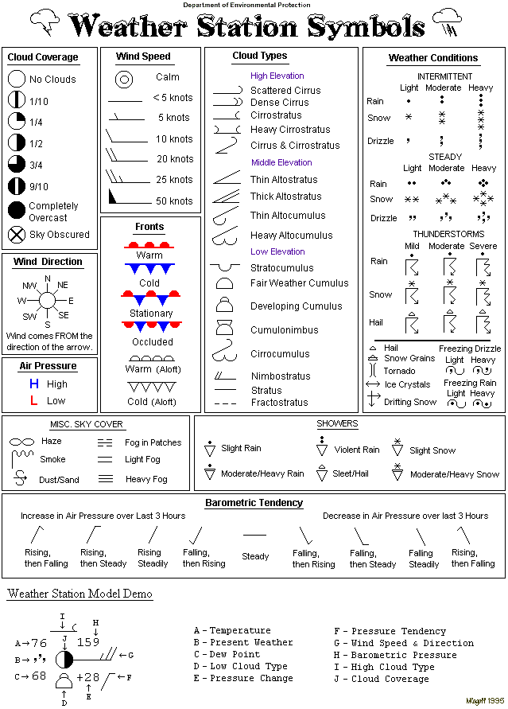

# Another Good Weather Symbol Key

> Source: <http://www.weather.gov/source/zhu/ZHU_Training_Page/Weather_Keys/wxsymbols.gif>  
> Section: Weather Keys  
> Captured: 2026-08-19 06:00 UTC  
> PDF: [another-good-weather-symbol-key.pdf](another-good-weather-symbol-key.pdf) · 639×891px

---

