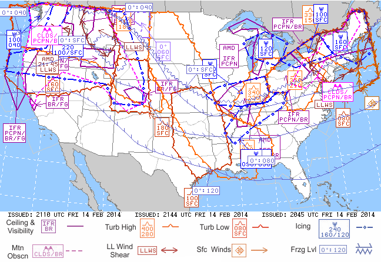

# Graphical AIRMET (G-AIRMET)

> Source: <http://www.weather.gov/source/zhu/ZHU_Training_Page/Weather_Keys/AIRMETs/AIRMET.htm>  
> Section: Weather Keys  
> Captured: 2026-08-19 06:00 UTC  
> PDF: [graphical-airmet-g-airmet.pdf](graphical-airmet-g-airmet.pdf) · Original HTML: [source/original.html](source/original.html)

---

# What is an AIRMET?

*Courtesy of the Aviation Weather Center, Kansas City, Missouri*

An AIRMET (AIRman's METeorological Information) advises of weather
that maybe hazardous, other than convective activity, to single engine, other
light aircraft, and Visual Flight Rule (VFR) pilots. However, operators of large
aircraft may also be concerned with these phenomena. The items covered are:

**AIRMET Sierra (IFR):**
- Ceilings less than 1000 feet and/or visibility less than 3 miles affecting over 50% of the area at one time.
- Extensive mountain obscuration

**AIRMET Tango (Turbulence):**- Moderate turbulence
- Sustained surface winds of 30 knots or more at the surface

**AIRMET Zulu (Icing):**- Moderate icing
- Freezing levels

These AIRMET items are considered to be **widespread** because they
must be affecting or be forecast to affect an area of **at least 3000 square
miles** at any one time. However, if the total area to be affected during the
forecast period is very large, it could be that only a small portion of
this total area would be affected at any one time.

AIRMETs are routinely issued for 6 hour periods beginning at 0145 UTC
during Central Daylight Time and at 0245 UTC during Central Standard Time.
AIRMETS are also amended as necessary due to changing weather conditions
or issuance/cancelation of a SIGMET.

Graphical AIRMETs, or G-AIRMETs, show areas having terrain (Sierra), turbulence (Tango), and icing (Zulu) hazards.

### Symbol key

**An orange boundary (turbulence symbol)** indicates high turbulence. The altitude range is included in an orange details box. The top number gives the height of the top of the turbulence layer; and the bottom number gives the altitude of the bottom of the turbulence layer. Altitudes are labeled in hundreds of feet.

**A red boundary (turbulence symbol)** indicates low turbulence. The altitude range is included in a red details box. The top number gives the height of the top of the turbulence layer; and the bottom number gives the altitude of the bottom of the turbulence layer. Altitudes are labeled in hundreds of feet.

**A pink boundary (dashed)** indicates mountain obscurity. The cause for obscuration of mountain peaks is listed at the bottom of a pink details box. Codes are as follows: CLDS clouds; PCPN precipitation; BR mist; FG fog; HZ haze; FU smoke.

**A purple boundary (solid line)** indicates areas where Instrument Flight Rules are required. The cause for low ceiling or reduced visibility is listed at the bottom of a purple details box. Codes are as follows: PCPN precipitation; BR mist; FG fog; HZ haze; FU smoke; BLSN blowing snow.

**A dark blue boundary (circle, line dashed)** indicates icing conditions. The altitude range is included in a blue details box. The top number gives the height of the top icing layer; and the bottom left number gives the height of the lowest icing layer. If a bottom right number is listed, it means the bottom of the icing layer varies between these altitudes over the specific area. Altitudes are labeled in hundreds of feet.

**A blue  boundary (zig-zag and tick marks)** indicates freezing levels. Freezing level altitude can either be listed as a single number or a range if freezing occurs at multiple heights.
