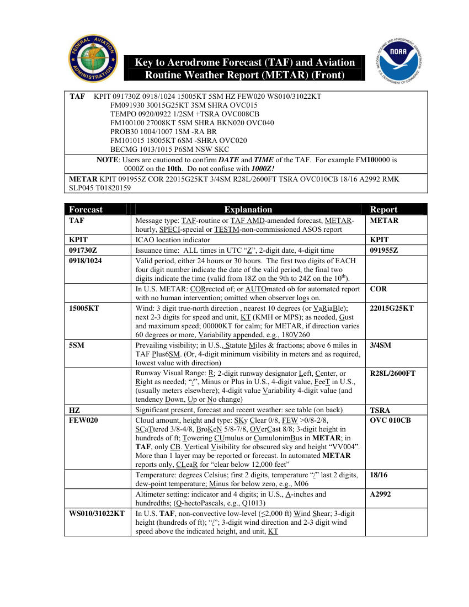
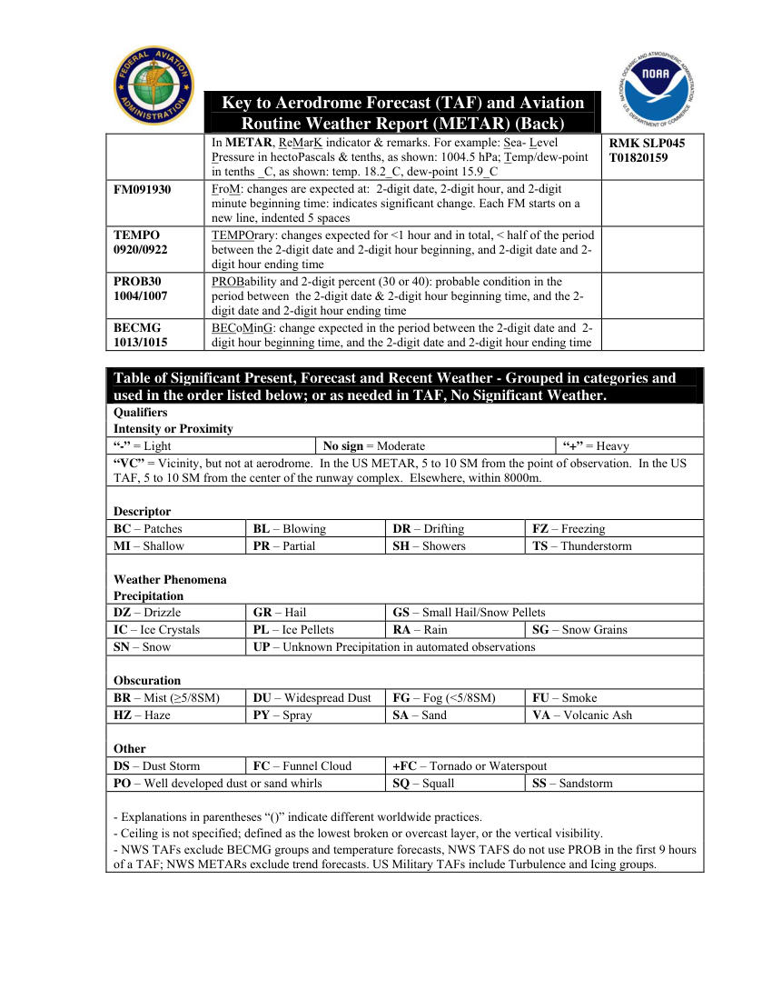

# Key to Aerodrome Forecast (TAF)

> Source: <https://www.weather.gov/media/zhu/ZHU_Training_Page/Weather_Keys/TAF_Card.pdf>  
> Section: Weather Keys  
> Captured: 2026-08-19 06:00 UTC  
> PDF: [key-to-aerodrome-forecast-taf.pdf](key-to-aerodrome-forecast-taf.pdf) (2 pages)

---

## Page 1

Key to Aerodrome Forecast (TAF) and Aviation 
Routine Weather Report (METAR) (Front) 
 
 
 
 
 
TAF 
KPIT 091730Z 0918/1024 15005KT 5SM HZ FEW020 WS010/31022KT 
FM091930 30015G25KT 3SM SHRA OVC015  
TEMPO 0920/0922 1/2SM +TSRA OVC008CB 
FM100100 27008KT 5SM SHRA BKN020 OVC040  
PROB30 1004/1007 1SM -RA BR 
FM101015 18005KT 6SM -SHRA OVC020  
BECMG 1013/1015 P6SM NSW SKC 
NOTE: Users are cautioned to confirm DATE and TIME of the TAF.  For example FM100000 is 
0000Z on the 10th.  Do not confuse with 1000Z! 
METAR KPIT 091955Z COR 22015G25KT 3/4SM R28L/2600FT TSRA OVC010CB 18/16 A2992 RMK 
SLP045 T01820159 
 
 
 
 
Forecast 
Explanation 
Report 
TAF 
Message type: TAF-routine or TAF AMD-amended forecast, METAR-
hourly, SPECI-special or TESTM-non-commissioned ASOS report 
METAR 
KPIT 
ICAO location indicator 
KPIT 
091730Z 
Issuance time:  ALL times in UTC “Z”, 2-digit date, 4-digit time 
091955Z 
0918/1024 
Valid period, either 24 hours or 30 hours.  The first two digits of EACH 
four digit number indicate the date of the valid period, the final two 
digits indicate the time (valid from 18Z on the 9th to 24Z on the 10th). 
 
 
In U.S. METAR: CORrected of; or AUTOmated ob for automated report 
with no human intervention; omitted when observer logs on. 
COR 
15005KT 
Wind: 3 digit true-north direction , nearest 10 degrees (or VaRiaBle); 
next 2-3 digits for speed and unit, KT (KMH or MPS); as needed, Gust 
and maximum speed; 00000KT for calm; for METAR, if direction varies 
60 degrees or more, Variability appended, e.g., 180V260 
22015G25KT 
5SM 
Prevailing visibility; in U.S., Statute Miles & fractions; above 6 miles in 
TAF Plus6SM. (Or, 4-digit minimum visibility in meters and as required, 
lowest value with direction) 
3/4SM 
 
Runway Visual Range: R; 2-digit runway designator Left, Center, or 
Right as needed; “/”, Minus or Plus in U.S., 4-digit value, FeeT in U.S., 
(usually meters elsewhere); 4-digit value Variability 4-digit value (and 
tendency Down, Up or No change) 
R28L/2600FT 
HZ 
Significant present, forecast and recent weather: see table (on back) 
TSRA 
FEW020 
Cloud amount, height and type: SKy Clear 0/8, FEW >0/8-2/8, 
SCaTtered 3/8-4/8, BroKeN 5/8-7/8, OVerCast 8/8; 3-digit height in 
hundreds of ft; Towering CUmulus or CumulonimBus in METAR; in 
TAF, only CB. Vertical Visibility for obscured sky and height “VV004”. 
More than 1 layer may be reported or forecast. In automated METAR 
reports only, CLeaR for “clear below 12,000 feet” 
OVC 010CB 
 
Temperature: degrees Celsius; first 2 digits, temperature “/” last 2 digits, 
dew-point temperature; Minus for below zero, e.g., M06 
18/16 
 
Altimeter setting: indicator and 4 digits; in U.S., A-inches and 
hundredths; (Q-hectoPascals, e.g., Q1013) 
A2992 
WS010/31022KT 
In U.S. TAF, non-convective low-level (≤2,000 ft) Wind Shear; 3-digit 
height (hundreds of ft); “/”; 3-digit wind direction and 2-3 digit wind 
speed above the indicated height, and unit, KT

## Page 2

Key to Aerodrome Forecast (TAF) and Aviation 
Routine Weather Report (METAR) (Back) 
 
 
In METAR, ReMarK indicator & remarks. For example: Sea- Level 
Pressure in hectoPascals & tenths, as shown: 1004.5 hPa; Temp/dew-point 
in tenths _C, as shown: temp. 18.2_C, dew-point 15.9_C 
RMK SLP045 
T01820159 
FM091930 
FroM: changes are expected at:  2-digit date, 2-digit hour, and 2-digit 
minute beginning time: indicates significant change. Each FM starts on a 
new line, indented 5 spaces 
 
TEMPO 
0920/0922 
TEMPOrary: changes expected for <1 hour and in total, < half of the period 
between the 2-digit date and 2-digit hour beginning, and 2-digit date and 2-
digit hour ending time 
 
PROB30 
1004/1007 
PROBability and 2-digit percent (30 or 40): probable condition in the 
period between  the 2-digit date & 2-digit hour beginning time, and the 2-
digit date and 2-digit hour ending time 
 
BECMG 
1013/1015 
BECoMinG: change expected in the period between the 2-digit date and  2-
digit hour beginning time, and the 2-digit date and 2-digit hour ending time 
 
 
 
 
Table of Significant Present, Forecast and Recent Weather - Grouped in categories and 
used in the order listed below; or as needed in TAF, No Significant Weather. 
Qualifiers 
 
 
Intensity or Proximity 
 
“-” = Light 
No sign = Moderate 
“+” = Heavy 
“VC” = Vicinity, but not at aerodrome.  In the US METAR, 5 to 10 SM from the point of observation.  In the US 
TAF, 5 to 10 SM from the center of the runway complex.  Elsewhere, within 8000m. 
 
 
 
 
Descriptor 
 
 
 
BC – Patches 
BL – Blowing 
DR – Drifting 
FZ – Freezing 
MI – Shallow 
PR – Partial 
SH – Showers 
TS – Thunderstorm 
 
 
 
 
Weather Phenomena 
 
 
 
Precipitation 
 
 
 
DZ – Drizzle 
GR – Hail 
GS – Small Hail/Snow Pellets 
IC – Ice Crystals 
PL – Ice Pellets 
RA – Rain 
SG – Snow Grains 
SN – Snow 
UP – Unknown Precipitation in automated observations 
 
 
 
 
Obscuration 
 
 
 
BR – Mist (≥5/8SM) 
DU – Widespread Dust 
FG – Fog (<5/8SM) 
FU – Smoke 
HZ – Haze 
PY – Spray 
SA – Sand 
VA – Volcanic Ash 
 
 
 
 
Other 
 
 
 
DS – Dust Storm 
FC – Funnel Cloud 
+FC – Tornado or Waterspout 
PO – Well developed dust or sand whirls 
SQ – Squall 
SS – Sandstorm 
 
 
 
 
- Explanations in parentheses “()” indicate different worldwide practices. 
- Ceiling is not specified; defined as the lowest broken or overcast layer, or the vertical visibility. 
- NWS TAFs exclude BECMG groups and temperature forecasts, NWS TAFS do not use PROB in the first 9 hours 
of a TAF; NWS METARs exclude trend forecasts. US Military TAFs include Turbulence and Icing groups.
