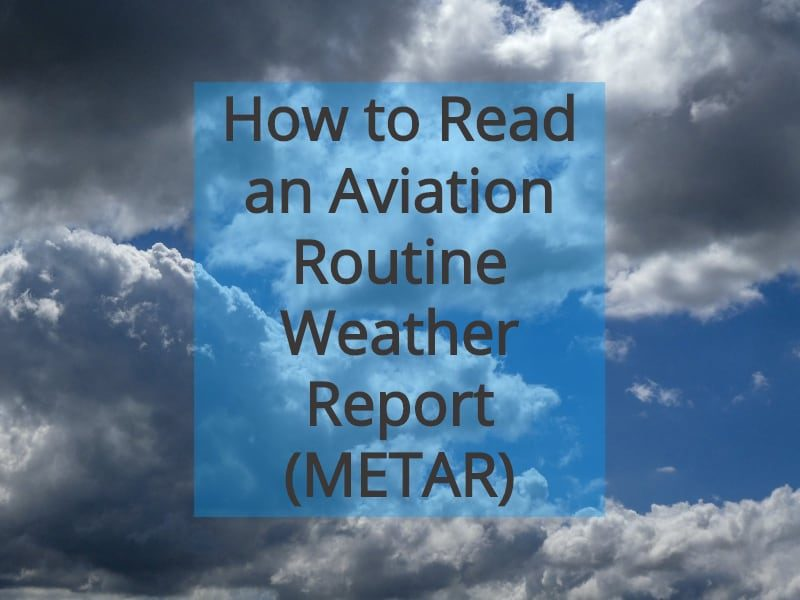
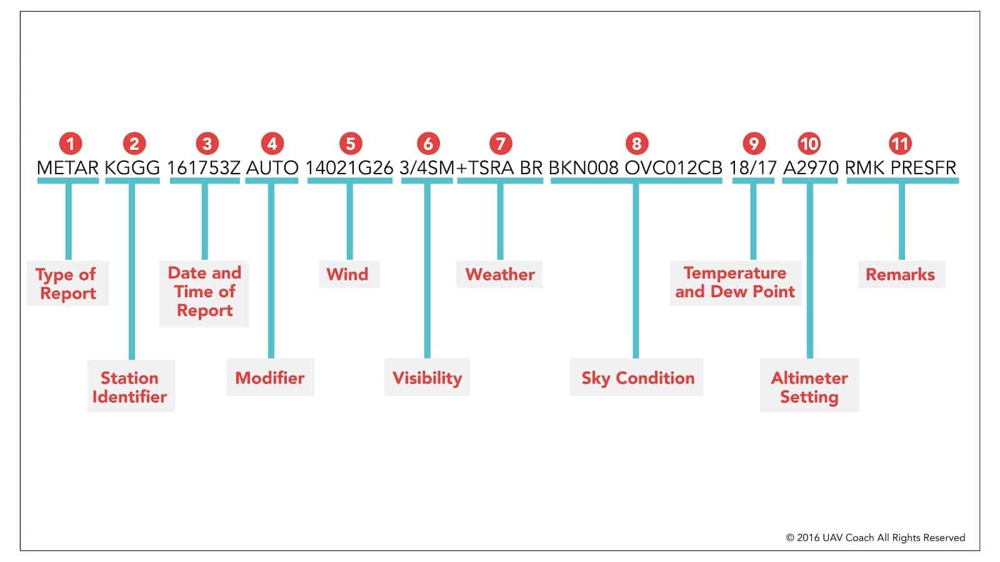
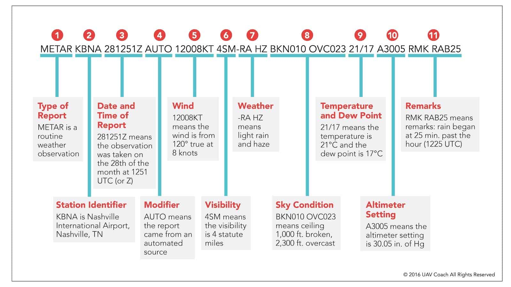

# METAR Decoder — Tutorial 2

> Source: <https://www.dronepilotgroundschool.com/reading-aviation-routine-weather-metar-report/>  
> Section: Weather Keys  
> Captured: 2026-08-19 06:00 UTC  
> PDF: [metar-decoder-tutorial-2.pdf](metar-decoder-tutorial-2.pdf) · Original HTML: [source/original.html](source/original.html)

---

[Skip to content](#content)

 

- [Pricing](https://www.dronepilotgroundschool.com/pricing/)
- How It Works

     Close How It Works    Open How It Works

  How it works

  - [Steps to Get Certified](https://www.dronepilotgroundschool.com/drone-license)
  - [See What You’ll Learn](https://www.dronepilotgroundschool.com/faa-drone-test-prep)
  - [Frequently Asked Questions](https://www.dronepilotgroundschool.com/faq)
- Teams & Schools

     Close Teams & Schools    Open Teams & Schools

  TEAMS

  - [Companies](https://www.dronepilotgroundschool.com/drone-training-for-companies/)
  - [Public Safety](https://www.dronepilotgroundschool.com/drone-training-for-public-safety/)
  - [Government Agencies](https://www.dronepilotgroundschool.com/drone-training-for-government-agencies/)
  - [Nonprofits](https://www.dronepilotgroundschool.com/drone-training-for-nonprofits/)

  SCHOOLS

  - [Turnkey Drone Curriculum](https://www.dronepilotgroundschool.com/drone-education-curriculum/)
- Resources

     Close Resources    Open Resources

  HELP CENTER

  - [Find Your Nearest FAA Drone Testing Center](https://www.dronepilotgroundschool.com/faa-drone-testing-centers/)
  - [How to Obtain an FAA Tracking Number (FTN)](https://www.dronepilotgroundschool.com/faa-tracking-number-ftn/)
  - [How to Read a METAR Report](metar-decoder-tutorial-2.md)
  - [How to Read a Sectional Chart](https://www.dronepilotgroundschool.com/read-sectional-chart/)

   [View All](https://www.dronepilotgroundschool.com/support)

  BEYOND TEST PREP

  - [How to Register Your Drone with the FAA](https://www.dronepilotgroundschool.com/faa-drone-registration/)
  - [How to Request FAA Airspace Authorization](https://www.dronepilotgroundschool.com/faa-airspace-authorization/)
  - [Where to Find Your First Drone Job](https://www.dronepilotgroundschool.com/certified-drone-pilot-directory-list/)
  - [How to Price Your Drone Work](https://www.dronepilotgroundschool.com/drone-services-pricing/)
  - [Inside Part 137 (Agricultural Spraying)](https://www.dronepilotgroundschool.com/part-137/)

   [View All](https://www.dronepilotgroundschool.com/blog)

  Success Stories

  - [Construction – Side Hustle to $250K](https://www.dronepilotgroundschool.com/4blades-digital/)
  - [Inspection – Army Pilot to Utility Pro](https://www.dronepilotgroundschool.com/aerial-intelligence/)
  - [Photography – 200+ Clients in 2 Years](https://www.dronepilotgroundschool.com/jbr-life-photography/)
  - [Photography – Free Flights to $250/Hour](https://www.dronepilotgroundschool.com/derrick-ward/)
  - [Golf – Elevating Golf Course Media](https://www.dronepilotgroundschool.com/channing-benjamin/)

   [View All](https://www.dronepilotgroundschool.com/blog/#success-stories)
- [Reviews](https://www.dronepilotgroundschool.com/student-reviews/)
- [(888) 626-1490](tel:(888)%20626-1490)
- [LOG IN](https://learn.uavcoach.com/sign_in?_gl=1*r7k9zy*_gcl_au*MTE5NzExOTE5Mi4xNzc2ODM4OTg0*_ga*OTg5OTQzNzU5LjE3NzY3NDg3NzM.*_ga_TG7S7N1JYZ*czE3NzY5MTc3NTUkbzQkZzEkdDE3NzY5MTk1MzIkajYwJGwwJGg3MTk3NDMzNDY.)
- [SIGNUP](https://learn.uavcoach.com/purchase?product_id=566350&affcode=23044_6zn9nozd&couponcode=DDR50&_gl=1*u4dh5x*_gcl_au*MTE5NzExOTE5Mi4xNzc2ODM4OTg0*_ga*OTg5OTQzNzU5LjE3NzY3NDg3NzM.*_ga_TG7S7N1JYZ*czE3NzY5MTc3NTUkbzQkZzEkdDE3NzY5MjAyMDQkajUzJGwwJGg3MTk3NDMzNDY.)

[(888) 626-1490](tel:8886261490)

 [Log in](https://learn.uavcoach.com/sign_in)

 [Sign Up](https://learn.uavcoach.com/purchase?product_id=566350&affcode=&coupon=)

 

- [Pricing](https://www.dronepilotgroundschool.com/pricing/)
- How It Works

     Close How It Works    Open How It Works

  How it works

  - [Steps to Get Certified](https://www.dronepilotgroundschool.com/drone-license)
  - [See What You’ll Learn](https://www.dronepilotgroundschool.com/faa-drone-test-prep)
  - [Frequently Asked Questions](https://www.dronepilotgroundschool.com/faq)
- Teams & Schools

     Close Teams & Schools    Open Teams & Schools

  TEAMS

  - [Companies](https://www.dronepilotgroundschool.com/drone-training-for-companies/)
  - [Public Safety](https://www.dronepilotgroundschool.com/drone-training-for-public-safety/)
  - [Government Agencies](https://www.dronepilotgroundschool.com/drone-training-for-government-agencies/)
  - [Nonprofits](https://www.dronepilotgroundschool.com/drone-training-for-nonprofits/)

  SCHOOLS

  - [Turnkey Drone Curriculum](https://www.dronepilotgroundschool.com/drone-education-curriculum/)
- Resources

     Close Resources    Open Resources

  HELP CENTER

  - [Find Your Nearest FAA Drone Testing Center](https://www.dronepilotgroundschool.com/faa-drone-testing-centers/)
  - [How to Obtain an FAA Tracking Number (FTN)](https://www.dronepilotgroundschool.com/faa-tracking-number-ftn/)
  - [How to Read a METAR Report](metar-decoder-tutorial-2.md)
  - [How to Read a Sectional Chart](https://www.dronepilotgroundschool.com/read-sectional-chart/)

   [View All](https://www.dronepilotgroundschool.com/support)

  BEYOND TEST PREP

  - [How to Register Your Drone with the FAA](https://www.dronepilotgroundschool.com/faa-drone-registration/)
  - [How to Request FAA Airspace Authorization](https://www.dronepilotgroundschool.com/faa-airspace-authorization/)
  - [Where to Find Your First Drone Job](https://www.dronepilotgroundschool.com/certified-drone-pilot-directory-list/)
  - [How to Price Your Drone Work](https://www.dronepilotgroundschool.com/drone-services-pricing/)
  - [Inside Part 137 (Agricultural Spraying)](https://www.dronepilotgroundschool.com/part-137/)

   [View All](https://www.dronepilotgroundschool.com/blog)

  Success Stories

  - [Construction – Side Hustle to $250K](https://www.dronepilotgroundschool.com/4blades-digital/)
  - [Inspection – Army Pilot to Utility Pro](https://www.dronepilotgroundschool.com/aerial-intelligence/)
  - [Photography – 200+ Clients in 2 Years](https://www.dronepilotgroundschool.com/jbr-life-photography/)
  - [Photography – Free Flights to $250/Hour](https://www.dronepilotgroundschool.com/derrick-ward/)
  - [Golf – Elevating Golf Course Media](https://www.dronepilotgroundschool.com/channing-benjamin/)

   [View All](https://www.dronepilotgroundschool.com/blog#success-stories)
- [Reviews](https://www.dronepilotgroundschool.com/student-reviews/)
- [(888) 626-1490](tel:8886261490)
- [Login](https://learn.uavcoach.com/sign_in)
- [Sign Up](https://learn.uavcoach.com/purchase?product_id=566350&affcode=&coupon=)

June 13, 2026

# METARs: How to Read An Aviation Routine Weather (METAR) Report + METAR Examples

METAR reports often appear on the FAA’s Unmanned Aircraft General (UAG) Aeronautical Knowledge Test, so it’s important that you know what they are and how to read them.

METAR stands for Meteorological Aerodrome Report. These reports are also commonly called Meteorological Terminal Aviation Routine Weather Reports or just Aviation Routine Weather reports.

This guide to METAR reports covers everything you need to know about them, including what a METAR report is, how often they’re issued, and how to read one.

We also cover several METAR report examples to help you better grasp the information they contain and start understanding their practical use for aviation, both with drones and with crewed aircraft. (We’ve included several METAR examples along with an answer key, so you can use them to test your knowledge.)

**[Struggling with METAR reports? Understanding weather reports is one of the hardest parts of the FAA’s Part 107 test. [Learn how we can help you prepare](https://www.dronepilotgroundschool.com/faa-drone-test-prep/).]**

Here’s a menu in case you’d like to jump around:

- [What Is a METAR Report?](metar-decoder-tutorial-2.md#1)
- [How Often Are METAR Reports Issued?](metar-decoder-tutorial-2.md#2)
- [What’s the Difference Between METAR Reports and TAFs?](metar-decoder-tutorial-2.md#3)
- [How to Read a METAR](metar-decoder-tutorial-2.md#4)
- [METAR Examples](metar-decoder-tutorial-2.md#6) (use these to test yourself!)
- [When Would I Need to Use a METAR?](metar-decoder-tutorial-2.md#5)

## What Is a METAR Report?

A METAR report (Aviation Routine Weather Report) is an observation of current surface weather reported in a standard international format.

## How Often Are METAR Reports Issued?

METAR reports have two types—ordinary ones and special ones.

An ordinary METAR report is issued hourly unless significant weather changes have occurred.

**[Reading a METAR is one of the hardest parts of passing the FAA’s Part 107 test. [Learn how we can help you prepare for the test](https://www.dronepilotgroundschool.com/faa-drone-test-prep/).]**

A special METAR (SPECI) can be issued at any interval between routine METAR reports. These types of METARs are issued during times when the weather is changing quickly, when there’s been some kind of accident that requires more frequent updates, or in other situations that call for an increase in updates.

For terminology, METAR refers to the type of report issued hourly and a SPECI refers to the type issued during special circumstances.

You can look up METARs by using the [Aviation Weather Center’s website](https://aviationweather.gov/metar).

## What’s the Difference Between METAR Reports and TAFs?

TAFs (Terminal Aerodrome Forecasts) can sometimes get confused with METAR Reports.

Here are the key differences between the two:

- **TAFs** are forecasts of future conditions for specific airport locations. They offer weather predictions for airports, covering expected conditions over a period, usually 24 to 30 hours.
- **METARs** are observations of current weather for any location, including airports. A METAR details real-time weather conditions, including temperature, wind speed, and visibility.

Things to keep in mind:

- **Learning to read one means you can read the other**. Both METAR reports and TAFs use the same formatting and weather codes so if you learn [how to read a METAR report](https://uavcoach.com/read-metar-report/) you’ll also know how to read a TAF report, and vice versa.
- **Cloud types**. METAR reports include several cloud types while TAFs only include forecasts about whether cumulonimbus are expected or not (this is because cumulonimbus are associated with thunderstorms).
- **Cloud layers**. METAR reports include information on multiple cloud layers while TAFs only include information on the lower cloud ceiling.

**[Prepping for the FAA’s Part 107 test? Weather questions trip up many test-takers. [Learn how we can help you prepare](https://www.dronepilotgroundschool.com/faa-drone-test-prep/).]**

## How to Read a METAR

Here’s what a typical METAR looks like:

**METAR KGGG 161753Z AUTO 14021G26 3/4SM+ TSRA BR BKN008 OVC012CB 18/17 A2970 RMK PRESFR**

Whoa, this looks like someone fell asleep on their keyboard or something. I can assure you though, that’s not the case with this report. Let’s take a closer look.

Here is a METAR example:

So a typical METAR report contains the following information in sequential order:

1. **Type of report**—there are two types of METAR reports. The first is the routine METAR report that is transmitted every hour. The second is a special report, a SPECI, that can be given at any time to update the METAR for rapidly changing weather conditions, aircraft mishaps, or other critical information. So here, it’ll say either METAR or SPECI.
2. **Station identifier**—a four-letter code as established by the International Civil Aviation Organization (ICAO). In the 48 contiguous states, a unique three-letter identifier is preceded by the letter “K.” For example, Gregg County Airport in Longview, Texas, is identified by the letters “KGGG,” K being the country designation and GGG being the airport identifier. In other regions of the world, including Alaska and Hawaii, the first two letters of the four-letter ICAO identifier indicate the region, country, or state. Alaska identifiers always begin with the letters “PA,” and Hawaii identifiers always begin with the letters “PH.” [A list of station identifiers can be found here](http://weather.rap.ucar.edu/surface/stations.txt).
3. **Date and time of report**—depicted in a six-digit group (161753Z). The first two digits are the date, the 16th of the month, and the last four digits are the time of the METAR, which is always given in coordinated universal time (UTC), otherwise known as Zulu time. A “Z” is appended to the end of the time to denote that the time is given in Zulu time (UTC) as opposed to local time. If you ever need to convert UTC/Zulu time to your local time, here’s an online conversion tool: <http://www.timeanddate.com/worldclock/timezone/utc>
4. **Modifier**—denotes that the METAR came from an automated source or that the report was corrected. If the notation “AUTO” is listed in the METAR, the report came from an automated source. It also lists “AO1” or “AO2” in the remarks section to indicate the type of precipitation sensors employed at the automated station. When the modifier “COR” is used, it identifies a corrected report sent out to replace an earlier report that contained an error (for example: METAR KGGG 161753Z COR).
5. **Wind**—reported with five numbers (14021), unless the speed is greater than 99 knots, in which case the wind is reported with six numbers. I’ll put it to you this way…if you see six numbers, you probably don’t want to be operating a UAS. The first three numbers indicate the direction from which the wind is blowing to the nearest ten degrees in relation to TRUE North. If the wind is variable, then “VRB” will go after the numbers. The last two digits indicate the speed of the wind in knots, unless the wind is greater than 99 knots, in which case it is indicated by three digits. If the winds are gusting, the letter “G” follows the wind speed numbers, and then the numbers right after G indicate the highest expected wind gusts (example = G26).
6. **Visibility**—the prevailing visibility (3/4 SM) is reported in statute miles as denoted by the letters “SM.” It is reported in both miles and fractions of miles. In this case, ¾ of a mile.
7. **Weather**—there are three parts to the weather section. The first is a qualifier of intensity. The intensity may be light (-), moderate ( ), or heavy (+). Because we’re seeing a + symbol, that indicates heavy. Then, if there’s any kind of weather phenomena that’s in the immediate vicinity of the airport, that’ll be shown. So in this example, TS stands for thunderstorm, and RA stands for rain. If you happen to see a notation of “VC” in this section, that indicates a specific weather phenomenon is in the vicinity of five to ten miles from the airport. And then finally, the third part of this weather section are the descriptors, which are used to describe certain types of precipitation and obscurations. So here we’re seeing BR, which stands for mist. You might also see things like RA, which stands for rain, HZ, which stands for haze, or SN, which stands for snow.
8. **Sky condition**—here we’re getting a sense of what cloud cover looks like. In this first part, we’re seeing the height of the cloud base, which is being reported with a three-digit number in hundreds of feet above-ground-level (AGL). BKN stands for broken clouds, and “008” means 800 feet. So the cloud base is at 800 feet AGL. That’s one thing that’s happening. Then we’re also seeing OVC, which stands for overcast, and the “012” stands for 1,200 ft. So we have overcast clouds at 1,200 ft. AGL. And we’re seeing the type of cloud here too. CB stands for cumulonimbus clouds, and another indicator you might see here is TCU, which stands for towering cumulus clouds.
9. **Temperature and dew point**—the air temperature and dew point are always given in whole degrees Celsius (°C) and separated by a forward slash (/). Temperatures below 0°C are preceded by the letter “M” to indicate minus.
10. **Altimeter setting**—A2970 means that a manned aircraft pilot using an altimeter would set his or her altimeter pressure to 29.70 Hg, or inches of mercury.
11. **Remarks**—the remarks section always begins with the letters “RMK.” Comments may or may not appear in this section of the METAR. The information contained in this section may include wind data, variable visibility, beginning and ending times of particular phenomenon, pressure information, and various other information deemed necessary. In the above example, PRESFR means “pressure falling rapidly”. Another example of a remark regarding weather phenomenon that does not fit in any other category would be: OCNL LTGICCG. This translates as occasional lightning in the clouds and from cloud to ground. Automated stations also use the remarks section to indicate the equipment needs maintenance.

## METAR Examples

Let’s run through a few more METAR examples.

First, we’ll cover another METAR report section by section, as we did above.

Then, to test your knowledge we’ll share only the report so you can see how well you’re doing in learning to read the METAR data.

### METAR Examples—With a Reading Key

1. METAR is a routine weather observation
2. KBNA is Nashville International Airport, Nashville, TN
3. 281251Z means the observation was taken on the 28th of the month at 1251 UTC (or Z)
4. AUTO means the report came from an automated source
5. 12008KT means the wind is from 120° true at 8 knots
6. 4SM means the visibility is 4 statute miles
7. -RA HZ means light rain and haze
8. BKN010 OVC023 means ceiling 1,000 ft. broken, 2,300 ft. overcast
9. 21/17 means the temperature is 21°C and the dew point is 17°C
10. A3005 means the altimeter setting is 30.05 in. of Hg
11. RMK RAB25 means remarks: rain began at 25 min. past the hour (1225 UTC)

Now, let’s take the chart away and run through a few METAR examples using only the METAR data.

### METAR Examples—METAR Data Only

Now that you’re starting to get the hang of it, we’ll share only the METAR data in the following examples so you can quiz yourself.

Get a sheet of paper or a blank Google doc ready and see if you can read the following example reports.

After you’ve worked through them, scroll down to the readings to see how you did.

- **METAR Example Report 1:** METAR KORD 251200Z 35005KT 5SM -RA BR BKN015 OVC025 07/05 A2992 RMK AO2 SLP134
- **METAR Example Report 2:** METAR KLAX 221530Z 27010KT 10SM FEW020 SCT100 18/10 A3012 RMK AO2 SLP200
- **METAR Example Report 3:** METAR KATL 251800Z 31006KT 8SM BKN025 22/14 A2998 RMK AO2 SLP145
- **METAR Example Report 4:** METAR KSEA 161755Z 18012G22KT 10SM RA FEW025 BKN045 OVC080 15/12 A2985 RMK AO2 RAB15

### METAR Examples—Answer Key

Here are the readings for each of the above example reports:

**METAR Example Report 1**

Report: METAR KORD 251200Z 35005KT 5SM -RA BR BKN015 OVC025 07/05 A2992 RMK AO2 SLP134

Reading:

- METAR is a routine weather observation
- KORD is Chicago O’Hare International Airport, Chicago, IL
- 251200Z means the observation was taken on the 25th of the month at 1200 UTC (or Z)
- 35005KT means the wind is from 350° true at 5 knots
- 5SM means the visibility is 5 statute miles
- -RA BR means light rain and mist
- BKN015 OVC025 means ceiling 1,500 ft. broken, 2,500 ft. overcast
- 07/05 means the temperature is 7°C and the dew point is 5°C
- A2992 means the altimeter setting is 29.92 in. of Hg
- RMK AO2 SLP134 means remarks: Automatic observation with precipitation discriminator, sea-level pressure 134 hundredths of an inch Mercury

**METAR Example Report 2**

Report: METAR KLAX 221530Z 27010KT 10SM FEW020 SCT100 18/10 A3012 RMK AO2 SLP200

Reading:

- METAR is a routine weather observation
- KLAX is Los Angeles International Airport, Los Angeles, CA
- 221530Z means the observation was taken on the 22nd of the month at 1530 UTC (or Z)
- 27010KT means the wind is from 270° true at 10 knots
- 10SM means the visibility is 10 statute miles
- FEW020 SCT100 means few clouds at 2,000 ft., scattered clouds at 10,000 ft.
- 18/10 means the temperature is 18°C and the dew point is 10°C
- A3012 means the altimeter setting is 30.12 in. of Hg
- RMK AO2 SLP200 means remarks: Automatic observation with precipitation discriminator, sea-level pressure 200 hundredths of an inch Mercury

**METAR Example Report 3**

Report: METAR KATL 251800Z 31006KT 8SM BKN025 22/14 A2998 RMK AO2 SLP145

Reading:

- METAR is a routine weather observation
- KATL is Hartsfield-Jackson Atlanta International Airport, Atlanta, GA
- 251800Z means the observation was taken on the 25th of the month at 1800 UTC (or Z)
- 31006KT means the wind is from 310° true at 6 knots
- 8SM means the visibility is 8 statute miles
- BKN025 means ceiling 2,500 ft. broken
- 22/14 means the temperature is 22°C and the dew point is 14°C
- A2998 means the altimeter setting is 29.98 in. of Hg
- RMK AO2 SLP145 means remarks: Automatic observation with precipitation discriminator, sea-level pressure 145 hundredths of an inch Mercury

**METAR Example Report 4**

Report: METAR KSEA 161755Z 18012G22KT 10SM RA FEW025 BKN045 OVC080 15/12 A2985 RMK AO2 RAB15

Reading:

- METAR is a routine weather observation
- KSEA is Seattle-Tacoma International Airport, Seattle, WA
- 161755Z means the observation was taken on the 16th of the month at 1755 UTC
- 18012G22KT means the wind is from 180° true at 12 knots, gusting to 22 knots
- 10SM means the visibility is 10 statute miles
- RA means rain
- FEW025 BKN045 OVC080 means a few clouds at 2,500 ft., broken clouds at 4,500 ft., overcast at 8,000 ft.
- 15/12 means the temperature is 15°C and the dew point is 12°C
- A2985 means the altimeter setting is 29.85 inches of Mercury
- RMK AO2 RAB15 means remarks: automatic observation with precipitation discriminator, rain began at 15 minutes past the hour

## When Would I Need to Use a METAR?

Drone pilots are responsible for ensuring that the weather conditions are safe for flying. The FAA has established a minimum weather visibility of three miles from your control station. A METAR report can provide you with up-to-date weather information including overcast, misty, and rainy conditions.

METARs are one of many topics on the FAA Part 107 test that drone pilots must pass to obtain a commercial drone license.

Our video-based lessons make learning topics like METARs a lot easier!

For more information on our Part 107 test prep, [click here](https://www.dronepilotgroundschool.com/faa-drone-test).

- FILED UNDER:   [Studying for the Part 107 Exam](https://www.dronepilotgroundschool.com/category/part-107-exam-studying/)

## Managed by UAV Coach

More than 85,000+ students trust Drone Pilot Ground School, a training program managed by [UAV Coach](https://uavcoach.com/), the largest and most reputable online-based drone training academy in the sUAS industry.

## 100% Secure Payment

##### Common Questions

- [How long does the process take?](https://www.dronepilotgroundschool.com/faq/#15)
- [Do you guarantee I’ll pass?](https://www.dronepilotgroundschool.com/faq/#17)
- [Where is my closest FAA test center?](https://www.dronepilotgroundschool.com/faa-drone-testing-centers/)

##### Recent Articles

### [How to Read a Sectional Chart [Updated for 2026]](https://www.dronepilotgroundschool.com/read-sectional-chart/)

### [The 13 Most Challenging Part 107 Test Prep Questions](https://www.dronepilotgroundschool.com/missed-part-107-test-prep-questions/)

### [Can You Fly a Drone Over Private Property?](https://www.dronepilotgroundschool.com/drones-private-property/)

### [METARs: How to Read An Aviation Routine Weather (METAR) Report + METAR Examples](metar-decoder-tutorial-2.md)

### [How Much Does a Drone Cost? Drone Prices by Type for 2026](https://www.dronepilotgroundschool.com/how-much-does-a-drone-cost/)

**Contact Us:** [(888) 626-1490](tel:(888) 626-1490) // [enroll@uavcoach.com](mailto:enroll@uavcoach.com)
**Phone Hours:** Mon-Fri 9am-5pm CT

© 2014-2026 UAV COACH, ALL RIGHTS RESERVED.

##### Follow Us

  [Facebook-f](https://www.facebook.com/uavcoach/)     [Instagram](https://www.instagram.com/uavcoach/)     [Linkedin-in](https://www.linkedin.com/company/uav-coach/)     [Twitter](https://twitter.com/uavcoach?lang=en)     [Youtube](https://www.youtube.com/channel/UCNeLtA6QRwY6dylH4cBnmhQ)

- [UAV Coach](https://uavcoach.com/)
- [About Us](https://www.dronepilotgroundschool.com/meet-our-team/)
- [Giving Back](https://www.dronepilotgroundschool.com/giving-back/)
- [Privacy](https://www.dronepilotgroundschool.com/privacy/)

- [Terms of Use](https://www.dronepilotgroundschool.com/terms-of-use/)
- [Hands On Training](https://www.dronepilotgroundschool.com/drone-flight-training-classes/)
