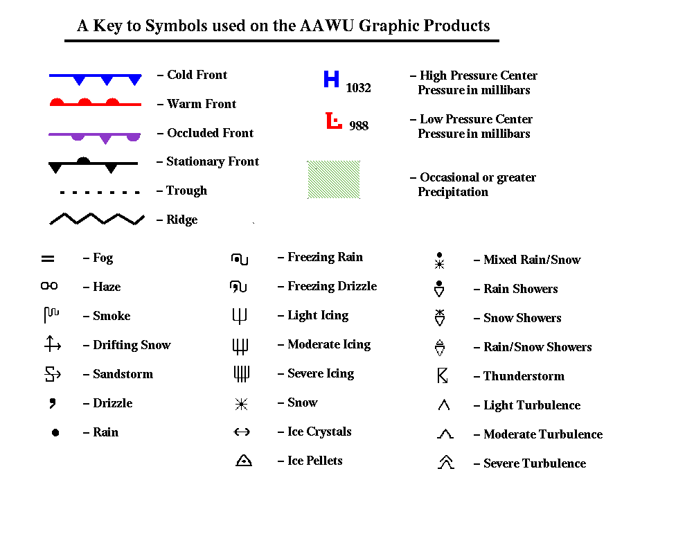

# Weather Symbol Key for AWC/WPC Products

> Source: <http://www.weather.gov/source/zhu/ZHU_Training_Page/Weather_Keys/aviation_symbols.gif>  
> Section: Weather Keys  
> Captured: 2026-08-19 06:00 UTC  
> PDF: [weather-symbol-key-for-awc-wpc-products.pdf](weather-symbol-key-for-awc-wpc-products.pdf) · 976×781px

---

