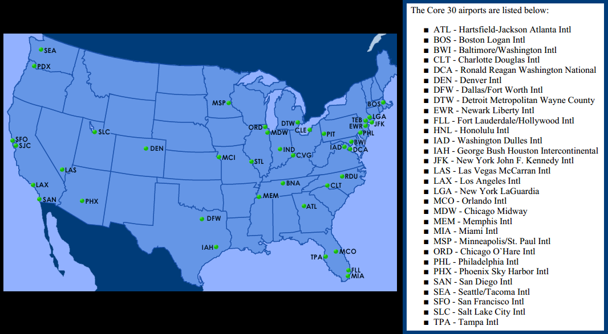

# 30 Core U.S. Airports

> Source: <http://www.weather.gov/source/zhu/ZHU_Training_Page/Maps/core_airports.png>  
> Section: Maps  
> Captured: 2026-08-19 06:00 UTC  
> PDF: [30-core-u-s-airports.pdf](30-core-u-s-airports.pdf) · 1066×587px

---

