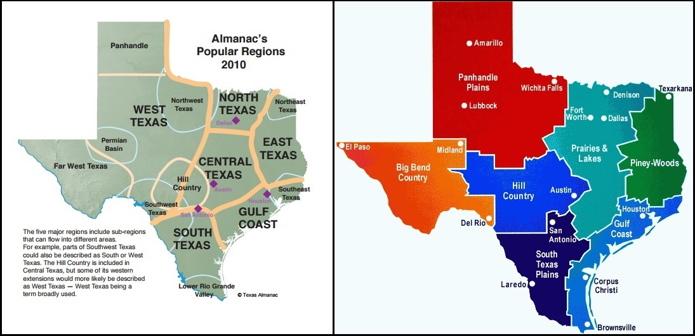

# Another Texas Regional Map

> Source: <http://www.weather.gov/source/zhu/ZHU_Training_Page/Maps/texas_regionalmap.jpg>  
> Section: Maps  
> Captured: 2026-08-19 06:00 UTC  
> PDF: [another-texas-regional-map.pdf](another-texas-regional-map.pdf) · 1095×530px

---

