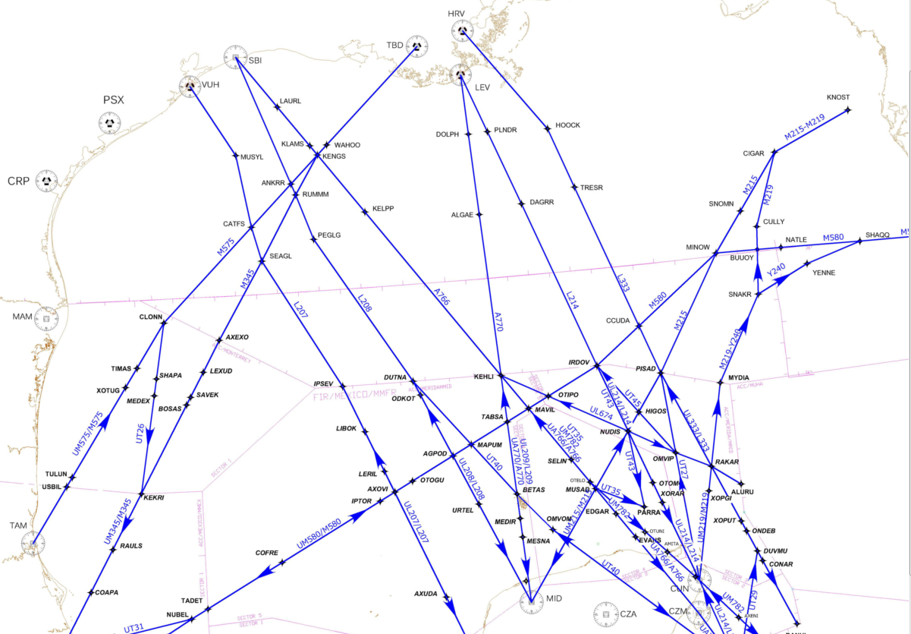

# Gulf of Mexico Routes

> Source: <http://www.weather.gov/source/zhu/ZHU_Training_Page/Maps/ocean_routes.png>  
> Section: Maps  
> Captured: 2026-08-19 06:00 UTC  
> PDF: [gulf-of-mexico-routes.pdf](gulf-of-mexico-routes.pdf) · 1201×835px

---

