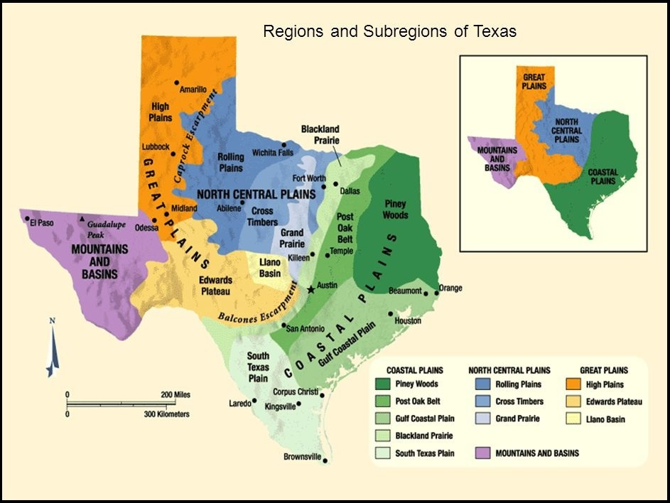

# Texas Regional Map

> Source: <http://www.weather.gov/source/zhu/ZHU_Training_Page/Maps/texas_regionalmap2.jpg>  
> Section: Maps  
> Captured: 2026-08-19 06:00 UTC  
> PDF: [texas-regional-map.pdf](texas-regional-map.pdf) · 943×708px

---

