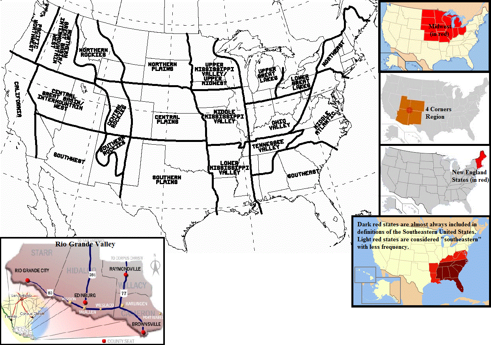

# U.S. Regional Map

> Source: <http://www.weather.gov/source/zhu/ZHU_Training_Page/Maps/regionmap.gif>  
> Section: Maps  
> Captured: 2026-08-19 06:00 UTC  
> PDF: [u-s-regional-map.pdf](u-s-regional-map.pdf) · 1245×875px

---

