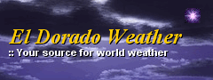
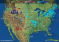
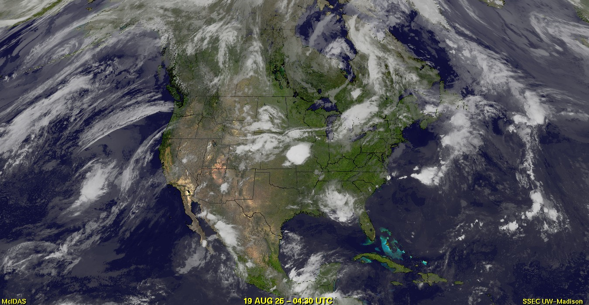
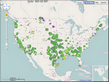
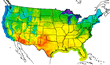
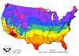

# Galveston Bay Live Buoy Observations

> Source: <https://eldoradoweather.com/buoy2/Galveston-Bay/buoy-xhtml.php>  
> Section: Inland Water/Sea Surface Temps  
> Captured: 2026-08-19 06:00 UTC  
> PDF: [galveston-bay-live-buoy-observations.pdf](galveston-bay-live-buoy-observations.pdf) · Original HTML: [source/original.html](source/original.html)

---

- [U.S. Conditions](#)
  - [Home](https://eldoradoweather.com/)
  - [Placerville California Weather](#)
    - [Mobile Live Weather Conditions](https://eldoradoweather.com/eldoradoweather.mobi/index.php)
    - [Mobile Placerville Forecast](https://eldoradoweather.com/eldoradoweather.mobi/forecast/north%20america/united%20states/california/Placerville.php)
    - [NOAA LIVE Weather Radio](https://eldoradoweather.com/wxradio/index.html)
    - [Air Quality Report](https://eldoradoweather.com/current/aqi/aqi.php)
    - [Watering Index](https://eldoradoweather.com/waterindex/wateringindex.php)
    - [Irrigation Index](https://eldoradoweather.com/waterindex/irrindex.php)
    - [Burn Index](https://eldoradoweather.com/waterindex/chandler-burning-index.php)
    - [Current Area Weather Alerts](https://eldoradoweather.com/forecast/wxwarnings/sto.php)
    - [LIVE I](https://eldoradoweather.com/ajaxcurrentpanel.html)
    - [LIVE II](https://eldoradoweather.com/current.html)
    - [Live III](https://eldoradoweather.com/usa.php)
    - [Live Weather Gauges](https://eldoradoweather.com/wd-alt/wxssgauges.php)
    - [LIVE WebCam](https://eldoradoweather.com/webcam/placerville-ca-webcam.html)
    - [Lightning Radar](https://eldoradoweather.com/lightning/placerville-lightning.html)
    - [Miscellaneous](#)
    - [Moon & Stars](https://eldoradoweather.com/current/sun-moon.html)
    - [CoCoRaHS Precipation Map](https://eldoradoweather.com/wd-alt/wxcocorahs.php)
    - [2016 Solar Risings/Settings](https://eldoradoweather.com/current/sun-rise-set-2009.html)
    - [Daily Placerville Temp Summary](https://eldoradoweather.com/wd-alt/wxtempsummary.php)
    - [Historic Daily Wx Extremes](https://eldoradoweather.com/wd-alt/wxStartReports.php)
    - [Historic Daily Temp Extremes](https://eldoradoweather.com/wd-alt/wxtempdetail.php)
    - [Historic Rain/Temp Details](https://eldoradoweather.com/wd-alt/wxraintemprecords.php)
    - [Current Weather Trends](https://eldoradoweather.com/wx5.html)
    - [Weather Station History](https://eldoradoweather.com/wd-alt/wxhilowavg2.php)
    - [Historic Weather Data](https://eldoradoweather.com/current/WU-History/wuhistory.html)
    - [Normals, Averages & Records](https://eldoradoweather.com/current/placerville-stats/placervillehistoricjan.html)
    - [2 to 7 Day Wx Statistics](https://eldoradoweather.com/current/2-7-day-cw6129.html)
    - [Mesowest Current Conditions](https://eldoradoweather.com/current/mesowest-cw6129.php)
    - [Monthly & Yearly Records](https://eldoradoweather.com/NOAA-reports.php)
    - [Daily Weather Details](https://eldoradoweather.com/vws/details.html)
    - [Daily Rainfall Calendar](https://eldoradoweather.com/climate/wxraindetail/wxraindetail.html)
    - [Historic Rainfall](https://eldoradoweather.com/historicalprecip.html)
    - [Current Weather Graphs](https://eldoradoweather.com/graphs/index.php)
    - [California Average Rainfall](https://eldoradoweather.com/californiaannualprecip.html)
  - [Current U.S. Weather & Info](#)
    - [**United States**](#)
    - [Current U.S. Weather Conditions](https://eldoradoweather.com/current/currentustemps.html)
    - [North America Conditions](https://eldoradoweather.com/current/currentnorthamericatemps.html)
    - [Alaska Current Conditions](https://eldoradoweather.com/current/currentnorthamericatemps.html)
    - [Hawaii Current Conditions](https://eldoradoweather.com/current/currentnorthamericatemps.html)
    - [U.S. Weather Roundup w/temps](https://eldoradoweather.com/current/wxroundupsbysite/wxroundupsbysite-SA.php)
    - [Annual USA Rainfall](https://eldoradoweather.com/climate/US%20Climate%20Maps/Lower%2048%20States/Precipitation/Mean%20Total%20Precipitation/Gallery/mean-total-precipitation.html#location1)
    - [Yesterday U.S. Temps](https://eldoradoweather.com/forecast/yesterdaystemps.html)
    - [U.S. Weather Advisory Map](https://eldoradoweather.com/forecast/warningswatches.html)
    - [U.S. City Radiation Measurements](https://eldoradoweather.com/current/radnet-airmap.html)
    - [Official U.S. Time & Zones](https://eldoradoweather.com/current/time.html)
    - [**Alaska**](#)
    - [Warnings-Watches-Advisories](https://eldoradoweather.com/current/alaska-alerts.php)
    - [Annual Rainfall](https://eldoradoweather.com/current/alaskaannualprecip.html)
  - [Live Meso Map Weather](#)
    - [**United States Weather**](#)
    - [Southwestern Weather Network](https://eldoradoweather.com/swn/southwestnet.php)
    - [Alaska Wx Conditions](https://eldoradoweather.com/wd-alt/wxmesonetmap-AKWN.php)
    - [Mid-Atlantic Wx Conditions](https://eldoradoweather.com/wd-alt/wxmesonetmap-MAWN.php)
    - [Mid-South Wx Conditions](https://eldoradoweather.com/wd-alt/wxmesonetmap-MSWN.php)
    - [Midwest Wx Conditions](https://eldoradoweather.com/wd-alt/wxmesonetmap-MWWN.php)
    - [Northeast Wx Conditions](https://eldoradoweather.com/wd-alt/wxmesonetmap-NEWN.php)
    - [Northwest Wx Conditions](https://eldoradoweather.com/wd-alt/wxmesonetmap-NWWN.php)
    - [The Plains Wx Conditions](https://eldoradoweather.com/wd-alt/wxmesonetmap-PWN.php)
    - [Rocky Mountain Wx Conditions](https://eldoradoweather.com/wd-alt/wxmesonetmap-RMWN.php)
    - [Southeast Wx Conditions](https://eldoradoweather.com/wd-alt/wxmesonetmap-SEWN.php)
    - [Southwest Wx Conditions](https://eldoradoweather.com/wd-alt/wxmesonetmap-SWN.php)
    - [**Canada Weather**](#)
    - [Atlantic Region Wx Conditions](https://eldoradoweather.com/wd-alt/wxmesonetmap-CAWN.php)
    - [Ontario Region Wx Conditions](https://eldoradoweather.com/wd-alt/wxmesonetmap-COWN.php)
    - [Quebec Region Wx Conditions](https://eldoradoweather.com/wd-alt/wxmesonetmap-CQWN.php)
    - [Saskatchewan Region Wx Conditions](https://eldoradoweather.com/wd-alt/wxmesonetmap-CSKWN.php)
    - [Western Region Wx Conditions](https://eldoradoweather.com/wd-alt/wxmesonetmap-WCWN.php)
    - [**United Kingdom Weather**](#)
    - [United Kingdom Wx Conditions](https://eldoradoweather.com/wd-alt/wxmesonetmap-UKWN.php)
    - [**Europe Weather**](#)
    - [Europe Wx Conditions](https://eldoradoweather.com/wd-alt/wxmesonetmap-ZEUR.php)
    - [Austria Wx Conditions](https://eldoradoweather.com/wd-alt/wxmesonetmap-ATWN.php)
    - [Benelux Wx Conditions](https://eldoradoweather.com/wd-alt/wxmesonetmap-BNLWN.php)
    - [Germany Wx Conditions](https://eldoradoweather.com/wd-alt/wxmesonetmap-DEWN.php)
    - [Greece/Hellas Wx Conditions](https://eldoradoweather.com/wd-alt/wxmesonetmap-GRWN.php)
    - [Iberian Peninsula Wx Conditions](https://eldoradoweather.com/wd-alt/wxmesonetmap-IPWN.php)
    - [Scotland Wx Conditions](https://eldoradoweather.com/wd-alt/wxmesonetmap-SCWN.php)
    - [Slovakia Wx Conditions](https://eldoradoweather.com/wd-alt/wxmesonetmap-SVKWN.php)
    - [Slovenia Wx Conditions](https://eldoradoweather.com/wd-alt/wxmesonetmap-SIWN.php)
    - [**Oceania Weather**](#)
    - [Australia Wx Conditions](https://eldoradoweather.com/wd-alt/wxmesonetmap-AUWN.php)
    - [New Zealand Wx Conditions](https://eldoradoweather.com/wd-alt/wxmesonetmap-NZWN2.php)
    - [**World Weather**](#)
    - [Global Affiliated Wx Network](https://eldoradoweather.com/wd-alt/global-map.php)
  - [U.S. Climate Central](#)
    - [U.S. City Climate Statistics](https://eldoradoweather.com/current/climate/us-city-climate-listings-a-b.html)
    - [Climate Atlas of the U.S.](https://eldoradoweather.com/climate/us-climate-atlas.html)
    - [U.S. States Average Rainfall](https://eldoradoweather.com/climate/us-states/us-average-rainfall.html)
    - [El Dorado County Climate](https://eldoradoweather.com/climate.html)
    - [National Climate Graphs](https://eldoradoweather.com/current/climate/nationalclimate.html)
    - [Major Cities Climates](https://eldoradoweather.com/current/climate/climate100cities.html)
  - [U.S. Severe Wx & Fire Maps](#)
    - [U.S. Fire & Severe Wx Maps](https://eldoradoweather.com/current/us-fire-central.html)
    - [U.S. Wild Fire Outlook](https://eldoradoweather.com/current/us-wild-fire-outlook.html)
    - [Canada Fire & Severe Wx Maps](https://eldoradoweather.com/canada/CanadaFire/canada-fire-central.html)
    - [National Fire Advisories](https://eldoradoweather.com/current/fire/usfireadvisories.php)
    - [Fire Detection Map](https://eldoradoweather.com/current/fire/usfiredetections.php)
    - [Fire Detection Text](https://eldoradoweather.com/current/fire/firedetections-text.php)
    - [U.S. Drought Map](https://eldoradoweather.com/current/drought.html)
    - [U.S. Fire Danger Map](https://eldoradoweather.com/current/firedangermap.html)
    - [Motherlode Fire Forecast](https://eldoradoweather.com/forecast/motherlodefirediscussion.php)
    - [Sierra Nevada Forecast](https://eldoradoweather.com/forecast/sierrafirediscussion.php)
    - [Placerville Burn Index](https://eldoradoweather.com/waterindex/chandler-burning-index.php)
    - [Current U.S. Wildfire Headlines](https://eldoradoweather.com/current/fire/fire-news.html)
  - [U.S. Lightning Center](#)
    - [N. America Lightning Radar](https://eldoradoweather.com/lightning/blitzortung/North-America-Lighting-Loop.php)
    - [S.W. Pacific Lightning Radar](https://eldoradoweather.com/lightning/blitzortung-southwestus/southwestuslightningradar.html)
    - [NorCal CA. Lightning Radar](https://eldoradoweather.com/lightning/placerville-lightning.html)
    - [U.S. Severe Weather Maps](https://eldoradoweather.com/lightning/severe-weather-graphics.html)
    - [**Lightning Satellite Mapper**](#)
    - [Goes West Lightning Sat](https://eldoradoweather.com/current/satellite/goes-west-fd-glm-fed.html)
    - [United States Lightning Sat](https://eldoradoweather.com/current/satellite/eastern-us-canada-glm-fed.html)
    - [Goes East Lightning Sat](https://eldoradoweather.com/current/satellite/goes-east-fd-glm-fed.html)
    - [W. U.S. & E. Pac Lightning Sat](https://eldoradoweather.com/current/satellite/west-us-east-pacific-glm-fed.html)
  - [Earthquake-Volcano-Monsoon](#)
    - [Live Global Earthquakes >= 3m](https://eldoradoweather.com/earthquake.php)
    - [Live Global Earthquakes >= 1m](https://eldoradoweather.com/earthquake2.php)
    - [Global Monsoons](https://eldoradoweather.com/current/global-monsoons.php)
    - [Live Global Volcano's](https://eldoradoweather.com/current/volcanoes.php)
    - [Canada Quake Map](https://eldoradoweather.com/canada/canada-earthquakes.php)
    - [United Kingdom Quake Map](https://eldoradoweather.com/forecast/uk-earthquake.php)
  - [Snow Depths & Rainfall Totals](#)
    - [U.S. 3 Day Precip Type Forecast](https://eldoradoweather.com/current/fire/national-forecast-chart.php)
    - [U.S. Snow Depths](https://eldoradoweather.com/snowdepth.html)
    - [U.S. Observed Precipitation](https://eldoradoweather.com/current/observed-precipitation.html)
    - [National Snow Accumulation](https://eldoradoweather.com/current/national-snowfall-accumulation.php)
    - [Northern Hemisphere snow](https://eldoradoweather.com/snow-ice-cover.html)
    - [Snow Probabilities & Percentile](https://eldoradoweather.com/forecast/climate/pqpf-forecast-map/wxpqfpfp.php)
    - [U.S. Snow Analyses Maps](https://eldoradoweather.com/snow/wxallsnowhx.php)
    - [U.S. First Freeze Dates](https://eldoradoweather.com/current/us-average-date-first-freeze.php)
    - [U.S. First Snow Dates](https://eldoradoweather.com/current/us-average-date-first-snow.php)
    - [California Rainfall Totals](https://eldoradoweather.com/current/california-daily-rainfall-temperatures.php)
    - [California Hydrologic Resources](http://www.eldoradoweather.net/current/sierra-snow-measurements.php)
    - [Donner Snowfall](https://eldoradoweather.com/donner.html)
  - [Historic Global Climate Maps](#)
    - [World Rainfall](https://eldoradoweather.com/climate/GlobalMaps/Total%20Rainfall/totalworldrainfall.php)
    - [Snow Cover](https://eldoradoweather.com/climate/GlobalMaps/Snow%20Cover/snowcover.php)
    - [World Fires](https://eldoradoweather.com/climate/GlobalMaps/Fire/worldfire.php)
    - [Cloud Fraction](https://eldoradoweather.com/climate/GlobalMaps/Cloud%20Fraction/cloudfraction.php)
    - [Land Surface Temperatures](https://eldoradoweather.com/climate/GlobalMaps/Land%20Surface%20Temperatures/landsurfacetemperatures.php)
    - [Land Surface Temp Anomalies](https://eldoradoweather.com/climate/GlobalMaps/Land%20Surface%20Temperature%20Anomaly/surfacetemperatureanomaly.php)
    - [Sea Surface Temperatures](https://eldoradoweather.com/climate/GlobalMaps/Sea%20Surface%20Temperature/seasurfacetemps.php)
    - [Sea Surface Temp Anomaly](https://eldoradoweather.com/climate/GlobalMaps/Sea%20Surface%20Temperature%20Anomaly/seasurfacetempanomaly.php)
    - [Water Vapor](https://eldoradoweather.com/climate/GlobalMaps/Water%20Vapor/watervapor.php)
    - [Net Radiation](https://eldoradoweather.com/climate/GlobalMaps/Net%20Radiation/netradiation.php)
    - [Vegetation](https://eldoradoweather.com/climate/GlobalMaps/Vegetation/vegetation.php)
    - [Carbon Monoxide](https://eldoradoweather.com/climate/GlobalMaps/Carbon%20Monoxide/carbonmonoxide.php)
    - [Chlorophyll](https://eldoradoweather.com/climate/GlobalMaps/Chlorophyll/chlorophill.php)
    - [Aerosol Optical Depth](https://eldoradoweather.com/climate/GlobalMaps/Aerosol Optical Depth/aerosol-optical-depth.php)
  - [U.S. Cities Current Air Quality](https://eldoradoweather.com/current/aqi/aqi.php)
  - [U.S. Flight Rules](https://eldoradoweather.com/current/usflightrules.html)
- [U.S. Forecast](#)
  - [Marine](#)
    - [World Buoy Directory Directory](https://eldoradoweather.com/buoy/world-buoy-index.html)
    - [Bodega Harbor Tide](https://eldoradoweather.com/forecast/tides.html)
    - [Norcal Rivers & Lakes](https://eldoradoweather.com/wd-alt/wxriverpage.php)
  - [U.S. Forecast Maps & Info](#)
    - [U.S. Weather Alerts Map](https://eldoradoweather.com/forecast/warningswatches.html)
    - [1-7 Day Forecast Maps](https://eldoradoweather.com/forecast/1dayforecast.html)
    - [U.S. Severe Weather Maps](https://eldoradoweather.com/current/us-fire-central.html)
    - [Today's U.S. High Forecast](https://eldoradoweather.com/forecast/us-high-temp-forecast.php)
    - [Today's U.S. Low Forecast](https://eldoradoweather.com/forecast/us-low-temp-forecast.php)
    - [U.S. Forecast Discussions](https://eldoradoweather.com/forecast/us-wxdiscussion/us-wxdiscussion.php)
    - [U.S. Hazardous Weather Outlook](https://eldoradoweather.com/forecast/us-hazardouswx/us-hazardouswx.php)
    - [U.S. Severe Weather Forecast](https://eldoradoweather.com/lightning/severe-weather-graphics.html)
  - [Graphical Forecast](#)
    - [U.S. Station Wx Story](https://eldoradoweather.com/current/wxstory/wxstory.php)
    - [Cloud Cover Map Index](https://eldoradoweather.com/forecast/graphical-forecast/sky-cover-index.html)
    - [Predominant Weather Index](https://eldoradoweather.com/forecast/graphical-forecast/predominant-weather-index.html)
    - [High Wind Speed Index](https://eldoradoweather.com/forecast/graphical-forecast/wind-speed-probability-index.html)
    - [Wave Height Index](https://eldoradoweather.com/forecast/graphical-forecast/wave-height-index.html)
  - [National Parks Forecasts](https://eldoradoweather.com/forecast/nationalparks/natpark-forecast-listing.html)
  - [Weather Radio Index](https://eldoradoweather.com/wxradio/noaa-weather-radio-index.html)
  - [Convective Outlook](#)
    - [U.S. Convective Outlook](https://eldoradoweather.com/current/us-convective-outlook.html)
    - [U.S. Convective Chances](https://eldoradoweather.com/forecast/1dayconvective.html)
  - [Severe Wx Reports/Maps](#)
    - [Active Warnings & Advisories](https://eldoradoweather.com/forecast/warningswatches.html)
    - [ALL Severe Wx Maps](https://eldoradoweather.com/current/us-fire-central.html)
    - [SPC Mesoscale Analysis](https://eldoradoweather.com/current/fire/todays-mesoscale-discussion.php)
    - [Severe Weather Reports](https://eldoradoweather.com/nws/spc-severe-weather-reports/SPCreport.php)
    - [Drought Monitor](https://eldoradoweather.com/current/drought.html)
    - [Drought Monitor - Animated](https://eldoradoweather.com/current/drought-animated.html)
    - [Drought Related Maps](https://eldoradoweather.com/current/drought-related-maps.php)
  - [Ultra Violet [UVI] Index](#)
    - [United States [UVI] Index](https://eldoradoweather.com/nationaluvi.html)
    - [Placerville, CA [UVI] Index](https://eldoradoweather.com/wd-alt/wxuvforecast.php)
  - [U.S. Pollen Report](https://eldoradoweather.com/current/pollen-report/pollen-report.php)
  - [Rainfall Forecast Maps](#)
    - [U.S. Precipitation Forecast Loop](https://eldoradoweather.com/forecast/climate/qpf-forecast/wxpqpf-h5loops.php)
    - [72hr Rainfall Forecast](https://eldoradoweather.com/precip.html)
    - [3 Month Rain/Temp Outlook](https://eldoradoweather.com/forecast/us-long-range-outlook.html)
    - [Total Precipitable Water](https://eldoradoweather.com/current/satellite/precipitable-water/conus-tpw.php)
    - [Rainfall Probability](https://eldoradoweather.com/forecast/graphical-forecast/pop-12hr.html)
    - [Precipitation Type Forecast](https://eldoradoweather.com/forecast/us-24hr-precip-type-forecast.html)
    - [North America Forecast](https://eldoradoweather.com/precip1.html)
    - [U.S. 6 Hour Forecast Charts](https://eldoradoweather.com/current/wxmdigmos-2hk-192h/wxmdlgmos-2hk-192h-SA.php)
    - [Current Rainfall Data](https://eldoradoweather.com/current/precipitation-map/US/us-precip-totals-map.php)
    - [Excessive Rainfall Forecast](https://eldoradoweather.com/current/wx3dexcessrain/wx3dexcessrain-SA.php)
    - [Temp/Precip 3mo Outlook](https://eldoradoweather.com/current/wxcpcoutlook/wxcpcoutlook-SA.php)
  - [River & Lake Stages](#)
    - [U.S. River & Stream Stages](https://eldoradoweather.com/current/us-river-obs-forecast.php)
    - [Northern CA River & Lake Stages](https://eldoradoweather.com/wd-alt/wxriverpage.php)
  - [Forecast Maps & Data](https://eldoradoweather.com/forecast.html)
- [Maps & Radar](#)
  - [**Smoke**](#)
    - [U.S. & Canada Smoke Forecast](https://eldoradoweather.com/forecast/smoke/smokey-air-listings.html)
  - [**Radar**](#)
    - [U.S. Interactive Radar Map](https://www.eldoradoweather.com/current/misc/google-maps-radar/us-mosiac-radar.html)
    - [U.S. Regional Radar Maps 2](https://www.eldoradoweather.com/current/radar/us-regional-radar-directory.html)
    - [U.S. Regional Radar Maps](#)
      - [U.S. Fullpage Radar Map](https://eldoradoweather.com/current/misc/google-maps-radar/Fullpage.html)
      - [Canada Radar Map](https://eldoradoweather.com/current/misc/google-maps-radar/Canada.html)
      - [U.S. Fire Map](https://eldoradoweather.com/current/misc/google-maps-radar/Fire.html)
      - [U.S. Observations Map](https://eldoradoweather.com/current/misc/google-maps-radar/Obs.html)
      - [Tropical Storms Map](https://eldoradoweather.com/current/misc/google-maps-radar/Tropical.html)
      - [Alaska Radar Map](https://eldoradoweather.com/current/misc/google-maps-radar/Regional/Alaska.html)
      - [Northeast U.S. Radar Map](https://eldoradoweather.com/current/misc/google-maps-radar/Regional/Northeast.html)
      - [Southeast U.S. Radar Map](https://eldoradoweather.com/current/misc/google-maps-radar/Regional/Southeast.html)
      - [U.S. East Coast Radar Map](https://eldoradoweather.com/current/misc/google-maps-radar/Regional/Central-East-Coast.html)
      - [N. Rockies Radar Map](https://eldoradoweather.com/current/misc/google-maps-radar/Regional/Northern-Rockies.html)
      - [S. Mississippi Radar Map](https://eldoradoweather.com/current/misc/google-maps-radar/Regional/Southern-Mississippi-Valley.html)
      - [Central Great Lakes](https://eldoradoweather.com/current/misc/google-maps-radar/Regional/Central-Great-Lakes.html)
      - [Pacific NW Radar Map](https://eldoradoweather.com/current/misc/google-maps-radar/Regional/Pacific-Northwest.html)
      - [Pacific SW Radar Map](https://eldoradoweather.com/current/misc/google-maps-radar/Regional/Pacific-Southwest.html)
      - [Southern Plains Radar Map](https://eldoradoweather.com/current/misc/google-maps-radar/Regional/Southern-Plains.html)
      - [S. Rockies Radar Map](https://eldoradoweather.com/current/misc/google-maps-radar/Regional/Southern-Rockies.html)
      - [Upper Mississippi Valley](https://eldoradoweather.com/current/misc/google-maps-radar/Regional/Upper-Mississippi-Valley.html)
      - [Hawaii Radar Map](https://eldoradoweather.com/current/misc/google-maps-radar/Regional/Hawaii.html)
      - [Puerto Rico Radar Map](https://eldoradoweather.com/current/misc/google-maps-radar/Regional/Puerto-Rico.html)
    - [U.S. City Radar with controls](https://eldoradoweather.com/radar/us-doppler-radar-index.php)
    - [U.S. City Radar with out controls](https://eldoradoweather.com/current/wuradar/us-regional-radar-directory.html)
    - [Large US Radar](https://eldoradoweather.com/radar/national-doppler-radar.html)
    - [XLarge U.S. Radar](https://eldoradoweather.com/radar/national-doppler-radar-full-resolution.html)
    - [World Lightning Radar](https://eldoradoweather.com/lightning/blitzortung/Global-Lighting-Loop.php)
    - [Western U.S. Weather Maps](https://eldoradoweather.com/current/western-us-weather-maps.html)
    - [Eastern U.S. Weather Maps](https://eldoradoweather.com/current/eastern-us-weather-maps.html)
    - [NorCal Inland Radar](https://eldoradoweather.com/grlevel3/grlevel3-br1-radar.html)
    - [NorCal Coastal Radar](https://eldoradoweather.com/grlevel3-mux/grlevel3-br1-radar.html)
    - [NorCal Northwest Coast](https://eldoradoweather.com/radar/bhx/bhx-eureka-loop.php)
    - [Central CA. Radar](https://eldoradoweather.com/grlevel3-hnx/grlevel3-radar-hnx.php)
    - [Southern CA. Radar](https://eldoradoweather.com/grlevel3-sox/grlevel3-radar-sox.php)
  - [**Satellite Imagery**](https://eldoradoweather.com/forecast.html)
  - [Satellite Directory Listings](#)
    - [GOES-EAST Satellite Directory](https://eldoradoweather.com/satellite/goes/goeseast16-satellite-directory.php)
    - [GOES-WEST Satellite Directory](https://eldoradoweather.com/satellite/goes/goeswest17-satellite-directory.php)
    - [Tropical Satellite with Old Filters](https://eldoradoweather.com/satellite/goes/tropical-flash-index.html)
    - [Western U.S. Radar & Satellite](https://eldoradoweather.com/current/western-us-weather-maps.html)
    - [Eastern U.S. Radar & Satellite](https://eldoradoweather.com/current/eastern-us-weather-maps.html)
    - [Various Maps Page](https://eldoradoweather.com/radar-satellite.html)
  - [United States Satellite](#)
    - [U.S. Color Infrared](https://eldoradoweather.com/satellite/ssec/conus-us-composite/conus-color-composite.php)
    - [U.S. Color Infrared XLarge](https://eldoradoweather.com/satellite/ssec/conus-us-composite/xlarge/conus-color-composite-xlarge.php)
    - [U.S. Visible](https://eldoradoweather.com/satellite/goes/united-states/us-vis.html)
    - [U.S. Infrared](https://eldoradoweather.com/satellite/goes/united-states/us-ir4.html)
    - [U.S. Water Vapor](https://eldoradoweather.com/satellite/goes/united-states/us-wv.html)
    - [U.S. Satellite w/Radar](https://eldoradoweather.com/current/ussatrad.html)
    - [N America Rainfall Forecast](https://eldoradoweather.com/satellite/ssec/us-precip-forecast.html)
    - [N America Rainfall Forecast](https://eldoradoweather.com/satellite/ssec/us-precip-forecast.html)
    - [North America IR Satellite](https://eldoradoweather.com/canada/satellite/northamericasat.html)
    - [U.S. Multi Satellite Viewer](https://eldoradoweather.com/all-in-one-sat.html)
    - [U.S. Interactive Infrared Sat](https://eldoradoweather.com/current/satellite/us-interactive-map.html)
    - [Xlarge U.S. Infrared (B/W) Satellite](https://eldoradoweather.com/current/satellite/fullpage-us-irsat-loop.php)
    - [Xlarge U.S. Visible Satellite](https://eldoradoweather.com/current/satellite/fullpage-us-vissat-loop.php)
    - [Xlarge U.S. Water Vapor Satellite](https://eldoradoweather.com/current/satellite/fullpage-us-wvsat-loop.php)
  - [Western U.S. & East Pacific](#)
    - [Western U.S. Color Topo](https://eldoradoweather.com/satellite/ssec/nepacific-colormap-ir-sat.html)
    - [Northeast Pacific Topo WV](https://eldoradoweather.com/satellite/ssec/nepacific-colormap-wv-sat.html)
    - [N.E. Pacific Color IR](https://eldoradoweather.com/satellite/ssec/nepacific-color-ir-sat.html)
    - [Entire N. Pacific Sat Color IR](https://eldoradoweather.com/satellite/ssec/wide-view-us-pacific-asia-sat.html)
    - [Western U.S. VIS](https://eldoradoweather.com/satellite/goes/westus/westussat.html)
    - [Western U.S. IR](https://eldoradoweather.com/satellite/goes/westus/westussat-ir.html)
    - [Western U.S. WV](https://eldoradoweather.com/satellite/goes/westus/westussat-wv.html)
    - [Western U.S. AVN](https://eldoradoweather.com/satellite/goes/westus/westussat-avn.html)
    - [Western U.S. Rainbow](https://eldoradoweather.com/satellite/goes/westus/westussat-rainbow.html)
    - [Western U.S. RGB](https://eldoradoweather.com/satellite/goes/westus/westussat-rgb.html)
    - [Northeast Pacific VIS](https://eldoradoweather.com/satellite/goes/nepac/northeastpac.html)
    - [Northeast Pacific WV](https://eldoradoweather.com/satellite/goes/nepac/northeastpac-wv.html)
    - [Northeast Pacific AVN](https://eldoradoweather.com/satellite/goes/nepac/northeastpac-avn.html)
    - [Northeast Pacific Rainbow](https://eldoradoweather.com/satellite/goes/nepac/northeastpac-rainbow.html)
    - [Northeast Pacific RGB](https://eldoradoweather.com/satellite/goes/nepac/northeastpac-rgb.html)
    - [Northeast Pacific X-Large IR](https://eldoradoweather.com/current/satellite/central-and-eastern-pacific-satellite-loop.html)
    - [Northeast Pacific X-Large VIS](https://eldoradoweather.com/current/satellite/central-and-eastern-pacific-vis-satellite-loop.html)
    - [World Sea Temperatures](https://eldoradoweather.com/forecast/world-forecasts/world-sea-surface-temperatures.html)
  - [Eastern U.S. & West Atlantic](#)
    - [Western Atlantic Color Topo IR](https://eldoradoweather.com/satellite/ssec/west-atlantic-us-colormap-ir-sat.html)
    - [Western Atlantic Color WV](https://eldoradoweather.com/satellite/ssec/west-atlantic-us-colormap-wv-sat.html)
    - [Western Atlantic Color IR](https://eldoradoweather.com/satellite/ssec/watlantic-color-ir-sat.html)
    - [Eastern U.S. VIS](https://eldoradoweather.com/satellite/goes/eastus/eastussat.html)
    - [Eastern U.S. IR](https://eldoradoweather.com/satellite/goes/eastus/eastussat-band13.html)
    - [Eastern U.S. WV](https://eldoradoweather.com/satellite/goes/eastus/eastus-wv.html)
    - [North Atlantic VIS](https://eldoradoweather.com/satellite/goes/tropical-atlantic/north-atlantic-vis.html)
    - [North Atlantic IR](https://eldoradoweather.com/satellite/goes/tropical-atlantic/north-atlantic-band14.html)
    - [North Atlantic WV](https://eldoradoweather.com/satellite/goes/tropical-atlantic/north-atlantic-band8.html)
    - [Western Atlantic Topo IR](https://eldoradoweather.com/satellite/ssec/west-atlantic-us-colormap-ir-sat.html)
    - [Western Atlantic Color WV](https://eldoradoweather.com/satellite/ssec/west-atlantic-us-colormap-wv-sat.html)
    - [Western Atlantic Color IR](https://eldoradoweather.com/satellite/ssec/watlantic-color-ir-sat.html)
    - [Western Atlantic X-large VIS](https://eldoradoweather.com/current/satellite/west-atlantic-vis-satellite-loop.html)
    - [Western Atlantic X-large IR](https://eldoradoweather.com/current/satellite/west-atlantic-ir-satellite-loop.html)
  - [U.S. - Atlantic - Pacific](#)
    - [W. Atlantic & East U.S. Large](https://eldoradoweather.com/satellite/goes/eastus/eastussat-large-still.html)
    - [South America IR Satellite](https://eldoradoweather.com/satellite/misc/s.america-ir-sat.html)
  - [Hemispheric Half Disk Satellite](#)
    - [GOES-WEST - U.S. & Pac IR2](https://eldoradoweather.com/current/satellite/central-and-eastern-pacific-ir2-satellite-loop.html)
    - [GOES-WEST - U.S. & Pac IR4](https://eldoradoweather.com/current/satellite/central-and-eastern-pacific-satellite-loop.html)
    - [GOES-WEST - U.S. & Pac VIS](https://eldoradoweather.com/current/satellite/central-and-eastern-pacific-vis-satellite-loop.html)
    - [GOES-WEST - U.S. & Pac WV](https://eldoradoweather.com/current/satellite/central-and-eastern-pacific-wv-satellite-loop.html)
    - [GOES-EAST - W. Atl & U.S. WV](https://eldoradoweather.com/current/satellite/eastern-us-canada-wv-sat.html)
    - [GOES16 - Americas GeoColor](https://eldoradoweather.com/current/satellite/goes-east-fd-geocolor.html)
    - [GOES16 - Americas Infrared4](https://eldoradoweather.com/current/satellite/goes-east-fd-band13.html)
    - [GOES16 - Americas Visible](https://eldoradoweather.com/current/satellite/goes-east-fd-band1.html)
    - [GOES16 - Americas WV](https://eldoradoweather.com/current/satellite/goes-east-fd-band10.html)
    - [MET-PRIME - UK & Europe IR](https://eldoradoweather.com/current/satellite/uk-europe-ir-satellite-loop.html)
    - [MET-PRIME - UK & Europe VIS](https://eldoradoweather.com/current/satellite/uk-europe-vis-satellite-loop.html)
    - [MET-PRIME - UK & Europe WV](https://eldoradoweather.com/current/satellite/uk-europe-wv-satellite-loop.html)
    - [COMS - W Pac & Japan IR](https://eldoradoweather.com/current/satellite/japan-china-west-pacific-ir-satellite-loop.html)
    - [COMS - W Pac & Japan Vis](https://eldoradoweather.com/current/satellite/japan-china-west-pacific-vis-satellite-loop.html)
    - [COMS - W Pac & Japan WV](https://eldoradoweather.com/current/satellite/japan-china-west-pacific-wv-satellite-loop.html)
    - [HIMAWARI - W Pac-Guam IR](https://eldoradoweather.com/current/satellite/himawari-southwest-pacific-ir.html)
    - [HIMAWARI - W Pac-Guam VIS](https://eldoradoweather.com/current/satellite/himawari-southwest-pacific-vis.html)
    - [HIMAWARI - W Pac-Guam WV](https://eldoradoweather.com/current/satellite/himawari-southwest-pacific-wv.html)
    - [HIMAWARI - W Pac-Guam RGB](https://eldoradoweather.com/current/satellite/himawari-southwest-pacific-rgb.html)
  - [Hemispheric Full Disk Satellite](#)
    - [GOES-EAST 16 GeoColor](https://eldoradoweather.com/current/satellite/goes-east-fd-geocolor.html)
    - [GOES-EAST 16 Longwave IR](https://eldoradoweather.com/current/satellite/goes-east-fd-band14.html)
    - [GOES-EAST 16 WV IR](https://eldoradoweather.com/current/satellite/goes-east-fd-band8.html)
    - [GOES-WEST 17 GeoColor](https://eldoradoweather.com/current/satellite/goes-west-fd-geocolor.html)
    - [GOES-WEST 17 Longwave IR](https://eldoradoweather.com/current/satellite/goes-west-fd-band14.html)
    - [GOES-WEST 17 WV IR](https://eldoradoweather.com/current/satellite/goes-west-fd-band8.html)
    - [GOES-WEST 5-Day IR Sat](https://eldoradoweather.com/current/satellite/goeswest-ir.php)
    - [GOES-WEST 5-Day VIS Sat](https://eldoradoweather.com/current/satellite/goeswest-visible.php)
    - [GOES-WEST 5-Day WV Sat](https://eldoradoweather.com/current/satellite/goeswest-wv.php)
    - [MET-PRIME - Eur. & Africa IR](https://eldoradoweather.com/current/satellite/eastern-atlantic-ocean-ir-satellite-loop.html)
    - [MET-PRIME - Eur. & Africa VIS](https://eldoradoweather.com/current/satellite/eastern-atlantic-ocean-vis-satellite-loop.html)
    - [MET-PRIME - Eur. & Africa WV](https://eldoradoweather.com/current/satellite/eastern-atlantic-ocean-wv-satellite-loop.html)
    - [HIMAWARI - W Pac to Aus IR](https://eldoradoweather.com/current/satellite/australia-ir-satellite-loop.html)
    - [HIMAWARI - W Pac to Aus VIS](https://eldoradoweather.com/current/satellite/australia-vis-satellite-loop.html)
    - [HIMAWARI - W Pac to Aus WV](https://eldoradoweather.com/current/satellite/australia-wv-satellite-loop.html)
    - [HIMAWARI - W Pac & Aus RGB](https://eldoradoweather.com/current/satellite/himawari-south-pacific-rgb-satellite-loop.html)
    - [COMS-1 - W Pac to Aus IR](https://eldoradoweather.com/current/satellite/coms1-northern-hemisphere-ir-satellite-loop.html)
    - [COMS-1 - W Pac to Aus VIS](https://eldoradoweather.com/current/satellite/coms1-northern-hemisphere-vis-satellite-loop.html)
    - [COMS-1 - W Pac to Aus WV](https://eldoradoweather.com/current/satellite/coms1-northern-hemisphere-wv-satellite-loop.html)
    - [FY2G - Ind Ocean & China IR](https://eldoradoweather.com/current/satellite/indian-ocean-ir-satellite-loop.html)
    - [FY2G - Ind Ocean & China VIS](https://eldoradoweather.com/current/satellite/indian-ocean-vis-satellite-loop.html)
    - [FY2G - Ind Ocean & China WV](https://eldoradoweather.com/current/satellite/indian-ocean-wv-satellite-loop.html)
    - [MET-IODC - Africa-Mideast IR](https://eldoradoweather.com/current/satellite/met-iodc-ir4-africa-middleeast.html)
    - [MET-IODC - Africa-Mideast VIS](https://eldoradoweather.com/current/satellite/met-iodc-vis-africa-middleeast.html)
    - [MET-IODC - Africa-Mideast WV](https://eldoradoweather.com/current/satellite/met-iodc-wv-africa-middleeast.html)
  - [Extra Wide View Satellite](#)
    - [World Composite Satellite](https://eldoradoweather.com/satellite/ssec/world/world-composite-ir-sat.html)
    - [Asia, Pacific, U.S. IR Sat](https://eldoradoweather.com/satellite/ssec/wide-view-us-pacific-asia-sat.html)
    - [Asia, Pacific, U.S. WV Sat](https://eldoradoweather.com/satellite/ssec/wide-view-sat/wide-view-us-pacific-asia-wv-sat.html)
    - [U.S., Atlantic, Asia IR Sat](https://eldoradoweather.com/satellite/ssec/wide-view-sat/wide-view-west-us-to-china-ir-sat.html)
    - [U.S., Atlantic, Asia WV Sat](https://eldoradoweather.com/satellite/ssec/wide-view-sat/wide-view-west-us-to-china-wv-sat.html)
    - [Indian, Australia, Pacific IR Sat](https://eldoradoweather.com/satellite/ssec/wide-view-sat/wide-view-south-indian-and-pacific-ir-sat.html)
    - [Indian, Australia, Pacific WV Sat](https://eldoradoweather.com/satellite/ssec/wide-view-sat/wide-view-south-indian-and-pacific-wv-sat.html)
  - [Western Atlantic & Pacific](#)
    - [West Atlantic Color Topo IR](https://eldoradoweather.com/satellite/ssec/eastatlantic/eastatlantic-colormap-ir-sat.html)
    - [West Atlantic Color Sat IR](https://eldoradoweather.com/satellite/ssec/eastatlantic/eastatlantic-color-ir-sat.html)
    - [West Atlantic Satellite IR](https://eldoradoweather.com/satellite/ssec/eastatlantic/eastatlantic-ir-sat.html)
    - [W Atlantic Sat Color Topo WV](https://eldoradoweather.com/satellite/ssec/eastatlantic/eastatlantic-colormap-wv-sat.html)
    - [West Pacific Color Topo IR](https://eldoradoweather.com/satellite/ssec/westpacific/westpacific-colormap-ir-sat.html)
    - [West Pacific Color Sat IR](https://eldoradoweather.com/satellite/ssec/westpacific/westpacific-color-ir-sat.html)
    - [West Pacific Satellite IR](https://eldoradoweather.com/satellite/ssec/westpacific/westpacific-ir-satellite.html)
    - [West Pac Sat Color Topo WV](https://eldoradoweather.com/satellite/ssec/westpacific/westpacific-colormap-wv-sat.html)
    - [S Pacific Color Topo IR](https://eldoradoweather.com/satellite/ssec/australia/southpacific-colormap-ir-sat.html)
    - [SSW Pacific Ocean Color IR](https://eldoradoweather.com/satellite/ssec/australia/spacific-color-ir-sat.html)
    - [SSW Pacific Satellite IR](https://eldoradoweather.com/satellite/ssec/australia/spacific-ir-sat.html)
    - [S Pac Sat Color Topo WV](https://eldoradoweather.com/satellite/ssec/australia/southpacific-colormap-wv-sat.html)
    - [S. Pacific Sat Color Topo IR 2](https://eldoradoweather.com/satellite/ssec/spacific-colormap-ir-sat.html)
    - [S. Pacific Sat Color IR 2](https://eldoradoweather.com/satellite/ssec/spacific-color-ir-sat.html)
    - [S. Pacific Sat WV 2](https://eldoradoweather.com/satellite/ssec/spacific-wv-sat.html)
    - [N. Pacific GeoColor Satellite](https://eldoradoweather.com/satellite/goes/goeswest/northern-pacific-geocolor.php)
    - [N. Pacific WV Satellite](https://eldoradoweather.com/satellite/goes/goeswest/northern-pacific-band8.php)
  - [UK & Europe Satellite](#)
    - [UK & European Half Disk Sat VIS](https://eldoradoweather.com/current/satellite/uk-europe-vis-satellite-loop.html)
    - [UK & European Half Disk Sat IR](https://eldoradoweather.com/current/satellite/uk-europe-ir-satellite-loop.html)
    - [UK & Europe Half Disk Sat WV](https://eldoradoweather.com/current/satellite/uk-europe-wv-satellite-loop.html)
    - [Europe 12hr Satellite Loop](https://eldoradoweather.com/forecast/europe/europe-12hr-ani-sat.html)
    - [Europe 24hr Satellite Loop](https://eldoradoweather.com/forecast/europe/europe-24hr-ani-sat.html)
    - [Spain & Portugal IR Satellite](https://eldoradoweather.com/forecast/europe/spain-and-portugal-vis-ir-sat.html)
    - [Europe IR Color Topo Satellite](https://eldoradoweather.com/forecast/europe/europeansat.html)
  - [Indian Ocean Satellite](#)
    - [Indian Ocean Color Topo IR](https://eldoradoweather.com/satellite/ssec/indian-ocean/indian-ocean-colormap-ir-sat.html)
    - [Indian Ocean Sat Color IR](https://eldoradoweather.com/satellite/ssec/indian-ocean/indian-ocean-color-ir-sat.html)
    - [Indian Ocean Satellite IR](https://eldoradoweather.com/satellite/ssec/indian-ocean/indian-ocean-ir-satellite.html)
    - [Indian Ocean Color Topo WV](https://eldoradoweather.com/satellite/ssec/indian-ocean/indian-ocean-colormap-wv-sat.html)
    - [SE Indian Ocean Color Topo IR2](https://eldoradoweather.com/satellite/ssec/australia/southpacific-colormap-ir-sat2.html)
    - [SSE Indian Ocean Color IR](https://eldoradoweather.com/satellite/ssec/australia/spacific-color-ir-sat2.html)
    - [SSE Indian Ocean Satellite IR](https://eldoradoweather.com/satellite/ssec/australia/spacific-ir-sat2.html)
    - [SE Indian Ocean Color Topo WV](https://eldoradoweather.com/satellite/ssec/australia/southpacific-colormap-wv-sat2.html)
  - [Africa Satellite](#)
    - [Eastern Hem Full Disk IR Sat](https://eldoradoweather.com/current/satellite/indian-ocean-ir-satellite-loop.html)
    - [Eastern Hem Full Disk VIS Sat](https://eldoradoweather.com/current/satellite/indian-ocean-vis-satellite-loop.html)
    - [Eastern Hem Full Disk WV Sat](https://eldoradoweather.com/current/satellite/indian-ocean-wv-satellite-loop.html)
    - [NW Indian Ocean Color Topo IR](https://eldoradoweather.com/satellite/ssec/indian-ocean/indian-ocean-colormap-ir-sat.html)
    - [NW Indian Ocean Sat Color IR](https://eldoradoweather.com/satellite/ssec/indian-ocean/indian-ocean-color-ir-sat.html)
    - [NW Indian Ocean Sat IR](https://eldoradoweather.com/satellite/ssec/indian-ocean/indian-ocean-ir-satellite.html)
    - [NW Indian Ocean Color WV](https://eldoradoweather.com/satellite/ssec/indian-ocean/indian-ocean-colormap-wv-sat.html)
  - [Global Satellite](#)
    - [Entire World IR Satellite](https://eldoradoweather.com/satellite/ssec/world/world-composite-ir-sat.html)
    - [Global Wide View Satellite](https://eldoradoweather.com/satellite/ssec/world/global-composite-ir-sat.html)
  - [Canada Satellite](#)
    - [**National Satellite**](#)
    - [Canada GeoColor IR Satellite](https://eldoradoweather.com/satellite/goes/goeswest/canada-geocolor.php)
    - [Canada Xlarge IR Sat Photo](https://eldoradoweather.com/canada/satellite/eastern-canada-us-ir-sat.html)
    - [Canada Infrared Sat Photo 1](https://eldoradoweather.com/canada/satellite/canada-us-satellite.html)
    - [Canada Infrared Sat Photo 2](https://eldoradoweather.com/canada/satellite/anivisablesatellite.html)
    - [Canada Visible Sat Photo](https://eldoradoweather.com/canada/satellite/visablesatellite.html)
    - [U.S. & Canada Visible](https://eldoradoweather.com/current/uscanadavisibesat.html)
    - [Canada Composit w/ Arctic](https://eldoradoweather.com/canada/satellite/northern-arctic-canada-ir-sat.html)
    - [**Regional Satellite**](#)
    - [West Canada Xlarge IR Sat](https://eldoradoweather.com/canada/satellite/western-canada-us-ir-sat.html)
    - [East Canada Xlarge IR Sat](https://eldoradoweather.com/canada/satellite/northeastern-canada-ir-sat.html)
  - [Arctic & Antarctic IR Sat](#)
    - [Arctic Infrared Latest Image](https://eldoradoweather.com/current/satellite/arctic-greenland-canada-ir.html)
    - [Arctic Infrared Satellite](https://eldoradoweather.com/satellite/ssec/antarctica-composite-ir.html)
    - [Arctic Visible Satellite](https://eldoradoweather.com/satellite/ssec/arctic-composite-vis.html)
    - [Arctic Water Vapor Satellite](https://eldoradoweather.com/satellite/ssec/arctic-composite-wv.html)
    - [Antarctica Infrared Latest Image](https://eldoradoweather.com/forecast/world/antarcticasat.html)
    - [Antarctica Infrared Satellite](https://eldoradoweather.com/forecast/world/antarcticasat-ir.html)
    - [Antarctica Visible Satellite](https://eldoradoweather.com/forecast/world/antarcticasat-vis.html)
    - [Antarctica Water Vapor Satellite](https://eldoradoweather.com/forecast/world/antarcticasat-wv.html)
  - [Alaska Satellite](#)
    - [Alaska GeoColor IR Satellite](https://eldoradoweather.com/satellite/goes/goeswest/alaska-geocolor.php)
    - [Alaska Longwave IR Satellite](https://eldoradoweather.com/satellite/goes/goeswest/alaska-band14.php)
    - [Alaska Shortwave IR Satellite](https://eldoradoweather.com/satellite/goes/goeswest/alaska-band7.php)
    - [Alaska WV IR Satellite](https://eldoradoweather.com/satellite/goes/goeswest/alaska-band8.php)
  - [Hawaii Satellite](#)
    - [Hawaii GeoColor IR Satellite](https://eldoradoweather.com/satellite/goes/goeswest/hawaii-geocolor.php)
    - [Hawaii Longwave IR Satellite](https://eldoradoweather.com/satellite/goes/goeswest/hawaii-band14.php)
    - [Hawaii Shortwave IR Satellite](https://eldoradoweather.com/satellite/goes/goeswest/hawaii-band7.php)
    - [Hawaii WV IR Satellite](https://eldoradoweather.com/satellite/goes/goeswest/hawaii-band8.php)
  - [U.S. Fire Monitoring Satellite](#)
    - [Western U.S. Visible](https://eldoradoweather.com/satellite/goes/goeswest-large/us-pacific-coast-geocolor.php)
    - [Pacific Northwest](https://eldoradoweather.com/satellite/goes/goeswest-large/pacific-northwest-geocolor.php)
    - [Pacific Southwest](https://eldoradoweather.com/satellite/goes/goeswest-large/pacific-southwest-geocolor.php)
    - [U.S. Pacific Coast](https://eldoradoweather.com/satellite/goes/goeswest-large/us-pacific-coast-geocolor.php)
    - [Central Alaska](https://eldoradoweather.com/satellite/goes/goeswest-large/central-alaska-geocolor.php)
    - [SE Alaska & BC Canada](https://eldoradoweather.com/satellite/goes/goeswest-large/southeastern-alaska-geocolor.php)
    - [Idaho, Nevada & Utah](https://eldoradoweather.com/satellite/goes/goeseast-large/pacificnorthwest-geocolor.html)
    - [Nevada, Arizona & New Mexico](https://eldoradoweather.com/satellite/goes/goeseast-large/pacificsouthwest-geocolor.php)
    - [Texas & Oklahoma](https://eldoradoweather.com/satellite/goes/goeseast-large/southern-plains-geocolor.php)
- [Models](#)
  - [Surface Analysis Dirctory](https://eldoradoweather.com/current/surface-analysis/surface-analysis-directory.html)
  - [North America Models](#)
    - [HRRR Hourly - U.S. High Res](https://eldoradoweather.com/current/models/North-America/hrrr-ncep-listings.html)
    - [HRRR-SubHourly - High Res](https://eldoradoweather.com/current/models/North-America/hrrr-ncep-subhourly-listings.html)
    - [RAP - (Rapid Refresh) Listings](https://eldoradoweather.com/current/models/North-America/rap-listings.html)
    - [RUC - (Rapid Update) Listings](https://eldoradoweather.com/current/models/North-America/ruc-listings.html)
    - [HREF - Listings](https://eldoradoweather.com/current/models/North-America/href-00-listings.html)
    - [HREF U.S. Southwest Listings](https://eldoradoweather.com/current/models/North-America/href-sw-00-listings.html)
    - [SREF Listings](https://eldoradoweather.com/current/models/North-America/sref-03-listings.html)
    - [GFS Listings](https://eldoradoweather.com/current/models/North-America/gfs-00-listings.html)
    - [GEFS Ensemble Listings](https://eldoradoweather.com/current/models/North-America/gefs-00-listings.html)
    - [GEFS Spaghetti Listings](https://eldoradoweather.com/current/models/North-America/gefs-spag-00-listings.html)
    - [GFS Alaska Listings](https://eldoradoweather.com/current/models/North-America/gfs-alaska-00-listings.html)
    - [NAM Listings](https://eldoradoweather.com/current/models/North-America/nam-listings.html)
    - [NAEFS Listings](https://eldoradoweather.com/current/models/North-America/naefs-00-listings.html)
    - [U.S. Color Surface Map](https://eldoradoweather.com/current/surface-analysis/conus-color/conus-color-surface-anal-loop.php)
    - [U.S. Surface Map](https://eldoradoweather.com/current/surface-analysis/conus/conus-surface-anal-loop.php)
    - [Current U.S. Mesoscale Alerts](https://eldoradoweather.com/current/fire/todays-mesoscale-discussion.php)
    - [U.S. SPC Mesoscale Analysis](https://eldoradoweather.com/current/surface-analysis/us-spc-mesoscale-anal/us-interactive-spc-mesoscale-analysis.html)
    - [Western U.S. Surface Map](https://eldoradoweather.com/current/surface-analysis/westernus/westernus-surface-anal-loop.php)
    - [Midwest Surface Map](https://eldoradoweather.com/current/surface-analysis/midwest/midwest-surface-anal-loop.php)
    - [Southeast U.S. Surface Map](https://eldoradoweather.com/current/surface-analysis/southernus/southernus-surface-anal-loop.php)
    - [Canada Surface Map](https://eldoradoweather.com/current/surface-analysis/canada/canada-surface-anal-loop.php)
    - [Gulf-Mexico-Caribbean Sur Map](https://eldoradoweather.com/current/surface-analysis/mexico/mexico-surface-anal-loop.php)
    - [U.S. GFS-LAMP Analysis](http://www.eldoradoweather.net/current/models/North-America/gfs-lamp-analysis-us.html)
  - [Eastern & Western U.S.](#)
    - [HIRESW NMMB UTC-00 Listing](https://eldoradoweather.com/current/models/North-America/eastern-us-hiresw-nmm-00-directory.html)
    - [HIRESW NMMB UTC-12 Listing](https://eldoradoweather.com/current/models/North-America/eastern-us-hiresw-nmm-12-directory.html)
    - [HIRESW ARW UTC-00 Listing](https://eldoradoweather.com/current/models/North-America/eastern-us-hiresw-arw-00-directory.html)
    - [HIRESW ARW UTC-12 Listing](https://eldoradoweather.com/current/models/North-America/eastern-us-hiresw-arw-12-directory.html)
    - [Eastern U.S. Surface Map](https://eldoradoweather.com/current/surface-analysis/easternus/easternus-surface-anal-loop.php)
    - [E. U.S. Coast Surface Map](https://eldoradoweather.com/current/surface-analysis/eastuscoast/eastuscoast-surface-anal-loop.php)
    - [Western U.S. Surface Map](https://eldoradoweather.com/current/surface-analysis/westernus/westernus-surface-anal-loop.php)
    - [W U.S. Coast Surface Map](https://eldoradoweather.com/current/surface-analysis/westuscoast/westuscoast-surface-anal-loop.php)
  - [Alaska Models](#)
    - [GFS Listings](https://eldoradoweather.com/current/models/North-America/gfs-alaska-00-listings.html)
    - [HIRESW NMMB UTC-18 Listing](https://eldoradoweather.com/current/models/North-America/alaska-hiresw-nmm-18-directory.html)
    - [HIRESW ARW UTC-18 Listing](https://eldoradoweather.com/current/models/North-America/alaska-hiresw-arw-18-directory.html)
    - [Alaska U.S. Surface Map](https://eldoradoweather.com/current/surface-analysis/alaska/alaska-surface-anal-loop.php)
  - [Polar Models](#)
    - [GFS Listings](https://eldoradoweather.com/current/models/Polar/gfs-polar-00-listings.html)
    - [GEFS Ensemble Listings](https://eldoradoweather.com/current/models/Polar/gefs-00-listings.html)
  - [Arctic Models](#)
    - [GFS Listings](https://eldoradoweather.com/current/models/Arctic/gfs-00-listings.html)
    - [GEFS Ensemble Listings](https://eldoradoweather.com/current/models/Arctic/gefs-00-listings.html)
  - [Europe Models](#)
    - [GFS Listings](https://eldoradoweather.com/current/models/Europe/gfs-00-listings.html)
    - [GEFS Ensemble Listings](https://eldoradoweather.com/current/models/Europe/gefs-00-listings.html)
    - [GEFS Spaghetti Listings](https://eldoradoweather.com/current/models/Europe/gefs-spag-00-listings.html)
  - [North Pacific Models](#)
    - [GFS Listings](https://eldoradoweather.com/current/models/North-Pacific/gfs-00-listings.html)
    - [GEFS Ensemble Listings](https://eldoradoweather.com/current/models/North-Pacific/gefs-00-listings.html)
    - [GEFS Spaghetti Listings](https://eldoradoweather.com/current/models/North-Pacific/gefs-spag-00-listings.html)
    - [WW3 UTC-00 Wind & Waves](https://eldoradoweather.com/current/models/North-Pacific/ww3-00-listings.html)
    - [WW3 UTC-06 Wind & Waves](https://eldoradoweather.com/current/models/North-Pacific/ww3-06-listings.html)
    - [WW3 UTC-12 Wind & Waves](https://eldoradoweather.com/current/models/North-Pacific/ww3-12-listings.html)
    - [WW3 UTC-18 Wind & Waves](https://eldoradoweather.com/current/models/North-Pacific/ww3-18-listings.html)
    - [N Pacific Color Surface Map](https://eldoradoweather.com/current/surface-analysis/npacific-color/npacific-color-surface-anal-loop.php)
    - [N Pacific Xlarge Surface Map](https://eldoradoweather.com/current/surface-analysis/npacific/npacific-surface-analysis.html)
  - [East Pacific Models](#)
    - [GFS Listings](https://eldoradoweather.com/current/models/East Pacific/gfs-00-listings.html)
    - [GEFS Ensemble Listings](https://eldoradoweather.com/current/models/East Pacific/gefs-00-listings.html)
    - [GEFS Spaghetti Listings](https://eldoradoweather.com/current/models/East Pacific/gefs-spag-00-listings.html)
    - [WW3 UTC-00 Wind & Waves](https://eldoradoweather.com/current/models/East Pacific/ww3-00-listings.html)
    - [WW3 UTC-06 Wind & Waves](https://eldoradoweather.com/current/models/East Pacific/ww3-06-listings.html)
    - [WW3 UTC-12 Wind & Waves](https://eldoradoweather.com/current/models/East Pacific/ww3-12-listings.html)
    - [WW3 UTC-18 Wind & Waves](https://eldoradoweather.com/current/models/East Pacific/ww3-18-listings.html)
  - [Atlantic Models](#)
    - [GFS Listings](https://eldoradoweather.com/current/models/Atlantic/gfs-00-listings.html)
    - [GEFS Ensemble Listings](https://eldoradoweather.com/current/models/Atlantic/gefs-00-listings.html)
    - [GEFS Spaghetti Listings](https://eldoradoweather.com/current/models/Atlantic/gefs-spag-00-listings.html)
    - [WW3 UTC-00 Wind & Waves](https://eldoradoweather.com/current/models/Atlantic/ww3-00-listings.html)
    - [WW3 UTC-06 Wind & Waves](https://eldoradoweather.com/current/models/Atlantic/ww3-06-listings.html)
    - [WW3 UTC-12 Wind & Waves](https://eldoradoweather.com/current/models/Atlantic/ww3-12-listings.html)
    - [WW3 UTC-18 Wind & Waves](https://eldoradoweather.com/current/models/Atlantic/ww3-18-listings.html)
  - [Western North Atlantic Models](#)
    - [GFS Listings](https://eldoradoweather.com/current/models/Western-North-Atlantic/gfs-00-listings.html)
    - [GEFS Ensemble Listings](https://eldoradoweather.com/current/models/Western-North-Atlantic/gefs-00-listings.html)
    - [GEFS Speghtti Listings](https://eldoradoweather.com/current/models/Western-North-Atlantic/gefs-spag-00-listings.html)
    - [WW3 UTC 00z Wind & Waves](https://eldoradoweather.com/current/models/Western-North-Atlantic/ww3-00-listings.html)
    - [WW3 UTC 06z Wind & Waves](https://eldoradoweather.com/current/models/Western-North-Atlantic/ww3-06-listings.html)
    - [WW3 UTC 12z Wind & Waves](https://eldoradoweather.com/current/models/Western-North-Atlantic/ww3-12-listings.html)
    - [WW3 UTC 18z Wind & Waves](https://eldoradoweather.com/current/models/Western-North-Atlantic/ww3-18-listings.html)
  - [Caribbean Models](#)
    - [GFS Listings](https://eldoradoweather.com/current/models/Western-North-Atlantic/gfs-00-listings.html)
    - [GEFS Ensemble Listings](https://eldoradoweather.com/current/models/Western-North-Atlantic/gefs-00-listings.html)
    - [GEFS Speghtti Listings](https://eldoradoweather.com/current/models/Western-North-Atlantic/gefs-spag-00-listings.html)
    - [WW3 UTC 00z Wind & Waves](https://eldoradoweather.com/current/models/Western-North-Atlantic/ww3-00-listings.html)
    - [WW3 UTC 06z Wind & Waves](https://eldoradoweather.com/current/models/Western-North-Atlantic/ww3-06-listings.html)
    - [WW3 UTC 12z Wind & Waves](https://eldoradoweather.com/current/models/Western-North-Atlantic/ww3-12-listings.html)
    - [WW3 UTC 18z Wind & Waves](https://eldoradoweather.com/current/models/Western-North-Atlantic/ww3-18-listings.html)
  - [Atlantic & Pacific Models](#)
    - [WW3 UTC 00z Wind & Waves](https://eldoradoweather.com/current/models/Atlantic-Pacific/ww3-00-listings.html)
    - [WW3 UTC 06z Wind & Waves](https://eldoradoweather.com/current/models/Atlantic-Pacific/ww3-06-listings.html)
    - [WW3 UTC 12z Wind & Waves](https://eldoradoweather.com/current/models/Atlantic-Pacific/ww3-12-listings.html)
    - [WW3 UTC 18z Wind & Waves](https://eldoradoweather.com/current/models/Atlantic-Pacific/ww3-18-listings.html)
    - [Hawaii U.S. Surface Map](https://eldoradoweather.com/current/surface-analysis/hawaii/hawaii-surface-anal-loop.php)
    - [N Atlantic Color Surface Map](https://eldoradoweather.com/current/surface-analysis/natlantic-color/natlantic-color-surface-anal-loop.php)
    - [Tropical Atlantic Surface Map](https://eldoradoweather.com/current/surface-analysis/trop-atlantic/trop-atlantic-surface-anal-loop.php)
    - [Tropical Pacific Surface Map](https://eldoradoweather.com/current/surface-analysis/trop-pacific/trop-pacific-surface-anal-loop.php)
  - [South Pacific Models](#)
    - [GFS Listings](https://eldoradoweather.com/current/models/South-Pacific/gfs-00-listings.html)
    - [GEFS Ensemble Listings](https://eldoradoweather.com/current/models/South-Pacific/gefs-00-listings.html)
    - [GEFS Spaghetti Listings](https://eldoradoweather.com/current/models/South-Pacific/gefs-spag-00-listings.html)
  - [Africa Models](#)
    - [GFS Listings](https://eldoradoweather.com/current/models/Africa/gfs-00-listings.html)
    - [GEFS Ensemble Listings](https://eldoradoweather.com/current/models/Africa/gefs-00-listings.html)
    - [GEFS Spaghetti Listings](https://www.eldoradoweather.com/current/models/Africa/gefs-spag-00-listings.html)
  - [Asia Models](#)
    - [GFS Listings](https://eldoradoweather.com/current/models/Asia/gfs-00-listings.html)
    - [GEFS Ensemble Listings](https://www.eldoradoweather.com/current/models/Asia/gefs-00-listings.html)
    - [GEFS Spaghetti Listings](https://eldoradoweather.com/current/models/Asia/gefs-spag-00-listings.html)
  - [India & Pakistan](#)
    - [GFS Listings](https://eldoradoweather.com/current/models/India and Pakistan/gfs-00-listings.html)
    - [GEFS Ensemble Listings](https://www.eldoradoweather.com/current/models/India and Pakistan/gefs-00-listings.html)
    - [GEFS Spaghetti Listings](https://eldoradoweather.com/current/models/India and Pakistan/gefs-spag-00-listings.html)
  - [Australia](#)
    - [GFS Listings](https://eldoradoweather.com/current/models/South-Pacific/gfs-00-listings.html)
    - [GEFS Ensemble Listings](https://eldoradoweather.com/current/models/South-Pacific/gefs-00-listings.html)
    - [MSLP 1000-500 Thickness](https://eldoradoweather.com/satellite/ssec/australia/models/australia-mslp-1000-500-hpa-thickness.php)
    - [Surface 10m Winds](https://eldoradoweather.com/satellite/ssec/australia/models/australia-surface-10m-winds.php)
    - [Surface MSLP Precip](https://eldoradoweather.com/satellite/ssec/australia/models/australia-surface-mslp-precip.php)
    - [Surface MSLP Thickness](https://eldoradoweather.com/satellite/ssec/australia/models/australia-surface-mslp-thickness.php)
    - [Surface Temperature](https://eldoradoweather.com/satellite/ssec/australia/models/australia-surface-temperature.php)
    - [Wave Height & Directon](https://eldoradoweather.com/satellite/ssec/australia/models/australia-wave-height-direction.php)
  - [South America](#)
    - [GFS Listings](https://eldoradoweather.com/current/models/South-America/gfs-00-listings.html)
    - [GFS Ensemble Listings](https://eldoradoweather.com/current/models/South-America/gefs-00-listings.html)
    - [GFS Spaghetti Listings](https://eldoradoweather.com/current/models/South-America/gefs-spag-00-listings.html)
  - [N. America - U.S. Surface Maps](https://eldoradoweather.com/current/surface-analysis/regional/wxna24hsa.php)
  - [U.S. HPA Layer Models](#)
    - [NE. Pacific 700-850-HPA Layer](https://eldoradoweather.com/satellite/ssec/nepacific-700-850-hpa.html)
    - [NE. Pacific 500-850-HPA Layer](https://eldoradoweather.com/satellite/ssec/nepacific-500-850-hpa.html)
    - [NE. Pacific 400-850-HPA Layer](https://eldoradoweather.com/satellite/ssec/nepacific-400-850-hpa.html)
    - [NE. Pacific 300-850-HPA Layer](https://eldoradoweather.com/satellite/ssec/nepacific-300-850-hpa.html)
    - [NE. Pacific 250-850-HPA Layer](https://eldoradoweather.com/satellite/ssec/nepacific-250-850-hpa.html)
    - [NE. Pacific 200-700-HPA Layer](https://eldoradoweather.com/satellite/ssec/nepacific-200-700-hpa.html)
    - [W. Atlantic 700-850-HPA Layer](https://eldoradoweather.com/satellite/ssec/watlantic-700-850-hpa.html)
    - [W. Atlantic 500-850-HPA Layer](https://eldoradoweather.com/satellite/ssec/watlantic-500-850-hpa.html)
    - [W. Atlantic 400-850-HPA Layer](https://eldoradoweather.com/satellite/ssec/watlantic-400-850-hpa.html)
    - [W. Atlantic 300-850-HPA Layer](https://eldoradoweather.com/satellite/ssec/watlantic-300-850-hpa.html)
    - [W. Atlantic 250-850-HPA Layer](https://eldoradoweather.com/satellite/ssec/watlantic-250-850-hpa.html)
    - [W. Atlantic 200-700-HPA Layer](https://eldoradoweather.com/satellite/ssec/watlantic-200-700-hpa.html)
  - [U.S. Converge & Diverge](#)
    - [NE. Pacific Convergence Sat](https://eldoradoweather.com/satellite/ssec/nepacific-convergence-ir-sat.html)
    - [NE. Pacific Divergence Sat](https://eldoradoweather.com/satellite/ssec/nepacific-divergence-ir-sat.html)
    - [W. Atlantic Convergence Sat](https://eldoradoweather.com/satellite/ssec/watlantic-convergence-ir-sat.html)
    - [W. Atlantic Divergence Sat](https://eldoradoweather.com/satellite/ssec/watlantic-divergence-ir-sat.html)
  - [U.S. Wind Shear & Vorticity](#)
    - [NE. Pacific Wind Shear](https://eldoradoweather.com/satellite/ssec/nepacific-wind-shear.html)
    - [NE. Pacific Wind Shear Knots](https://eldoradoweather.com/satellite/ssec/nepacific-wind-shear-knots.html)
    - [NE. Pac 850 Relative Vorticity](https://eldoradoweather.com/satellite/ssec/nepacific-850mb-rel-vorticity.html)
    - [W. Atlantic Wind Shear](https://eldoradoweather.com/satellite/ssec/watlantic-wind-shear.html)
    - [W. Atlantic Wind Shear Knots](https://eldoradoweather.com/satellite/ssec/watlantic-wind-shear-knots.html)
    - [W. Atlantic Mid Lvl Wind Shear](https://eldoradoweather.com/satellite/ssec/watlantic-mid-wind-shear.html)
    - [W. Atlantic 850 Rel Vorticity](https://eldoradoweather.com/satellite/ssec/watlantic-850mb-rel-vorticity.html)
  - [North Polar Ice Drift](https://eldoradoweather.com/current/models/Polar/polar-ice-drift-forecast.php)
- [Canada](#)
  - [Radar & Satellite](#)
    - [**Radar**](#)
    - [Canada Radar](https://eldoradoweather.com/current/misc/google-maps-radar/Canada.html)
    - [Pacific Province Radar](https://eldoradoweather.com/canada/canada-radar/pacific-canada-radar.html)
    - [Prairies Province Radar](https://eldoradoweather.com/canada/canada-radar/prairies-canada-radar.html)
    - [Ontario Province Radar](https://eldoradoweather.com/canada/canada-radar/ontario-canada-radar.html)
    - [Quebec Province Radar](https://eldoradoweather.com/canada/canada-radar/quebec-canada-radar.html)
    - [Atlantic Province Radar](https://eldoradoweather.com/canada/canada-radar/atlantic-canada-radar.html)
    - [Canada Regional Radar](https://eldoradoweather.com/canada/nat/canada-national-radar2.html)
    - [Canada Radar Status](https://eldoradoweather.com/canada/canada-radar/Radar Outages/canada-radar-outages.php)
    - [Canada Aviation Webcams](http://www.eldoradoweather.net/canada/canada-airport-webcams-observations.php)
    - [N. America Lightning Strikes](https://eldoradoweather.com/lightning/blitzortung/North-America-Lighting-Loop.php)
    - [**National Satellite**](#)
    - [Canada GeoColor IR Satellite](https://eldoradoweather.com/satellite/goes/goeswest/canada-geocolor.php)
    - [Canada Infrared Sat Loop](https://eldoradoweather.com/current/satellite/us-canada-satellite-loop.html)
    - [Canada Xlarge IR Sat Photo](https://eldoradoweather.com/canada/satellite/eastern-canada-us-ir-sat.html)
    - [Canada Infrared Sat Photo 1](https://eldoradoweather.com/canada/satellite/canada-us-satellite.html)
    - [Canada Infrared Sat Photo 2](https://eldoradoweather.com/canada/satellite/anivisablesatellite.html)
    - [Canada Visable Sat Photo](https://eldoradoweather.com/canada/satellite/visablesatellite.html)
    - [Canada Composit w/ Arctic](https://eldoradoweather.com/canada/satellite/northern-arctic-canada-ir-sat.html)
    - [**Regional Satellite**](#)
    - [West Canada Xlarge IR Sat](https://eldoradoweather.com/canada/satellite/western-canada-us-ir-sat.html)
    - [East Canada Xlarge IR Sat](https://eldoradoweather.com/canada/satellite/northeastern-canada-ir-sat.html)
  - [Canada Fire](#)
    - [Canada Fire Central](https://eldoradoweather.com/canada/CanadaFire/canada-fire-central.html)
    - [Canada Fire Detections](https://eldoradoweather.com/canada/CanadaFire/canadafiredetections.php)
  - [Current Conditions](#)
    - [Canada Current Conditions](https://eldoradoweather.com/canada/current-conditions/canada-current-conditions.html)
    - [AB Current Conditions](https://eldoradoweather.com/canada/current-conditions/alberta-current-conditions.html)
    - [BC Current Conditions](https://eldoradoweather.com/canada/current-conditions/british-columbia-current-conditions.html)
    - [MB Current Conditions](https://eldoradoweather.com/canada/current-conditions/manitoba-current-conditions.html)
    - [NB Current Conditions](https://eldoradoweather.com/canada/current-conditions/new-brunswick-current-conditions.html)
    - [NL Current Conditions](https://eldoradoweather.com/canada/current-conditions/newfoundland-and-labrador-current-conditions.html)
    - [NS Current Conditions](https://eldoradoweather.com/canada/current-conditions/nova-scotia-current-conditions.html)
    - [ON Current Conditions](https://eldoradoweather.com/canada/current-conditions/ontario-current-conditions.html)
    - [PE Current Conditions](https://eldoradoweather.com/canada/current-conditions/prince-edward-island-current-conditions.html)
    - [QC Current Conditions](https://eldoradoweather.com/canada/current-conditions/quebec-current-conditions.html)
    - [SK Current Conditions](https://eldoradoweather.com/canada/current-conditions/saskatchewan-current-conditions.html)
  - [Canada Statements & Alerts](https://eldoradoweather.com/canada/CanadaAlerts/CanadaAlerts.php)
  - [Marine Warnings & Forecast](https://eldoradoweather.com/canada/CanadaAlerts/marine/CanadaMarine.php)
  - [Canada Sea Ice Charts](https://eldoradoweather.com/canada/CanadaAlerts/marine/Ice Charts/canada-ice-charts-listing.html)
  - [Canada Climate Directory 1](https://eldoradoweather.com/canada/climate/alberta-city-climate-listing.html)
  - [Canada Climate Directory 2](https://eldoradoweather.com/canada/climate2/alberta-climate2.html)
  - [Canada Average Rainfall](https://eldoradoweather.com/canada/averageprecip.html)
  - [Recent Canada Earthquakes](https://eldoradoweather.com/canada/canada-earthquakes.php)
- [World Wx](#)
  - [World Weather Information](#)
    - [World Lightning Radar](#)
      - [Global Lightning Radar](https://eldoradoweather.com/lightning/blitzortung-world/Global-Lighting-Loop.php)
      - [North America Lightning Radar](https://eldoradoweather.com/lightning/blitzortung/North-America-Lighting-Loop.php)
      - [Europe Lightning Radar](https://eldoradoweather.com/lightning/blitzortung-europe/europelightningradar.html)
      - [Central Europe Lightning Radar](https://eldoradoweather.com/lightning/blitzortung-central-europe/central-europelightningradar.html)
      - [Southeast Europe Lightning Radar](https://eldoradoweather.com/lightning/blitzortung-southeast-europe/southeast-europelightningradar.html)
      - [UK Lightning Radar](https://eldoradoweather.com/lightning/blitzortung-uk/uklightningradar.html)
      - [Africa/Mideast Lightning Radar](https://eldoradoweather.com/lightning/blitzortung-africa-mideast/africalightningradar.html)
      - [South Africa Lightning Radar](https://eldoradoweather.com/lightning/blitzortung-southafrica/southafricalightningradar.html)
      - [Australia & N.Z. Lightning Radar](https://eldoradoweather.com/lightning/blitzortung-australia-new-zealand/australia-new-zealand.html)
      - [New Zealand Lightning Radar](https://eldoradoweather.com/lightning/blitzortung-new-zealand/newzealandlightningradar.html)
      - [Asia Lightning Radar](https://eldoradoweather.com/lightning/blitzortung-asia/asialightningradar.html)
      - [South America Lightning Radar](https://eldoradoweather.com/lightning/blitzortung-southamerica/southamericalightningradar.html)
      - [S.W. Pacific U.S. Lightning Radar](https://eldoradoweather.com/lightning/blitzortung-southwestus/southwestuslightningradar.html)
    - [Global Total Precipitable Water](https://eldoradoweather.com/current/satellite/precipitable-water/global-tpw.php)
    - [World Climate Directory](https://eldoradoweather.com/climate/world-country-climate-listing.html)
    - [World Temperature Extremes](https://eldoradoweather.com/climate/world-extremes/world-temp-rainfall-extremes.php)
    - [World Drought Map](https://eldoradoweather.com/current/drought-world.php)
    - [World Wind Direction Animation](https://eldoradoweather.com/current/misc/maproom/windmap.php)
    - [World High Temperatures Map](https://eldoradoweather.com/forecast/world-forecasts/world-temperatures.html)
    - [World Low Temperatures Map](https://eldoradoweather.com/forecast/world-forecasts/world-low-temperature-forecast.html)
    - [World Sea Surface Temps](https://eldoradoweather.com/forecast/world-forecasts/world-sea-surface-temperatures.html)
    - [World Realtime Maps](https://eldoradoweather.com/climate/world-maps/world-annual-precip-map.html)
    - [World Annual Temperatures Map](https://eldoradoweather.com/climate/world-maps/world-annual-temps-map.html)
    - [World Satellite Directory](https://eldoradoweather.com/satellite/world-satellite/World-Satellite-Imagery.html)
    - [Entire World IR Satellite](https://eldoradoweather.com/satellite/ssec/world/world-composite-ir-sat.html)
    - [XLarge World IR Satellite](https://eldoradoweather.com/satellite/ssec/world/global-composite-ir-sat.html)
    - [Western Hemisphere Sat](https://eldoradoweather.com/current/satellite/western-hemispere-satellite-loop.html)
    - [Antarctica Composite Sat IR](https://eldoradoweather.com/satellite/ssec/antarctica-composite-ir.html)
    - [Antarctica Satellite Photo](https://eldoradoweather.com/forecast/world/antarcticasat.html)
  - [World Current Conditions](#)
    - [World Current Conditions](https://eldoradoweather.com/forecast/world-current-conditions.html?overlay=temp)
    - [N. America Current Conditons](https://eldoradoweather.com/current/currentnorthamericatemps.html?overlay=temp)
    - [U.S. Current Conditons](https://eldoradoweather.com/current/us-current-conditions.html?overlay=temp)
    - [Alaska Current Conditons](https://eldoradoweather.com/current/alaskacurtemps.html?overlay=temp)
    - [Hawaii Current Conditons](https://eldoradoweather.com/current/hawaiicurtemp.html?overlay=temp)
    - [Africa Current Conditons](https://eldoradoweather.com/forecast/africa/africa-current-conditions.html?overlay=temp)
    - [Australia Current Conditons](https://eldoradoweather.com/forecast/australia/australia-current-conditions.html?overlay=temp)
    - [Canada Current Conditons](https://eldoradoweather.com/canada/current-conditions/canada-current-conditions.html?overlay=temp)
    - [Caribbean Current Conditons](https://eldoradoweather.com/forecast/caribbean/caribbean-current-conditions.html?overlay=temp)
    - [Central America Conditons](https://eldoradoweather.com/forecast/central-america/centralamerica-current-conditions.html)
    - [Eastern Europe Current Conditons](https://eldoradoweather.com/forecast/europe/easterneurope-current-conditions.html?overlay=temp)
    - [Middleeast Current Conditons](https://eldoradoweather.com/forecast/middleeast/middleeast-current-conditions.html?overlay=temp)
    - [Mexico Current Conditons](https://eldoradoweather.com/forecast/mexico/mexico-current-conditions.html)
    - [New Zealand Conditons](https://eldoradoweather.com/forecast/new zealand/newzealand-current-conditions.html?overlay=temp)
    - [North Asia Current Conditons](https://eldoradoweather.com/forecast/northasia/northasia-current-conditions.html?overlay=temp)
    - [South America Current Conditons](https://eldoradoweather.com/forecast/south america/southamerica-current-conditions.html?overlay=temp)
    - [South Asia Current Conditons](https://eldoradoweather.com/forecast/southasia/southasia-current-conditions.html?overlay=temp)
    - [UK Current Conditons](https://eldoradoweather.com/forecast/UK-Ireland-Currents/uk-current-conditions.html?overlay=temp)
    - [W. Europe Current Conditons](https://eldoradoweather.com/forecast/europe/westerneurope-current-conditions.html?overlay=temp)
  - [Europe Infrared Satellite](#)
    - [Europe Infrared Satellite](https://eldoradoweather.com/forecast/europe/with-controls/europe-infrared-sat-loop.php)
    - [Alps Infrared Satellite](https://eldoradoweather.com/forecast/europe/with-controls/alps-infrared-sat-loop.php)
    - [Balkans Infrared Satellite](https://eldoradoweather.com/forecast/europe/with-controls/balkans-infrared-sat-loop.php)
    - [Baltic Infrared Satellite](https://eldoradoweather.com/forecast/europe/with-controls/baltic-infrared-sat-loop.php)
    - [France Infrared Satellite](https://eldoradoweather.com/forecast/europe/with-controls/france-infrared-sat-loop.php)
    - [Germany Infrared Satellite](https://eldoradoweather.com/forecast/europe/with-controls/germany-infrared-sat-loop.php)
    - [Greece Infrared Satellite](https://eldoradoweather.com/forecast/europe/with-controls/greece-infrared-sat-loop.php)
    - [Hungary Infrared Satellite](https://eldoradoweather.com/forecast/europe/with-controls/hungary-infrared-sat-loop.php)
    - [Italy Infrared Satellite](https://eldoradoweather.com/forecast/europe/with-controls/italy-infrared-sat-loop.php)
    - [Netherlands Infrared Satellite](https://eldoradoweather.com/forecast/europe/with-controls/netherlands-infrared-sat-loop.php)
    - [Poland Infrared Satellite](https://eldoradoweather.com/forecast/europe/with-controls/poland-infrared-sat-loop.php)
    - [Russa Infrared Satellite](https://eldoradoweather.com/forecast/europe/with-controls/russia-infrared-sat-loop.php)
    - [Scandinavia Infrared Satellite](https://eldoradoweather.com/forecast/europe/with-controls/scan-infrared-sat-loop.php)
    - [Southeast Europe IR Satellite](https://eldoradoweather.com/forecast/europe/with-controls/southeast-europe-infrared-sat-loop.php)
    - [Spain Infrared Satellite](https://eldoradoweather.com/forecast/europe/with-controls/spain-infrared-sat-loop.php)
    - [Turkey Infrared Satellite](https://eldoradoweather.com/forecast/europe/with-controls/turkey-infrared-sat-loop.php)
    - [UK Infrared Satellite](https://eldoradoweather.com/forecast/europe/with-controls/great-britain-infrared-sat-loop.php)
  - [Africa Infrared Satellite](#)
    - [Africa Infrared Satellite](https://eldoradoweather.com/forecast/europe/with-controls/africa-infrared-sat-loop.php)
    - [Algeria Infrared Satellite](https://eldoradoweather.com/forecast/europe/with-controls/algeria-infrared-sat-loop.php)
    - [Canary Islands IR Satellite](https://eldoradoweather.com/forecast/europe/with-controls/canary-islands-infrared-sat-loop.php)
    - [Cameroon Infrared Satellite](https://eldoradoweather.com/forecast/europe/with-controls/cameroon-infrared-sat-loop.php)
    - [Central Africa Infrared Satellite](https://eldoradoweather.com/forecast/europe/with-controls/central-africa-infrared-sat-loop.php)
    - [Chad Infrared Satellite](https://eldoradoweather.com/forecast/europe/with-controls/chad-infrared-sat-loop.php)
    - [Congo Infrared Satellite](https://eldoradoweather.com/forecast/europe/with-controls/congo-infrared-sat-loop.php)
    - [Egypt Infrared Satellite](https://eldoradoweather.com/forecast/europe/with-controls/egypt-infrared-sat-loop.php)
    - [Ethiopia Infrared Satellite](https://eldoradoweather.com/forecast/europe/with-controls/ethiopia-infrared-sat-loop.php)
    - [Israel Infrared Satellite](https://eldoradoweather.com/forecast/europe/with-controls/israel-infrared-sat-loop.php)
    - [Libya Infrared Satellite](https://eldoradoweather.com/forecast/europe/with-controls/libya-infrared-sat-loop.php)
    - [Madagascar Infrared Satellite](https://eldoradoweather.com/forecast/europe/with-controls/madagascar-infrared-sat-loop.php)
    - [Morocco Infrared Satellite](https://eldoradoweather.com/forecast/europe/with-controls/morocco-infrared-sat-loop.php)
    - [Namibia Infrared Satellite](https://eldoradoweather.com/forecast/europe/with-controls/namibia-infrared-sat-loop.php)
    - [Saudi Arabia IR Satellite](https://eldoradoweather.com/forecast/europe/with-controls/saudi-arabia-infrared-sat-loop.php)
    - [Somalia Infrared Satellite](https://eldoradoweather.com/forecast/europe/with-controls/somalia-infrared-sat-loop.php)
    - [South Africa IR Satellite](https://eldoradoweather.com/forecast/europe/with-controls/south-africa-infrared-sat-loop.php)
    - [Sudan Infrared Satellite](https://eldoradoweather.com/forecast/europe/with-controls/sudan-infrared-sat-loop.php)
    - [Tanzania Infrared Satellite](https://eldoradoweather.com/forecast/europe/with-controls/tanzania-infrared-sat-loop.php)
    - [Tunisia Infrared Satellite](https://eldoradoweather.com/forecast/europe/with-controls/tunisia-infrared-sat-loop.php)
    - [West Africa IR Satellite](https://eldoradoweather.com/forecast/europe/with-controls/west-africa-infrared-sat-loop.php)
    - [Zambia Infrared Satellite](https://eldoradoweather.com/forecast/europe/with-controls/zambia-infrared-sat-loop.php)
  - [Europe Animated Radar](#)
    - [Europe Animated Radar](https://eldoradoweather.com/forecast/europe/radar/europe-radar-loop.php)
    - [Alps Animated Radar](https://eldoradoweather.com/forecast/europe/radar/alps-radar/alps-radar.php)
    - [Balkans Animated Radar](https://eldoradoweather.com/forecast/europe/radar/balkans-radar/balkans-radar.php)
    - [Baltic Animated Radar](https://eldoradoweather.com/forecast/europe/radar/baltic-radar/baltic-radar.php)
    - [France Animated Radar](https://eldoradoweather.com/forecast/europe/radar/france-radar/france-radar.php)
    - [Germany Animated Radar](https://eldoradoweather.com/forecast/europe/radar/germany-radar/germany-radar.php)
    - [Greece Animated Radar](https://eldoradoweather.com/forecast/europe/radar/greece-radar/greece-radar.php)
    - [Hungary Animated Radar](https://eldoradoweather.com/forecast/europe/radar/hungary-radar/hungary-radar.php)
    - [Netherlands Animated Radar](https://eldoradoweather.com/forecast/europe/radar/netherlands-radar/netherlands-radar.php)
    - [Poland Animated Radar](https://eldoradoweather.com/forecast/europe/radar/poland-radar/poland-radar.php)
    - [Russia Animated Radar](https://eldoradoweather.com/forecast/europe/radar/russia-radar/russia-radar.php)
    - [Scandinavia Animated Radar](https://eldoradoweather.com/forecast/europe/radar/scandinavia-radar/scandinavia-radar.php)
    - [Southeast Europe Radar](https://eldoradoweather.com/forecast/europe/radar/southeast-europe-radar/southeast-europe-radar.php)
    - [Turkey Animated Radar](https://eldoradoweather.com/forecast/europe/radar/turkey-radar/turkey-radar.php)
  - [Africa Animated Radar](#)
    - [Africa Animated Radar](https://eldoradoweather.com/forecast/europe/africa-radar/africa-radar-loop.php)
    - [Algeria Animated Radar](https://eldoradoweather.com/forecast/europe/africa-radar/algeria-radar/algeria-radar.php)
    - [Australia & N. Zealand Radar](https://eldoradoweather.com/forecast/europe/radar/australia-radar/australia-radar.php)
    - [Cameroon Animated Radar](https://eldoradoweather.com/forecast/europe/africa-radar/cameroon-radar/cameroon-radar.php)
    - [Canary Islands Radar](https://eldoradoweather.com/forecast/europe/africa-radar/canary-islands-radar/canary-islands-radar.php)
    - [Central Africa Radar](https://eldoradoweather.com/forecast/europe/africa-radar/central-africa-radar/central-africa-radar.php)
    - [Chad Animated Radar](https://eldoradoweather.com/forecast/europe/africa-radar/chad-radar/chad-radar.php)
    - [Congo Animated Radar](https://eldoradoweather.com/forecast/europe/africa-radar/congo-radar/congo-radar.php)
    - [Egypt Animated Radar](https://eldoradoweather.com/forecast/europe/africa-radar/egypt-radar/egypt-radar.php)
    - [Ethiopia Animated Radar](https://eldoradoweather.com/forecast/europe/africa-radar/ethiopia-radar/ethiopia-radar.php)
    - [Israel Animated Radar](https://eldoradoweather.com/forecast/europe/africa-radar/israel-radar/israel-radar.php)
    - [Libya Animated Radar](https://eldoradoweather.com/forecast/europe/africa-radar/libya-radar/libya-radar.php)
    - [Madagascar Animated Radar](https://eldoradoweather.com/forecast/europe/africa-radar/madagascar-radar/madagascar-radar.php)
    - [Morocco Animated Radar](https://eldoradoweather.com/forecast/europe/africa-radar/morocco-radar/morocco-radar.php)
    - [Namibia Animated Radar](https://eldoradoweather.com/forecast/europe/africa-radar/nambia-radar/nambia-radar.php)
    - [Saudi Arabia Animated Radar](https://eldoradoweather.com/forecast/europe/africa-radar/saudi-arabia-radar/saudi-arabia-radar.php)
    - [Somalia Animated Radar](https://eldoradoweather.com/forecast/europe/africa-radar/somalia-radar/somalia-radar.php)
    - [South Africa Animated Radar](https://eldoradoweather.com/forecast/europe/africa-radar/south-africa-radar/south-africa-radar.php)
    - [Sudan Animated Radar](https://eldoradoweather.com/forecast/europe/africa-radar/sudan-radar/sudan-radar.php)
    - [Tanzania Animated Radar](https://eldoradoweather.com/forecast/europe/africa-radar/tanzania-radar/tanzania-radar.php)
    - [Tunisia Animated Radar](https://eldoradoweather.com/forecast/europe/africa-radar/tunisia-radar/tunisia-radar.php)
    - [West Africa Animated Radar](https://eldoradoweather.com/forecast/europe/africa-radar/west-africa-radar/west-africa-radar.php)
    - [Zambia Animated Radar](https://eldoradoweather.com/forecast/europe/africa-radar/zambia-radar/zambia-radar.php)
  - [Africa](#)
    - [Africa/Mideast Lightning Radar](https://eldoradoweather.com/lightning/blitzortung-africa-mideast/africalightningradar.html)
    - [Africa Current Conditions](https://eldoradoweather.com/forecast/africa/africa-current-conditions.html)
    - [Africa Infrared Satellite](https://eldoradoweather.com/forecast/europe/with-controls/africa-infrared-sat-loop.php)
    - [Africa Visible Satellite](https://eldoradoweather.com/forecast/europe/with-controls/africa-visible-sat-loop.php)
    - [Africa Animated Radar](https://eldoradoweather.com/forecast/europe/with-controls/africa-visible-sat-loop.php)
    - [Eastern Hem Full Disk IR Sat](https://eldoradoweather.com/current/satellite/indian-ocean-ir-satellite-loop.html)
    - [Eastern Hem Full Disk VIS Sat](https://eldoradoweather.com/current/satellite/indian-ocean-vis-satellite-loop.html)
    - [Eastern Hem Full Disk WV Sat](https://eldoradoweather.com/current/satellite/indian-ocean-wv-satellite-loop.html)
    - [NW Indian Ocean Color IR](https://eldoradoweather.com/satellite/ssec/indian-ocean/indian-ocean-colormap-ir-sat.html)
    - [NW Indian Ocean Sat Color IR](https://eldoradoweather.com/satellite/ssec/indian-ocean/indian-ocean-color-ir-sat.html)
    - [NW Indian Ocean Sat IR](https://eldoradoweather.com/satellite/ssec/indian-ocean/indian-ocean-ir-satellite.html)
    - [NW Indian Ocean Color WV](https://eldoradoweather.com/satellite/ssec/indian-ocean/indian-ocean-colormap-wv-sat.html)
  - [South Africa](#)
    - [S. Africa Current Conditions](https://eldoradoweather.com/forecast/africa/africa-current-conditions.html)
    - [South Africa IR Satellite](https://eldoradoweather.com/forecast/europe/with-controls/south-africa-infrared-sat-loop.php)
    - [South Africa Vis Satellite](https://eldoradoweather.com/forecast/europe/with-controls/south-africa-visible-sat-loop.php)
    - [South Africa Animated Rader](https://eldoradoweather.com/forecast/europe/africa-radar/south-africa-radar/south-africa-radar.php)
    - [South Africa Lightning Radar](https://eldoradoweather.com/lightning/blitzortung-southafrica/southafricalightningradar.html)
    - [Eastern Hemisphere IR Sat](https://eldoradoweather.com/current/satellite/indian-ocean-ir-satellite-loop.html)
    - [Eastern Hemisphere VIS Sat](https://eldoradoweather.com/current/satellite/indian-ocean-vis-satellite-loop.html)
  - [Asia - Northern & Central](#)
    - [Northern Asia Current Conditions](https://eldoradoweather.com/forecast/northasia/northasia-current-conditions.php)
    - [N. Asia Current Conditions](https://eldoradoweather.com/forecast/northasia/northasia-current-conditions.html?overlay=temp)
    - [Asia Lightning Radar](https://eldoradoweather.com/lightning/blitzortung-asia/asialightningradar.html)
  - [Asia - Eastern & Southeastern](#)
    - [Asia Lightning Radar](https://eldoradoweather.com/lightning/blitzortung-asia/asialightningradar.html)
    - [West Pacific Color Topo IR](https://eldoradoweather.com/satellite/ssec/westpacific/westpacific-colormap-ir-sat.html)
    - [West Pacific Color Sat IR](https://eldoradoweather.com/satellite/ssec/westpacific/westpacific-color-ir-sat.html)
    - [West Pacific Satellite IR](https://eldoradoweather.com/satellite/ssec/westpacific/westpacific-ir-satellite.html)
    - [West Pac Sat Color Topo WV](https://eldoradoweather.com/satellite/ssec/westpacific/westpacific-colormap-wv-sat.html)
  - [Asia - Southern & Southwest](#)
    - [S. Asia Current Conditions](https://eldoradoweather.com/forecast/southasia/southasia-current-conditions.html)
    - [Mid East/Asia Lightning](https://eldoradoweather.com/forecast/europe/lightning/middleeast/middleeast-lightning.php)
    - [Asia Lightning Radar](https://eldoradoweather.com/lightning/blitzortung-asia/asialightningradar.html)
    - [Indian Ocean Color Topo IR](https://eldoradoweather.com/satellite/ssec/indian-ocean/indian-ocean-colormap-ir-sat.html)
    - [Indian Ocean Sat Color IR](https://eldoradoweather.com/satellite/ssec/indian-ocean/indian-ocean-color-ir-sat.html)
    - [Indian Ocean Satellite IR](https://eldoradoweather.com/satellite/ssec/indian-ocean/indian-ocean-ir-satellite.html)
    - [Indian Ocean Color Topo WV](https://eldoradoweather.com/satellite/ssec/indian-ocean/indian-ocean-colormap-wv-sat.html)
  - [Europe - British Isles](#)
    - [Live UK Weather Alerts](https://eldoradoweather.com/forecast/europe-warning-map/uk-alerts-map.php)
    - [Current Weather Conditions](https://eldoradoweather.com/forecast/UK-Ireland-Currents/uk-current-conditions.html)
    - [British Iles IR Satellite](https://eldoradoweather.com/forecast/europe/with-controls/great-britain-infrared-sat-loop.php)
    - [British Iles VIS Satellite](https://eldoradoweather.com/forecast/europe/with-controls/great-britain-visible-sat-loop.php)
    - [British Isles Radar](#)
      - [UK & Ireland Radar](https://eldoradoweather.com/forecast/europe/gb-ireland-radar/gb-ireland-radar.php)
      - [Western Europe Radar](https://eldoradoweather.com/radar/europe-radar/western-europe-radar2.html)
      - [British Isles Radar](https://eldoradoweather.com/forecast/great-britain-radar/great-britain-radar.php)
      - [Western Europe Radar Combo](https://eldoradoweather.com/radar/europe-radar/western-europe-radar.html)
      - [UK-Ireland Radar Loop](https://eldoradoweather.com/forecast/europe/UK-Ireland-Radar.html)
      - [Europe Live Lightning Radar](https://eldoradoweather.com/lightning/blitzortung-europe/europelightningradar.html)
    - [Satellite Imagery](#)
      - [Europe Infrared Satellite](https://eldoradoweather.com/forecast/europe/with-controls/europe-infrared-sat-loop.php)
      - [Europe Visible Satellite](https://eldoradoweather.com/forecast/europe/with-controls/europe-visible-sat-loop.php)
      - [British Isles Infrared Satellite](https://eldoradoweather.com/forecast/europe/with-controls/great-britain-infrared-sat-loop.php)
      - [British Isles Visible Satellite](https://eldoradoweather.com/forecast/europe/with-controls/great-britain-visible-sat-loop.php)
      - [British Isles IR Closeup Sat](https://eldoradoweather.com/forecast/europe/british-isles-ir-satellite.php)
      - [UK & European Half Disk Sat VIS](https://eldoradoweather.com/current/satellite/uk-europe-vis-satellite-loop.html)
      - [UK & European Half Disk Sat IR](https://eldoradoweather.com/current/satellite/uk-europe-ir-satellite-loop.html)
      - [UK & Europe Half Disk Sat WV](https://eldoradoweather.com/current/satellite/uk-europe-wv-satellite-loop.html)
      - [Europe 12hr Satellite Loop](https://eldoradoweather.com/forecast/europe/europe-12hr-ani-sat.html)
      - [Europe 24hr Satellite Loop](https://eldoradoweather.com/forecast/europe/europe-24hr-ani-sat.html)
      - [Spain & Portugal IR Satellite](https://eldoradoweather.com/forecast/europe/spain-and-portugal-vis-ir-sat.html)
      - [Europe IR Color Topo Satellite](https://eldoradoweather.com/forecast/europe/europeansat.html)
    - [Average Rainfall](#)
      - [Europe Annual Rainfall Map](https://eldoradoweather.com/forecast/climate/climate-maps/europe-annual-precip-map.html)
      - [Ireland Annual Rainfall Map](https://eldoradoweather.com/forecast/climate/climate-maps/Ireland-annual-precip-map.html)
      - [British Isles Ave Jan. Rain](https://eldoradoweather.com/forecast/British-Isles-Regional/British-Isles-Average-January-Rainfall.html)
      - [British Isles Ave July Rain](https://eldoradoweather.com/forecast/British-Isles-Regional/British-Isles-Average-July-Rainfall.html)
    - [British Isles Rainfall Forecast](https://eldoradoweather.com/forecast/British-Isles-Rainfall/british-isles-day1-rainfall.html)
    - [UK Cities Live Conditions](https://eldoradoweather.com/current/wumetars/uk-live.html)
    - [Live Current Conditions Map1](https://eldoradoweather.com/current/uk-mesomap.html)
    - [UK Live Weather Map](https://eldoradoweather.com/wd-alt/wxmesonetmap-UKWN.php)
    - [Scotland Live Weather Map](https://eldoradoweather.com/wd-alt/wxmesonetmap-SCWN.php)
    - [UK & Ireland Lightning Radar](https://eldoradoweather.com/lightning/blitzortung-uk/uklightningradar.html)
    - [British Isles Buoy's](https://eldoradoweather.com/buoy/United%20Kingdom/buoy-xhtml.php)
    - [Recent UK Earthquakes](https://eldoradoweather.com/forecast/uk-earthquake.php)
    - [24-168 Hr Temp Forecast](https://eldoradoweather.com/forecast/day1-uk-ireland-temp-forecast.html)
    - [Total Precipitable Water](https://eldoradoweather.com/current/satellite/precipitable-water/europe-tpw.php)
    - [Anomoly Precipitable Water](https://eldoradoweather.com/current/satellite/precipitable-water/europe-pct.php)
  - [Europe - Western](#)
    - [W. Europe Current Conditions](https://eldoradoweather.com/forecast/europe/westerneurope-current-conditions.html)
    - [Live Europe Weather Alerts](https://eldoradoweather.com/forecast/europe-warning-map/europe-alerts-map.php)
    - [Live Wx Conditions Map](https://eldoradoweather.com/wd-alt/wxmesonetmap-ZEUR.php)
    - [Austria](#)
      - [Live Austria Weather Alerts](https://eldoradoweather.com/forecast/europe-warning-map/austria-switzerlan-czechia-alerts-map.php)
      - [Current Weather Conditions](https://eldoradoweather.com/forecast/europe/westerneurope-current-conditions.html)
      - [Austria Infrared Satellite](https://eldoradoweather.com/forecast/europe/with-controls/alps-infrared-sat-loop.php)
      - [Austria Visible Satellite](https://eldoradoweather.com/forecast/europe/with-controls/alps-visible-sat-loop.php)
    - [Belgium](#)
      - [Current Weather Conditions](https://eldoradoweather.com/forecast/UK-Ireland-Currents/western-europe-current-conditions.php)
      - [Live Belgium Weather Alerts](https://eldoradoweather.com/forecast/europe-warning-map/belgium-netherlands-luxembourg-alerts-map.php)
      - [Belgium Infrared Satellite](https://eldoradoweather.com/forecast/europe/with-controls/netherlands-infrared-sat-loop.php)
      - [Belgium Visible Satellite](https://eldoradoweather.com/forecast/europe/with-controls/netherlands-visible-sat-loop.php)
      - [Belgium Live Weather Map](https://eldoradoweather.com/wd-alt/wxmesonetmap-BNLWN.php)
    - [France](#)
      - [Live France Weather Alerts](https://eldoradoweather.com/forecast/europe-warning-map/france-alerts-map.php)
      - [France Radar Loop](https://eldoradoweather.com/forecast/france/france-radar/france-radar.php)
      - [France Buoy's](https://eldoradoweather.com/buoy/France/buoy-xhtml.php)
      - [France Live Weather Map](https://eldoradoweather.com/wd-alt/wxmesonetmap-FRWN.php)
    - [Germany](#)
      - [Live Germany Weather Alerts](https://eldoradoweather.com/forecast/europe-warning-map/germany-alerts-map.php)
      - [Germany Radar Loop](https://eldoradoweather.com/radar/europe-radar/germany-radar.html)
      - [Germany Radar2](https://eldoradoweather.com/forecast/germany/germany-radar/germany-radar.php)
      - [Germany Live Weather Map](https://eldoradoweather.com/wd-alt/wxmesonetmap-DEWN.php)
    - [Greece](#)
      - [Live Greece Weather Alerts](https://eldoradoweather.com/forecast/europe-warning-map/greece-bulgaria-kosovo-n-macedonia-albania-alerts-map.php)
      - [Greece Live Weather Map](https://eldoradoweather.com/wd-alt/wxmesonetmap-GRWN.php)
    - [Netherlands](#)
      - [Live Netherland Alerts](https://eldoradoweather.com/forecast/europe-warning-map/belgium-netherlands-luxembourg-alerts-map.php)
      - [Weather Conditions Map](https://eldoradoweather.com/wd-alt/wxmesonetmap-BNLWN.php)
    - [Europe Satellite Imagery](#)
      - [Europe Infrared Satellite](https://eldoradoweather.com/forecast/europe/with-controls/europe-infrared-sat-loop.php)
      - [Europe Visible Satellite](https://eldoradoweather.com/forecast/europe/with-controls/europe-visible-sat-loop.php)
      - [UK & European Half Disk Sat VIS](https://eldoradoweather.com/current/satellite/uk-europe-vis-satellite-loop.html)
      - [UK & European Half Disk Sat IR](https://eldoradoweather.com/current/satellite/uk-europe-ir-satellite-loop.html)
      - [UK & Europe Half Disk Sat WV](https://eldoradoweather.com/current/satellite/uk-europe-wv-satellite-loop.html)
      - [Europe 12hr Satellite Loop](https://eldoradoweather.com/forecast/europe/europe-12hr-ani-sat.html)
      - [Europe 24hr Satellite Loop](https://eldoradoweather.com/forecast/europe/europe-24hr-ani-sat.html)
      - [Spain & Portugal IR Satellite](https://eldoradoweather.com/forecast/europe/spain-and-portugal-vis-ir-sat.html)
      - [Europe IR Color Topo Satellite](https://eldoradoweather.com/forecast/europe/europeansat.html)
    - [Europe Lightning Radar](#)
      - [Europe Lightning1](https://eldoradoweather.com/forecast/europe/europeanlightning1.html)
      - [Europe Lightning2](https://eldoradoweather.com/forecast/europe/europeanlightning2.html)
      - [Europe Lightning3](https://eldoradoweather.com/forecast/europe/europelightningradar.html)
      - [Europe Live Lightning Radar](https://eldoradoweather.com/lightning/blitzortung-europe/europelightningradar.html)
      - [Central Europe Lightning Radar](https://eldoradoweather.com/lightning/blitzortung-central-europe/central-europelightningradar.html)
      - [Southeast Europe Lightning Radar](https://eldoradoweather.com/lightning/blitzortung-southeast-europe/southeast-europelightningradar.html)
    - [Western Europe Radar](https://eldoradoweather.com/forecast/europe/radar/europe-radar-loop.php)
    - [European Lightning Radar Sat](https://eldoradoweather.com/radar/europe-radar/europe-lightning-satellite.html)
    - [Total Precipitable Water](https://eldoradoweather.com/current/satellite/precipitable-water/europe-tpw.php)
    - [Precipitable Water Anomaly](https://eldoradoweather.com/current/satellite/precipitable-water/europe-pct.php)
  - [Europe - Eastern](#)
    - [Europe Current Conditions](https://eldoradoweather.com/forecast/europe/easterneurope-current-conditions.html)
    - [Europe Animated Radar](https://eldoradoweather.com/forecast/europe/radar/europe-radar-loop.php)
    - [Europe Severe Weather Map](https://eldoradoweather.com/forecast/europe-warning-map/europe-alerts-map.php)
    - [Eastern Europe IR Satellite](https://eldoradoweather.com/forecast/europe/with-controls/europe-infrared-sat-loop.php)
    - [Eastern Europe VIS Satellite](https://eldoradoweather.com/forecast/europe/with-controls/europe-visible-sat-loop.php)
    - [UK & European Half Disk Sat VIS](https://eldoradoweather.com/current/satellite/uk-europe-vis-satellite-loop.html)
    - [UK & European Half Disk Sat IR](https://eldoradoweather.com/current/satellite/uk-europe-ir-satellite-loop.html)
    - [UK & Europe Half Disk Sat WV](https://eldoradoweather.com/current/satellite/uk-europe-wv-satellite-loop.html)
    - [Europe 12hr Satellite Loop](https://eldoradoweather.com/forecast/europe/europe-12hr-ani-sat.html)
    - [Europe 24hr Satellite Loop](https://eldoradoweather.com/forecast/europe/europe-24hr-ani-sat.html)
    - [Europe Live Lightning Radar](https://eldoradoweather.com/lightning/blitzortung-europe/europelightningradar.html)
    - [Poland Live Weather Map](https://eldoradoweather.com/wd-alt/wxmesonetmap-PLWN.php)
    - [Slovakia Live Weather Map](https://eldoradoweather.com/wd-alt/wxmesonetmap-SVKWN.php)
    - [Slovenia Live Weather Map](https://eldoradoweather.com/wd-alt/wxmesonetmap-SIWN.php)
  - [Israel](#)
    - [Live Israel Weather Alerts](https://eldoradoweather.com/forecast/caribbean/caribbean-current-conditions.html)
    - [Israel Current Conditions](https://eldoradoweather.com/forecast/middleeast/middleeast-current-conditions.html?overlay=temp#google_vignette)
    - [Israel Animated Radar](https://eldoradoweather.com/forecast/europe/africa-radar/israel-radar/israel-radar.php)
    - [Live Israel IR Satellite](https://eldoradoweather.com/forecast/europe/with-controls/israel-infrared-sat-loop.php)
    - [Live Israel VIS Satellite](https://eldoradoweather.com/forecast/europe/with-controls/israel-visible-sat-loop.php)
  - [Caribbean](#)
    - [Caribbean Current Conditions](https://eldoradoweather.com/forecast/caribbean/caribbean-current-conditions.html)
    - [Total Precipitable Water](https://eldoradoweather.com/current/satellite/precipitable-water/atlantic-tpw.php)
    - [Caribbean Visible Satellite](https://eldoradoweather.com/satellite/goes/tropical-atlantic/western-atlantic-vis.html)
    - [Caribbean Visible/IR Satellite](https://eldoradoweather.com/satellite/goes/goeseast-large/caribbean-geocolor.html)
  - [Greenland](#)
    - [Arctic Infrared Satellite](https://eldoradoweather.com/current/satellite/arctic-greenland-canada-ir.html)
  - [Mexico](#)
    - [Mexico Current Conditions](https://eldoradoweather.com/forecast/mexico/mexico-current-conditions.html)
    - [Mexico GeoColor Satellite](https://eldoradoweather.com/satellite/goes/goeswest/mexico-geocolor.php)
    - [Mexico Color Topo Sat IR](https://eldoradoweather.com/satellite/ssec/conus-us-composite/conus-color-composite.php)
    - [Mexico Color Topo Sat2 IR](https://eldoradoweather.com/satellite/ssec/nepacific-colormap-ir-sat.html)
    - [North America Satellite IR](https://eldoradoweather.com/current/satellite/us-canada-satellite-loop.html)
    - [Mexico & Southwest U.S. Sat](https://eldoradoweather.com/forecast/mexico/mexicosatellite.html)
  - [Middle East](#)
    - [Middleeast Current Conditions](https://eldoradoweather.com/forecast/middleeast/middleeast-current-conditions.html)
    - [Middleeast Animated Radar](https://eldoradoweather.com/forecast/europe/africa-radar/africa-radar-loop.php)
    - [Middleeast IR Satellite](https://eldoradoweather.com/forecast/europe/with-controls/saudi-arabia-infrared-sat-loop.php)
    - [Middleeast VIS Satellite](https://eldoradoweather.com/forecast/europe/with-controls/saudi-arabia-visible-sat-loop.php)
    - [Lightning Radar](https://eldoradoweather.com/lightning/blitzortung-africa-mideast/africalightningradar.html)
  - [Oceania - Australia](#)
    - [Australia Current Conditions](https://eldoradoweather.com/forecast/australia/australia-current-conditions.html)
    - [Australia Animated Radar](https://eldoradoweather.com/forecast/australia/australia-current-conditions.html)
    - [Australia Annual Climate](https://eldoradoweather.com/forecast/climate/australia-city-climate-listings-a-z.html)
    - [Total Precipitable Water](https://eldoradoweather.com/current/satellite/precipitable-water/australia-tpw.php)
    - [Anomaly Precipitable Water](https://eldoradoweather.com/current/satellite/precipitable-water/australia-pct.php)
    - [Australia Rainfall Averages](https://eldoradoweather.com/forecast/australia/australia-yearly-rainfall.html)
    - [Australia Maximum Temps](https://eldoradoweather.com/forecast/australia/australia-daily-maximum-temperatures.html)
    - [Australia Minimum Temps](https://eldoradoweather.com/forecast/australia/australia-daily-minimum-temperatures.html)
    - [Australia Lightning Radar](https://eldoradoweather.com/lightning/blitzortung-australia-new-zealand/australia-new-zealand.html)
    - [Australia Satellite Listings](https://eldoradoweather.com/forecast/australia/australia-satellite-listings.html)
  - [Oceania - New Zealand](#)
    - [New Zealand Wx Conditions](https://eldoradoweather.com/forecast/new zealand/newzealand-current-conditions.html)
    - [New Zealand Lightning Radar](https://eldoradoweather.com/lightning/blitzortung-new-zealand/newzealandlightningradar.html)
    - [Total Precipitable Water](https://eldoradoweather.com/current/satellite/precipitable-water/australia-tpw.php)
    - [Anomaly Precipitable Water](https://eldoradoweather.com/current/satellite/precipitable-water/australia-pct.php)
    - [S Pacific Sat Color Topo IR](https://eldoradoweather.com/satellite/ssec/australia/southpacific-colormap-ir-sat.html)
    - [S Pacific Satellite Color IR](https://eldoradoweather.com/satellite/ssec/australia/spacific-color-ir-sat.html)
    - [S Pacific Sat Color Topo WV](https://eldoradoweather.com/satellite/ssec/australia/southpacific-colormap-wv-sat.html)
    - [S. Pacific Sat Color Topo IR 2](https://eldoradoweather.com/satellite/ssec/spacific-colormap-ir-sat.html)
    - [S. Pacific Sat Color IR 2](https://eldoradoweather.com/satellite/ssec/spacific-color-ir-sat.html)
    - [S. Pacific Sat WV 2](https://eldoradoweather.com/satellite/ssec/spacific-wv-sat.html)
  - [North America](#)
    - [N. America Current Conditions](https://eldoradoweather.com/current/us-current-conditions.html?overlay=temp)
    - [N. America Lightning Radar](https://eldoradoweather.com/lightning/blitzortung/North-America-Lighting-Loop.php)
    - [N. America IR Color Satellite](https://eldoradoweather.com/satellite/ssec/conus-us-composite/conus-color-composite.php)
    - [N. America Precipitable Water](https://eldoradoweather.com/current/satellite/precipitable-water/conus-tpw.php)
  - [South America](#)
    - [S. America Current Conditions](https://eldoradoweather.com/forecast/southamerica/southamerica-current-conditions.html)
    - [South America Lightning Radar](https://eldoradoweather.com/lightning/blitzortung-southamerica/southamericalightningradar.html)
    - [Daily Rainfall Map](https://eldoradoweather.com/current/precipitation-map/SouthAmerica/south-america-precip-totals.php)
    - [Northern South America Sat](https://eldoradoweather.com/satellite/goes/goeswest/northern-south-america-geocolor.php)
    - [Southern South America Sat](https://eldoradoweather.com/satellite/goes/goeswest/southern-south-america-geocolor.php)
    - [South America Color IR](https://eldoradoweather.com/satellite/misc/n-and-s.america-fulldisk-ir-sat.html)
    - [South America Fulldisk IR](https://eldoradoweather.com/satellite/misc/s.america-fulldisk-ir-sat.html)
    - [South America Satellite IR](https://eldoradoweather.com/current/satellite/south-america-ir-satellite-loop.html)
    - [South America Color IR](https://eldoradoweather.com/satellite/misc/s.america-ir-sat.html)
    - [South America Satellite VIS](https://eldoradoweather.com/current/satellite/south-america-vis-satellite-loop.html)
  - [Central America](#)
    - [Central America Current Conds](https://eldoradoweather.com/forecast/central-america/centralamerica-current-conditions.html)
    - [Central America GeoColor Sat](https://eldoradoweather.com/satellite/goes/goeswest-large/central-america-geocolor.php)
    - [Central America WV Sat](https://eldoradoweather.com/satellite/goes/goeswest-large/central-america-band8.php)
- [Tropical](#)
  - [MAIN Tropical Storm Center](https://eldoradoweather.com/current/tropical/hurricane-details.php)
  - [GOES-EAST Satellite Directory](https://eldoradoweather.com/satellite/goes/goeseast16-satellite-directory.php)
  - [GOES-WEST Satellite Directory](https://eldoradoweather.com/satellite/goes/goeswest17-satellite-directory.php)
  - [Tropical Satellite with Old Filters](https://eldoradoweather.com/satellite/goes/tropical-flash-index.html)
  - [Global Precipitable Water](#)
    - [Global (Africa Centric)](https://eldoradoweather.com/satellite/ssec/tropical/global-1-trop-precip-water.html)
    - [Global (Pacifc Ocean Centric)](https://eldoradoweather.com/satellite/ssec/tropical/global-2-trop-precip-water.html)
    - [North America](https://eldoradoweather.com/satellite/ssec/tropical/north-america-trop-precip-water.html)
    - [United States](https://eldoradoweather.com/satellite/ssec/tropical/conus-trop-precip-water.html)
    - [North Atlantic](https://eldoradoweather.com/satellite/ssec/tropical/natlantic-trop-precip-water.html)
    - [East Pacific](https://eldoradoweather.com/satellite/ssec/tropical/epacific-trop-precip-water.html)
    - [West Pacific](https://eldoradoweather.com/satellite/ssec/tropical/wpacific-trop-precip-water.html)
    - [South Pacific](https://eldoradoweather.com/satellite/ssec/tropical/australia-trop-precip-water.html)
    - [Indian Ocean](https://eldoradoweather.com/satellite/ssec/tropical/indian-trop-precip-water.html)
    - [Australia/Indonesia](https://eldoradoweather.com/satellite/ssec/tropical/australia-trop-precip-water.html)
    - [Northern South America](https://eldoradoweather.com/satellite/ssec/tropical/n-south-america-trop-precip-water.html)
    - [Southern South America](https://eldoradoweather.com/satellite/ssec/tropical/s-south-america-trop-precip-water.html)
- [More](#)
  - [Historic Global Maps](#)
    - [World Rainfall](https://eldoradoweather.com/climate/GlobalMaps/Total%20Rainfall/totalworldrainfall.php)
    - [Snow Cover](https://eldoradoweather.com/climate/GlobalMaps/Snow%20Cover/snowcover.php)
    - [World Fires](https://eldoradoweather.com/climate/GlobalMaps/Fire/worldfire.php)
    - [Cloud Fraction](https://eldoradoweather.com/climate/GlobalMaps/Cloud%20Fraction/cloudfraction.php)
    - [Land Surface Temperatures](https://eldoradoweather.com/climate/GlobalMaps/Land%20Surface%20Temperatures/landsurfacetemperatures.php)
    - [Land Surface Temp Anomalies](https://eldoradoweather.com/climate/GlobalMaps/Land%20Surface%20Temperature%20Anomaly/surfacetemperatureanomaly.php)
    - [Sea Surface Temperatures](https://eldoradoweather.com/climate/GlobalMaps/Sea%20Surface%20Temperature/seasurfacetemps.php)
    - [Sea Surface Temp Anomaly](https://eldoradoweather.com/climate/GlobalMaps/Sea%20Surface%20Temperature%20Anomaly/seasurfacetempanomaly.php)
    - [Water Vapor](https://eldoradoweather.com/climate/GlobalMaps/Water%20Vapor/watervapor.php)
    - [Net Radiation](https://eldoradoweather.com/climate/GlobalMaps/Net%20Radiation/netradiation.php)
    - [Vegetation](https://eldoradoweather.com/climate/GlobalMaps/Vegetation/vegetation.php)
    - [Carbon Monoxide](https://eldoradoweather.com/climate/GlobalMaps/Carbon%20Monoxide/carbonmonoxide.php)
    - [Chlorophyll](https://eldoradoweather.com/climate/GlobalMaps/Chlorophyll/chlorophill.php)
    - [Aerosol Optical Depth](https://eldoradoweather.com/climate/GlobalMaps/Aerosol Optical Depth/aerosol-optical-depth.php)
  - [Weather Documents](#)
    - [Twilight Informational Page](https://eldoradoweather.com/current/sunchart/daylight-twilight.html)
    - [UTC & GMT Time Conversion](https://eldoradoweather.com/grlevel3/utc-tables.html)
    - [Snow to Water Conversion](https://eldoradoweather.com/current/misc/snow-to-water.html)
    - [Historic El Nino Maps](https://eldoradoweather.com/forecast/historic-elnino.html)
  - [Natural Science](#)
    - [NOAA Pic of the Day](https://eldoradoweather.com/noaa-pic-o-day.html)
    - [Greatest Quakes Since 1900](https://eldoradoweather.com/current/greatest-earthquakes-since-1900.php)
  - [Placerville CA Wx Records](#)
    - [Placerville Mobile Live](https://eldoradoweather.com/eldoradoweather.mobi/index.php)
    - [Live Weather Gauges](https://eldoradoweather.com/wd-alt/wxssgauges.php)
    - [Moon & Stars](https://eldoradoweather.com/current/sun-moon.html)
    - [CoCoRaHS Precipation Map](https://eldoradoweather.com/wd-alt/wxcocorahs.php)
    - [2016 Solar Risings/Settings](https://eldoradoweather.com/current/sun-rise-set-2009.html)
    - [Daily Placerville Temp Summary](https://eldoradoweather.com/wd-alt/wxtempsummary.php)
    - [Historic Daily Wx Extremes](https://eldoradoweather.com/wd-alt/wxStartReports.php)
    - [Historic Daily Temp Extremes](https://eldoradoweather.com/wd-alt/wxtempdetail.php)
    - [Historic Rain/Temp Details](https://eldoradoweather.com/wd-alt/wxraintemprecords.php)
    - [Current Weather Trends](https://eldoradoweather.com/wx5.html)
    - [Weather Station History](https://eldoradoweather.com/wd-alt/wxhilowavg2.php)
    - [Historic Weather Data](https://eldoradoweather.com/current/WU-History/wuhistory.html)
    - [Normals, Averages & Records](https://eldoradoweather.com/current/placerville-stats/placervillehistoricjan.html)
    - [2 to 7 Day Wx Statistics](https://eldoradoweather.com/current/2-7-day-cw6129.html)
    - [Mesowest Current Conditions](https://eldoradoweather.com/current/mesowest-cw6129.php)
    - [Monthly & Yearly Records](https://eldoradoweather.com/NOAA-reports.php)
    - [Daily Weather Details](https://eldoradoweather.com/vws/details.html)
    - [Daily Rainfall Calendar](https://eldoradoweather.com/climate/wxraindetail/wxraindetail.html)
    - [Historic Rainfall](https://eldoradoweather.com/historicalprecip.html)
    - [Current Weather Graphs](https://eldoradoweather.com/graphs/index.php)
    - [California Average Rainfall](https://eldoradoweather.com/californiaannualprecip.html)
    - [Miscellaneous](#)
    - [Mobile Live Weather Conditions](https://eldoradoweather.com/eldoradoweather.mobi/index.php)
    - [Mobile Placerville Forecast](https://eldoradoweather.com/eldoradoweather.mobi/forecast/north%20america/united%20states/california/Placerville.php)
    - [NOAA LIVE Weather Radio](https://eldoradoweather.com/wxradio/index.html)
    - [Air Quality Report](https://eldoradoweather.com/current/aqi/aqi.php)
    - [Watering Index](https://eldoradoweather.com/waterindex/wateringindex.php)
    - [Irrigation Index](https://eldoradoweather.com/waterindex/irrindex.php)
    - [Burn Index](https://eldoradoweather.com/waterindex/chandler-burning-index.php)
    - [Current Area Weather Alerts](https://eldoradoweather.com/forecast/wxwarnings/sto.php)
    - [LIVE I](https://eldoradoweather.com/ajaxcurrentpanel.html)
    - [LIVE II](https://eldoradoweather.com/current.html)
    - [Live III](https://eldoradoweather.com/usa.php)
    - [Live Weather Gauges](https://eldoradoweather.com/wd-alt/wxssgauges.php)
    - [LIVE WebCam](https://eldoradoweather.com/webcam/placerville-ca-webcam.html)
    - [Lightning Radar](https://eldoradoweather.com/lightning/placerville-lightning.html)
  - [El Dorado County Burn Days](https://eldoradoweather.com/current/edc-burndays.php)
  - [Latest El Nino / La Nina Maps](https://eldoradoweather.com/forecast/pac-elnino-cur-maps.html)
  - [Space Station Live ISS Feed](http://www.eldoradoweather.net/current/nasa-spacestation-iss.php)
  - [Conversion Calculators & Tools](https://eldoradoweather.com/calculators.html)
  - [Sitemap](https://eldoradoweather.com/sitemaps/sitemap.html)
  - [About Us!](https://eldoradoweather.com/about.html)

[U.S. Alerts](https://eldoradoweather.com/forecast/warningswatches.html)

U.S. Radar Loop

U.S. Color Topo IR Sat

[Full Page Animation](https://eldoradoweather.com/satellite/ssec/conus-us-composite/conus-color-composite.php)

Interactive Wx Map

US Precipitation

US Temperatures

US Climate Data

**Galveston Bay Live Buoy Observations**

United States Buoy's
 
Arctic Ocean
Alaska Coast
SE Alaska
Alaska Harbors & Inlets
Central California
SF & Monterey California
NW California & S Oregon
South West California
Chesapeake Bay Area
Pacific NW Columbia River
Florida Coast
Tampa Bay, Florida
Alabama, West Florida
Hawaiian Coastal Waters
Hawaiian Coastal Waters 2
Lake's Ontario, Erie & Huron
Lake's Superior & Michigan
Lake Huron
Long Island Coast
Louisiana Coast
New Jersey Coast
New York Coast
North East U.S. Coast
North West U.S. Coast
Nova Scotia Coast
Rhode Island Coast
South East U.S. Coast
South West U.S. Coast
Texas' Galveston Bay
Texas' Gulf Coast
Puget Sound WA. Area
 
Buoy's in Foreign Waters
French Coastal Area's
United Kingdom & Ireland
Western Pacific Ocean
Western Atlantic Ocean
 
Tropical Atlantic Ocean
The Caribbean Waters
Western Caribbean Waters
 

[Contact Us ](https://www.eldoradoweather.com/wd-alt/contact-us/contact-pu.php "E-mail us") | [Mobile ](https://www.eldoradoweather.mobi/ "Mobile")

[Private Policy](https://www.eldoradoweather.com/privacypolicy.html "Mobile") | [Terms & Conds](https://www.eldoradoweather.com/termsandconditions.html "Mobile") | [Consent Preferences](#) | [Cookie Policy](https://www.eldoradoweather.com/cookiepolicy.html "Mobile")

Never base any life decisions on weather information from this site or anywhere over the Internet.

Site is dedicated to our Lord & Savior [Jesus Christ](https://peacewithgod.net/) | [Random Quotes of Jesus](https://eldoradoweather.com/current/random-Jesus-quotes.php)

Copyright © 2026 El Dorado Weather, Inc. | Site Designed By:  [Webmaster Danny](https://www.eldoradoweather.com/wd-alt/contact-us/contact-pu.php)
