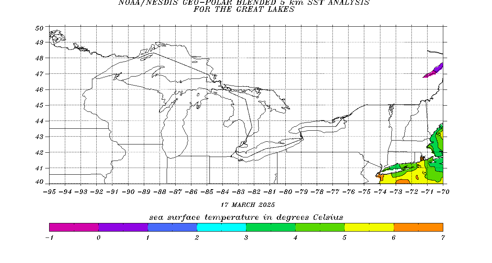

# Sea Surface Temperatures in Gulf of Mexico

> Source: <http://www.ospo.noaa.gov/data/sst/contour/gulfmex.fc.gif>  
> Section: Inland Water/Sea Surface Temps  
> Captured: 2026-08-19 06:00 UTC  
> PDF: [sea-surface-temperatures-in-gulf-of-mexico.pdf](sea-surface-temperatures-in-gulf-of-mexico.pdf) · 1252×670px

---

